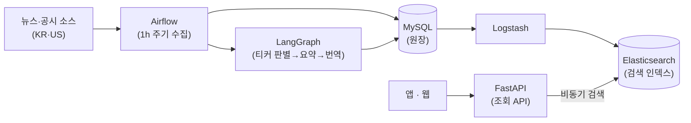

<!-- 인터뷰 기반 작성 (2026-08-26) · DB product.slug=insight 가 detail_path 로 가리킨다.
     출처: 본인 인터뷰 + 블로그 kknaks.github.io/work/improve_1 (성능 수치).
     남은 [Q] 1건은 면접 대비 메모. -->

# 개요

Insight 는 퀀터스(퀀트 트레이딩 앱) 안의 투자 정보 탭이다. 한국·미국 주식의 뉴스와
공시가 여기저기 흩어져 있어 투자자가 종목마다 따로 찾아봐야 했던 것을, 자동 수집과
AI 요약으로 한곳에 모았다. 관심 그룹에 종목을 담아 두면 그 종목들의 뉴스·공시를
요약과 함께 볼 수 있다.

수집(Airflow) → AI 요약·번역(LangGraph) → 조회(FastAPI + Elasticsearch)로 이어지는
파이프라인을 백엔드에서 구축했다.

> 규모 한 줄 — 하루 뉴스 약 3,000건 · 공시 약 1,000건 수집(1시간 주기 배치) ·
> 고부하(300 VUs) 처리량 3.2배 개선 실측(k6)

# 주요기능

## 뉴스·공시를 모은다

| 구분 | 내용 |
|---|---|
| **기능** | 한국·미국 주식의 뉴스·공시를 1시간 주기 배치로 자동 수집 |
| **목적** | 종목마다 흩어진 정보를 사람이 일일이 찾는 일을 없앤다 |
| **효과** | 하루 뉴스 약 3,000건 · 공시 약 1,000건이 자동으로 쌓인다 |

- **Airflow 수집 파이프라인** — 한국·미국 뉴스·공시를 스케줄 배치로 수집, 시간당 1회

## AI 가 요약하고 번역한다

| 구분 | 내용 |
|---|---|
| **기능** | 수집된 뉴스·공시를 LangGraph 파이프라인이 티커 판별 → 요약 → 번역 |
| **목적** | 원문을 다 읽지 않아도, 언어가 달라도 요지를 파악하게 한다 |
| **효과** | 한국·미국 소식을 요약과 함께 양방향 번역(한↔영)으로 본다 |

- **파이프라인 노드** — 수집 → 관련 티커 판별 → 요약 → 번역(한→영, 영→한)
- [Q] 왜 LangGraph 였나 (단순 LLM 호출 대비) — 면접 단골 질문, 답 준비

## 관심 그룹으로 본다

| 구분 | 내용 |
|---|---|
| **기능** | 관심 그룹 종목들의 뉴스·공시 조회, 실시간 인기 종목(US 6 · KR 5) |
| **목적** | 내 포트폴리오 관점으로 정보를 거른다 |
| **효과** | 구독 레벨별 마스킹·페이지네이션으로 앱·웹에서 조회 |

# 핵심 설계

**조회 표면을 MySQL 동기 접근에서 Elasticsearch 비동기 검색으로 옮겼다.**
뉴스·공시 조회가 느려지고 고부하에서 worker timeout 이 반복됐다. 원인은 하나가
아니었다 — 인덱스 부재, 국가별 중복 쿼리(호출 3회), 메모리 레벨 페이지네이션,
캐싱 부재, 동기 블로킹이 겹쳐 있었다. AsyncElasticsearch(타임아웃 30s·재시도 3회)
로 전환하고 정렬·페이지네이션을 ES 레벨로 내렸다.

**원장과 검색 인덱스를 갈랐다.** MySQL 을 원장으로 두고 Logstash 로 Elasticsearch
인덱스에 동기화 — 쓰기(수집·요약)와 읽기(검색)의 부하를 분리했다.

**국가별 중복 쿼리를 집계 쿼리 하나로 접었다.** 실시간 인기 종목이 그룹 확인 +
US + KR 로 3회 호출되던 것을, filter aggregation(US top 6 · KR top 5)을 가진
단일 검색으로 통합 — 호출 3회 → 1회.

**개선을 주장이 아니라 측정으로 증명했다.** k6 로 전환 전후를 같은 조건(Load 50
VUs · Stress 300 VUs)에서 측정 — Load: RPS +90% (21.8→41.4), 평균 응답 −47%
(1,406→739ms), P95 −42%. Stress: RPS +215% (25.7→81.2), 평균 응답 −68%
(5,173→1,637ms), P95 −57% (12,308→5,242ms). 성공률 100% 유지, worker timeout 해소.

**쿼리 빌더로 인젝션 위험을 걷어냈다.** f-string SQL 조립을 파라미터 바인딩 기반
ElasticsearchQueryBuilder(메서드 체이닝)로 교체 — 보안과 가독성을 같이 얻었다.

# 아키텍처

수집·요약이 원장(MySQL)에 쓰고, Logstash 가 검색 인덱스(ES)로 흘리며, 조회 API 는
인덱스만 읽는다 — 쓰기와 읽기가 다른 저장소를 본다.

# 기술스택

| 영역 | 스택 |
|---|---|
| 백엔드 | Python · FastAPI · MySQL · Elasticsearch · Logstash |
| 파이프라인 | Airflow · LangGraph |
| 인프라·운영 | AWS · Azure · k6(부하테스트) |
