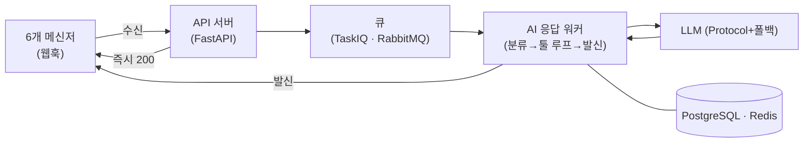

# 개요

Linky 는 여섯 메신저의 수신·발신을 하나의 통합 인박스로 묶고, 그 위에 AI 상담 파이프라인을 얹은 다국어 상담 플랫폼이다. 해외 환자를 받는 의료 클리닉의 상담 창구는 나라마다 메신저가 다르다 — 일본은 LINE, 동남아는 WhatsApp, 글로벌은 Instagram·Facebook, 국내는 KakaoTalk. 직원이 앱 여섯 개를 오가며 응대하면 누락과 지연이 생기고, 언어까지 갈리면 품질이 사람마다 달라진다.

들어온 메시지는 언어를 감지해 실시간 번역되고, AI 가 클리닉별 시술 정보·말투·상담 스킬을 조합해 답변을 만든다. 사람은 모든 대화를 보지 않는다 — AI 가 답하기 어렵거나 답하면 안 되는 대화만 「신호등」이 골라 직원에게 넘긴다. 무게중심은 백엔드다: 수신·발신 파이프라인, AI 응답 워커의 상태 기계, LLM 폴백, 대화 암호화와 마스킹, 사용량·비용 추적이 그 안에 있다.

> 스펙 50+ · 결정→계약→작업 3층 · 메신저 6채널

# 주요기능

## 여섯 메신저를 한 곳에서

| 구분 | 내용 |
|---|---|
| **기능** | 6개 메신저의 대화를 하나의 인박스에서 응대한다 |
| **목적** | 앱 여섯 개를 오가며 생기는 누락·지연을 없앤다 |
| **효과** | 어느 나라 환자든 한 화면에서 놓치지 않고 응대한다 |

- **통합 인박스** — KakaoTalk·Telegram·Instagram·LINE·Facebook·WhatsApp 을 한 화면에서 응대
- **다계정 통합** — 한 클리닉이 나라별로 운영하는 여러 메신저 계정을 같은 대시보드로
- **필터·태그** — 메신저별·계정별·상태별 필터와 태그

## AI 가 답하고 번역한다

| 구분 | 내용 |
|---|---|
| **기능** | 클리닉별 지식·말투·스킬을 조합해 AI 가 답하고, 대화를 실시간 번역한다 |
| **목적** | 응대 품질이 사람·언어에 따라 흔들리지 않게 |
| **효과** | 직원은 한국어로, 환자는 모국어로 같은 대화를 본다 |

- **AI 상담** — 지식(시술 정보)·말투·상담 스킬 3레이어를 분리해 답변 생성, 나라별 문화 레이어까지. 툴 루프로 시술·가격·운영 정보를 카탈로그에서 조회해 반영하고, 대화 누적 요약으로 장기 컨텍스트를 압축한다
- **연속 메시지 병합** — 환자가 연달아 보내면 마지막까지 읽고 답변 1건으로 합쳐 발송
- **번역** — 채팅 본문 실시간 번역, 언어 자동 감지, 시술명·의학 용어는 용어집을 주입해 흔들림 방지. 번역 실패 시 발신 차단(fail-closed) — 잘못 번역된 의료 정보가 나가지 않게

## 위험한 대화는 사람에게 넘긴다

| 구분 | 내용 |
|---|---|
| **기능** | AI 가 답하면 안 되는 대화를 골라 직원에게 인계한다(신호등) |
| **목적** | 컴플레인·부작용·환불을 AI 가 자동 응답하지 않게 |
| **효과** | 사람은 모든 대화가 아니라 넘어온 것만 본다 |

- **자동 인계** — 컴플레인·부작용·환불처럼 사람이 받아야 할 대화를 AI 가 분류해 직원에게
- **기준 편집** — 위험 판단 기준과 감지 키워드를 클리닉이 직접 편집
- **인계 동작** — 인계 시 AI 자동 응답을 끄고 알림, 대화 목록 상단으로 끌어올림. 직원 수동 인계도 가능

## 클리닉을 운영한다

| 구분 | 내용 |
|---|---|
| **기능** | 카탈로그·페르소나·권한·과금 등 상용 운영에 필요한 것을 갖춘다 |
| **목적** | 여러 클리닉·지점·역할을 안전하게 굴린다 |
| **효과** | AI 설정부터 결제·개인정보까지 한 플랫폼에서 |

- **카탈로그·페르소나** — 시술·제품 카탈로그와 다국어 콘텐츠, 응대 페르소나(톤·금지 표현·인사말)·상담 매뉴얼 설정. 엑셀 일괄 등록(검증 후 반영)
- **조직·권한·비용** — 멤버·지점 프로필, 역할 기반 권한, 직원 간 내부 채팅, LLM 사용량·비용 대시보드와 대화 단위 비용 조회, 구독·크레딧 결제와 원장
- **개인정보 보호** — 대화 본문 암호화 저장, AI·번역·로그로 나가는 식별정보 마스킹·복원, 보관기간 경과 자동 파기, 열람·수정·삭제 감사 로그

# 핵심 설계

**메시지 수신과 AI 응답을 큐로 분리했다.** 웹훅은 즉시 200 을 돌려주고, AI 한 턴(컨텍스트 조립 → 분류 → 프롬프트 → 툴 루프 → 발신)은 워커에서 돈다. 재시도가 붙는 큐라 멱등성이 필수였고, `(대화 ID, 답변 대상 메시지 ID)` UNIQUE 제약으로 중복 INSERT 를 DB 가 막게 했다.

**LLM 은 프레임워크 없이 vanilla Python Protocol 로 감쌌다.** LangChain·LangGraph 를 걷어내고 `LLMClient` 인터페이스만 정의했다. 프로바이더별 응답 차이(tool_use 포맷·system 블록·finish_reason)는 어댑터가 흡수하고 호출자는 `complete` 하나만 안다. `FallbackClient` 가 체인을 순차 시도하되 구성은 환경변수라 코드 변경 없이 바꾼다. RAG 도 안 썼다 — 시술 지식은 클리닉이 관리하는 카탈로그라 전량 프롬프트 주입이 더 정확하고 검증 가능했다.

**전 구간을 async 로 세우고 엔진을 lazy 팩토리로 뒀다.** 웹훅 수신·LLM·번역·발송이 전부 I/O 대기라 동기 프레임워크로는 워커가 대기에 묶인다. `asyncpg` 로 맞추고, DB 엔진은 `lru_cache` lazy 팩토리로 두어 테스트에서 워커별로 DB URL 을 갈아끼운 뒤 만들어지게 했다 — import 시점에 평가되면 병렬 테스트의 DB 격리가 깨진다.

**다국어 카탈로그는 JSONB 가 아니라 번역 테이블로 정규화했다.** 언어별 부분 갱신과 검색이 필요했기 때문이다. 마이그레이션은 신규 테이블 생성 → 백필 → 레거시 drop 을 별도 리비전으로 끊어, 한 사이클 운영 안정을 확인한 뒤 마지막 단계를 밟아 롤백 비용을 낮췄다.

# 아키텍처

메신저 웹훅·LLM·번역·발송이 전부 I/O 대기라 전 구간 async 로 세웠다. 핵심은 **수신과 AI 응답을 큐로 분리한 것** — 웹훅은 즉시 응답하고 무거운 한 턴은 워커가 상태 기계로 돈다.

- **API 서버** — 웹훅 수신·발신, 즉시 응답. 도메인 계약만 책임진다
- **큐·워커** — AI 한 턴을 상태 기계로. 멱등성은 `(대화 ID, 대상 메시지 ID)` UNIQUE 로
- **LLM 레이어** — Protocol 인터페이스 + 폴백 체인, 카탈로그는 전량 프롬프트 주입(RAG 없음)
- **인프라** — Azure 관리형(백업·암호화·접근통제를 위임)

# 기술스택

| 영역 | 스택 |
|---|---|
| 백엔드 | FastAPI · Python 3.12 · SQLAlchemy 2.0(async) · PostgreSQL · Alembic |
| 비동기·큐 | TaskIQ · RabbitMQ · Redis |
| AI | Anthropic SDK(직접 호출) · 프로바이더 폴백 |
| 프론트 | Next.js(App Router) · TypeScript · Tailwind · Zustand · shadcn/ui |
| 인프라 | Azure Container Apps · Managed PostgreSQL · Redis · Blob |
