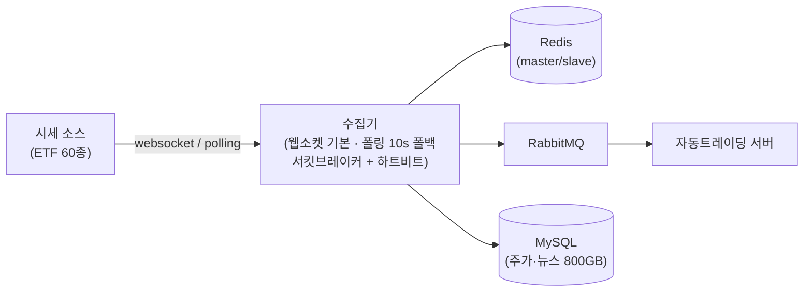

<!-- 인터뷰 기반 작성 (2026-08-26) · DB product.slug=quantus 가 detail_path 로 가리킨다.
     출처: 본인 인터뷰 + 블로그 kknaks.github.io/work/improve_2 (DB 마이그레이션). -->

# 개요

퀀터스는 퀀트 트레이딩 앱이다. 여기서 나는 **실시간 주가 수집 파이프라인**을
구축했다 — 대표 티커 60개 ETF 의 시세를 실시간으로 수집해 자동트레이딩 서버로
전달하는 역할. 트레이딩 판단의 입력 데이터가 전부 이 파이프라인을 지난다.

시세는 끊기면 안 되는 데이터다 — 장 중에 공급이 멈추면 트레이딩 서버가 낡은
가격으로 판단한다. 그래서 수집·전달의 모든 층에 안전장치를 겹쳐 설계했고,
실서비스 6개월 동안 한 번도 끊기지 않았다.

> 규모 한 줄 — ETF 60종 실시간 시세 · DB 800GB(주가·뉴스) · 6개월 무장애 운영

# 주요기능

## 실시간 주가를 흘린다

| 구분 | 내용 |
|---|---|
| **기능** | 대표 티커 60개 ETF 시세를 실시간 수집해 자동트레이딩 서버에 전달 |
| **목적** | 트레이딩 판단의 입력이 되는 시세를 끊기지 않게 공급한다 |
| **효과** | 실서비스 6개월 무장애 — 장 중 데이터 공백 0회 |

- **웹소켓 스트림 수집(기본)** — 60개 ETF 시세를 실시간 스트림으로 수신, 하트비트로 헬스체크
- **서킷브레이커 자동 복구** — 스트림 장애 감지 시 10초 간격 폴링으로 전환, 정상화되면 웹소켓 복귀
- **RabbitMQ 메시징** — 수집한 시세를 큐로 자동트레이딩 서버에 전달
- **Redis master/slave** — 시세 데이터 저장소를 복제 구조로 유지

# 핵심 설계

**웹소켓이 죽어도 시세가 끊기지 않게 — 서킷브레이커 자동 복구.** 기본 수집은
웹소켓 스트림이고, 하트비트로 연결 상태를 감시한다. 장애를 감지하면 서킷을 열고
10초 간격 폴링 수집으로 전환해 공급을 유지하고, 정상화가 확인되면 다시 웹소켓으로
복귀한다 — 사람 개입 없이 복구되는 구조. 실서비스 6개월 동안 스트림이 한 번도
끊기지 않아 서킷이 발동할 일은 없었지만, 「끊겨도 되는 설계」가 있었기에 무장애가
운이 아니라 구조였다.

**전달은 큐로, 저장은 복제로.** 시세 전달은 RabbitMQ 메시징으로 트레이딩 서버와
느슨하게 묶고, 시세 데이터를 담는 Redis 는 master/slave 복제로 유지 — 수집 경로
(서킷브레이커) · 전달 경로(큐) · 저장 계층(복제) 세 층에 안전장치를 겹쳤다.

**서비스를 세우지 않고 클라우드를 옮겼다 — AWS RDS → Azure MySQL 무중단 이관.**
회사의 클라우드 계약 변경으로 주가·뉴스 데이터 800GB 를 옮겨야 했다. 세 방안
(dump→load · DMS · dual write)을 중단 시간·데이터 손실·비용으로 비교해 Azure DMS
를 선택, MySQL binlog 기반 CDC 로 실시간 복제를 걸어 두고 복제가 따라잡은 시점에
접속만 전환 — **다운타임 없이** 이관을 마쳤다. (블로그 /work/improve_2)

# 아키텍처

수집기가 웹소켓(기본)과 폴링(폴백)의 이중 경로로 시세를 받고, RabbitMQ 로
트레이딩 서버에 전달한다. 시세 저장은 Redis 복제 구조가 맡는다.

# 기술스택

| 영역 | 스택 |
|---|---|
| 백엔드 | Python · FastAPI · MySQL · Redis · RabbitMQ · WebSocket |
| 인프라·운영 | AWS · Azure · Azure DMS(CDC) |
