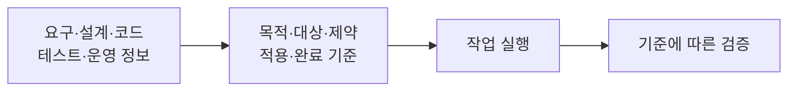

# 실행 가능한 작업 맥락

AI가 일을 수행할 수 있도록 목적·변경 대상·제약·관련 산출물·적용 기준·완료 조건을 연결한 작업 단위다. 자료를 모아 놓는 데서 나아가 무엇을 바꾸고 어떤 근거로 끝낼지를 함께 제공한다.

## 정의

[[S-005-samsung-sds-software-development-ax]]가 제시한 작업 Context는 여섯 요소로 구성된다.

| 요소 | 답할 질문 |
| --- | --- |
| 작업 목적 | 왜 이 변경이 필요한가 |
| 변경 대상 | 어느 시스템·컴포넌트·산출물을 바꾸는가 |
| 범위 제약 | 어디까지 허용되고 무엇을 건드리면 안 되는가 |
| 관련 산출물 | 어떤 요구·설계·코드·운영 정보를 참고하는가 |
| 적용 기준 | 어떤 업무 규칙과 개발 기준을 지키는가 |
| 완료 승인 조건 | 어떤 검증을 통과하고 누가 판단해야 끝나는가 |

여섯 요소는 이 발표의 구성 방식이지 모든 작업에 적용되는 표준 스키마는 아니다. 공통 원리는 실행에 필요한 정보와 판단 기준을 같은 작업에 연결하는 것이다.

정보를 연결할 때는 최신 버전인지, 실행 주체가 접근할 수 있는지, 변경된 요구와 관련 산출물이 일치하는지도 유지해야 한다. 연결 관계의 관리는 [[artifact-traceability]]가 다룬다.

## 발표에서 확인한 예시

보안 정책이 바뀌면 사람은 관련 요구사항과 변경 위치를 찾아가지만 AI에게 그 연결이 없으면 처음부터 탐색하거나 잘못된 변경을 반복할 수 있다. 이때 필요한 것은 문서 전체를 추가하는 것보다 해당 정책이 영향을 주는 대상과 검증 조건을 연결하는 일이다.

발표의 AI DLC는 Agent Skills·Rules·Context를 통해 요구사항·업무 규칙·설계 대상·컴포넌트·테스트·완료 기준을 묶었다. 발표자는 AI 도구만 제공한 경우보다 협업 생산성이 30% 이상 올랐다는 자체 테스트를 설명했다. 표본·기간·측정식이 없어 이 구성의 일반적인 효과로 옮길 수는 없다.

## 왜 중요한가

자료가 많아도 변경 대상과 완료 조건을 사람이 매번 해석해야 한다면 사람은 계속 실행의 연결 지점이 된다. 작업 맥락을 구성하면 AI가 수행할 부분과 사람이 판단할 부분을 나눌 근거가 생긴다.

## 경계와 오해

- 긴 프롬프트나 큰 문맥 창 자체를 뜻하지 않는다. 필요한 정보의 연결과 판단 기준이 핵심이다.
- [[request-context]]는 요청 실행 중 사용자·테넌트 같은 값을 공유하는 런타임 컨테이너다. 여기서는 수행할 업무의 의미와 완료 기준을 다룬다.
- 맥락에 권한을 적었다고 접근 통제가 집행되지는 않는다. 실행 계층의 권한 검사는 별도로 필요하다.
- 완료 조건을 명시해도 검증기가 그 조건을 제대로 검사하는지는 별도 문제다. 모델의 완료 선언을 검증 결과로 대신할 수 없다.
- 관련 문서가 바뀌면 작업 맥락도 낡을 수 있다. 구성 시점과 사용 시점 사이의 갱신 책임을 정해야 한다.

## 함께 보는 개념

- [[artifact-traceability]] — 작업에 필요한 산출물의 관계·버전 추적
- [[loop-engineering]] — 목적과 검증 조건을 반복 실행으로 연결
- [[human-in-the-loop]] — 승인과 정보 보완이 필요한 지점의 대기·재개
- [[engineering-governance]] — 적용할 개발 기준을 전달하고 집행하는 계층

## 출처

- [[S-005-samsung-sds-software-development-ax]] — 신창민 상무·삼성SDS 발표의 사례 2.2. 사진 10–12의 여섯 작업 요소와 AI DLC, 녹취 09:44–13:42의 연결·갱신 설명.
