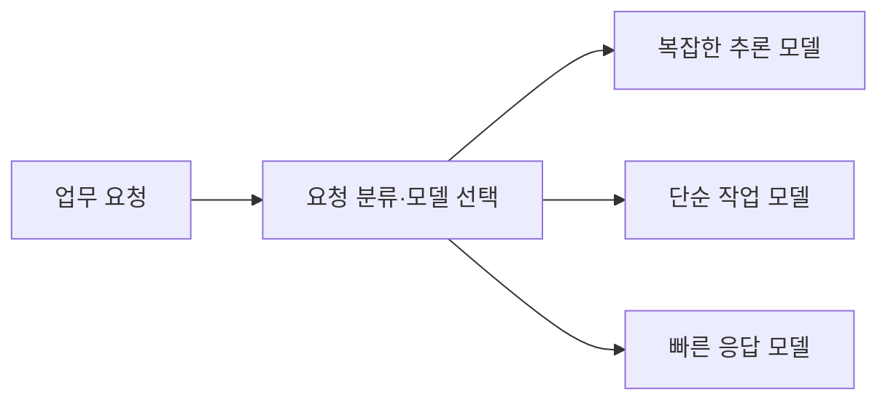

# 모델 라우팅 (Model Routing)

요청의 특성과 요구 조건에 따라 사용할 모델을 선택해 보내는 구조다. 작업마다 필요한 품질·응답 속도·비용이 다를 때 처리 경로를 나눈다.

## 정의

라우팅은 요청 분류와 모델 선택을 연결한다. 분류는 규칙이나 모델로 수행할 수 있으며, 분리할 작업 유형이 명확하고 분류가 충분히 정확할 때 유효하다. [Anthropic의 Routing 설명](https://www.anthropic.com/engineering/building-effective-agents)은 복잡도에 따라 쉬운 요청과 어려운 요청을 다른 모델로 보내는 예를 든다.

| 판단 | 의미 |
| --- | --- |
| 작업 요구 | 추론 난도, 문맥 길이, 품질 기준, 응답 지연 요구 |
| 후보 모델 | 해당 요청을 처리할 수 있는 모델과 특성 |
| 경로 선택 | 요구에 맞는 후보로 요청 전달 |
| 결과 평가 | 선택된 경로의 품질·지연·비용 확인 |

이 도식은 선택 구조를 단순화한 것이다. 모델 유형 수나 선택 알고리즘이 고정된 것은 아니다.

## 발표에서 확인한 예시

[[S-004-samsung-sds-agent-governance]]는 네 유형을 제시했다.

| 유형 | 발표에서 든 작업 |
| --- | --- |
| Frontier | 고난도 추론·큰 컨텍스트 |
| General-Purpose | 일반 질의·요약·문서 작업 |
| Cost-Effective Light | 단순 추출·분류와 반복 업무 |
| Ultra-Fast | 응답 속도가 중요한 실시간 대응 |

사용자는 원하는 일을 말하고 AI Gateway 안의 라우터가 내부·외부 모델을 선택한다. [[S-003-samsung-sds-sustainable-ax]]는 Gateway의 인증·정책·추적 책임과 Router의 선택 책임을 구분했다. 두 발표 모두 라우팅 정확도나 실제 비용 절감률은 제시하지 않았다.

## 왜 중요한가

모든 요청을 가장 큰 모델로 처리하면 단순 업무에도 큰 비용을 지불할 수 있다. 반대로 비용만 보고 작은 모델로 보내면 실패·재시도가 늘거나 요구 품질을 충족하지 못할 수 있다. 따라서 선택의 기준은 단가 하나가 아니라 작업별 요구 조건이다.

## 경계와 오해

- 게이트웨이의 접근 정책과 라우터의 모델 선택은 서로 다른 책임이다. 선택된 모델도 데이터 사용·접근 정책을 충족해야 한다.
- 라우팅만으로 총지출이 제한되지는 않는다. 호출 횟수와 재시도, 사용 주체별 사용량은 [[monitoring]]과 별도 사용 통제로 다룬다.
- 저렴한 모델을 선택했다는 사실만으로 절감 효과를 확정할 수 없다. 비교할 때 라우터 자체 비용과 실패·재시도까지 포함해야 한다.
- 유형 분류가 불명확하거나 분류 정확도가 낮으면 경로를 나눈 이점이 줄어든다. 실제 작업으로 품질과 지연을 평가해야 한다.

## 함께 보는 개념

- [[monitoring]] — 선택된 모델의 호출 비용과 실행 결과 관찰
- [[workflow-orchestration]] — 선택 이후 여러 작업 단계를 연결하는 구조
- [[delegated-authorization]] — 처리 경로가 바뀌어도 유지해야 하는 허용 범위

## 출처

- [[S-004-samsung-sds-agent-governance]] — 사례 2.2의 의도별 네 가지 모델 선택과 사용량 통제. 사진 06, 녹취 03:22.950–06:46.350.
- [[S-003-samsung-sds-sustainable-ax]] — AI Gateway의 정책 집행과 Smart Router의 모델 선택 책임 분리.
- [Anthropic, Building Effective Agents — Routing](https://www.anthropic.com/engineering/building-effective-agents) — 작업 분류와 전문 처리 경로, 분류가 유효한 조건을 설명한 후속 자료.
