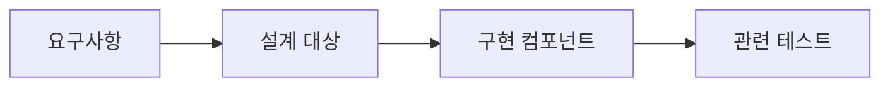

# 산출물 추적성 (Artifact Traceability)

요구사항·설계·코드·테스트 같은 산출물이 어떤 관계로 연결되고 어떤 버전을 근거로 하는지 따라갈 수 있는 성질이다. 변경 대상을 찾거나 구현과 검증의 근거를 확인할 때 사용한다.

## 정의

추적성에는 산출물의 식별, 관계, 변경 상태가 함께 필요하다.

| 구성 | 역할 |
| --- | --- |
| 공통 식별자 | 이름이나 문서 위치가 달라도 같은 산출물을 지목 |
| 관계 정보 | 요구·설계·구현·검증 사이의 연결을 표현 |
| 버전 | 어떤 시점의 산출물끼리 연결돼 있는지 구분 |
| 접근 권한 | 실행 주체가 조회·변경할 수 있는 범위 관리 |

권한은 추적성 자체의 정의라기보다 기업 시스템에서 추적 정보를 사용할 때 함께 관리하는 조건이다. 관계를 따라갈 수 있어도 해당 산출물을 변경할 권한이 생기는 것은 아니다.

도식은 발표에 나온 산출물 관계를 단순화한 예다. 모든 관계가 한 줄이거나 일대일일 필요는 없다. 공통 ID만 부여하고 산출물 간 관계를 기록하지 않으면 변경 영향을 따라갈 수 없다.

## 발표에서 확인한 예시

[[S-005-samsung-sds-software-development-ax]]는 AI DLC에서 요구사항·업무 규칙·설계·컴포넌트·테스트·완료 기준을 연결하는 구조를 제시했다. 공통 식별자와 관계 정보를 두고 버전·권한을 함께 관리하며, 요구가 바뀌면 관련 정보를 갱신해 AI가 오래된 맥락으로 일하지 않도록 한다는 설명이다.

문서·Wiki·RAG·Graph는 이 정보를 구조화하는 수단으로 나열됐다. 특정 그래프 데이터베이스나 변경 전파 알고리즘, 모든 산출물의 자동 갱신이 검증됐다는 뜻은 아니다.

## 왜 중요한가

요구가 바뀌었는데 어떤 코드와 테스트가 영향을 받는지 찾을 수 없으면 담당자의 기억에 의존한다. 관계와 버전을 남기면 변경 대상을 찾고 현재 구현이 어떤 요구와 검증 근거에 연결되는지 확인할 수 있다.

## 경계와 오해

- 검색과 추적은 다르다. 비슷한 문서를 찾았다는 사실만으로 요구와 구현의 관계가 입증되지는 않는다.
- 관계가 저장돼 있어도 최신이거나 정확하다는 보장은 없다. 변경 시 관계의 갱신과 검증이 필요하다.
- 관계를 따라 영향 후보를 찾는 것과 그 대상을 안전하게 자동 수정하는 것은 별도 기능이다.
- 코드 변경 이력만으로 요구·설계·테스트까지 연결되지는 않는다. 버전 관리와 산출물 간 관계는 함께 필요하다.
- 추적 가능한 연결을 유지하는 비용이 든다. 발표는 공통 ID·관계·버전을 제시했지만 갱신 주체와 충돌 처리의 상세는 공개하지 않았다.

## 함께 보는 개념

- [[executable-task-context]] — 연결된 산출물을 특정 작업의 목적·기준으로 구성
- [[engineering-governance]] — 코드와 적용 기준의 근거를 추적해 정책 집행에 사용
- [[git]] — 코드와 문서의 버전 이력을 관리하는 수단

## 출처

- [[S-005-samsung-sds-software-development-ax]] — 사례 2.2, 특히 사진 12의 공통 식별자·관계 정보·버전과 권한·지식 구조화. 녹취 12:20–13:42의 관련 정보 갱신과 연결 설명을 일반화했다.
