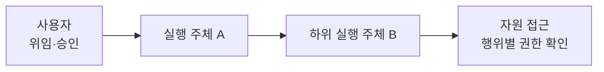

# 위임된 실행의 권한 관리 (Delegated Authorization)

사용자를 대신해 다른 주체가 일을 실행할 때, 누구에게 어떤 자원·행위가 허용됐는지 위임 관계를 따라 확인하는 것이다. 하위 실행으로 넘어가도 원래의 허용 범위를 잃지 않는 것이 핵심이다.

## 정의

위임에는 업무를 맡긴 주체, 대신 실행하는 주체, 접근할 자원, 허용된 행위가 있다. 실행 주체가 시스템에 인증됐다는 사실만으로 그 사용자의 모든 업무를 수행할 수 있는 것은 아니다.

| 판단 지점 | 확인할 것 |
| --- | --- |
| 위임 | 누가 누구에게 어떤 일을 맡겼는가 |
| 하위 호출 | 이 실행 주체가 해당 자원에 요청한 행위를 할 수 있는가 |
| 범위 제한 | 업무를 수행하는 데 필요한 최소 권한인가 |
| 추적 | 실제 실행과 권한 판단을 위임한 사용자까지 연결할 수 있는가 |

최소 권한, 기본 거부, 요청마다 권한 검증은 이 경계를 구현할 때의 일반 원칙이다. 인증과 인가의 구별 및 이 원칙은 [OWASP Authorization Cheat Sheet](https://cheatsheetseries.owasp.org/cheatsheets/Authorization_Cheat_Sheet.html)를 참고한다. 이 문서는 특정 위임 프로토콜을 정의하지 않는다.

## 발표에서 확인한 예시

[[S-004-samsung-sds-agent-governance]]는 사용자 → Agent A → Agent B → 시스템·데이터의 흐름을 제시했다. 사용자의 권한과 하위 Agent·시스템의 권한을 기존 통합 인증 체계와 맞추고, 업무를 작게 나누어 최소 수준의 권한을 부여하며 실행 이력을 추적해야 한다는 설명이다.

이 예시에서 가져오는 것은 위임 후에도 권한 확인과 추적을 이어간다는 원칙이다. 발표에는 토큰 교환 방식, 권한 철회 전파, 세부 정책 평가 알고리즘이 없어 구현 방식으로 확정하지 않는다.

## 왜 중요한가

공용 실행 계정이 가진 권한과 사용자가 맡긴 일의 범위는 다를 수 있다. 위임 관계를 잃으면 실행 계정이 할 수 있다는 이유로 사용자가 허용받지 않은 자원까지 접근하게 된다. 추적 관계가 있어야 사후에도 누구의 요청으로 어떤 경계를 통과했는지 확인할 수 있다.

## 경계와 오해

- 사용자의 자격 증명을 그대로 복사해 전달하는 것이 권한 위임의 정의는 아니다. 전달 방식과 허용 범위의 검증은 구분한다.
- 최소 권한은 권한의 크기를 제한하는 원칙이고, 위임 인가는 대신 실행하는 관계에서 허용 범위를 확인하는 문제다. 둘은 함께 필요하지만 같은 개념은 아니다.
- 로그는 사후 확인 수단이다. 기록이 남는다는 사실만으로 권한 밖의 실행이 차단되지는 않는다.
- 허용된 도구라도 대상 자원과 행위가 권한 밖일 수 있다. 도구 목록 제한에 더해 자원 접근을 검사해야 한다.

## 함께 보는 개념

- [[ai-agent]] — 사용자를 대신해 하위 도구·Agent를 호출하는 실행 주체
- [[resource-scoped-token]] — 특정 자원에 묶인 단명 토큰이라는 별도의 구현 경험
- [[prompt-injection]] — 지시가 오염돼도 실행 권한 경계를 유지해야 하는 이유
- [[ai-asset-inventory]] — 자산 등록과 사용 권한 확인을 연결하는 운영 구조

## 출처

- [[S-004-samsung-sds-agent-governance]] — 사례 2.1의 다단계 Agent 권한과 최소 업무 단위·이력 추적. 녹취 00:00.510–01:15.450과 사진 03이 근거다.
- [OWASP Authorization Cheat Sheet](https://cheatsheetseries.owasp.org/cheatsheets/Authorization_Cheat_Sheet.html) — 인증·인가 구별과 최소 권한·요청별 검증의 일반 원칙. 발표의 내부 구현을 증명하는 자료는 아니다.
