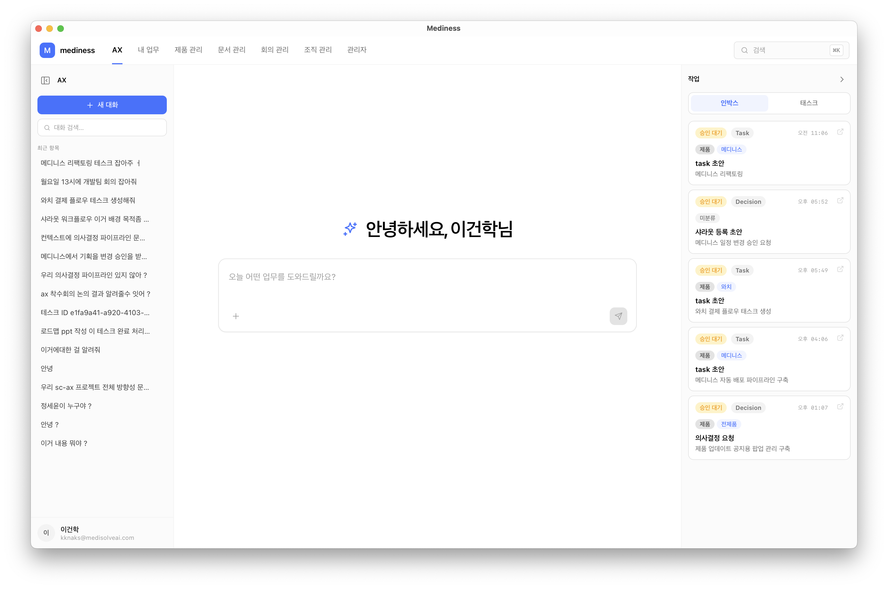
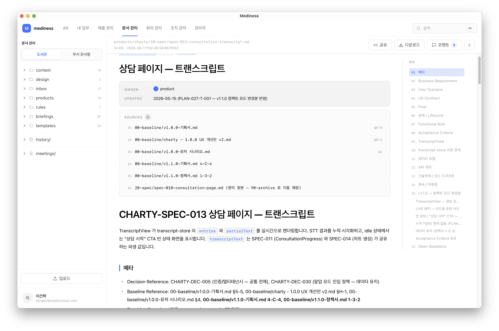
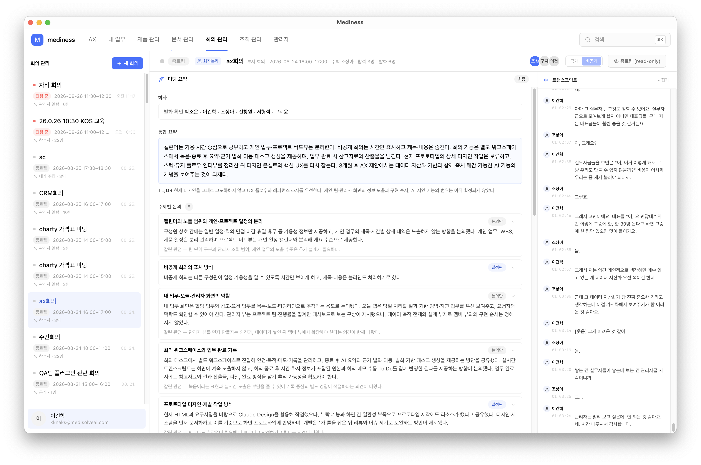
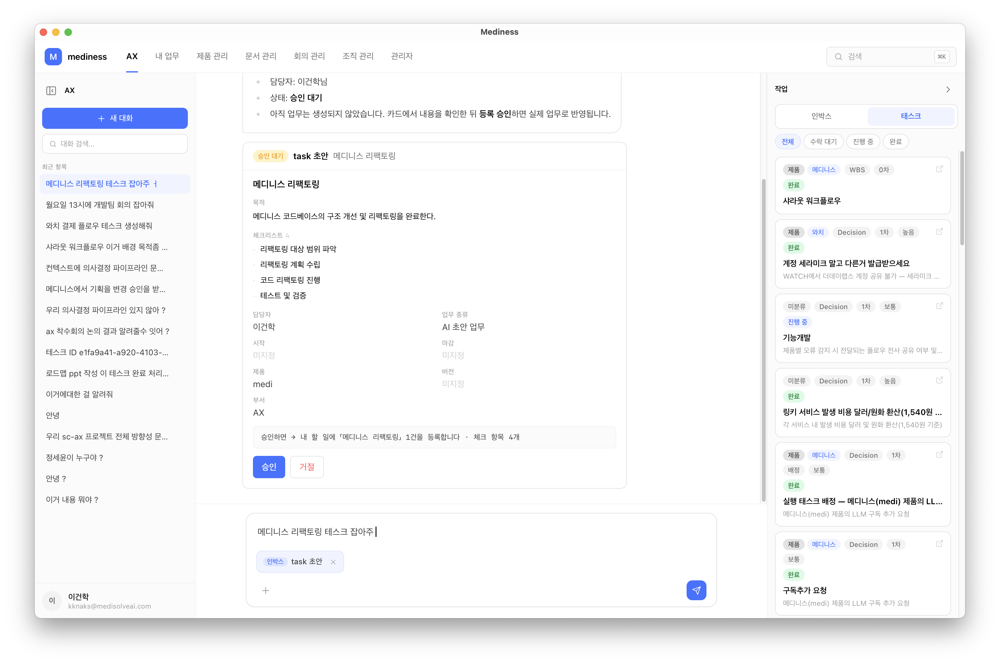
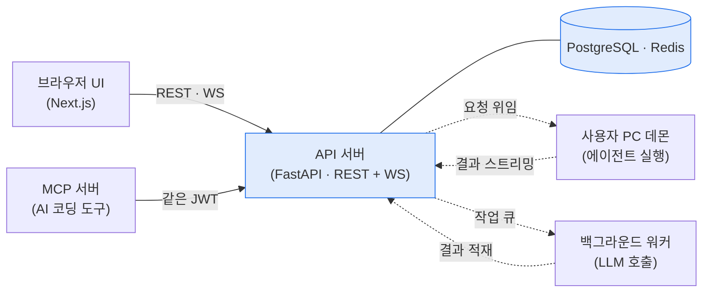

# 개요

Mediness 는 흩어져 있던 사내 지식을 한곳에 모으는 사내 AX 워크스페이스다. 기획·정책 문서는 개발 저장소 안에, 회의는 사람 기억에, 결정은 메신저 스레드에, 제품 진행 상황은 물어봐야 알 수 있게 따로 놀던 것을 하나의 웹 공간으로 모았다. 개발자가 아니어도 필요한 문서를 찾아 읽고, 회의와 결정을 기록으로 남기고, AI 가 그 지식을 근거로 일을 거든다.

도서관에서 시작해 실시간 회의록, 의사결정 원장, 제품 현황 대시보드, 부서 문서 공간, 여러 승인 흐름을 하나로 묶은 Action Runtime 까지 넓혔다. 기능을 문서로 먼저 확정하고 구현했다.

> 기능 명세 60+ · 작업 단위(WP) 100+ · 컴포넌트 4 · 팀 4인

# 주요기능

## 지식을 모은다

| 구분 | 내용 |
|---|---|
| **기능** | 흩어진 제품정보·사내 문서를 한곳에 모으고 찾게 한다 |
| **목적** | 저장소·메신저·개인 PC 에 흩어진 지식을 모아, 개발자가 아니어도 바로 찾아 읽고 함께 검토 |
| **효과** | AI 가 회사 전체를 아는 상태로 일한다 — 자료를 그때그때 먹일 필요 없이 |

- **도서관** — 기획서·정책서·회의 결정·화면 설계서를 폴더 트리로 모으고 검색으로 찾는다. 웹에서 열어 읽고 문장 단위로 댓글, 화면 설계서는 실제 화면처럼 미리 본다
- **부서 스페이스** — 부서별 문서·엑셀을 여럿이 함께 고치고 버전 관리, 다른 부서엔 읽기·댓글로 공유. AI 가 초안을 써 주고 함께 다듬는다

## 일을 기록한다

| 구분 | 내용 |
|---|---|
| **기능** | 회의·결정·제품 진행을 흘려보내지 않고 상태로 남긴다 |
| **목적** | 회의는 기억으로, 결정은 메신저에 묻히던 것을 요약·원장·대시보드로 붙잡아 추적 |
| **효과** | 「언제 뭘 정했나」를 사람이 아니라 시스템이 기억한다 |

- **회의실** — 브라우저에서 녹취를 켜면 실시간 자막이 쌓이고, 끝나면 요약과 할 일·결정·리스크가 자동으로 뽑힌다. 누가 말했는지 구분하고, 회의에서 나온 제안을 결정 사항과 나란히 비교한다
- **의사결정 원장** — 메신저에서 봇을 부르면 AI 가 관련 문서를 찾아 결정 초안을 만들고, 사람이 확정해 등록한다. 승인·보류·폐기와 후속 실행을 상태로 추적하고, 다음 차례인 사람에게 알림이 간다
- **제품 현황 대시보드** — 전사 제품이 어느 단계인지 6단계로 한눈에 보고, 버전·배포·QA 를 연결한다. 일정은 간트로 세우고, 금요일마다 주간 회의록이 자동으로 만들어진다

## AI 가 일한다

| 구분 | 내용 |
|---|---|
| **기능** | AI 가 초안·실행을 맡고, 사람은 승인·확정만 한다 |
| **목적** | 회의 잡기·업무 만들기·결정 등록 같은 일을 말로 시키고, AI 가 초안을 대신 짜게 |
| **효과** | 반복 작업을 AI 에 넘기고, 사람은 「맞는지 확인」에만 집중한다 |

- **채팅 / AX 에이전트** — 로그인하면 바로 AI 채팅방이다. "메디니스 리팩토링 테스크 잡아줘" 처럼 말로 시키면 AI 가 업무 초안을 만들고, 사람이 승인하면 실제 업무로 등록된다. 방을 나가도 작업은 계속되고 다시 들어오면 기록이 그대로 남아 있다
- **Action Runtime** — 「AI 가 초안을 내고 사람이 승인해야 반영된다」는 흐름을 회의 예약·장애 대응·결정·업무에 공통으로 쓰는 하나의 틀로 만들었다. 새 승인형 기능을 이 틀을 조립해 빠르게 붙인다
- **AI 브리핑** — 여러 곳의 소식을 모아 하루 단위로 정리하고, 날짜별로 열어 보거나 자연어로 물어본다

# 핵심 설계

기능을 넘어, 왜 이렇게 지었는지의 판단이다. 규모가 커져도 버티게 한 결정을 넷 골랐다.

**서버는 LLM 을 호출하지 않는다.** 브라우저는 얇은 UI 로 두고, 무거운 에이전트 실행은 사용자 PC 데몬이나 백그라운드 워커가 맡는다. 서버는 상태와 권한만 책임진다. 그래서 모델·에이전트를 바꿔도 서버를 다시 설계하지 않고, LLM 호출 비용·지연이 서버 부하로 번지지 않는다.

**승인형 기능을 한 커널로 묶었다(Action Runtime).** 「AI 가 초안을 내고 사람이 승인해야 반영된다」는 패턴이 회의 예약·장애 대응·의사결정·업무 생성에서 되풀이됐다. 매번 새로 짜는 대신 워크플로 커널과 조각, 조립 계약으로 일반화해서, 새 승인형 기능은 조각을 조립해 만든다.

**권한은 역할이 아니라 capability leaf key 로 판정한다.** 역할 문자열로 판정하면 권한을 넓힐 때마다 코드를 고쳐야 한다. 권한을 잘게 쪼갠 키로 나누고 매핑을 DB 에 둬서, 권한을 바꿀 때 배포 없이 데이터만 고치면 된다.

**문서를 코드보다 먼저 썼다.** 기능 명세 60여 개와 작업 단위(WP) 100여 개를 문서로 확정하고 구현했다. 4인 팀이 한 방향을 보게 하고, 왜 이렇게 짰는지를 코드 밖 문서에 남기려는 것이다.

# 아키텍처

네 컴포넌트로 나뉜다. 핵심은 **서버가 LLM 을 직접 부르지 않는다는 점** — 무거운 실행은 사용자 PC 데몬과 백그라운드 워커가 맡고, 서버는 상태·권한·라우팅만 책임진다.

- **브라우저 UI** — 얇은 화면. 사용자는 여기서 보고 승인만 한다
- **API 서버** — REST + WebSocket 을 한 프로세스에서. 상태·권한·라우팅만 갖는다
- **MCP 서버** — 사내 지식을 AI 코딩 도구에서 같은 권한으로 쓰게 여는 창구
- **PC 데몬 / 워커** — 실제 에이전트·LLM 실행을 맡는다. 서버 밖에서 돈다

# 기술스택

| 영역 | 스택 |
|---|---|
| 백엔드 | FastAPI · PostgreSQL · Redis · SQLAlchemy · Alembic |
| 인증 | JWT · OAuth 2.0 (DCR + PKCE) |
| 프론트 | Next.js (App Router) · TypeScript · Tailwind · shadcn/ui |
| AI · 실시간 | 자체 LLM 호출 패키지 · MCP (Streamable HTTP) · WebSocket · 실시간 STT |
| 운영 | Docker Compose · Prometheus · Loki · Grafana |
| 데스크톱 | Tauri |
