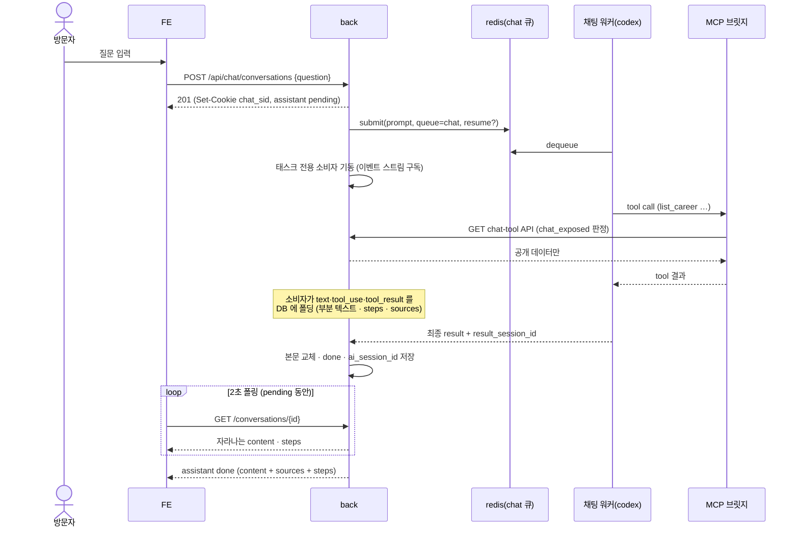
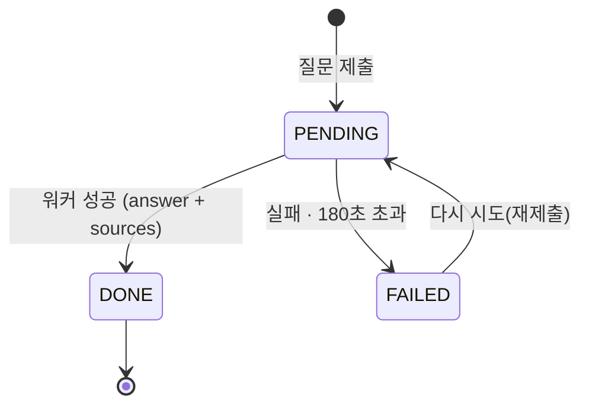

# 채용담당자 채팅 — 홈 히어로 · /chat · 익명 세션 · tool 경계 실행

로그인 없는 방문자(채용담당자)가 홈에서 질문하면, 이력 데이터(career · projects ·
problem)를 tool 로 읽은 AI 가 1인칭으로 대답한다. 이 문서는 채팅의 화면 · 세션 쿠키 ·
공개 API · AI tool 계약을 정한다.

> 기능/정책 묶음 단위의 **외부 계약** 문서다.
> 시각 배치의 SoT 는 `21-html/chat-home-mockup.html`(인터랙티브 시안)이다 — 이 문서의
> Placement 는 그 요약이다.

## 1. Context

### Meta

- Decision reference: KDEV-DEC-025(홈·/chat 구성) · 026(익명 세션) · 027(실행·tool 경계)
- Baseline reference: KDEV-BL-008
- Domain note: `conversation` · `chat_message`(role: `user`/`assistant`,
  status: `pending`/`done`/`failed`) · 근거 카드(source) · 노출 플래그(`chat_exposed`)
- Open questions: §7

### Business Requirement

- 채용담당자가 페이지를 돌아다니지 않고 질문으로 이력을 확인한다.
- 답변은 노출 승인된 데이터에서만 나온다 — 어드민 토글(`chat_exposed`)이 실시간 경계다.
- 대화가 서버에 남아 owner 가 「무엇이 질문되는지」를 본다.

### Scope

In scope:

- 홈 채팅 히어로 · `/chat` 페이지(사이드바 + 대화) · 네비 `00 Ask` 탭
- 익명 세션 쿠키 발급/연장, conversation/message 공개 API, 폴링 계약
- AI 제출(전용 `chat` 큐 · resume · timeout 180초)과 MCP tool 계약, 근거 카드
- 어드민: 문서별 `chat_exposed` 토글

Out of scope:

- 레이트리밋(DEC-026 OQ-1 — **공개 배포 전 별도 결정 필수**)
- WS/SSE 푸시 채널(DEC-027 D6 — 폴딩+폴링으로 시작, 승격은 후속) ·
  어드민 대화 열람 화면(후속 spec 또는 work 에서)
- 기존 랜딩 프리뷰 섹션의 내용 변경

## 2. UX Contract

### Placement

```text
홈(/)                              /chat (대화 중)
+─────────────────────────+       +──────┬──────────────────+
│ topnav (00 Ask … 06)    │       │ 사이드바│ $ ask "질문"      │
│                         │       │+새 대화│ │ 답변 (1인칭)    │
│   안녕하세요, 이건학입니다.  │       │대화목록│ │ [근거 카드 →]   │
│   무엇이든 물어보세요.      │       │       │                 │
│  [~/kknaks — ask  $ __ ] │       │← 홈으로│ [$ 입력 (고정)]   │
│        scroll ↓          │       +──────┴──────────────────+
│ ── 01 About … 05 …(스크롤)│
+─────────────────────────+
```

### U-1. 홈 채팅 히어로

- **상태**: 첫 화면 정확히 한 화면(100vh − 네비). 인사말 + 터미널 입력창 + `scroll ↓` 큐.
  추천 질문 칩 없음(DEC-025 D1). 아래로 스크롤하면 기존 프리뷰 섹션.
- **문구**: 헤더 「안녕하세요, 이건학입니다. / 무엇이든 물어보세요.」 · 서브 「제 커리어·
  프로젝트·문제 해결 기록이 직접 대답합니다.」 · placeholder 「이 사람, FastAPI 실무 경험
  있나요?」 · 하단 「답변은 실제 이력 데이터(career · projects · problem)를 근거로
  생성됩니다」
- **CTA**: 전송 버튼(`전송 ↵`) 또는 Enter. 빈 입력이면 전송하지 않는다(버튼 비활성 아님,
  no-op).
- **기대 결과**: `/chat` 으로 이동, 새 대화가 생성되고 첫 질문이 즉시 전송된 상태로 시작.

### U-2. 네비 `00 Ask` 탭

- **상태**: 전 페이지 공통 topnav 의 첫 메뉴. `/chat` 에 있을 때 액센트 색으로 활성 표시.
- **기대 결과**: 클릭 시 `/chat` 빈 상태(U-3)로 이동.

### U-3. `/chat` 빈 상태

- **상태**: 히어로와 같은 구성(인사말 + 입력창). 스크롤 섹션 · scroll 큐 없음.
  이 방문자의 대화가 있으면 사이드바(U-4)가 함께 보인다.
- **기대 결과**: 질문 전송 시 새 대화 생성 → U-5 로 전환.

### U-4. 사이드바

- **상태**: `＋ 새 대화` 버튼 · 「대화」 라벨 · 이 세션의 대화 목록(최신순) · `← 홈으로`.
  현재 대화는 배경 강조. 대화 제목은 첫 질문에서 딴다(최대 50자, 말줄임).
- **CTA**: `＋ 새 대화` → U-3 빈 상태. 대화 항목 클릭 → 그 대화의 메시지 로드(U-5).
- **기대 결과**: 대화 전환은 페이지 이동 없이 스레드 교체.
- **모바일(≤720px, 2026-08-28 owner 확정 — DEC-025 OQ-3 닫힘)**: 사이드바는 숨기고
  상단 **왼쪽 햄버거** 버튼으로 좌측 드로어 오픈(막 클릭 시 닫힘). 문서 패널은
  **오른쪽 드로어**(화면 대부분 폭 + 막). 컴포저·스레드 스크롤 계약은 동일.

### U-5. 대화 스레드

- **상태**: 질문은 `$ ask "…"` 커맨드 줄, 답변은 좌측 액센트 보더의 출력 블록.
  답변 대기 중: 부분 텍스트가 아직 없으면 타이핑 인디케이터(● ● ●), 부분 텍스트가
  오기 시작하면 **폴링 주기마다 답변이 자라난다**. 답변 끝에 근거 카드 0..n 개 —
  `[유형 태그] 제목 →`. **클릭 동작은 유형별로 갈린다**(2026-08-28 owner 확정 v3):

  | 유형 | 클릭 동작 | 근거 |
  |---|---|---|
  | `company_product` · `career` · `problem` | **우측 문서 패널** — 그 항목의 상세/showcase 를 채팅 옆에 렌더 | 자체 공개 페이지가 없어 패널만이 「그 항목」을 보여준다. url(`/career`)은 패널 안 「페이지에서 보기 →」 보조 링크 |
  | `project` · `note` | 기존대로 **페이지 이동**(`/projects/{slug}` · `/notes/{slug}`) | 자체 상세 페이지가 이미 충실하다 |

  패널은 Claude 아티팩트식 — `/chat` 이 3열(사이드바 · 스레드 · 문서 패널)이 되고,
  채팅이 왼쪽에 그대로 보인다. 렌더러는 career 페이지의 showcase 렌더러 재사용,
  데이터는 공개 `GET /api/career` 번들. 패널 상단 닫기 · 다른 카드 클릭 시 내용
  교체 · 자체 스크롤(스레드 스크롤 계약 유지) · 좁은 화면은 오버레이 폴백.
  **패널 타이포는 컴팩트 스케일**(2026-08-28 owner 피드백) — 480px 폭에 페이지
  스케일 제목이 그대로 오면 너무 크다. 패널 컨테이너 안에서 제목·본문을 한 단계
  이상 줄인다(career 페이지 렌더는 무변경).
- **문구**: 실패 시 「답변 생성에 실패했습니다. 다시 시도해 주세요.」 + `다시 시도` 액션.
- **기대 결과**: 답변 도착 시 인디케이터가 답변으로 교체되고 스레드 하단으로 스크롤.
- **스크롤 계약**(2026-08-28 실사용 피드백으로 추가): `/chat` 은 페이지(body) 스크롤이
  없다 — 네비·사이드바·컴포저는 고정이고 **스레드만 자체 스크롤 컨테이너**다.
  자동 하단 스크롤은 사용자가 하단 근처에 있을 때만 동작한다(bottom-stick) —
  위로 올려 읽는 중에 새 내용이 와도 밀지 않는다.

### U-5a. tool 단계 표시

- **상태**: assistant 메시지 위에 tool 호출 단계 박스 — `⚡ tool · N단계` 헤더 +
  호출별 한 줄(`tool 이름(인자 요약)` + 소요 ms). **`pending` 중에도 폴링으로
  단계가 하나씩 쌓이며 보인다** — 타이핑 인디케이터와 공존. 완료 후에는 접힌
  상태가 기본, 헤더 클릭으로 펼침. tool 호출이 0건이면 박스를 그리지 않는다.
- **문구**: 헤더 우측 상태 뱃지 `진행 중` / `완료`.
- **기대 결과**: 방문자가 「답이 어디서 왔는지」의 과정을 본다 — 근거 카드(결과)와
  짝이 되는 과정 표시다.

### U-6. 컴포저 (하단 고정 입력)

- **상태**: 대화 중 하단 고정. placeholder 「이어서 물어보세요」. **입력 글자는
  스레드 본문과 시각적으로 같은 크기**(2026-08-28 owner 피드백 — 지금은 커서 겉돈다). **답변 대기 중에는
  전송이 잠긴다**(같은 대화 직렬화 — DEC-027 D2). 잠금 중 placeholder
  「답변을 기다리는 중…」.
- **기대 결과**: 전송 시 같은 대화에 질문 추가, U-5 흐름 반복.

### U-7. 어드민 — 채팅 노출 토글

- **상태**: career · project · problem · **product(회사 제품)** 어드민 목록의 각 행에 `채팅 노출` 토글.
  기본 off. 켠 것만 tool 응답에 실린다(DEC-027 D4).
- **기대 결과**: 토글 즉시 반영(export · 캐시 없음). 진행 중 대화에도 다음 tool
  호출부터 적용된다.

## 3. User Scenario

### S-1. 방문자 — 홈에서 첫 질문

1. 방문자가 홈 히어로 입력창에 질문을 치고 Enter.
2. FE 가 `POST /api/chat/conversations` 호출. 세션 쿠키가 없으므로 BE 가 익명 세션을
   생성하고 `Set-Cookie`(§4 쿠키 계약)로 심는다.
3. BE 가 conversation + user 메시지 + assistant 메시지(`pending`)를 만들고 AI 태스크를
   `chat` 큐에 제출, 201 응답.
4. FE 는 `/chat` 으로 이동해 스레드를 그리고 타이핑 인디케이터를 띄운 채 폴링(§4).
5. 답변 도착(`done`) 시 본문 + 근거 카드 렌더.

### S-2. 방문자 — `/chat` 직접 진입

1. 네비 `00 Ask` 클릭 → `/chat`.
2. FE 가 `GET /api/chat/conversations` 호출. 쿠키 없으면 빈 목록(세션을 만들지
   않는다 — DEC-026 D1 「채팅 첫 사용이 발급 시점」).
3. 대화가 있으면 사이드바에 목록, 본문은 빈 상태(U-3). 질문 전송 시 S-1 의 3항부터.

### S-3. 방문자 — 같은 대화에서 이어서 질문

1. 컴포저에 질문 입력(직전 답변 `done` 상태).
2. `POST /api/chat/conversations/{id}/messages`. BE 는 conversation 의
   `ai_session_id` 를 resume 으로 넘겨 제출한다 — AI 가 이전 문맥을 문다.
3. 이후 S-1 의 4~5항과 같다.

### S-4. 방문자 — 새 대화

1. 사이드바 `＋ 새 대화` → 빈 상태(U-3).
2. 질문 전송 시 **새** conversation 생성(S-1 의 3항). 이전 대화와 codex 세션이
   섞이지 않는다(대화 하나 = 세션 하나).

### S-5. 방문자 — 재방문 (쿠키 유효)

1. 30일 안에 재방문. `GET /api/chat/conversations` 가 이전 대화 목록을 돌려준다.
2. 대화 클릭 → `GET /api/chat/conversations/{id}` 로 메시지 복원. 이어서 질문 가능(S-3).
3. 세션 만료는 사용 시마다 연장(sliding)된다.

### S-6. 방문자 — 쿠키 없음/만료 재방문

1. 쿠키가 지워졌거나 만료. 목록이 비어 새 손님과 같다 — 복구 수단은 없다(수용,
   DEC-026 Rationale).

### S-7. 방문자 — 답변 대기 중 추가 질문

1. assistant 메시지가 `pending` 인 대화에 질문 시도.
2. FE 는 컴포저를 잠근다(U-6). 잠금을 우회해 호출하면 BE 가 409 `CONVERSATION_BUSY`.

### S-8. 방문자 — AI 실패/시간 초과

1. 워커 실패 또는 180초 초과 → BE 가 assistant 메시지를 `failed` 로 마감.
2. FE 폴링이 `failed` 를 받으면 실패 문구 + `다시 시도`(U-5).
3. `다시 시도` 는 `POST …/messages/{message_id}/retry` — **그 failed assistant
   메시지를 pending 으로 되돌려**(content·steps 초기화) 같은 질문을 재제출한다.
   새 메시지 줄을 만들지 않는다(스레드에 같은 질문이 두 번 보이지 않는다 —
   2026-08-28 리뷰 W6 환류로 개정). 대상이 failed assistant 가 아니면 404,
   대화에 pending 이 있으면 409. resume 세션이 없거나 죽었으면 새 세션으로
   만든다 — 실패시키지 않는다(DEC-027 D2).

### S-9. 시스템 — 노출 경계

1. AI 가 MCP tool 로 목록/상세를 조회한다. `chat_exposed=false` 행은 목록에서 빠지고
   상세는 404 — AI 에게 「존재하지 않는 문서」다.
2. 근거(`sources`)는 **소비자가 `tool_result` 이벤트에서 추출**한다 — 문서 계열
   tool(`get_career` · `get_project` · `get_problem` · `get_note` ·
   `get_company_product`)의 결과에 실린
   type + slug 로 카드를 만든다. AI 의 자기 신고가 아니라 **실제로 읽은 것**이
   근거가 된다.
3. 기록에 없는 것을 물으면 「기록에 없다」고 답하고 인접한 실제 경험으로 잇는다.
   연봉 · 이직 의사 · 회사 내부 정보 · 연락처 외 개인정보는 답하지 않고 이메일로
   안내한다(§5 프롬프트 계약).

## 4. Interface Contract

### API Contract

| Method | Path | 요약 | 권한 |
|---|---|---|---|
| GET | `/api/chat/conversations` | 내 세션의 대화 목록(최신순) | 공개(세션 쿠키) |
| POST | `/api/chat/conversations` | 대화 생성 + 첫 질문 제출. 세션 없으면 발급 | 공개 |
| GET | `/api/chat/conversations/{id}` | 대화 상세(메시지 목록) — 폴링 대상 | 공개(소유 세션만) |
| POST | `/api/chat/conversations/{id}/messages` | 이어서 질문 | 공개(소유 세션만) |
| POST | `/api/chat/conversations/{id}/messages/{message_id}/retry` | 실패한 답변 재시도 | 공개(소유 세션만) |
| PATCH | `/api/admin/chat-exposure/{kind}/{id}` | `chat_exposed` 토글 | admin |

### Request / Response

- `GET …/conversations` → 200 `{conversations: [...]}` (목록 봉투 — 2026-08-28
  WORK-023 구현으로 확정)
- `POST …/conversations` — req `{question: string}` → 201
  `{conversation: {id, title, createdAt}, messages: [user, assistant(pending)]}`
- `GET …/conversations/{id}` → 200 `{conversation, messages: [...]}`.
  message: `{id, role, status, content, sources: [{type, slug, title, url}],
  steps: [{tool, argsSummary, durationMs, calledAt}], createdAt}`.
  **`pending` 중에도 `content`(부분 텍스트 누적)와 `steps` 가 소비자 폴딩으로
  채워진다** — 2초 폴링이 이걸 그대로 그리면 답변이 자라나고 단계가 쌓인다
  (U-5 · U-5a). `done` 에서 `content` 가 최종 본문으로 교체된다.
- `POST …/{id}/messages` — req `{question}` → 201 `{messages: [user, assistant(pending)]}`
- **폴링**: assistant 가 `pending` 인 동안 FE 가 `GET …/{id}` 를 2초 간격으로 부른다.
  `done`/`failed` 로 바뀌면 중단.
- **세션 쿠키**: 이름 `chat_sid` · httpOnly · `SameSite=Lax` · `Secure` · Max-Age 30일.
  값은 서버 발급 불투명 토큰(UUID). 사용(요청)마다 만료 연장.

### Validation

| 필드 | 규칙 |
|---|---|
| `question` | trim 후 1자 이상 1,000자 이하 |

### Case Matrix

에러 본문은 이 레포 관례대로 `{"detail": "<에러 코드>"}` 다(2026-08-28 WORK-023 확정).

| 에러 코드 | 백엔드 출력 | 프론트 출력 | 표시 위치 |
|---|---|---|---|
| `EMPTY_QUESTION` | 422 | (FE 가 선차단 — no-op) | — |
| `QUESTION_TOO_LONG` | 422 | 「질문은 1,000자까지 입력할 수 있습니다」 | 컴포저 아래 |
| `NOT_FOUND` | 404 — 없는 대화 **또는 남의 세션의 대화** | 빈 상태로 이동 | — |
| `CONVERSATION_BUSY` | 409 — pending 있는 대화에 질문 | (FE 가 잠금으로 선차단) | — |
| `AI_FAILED` | message.status=`failed` (폴링 응답) | 실패 문구 + 다시 시도 | 스레드 |
| `AI_TIMEOUT` | 180초 초과 → status=`failed`, code 만 구분 | 위와 동일 | 스레드 |

### Flow



### State / Lifecycle



### Data Contract

- `chat_session` — 익명 방문자 1명. 외부 노출 없음(쿠키가 유일한 손잡이).
- `conversation` — `{id, title, createdAt}`. `ai_session_id` 는 내부 필드(비노출).
- `chat_message` — `{id, role: user|assistant, status: pending|done|failed, content,
  sources[], steps[], createdAt}`.
- 근거 카드 `source` — `{type: career|project|problem|note|company_product, slug,
  title, url}`. url 은 해당 공개 페이지 경로. `company_product` 의 url 은 **`/career`**
  — 제품 자체의 공개 페이지는 없지만 제품이 속한 회사 경력 표면이 있다(2026-08-28
  owner 피드백: 화살표 있는 카드가 안 눌리면 안 된다. fix5 의 null 결정을 뒤집음).
  url null 은 여전히 허용값이다(링크 없는 카드).
- tool 단계 `step` — `{tool, argsSummary, durationMs, calledAt}`. 기록 주체는
  소비자(이벤트 폴딩 — §5). 노출은 assistant 메시지에 한한다.
- 컬럼 · 인덱스 · FK 전문은 코드/migration 이 SoT.

### Tool Contract (AI ↔ back — MCP)

전 tool read-only · 인자는 slug/limit 뿐 · 경로 인자 없음(DEC-027 D3). **노출 판정식은
「공개 표면 조건(visible 등 그 표면의 공개 조건) ∧ `chat_exposed`」다**(2026-08-28
실측 확정 — visible=false 프로젝트가 chat_exposed 만으로 tool 에 실려 근거 카드가
404 페이지를 가리켰다. D3 원칙상 공개 표면에 없는 것은 tool 에도 없어야 한다).
목록 tool 은 판정식을 통과 못 한 행을 빼고, 상세 tool 은 404 를 준다.

공개 문서 루트(2026-08-28 owner 피드백으로 확정): 제품 상세는 **summer-star 와
company 모두 `showcase.md` 가 공개 자료다**. company 는 **showcase.md 한 파일만**
루트에 넣는다 — `log/`(작업 회고)·README 등 회사 내부 기록은 여전히 루트 밖(404)이다.
경로는 `para/projects/company/` 와 **`para/archive/company/`**(전 회사 제품 —
charty·linky·quantus 등, 채용담당자 질문의 핵심) 둘 다다.

회사 제품 tool(2026-08-28 WORK-023 fix3 조사로 확정): 회사 제품은 `project` 가 아니라
**`product` 표**에 산다. 전용 tool 2종을 둔다 — `list_company_products`(노출 행만) ·
`get_company_product(slug)`(showcase md). `product` 에 `chat_exposed`(기본 false)를
더하고 어드민 토글 대상에 product 를 추가한다(U-7 확장). slug 는 실제 컬럼을 쓴다.

slug 규약(2026-08-28, WORK-023 질문으로 확정): career·problem 은 slug 컬럼이 없어
**결정적 합성 slug** 를 쓴다 — career = `<company.slug>-<career.id>`,
problem = `problem-<problem.id>`. 나머지(project·note·content·algorithm)는 실제 slug
컬럼. 합성 slug 는 서버가 id 로 복원해 노출 판정하며, 파싱 실패·미존재·미노출은
전부 동일한 404 다(존재 여부가 새지 않는다). career·problem 근거 카드의 url 은
아이템 상세 페이지가 없으므로 공개 표면 경로로 간다 — career·problem 모두 `/career`
(problem 은 career 타임라인 번들 안에서 그려진다). `source.url` 은 nullable.

| tool | 인자 | 반환 요약 |
|---|---|---|
| `get_profile` | — | 이름 · 위치 · focus · stack · email |
| `list_career` | — | 기간 · 직함 · 조직 · 요약 (노출 행만) |
| `get_career` | `slug` | 상세 md 본문 |
| `list_projects` | — | 제품 표면 카드 (노출 행만) |
| `get_project` | `slug` | showcase md 본문 |
| `list_problems` | — | problem 목록 (노출 행만) |
| `get_problem` | `slug` | problem 상세 md |
| `search_notes` | `query` | 공개 학습노트 검색 |
| `get_note` | `slug` | 노트 본문 |
| `list_company_products` | — | 회사 제품 표면(노출 행만) |
| `get_company_product` | `slug` | 회사 제품 showcase md |
| `list_contents` / `list_algorithms` | — | 공개 목록 |

## 5. Implementation Rules

- **직렬화**: 한 conversation 에 `pending` assistant 는 최대 1개. 위반 요청은 409.
  다른 conversation 끼리는 병렬 허용.
- **AI 제출**: `queue=chat` · 모델 **`gpt-5.6-terra`**(정식 표기 필수 — 축약형은 400) ·
  timeout 180초. 최종 `result` 텍스트가 답변 본문이다(output schema 없음 — 근거는
  폴딩이 만든다). resume 은 `conversation.ai_session_id`, 없거나 죽었으면 새 세션 +
  최근 메시지 동봉(DEC-027 D2). 시스템 프롬프트는 프롬프트 본문 앞에 조립해 싣는다.
- **소비자 폴딩**(DEC-027 D6): 제출 직후 태스크 전용 상주 소비자가 이벤트 스트림을
  구독해 DB 에 폴딩한다 — `text` 는 부분 누적(재구독 시 초기화 후 재적재), `tool_use`/
  `tool_result` 는 `tool_use_id` 멱등 upsert(짝에서 `durationMs`), `init` 의 세션 id 로
  `ai_session_id` 확정, 최종 `result` 로 본문 교체 + `done`. 중복 수신은 정상 경로 —
  같은 이벤트를 두 번 받아도 같은 결과여야 한다. `argsSummary` 는 소비자가 만들고
  길이를 제한한다 — 인자 원문을 그대로 노출하지 않는다.
- **에이전트 표면**(DEC-027 D5): MCP 는 별도 HTTP 서버. 제출 단위 `-c` 오버라이드로
  URL · turn 전용 Bearer 토큰 · tool allowlist · 툴별 `approval_mode="approve"` 를
  싣고, `features.shell_tool=false` · `web_search="disabled"` · `features.apps=false` ·
  `sandbox=read-only` 로 MCP 밖의 손을 전부 끈다. turn 토큰은 마감 시 폐기
  (best-effort). tool 서버는 slug 를 `detail_path` 로 해석하되 공개 문서 루트 밖이면
  거부.
- **프롬프트 계약**: ① 1인칭(「저는」— DEC-027 OQ-4). ② tool 로 확인한 것만 말한다 —
  기록에 없으면 없다고 한다. ③ 연봉 · 이직 의사 · **미공개** 회사 내부 정보(미공개
  스펙 · 내부 구성 · 기밀) · 개인정보는 거절하고 이메일 안내. **회사 제품의 공개
  소개는 거절 대상이 아니다** — 회사 제품 tool(`list_company_products` ·
  `get_company_product`)로 적극 안내한다(2026-08-28 개정 — 「회사 내부 정보」라는
  넓은 문구가 세션 선례와 결합해 공개 showcase 까지 사리는 것이 관측됐다).
  ④ 이력과 무관한 요청은 부드럽게 이력으로 돌린다.

## 6. Verification

### Acceptance Criteria

- [ ] 쿠키 없는 방문자가 홈에서 질문 → 쿠키가 심기고 `/chat` 에서 답변을 받는다
- [ ] `GET /conversations` 는 쿠키가 없으면 세션을 만들지 않고 빈 목록을 준다
- [ ] 같은 대화 이어서 질문 시 AI 가 이전 문맥을 안다(resume 확인)
- [ ] `＋ 새 대화` 는 새 conversation · 새 codex 세션이다
- [ ] 남의 세션의 conversation id 로 조회하면 404
- [ ] `pending` 중 같은 대화에 질문하면 409, FE 는 컴포저 잠금으로 선차단
- [ ] 180초 초과 시 `failed` 로 마감되고 다시 시도가 동작한다
- [ ] `chat_exposed=false` 문서는 목록 tool 에서 빠지고 상세 tool 이 404 를 준다
- [ ] 어드민 토글 직후의 tool 호출부터 반영된다(재시작 · export 없음)
- [ ] 근거 카드는 tool_result 폴딩에서 나온 실제 조회분만 실린다
- [ ] tool 단계 박스가 `pending` 중 폴링으로 쌓이고, 완료 후 접힘/펼침이 동작한다
- [ ] 단계의 tool 이름 · 소요 ms 는 이벤트 폴딩 기록과 일치한다(AI 신고 아님)
- [ ] pending 중 부분 텍스트가 폴링으로 자라나고, done 에서 최종 본문으로 교체된다
- [ ] 답변은 1인칭이고, 기록에 없는 질문에 지어내지 않는다 (수동 QA)
- [ ] 홈 히어로가 한 화면이고 스크롤 시 기존 프리뷰 섹션이 이어진다

## 7. Open Questions

- OQ-1: 모바일에서 사이드바 표시 방식(접힘/드로어) — DEC-025 OQ-3
- OQ-2: 폴링(2초) 유지 vs SSE 승격 — 응답 지연 실측(DEC-027 OQ-2)과 함께 판단
- OQ-3: 시스템 프롬프트 상시 주입 범위 — 프로필 + 커리어 개요 1단락으로 시작,
  tool 호출 횟수 실측 후 조정(DEC-027 OQ-3)
- OQ-4: 어드민 대화 열람 표면(목록 · 검색) — 후속 work
- OQ-5: 근거 카드는 생성 시점 스냅샷 — 어드민이 나중에 항목을 숨기면 저장된 카드
  링크가 404 로 남는다(2026-08-28 fix8 감사에서 명시). **v1 수용** — 발생 조건이
  드물고(숨김 + 과거 대화 재열람), 렌더 시점 생존 확인은 폴링마다 추가 조회라
  비싸다. 실제로 문제가 되면 ⓑ(죽은 링크는 링크 없이 그림)로 좁혀 재론
