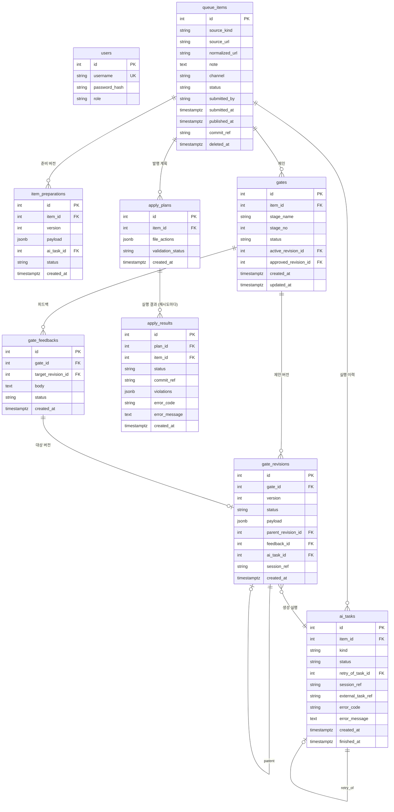

# Database Architecture

규칙: `para/projects/project.md`

> ERD, 테이블 정보, 도메인 데이터 구조를 관리한다.
> 여러 spec/work가 공유하는 장기 구조만 둔다. schema/migration 전문은 코드가 SoT다.

관련 decision: [[decision-009-app-db-foundation-and-admin-auth|KDEV-DEC-009]](DB 토대) · [[decision-011-approval-gate-chain|KDEV-DEC-011]](게이트 체인) · [[decision-012-draft-storage-and-publish-boundary|KDEV-DEC-012]](저장 경계)

## 저장 원칙

```text
Markdown file  = 발행된 지식의 본문 SoT      (옵시디언·git·검증기가 같은 파일을 본다)
PostgreSQL     = 운영 상태 · 승인 워크플로 · 승인 전 초안
Redis          = 휘발성 큐/락/세션. 영속 워크플로 SoT로 쓰지 않는다
```

[[decision-009-app-db-foundation-and-admin-auth|KDEV-DEC-009]] D1이 정한 *"운영 데이터는 DB, 지식그래프는 파일 SoT"*의 확장이다.

### SoT 경계

| 데이터 | SoT | 비고 |
|---|---|---|
| 발행된 노트 본문 | Markdown 파일 | `resources/source/` · `resources/concept/` · `persona/{contents,daily,career,posts}/` · `inbox/`(입구) |
| 그래프 엣지 | Markdown (`[[]]` / `up:`) | `_graph.json`은 재생성 가능한 캐시 |
| 관리자 계정 | PostgreSQL `users` | 세션은 쿠키 JWT(무상태) |
| 승인 큐 항목 | PostgreSQL `queue_items` | **승인 전에는 레포에 파일이 없다** |
| 자동 준비 산출물 | PostgreSQL `item_preparations` | 수집 원문·요약. 박제(비덮어쓰기) |
| 게이트 · 제안 버전 | PostgreSQL `gates` · `gate_revisions` | v1 read-only + v2 |
| 피드백 | PostgreSQL `gate_feedbacks` | 재생성을 유발한 지시 |
| AI 실행 이력 | PostgreSQL `ai_tasks` | 실패 포함 불변 이력 |
| 발행 계획·결과 | PostgreSQL `apply_plans` · `apply_results` | 커밋 참조·검증 위반 기록 |
| Slack 스레드 세션 | Redis | 휘발. 유실돼도 큐가 SoT라 복구 가능 |

**미커밋 md를 작업트리에 둘 수 없다** — `POST /admin/reload`의 `git reset --hard origin/main`이 지운다. 이것이 초안을 DB에 두는 강제 조건이다.

## Design Rules

- 접속 계층은 **SQLAlchemy 2.0 async** + `postgresql+psycopg`(psycopg3 async). 마이그레이션은 Alembic(동기 CLI 유지) — [[decision-009-app-db-foundation-and-admin-auth|KDEV-DEC-009]] D2 v2.
- PK는 기존 `users`를 따라 **정수 identity**를 쓴다. 외부에 노출할 식별자가 필요해지면 별도 공개 컬럼을 두고 PK를 노출하지 않는다.
- 변경 가능한 운영 테이블은 `created_at` / `updated_at`을 갖는다.
- 상태 컬럼은 **텍스트 + `CHECK` 제약**으로 시작한다. DB enum 타입은 쓰지 않는다(값 추가마다 마이그레이션 비용).
- **AI payload와 발행 계획은 JSONB**로 둔다. 조회 키가 되는 값은 JSONB에 숨기지 않고 컬럼으로 승격한다.
- **경로는 레포 루트 기준 상대 경로만** 저장한다. 절대 경로 금지.
- **이력 테이블은 불변이다.** `gate_revisions` · `ai_tasks` · `item_preparations` · `apply_results`는 내용을 UPDATE로 덮어쓰지 않는다(상태 전이 컬럼 제외). 재시도·재생성은 **새 행**을 만들고 원 행을 참조한다.
- 게이트당 승인 버전은 **하나만** 존재한다 — partial unique 제약으로 강제한다.
- 게이트당 검토 가능 버전도 하나만 유지하되, 이는 **애플리케이션 sweep**이 담당한다([[spec-009-gate-feedback|KDEV-SPEC-009]] §5). 전이 순간의 경합 때문에 DB 제약으로 강제하지 않는다.
- 삭제는 **soft delete**다. `deleted_at`을 두고 행을 지우지 않는다.

## ERD



`users`는 파이프라인 테이블과 FK로 연결하지 않는다. 단일 관리자 모델이라 소유자 구분이 불필요하고, `submitted_by`는 Slack 사용자 식별자를 담을 수 있어 문자열로 둔다.

## Table Index

| Table | Domain | Purpose | Source |
|---|---|---|---|
| `users` | auth | 관리자 계정 | [[spec-006-admin-auth\|KDEV-SPEC-006]] |
| `queue_items` | pipeline | 지식 입력 접수와 항목 lifecycle | [[spec-007-approval-queue\|KDEV-SPEC-007]] |
| `item_preparations` | pipeline | 자동 준비(수집·요약) 산출물 버전 | [[spec-007-approval-queue\|KDEV-SPEC-007]] |
| `gates` | pipeline | 스테이지별 게이트 컨테이너 | [[spec-008-gate-chain\|KDEV-SPEC-008]] |
| `gate_revisions` | pipeline | AI 제안 버전 (실제 승인 대상) | [[spec-009-gate-feedback\|KDEV-SPEC-009]] |
| `gate_feedbacks` | pipeline | 재생성을 유발한 사용자 지시 | [[spec-009-gate-feedback\|KDEV-SPEC-009]] |
| `ai_tasks` | pipeline | AI 실행 이력 (실패·재시도 포함) | [[spec-009-gate-feedback\|KDEV-SPEC-009]] |
| `apply_plans` | publish | 발행 계획 (파일 액션 목록) | [[spec-010-apply-executor\|KDEV-SPEC-010]] |
| `apply_results` | publish | 발행 결과 (커밋 참조·검증 위반·실패 사유) | [[spec-010-apply-executor\|KDEV-SPEC-010]] |

## Domain Index

| Domain | Description | 소유 spec |
|---|---|---|
| auth | 관리자 인증·세션 | [[spec-006-admin-auth\|KDEV-SPEC-006]] |
| pipeline | 접수 → 준비 → 게이트 체인 → 승인 | SPEC-007 / 008 / 009 |
| publish | 계획 검증 → 파일 쓰기 → 커밋 → 결과 기록 | [[spec-010-apply-executor\|KDEV-SPEC-010]] |

## 상태 컬럼 소유

각 상태기계의 정의는 해당 spec이 SSOT다. 여기서는 **어느 테이블이 어느 상태를 소유하는지**만 둔다.

| 테이블 | 소유 상태 | 정의 |
|---|---|---|
| `queue_items.status` | 항목 lifecycle | [[spec-007-approval-queue\|KDEV-SPEC-007]] |
| `gates.status` | 사용자가 보는 단계 상태 | [[spec-008-gate-chain\|KDEV-SPEC-008]] |
| `gate_revisions.status` | AI 제안 버전 상태 | [[spec-009-gate-feedback\|KDEV-SPEC-009]] |
| `ai_tasks.status` | AI 실행 상태 | [[spec-009-gate-feedback\|KDEV-SPEC-009]] |
| `apply_results.status` | 발행 결과 | [[spec-010-apply-executor\|KDEV-SPEC-010]] |

**넷은 서로 다른 상태다.** 게이트가 `검토 대기`인데 실행은 `succeeded`이고 버전은 `reviewable`인 것이 정상이다. 하나로 합치면 *"AI가 실패한 것"*과 *"사람이 아직 안 본 것"*이 구분되지 않는다.

## 마이그레이션 순서

| # | 리비전 | 내용 | 상태 |
|---|---|---|---|
| 0001 | `create_users` | 관리자 계정 | 적용됨 (WORK-011) |
| 0002 | `create_queue` | `queue_items` · `item_preparations` · `ai_tasks` | 적용됨 (WORK-014 P1) |
| 0003 | `create_gates` | `gates` · `gate_revisions` · `gate_feedbacks` | 적용됨 (WORK-014 P1) |
| 0004 | `fk_set_null` | 가로지르는 nullable FK 8개 → `ON DELETE SET NULL` | 적용됨 (WORK-014 P3) |
| 0005 | (예정) | `apply_plans` · `apply_results` | Executor work |

리비전 전문은 `app/back/alembic/versions/`가 SoT다. 모델(`core/models.py`)과 리비전은 **손으로 쓴 두 벌의 진실**이라 갈라질 수 있어, `alembic check`를 테스트로 걸어 드리프트를 상시 차단한다(`tests/test_queue_schema.py::test_models_and_migrations_agree`).

0003은 **순환 FK**를 만든다(`gates ↔ gate_revisions ↔ gate_feedbacks`). 테이블을 먼저 만들고 앞을 가리키는 FK 3개를 뒤에 붙이며, downgrade는 제약부터 역순으로 뗀다.

삭제 규칙은 두 종류다. **소유 관계**(`item_id`·`gate_id`)는 `CASCADE`, **층을 가로지르는 nullable 참조**(`gate_revisions.ai_task_id`, `gates.active_revision_id`, `ai_tasks.retry_of_task_id` 등 8개)는 `SET NULL`이다. 가로지르는 참조를 CASCADE로 두면 실행 행 하나가 지워질 때 그걸 참조하던 제안 버전까지 사라져 **이력 불변 전제가 깨진다.** 그냥 두면(RESTRICT) 항목 삭제가 FK 순환으로 실패한다 — 0004가 고친 문제다.

## Open

- `queue_items.normalized_url` 정규화 규칙(쿼리 파라미터 제거 범위) — 중복 판정 정확도에 직결한다. 큐 work에서 정한다.
- 파이프라인 정의(스테이지 목록)를 DB 테이블로 둘지 코드 상수로 둘지 — [[spec-008-gate-chain|KDEV-SPEC-008]] §7. DB로 가면 `pipelines`·`pipeline_stages` 2개가 추가된다.
- JSONB payload가 커질 때(교안 전문 등)의 크기 상한·압축 여부. 관찰 후 판단한다.
