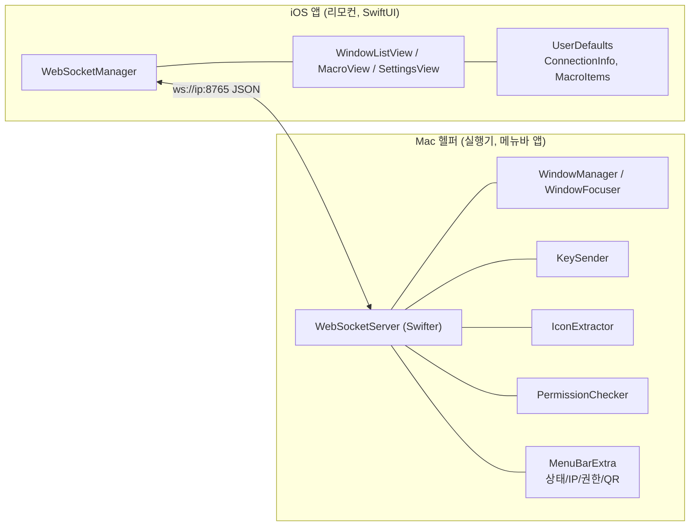

# System Architecture

규칙: `para/projects/project.md`

> iOS 앱(리모컨)과 Mac 헬퍼(실행기)가 같은 Wi-Fi LAN에서 WebSocket/JSON으로 통신한다. 실제 창 제어·키 입력은 100% Mac 헬퍼가 담당한다.
> 원본: `mac-remote/doc/Architecture.md` §4~§7.

## Overview



## Components

| Component | Responsibility | Notes |
|---|---|---|
| Mac 헬퍼 | 창 관리, 키 입력, WS 서버, 메뉴바 앱 | Swift, AppKit, CoreGraphics, Accessibility — 모든 실행 로직 담당 |
| iOS 앱 | 리모컨 UI, WS 클라이언트 | Swift, SwiftUI — 표시 + 명령 전송만 |

### Mac 헬퍼 모듈

| 모듈 | 책임 | 의존 | 기술 |
|------|------|------|------|
| WindowManager | CGWindowList 호출, 필터링, WindowInfo 반환 | CoreGraphics, AppKit | CGWindowListCopyWindowInfo |
| WindowFocuser | PID 기반 앱 활성화 + AXRaise | AppKit, Accessibility | NSRunningApplication, AXUIElement |
| KeySender | CGEvent 생성 + 전송 | CoreGraphics | CGEvent, CGEventFlags |
| IconExtractor | 앱 아이콘 → PNG base64 | AppKit | NSRunningApplication.icon |
| PermissionChecker | Accessibility + Screen Recording 확인 | ApplicationServices | AXIsProcessTrusted |
| WebSocketServer | WS 서버, JSON 파싱, 메시지 라우팅, 주기적 push | Swifter | |
| QRGenerator | IP:포트 → QR 이미지 | CoreImage | CIFilter |
| MenuBarApp | 메뉴바 UI, 앱 라이프사이클 | SwiftUI | MenuBarExtra |

### iOS 앱 모듈

| 모듈 | 책임 | 의존 | 기술 |
|------|------|------|------|
| WebSocketManager | WS 연결/해제/수신/송신/재연결 | Foundation | URLSessionWebSocketTask |
| WindowListView | 창 목록 카드 리스트, focus 전송 | SwiftUI | List, WindowCardView |
| MacroView | 매크로 버튼 그리드, key 전송 | SwiftUI | LazyVGrid |
| SettingsView | QR 스캔, 수동 입력, 권한 표시, 설정 | SwiftUI, AVFoundation | AVCaptureSession |
| StatusIndicator | 연결 상태 표시등 | SwiftUI | Circle + color |

## External Integrations

| System | Purpose | Direction | 참조 스펙 |
|---|---|---|---|
| iOS ↔ Mac | WebSocket / JSON 양방향 | 양방향 | [[spec-005-websocket-protocol\|MRT-SPEC-005]] |
| iOS → Mac: listWindows | 창 목록 요청 | 단방향 | [[spec-001-window-list\|MRT-SPEC-001]] |
| iOS → Mac: focus | 창 활성화 요청 | 요청/응답 | [[spec-002-window-focus\|MRT-SPEC-002]] |
| iOS → Mac: key | 키 입력 요청 | 요청/응답 | [[spec-003-key-input\|MRT-SPEC-003]] |
| Mac → iOS: windowList | 창 목록 push (1.5초) | push | [[spec-001-window-list\|MRT-SPEC-001]] |
| Mac → iOS: appIcons | 아이콘 push (새 앱 시) | push | [[spec-004-app-icon\|MRT-SPEC-004]] |
| Mac → iOS: permissions | 권한 상태 | 요청/응답 | [[spec-006-permissions\|MRT-SPEC-006]] |

## Key Flows

데이터 흐름 (원본 §7):

```
iOS 사용자 액션 ──► WebSocketManager ──JSON──► WebSocketServer
                                                    │
                        ┌───────────────────────────┤
                        ▼                           ▼
                 listWindows?               focus/key?
                        │                           │
                 WindowManager           WindowFocuser/KeySender
                        │                           │
                 CGWindowList               CGEvent / AXUIElement
                        │                           │
                        ▼                           ▼
                 windowList JSON ─────────► WebSocketServer ──push──► iOS UI 갱신
                                                    │
                                             IconExtractor
                                                    │
                                           appIcons push ──► iOS 아이콘 캐시
```

- 연결: iOS가 QR/수동 입력으로 받은 `ws://ip:8765`에 접속 → Mac이 full icon snapshot + windowList push 시작 ([[spec-007-pairing\|MRT-SPEC-007]], 1.0.1에서 snapshot 보강).
- 주기 push: Mac이 1.5초마다 windowList를 push해 iOS 목록을 자동 갱신.
