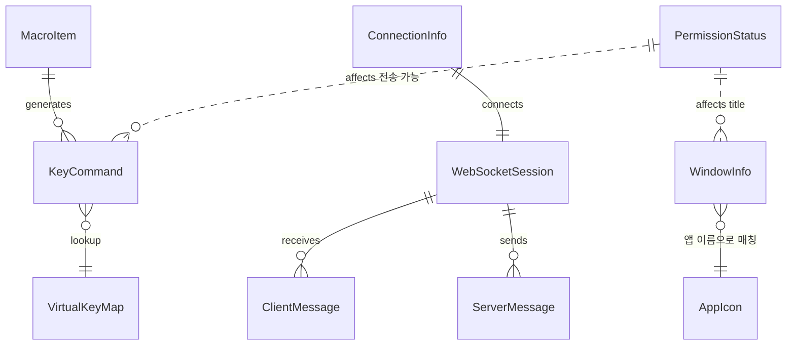

# Database Architecture

규칙: `para/projects/project.md`

> **이 제품은 DB를 쓰지 않는다.** ([[v1_0_1-decision-001-websocket-protocol\|MRT-DEC-001]] 맥락의 핵심 제약) 영속 저장은 iOS의 UserDefaults 수준으로 충분하다. 대부분의 엔티티는 런타임 메모리에만 존재한다.
> 원본: `mac-remote/doc/Architecture.md` §2.

## ERD

관계형 스키마는 없다. 아래는 런타임 엔티티 간 논리 관계다.

## Entity Index

| Entity | 설명 | 생명주기 | 저장 | 참조 스펙 |
|--------|------|----------|------|-----------|
| WindowInfo | 창 정보 (id, app, title, pid, frontmost) | 런타임 | 메모리 | [[v1_0_1-spec-001-window-list\|MRT-SPEC-001]] |
| KeyCommand | 키 입력 요청 (key, modifiers) | 런타임 | 메모리 | [[v1_0_1-spec-003-key-input\|MRT-SPEC-003]] |
| VirtualKeyMap | 가상 키코드 매핑 테이블 | 정적 | 코드 내 상수 | [[v1_0_1-spec-003-key-input\|MRT-SPEC-003]] |
| AppIcon | 앱 아이콘 (appName, iconData base64) | 런타임+캐시 | 메모리 | [[v1_0_1-spec-004-app-icon\|MRT-SPEC-004]] |
| PermissionStatus | 권한 상태 (accessibility, screenRecording) | 런타임 | 메모리 | [[v1_0_1-spec-006-permissions\|MRT-SPEC-006]] |
| ConnectionInfo | 페어링 정보 (host, port) | 영속 | **UserDefaults** | [[v1_0_1-spec-007-pairing\|MRT-SPEC-007]] |
| MacroItem | 사용자 정의 매크로 (이름, key, modifiers) | 영속 | **UserDefaults** | [[v1_0_1-spec-003-key-input\|MRT-SPEC-003]] |
| ClientMessage | iOS→Mac 요청 (action + 파라미터) | 런타임 | 메모리 | [[v1_0_1-spec-005-websocket-protocol\|MRT-SPEC-005]] |
| ServerMessage | Mac→iOS 응답 (type + 페이로드) | 런타임 | 메모리 | [[v1_0_1-spec-005-websocket-protocol\|MRT-SPEC-005]] |

## Invariants

- 영속 저장은 iOS UserDefaults에 `ConnectionInfo`, `MacroItem`만. 그 외 모든 상태는 재연결/재시작 시 재생성된다.
- 멀티 Mac 동시 연결 불가 — 1:1 연결만. `ConnectionInfo`는 단일 host:port.
- 같은 앱의 여러 창은 `AppIcon`을 공유(앱 이름 매칭)하므로 창은 `title`로 구분한다.

## Related Specs / Works

- 데이터 모델 정의: [[v1_0_1-spec-001-window-list\|MRT-SPEC-001]], [[v1_0_1-spec-003-key-input\|MRT-SPEC-003]], [[v1_0_1-spec-004-app-icon\|MRT-SPEC-004]], [[v1_0_1-spec-005-websocket-protocol\|MRT-SPEC-005]]
