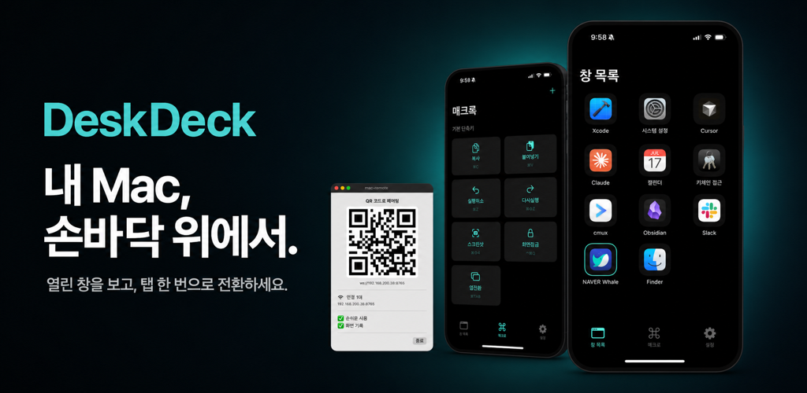
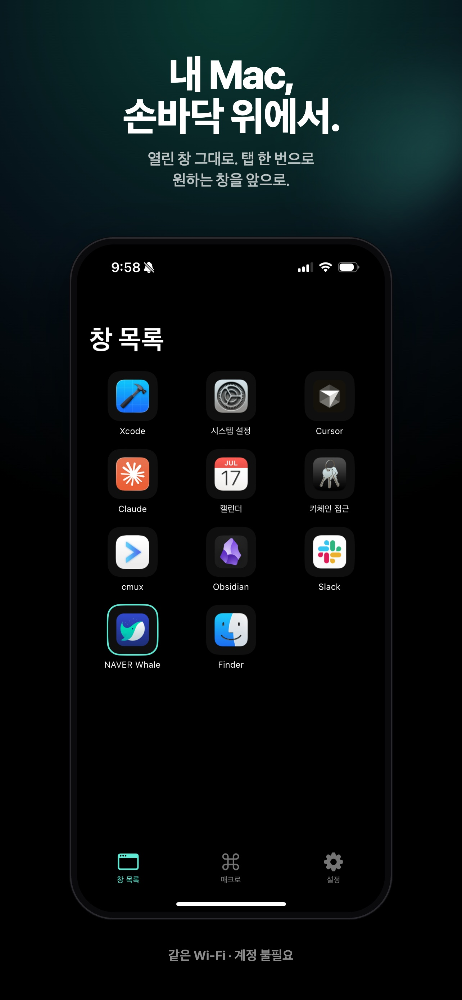
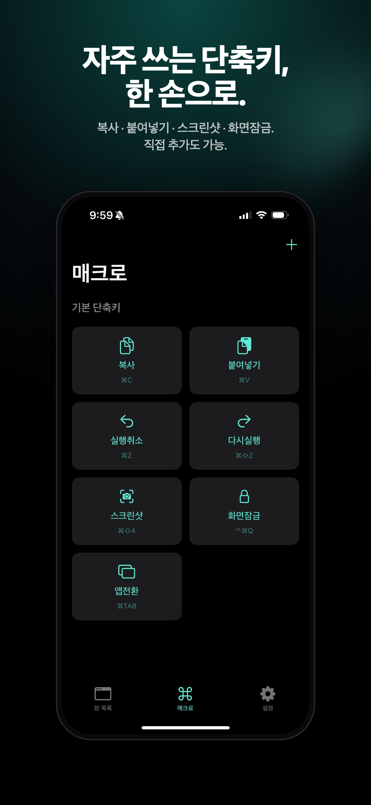
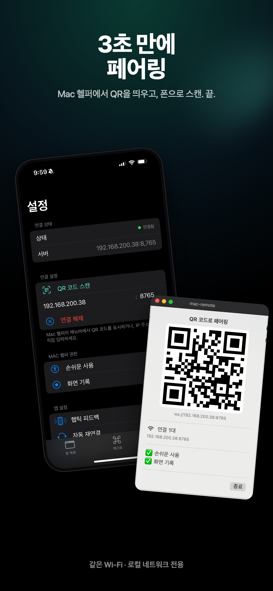
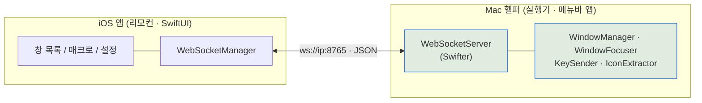

# 개요

DeskDeck 은 iPhone 을 Mac 의 리모컨으로 쓰는 앱이다. 여러 창을 오갈 때 단축키를 외우거나 트랙패드 제스처를 반복하는 대신, 손에 든 iPhone 에서 열린 창을 직접 보고 눌러 전환하고, 자주 쓰는 단축키는 버튼 하나로 실행한다. 창 제어와 키 입력은 전부 Mac 쪽 헬퍼가 맡고, iPhone 은 보고 누르는 리모컨 역할만 한다.

터미널에서 창 목록·키 입력을 먼저 검증한 뒤 iOS 앱을 붙였다. 두 컴포넌트는 같은 Wi-Fi 안에서 WebSocket 으로 통신하고, 인터넷을 거치지 않는다. 처음 이름은 MacRemote 였으나 App Store 심사(상표 규정)에 맞춰 DeskDeck 으로 개명해 출시했다.

> 기능 명세 7 · 작업 단위 17 · 결정 기록(ADR) 5 · 컴포넌트 2 · 개인 프로젝트 1인 · App Store 출시(1.0.1)

# 주요기능

## 창을 골라 전환한다

| 구분 | 내용 |
|---|---|
| **기능** | Mac 에 열린 창을 iPhone 목록에서 보고 탭 한 번으로 전환한다 |
| **목적** | 어느 창이 열려 있는지 iPhone 에서 바로 보고 고르게 |
| **효과** | Mac 을 직접 만지지 않고 원하는 창을 즉시 앞으로 가져온다 |

- **창 목록** — 열린 창이 앱 아이콘·제목과 함께 카드로 나열되고, 최전면 창은 테두리로 표시된다. Mac 이 1.5초마다 목록을 보내 새 창이 열리고 닫히는 것이 자동으로 반영된다
- **탭으로 전환** — 카드를 누르면 그 창이 앞으로 온다. 앱 활성화를 먼저 하고, 같은 앱의 여러 창은 개별 창을 직접 끌어올려 정확히 그 창으로 간다
- **앱 아이콘 식별** — 화면을 캡처하지 않고 설치된 앱의 아이콘만 읽어 카드에 얹는다. 추가 권한이 필요 없고, 앱당 한 번만 보내 캐싱한다

## 단축키를 버튼으로 실행한다

| 구분 | 내용 |
|---|---|
| **기능** | 키 조합을 매크로 버튼에 담아 iPhone 에서 실행한다 |
| **목적** | 복사·붙여넣기·앱전환 같은 단축키를 외우지 않고 버튼으로 |
| **효과** | 자주 쓰는 키 조합을 한 손으로 누른다 |

- **매크로 그리드** — ⌘C·⌘V·⌘Z·⌘⇧4·⌘⇥ 같은 기본 프리셋을 2열 버튼으로 두고, 키와 modifier 를 골라 직접 추가한다. 버튼을 누르면 Mac 이 그 조합을 실제 키 입력으로 재현한다
- **Hold 모드** — 앱전환(⌘⇥)처럼 modifier 를 누른 채로 여러 번 눌러야 하는 조작을 위해, 버튼을 누르면 중앙에 오버레이가 떠서 ◀ ▶ 로 다음·이전을 고르고 ✓ 로 확정한다. 도중에 연결이 끊기면 눌린 modifier 가 자동으로 풀린다

## 붙이고 상태를 유지한다

| 구분 | 내용 |
|---|---|
| **기능** | QR 로 Mac 에 붙고, 끊겨도 알아서 다시 잇는다 |
| **목적** | IP 를 외우지 않고 한 번에 연결하고, 끊김을 신경 쓰지 않게 |
| **효과** | 연결이 살아 있는지 표시등 하나로 알 수 있다 |

- **QR 페어링** — Mac 메뉴바에 뜨는 QR 을 iPhone 으로 스캔하면 연결된다. QR 이 어려우면 IP 를 직접 입력해도 되고, 한 번 맺은 연결 정보는 저장된다
- **자동 재연결** — 하트비트로 연결을 확인하다가 끊기면 2초 간격으로 다시 잇는다. 상단 표시등이 연결됨·재연결 중·미연결을 초록·노랑·빨강으로 보여 준다
- **권한 안내** — 창 제목 수집(화면 기록)과 키 입력(손쉬운 사용)에 필요한 권한 상태를 Mac 메뉴바와 iOS 설정에서 확인하고, 무엇을 켜야 하는지 안내한다

# 핵심 설계

**서버를 창을 가진 쪽에 둔다.** 창 목록을 실시간으로 밀어 주려면 서버가 클라이언트에 먼저 말을 걸 수 있어야 한다. HTTP 폴링은 간격만큼 늦고 빈 응답이 낭비라, WebSocket 으로 양방향 연결을 맺고 창 목록을 가진 Mac 헬퍼를 서버로 두었다. 모든 기능 메시지(창 목록·전환·키·아이콘·권한)가 이 단일 JSON 규약 위에서 돈다.

**화면을 캡처하지 않는다.** 창을 식별하는 데 스크린샷 대신 앱 아이콘만 쓴다. 화면 캡처는 권한 부담이 크고 지속 캡처는 성능도 무겁지만, 앱 아이콘은 권한 없이 읽히고 앱당 하나라 캐싱이 효율적이다. LAN 전용과 함께, 프라이버시 부담을 처음부터 설계에서 뺐다.

**Hold 모드를 상태로 다룬다.** 앱전환처럼 modifier 를 누른 채 다른 키를 반복해야 하는 조작은 단발 키 전송으로 표현되지 않는다. Mac 헬퍼가 현재 눌려 있는 modifier 집합을 상태로 들고, 이후 키 입력의 flags 에 합성한다. 끊김을 대비해 클라이언트 연결이 사라지면 눌린 modifier 를 자동으로 해제한다.

**외부 의존성을 최소화한다.** Mac 헬퍼의 WebSocket 서버는 순수 Swift 경량 라이브러리 Swifter 하나만 쓰고, iOS 는 표준 URLSessionWebSocketTask 로 외부 의존성 없이 구현했다. 창 제어·키 입력은 CoreGraphics·Accessibility 같은 네이티브 API 로 직접 붙였다.

# 아키텍처

두 컴포넌트로 나뉜다. iOS 앱은 보고 누르는 리모컨이고, 실제 창 제어·키 입력은 100% Mac 헬퍼가 맡는다. 둘은 같은 Wi-Fi LAN 에서 `ws://ip:8765` WebSocket/JSON 으로 통신한다.

- **iOS 앱** — 창 목록·매크로·설정 화면과 WebSocket 클라이언트. 표시와 명령 전송만 한다
- **Mac 헬퍼** — 메뉴바 앱. WebSocket 서버로 명령을 받아 창 목록 수집(CGWindowList), 창 활성화(AXUIElement), 키 입력(CGEvent), 아이콘 추출을 실행한다
- **연결** — iOS 가 QR·수동 입력으로 받은 주소에 붙으면 Mac 이 아이콘 스냅샷과 창 목록을 보내고, 이후 1.5초마다 목록을 push 한다

# 기술스택

| 영역 | 스택 |
|---|---|
| iOS 앱 (리모컨) | Swift · SwiftUI · URLSessionWebSocketTask · AVFoundation (QR 스캔) |
| Mac 헬퍼 (실행기) | Swift · AppKit · CoreGraphics (CGWindowList · CGEvent) · Accessibility (AXUIElement) · Swifter (WS 서버) |
| 통신 | WebSocket · JSON · LAN 전용 (ws://ip:8765) |
| 배포 | App Store (iOS) · 공증 DMG (Mac 헬퍼, Notarized Developer ID) · macOS 14+ / iOS 17+ |
