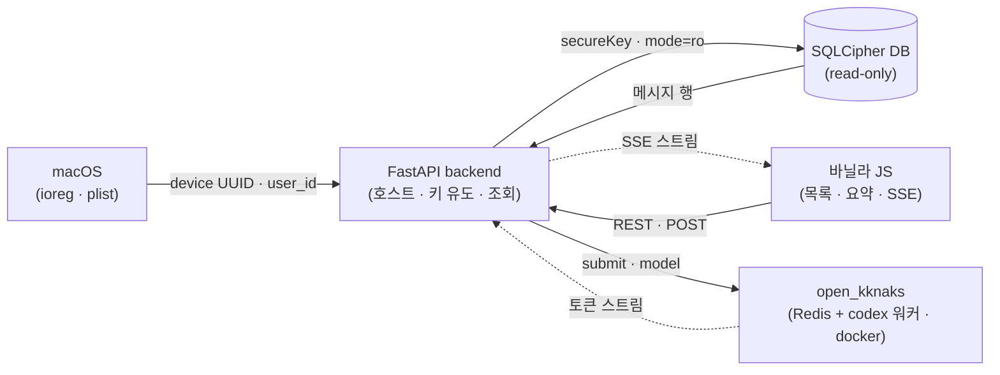

# 개요

mykakao 는 macOS 카카오톡의 대화를 "내보내기" 없이 로컬에서 통째로 가져오는 도구다. 앱 내장 내보내기는 방마다 손으로 눌러야 하고 반복이 안 된다. 여러 단톡방에 흩어진 약속과 일정을 사람이 따라가는 대신, 로컬에 암호화되어 있는 메시지 DB 를 직접 복호화해 전체 방·전체 히스토리를 한 번에 읽는다. 본인 기기에서 본인 대화만 다루는 개인용 도구다.

메시지 추출까지를 먼저 끝내고, 그 위에 대화를 골라 AI 로 요약하는 기능을 붙이는 중이다. 방 하나와 날짜 하루를 고르고 직접 쓴 프롬프트를 얹으면 그날 대화를 요약해 준다. 프롬프트만 바꾸면 요약에서 일정 추출·할 일 추출로 넓어지는 첫 LLM 체인이고, 최종 목표인 "추출 → 일정 파싱 → 캘린더"로 가는 발판이다. 캘린더 출력은 다음 단계에서 따로 정한다.

> 라이브 검증 631,713 메시지 · 741 방 · 1인

# 주요기능

## 대화를 통째로 가져온다

| 구분 | 내용 |
|---|---|
| **기능** | 내보내기 없이 로컬 DB 를 복호화해 모든 방의 메시지를 읽는다 |
| **목적** | 방마다 손으로 내보내는 반복을 없애고, 여러 단톡방을 한 번에 훑는다 |
| **효과** | 전체 방·전체 히스토리를 한 자리에서 검색하고, 새 메시지도 바로 따라온다 |

- **대화방·메시지 조회** — 복호화한 DB 에서 방 목록과 메시지를 브라우저로 본다. 작성자·시각·본문을 말풍선으로 보고, 내 메시지를 구분한다
- **키워드 검색** — 한국어 키워드로 전체 대화에서 찾는다("회의" 등)
- **실시간 반영** — 카톡에서 새 메시지가 오면 화면에 이어 붙는다(약 1초 지연). 지난 메시지는 되감아 재생할 수 있다

## AI 로 요약한다 (구현 중)

| 구분 | 내용 |
|---|---|
| **기능** | 방·날짜를 골라 그날 대화를 프롬프트대로 요약한다 |
| **목적** | "이 방·이 날짜에 뭐가 중요했나"를 다시 읽지 않고 얻는다 |
| **효과** | 프롬프트만 바꾸면 요약·일정 추출·할 일 추출로 확장된다 |

- **방·날짜 선택** — 대화 목록에서 방 하나와 날짜 하루를 골라 요약 화면으로 넘어간다
- **직접 쓰는 프롬프트** — 요약 방식을 직접 문장으로 적는다. 그날 메시지와 합쳐 LLM 에 넘긴다
- **스트리밍 결과** — 결과가 다 나올 때까지 기다리지 않고 생성되는 대로 화면에 이어진다. 하루치 메시지가 너무 많으면 오래된 것부터 잘라내고 얼마를 담았는지 알린다

# 핵심 설계

**복호화를 제품 안으로 넣었다.** 카톡 메시지 DB 는 SQLCipher 로 암호화되어 컨테이너 안에 확장자 없는 78자리 hex 파일로 앉아 있다. 외부 CLI(kakaocli)에 런타임을 맡기는 대신, PRAGMA 호환 모드와 키 유도식만 참고로 가져와 자체 키 유도(device UUID + user_id, PBKDF2-HMAC-SHA256)와 표준 sqlcipher 로 직접 열었다. 런타임 의존은 sqlcipher 하나뿐이라 외부 도구 버전에 끌려다니지 않는다.

**user_id 를 역산으로 복구했다.** 키 유도에 필요한 user_id 자동 탐지가 설치본에서 빗나갔다. 카톡 plist 에 남는 `*REVISION` 값이 `SHA512(user_id)` 라는 걸 찾아, 활성 계정 해시의 원본을 SHA512 brute-force(0~10억, C/CommonCrypto)로 역산했다. 계산한 DB 파일명이 실제 파일명과 맞으면 user_id 가 맞다는 것으로 검증한다.

**읽기 전용으로 열고, 실시간은 폴링으로 붙였다.** live DB 를 건드리지 않으려면 read-only 로 열어야 하는데 `immutable=1` 은 WAL 을 무시해 연 시점 스냅샷에 고정되고 새 메시지가 안 보였다. `mode=ro` 로 바꿔 WAL 을 읽게 하고, 요청마다 새 연결(NullPool)을 써서 매 요청 최신 커밋을 보게 했다. SSE 는 전용 연결로 1초 폴링하며 새 행만 밀어 보낸다. 진짜 write 훅은 아니지만 개인용 데모에는 충분하다.

**LLM 호출은 본진 라이브러리에 맡겼다.** codex 를 직접 subprocess 로 부르지 않고, kknaks_profile 본진이 쓰는 `open_kknaks`(Redis 브로커 + codex provider 워커)를 그대로 재사용해 큐·워커·env 패턴을 다시 짜지 않았다. 결과는 기존 SSE 인프라로 릴레이한다. 브라우저의 `EventSource` 는 GET 전용이라 프롬프트를 실을 수 없어, 프롬프트는 `POST /api/summarize` 로 보내 task_id 를 받고 스트림은 그 id 로만 구독하도록 두 단계로 나눴다.

# 아키텍처

호스트 네이티브 backend 하나에 docker 로 띄운 요약 워커를 붙인 구조다. 카카오 DB 는 macOS 호스트 경로에 있고 키 유도가 `ioreg`·plist 같은 호스트 전용 API 에 기대서 backend 를 컨테이너에 넣지 못한다. 그래서 backend 는 호스트에서 돌고, LLM 실행만 docker(Redis + codex 워커)로 분리해 노출 포트로 연결한다.

- **FastAPI backend** — 키 유도·복호화·조회를 맡는 제품의 심장. 호스트에서 돈다
- **바닐라 JS 프론트** — 대화 목록·요약 화면. SSE 로 실시간·스트리밍을 받는다
- **open_kknaks 워커** — Redis 큐로 받은 요약 작업을 codex 로 실행한다. docker 로 분리
- **SQLCipher DB** — 카톡의 로컬 암호화 DB. `mode=ro` 로만 연다

# 기술스택

| 영역 | 스택 |
|---|---|
| 추출·백엔드 | FastAPI · SQLAlchemy · sqlcipher3 · PBKDF2-HMAC-SHA256 / SHA512 키 유도(C 가속) |
| 프론트 | 바닐라 JavaScript · SSE(EventSource) |
| AI | open_kknaks(codex provider) · codex CLI(gpt-5.5) |
| 인프라 | Docker Compose(Redis 7 + codex 워커) · 호스트 스크립트 |
| 대상 | macOS(Apple Silicon) · 카카오톡 v26.1.1 |
