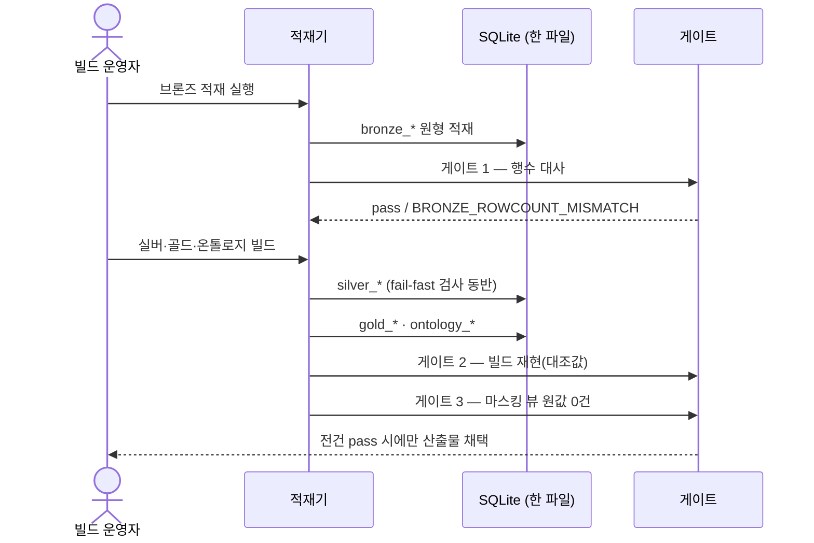
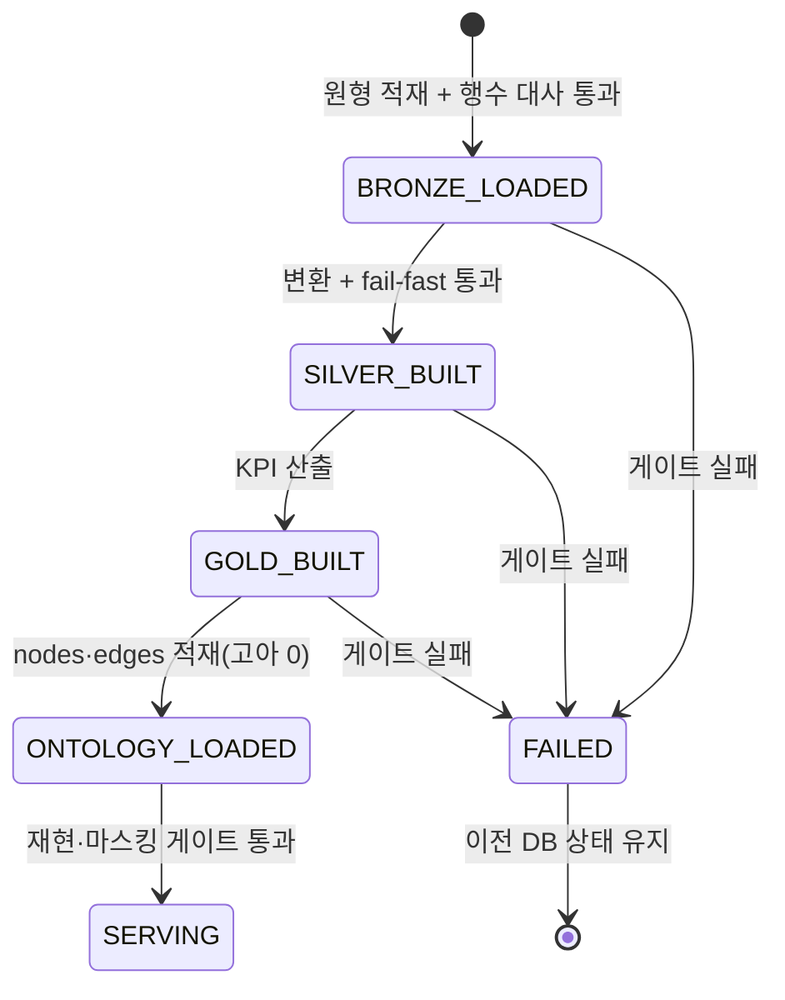

# 데이터 계층 계약 — 메달리온 전 계층 DB · 마스킹 뷰 · 적재 게이트

SQLite 한 DB 에 브론즈·실버·골드·온톨로지를 전부 담고, 그 위에 **마스킹 뷰**를 세워
사람과 에이전트가 같은 경계를 지나게 한다. 이 문서는 계층별 테이블 목록과 경계, PII
마스킹 표기, 적재·재현 게이트의 수치 기준을 정한다.

> 기능/정책 묶음 단위의 **외부 계약** 문서다. 상위 소비자(조회 도구 · API · 화면)가 이
> 문서만 읽고 어느 테이블·뷰를 무슨 이름으로 부를지 알 수 있어야 한다.
> **컬럼 전문·DDL·인덱스는 여기 두지 않는다** — 스키마의 SoT 는 코드와 마이그레이션이고,
> 변환 규칙의 SoT 는 기록 03·04·05 다.

## 1. Context

### Meta

- Decision reference: [[decision-001-db-medallion-all-layers|DEC-001]](전 계층 DB · 빌드 이식) ·
  [[decision-002-pii-masking-boundary|DEC-002]](원값 보존 + 표면 마스킹)
- Baseline reference: [[baseline-001-demo-agent-app|BASE-001]]
- 사실의 SoT: 기록 02(브론즈 실사·행수) · 03(글로서리·PII 반입 규칙) · 04(실버 변환·게이트) ·
  05(골드 KPI·대조값) · 07(nodes/edges)
- Domain note: 계층 접두어 `bronze_` · `silver_` · `gold_` · `ontology_`, 마스킹 뷰 접두어
  `v_`, 게이트 판정 `pass` / `fail`
- Open questions: §7

### Business Requirement

- **어느 계층이든 원본까지 내려갈 수 있어야 한다.** 골드에서 본 수치가 실버 행으로,
  실버 행이 브론즈 원형으로 이어지는 경로가 데이터 자체로 존재해야 데모가 성립한다.
- **재처리·감사가 가능해야 한다.** 브론즈 원형이 남아 있어야 빌드를 다시 돌려 같은 값이
  나오는지 검증할 수 있다.
- **원값은 어떤 표면으로도 나가지 않는다.** 화면·API·에이전트가 같은 마스킹 뷰를 지난다.
- 다음 단계(수집 파이프라인)가 이 구조를 갈아엎지 않아야 한다 — 빌드는 파일이 아니라 DB 를
  읽는다.

### Scope

In scope:

- 계층별 테이블 목록과 이름 규약, 계층 간 읽기 방향(경계)
- PII 마스킹 뷰의 대상·표기 형식·소비 규칙
- 적재 게이트(행수 대사) · 빌드 재현 게이트(대조값)의 수치 기준과 실패 시 동작
- 온톨로지 nodes/edges 의 외부 노출 필드와 참조 무결성 기준

Out of scope:

- 컬럼 전문·타입·인덱스·마이그레이션(코드가 SoT) — 변환 규칙 자체는 기록 03·04·05
- 조회 도구의 파라미터·응답(→ [[spec-002-mcp-tools-contract|SPEC-002]])
- HTTP 엔드포인트(→ [[spec-003-api-and-chat-contract|SPEC-003]])
- 화면 표현(→ [[spec-004-three-screens|SPEC-004]])
- 웹 raw 업로드·수집 자동화(DEC-001 Out — 파이프라인 단계)

## 2. UX Contract

**해당 없음** — 이 spec 은 데이터 계층의 계약이고, 화면은 화면 spec 이 갖는다.
단, 마스킹 표기(§4 Data Contract)는 화면에 그대로 노출되는 문자열이므로 이 문서가 SoT 다.

## 3. User Scenario

### S-1. 빌드 운영자 — 브론즈 적재

1. 원천 파일(vegas JSON 235개 · 리뷰 CSV 1건 · nexus CSV 14개)을 읽어 `bronze_*` 테이블에
   **원형 그대로** 적재한다. 값 변환·컬럼 삭제를 하지 않는다.
2. 적재 직후 게이트 1(행수 대사, §6 AC-1)을 실행한다.
3. 한 테이블이라도 원본 행수와 어긋나면 **적재를 실패로 판정하고 중단**한다 — 부분 적재
   상태를 남기지 않는다.

### S-2. 빌드 운영자 — 실버·골드·온톨로지 빌드

1. 브론즈 테이블만 읽어 `silver_*` 를 만든다. 변환 규칙은 기록 04 그대로다.
2. 실버 빌드 중 `visit_status` 가 내원·취소·부도 밖이거나 금액·횟수에 음수가 나오면
   **경고가 아니라 빌드 중단**이다(기록 04 2.3 fail-fast).
3. 실버만 읽어 `gold_*` 를 만들고, 온톨로지 `ontology_nodes`·`ontology_edges` 를 적재한다.
4. 게이트 2(빌드 재현, §6 AC-2)로 기존 CSV 산출물과 대조값이 일치하는지 확인한다.
5. 어긋나면 산출물을 채택하지 않는다 — 이전 DB 상태를 유지하고 실패를 기록한다.

### S-3. 소비자(화면 · API · 에이전트) — 브론즈 드릴다운

1. 소비자가 브론즈 행을 요청한다(예: 「8월 취소 원본 20건」).
2. 요청은 **원 테이블이 아니라 마스킹 뷰**(`v_bronze_*`)로만 받는다.
3. 응답에 실명·전화·생년월일 원값이 없다. 이름은 `김○○`, 전화는 `010-****-1234`,
   생년월일은 `1990-**-**` 형태로만 나간다.
4. 원값을 여는 토글·파라미터는 존재하지 않는다 — 뷰 밖으로 나가는 경로 자체가 없다.

### S-4. 소비자 — 계층 역추적

1. 골드 KPI 값 하나에서 시작해 그 값을 만든 실버 행 집합으로 내려간다
   (예: 일별 매출 → 그날의 `silver_reservations` 결제 내원 행).
2. 실버 행에서 브론즈 원형 행으로 내려간다(예약은 `chart_no` + `resv_date`,
   리뷰는 `review_pk`).
3. 각 단계에서 계산식·변환 규칙의 근거 기록(기록 03·04·05)을 함께 얻는다.

## 4. Interface Contract

### API Contract

**해당 없음** — HTTP 표면은 [[spec-003-api-and-chat-contract|SPEC-003]] 이 갖는다.
이 문서가 정하는 것은 그 아래의 테이블·뷰 이름과 게이트다.

### Data Contract

#### 계층 경계 — 읽기 방향

```text
원천 파일 ──적재──▶ bronze_*  (원형·불변·읽기 전용)
                      │ 읽기
                      ▼
                   silver_*  (표준화 — 기록 04 규칙)
                      │ 읽기
                      ▼
                    gold_*   (KPI — 기록 05 계산식)
                      │ 참조
                      ▼
                 ontology_*  (nodes · edges — 기록 07 판정)

소비자(화면 · API · 에이전트) ──▶ gold_* / ontology_* 직접
                              ──▶ v_bronze_* / v_silver_* (마스킹 뷰 경유만)
```

- 상위 계층은 **바로 아래 계층만** 읽는다. 골드가 브론즈를 직접 읽지 않는다.
- 브론즈는 적재 이후 **불변**이다. 빌드가 브론즈를 수정하지 않는다.
- 소비자가 브론즈·실버에 닿는 경로는 마스킹 뷰뿐이다(DEC-002).

#### 브론즈 — `bronze_*` (원형)

| 테이블 | 원천 | 원본 행수 |
|---|---|---|
| `bronze_vegas_reservations` | `bronze/vegas/*.json` 235개 | **78,216** |
| `bronze_reviews` | 리뷰 CSV 1건 | **1,962** |
| `bronze_nexus_branches` | nexus CSV | 3 |
| `bronze_nexus_categories` | nexus CSV | 157 |
| `bronze_nexus_category_translations_ko` | nexus CSV | 128 |
| `bronze_nexus_procedure_groups` | nexus CSV | 2,154 |
| `bronze_nexus_procedure_products_ko` | nexus CSV | 2,996 |
| `bronze_nexus_procedure_group_product_mappings` | nexus CSV | 5,632 |
| `bronze_nexus_event_procedure_groups` | nexus CSV | 1,769 |
| `bronze_nexus_event_procedure_products_ko` | nexus CSV | 2,179 |
| `bronze_nexus_event_procedure_group_product_mappings` | nexus CSV | 3,199 |
| `bronze_nexus_procedure_packages_ko` | nexus CSV | 323 |
| `bronze_nexus_promotions_v1` | nexus CSV | 24 |
| `bronze_nexus_promotion_v2s` | nexus CSV | 287 |
| `bronze_nexus_promotion_v2_event_group_mappings` | nexus CSV | 858 |
| `bronze_nexus_promotion_v2_group_mappings` | nexus CSV | 0 (헤더만) |

행수는 전부 기록 02 실사값이다. **리뷰 1,962 는 csv 파서 기준**이다 — 셀 안에 개행이
있어 `wc -l` 로 세면 2,118 이 나온다. 대사는 파서 기준으로만 한다.

**vegas 적재 부기** — 원천은 하루 한 파일이고 2026-02-17 하루가 결측이다(236일 중 235일).
결측일은 행을 만들지 않는다(기록 03 결측일 처리).

#### 실버 — `silver_*` (기록 04 산출물)

| 테이블 | 행수 | 비고 |
|---|---|---|
| `silver_reservations` | **75,479** | 브론즈 78,216 − 완전 동일 중복 2,737, 필터 제외 0 |
| `silver_reviews` | **1,962** | 전건 채점, 판정불가 4건 |
| `silver_catalog` | **6,198** | 개념 13 + 그룹 ko 1,010 + 상품 5,175 |
| `silver_promotions` | **73** | v1 24 + v2 ko 49 |
| `silver_branch_alias` | **11** | 표기 → `CERAMIQUE-GN-001` 매핑 |
| `silver_mappings` | **9,689** | 매핑 3종(5,632 + 3,199 + 858) |

외부에 드러나는 enum:

| 필드 | 허용값 |
|---|---|
| `visit_status` | 내원 · 취소 · 부도 (그 밖의 값은 빌드 중단) |
| `sentiment` | 긍정 · 중립 · 부정 · 판정불가 (중립과 판정불가를 합치지 않는다) |
| `predicted_score` | 0.5 ~ 5.0, 0.5 단위. 채점 불성립 건은 빈 값 |
| `signal_type` | 유기(강남언니) · 개입(네이버) — 한 컬럼으로 합산하지 않는다 |
| `procedure_concept` | 시술 개념 폐쇄 목록 **13종**(기록 03 2장). 목록 밖 값 금지 |
| `line_type` | Standing(일반) · Event(이벤트) |
| `promo_version` | v1 · v2 |
| `outstanding_direction` | 미수 · 수납 선행 |

#### 골드 — `gold_*` (기록 05 산출물)

| 테이블 | 행수 | 그레인 |
|---|---|---|
| `gold_kpi_daily` | **235** | `resv_date` 일별 1행. 2026-02-17 행 없음(0 채움 없음) |
| `gold_kpi_weekly` | **34** | ISO 주 1행. 부분 주 플래그 보유 |
| `gold_kpi_monthly` | **8** | 달력 월 1행. **빌드가 일별에서 집계해 생성한다**(2026-09-02 확정) |
| `gold_promo_calendar` | **57** | 프로모션 1건 = 이벤트 1행(생존만, v1 23 + v2 34) |
| `gold_retention_monthly` | **8** | 신환 코호트 월 1행 (기록 05 4b — 행수는 빌드 실측으로 확정) |

**`gold_kpi_monthly` (2026-09-02 확정)** — 월 단위 집계는 **골드 View 가 소유한다.**
조회 도구·API 가 실행 시점에 합산하지 않는다(S-002 — 집계는 View 가 한다). 산출 규칙은
주별과 같다: 계수형 지표는 월 합계, **비율형(객단가·취소율·노쇼율)은 일별 값의 평균이
아니라 월 합계에서 재계산**한다. 기간 경계가 걸린 월에는 부분 월 플래그를 단다.
기록 05 가 월 View 를 명세하지 않았으므로 **일별에서 집계한다는 것 외에 새 정의를 만들지
않는다** — 지표 목록·계산식은 `gold_kpi_daily` 의 것을 그대로 쓴다.

- 지표마다 `{지표}_dod` · `{지표}_dod_pct` · `{지표}_ma7` · `{지표}_status` 파생을 갖는다.
  「전일」·「7일 창」은 **직전 존재 행 기준**이다(기록 05 승인 3).
- `{지표}_status` 허용값: **양호 · 주의 · 경고**. 경계는 전 기간 백분위(나쁜 방향 하위 25%
  주의 · 10% 경고 — 기록 05 승인 1). 예: 노쇼율 주의 7.14% 이상 · 경고 8.7% 이상,
  매출 주의 5,946,390원 이하 · 경고 2,819,740원 이하.
- 개입 신호 `naver_reviews` 는 **상태 컬럼을 부여하지 않는다**(방향이 없는 개입 변수).
  관측 개시(2026-03-21) 이전 구간은 0 이 아니라 **빈 값**이다.
- 비율형(객단가·취소율·노쇼율)은 주별에서 일별 평균이 아니라 **주 합계에서 재계산**한다.

#### 온톨로지 — `ontology_*` (기록 07 산출물)

| 테이블 | 행수 | 외부에 드러나는 필드 |
|---|---|---|
| `ontology_nodes` | **25** | `node_id` · 이름 · `node_type` · `controllable` · 그레인 · 소스 |
| `ontology_edges` | **27** | 원인 · 결과 · 부호 · 시차 · 종류 · 신뢰도 · 근거 · **판정** · **사유** |

| 필드 | 허용값 |
|---|---|
| `node_type` | **영문 enum 그대로** — `kpi`(17) · `intervention`(2) · `organic`(1) · `exogenous`(3) · `unobserved`(1) · `attribute`(1) |
| 엣지 종류 | causal · derivation · exogenous · candidate · rejected |
| 엣지 판정 | **한글 정본값 그대로** — `채택`(4) · `자동 확정`(14) · `선언`(3) · `보류`(3) · `기각`(3) |
| 신뢰도 | 높음 · 중간 · 낮음 (`자동 확정`·`선언`은 해당 없음) |
| 시차(`lag`) | **정본 문자열 원형 보존** — `"0d"` · `"1d"` · `"7d"` · `"60d"` · **`"2w"`** · **빈 값** 등. 형식을 강제하지 않는다 |

- **`node_type` 은 영문 enum 이 정본이다.** 적재·도구·API 가 이 값을 그대로 노출한다.
  한글 표기(개입 · 유기 · 외생 · 미관측 · 속성)는 **화면 카피 매핑**이며
  [[spec-004-three-screens|SPEC-004]] 가 갖는다 — 계약 값으로 쓰지 않는다.
- **엣지 판정은 한글 정본값이 그대로 계약 값이다.** 이전 판(`산출0`·`외생`)은 spec 이
  만든 표기였고 정본과 어긋나 폐기했다(2026-09-02 정정).
  **인과 서술에 쓸 수 있는 것은 `채택` · `자동 확정` · `선언` 3종**이다.
- **`lag` 는 정본 문자열을 그대로 보존한다.** 적재가 형식을 바꾸지 않는다 — `2w` 는
  `14d` 로 고쳐 넣지 않고, 빈 값은 빈 값으로 둔다. 일 단위가 필요한 소비자를 위해
  **API·도구가 `lag_days`(정수)를 병기**한다(SPEC-002 · SPEC-003).
- **기각·보류도 행으로 남는다.** 「왜 그리지 않았나」가 조회 가능해야 같은 질문이 반복되지
  않는다 — 기각 행은 사유 필드가 필수다.
- `exogenous` 노드(요일·계절·연휴)는 **들어오는 엣지가 0** 이어야 한다.
- 인스턴스 레벨은 강남 지점(`CERAMIQUE-GN-001`) 단일이다.

#### `node_id` 25종 — 표기 규약과 확정 목록

**`node_id` 는 snake_case 다.** DB · 도구 응답 · API · URL(`?edge=`) · 그래프 좌표 자산이
전부 같은 문자열을 쓴다. 화면이 자체 id 체계를 두고 매핑 표를 손으로 유지하지 않는다 —
매핑이 어긋나면 노드 하나가 조용히 사라진다.

| # | `node_id` | 라벨 | `node_type` | 좌표 (x, y) |
|---|---|---|---|---|
| 1 | `weekday` | 요일 | `exogenous` | 95, 60 |
| 2 | `season` | 계절(월) | `exogenous` | 95, 145 |
| 3 | `holiday` | 연휴·공휴일 | `exogenous` | 95, 230 |
| 4 | `promo_event` | 프로모션 이벤트 | `intervention` | 95, 320 |
| 5 | `naver_reviews` | 네이버 리뷰 수 | `intervention` | 355, 90 |
| 6 | `discount_rate` | 프로모션 평균 할인율 | `attribute` | 95, 480 |
| 7 | `gu_reviews` | 강남언니 리뷰 수 | `organic` | 355, 150 |
| 8 | `reservations` | 예약 수 | `kpi` | 355, 270 |
| 9 | `cancels` | 취소 수 | `kpi` | 355, 330 |
| 10 | `noshows` | 부도 수 | `kpi` | 355, 390 |
| 11 | `visits` | 총 내원 수 | `kpi` | 355, 460 |
| 12 | `cancel_rate` | 취소율 | `kpi` | 625, 130 |
| 13 | `noshow_rate` | 노쇼율 | `kpi` | 625, 190 |
| 14 | `new_patients` | 신환 수 | `kpi` | 625, 250 |
| 15 | `new_patients_domestic` | 한국인 신환 수 | `kpi` | 355, 210 |
| 16 | `new_patients_foreign_est` | 외국인 추정 신환 수 | `kpi` | 625, 430 |
| 17 | `revisits` | 재진 수 | `kpi` | 625, 310 |
| 18 | `payment_visits` | 결제 내원 수 | `kpi` | 625, 370 |
| 19 | `new_churns` | 신규 이탈 수 | `kpi` | 625, 490 |
| 20 | `avg_ticket` | 객단가 | `kpi` | 895, 180 |
| 21 | `sales_total` | 매출 | `kpi` | 895, 250 |
| 22 | `sales_foreign_est` | 외국인 추정 매출 | `kpi` | 895, 490 |
| 23 | `foreign_sales_share` | 외국인 매출 비중 | `kpi` | 895, 410 |
| 24 | `retention_rate_60d` | 재방문 전환율(60일) | `kpi` | 895, 330 |
| 25 | `foreign_inflow_channel` | 외국인 유입 채널 | `unobserved` | 1055, 480 |

유형 합계 — `kpi` 17 · `intervention` 2 · `organic` 1 · `exogenous` 3 · `unobserved` 1 ·
`attribute` 1 = **25**.

좌표는 `viewBox 0 0 1130 560` 기준 고정값이며 **레이아웃 참조물**이다(디자인
`data/nodes.json`). 값의 정본은 `ontology_nodes` 이고, 이 표는 **id 표기 규약과 좌표
키잉의 SoT** 다.

**2026-09-02 정정 — 정본 대조 완료 (OQ-6 닫힘).** WORK-001 backend 실측으로
`ontology_nodes` 원본과 전건 대조했고, 어긋난 8건을 **정본 기준으로** 고쳤다.

| 구분 | 이전(spec) | 정정(정본) |
|---|---|---|
| 표기 | `dow` | `weekday` |
| 표기 | `sales` | `sales_total` |
| 표기 | `retention_rate` | `retention_rate_60d` |
| 표기 | `foreign_channel` | `foreign_inflow_channel` |
| 표기 | `promo_avg_discount` | `discount_rate` |
| 삭제 | `review_campaign`(리뷰 요청 캠페인) | 정본에 없다 |
| 삭제 | `organic_new`(자연 유입 신환) | 정본에 없다 |
| 삭제 | `review_positive_rate`(리뷰 긍정 비율) | 정본에 없다 |
| 신규 | — | `visits`(총 내원 수) |
| 신규 | — | `new_patients_domestic`(한국인 신환 수) |
| 신규 | — | `sales_foreign_est`(외국인 추정 매출) |

`naver_reviews` 는 `kpi` 가 아니라 **`intervention`**, `gu_reviews` 는 **`organic`** 이다 —
유형 합계(§ 위 표)가 그렇게만 성립하고, 기록 07 이 네이버 리뷰를 「개입·조작 가능」,
강남언니 리뷰를 유기 신호로 판정한 것과 일치한다.

**좌표 배정 완료 (2026-09-02 design-fix)** — 신규 노드 3건의 좌표가 디자인
`data/nodes.json` 에 배정됐다: `visits`(355, 460) · `new_patients_domestic`(355, 210) ·
`sales_foreign_est`(895, 490). **25행 전건에 좌표가 있다**
([[spec-004-three-screens|SPEC-004]] §4 · AC-10).

#### 마스킹 뷰 — `v_*`

| 뷰 | 원본 | 가리는 것 |
|---|---|---|
| `v_bronze_vegas_reservations` | `bronze_vegas_reservations` | `patientName` · `phone` · `birthday` |
| `v_bronze_reviews` | `bronze_reviews` | 본문 내 직원 실명 · **리뷰 작성자명(`authorName`)** |
| `v_silver_reservations` | `silver_reservations` | (원값 미반입 — 통일 경계용 뷰) |
| `v_silver_reviews` | `silver_reviews` | (`body_masked` 가 이미 마스킹본) |

**마스킹 표기 형식** (2026-09-02 확정 — 화면·API·에이전트 응답에 그대로 나가는 문자열):

| 대상 | 표기 | 규칙 |
|---|---|---|
| 이름 (`patientName`) | `김○○` | **성 1자만 노출**, 나머지는 `○` |
| 전화 (`phone`) | `010-****-1234` | 가운데 자리 마스킹, 앞자리·뒷 4자리 유지 |
| 생년월일 (`birthday`) | `1990-**-**` | **연도만** 노출 |
| 리뷰 본문 직원 실명 | 기록 03·04 의 기존 마스킹 규칙 그대로 | 실명 토큰 사전 기준 |
| 리뷰 작성자명 (`authorName`) | 원천 표기 유지 | 원천이 이미 마스킹 닉네임이다(기록 02·03). **뷰 목록에 대상으로 명시**해 두어 원천 정책이 바뀌어도 경계가 남게 한다 |

- 실버의 `patientName`·`phone` 은 **미반입**이고 `birthday` 는 `age_band`(10세 단위, 결측
  「미상」)로만 남는다(기록 03 3장) — 실버 뷰는 가릴 원값이 없지만, 소비자가 계층에 상관없이
  같은 진입점을 쓰도록 뷰를 둔다.
- `chart_no` 는 **해시하지 않고 그대로** 반입·노출한다(기록 03 확정 — 내부 데모 범위에서
  조인·검증 추적성 우선). 빈 값은 「환자 미식별」 그룹이다.
- `is_foreign_est`(외국인 추정)의 **판정은 브론즈에서 하고 실버에는 플래그만** 내려간다 —
  실명 미반입 원칙과 충돌하지 않는다.

### Validation

| 대상 | 규칙 |
|---|---|
| `visit_status` | 내원·취소·부도 외 값 1건이라도 있으면 **빌드 중단** |
| `sales` · `receipt` · `visit_count` | 음수 1건이라도 있으면 **빌드 중단** |
| `procedure_concept` | 폐쇄 목록 13종 밖 0건 |
| `sentiment` | 4값 밖 0건 |
| `predicted_score` | 범위(0.5~5)·0.5 단위 위반 0건 |
| `score_evidence` | 해당 행 본문의 **부분 문자열로 실존**할 것(판정불가 건 제외) |
| 엣지 참조 | `ontology_edges` 의 원인·결과가 `ontology_nodes` 에 존재 — **고아 0** |
| 마스킹 뷰 | 뷰 산출에 `patientName`·`phone`·`birthday` 원값 **검색 0건** |

### Case Matrix

게이트·적재 실패는 사용자 표면이 아니라 빌드 로그로 나간다. 소비자 표면의 에러는
[[spec-003-api-and-chat-contract|SPEC-003]] 이 갖는다.

| 코드 | 발생 조건 | 빌드 동작 | 기록 |
|---|---|---|---|
| `BRONZE_ROWCOUNT_MISMATCH` | 원본 행수 ≠ 브론즈 테이블 행수 | 적재 중단, 부분 적재 미보존 | 테이블별 기대·실측 행수 |
| `ENUM_VIOLATION` | `visit_status` enum 밖 | 실버 빌드 즉시 중단(exit ≠ 0) | 위반 행 식별자·값 |
| `NEGATIVE_AMOUNT` | 금액·횟수 음수 | 실버 빌드 즉시 중단 | 위반 행 식별자·값 |
| `CLOSED_LIST_VIOLATION` | `procedure_concept` 목록 밖 | 실버 빌드 실패 | 위반 값·건수 |
| `REBUILD_MISMATCH` | 대조값 불일치(§6 AC-2) | 산출물 미채택, 이전 DB 유지 | 항목별 기대·실측 |
| `ORPHAN_EDGE` | 엣지가 없는 노드를 가리킴 | 온톨로지 적재 실패 | 고아 엣지 목록 |
| `PII_LEAK` | 마스킹 뷰 산출에 원값 검출 | 게이트 실패 — 배포 차단 | 검출 위치·건수 |

### Flow



### State / Lifecycle



## 5. Implementation Rules

- **브론즈는 불변이다.** 빌드는 브론즈를 읽기만 한다. 재적재가 필요하면 브론즈부터 다시
  만들고 게이트를 다시 통과시킨다.
- **빌드는 이식이지 재설계가 아니다**(DEC-001) — 변환 규칙·게이트 기준을 바꾸지 않는다.
  기준을 바꿔야 하면 기록(글로서리)을 먼저 고치고 실버부터 재추출한다(기록 03 게이트 3 합의).
- **게이트는 전부 통과해야 산출물을 채택한다.** 하나라도 실패하면 이전 DB 상태를 유지한다.
- **소비자는 마스킹 뷰만 본다.** 원 테이블을 직접 읽는 조회 경로(도구·엔드포인트·디버그)를
  만들지 않는다 — 새 경로가 곧 구멍이다(DEC-002 리스크).
- DB 파일과 원천 데이터는 레포 밖(gitignore)이다. 경로는 환경변수로 주입한다.
- 갱신 주기는 **일 1회**다. 어떤 표면에서도 「실시간」이라고 하지 않는다(DEC-005 D4).

## 6. Verification

### Acceptance Criteria

- [ ] **AC-1 (게이트 1 — 브론즈 대사)** 원천 파일 행수 = `bronze_*` 테이블 행수가 **전
      테이블 오차 0**. vegas **78,216** · 리뷰 **1,962**(csv 파서 기준) · nexus 14테이블은
      §4 표의 행수와 각각 일치.
- [ ] **AC-2 (게이트 2 — 빌드 재현)** DB 기반 재빌드 산출물이 기존 CSV 산출물과 일치.
      대조값: 매출 합 **2,615,555,218원**(예외 1건 제외) · 결제 내원 **5,428** ·
      신환 **3,447** · 총 내원 실버 기준 **47,537**(브론즈 47,602 와는 「47,537 + 내원 중복
      65 = 47,602」로 대사) · `gold_kpi_daily` **235행**(2026-02-17 행 없음) ·
      `gold_kpi_weekly` **34행** · `gold_kpi_monthly` **8행** ·
      `gold_retention_monthly` **8행** · `gold_promo_calendar` **57행** ·
      `silver_reservations` **75,479** · `silver_reviews` **1,962** ·
      `silver_catalog` **6,198** · `silver_promotions` **73** · `silver_mappings` **9,689**.
- [ ] **AC-3 (내원 대사)** 전 일자에서 **신환 수 + 재진 수 = 총 내원 수** 성립(235일 오차 0).
- [ ] **AC-4 (주별 대사)** 주별 합계 총합 = 일별 합계 총합, 오차 0.
- [ ] **AC-5 (fail-fast 작동)** enum 밖 `visit_status`·음수 금액을 주입한 오염 표본에서
      빌드가 **실제로 중단**(exit ≠ 0)됨을 확인.
- [ ] **AC-6 (온톨로지 무결성)** `ontology_nodes` 25행 · `ontology_edges` 27행, **고아 엣지
      0**, `exogenous` 노드 3종의 들어오는 엣지 0, 기각·보류 행에 사유 필드 존재.
      **`node_id` 는 전건 snake_case 이고 §4 의 25종 표와 1:1 대응**한다 — 대응하지 않는 행이
      1건이라도 있으면 적재를 실패시키고 어긋난 id·라벨을 보고한다(표를 조용히 맞추지 않는다).
      `lag` 는 **정본 문자열 원형**이다 — 형식 강제 검사를 하지 않는다(`2w`·빈 값 허용).
- [ ] **AC-6b (월 View)** `gold_kpi_monthly` 가 빌드 산출물로 **8행** 존재하고, 월 합계 =
      해당 월 일별 합계(오차 0), 비율형 지표는 일별 평균이 아니라 월 합계 재계산값이다.
- [ ] **AC-7 (게이트 3 — PII 마스킹)** 마스킹 뷰 산출 어디에도 `patientName`·`phone`·
      `birthday` 원값 검색 **0건**. 이름 `김○○` · 전화 `010-****-1234` · 생년월일
      `1990-**-**` 표기로만 노출.
- [ ] **AC-8 (뷰 경유 강제)** 소비자 표면(도구·API)에서 원 테이블을 직접 읽는 경로가 **0개**임을
      조회 경로 목록으로 확인.
- [ ] **AC-9 (드릴다운 성립)** 임의의 골드 KPI 값 1건에서 실버 행 집합 → 브론즈 원형 행까지
      내려가는 경로가 실제 데이터로 이어짐을 1건 이상 실증.

## 7. Open Questions

| ID | Question | 상태 | Next |
|---|---|---|---|
| ~~OQ-1~~ | 브론즈 테이블 이름 규약 — `bronze_<원천>_<원본테이블>` | **확정 (2026-09-02 승인)** | — |
| ~~OQ-2~~ | 마스킹 뷰 이름 규약 — `v_<대상테이블>` | **확정 (2026-09-02 승인)** | — |
| ~~OQ-3~~ | `gold_retention_monthly` · `gold_kpi_monthly` 의 기대 행수 | **닫힘 (2026-09-02)** — WORK-001 P4 빌드 실측: 둘 다 **8행** | §4 골드 표 · §6 AC-2·AC-6b 에 등재 완료 |
| ~~OQ-4~~ | 실버 마스킹 뷰(`v_silver_*`)를 둘 것인가 | **확정 (2026-09-02 승인)** — 둔다 | 「소비자는 항상 뷰를 본다」는 규칙을 단일화한다 |
| ~~OQ-5~~ | 브론즈 리뷰 본문 마스킹을 뷰에서 다시 하는가 | **확정 (2026-09-02 승인)** — 뷰에서도 같은 실명 사전으로 마스킹한다 | 브론즈 드릴다운이 본문을 보여주기 때문 |
| ~~OQ-6~~ | `node_id` 25종의 정본 라벨·유형 | **닫힘 (2026-09-02)** — WORK-001 backend 실측으로 전건 대조, 어긋난 8건을 정본 기준으로 정정(§4 정정 이력 표) | **잔여 없음** — 신규 3노드 좌표도 design-fix 로 배정 완료(25행 전건) |
