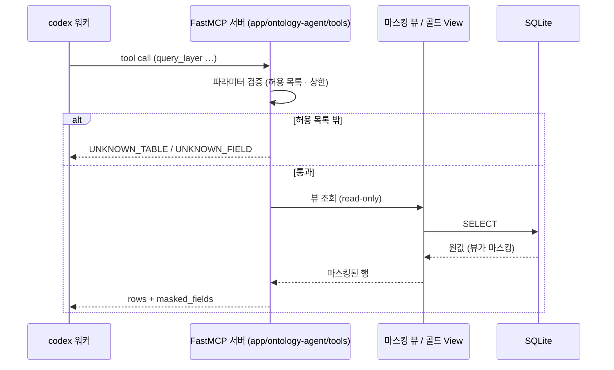

# 조회 도구 계약 — MCP 4종

에이전트가 쥐는 손은 이 네 개뿐이다. `query_kpi`(골드) · `query_layer`(실버·브론즈 마스킹
뷰) · `trace_ontology`(nodes·edges + 판정) · `get_definition`(글로서리). 전부
**파라미터화된 조회**이고, 자유 SQL 도구는 존재하지 않는다.

> 기능/정책 묶음 단위의 **외부 계약** 문서다. MCP 클라이언트(codex)와 도구 서버 구현자가
> 이 문서만 읽고 스키마를 맞출 수 있어야 한다.
> 테이블·뷰·enum 의 SoT 는 [[spec-001-data-layer-contract|SPEC-001]], 응답 스키마
> (`used_edges`·인용)의 SoT 는 [[spec-005-agent-loop-and-gates|SPEC-005]] 다.

## 1. Context

### Meta

- Decision reference: [[decision-003-llm-via-open-kknaks-mcp|DEC-003]](FastMCP 서버 · 도구
  4종 · 자유 SQL 금지) · [[decision-002-pii-masking-boundary|DEC-002]](뷰 경유 강제)
- Baseline reference: [[baseline-001-demo-agent-app|BASE-001]]
- 사실의 SoT: 기록 05(KPI 컬럼·상태 경계) · 07(nodes/edges·판정 체계) · 08(실제 조회 사용례)
- Domain note: 도구 4종 · 판정 5종(채택·자동 확정·선언·보류·기각) · 상태 3종(양호·주의·경고)
- Open questions: §7

### Business Requirement

- **S-001 — 관계는 데이터에 있다.** 관계 지식을 프롬프트에 넣지 않고 `trace_ontology` 로
  조회해야 답이 나오게 한다.
- **S-002 — Agent 는 판단만 한다.** 집계는 골드 View 가, 관계는 edges 가 한다. 도구는
  이미 계산된 것을 돌려줄 뿐 에이전트가 집계하지 않는다.
- **기각도 답이다.** 「프로모션 때문 아닌가」에 기각 행과 사유로 즉시 답할 수 있어야 같은
  질문이 반복되지 않는다.
- **원값은 도구를 통해서도 나가지 않는다.** 도구는 마스킹 뷰만 읽는다.

### Scope

In scope:

- 도구 4종의 이름 · 파라미터 · 응답 스키마 · 에러 코드
- 허용 대상(테이블·뷰·필드·지표) 목록과 상한(limit·기간)
- 뷰 경유 강제와 read-only 보장

Out of scope:

- 도구 서버의 기동·인증·경로(→ [[spec-003-api-and-chat-contract|SPEC-003]] 및 배포)
- 에이전트가 도구를 **어떤 순서로** 부르는지(→ [[spec-005-agent-loop-and-gates|SPEC-005]])
- 테이블·컬럼 정의(→ [[spec-001-data-layer-contract|SPEC-001]])

## 2. UX Contract

**해당 없음** — 도구는 MCP 프로토콜 표면이다. 도구 호출이 화면에 어떻게 보이는지는
[[spec-003-api-and-chat-contract|SPEC-003]] 의 채팅 응답(`steps`)이 갖는다.

## 3. User Scenario

### S-1. 에이전트 — 현황 질문 (「최근 4주 노쇼율 추이는?」)

1. `query_kpi(metrics=["noshow_rate"], grain="weekly", start=…, end=…)` 1회.
2. 응답에 주별 값·상태·계산식 근거가 함께 온다 — 에이전트가 나눗셈을 하지 않는다.
3. 온톨로지 탐색이 필요 없다(기록 08 1장 — View 단독 경로).

### S-2. 에이전트 — 원인 질문의 전제 검증 (「8월 매출이 왜 떨어졌어?」)

1. `query_kpi(metrics=["sales_total","visits","reservations"], grain="monthly", …)` 로 전제를
   먼저 확인한다.
2. 매출이 오히려 올랐다는 사실이 확인되면(기록 08 2.1) 에이전트는 질문을 교정한 뒤 원인
   추적으로 넘어간다.

### S-3. 에이전트 — 엣지 역추적

1. `trace_ontology(node="매출", direction="in")` 로 들어오는 엣지를 받는다.
2. 결과에 **판정 구분**이 붙어 온다 — 채택/자동 확정/선언은 인과 서술에 쓰고, **보류·기각은
   쓰지 않는다.** 기각 행은 배제 근거로만 인용한다.
3. 미관측 노드(외국인 유입 채널)는 `?` 표지와 함께 온다 — 답할 수 없음을 답한다.

### S-4. 에이전트 — 브론즈 드릴다운 (「그 취소들 원본 보여줘」)

1. `query_layer(layer="bronze", table="vegas_reservations", filters=[…], limit=20)`.
2. 응답 행은 **이미 마스킹돼 있다** — 이름 `김○○` · 전화 `010-****-1234` · 생년월일
   `1990-**-**`. 응답에 `masked_fields` 가 함께 와서 무엇이 가려졌는지 드러난다.

### S-5. 에이전트 — 용어 확인

1. `get_definition(term="노쇼율")` → 계산식(부도 ÷ (내원 + 부도))과 근거 기록이 온다.
2. 답변에 계산식을 인용할 때 이 응답을 근거로 단다.

### S-6. 경계 — 허용되지 않은 요청

1. 목록에 없는 테이블·필드·지표를 요청하면 도구가 **거부**한다(§4 Case Matrix).
2. 자유 SQL 을 넣을 파라미터가 애초에 없다 — 거부가 아니라 **표면 자체가 없다.**

## 4. Interface Contract

### API Contract

| 도구 | 읽는 것 | 성격 |
|---|---|---|
| `query_kpi` | `gold_*` | read-only 집계 조회 |
| `query_layer` | `v_silver_*` · `v_bronze_*` (마스킹 뷰) | read-only 행 조회 |
| `trace_ontology` | `ontology_nodes` · `ontology_edges` | read-only 그래프 조회 |
| `get_definition` | 글로서리(기록 03) · KPI 계산식(기록 05) | read-only 사전 조회 |

전 도구 공통: **읽기 전용**, 쓰기·삭제·DDL 도구 없음. `sql` · `query` · `path` 류의
자유 입력 파라미터를 두지 않는다.

### Request / Response

#### `query_kpi` — 골드 KPI 조회

요청

| 파라미터 | 타입 | 필수 | 규칙 |
|---|---|---|---|
| `metrics` | string[] | ✅ | 아래 허용 지표. 1~8개 |
| `grain` | enum | ✅ | `daily` · `weekly` · `monthly` · `retention_monthly` — 각각 `gold_kpi_daily` · `gold_kpi_weekly` · **`gold_kpi_monthly`** · `gold_retention_monthly` **조회**다 |
| `start` | date | ✅ | `YYYY-MM-DD` |
| `end` | date | ✅ | `YYYY-MM-DD`, `start` 이상 |
| `include_status` | bool | — | 기본 `true` — 상태(양호/주의/경고) 동봉 |
| `include_deltas` | bool | — | 기본 `false` — `_dod` · `_dod_pct` · `_ma7` 동봉 |

허용 지표(기록 05 2.2):
`sales_total` · `payment_visits` · `avg_ticket` · `visits` · `new_patients` · `revisits` ·
`reservations` · `cancels` · `cancel_rate` · `noshows` · `noshow_rate` · `new_churns` ·
`naver_reviews` · `new_patients_domestic` · `foreign_sales_share` · `sales_foreign_est` ·
`visits_foreign_est` · `new_patients_foreign_est`.
`grain=weekly` 는 여기에 유기 신호 `gu_reviews` · `gu_positive` · `gu_negative` 를 더한다.
`grain=retention_monthly` 는 `cohort_size` · `retained_60d` · `retention_rate` ·
`domestic_retention_rate` · `foreign_est_share` 를 쓴다.

응답

```json
{
  "grain": "weekly",
  "period": {"start": "2026-08-03", "end": "2026-08-30"},
  "rows": [
    {"period_key": "2026-08-03", "is_partial": false,
     "values": {"noshow_rate": 0.053, "noshows": 54, "visits": 958},
     "status": {"noshow_rate": "양호"}}
  ],
  "formulas": [
    {"metric": "noshow_rate", "formula": "부도 ÷ (내원 + 부도)",
     "note": "취소는 분모에서 제외", "glossary_ref": "기록 03 1장 노쇼율"}
  ],
  "status_thresholds": [
    {"metric": "noshow_rate", "direction": "높을수록 나쁨",
     "주의": 0.0714, "경고": 0.087, "method": "전 기간 백분위 25%/10%"}
  ],
  "source": {"table": "gold_kpi_weekly", "row_count": 4}
}
```

- **관측 없음과 0 을 구분한다** — `naver_reviews` 의 2026-03-21 이전은 `null`(빈 값)이고,
  유기 신호의 리뷰 없는 주는 `0` 이다.
- `naver_reviews` 는 `status` 를 갖지 않는다(방향 없는 개입 변수).
- `avg_ticket` 은 결제 내원 0인 날 `null` 이다(0 이 아니다).
- 결측일(2026-02-17)은 **행 자체가 없다.**

#### `query_layer` — 실버·브론즈 마스킹 뷰 조회

요청

| 파라미터 | 타입 | 필수 | 규칙 |
|---|---|---|---|
| `layer` | enum | ✅ | `bronze` · `silver` |
| `table` | enum | ✅ | 아래 허용 목록 |
| `filters` | object[] | — | `{field, op, value}` — 최대 5개 |
| `order_by` | object | — | `{field, direction: asc\|desc}` |
| `limit` | int | — | 1~200, 기본 20 |
| `offset` | int | — | 0 이상, 기본 0 |

- `op` enum: `eq` · `ne` · `gte` · `lte` · `in` · `between` · `contains`.
  `contains` 는 텍스트 필드에만 허용한다.
- `field` 는 해당 뷰의 **허용 필드 목록** 안이어야 한다. PII 원 컬럼명은 목록에 없다.

허용 테이블

| `layer` | `table` | 뷰 |
|---|---|---|
| bronze | `vegas_reservations` | `v_bronze_vegas_reservations` |
| bronze | `reviews` | `v_bronze_reviews` |
| bronze | `nexus_*`(SPEC-001 의 14종) | 원형 — PII 없음 |
| silver | `reservations` `reviews` `catalog` `promotions` `mappings` `branch_alias` | `v_silver_*` / 원 테이블(PII 없음) |

응답

```json
{
  "layer": "bronze",
  "table": "vegas_reservations",
  "view": "v_bronze_vegas_reservations",
  "total": 27815,
  "returned": 20,
  "masked_fields": ["patientName", "phone", "birthday"],
  "rows": [
    {"resvDate": "2026-08-14", "chartNo": "…", "patientName": "김○○",
     "phone": "010-****-1234", "birthday": "1990-**-**",
     "visitStatus": "취소", "sales": 0}
  ],
  "source_note": "마스킹 뷰 경유 — 원 테이블 직접 조회 경로 없음"
}
```

- `masked_fields` 는 **항상** 응답에 포함한다 — 무엇이 가려졌는지가 드러나야 답변이
  「원본을 봤다」고 말할 수 있다.
- 상한을 넘는 `limit` 은 거부한다(잘라서 주지 않는다 — 소리 없는 절단 금지).

#### `trace_ontology` — 관계 그래프 조회

요청

| 파라미터 | 타입 | 필수 | 규칙 |
|---|---|---|---|
| `node` | string | — | 노드 이름 또는 `node_id`. 생략 시 전체 그래프 |
| `direction` | enum | — | `in`(원인 쪽) · `out`(결과 쪽) · `both`. 기본 `both` |
| `depth` | int | — | 1~3, 기본 1 |
| `verdicts` | enum[] | — | `채택` · `자동 확정` · `선언` · `보류` · `기각`. 기본은 **`채택`·`자동 확정`·`선언`** |

응답

```json
{
  "nodes": [
    {"node_id": "sales_total", "name": "매출", "node_type": "kpi",
     "controllable": true, "grain": "일", "source": "gold_kpi_daily.sales_total"},
    {"node_id": "foreign_inflow_channel", "name": "외국인 유입 채널",
     "node_type": "unobserved", "controllable": true, "observed": false}
  ],
  "edges": [
    {"edge_id": "payment_visits__sales_total",
     "from": "payment_visits", "to": "sales_total", "sign": "+", "lag": "0d", "lag_days": 0,
     "kind": "derivation", "verdict": "자동 확정", "confidence": null,
     "evidence": "항등식 — 결제 내원 × 객단가", "reason": null,
     "usable_for_causal_claim": true},
    {"edge_id": "promo_event__sales_total",
     "from": "promo_event", "to": "sales_total", "sign": null, "lag": null, "lag_days": null,
     "kind": "rejected", "verdict": "기각", "confidence": null,
     "evidence": "전후 ±14일 변화율 ±6% 이내 (23건)",
     "reason": "효과 미검출 — 프로모션이 월 단위로 연쇄해 「없는 구간」이 없다는 구조적 한계",
     "usable_for_causal_claim": false}
  ],
  "counts": {"채택": 4, "자동 확정": 14, "선언": 3, "보류": 3, "기각": 3}
}
```

- **`lag` 는 정본 문자열 원형**(`"0d"`·`"1d"`·`"7d"`·`"60d"`·`"2w"`·빈 값)을 그대로 흘리고,
  **`lag_days`(일 단위 정수)를 병기**한다 — `"2w"` → `14`, 빈 값 → `null`.
  형식을 강제하지 않는다(SPEC-001 §4). 「동시점」·「2주」 같은 재서술을 만들지 않는다.
- **`edge_id` 를 함께 싣는다** — 안정 식별자이며 `used_edges[]`(SPEC-005)·`/api/graph`
  (SPEC-003)·URL `?edge=`(SPEC-004)가 같은 값을 쓴다.
- **판정과 사유가 응답에 항상 실린다.** 기각 행은 `reason` 이 필수이고,
  `usable_for_causal_claim: false` 로 인과 서술 사용을 막는다.
- 보류 엣지도 같다 — 조회는 되지만 인과 서술에 쓰지 않는다.
- 미관측 노드는 `observed: false` 로 온다. 화면의 `?` 표시와 답변의 「모른다」가 여기서 온다.
- `exogenous` 노드(요일·계절·연휴)는 들어오는 엣지가 없다 — `direction=in` 조회는 빈 배열이다.

#### `get_definition` — 글로서리 조회

요청

| 파라미터 | 타입 | 필수 | 규칙 |
|---|---|---|---|
| `term` | string | ✅ | 용어명 또는 KPI 컬럼명 |

응답

```json
{
  "term": "노쇼율",
  "aliases": ["noshow_rate"],
  "definition": "부도 ÷ (내원 + 부도). 취소는 분모에서 제외한다 — 취소는 「안 온 것」이 아니라 「예약을 무른 것」",
  "status": "승계",
  "source_note": "기록 03 용어 판정 표 1장",
  "related_columns": ["gold_kpi_daily.noshow_rate", "silver_reservations.visit_status"]
}
```

- `status` 는 글로서리의 판정 상태다: `확정` · `승계` · `대기`.
- 폐쇄 목록(시술 개념 13종)·enum 도 이 도구로 조회한다.

### Validation

| 필드 | 규칙 |
|---|---|
| `metrics` | 허용 지표 목록 안, 1~8개. 목록 밖 1건이라도 있으면 전체 거부 |
| `grain` | 4값 안. `retention_monthly` 는 retention 지표만 허용. **도구가 집계하지 않는다** — 각 값이 골드 View 하나에 대응한다 |
| `start` · `end` | `YYYY-MM-DD`, `start ≤ end`, 창은 데이터 범위(2026-01-07 ~ 2026-08-30) 밖도 허용(빈 결과) |
| `table` · `field` | 허용 목록 안. PII 원 컬럼명은 목록에 없다 |
| `filters` | 최대 5개. `op` enum 안. `contains` 는 텍스트 필드에만 |
| `limit` | 1~200. 초과는 절단이 아니라 **거부** |
| `depth` | 1~3 |
| `verdicts` | 5값 안 |
| `term` | 1~100자 |

### Case Matrix

에러 본문은 `{"error": "<코드>", "detail": "<사람이 읽는 설명>"}` 다.

| 에러 코드 | 발생 조건 | 도구 응답 | 에이전트 기대 행동 |
|---|---|---|---|
| `UNKNOWN_METRIC` | 허용 지표 밖 | 400 + 허용 목록 동봉 | 목록에서 골라 재호출 |
| `UNKNOWN_TABLE` | 허용 테이블 밖 | 400 + 허용 목록 동봉 | 재호출 |
| `UNKNOWN_FIELD` | 허용 필드 밖(PII 원 컬럼 포함) | 400 | 재호출 — **원값 우회 시도는 여기서 막힌다** |
| `UNKNOWN_TERM` | 글로서리에 없는 용어 | 404 + 유사 후보 | 「정의된 용어가 아니다」로 답한다 |
| `UNKNOWN_NODE` | 노드 이름·id 불일치 | 404 + 노드 목록 | 재호출 |
| `INVALID_RANGE` | `start > end` · 형식 위반 | 400 | 재호출 |
| `LIMIT_EXCEEDED` | `limit` > 200 | 400 | 낮춰 재호출 (절단하지 않는다) |
| `TOO_MANY_FILTERS` | 필터 6개 이상 | 400 | 줄여 재호출 |
| `EMPTY_RESULT` | 조건에 맞는 행 0 | 200 + 빈 배열 | 「해당 구간에 데이터 없음」으로 답한다 |
| `SOURCE_UNAVAILABLE` | DB 접근 실패 | 503 | 재시도 후 실패를 답변에 밝힌다 |

`EMPTY_RESULT` 는 에러가 아니라 정상 응답이다 — 빈 결과와 실패를 구분한다.

### Flow



### State / Lifecycle

**해당 없음** — 도구는 무상태 조회다. 상태 전이는 채팅 메시지가 갖는다
([[spec-003-api-and-chat-contract|SPEC-003]]).

### Data Contract

- 도구가 돌려주는 판정·상태·enum 은 전부 [[spec-001-data-layer-contract|SPEC-001]] 의
  값을 그대로 쓴다 — 도구가 새 값을 만들지 않는다.
- 답변이 인용할 수치의 역추적 필드(`used_edges` · `citations`)의 정의는
  [[spec-005-agent-loop-and-gates|SPEC-005]] 가 SoT 다. 도구 응답의 `source` ·
  `edges[].verdict` 가 그 입력이 된다.

## 5. Implementation Rules

- **자유 SQL 표면을 만들지 않는다.** 파라미터에 SQL·경로·정규식을 받는 필드를 두지 않는다.
- **allowlist 로 판정한다.** 테이블·필드·지표는 화이트리스트이고, 목록에 없으면 거부다.
  blocklist(금지 목록) 방식을 쓰지 않는다 — 새 컬럼이 생기면 자동으로 새는 쪽이 된다.
- **뷰 경유 강제.** 도구는 `v_*` 또는 `gold_*`/`ontology_*` 만 읽는다. 원 브론즈·실버
  테이블을 직접 읽는 코드 경로를 두지 않는다(DEC-002).
- **읽기 전용 커넥션.** 도구 서버는 쓰기 권한 없이 DB 를 연다.
- **소리 없는 절단 금지.** 상한 초과는 잘라서 주지 않고 거부한다. `total` 을 항상 실어
  「더 있다」가 드러나게 한다.
- 도구 이름·설명·파라미터 스키마가 모델의 선택 품질을 정한다 — 설명에 **언제 쓰는
  도구인지**를 적는다(예: `query_layer` = 「집계가 아니라 원본 행을 봐야 할 때」).
- 서버는 FastMCP(Streamable HTTP)로 띄우고 codex 가 MCP 클라이언트로 붙는다(DEC-003 D2).

## 6. Verification

### Acceptance Criteria

- [ ] **AC-1** 도구가 정확히 4종이고, 그 밖의 도구(자유 SQL·파일·쉘)가 **0개**임을 도구
      목록으로 확인.
- [ ] **AC-2** 허용 목록 밖 테이블·필드·지표 요청이 전부 거부되고, 거부 응답에 허용 목록이
      동봉된다.
- [ ] **AC-3** PII 원 컬럼(`patientName`·`phone`·`birthday`)을 `field`·`order_by`·`filters`
      어디에 넣어도 `UNKNOWN_FIELD` 로 거부된다.
- [ ] **AC-4** `query_layer` 응답이 항상 마스킹 표기(`김○○` · `010-****-1234` ·
      `1990-**-**`)로만 오고 `masked_fields` 가 동봉된다 — 원값 노출 **0건**.
- [ ] **AC-5** `trace_ontology` 응답의 모든 엣지에 `verdict` 가 있고, 기각·보류 행은
      `reason` 이 비어 있지 않으며 `usable_for_causal_claim: false` 다.
- [ ] **AC-6** 기본 호출(`verdicts` 미지정)이 채택·자동 확정·선언만 돌려준다 — 보류·기각은
      명시 요청해야 온다.
- [ ] **AC-7** `query_kpi` 응답의 수치가 골드 테이블 재조회값과 **오차 0**으로 일치하고,
      계산식·상태 경계가 함께 온다.
- [ ] **AC-8** 관측 없음(`null`)과 실제 0 이 구분된다 — `naver_reviews` 2026-03-21 이전은
      `null`, 유기 신호의 리뷰 없는 주는 `0`.
- [ ] **AC-9** `limit` 201 요청이 `LIMIT_EXCEEDED` 로 거부되고, 조용히 절단되지 않는다.
- [ ] **AC-10** 빈 결과가 `EMPTY_RESULT` 에러가 아니라 200 + 빈 배열로 온다.
- [ ] **AC-11** 도구 서버가 읽기 전용이다 — 쓰기 시도가 DB 레벨에서 실패한다.

## 7. Open Questions

| ID | Question | 상태 | Next |
|---|---|---|---|
| ~~OQ-1~~ | 도구 4종의 파라미터·응답 스키마 전반(§4) | **확정 (2026-09-02 승인)** | — |
| ~~OQ-2~~ | `grain=monthly` 의 출처 | **확정 (2026-09-02)** — 골드 **`gold_kpi_monthly`** View 조회다. 빌드가 생성하고 도구는 조회만 한다(S-002 유지) | SPEC-001 §4 |
| ~~OQ-3~~ | `contains` 연산자 허용 범위 | **확정 (2026-09-02 승인)** — 마스킹된 텍스트 필드에 한해 허용 | — |
| ~~OQ-4~~ | 노드 식별을 이름·`node_id` 중 무엇으로 받을지 | **확정 (2026-09-02 승인)** — 둘 다 받는다. `node_id` 는 snake_case(SPEC-001 §4 25종 표) | — |
| ~~OQ-5~~ | `get_definition` 이 덮는 용어 범위 | **확정 (2026-09-02 승인)** — 글로서리 판정 표 + KPI 컬럼 + enum(폐쇄 목록 13종·감성 4값 포함) | — |
