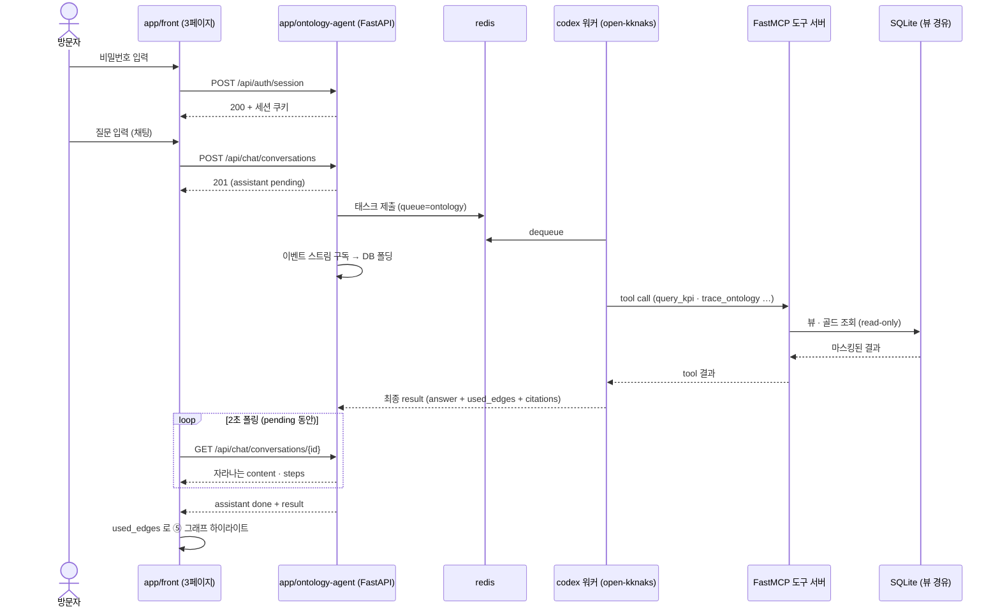
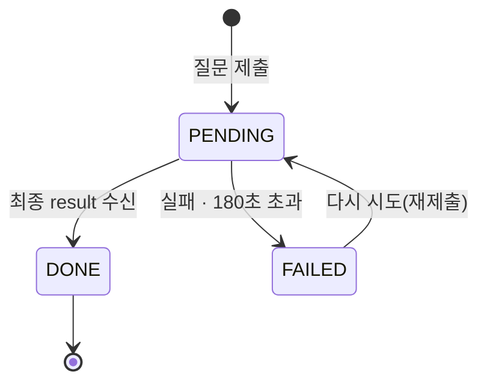

# FE↔BE API 계약 — 3페이지가 부르는 것과 접속 게이트

`app/front/` 통합 3페이지(데이터 · 모니터링 · 채팅)가 `app/ontology-agent/`(FastAPI)를
부르는 계약이다. 계층 조회 · KPI · 그래프 · 예보 · 채팅 스트림, 그리고 내부 공유용
비밀번호 게이트를 정한다.

> 기능/정책 묶음 단위의 **외부 계약** 문서다. 프론트·백엔드가 병렬로 구현할 수 있도록
> 요청·정상 응답·에러를 이 문서 하나로 맞춘다.
> **화면 배치·컴포넌트·카피는 이 문서가 갖지 않는다** — [[spec-004-three-screens|SPEC-004]]
> 몫이다. 여기 있는 것은 API 계약과 그것이 보장하는 데이터뿐이다.

## 1. Context

### Meta

- Decision reference: [[decision-004-web-three-pages-in-front|DEC-004]](3페이지 · 백은 API
  서버) · [[decision-003-llm-via-open-kknaks-mcp|DEC-003]](open-kknaks 경유 실행) ·
  [[decision-005-internal-demo-deploy|DEC-005]](내부 공유 · 비밀번호 하나)
- Baseline reference: [[baseline-001-demo-agent-app|BASE-001]]
- Domain note: `conversation` · `message`(status `pending`/`done`/`failed`) · 노드 상태
  (`정상`/`관찰`/`알림`) · KPI 상태(`양호`/`주의`/`경고`)
- Open questions: §7

### Business Requirement

- 세 페이지가 각자 필요한 데이터를 **한 계약**으로 가져간다 — 데이터(①②③) · 모니터링(④⑤⑥) ·
  채팅(⑦).
- **계층 화면은 근거 기록을 함께 받는다** — 실버 컬럼이 어느 브론즈에서 어떤 규칙으로 왔는지,
  골드 KPI 의 계산식이 무엇인지가 API 응답에 실린다(「문서가 앱의 설명서」).
- **채팅 답변이 밟은 엣지가 그래프 하이라이트로 이어진다** — 같은 `used_edges` 를 쓴다.
- 내부 공유용이므로 **비밀번호 하나**로 막고, 그 밖의 가드는 두지 않는다.

### Scope

In scope:

- 접속 게이트(비밀번호 1회 입력 → 세션)와 전 API 의 인증 요구
- 계층 조회 API(①②③), KPI·그래프·예보 API(④⑤⑥), 채팅 API(⑦)
- 채팅의 진행 표시 계약(부분 텍스트·도구 단계)과 폴링 규칙
- 에러 코드 단일 표

Out of scope:

- 화면 배치·컴포넌트·카피(→ [[spec-004-three-screens|SPEC-004]])
- 도구 파라미터·응답(→ [[spec-002-mcp-tools-contract|SPEC-002]])
- 답변 객체 스키마(→ [[spec-005-agent-loop-and-gates|SPEC-005]] — 이 문서는 링크만 한다)
- 테이블·뷰·enum(→ [[spec-001-data-layer-contract|SPEC-001]])
- rate limit · 계정 · 권한 등급(DEC-005 D2 — 두지 않기로 확정)

## 2. UX Contract

### Placement

배치의 SoT 는 [[spec-004-three-screens|SPEC-004]] 다. 이 문서는 **API 가 어느 화면에
물리는지**만 표로 둔다. 라우트는 `/ontology/{monitoring,chat,data}` 다(SPEC-004 §4).

| 페이지 | 화면 | 부르는 API |
|---|---|---|
| 데이터 | ① 브론즈 | `GET /api/layers/bronze/tables` · `GET /api/layers/bronze/{table}` |
| 데이터 | ② 실버 | `GET /api/layers/silver/{table}` + `GET /api/layers/silver/{table}/lineage` |
| 데이터 | ③ 골드 | `GET /api/layers/gold/{table}` + `.../lineage` |
| 모니터링 | ④ KPI 카드 | `GET /api/kpi/cards` |
| 모니터링 | ④ 추이 | `GET /api/kpi/series` |
| 모니터링 | ⑤ 그래프 | `GET /api/graph` |
| 모니터링 | ⑥ 예보 | `GET /api/forecast` |
| 채팅 | ⑦ | `POST/GET /api/chat/conversations…` |
| 전 페이지 | 접속 게이트 | `POST /api/auth/session` · `GET /api/auth/session` |

### U-1. 접속 게이트

- **상태**: 세션이 없으면 어느 페이지로 들어와도 비밀번호 입력 한 칸만 보인다.
  세션이 있으면 게이트가 나타나지 않는다.
- **문구**: 「내부 공유용 데모입니다. 공유받은 비밀번호를 입력해 주세요.」 ·
  실패 시 「비밀번호가 올바르지 않습니다.」
- **CTA**: 입력 후 Enter 또는 「들어가기」.
- **기대 결과**: 성공 시 원래 가려던 페이지로 이동하고 세션 쿠키가 발급된다. 재입력을
  요구하지 않는다(만료 전까지).

### U-2. 데이터 격자 (①②③ 공통)

- **상태**: 정상(행 표시) · 로딩 · 빈 결과(「해당 조건의 행이 없습니다」) · 에러.
  브론즈 행은 **마스킹 표기**로만 보인다.
- **문구**: 마스킹 안내 「개인정보는 마스킹되어 표시됩니다 — 이름 `김○○` · 전화
  `010-****-1234` · 생년월일 `1990-**-**`」.
- **기대 결과**: `total` 이 함께 오므로 「N건 중 M건」이 표시된다 — 조용히 잘리지 않는다.

### U-3. 근거 기록 링크 (②③)

- **상태**: 컬럼·지표마다 변환 규칙·계산식과 **근거 기록 참조**가 붙는다.
- **기대 결과**: 「이 컬럼이 어느 브론즈에서 어떤 규칙으로 왔는지」가 화면에서 읽힌다.

### U-4. 채팅 진행 표시 (⑦)

- **상태**: `pending` 동안 부분 답변과 도구 단계(`steps`)가 자란다. `done` 이면 최종 본문 ·
  `used_edges` · 근거 수치. `failed` 면 실패 문구 + 다시 시도.
- **기대 결과**: 답변이 `done` 이 되면 `used_edges` 가 **칩**으로 표시되고, 칩 클릭이
  `/ontology/monitoring?edge=<edge_id>` 로 이동해 ⑤ 그래프에서 하이라이트된다.
  **채팅에는 그래프 패널을 두지 않는다**(2026-09-02 확정 — SPEC-004 U-11).

## 3. User Scenario

### S-1. 방문자 — 첫 진입

1. 공유 링크로 들어온다. 세션이 없어 게이트(U-1)가 뜬다.
2. 공유받은 비밀번호를 입력한다 → `POST /api/auth/session`.
3. 성공하면 세션 쿠키가 발급되고 원래 페이지로 간다. 이후 API 호출은 쿠키로 인증된다.
4. 실패하면 `INVALID_PASSWORD` — 시도 횟수 제한은 두지 않는다(내부 공유 전제, DEC-005).

### S-2. 방문자 — 데이터 페이지에서 계층 내려가기

1. 골드 KPI 표에서 한 날짜를 고른다 → `GET /api/layers/gold/gold_kpi_daily`.
2. 계산식·근거 기록을 `lineage` 로 함께 본다.
3. 실버로 내려간다 → `GET /api/layers/silver/reservations?filters=…`.
4. 브론즈 원형까지 내려간다 → `GET /api/layers/bronze/vegas_reservations?…` —
   **마스킹된 행**이 온다.

### S-3. 방문자 — 모니터링

1. `GET /api/kpi/cards` 로 KPI 카드(최근 7일 상태)를 받는다.
2. `GET /api/graph` 로 노드·엣지를 받는다. 노드에는 상태색 근거가, 엣지에는 판정 구분이
   실려 있고 미관측 노드는 `observed: false` 다.
3. `GET /api/forecast` 로 예보 2건을 받는다.

### S-4. 방문자 — 채팅

1. 질문을 보낸다 → `POST /api/chat/conversations`. assistant 메시지가 `pending` 으로 생긴다.
2. FE 가 `GET /api/chat/conversations/{id}` 를 **2초 간격**으로 폴링한다. 부분 텍스트와
   도구 단계가 자란다.
3. `done` 이 되면 답변 객체(`used_edges` 포함)가 실린다.
4. FE 가 `used_edges` 를 칩으로 그리고, 칩 클릭 시 `/ontology/monitoring?edge=<edge_id>`
   로 이동해 그래프에서 하이라이트한다.
5. `failed` 면 재시도 버튼이 뜬다.

### S-5. 경계 — 세션 없이 API 호출

1. 쿠키 없이 API 를 부르면 **401 `NO_SESSION`**.
2. FE 는 게이트(U-1)로 되돌린다.

### S-6. 경계 — 같은 대화에 동시 질문

1. `pending` 이 있는 대화에 새 질문을 보내면 **409 `CONVERSATION_BUSY`**.
2. FE 는 컴포저를 잠가 선차단한다.

## 4. Interface Contract

### API Contract

| Method | Path | 요약 | 권한 |
|---|---|---|---|
| POST | `/api/auth/session` | 비밀번호 검증 → 세션 발급 | 공개 |
| GET | `/api/auth/session` | 세션 유효 확인 | 세션 |
| GET | `/api/layers/{layer}/tables` | 계층의 테이블 목록 + 행수 + 근거 기록 | 세션 |
| GET | `/api/layers/{layer}/{table}` | 행 조회(브론즈·실버는 마스킹 뷰) | 세션 |
| GET | `/api/layers/{layer}/{table}/lineage` | 컬럼별 변환 규칙·계산식·근거 기록 | 세션 |
| GET | `/api/kpi/cards` | KPI 카드 — 최근 7일 상태 | 세션 |
| GET | `/api/kpi/series` | KPI 시계열 | 세션 |
| GET | `/api/graph` | 노드·엣지 + 노드 상태 + 판정 구분 | 세션 |
| GET | `/api/forecast` | 예보(엣지 기반 「다음 위험」) | 세션 |
| POST | `/api/chat/conversations` | 대화 생성 + 첫 질문 | 세션 |
| GET | `/api/chat/conversations` | 대화 목록(최신순) | 세션 |
| GET | `/api/chat/conversations/{id}` | 대화 상세 — **폴링 대상** | 세션 |
| POST | `/api/chat/conversations/{id}/messages` | 이어서 질문 | 세션 |
| POST | `/api/chat/conversations/{id}/messages/{message_id}/retry` | 실패 답변 재시도 | 세션 |

`{layer}` = `bronze` · `silver` · `gold` · `ontology`.

### Request / Response

#### 접속 게이트

- `POST /api/auth/session` — req `{"password": "…"}` → 200 `{"ok": true}` +
  세션 쿠키 발급. 실패 401 `INVALID_PASSWORD`.
- `GET /api/auth/session` → 200 `{"ok": true}` / 401 `NO_SESSION`.
- 비밀번호는 **환경변수 하나**(`ONTOLOGY_DEMO_PASSWORD`)로 주입한다. 값은 배포 시 사용자가
  직접 넣으며 **문서·레포·기본값 어디에도 적지 않는다.**
- 백엔드 API 는 같은 env 값을 공유하는 단순 토큰 검증이다. 계정·권한 등급·rate limit 은
  두지 않는다(DEC-005 D2).

#### 계층 조회

- `GET /api/layers/{layer}/tables` → 200
  ```json
  {"layer": "silver",
   "tables": [{"table": "reservations", "row_count": 75479,
               "masked": false, "source_group": null,
               "note_ref": "기록 04 실버 빌드",
               "flows_to": [{"layer": "gold", "table": "gold_kpi_daily",
                             "note": "일별 KPI 의 주 원천"}]}]}
  ```
  - **`source_group`** — 브론즈 테이블의 **원천 축**이다. 허용값 `"vegas"` · `"review"` ·
    `"nexus"`, **실버·골드는 `null`**. 데이터 화면의 브론즈 2단 칩(원천 3 → nexus 하위 14)이
    이 값으로 묶인다([[spec-004-three-screens|SPEC-004]] U-13) — 화면이 테이블 이름을
    파싱해 그룹을 추측하지 않는다.
- `GET /api/layers/{layer}/{table}` — 쿼리 `filters` · `order_by` · `limit`(1~200, 기본 50) ·
  `offset` → 200
  ```json
  {"layer": "bronze", "table": "vegas_reservations",
   "view": "v_bronze_vegas_reservations",
   "total": 27815, "returned": 50, "offset": 0,
   "masked_fields": ["patientName", "phone", "birthday"],
   "columns": ["resvDate", "chartNo", "patientName", "…"],
   "rows": [{"resvDate": "2026-08-14", "patientName": "김○○",
             "phone": "010-****-1234", "birthday": "1990-**-**",
             "visitStatus": "취소", "sales": 0}]}
  ```
- `GET /api/layers/{layer}/{table}/lineage` → 200
  ```json
  {"table": "gold_kpi_daily",
   "columns": [
     {"column": "noshow_rate", "formula": "부도 ÷ (내원 + 부도)",
      "note": "취소는 분모에서 제외",
      "rule_id": null,
      "gate": "기록 05 게이트 3(내원 대사) 통과 · 분모 0인 날은 null",
      "source_columns": ["silver_reservations.visit_status"],
      "downstream": [{"layer": "gold", "table": "gold_kpi_weekly", "column": "noshow_rate"}],
      "is_provisional": false,
      "note_ref": "기록 05 2.2 · 기록 03 1장 노쇼율",
      "status_thresholds": {"direction": "높을수록 나쁨", "주의": 0.0714, "경고": 0.087}}
   ]}
  ```
  - **`rule_id`** — 실버 컬럼의 글로서리 규칙 ID(`G-0xx`). 골드처럼 규칙 ID 가 없는 컬럼은
    `null` 이다. 규칙 ID 체계의 SoT 는 기록 03·04 이고, API 는 그것을 실어 나른다.
  - **`gate`** — 그 컬럼이 통과한 게이트와 예외 처리(골드 컬럼 상세가 「계산식 / 게이트」를
    보여주기 위해 필요하다).
  - **`downstream`** — 이 컬럼이 흘러가는 곳. `source_columns`(상류)의 반대 방향이다.
  - **`is_provisional`** — 아직 확정되지 않은 값(예: 관찰 60일이 안 된 코호트)임을 표시한다.
    `null`(관측 없음)과 구분된다 — 화면은 `—` + 「미확정」으로 그리고 집계에서 제외한다.
  ```
  각 계층 화면이 다는 근거 기록은 **브론즈 → 기록 02 · 실버 → 04 · 골드 → 05 ·
  그래프 → 07** 이다(BASE-001 화면 표).

#### KPI

- `GET /api/kpi/cards` — 쿼리 `period`(`YYYY-MM`, 기본 최신) · `window_days`(기본 7) → 200
  ```json
  {"as_of": "2026-08-30", "period": "2026-08", "window_days": 7,
   "has_prev_period": true, "has_next_period": false,
   "cards": [{"metric": "noshow_rate", "label": "노쇼율", "grain": "daily",
              "latest": 0.05, "unit": "%p", "format": "percent",
              "dod": 0.009, "dod_pct": 0.22,
              "spark": [0.041, 0.043, 0.048, 0.046, 0.052, 0.049, 0.05],
              "status": "양호",
              "alert_days": 0, "node_state": "정상", "node_id": "noshow_rate",
              "thresholds": {"주의": 0.0714, "경고": 0.087},
              "direction": "높을수록 나쁨"}]}
  ```
  - `alert_days` = 최근 `window_days` 중 상태가 주의 또는 경고인 날 수. `node_state` 는 그
    빈도로 갈린다 — **알림 ≥3 · 관찰 ≥1 · 정상 0**(⑤ 그래프의 노드 색과 같은 기준).
  - **`grain`** — 카드마다 다르다. 일별 카드 행에 주별 지표(유기 신호)가 섞이므로 카드가
    자기 그레인을 싣고 화면이 그 값으로 캡션을 만든다(「(주간)」 등).
  - **`dod`·`dod_pct`** — 전 기간 대비 변화량·변화율. 골드의 `_dod`·`_dod_pct` 파생을
    그대로 싣는다.
  - **`unit`·`format`** — 단위 캡션(`%p`·`M`·`건`)과 표시 형식. 화면이 문자열을 만들지 않고
    이 값으로 조립한다.
  - **`spark`** — 최근 7개 값. 없으면 `null`(미관측 카드는 스파크라인을 그리지 않는다).
  - **`node_id`** — 그래프 노드와 잇는 키(SPEC-001 §4 25종). 카드 → 그래프 이동에 쓴다.
  - **`period`·`has_prev_period`·`has_next_period`** — 기간 스테퍼가 이 값으로 그려진다.
    **양쪽 화살표의 비활성 근거를 서버가 준다** — 이전 기간이 없으면 `has_prev_period: false`,
    다음 기간이 없으면 `has_next_period: false` 이고 해당 화살표를 비활성한다.
    화면이 데이터 범위(2026-01-07 ~ 2026-08-30)를 알고 있다가 스스로 판정하지 않는다.
  - 개입 신호(`naver_reviews`)는 `status`·`node_state` 를 갖지 않는다(방향 없는 변수).
- `GET /api/kpi/series` — 쿼리 `metrics` · `grain`(daily/weekly/monthly/retention_monthly) ·
  `start` · `end` ·
  `include_deltas` → 200. 형태는 [[spec-002-mcp-tools-contract|SPEC-002]] `query_kpi` 응답과
  같은 shape 를 쓴다 — 도구와 화면이 다른 수치를 보지 않게 하기 위함이다.

#### 그래프

- `GET /api/graph` — 쿼리 `verdicts`(기본 채택·자동 확정·선언) · `as_of` → 200
  ```json
  {"nodes": [{"node_id": "reservations", "name": "예약 수", "node_type": "kpi",
              "controllable": true, "observed": true,
              "node_state": "관찰", "alert_days": 2,
              "source": "gold_kpi_daily.reservations"}],
   "edges": [{"edge_id": "cancel_rate__reservations",
              "from": "cancel_rate", "to": "reservations", "sign": "−", "lag": "0d", "lag_days": 0,
              "verdict": "채택", "kind": "causal", "confidence": "중간",
              "evidence": "r=−0.583 · Granger 방향 분리(취소율→예약만 p<0.001)",
              "note": "취소율 상승은 예약 하락의 조기 경보다.",
              "reason": null, "usable_for_causal_claim": true}],
   "counts": {"채택": 4, "자동 확정": 14, "선언": 3, "보류": 3, "기각": 3}}
  ```
  - 미관측 노드는 `observed: false` — 화면의 `?` 표시가 여기서 온다.
  - 판정별 엣지 구분(채택/자동 확정/선언/보류/기각)은 응답 필드가 갖는다. 보류·기각은
    `verdicts` 를 명시해야 온다.
  - 노드 상태색 기준은 `/api/kpi/cards` 와 **같은 규칙**을 쓴다.
  - **`edge_id`** — 안정 식별자이고 형식은 **`<from>__<to>`**(밑줄 2개)다.
    예: `cancel_rate__reservations`. `used_edges[]`(SPEC-005) · URL `?edge=`(SPEC-004)가
    같은 값을 쓴다. `(from, to)` 쌍이 유일하므로 파생 가능하지만 **응답이 문자열로 실어 준다**
    — 소비자가 조립하지 않는다.
  - **`sign` 은 정본 원형 문자열**이다. 허용값은 `"+"` · **`"−"`(U+2212 MINUS SIGN)** ·
    `"0"` · `"exo"` · `"?"` — `ontology_edges` 의 값을 그대로 흘리고 치환하지 않는다.
    ⚠️ **음수 부호는 ASCII 하이픈(`"-"`, U+002D)이 아니다.** 화면·테스트가 문자 비교를 할 때
    **U+2212 기준**으로 맞춰야 한다 — 눈으로는 같아 보여서 어긋나도 드러나지 않는다.
  - **`kind`** — `causal` · `derivation` · `exogenous` · `candidate` · `rejected`.
    인스펙터 배지가 이 값을 쓴다.
  - **`note`** — 사람이 읽는 설명 한두 줄. `evidence`(근거 수식)·`reason`(기각 사유)과
    별개 필드다. 정본은 기록 07 이다.
  - **노드 `source`** — 그 노드가 어느 테이블·컬럼에서 오는지. 인스펙터의 「원본 데이터
    보기」 목적지가 여기서 파생된다(SPEC-004 U-6).
  - **`lag` 는 정본 문자열 원형**(`"2w"`·빈 값 포함)이고, **`lag_days`(정수)를 병기**한다
    — `"2w"` → `14`, 빈 값 → `null`. 형식을 강제하지 않는다(SPEC-001 §4).

#### 예보

- `GET /api/forecast` → 200
  ```json
  {"as_of": "2026-08-30",
   "forecasts": [
     {"rule": "취소율 → 예약",
      "title": "예약 위험",
      "message": "취소율이 경고 구간에 머물고 있습니다. 채택 엣지 「취소율 → 예약 수 (−)」 기준으로 예약 수 하락이 예상됩니다.",
      "edge": {"edge_id": "cancel_rate__reservations",
               "from": "cancel_rate", "to": "reservations", "verdict": "채택",
               "sign": "−", "lag": "0d", "lag_days": 0, "confidence": "중간",
               "evidence": "r=−0.583 · Granger 방향 분리(취소율→예약만 p<0.001)"},
      "trigger": "취소율이 경고 구간에 머무름",
      "target": "reservations", "horizon": "0d",
      "risk": "관찰",
      "evidence": [{"metric": "cancel_rate", "value": 0.355,
                    "period": {"start": "2026-08-01", "end": "2026-08-30"}}]},
     {"rule": "강남언니 리뷰 → 신환",
      "title": "신환 위험",
      "message": "강남언니 유기 리뷰가 8월 거의 0입니다. 「리뷰 수 → 신환 수 (+)」 엣지 기준으로 2주 뒤 신환 유입 감소가 예상됩니다.",
      "edge": {"edge_id": "gu_reviews__new_patients",
               "from": "gu_reviews", "to": "new_patients", "verdict": "채택",
               "sign": "+", "lag": "2w", "lag_days": 14, "confidence": "낮음",
               "evidence": "r=0.691 · n=30"},
      "trigger": "유기 리뷰가 8월 거의 0",
      "target": "new_patients", "horizon": "14d",
      "risk": "알림",
      "note": "신뢰도 낮음(표본 30주) — 단독 근거로 쓰지 않는다"}]}
  ```
  - **`title`·`message` 는 서버가 만든다.** 근거 추적 앱이라 카피를 FE 에 흩지 않는다.
  - **`edge.evidence`** 를 함께 실어 화면이 근거 한 줄(`r=… n=…`)을 조인 없이 그린다.
  - **수치·신뢰도·`lag` 는 기록 07 정본값이다** — 취소율 → 예약은 `0d`·중간·
    `r=−0.583`, 강남언니 → 신환은 **2주 = `14d`**·낮음·`r=0.691 · n=30`.
    화면이 이 값을 하드코딩하지 않는다.
  - `risk` ↔ 카드 색: `알림`/`관찰`(SPEC-004 U-7).
  예보는 **확정 엣지 2건**(취소율→예약, 강남언니→신환)만 코드화한다(BASE-001 구현 순서 5).
  신뢰도가 낮은 엣지는 그 사실을 응답에 실어 화면이 함께 표시한다.

#### 채팅

- `POST /api/chat/conversations` — req `{"question": "…"}` → 201
  `{"conversation": {…}, "messages": [user, assistant(pending)]}`
- `GET /api/chat/conversations/{id}` → 200 `{"conversation": {…}, "messages": [...]}`
  ```json
  {"id": "…", "role": "assistant", "status": "done", "error_code": null,
   "content": "8월 매출은 떨어지지 않았습니다 …",
   "steps": [{"tool": "query_kpi", "args_summary": "sales_total · monthly",
              "duration_ms": 420, "called_at": "…"}],
   "result": { "…": "SPEC-005 §4 의 답변 객체 — used_edges · citations · unknowns" },
   "created_at": "…"}
  ```
  - `result` 안의 스키마는 [[spec-005-agent-loop-and-gates|SPEC-005]] 가 SoT 다. 이 문서는
    그것을 실어 나르기만 한다 — 필드 정의를 복사하지 않는다. `used_edges[].edge_id` ·
    `citations[].row_count` · `drilldown` · `followups` 가 그 안에 실린다.
  - **`error_code`** — `status: failed` 일 때 실패 사유를 **Case Matrix 코드**로 싣는다:
    `AI_TIMEOUT`(180초 초과) · `AI_FAILED`(그 밖의 실패). `pending`·`done` 이면 `null` 이다.
    **FE 는 문구가 아니라 이 코드로 분기한다** — 타임아웃과 일반 실패의 화면 문구가 다르고
    (SPEC-004 U-9 #3·#4), 문구 매칭으로 갈라내면 카피가 바뀔 때 조용히 깨진다.
  - **`pending` 중에도 `content`(부분 텍스트)와 `steps` 가 자란다.** 백엔드가 open-kknaks
    이벤트 스트림을 구독해 DB 에 폴딩하고, FE 는 그것을 폴링한다.
- `POST /api/chat/conversations/{id}/messages` — req `{"question": "…"}` → 201
- `POST …/messages/{message_id}/retry` → 201 — 실패한 답변을 다시 제출한다.
- **폴링**: assistant 가 `pending` 인 동안 `GET /api/chat/conversations/{id}` 를 **2초**
  간격으로 부른다. `done`/`failed` 로 바뀌면 중단.

### Validation

| 필드 | 규칙 |
|---|---|
| `password` | 1자 이상. 값 비교만 — 형식 검증 없음 |
| `question` | trim 후 1자 이상 1,000자 이하 |
| `layer` | `bronze` · `silver` · `gold` · `ontology` |
| `table` | 해당 계층의 허용 테이블 목록 안(SPEC-001) |
| `filters` | 최대 5개, `op` enum 안. PII 원 컬럼은 필드 목록에 없다 |
| `limit` | 1~200(기본 50). 초과는 **거부** — 조용히 절단하지 않는다 |
| `metrics` | SPEC-002 허용 지표 목록 안, 1~8개 |
| `grain` | `daily` · `weekly` · `monthly` · `retention_monthly` |
| `start` · `end` | `YYYY-MM-DD`, `start ≤ end` |
| `verdicts` | `채택` · `자동 확정` · `선언` · `보류` · `기각` |

### Case Matrix

에러 본문은 `{"detail": "<에러 코드>"}` 로 통일한다.

| 에러 코드 | 백엔드 출력 | 프론트 출력 | 표시 위치 |
|---|---|---|---|
| `NO_SESSION` | 401 | 게이트 화면으로 되돌림 | 전체 |
| `INVALID_PASSWORD` | 401 | 「비밀번호가 올바르지 않습니다」 | 게이트 입력 아래 |
| `UNKNOWN_TABLE` | 404 | 「없는 테이블입니다」 | 데이터 페이지 |
| `UNKNOWN_FIELD` | 400 | 「조회할 수 없는 필드입니다」 | 필터 영역 |
| `UNKNOWN_METRIC` | 400 | 「없는 지표입니다」 | 모니터링 |
| `INVALID_RANGE` | 400 | 「기간을 확인해 주세요」 | 기간 선택 |
| `LIMIT_EXCEEDED` | 400 | (FE 가 상한으로 선차단) | — |
| `EMPTY_QUESTION` | 422 | (FE 선차단 — no-op) | — |
| `QUESTION_TOO_LONG` | 422 | 「질문은 1,000자까지 입력할 수 있습니다」 | 컴포저 아래 |
| `NOT_FOUND` | 404 — 없는 대화 | 빈 상태로 이동 | 채팅 |
| `CONVERSATION_BUSY` | 409 — `pending` 있는 대화에 질문 | (FE 가 잠금으로 선차단) | — |
| `AI_FAILED` | `message.status = failed` | 실패 문구 + 다시 시도 | 스레드 |
| `AI_TIMEOUT` | 180초 초과 → `failed`, 코드만 구분 | 위와 동일 | 스레드 |
| `SOURCE_UNAVAILABLE` | 503 — DB 접근 실패 | 「데이터를 불러오지 못했습니다」 | 해당 영역 |

빈 결과는 에러가 아니다 — 200 + 빈 배열 + `total: 0` 이다.

### Flow



### State / Lifecycle



### Data Contract

- `conversation` — `{id, title, created_at, last_message_at}`. 내부 세션 id 는 비노출.
- `message` — `{id, role: user|assistant, status: pending|done|failed, error_code,
  content, steps[], result?, created_at}`. `error_code` 는 `failed` 일 때만 값을 갖는다
  (`AI_TIMEOUT` · `AI_FAILED`), 그 밖에는 `null`.
- `step` — `{tool, args_summary, duration_ms, called_at}`. **기록 주체는 백엔드**다 —
  모든 도구 호출이 도구 서버를 지나므로 AI 신고 없이 서버가 잰다. `args_summary` 는 서버가
  만들고 길이를 제한한다(인자 원문 비노출).
- `result` — [[spec-005-agent-loop-and-gates|SPEC-005]] §4 의 답변 객체. 정의는 그 문서가
  갖는다.
- 노드 상태 `node_state` — `정상` · `관찰` · `알림`. KPI 상태(`양호`/`주의`/`경고`)와 다른
  축이다: KPI 상태는 **그 시점의 값**, 노드 상태는 **최근 7일의 빈도**다.

## 5. Implementation Rules

- **백엔드는 API 서버다**(DEC-004 D3). 템플릿·static 페이지를 내보내지 않는다.
- **화면과 도구가 같은 수치를 본다.** `/api/kpi/series` 는 `query_kpi` 와 같은 골드 View 를
  같은 규칙으로 읽는다 — 화면용 집계 로직을 따로 만들지 않는다.
- **마스킹 뷰 경유 강제.** 계층 조회 API 도 도구와 같은 뷰만 읽는다(DEC-002).
  API 전용 우회 경로를 만들지 않는다.
- **소리 없는 절단 금지.** `total` 을 항상 실어 「더 있다」가 드러나게 한다.
- **동시성**: 같은 대화는 한 번에 한 태스크만 돈다(`CONVERSATION_BUSY`). 다른 대화끼리는
  병렬이어도 된다.
- **timeout**: 180초 초과 시 `failed` 로 마감한다. 재시도는 재제출이다.
- **세션**: 쿠키 이름 `ontology_demo_sid`, httpOnly · SameSite=Lax · Secure, 만료 30일.
  가드는 **프론트 미들웨어(화면)와 백 API 양쪽**에 둔다 — NPM Basic Auth 는 쓰지 않는다
  (폴링·쿠키와 어긋난다).
- **비밀번호 값을 코드·문서·기본값에 넣지 않는다.** 환경변수로만 주입한다.
- 「실시간」이라고 표기하지 않는다 — 데이터는 일 1회 갱신이다(DEC-005 D4).

## 6. Verification

### Acceptance Criteria

- [ ] **AC-1** 세션 없이 부른 모든 API 가 401 `NO_SESSION` 이고, 게이트를 통과하면 재입력
      없이 전 페이지가 열린다.
- [ ] **AC-2** 비밀번호가 환경변수로만 주입되고, 레포·문서·응답 어디에도 값이 없다.
- [ ] **AC-3** 브론즈·실버 계층 조회 응답이 마스킹 표기(`김○○` · `010-****-1234` ·
      `1990-**-**`)로만 오고 `masked_fields` 가 동봉된다 — 원값 **0건**.
- [ ] **AC-4** `lineage` 응답이 컬럼마다 변환 규칙·계산식과 근거 기록 참조를 준다
      (브론즈→02 · 실버→04 · 골드→05 · 그래프→07).
- [ ] **AC-5** `/api/kpi/series` 값이 `query_kpi`(도구) 값과 **오차 0**으로 일치한다.
- [ ] **AC-6** `/api/graph` 응답의 엣지에 판정 구분이 있고, 기본 호출에 보류·기각이 오지
      않으며, 미관측 노드는 `observed: false` 다.
- [ ] **AC-7** `/api/forecast` 가 확정 엣지 기반 2건(취소율→예약, 강남언니→신환)을 주고,
      신뢰도 낮은 엣지는 그 사실을 함께 준다.
- [ ] **AC-8** `pending` 동안 폴링 응답의 `content`·`steps` 가 자라고, `done` 에서 최종
      본문으로 교체된다.
- [ ] **AC-9** `done` 응답의 `result.used_edges` 로 그래프 하이라이트가 이뤄지고, 하이라이트
      집합이 `used_edges` 와 정확히 같다(SPEC-005 게이트 5-③).
- [ ] **AC-10** `pending` 있는 대화에 질문하면 409 `CONVERSATION_BUSY`, 실패 답변은 재시도로
      복구된다.
- [ ] **AC-11** 상한 초과 `limit` 이 거부되고, 응답 `total` 로 전체 건수가 드러난다.
- [ ] **AC-12** 어느 화면·응답에도 「실시간」 표기가 없다.
- [ ] **AC-13** `/api/kpi/cards` 가 카드마다 `grain`·`dod`·`dod_pct`·`unit`·`format`·
      `spark[7]`·`node_id` 를 싣고, `period`·**`has_prev_period`**·`has_next_period` 로 기간
      스테퍼의 **양쪽 화살표**가 그려진다. 미관측 카드는 `spark: null` 이다.
- [ ] **AC-14** `/api/graph` 엣지가 `edge_id`·`kind`·`note` 를, 노드가 `source` 를 싣고,
      `lag`(정본 원형)와 **`lag_days`**(정수, `2w`=14, 빈 값=`null`)를 **병기**한다.
- [ ] **AC-15** `/api/forecast` 가 `title`·`message`·`edge.evidence` 를 싣고, 수치·신뢰도·
      `lag` 가 기록 07 정본값과 일치한다(취소율→예약 `0d`/`lag_days` 0·중간, 강남언니→신환 **`2w`**/`lag_days` **14**·낮음).
- [ ] **AC-16** `lineage` 가 `rule_id`·`gate`·`downstream`·`is_provisional` 을, `tables` 가
      `flows_to[]` 를 싣는다. `is_provisional` 과 `null`(관측 없음)이 구분된다.
- [ ] **AC-17** 채팅 `result` 가 `used_edges[].edge_id`·`citations[].row_count`·`drilldown`·
      `followups` 를 실어 나른다(정의는 SPEC-005).
- [ ] **AC-18** `/api/layers/bronze/tables` 가 테이블마다 `source_group`(`vegas`·`review`·
      `nexus`)을 싣고, 실버·골드는 `null` 이다.
- [ ] **AC-19** `status: failed` 메시지가 `error_code`(`AI_TIMEOUT`·`AI_FAILED`)를 싣고,
      `pending`·`done` 은 `null` 이다.

## 7. Open Questions

| ID | Question | 상태 | Next |
|---|---|---|---|
| ~~OQ-1~~ | 엔드포인트 경로·응답 shape 전반(§4) | **확정 (2026-09-02 승인)** — 디자인 검토가 요구한 필드까지 반영 | — |
| ~~OQ-2~~ | 채팅을 이벤트 폴딩 + 2초 폴링으로 갈지 | **확정 (2026-09-02 승인)** — 폴딩 + 2초 폴링 | 화면 상태 5종은 SPEC-004 U-9 |
| ~~OQ-3~~ | 세션 쿠키 이름·만료 | **확정 (2026-09-02 승인)** — `ontology_demo_sid`, 30일 | — |
| ~~OQ-4~~ | 비밀번호 가드 위치 | **확정 (2026-09-02 승인)** — **프론트 미들웨어 + 백 API 양쪽**. NPM Basic Auth 는 쓰지 않는다(폴링·쿠키와 어긋난다) | — |
| ~~OQ-5~~ | `node_state` 산정식 | **확정 (2026-09-02 승인)** — 최근 `window_days`(기본 7) 중 상태가 주의·경고인 날 수. 알림 ≥3 · 관찰 ≥1 · 정상 0 | — |
| ~~OQ-6~~ | 예보 `risk` 기준 | **확정 (2026-09-02 승인)** — 트리거 지표의 상태와 엣지 신뢰도를 함께 본다 | — |
| ~~OQ-7~~ | 대화 이력 보존 단위 | **확정 (2026-09-02 승인)** — 세션 단위. 공용 비밀번호라 사실상 공용 이력이 된다는 점을 전제로 둔다 | — |
| OQ-8 | 컬럼 값 분포 엔드포인트를 둘 것인가 | 미결 | 디자인의 분포 바(SPEC-004 §7.2 D-18)가 유지되면 필요하다. **제거 권고** — 유지 결정 시 이 문서에 엔드포인트를 추가한다 |
