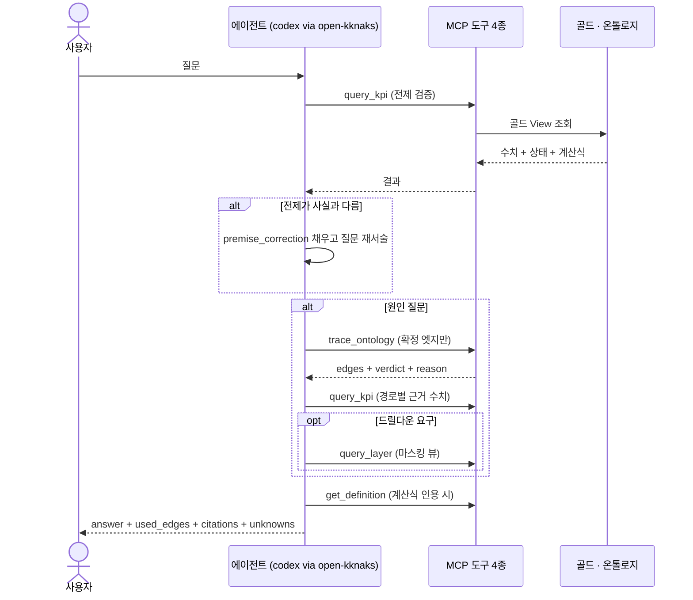

# 에이전트 루프와 게이트 — 전제 검증 · `used_edges` · 회귀 3본

에이전트는 **전제 검증 → 엣지 역추적 → 근거 수치 병기** 세 단계로 답한다. 답변에는
밟은 엣지(`used_edges`)와 역추적 가능한 수치 인용(`citations`)이 필수다. 이 문서는 그
응답 스키마의 **단일 원천**이고, 게이트 5종의 수치 기준과 회귀 3본을 정한다.

> 기능/정책 묶음 단위의 **외부 계약** 문서다.
> `used_edges` · `citations` 의 정의는 여기가 SoT 이며,
> [[spec-002-mcp-tools-contract|SPEC-002]] · [[spec-003-api-and-chat-contract|SPEC-003]] 은
> 이 문서를 링크로 참조한다 — 같은 정의를 두 곳에 두지 않는다.

## 1. Context

### Meta

- Decision reference: [[decision-003-llm-via-open-kknaks-mcp|DEC-003]](open-kknaks 경유 실행 ·
  도구 4종 · 자유 대화 UX)
- Baseline reference: [[baseline-001-demo-agent-app|BASE-001]]
- 사실의 SoT: 기록 08(루프 3단계·시나리오 2본·게이트 3항목) · 기록 09 §4(게이트 5종) ·
  기록 07(판정 체계)
- Domain note: `used_edges` · `citations` · `premise_correction` · 게이트 5종 · 회귀 3본
- Open questions: §7

### Business Requirement

- **관계 지식이 프롬프트에 없어도 답이 나와야 한다** — S-001 의 검증 명제 그 자체다.
- **질문의 전제가 틀렸으면 먼저 바로잡아야 한다.** 원인 분석형 에이전트의 첫 임무다
  (기록 08 2.1 — 「8월 매출이 떨어졌다」는 전제가 데이터와 달랐다).
- **답변의 모든 수치가 역추적돼야 한다.** 어느 View 의 어느 컬럼에서 왔는지 되짚을 수
  없는 수치는 답변에 싣지 않는다.
- **밟은 엣지가 그래프 하이라이트의 입력이 된다** — 답변과 그림이 같은 근거를 가리킨다.

### Scope

In scope:

- 에이전트 루프 3단계와 각 단계의 도구 사용 규칙
- 답변 응답 스키마(`answer` · `premise_correction` · `used_edges` · `excluded_edges` ·
  `citations` · `drilldown` · `followups` · `unknowns`) — **이 문서가 SoT**
- 확정 엣지만 인과 서술에 쓰는 규칙과 기각·보류·미관측의 취급
- 게이트 5종의 수치 기준, 회귀 3본의 입력·기대 출력

Out of scope:

- 도구 파라미터·에러(→ [[spec-002-mcp-tools-contract|SPEC-002]])
- HTTP·스트림·화면 표시(→ [[spec-003-api-and-chat-contract|SPEC-003]])
- 데이터 적재·빌드 게이트(→ [[spec-001-data-layer-contract|SPEC-001]])
- 프롬프트 문안 자체(구현 산물 — 관계 지식을 넣지 않는다는 제약만 이 문서가 갖는다)

## 2. UX Contract

**해당 없음** — 표시는 화면 spec 과 [[spec-003-api-and-chat-contract|SPEC-003]] 이 갖는다.
다만 **답변에 반드시 드러나야 하는 것**은 이 문서가 정한다: 전제 교정 사실, 밟은 엣지,
수치의 출처, 모르는 것.

## 3. User Scenario

### S-1. 사용자 — 현황 질문 (기록 08 1장 재현)

1. 「최근 4주 노쇼율 추이는?」
2. 에이전트가 `query_kpi(metrics=["noshow_rate","noshows","visits"], grain="weekly")` 1회.
3. **온톨로지를 타지 않는다** — 골드 View 단독으로 답이 나오는 질문이다.
4. 답변: 주별 값 + 상태 판정 + 계산식 인용. `used_edges` 는 **빈 배열**이고,
   `citations` 는 주별 4건이다.

### S-2. 사용자 — 원인 질문 · 전제가 틀린 경우 (기록 08 2장 재현)

1. 「8월 매출이 왜 떨어졌어?」
2. **전제 검증** — `query_kpi` 로 8월/7월 매출을 확인한다. 8월 매출은 떨어지지 않았다
   (3.69억, 7월 2.91억 대비 +27%). 실제로 떨어진 것은 내원과 예약이다.
3. 에이전트는 **먼저 전제를 교정**하고(`premise_correction` 채움), 질문을 「내원·예약은 왜
   떨어졌고 매출은 왜 버텼나」로 바꿔 이어간다.
4. **엣지 역추적** — `trace_ontology` 로 확정 엣지만 밟는다.
5. **근거 수치 병기** — 밟은 경로마다 골드 수치를 인용한다.
6. 답변에 `used_edges` 가 실리고, 그래프가 그 엣지를 하이라이트한다.

### S-3. 사용자 — 기각된 가설을 묻는 경우

1. 「프로모션 때문 아니야?」
2. `trace_ontology(verdicts=["기각"])` 로 기각 행을 받는다.
3. 답변은 **기각 사유를 인용해 배제**한다 — 「전후 ±14일 변화율 ±6% 이내(23건)로 효과
   미검출, 프로모션이 월 단위로 연쇄해 「없는 구간」이 없다는 구조적 한계도 함께」.
4. 기각 엣지는 `used_edges` 에 **인과 근거로 싣지 않는다** — 배제 근거로만 인용하고
   `excluded_edges` 에 담는다.

### S-4. 사용자 — 드릴다운 (「그 8월 취소들 원본 20건 보여줘」)

1. `query_layer(layer="bronze", table="vegas_reservations", filters=[취소, 8월], limit=20)`.
2. 답변에 마스킹된 원본 행이 실린다 — 이름 `김○○` · 전화 `010-****-1234` ·
   생년월일 `1990-**-**`.
3. `citations` 에 브론즈 뷰 출처가 실린다.

### S-5. 사용자 — 답할 수 없는 질문

1. 「외국인 신환은 어디서 들어와?」
2. `trace_ontology` 가 **미관측 노드**(외국인 유입 채널, `observed: false`)를 돌려준다.
3. 에이전트는 **모른다고 답한다** — `unknowns` 에 「채널 기록이 데이터에 없음. 매출 57%가
   걸린 경로가 그래프에서 물음표로 남아 있다」를 담는다. 추측으로 채우지 않는다.

### S-6. 경계 — 관계 지식의 출처

1. 시스템 프롬프트에 노드·엣지·인과 관계를 **넣지 않는다.**
2. 에이전트가 `trace_ontology` 를 부르지 않고 관계를 서술하면 **게이트 5 위반**이다
   (`used_edges` 가 비었는데 인과 서술이 있는 상태).

## 4. Interface Contract

### API Contract

**해당 없음** — HTTP 표면은 [[spec-003-api-and-chat-contract|SPEC-003]] 이 갖는다.
이 문서는 그 응답 안에 실리는 **답변 객체**의 스키마를 정한다.

### Request / Response

#### 답변 응답 스키마 (SoT)

```json
{
  "answer": "8월 매출은 떨어지지 않았습니다 — 3.69억으로 7월(2.91억) 대비 +27% …",
  "premise_correction": {
    "corrected": true,
    "claimed": "8월 매출이 떨어졌다",
    "actual": "8월 매출 3.69억 (7월 2.91억 대비 +27%, 8개월 중 2위)",
    "restated_question": "내원·예약은 왜 떨어졌고 매출은 왜 버텼나"
  },
  "used_edges": [
    {"edge_id": "payment_visits__sales_total",
     "from": "payment_visits", "to": "sales_total", "verdict": "자동 확정",
     "sign": "+", "lag": "0d", "lag_days": 0, "role": "매출이 버틴 경로"},
    {"edge_id": "cancel_rate__reservations",
     "from": "cancel_rate", "to": "reservations", "verdict": "채택",
     "sign": "−", "lag": "0d", "lag_days": 0, "confidence": "중간", "role": "예약 하락 원인 후보 1"}
  ],
  "excluded_edges": [
    {"edge_id": "promo_event__sales_total",
     "from": "promo_event", "to": "sales_total", "verdict": "기각",
     "reason": "효과 미검출 — 전후 ±14일 변화율 ±6% 이내(23건)"}
  ],
  "citations": [
    {"claim": "8월 매출 3.69억",
     "value": 369000000,
     "metric": "sales_total", "grain": "monthly",
     "period": {"start": "2026-08-01", "end": "2026-08-30"},
     "row_count": 30,
     "source": {"tool": "query_kpi", "table": "gold_kpi_monthly", "column": "sales_total"}}
  ],
  "drilldown": {
    "table": "vegas_reservations", "view": "v_bronze_vegas_reservations",
    "layer": "bronze",
    "filters": [{"field": "visitStatus", "op": "eq", "value": "취소"},
                {"field": "resvDate", "op": "between", "value": ["2026-08-01", "2026-08-31"]}],
    "columns": ["resvDate", "chartNo", "patientName", "phone", "birthday", "visitStatus"],
    "masked_fields": ["patientName", "phone", "birthday"],
    "rows": [],
    "total": 0
  },
  "followups": [
    "그 취소들 원본을 보여줘",
    "취소율이 언제부터 올랐어?"
  ],
  "unknowns": [
    {"topic": "외국인 유입 채널", "reason": "미관측 노드 — 채널 기록이 데이터에 없다"}
  ]
}
```

#### 필드 계약

| 필드 | 필수 | 규칙 |
|---|---|---|
| `answer` | ✅ | 사람이 읽는 본문. 자유 대화 톤(DEC-003 D3) |
| `premise_correction` | ✅ | 교정이 없으면 `{"corrected": false}`. **필드 자체는 항상 존재** |
| `used_edges` | ✅ | 인과 서술에 실제로 밟은 엣지. 현황 질문이면 **빈 배열**(생략 아님) |
| `excluded_edges` | — | 기각·보류를 배제 근거로 인용한 경우에만 |
| `citations` | ✅ | 답변에 실린 **모든 수치**에 1:1 대응. 수치가 없으면 빈 배열. **`row_count`** 는 그 인용이 몇 행에서 나왔는지 |
| `drilldown` | — | 원본 행을 답변에 실을 때만. `layer`·`table`·`view`·`filters`·`columns`·`rows`·`masked_fields`·`total` |
| `followups` | — | 이 답변 맥락에서 이어질 후속 질문 문자열. 정적 목록이 아니다 |
| `unknowns` | — | 미관측·데이터 부재로 답할 수 없는 것 |

- **`used_edges` ⊆ 확정 엣지.** 확정은 판정 `채택` · `자동 확정` · `선언` 이다.
  `보류` · `기각` 은 `used_edges` 에 들어갈 수 없다 — `excluded_edges` 로만 간다.
- **`citations` 는 역추적 가능해야 한다.** `source.table` · `source.column` 으로 재조회했을
  때 같은 값이 나와야 한다(게이트 5).
- `used_edges` 가 **그래프 하이라이트의 유일한 입력**이다 — 화면이 다른 기준으로 강조하지
  않는다. 하이라이트가 일어나는 화면은 **모니터링 그래프 하나**다(§6 G5-③).
- **`edge_id` 는 안정 식별자**다. `used_edges[]` · `excluded_edges[]` · `/api/graph`
  (SPEC-003) · URL `?edge=`(SPEC-004)가 같은 값을 쓴다.
- **`lag` 는 정본 문자열 원형**(`"0d"`·`"1d"`·`"7d"`·`"60d"`·`"2w"`·빈 값)이고 도구·API 가
  **`lag_days`(정수)를 병기**한다 — `ontology_edges` 원천 형식 그대로(SPEC-001 §4).
  「동시점」·「2주」 같은 재서술을 만들지 않는다.
- **`drilldown.rows` 는 마스킹 뷰 산출 그대로**다. 표시 상한(화면 5행)은 화면 계약이고,
  `total` 이 항상 실려 「몇 중 몇」이 드러난다.

### Validation

| 대상 | 규칙 |
|---|---|
| `used_edges[]` | `ontology_edges` 에 존재하는 `edge_id`(및 (from, to) 쌍)여야 한다 — 없는 엣지 0건 |
| `drilldown.rows[]` | 마스킹 뷰 산출이어야 한다 — 원 테이블 조회 결과를 실을 수 없다 |
| `followups[]` | 0~3개. 이 답변의 맥락에서 나온 질문일 것 |
| `used_edges[].verdict` | `채택` · `자동 확정` · `선언` 만 |
| `citations[].value` | DB 재조회값과 일치(허용 오차 0 — 반올림 표기는 `claim` 문자열에서만) |
| `citations[].source` | `tool` · `table` · `column` 이 전부 채워질 것 |
| `premise_correction` | `corrected: true` 면 `claimed` · `actual` · `restated_question` 필수 |
| PII | `answer` · `citations` 어디에도 실명·전화·생년월일 원값 0건 |

### Case Matrix

| 상황 | 에이전트 동작 | 응답 |
|---|---|---|
| 도구가 `EMPTY_RESULT` | 없다고 답한다. 추정치를 만들지 않는다 | `answer` 에 「해당 구간 데이터 없음」, `citations` 빈 배열 |
| 미관측 노드에 닿음 | 모른다고 답한다 | `unknowns` 채움 |
| 기각 엣지가 질문의 가설 | 기각 사유로 배제한다 | `excluded_edges` 채움, `used_edges` 에는 없음 |
| 전제가 데이터와 다름 | 교정 후 답한다 | `premise_correction.corrected: true` |
| 도구 실패(`SOURCE_UNAVAILABLE`) | 실패를 밝힌다 | `answer` 에 조회 실패 명시, 수치 인용 금지 |
| 관계 서술이 필요한데 `trace_ontology` 미호출 | **금지** | 게이트 5 위반 — 회귀에서 잡는다 |

### Flow



### State / Lifecycle

**해당 없음** — 답변 객체는 최종 산출물이다. 메시지의 상태 전이(pending → done/failed)는
[[spec-003-api-and-chat-contract|SPEC-003]] 이 갖는다.

### Data Contract

- 엣지 판정·노드 유형·상태 값은 [[spec-001-data-layer-contract|SPEC-001]] 의 것을 그대로 쓴다.
- 도구 응답 → 답변 객체의 매핑: `trace_ontology.edges[]` → `used_edges` / `excluded_edges`,
  `query_kpi.rows[]` + `source` → `citations[]`, `trace_ontology.nodes[].observed=false` →
  `unknowns[]`.

## 5. Implementation Rules

- **관계 지식을 프롬프트에 넣지 않는다.** 시스템 프롬프트는 도구 사용 규칙과 답변 형식만
  담는다. 노드 목록·엣지·인과 관계·기각 사유를 프롬프트에 적으면 S-001 검증이 무효가 된다.
- **집계를 에이전트가 하지 않는다**(S-002). 합·평균·비율은 도구가 돌려준 값을 그대로 쓴다.
  도구가 못 주는 집계가 필요하면 그 사실을 답하고 만다.
- **엣지 계수 기반 정량 추정을 하지 않는다** (2026-09-02 확정). 「리뷰가 10건 줄면 신환이
  약 N명 준다」·「그래서 매출이 −N원」 같은 **도구가 주지 않는 수치를 만들어 내지 않는다.**
  엣지가 주는 것은 **관계의 방향·부호·시차·신뢰도와 근거(r·n·p)** 까지이고, 답변도 거기까지
  제시한다. `ontology_edges` 에 계수(β)·구간을 주는 필드가 없고, 곱셈으로 만든 값은
  `citations` 의 「DB 재조회 일치」를 성립시킬 수 없다 — 게이트 5-① 위반이 된다.
  계수 산출 도구는 **이번 범위 밖**이다(파이프라인 단계 검토).
- **확정 엣지만 인과 서술에 쓴다.** 보류는 「미확정」으로만 언급할 수 있고, 기각은 배제
  근거로만 쓴다.
- **모르는 것은 모른다고 답한다.** 미관측 노드·빈 결과를 추정으로 메우지 않는다.
- 실행은 open-kknaks(AgentClient + RedisBroker) 경유, provider 는 codex(`gpt-5.6-terra`),
  timeout 은 180초를 기준값으로 둔다(DEC-003 · 백엔드 설정 기본값).
- 답변 톤은 자유 대화다(DEC-003 D3) — 정해진 질문 버튼·폼을 전제하지 않는다.

## 6. Verification

### Acceptance Criteria — 게이트 5종 (기록 09 §4)

- [ ] **G1 브론즈 대사** — 원천 파일 행수 = 브론즈 테이블 행수, 전 테이블 오차 0.
      (기준·수치의 SoT 는 [[spec-001-data-layer-contract|SPEC-001]] AC-1)
- [ ] **G2 빌드 재현** — DB 기반 재빌드 산출물 = 기존 CSV 산출물. 매출
      **2,615,555,218원** · 결제 내원 **5,428** · 신환 **3,447** · 내원 **47,537**(실버 기준) ·
      일별 **235행** 일치. (SPEC-001 AC-2)
- [ ] **G3 PII 마스킹** — 화면·에이전트 응답 어디에도 실명·전화·생년월일 원값 노출 **0건**.
      답변 본문·`citations`·드릴다운 행 전부 포함.
- [ ] **G4 회귀 3본** — 아래 R-1·R-2·R-3 전부 통과.
- [ ] **G5 근거 무결성** — ① 답변 수치 = DB 재조회 일치(오차 0). **도구가 주지 않은
      추정치가 답변에 0건**일 것 ② `used_edges` ⊆ 확정 엣지(`채택`·`자동 확정`·`선언`)
      ③ **모니터링 그래프**(`/ontology/monitoring`)의 하이라이트 = `used_edges`
      — 집합이 정확히 같을 것. **검증 대상 화면은 모니터링 그래프 단일**이다
      (2026-09-02 확정 — 채팅에는 하이라이트 대상 그래프를 두지 않는다. OQ-4 닫힘).

### Acceptance Criteria — 회귀 3본

- [ ] **R-1 현황 질문** (기록 08 1장) — 입력 「최근 4주 노쇼율 추이는?」
      기대: 주별 4행이 나오고 값이 `gold_kpi_weekly` 재조회와 일치.
      기록 08 실측 기준값 — 2026-08-03 **5.3%**(54/958) · 08-10 **4.8%**(46/921) ·
      08-17 **5.2%**(53/961) · 08-24 **5.0%**(56/1,066).
      상태 판정은 전 주 「양호」(경계: 주의 7.14% · 경고 8.7%).
      `used_edges` **빈 배열**(온톨로지 미사용), 계산식 인용 존재.
- [ ] **R-2 원인 질문 · 전제 교정 포함** (기록 08 2장) — 입력 「8월 매출이 왜 떨어졌어?」
      기대: ① `premise_correction.corrected = true` — 8월 매출 **3.69억**(7월 2.91억 대비
      **+27%**)으로 하락하지 않았음을 먼저 교정 ② 실제 하락은 **내원 5,428 → 4,196** ·
      **예약 9,057 → 6,852**(둘 다 기간 최저) ③ `used_edges` 에 확정 엣지만 —
      결제 내원 →(자동 확정) 매출 · 취소율 →(채택, −) 예약 · 네이버 리뷰 →(채택, +) 예약
      ④ 근거 수치 병기: 결제 내원 **+23%**(641건) · 객단가 **58만 원** 유지 · 취소율 7월
      **36.3%**(기간 피크) → 8월 **35.5%** · 주별 네이버 리뷰 7월 말 **96 → 12 → 8 → 4건**
      ⑤ 보류·기각 엣지가 `used_edges` 에 **없을 것**.
- [ ] **R-3 드릴다운** — 입력 「8월 취소 원본 20건 보여줘」
      기대: `query_layer`(bronze, 마스킹 뷰) 호출로 **20행** 반환, 전 행이 8월·`취소`,
      이름 `김○○` · 전화 `010-****-1234` · 생년월일 `1990-**-**` 표기,
      `masked_fields` 동봉, 원값 **0건**.
- [ ] **AC-보조 1** — 3본 전부 **자동화**되어 반복 실행 가능하고, 판정이 사람 눈이 아니라
      단언으로 이뤄진다.
- [ ] **AC-보조 2** — 시스템 프롬프트에 노드·엣지·인과 관계 문자열이 **0건**임을 검사로 확인.

## 7. Open Questions

| ID | Question | 상태 | Next |
|---|---|---|---|
| ~~OQ-1~~ | 답변 응답 스키마 전반(§4) | **확정 (2026-09-02 승인)** — `drilldown`·`followups`·`citations[].row_count`·`edge_id` 추가 | — |
| ~~OQ-2~~ | `excluded_edges` 를 별도 필드로 둘지 | **확정 (2026-09-02 승인)** — 분리한다. 하이라이트 입력이 `used_edges` 하나여야 G5-③ 이 단순해진다 | — |
| ~~OQ-3~~ | 회귀 단언 정밀도 | **확정 (2026-09-02 승인)** — 수치는 정확 일치, 서술은 키워드 포함 | — |
| ~~OQ-4~~ | G5-③ 의 검증 대상 화면 | **닫힘 (2026-09-02 확정)** — **모니터링 그래프 단일**. 채팅은 칩 + `?edge=` 점프만 하고 그래프 패널을 두지 않는다([[spec-004-three-screens\|SPEC-004]] U-11) | — |
| ~~OQ-5~~ | 스키마 위반 시 처리 | **확정 (2026-09-02 승인)** — 1회 재시도 후 실패 표시 | 재시도 정책은 SPEC-003 메시지 상태와 맞물린다 |
| OQ-6 | timeout 180초·재시도 횟수의 확정값 | 실측 후 조정 | 백엔드 설정 기본값(`ai_timeout_sec=180`) 기준으로 두고 실측한다 |
