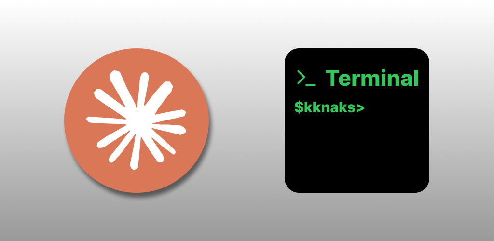
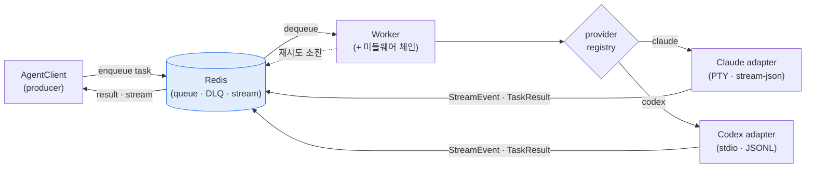

# 개요

open-kknaks 는 Claude Code·Codex 같은 코딩 에이전트 CLI 를 백그라운드 작업 큐로 돌리는 Python 라이브러리다. CLI 를 직접 부르면 한 번에 한 작업씩, 결과를 받아 쓰고 재시도·비용 제한·스트리밍을 매번 손으로 붙여야 한다. open-kknaks 는 프롬프트를 큐에 넣으면 워커가 대신 실행하고, 결과·스트림·재시도·비용을 큐가 관리한다. 스크립트에서 에이전트 여러 개를 비동기로 돌리려는 개발자를 위한 것이다.

Claude Code 전용 실행 큐로 시작해, task 마다 provider 를 골라 Codex headless 실행도 같은 큐에 태우는 구조로 넓혔다. 라이브러리·CLI·MCP 서버 세 인터페이스로 쓸 수 있고, PyPI 에 `open-kknaks` 로 올라가 있다. 기능을 문서(spec)로 먼저 확정하고 구현했다.

> 기능 명세 11 · provider 2(Claude·Codex) · 인터페이스 3(라이브러리·CLI·MCP) · 미들웨어 6 · 테스트 232 통과 · PyPI v2.0.2

# 주요기능

## 태스크를 맡긴다

| 구분 | 내용 |
|---|---|
| **기능** | 프롬프트를 큐에 제출하고 결과를 비동기로 받는다 |
| **목적** | CLI 를 붙들고 기다리지 않고, 여러 작업을 던져 두고 결과만 거둔다 |
| **효과** | 에이전트 실행이 오래 걸려도 제출하는 쪽은 블로킹되지 않는다 |

- **비동기 제출** — `AgentClient.submit()` 에 prompt 와 provider·model·공통 `options`·provider 별 `provider_options` 를 실어 제출하면 task id 를 즉시 돌려받는다. `result()` 로 최종 결과를, `stream()` 으로 text·tool_use·tool_result·cost 이벤트를 실시간으로 본다
- **provider·model 선택** — 같은 submit API 로 Claude 든 Codex 든 고른다. provider 를 생략하면 `claude` 로 실행돼 기존 사용법이 그대로 산다
- **배치** — 여러 prompt 를 batch id 하나로 묶어 던지고, 개별 task 상태를 합산한 batch 상태로 진행을 추적한다

## 워커가 실행하고 지킨다

| 구분 | 내용 |
|---|---|
| **기능** | 워커가 큐에서 task 를 꺼내 에이전트 CLI 를 실제로 실행한다 |
| **목적** | 실행·재시도·타임아웃·비용 같은 운영 관심사를 워커가 대신 진다 |
| **효과** | 실행 코드에 손대지 않고 재시도·예산·속도 제한을 껴 넣는다 |

- **provider adapter** — Claude 는 PTY, Codex 는 stdio 로 각자 방식대로 실행하되, 결과는 같은 `TaskResult`·`StreamEvent` 로 돌아온다. 세션 이어가기(`resume`)도 두 provider 공통으로 다룬다
- **미들웨어 6종** — 로깅·재시도·타임아웃·비용 예산·요청 속도 제한·콜백을 워커에 끼운다. 비용이 예산을 넘으면 실행 전에 막고, 실패는 지수 백오프로 재시도한다
- **DLQ** — 재시도로도 안 되는 task 는 Dead Letter Queue 로 보내고, 나중에 목록을 보고 다시 넣거나 비운다

## 운영하고 연동한다

| 구분 | 내용 |
|---|---|
| **기능** | CLI 로 큐를 운영하고, MCP 로 도구 스키마를 노출한다 |
| **목적** | 워커 기동·조회·DLQ 관리를 터미널에서, 에이전트 연동은 표준 프로토콜로 |
| **효과** | 라이브러리를 코드 밖에서도 굴리고, 도구 목록을 에이전트에 알린다 |

- **CLI** — `open-kknaks worker / task / queue / dlq` 로 워커를 띄우고, task 상태·결과를 조회하고, DLQ 를 관리한다
- **MCP 서버** — `.mcp.json` 에 등록하면 `submit_task`·`get_result` 등 13개 도구 스키마를 노출한다. 현재는 스키마와 안내를 돌려주는 문서형 서버로, 실제 큐 작업은 라이브러리·CLI 가 맡는다
- **Docker examples** — Redis·워커·데모 웹 UI 를 Compose 로 묶어, PyPI 배포판을 설치해 Claude·Codex 실행을 end-to-end 로 검증한다

# 핵심 설계

**Claude·Codex 를 같은 큐 계약에 태웠다.** Codex 를 붙일 때 워커에 `if claude … elif codex` 분기를 심는 대신, task 의 `provider` 값으로 registry 에서 runner adapter 를 찾아 부르는 구조로 갔다. Claude 의 PTY·stream-json 과 Codex 의 stdio·JSONL 은 실행 방식이 달라도 큐·결과·스트림 계약은 하나로 유지된다. provider 를 더 늘려도 adapter 하나를 추가할 뿐 워커를 다시 짜지 않는다.

**클라이언트는 CLI 를 직접 부르지 않는다.** producer(`AgentClient`)는 task 를 Redis 에 넣고 task id 만 돌려받고, 무거운 CLI 실행은 워커가 큐에서 꺼내 맡는다. 큐가 둘 사이의 경계다. 그래서 제출하는 쪽은 실행이 오래 걸려도 멈추지 않고, 워커 수를 늘려 동시 실행량을 키운다.

**스트림 파서에서 최종 결과와 중간 스트림을 갈랐다.** Claude CLI 의 stream-json 에서 `result` 메시지는 cost 와 최종 텍스트를 함께 담는데, 초기 파서는 cost 가 있으면 텍스트를 버려 결과가 사실상 중간 메시지 모음이 됐다. 여기에 partial 청크가 경계마다 끊겨 한글이 `안\n녕하세요` 로 쪼개지는 버그가 겹쳤다. v2.0 에서 `TaskResult.result`(최종 텍스트)와 `.stream`(디버깅용 합본)을 분리해 깔끔한 결과는 `result` 에서만 받게 했고, 마이그레이션을 동반한 breaking change 로 끊었다.

**운영 관심사를 미들웨어 체인으로 뺐다.** 재시도·타임아웃·비용·속도 제한을 실행 코드에 섞지 않고 `before_process`·`after_process` hook 으로 감싸는 함수형 체인으로 분리했다. 사용자는 `MiddlewareBase` 를 구현해 자기 hook 을 끼운다. 재시도는 예외를 잡은 경우만 하고, 인증·과금 오류는 재시도하지 않고 DLQ 로 보낸다.

# 아키텍처

producer·broker·worker·runner adapter 네 층으로 나뉜다. 핵심은 **클라이언트가 CLI 를 직접 실행하지 않는다는 점** — 제출과 실행을 Redis 큐가 가른다. 워커는 task 의 provider 를 보고 registry 에서 adapter 를 골라 실행하고, provider native 이벤트를 공통 `StreamEvent` 로 바꿔 돌려준다.

- **AgentClient** — task 를 큐에 넣고 `status`·`result`·`stream`·`cancel` 로 추적한다. CLI 를 직접 부르지 않는다
- **Redis broker** — 우선순위 큐·결과·스트림·DLQ 를 맡는 브로커
- **Worker** — 큐에서 task 를 꺼내 실행하고, 미들웨어 hook 으로 재시도·비용·타임아웃을 건다
- **provider adapter** — Claude(PTY)·Codex(stdio)를 각자 방식으로 실행하고 결과를 공통 계약으로 정규화한다

# 기술스택

| 영역 | 스택 |
|---|---|
| 런타임 | Python ≥3.10 (POSIX — Linux·macOS, PTY 의존) |
| 큐·모델 | Redis · Pydantic v2 |
| 인터페이스 | 라이브러리 API · Typer (CLI) · MCP |
| 실행 대상 | Claude Code CLI (PTY) · Codex CLI (stdio) |
| 관측·운영 | structlog · 미들웨어 체인 (retry·timeout·cost·rate limit) |
| 빌드·품질 | hatchling · hatch-vcs · pytest (+asyncio·fakeredis) · mypy strict · ruff |
| 배포 | PyPI · GitHub Actions · Docker Compose (examples) |
