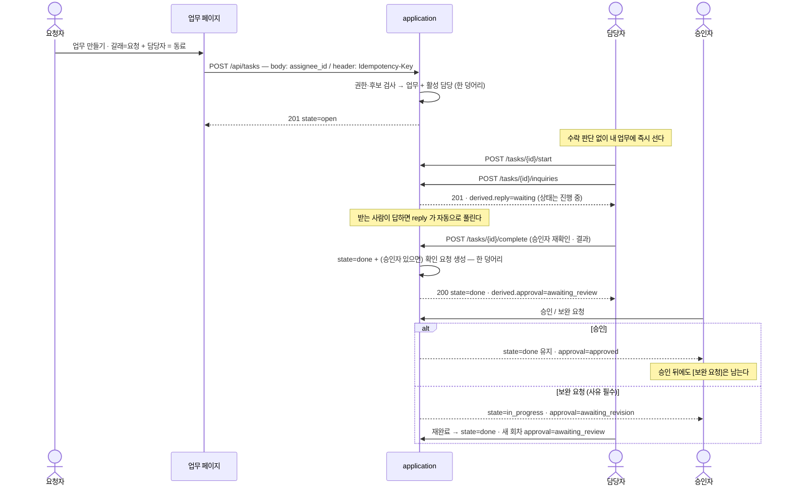
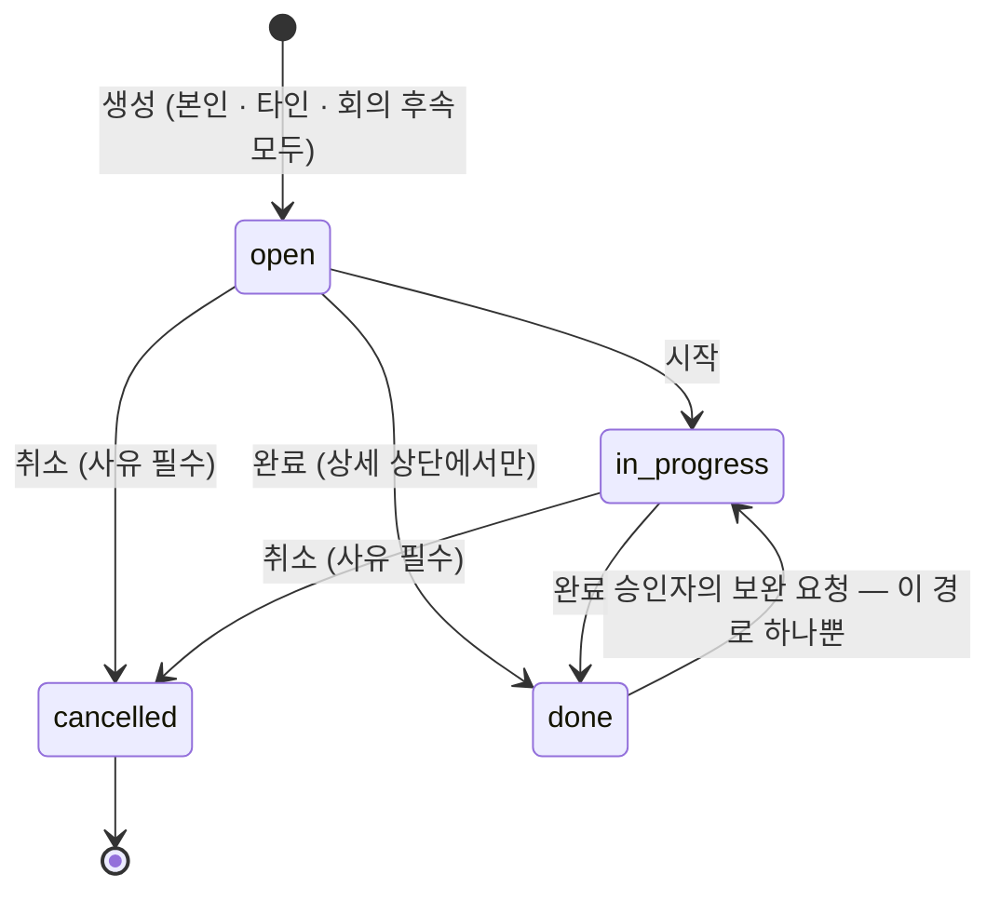
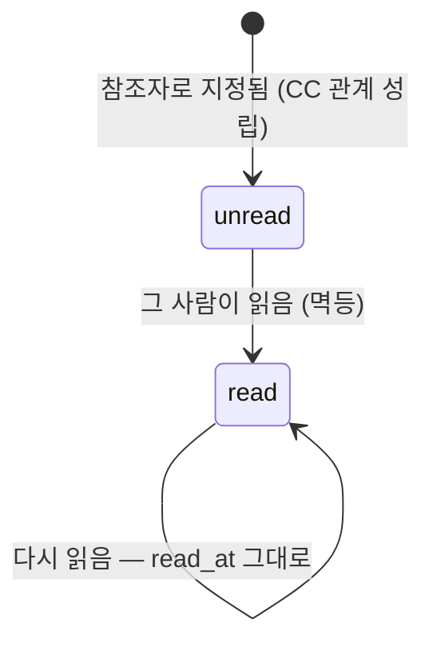
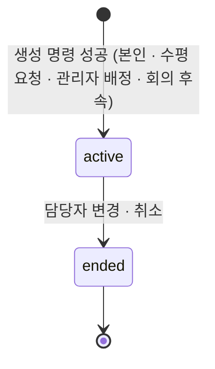

# 업무 관리 — 생성·타인 배정·수행·완료와 업무 페이지

업무를 만들고(본인·타인), 수행하고, 묻고, 끝내는 계약과 그것이 업무 페이지에 어떻게 보이는지를
정한다. 완료 뒤의 승인 판단과 답하면 끝나는 목록은 SPEC-002 가 갖는다.

> **⚠ 이 SPEC 의 일부 절은 SPEC-003 이 대체한다** (2026-09-17, DEC-002).
> 대체되는 곳 —
> §4 API Contract 의 **일반 요청 즉시 배정**(`POST /api/work-requests` 와 **`POST /api/tasks` 의
> 타인 담당 갈래** 둘 다. **입구는 그대로이고 응답 단계만 바뀐다** — 그 갈래는 W1 에서도 수평 요청이다.
> **201 본문의 묶음 모양은 그대로다**(그 입구는 Task 투영 하나). 바뀌는 것은 그 Task 의 값이다) ·
> §4 State / Lifecycle 의 **담당 관계** · §4 Data Contract 의 요청 출처 상태 **`assigned`** ·
> §4 Validation·Data 의 **`approver_id` 0..1 지정**(「승인자는 0명 또는 1명」) — **요청 Task 에 한해**
> (확인자가 요청자로 고정된다. 본인·배정 업무에는 그대로 쓰인다) ·
> §5 **「수락 명령의 존치」** 전체 · §5 권한표의 **「내용·제목 수정 — 아무도 못 한다」** ·
> §5 권한표 **「업무 취소」** 중 **수락된 요청 Task** 부분(제안–동의로만 취소된다) ·
> §6 W1 인수조건 중 **일반 요청 경로에 걸린 다섯 항목** — 「상대의 `내 업무` 에 `시작 전` 한 건이
> **즉시 나타나고 바로 시작할 수 있다**」 · 「**상대 수락이 요구되지 않는다**」 ·
> 「신규 **요청**/배정이 수락용 판단 항목·수락 대기 배정·재상신 회차를 만들지 않는다」의 **요청 부분** ·
> 「신규 생성 경로에 **배정 거절 명령이 없다**」의 **요청 부분** ·
> 「신규 수평 요청의 출처 상태가 **`assigned`** 이고 … **수신함에 서지 않는다**」.
> **줄 번호로 지목하지 않는다** — 이 안내가 들어가며 본문 줄이 밀렸다(2026-09-17 재검수 1차 정정).
> **대체되지 않는 것** — 「본인 업무는 한 건만 서고 수락 카드가 생기지 않는다」 ·
> 「요청 권한이 타인의 **기존 업무**에 대한 권한을 넓히지 않는다」 ·
> 「관리자 직접 배정의 **조직 범위 검사**」 · **멱등 키 항목 전부.**
> **관리자 직접 배정(`POST /api/tasks/assign`)은 이번에 손대지 않는다** — 즉시 활성 담당 그대로다.
> 그 자리의 현재 계약은 SPEC-003 §1 「대체 관계」가 목록으로 갖는다.
> **나머지는 그대로 정본이다** — 멱등 키 · 활성 담당 유일성 · 권한 재검사 · 문의와 회신 대기 ·
> 상태 메모 · 진행 기록 · 기한 두 값 · AX 실행 확인 · 표면 일치.
> **이 문서의 본문과 버전 이력은 지우지 않는다.** W1 구현이 왜 그렇게 섰는지의 출처다.

> **초안이다.** 검수 전이며 `status: draft`.
> 이 문서는 사용자·QA·client·외부 통합에 드러나는 **외부 계약**만 갖는다.
> 현행 코드와의 차이·근거 줄·표면 목록은 **BASE-001** 이 갖고, 구현 순서와 작업 지시는
> `30-work/` 몫이다. 여기서는 BASE-001 의 절을 이름으로 가리킨다.

## 1. Context

### Meta

- Decision reference: `DEC-001` (frontmatter `links.decisions` 와 일치)
- Baseline reference: `BASE-001` (frontmatter `links.baselines` 와 일치)
- 요구 출처: `ax-workspace#7` W1 · W2, 회사 기획 PLAN-001 · SCREENDEF-004(고정 revision).
  줄 단위 근거는 BASE-001 § 회사 원문이 이미 닫은 것.
- Domain note: 외부에 드러나는 것은 수행 상태 넷, 파생 표시 넷, 담당 관계의 활성 여부,
  기한 두 값(계획·실제), 승인자 0..1, 상태 메모, 문의·요청. 내부 schema 는 코드와 migration 이 SoT.
- Open questions: OQ-A(사용자 답변 대기) · D2 · 위임전결 순서 값 · OQ-H~OQ-K(2026-09-19). §7 참조.
- 2026-09-19 2차 갱신: **업무 만들기 창의 최종 프레임**(DEC-001 D-21) — §2 U-6 을 전면 개정하고
  U-13 을 그 탭에 맞춘다. **계약은 바뀌지 않고 자리가 바뀐다.** 실행 WP 는 WORK-003 이 갖는다.
- 2026-09-19 갱신: **참조 수신함 읽음**(DEC-001 D-19)과 **프로젝트 선행업무**(DEC-001 D-20)를
  목표 계약으로 내린다. 두 절은 **현행 동작과 목표 계약을 표로 갈라** 적는다 — 현행은 근거이지
  계약이 아니다. 앞서 선 계약을 지우지 않고 더한다.

### Business Requirement

지금은 남에게 일을 넘기는 데 두 번의 사람 판단이 든다 — 보내는 사람의 생성, 받는 사람의 수락.
받는 사람이 답하지 않으면 일이 어디에도 없다. 끝냈다는 사실은 요청자의 승인 전까지 별도 상태로
떠서 담당자 화면에서 완료가 완료로 보이지 않는다. 막혔다는 사실은 사람이 직접 올리고 내리는
상태값이라 누구에게 무엇을 물었는지가 어디에도 남지 않는다.

이 SPEC 이 보장하는 것은 넷이다.

1. **한 번의 명시적 생성 명령으로 업무가 실재한다.** 본인 것이든 남에게 보낸 것이든,
   명령이 성공하면 담당자가 정해진 업무가 그 사람의 목록에 즉시 있다.
2. **완료 명령이 성공하면 완료다.** 승인은 완료를 막는 관문이 아니라 완료에 붙는 확인이고,
   미결인 동안에만 파생 표시로 드러난다.
3. **기다림은 상태가 아니라 표시다.** 제품 안의 기다림은 문의를 보내면 자동으로 붙고 답이 오면
   자동으로 풀린다. 제품 밖의 기다림은 상태 메모가 받는다.
4. **상태는 「나에게」 어떤 상태인가를 낸다.** 같은 업무가 사람마다 다르게 보이는 것이 정상이다.

### Scope

**In scope**

- 본인 업무의 명시적 생성, 그리고 **같은 명령**으로 수신자를 지정한 타인 배정
- 관리자 직접 배정 — 기존 배정 권한과 조직 범위를 그대로 유지
- 기존 업무의 담당자 변경 — 신규 생성과 **다른 명령·다른 권한**
- 수행 상태 넷의 전이와 파생 표시 넷
- 계획 기한(박제)과 실제 기한, 담당자의 실제 기한 변경
- 완료 명령과 그 결과(항상 완료), 승인자가 있을 때의 확인 요청 발생
- 보완 요청에 따른 복귀와 재완료 회차, 마지막 판정자의 되돌리기
- 문의·결정 요청 발송 → 회신 대기 자동 부착 → 답변 시 자동 해소, 그리고 상태 메모
- 업무 취소(직접 실행·사유 필수·되돌릴 수 없음)
- 회의 후속업무 승격이 위와 **같은 생성 명령·권한·멱등성**을 쓰는 것
- 업무 페이지 — 축 셋, 축별 칩, 행 액션 하나, 생성 창, 상세(내용 → 값 → 자료 → 진행 기록)
- **참조(CC) 참고 업무의 수신함 읽음** — 읽음 명령·사용자별 읽음 상태·수신함 미읽음 필터·뱃지.
  `참조 업무` 탭은 읽은 뒤에도 계속 낸다 (DEC-001 D-19)
- **프로젝트 선행업무** — 프로젝트 범위의 다중 선행 선택, 자기/중복/순환 금지,
  finish-to-start 시작 게이트, 생성·수정 payload 의 선행 배열, 간트 연결선을 그릴 데이터,
  생성·수정 창의 프로젝트 선택 (DEC-001 D-20)
- 위 전부의 권한·오류·동시성·멱등성

**Out of scope**

- 완료 승인 판단의 목록·명령·회차 표시 → SPEC-002
- 복수 미응답 문의의 회신 대기 해소·취소 판정 → D2 미확정(§7)
- 회의 화면·회의록 흐름, 승격 후보의 선정과 출처 표시 → 회의 spec.
  **후속 승격의 생성 계약은 In scope 다**
- 수신함·메일·그룹웨어·회의실 예약 → 다음 slice. 원문 차수(수신함 = 1차 최소)는 BASE-001 이 보존
- 반복 업무, 다시 요청·지연 신호, 오늘 표시·캘린더·WBS 화면 → 별도 slice.
  **원문 1차이며 후순위로 내린 것이 아니다**
- 위임전결 순서에 따른 승인자·문의 수신자 **자동 채움** — 순서의 값이 타 문서 소유
- 남의 업무를 조직 단면으로 읽는 화면 — 이 화면의 축이 아니다. 기존 열람 권한과 API 는
  그대로 두고 자리만 옮긴다
- 체크리스트·상위 업무·프로젝트·선행 업무·자료를 **생성의 필수값으로 올리는 것**.
  다섯은 만들기 창의 **선택 탭**에 서지만(U-6 · DEC-001 D-21) **필수 검증에 오르지 않는다**.
  기존 계약과 데이터는 **삭제하지 않고 보존**한다 (DEC-001 D-16 의 보존 규칙 그대로)
- **참고 업무를 만들기 창에서 받는 것** — UI 를 창에서 내린다(D-21). 계약·저장 모델·기존 명령은
  그대로 살아 있고 **업무 상세**에서 단다
- 업무 **요청**(담당자에게 온 것)의 수락·거절 흐름 변경 — 읽음은 **CC 참고 갈래만** 접는다
- 선행 의존의 다른 종류(start-to-start · finish-to-finish · start-to-finish)
- **간트/타임라인 화면 자체** — 연결선을 그릴 데이터만 이번에 (§7 OQ-K)
- 「안 읽음으로 되돌리기」(§7 OQ-I) · `참조 업무` 탭의 읽음 표시(§7 OQ-J)
- 기존 데이터 전환·호환·migration

## 2. UX Contract

### Placement

업무 페이지는 셸의 본문 한 장이고, 좌 레일에 답하면 끝나는 목록(SPEC-002), 우 레일에 캘린더가
선다. 생성은 창 하나, 상세는 한 장이며 값을 받는 액션은 **그 자리에서 인라인으로 펼친다.**

```text
+──────────────────────────────────────────────────────────────+
│ 업무                                                          │
+────────────┬─────────────────────────────────┬───────────────+
│ 답하면     │ [내 업무][보낸 업무][완료 업무]  │ 캘린더        │
│ 끝나는     │            [업무 만들기]        │ (실제 기한)   │
│ 목록       │ (축별 칩)                       │               │
│ (좌 레일)  │ 목록 본문 — 행 액션은 하나      │               │
│            │  └ 행 클릭 → 업무 상세           │               │
+────────────┴─────────────────────────────────┴───────────────+
```

### U-1. 축 탭

- **상태**
  - 정상: `내 업무` · `보낸 업무` · `완료 업무` **셋.** 0건이어도 탭은 남는다 — 사용자가 고른
    축이라 사라지면 어디에 있는지 알 수 없다.
  - `내 업무`·`보낸 업무` 에는 건수를 함께 낸다. `완료 업무` 에는 내지 않는다.
  - 로딩: 탭은 그리고 본문만 영역 단위로 로딩한다. 한 영역이 늦어도 나머지는 조작할 수 있다.
  - 에러: 탭 유지, 본문에 안내와 다시 시도.
- **문구**: `내 업무` · `보낸 업무` · `완료 업무`
- **CTA**: 탭 전환. 항상 활성.
- **기대 결과**: 본문 목록만 바뀐다. 축마다 칩·열·행 액션이 함께 바뀐다.

**축이 무엇을 담나** — 가르는 기준은 「누가 움직여야 끝나는가」 하나다.

| 축 | 담기는 것 | 상대 열 | 종류 칩 |
|---|---|---|---|
| 내 업무 | **내가** 움직여야 끝나는 것 — 직접 해야 끝나는 것(배정받은 업무 · 보완 요청을 받아 돌아온 것)과 **답하면 끝나는 것**(문의 요청 · 승인 요청). 답하면 끝나는 항목도 내 판단이 남았으므로 상태는 `진행 중` | 「요청자」 · 이름만. **내가 만든 업무는 「나」** | 답하면 끝나는 둘에만 |
| 보낸 업무 | **남이** 움직여야 끝나는 것. 상태는 그 담당자의 상태를 그대로 비춘다 | 「담당자」 · 이름만 | 없음 |
| 완료 업무 | **아무도 안 움직여도 되는 것** — 완료되거나 취소된 것, 그리고 내가 답을 끝낸 문의·승인 요청. 확인만 남은 것도 여기다. **보완 요청을 받으면 「내 업무」로 돌아간다** | 「상대」 · 값에 역할(담당자·요청자·승인자) | 없음 |

### U-2. 축별 칩

칩은 **「이럴 때 이걸 본다」가 있을 때만** 만든다. 상태값이라서 만들지 않는다.
하나만 켜지고 기본은 `전체` 다.

| 축 | 칩 |
|---|---|
| 내 업무 | `전체` · `회신 대기` · `기한 지남` |
| 보낸 업무 | `전체` · `시작 전` · `기한 지남` |
| 완료 업무 | `전체` · `승인 대기` · `취소` |

- **없는 것**: `진행 중` 칩(모아 놓고 할 일이 없다) · `막힘` 칩(그 상태가 없다).
- `기한 지남` 은 상태와 무관하게 겹쳐 세고 **늘 맨 끝**에 둔다.
- **기대 결과**: 목록만 좁아진다. 비면 U-6 의 필터 빈 상태.

### U-3. 목록 행

- **상태**: 제목 · (내 업무면) 종류 칩 · 상대 · 기한 · 상태 · 파생 표시.
- **기한**: 목록은 **실제 기한만** 낸다. 계획 기한과 밀린 이력은 상세가 낸다.
  `완료 업무` 에서만 기한 자리에 **완료일**이 들어가고 완료일 내림차순으로 선다.
- **기한 경과일**: 실제 기한을 넘긴 행에만 날짜 뒤에 `+N` 을 붙인다. 진행률은 쓰지 않는다.
- **상태**: 네 값 중 하나를 **글자로** 낸다(색으로 내지 않는다). 파생 표시가 그 뒤에 붙는다.
  **표시 전용이다** — 상태를 바꾸는 조작은 행 액션과 상세가 갖는다.
- **정렬**: 기한 오름차순, 없는 것 맨 뒤, 기한이 같으면 최근에 등록된 것이 위.

### U-4. 행 액션 — 그 상태의 다음 한 걸음 **하나**

액션 칸은 **모든 행에 있고** 할 게 없는 행은 빈다. 버튼이 있는 행만 높이가 늘어나지 않는다.

| 축 · 행 | 액션 |
|---|---|
| 내 업무 · `시작 전` | `[시작]` |
| 내 업무 · `진행 중`(회신 대기·보완 요청 포함) | `[완료]`. 회신 대기 행에는 `[다시 요청]` 이 함께 |
| 내 업무 · 문의 요청 행 | `[답변]` — 행 안에서 답변 칸이 펼쳐지고, 답하면 그 행이 `완료 업무` 로 간다 |
| 내 업무 · 승인 요청 행 | `[승인]` `[보완 요청]` (계약은 SPEC-002) |
| 보낸 업무 · `시작 전`·`진행 중` | `[다시 요청]` |
| 완료 업무 · `완료 · 승인 대기` | `[다시 요청]` |
| 그 밖 | 없음 — 행을 눌러 상세로 |

- **`[완료 해제]` 는 없다.** 보완 요청을 받으면 이미 `진행 중` 이라 되돌릴 것이 없다.
- `[다시 요청]` 은 **같은 상대에게 하루 한 번**이다. 오늘 이미 보냈으면 비활성이다.
- 조건이 안 맞으면 누른 뒤에 막지 않고 **버튼을 비활성으로 둔다.**

### U-5. 빈 상태·필터 빈 상태

- 데이터가 없는 것과 필터 때문에 안 보이는 것을 다르게 그린다.
- 축이 0건: 목록 영역만 빈 상태를 그린다. **탭은 남는다.**
- 필터 빈: "이 조건에 해당하는 업무가 없습니다" + `필터 해제` → `전체` 로 돌아간다.

### U-6. 업무 만들기 창 — 한 모달, 갈래 토글, 왼쪽 탭 넷

> **2026-09-19 전면 개정**(DEC-001 D-21). 이 절의 이전 판은 「한 기둥에 길게 이어 붙은 필드」와
> 「체크리스트·하위 업무·참고 업무는 이 창에 없다」를 적고 있었다. 확정 프레임이 그 자리를
> 바꾼다. **계약(멱등성·권한·필수값)은 바뀌지 않는다** — 바뀌는 것은 **무엇이 어느 자리에
> 서는가**다.

**골격은 넷이다** — 머리 · 왼쪽 세로 탭 · 스크롤하는 판 · 발. 늘어나는 것은 판 안쪽뿐이고
**갈래를 바꿔도 창은 하나**다.

```text
+──────────────────────────────────────────────────+
│ 새 업무 추가                      [업무|요청]     │  ← 머리 한 줄
+──────────┬───────────────────────────────────────+
│ 필수     │                                       │
│  기본정보│   (고른 탭의 판. 넷 다 그려 두고 숨긴다)│
│ 선택     │                                       │
│  체크리스트                                      │
│  업무 연결                                       │
│  자료    │                                       │
+──────────┴───────────────────────────────────────+
│                        [취소]  [업무 추가]        │  ← 발
+──────────────────────────────────────────────────+
```

- **판 넷을 다 그려 두고 숨긴다.** 탭을 옮겨도 적어 둔 값과 스크롤 위치가 남는다.
- **제목은 갈래가 정한다** — `업무` 면 **「새 업무 추가」**, `요청` 이면 **「새 업무 요청」**.
- **토글은 만들 수 있는 갈래가 둘일 때만 선다.** 하나뿐이면 그 갈래로 고정되고 토글이 없다.
- **필수는 `기본 정보` 하나다.** 선택 탭 셋에는 아무것도 안 채워도 만들어진다.

**U-6-a. 기본 정보 — 갈래로 갈린다**

| 줄 | `업무` | `요청` | 필수 |
|---|---|---|---|
| 제목 | `업무 제목` | `요청할 업무 제목` | ✔ |
| 날짜 | `시작일` \| `마감일` | `시작일` \| `희망 기한` | — |
| 담당자 | **줄이 없다** | `담당자` — **한 명** | 요청만 ✔ |
| 내용 | `업무 내용` | `요청 내용` | — |
| 사람 | `참조자`(여러 명) \| `결재자`(한 명) | `참조자`(여러 명) \| `결재자`(한 명) | — |

- **`업무` 갈래는 담당자를 묻지 않는다.** 화면에 칸이 없고 **서버가 현재 사용자를 담당자로
  기록**한다. 남에게 보내는 길은 `요청` 갈래 하나다 — 같은 일을 두 방법으로 하게 두지 않는다.
- **`요청` 갈래에도 시작일이 선다.** 요청 생성 입력이 이미 시작일을 받는다.
- **`참조자` 는 두 갈래 모두 저장된다.** 「업무로 만들면 저장되지 않는다」는 뜻의 문구를
  **쓰지 않는다** — 사실이 아니다.
- **`결재자` 는 화면 라벨이고 계약상 이름은 승인자다**(§4 `approver_id`). 0..1명, 비울 수 있고,
  담당자 본인은 고를 수 없으며, `승인 대기` 뒤에는 바뀌지 않는다(U-9 · §5 권한).
  **`업무` 갈래의 결재자만 이번에 저장·조회 계약이다** — `요청` 갈래는 §7 OQ-M 이 열려 있어
  칸은 서되 저장 계약을 굳히지 않는다.
- `출처` 줄은 밖에서 온 것(회의 후속·AX 제안)으로 세울 때만 선다. **직접 만들기면 줄이 없다.**
- 제출 중에는 버튼이 비활성이고 **두 건이 만들어지지 않는다.**

**U-6-b. 선택 탭 셋**

| 탭 | 담는 것 | 비고 |
|---|---|---|
| `체크리스트` | 시작 단계를 줄로 더한다 | 비워도 만들어진다. 요청이면 그 사람의 업무에 그대로 선다 |
| `업무 연결` | `상위 업무`(단일) · `프로젝트`(단일) · `선행 업무`(복수) | U-13 이 계약을 갖는다 |
| `자료` | 붙일 파일을 고른다 | **두 단계다** — 창에서는 고르기까지, 실제 첨부는 생성 성공 직후 |

- **`참고 업무` 를 이 창에서 내린다.** 참조자(사람)와 참고 업무(업무)가 한 판에서 「참조」라는
  같은 낱말로 섞여 읽히기 때문이다. **입력 필드·저장 모델·기존 명령은 그대로 남고**(DEC-001 D-16),
  참고 업무를 다는 자리는 **업무 상세**다(U-7 자료·연결 구획).
- **붙일 수 없는 갈래에서 고른 파일을 조용히 버리지 않는다.** 왜 함께 붙지 않는지 말한다.
- 링크 자료는 **업무를 만든 뒤 상세에서** 붙인다 — 만들기 전에는 붙일 업무가 없다.

**U-6-c. CTA 와 결과**

- **CTA**: `[업무 추가]` / `[업무 요청 보내기]` — 필수(제목, 요청이면 담당자)가 차기 전 비활성.
  `[취소]` — 입력이 있으면 확인을 받는다.
- **기대 결과**: 창이 닫히고 `업무` 는 `내 업무`, `요청` 은 `보낸 업무` 에 즉시 나타난다.
  상태는 `시작 전` 이다.
- **한 번의 생성 명령**이다. 탭이 넷이어도 명령은 하나이고 멱등 키도 하나다(§5 멱등성).
  자료 첨부만 그 뒤의 별도 단계다.

**U-6-d. 이 창이 강제하지 않는 것**

- 체크리스트·상위 업무·프로젝트·선행 업무·자료는 **전부 선택**이다. **필수값이 아니다.**
- 선택 탭에 서는 것과 필수 검증에 오르는 것은 다른 말이다 — DEC-001 D-16 의 「1차 생성 계약과
  **필수 검증**에 올리지 않는다」는 그대로다.

### U-7. 업무 상세

구획 순서는 고정이다. **값이 없는 줄은 세우지 않는다.**

| 구획 | 내용 | 조건 |
|---|---|---|
| 머리 | 제목 · 상태 + 파생 표시 · 「메모」 라벨을 단 상태 메모 한 줄 | 메모는 비어 있으면 줄이 없다 |
| 내용 | 제목 첫 줄을 뺀 나머지 | 나머지가 없으면 줄이 없다 |
| 출처 | 누가 · 어느 채널 · 언제 + 원문 제목 한 줄 | **직접 만든 업무에는 구획 자체가 없다** |
| 값 | 담당자 · 요청자 · 기한 · 승인자 · 프로젝트 · 선행업무 | **요청자가 나면 줄이 없다.** 승인자·프로젝트·선행업무가 비면 그 줄이 없다 |
| 자료 | **한 구획.** 여기서 붙인 것과 자료 쪽에서 걸려 온 것을 같은 목록으로 낸다 | 0건이면 구획이 없다 |
| 진행 기록 | 시간순 한 이력 | 0건이면 구획은 있고 목록만 빈다 |

- **기한**: 실제 기한을 먼저 내고 계획 기한을 뒤에 「계획 09-08」로 붙인다.
  **둘이 같으면 계획을 내지 않는다.**
- **자료**: 어느 쪽에서 왔는지를 **화면에 내지 않고** 올린 사람과 날짜만 낸다.
  행에 `[열기]`(새 창) · `[내려받기]`(파일일 때만) · `[떼기]`.
  **`[떼기]` 는 올린 사람에게만 선다.** 자료 쪽에서 걸려 온 줄에는 서지 않는다.
  뗀 것은 이 업무에서만 빠지고 자료에는 남으며 진행 기록에 쌓인다.
- **자료 권한**: 볼 권한이 없는 **그 줄만** 빠지고 구획은 남는다. **몇 건이 빠졌는지도 내지
  않는다** — 건수를 내면 그것만으로 존재가 샌다. 볼 수 있는 줄이 하나도 없으면 구획이 없다.
- **진행 기록**: 줄마다 날짜 + 시각, 최근이 위, 20건씩 이어 붙인다. 연달아 붙은 값 변경은
  한 줄로 접히고 사람이 쓴 것은 접지 않는다. **고치는 자리가 없다** — 새 기록을 단다.
  되돌려도 지우지 않아 1차 기록 · 보완 요청 사유 · 2차 기록이 나란히 남는다.
- **CTA 자리**: 상단 고정에 상태 전환·문의·요청·메모·판정, 값 옆 `[수정]` 에 담당자·기한·승인자,
  진행 기록 안에 문의 `[답변]` 과 `[기록 추가]`, 버튼 줄 오른쪽 끝에 `[업무 취소]`.
- **상태 전환은 상세에서 `시작 전` 일 때 `[시작]` 과 `[완료]` 둘 다 낸다.** 시작하지 않고 바로
  끝난 일을 두 번 누르게 하지 않는다. **행 액션과 다르다** — 행은 다음 한 걸음 하나다(U-4).

### U-8. 인라인 칸 — 담당자 수정 · 상태 메모 · 문의 요청 · 완료

값을 받는 액션은 **그 자리에서 펼친다. 창을 열지 않고 한 번에 하나만 펼친다.**

- **담당자 `[수정]`**: 값 자리에서 사람 찾기가 펼쳐진다. **고르면 바로 넘어간다.**
  사유를 남기고 관계자에게 알림만 간다. 이전 담당자의 `내 업무` 에서 빠진다.
- **`[메모 추가]`**: 지금 어떤 상황인지를 한 자리에 적는다(최대 200자). 적은 것은 머리의
  상태 줄 아래에 그대로 나온다. **표시가 안 붙는 지연(거래처 회신 등)을 여기에 남긴다.**
  지금 값 하나만 갖고 이력은 진행 기록에 쌓인다.
- **`[문의 요청]`**: 종류를 고르면 그 종류의 줄만 선다.

  | 종류 | 그 아래 서는 줄 | 필수 |
  |---|---|---|
  | 문의 | 받는 사람 · 내용 · 자료 · 기한 | 받는 사람 · 내용 |
  | 결정 요청 | 컨펌 주체 · 내용 · 선택지 · 권고 · 안 정하면 무엇이 멈추나 · 기한 · 자료 | 컨펌 주체 · 내용 · 선택지 2안 이상 |

  받는 사람은 위임전결 순서로 추천이 채워지고 바꿀 수 있다. 추천을 만드는 순서의 **값**은
  이 제품 밖이며, 값이 서기 전에는 **빈 채로 사람이 고른다**(§7).
- **`[완료]`**: 승인자를 **한 번 더 확인하고** 결과를 받는다. 결과는 선택이다.
  승인자가 비어 있으면 그 자리에서 넣을 수 있다.

### U-9. 상태와 파생 표시

- **상태 넷**: `시작 전` · `진행 중` · `완료` · `취소`. **「나에게」 어떤 상태인가**를 낸다.
- **파생 표시 넷**: `회신 대기` · `승인 대기` · `승인됨` · `보완 요청`.
  상태 뒤에 붙고 **상태를 바꾸지 않는다.** 유형을 가르지 않는다 — 무엇을 기다리는지는
  진행 기록과 상태 메모가 낸다.

| 표시 | 언제 | 어디 |
|---|---|---|
| `회신 대기` | 문의·결정 요청을 보낸 뒤 답이 오기 전 | `진행 중` 뒤 |
| `승인 대기` | 현재 유효한 완료 승인이 미결 | `완료` 뒤. **`완료 업무` 축에만** 선다 |
| `승인됨` | 승인이 끝났다 | `완료` 뒤 |
| `보완 요청` | 승인자가 보완을 요청했다 | `진행 중` 뒤. 담당자의 `내 업무` 로 돌아온다 |

- `회신 대기` 는 **사람이 올리고 내리지 않는다.** 보내면 자동으로 붙고 답이 오면 자동으로 풀린다.
- 제품 밖 대기는 이 표시가 붙지 않고 **상태 메모**가 받는다.
- **`막힘` 은 없다.** 상태에도 표시에도 없다.

### U-10. 업무 취소

- **상태**: 사유가 필수다. 어느 상태에서도 누를 수 있다.
- **문구**: "취소하면 되돌릴 수 없습니다. 다시 하려면 새로 만듭니다."
- **기대 결과**: 상태가 `취소` 로 바뀌어 **`완료 업무` 축에 남고** 진행 기록도 그대로다.
  **업무를 지우는 자리는 어디에도 없다.**

### U-11. 관리자의 읽기 전용

조직 단면으로 들어온 관리자에게는 구획을 그대로 내되 **상태 전환 · `[완료]` · `[보완 요청]` ·
담당자 `[수정]` · `[취소]` · `[다시 요청]` 을 내지 않는다.** 상단에 남는 것은 `[문의 요청]` 하나다.
버튼을 비활성으로 두지 않고 **아예 그리지 않는다.**

### U-12. 참조 수신함 — 읽으면 접힌다

수신함은 갈래 둘을 담는다 — **업무 요청**(내가 답해야 하는 것)과 **참고**(남이 나를 참조자로
넣은 것). **이 절은 참고 갈래만 바꾼다.** 업무 요청의 수락·거절은 손대지 않는다.

| | 현행 동작 | 목표 계약 |
|---|---|---|
| 참고 항목의 수명 | **처리된 뒤에도 영원히 남는다** | 그 사람이 **읽으면 수신함에서 사라진다** |
| 읽음이라는 상태 | 없다 | **사용자별**로 있다 |
| 뱃지 | 수신함 전체 건수 | 같은 자리, 다만 **읽음 필터가 걸린 뒤의 건수** (§7 OQ-H) |
| `참조 업무` 탭 | 요청 목록에서 읽어 낸다 | **그대로다.** 읽어도 계속 조회된다 |
| CC 관계 | `참조자` 관계 행 | **손대지 않는다.** 읽음은 별도 영수증이다 |

- **상태**
  - 참고 카드에 `[읽음]` 이 선다. **참조자에게만** 그린다 — 권한 없는 사람에게는 비활성이
    아니라 **아예 그리지 않는다**(U-11 과 같은 규칙).
  - 누르는 중에는 비활성이다. 연타해도 두 번 처리되지 않는다.
  - 읽고 나면 그 카드가 **수신함 목록에서 빠지고** 뱃지가 1 줄어든다.
- **문구**: 버튼은 `읽음`. 성공에 토스트를 띄우지 않는다 — 카드가 사라지는 것이 결과다.
- **CTA 둘이 같은 한 명령이다** — `[읽음]` 을 누르는 것과 **참고 업무 카드를 여는 것**.
  카드를 열면 화면이 같은 읽음 명령을 부른다. **조회가 스스로 읽음을 만들지 않는다** —
  읽었다는 사실은 사람이 만든 것이고, 그 명령은 화면이 명시적으로 부른다.
- **기대 결과**: 수신함에서만 사라진다. `참조 업무` 탭·업무 상세·이력은 그대로다.
- **다른 참조자는 그대로다.** 내가 읽어도 다른 사람의 수신함에는 남는다.
- **업무 요청 카드에는 `[읽음]` 이 없다.** 그 갈래는 `[수락]`·`[거절]` 로 접힌다 —
  읽음이 수락을 대신하지 않는다.

### U-13. 선행업무 선택 — 프로젝트를 고른 뒤에만 열린다

선행업무는 업무 만들기 창의 **`업무 연결` 탭**(U-6-b)과 상세의 값 수정에 선다.
그 탭은 줄 셋을 갖는다 — `상위 업무`(단일) · `프로젝트`(단일) · `선행 업무`(복수).
**셋은 서로 다른 관계**이고 한 줄에 섞지 않는다(§4 Data Contract 의 관계 셋 표).

- **상태**
  - `프로젝트` 를 고르지 않았으면 `선행업무` 줄은 **비활성**이고 그 자리에 안내가 선다 —
    "프로젝트를 먼저 선택하면 그 프로젝트의 업무 중에서 고를 수 있습니다."
  - 프로젝트를 고르면 **그 프로젝트에 속한 업무**가 후보다. 여러 개 고른다.
  - 후보에서 **자기 자신**과 **이미 고른 것**은 빠진다. 순환이 되는 것도 서버가 거절하기 전에
    화면이 후보에서 뺀다 — **누른 뒤에 막지 않는다**(U-4 와 같은 규칙).
  - 프로젝트를 **바꾸려는데 선행이 남아 있으면** 바꾸지 못한다. 안내는 "선행업무를 먼저
    비워야 프로젝트를 바꿀 수 있습니다."
  - 고른 선행은 칩으로 서고 각 칩에 `[빼기]` 가 있다.
  - **고른 값은 실제로 저장된다.** 「아직 저장되지 않습니다」류의 안내를 남기지 않는다 —
    저장된 척도, 저장 안 된 척도 하지 않는다.
  - `상위 업무` 는 **여는 쪽이 정해 준 경우 고치지 못한다** — 어느 업무 아래에 매달지는 그 화면이
    이미 정했다(현행 동작 보존).
- **기대 결과**: 저장하면 상세의 `값` 구획에 **`선행업무`** 줄이 서고, 없으면 줄이 없다(U-7).
- **상세의 선행 줄**: 각 선행의 제목과 상태를 낸다. **끝나지 않은 선행은 눈에 띄게** 낸다 —
  그것이 시작을 막는 이유이기 때문이다. 볼 수 없는 선행은 제목 없이 **건수만** 낸다
  (자료 구획과 다르다 — 자료는 건수도 내지 않지만, 여기서는 **막는 이유**를 숨기면 사람이
  다음 걸음을 고를 수 없다).
- **하위 업무와 다르다.** 상위는 「어느 업무의 일부인가」이고 선행은 「무엇이 먼저 끝나야
  하는가」다. 한 줄에 섞지 않는다. **참고 업무와도 다르다** — 참고는 시작을 막지 않는다.

### U-14. 시작이 막혔을 때

- `시작 전` 업무에 **끝나지 않은 선행**이 있으면 `[시작]` 은 **비활성**이고, 왜인지를 그 옆에
  낸다 — "끝나지 않은 선행업무가 있습니다: {제목}".
- 상세 상단의 `[완료]` 도 **같은 이유로 비활성**이다. `시작 전` 에서 바로 완료하는 길
  (§4 State / Lifecycle)이 열려 있으면 시작 게이트에 우회로가 생긴다.
- **취소된 선행은 막지 않는다.** 남은 선행이 전부 완료거나 취소면 버튼이 열린다.
- **이미 시작한 뒤에 선행이 다시 열려도 되돌리지 않는다.** 게이트는 시작 시점 판정이고,
  그 사실은 진행 기록이 갖는다.
- `진행 중` 업무의 `[완료]` 는 선행을 보지 않는다 — 막는 것은 **시작**이다.
  미완 하위가 완료를 막는 것은 **다른 규칙**이고 그대로다.

### U-15. 간트/타임라인의 연결선

- 프로젝트의 업무를 시간 축에 늘어놓을 때 **선행 → 후행** 방향으로 선을 그린다.
- 선의 원천은 업무 줄이 함께 내는 **선행 배열 하나**다. 별도 조회를 부르지 않는다.
- **상위–하위는 다른 그림이다** — 들여쓰기·묶음으로 내고 연결선으로 내지 않는다.
- 이 화면이 어느 자리에 서는지는 아직 열려 있다(§7 OQ-K). **데이터 계약은 이번에 선다.**

## 3. User Scenario

### S-1. 담당자(나) — 본인 업무를 만들어 끝낸다

1. `[업무 만들기]` 를 연다. 갈래는 `업무` 고 **담당자 칸이 없다** — 서버가 나를 담당자로
   기록한다(U-6-a). `출처` 줄은 없다.
2. 제목과 내용을 쓰고 `[업무 추가]`. 성공하면 `내 업무` 에 `시작 전` 한 건이 생긴다.
3. 같은 명령을 재전송해도(네트워크 재시도) 업무는 한 건이다 — §5 멱등성.
4. `[시작]` → `진행 중`. **시작일이 비어 있었으면 그 시점의 업무일을 저장하고, 이미 저장된
   날짜는 이후 전이로 바꾸지 않는다.**
5. `[완료]` → 승인자가 비어 있으면 그 자리에서 넣거나 비운 채 끝낸다. 비운 채면 확인 요청이
   생기지 않고 바로 `완료` 다.
6. 완료한 뒤 `[완료 해제]` 는 없다. 승인자가 없는 이 업무의 복구 경로는 **§7 OQ-A 미확정**이다.

### S-2. 일반 구성원 — 동료에게 업무를 보낸다 (수락 없음)

1. 관리자 배정 권한이 없는 구성원이 `[업무 만들기]` 를 열고 **머리의 토글을 `요청` 으로 바꾼 뒤**
   `담당자` 에서 동료를 고른다(U-6-a). 후보는 내가 보낼 수 있는 사람만 나온다(§5 권한).
2. `[업무 요청 보내기]` 한 번으로 업무와 **활성 담당 관계**가 함께 선다.
3. 동료의 `내 업무` 에 즉시 `시작 전` 으로 나타난다. **수락 판단은 생기지 않는다.**
4. 내 `보낸 업무` 에도 같은 업무가 담당자와 함께 보인다. 상태는 그 담당자의 상태를 비춘다.
5. 본인 업무를 먼저 만들고 관리자에게 재배정을 부탁하는 우회는 필요 없다.
6. 이 권한으로 **동료의 기존 업무를 수정하거나 담당자를 바꿀 수는 없다** — 다른 명령이고
   거부된다(`WORK_REASSIGN_FORBIDDEN`).
7. **잘못 온 배정을 거절하는 명령은 없다.** 출구는 `[문의 요청]` 과 담당자 `[수정]` 이다.

### S-3. 관리자 — 직접 배정하고 담당자를 바꾼다

1. 배정 권한을 가진 사람은 자기 조직 범위 안의 사람에게 직접 배정할 수 있다.
   범위 검사는 **그대로 유지**되고 이번 변경으로 넓어지지 않는다.
2. 배정도 수락을 기다리지 않는다. 상대의 `내 업무` 에 즉시 선다.
3. 기존 업무의 담당자를 바꾸는 것은 **다른 명령**이다. 값 자리에서 고르면 바로 넘어가고
   사유가 남으며 이전 담당자의 목록에서 빠진다.
4. 조직 단면으로 남의 업무 상세를 여는 관리자는 **읽기 전용**이다(U-11).

### S-4. 담당자 — 묻고 기다린다

1. 진행 중에 `[문의 요청]` 을 연다. 종류는 문의 또는 결정 요청이다.
2. 받는 사람은 위임전결 순서로 추천이 채워지고 바꿀 수 있다. **거는 사람의 입장이 가른다** —
   담당자·요청자가 걸면 위임전결 첫 사람, 관리자가 걸면 그 업무의 담당자다.
3. 보내면 **그 즉시 `회신 대기` 가 자동으로 붙는다.** 상태는 `진행 중` 그대로다.
4. 받는 사람의 `내 업무` 에 **문의 요청 종류 칩이 붙은 행**으로 선다.
5. 그 사람이 `[답변]` 하면 **회신 대기가 자동으로 풀리고** 그 행은 그 사람의 `완료 업무` 로 간다.
   오간 것은 전부 내 업무의 진행 기록에 쌓인다.
6. 제품 밖(거래처 등)을 기다리는 것은 `회신 대기` 가 아니라 `[메모 추가]` 로 적는다.
7. 미응답 문의가 여럿일 때의 해소·취소 판정은 **§7 D2 미확정**이다. 하나짜리 흐름은 위대로 선다.
8. 답이 없으면 `[다시 요청]` 으로 재촉한다 — 같은 상대에게 하루 한 번.

### S-5. 담당자 — 승인자가 있는 업무를 완료한다

1. `[완료]` 를 누르면 인라인 칸이 펼쳐져 **승인자를 한 번 더 확인하고** 결과를 받는다.
2. 확정하면 **업무는 그 자리에서 `완료`** 다. 내 `완료 업무` 에 `완료 · 승인 대기` 로 있다.
3. 승인자의 답하면 끝나는 목록에 확인 요청 한 건이 열린다(SPEC-002).
4. 승인자가 `[승인]` 하면 업무는 `완료` 그대로고 표시가 `승인됨` 으로 바뀐다.
5. 승인자가 `[보완 요청]` 하면 업무는 `진행 중 · 보완 요청` 으로 돌아오고 내 `내 업무` 에 다시
   나타난다. 이전 회차의 결과·자료·사유는 지워지지 않는다.
6. 다시 `[완료]` 하면 업무는 다시 `완료` 이고 **새 회차**의 확인 요청이 미결인 동안 `승인 대기`.
7. 완료 확정과 확인 요청 생성은 **한 덩어리**다. 하나만 반영되는 중간 상태는 없다.
8. **`승인 대기` 로 간 뒤에는 승인자를 바꾸지 않는다.**

### S-6. 승인자 — 판정하고, 승인한 뒤에도 되돌린다

1. 답하면 끝나는 목록에서 확인 요청을 연다. 명령·회차 계약은 SPEC-002 가 갖는다.
2. `[승인]` 또는 사유가 필수인 `[보완 요청]` 중 하나를 고른다.
3. **승인된 뒤에도 `[보완 요청]` 만은 남는다** — 완료를 되돌리는 사람은 마지막에 판정한
   사람이다. 그러면 업무가 담당자의 `내 업무` 로 `진행 중 · 보완 요청` 으로 돌아간다.
4. 판정은 **되돌릴 수 없는 사실**로 남는다. 앞선 판정을 지우는 것이 아니라 새 판정을 단다.
5. 승인자가 0명인 업무에는 이 경로가 없다 — **§7 OQ-A 미확정.**

### S-7. 아무나 — 목록을 본다

1. `내 업무` 는 **내가 움직여야 끝나는 것**이다. 직접 해야 끝나는 것과 답하면 끝나는 것이
   함께 있고, 답하면 끝나는 행에만 종류 칩이 붙는다.
2. `보낸 업무` 는 남이 움직여야 끝나는 것이고 상태는 담당자의 상태를 비춘다.
3. `완료 업무` 는 아무도 안 움직여도 되는 것 — 완료·취소된 것과 내가 답을 끝낸 요청이다.
   `승인 대기` 는 **현재 유효한 미결 확인 요청이 있을 때만** 붙는다. 과거에 처리된 판단이나
   다른 종류의 판단이 남아 있다는 이유로는 붙지 않는다.
4. 같은 업무가 사람마다 다른 축·다른 상태로 보이는 것이 **정상이다.**
5. 조직 전체의 업무를 읽는 자리는 이 화면이 아니다.

### S-8. 두 사람이 같은 업무를 동시에 움직인다

1. 두 명령이 같은 업무의 같은 회차를 들고 온다.
2. 먼저 도착한 것만 반영되고 늦은 것은 회차 충돌로 거부된다.
3. 거부된 쪽 화면은 **지금 값으로 다시 불러오되 내가 쓰던 입력은 남긴다.**

### S-9. AX 가 업무를 제안한다

1. AX 도구가 업무 생성·배정을 제안하면 **실행 확인**이 뜬다.
2. 편집 가능 여부·필수값·선택 후보·실행 명령은 **서버가 지금 이 사람에 대해 내려 준다.**
   클라이언트나 자유 텍스트가 추론하지 않는다.
3. 사람이 확인해야 실행된다. **확인 전에는 업무가 만들어지지 않는다.** 읽기만으로는
   아무 업무도 생기지 않는다.
4. 확인 후 실행되는 명령은 화면·REST·MCP 가 쓰는 것과 **같은 계약**이다.
5. 수행자 수락이 사라진 것은 **받는 사람의 판단**이지 **보내는 사람의 실행 확인**이 아니다.

### S-10. 회의에서 나온 일을 업무로 세운다

1. 회의 결과에서 후속업무 후보를 고르고 **사람이 명시적으로** 승격한다. **자동 승격은 없다.**
2. 승격은 U-6 과 **같은 생성 명령·같은 권한·같은 멱등성**을 쓴다. 우회 경로를 따로 두지 않는다.
3. 담당을 지정하면 그 사람의 `내 업무` 에 즉시 `시작 전` 으로 선다 — 수락을 기다리지 않는다.
4. 만들어진 업무는 출처로 그 회의를 갖고 원본 회의로 돌아갈 수 있다.
5. 같은 후보를 다시 승격해도 업무는 한 건이다.
6. 회의 화면·회의록 흐름과 후보 선정은 이 SPEC 밖이다.

### S-11. 참조자 — 참고로 받은 업무를 읽고 치운다

1. 동료가 업무를 만들며 나를 **참조자**로 넣는다. 내 수신함에 `참고` 카드가 서고 뱃지가 1 늘어난다.
2. 카드를 연다. 상세가 **읽기 전용**으로 열리고(수락·거절이 없다), 여는 순간 화면이 **읽음 명령**을 부른다.
3. 수신함으로 돌아오면 그 카드가 **없다.** 뱃지도 1 줄었다.
4. `참조 업무` 탭을 연다. **그 업무가 그대로 있다** — 읽음은 수신함에서만 접는다.
5. 같은 업무의 **다른 참조자**의 수신함에는 그 카드가 **그대로 서 있다.**
6. 네트워크가 끊겨 같은 읽음 명령이 두 번 갔다. **처음 읽은 시각이 그대로고** 오류가 아니다.
7. 나는 참조자가 아닌데 남의 참고 항목에 읽음을 보냈다 — **거절된다.**

### S-12. 요청자 — 프로젝트 안에서 순서를 세운다

1. `[업무 만들기]` 를 연다. `선행업무` 줄은 **비활성**이고 프로젝트를 먼저 고르라고 안내한다.
2. `프로젝트` 를 고른다. `선행업무` 가 열리고 후보는 **그 프로젝트의 업무**다.
3. 두 건을 고른다. 자기 자신은 후보에 없고, 이미 고른 것도 다시 뜨지 않는다.
4. 만든다. 상세의 `값` 구획에 `선행업무` 줄이 서고 두 건이 칩으로 있다.
5. 담당자가 `[시작]` 을 누르려 한다. **비활성이다** — 끝나지 않은 선행의 **제목이 그 옆에** 있다.
6. 상세 상단의 `[완료]` 도 같은 이유로 **비활성이다.** 시작을 건너뛰는 길이 열려 있지 않다.
7. 선행 한 건이 **취소**됐다. 그것은 더 이상 막지 않는다. 나머지 한 건이 `완료` 가 되자
   `[시작]` 이 열린다.
8. 시작한 뒤 선행 하나가 승인자의 **보완 요청**으로 다시 열렸다. **후행은 되돌아가지 않는다** —
   진행 기록에 그 사실만 남는다.
9. 이 업무의 **프로젝트를 바꾸려** 한다. 선행이 남아 있어 **거절된다.** 선행을 먼저 비운다.
10. 순환을 만들어 본다 — A 의 선행에 B, B 의 선행에 A. **두 번째가 거절된다.**

## 4. Interface Contract

### API Contract

목표 계약이다. **현행이 무엇인지는 BASE-001 § 현행 코드 관측이 갖는다.**

| Method | Path | 요약 | 권한 |
|---|---|---|---|
| GET | `/api/my-work` | 내가 활성 담당으로 든 업무 (`내 업무` 축) | 업무 읽기 |
| GET | `/api/tasks` | 내가 보낸 것과 완료된 것을 포함해 읽을 수 있는 업무 | 업무 읽기 |
| GET | `/api/tasks/{id}` | 업무 상세 — 파생 표시 포함 | 업무 읽기 · 관계자 또는 조직 관리자 |
| POST | `/api/tasks` | **업무 생성 — 본인 또는 수신자 지정.** 멱등 키가 **필수**다 | 본인 관리. 수신자 지정 시 그 사람이 내 허용 후보 안 |
| POST | `/api/tasks/assign` | 관리자 직접 배정. 즉시 활성 담당으로 선다 | 배정 권한 + 조직 범위 |
| POST | `/api/tasks/{id}/reassign` | **기존 업무의 담당자 변경** — 사유 필수 | 담당자 또는 배정 권한 |
| PATCH | `/api/tasks/{id}` | 내용·기한 수정. **실제 기한은 담당자가 바꾼다** | 담당자. 회차 필수 |
| POST | `/api/tasks/{id}/start` | 시작 | 담당자 |
| POST | `/api/tasks/{id}/complete` | **완료 — 승인자 유무와 무관하게 완료.** 결과·자료·승인자 재확인을 함께 받는다 | 담당자 |
| POST | `/api/tasks/{id}/cancel` | 취소 — 사유 필수, 되돌릴 수 없음 | 담당자 · 요청자 · 관리자 |
| POST | `/api/tasks/{id}/inquiries` | **문의·결정 요청 발송.** 성공 시 회신 대기가 자동으로 붙는다 | 담당자 · 요청자 · 관리자 |
| POST | `/api/tasks/{id}/inquiries/{inquiry_id}/answer` | **답변.** 성공 시 회신 대기가 자동으로 풀린다 | 그 문의를 받은 사람만 |
| PUT | `/api/tasks/{id}/status-note` | 상태 메모 — 지금 값 하나 | 담당자 |
| POST | `/api/tasks/{id}/reminders` | 다시 요청 — 같은 상대에게 하루 한 번 | 요청자 · 회신 대기의 발신자 · 승인 대기의 담당자 |
| GET | `/api/tasks/{id}/history` | 진행 기록 조회 | 업무 읽기 |
| POST | `/api/tasks/{id}/history` | **진행 기록 추가 — 신규.** 메신저 원문을 붙이거나 구두로 받은 것을 적고 준 사람을 지목한다. 받은 사람이 요약해 적지 않는다. **추가만 되고 고치거나 지우는 경로는 없다** | 담당자 · 요청자 · 승인자 |
| GET/POST | `/api/tasks/{id}/materials` 계열 | 자료 구획 — 붙이기 · 열기 · 내려받기 · 떼기 | 소유 권한 재확인. **떼기는 올린 사람만** |
| GET | `/api/task-assignment-candidates` | 관리자 배정 후보 | 배정 권한 |
| GET | `/api/task-recipient-candidates` | **생성 창 `요청` 갈래의 담당자 후보** — 내가 보낼 수 있는 사람. `업무` 갈래에는 이 칸이 없다(U-6-a) | 본인 관리 |
| POST | `/api/meetings/{id}/…/promote` | 회의 후속 승격 — **위 생성 계약을 그대로 쓴다** | 후속 승격 권한 + 생성 권한 |
| GET/POST | `/api/action-items` 계열 | 답하면 끝나는 목록 | SPEC-002 |
| GET | 수신함 조회 | 내가 답할 업무 요청 + **아직 안 읽은** 참고 항목 | 로그인 구성원 |
| POST | 참고 항목 **읽음** — **신규** | 수신함의 그 참고 항목을 내 수신함에서만 접는다. **멱등** | **그 요청의 CC 참조자만** |
| GET | 요청 목록 조회 (`참조 업무` 탭의 원천) | **읽음 필터가 걸리지 않는다** — 읽은 것도 계속 나온다 | 관계자 |
| GET | 프로젝트 상세 조회 | 그 프로젝트의 업무 줄. **`preceding_task_ids` 를 함께 낸다 — 신규** | 프로젝트 읽기 |

**경로를 이 표에 박지 않은 줄이 넷 있다.** 수신함·요청 목록·프로젝트 상세는 **이미 있는 조회**이고
이 SPEC 이 바꾸는 것은 그 **결과의 범위**이지 자리가 아니다. 읽음 명령은 그 요청 자원 아래
**하위 명령 하나**로 선다(이 레포가 `start`·`complete`·`cancel` 을 다는 그 자리). 실제 경로 문자열은
work 가 기존 라우팅에 맞춰 고정한다 — **표면마다 다른 규칙을 두지 않는다**는 계약만 여기 있다.

같은 계약이 화면 · REST · MCP · AX 실행 경로에 **그대로** 적용된다. 표면마다 다른 규칙을
두지 않는다.

**신규 / 기존 구분** — 아래는 이 SPEC 이 **새로 세우는 것**이다. 기존 경로 재사용으로 얻지 못한다.

| 신규 계약 | 왜 신규인지 |
|---|---|
| 생성 요청의 **필수 멱등 키** | 현행 생성 요청은 멱등 키를 받지 않고, 보내면 거부한다 (BASE-001 § 현행 코드의 사실 정정) |
| **활성 담당의 유일성** 보장 | 현행에 unique 제약이 없다 |
| 수신자 인자를 받는 생성 | 현행 생성은 본인 전용 |
| 문의·결정 요청과 회신 대기 · 상태 메모 | 현행에 없다 |
| 실제 기한 필드와 계획 기한 박제 | 현행 기한은 한 값 |
| 승인자 필드와 담당자의 지정·변경 | 현행 승인자는 요청자로 고정 |
| 다시 요청 | 현행에 없다 |
| **진행 기록 추가** | 현행은 조회만 있다. 원문은 진행 기록을 「생성·조회」로 두고 사람이 직접 다는 길을 요구한다 |
| **참고 항목의 읽음 상태** | 현행 수신함은 CC 참고 항목을 **처리된 것까지 포함해** 낸다 — 읽음이라는 사실 자체가 없다 |
| **수신함의 미읽음 필터와 뱃지** | 현행 뱃지는 수신함 전체 건수다 |
| **선행업무 관계** | 현행에 **없다.** 상위(`parent`)와 참고(`reference`)만 있다 |
| **finish-to-start 시작 게이트** | 현행 전이 판정은 **미완 하위**만 본다 |
| **프로젝트 업무 줄의 선행 배열** | 현행 프로젝트 상세는 `parent_task_id`·`start_date`·`due_date` 만 낸다 |

### Request / Response

**`POST /api/tasks` — 생성**

> **멱등 키는 `Idempotency-Key` 헤더로 받는다. JSON 본문의 필드가 아니다.**
> 본문에 `idempotency_key` 를 실어 보내는 것은 **허용하지 않는다**(알 수 없는 필드로 거부된다).
> 헤더가 없거나 빈 값이면 거부한다. **MCP 는 도구의 명시적 인자**로 같은 키를 받는다(§5 멱등성).

| 필드 | 필수 | 뜻 |
|---|---|---|
| `content` | ✔ | 업무 내용. 첫 줄이 제목이다. 1~200자, 줄바꿈 불가, 앞뒤 공백 제거 |
| `assignee_id` | — | **담당.** 없거나 본인이면 본인 업무, 다른 사람이면 그 사람에게 **즉시 배정** |
| `due_date` | — | **계획 기한.** 생성 시점 값으로 박제된다 |
| `approver_id` | — | 승인자 0..1(화면 라벨 **결재자**). 비울 수 있다. **2026-09-19 부터 값을 받아 저장하고 조회 투영이 낸다** — 그 전에는 저장 자리만 있었다 |
| `source` | — | 밖에서 온 것으로 세울 때의 출처 |
| `project_id` | — | 프로젝트 단일. 선행이 있으면 **필수**가 된다(U-13) |
| `preceding_task_ids` | — | 선행업무 0..N. 같은 프로젝트의 업무만 |
| `parent_task_id` | — | 상위 업무 단일 |
| `cc_member_ids` | — | 참조자 여러 명. **`업무` 갈래에서도 저장된다** |
| `checklist` | — | 시작 단계. 선택 탭 |
| `start_date` | — | 시작일 |
| `reference_task_ids` | — | 참고 업무. **계약으로 남지만 만들기 창에서는 받지 않는다**(U-6-b) — 상세에서 단다 |

> **화면의 두 칸이 payload 의 어디로 가나** — 만들기 창의 `업무 제목`/`요청할 업무 제목` 은
> **업무의 제목**으로, `업무 내용`/`요청 내용` 은 **업무의 본문**으로 간다. 위 표의 `content`
> 는 그 둘을 한 필드로 적어 온 **기존 계약 표기**이고 이번에 재설계하지 않는다 —
> 코드 실물은 제목과 본문을 **두 필드**로 받는다. 화면이 두 칸이고 저장이 두 값이라는 사실만
> 여기 못 박고, 낱말을 맞추는 일은 SPEC-003 과 함께 닫는다(§7 기존 부채).

성공은 `201`. 본문은 생성된 업무의 현재 투영 — `task_id` · `content` · `state`(`open`) ·
`assignee` · `requester` · `approver` · `due_planned` · `due_actual` · `version` ·
`derived`(§ Data Contract).
**`assignee_id` 가 남이어도 `state` 는 `open` 이고 「수락 대기」에 해당하는 값이 없다.**

**업무 요청 생성 — 같은 값 한 벌을 쓴다**

요청 생성은 위와 **같은 값 한 벌**(제목 · 내용 · 시작일 · 기한 · 프로젝트 · 상위 · 참조자 ·
체크리스트 · 선행 · **참고 업무**〔만들기 창에서는 받지 않는다 — U-6-b〕)을 받고
**담당자 한 명을 더 받는다.** 두 갈래가 각자 필드를 적으면 한쪽만
늘어났을 때 「같은 업무를 다르게 저장하는 두 경로」가 생긴다 — 그래서 한 벌로 묶는다.

- **`시작일` 은 이미 이 입력에 있다.** 화면이 접고 있을 뿐이다(U-6-a).
- **결재자(`approver_id`)는 이 갈래에서 아직 계약이 아니다** — §7 OQ-M. 그래서 요청 생성은
  **그 필드를 열지 않는다**: 실어 보내면 알 수 없는 필드로 거부된다. 받아서 무시하지 않는다.
- 갈래가 갈리는 것은 **담당자 하나**다: `업무` 는 서버가 현재 사용자를 담당자로 기록하고,
  `요청` 은 고른 사람에게 간다.

**`POST /api/tasks/{id}/complete` — 완료**

요청: `expected_version`(필수) · `approver_id`(재확인값, 비울 수 있음) · `result`(선택) ·
`output_material_ids`(선택).
성공은 `200`. 본문의 `state` 는 **항상 `done`**. `derived.approval` 은 승인자가 있으면
`awaiting_review`(확인 요청 id·회차 포함), 없으면 `null`.

**`POST /api/tasks/{id}/inquiries` — 문의·결정 요청**

요청: `kind`(`inquiry` | `decision`) · `recipient_id` · `body` · `due_date`(선택) ·
`material_ids`(선택) · 결정 요청이면 `options`(2안 이상) · `recommendation` · `blocked_if_undecided`.
성공은 `201`. **응답 시점에 그 업무의 `derived.reply` 가 `waiting` 이다.** 상태는 바뀌지 않는다.

**`GET /api/tasks/{id}` — 상세**

응답에 파생 묶음 `derived` 를 싣는다. **어느 값도 상태에서 읽지 않고 각 원장에서 계산한다.**

| `derived` | 값 | 뜻 |
|---|---|---|
| `reply` | `null` · `waiting` | 미응답 문의·결정 요청이 있다 |
| `approval` | `null` · `awaiting_review` · `awaiting_revision` · `approved` | 완료 승인의 현재 상태 (계약은 SPEC-002) |
| `status_note` | `null` · 본문 | 제품 밖 대기 등 지금 상황 |
| `overdue_days` | `null` · `N` | 실제 기한 경과일 |

**참고 항목 읽음 — 신규**

요청: 본문 없음. 대상은 경로의 요청 식별자 하나다.
성공은 `200`. 본문은 `request_id` · `read` (`true`) · `read_at`.

- **멱등이다.** 두 번째 호출도 `200` 이고 `read_at` 은 **처음 읽은 시각 그대로**다.
  이미 읽었다는 것은 충돌이 아니다 — 멱등 키도 회차도 요구하지 않는다.
- **요청 행의 `version` 을 올리지 않는다.** 읽음은 그 사람에게만 있는 사실이라, 올리면 남이
  쓰던 낙관적 잠금이 읽음 때문에 깨진다.
- **CC 관계를 지우지 않는다.** 참조자 관계는 그대로고 `참조 업무` 탭에서 계속 읽힌다.
- **업무 요청 갈래에는 이 명령이 걸리지 않는다.** 수락·거절 계약은 그대로다.

**수신함 조회 — 필터가 어디에 걸리나**

| 갈래 | 현행 | 목표 |
|---|---|---|
| 업무 요청 (`work`) | 내가 담당이고 요청이 `pending`·`negotiating` 일 때 | **그대로** |
| 참고 (`reference`) | 내가 CC 면 **처리된 것까지 전부** | 내가 CC 이고 **내 읽음 영수증이 없는 것만** |

- 필터의 기준은 **조회하는 사람**이다. 다른 참조자의 읽음은 내 결과를 바꾸지 않는다.
- **요청 목록 조회에는 이 필터가 없다.** `참조 업무` 탭이 거기서 읽으므로, 필터를 거기 걸면
  읽은 참고 업무가 탭에서도 사라져 계약이 깨진다.
- **업무 조회(`GET /api/tasks`·`/api/tasks/{id}`)에도 없다.** 읽음은 수신함이라는 한 표면의 사실이다.
- 뱃지는 **필터가 걸린 뒤의 수신함 건수**다. 업무 요청 몫이 같은 뱃지에 함께 세어지는 현행
  동작은 이번에 바꾸지 않는다(§7 OQ-H).
- **MCP·AX 가 같은 projection 을 쓴다.** 수신함을 내는 도구는 같은 필터를 그대로 받는다 —
  그 도구의 설명문에 남아 있는 「처리된 것까지 포함해」는 함께 고쳐진다.
  **읽음 명령은 MCP 에 내지 않는다** — 사람이 본 사실을 에이전트가 대신 기록하지 않는다(DEC-001 D-19).

**선행업무 — 생성·수정 payload**

| 필드 | 필수 | 뜻 |
|---|---|---|
| `project_id` | — | 프로젝트. **선행이 하나라도 있으면 필수**가 된다 |
| `preceding_task_ids` | — | **선행업무 0..N.** 같은 프로젝트의 업무만. 기본은 빈 배열 |

- 이름은 **현재 코드가 이미 고른 이름**이다(DEC-001 D-20).
- **생성·수정이 같은 배열을 받는다.** 수정은 **배열 전체 교체**이고, 필드를 **생략하면
  건드리지 않는다**. 빈 배열은 「전부 뗀다」다.
- **참고 업무처럼 한 건씩 붙였다 떼는 전용 명령을 두지 않는다** — 선행은 화면이 프로젝트 안에서
  한 번에 여러 개를 고르는 **집합**이다.
- 수정에는 **`expected_version` 이 필수**다. 선행이 바뀌면 그 업무의 **회차가 올라가고 진행
  기록에 남는다** — 참고 업무 연결·해제가 이미 그렇게 한다.
- 응답의 업무 투영에 **`preceding_task_ids`** 가 실린다 — **활성인 것만**. 뗀 것은 빠진다.

**선행업무 — 조회에 드러나는 자리**

| 조회 | 무엇이 실리나 |
|---|---|
| 업무 상세 | `preceding_task_ids` 와 각 선행의 요약(제목·상태). **볼 수 없는 선행은 제목 없이 건수만** |
| 프로젝트 상세의 업무 줄 | `preceding_task_ids` — **간트 연결선의 유일한 원천**이다. 새 조회를 만들지 않는다 |
| 시작 거절 응답 | **막는 선행의 이름**을 함께 낸다 (§ Case Matrix) |

> **볼 수 없는 선행에서 건수를 내는 것은 자료 구획과 다르다.** 자료는 건수도 내지 않는다 —
> 건수만으로 존재가 새기 때문이다(U-7). 선행은 **시작을 막는 이유**이고, 이유를 숨기면 사람이
> 다음 걸음을 고를 수 없다. 그래서 **제목은 감추고 건수는 낸다.** 정상 경로에서는 선행이 같은
> 프로젝트 안이므로 이 갈래가 드물다.

### Validation

| 필드 | 규칙 |
|---|---|
| `content` | 앞뒤 공백 제거 후 1~200자. 줄바꿈 불가. 공백만이면 필수 미충족 |
| `assignee_id` | 재직 중인 구성원이고 **내 허용 후보 안**. 본인이면 본인 업무로 처리 |
| `approver_id` | 0 또는 1명. 재직 중. 담당자 본인은 승인자가 될 수 없다. `승인 대기` 뒤 변경 불가. **화면 라벨은 「결재자」**이고 같은 값이다 |
| 만들기 창의 선택 탭 | 체크리스트 · 상위 업무 · 프로젝트 · 선행 업무 · 자료는 **전부 선택**이다. 비어 있어도 생성이 성공한다 |
| `due_date`(계획) | 생성 시점 값으로 박제. 이후 바뀌지 않는다 |
| 실제 기한 | **담당자만** 사유와 함께 바꾼다 |
| `expected_version` | 상태·값을 바꾸는 모든 명령에 필수 |
| 취소 사유 · 보완 요청 사유 · 담당자 변경 사유 · 실제 기한 변경 사유 | 필수. 보완 요청 사유는 1~500자 |
| 문의 `recipient_id`·`body` | 필수. 결정 요청은 `options` 2안 이상 필수 |
| 상태 메모 | 최대 200자. 지금 값 하나 |
| `project_id` | 읽을 수 있는 프로젝트. **선행이 하나라도 있으면 필수.** 남은 선행이 있는 업무의 프로젝트는 **바꿀 수 없다** |
| `preceding_task_ids` | 중복 제거. **자기 자신 금지 · 같은 관계 중복 금지 · 순환 금지.** 전부 **같은 프로젝트**의 업무여야 한다. 상위(`parent`)·참고(`reference`)와 **다른 관계**이고 서로 대체하지 않는다 |
| 읽음 명령 | 본문이 없다. **멱등 키도 회차도 요구하지 않는다.** 이미 읽은 것에 다시 보내도 성공이다 |
| 멱등 키 | **필수.** 빈 값·공백만이면 거부. 싣는 자리는 표면마다 정해져 있다 — **REST 는 `Idempotency-Key` 헤더**(본문 필드가 아니다), **MCP 는 생성 도구의 명시적 인자**. 유효 범위는 **행위자 + 명령 종류**(조직/tenant 경계가 있으면 포함)이고 전역이 아니다. 같은 키에 내용이 다르면 충돌로 거절 |

**체크리스트는 이 표에 없다.** 기존 계약은 보존하되 1차 생성·검증에 올리지 않는다.

### Case Matrix

모든 에러·경계의 단일 SoT. **단 문의 답변 명령의 에러는 SPEC-002 Case Matrix 가 갖는다** —
발송은 이 SPEC, 답변 명령은 SPEC-002 로 갈랐다.

| 에러 코드 | 백엔드 출력 | 프론트 출력 | 표시 위치 |
|---|---|---|---|
| `WORK_CONTENT_REQUIRED` | 422 | 버튼 비활성 — 누르기 전에 막는다 | 생성 창 내용 필드 |
| `WORK_CONTENT_TOO_LONG` | 422 | 한도에 닿으면 더 입력되지 않는다. 붙여넣기 초과분은 잘린다 | 생성 창 내용 필드 |
| `WORK_RECIPIENT_NOT_ALLOWED` | 403 | "이 사람에게는 업무를 보낼 수 없습니다." | 생성 창 **`요청` 갈래**의 담당자 필드 |
| `WORK_RECIPIENT_INACTIVE` | 422 | "재직 중이 아닌 구성원입니다." | 생성 창 **`요청` 갈래**의 담당자 필드 |
| `WORK_APPROVER_INVALID` | 422 | "승인자를 다시 선택해 주세요." | 승인자 필드 |
| `WORK_APPROVER_LOCKED` | 409 | "승인 대기 중에는 승인자를 바꿀 수 없습니다." | 값 옆 인라인 |
| `WORK_IDEMPOTENCY_KEY_REQUIRED` | 422 | 화면은 키를 늘 실어 보내므로 사람에게 보일 일이 없다. 눌린 뒤 거절이면 "다시 시도해 주세요." | 생성 창 하단 |
| `WORK_IDEMPOTENCY_CONFLICT` | 409 | "같은 요청 키로 다른 내용을 보낼 수 없습니다." — 새로 만들려면 **새 키**로 다시 만든다 | 생성 창 하단 |
| `WORK_FORBIDDEN` | 403 | 버튼 자체를 그리지 않는다. 눌린 뒤 거절이면 "이 업무를 바꿀 권한이 없습니다." | 상세 상단 |
| `WORK_REASSIGN_FORBIDDEN` | 403 | "기존 업무의 담당자를 바꿀 권한이 없습니다." | 담당자 인라인 |
| `WORK_VERSION_STALE` | 409 | **지금 값으로 다시 불러오되 내가 쓰던 입력은 남긴다.** | 상세 인라인 |
| `WORK_TRANSITION_INVALID` | 409 | "지금 상태에서는 할 수 없는 동작입니다." | 해당 버튼 옆 |
| `WORK_REASON_REQUIRED` | 422 | "사유를 입력해 주세요." (취소 · 담당자 변경 · 실제 기한 변경 · 보완 요청) | 그 인라인 칸 |
| `WORK_ALREADY_DONE` | 200 (영수증) | 오류를 띄우지 않고 최신 상태로 맞춘다 | — |
| `WORK_CANCELLED` | 409 | "취소된 업무입니다. 되돌릴 수 없습니다." | 상세 상단 |
| `WORK_NOT_FOUND` | 404 | "업무를 찾을 수 없거나 열람 권한이 없습니다." | 전체 화면 |
| `INQUIRY_RECIPIENT_REQUIRED` | 422 | "받는 사람을 선택해 주세요." | 문의 인라인 |
| `INQUIRY_OPTIONS_REQUIRED` | 422 | "선택지를 2개 이상 적어 주세요." | 결정 요청 인라인 |
| `REMINDER_ALREADY_SENT_TODAY` | 409 | 버튼이 비활성이다. 눌린 뒤면 "오늘은 이미 보냈습니다." | 행 액션 옆 |
| `MATERIAL_DETACH_FORBIDDEN` | 403 | `[떼기]` 를 그리지 않는다 | 자료 행 |
| 자료 권한 없음 | — | **아무것도 그리지 않는다. 건수에도 넣지 않는다** | 자료 구획 |
| 구획 읽기 실패 | 5xx | 실패한 구획에만 안내와 `다시 시도`. 나머지 구획은 조작할 수 있다 | 그 구획 |
| `WORK_REFERENCE_READ_FORBIDDEN` | 403 | `[읽음]` 을 **그리지 않는다.** 눌린 뒤 거절이면 "이 항목을 읽음 처리할 권한이 없습니다." | 수신함 카드 |
| `WORK_PREDECESSOR_PROJECT_REQUIRED` | 422 | 선행 선택이 **비활성**이라 누르기 전에 막힌다. "프로젝트를 먼저 선택해 주세요." | 생성·수정 창 프로젝트 필드 |
| `WORK_PREDECESSOR_PROJECT_MISMATCH` | 422 | 후보가 그 프로젝트 업무뿐이라 고를 수 없다. 눌린 뒤면 "같은 프로젝트의 업무만 선행으로 지정할 수 있습니다." | 선행업무 필드 |
| `WORK_PREDECESSOR_SELF` | 422 | 후보에서 자기 자신이 빠진다. 눌린 뒤면 "자기 자신을 선행으로 둘 수 없습니다." | 선행업무 필드 |
| `WORK_PREDECESSOR_DUPLICATE` | 422 | 이미 고른 것은 후보에 없다. 눌린 뒤면 "이미 선행으로 지정된 업무입니다." | 선행업무 필드 |
| `WORK_PREDECESSOR_CYCLE` | 422 | 순환이 되는 후보를 **그리지 않는다.** 눌린 뒤면 "선행 관계가 서로를 기다리게 됩니다." | 선행업무 필드 |
| `WORK_PROJECT_LOCKED_BY_PREDECESSORS` | 409 | "선행업무를 먼저 비워야 프로젝트를 바꿀 수 있습니다." | 프로젝트 필드 인라인 |
| `WORK_PREDECESSORS_UNFINISHED` | 409 | `[시작]` 과 (`시작 전` 의) `[완료]` 가 **비활성**이고 그 옆에 **막는 선행의 제목**이 선다. 눌린 뒤면 같은 문장 | 그 버튼 옆 |

**새 코드 넷의 자리는 기존 계약이 정한다.** 입력이 틀린 것은 **422**, 「명령 자체는 말이 되는데
지금 그 업무의 상태가 받지 않는」 것은 **409** 다 — **미완 하위가 최종 완료를 막는 코드**
(SPEC-003 Case Matrix `WORK_CHILDREN_UNFINISHED`)가 그 자리에
409 로 서 있고, `WORK_PREDECESSORS_UNFINISHED` 는 **같은 계열의 형제**다.

- **`WORK_PREDECESSORS_UNFINISHED` 는 하나다.** 시작을 막는 것과 `시작 전 → 완료` 직행을 막는 것에
  **같은 코드**를 쓴다 — 사람에게는 같은 사실이다(선행이 안 끝났다).
- **미완 하위의 코드와 합치지 않는다.** 하위는 **완료**를, 선행은 **시작**을 막는다. 한 코드로
  합치면 무엇을 먼저 해야 하는지가 사라진다.
- 거절 본문은 **막는 선행의 이름**을 함께 낸다 — 미완 하위 거절이 이미 그 모양이다.
- **취소된 선행은 이 거절을 만들지 않는다.**
- `WORK_REFERENCE_READ_FORBIDDEN` 은 **없는 것·못 읽는 것과 가른다** — 그 둘은 그대로
  `WORK_NOT_FOUND` 다. 읽을 수는 있는데 참조자가 아닌 사람만 403 이다.
- **읽음에는 충돌 코드가 없다.** 이미 읽은 것은 성공이다.

`WORK_NOT_FOUND` 는 없는 것과 못 읽는 것을 **같은 말로** 답한다 — 존재 여부가 새지 않는다.
**멱등 영수증도 같다** — 키가 가리키는 업무를 지금 읽을 수 없으면 영수증 대신 `WORK_NOT_FOUND` 다.

### Flow



### State / Lifecycle

**수행 상태 넷.** 사용자에게 보이는 값이 이게 전부다.



- **`open → done` 은 상세 상단의 `[완료]` 로만 간다.** 행 액션에는 없다 — 행은 그 상태의 다음
  한 걸음 하나이고 `시작 전` 행의 다음 걸음은 `[시작]` 이다(U-4). 상세는 `[시작]` 과 `[완료]` 를
  함께 낸다.
- **`blocked`(막힘)가 없다.** 제품 안의 기다림은 `회신 대기` 표시, 제품 밖은 상태 메모다.
- **`completion_submitted` 가 없다.** 완료 명령이 성공하면 `done` 이다.
- **`done → in_progress` 는 승인자의 보완 요청만** 만든다. 담당자의 `[완료 해제]` 는 없다.
- 승인자가 0명인 업무의 되돌리기는 **§7 OQ-A 미확정**이다.
- `취소` 는 끝이다. 되돌리지 않고 다시 하려면 새로 만든다.

**선행 게이트가 거는 곳** — 상태 모델은 바뀌지 않고 **두 전이에 조건이 붙는다.**

| 전이 | 선행 게이트 |
|---|---|
| `open → in_progress` (시작) | **건다.** 끝나지 않은(취소 아닌) 선행이 있으면 `WORK_PREDECESSORS_UNFINISHED` |
| `open → done` (상세 상단의 직행) | **건다.** 게이트에 우회로를 남기지 않는다 |
| `in_progress → done` (완료) | 걸지 않는다 — 막는 것은 **시작**이다 |
| `→ cancelled` (취소) | 걸지 않는다 |
| `done → in_progress` (보완 요청) | 걸지 않는다 |

- **게이트는 시작 시점 판정이다.** 시작한 뒤 선행이 보완 요청으로 다시 열려도 후행을 되돌리지
  않는다. 그 사실은 진행 기록이 갖는다.
- **미완 하위가 완료를 막는 기존 규칙은 그대로다.** 선행과 다른 축이고 서로 대체하지 않는다.

**참고 항목의 읽음** — 업무의 수행 상태도 요청의 출처 상태도 **아니다.**



- **사람마다 따로 움직인다.** 한 요청에 참조자가 셋이면 상태도 셋이다.
- 되돌리는 전이가 **없다**(§7 OQ-I).
- 이 상태는 **수신함 조회에만** 걸린다. 요청 목록·업무 조회·`참조 업무` 탭은 보지 않는다.
- **CC 관계 자체는 이 그림 밖이다** — 읽어도 관계는 그대로다.

**담당 관계**



신규 생성 경로에 수락 대기 단계가 없다. 한 업무의 활성 담당은 **언제나 0 또는 1**이다.

### Data Contract

외부에 드러나는 것만.

| 이름 | 값 |
|---|---|
| 수행 상태 | `open` · `in_progress` · `done` · `cancelled` |
| 파생 표시 | `회신 대기` · `승인 대기` · `승인됨` · `보완 요청` — 상태를 바꾸지 않는다 |
| 담당 관계 | `active` · `ended`. 담당자는 **0 또는 1명** |
| 담당의 출처 | 본인 생성 · 수평 요청 · 관리자 배정 · 회의 후속 |
| 요청 출처 상태 | `assigned`(**즉시 배정됨 — 신규 경로가 내는 값**) · `pending` · `negotiating` · `accepted` · `rejected` · `withdrawn`. **수행 상태와 다른 축**이고 섞이지 않는다. `assigned` 는 판단 없이 업무와 활성 담당이 섰다는 사실만 말한다 — 누가 수락했다는 뜻이 아니다. 나머지 다섯은 **과거 행이 쓰던 값**이고 뜻이 바뀌지 않는다 |
| 기한 | 계획(생성 시점 박제) · 실제(담당자가 사유와 함께 변경) · 완료일(마지막 완료 시점) |
| 시작일 | 시작 시점의 업무일. 이후 전이로 바꾸지 않는다 |
| 사람 | 담당자 1 · 요청자 · 승인자 0..1 |
| 상태 메모 | 본문 최대 200자, 지금 값 하나 |
| 문의·요청 | 종류 둘(문의 · 결정 요청) · 받는 사람 · 내용 · 답 |
| 종류 칩 | `문의 요청` · `승인 요청` — 「내 업무」의 답하면 끝나는 행에만 |
| **선행업무** | `preceding_task_ids` — 같은 프로젝트의 업무 0..N. **활성인 것만** 실린다. 상위·참고와 **다른 관계** |
| **참고 항목 읽음** | 사용자별 `read_at` 하나. 수신함 조회에만 걸린다. **응답에 드러나는 자리는 읽음 명령의 영수증뿐**이고, 탭 표시는 열려 있다(§7 OQ-J) |
| 수신함 갈래 | `work`(내가 답할 업무 요청) · `reference`(참고). **읽음은 `reference` 만 접는다** |

**업무와 업무를 잇는 관계 셋** — 하나로 섞지 않는다. 이 표가 셋의 경계다.

| 관계 | 무엇을 말하나 | 범위 | 시작을 막나 | 완료를 막나 | 어디서 고르나 |
|---|---|---|---|---|---|
| **상위** `parent` | 이 업무가 **어느 업무의 일부**인가 | 프로젝트와 무관 | 아니다 | **그렇다** — 미완 하위가 최종 완료를 막는다 | 만들기 창 `업무 연결` 탭에서 **단일 선택**(U-6-b) |
| **참고** `reference` | **맥락만** 준다 | 읽을 수 있는 업무 아무거나 | **아니다** | 아니다 | **만들기 창에 없다**(D-21). 업무 상세에서 기존 명령으로 한 건씩 |
| **선행** `predecessor` | 이것이 **끝나야 시작**한다 | **같은 프로젝트 안** | **그렇다** | 아니다 | 생성·수정 창에서 **여러 개 한 번에**(U-13) |

- **참고를 선행의 대체물로 쓰지 않는다.** 맥락과 순서는 다른 사실이다.
- **상위를 선행의 대체물로 쓰지 않는다.** 「일부다」와 「먼저 끝나야 한다」는 다른 사실이고,
  막는 전이도 서로 반대쪽이다.
- 화면은 셋을 **다른 줄·다른 그림**으로 낸다 — 상세의 값 구획도, 간트도(U-15).

> **현행 내부 필드 이름과 1:1 로 매핑하지 않는다.** 현행에는 같은 낱말이 두 필드에서 반대를
> 가리키는 자리가 있다(BASE-001 § 용어 충돌). 매핑은 work 가 정한다.

## 5. Implementation Rules

외부에서 관찰 가능한 규칙만.

**멱등성 — 전부 신규 계약이다**

- 생성 명령(본인·타인·관리자 배정·회의 후속 승격)은 **논리적 생성 하나마다 멱등 키를 받는다.
  키는 필수이고, 없거나 빈 값이면 거부된다.** 키가 없으면 "같은 명령"을 식별할 근거가 없어
  일부러 만든 두 건과 네트워크 재시도를 가를 수 없다.
- **키의 유효 범위는 행위자 + 명령 종류**다(조직/tenant 경계가 있으면 그것을 포함한다).
  전역 키가 아니다 — 남의 키로 남의 업무를 영수증으로 받아 갈 수 없다.
- 같은 키 + 같은 내용의 재전송은 **새로 만들지 않고 첫 결과를 돌려준다.** 돌려주기 전에
  **지금 그 사람의 열람 권한을 다시 검사**하고, 잃었으면 결과 대신 **존재를 숨긴다.**
- 같은 키 + **다른 내용**은 충돌로 거절한다. 반대로 **다른 키 + 같은 내용**인 두 명령은
  **별개 생성으로 둘 다 선다** — 내용이 같다는 이유로 의도된 두 업무를 합치지 않는다.
- 호출자는 **한 번의 생성 의도에서 키 하나**를 만들어 재시도·연타 동안 **같은 키를 다시 보내고**,
  새로 만드는 업무에는 **새 키**를 쓴다. 화면·REST·MCP·AX·회의 후속 승격이 모두 그렇다.
- **키는 표면마다 호출자가 싣는다. 서버가 대신 만들지 않는다** — REST 는 `Idempotency-Key` 헤더,
  **MCP 생성 도구는 `idempotency_key` 를 명시적 인자로 받는다(누락·빈 값은 거부).**
  호출 시점에 서버가 임의 키를 채우는 길은 없다. 그러면 응답을 잃은 호출자의 재시도가
  **새 업무**가 된다.
- **대화 turn 하나가 생성 의도 하나가 아니다.** 같은 turn 에서 같은 종류의 업무를 두 건 만들 수
  있고, 그때는 **키가 서로 달라야 한다.** 내용은 키의 재료가 아니라 **충돌 검사용 지문**이다.
- 같은 키의 **동시 실행이 중복 업무나 중복 활성 담당을 만들지 않는다.** 한 업무의 활성 담당은
  언제나 0 또는 1이다. **회의 후속은 키가 달라도 같은 후보가 업무 한 건이다.**
- 완료·판정·답변·다시 요청의 재전송은 그 답이 소비한 회차에 걸린 **영수증**이다.
  같은 모양이지만 지난 회차에서 온 명령은 영수증이 아니라 낡은 요청이고 거부된다.
- 처리 중 버튼은 비활성이다 — 화면에서도 두 건이 만들어지지 않는다.

**동시성**

- 상태·값을 바꾸는 모든 명령에 회차가 필수다. 어긋나면 지금 값으로 다시 읽되 **사용자가 쓰던
  입력은 보존한다.**
- 완료 확정과 승인 확인 요청 생성은 **원자적**이다. 하나만 반영된 중간 상태는 관찰되지 않는다.
- 문의 발송과 회신 대기 부착도 원자적이다. 답변과 해소도 마찬가지다.
- **읽음은 회차를 쓰지 않는다.** 같은 사람의 동시 두 번은 **영수증 하나**를 만들고 둘 다 성공한다 —
  `(요청, 사람)` 한 쌍에 걸린 **DB 유일성**이 그것을 보장하고, 진 쪽은 이미 선 행을 읽어 답한다.
  읽음은 요청 행의 **회차를 올리지 않아** 남의 낙관적 잠금을 흔들지 않는다.
- **선행 변경은 회차를 쓴다.** 순환 검사와 저장이 **한 덩어리**다 — 검사한 뒤 저장 전에 남이
  다른 변을 더해 순환이 생기는 틈을 남기지 않는다.
- **같은 관계의 동시 두 번은 행 하나**다. `(업무, 선행)` 의 **활성 행 유일성**이 DB 제약으로 선다.
- **시작 게이트의 판정과 전이도 한 덩어리**다. 판정 뒤 전이 전에 선행이 다시 열리는 틈을 남기지 않는다.

**권한**

| 무엇 | 누가 |
|---|---|
| 본인 업무 생성 | 로그인한 구성원 전원 |
| 타인에게 보내기 | 수신자가 **내 허용 후보 안**이면 된다. 관리자 배정 권한을 요구하지 않는다 |
| 관리자 직접 배정 | 배정 권한 + 기존 조직 범위 검사 유지 |
| 기존 업무 담당자 변경 | 담당자 또는 배정 권한 + 사유. **신규 생성 권한으로는 할 수 없다** |
| 상태 전환 · 완료 | 담당자만 |
| 판정(승인·보완 요청) | 승인자만 |
| 기한(실제) · 상태 메모 변경 | 담당자만 |
| 승인자 변경 | 담당자. **`승인 대기` 뒤에는 아무도 못 바꾼다** |
| 문의·요청 발송 | 담당자 · 요청자 · 관리자 |
| 문의에 답변 | 그 문의를 받은 사람만 |
| 자료 붙이기 | 담당자 · 요청자 |
| 자료 떼기 | **그 자료를 올린 사람만.** 자료 쪽에서 걸려 온 줄에는 없다 |
| 진행 기록 추가 | 담당자 · 요청자 · 승인자. **아무도 고치거나 지울 수 없다** |
| 다시 요청 | 요청자 · 회신 대기의 발신자 · 승인 대기의 담당자. 같은 상대에게 하루 한 번 |
| 업무 취소 | 담당자 · 요청자 · 관리자 |
| 내용·제목 수정 | **아무도 못 한다** |
| **참고 항목 읽음 처리** | **그 요청의 CC 참조자만.** 요청자·담당자·관리자에게는 이 명령이 없다 |
| **선행업무 지정·해제** | 그 업무의 값을 고칠 수 있는 사람과 **같다**. 신규 권한을 만들지 않는다 |
| **선행 후보 조회** | 그 프로젝트를 읽을 수 있는 사람. 후보는 **그 프로젝트의 업무**다 |
| 조직 단면 열람 | 관리자, **읽기 전용** |

- 신규 요청 권한이 타인 업무의 수정·열람 권한을 **넓히지 않는다.**
- 관계자(담당자·요청자·승인자) 밖에는 업무의 **존재도 알리지 않는다.** 그 조직의 관리자만
  읽기 전용으로 연다.
- 누가 열어봤는지는 어디에도 남기지 않는다.

**수락 명령의 존치**

- 신규 생성 경로는 수락 gate 를 **만들지 않는다.** 수락용 판단 항목·수락 대기 배정·재상신 회차를
  생성하지 않는다.
- 신규 수평 요청은 **`assigned` 출처 상태**로 선다(§ Data Contract). 그 상태에는 수락·거절·조정
  판단 명령이 걸리지 않고, 받는 사람의 수신함에도 서지 않는다. **사람이 하지 않은 수락을
  기록하지 않는다.** 업무는 그 요청을 계속 가리키므로 완료 승인의 확인자를 거기서 찾는다.
- **배정 거절 명령을 신설하지 않는다.** 잘못 온 배정의 출구는 문의·요청과 담당자 변경이다.
- 이미 저장된 과거 행은 전환하지 않으므로 읽기(목록·이력·상세)는 계속 동작한다.
  그 행들을 어떻게 다룰지는 전환 면제 영역이고 work 가 "표시만 하고 손대지 않는다"로 처리한다.

**보존**

- 요청자·담당자·승인자·행위자·시각·사유와 변경 이력은 수락 gate 제거와 무관하게 보존한다.
- 완료 회차별 결과·자료·판단 근거는 보완 요청 후에도 지워지지 않는다.
- 진행 기록은 지우지도 고치지도 않는다. 되돌려도 남는다.
- 취소는 되돌릴 수 없고 **업무를 지우는 자리는 어디에도 없다.**
- 체크리스트·하위 업무·참고 업무·프로젝트 연결의 기존 데이터와 계약은 **삭제하지 않는다.**
- **CC 참조자 관계는 읽음으로 지워지지 않는다.** 읽음은 별도 영수증이고, 관계가 남아야 그 사람이
  왜 이 업무를 알고 있었는지가 남는다.
- **뗀 선행 관계도 행을 지우지 않고 닫는다.** 참고 업무 해제가 같은 이유로 같은 모양을 쓴다 —
  놓아준 것도 거기 있었다는 사실은 이력에 남는다.
- 읽음 영수증은 지우지 않는다. 되돌리는 명령이 없다(§7 OQ-I).

**표면 일치**

- 화면 · REST · MCP · AX 가 **같은 계약**을 쓴다.
- AX 제안의 편집 가능 여부·필수값·선택 후보·실행 명령은 **서버가 현재 사용자에 대해 제공**하고
  클라이언트나 자유 텍스트가 추론하지 않는다.
- AX 실행 확인은 유지된다. 확인 전에는 effect 가 없고 읽기만으로 업무가 생기지 않는다.
- 회의 후속 승격은 위 생성 계약을 그대로 쓴다. **우회 adapter 를 두지 않는다.**
- **수신함을 내는 표면은 전부 같은 projection 을 쓴다** — 화면·REST·MCP·AX. 읽음 필터를 한 표면에만
  걸지 않는다. MCP 도구 설명의 「처리된 것까지 포함해」 같은 문구도 계약의 일부라 함께 고친다.
- **읽음 명령은 MCP·AX 표면에 내지 않는다.** 읽었다는 것은 사람이 본 사실이고, 에이전트가 대신
  기록하면 「사람이 하지 않은 수락을 기록하지 않는다」와 같은 종류의 거짓이 된다(DEC-001 D-19).
- **선행 배열은 생성 계약의 일부라 모든 생성 표면에 함께 선다** — REST·MCP·AX 제안·회의 후속 승격.
  한 표면만 받고 다른 표면이 못 받으면 「같은 업무를 다르게 저장하는 두 경로」가 생긴다.

## 6. Verification

### Acceptance Criteria

**W1 — 생성과 배정**

- [ ] 본인이 명시적으로 만든 업무는 **한 건만** 생성되고 수락 카드가 생기지 않는다.
- [ ] 관리자 배정 권한이 없는 구성원이 허용된 동료를 담당으로 지정해 **한 번의 생성 명령**을
      실행하면, 상대의 `내 업무` 에 `시작 전` 한 건이 즉시 나타나고 바로 시작할 수 있다.
- [ ] 그 경로에 본인 업무 선생성·관리자 재배정·상대 수락이 요구되지 않는다.
- [ ] 신규 요청/배정이 수락용 판단 항목·수락 대기 배정·재상신 회차를 만들지 않는다.
- [ ] **신규 생성 경로에 배정 거절 명령이 없다.** (과거 행에 답하는 기존 명령을 지우라는 뜻이 아니다)
- [ ] 같은 신규 요청 권한으로 타인의 **기존 업무**를 수정·재배정할 수 없다.
- [ ] 관리자 직접 배정은 기존 조직 범위 검사를 그대로 통과해야 한다.
- [ ] 권한 밖 담당 지정은 거부된다.
- [ ] **생성 명령은 멱등 키 없이 거부된다.** 키를 실은 재전송은 업무를 한 건만 만들고,
      같은 키의 **동시 실행**도 중복 업무나 **중복 활성 담당**을 만들지 않는다.
- [ ] 같은 키에 **내용이 다른** 명령은 충돌로 거절되고, **다른 키에 내용이 같은** 두 명령은
      **둘 다 만들어진다.**
- [ ] 영수증을 받을 권한을 잃은 호출자에게는 결과 대신 **존재가 숨겨진다.**
- [ ] **MCP 생성 도구가 명시적 `idempotency_key` 없이는 거부한다.** 같은 대화 turn·같은 도구라도
      **키가 다른 두 생성은 둘 다 만들어지고**, 응답을 잃은 호출자가 **같은 키로 다시 부르면 한 건**이다.
- [ ] 다른 행위자·다른 조직 범위의 같은 키는 **서로 섞이지 않는다.**
- [ ] 신규 수평 요청의 출처 상태가 **`assigned`** 이고, 그 상태에 수락·거절·조정 명령이 걸리지
      않으며 수신함에 서지 않는다. **과거 행의 다섯 상태값은 뜻이 그대로다.**
- [ ] 요청자·담당자·출처·행위자·시각이 생성 시점에 보존되고 진행 기록에서 읽힌다.
- [ ] 화면·REST·MCP·AX 가 같은 계약을 쓴다. AX 실행 확인이 남아 있고 확인 전에는 effect 가 없다.
- [ ] **회의 후속 승격이 같은 생성 명령·권한·멱등성을 쓴다.** 같은 후보를 다시 승격해도
      업무는 한 건이고, 만들어진 업무는 출처 회의로 돌아갈 수 있다. 우회 adapter 가 없다.

**W2 — 수행·완료·기다림**

- [ ] 승인자 없음 / 있음 / 요청자와 다른 승인자 — 세 경우 모두 완료 명령 직후 `완료` 다.
- [ ] 승인자가 없으면 완료 승인 항목이 만들어지지 않는다.
- [ ] 사용자에게 드러나는 수행 상태가 **넷뿐**이다. `completion_submitted` 도 `blocked` 도
      상태 모델·API 응답·화면 어디에도 없다.
- [ ] 파생 표시 넷(`회신 대기`·`승인 대기`·`승인됨`·`보완 요청`)이 상태 뒤에 붙고 **상태를
      바꾸지 않는다.**
- [ ] 현재 유효한 완료 승인이 미결일 때**만** `승인 대기` 가 보이고, **`완료 업무` 축에만** 선다.
      과거에 처리된 판단이나 다른 종류의 판단만 있는 경우 표시하지 않는다.
- [ ] 승인 시 `완료` 유지 + 표시가 `승인됨`, 보완 요청 시 `진행 중 · 보완 요청` 복귀 +
      담당자 목록 재등장, 재완료 시 `완료` + 새 회차의 `승인 대기`.
- [ ] **승인된 뒤에도 승인자의 `[보완 요청]` 은 남고** 그것만 업무를 다시 연다.
      판정은 지워지지 않고 새 판정이 쌓인다.
- [ ] 일반 담당자에게 `[완료 해제]` 가 없다 — 버튼과 직접 전이 모두.
- [ ] `승인 대기` 로 간 뒤 승인자를 바꿀 수 없다.
- [ ] 완료 확정과 확인 요청 생성이 원자적이다. 중복 완료·중복 판정·지난 회차의 명령이
      중복 판단이나 잘못된 상태 전이를 만들지 않는다.
- [ ] 담당자 변경·취소·실제 기한 변경이 사유를 남기는 **직접 명령**이고 별도 승인 gate 가 없다.
- [ ] 계획 기한이 생성 시점 값으로 **박제**되고 실제 기한은 **담당자만** 바꾼다.
      목록은 실제 기한만, 상세는 둘을 내되 같으면 계획을 내지 않는다.
- [ ] 시작일이 비어 있던 업무를 시작하면 그 시점의 업무일이 저장되고 이후 전이로 바뀌지 않는다.
- [ ] **문의·결정 요청을 보내면 회신 대기가 자동으로 붙고, 답하면 자동으로 풀린다.**
      사람이 올리고 내리는 조작이 없고 상태는 바뀌지 않는다.
- [ ] 받은 문의가 받는 사람의 `내 업무` 에 **문의 요청 칩이 붙은 행**으로 서고, 답하면 그 행이
      그 사람의 `완료 업무` 로 간다.
- [ ] 제품 밖 대기가 회신 대기가 아니라 **상태 메모**로 표현되고, 메모는 지금 값 하나이며
      고친 이력이 진행 기록에 쌓인다.
- [ ] 문의에 답할 수 있는 사람은 **그 문의를 받은 사람뿐**이고 이미 답한 문의는 거부된다.
- [ ] `[다시 요청]` 이 같은 상대에게 하루 한 번이고 상태·기한을 바꾸지 않는다.
- [ ] 취소는 사유가 필수이고 되돌릴 수 없으며 **`완료 업무` 축에 남는다.** 지우는 자리가 없다.

**업무 페이지**

- [ ] 축이 `내 업무` · `보낸 업무` · `완료 업무` **셋**이고 0건이어도 탭이 남는다.
      **조직 전체 업무를 읽는 축이 이 화면에 없다.**
- [ ] 축별 칩이 내 업무=전체·회신 대기·기한 지남 / 보낸 업무=전체·시작 전·기한 지남 /
      완료 업무=전체·승인 대기·**취소** 다. `진행 중` 칩이 없다.
- [ ] **행 액션이 그 상태의 다음 한 걸음 하나**다. `시작 전` **행**에 `[완료]` 가 없다.
      **상세 상단에는 있다** — `시작 전` 에서 `[완료]` 를 누르면 바로 `완료` 가 된다.
      액션 칸은 모든 행에 있고 할 게 없는 행은 빈다.
- [ ] 목록이 실제 기한만 내고 `완료 업무` 는 완료일을 내며 완료일 내림차순으로 선다.
- [ ] 각 목록에 정상·로딩·빈·필터 빈·에러·권한없음 상태가 모두 그려지고, 로딩과 실패가
      **영역 단위**다.
- [ ] 생성 창이 **한 모달·갈래 토글·왼쪽 탭 넷**이고 **한 명령으로** 끝난다(U-6).
      `기본 정보` 가 유일한 필수 탭이고, 직접 만들기면 출처 줄이 없다.
      **자세한 인수조건은 아래 「업무 만들기 창의 최종 프레임」 블록**이 갖는다.
- [ ] 상세에서 **값이 없는 줄이 서지 않는다**(요청자가 나 / 승인자가 빔 / 출처 없음).
- [ ] 자료가 **한 구획**이고 어느 쪽에서 왔는지를 내지 않으며 올린 사람과 날짜만 낸다.
      `[떼기]` 는 올린 사람에게만 서고 자료 쪽에서 걸려 온 줄에는 없다.
- [ ] 자료에서 **볼 권한 없는 줄만 빠지고 건수도 내지 않는다.**
- [ ] 진행 기록이 날짜+시각·최근이 위·append-only 이고 고치는 자리가 없다.
- [ ] 값을 받는 액션이 **인라인으로 한 번에 하나만** 펼쳐진다.
- [ ] 관리자의 상세가 읽기 전용이고 상태를 바꾸는 버튼이 **아예 그려지지 않는다.**

**참조 수신함 읽음** (DEC-001 D-19)

- [ ] 참조자로 지정되면 그 사람의 수신함에 **참고** 갈래로 서고 뱃지가 1 늘어난다.
- [ ] 참조자가 `[읽음]` 을 누르면 그 항목이 **수신함 조회에서 사라지고** 뱃지가 1 줄어든다.
- [ ] **참고 업무 카드를 여는 것도 같은 읽음 명령**을 부르고 결과가 같다.
      **조회 자체가 읽음을 만들지 않는다** — 화면이 명시적으로 명령을 부른다.
- [ ] 읽은 업무가 **`참조 업무` 탭에서는 계속 조회된다.** 요청 목록 조회에 읽음 필터가 없다.
- [ ] 업무 조회(목록·상세)에도 읽음 필터가 없다.
- [ ] **읽음 상태가 사용자별이다** — 참조자 A 가 읽어도 참조자 B 의 수신함에는 그대로 있고
      B 의 뱃지도 줄지 않는다.
- [ ] **읽음이 멱등이다** — 같은 항목에 두 번 보내도 `200` 이고 `read_at` 이 **처음 값 그대로**다.
      동시 두 번도 영수증 하나를 만든다.
- [ ] 읽음이 **요청 행의 회차를 올리지 않는다** — 읽음 뒤에도 남이 들고 있던 회차가 그대로 유효하다.
- [ ] **CC 관계가 지워지지 않는다.** 읽은 뒤에도 그 사람은 참조자이고 업무를 읽고 논의할 수 있다.
- [ ] **참조자가 아닌 사람의 읽음은 403** 이고, 없거나 못 읽는 요청은 **404**(같은 말)다.
- [ ] **업무 요청 갈래는 바뀌지 않는다** — `[읽음]` 이 없고, 수락·거절 흐름과 `pending`·
      `negotiating` 의 수신함 등재가 그대로다. **읽음이 수락을 대신하지 않는다.**
- [ ] **MCP·AX 가 같은 수신함 projection 을 쓴다** — 그 표면에서도 읽은 참고 항목이 나오지 않고,
      도구 설명의 「처리된 것까지 포함해」가 함께 고쳐진다.
- [ ] **읽음 명령이 MCP·AX 표면에 없다.**

**프로젝트 선행업무** (DEC-001 D-20)

- [ ] 프로젝트를 고르지 않으면 선행 선택이 **비활성**이고 프로젝트를 먼저 고르라는 안내가 선다.
- [ ] 프로젝트를 고르면 **그 프로젝트의 업무**가 후보이고 **여러 개** 고를 수 있다.
      후보에서 **자기 자신과 이미 고른 것**이 빠진다.
- [ ] **선행 후보 조회를 새로 만들지 않는다** — 프로젝트 상세 조회가 내는 업무 목록을 쓴다.
- [ ] 자기 자신 · 중복 관계 · 순환이 각각 거절되고, **화면은 누르기 전에 막는다.**
- [ ] 다른 프로젝트의 업무를 선행으로 보내면 거절된다. 선행이 있는데 프로젝트가 비면 거절된다.
- [ ] **남은 선행이 있는 업무의 프로젝트는 바꿀 수 없다**(409). 하위가 상위를 따라 옮겨 가는
      경로에도 같은 규칙이 걸린다.
- [ ] **끝나지 않은 선행이 있으면 시작 명령이 거절된다**(409) — 그리고 **`시작 전` 에서
      `[완료]` 직행도 같은 코드로 거절된다.** 시작 게이트에 우회로가 없다.
- [ ] 거절 본문이 **막는 선행의 이름**을 함께 낸다.
- [ ] **취소된 선행은 막지 않는다.** 남은 선행이 전부 완료거나 취소면 시작이 열린다.
- [ ] **시작한 뒤 선행이 다시 열려도 후행이 되돌아가지 않는다.**
- [ ] `진행 중 → 완료` 는 선행을 보지 않고, **미완 하위가 완료를 막는 기존 규칙은 그대로다.**
      두 거절이 **다른 코드**라 무엇을 먼저 해야 하는지가 갈린다.
- [ ] 생성·수정 payload 가 `preceding_task_ids` 를 받고, **수정은 배열 전체 교체**이며
      **필드를 생략하면 건드리지 않는다.**
- [ ] 선행 변경에 **회차가 필수**이고 성공하면 회차가 오르며 **진행 기록에 남는다.**
      순환 검사와 저장이 한 덩어리다.
- [ ] 같은 관계의 **동시 두 번이 행 하나**다.
- [ ] 뗀 선행 관계가 **행으로 남고**(닫히고) 이력에서 읽힌다.
- [ ] 업무 상세가 `preceding_task_ids` 와 각 선행의 제목·상태를 내고, **볼 수 없는 선행은
      제목 없이 건수만** 낸다.
- [ ] **프로젝트 상세의 업무 줄이 `preceding_task_ids` 를 함께 낸다** — 간트 연결선의 유일한
      원천이고 **새 조회가 없다.**
- [ ] **상위·참고·선행 셋이 서로 다른 줄·다른 그림**이고, 참고가 시작을 막지 않는다.
- [ ] 모든 생성 표면(REST·MCP·AX 제안·회의 후속 승격)이 같은 선행 배열을 받는다.

**업무 만들기 창의 최종 프레임** (DEC-001 D-21)

- [ ] 창 하나 안에서 `업무 | 요청` 토글로 갈래가 갈리고, 제목이 **「새 업무 추가」 / 「새 업무 요청」**
      으로 바뀐다. 만들 수 있는 갈래가 하나뿐이면 토글이 서지 않는다.
- [ ] 왼쪽 탭이 **필수 `기본 정보` 하나 · 선택 `체크리스트`·`업무 연결`·`자료` 셋**이다.
- [ ] 탭을 옮겼다 돌아와도 **적어 둔 값이 남는다.**
- [ ] `업무` 갈래에 **담당자 칸이 없고**, 담당자를 보내지 않아도 **서버가 현재 사용자를 담당자로
      기록**한다. `요청` 갈래는 담당자 한 명을 필수로 받는다.
- [ ] 두 갈래 모두 `시작일` 칸이 서고 **실제로 전송된다.** 요청 갈래에서 시작일이 조용히 버려지지 않는다.
- [ ] **참조자가 두 갈래 모두 저장되고** 조회에서 읽힌다. 「업무로 만들면 저장되지 않습니다」류의
      문구가 화면에 없다.
- [ ] **`업무` 갈래의 결재자가 저장되고** 업무 조회 투영에서 읽힌다. 0..1명 · 재직 중 ·
      담당자 본인 불가 · `승인 대기` 뒤 변경 불가가 그대로 걸린다.
- [ ] 결재자 칸에 **「아직 저장되지 않습니다」 안내가 없다**(`업무` 갈래). `요청` 갈래는 §7 OQ-M 이
      닫히기 전까지 저장하지 않으며, **그 사실을 화면이 말한다.**
- [ ] `업무 연결` 탭에 `상위 업무`(단일) · `프로젝트`(단일) · `선행 업무`(복수) 셋이 서고,
      **`참고 업무` fieldset 이 이 창에 없다.**
- [ ] 참고 업무의 **입력 필드·저장 모델·기존 명령이 삭제되지 않았고**, 업무 상세에서 여전히
      달고 뗄 수 있다.
- [ ] 선행 업무 칸에 **「아직 저장되지 않습니다」 안내가 없고** 고른 값이 실제로 저장된다.
- [ ] 선택 탭 셋을 **하나도 안 채워도 생성이 성공한다** — 필수는 제목(요청이면 담당자까지)뿐이다.
- [ ] 자료는 **두 단계**로 붙는다 — 창에서 고르고 생성 성공 직후 첨부된다. 붙일 수 없는 갈래에서
      고른 파일이 **조용히 버려지지 않고** 왜 안 붙는지 말한다.
- [ ] 탭이 넷이어도 **생성 명령은 하나**이고 멱등 키도 하나다. 제출 중 버튼이 비활성이라 두 건이
      만들어지지 않는다.

**회귀**

- [ ] 바뀐 외부 동작마다 focused test 와 데이터베이스 통합 test, 핵심 브라우저 journey 가 있다.
- [ ] seed·fixture·신규 생성 흐름이 새 상태 모델을 쓰고, 수락 gate·`completion_submitted`·
      `blocked` 를 생성하거나 요구하지 않는다. 기존 데이터 전환용 fixture 는 요구하지 않는다.
- [ ] 제품 문서(README·도메인 모델·운영 문서)의 옛 서술(수락 필수 · `completion_submitted` ·
      막힘 · 완료 해제)이 갱신된다.
- [ ] **읽음 필터가 닿는 입구를 전부 세고 시작했다** — 수신함을 내는 화면·REST·MCP·AX 를
      grep 으로 전수하고, 요청 목록·업무 조회에 **걸리지 않았음**을 각각 확인한다.
      (목록에서 한 건이 빠지는 회귀는 「참조 업무 탭이 비었다」로 나타난다.)
- [ ] **선행 게이트가 닿는 전이를 전부 세고 시작했다** — 상태를 바꾸는 입구를 전수하고,
      시작과 `시작 전 → 완료` 둘에만 걸렸음을 확인한다.
- [ ] 새 DB 제약(읽음 영수증 유일성 · 선행 활성 유일성 · 자기참조 금지)은 **빈 격리
      데이터베이스**에서 검증한다. 기존 데이터베이스에 적용·전환하는 일은 범위 밖이다(DEC-001 D-17b).
- [ ] 관계 셋(상위·참고·선행)을 섞지 않았음이 test 로 남는다 — 참고를 달아도 시작이 막히지 않고,
      선행을 달아도 완료 판정의 하위 규칙이 바뀌지 않는다.

### 근거

- 회사 원문의 확정 사항과 줄 단위 근거: **BASE-001 § 회사 원문이 이미 닫은 것**
- 현행 코드와의 차이·표면 전수·사실 정정: **BASE-001 § 현행 코드 관측**, **§ 계약이 닿는 표면**,
  **§ 현행 코드의 사실 정정**
- 원문 차수와 이번 slice 의 구분: **BASE-001 § 요구 추적 A**
- 고정 revision 이후 회사 SPEC 변경과의 보존/충돌: **BASE-001 § `#719`·`#722`·`#725` 본문 대조**
  (충돌 0건, 보존 5건)

## 7. Open Questions

`DEC-001` § Open Questions 가 원장이다. 이 SPEC 이 직접 막히는 것만 다시 적는다.

**사용자 결정** — 회사 승인을 기다리지 않는다

- **OQ-A** — 승인자가 0명인 업무를 잘못 완료했을 때의 복구. **원문 기본값은 복구 경로 없음 ·
  `[업무 취소]` 만**이다(회사 화면정의서의 역할·상태표 「담당자 · 확인자 없는 완료」 행 —
  상단 고정 없음). **질문이 나가 있어 이 SPEC 은 확정하지 않는다.** §3 S-1 6 · S-6 5 ·
  §4 State / Lifecycle 의 해당 자리가 답이 오기 전까지 미확정 표기로 남는다.

- **D2** — 복수 미응답 문의가 있을 때의 회신 대기 해소·취소 판정. 회사 기획이 미확정인 것은
  **출처 사실**이고, **이 제품에서 닫는 사람은 현재 사용자**다 — 회사 승인을 기다리지 않는다.
  **하나짜리 문의의 발송·부착·해소는 이 SPEC 이 확정 계약으로 갖는다.**
- **위임전결 순서의 값** — 원문이 소유를 사람·조직·권한 기획으로 지정했으나 **그 문서에 값이
  없고**(고정 revision 직접 확인) 화면정의서도 "미리 채울지 후보를 낼지 정할 수 없다"로 열어
  두었다. **조사로 닫히지 않는 사용자 결정**이다. 값이 서기 전에는 **추천 없이 사람이 고른다** —
  이 경로가 이미 계약이므로 W1·W2 를 막지 않고 **자동 채움 하나만** 걸린다.
- **지연 신호 N값** — 회사 기획 미결(잠정 3일)이라는 것은 출처 사실이고 **닫는 사람은 현재
  사용자**다. 기능 자체는 원문 1차이고 다음 slice 다.

**2026-09-19 에 더해진 것** — DEC-001 § Open Questions 가 원장이다

- **OQ-H** — **수신함 뱃지의 합산 범위.** 사용자가 확정한 것은 「현재 사용자 기준 **미읽음 참고
  항목 수**」다. 현행 뱃지는 수신함 전체 건수(업무 요청 + 참고)다. **이 SPEC 은 합산을 바꾸지
  않는다** — 읽음 필터가 걸린 뒤의 수신함 건수가 뱃지이고, 그 안의 참고 몫이 정확히 미읽음
  참고 수다. 참고만 세는 별도 뱃지가 필요하면 그때 가른다.
- **OQ-I** — **「안 읽음으로 되돌리기」.** 요구에 없다. 이 SPEC 은 만들지 않고, 읽음 상태 그림에
  되돌리는 전이를 두지 않는다.
- **OQ-J** — **`참조 업무` 탭의 읽음 표시.** 요구는 「수신함에서 사라진다 · 탭에서는 계속
  조회된다」까지다. 탭이 읽음/미읽음을 내려면 그 조회가 `read_at` 을 함께 내야 한다 —
  **이 SPEC 은 내지 않는다.**
- **OQ-K** — **간트/타임라인 화면이 서는 자리.** 연결선을 그릴 **데이터 계약은 이번에 선다**
  (프로젝트 업무 줄의 선행 배열). 화면 자체는 별도 결정이다.
- **OQ-M** — **`요청` 갈래의 결재자.** 확정 프레임은 요청 창에도 결재자 칸을 둔다. 그런데
  SPEC-003 은 **요청 Task 의 확인자를 요청자로 고정**한다.
  둘이 같은 값인지(고정을 푸는가) 다른 축인지(결재자와 완료 확인자가 별개인가)가 **정해지지
  않았다.** 이 SPEC 은 **`업무` 갈래의 결재자만 저장·조회 계약으로 내리고**, 요청 갈래는 칸을
  세우되 저장 계약을 굳히지 않는다. **답이 오기 전까지 그 자리를 구현하지 않는다.**
- **OQ-N** — **「결재자」와 「승인자」.** 화면 라벨은 `결재자`, 계약의 이름은 `승인자`·`approver_id` 다.
  이번에는 **라벨 매핑**으로 둔다. 문서·필드 전체 개명은 SPEC-002·SPEC-003 과 코드까지 닿으므로
  별도 작업이다.

**타 문서로 넘어가는 추적**

- **DEC-002 · SPEC-003 본문 갱신** — 참조 수신함 읽음이 SPEC-003 의 미정 **M-22**(수신함 카드의
  아바타·수신 시각·출처·**미읽음**) 중 **「미읽음」 한 조각**을 닫았고, `참조 업무` 탭의 자리를
  묻는 **M-20** 에도 한 줄이 닿는다. **이번 갱신은 DEC-001·SPEC-001 만 건드린다** —
  SPEC-003 반영은 다음 발주의 추적 항목이다(DEC-001 OQ-L).
- SPEC-003 이 대체한 절들은 그대로다. **이번에 더한 계약은 그 대체 목록 밖**이다 —
  읽음은 CC 참고 갈래, 선행은 업무 사이의 새 관계이고, 둘 다 요청의 수락·거절 계약을 건드리지 않는다.

**외부 의존으로 닫히는 것** (제품 결정이 아니다)

- **메일·그룹웨어 회신 API 와 성공 판정** — 외부 API 계약에 달렸다.
- **화자 식별·음성 입력·보존 정책** — 외부 정책·법무. 둘 다 이번 slice 밖이다.

**원문 정합성 추적**

- 회사 기획 §5 기능표에 「종류 칩 **넷**」이 남아 있고 §4 는 **둘**이다. 화면정의서 v1.2.1 이
  잔여를 둘로 정정했으나 기획 본문은 아직 넷이다. **최신 구체 계약(둘)을 적용**하고 원문 정정은
  회사 쪽 몫으로 추적한다(BASE-001 § 잔여 추적 C-5).
