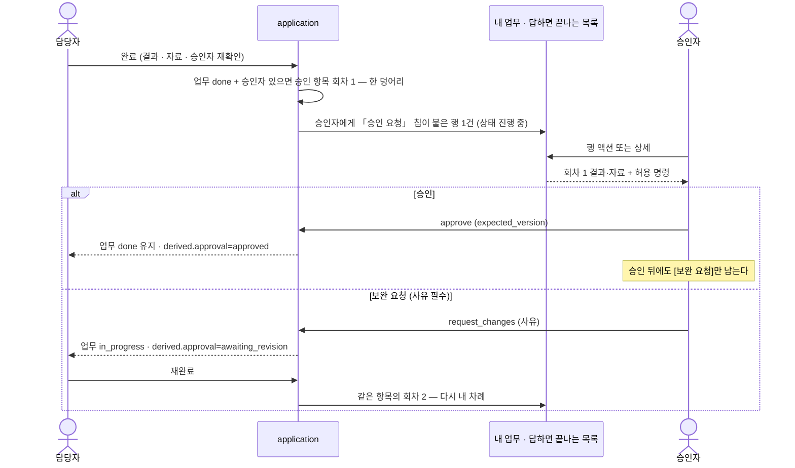
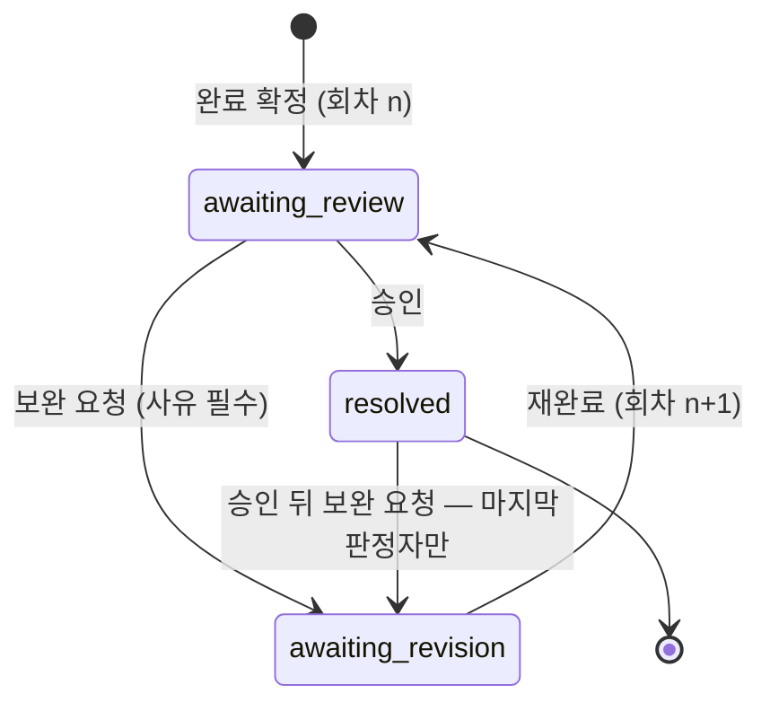

# 답하면 끝나는 목록 — 종류 칩 둘과 완료 승인의 판단 계약

내 답 하나로 끝나는 항목이 어디에 어떻게 서고, 그중 **완료 승인** 판단이 어떤 계약을 갖는지를
정한다. 업무 자체의 상태·생성·완료·문의 발송은 SPEC-001 이 갖는다.

> **⚠ 이 SPEC 의 일부 절은 [[spec-003-task-lifecycle-v2|SPEC-003]] 이 대체한다** (2026-09-17, DEC-002).
> 대체되는 곳 — **§2.2 종류 표의 「업무 요청 수락」 행**(「신규 생성이 만들지 않는다」가 v2 에서
> 거짓이 된다 — 요청 수락 판단이 돌아온다) · **§2.7 빈 상태 문구** 중 「**동료의 요청**」
> (그 종류는 돌아온다) · §4 Data Contract 「신규 경로에서 사라지는 값」 중
> **요청 판단의 수락·조정·거절·재상신·철회**.
> **「업무 배정 수락」은 사라진 채로 둔다** — 배정은 v2 범위 밖이고 원문이 배정에 같은 수락·거절
> 정책을 적용하지 말라고 적었다(DEC-002 L-8 · P-13 · M-1~M-3).
> 또한 **요청 업무의 완료 확인자는 요청자**로 고정된다 (SPEC-003 §4 완료 승인).
> **회의 후속 승격 요청(요청자 자리가 시스템)의 완료 확인만** SPEC-003 §7 **OQ-206** 으로 열려 있다 —
> 그 자리의 판단 명령은 **확인자 본인에게만** 열리므로 기본값을 두지 않았다.
> **요청의 수정·재상신·철회는 열린 질문이 아니다** — 누른 사람이 요청자 자리에 선다(기존 동작 보존).
> **판단 계약 자체는 그대로 정본이다** — 항목 하나에 회차가 쌓이는 모양 · 판정의 불변성 ·
> 마지막 판정자 · 종류 칩 둘 · 봉투가 명령을 내려 준다는 원칙.
> **이 문서의 본문과 버전 이력은 지우지 않는다.**

> **초안이다.** 검수 전이며 `status: draft`.
> 이 SPEC 의 핵심은 **무엇을 걷고 무엇을 남기는지**다. 수락 gate 제거가 완료 승인이나
> AX 실행 확인까지 걷어 가면 안 된다 — §2.2 종류 표가 그 경계다.
> 현행 코드와의 차이·근거 줄은 **BASE-001** 이 갖는다.

## 1. Context

### Meta

- Decision reference: `DEC-001` (D-6 · D-8 · D-9 · D-10 · D-14)
- Baseline reference: `BASE-001` (§ 회사 원문이 이미 닫은 것, § 현행 코드 관측 W1.3·W2.0·W2.4·W2.9)
- 요구 출처: `ax-workspace#7` W1.3 · W1.6 · W2.2~2.5 · W2.8 · W2.9,
  회사 기획 PLAN-001 · PLAN-002 · SCREENDEF-004(고정 revision)
- Domain note: 외부에 드러나는 것은 항목의 **종류**, **상태**, 지금 허용된 **명령**, **회차**,
  그리고 누구를 기다리는지다. 내부 제출·판정 구조는 코드가 SoT.
- Open questions: OQ-A · D2. §7 참조.

### Business Requirement

지금 이 목록은 네 종류를 한 자리에 모은다 — 업무 요청 수락, 업무 배정 수락, 업무 결과 확인,
AX 제안 확인. 앞의 둘은 #7 이 없애라고 한 **생성 시 수행자 수락**이고, 셋째는 남겨서 재사용하라고
한 **완료 확인**이다. 넷째는 명시적으로 유지 대상이다. 게다가 목록의 분류축이 **판단 상태**라
원문이 말하는 **종류 칩 둘**과 다르다.

세 가지를 보장한다.

1. **걷는 것과 남기는 것의 경계가 종류 단위로 못 박힌다.** 생성 수락은 사라지고 완료 확인과
   AX 실행 확인은 그대로 남는다.
2. **답하면 끝나는 항목은 「내 업무」 축의 행으로 선다.** 확인만 남은 것이 아니라 **내 판단이
   남은 것**이라 상태는 `진행 중` 이다.
3. **기다림 표시는 이 목록의 미결 여부에서만 나온다.** 업무 상태가 기다림을 말하지 않는다.

### Scope

**In scope**

- 답하면 끝나는 항목이 어디에 서는지와 **종류 칩 둘**의 경계
- 완료 승인 판단 한 건의 생성 조건, 명령, 회차, 해소, **승인 뒤 되돌리기**
- 승인 대기 · 승인됨 · 보완 요청 · 회신 대기 파생 표시의 **계산 근거**
  (SPEC-001 의 `derived` 를 이 SPEC 이 정의한다)
- 문의·결정 요청 항목의 **표시와 답변 계약** — 발송은 SPEC-001
- 신규 생성 경로에서 사라지는 종류와 과거 행의 읽기 보장
- AX 실행 확인의 존치와 **표시 표면의 분리**

**Out of scope**

- 복수 미응답 문의의 회신 대기 해소·취소 판정 → D2 미확정(§7)
- 업무 상태 전이·생성·완료 명령·문의 발송 → SPEC-001
- AX 대화 자체와 그 카드 화면의 배치·문구 → AI 채팅 쪽 소유
- 결정 요청의 판단 절차와 이력 원장 → 판단 기획 소유. 이 SPEC 은 **종류 칩 귀속과 표시**만
- 새 승인 원장 도입 · 기존 제출·판정 체계 제거
- 기존 데이터 전환

## 2. UX Contract

### Placement

답하면 끝나는 항목은 **두 자리에 같은 사실로 선다.**

1. **「내 업무」 축의 행** — 종류 칩이 붙고 행 액션이 `[답변]` 또는 `[승인]`·`[보완 요청]` 이다.
   목록에서 바로 닫는 자리다(SPEC-001 U-4).
2. **좌 레일의 답하면 끝나는 목록** — 업무 축을 떠나지 않고 훑는 자리다.

둘은 **같은 원장의 두 표면**이고 사본이 아니다. 어느 쪽에서 답해도 같은 기록이 바뀐다.

```text
+────────────────────+
│ 답하면 끝나는 목록  │
│ [문의 요청][승인 요청]│
│ ┌────────────────┐ │
│ │ 카드            │ │
│ └────────────────┘ │
+────────────────────+
```

### 2.1 목록 구성

- 이 목록에는 **내가 답해야 하는 것만** 온다. 내가 답할 수 없는 항목은 개수에도 들어가지 않는다.
- 답이 끝난 항목은 목록에서 빠지고 그 행은 **「완료 업무」 축으로 간다.**
- 이력은 항목 상세와 업무의 진행 기록에 남는다.

### 2.2 종류 — 무엇을 남기고 무엇을 걷나

| 현행 종류 | 목표 | 종류 칩 |
|---|---|---|
| 업무 요청 수락 | **신규 생성이 만들지 않는다.** 과거 행은 읽기로만 | — (생성되지 않는다) |
| 업무 배정 수락 | **신규 생성이 만들지 않는다.** 과거 행은 읽기로만 | — (생성되지 않는다) |
| 업무 결과 확인 (완료 승인) | **남긴다.** 이것이 완료 승인이다 | `승인 요청` |
| 문의 · 결정 요청 | **신규.** 결정 요청은 문의 요청에 담는다 | `문의 요청` |
| AX 제안 실행 확인 | **남긴다.** 제거 대상이 아니다 | **없음** — §2.4 |
| 일일보고 | 제목이 이미 말한다 | **없음** — 일반 업무로 둔다 |

현행 종류의 근거 줄은 BASE-001 § 현행 코드 관측 W1.3·W2.0 이 갖는다.

### 2.3 종류 칩

- **문구**: `문의 요청` · `승인 요청` **둘.**
- **어디**: 「내 업무」 축의 **답하면 끝나는 행에만** 제목 앞에 붙는다.
  **직접 해야 끝나는 행은 칩이 없다.** 다른 축에서는 숨긴다.
- **없는 칩**: 결정 요청(문의 요청에 담는다) · 보고(제목이 말한다) · AX 확인(§2.4).
- **좌 레일에서는** 같은 두 칩이 필터로 선다. 둘 다 끄면 전체.
- **기대 결과**: 목록만 좁아진다. 그 종류가 하나도 없으면 필터 빈 상태(§2.7).

> **칩을 만드는 기준**은 「이럴 때 이걸 본다」가 있을 때만이다. 상태값이라서 만들지 않는다.

### 2.4 AX 실행 확인의 자리 — 보존하되 칩에 넣지 않는다

**보존한다.** AX 가 제안한 변경은 사람이 확인해야 반영되고, 이 확인은 제거 대상이 아니다.

| 무엇 | 어디 |
|---|---|
| 판단 원장 | **공유한다.** AX 확인도 같은 항목 체계의 한 종류이고 같은 봉투·같은 명령 경로를 쓴다 |
| 표시 표면 | **AI 채팅의 카드 자리.** 제안이 뜬 대화 안에서 확인한다 |
| 업무 목록의 종류 칩 | **들어가지 않는다.** 칩은 둘이고 그 둘이 업무의 「답하면 끝나는 행」을 가른다 |
| 좌 레일 목록 | 칩 없는 항목으로 함께 설 수 있다. 칩 필터를 켜면 빠진다 |

근거는 둘이다 — ① 원문의 종류 칩 정의에 **AX 확인의 귀속이 없다.** ② 같은 줄이 "일일보고는
칩 없이 일반 업무로 둔다"고 해 **칩 없는 항목을 허용**한다. 근거 없이 `승인 요청` 으로
분류하지 않는다. AI 채팅 카드 화면의 배치·문구는 그 화면의 소유이고 이 SPEC 밖이다.

### 2.5 「내 업무」 행으로 선 항목

- **상태**: 답하면 끝나는 항목도 **내 판단이 남은 것**이라 상태는 `진행 중` 이다.
  확인만 남은 것이 아니다.
- **행 액션** (SPEC-001 U-4 와 같은 표):
  - 문의 요청 행 → `[답변]`. **행 안에서 답변 칸이 펼쳐지고**, 답하면 그 행이 `완료 업무` 로 간다.
  - 승인 요청 행 → `[승인]` `[보완 요청]`.
- **액션 칸은 모든 행에 있고** 할 게 없는 행은 빈다.

### 2.6 판단 상세 — 완료 승인

- **상태**
  - 미결: 제출된 회차의 결과 요약 · 자료 · 기한이 보인다.
  - 보고 이후 업무가 바뀌었으면 "보고 이후 업무가 변경되었습니다" 안내가 함께 뜬다.
  - 해결: 판단이 끝났다는 문구만 남는다. **단, 승인된 뒤에도 `[보완 요청]` 은 남는다**(§2.8).
  - 권한없음: 항목 자체가 목록에 없다. 직접 열면 찾을 수 없다고 답한다.
- **문구**: 질문 "요청한 결과가 충족됐는지 확인하세요".
- **CTA**: `[승인]`(primary) · `[보완 요청]`(**사유 필수 · 1~500자**).
  **서버가 허용한 명령만 그린다.** 사유가 비면 보내기가 비활성이다.
- **기대 결과**
  - `[승인]` → 업무는 `완료` 그대로, 파생 표시가 `승인 대기` 에서 `승인됨` 으로 바뀐다.
  - `[보완 요청]` → 업무가 `진행 중 · 보완 요청` 으로 돌아가고 담당자의 `내 업무` 에 다시 선다.
    이전 회차의 결과·자료·판단은 보존된다.

### 2.7 빈 상태

- 항목이 하나도 없음: "답할 항목이 없습니다 / 문의와 완료 확인이 오면 여기에 쌓입니다."
  **「동료의 요청, 관리자의 배정」이라는 문구는 쓰지 않는다** — 그 두 종류가 사라진다.
- 칩 때문에 안 보임: "이 종류에는 답할 항목이 없습니다" + `필터 해제`.
- 로딩·에러는 **영역 단위**다. 한 영역이 늦어도 나머지는 조작할 수 있다.

### 2.8 승인 뒤 되돌리기

- 승인이 끝난 뒤에도 **승인자에게 `[보완 요청]` 만 남는다.** `[승인]` 은 사라진다.
- 완료를 되돌리는 사람은 **마지막에 판정한 사람**이다.
- 담당자에게는 `[완료 해제]` 가 없다.
- 판정은 **되돌릴 수 없는 사실**이다. 앞선 판정을 지우는 것이 아니라 **새 판정을 단다.**
- 승인자가 0명인 업무에는 이 경로가 없다 — **§7 OQ-A 미확정.**

## 3. User Scenario

### S-1. 승인자 — 완료를 확인한다

1. 담당자가 완료를 확정하면 내 「내 업무」 축에 **승인 요청 칩이 붙은 행**이 서고 좌 레일에도
   같은 항목이 온다. 그 행의 상태는 `진행 중` 이다.
2. 행 액션 `[승인]` 을 누르거나 열어서 그 회차의 결과와 자료를 보고 답한다.
3. 업무는 `완료` 그대로고 담당자 화면의 `완료 · 승인 대기` 가 `완료 · 승인됨` 으로 바뀐다.
4. 이 항목은 내 「완료 업무」 축으로 간다. 진행 기록에 누가 언제 승인했는지가 남는다.

### S-2. 승인자 — 보완을 요청한다

1. 같은 항목에서 `[보완 요청]` 을 고른다. **사유가 필수**다(1~500자).
2. 업무가 `진행 중 · 보완 요청` 으로 돌아가고 담당자의 「내 업무」 에 다시 선다.
3. 내 쪽에서는 이 항목이 상대의 다음 제출을 기다리는 상태로 남는다 — 내 차례가 아니다.
4. 담당자가 다시 완료하면 **같은 항목의 새 회차**가 열리고 다시 내 차례가 된다.
5. 이전 회차의 결과·자료·내 사유가 그대로 읽힌다. **1차 기록 · 보완 요청 사유 · 2차 기록이
   나란히 남는다.**

### S-3. 승인자 — 승인한 뒤에 되돌린다

1. 이미 승인한 업무를 다시 연다. `[승인]` 은 없고 `[보완 요청]` 만 있다.
2. 사유와 함께 보내면 업무가 담당자의 「내 업무」 로 `진행 중 · 보완 요청` 으로 돌아간다.
3. 앞선 승인 판정은 **지워지지 않는다.** 새 판정이 그 위에 쌓인다.

### S-4. 담당자 — 승인자가 없다

1. 완료 명령이 성공한다. 업무는 `완료` 다.
2. **아무 판단 항목도 생기지 않는다.** 누구의 목록에도 아무것도 오지 않는다.
3. 「완료 업무」 에 파생 표시 없이 들어간다.
4. 잘못 완료했을 때의 복구 경로는 **§7 OQ-A 미확정**이다.

### S-5. 받는 사람 — 문의에 답한다

1. 누군가 나에게 문의·결정 요청을 보내면 내 「내 업무」 축에 **문의 요청 칩이 붙은 행**이 선다.
2. 행 액션 `[답변]` 을 누르면 **행 안에서 답변 칸이 펼쳐진다.** 창을 열지 않는다.
3. 답하면 그 행이 내 「완료 업무」 로 가고, **보낸 사람 업무의 `회신 대기` 가 자동으로 풀린다.**
4. 답할 수 있는 사람은 **그 문의를 받은 사람뿐**이다. 이미 답한 문의는 거부된다.
5. 오간 것은 보낸 사람 업무의 진행 기록에 쌓인다. **밖으로 나간 답장과는 자리가 다르다.**
6. 미응답 문의가 여럿일 때의 해소·취소 판정은 **§7 D2 미확정**이다.

### S-6. 아무나 — 수락 판단이 더는 오지 않는다

1. 동료가 나에게 업무를 보낸다. 내 「내 업무」 에 `시작 전` 으로 나타난다.
2. **내 답하면 끝나는 목록에는 아무것도 오지 않는다.** 관리자가 배정한 경우도 같다.
3. **신규 경로에는 거절 명령도 없다.** 잘못 온 배정의 출구는 `[문의 요청]` 과 담당자 변경이다.
   (과거 행에 답하는 기존 명령을 지운다는 뜻이 아니다 — 아래 4.)
4. 예전에 만들어져 아직 답하지 않은 옛 수락 항목은 **전환 면제 영역**이다 — 신규 흐름이
   만들지 않는다는 것까지가 이 SPEC 의 계약이고, 남은 행의 처리는 work 가 정한다.

### S-7. 아무나 — AX 제안을 확인한다

1. AX 도구가 변경을 제안하면 **그 대화의 카드 자리**에 실행 확인이 뜬다.
2. 편집 가능 여부·필수값·선택 후보·실행 명령은 **서버가 지금 이 사람에 대해 내려 준다.**
   클라이언트나 자유 텍스트가 추론하지 않는다.
3. 사람이 확인해야 반영된다. **확인 전에는 effect 가 없다.**
4. 이 항목에는 **종류 칩이 붙지 않고** 업무 목록의 답하면 끝나는 행으로 서지 않는다.
5. 이 경로는 수행자 수락 제거와 **무관하며 그대로 남는다.**

### S-8. 두 번 답한다

1. 같은 답을 다시 보낸다. 오류가 아니라 **영수증**으로 끝나고 판단이 두 번 기록되지 않는다.
2. 지난 회차를 기준으로 한 답은 거부되고 최신 회차를 다시 읽는다.
3. 같은 모양이지만 다른 내용의 답은 재전송이 아니라 새 명령이고 회차 충돌로 걸린다.
4. 같은 내용의 재요청은 **처음 만든 항목으로 수렴한다.** 내용이 다른 두 번째 요청은 거절된다 —
   한 Turn 은 같은 종류의 판단을 하나만 사람 앞에 세운다.

## 4. Interface Contract

### API Contract

| Method | Path | 요약 | 권한 |
|---|---|---|---|
| GET | `/api/action-items` | 내가 답해야 하는 항목 목록 | 판단 읽기 |
| GET | `/api/action-items/{id}` | 항목 상세 — 봉투 + 회차 + 논의 | 판단 읽기 + 당사자 |
| POST | `/api/action-items/{id}/commands/{command}` | 항목에 답한다 | **봉투가 그 명령을 내려 준 사람만** |

문의 답변은 업무 쪽 경로로도 닫힌다(SPEC-001 § API Contract). **두 표면이 같은 원장을 바꾼다.**

### Request / Response

**항목 봉투** — 목록·상세가 같은 모양을 쓴다. 클라이언트가 종류에서 권한·컨트롤을 다시
유도하지 않는다. **서버가 내려 준 것만 그린다.**

| 필드 | 뜻 |
|---|---|
| `action_item_id` | 항목 식별자 |
| `kind` | 완료 승인 · 문의 · 결정 요청 · AX 실행 확인 (+ 과거 행의 수락 종류) |
| `chip` | **`inquiry` · `approval` · `none`** — 화면 칩의 축. `kind` 에서 파생하되 **서버가 내려 준다** |
| `status` | `awaiting_review`(내 차례) · `awaiting_revision`(상대의 다음 제출) · `resolved` |
| `subject` | 대상(업무명 등) |
| `operation_label` · `current_question` | 종류 라벨과 지금 묻는 말 |
| `preview` | 판단에 필요한 필드들(결과 요약 · 보고자 · 자료 · 기한 · 변경 안내) |
| `allowed_commands` | 지금 이 사람이 할 수 있는 것. 각 명령은 라벨 · 톤 · 사유 필요 여부를 갖는다 |
| `submission_version` | 회차 |
| `waiting_on` | 지금 누구를 기다리나. 끝났으면 없음 |
| `resource` | 어느 자원의 판단인가 |
| `expected_version` | 답할 때 실어야 하는 대상의 회차 |

`chip` 은 **신규 필드**다. 현행 봉투에는 상태만 있고 종류 축이 없다(BASE-001 § 현행 코드 관측 W2.9).
`none` 은 칩 없는 항목(AX 실행 확인 · 일일보고)을 위해 필요하다.

**완료 승인 명령**

| command | 사유 | 언제 | 결과 |
|---|---|---|---|
| `approve` | 불필요 | 미결일 때 | 업무 `완료` 유지 · 파생 `승인됨` · 항목 `resolved` |
| `request_changes` | **필수 1~500자** | 미결일 때, **그리고 승인된 뒤에도** | 업무 `진행 중 · 보완 요청` · 항목 `awaiting_revision` |

요청 본문은 `expected_version`(필수) + `reason`(명령이 요구할 때). 그 외 필드를 실으면 거부한다.

**문의 답변 명령**

| command | 사유 | 결과 |
|---|---|---|
| `answer` | 본문 필수 | 항목 `resolved` · 그 행이 답한 사람의 「완료 업무」 로 · **보낸 사람 업무의 `회신 대기` 자동 해소** |

**파생 표시의 정의** — SPEC-001 의 `derived` 를 여기서 계산한다.
**어느 값도 업무 상태에서 읽지 않는다.**

```text
approval — 그 업무의 완료 승인 항목 중 «현재 유효한 것» 하나를 찾는다
  └ 없으면                  → null            (표시 없음)
  └ 최신 회차가 미결         → awaiting_review  (「승인 대기」 — 완료 업무 축에만)
  └ 보완 요청을 받음         → awaiting_revision(「보완 요청」 — 진행 중 뒤)
  └ 승인으로 닫힘            → approved        (「승인됨」)

reply — 그 업무에 걸린 문의·결정 요청 중 «미응답» 이 있나
  └ 없으면                  → null            (표시 없음)
  └ 미응답이 «하나»          → waiting         (「회신 대기」 — 진행 중 뒤)   ← 확정 계약
  └ 미응답이 «여럿»          → 미확정 (D2)                                   ← 구현 보류
```

**복수 분기를 지금 구현하지 않는다.** 「하나라도 남으면 `waiting` 을 유지한다」는 안이 있으나
그것은 원문이 **권고로만 적고 확정하지 않은 안**이다. 잠정값을 계약처럼 적으면 WP 가 그대로
구현한다. 확정 계약은 **하나짜리 흐름까지**이고, 복수 분기는 D2 가 닫힐 때 채운다(§7).

「현재 유효한 것」은 **그 업무의 최신 완료 승인 항목의 최신 회차**다.
과거에 닫힌 회차, 다른 종류의 항목, 취소된 업무의 항목은 계산에 넣지 않는다.

### Validation

| 필드 | 규칙 |
|---|---|
| `command` | 그 항목의 `allowed_commands` 에 있는 id 만 |
| `expected_version` | 필수. 항목이 내려 준 값과 일치 |
| `reason` | 사유가 필요한 명령에 필수. 앞뒤 공백 제거 후 1~500자. **비면 보내기가 비활성** |
| 답변 본문 | 필수. 앞뒤 공백 제거 후 1자 이상 |
| 그 외 필드 | 받지 않는다. 실으면 거부 |

### Case Matrix

| 에러 코드 | 백엔드 출력 | 프론트 출력 | 표시 위치 |
|---|---|---|---|
| `ACTION_NOT_FOUND` | 404 | "항목을 찾을 수 없거나 열람 권한이 없습니다." | 상세 |
| `ACTION_COMMAND_NOT_ALLOWED` | 403 | 버튼을 그리지 않는다. 눌린 뒤면 "지금 이 항목에 할 수 있는 동작이 아닙니다." | 상세 상단 |
| `ACTION_REASON_REQUIRED` | 422 | 보내기가 비활성이다 | 사유 필드 |
| `ACTION_PAYLOAD_UNEXPECTED` | 422 | "이 판단은 해당 항목을 받지 않습니다." | 상세 상단 |
| `ACTION_VERSION_STALE` | 409 | **지금 값으로 다시 불러오되 내가 쓰던 입력은 남긴다** | 상세 인라인 |
| `ACTION_ALREADY_DECIDED` | 200 (영수증) | 오류를 띄우지 않고 최신 상태로 맞춘다 | — |
| `ACTION_SUBJECT_CLOSED` | 409 | "대상 업무가 취소되어 판단할 수 없습니다." | 상세 상단 |
| `INQUIRY_ALREADY_ANSWERED` | 409 | "이미 답한 문의입니다." | 답변 칸 |
| `ACTION_DUPLICATE_IN_TURN` | 409 | 내용이 다른 두 번째 요청은 거절하고 다음 Turn 으로 미룬다 | AX 카드 |
| 목록 읽기 실패 | 5xx | 그 영역에만 안내와 `다시 시도` | 레일 본문 |

권한 없는 항목은 **존재도 개수도 드러내지 않는다** — 찾을 수 없다는 한 가지 말로 답한다.

### Flow



### State / Lifecycle



**항목은 하나이고 회차가 쌓인다.** 같은 질문의 수정은 같은 항목의 새 제출이지 두 번째 항목이
아니다. 회차마다 제출 내용·제출자·시각·판단·사유가 **불변**으로 남고 **수정이 없다.**

문의 항목은 회차를 쌓지 않는다 — 보내면 미결, 답하면 `resolved` 로 끝난다.

### Data Contract

| 이름 | 값 |
|---|---|
| 종류 칩 | `inquiry`(문의 요청) · `approval`(승인 요청) · `none`(칩 없음) |
| 항목 상태 | `awaiting_review` · `awaiting_revision` · `resolved` |
| 완료 승인 명령 | `approve`(사유 불필요) · `request_changes`(사유 필수, **승인 뒤에도 가능**) |
| 문의 명령 | `answer`(본문 필수) |
| 회차 | 1부터 증가. 건너뛰지 않는다 |
| 업무 쪽 파생 | `approval`: `null`·`awaiting_review`·`awaiting_revision`·`approved` / `reply`: `null`·`waiting` |

**신규 경로에서 사라지는 값**: 배정 수락의 수락·거절, 요청 판단의 수락·조정·거절·재상신·철회.
과거 행에서는 계속 읽힌다.

## 5. Implementation Rules

- **명령의 권한은 봉투 자체다.** 서버가 그 사람에게 그 항목에 대해 내려 준 명령만 실행된다.
  종류를 근거로 클라이언트가 명령을 되살릴 수 없다. 편집 가능 여부·필수값·선택 후보도 같다.
- **멱등성**: 같은 답의 재전송은 그 답이 소비한 회차에 걸린 영수증이다. 같은 모양이지만 지난
  회차에서 온 명령은 영수증이 아니라 **낡은 요청**이고 거부된다.
- **동시성**: 두 사람이 같은 회차에 답하면 먼저 도착한 것만 반영된다. 늦은 쪽은 지금 값으로
  다시 읽되 **쓰던 입력은 남는다.**
- **원자성**: 업무 상태 변경과 항목 상태 변경은 **한 덩어리**다. 업무는 `완료` 인데 승인 항목이
  없거나, 항목은 열렸는데 업무가 `완료` 가 아닌 중간 상태는 관찰되지 않는다.
  문의 발송과 회신 대기 부착, 답변과 해소도 같다.
- **Turn 단위 중복 방지**: 한 Turn 은 같은 종류의 판단을 하나만 사람 앞에 세운다. 같은 내용의
  재요청은 처음 만든 항목으로 수렴하고, 내용이 다른 두 번째 요청은 거절해 다음 Turn 으로 미룬다.
  종류가 다른 판단은 같은 Turn 에 함께 설 수 있다.
- **보존**: 회차별 제출 내용·판단·사유는 지워지지 않고 **고칠 수 없다.** 판정은 되돌릴 수 없는
  사실이고, 다시 열려면 새 판정을 단다.
- **새 원장 금지**: 완료 승인은 기존 제출·판정 체계 위에서 돈다. 별도 승인 표를 만들지 않는다.
- **AX**: 실행 확인 항목은 그대로 남는다. 사람의 확인 없이 원장이 바뀌지 않는다.
  표시 표면만 업무 목록의 종류 칩과 가른다.
- **취소된 업무**: 열려 있던 항목은 더 이상 판단할 수 없다. 목록에서 빠지고 이력에는 남는다.
- **두 표면 일치**: 「내 업무」 행에서 답하든 좌 레일에서 답하든 **같은 기록이 바뀐다.**
  화면별 사본이 없다.

## 6. Verification

### Acceptance Criteria

- [ ] 신규 업무 생성·요청·배정이 이 목록에 **아무 항목도 만들지 않는다.** 거절 명령도 없다.
- [ ] 완료 승인 항목은 승인자가 있을 때만, 완료 확정 한 번에 한 건 생긴다.
- [ ] 승인자가 없으면 항목이 생기지 않는다.
- [ ] 종류 칩이 `문의 요청` · `승인 요청` **둘**이고 「내 업무」 축의 **답하면 끝나는 행에만**
      붙는다. 직접 해야 끝나는 행과 일일보고에는 칩이 없다.
- [ ] **AX 실행 확인이 그대로 뜨고 확인 없이는 원장이 바뀌지 않는다.** 동시에 그 항목에는
      종류 칩이 붙지 않고 업무 목록의 답하면 끝나는 행으로 서지 않는다.
- [ ] 봉투의 `chip` 을 **서버가 내려 주고** 클라이언트가 종류에서 유도하지 않는다.
      칩 없는 항목(`none`)이 표현된다.
- [ ] 답하면 끝나는 행의 상태가 `진행 중` 이고, 답하면 그 행이 `완료 업무` 로 간다.
- [ ] 문의 요청 행의 `[답변]` 이 **행 안에서 펼쳐지고** 창을 열지 않는다.
- [ ] 답할 수 있는 사람은 **그 문의를 받은 사람뿐**이고 이미 답한 문의는 거부된다.
- [ ] 답변이 성공하면 **보낸 사람 업무의 `회신 대기` 가 자동으로 풀린다.**
- [ ] 현재 회차가 미결일 때**만** 해당 업무에 `승인 대기` 가 파생 표시되고 `완료 업무` 축에만 선다.
      과거에 닫힌 회차, 다른 종류의 항목, 취소된 업무의 항목으로는 표시되지 않는다.
- [ ] `[승인]` 후 업무는 `완료` 를 유지하고 표시가 `승인됨` 으로 바뀐다.
- [ ] `[보완 요청]` 은 사유가 없으면 **보내기가 비활성**이고, 성공하면 업무가
      `진행 중 · 보완 요청` 으로 돌아가며 담당자 목록에 다시 나타난다.
- [ ] **승인된 뒤에도 승인자에게 `[보완 요청]` 만 남고** 그것만 업무를 다시 연다.
      `[승인]` 은 사라진다. 담당자에게는 어느 시점에도 `[완료 해제]` 가 없다.
- [ ] 판정이 지워지거나 수정되지 않는다. 다시 열 때 **새 판정이 쌓인다.**
- [ ] 재완료가 같은 항목의 새 회차를 열고, 이전 회차의 결과·자료·사유가 모두 남는다.
- [ ] 같은 답의 재전송이 영수증으로 끝나고 판단이 두 번 기록되지 않는다.
- [ ] 지난 회차 기준의 명령이 거부되고 잘못된 상태 전이를 만들지 않는다.
- [ ] 완료 확정과 항목 생성이, 문의 발송과 회신 대기 부착이 각각 원자적으로 반영된다.
- [ ] 봉투가 내려 주지 않은 명령은 직접 호출해도 거부된다.
- [ ] 권한 없는 항목은 목록·개수·상세 어디에도 드러나지 않는다.
- [ ] 같은 내용의 재요청이 처음 만든 항목으로 수렴하고, 내용이 다른 두 번째 요청은 거절된다.
- [ ] 목록의 빈 상태 문구에서 「동료의 요청, 관리자의 배정」이 빠진다.
- [ ] 취소된 업무의 열린 항목이 목록에서 빠지고 이력에는 남는다.
- [ ] 「내 업무」 행과 좌 레일 어느 쪽에서 답해도 같은 기록이 바뀐다.

### 근거

- 회사 원문의 확정 사항(종류 칩 둘 · 칩 없는 항목 허용 · 마지막 판정자 · 판정의 불변성 ·
  회신 대기 자동 부착·해소): **BASE-001 § 회사 원문이 이미 닫은 것**
- 현행 판단 표면과 종류별 현황: **BASE-001 § 현행 코드 관측 W1.3·W2.0·W2.4·W2.9**,
  **§ 계약이 닿는 표면**의 「판단」·「AX」 행
- 봉투가 명령·후보·필수값을 서버에서 내려 준다는 원칙의 회사 SPEC 근거:
  **BASE-001 § `#719`·`#722`·`#725` 본문 대조** (회사 SPEC-002 규칙 10·11·12)

## 7. Open Questions

`DEC-001` § Open Questions 가 원장이다. 이 SPEC 이 직접 막히는 것만 다시 적는다.

**사용자 결정** — 회사 승인을 기다리지 않는다

- **OQ-A** — 승인자가 0명인 업무를 잘못 완료했을 때의 복구. 그런 업무에는 「마지막 판정자」가
  없다. **원문 기본값은 복구 경로 없음 · 업무 취소만**이다. 질문이 나가 있어 §2.8 · §3 S-4 의
  해당 자리를 확정하지 않는다.

- **D2** — 복수 미응답 문의가 있을 때의 회신 대기 해소·취소 판정. 회사 기획이 미확정인 것은
  **출처 사실**이고, **이 제품에서 닫는 사람은 현재 사용자**다 — 회사 승인을 기다리지 않는다.
  §4 의 `reply` 계산에서 **그 분기만 비어 있고** 하나짜리 문의의 부착·해소는 확정 계약이다.

**타 문서·외부에서 닫히는 것**

- **결정 요청의 판단 절차와 이력 원장** — 판단 기획 소유. 이 SPEC 은 종류 칩 귀속(문의 요청에
  담는다)과 표시까지만 갖는다.
- **AI 채팅 카드 화면의 배치·문구** — 그 화면의 소유. 이 SPEC 은 AX 확인이 **보존되고**
  업무 종류 칩에 들어가지 않는다는 경계까지만 갖는다.
