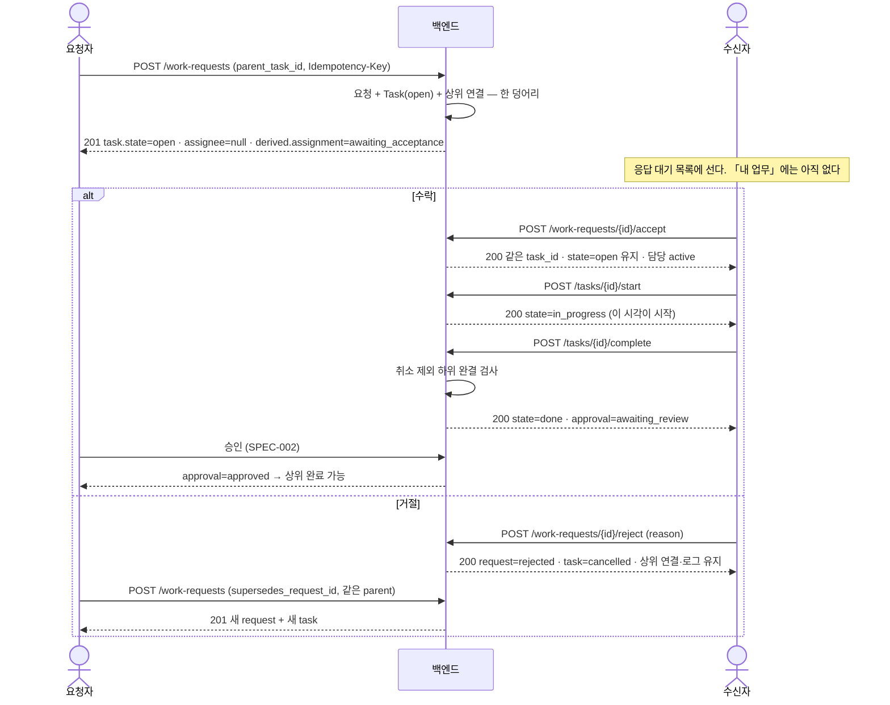
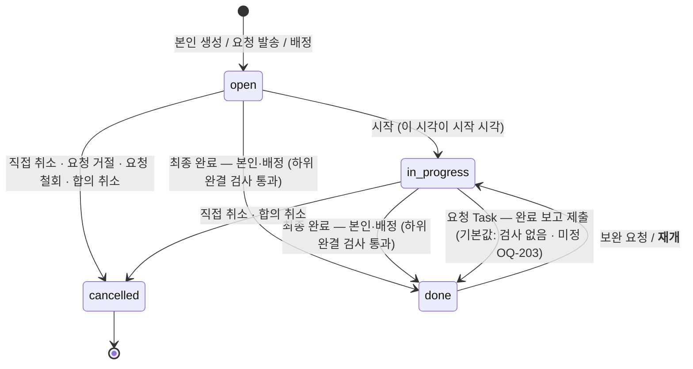
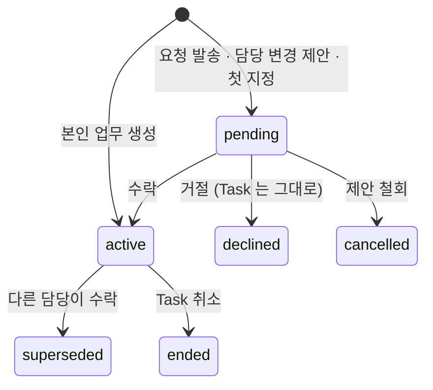
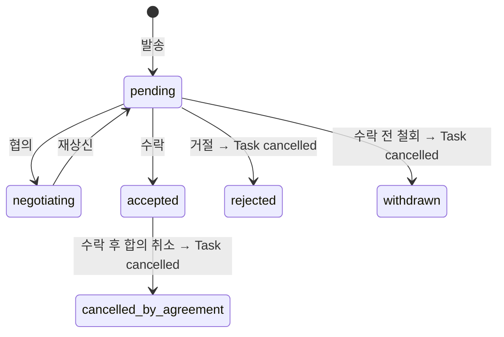

# 업무 구조·생명주기 v2 — 요청·수락·하위 관계·완료 확인의 백엔드 계약

업무를 요청하고, 수락·거절하고, 하위로 나누고, 담당을 바꾸고, 보고·보완·승인으로 끝내는
**백엔드 외부 계약**을 정한다. client · QA · 외부 통합이 이 문서만 읽고 따를 수 있어야 한다.

> **초안이다.** 검수 전이며 `status: draft`.
> **이 SPEC 은 SPEC-001·SPEC-002 의 일부 절을 대체한다** — 무엇을 대체하는지는 §1 대체 관계.
> 원문 사실·현재 코드 관측·경로·줄 번호는 **BASE-002** 가 갖는다. 여기서는 그 절을 이름으로
> 가리킨다. 구현 순서·코드 경로·마이그레이션 절차는 `30-work/` 몫이고 이 문서에 없다.

**표기 — 확정과 제안을 가른다.**

| 표기 | 뜻 |
|---|---|
| **(정책)** | 사용자가 v2 원문에서 **확정한 업무 정책.** 뒤집으려면 사용자 결정이 필요하다 |
| **(제안)** | 그 정책을 구현 가능한 하나로 만들기 위해 **이 SPEC 이 고른 기술 표현**(상태값·관계명·명령 이름). 같은 정책을 지키는 다른 표현으로 바꿔도 된다 |
| **(미정)** | v2 원문 또는 `example.md` 가 **열어 둔 자리**. 이 SPEC 이 닫지 않는다 |
| **(기존 동작 보존)** | 원문이 말하지 않아 **지금 코드를 그대로 두는 것.** 신규 확정이 아니다 (DEC-002 D-18) |
| **(기본값)** | 이 SPEC 이 **뒤집힐 수 있음을 알고** 고른 값. 열린 질문(§7)이나 「기존 동작 보존」 위에 서 있고, 사용자가 뒤집으면 **그 자리만** 바뀐다 |

## 1. Context

### Meta

- Decision reference: `DEC-002` (frontmatter `links.decisions` 와 일치)
- Baseline reference: `BASE-002` (frontmatter `links.baselines` 와 일치)
- 요구 출처: `정의_v2.md` · `생명주기_v2.md` · `작업계획서_v2.md` (2026-09-17 사용자 승인).
  절 단위 근거는 **BASE-002 § 원문이 확정한 것** 의 `V-*` · `L-*` · `P-*` ID 로 가리킨다.
  **`reference/2026-09-10-sc-meeting/example.md` 는 사용자가 2026-09-17 에 추가 지정한
  네 번째 원문(사례집)이다.** 절마다 **합의 / 미정 / 검토안**을 스스로 가르며, 스스로
  「미정 분기나 검토안을 구현 정책으로 사용하지 않는다」고 적는다 — **그 표기를 보존한다.**
  근거 ID 는 `E-*`(합의) · `EU-*`(미정)이고 원장은 BASE-002 다.
  **계약 검증 사례의 원장은 example §10 (10단계)** 이고 생명주기 v2 §8(9단계)이 같은 흐름이다.
- Domain note: 외부에 드러나는 것은 수행 상태 넷 · 담당 관계 상태 다섯 · 요청 상태 여섯 ·
  제안 상태 넷 · 파생 표시 · 부모/직속 하위 관계다. 내부 schema 는 코드와 migration 이 SoT.
- Open questions: **OQ-203 · OQ-206** 둘이 열려 있다(DEC-002 원장). **OQ-206 은 승격 요청의 완료 확인 한 조각으로 좁혀졌다.** OQ-201 · OQ-202 · OQ-204 · OQ-301 은 **기본값 통보**로, **OQ-205 는 착수 전 읽기 전용 점검**으로 내려갔다 — §7.

### 대체 관계 — 이 SPEC 이 SPEC-001·002 의 어디를 대체하나

| 대체되는 절 | 무엇이 바뀌나 | 이 문서 |
|---|---|---|
| SPEC-001 §4 API Contract 중 **일반 요청의 즉시 배정** | 발송은 `open` Task + 수락 대기. 담당은 수락으로 확정 | §4 · §5 |
| SPEC-001 §4 State / Lifecycle 의 **담당 관계 다이어그램** | `pending → active` 가 들어온다. `done → in_progress` 에 재개가 더해진다 | §4 State |
| SPEC-001 §4 Data Contract 의 **요청 출처 상태 `assigned`** | 일반 요청 경로는 더는 `assigned` 를 내지 않는다. 과거 행의 뜻은 그대로 | §4 Data |
| SPEC-001 §5 **「수락 명령의 존치」 전체** | 수락·거절이 신규 경로의 일반 명령이다 | §5 |
| SPEC-001 §5 권한표의 **「내용·제목 수정 — 아무도 못 한다」** | 요청의 범위·기한·완료 기준은 수락 전 요청자, 수락 후 동의로 바뀐다 | §4 · §5 |
| SPEC-001 §4 `POST /api/tasks` 의 **「`assignee_id` … 다른 사람이면 그 사람에게 **즉시 배정**」**(§4 API Contract 「업무 생성 — 본인 또는 수신자 지정」 행과 그 Validation·State 설명) | **입구는 그대로다.** 그 입력은 W1 에서도 **수평 요청**이므로(BASE-002 O-26) 요청 계약이 그대로 걸린다 — `open` Task + 수락 대기 | §4 API · §4 Request/Response |
| SPEC-001 §4 의 **그 갈래 201 응답 본문**(「본문은 생성된 업무의 현재 투영」) | **기본은 그대로 둔다** — 그 입구의 201 본문은 **Task 투영 하나**다. v2 가 바꾸는 것은 **그 Task 의 값**(`assignee=null` · `derived.assignment=awaiting_acceptance`)이지 **묶음 모양이 아니다.** 요청 행까지 함께 받으려면 `POST /api/work-requests` 로 보내거나 `GET /api/work-requests/{id}` 로 읽는다 **(제안)** | §4 Request/Response |
| SPEC-001 §5 권한표의 **「업무 취소 — 담당자·요청자·관리자」** 중 **수락된 요청 Task** 부분 | 수락 후 취소는 **제안 → 담당자 동의**로만. 수락 전·본인·배정 업무는 그대로 | §4 API · §5 권한 |
| SPEC-001 §4 Validation·Data 의 **`approver_id` 0..1 지정**(「승인자는 0명 또는 1명」) — **요청 Task 에 한해** | 요청 Task 의 완료 확인자는 **요청자**로 고정된다. 승인자 필드는 본인·배정 업무에만 쓴다 | §4 완료 승인 · §5 권한 |
| SPEC-002 **§2.2 종류 표의 「업무 요청 수락」 행** | 「신규 생성이 만들지 않는다」가 v2 에서 거짓이 된다 — **요청 수락 판단이 신규 경로로 돌아온다** | §4 API · §5 |
| SPEC-002 **§2.7 빈 상태 문구** 중 「**동료의 요청**」 | 「그 두 종류가 사라진다」가 절반만 맞다 — **요청**은 돌아오고 **배정 수락**은 사라진 채다 | §4 API |
| SPEC-002 §4 Data Contract 「신규 경로에서 사라지는 값」 중 **요청 판단의 수락·조정·거절·재상신·철회** | 그 다섯이 신규 경로의 일반 명령으로 **돌아온다** | §4 Data |
| SPEC-001 §6 W1 인수조건 중 **아래 다섯 항목** | §6 의 v2 인수조건이 대신한다 | §6 |

**「수락 gate 관련 다섯 항목」이 무엇인지 — 개수 대신 항목으로 지목한다.**
SPEC-001 §6 「W1 — 생성과 배정」에서 **일반 요청 경로에 걸린 줄만** 대체된다.

| # | SPEC-001 §6 의 항목 | v2 에서 어떻게 되나 |
|---|---|---|
| 1 | 「허용된 동료를 담당으로 지정해 한 번의 생성 명령을 실행하면 상대의 `내 업무` 에 `시작 전` 한 건이 **즉시 나타나고 바로 시작할 수 있다**」 | **대체.** 수신자의 **응답 대기**에 서고, 수락해야 「내 업무」에 선다 |
| 2 | 「그 경로에 본인 업무 선생성·관리자 재배정·**상대 수락이 요구되지 않는다**」 | **대체.** 상대 수락이 요구된다. **앞의 둘(선생성·재배정 불요)은 그대로 유효하다** |
| 3 | 「신규 **요청**/배정이 수락용 판단 항목·수락 대기 배정·재상신 회차를 만들지 않는다」 | **요청 부분만 대체.** 요청은 만든다. **배정 부분은 그대로 유효**(M-1~M-3) |
| 4 | 「신규 생성 경로에 **배정 거절 명령이 없다**」 | **요청 부분만 대체.** 요청 **거절**이 돌아온다(V-11). 배정 거절은 범위 밖 |
| 5 | 「신규 수평 요청의 출처 상태가 **`assigned`** 이고 그 상태에 수락·거절·조정 명령이 걸리지 않으며 **수신함에 서지 않는다**」 | **대체.** 요청은 `pending` 으로 서고 수신함에 선다. **과거 행의 다섯 상태값은 뜻이 그대로**라는 마지막 문장은 유효하다 |

> **줄 번호로 지목하지 않는다 (2026-09-17 재검수 1차 정정).** 상단 대체 안내가 들어가며 SPEC-001 은
> **8줄**, SPEC-002 는 **5줄**씩 밀렸고, 줄만 따라가면 엉뚱한 항목을 가리킨다. **인용 문구가 항목을
> 특정하므로 그것으로 지목한다.** 코드 관측의 경로·줄 번호는 BASE-002 가 그대로 갖는다.
>
> **같은 §6 에서 대체되지 않는 항목** — 「본인 업무는 한 건만 서고 수락 카드가 생기지 않는다」 ·
> 「요청 권한이 타인의 **기존 업무**에 대한 권한을 넓히지 않는다」 ·
> 「관리자 직접 배정의 **조직 범위 검사**」 · **멱등 키 항목 전부**.
> §6 회귀 절의 「수락 gate 를 생성하거나 요구하지 않는다」는 **배정·상태 enum 에 대해서만** 유효하다.

**대체되지 않는 것** — SPEC-001·002 가 계속 정본이다: 멱등 키 계약 · 활성 담당 유일성 ·
권한 재검사 · **출처·행위자는 실제로 명령을 부른 사람(K-6)** · **관리자 직접 배정의 조직 범위 검사(K-11)** ·
문의·결정 요청과 회신 대기 · 상태 메모 · 진행 기록 append-only ·
계획/실제 기한 두 값 · 완료 승인의 회차와 불변 판정 · 종류 칩 · AX 실행 확인 · 표면 일치.

### Business Requirement

지금은 남에게 보낸 일이 **상대의 판단 없이** 그 사람 것이 된다. 상대가 맡지 않겠다고 말할
자리가 없고, 맡은 뒤에 담당을 바꾸면 새 사람이 답할 때까지 **아무도 담당이 아닌 구간**이 생긴다.
일을 나누면 그 조각이 원래 일과 이어지지 않아, 조각이 안 끝났는데 원래 일이 끝난 것으로 설 수 있다.
요청한 사람은 자기가 부탁한 일의 세부와 결과물을 열어 볼 길이 없다.

이 SPEC 이 보장하는 것은 다섯이다.

1. **일은 상대가 받아들일 때 그 사람의 것이 된다.** 발송은 일을 있게 하고, 수락은 담당을 정한다.
   둘은 다른 사건이고, 시작은 또 다른 사건이다.
2. **책임에 공백이 없다.** 담당을 바꾸는 동안에도 지금 맡은 사람이 계속 맡는다.
3. **나눈 일은 이어져 있다.** 누가 맡든 상하위 관계가 유지되고, 취소되지 않은 조각이 남아 있으면
   원래 일은 끝나지 않는다.
4. **끝은 사람이 낸다.** 하위가 다 끝나도 자동으로 완료되지 않고, 무응답·기한 초과가 상태를
   바꾸지 않는다.
5. **요청한 사람은 자기가 부탁한 것까지만 본다.** 하위 작업과 연결 자료는 열리고, 그 사람의
   다른 일과 연결하지 않은 자료는 열리지 않는다.

### Scope

**In scope**

- 업무 요청의 발송 · 수락 · 협의 · 거절 · 철회 · 재요청, 그리고 상위 업무 연결
- 본인 업무 생성과 하위 Task 의 **재귀 저장**, 직속 하위 조회, 중심 업무 판정, 순환 차단
- 담당 변경의 **제안 – 수락 – 거절**과 책임 공백 제거
- 완료 보고 · 보완 · 승인, **취소 제외 미완료 하위의 상위 완료·승인 차단**, 자동 완료 없음
- 수락 후 합의 취소 · 수락 후 조건 변경 동의 · 재개(완료된 상위의 선재개 포함)
- 요청자의 **하위 트리·연결 자료 조회 권한**과 그 권한이 닿는 표면(본문·다운로드·검색·미리보기)
- 무응답·기한 초과의 **자동 전이 없음**
- 새 명령 전부의 멱등성·동시성·권한 재검사
- 기존 데이터 호환과 cutover 의 **경계**(무엇을 하지 않는가)
- **확정 시안 기준의 UX 계약** — 위 흐름이 화면의 어느 자리에서 일어나고 무엇을 보여야 하는가
  (§2). **2026-09-17 오후 사용자 승인으로 들어왔다**(BASE-002 입력 2 · DEC-002 D-2)

**Out of scope**

- **컴포넌트 구현·DS 부품 신설·클래스와 토큰·프론트 타입** — 만드는 방법은 `30-work/` 몫이다.
  §2 는 **무엇을 보여 주고 무엇을 할 수 있어야 하는가**까지만 적는다
- **시안에 없는 새 서비스·새 화면** — 메일·메신저 통합 전체, 시안 내비의 「수신함·진행 현황·자료」
  같은 새 페이지 전량. **승인이 없다**(DEC-002 § 시안 반영)
- 업무 분배(배정)의 수락·거절 절차, 신규 배정, 담당 없는 업무의 첫 지정, 배정의 수정·취소·재개
  — DEC-002 M-1~M-3 **(미정)**. 현행 동작을 회귀로 지킨다.
  **회귀로 지킬 「현행」이 한 모양이 아니다** — ① **신규 관리자 배정**(`POST /api/tasks/assign`)은
  **수락을 기다리지 않는다**(즉시 `active` + `accepted_at` — BASE-002 **O-28**) · ② **담당 없는 업무의
  첫 지정**은 `pending` + 수락 판단 항목이다(O-14). **①②는 이번에 손대지 않는다.**
  ③ **담당 교체**만 v2 를 적용한다(§5 책임 공백 없음) — 그것은 배정 정책이 아니라 V-18 이 직접
  확정한 자리다. 셋의 구분은 DEC-002 § 범위 기록이 원장이다
- 체크리스트 전체 체크 강제·결과 필수 입력 — M-4 **(미정)**
- 중간 검토 · 공동 담당 · 복수 부모 · 상위 취소 전파 · 막힘 — M-5·M-6 **(미정)**
- 메일·스케줄의 자동 수락 — M-7 **(미정)**
- 문의·결정 요청, 상태 메모, 진행 기록, 기한 두 값, 완료 승인의 회차 — **SPEC-001·002 가 정본**
- 마이그레이션 스크립트·실행 절차·구현 순서 — `30-work/` 몫
- DEC-001 OQ-B(복수 미응답 문의) · OQ-C(위임전결 값) · OQ-D(지연 N값)
- **E2E·브라우저 확인** — **사용자 담당**이다. 에이전트의 자동 검증 책임과 가른다(§6)
- 디자인 싱크(`.design-sync/`)와 시안 자산 — 코드 레포 작업이다

## 2. UX Contract

**범위가 갱신됐다 (2026-09-17 오후).** 초판은 「이번 범위에서는 `해당 없음`」이었다 —
프론트 전면 개편이 예정되어 배치·문구를 정하지 않았다. **확정 시안이 내려오고 사용자가
프론트를 함께 진행하도록 승인**하면서(BASE-002 입력 2), 이 절이 **이번 판의 UX 계약**이 된다.

**읽는 규칙 넷.**

1. **확정 시안이 디자인의 정본이다**(`.design-sync/screens/`, 코드 레포). 분석 3종은 그 시안을
   읽은 **보고서**이고 정책이 아니다(BASE-002 입력 5).
2. **시안에 상세가 없는 것은 정책 부정이 아니다.** 시안은 정적 목데이터 화면이라 「그리지 않았다」가
   곧 「그 규칙을 부정한다」가 아니다 — 분석 `03` 이 스스로 적은 원칙이다. 그린 자리가 없는 계약은
   **미설계**로 표시하고, 계약 자체는 그대로 선다.
3. **이 절은 코드 경로·컴포넌트 구현·구현 순서를 적지 않는다.** 그것은 `30-work/` 몫이다.
   여기서 정하는 것은 **무엇을 보여야 하고 무엇을 할 수 있어야 하는가**다.
4. **부품 책임을 세 갈래로 가른다** — 기존 DS 재사용 / 신규로 필요한 부품 / **API 가 내야 하는 데이터**.
   §2.11 이 그 표다. 셋을 섞으면 「화면이 안 된다」와 「계약이 없다」가 구분되지 않는다.

### 2.1 세 탭과 축 — 탭은 소유·종결 축이고, 세 행위는 생성 축이다

시안의 탭은 **내 업무 / 보낸 업무 / 완료 업무** 셋이다. v2 가 정한 **업무를 만드는 세 행위**
(본인 생성 · 요청 · 배정 — V-2)와 **1:1 로 대응하지 않는다.** 축이 다르기 때문이고,
**그것이 어긋남은 아니다.**

| 축 | 값 | 어디서 오나 |
|---|---|---|
| 소유·종결 (탭) | 내 업무 / 보낸 업무 / 완료 업무 | 「내가 지금 맡고 있나 · 내가 보냈나 · 끝났나」 |
| 생성 행위 (계약) | 본인 생성 · 요청 · 배정 **(정책 V-2)** | 그 Task 가 **어떻게 생겼나**. 탭과 무관하게 응답이 낸다 |

- **「보낸 업무」 탭은 요청과 배정을 함께 담는다**(둘 다 내가 보낸 것이다). 그러나 **행에서는
  둘이 구분되어야 한다** — 요청은 수락 대기가 있고 배정은 없다(V-2 · M-1). 구분값은 API 가 낸다(§2.11).
- **「받은 요청」은 탭이 아니라 「내 업무」 탭의 필터**다(시안 칩). 수락 전 요청 Task 는
  **아직 내 업무가 아니므로**(발송 직후 활성 담당 없음 — §4) 그 칩이 가리키는 것은
  **응답 대기 목록**이다 **(제안)**.
- **현재 화면에 있는 「참조된 업무」·「조직 업무」가 시안 3탭 어디에 서는지는 (미정 M-20)** 이다.
  **계약상 셋 다 존재한다** — 참조자 관계와 조직/프로젝트 범위 조회는 SPEC-001 이 정본이다.
  **화면에서 지우는 것은 제품 결정**이고 이 SPEC 이 하지 않는다.

### 2.2 상태는 넷, 기다림은 파생 표시 — 시안 값과의 매핑

**수행 상태는 넷이다 (정책)** — `open` · `in_progress` · `done` · `cancelled`.
**수락 대기·승인 대기·담당 변경 대기는 상태가 아니라 파생 표시다 (제안, DEC-002 D-4)**.
시안이 그 자리를 **배지 + 행 액션**으로 그린 것은 **파생 표시를 그리는 한 방법**이고 계약과 맞는다.

| 시안이 쓰는 값 | 계약의 값 | 비고 |
|---|---|---|
| `progress` 「진행 중」 | `in_progress` | **이름만 다르다 (제안 — 매핑)** |
| `done` 「완료」 | `done` | 요청 Task 에서는 **승인까지여야 완결**이다(§4 Data) |
| `cancelled` 「취소」 | `cancelled` | 끝이다. 재개하지 않는다 **(정책 V-19)** |
| `not-started` 「시작 전」 | `open` | 시안은 보낸 업무 배지로만 쓴다 |
| `blocked` 「막힘」 | **이 계약에 없다** | SPEC-001 계승. 코드에 남아 있다(BASE-002 O-5) — **M-6 (미정)** |
| 배지 「완료 확인」 + 「확인/보완 요청」 | `derived.approval = awaiting_review` | **상태가 아니라 파생 표시**다 |
| (시안에 없음) | `derived.assignment = awaiting_acceptance` · `awaiting_handover` | 수락 대기 · 담당 변경 대기. **미설계** — §2.4 |

**「시작」을 부를 자리가 화면에 있어야 한다 (정책 V-13).** `open → in_progress` 전이 시각이
**시작 시각의 정의**이므로, 그 전이를 사람이 부를 길이 없으면 시작이 기록되지 않는다.
시안의 상태 Select 에는 「시작 전」이 없다 — **그것을 상태 선택지로 낼지 「시작」 단추로 낼지는
화면 선택 (제안)** 이고, **전이를 부를 자리가 있어야 한다는 것만 계약**이다.

### 2.3 목록 표 세 벌과 v2 흐름

| 표 | 시안이 그린 것 | v2 가 그 표에 요구하는 것 |
|---|---|---|
| 내 업무 | 별표 · 제목/종류 · 요청자 · 기한 · 상태 · 액션 | **수락 대기 행과 내가 맡은 행이 구분**되어야 한다. 받은 요청 행에는 **수락/거절**이 선다 **(정책 V-9·V-10·V-11)** |
| 보낸 업무 | 제목 · 담당자 · 기한 · 상태(읽기 전용) · 「다시 요청」 | **수락 대기 · 협의 중 · 거절됨**이 보여야 한다 — 요청 상태 여섯이 계약이다(§4 State). 시안 배지 둘(`progress`/`not-started`)로는 그 자리가 없다 → **표시 값을 넓힌다 (제안)** |
| 완료 업무 | 「내 업무 / 보낸 업무」 두 그룹 · 제목 · 상대 · 처리일 · 상태 | **`done` 과 `cancelled` 를 다른 것으로** 낸다 **(정책 V-19 — 취소는 완료가 아니다)**. 시안이 이미 배지를 가른다. **요청 Task 의 `done` 은 승인 전이면 완결이 아니다** — 「확인 대기」 칩이 그 자리다 |

**「다시 요청」이 어느 명령인지는 화면이 고른다 (제안).** 계약은 둘을 가른다 —
**재요청**은 `supersedes_request_id` 를 실은 **새 요청·새 Task** 이고 **(정책 V-12)**,
**독촉**은 SPEC-001 의 `reminders` 다. 같은 단추가 둘 다일 수는 없다.

### 2.4 상하위 두 단계 — 계약은 확정, 화면은 미설계

- **중심 업무와 직속 하위 두 단계를 표시한다 (정책 V-6 · L-11).** 상세 응답이 직속 하위만 내고,
  더 깊은 것은 그 Task 로 들어가 읽는다(§4 관계 조회).
- **미완결 하위가 있으면 최종 완료가 거부된다 (정책 V-15).** 화면은 **거부되는 이유와 막는 하위를
  보여 주어야 한다** — 오류가 그 이름을 낸다(§4 Case).
- **취소된 하위는 검사에서 빠지되 로그로 남는다 (정책 V-16).** 상위에서 「취소됨 — 요청 거절」로
  읽힌다 **(정책 V-11)**.
- **담당 변경 대기는 「기존 담당 active + 새 담당 pending」이 함께 보이는 자리다 (정책 V-18).**
  응답이 둘을 각각 낸다(§4).
- **담당 변경 제안(`reassign`) 과 그 응답(제안 수락 · 제안 거절)을 부를 자리가 있어야 한다
  (정책 V-18).** 제안은 담당자 또는 배정 권한이, 수락·거절은 **그 제안의 수신자만** 부른다 —
  **권한은 §4·§5 계약 그대로이고 이 절은 자리만 요구한다.**
- **철회 · 취소 제안 · 동의 · 재개를 여는 자리가 있어야 한다 (정책 V-19·V-20).**
  명령은 전부 §4 에 있다. **여는 자리만 화면이 정한다 (제안).**

> **위 여섯은 시안에 자리가 없다 — 미설계다.** 시안에 업무 **상세 화면 자체가 없고**(분석 `03`
> 「내가 보지 못한 것」), 표는 한 겹이다. **시안이 그리지 않았다는 이유로 이 계약을 내리지 않는다.**
> 시안의 「WBS 보기」 단추가 그 자리일 수 있으나 여는 화면이 시안에 없다 — **(미정 M-24)** 는
> 그 단추가 서는 **자리**의 다툼이고, 두 단계 표시 자체는 **정책이다.**

### 2.5 행 액션 ↔ 명령

시안이 그린 행 액션은 둘이다 — `accept`(「수락」/「거절」) · `confirm`(「확인」/「보완 요청」).
**둘 다 계약에 대응이 있다.**

| 시안 | 명령 | 결과 |
|---|---|---|
| 수락 | `POST /api/work-requests/{id}/accept` | **같은 Task**, 담당 확정, `state` 는 `open` 그대로 **(정책 V-10)** |
| 거절 | `.../reject` (사유 필수) | 요청 `rejected` + Task `cancelled` **(정책 V-11)** |
| 확인 | 완료 승인 (SPEC-002 판단) | **최종 완료.** 미완결 하위가 있으면 거부 **(정책 V-15)** |
| 보완 요청 | 보완 (SPEC-002 판단, 사유 필수) | **같은 Task 의 다음 회차** **(정책 E-3 — 하위 Task 를 만들지 않는다)** |

**거절한 행이 목록에서 어떻게 되는지는 계약이 답한다** — Task 가 `cancelled` 이므로
**「완료 업무」 탭의 취소로 간다 (제안)**. 시안은 그 자리에 글자만 남기고 이후를 그리지 않았다 —
**미설계이지 다른 정책이 아니다.**

### 2.6 필터 칩 — 상태 나열이 아니라 파생 조건

시안의 칩은 「전체 / 받은 요청 / 막힘 / 기한 지남」(내 업무) · 「전체 / 시작 안함 / 기한 지남」(보낸 업무) ·
「전체 / 확인 대기」(완료 업무)다. **대부분 상태값이 아니라 파생 조건**이고, 그 값은 API 가 낸다 —
`derived.assignment` · `derived.approval` · `overdue_days`(§4 Data).

- **「기한 지남」은 상태를 바꾸지 않는다 (정책 V-19)** — 지연 **표시만** 바뀐다. 시안의 「+N」 표기와 맞는다.
- 칩 라벨의 건수는 **그 칩이 거는 필터의 건수**다 **(제안)**. **읽을 수 없는 것은 건수에도 들어가지 않는다**
  (SPEC-001 계승 · §4).
- **「막힘」은 이 계약에 상태가 없다**(§2.2). 칩을 그리려면 M-6 이 먼저다 **(미정)**.

### 2.7 업무 만들기 모달 — 세 행위가 여기서 갈린다

시안의 모달은 **업무 명 · 기한 · 내용 · 확인받을 사람 · 체크리스트 · 첨부파일**이다.

- **담당자를 지정하는 자리가 있어야 한다 (정책 V-2).** 담당이 없거나 본인이면 **본인 업무**,
  다른 사람이면 **요청 발송**이다(§4 `POST /api/tasks` 두 갈래). 시안 모달에 그 자리가 없는 것은
  **미설계**다 — 그 자리를 두지 않으면 **요청을 보낼 길이 화면에서 사라진다.**
- **「확인받을 사람」은 승인자 `approver_id`(0..1) 다 (기존 동작 보존 — SPEC-001).**
  **요청 Task 에서만** 확인자가 **요청자로 고정**되므로 그 자리는 **본인·배정 업무에서 쓰인다**
  **(정책 V-14·V-22)**. 참조자와 다른 값이다.
- **체크리스트는 완료 기준이고 하위 Task 와 다르다 (정책 V-5).** 모달의 체크리스트를 하위 Task
  입력으로 쓰지 않는다. **전체 체크를 완료의 필수 조건으로 강제하지 않는다 (미정 M-4)**.
- **내용·첨부·출처 행**은 SPEC-001 의 기존 계약(본문·자료 연결·유입 경로)으로 그린다.
  **유입 경로 표시는 세 행위와 별개 축이다 (정책 V-3)** — 메일에서 왔다는 사실이 그 업무를
  요청으로 만들지 않는다.
- **시작일·참조자·참고 업무는 기존 계약에 있다 (기존 동작 보존).** 시안에 없다는 이유로
  **계약에서 지우지 않는다.** 화면 어디에 두는지는 **(미정 M-20 과 같은 성격 — 화면 결정)**.

### 2.8 수신함 — 유입 경로만으로 담당이 서지 않는다

- **유입 경로(메일·메신저·회의·AI 채팅)만으로 자동 수락하지 않는다 (정책 L-15·L-16).**
  시안의 「내 업무로」 단추가 **본인 업무 생성인지 요청 수락인지**는 **자동 생성의 행위 구분
  (미정 M-7)** 에 걸린다. **어느 쪽이든 사람이 누른다는 것까지가 계약이다.**
- **AX 실행의 사람 확인은 유지되고 확인 전에는 effect 가 없다 (정책 K-5).**
- **카드의 아바타 · 수신 시각 · 출처 아이콘 · 미읽음 수는 계약이 없다 (미정 M-22).**
  근거를 가른다 — **출처**는 개념으로 이미 서 있으나(V-3) **봉투에 실어 내는 계약이 없다** ·
  **아바타·수신 시각**은 **기존 데이터에서 파생 가능해 보이나 확인되지 않았다**(BASE-002 U-7) ·
  **미읽음**은 **읽음 상태의 정의 자체가 없다.** 셋은 다른 종류의 부재이고 한 줄로 묶지 않는다.
- **분류 축은 기존 계약에 없다 — 좁은 미설계다.** 시안의 「전체 / 업무 / 참고」는 **종류 축**이고,
  계약이 정한 좌 레일 필터 축은 **SPEC-002 §2.3 의 종류 칩 둘**(`문의 요청` · `승인 요청` —
  봉투 `chip` 은 `inquiry`·`approval`·`none`)이며 현재 코드의 축은 **상태 축**(판단 대기·조정 필요)이다.
  **대조 결과 「업무/참고」는 그 둘 중 어느 축과도 대응하지 않는다** — 칩 둘로 닫히지 않는다.
  그 축을 세우는 것은 **새 계약**이므로 이 SPEC 이 만들지 않고 **후속 구현 계획의 화면 범위에서 먼저
  확인한다.** 사용자 질문으로 올리지 않는다.
- **카드 단추 두 벌 중 「내 업무로」만 계약에 닿아 있다 (미정 M-7).** 나머지 둘은 **기존 계약이 없다** —
  **「답장」**은 SPEC-002 가 사내 문의 응답과 **「밖으로 나간 답장」을 다른 자리로 갈라 두었을 뿐**
  수신함 카드의 그것이 어느 쪽인지 정한 계약이 없고, **「원문 확인하기」**는 **유입 원문을 여는 계약이
  없다** — 출처를 봉투에 실어 내는 계약 자체가 없고(M-22) 메일·메신저 통합은 **승인 밖**(§2.10).
  **이 SPEC 이 없는 명령을 새로 만들지 않는다.** 둘 다 **좁은 미설계**로 두고 **후속 구현 계획의 선행 확인**
  항목이다.

### 2.9 캘린더 — 기한은 있고, 근무 시간과 회의 일정은 없다

- **기한 두 값(계획·실제)과 지연 표시는 기존 계약이다 (기존 동작 보존 — SPEC-001 · 정책 V-19).**
- **근무 시간**과 **캘린더에 회의 일정을 함께 싣는 것**은 **계약이 없다 (미정 M-23)**.
  회의 일정은 **다른 도메인의 데이터**를 업무 캘린더로 끌어오는 일이므로 새 계약이 필요하다.

### 2.10 내비 — 새 화면을 이 SPEC 이 만들지 않는다

시안 내비는 10항목이고 현재 제품은 8항목이다. **차이 나는 「수신함·진행 현황·자료」는
새 화면이고 승인이 없다** — **이 SPEC 의 범위 밖**이다(§1 Out of scope · DEC-002 § 시안 반영).
**시안에 있다는 이유만으로 페이지를 만들지 않는다.**

### 2.11 부품·데이터 책임 — 세 갈래로 가른다

| 갈래 | 무엇 | 이 SPEC 의 책임 |
|---|---|---|
| **기존 DS 재사용** | 배지·칩·표·빈 상태·오류·모달·드로어·캘린더 — 분석 `02` 가 **클래스 차집합 1종 · 토큰 차집합 0종**으로 셌다. 「부품으로 안 묶였다」이지 「스타일이 없다」가 아니다 | **없다.** DS 작업이고 `30-work/` 몫 |
| **신규로 필요한 부품** | 보낸 업무 표 · 완료 업무 그룹 표 · 상하위 두 단계를 그리는 자리 · 담당 변경 대기 · 취소 제안/재개를 여는 자리 · 글리프 9종 | **없다.** 다만 **그 자리가 필요하다는 것**은 위 절들이 계약으로 적는다 |
| **API 가 내야 하는 데이터** | 수행 상태 넷 · `derived.assignment` · `derived.approval` · `derived.proposal` · `blocking_children` · `child_progress` · `overdue_days` · 요청 상태 여섯 · 현재 담당과 대기 제안 **각각** · 생성 행위 구분 · `cancel_reason` | **이 SPEC 의 몫이다** — §4 Data Contract 가 원장 |
| **아직 계약이 없는 화면 요구** | 별표(M-21) · 수신함 카드 메타(M-22) · 근무 시간·회의 일정(M-23) | **이번에 만들지 않는다.** 만들려면 별도 결정이다 |

### 2.12 원문의 화면 요구 — 이제 이번 범위다

아래는 v2 원문이 직접 적은 화면 요구다. **초판은 「미래 프론트 요구로 보존 · 이번 인수조건이
아니다」였다.** 범위 갱신으로 **이번 판의 요구**가 되고, §6 에 인수조건이 선다.

| # | 화면 요구 (원문) | 백엔드 책임 | 화면 책임 |
|---|---|---|---|
| F-1 | 담당자 화면에 **중심 업무와 직속 하위 두 단계만** 표시 (V-6 · L-11) | 상세가 **직속 하위만** 낸다 | 두 단계를 그린다. 더 깊은 것은 그 Task 로 들어간다 |
| F-2 | 하위 개수를 제한하지 않고 **화면 범위로 생성 깊이를 제한하지 않음** (V-6) | 저장 깊이 제한 없음 | 깊이를 이유로 생성을 막지 않는다 |
| F-3 | 상위에서 거절된 하위를 **「취소됨 — 요청 거절」**로 표시 (V-11) | `cancel_reason` 을 구분값으로 낸다 | 그 구분을 문구로 낸다 |
| F-4 | 수락 대기 · 담당 변경 대기 · 완료 확인 대기를 **구분해 표시** (작업계획서 §4.7) | `derived.assignment` · `derived.approval` 을 각각 낸다 | 셋을 **섞지 않고** 낸다 |
| F-5 | 완료 보고·보완·승인 **회차**와 취소·재요청·담당 변경 **이력** 표시 | 회차는 SPEC-002 계약. 이력은 진행 기록·활동 | 회차와 이력을 읽을 자리를 둔다 |
| F-6 | 취소 항목을 요청자 목록에서 **정리**해도 로그가 남음 (L-6) | 목록에서 빠지되 이력으로 읽힌다 | 「숨기기/보관/삭제 표시」 중 무엇으로 보일지 **(미정 OQ-202)** |
| F-7 | 요청자는 상태·결과를 보되 **수행자의 세부를 전부 펼치지 않음** (V-21) | 권한은 열되 상세는 직속 하위까지 | 요청자 화면에서 그 경계를 지킨다 |
| F-8 | UI 와 MCP 에서 **같은 행위 → 같은 결과** (작업계획서 §4.7) | REST·MCP 가 같은 계약·오류·권한 | 화면이 그 계약 밖의 지름길을 만들지 않는다 |

## 3. User Scenario

백엔드 계약이므로 actor 는 **명령을 부르는 사람**이고 관찰 지점은 **응답과 이어지는 조회**다.
번호는 작업계획서 §5 의 인수 시나리오 ID(A1~C2)와 **1:1** 로 맞춘다 — §6 이 같은 ID 로 닫는다.

### S-1. 요청자 — 업무를 만들고 하위를 나눈다 (A1)

1. 요청자가 본인 업무 「보고서 작성」을 만든다. 담당은 **자기 자신이고 즉시 활성**이다
   **(기존 동작 보존)** — example §2.1 이 본인 업무의 담당 확정 처리와 별도 확인 절차를
   **미정(EU-1)** 으로 둔다. 새로 확정하는 것이 아니다.
2. 상태는 `open` 이다. **만드는 것과 시작하는 것은 다르다** **(정책 V-13)**.
3. 그 아래 직접 작업 「보고서 내용 작성」을 `parent_task_id` 로 만든다. 담당은 자기 자신이다.
4. 같은 담당자가 3번 아래에 다시 직접 작업을 만들려 하면 거부된다 **(정책 V-8)** — `WORK_DIRECT_NESTING`.
5. 상세를 읽으면 `parent` 는 비고 `children` 에 3번 하나가 선다.

### S-2. 요청자 — 하위로 요청을 보낸다 (A2)

1. 요청자가 「보고서 작성」 아래에 디자이너를 수신자로 하는 요청을 보낸다. 멱등 키가 필수다 **(K-1)**.
2. 성공하면 **Task 가 즉시 생긴다** — `state=open`, `parent_task_id` = 보고서 **(정책 V-9)**.
3. 그 Task 의 `derived.assignment` 는 `awaiting_acceptance` 다 **(제안)**. **활성 담당은 아직 없다** **(정책 V-9)**.
4. 수신자의 「내 업무」에는 서지 않는다. 수신자의 **응답 대기 목록**에 선다.
5. 보고서 상세의 `children` 에 그 Task 가 「수락 대기」 파생과 함께 선다 **(정책 V-9)**.

### S-3. 담당자 — 수락하고 시작한다 (A3)

1. 디자이너가 수락한다. **같은 Task id 가 유지되고 상위 연결도 그대로다** **(정책 V-10)**.
2. 담당이 `active` 로 확정되고 `derived.assignment` 가 `null` 이 된다.
3. **`state` 는 여전히 `open` 이다** — 수락은 시작이 아니다 **(정책 V-10·V-13)**.
4. 디자이너가 시작하면 `open → in_progress` 이고 **그 변경 시각이 시작 시각**이다 **(정책 V-13)**.
5. 수락 시각과 시작 시각은 각각 읽힌다.

### S-4. 담당자 — 받은 업무를 다시 나눈다 (A4)

1. 디자이너에게 이 디자인 Task 는 **자기 중심 업무**다 **(정책 V-7)**.
2. 그 아래 직접 작업 「레퍼런스 조사」·「시안 구성」을 만든다 — **허용된다** **(정책 V-7·V-8)**.
3. 같은 자리에서 일러스트레이터에게 요청을 보낸다 — 허용된다. 그 Task 의 상위는 디자인이다.
4. 「레퍼런스 조사」 아래에 디자이너가 다시 직접 작업을 만들려 하면 거부된다 **(정책 V-8)**.
5. 자기 자신 또는 자기 조상을 부모로 지정하면 거부된다 **(정책 — 작업계획서 §4.5)** — `WORK_PARENT_CYCLE`.
   `example.md` §7.8 은 순환 방지를 미정으로 두지만 **작업계획서가 우선**이다(BASE-002 § 입력 3).

### S-5. 요청자 — 요청한 업무의 안을 본다 (A5)

1. 요청자가 디자인 Task 상세를 연다 — **읽힌다**(요청 관계) **(정책 V-21)**.
2. 그 아래 「시안 구성」 상세도 읽힌다 — 요청한 업무의 하위이기 때문이다 **(정책 V-21)**.
3. 그 Task 들에 **연결된 자료**의 목록·본문·다운로드·미리보기가 열린다 **(정책 V-21)**.
4. 디자이너의 **다른 업무**와 이 업무에 **연결하지 않은 자료**는 `WORK_NOT_FOUND` 다 **(정책 V-21)**.
5. 검색에서도 같다 — 권한 없는 것은 결과에 뜨지 않고 **건수에도 들어가지 않는다** (SPEC-001 계승).

### S-6. 담당자·요청자 — 보고하고 보완하고 승인한다 (A6)

1. 디자이너가 **완료 보고를 제출**한다(`completion-report` — 요청 Task 의 완료 입구다).
   `state=done` 이고 `derived.approval=awaiting_review` 다 **(K-7)**.
   **이것은 제출이고 최종 완료가 아니다.**
2. **별도 검토 Task 는 만들어지지 않는다** **(정책 V-14)**.
3. 요청자가 보완을 요청한다(사유 필수). `state=in_progress`, `derived.approval=awaiting_revision`.
4. 디자이너가 **같은 Task 에서** 수정하고 다시 완료한다 — 새 회차의 `awaiting_review` 다 **(정책 V-14)**.
5. 요청자가 **승인한다 — 이것이 최종 완료다.** `state=done`, `derived.approval=approved`.
   **취소 제외 미완결 하위가 있으면 이 자리에서 거부된다** **(정책 V-15)**.
6. 요청자의 검토 결과를 디자이너가 다시 승인하는 절차는 **없다** **(정책 V-14)**.

### S-7. 담당자 — 하위가 남았는데 끝내려 한다 (A7)

작업계획서 A7 은 「미완료 하위가 있는데 **최종 완료** 시도 → 완료 차단」이다. **최종 완료가
누구의 명령인지는 업무 종류마다 다르므로** 두 갈래로 적는다.

1. 디자인 아래 「시안 수정」이 `in_progress` 다.
2. 디자인이 **본인 업무 또는 배정 업무**라면 담당자의 `complete` 가 곧 최종 완료다 →
   **거부된다** **(정책 V-15)** — `WORK_CHILDREN_UNFINISHED`.
3. 디자인이 **요청 Task** 라면 담당자는 `completion-report` 로 **완료 보고를 제출**하고
   (`complete` 는 그 자리에서 거부된다 — **기존 동작 보존**), 최종 완료는 요청자의 **승인**이다
   (생명주기 v2 §5.1 「결과 제출과 완료 확인은 구분한다」).
   - 기본값에서 **보고 제출은 통과**한다 **(기존 동작 보존 — BASE-002 O-34)**.
     `state=done` · `derived.approval=awaiting_review` 가 된다.
   - 요청자가 **승인하려 하면 거부**된다 **(정책 V-15)** — `WORK_CHILDREN_UNFINISHED`.
   - **제출부터 막을지는 (미정 OQ-203)** 이다. 생명주기 v2 §5.4 가 「상위의 최종 완료를 막는
     규칙은 확정이며, 그 전에 결과를 제출할 수 있는지는 **별도로 정한다**」로 직접 열었다.
4. 어느 갈래든 오류는 **막고 있는 하위의 이름**을 낸다.
5. `done` + `awaiting_review` 인 요청 Task 는 **상위 완료 검사에서 완결이 아니다** —
   승인까지여야 완결이다(§4 Data 「완결」 판정). 3의 기본값이 상위를 새어 나가게 하지 않는다.
6. 하위를 전부 끝내도 디자인이 **자동으로 완료되지 않는다** **(정책 V-17)**. 사람이 완료 명령을 부른다.

### S-8. 요청자 — 승인 전에 상위를 끝내려 한다 (A8·A9)

1. 디자인이 `done` 이고 `derived.approval=awaiting_review` 다.
2. 요청자가 보고서를 완료하려 하면 **거부된다** — 요청한 하위는 **승인 전까지 미완료**다 **(정책 V-15)**.
3. 요청자가 디자인을 승인한다.
4. 취소를 제외한 나머지 하위가 모두 완결이면 요청자가 **직접** 보고서를 완료한다 **(정책 V-17)**.
5. 자동 완료는 어느 단계에서도 일어나지 않는다.

### S-9. 요청자·수신자 — 거절하고 다시 보낸다 (B1·B2)

1. 디자이너가 요청을 거절한다(사유 필수 **(기본값)**).
2. 요청은 `rejected`, **Task 는 즉시 `cancelled`** 이고 상위 연결과 로그는 남는다 **(정책 V-11)**.
3. 상위에서 그 하위는 `cancel_reason=request_rejected` 로 읽힌다 **(제안)**.
4. 요청자가 다른 사람에게 다시 보낸다 — **새 요청 + 새 Task** 이고 같은 상위에 붙는다 **(정책 V-12)**.
5. 새 요청은 이전 요청을 `supersedes_request_id` 로 가리킨다 **(제안)**.
6. 취소된 디자인 A 는 보고서 완료를 **막지 않는다** **(정책 V-16)**. 새 디자인 B 만 검사한다.

### S-10. 권한자 — 담당을 바꾼다 (B3·B4)

1. A 가 수행 중인 Task 에 B 로의 담당 변경을 제안한다.
2. 제안 직후 **A 의 담당은 `active` 그대로**이고 B 의 담당이 `pending` 으로 함께 선다 **(정책 V-18)**.
3. 대기 중 A 는 수행·기록·완료 보고를 계속할 수 있다 **(정책 V-18)**.
4. B 가 거절하면 **B 의 `pending` 만 닫히고** A 가 계속 맡는다. **Task 는 취소되지 않는다** **(정책 V-18)**.
5. B 가 수락하면 **한 덩어리로** A 가 `superseded` 가 되고 B 가 `active` 가 된다.
   중간 상태(활성 0명 또는 2명)는 관찰되지 않는다 **(정책 V-18 / K-3)**.
6. 제안·수락·거절과 실제 교체가 각각 이력으로 남는다 **(정책 L-9)**.

### S-11. 요청자 — 철회하고 취소를 제안한다 (B5·B6)

1. 수락 전에 요청자가 철회한다 → 요청 `withdrawn`, Task `cancelled`, 로그 보존 **(정책 V-19)**.
2. 수락 후에는 철회가 아니라 **취소 제안**이다. 제안만으로는 아무것도 바뀌지 않는다 **(정책 V-19)**.
3. 같은 자리에서 **직접 취소 명령(`cancel`)을 부르면 거부된다** — 요청자든 담당자든 관리자든
   같다 **(정책 V-19)**. 그러지 않으면 「동의로만 취소된다」가 다른 문으로 깨진다.
4. 담당자가 응답하기 전 상태·담당·기한은 **그대로다**.
5. 담당자가 동의하면 Task 가 `cancelled` 가 된다.
6. 동의하지 않으면 업무가 **그대로 유지**된다 **(정책 V-19)**.
7. **수락 전**에는 직접 취소가 현행 그대로다 **(기존 동작 보존)** — 요청자의 철회 명령을
   새로 열었을 뿐, 다른 사람의 취소 권한을 넓히지도 좁히지도 않는다.

### S-12. 아무도 — 답하지 않고 기한이 지난다 (B7)

1. 요청이 응답 없이 남아 있다 → **수락 대기 유지.** 자동 수락도 자동 거절도 없다 **(정책 V-19)**.
2. 수행·확인 기한이 지난다 → **지연 표시만** 바뀌고 상태·담당·기한은 그대로다 **(정책 V-19)**.
3. 기한 초과 자체가 승인이나 취소를 뜻하지 않는다 **(정책 L-12)**.

### S-13. 담당자 — 끝난 일을 다시 연다 (B8)

1. 완료된 하위를 재개하려는데 상위도 완료되어 있다 → **거부된다** **(정책 L-13)**.
2. 권한자가 상위를 먼저 재개한다. 상위의 상위도 완료라면 같은 규칙이 다시 걸린다 **(정책 L-13)**.
3. 본인 업무는 **담당자**가, 요청 업무는 **요청자**가 재개하고 담당자에게 알린다 **(정책 V-19)**.
4. 이전 완료 이력은 **지워지지 않는다** **(정책 V-19)**.

### S-14. 요청자 — 수락 뒤에 조건을 바꾼다 (B9)

1. 수락 전이면 요청자가 범위·기한·완료 기준을 **직접 수정**한다 **(정책 V-20)**.
2. 수락 후에는 **변경 제안**이다. 담당자가 동의하기 전까지 **기존 조건이 유효**하다 **(정책 V-20)**.
3. 동의하면 새 조건이 적용되고, 제안·응답·적용이 이력으로 남는다.

### S-15. 요청자 — 취소 항목을 정리한다 (B10)

1. 요청자가 자기 목록에서 취소된 항목을 정리한다.
2. 그 항목은 **요청자 목록에서 빠진다**. 거절·취소·재요청 **로그는 남고 이력 조회로 읽힌다** **(정책 L-6)**.
3. 상대방의 자료나 다른 사람의 목록에는 영향이 없다 **(정책 P-12 「전역 삭제로 확대하지 않음」)**.

### S-16. 아무나 — 같은 명령을 두 번 부른다 (C1·C2)

1. 발송·수락·승인 명령을 재전송하면 **영수증**이 온다. Task·담당·제출·결정이 중복되지 않는다 **(K-1)**.
2. 영수증을 주기 전에 **지금 읽을 권한을 다시 검사**하고, 잃었으면 존재를 숨긴다 **(K-2)**.
3. 수락과 철회가 동시에 오면 **둘 다 반영되는 일은 없다** — 하나만 서고 늦은 쪽은 회차
   불일치로 거절된다 **(K-4)**. **어느 쪽이 이기는지는 (미정 EU-17)** 이다. example §9.3 이
   「철회와 수락 동시 발생 — 미정: 최종 결정 순서」로 열어 두었고 **사용자가 예시만으로
   확정하지 말라고 지정**했다. 이 SPEC 은 **모순된 상태가 생기지 않는 것까지만** 계약한다.
4. 담당 교체와 거절이 동시에 와도 **활성 담당이 0명이나 2명이 되지 않는다** **(K-3)**.
5. 상위 완료와 하위 재개가 동시에 와도 **완료된 상위 아래 열린 하위**가 만들어지지 않는다 **(정책 L-13·L-14)**.
6. **상위가 취소된 뒤 하위 요청을 수락할 수 있는지는 (미정 EU-17)** 이다 — example §9.3.
   이 SPEC 은 그 분기를 확정하지 않고, 어떤 결과든 **관계와 로그가 보존되어야 한다**는 것만 적는다.

## 4. Interface Contract

### API Contract

명령 이름·경로는 **(제안)** 이다. 정책은 「어떤 행위가 있고 누가 부르며 무엇이 바뀌는가」다.

**업무 요청**

| Method | Path | 요약 | 권한 |
|---|---|---|---|
| POST | `/api/work-requests` | **요청 발송.** `open` Task 생성 + 상위 연결 + 수락 대기. 멱등 키 필수 | 요청 생성 권한. 수신자가 내 허용 후보 안 |
| POST | `/api/work-requests/{id}/accept` | **수락 — 같은 Task 의 담당 확정.** 새 Task 를 만들지 않는다 | 그 요청의 수신자만 |
| POST | `/api/work-requests/{id}/reject` | **거절 — 사유 필수.** 요청 `rejected` + Task `cancelled` | 그 요청의 수신자만 |
| POST | `/api/work-requests/{id}/negotiate` | 협의 — 기한·범위 조정. 기존 계약 유지 | 수신자 |
| POST | `/api/work-requests/{id}/withdraw` | **수락 전 철회.** 요청 `withdrawn` + Task `cancelled` | 요청자 |
| PATCH | `/api/work-requests/{id}` | **수락 전** 요청 내용·범위·기한·완료 기준 수정 | 요청자. 수락 후에는 거부 |
| GET | `/api/work-requests/inbox` | 내가 응답해야 하는 요청 | 로그인 구성원 |
| GET | `/api/work-requests/{id}` | 요청 상세 — 이전/다음 요청 연결 포함 | 요청자 · 수신자 · 관리자 |

**업무(Task)**

| Method | Path | 요약 | 권한 |
|---|---|---|---|
| POST | `/api/tasks` | **생성 — 담당이 없거나 본인이면 본인 업무, 다른 사람이면 요청 발송.** `parent_task_id` 는 **본인 갈래만** 받는다. 멱등 키 필수 | 본인 갈래는 본인 관리. 타인 갈래는 **요청 생성 권한 + 수신자가 내 허용 후보 안** |
| GET | `/api/tasks/{id}` | 상세 — `parent` · **직속 `children`** · `derived` | 관계자 · 요청 관계 · 조직/프로젝트 범위 |
| GET | `/api/tasks/{id}/children` | 직속 하위만 | 상세와 같음 |
| POST | `/api/tasks/{id}/start` | 시작 — `open → in_progress` | 활성 담당자 |
| POST | `/api/tasks/{id}/complete` | **최종 완료 — 본인·배정 업무의 자리다.** 하위 완결 검사가 걸린다. **요청 Task 에서는 거부**된다(「요청자의 확인이 필요합니다. 완료 보고로 제출하세요」) — **기존 동작 보존** | 활성 담당자 |
| POST | `/api/tasks/{id}/completion-report` | **완료 보고 제출 — 요청 Task 의 자리다.** 결과를 얼려 요청자의 판단 항목을 연다. **기존 입구를 그대로 쓴다** — 이 SPEC 이 `complete` 와 통합하거나 새 endpoint 를 만들지 않는다. 기본값에서 하위 검사를 걸지 않는다 **(기존 동작 보존 — BASE-002 O-34 · 미정 OQ-203)** | 활성 담당자 |
| POST | `/api/tasks/{id}/cancel` | 직접 취소 — 사유 필수. **수락된 요청 Task 에서는 거부**된다 **(정책 V-19)** — `proposals(kind=cancellation)` 로만 취소된다. 수락 전 요청 Task · 본인 업무 · 배정 업무는 **현행 그대로** **(기존 동작 보존)** | 담당자 · 요청자 · 관리자 (SPEC-001 계승) |
| POST | `/api/tasks/{id}/reopen` | **재개 — 신규.** 완료된 상위가 있으면 거부 | 본인 업무는 담당자, 요청 업무는 요청자. **배정 업무는 (미정 M-3)** — 이번에 재개 권한을 새로 열지 않는다 |
| POST | `/api/tasks/{id}/reassign` | **담당 변경 제안 — 기존 담당은 유지된다** | 담당자 또는 배정 권한 |
| GET | `/api/tasks/{id}/assignments` | 현재 담당과 **대기 중 제안**을 **각각** 낸다 | 관계자 |
| GET/POST | `/api/tasks/{id}/materials` 계열 | 자료 — SPEC-001 계약에 **요청 관계 권한**이 더해진다 | §5 권한 |

**담당 제안의 응답**

| Method | Path | 요약 | 권한 |
|---|---|---|---|
| POST | `/api/task-assignments/{id}/accept` | **수락 — 한 덩어리로 교체** | 그 제안의 수신자만 |
| POST | `/api/task-assignments/{id}/decline` | **거절 — 제안만 닫는다.** Task·기존 담당 유지 | 그 제안의 수신자만 |
| POST | `/api/task-assignments/{id}/cancel` | 제안 철회 | 제안한 사람 |

**제안–동의 (수락 후 취소 · 수락 후 조건 변경)**

| Method | Path | 요약 | 권한 |
|---|---|---|---|
| POST | `/api/tasks/{id}/proposals` | 제안 생성. `kind` = `cancellation` \| `terms_change` | `cancellation`·`terms_change` 모두 **요청자** |
| POST | `/api/tasks/{id}/proposals/{proposal_id}/respond` | 동의 / 동의하지 않음 | **담당자만** |
| POST | `/api/tasks/{id}/proposals/{proposal_id}/withdraw` | 제안 철회 | 제안한 사람 |
| GET | `/api/tasks/{id}/proposals` | 대기 중·지난 제안 | 관계자 |

> **담당 변경이 `proposals` 에 없는 이유** — DEC-002 **D-6** 이 공통으로 두는 것은 **제안–응답의
> 의미와 규칙**(제안만으로는 안 바뀐다 · 상태 넷 · 응답자 한정 · 이력과 회차)이고 **저장 모양이
> 아니다.** 담당 변경은 W1 이 이미 세운 `task-assignments` 표면(`accept`·`decline`·`cancel` 과 그
> 판단 항목 — BASE-002 O-15)을 그대로 쓴다. 두 표면을 하나로 합칠지는 **구현자 몫**이고
> 이 SPEC 이 새 테이블을 요구하지 않는다 **(제안 · P-12 · M-10)**.

**완료 승인** — SPEC-002 의 판단 계약을 그대로 쓴다. 변경점은 둘이다.

1. **요청 Task 의 완료 확인자는 요청자다 (정책 V-14·V-22).** SPEC-001 **§4 Validation·Data 의
   승인자 0..1 지정**은 **요청 Task 에서만** 좁혀지고 본인·배정 업무에는 그대로 쓰인다.
   확인자를 제3자로 둘 수 있는지는 **닫혔다** — 원문이 「요청자가 확인한다」로 확정했고,
   **대리 확인·권한 위임만** 원문이 직접 미정으로 남겼다(DEC-002 M-9·M-17).
2. **요청 Task 에서 최종 완료는 승인이다.** 담당자는 `completion-report` 로 **제출**하고,
   취소 제외 미완결 하위 검사는 **승인 단계에서 걸린다** — **그 검사는 이미 승인 명령에 있다**
   (BASE-002 O-34). v2 가 새로 닫는 것은 **완결 판정이 `state` 만 보는 것**이다(O-20).
   제출 단계에도 걸지는 **(미정 OQ-203)**.

> **요청자 자리가 시스템인 요청**(회의 후속 승격)의 **완료 확인**은 이 줄을 사람으로 읽을 수 없다 —
> 확인자가 요청 행의 `requester_id` 에서 나오는데(대행 없음 — BASE-002 **O-31**) 그 값이
> `system:meeting` 이고(O-30), 판단 명령은 **그 값과 같은 사람에게만** 열린다(**O-32**).
> **따라서 지금 값을 그대로 쓰면 그 Task 의 승인을 부를 수 있는 사람이 0명이다.**
> 이 SPEC 은 **그 상태를 기본값으로 확정하지 않는다** — **§7 OQ-206 (미정)** 이고,
> 답이 오기 전까지 **승격 요청 Task 의 완료 승인은 구현 대상이 아니다.**
> 새 자동 승인을 만들지 않는다(E-4). **일반 요청 축은 이 자리와 무관하게 선다.**
>
> **요청자 전용 조작(수정·재상신·철회)은 이 미정에 들어가지 않는다** — 그 판정은
> **누른 사람(`promoted_by_member_id`)을 요청자 자리로 이미 인정한다** **(기존 동작 보존 — O-31)**.

**목록 정리** — 취소 항목 정리는 `DELETE /api/work-requests/{id}/list-entry` 로 낸다 **(제안)**.
요청자 목록에서만 빠지고 이력은 남는다. **저장 방식은 구현자 몫이다 (P-12 · M-10)**.

같은 계약이 REST · MCP · AX 실행 경로에 **그대로** 적용된다(K-10).

### Request / Response

**`POST /api/tasks` — 생성 (한 명령, 두 갈래)**

`assignee_id` 가 **없거나 본인**이면 **본인 업무**다 — `state=open`, 담당은 즉시 활성
**(기존 동작 보존 · 미정 EU-1)**. `parent_task_id` 를 받는다.

`assignee_id` 가 **다른 사람**이면 그 입력은 **수평 요청**이다. W1 에서도 이 갈래는 배정이 아니라
요청이었고(BASE-002 **O-26** — `decide_task_creation()` 이 `horizontal` 로 가르고 요청 생성 권한을
묻는다), v2 가 바꾸는 것은 **그 요청의 응답 단계**뿐이다.

**같아지는 것과 그대로인 것을 가른다 (2026-09-17 재검수 1차 정정).**

| 무엇 | 두 입구가 |
|---|---|
| **결과 상태** — `task.state=open` · `task.assignee=null` · `derived.assignment=awaiting_acceptance` · 요청 행 `state=pending` | **같다 (정책 V-9·V-10 · K-10)** |
| **권한** — 요청 생성 권한 + 수신자가 내 허용 후보 안 | **같다** |
| **응답 묶음의 모양** | **입구마다 그대로다 (기존 동작 보존)**. `POST /api/tasks` 의 201 본문은 **Task 투영 하나**이고, `POST /api/work-requests` 는 `request` + `task` 두 묶음이다. **요청 행까지 한 응답으로 받으려면 후자로 보낸다** |
| **받는 필드와 그 거절** | **다르다** — 아래 세 필드 |

**응답 봉투를 이번에 통일하지 않는다.** 같은 행위에 같은 결과를 주는 것이 계약이고(K-10),
그 「결과」는 **상태·담당·파생 표시**다. 기존 입구의 본문 모양을 바꾸는 것은 **호환을 깨는
변경**이라 이번 범위 밖이다 — 필요해지면 별도 결정이다 **(제안)**.

- **입구를 없애거나 타인 지정을 거부하지 않는다.** 같은 행위에 같은 결과를 주는 것이 계약이다(K-10).
- **서버가 배정을 요청으로 바꾸는 것이 아니다** — 이 갈래는 원래부터 요청이다. 권한 밖 배정을
  요청으로 자동 전환하는 경로는 여전히 **없다** **(정책 E-2)**.
- 이 갈래는 `parent_task_id` · `start_date` · `project_id` 를 **거절한다** **(기존 동작 보존 —
  BASE-002 O-27)**. 상위를 붙인 하위 요청은 `POST /api/work-requests` 로 보낸다
  (거기서 `parent_task_id` 가 **신규**로 열린다). **이 차이는 v2 가 새로 만든 것이 아니다.**
- **REST · MCP · AX 어느 입구든 같은 판정을 쓴다** (§5 표면 일치).

**`POST /api/work-requests` — 발송**

> 멱등 키는 **REST 는 `Idempotency-Key` 헤더**, **MCP 는 명시적 인자**다. 서버가 대신 만들지 않는다(K-1).

| 필드 | 필수 | 뜻 |
|---|---|---|
| `content` | ✔ | 요청 내용. 첫 줄이 제목 (SPEC-001 규칙 계승) |
| `assignee_id` | ✔ | 수신자. **담당이 아니라 응답할 사람이다** |
| `parent_task_id` | — | **상위 업무. 신규** — 하위 요청이면 발송 단계부터 연결된다 **(정책 V-9)** |
| `due_date` | — | 계획 기한 (SPEC-001 계승, 생성 시점 박제) |
| `description` · `checklist` · `reference_task_ids` · `material_ids` | — | 기존 계약 그대로 |
| `supersedes_request_id` | — | **재요청일 때 이전 요청 (신규·제안)** |

성공은 `201`. 본문은 `request`(`state=pending`)와 `task` 두 묶음이다.
`task.state` 는 **`open`**, `task.parent_task_id` 는 입력값, `task.assignee` 는 **`null`**,
`task.derived.assignment` 는 **`awaiting_acceptance`** 다.

**`POST /api/work-requests/{id}/accept` — 수락**

요청: `expected_version`(필수). 성공은 `200`.
**`task.task_id` 가 발송 때와 같다.** `task.state` 는 **`open` 그대로**이고
`task.assignee` 가 수신자로 채워지며 `derived.assignment` 가 `null` 이 된다.
`accepted_at` 이 채워지고 `started_at` 은 **여전히 비어 있다** **(정책 V-10·V-13)**.

**`POST /api/work-requests/{id}/reject` — 거절**

요청: `expected_version`(필수) · `reason`(필수 **(기본값)**).
성공은 `200`. `request.state=rejected`, `task.state=cancelled`,
`task.cancel_reason=request_rejected` **(제안)**, `task.parent_task_id` **유지**.

**`POST /api/tasks/{id}/reassign` — 담당 변경 제안**

요청: `expected_version`(필수) · `assignee_id` · `reason`(필수).
성공은 `200`. 응답은 **현재 담당과 대기 제안을 함께** 낸다 —
`assignment.current`(기존 담당, `status=active`)와 `assignment.pending`(새 제안, `status=pending`).
**기존 담당은 이 시점에 닫히지 않는다** **(정책 V-18)**.

**`POST /api/task-assignments/{id}/accept` — 제안 수락**

성공은 `200`. `assignment.current` 가 새 담당(`active`)이고 이전 담당은 `superseded` 다.
**두 변화는 원자적이다.**

**완료 — 명령이 둘이고 이 SPEC 이 합치지 않는다**

`POST /api/tasks/{id}/complete` 와 `POST /api/tasks/{id}/completion-report` 는 **이미 다른 명령이다**
(BASE-002 **O-34**). **이 SPEC 은 그 둘을 통합하지도, 새 endpoint 를 만들지도 않는다** —
기존 입구를 그대로 두고 **v2 가 요구하는 의미만 보장**한다.

| 명령 | 어느 업무에서 | 무엇인가 | 선행 검사 |
|---|---|---|---|
| `complete` | 본인 업무 · 배정 업무 | **최종 완료** | **건다** **(정책 V-15)** |
| `complete` | **요청 Task** | **거부된다** — 「요청자의 확인이 필요합니다. 완료 보고로 제출하세요」 | 해당 없음 **(기존 동작 보존)** |
| `completion-report` | 요청 Task | **완료 보고 제출** | **기본값에서 걸지 않는다** **(기존 동작 보존 — O-34) · (미정 OQ-203)** |
| 요청자 **승인**(SPEC-002 판단) | 요청 Task | **최종 완료** | **건다 — 그 검사는 이미 승인 명령에 있다** (O-34) |

요청은 SPEC-001 계약 그대로(`expected_version` 필수 · `result` · `output_material_ids`).
**제출이 성공하면 밖으로는 `state=done` + `derived.approval=awaiting_review` 다** —
SPEC-001 §4 State 가 「완료 명령이 성공하면 `done` 이고 `completion_submitted` 가 없다」로
정한 계약을 그대로 따른다 **(제안 — 표면 값)**. 코드에 남은 `COMPLETION_SUBMITTED` 는
**계약에 없는 잔존물**이고 그 정리는 W2 범위다(BASE-002 O-5).

**v2 가 새로 닫는 것은 한 자리다 (정책 V-15·V-16).** 승인의 하위 검사는 이미 있고(O-34),
**부족한 것은 「완결」 판정이 `state` 만 보는 것**이다(O-20) — 하위가 요청 Task 면
`approval=approved` 까지여야 완결이다(§4 Data). **「승인에서 막는다」를 신규 구현으로 적지 않는다.**

**OQ-203 이 고르는 것**은 그래서 **제출 명령에 하위 검사를 더할 것인가** 하나다.
**어느 안도 새 명령·새 endpoint 를 만들지 않고**, 본인·배정 업무는 제출과 최종이 갈리지 않아
**어느 안이든 결과가 같다.**

**`POST /api/tasks/{id}/reopen` — 재개 (신규)**

요청: `expected_version`(필수) · `reason`(선택 **(미정)**).
선행 검사 — **완료된 상위가 있으면 거부**한다 **(정책 L-13)**.
성공은 `200`. `state` 가 `in_progress` 로 돌아가고 **이전 완료 이력·회차·결과는 보존된다**
**(정책 V-19)**. 요청 업무면 담당자에게 알림이 나간다 **(정책 V-19)**.

**`GET /api/tasks/{id}` — 상세**

```text
task_id · content · state · parent · children[] · assignee · requester · approver
due_planned · due_actual · completed_at · started_at · accepted_at · version · derived
```

- `parent` — `{task_id, title, state}` 만. **상위를 읽을 권한은 따로 필요하다** (SPEC-001 계승)
- `children` — **직속 하위만** **(정책 L-11)**. 저장 깊이와 무관하다. 읽을 수 없는 하위는
  목록에도 **건수에도** 들어가지 않는다 (SPEC-001 계승)
- `child_progress` — `{done, blocking, cancelled, total}` **(제안)**. `blocking` 이 0 이어야 완료할 수 있다

`derived` 묶음:

| `derived` | 값 | 뜻 |
|---|---|---|
| `assignment` | `null` · `awaiting_acceptance` · `awaiting_handover` | 요청 수락 대기 / 담당 변경 대기 **(제안)** |
| `approval` | `null` · `awaiting_review` · `awaiting_revision` · `approved` | 완료 확인 (SPEC-002 계승) |
| `proposal` | `null` · `cancellation_pending` · `terms_change_pending` | 응답 대기 중인 제안 **(제안)** |
| `blocking_children` | `[]` · `[{task_id, title, why}]` | 상위 완료를 막는 하위. `why` 는 `unfinished` \| `awaiting_approval` **(제안)** |
| `reply` · `status_note` · `overdue_days` | SPEC-001 계승 | 변경 없음 |

### Validation

| 필드 | 규칙 |
|---|---|
| `parent_task_id` | 읽을 수 있는 Task. **자기 자신·자기 조상 금지** — **순환 차단은 (정책, 작업계획서 §4.5)** 이고 검사 방식이 (제안)이다. 상위가 `done`·`cancelled` 면 거부 **(제안 — 현행 계승, BASE-002 O-7)** |
| 직접 작업의 부모 | **같은 담당자의 직접 작업 아래에 직접 작업을 둘 수 없다** **(정책 V-8)**. 판정은 §5 「중심 업무」 |
| 저장 깊이 | **제한 없음** **(정책 V-6)**. 화면 두 단계와 무관하다 |
| 담당이 **확정되지 않은** Task 를 부모로 | **수락 전 요청 Task 아래에는 하위를 만들지 않는다.** 두 기존 규칙에서 그대로 나온다 — (1) 직접 작업은 **중심 업무의 직속**에만 둘 수 있고 중심 업무 판정이 **부모의 활성 담당자**를 읽는데(§5) 그 값이 `null` 이다 (2) 하위를 만들 수 있는 사람은 **그 Task 의 활성 담당자**이고 아직 없다. 수락하면 그 자리에서 열린다 **(정책 V-7·V-8 에서 도출 — 새 규칙이 아니다)**. 오류는 `WORK_PARENT_UNASSIGNED` **(제안)** |
| `parent_task_id` 없음(독립 요청) | **지금처럼 허용한다 (기존 동작 보존)**. example §3.1 이 독립 요청을 「**검토 사례** — 허용 범위는 확인이 필요하다」로 두었다 **(미정 EU-3)** — 새로 막지도 새로 확정하지도 않는다 |
| 상위 관계 **이동** | **이 SPEC 은 이동 명령을 만들지 않는다** **(미정 EU-15)**. 부모는 생성 시점에 정해진다 |
| 하위 간 선후행 | **제약을 두지 않는다.** 목록 순서가 수행 순서가 아니다 **(미정 EU-2)** |
| `assignee_id`(요청) | 재직 중 · 내 허용 후보 안 (SPEC-001 계승). **`POST /api/tasks` 에서는 본인 지정·미지정이 본인 업무 생성으로 갈린다** — 그 입구의 경로 판정이고 요청 표면 전체의 금지가 아니다 **(기존 동작 보존 — BASE-002 O-26)**. **회의 후속 승격은 본인 지정 요청을 허용한다**(`allow_self_assignment`) — 그 자리는 그대로 두고, v2 에서도 **같은 수락 대기**로 서며 본인이 **명시적으로 수락**한다. **자동 수락을 신설하지 않는다** **(정책 L-15·L-16 · 미정 M-7)**. 일반 요청 표면은 그 값이 꺼져 있어 서버가 본인 지정을 열어 주지 않는다 **(기존 동작 보존 — O-30)** |
| `reason` | 요청 거절 · 담당 변경 · 담당 변경 거절 · 직접 취소 · 보완 요청 · 실제 기한 변경에 **필수** |
| `expected_version` | **상태·값을 바꾸는 모든 명령에 필수** (K-4). 새 명령(수락·거절·철회·제안·응답·재개) 포함 |
| 멱등 키 | **발송·본인 업무 생성에 필수.** 유효 범위는 행위자 + 명령 종류 (K-1) |
| 수락 후 요청 수정 | `PATCH /api/work-requests/{id}` 는 **수락 후 거부**한다. 제안 경로로만 바꾼다 **(정책 V-20)** |
| 제안 중복 | 한 Task 에 같은 종류의 **대기 제안은 하나**다 **(제안)**. 담당 변경 `pending` 도 하나다 |
| 체크리스트 | **이번에 새 강제를 추가하지 않는다** **(미정 M-4 / 정책 P-14)** |

### Case Matrix

모든 에러·경계의 단일 SoT. SPEC-001 Case Matrix 는 **그대로 유효**하고 아래가 더해진다.

| 에러 코드 | 백엔드 출력 | 언제 | 비고 |
|---|---|---|---|
| `WORK_REQUEST_NOT_PENDING` | 409 | 이미 응답한 요청에 수락·거절·철회 | 재전송이면 **영수증**이 먼저다 |
| `WORK_REQUEST_RESPONDER_ONLY` | 403 | 수신자가 아닌 사람의 수락·거절 | 존재는 이미 아는 관계자에게만 |
| `WORK_REQUEST_LOCKED_AFTER_ACCEPT` | 409 | 수락 후 `PATCH` 로 조건 변경 시도 | 제안 경로로 안내 |
| `WORK_CANCEL_REQUIRES_AGREEMENT` | 409 | **수락된 요청 Task** 에 직접 `cancel` 시도 | `proposals(kind=cancellation)` 로 안내. 요청자·담당자·관리자 **모두** 같다 **(정책 V-19)** |
| `WORK_REJECT_REASON_REQUIRED` | 422 | 거절 사유 누락 | **(기본값)** |
| `WORK_PARENT_NOT_FOUND` | 404 | 상위를 읽을 수 없거나 없음 | 존재를 숨긴다 |
| `WORK_PARENT_CLOSED` | 409 | 끝난 업무에 하위를 붙임 | **(제안 — 현행 계승)** |
| `WORK_PARENT_UNASSIGNED` | 409 | **수락 전 요청 Task** 아래에 하위를 만들려 함 | 수락 뒤에 다시 하라고 낸다. **(제안 — V-7·V-8 에서 도출)** |
| `WORK_PARENT_CYCLE` | 422 | 자기 자신·조상을 부모로 지정 | **(정책 — 작업계획서 §4.5)**. 코드값은 (제안) |
| `WORK_DIRECT_NESTING` | 409 | 같은 담당자의 직접 작업 아래 직접 작업 | **(정책 V-8)** |
| `WORK_CHILDREN_UNFINISHED` | 409 | 취소 제외 미완결 하위가 있는데 **최종 완료·승인** 시도 (본인·배정 업무의 `complete`, 요청 Task 의 요청자 승인) | **막는 하위 이름을 낸다.** 승인 쪽 검사는 **이미 있다**(O-34) — 새로 닫는 것은 완결 판정이다(O-20). `completion-report`(제출)에도 걸지는 (미정 OQ-203) |
| `WORK_ASSIGNMENT_PROPOSAL_EXISTS` | 409 | 대기 중 담당 변경 제안이 이미 있음 | **(제안)** |
| `WORK_ASSIGNMENT_RESPONDER_ONLY` | 403 | 제안 수신자가 아닌 사람의 수락·거절 | |
| `WORK_PROPOSAL_RESPONDER_ONLY` | 403 | 담당자가 아닌 사람이 취소·조건 변경 제안에 응답 | |
| `WORK_PROPOSAL_NOT_PENDING` | 409 | 이미 처리된 제안에 응답 | 재전송이면 영수증 |
| `WORK_REOPEN_PARENT_DONE` | 409 | 완료된 상위 아래의 하위 재개 | **상위를 먼저 재개하라고 낸다** |
| `WORK_REOPEN_FORBIDDEN` | 403 | 본인 업무를 담당자 아닌 사람이 / 요청 업무를 요청자 아닌 사람이 재개 | **(정책 V-19)** |
| — (배정 업무의 재개) | — | 배정 업무에 `reopen` 을 부르는 경우 | **이 SPEC 이 정하지 않는다** **(미정 M-3)**. 현행 동작을 그대로 둔다 |
| `WORK_NOT_FOUND` | 404 | 무관한 업무·미연결 자료 조회 | 없는 것과 못 읽는 것을 **같은 말로** 답한다 (SPEC-001 계승) |

**자동 전이가 만드는 오류는 없다** — 무응답·기한 초과는 거부도 전이도 만들지 않는다 **(정책 V-19)**.

### Flow



### State / Lifecycle

**수행 상태 넷** — SPEC-001 계승. **재개 전이가 더해진다.**



- **`직접 취소` 는 수락된 요청 Task 에서 막힌다** — 그 자리에서 `cancelled` 로 가는 길은
  **합의 취소 하나**다 **(정책 V-19)**. 수락 전 요청 Task · 본인 업무 · 배정 업무의 직접 취소는
  현행 그대로다 **(기존 동작 보존)**.
- **`done` 에 이르는 길이 업무 종류마다 다르다** — 본인·배정 업무는 `complete`(최종 완료, 하위 완결
  검사 통과)이고, **요청 Task 는 `completion-report`(완료 보고 제출)** 다. 요청 Task 의 `complete` 는
  거부된다 **(기존 동작 보존)**.
- **요청자의 승인은 수행 상태를 바꾸지 않는다** — `state` 는 `done` 그대로이고
  `derived.approval` 이 `awaiting_review → approved` 로 간다 **(제안, K-7)**. 그래서 상태도에 전이가 없다.
  **상위의 완결 판정은 그 파생 값까지 본다**(§4 Data).
- **수락 대기는 상태가 아니다** — `open` + `derived.assignment=awaiting_acceptance` 다 **(제안, DEC-002 D-4)**.
- **`blocked` 와 `completion_submitted` 는 이 계약에 없다** (SPEC-001 계승).
  코드에는 아직 남아 있다 — BASE-002 O-5.
- `cancelled` 는 끝이다. 재개하지 않는다 **(정책 V-19 는 완료 후 재개만 연다)**.
- **자동 전이는 어느 자리에도 없다** **(정책 V-19)**.

**담당 관계 (제안)**



- **활성 담당은 언제나 0 또는 1이다** (K-3). **`pending` 은 그 수에 들어가지 않는다.**
- 같은 Task 에 `active` 1 + `pending` 1 이 **공존할 수 있다** **(정책 V-18)**.
  현재 담당 조회와 대기 제안 조회를 **가른다** **(정책 P-3)**.

**요청 상태 (제안 — 현행 값 계승 + 하나 추가)**



`assigned` 는 **W1 신규 경로가 내던 값**이고 v2 에서는 **더는 발행되지 않는다.**
**과거 행에서는 계속 읽히고 뜻이 바뀌지 않는다** **(정책 P-8 / DEC-002 C-3)**.

**제안 상태 (제안)**

`pending → agreed` · `pending → declined` · `pending → withdrawn`.
**`pending` 동안 원래 조건과 상태가 유지된다** **(정책 V-19·V-20)**.

### Data Contract

외부에 드러나는 것만. **DB 컬럼·인덱스·FK 는 코드와 migration 이 SoT 다.**

| 이름 | 값 | 확정 |
|---|---|---|
| 수행 상태 | `open` · `in_progress` · `done` · `cancelled` | (정책) |
| 담당 관계 상태 | `pending` · `active` · `superseded` · `declined` · `cancelled` · `ended` | (제안) |
| 활성 담당 수 | **0 또는 1** | (정책 K-3) |
| 요청 상태 | `pending` · `negotiating` · `accepted` · `rejected` · `withdrawn` · `cancelled_by_agreement` | (제안) |
| 제안 종류 | `cancellation` · `terms_change` | (제안). **담당 변경은 이 enum 에 없다** — 같은 규칙을 지키되 `task-assignments` 표면이 갖는다(위 주석) |
| 제안 상태 | `pending` · `agreed` · `declined` · `withdrawn` | (제안) |
| 관계 | `parent_task_id`(**저장 깊이 제한 없음**) · `supersedes_request_id` · `supersedes_assignment_id` | (제안) |
| 취소 사유 구분 | `direct` · `request_rejected` · `request_withdrawn` · `cancellation_agreed` | (제안) |
| 하위 「완결」 판정 | 취소가 아니고, `state=done` 이며, **요청 Task 면 `approval=approved`** | **(정책 V-15·V-16)** |
| 파생 표시 | `assignment` · `approval` · `proposal` · `blocking_children` · `reply` · `status_note` · `overdue_days` | (제안) |
| 시각 | `created_at` · `accepted_at` · `started_at` · `completed_at` · `reopened_at` | (제안) |

**`started_at` 은 `open → in_progress` 변경 시각이다 (정책 V-13).**
「별도 시작 시각 컬럼을 두지 않는다」는 **옛 문서의 저장 방식이고 계승하지 않는다** **(정책 L-10)** —
어떻게 저장할지는 구현자 몫이다.

**세 테이블의 역할** **(정책 L-3·L-4)** — `work_requests`(요청 관계와 과정) ·
`tasks`(수행 본체) · `task_assignments`(담당 관계와 변경 이력. **권한 배분 전용이 아니다**).
**이 역할 구분만으로 특정 컬럼과 상태 전이를 확정하지 않는다** **(정책 L-5)**.

## 5. Implementation Rules

외부에서 관찰 가능한 규칙만.

**하지 않는 것 — `example.md` 가 합의로 적은 금지 (정책)**

- **배정 권한이 없다고 요청으로 자동 전환하지 않는다** **(E-2)**. 권한 밖 배정은 거부하고,
  요청으로 보낼지는 **사람이 고른다.** 서버가 대신 요청을 발송하는 경로를 두지 않는다.
- **하위 관계를 표현하기 편하다는 이유로 일반 요청을 배정으로 바꾸지 않는다** **(E-1)**.
  요청과 배정은 끝까지 다른 행위다.
- **보완마다 자동으로 하위 Task 를 만들지 않는다** **(E-3)**. 보완은 같은 Task 의 다음 회차다.
- **기한이 지나도 요청자 확인을 생략하거나 자동 승인하지 않는다** **(E-4)**.
- **참고 연결(`reference_task_ids`)을 하위 관계의 대체물로 쓰지 않는다** **(E-6)**.
  참고는 참고이고 하위는 하위다.
- **재개는 완료 이력을 지우고 새 업무처럼 만드는 것이 아니다** **(E-5)**. 기존 업무를 다시 연다.
- **별도 검토 Task 를 보내지 않고, 요청자의 검토 결과를 담당자가 역승인하지 않는다** **(E-12)**.
- **배정 업무의 취소·수정·재개에 요청 규칙을 그대로 적용하지 않는다** **(E-13 · 미정 M-1~M-3)**.

**중심 업무 판정 (제안)**

- Task 는 다음 중 하나면 그 담당자의 **중심 업무**다 — 부모가 없다, 또는 **부모의 활성 담당자가
  이 Task 의 담당자와 다르다**.
- **「부모가 없으면 중심 업무」로 판정하지 않는다** **(정책 V-7 / P-3)**.
- 직접 작업(중심 업무와 같은 담당자)은 **중심 업무의 직속으로만** 만들 수 있다 **(정책 V-8)**.
- 다른 사람이 수락한 요청 업무는 그 사람의 새 중심 업무이므로 **직속 하위와 하위 요청을
  가질 수 있다** **(정책 V-7)**.
- **부모의 활성 담당이 아직 없으면**(수락 전 요청 Task) 이 판정을 낼 수 없으므로 **하위를 만들지
  않는다** — §4 Validation 의 같은 줄이다. 수락하면 그 자리에서 열린다. **새 정책이 아니라
  V-7·V-8 과 「활성 담당자가 만든다」에서 그대로 나온다.**
- 판정은 **생성 시점**에 한다. 담당이 나중에 바뀌어 규칙에 어긋나는 모양이 되어도
  **기존 구조를 깨지 않는다.** **담당 변경 후 기존 하위 구조를 어떻게 처리할지는 (미정 EU-8)**
  이고 example §5.4 가 「별도로 검토한다」로 둔다 — **소급 재배치를 이번에 만들지 않는다.**

**상위 완료 차단 (정책 V-15·V-16·V-17)**

- 완료·승인 명령의 **선행 검사**다. 취소된 하위는 **검사에서 제외**하되 로그는 남는다.
- 하위가 **요청 Task** 면 `state=done` 만으로 완결이 아니다 — **요청자 승인(`approval=approved`)까지**여야 한다.
- 검사는 **직속 하위**에 건다. 더 깊은 하위는 그 하위 자신의 완료 시점에 같은 검사를 거친다.
- **하위가 다 끝나도 자동 완료는 없다.** 사람이 완료 명령을 부른다.
- **차단이 걸리는 명령은 「그 업무의 최종 완료가 되는 명령」이다** — 본인·배정 업무의 `complete`,
  요청 Task 의 **요청자 승인**. 요청 Task 의 **완료 보고 제출**(`completion-report`)은 기본값에서
  걸지 않는다 **(기존 동작 보존 — BASE-002 O-34)**.
- **이 둘 중 하나는 이미 있고 하나는 새로 만든다 (2026-09-17 재검수 1차 정정).**
  승인 명령에는 **하위 완결 검사가 이미 걸려 있다**(O-34) — 새로 만드는 것이 아니다.
  **새로 닫는 자리는 「완결」 판정이 `state` 만 보는 것**이다(O-20): 요청 하위가 `done` 이되
  승인 전이면 **미완결로 세어야** 한다. 그것이 이 절의 실제 변경분이다.
- **제출부터 막을지는 (미정 OQ-203)** 이다. 생명주기 v2 §5.4 가 「상위의 최종 완료를 막는 규칙은
  **확정**이며, 그 전에 결과를 제출할 수 있는지는 **별도로 정한다**」로 열었다.
  **이 SPEC 이 그 자리를 확정으로 올리지 않는다.** 두 안 어느 쪽도 새 명령을 만들지 않고,
  본인·배정 업무는 제출과 최종이 갈리지 않으므로 **어느 안이든 결과가 같다.**
- 기본값(제출 통과)에서 생기는 모양 — `state=done` + `approval=awaiting_review` 인데 미완결 하위가
  남아 있는 구간. **그 Task 는 상위 완료 검사에서 완결이 아니다**(승인까지여야 완결). 그래서
  기본값이 상위로 새지 않는다.

**책임 공백 없음 (정책 V-18)**

- 담당 변경 제안은 기존 `active` 를 **닫지 않는다.** 대기 중 기존 담당의 수행·기록·완료 보고
  권한과 「내 업무」 등재가 유지된다.
- 수락은 **기존 담당 종료와 새 담당 활성화를 한 덩어리로** 처리한다. 활성 담당이 0명이거나
  2명인 중간 상태는 **관찰되지 않는다**.
- 거절은 **대기 제안만 닫는다.** Task 도 기존 담당도 그대로다.
- **담당 없는 업무의 첫 지정은 이 규칙과 다른 경로다** **(미정 M-2)** — 현행 동작을 지킨다.

**멱등성과 동시성 (K-1·K-2·K-4)**

- 상태·값을 바꾸는 **모든 명령**(수락·거절·철회·제안·응답·재개 포함)에 회차가 필수다.
- 발송·본인 업무 생성에 **멱등 키가 필수**이고 유효 범위는 **행위자 + 명령 종류**다.
- 재전송은 **영수증**이다. 돌려주기 전에 **지금의 열람 권한을 다시 검사**하고 잃었으면 존재를 숨긴다.
- **재요청은 새 키·새 Task 다.** 통신 재시도와 구분된다 **(정책 V-12)**.
- 한 덩어리로 처리해야 하는 것 — (발송: 요청 + Task + 상위 연결) · (수락: 담당 확정) ·
  (거절: 요청 거절 + Task 취소) · (담당 교체: 종료 + 활성화) · (완료: 완료 확정 + 확인 요청 생성).
- **응답과 철회·취소가 동시에 오는 경우는 구현에서 검증한다** **(정책 L-14)** —
  합의한 상태와 권한이 어긋나지 않아야 한다.

**권한**

| 무엇 | 누가 |
|---|---|
| 요청 발송 | 수신자가 내 허용 후보 안이면 된다 (SPEC-001 계승) |
| 수락 · 거절 · 협의 | **그 요청의 수신자만** |
| 수락 전 요청 수정 · 철회 | **요청자만.** 승격 요청이면 **누른 사람**이 그 자리다 **(기존 동작 보존 — O-31)** |
| 수락 후 취소·조건 변경 **제안** | **요청자.** 동의는 **담당자**. 승격 요청이면 「요청자」는 **누른 사람**이다 **(제안 — 요청자 전용 조작의 기존 판정과 같은 모양, O-31)** |
| **수락된 요청 Task 의 직접 취소** | **아무도 못 한다.** 요청자·담당자·관리자 모두 `WORK_CANCEL_REQUIRES_AGREEMENT` 다 **(정책 V-19)** |
| **수락 전 요청 Task · 본인 업무 · 배정 업무의 직접 취소** | **현행 그대로** — 담당자 · 요청자 · 관리자 (SPEC-001 §5 계승) **(기존 동작 보존)** |
| 담당 변경 제안 | 담당자 또는 배정 권한 (SPEC-001 계승) |
| 담당 제안 수락 · 거절 | **그 제안의 수신자만** |
| 시작 · 수행 기록 · 완료 보고 | **활성 담당자만** |
| 완료 확인(승인·보완) | **요청 Task 는 요청자.** 본인·배정 업무는 SPEC-001 승인자 계약. **승격 요청(요청자=시스템)은 (미정 OQ-206)** — 기본값을 두지 않는다 |
| 재개 | **본인 업무는 담당자, 요청 업무는 요청자**. 요청 업무면 담당자에게 알린다. **배정 업무는 (미정 M-3)** — 새로 열지 않는다 |
| 요청 Task 의 **하위·연결 자료 조회** | **요청자** — 아래 「요청 관계 읽기」 |
| 배정 업무의 수정·취소·재개 | **(미정 M-3)** — 배정 정책에서 정한다 |

**요청 관계 읽기 (정책 V-21)**

- 요청자는 **자신이 요청한 Task 와 그 하위 트리 전체**를 읽는다. 깊이 제한이 없다 —
  「필요하면 그 업무로 들어가 확인한다」가 원문이다.
- 그 Task 들에 **연결된 자료**의 목록·본문·다운로드·미리보기·검색이 함께 열린다.
  **한 경로만 열면 「상세는 보이는데 파일은 못 연다」가 된다.**
- **수행자의 다른 업무와 그 업무에 연결하지 않은 자료는 열리지 않는다.**
- **조회 권한과 수정·시작·완료·배정 권한은 분리된다.** 읽는다고 바꿀 수 있는 것이 아니다.
- 권한 없는 것은 목록에서 빠지고 **건수에도 들어가지 않는다** (SPEC-001 계승).
- **이 권한이 닿는 표면은 목록이 아니라 전수여야 한다** — BASE-002 U-5 가 열려 있다.
- **수신자가 받은 업무를 다시 분해하거나 재요청했다는 사실을 원래 요청자에게 어떻게 알릴지는
  (미정 EU-7)** 이다. 조회로는 읽히므로 알림이 없어도 계약이 성립한다.
- **새 담당자가 수락하기 전의 자료 접근 범위는 (미정 EU-6)** 이다.

**무응답·기한 (정책 V-19)**

- 무응답은 **수락 대기 유지**. 자동 수락·자동 거절이 없다.
- 기한 초과는 **지연 표시만** 바꾼다. 상태·담당·기한·승인은 그대로다.
- 지연 판정의 **N값은 (미정)** — DEC-001 OQ-D.

**표면 일치 (K-10)**

- REST · MCP · AX 가 **같은 계약·같은 오류·같은 권한**을 쓴다.
- AX 실행의 **사람 확인은 유지**되고 확인 전에는 effect 가 없다 (K-5).
- 유입 경로(메일·슬랙·AI 채팅·회의)만으로 **자동 수락하지 않는다** **(정책 L-15·L-16)**.
- 회의 후속 승격은 위 발송 계약을 그대로 쓴다. **우회 adapter 를 두지 않는다** (SPEC-001 계승).
  따라서 승격 요청도 v2 에서 **수락 대기로 선다.** **자동 수락을 신설하지 않는다**
  **(정책 L-15 · 미정 M-7)**.
- **승격에서 「출처」와 「행위자」는 다른 자리이고 둘 다 보존된다** **(기존 동작 보존 · K-6)**.
  요청자 자리에는 **회의(시스템 출처)** 가 서고, **명령을 실제로 부른 사람은 그대로 기록된다**
  (BASE-002 O-30). 사람이 누른 승격을 「시스템이 했다」로 바꾸지 않고, 그 반대도 하지 않는다.
- **승격은 본인 지정 요청을 허용한다** **(기존 동작 보존 — O-30)**. v2 에서 그 요청은 본인의
  응답 대기에 서고 **본인이 명시적으로 수락**한다. 「내가 나에게 보낸 요청」이라는 이유로
  자동 수락하는 갈래를 만들지 않는다.
- **승격 요청의 「요청자 전용 조작」은 이미 사람이 한다 (기존 동작 보존 — BASE-002 O-31).**
  요청 **수정·재상신·철회**의 판정은 `requester_id` **또는** `promoted_by_member_id` 다 —
  시스템은 로그인하지 않으므로 그 대행이 없으면 승격 요청은 아무도 손댈 수 없는 요청이 된다.
  **이 자리는 미정이 아니다.**
- **새로 만드는 취소·조건 변경 제안의 「요청자」는 위와 같은 모양을 쓴다 (제안).**
  그 명령은 v2 신규이고 **기존 구현이 없다** — 정할 것은 판정을 **어느 모양으로 쓰는가**이고
  업무 정책이 아니라 **기술 계약**이다. 요청자 전용 조작과 **같은 판정**을 쓰면 승격 요청에서도
  제안을 부를 사람이 있고, 기존 조작과 주체가 갈리지 않는다.
- **승격 요청의 완료 확인만 (미정 OQ-206)** 이다 — 확인자를 뽑는 자리에는 위 대행이 **없고**
  (O-31), 판단 명령은 그 값과 같은 사람에게만 열린다(**O-32**). 지금 값을 그대로 쓰면
  **부를 수 있는 사람이 0명**이므로 이 SPEC 은 **그것을 기본값으로 두지 않는다.**
  **답이 오기 전까지 그 경로의 완료 승인은 구현 대상이 아니다.**

**보존 (정책 V-11·V-12·V-19 / L-6·L-9·L-12)**

- 요청 거절 · 요청자 철회 · 수락 후 합의 취소는 **각각의 사건으로** 기록한다.
- 담당 변경의 제안·수락·거절과 실제 교체가 각각 남는다. 거절로 진행 상태·결과를 폐기하지 않는다.
- 재요청은 새 Task 이고 **이전 취소 이력은 남는다.**
- 재개해도 **이전 완료 이력·회차·결과가 지워지지 않는다.**
- 취소 항목 정리는 **요청자 목록에서만** 빼고 로그는 남긴다. **전역 삭제나 상대방 자료 삭제로
  확대하지 않는다** **(정책 P-12)**.

**기존 데이터 호환 — 경계 (정책 P-8~P-11)**

이 SPEC 이 계약으로 못 박는 것은 **하지 않을 것**이다. 절차·스크립트는 `30-work/` 몫이다.

- **발송 즉시 `active` 로 선 기존 행을 일괄 `pending` 으로 되돌리지 않는다.**
- **하지 않은 수락을 만들어내지 않는다.** 과거 행의 상태값 뜻을 바꾸지 않는다.
- **상위가 없던 기존 요청의 부모를 제목·참고 링크로 추정해 채우지 않는다.**
- **거절로 취소된 기존 재배정 업무를 임의로 복원하지 않는다.** 복구 대상 목록이 먼저다.
- **운영·사용자 DB 초기화를 마이그레이션 대안으로 쓰지 않는다.** 코드 롤백으로 데이터가
  복구된다고 가정하지 않는다.
- 새 규칙을 켜기 전에 **읽기 전용 점검**이 먼저다 — 상위 완료 차단(§5)을 켜는 순간
  기존 데이터에서 완료가 새로 거부되는 행이 생길 수 있다.

**cutover 경계 — 두 가지를 가른다.**

| 무엇 | 경계 | 근거 |
|---|---|---|
| **저장된 값** | **cutover 가 기존 행의 값을 바꾸지 않는다.** 일괄 `pending` 전환 없음 · 수락 이력 생성 없음 · 부모 추정 없음 · 임의 복원 없음. 과거 상태값(`assigned` 포함)의 뜻도 그대로다 | **(정책 P-8·P-9·P-10)** |
| **새로 부르는 명령** | **cutover 이후에 부르는 명령은 대상 행이 언제 생겼든 그 시점의 검증 규칙을 지난다.** 명령은 「지금」 실행되고, 두 벌의 명령 규칙을 나란히 두면 같은 버튼이 행마다 다르게 동작한다 | K-2·K-4 가 이미 「지금의 권한·회차로 판정한다」다 |

> **「그 이전 행은 표시만 하고 손대지 않는다」는 틀린 표현이었다 (2026-09-17 검수 1차 정정).**
> 데이터를 바꾸지 않는다는 뜻과 **그 행에 쓰기 명령을 걸지 않는다**는 뜻은 다르다.
> 기존 행에도 완료·승인·취소 명령은 계속 들어온다.

- **기존 완료 사실을 존중한다.** cutover 이전에 이미 `done` 인 요청 하위는 `done` 그대로 읽는다.
  그 행에 **승인 이력을 만들어 넣지 않는다** — 하지 않은 승인을 날조하는 것이기 때문이다
  **(정책 P-8)**.
- **정상 경로로 생긴 기존 행은 충돌하지 않는다 (2026-09-17 재검수 1차 정정).**
  초판은 「이미 `done` 이되 **승인 이력이 없는** 기존 요청 하위가 상위 완료를 막는다」를 전제로
  사용자 선택(OQ-205)을 열었다. **그 전제가 코드와 다르다** — 요청 Task 는 **승인을 지나지 않고
  `done` 이 될 수 없고**, 승인 명령은 **반드시 판단 행을 남긴다**(BASE-002 **O-33**).
  따라서 `done` + 요청 출처인 행은 **정의상 accept 판단 행을 갖는다.**
- **그래서 새 완결 판정은 기존 사실을 읽으면 된다 (제안 — 기술 호환 매핑).**
  `approval=approved` 는 그 **기존 판단 행**에서 나온다. **없던 승인을 만들어 넣는 것이 아니므로
  P-8 을 어기지 않는다.** 이것은 업무 정책 선택이 아니라 **호환 매핑**이다.
- **그래도 「DB 에 예외 행이 0건」이라고 단정하지 않는다.** 위는 **코드 경로**의 사실이다.
  `source_work_request_id` 가 없던 시절의 유산 행이나 정상 경로 밖에서 들어온 행이 있을 수 있다
  (BASE-002 **U-6** · **U-1** — ORM 과 실행 스키마가 같다고 전제하지 않는다).
  **읽기 전용 SELECT 로 세는 착수 전 점검**이고 `30-work/` 몫이다(P-4).
  **0건이 아니면 그때 사용자에게 올린다** — 그 전에는 사용자 질문이 아니다(§7).
- **상위가 취소된 뒤 하위 요청을 수락할 수 있는지는 (미정 EU-17)** 이다. 어느 쪽으로 정하든
  **관계와 로그는 보존된다**는 것까지만 이 SPEC 이 계약한다.
- **`example.md` §9·§10 의 R·Q·D 와 단계별 확인표는 실제 DB 조회 결과가 아니다 (E-8)** —
  테이블·FK·상태 전이를 거기서 끌어내지 않는다.

## 6. Verification

### Acceptance Criteria

**요청과 수락**

- [ ] 발송이 성공하면 **Task 가 즉시 존재**하고 `state=open` 이며 `parent_task_id` 가 입력값이다.
- [ ] 발송 직후 **활성 담당이 없다.** 수신자의 「내 업무」에 서지 않고 응답 대기에 선다.
- [ ] **수락해도 `task_id` 와 상위 연결이 그대로다.** 새 Task 가 만들어지지 않는다.
- [ ] 수락 후에도 `state` 는 `open` 이고 `started_at` 은 비어 있다.
- [ ] 시작하면 `open → in_progress` 이고 그 시각이 시작 시각이다. 수락 시각과 **각각 읽힌다**.
- [ ] 수락·거절·협의는 **그 요청의 수신자만** 부를 수 있다.
- [ ] 거절하면 요청이 `rejected` 이고 **Task 가 `cancelled`** 이며 상위 연결과 로그가 남는다.
- [ ] 재요청은 **새 요청·새 Task** 이고 같은 상위에 붙으며 이전 요청을 가리킨다.
- [ ] 거절된 Task 를 재사용하는 경로가 **없다**.
- [ ] **`POST /api/tasks` 에 타인 담당을 실은 생성이 `POST /api/work-requests` 와 같은 결과를 낸다** —
      **결과 상태**(`open` Task · 활성 담당 없음 · 수락 대기)와 **권한**이 같다.
      **REST·MCP·AX 도 같다.**
- [ ] **응답 묶음의 모양은 입구마다 그대로다** — `POST /api/tasks` 는 Task 투영 하나,
      `POST /api/work-requests` 는 `request`+`task` 두 묶음 (기존 동작 보존).
- [ ] 그 갈래가 `parent_task_id`·`start_date`·`project_id` 를 **거절**한다 (기존 동작 보존).
      **두 입구의 입력 계약이 같지 않다는 뜻이고, 위 두 줄과 모순되지 않는다.**

**하위 관계**

- [ ] 하위 Task 를 **두 단계 이상 깊이로 저장**할 수 있다.
- [ ] 상세의 `children` 이 **직속 하위만** 내고, 부모가 있는 Task 도 자기 하위를 낸다.
- [ ] 같은 담당자의 직접 작업 아래에 직접 작업을 만들면 거부된다.
- [ ] 다른 사람이 수락한 요청 업무 아래에 **직접 작업과 하위 요청**을 만들 수 있다.
- [ ] 자기 자신·조상을 부모로 지정하면 거부된다.
- [ ] **수락 전 요청 Task 아래에 하위를 만들면 거부**되고, 수락 뒤에는 만들 수 있다.
- [ ] 읽을 수 없는 하위는 목록에도 **건수에도** 들어가지 않는다.

**완료와 차단**

- [ ] 취소를 제외한 미완결 하위가 있으면 **그 업무의 최종 완료가 거부**되고 오류가 **막는 하위를
      이름으로** 낸다 — 본인·배정 업무는 `complete` 에서, 요청 Task 는 **요청자 승인**에서.
- [ ] 요청 Task 의 담당자 **완료 보고 제출**(`completion-report`)은 기본값에서 통과하고
      `approval=awaiting_review` 가 된다.
      **(OQ-203 이 뒤집히면 이 줄 하나가 「제출도 거부된다」로 바뀐다 — 다른 줄은 그대로다.)**
- [ ] 요청 Task 에 `complete`(최종 완료)를 부르면 **거부**되고 완료 보고로 제출하라고 낸다 (회귀).
- [ ] **승인에 하위 완결 검사가 걸린다** — 이것은 **회귀**다(이미 있다, O-34).
      **새로 확인할 것은 완결 판정**이다: 요청 하위가 `done` 이되 승인 전이면 **미완결로 세어진다**.
- [ ] 그렇게 선 `done` + `awaiting_review` Task 는 **상위 완료 검사에서 완결이 아니다**.
- [ ] 하위가 **요청 Task** 면 `done` 만으로 완결이 아니고 **요청자 승인까지**여야 한다.
- [ ] **취소된 하위는 검사에서 제외**되고 로그는 남는다. 취소가 완료로 바뀌지 않는다.
- [ ] 하위가 전부 끝나도 상위가 **자동 완료되지 않는다**.
- [ ] 완료 확인은 **같은 Task** 에서 이뤄지고 **별도 검토 Task 가 만들어지지 않는다**.
- [ ] 보완 → 재보고가 **같은 Task 의 다음 회차**다.
- [ ] 요청자의 검토 결과를 담당자가 다시 승인하는 경로가 **없다**.

**담당 변경**

- [ ] 제안 직후 기존 담당이 **`active` 그대로**이고 새 담당이 `pending` 으로 함께 선다.
- [ ] 대기 중 기존 담당이 수행·기록·완료 보고를 **계속할 수 있다**.
- [ ] 거절하면 **제안만 닫히고** Task 도 기존 담당도 그대로다.
- [ ] 수락하면 교체가 **원자적**이고 활성 담당이 0명이나 2명인 중간 상태가 관찰되지 않는다.
- [ ] 제안·수락·거절·실제 교체가 **각각** 이력으로 남는다.
- [ ] 현재 담당 조회와 **대기 제안 조회가 각각** 응답에 있다.

**예외와 재개**

- [ ] 수락 전 철회는 Task 를 `cancelled` 로 만들고 로그를 남긴다.
- [ ] 수락 후 취소는 **제안 → 담당자 동의**로만 반영되고, 응답 전에는 아무것도 바뀌지 않는다.
- [ ] **수락된 요청 Task 에 직접 취소를 부르면 요청자·담당자·관리자 누구든 거부**된다.
- [ ] 수락 전 요청 Task · 본인 업무 · 배정 업무의 직접 취소는 **현행 그대로** 동작한다 (회귀).
- [ ] 수락 후 조건 변경도 같다 — **동의 전 기존 조건이 유효**하다.
- [ ] 무응답은 대기를 유지하고 **자동 수락·거절이 없다**.
- [ ] 기한 초과는 **지연 표시만** 바꾸고 상태·담당·기한을 바꾸지 않는다.
- [ ] 완료된 상위가 있으면 하위 재개가 **거부**되고 상위를 먼저 재개하라고 낸다.
- [ ] 본인 업무는 담당자가, 요청 업무는 요청자가 재개하고 **담당자에게 알린다**.
- [ ] 재개해도 **이전 완료 이력이 보존**된다.
- [ ] 취소 항목을 요청자 목록에서 정리해도 **거절·취소·재요청 로그가 남는다**.

**권한**

- [ ] 요청자가 요청 Task 의 **하위 트리**와 **연결 자료**를 읽는다.
- [ ] 같은 판정이 **본문·다운로드·검색·미리보기**에서 동일하다.
- [ ] 수행자의 다른 업무와 미연결 자료는 `WORK_NOT_FOUND` 다.
- [ ] **조회 권한이 수정·시작·완료·배정 권한을 넓히지 않는다**.

**멱등성·동시성** (W1 회귀 포함)

- [ ] 발송·본인 업무 생성이 **멱등 키 없이 거부**되고, 재전송은 한 건이며 영수증은 권한을 다시 검사한다.
- [ ] 수락·승인·응답의 재전송이 **중복 판정·중복 담당·중복 제출**을 만들지 않는다.
- [ ] 수락과 철회, 담당 교체와 거절, 상위 완료와 하위 재개의 **동시 실행**에서 모순된 상태·
      책임 공백·잘못된 상위 완료가 생기지 않는다.
- [ ] 새 명령 전부가 `expected_version` 을 요구한다.

**하지 않는 것** (`example.md` 가 합의로 적은 금지)

- [ ] 배정 권한이 없을 때 **서버가 대신 요청을 발송하는 경로가 없다**.
- [ ] 하위 관계를 만들기 위해 일반 요청이 **배정으로 바뀌는 경로가 없다**.
- [ ] 보완 요청이 **하위 Task 를 자동으로 만들지 않는다**.
- [ ] 기한 초과가 **자동 승인·자동 완료를 만들지 않는다**.
- [ ] 참고 연결이 **하위 관계로 취급되지 않는다** — 상위 완료 검사에 들어가지 않는다.
- [ ] 재개가 **이전 완료 이력을 지우지 않는다**.
- [ ] 완료 확인을 위한 **별도 검토 Task 가 어느 경로에서도 만들어지지 않는다**.
- [ ] **상위 관계를 이동하는 명령이 없다**.

**보존과 호환**

- [ ] 기존 `active` 행이 **일괄 pending 으로 바뀌지 않는다**. 수락 이력이 만들어지지 않는다.
- [ ] 과거 요청 상태값(`assigned` 포함)이 **뜻 그대로 계속 읽힌다**.
- [ ] 상위가 없던 기존 요청의 부모가 **추정으로 채워지지 않는다**.
- [ ] 운영·사용자 DB 초기화가 절차에 **없다**.

**UX 계약** (§2 — 2026-09-17 오후 범위 갱신분)

> **검증 책임을 가른다.** 아래 항목 중 **응답 데이터로 확인되는 것**은 에이전트가 자동 검증한다.
> **화면에서 눈으로 보아야 하는 것**은 **사용자의 브라우저 E2E** 몫이다. 두 칸을 표시했다.

| # | 인수조건 | 누가 확인하나 |
|---|---|---|
| U-1 | 수락 대기 행과 내가 맡은 행이 **구분되어 보인다** — 응답이 `derived.assignment` 로 가른다 | 데이터: 에이전트 / 표시: 사용자 |
| U-2 | 받은 요청 행에서 **수락·거절**을 부를 수 있고, 거절하면 그 행이 **취소로** 간다 | 데이터: 에이전트 / 표시: 사용자 |
| U-3 | **시작을 부를 자리가 있고**, 그 시각이 `started_at` 으로 읽힌다 (수락 시각과 각각) | 데이터: 에이전트 / 자리: 사용자 |
| U-4 | 「보낸 업무」에서 **수락 대기·협의 중·거절됨**이 서로 다르게 읽힌다 | 데이터: 에이전트 / 표시: 사용자 |
| U-5 | 「완료 업무」에서 **`done` 과 `cancelled` 가 다르게** 읽히고, 요청 Task 의 **승인 전 `done`** 이 「확인 대기」로 선다 | 데이터: 에이전트 / 표시: 사용자 |
| U-6 | **중심 업무와 직속 하위 두 단계**가 보이고, 더 깊은 것은 그 Task 로 들어가 읽는다 | 데이터: 에이전트 / 표시: 사용자 |
| U-7 | **미완결 하위 때문에 최종 완료가 거부될 때 막는 하위가 이름으로** 보인다 | 오류 본문: 에이전트 / 표시: 사용자 |
| U-8 | **담당 변경 대기**에서 기존 담당과 새 제안이 **각각** 읽힌다 | 데이터: 에이전트 / 표시: 사용자 |
| U-9 | **철회 · 취소 제안 · 동의 · 재개 · 담당 변경 제안과 그 응답(수락 · 거절)**을 부를 자리가 있다 | 명령 존재: 에이전트 / 자리: 사용자 |
| U-10 | **업무 만들기에서 담당자를 지정하면 요청 발송**이 되고, 비우거나 본인이면 **본인 업무**가 된다 | 데이터: 에이전트 / 자리: 사용자 |
| U-11 | **「확인받을 사람」이 승인자(0..1)** 로 저장되고, **요청 Task 에서는 확인자가 요청자로 고정**된다 | 데이터: 에이전트 |
| U-12 | **체크리스트가 하위 Task 로 바뀌지 않는다** — 둘이 각각 읽힌다 | 데이터: 에이전트 |
| U-13 | 수신함에서 **유입 경로만으로 담당이 서지 않는다** — 사람이 누른 뒤에만 Task·요청이 생긴다 | 데이터: 에이전트 |
| U-14 | **기한 초과가 표시만 바꾸고 상태·담당·기한을 바꾸지 않는다** | 데이터: 에이전트 |
| U-15 | **읽을 수 없는 하위·자료는 목록에도 건수에도 없다** (칩 건수 포함) | 데이터: 에이전트 |

**이번 인수조건이 아닌 것** — 별표(M-21) · 수신함 카드의 아바타·수신 시각·출처·미읽음(M-22) ·
근무 시간·회의 일정(M-23) · 「WBS 보기」 자리(M-24) · 시안 내비의 새 페이지.
**계약이 없거나 승인이 없다.** 없는 계약을 인수조건으로 세우지 않는다.

### 인수 시나리오 추적 — 작업계획서 §5 전수

**21건 전수다. 빠진 줄이 없다.**

| ID | 시나리오 | 이 SPEC 이 닫는 자리 | 기대 결과 |
|---|---|---|---|
| A1 | 보고서와 내용 작성 하위 생성 | §3 S-1 · §4 Validation · §5 중심 업무 | 담당·상위 관계가 맞고 생성과 시작이 구분된다 |
| A2 | 보고서에서 디자인 요청 발송 | §3 S-2 · §4 발송 · §4 State | Task 즉시 생성 · 상위 아래 수락 대기 · **수신자는 아직 활성 담당 아님** |
| A3 | 수락 후 시작 | §3 S-3 · §4 수락 | **같은 task_id 유지** · 수락과 시작 시각 구분 |
| A4 | 디자이너의 조사·시안 + 타인에게 일러스트 요청 | §3 S-4 · §5 중심 업무 | 담당자별 재분해 가능 · **직접 작업 무제한 중첩 차단** |
| A5 | 요청자가 상세와 연결 자료 조회 | §3 S-5 · §5 요청 관계 읽기 | 하위·연결 자료 허용 · 무관 자료 거부 |
| A6 | 완료 보고 후 보완·재보고 | §3 S-6 · §4 완료 | **같은 Task 와 회차** · 별도 검토 Task 없음 |
| A7 | 미완료 하위가 있는데 **최종 완료** 시도 | §3 S-7 · §5 상위 완료 차단 | **최종 완료** 차단 · 자동 완료 없음. 요청 Task 면 최종 완료 = 요청자 승인이고, **보고 제출 차단 여부는 (미정 OQ-203)** |
| A8 | 디자인 승인 전 보고서 완료 시도 | §3 S-8 · §5 상위 완료 차단(승인 포함) | 보고서 완료 차단 |
| A9 | 취소 제외 모든 하위 완료 후 사용자가 보고서 완료 | §3 S-8 · §5 상위 완료 차단 | 직접 완료 성공 · 자동 완료 없음 |
| B1 | 거절 후 다른 사람에게 재요청 | §3 S-9 · §4 거절·재요청 | 기존 Task `cancelled`·로그 유지 · 새 요청·Task 생성 |
| B2 | 취소된 디자인 A 와 완료된 B 공존 | §3 S-9 6 · §5 상위 완료 차단 | A 는 보고서 완료를 막지 않음 |
| B3 | A→B 담당 변경 제안 후 거절 | §3 S-10 4 · §5 책임 공백 없음 | A 책임 유지 · **Task 취소 안 됨** |
| B4 | 담당 변경 제안 후 수락 | §3 S-10 5 · §5 책임 공백 없음 | 같은 Task 에서 교체 · **활성 담당 최대 1** |
| B5 | 요청자가 수락 전 철회 | §3 S-11 1 · §4 철회 | Task 취소 · 로그 유지 |
| B6 | 수락 후 취소 제안, 응답 전과 동의 후 | §3 S-11 2~5 · §4 제안–동의 | 동의 전 기존 상태 · 동의 후 취소 |
| B7 | 무응답 또는 기한 초과 | §3 S-12 · §5 무응답·기한 | 대기·진행 유지 · **지연 표시만 변경** |
| B8 | 완료된 상위 아래 하위 재개 시도 | §3 S-13 · §4 재개 | 상위 재개 전 차단 · 상위 재개 후 하위 재개 |
| B9 | 수락 후 요청 조건 변경 | §3 S-14 · §4 제안–동의 | 동의 전 기존 조건 · 동의 후 변경 |
| B10 | 취소 항목을 요청자 목록에서 정리 | §3 S-15 · §4 목록 정리 · §5 보존 | 정리 후에도 거절·취소·재요청 로그 유지 |
| C1 | 발송·수락·승인 명령 재시도 | §3 S-16 1~2 · §5 멱등성 | Task·담당·제출·결정 **중복 생성 없음** |
| C2 | 수락↔철회 / 담당 교체↔거절 / 상위 완료↔하위 재개 동시 실행 | §3 S-16 3~5 · §5 멱등성과 동시성 | 모순 상태·책임 공백·잘못된 상위 완료 없음 |

### 전체 사례 추적 — `example.md` §10 의 10단계

보고서 → 디자인 요청 → 수락/거절/재요청 → 하위 업무 → 완료 보고/보완 → 승인 → 상위 완료.
**계약 검증 사례의 원장**이다(BASE-002 § example.md §10). **10단계 전수, 누락 0.**

| 단계 | 사건 | 이 SPEC 이 닫는 자리 | 검증 기준 | example 이 연 미정 |
|---|---|---|---|---|
| 1 | 보고서 등록 (Task R) | §3 S-1 · §4 `POST /api/tasks` | 담당이 자기 자신·`state=open`·**생성과 시작 구분** | 담당 확정 처리 (EU-1) — **기존 동작 보존** |
| 2 | 디자인 발송 (요청 Q + Task D, `Q→D`, `D→R`) | §3 S-2 · §4 발송 | **Task 즉시 존재** · `parent`=R · 활성 담당 없음 · `derived.assignment=awaiting_acceptance` | 담당 기록의 생성 시점·상태 |
| 3-A | 수락 | §3 S-3 · §4 수락 | **같은 `task_id`** · `state=open` 유지 · `parent` 유지 · `started_at` 빔 | 수락 기록의 상세 저장 |
| 3-B | 거절 | §3 S-9 1~3 · §4 거절 | 요청 `rejected` · Task `cancelled` · `cancel_reason=request_rejected` · **`parent` 유지** | 거절 사유 필수 여부 — **기존 동작 보존(필수)** |
| 3-C | 재요청 (Q2 + D2, `D2→R`) | §3 S-9 4~5 · §4 발송 `supersedes_request_id` | **새 요청·새 Task** · 같은 `parent` · 거절된 D 재사용 없음 · 이전 로그 보존 | 재요청 이력의 연결 방식 (M-10) |
| 4 | 디자인 시작 | §3 S-3 4 · §4 State | `open → in_progress` · **그 시각이 `started_at`** · 수락 시각과 구분 | 시작 기록의 저장 방식 (L-10) |
| 5 | 직접 작업 추가 (L·S 가 D 아래) | §3 S-4 · §5 중심 업무 판정 | **D 는 디자이너의 중심 업무** · 직속 하위 생성 허용 · 그 아래 직접 작업 중첩 거부 | 하위 간 선후행 (EU-2) |
| 6 | 1차 완료 보고 | §3 S-6 1~2 · §4 완료 | `state=done` · `approval=awaiting_review` · **별도 검토 Task 0건** · **이것이 「제출」이고 최종 완료가 아니다** | 제출의 필수 입력·상태값 (EU-9) · 미완결 하위가 있을 때 제출을 막을지 (OQ-203) |
| 7 | 보완 | §3 S-6 3 · §4 완료 승인 | `state=in_progress` · `approval=awaiting_revision` · 사유 필수 · **자동 하위 Task 없음(E-3)** | 보완 시 상태·회차 (EU-10) |
| 8 | 2차 완료 보고 | §3 S-6 4 · SPEC-002 회차 | **같은 `task_id` 의 다음 회차** · 새 요청·Task 0건 | 회차·결과 버전 저장 (EU-10) |
| 9 | 승인 | §3 S-6 5~6 · §5 상위 완료 차단 | **D 의 하위가 완결이어야 D 승인 가능** · 역승인 경로 없음(E-12) | 확인 권한의 위임·대리 (EU-9) |
| 10 | 보고서 표시·완료 | §3 S-8 · §5 상위 완료 차단 | `D→R` 로 상태·결과 확인 · **미완결 하위가 있으면 R 완료 불가** · 취소된 D 는 제외 | 그 밖의 완료 기준 · 제출부터 막을지 (OQ-203) |

재요청 이후에는 표의 D 를 **D2 로 읽는다**. **이 표만으로 테이블·회차 저장·상태 전이를
확정하지 않는다** **(E-8)**.

### `example.md` 항목 추적 — E-1~E-13 · EU-1~EU-18 전수

| ID | 처분 |
|---|---|
| E-1 · E-2 · E-3 · E-4 · E-5 · E-6 · E-12 · E-13 | §5 「하지 않는 것」 — 금지를 계약으로 실었다 |
| E-7 | §4 State 요청 상태 · §6 「발송 시 생성」 인수조건 |
| E-8 | §5 기존 데이터 호환 마지막 줄 · 위 10단계 표 마지막 줄 |
| E-9 | §3 S-2 5 · §4 거절 응답(`parent` 유지) · 10단계 3-A·3-B |
| E-10 | §5 중심 업무 판정 · §3 S-4 |
| E-11 | §1 Meta — 표기 보존. 검토안·미정 분기를 정책으로 올리지 않았다 |
| EU-1 | §3 S-1 1 **(기존 동작 보존)** · DEC-002 M-16 |
| EU-2 | §4 Validation 「하위 간 선후행」 **(미정)** |
| EU-3 | §4 Validation 「독립 요청」 **(기존 동작 보존 · 미정)** · DEC-002 M-11 |
| EU-4 · EU-5 | §1 Scope Out(배정) · §5 「하지 않는 것」 E-2 · DEC-002 M-1~M-3 |
| EU-6 | §5 요청 관계 읽기 마지막 줄 **(미정)** |
| EU-7 | §5 요청 관계 읽기 **(미정)** · DEC-002 M-18 |
| EU-8 | §5 중심 업무 판정 **(미정)** · DEC-002 M-12 |
| EU-9 | §4 완료 승인 — **확인자=요청자는 원문 확정**이고 **대리 확인·권한 위임만 미정**이다 · DEC-002 M-9·M-17 · §7 기본값 표(OQ-301) |
| EU-10 | §5 「하지 않는 것」 E-3 · SPEC-002 회차 계약 · DEC-002 M-5 |
| EU-11 | §1 Scope Out(막힘) · DEC-002 M-6 |
| EU-12 | §5 기존 데이터 호환 · DEC-002 M-6 (상위 취소 전파) |
| EU-13 · EU-14 | §1 Scope Out(공동 담당·복수 부모) · DEC-002 M-6 |
| EU-15 | §4 Validation 「상위 관계 이동」 **(미정 — 명령을 만들지 않는다)** · DEC-002 M-13 |
| EU-16 | §5 표면 일치(자동 수락 미정) · DEC-002 M-7 |
| EU-17 | §3 S-16 3·6 · §5 기존 데이터 호환 **(미정 — 「모순 없음」까지만)** · DEC-002 M-14 |
| EU-18 | §7 — example §11 의 9항목이 위 EU 들의 목록이다 |

### 원문 항목 추적 — 정의·생명주기·작업계획서 전수

**BASE-002 § 원문이 확정한 것** 의 ID 전부가 어디로 갔는지. **누락 0.**

| 원문 ID | 처분 |
|---|---|
| V-1 · V-2 · V-3 | §1 Business Requirement · §3 S-1 · §5 표면 일치(유입 경로와 행위 구분) |
| V-4 · V-6 | §4 Validation(저장 깊이 제한 없음) · §4 관계 조회 · §2 F-1·F-2 |
| V-5 | §4 Validation 체크리스트 — **새 강제 없음 (미정 M-4)** |
| V-7 · V-8 | §5 중심 업무 판정 · §3 S-4 · Case `WORK_DIRECT_NESTING` |
| V-9 · V-10 | §4 발송·수락 · §4 State · §3 S-2·S-3 |
| V-11 · V-12 | §4 거절·재요청 · §3 S-9 · §5 보존 |
| V-13 | §4 Data(`started_at`) · §3 S-3 4 |
| V-14 | §4 완료 승인 · §3 S-6 · §6 인수조건 |
| V-15 · V-16 · V-17 | §5 상위 완료 차단 · §4 Data 「완결」 판정 · §3 S-7·S-8 |
| V-18 | §5 책임 공백 없음 · §4 담당 제안 · §3 S-10 |
| V-19 | §4 재개 · §5 무응답·기한 · §4 제안–동의 · §3 S-11~S-13 |
| V-20 | §4 `PATCH` 와 제안–동의 · §3 S-14 |
| V-21 | §5 요청 관계 읽기 · §3 S-5 |
| V-22 | §5 권한표 |
| L-1 · L-2 | §4 API(요청·배정을 가르되 공통 처리 허용) · DEC-002 D-6 |
| L-3 · L-4 · L-5 | §4 Data 세 테이블의 역할 — **컬럼·전이를 확정하지 않는다** |
| L-6 | §4 목록 정리 · §3 S-15 · §7 OQ-202 |
| L-7 | §4 `PATCH` · §5 무응답 |
| L-8 | §1 Scope Out — 배정에 요청 정책을 적용하지 않는다 |
| L-9 | §5 보존 · §3 S-10 6 |
| L-10 | §4 Data `started_at` 아래 주석 |
| L-11 | §4 관계 조회 · §2 F-1 |
| L-12 | §5 보존(세 사건을 각각 기록) |
| L-13 | §4 재개 · §3 S-13 · Case `WORK_REOPEN_PARENT_DONE` |
| L-14 | §5 멱등성과 동시성 마지막 줄 · C2 |
| L-15 · L-16 | §5 표면 일치 — **자동 수락은 (미정 M-7)** |
| L-17 | §3 전체가 §8 표의 9단계를 따른다 |
| P-1 | §4·§5 전반 (18행 전부) |
| P-2 | §4 Data 세 테이블의 역할 |
| P-3 | §4 State 담당 관계 · §4 `GET /tasks/{id}/assignments` |
| P-4 | §5 기존 데이터 호환 — 경계. **절차는 WORK** |
| P-5 | §6 인수 시나리오 추적 21건 |
| P-6 · P-7 | **이 SPEC 이 검증 명령을 적지 않는다** — `30-work/` 몫. §7 에 경고로 남긴다 |
| P-8 · P-9 · P-10 · P-11 | §5 기존 데이터 호환 — 경계 (일괄 pending 금지 · 부모 추정 금지 · 임의 복원 금지 · DB 초기화 금지) |
| P-12 | §1 표기(정책/제안) · §4 목록 정리 · §7 |
| P-13 · P-14 · P-15 · P-16 | §1 Scope Out · DEC-002 M-1~M-7 (배정 · 체크리스트 강제 · 중간 검토 · 막힘/공동담당/복수부모/상위취소 전파) |

## 7. Open Questions

DEC-002 § Open Questions 가 원장이다. 이 SPEC 이 직접 막히는 것만 다시 적는다.

**사용자 결정 — 둘** (2026-09-17 검수 1차: OQ-201·OQ-202·OQ-204·OQ-301 을 질문에서 내렸다.
재검수 1차: **OQ-205 를 내리고 OQ-206 을 완료 확인 한 조각으로 좁혔다**)

- **OQ-203** — **상위의 완료 「보고 제출」도 취소 제외 미완결 하위로 막을 것인가.**
  원문이 직접 연 자리다 — 생명주기 v2 §5.4 「상위의 **최종 완료**를 막는 규칙은 **확정**이며,
  그 전에 결과를 제출할 수 있는지는 **별도로 정한다**」.
  **안 A(제출도 막는다)** — 담당자가 하위를 먼저 닫아야 보고할 수 있다. 「내 몫은 끝났다」를
  알릴 자리가 없어진다. **안 B(기본값 — 제출은 열고 승인에서 막는다)** — 기존 동작 보존:
  제출 명령에 하위 검사가 **없고**(BASE-002 O-34) 승인에는 **이미 있다**(O-34).
  `done` + `awaiting_review` 인데 하위가 남은 구간이 보이지만 그 Task 는 **완결이 아니므로**
  상위로 새지 않는다.
  **두 안 모두 새 명령·새 endpoint 를 만들지 않는다**(§4 완료). 본인·배정 업무는 제출과 최종이
  갈리지 않아 **어느 안이든 결과가 같다.** 뒤집히면 §6 인수조건 한 줄만 바뀐다.
  **답이 없어도 나머지 완료 경로는 착수할 수 있다.**

- **OQ-206 (좁힘)** — **승격 요청**(요청자 자리가 `system:meeting`)의 **완료 확인을 누가 하나.**
  원문은 「요청자가 확인한다」까지이고 **이 조합을 답하지 않았다**.
  **기본값을 두지 않는다.**
  **안 A(요청 행의 `requester_id` 를 그대로 쓴다)** — 그 값으로 로그인하는 사람이 없고
  판단 명령이 그 사람에게만 열리므로(BASE-002 **O-32**) **승인을 부를 수 있는 사람이 0명**이다.
  그 Task 는 `awaiting_review` 에 머물고, 완결 판정이 승인까지를 요구하므로
  **그것을 하위로 둔 상위 업무도 완료할 수 없다.**
  **안 B(누른 사람 `promoted_by_member_id` 를 확인자로 본다)** — 확인이 사람에게 닿는다.
  「확인자 = 요청자」에 예외가 하나 생기지만, **요청자 전용 조작에서는 이미 같은 대행이 돈다**(O-31).
  **출처(회의)와 실제 actor 기록은 어느 안에서도 바뀌지 않는다**(K-6).
  **막히는 범위는 승격 경로의 완료 승인 하나**다 — 일반 요청 축(A1~C2)은 전부 선다.

> **이 질문에서 내려간 것 (2026-09-17 재검수 1차).** 승격 요청의 **수정·재상신·철회**는 미정이
> 아니다 — 그 판정은 `promoted_by_member_id` 를 **이미 요청자 자리로 인정한다**(O-31) →
> **기존 동작 보존**(§5 표면 일치). 새로 만드는 **취소·조건 변경 제안**의 「요청자」는
> 같은 모양을 쓴다 **(제안 · 기술 계약)** — 기존 구현이 있다고 주장하지 않는다. 그 명령은 신규다.

**착수 전 점검으로 닫힌다 — 사용자 질문이 아니다** (2026-09-17 재검수 1차 정정)

- **OQ-205 를 사용자 결정에서 내렸다.** 「이미 `done` 이되 **승인 이력이 없는** 기존 요청 하위」라는
  전제가 코드와 다르다 — 요청 Task 는 **승인을 지나지 않고 `done` 이 될 수 없고** 승인은
  **반드시 판단 행을 남긴다**(BASE-002 **O-33**).
- **그래서 처분은 기술 호환 매핑이다** — 새 완결 판정은 그 **기존 판단 행**을 읽는다.
  **없던 승인을 만들지 않으므로 P-8 을 어기지 않는다**(§5 cutover 경계).
- **남는 것은 관측이다** — 실행 DB 에 정상 경로 밖에서 생긴 예외 행이 있는지.
  **읽기 전용 SELECT 한 번**으로 세어지고 `30-work/` Phase 0 몫이다(BASE-002 **U-6**·U-1).
  **0건이 아니면 그때 사용자에게 올린다.**

**질문이 아니라 기본값 — 뒤집지 않으면 그대로 간다** (원장은 DEC-002 § 기본값 통보)

| 무엇 | 이 SPEC 이 쓴 값 | 왜 질문이 아닌가 |
|---|---|---|
| **OQ-201** DEC-001 OQ-A 를 v2 재개로 닫기 | §4 재개 그대로 | 「본인 업무는 담당자가, 요청 업무는 요청자가 재개하고 이전 완료 이력을 보존한다」가 **원문 확정**이다(정의 v2 §2.8 표 · 생명주기 §6.2 = V-19). **배정 업무의 재개만** 남고 그것은 M-3 이 갖는다 |
| **OQ-202** 취소 항목 「정리」 | §4 목록 정리 — 요청자 목록에서 빠지고 이력은 남는다 | **백엔드 계약은 원문으로 정해졌다**(정의 v2 §2.4 · L-6). 남은 것은 「숨기기/보관/삭제 표시 중 무엇으로 **보이나**」이고 **화면 선택**이다 — §2.12 F-6 이 그 자리를 갖는다. 저장 방식은 구현자 몫(M-10) |
| **OQ-204** 배정을 어디까지 건드리나 | §1 Scope Out 세 줄 | **범위 기록이지 재승인이 아니다.** 원문이 배정을 별도로 정한다고 못 박았고(L-8·P-13) 사용자가 그 범위로 진행을 승인했다. ①신규 배정·②첫 지정은 **현행 유지**, ③담당 교체만 v2 적용 |
| **OQ-301** 요청 Task 의 제3자 확인자 | §4 완료 승인 — **요청자로 고정** | 「요청 업무는 요청자가 확인한다」가 **원문 확정**이다(V-14·V-22 · 생명주기 §5.1 첫 줄). 원문이 미정으로 적은 것은 **대리 확인·권한 위임**뿐이고 그것은 **M-9·M-17** 이 이미 갖는다. 시스템 출처 요청의 예외만 **OQ-206** 으로 따로 선다 |

**예시만으로 확정하지 않은 네 자리** — 2026-09-17 사용자가 직접 지정했다. **질문이 아니라 보류다.**

| 미정 | 이 SPEC 이 쓴 것 | 쓰지 않은 것 |
|---|---|---|
| **EU-3** 상위 없는 독립 요청의 허용 범위 | 「지금처럼 허용한다」 **(기존 동작 보존)** | 허용 범위를 새로 확정하거나 새로 막는 규칙 |
| **EU-8** 담당 변경 후 기존 하위 구조 | 「기존 구조를 깨지 않는다」 | 소급 재배치·재귀 이동 규칙 |
| **EU-15** 상위 관계 이동 정책 | **이동 명령을 만들지 않는다** | 이동 권한·이동 시 요청 관계 유지 규칙 |
| **EU-17** 철회↔수락 동시 · 상위 취소 후 수락 | 「모순된 상태·중복이 생기지 않는다」 | **어느 쪽이 이기는가**(우선순위) · 수락 가능 여부 |

**시안이 요구하는데 설계되지 않은 자리** — **질문이 아니라 미정이다** (DEC-002 § 시안 반영 갈래 ③)

| 미정 | 무엇 | 이 SPEC 이 쓴 것 |
|---|---|---|
| **M-20** | 시안 3탭에 「받은 요청」·「참조된 업무」·「조직 업무」가 어디에 서나 | 셋 다 **계약에는 있다**(§2.1). 화면 자리는 비워 둔다 |
| **M-21** | 별표(`starred`)를 제품 기능으로 둘 것인가 | **계약을 만들지 않는다**(§2.11) |
| **M-22** | 수신함 카드의 아바타·수신 시각·출처·미읽음 | **계약을 만들지 않는다.** 부재의 종류를 가른 기록만 둔다(§2.8) |
| **M-23** | 근무 시간 · 캘린더의 회의 일정 | **계약을 만들지 않는다**(§2.9) |
| **M-24** | 칩 바 오른쪽 끝 — 「WBS 보기」와 보기 방식의 자리 다툼 | 두 단계 표시는 **정책**이고, 그 단추의 **자리**만 미정이다(§2.4) |

**닫히지 않은 채 이어지는 것** (DEC-001 에서 그대로 넘어온다)

- **OQ-B**(복수 미응답 문의의 회신 대기 해소) · **OQ-C**(위임전결 순서 값) ·
  **OQ-D**(지연 신호 N값) — v2 가 다루지 않았다. §5 무응답·기한의 N값이 OQ-D 에 걸린다.
- **OQ-E·F·G** — 외부 API·법무. 제품 결정이 아니다.

**구현자가 닫는 것** (사용자 질문이 아니다 — P-12)

- 요청·Task·담당·제안 기록의 **FK·인덱스·유일 제약·트랜잭션 경계**.
- 재요청 이력을 잇는 **저장 방식**, 취소 항목 정리의 **기술 방식**.
- `active` 와 `pending` 을 한 조회로 섞던 자리를 **현재 담당 / 대기 제안**으로 가르는 방법.
- 대기 담당·제출 회차의 저장 모양.

**착수 전에 반드시 닫을 것** (조사로 닫힌다 — 사용자 질문이 아니다)

- **BASE-002 U-5** — 요청 관계 읽기 권한이 닿는 표면의 **전수**. 목록을 받아 시작하면 목록 밖에서
  실패한다. `WORK` 발주 때 같은 검색을 다시 돌린다.
- **BASE-002 U-1** — 실행 PostgreSQL 의 컬럼·FK·인덱스. **ORM 과 같다고 전제하지 않는다.**
  `schema_sync` 는 **기존 테이블의 인덱스를 더하지 않는다**(BASE-002 O-24).
- **BASE-002 U-2·U-4** — `assigned` 가 실리는 자리 · 미커밋 W1 변경의 현재 모양.
  **U-3(「타인 생성의 parent 거부」의 위치)은 닫혔다** — `_refuse_unsupported_horizontal_fields`
  (BASE-002 O-27). 그 갈래는 `parent_task_id`·`start_date`·`project_id` 를 거절한다.

- **BASE-002 U-6** — 실행 DB 에 「승인 판단 행 없이 `done` 인 요청 하위」가 있는지.
  **읽기 전용 SELECT 한 번**이다. **0건이 아니면 그때 사용자 결정으로 올린다**(옛 OQ-205).
- **BASE-002 U-7** — 시안이 요구하는데 계약이 없는 화면 데이터(별표 · 수신함 카드 메타 ·
  근무 시간 · 회의 일정). **만들지 여부는 M-21~M-23 이고 이번 인수조건이 아니다**(§2.11).

- **§1 Meta 의 열린 질문 목록**: **OQ-203 · OQ-206 둘이다.**
  OQ-201 · OQ-202 · OQ-204 · OQ-301 은 위 표대로 **기본값 통보**로,
  **OQ-205 는 착수 전 읽기 전용 점검**으로 내려갔다.

> **검증 수치를 이 SPEC 이 주장하지 않는다.** 이번 작업에서 실행한 테스트는 **0건**이고,
> 과거의 어떤 통과 수치도 v2 인수의 근거가 아니다(작업계획서 §3 마지막 줄 · P-7).
