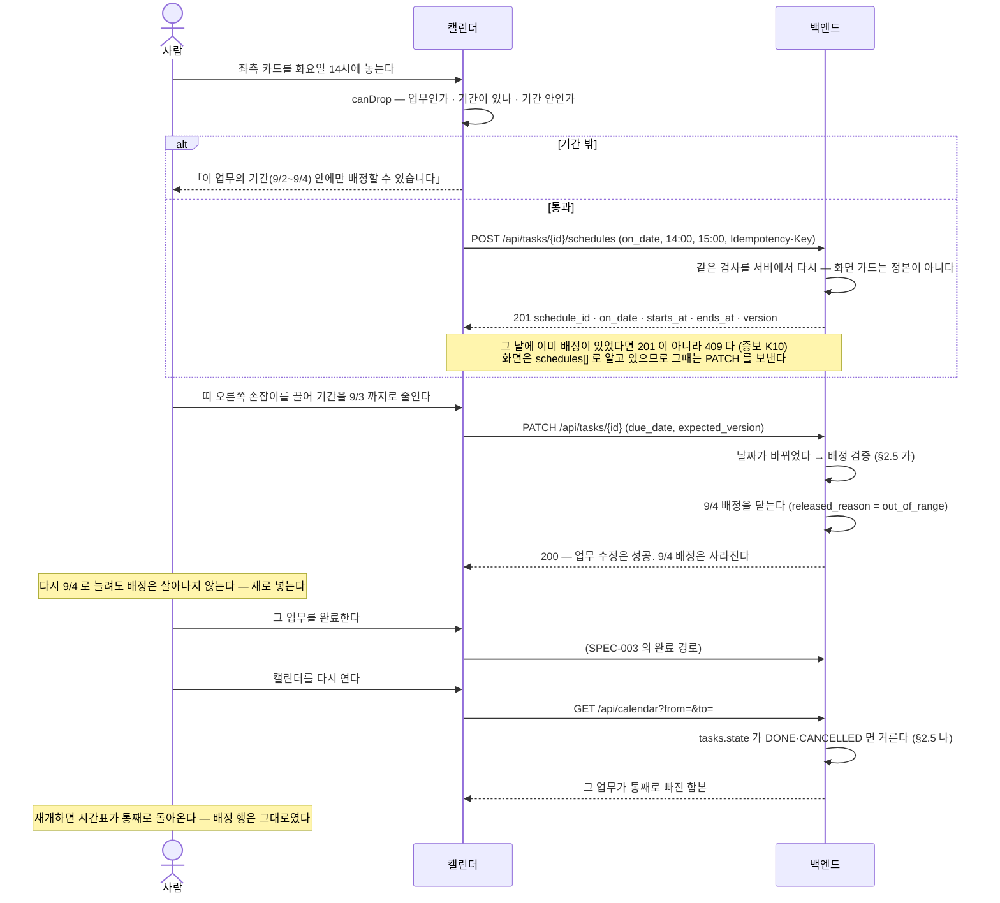
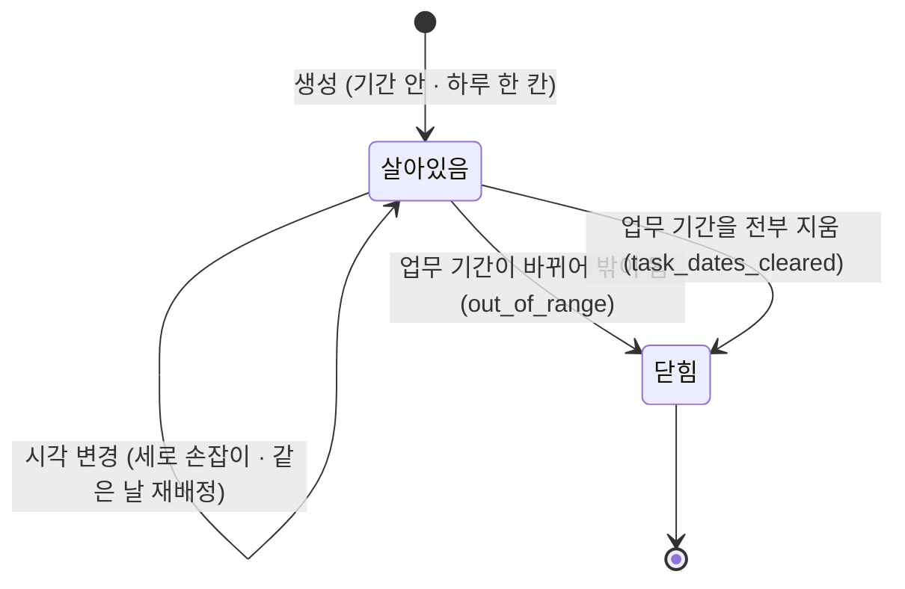

# 캘린더 시간 배정 — 업무 기간 안의 시간 배분과 배정이 사라지는 두 경로의 계약

업무는 **날짜 단위**로 산다(`start_date`·`due_date`). 이 SPEC 은 그 위에 **시간 단위** 하나를
얹는다 — 월~수짜리 업무에 「월요일 오전 10시 · 화요일 오후 2시 · 수요일 오전 9시」처럼
**그 기간 안에서** 시간을 배분하는 것이다. 회의는 이미 시간 축을 갖고 있고(`meetings`),
없는 것은 업무의 시간 배정 하나다.

> **초안이다.** 검수 전이며 `status: draft`.
> **업무의 생명주기를 바꾸지 않는다** — SPEC-003 이 세운 상태와 전이표는 그대로다.
> 사용자 원문·시안 관측·코드 관측·경로·줄 번호는 **BASE-003** 과 조사 리포트 둘이 갖는다.
> 결정과 그 근거는 **DEC-003** 이 갖는다. 여기서는 그 절을 이름으로 가리킨다.
> **저장 구조(column·index·FK·ORM·repository)와 구현 순서는 이 문서에 없다** —
> `20-spec/README.md` § Data / Domain Boundary 가 그것을 `30-work/` 의 `Domain / Schema` 절로 보낸다.

**⚠ 시안의 지위 (2026-09-20 사용자 정정 — DEC-003 머리).**

| 무엇 | 정본 |
|---|---|
| 레이아웃 · 배치 · 시각 언어 | **시안** |
| 기능 · 모달 항목 · 데이터 · 상태 어휘 | **우리 것** — 기존 코드 · SPEC-001/002/003 · DEC-003 |

**시안은 「이런 기능이 있다」 수준으로만 읽는다.** 시안 목데이터의 필드 구성
(`TaskCreateModal` 의 항목 · `work-data.js` 의 `status` 5종 · `ItemCard` 의 배지와 액션)은
**계약으로 올리지 않는다.** 그 자리의 정본은 SPEC-001·SPEC-002·SPEC-003 과 기존 코드다.
**디자이너가 없다** — 시안에 있고 DS 에 없는 부품은 **우리가 만든다.** 다만 만드는 일은
`30-work/`·FE 몫이고 이 SPEC 의 범위가 아니다.

**표기 — 무엇이 그것을 세웠나를 가른다.**

| 표기 | 뜻 |
|---|---|
| **(확정)** | **DEC-003 이 채택한 것.** 뒤집으려면 새 사용자 결정이 필요하다 |
| **(원문)** | **사용자가 말로 확정한 것** — BASE-003 § 입력 2 의 인용 넷. 시안 코드는 그것을 **확인해 준 것**이지 근거가 아니다 |
| **(레이아웃)** | **시안이 정본인 자리** — 배치·칸 수·열림 위치·색이 무엇을 말하는가. **기능이 아니다** |
| **(제안)** | 그 확정을 구현 가능한 하나로 만들기 위해 **이 SPEC 이 고른 기술 표현**(경로·이름·코드값·문구). 같은 확정을 지키는 다른 표현으로 바꿔도 된다 |
| **(도출)** | DEC-003 의 **둘 이상의 확정에서 그대로 따라 나오는 것.** 새 판단이 아니다. 어디서 나왔는지를 같은 줄에 적는다 |
| **(증보)** | **DEC-003 § Decision 의 증보 K1~K14** — SPEC 초판이 미결로 올린 넷(K1~K4) · **검수 1차가 연 다섯**(K5~K9) · **수정 1차가 남긴 주의점 하나**(K10) · **검수 2차가 연 셋**(K11~K13) · **검수 3차가 연 하나**(K14)를 코디네이터가 정한 것. 확정과 같은 무게다 |
| **(보류)** | DEC-003 § 보류. **이 SPEC 이 열지 않는다** |

## 1. Context

### Meta

- Decision reference: `DEC-003` (frontmatter `links.decisions` 와 일치).
  **§ 증보 K1~K13 을 포함한다** — 초판이 OQ-401~404 로 올린 넷(K1~K4) ·
  **검수 1차 FAIL 이 연 다섯**(K5~K9) · **수정 1차가 주의점으로 올린 하나**(K10) ·
  **검수 2차 FAIL 이 연 셋**(K11~K13) · **검수 3차 FAIL 이 연 하나**(K14, 2026-09-21)를 닫은 자리다(§7).
- Baseline reference: `BASE-003` (frontmatter `links.baselines` 와 일치)
- 요구 출처 — 셋이다. **BASE-003 이 원장이고 이 SPEC 이 다시 쓰지 않는다.**
  1. **사용자 원문** (2026-09-20). BASE-003 § 입력 2 의 인용 넷이 **R1·R2·R3·R5 를 말로
     확정**했다. **기능의 근거는 여기다** (확정 — DEC-003 §E 정정).
  2. **시안** `reference/2026-09-10-sc-meeting/package 2/` (2026-09-20 사용자 지정) —
     **레이아웃의 정본**이고, 규칙 ID **R1~R9** 의 관측 근거다(BASE-003 § 원문이 확정한 것 — 시간 배정).
     **기능 정본이 아니다** (위 ⚠).
  3. **조사 리포트 둘** — `orchestration/work/strong-hajin-calendar/be-survey-report.md`(764줄) ·
     `fe-survey-report.md`(727줄). 둘 다 코드 변경 0건이고, 코디네이터가 표본을 직접 검증했다.
- **근거 개념** — `soft-delete`(되돌릴 수 없음을 표현하려면 행에 흔적이 남아야 한다) ·
  `single-source-of-truth`(제목·담당은 조인. 복사하면 조용히 낡는다). DEC-003 § 근거 개념이 원장이다.
- **저장소 코드의 경로·줄 번호를 이 SPEC 이 갖지 않는다.** 근거가 필요하면 **조사 리포트 둘을
  경유해** 인용하고, 구현 세부는 `30-work/` 로 보낸다. **시안 인용은 예외다** —
  시안은 레이아웃의 정본이라 BASE-003 과 같은 성격이다.
- **검증 수치를 이 SPEC 이 주장하지 않는다.** 조사 둘은 테스트·빌드를 돌리지 않았고(BASE-003 § 관측 기준점),
  이 SPEC 도 0건이다. 인수의 근거는 §6 이 요구하는 **새 증명**이지 과거 수치가 아니다.

### 이 SPEC 과 SPEC-003 의 관계

**대체하지 않는다.** SPEC-003·SPEC-001·SPEC-002 의 계약은 **전부 그대로** 유효하고,
이 SPEC 은 그 위에 다음 둘만 더한다.

| 무엇 | 어디에 붙나 |
|---|---|
| **업무의 시간 배정**이라는 새 리소스 | 업무에 **완전히 종속**. 독립된 약속이 아니다 **(확정 — BASE-003 § 입력 2)** |
| **캘린더 화면**의 UX 계약 | SPEC-003 §2.9 가 「기한은 있고, 근무 시간과 회의 일정은 없다」로 비워 둔 자리 |

SPEC-003 §7 의 **M-23**(「근무 시간 · 캘린더의 회의 일정 — 계약을 만들지 않는다」)은
**이 SPEC 이 회의 일정 쪽만 닫는다.** 근무 시간은 여전히 계약이 없다.

### Business Requirement

지금 사람은 업무에 **날짜만** 줄 수 있다. 월~수짜리 업무가 있어도 「월요일 오전에 이걸,
화요일 오후에 저걸」을 적을 자리가 없어서, 한 주의 시간표는 캘린더 밖 어딘가(머릿속·메모)에 있다.
회의만 시간을 갖고 업무는 안 갖기 때문에, 캘린더를 봐도 **그 주에 실제로 무엇을 할 수 있는지**가
보이지 않는다.

이 SPEC 이 보장하는 것은 넷이다.

1. **업무 기간 안에서 시간을 배분할 수 있다.** 기간 밖에는 배정할 수 없고,
   **못 하는 이유를 말로 듣는다.**
2. **회의와 업무가 한 화면에 선다.** 회의는 읽기 전용이고 업무만 움직인다.
3. **배정이 사라지는 두 이유가 갈려 있다.** 기간 밖으로 나간 것은 **기록으로 남고 되살아나지
   않으며**, 업무가 끝나서 안 보이는 것은 업무를 다시 열면 **저절로 돌아온다**.
4. **보이는 것은 내 것뿐이다.** 내가 맡은 업무와 내가 참석·공유받은 회의.

### Scope

**In scope**

- 업무 시간 배정의 **생성**과 **시각 변경**, 그리고 그 위의 권한·멱등·낙관적 잠금
- **캘린더 조회** — 업무 시간 배정 + 업무 기간 띠 + 회의를 한 번에. 「내 것만」 축 **(확정 — §D)**
- `GET /api/meetings` 의 **기간 파라미터** **(확정 — §H)**
- 업무 기간이 바뀔 때의 **배정 검증과 소프트 딜리트** **(확정 — §B)**
- 업무가 끝났을 때의 **조회 필터** **(확정 — §B·§C)**
- **캘린더 UX 계약** — 3분할 · 월/주 뷰 · 상호작용 넷 · 금지 문구 **(확정 — §E·§I)**.
  배치는 시안이 정본이고 **기능·어휘는 우리 것**이다
- 새 표면의 **운영 대장 등록 요구** **(확정 — §J)**

**Out of scope**

- **업무 생명주기 자체의 변경** — SPEC-003 그대로. 상태·전이·완료 규칙을 손대지 않는다
- **회의 도메인의 변경** — 기간 파라미터 외에는 손대지 않는다 **(확정 — DEC-003 Scope)**.
  **다만 캘린더 경로가 「공유받은 회의는 캘린더에 서지 않는다」는 기존 규칙을 뒤집는다**
  **(확정 — 증보 K9)** — 회의 도메인 코드를 건드리지 않고 **합본 조회가 자기 규칙으로 읽을 뿐**이며
  **회의 화면 경로는 그대로다.** 자세한 것은 §2.4
- **배정의 명시적 삭제 경로** — 시안에 없다. 덮어쓰기와 기간 조정으로만 바뀐다 **(보류 — §J)**
- **상태 변경 아홉 경로를 lifecycle 하나로 모으는 리팩터** **(보류)**
- **저장소 DS `GutterList` 개명** · **「더보기」 단추** **(보류)**
- **DS 부품을 만드는 일** — 시안에 있고 DS 에 없는 부품(G-CAL-01~08)은 **우리가 만든다**
  **(확정 — §J 정정, 디자이너 없음)**. 다만 **만드는 일은 `30-work/`·FE 몫**이고
  이 SPEC 은 **무엇을 보여야 하는가**까지만 적는다 (§2.8)
- **반복 회의(`repeat`)** — `meetings` 에 대응하는 열이 없다(`be-survey-report.md` §6 해석 6).
  시안 목데이터에만 있고 **계약을 만들지 않는다**
- **근무 시간** — SPEC-003 M-23 이 계속 갖는다
- **저장 구조·마이그레이션·구현 순서·컴포넌트 구현·클래스와 토큰** — `30-work/` 몫
- **E2E·브라우저 확인** — **사용자 담당**이다 (DEC-003 Scope)

## 2. UX Contract

**읽는 규칙 넷.**

1. **시안은 레이아웃의 정본이고 기능의 정본이 아니다** (머리 ⚠). 배치·칸 수·열림 위치를
   깎지 않는다. 반면 **기능·모달 항목·데이터·상태 어휘는 우리 것**을 쓴다 —
   시안 목데이터의 필드 구성을 계약으로 올리지 않는다.
2. **시안의 목데이터 한계는 계약이 아니다.** `day: number`(달 안의 일 번호)·하드코딩된 「오늘」은
   목데이터의 한계지 규칙이 아니다 **(확정 — §G·§J)**.
3. **이 절은 코드 경로·컴포넌트 구현을 적지 않는다.** 정하는 것은 **무엇을 보여야 하고
   무엇을 할 수 있어야 하는가**다.
4. **부품이 없는 자리도 계약은 그대로 세운다.** 없는 부품은 **우리가 만들고**(§J 정정)
   만드는 일은 `30-work/`·FE 몫이다. 목록은 §2.8.

### 2.1 화면은 3분할, 탭은 셋

| 무엇 | 계약 | 근거 |
|---|---|---|
| 레이아웃 | **사이드바 · 좌측 일정 레일 · 캘린더** 셋 | **(원문 R8)** 「이거 레이아웃으로 적용하는게 이번 작업에 목표」 · **(레이아웃)** `calendar.v1.jsx:293` `AppBody railLeft` |
| 오른쪽 레일 | **비운다.** `railLeft` 만 쓴다 | **(확정 — §J)** |
| 탭 | **전체 · 회의 · 업무** 셋 | **(확정 — §E 가 R9 를 채택)** · **(레이아웃)** `data.js:10-14` `CAL_TABS` |
| 뷰 전환 | **월 뷰 · 주 뷰** | **(확정 — §E 가 R7·R8 을 채택)** |

- **탭은 좌측 레일과 격자를 동시에 가른다** **(레이아웃)** — `calendar.v1.jsx:179`.
- **격자와 레일의 필터가 대칭이 아니다** **(레이아웃)** — 격자는 「업무」 탭에서 **업무 날짜 띠와
  업무 시간 배정 둘**을 내고(`calendar.v1.jsx:33-38`), 레일은 「전체」에서 회의만 카드로 세우고
  업무의 시간 배정은 **업무 카드의 `meta` 줄로 접는다**(`13일 13:00` 꼴 — `calendar.v1.jsx:261`·`274-275`).
  **배치의 문제이므로 시안을 따른다.**
- 날짜 한 칸을 **클릭하면 선택**, 다시 누르면 해제. 선택하면 좌측 레일이 그 날짜로 좁혀진다
  **(레이아웃)** — `calendar.v1.jsx:107`·`181-185`·`250-254`. 주·월 이동은 선택을 **항상 푼다**
  (`calendar.v1.jsx:235-236`).
- 월 칸 lane 상한 **4**, 넘치면 `+N건 더` — 그 날을 덮는 것만 센다 **(레이아웃)** — `calendar.v1.jsx:11`·`101`·`140`.
  주 뷰 종일 lane 상한 **3**, 넘치면 「N건 펴기 / 접기」 **(레이아웃)** — `week.jsx:8`·`52-54`·`139-143`.
- 같은 항목은 **그 주 내내 같은 줄**에 앉는다 **(레이아웃)** — `calendar.v1.jsx:72-86` · `week.jsx:24-35`.
- 월 뷰는 **완전히 달 밖인 마지막 주를 지운다**(6주 → 5주) **(레이아웃)** — `calendar.v1.jsx:26`.
- 주 뷰는 **종일 칸 + 0~24시 격자**이고 **8시에 맞춰 열린다** **(확정 — §E 가 R7 을 채택)** — `week.jsx:7`·`58-63`.

### 2.2 「오늘」과 달 경계

| 무엇 | 계약 |
|---|---|
| 「오늘」의 출처 | **`seoulToday()`** **(확정 — §J)**. 시안의 `CAL_TODAY` 하드코딩(`calendar.v1.jsx:10` `new Date(2026, 8, 15)`)은 목데이터용이다 |
| 날짜 표현 | **ISO `YYYY-MM-DD`** **(확정 — §G)**. 시안의 `day: number` 는 목데이터의 한계다 |
| 달 경계를 넘는 이동·조정 | **허용한다** **(확정 — §G)**. 시안 안에서 표현되지 않았을 뿐 막을 이유가 없다 |

> **시안의 「달 밖 칸에는 드롭 핸들러가 없다」**(`calendar.v1.jsx:108-110`)와 **「달 밖 칸 위에서는
> 손잡이가 값을 안 읽는다」**(`calendar.v1.jsx:105`)는 **`day:number` 표현의 결과**이지 규칙이 아니다.
> ISO 로 가면 그 제약이 사라지고, **§G 가 명시적으로 허용**했다.
> **기능은 우리가 정한다** — 시안의 부재가 금지가 아니다.

### 2.3 상호작용 넷 — 그리고 그 금지

**이 넷의 기능은 사용자 원문이 확정했다 (확정 — §E 정정).** BASE-003 § 입력 2 의 인용 넷이
R1·R2·R3·R5 를 말로 확정했고, **시안 코드는 그것을 확인해 준 관측**이다. 아래에서 시안 줄 번호는
**근거가 아니라 그 관측의 자리**다.

**금지는 말로 한다 (확정 — §I).** 시안은 조용하다(`canDrop` 이 거짓이면 `preventDefault` 를 안 불러
브라우저가 거절, 문구 없음 — `week.jsx:205`). 저장소의 같은 자리는 **문구로 말한다**
(칸반이 허용되지 않는 이동을 문구로 말한다 — `fe-survey-report.md` §7-3). **저장소 선례를 따른다.**
접근성에서 조용한 거절은 원인을 못 알려 준다.

#### R1 · 좌측 카드 → 날짜 칸 드롭 = **기간 이동**

| | 계약 |
|---|---|
| 무엇이 바뀌나 | 업무의 `start_date`·`due_date` **(확정)**. 배정은 안 만들어진다 |
| 규칙 | `start_date`+`due_date` 가 있으면 **길이를 유지**한 채 옮긴다 · `due_date` 만 있으면 **그날 하루**로 옮긴다 · 둘 다 없으면 **그날 하루짜리 기간이 생긴다** **(원문 R1·R2)** 「업무 일정을 좌우 이동하면서 바꿀수도 잇고」 · 관측 `calendar.v1.jsx:205-210` |
| 어디서 | 월 뷰 날짜 칸 · 주 뷰 **종일 칸** **(레이아웃)** — `calendar.v1.jsx:110` · `week.jsx:166-167` |
| 금지 | **회의는 못 옮긴다** — 좌측 회의 카드는 `draggable: false` **(확정 — §F)** · 관측 `calendar.v1.jsx:285` |
| 금지 | 날짜 이동 자체에는 **기간 가드가 없다** **(확정 — §E·§G)**. 가드는 시간 격자에만 걸린다. 달 경계는 **허용**이다(§2.2) |
| 명령 | 기존 업무 수정 계약을 쓴다 — `PATCH /api/tasks/{task_id}` **(도출 — 새 명령을 만들지 않는다)** |
| 뒤따르는 것 | **기간이 바뀌었으므로 §2.5 의 「기간 밖」 판정이 돈다** |

#### R2 · 기한 없는 업무는 **날짜부터**

- 기한 없는 업무는 **시간 격자에 못 떨어진다** **(원문 R2)** 「업무 일정이 없는거는 드래그 앤
  드랍으로 일정 부터 생성 하게 하고 거기에 시간을 둘거」 · 관측 `week.jsx:101-105`.
- 먼저 날짜 칸에 떨어뜨려 기간을 만들고, 그 다음에 시간을 준다.
- **거절 문구** — 「먼저 업무 기간을 정해 주세요. 기간이 있어야 시간을 배정할 수 있습니다.」 **(제안 — §I)**

#### R3 · 띠 **좌우 손잡이** = 시작·마감일 조정

| | 계약 |
|---|---|
| 어디에 붙나 | **업무 날짜 띠에만.** 시간 배정 블록과 회의 띠에는 안 붙는다 **(확정 — §E·§F)** · 관측 `calendar.v1.jsx:124`·`135-136` |
| 규칙 | `start` 손잡이는 `min(끈 날, 마감)` · `end` 손잡이는 `max(끈 날, 시작)` **(원문 R3)** 「업무 일정을 좌우 이동하면서 바꿀수도 잇고」 · 관측 `calendar.v1.jsx:213-219` |
| 금지 | **시작이 마감을 넘지 못하고 마감이 시작보다 앞서지 못한다.** 시안은 조용히 접지만 **여기서는 말한다** — 「시작일은 마감일보다 뒤일 수 없습니다.」 **(제안 — §I)**. 서버 규칙은 **기존 `validate_schedule` 그대로**다 |
| 금지 | 주 뷰 종일 띠는 **그 주 밖에서 시작·종료하는 끝에는 손잡이를 안 단다** **(레이아웃)** — `week.jsx:177-178` |
| 명령 | `PATCH /api/tasks/{task_id}` **(도출)** |
| 뒤따르는 것 | **§2.5 의 「기간 밖」 판정** |

#### R4 · 마감만 있던 업무는 손잡이를 끄는 순간 **기간을 갖는다**

- `due_date` 만 있던 업무에 손잡이를 끌면 **`start_date`~`due_date` 기간이 선다**
  **(확정 — §E 가 R4 를 채택)**. **사용자 원문에는 이 줄이 없다** — 시안 관측
  (`calendar.v1.jsx:213-215` 가 `due` 를 지우고 `from`/`to` 를 세운다)에서 왔고,
  **DEC-003 §E 가 계약으로 올린 것**이 근거다.
- 우리 어휘로는 **「마감만 있다」가 `start_date` 가 비어 있는 것**이고, 기간이 생긴다는 것은
  **`start_date` 가 채워지는 것**이다 **(도출 — 시안의 `from`/`to`/`due` 세 필드가 우리 계약에서는
  `start_date`·`due_date` 둘이다. `fe-survey-report.md` §6-2(a))**.
- **한쪽만 있는 업무를 그 날 하루로 읽는 규칙**(증보 K7 · §2.5)은 **이 어휘 위에 선다.**

#### R5 · 좌측 카드 → **시간 격자** 드롭 = 시간 배정 생성

| | 계약 |
|---|---|
| 무엇이 생기나 | **그 업무의 그 날 시간 배정 한 칸.** 업무의 기간은 **건드리지 않는다** **(원문)** 「이번주에 내가 맡은 업무 중에 시간을 배분하고 싶은거야」 · 관측 `calendar.v1.jsx:222-226` |
| 길이 | 기본 **1시간** **(확정 — §E 가 R6 를 채택)** · 관측 `week.jsx:212` |
| 눈금 | **30분** **(확정 — §E 가 R6 를 채택)** · 관측 `week.jsx:9`·`94-98`. **DB CHECK 로 박지 않는다** **(확정 — §J)** — 화면 편의다 |
| 하루 한 칸 | **같은 업무는 하루에 배정 한 칸** **(원문 R5)** 「월요일은 오전 몇시에 / 화요일은 오후에 / 수요일은 오전에」 · **(확정 — §J)**. 같은 날에 다시 떨어뜨리면 **그 칸의 시각이 바뀐다** **(확정 — DEC-003 증보 K1)** — 화면은 그때 **생성이 아니라 시각 변경**을 보낸다 **(확정 — 증보 K10)** |
| 금지 ① | **업무가 아닌 것은 못 넣는다.** 회의는 애초에 드래그가 안 된다 **(확정 — §F)** |
| 금지 ② | **기한 없는 업무는 못 넣는다** → R2 의 문구 |
| 금지 ③ | **업무 기간 밖에는 못 넣는다** **(원문 R1)** 「목,금에는 배정 할 수 없게 되어 있을거야」 · 관측 `week.jsx:101-105`. **거절 문구** — 「이 업무의 기간(9월 2일~9월 4일) 안에만 시간을 배정할 수 있습니다.」 **(제안 — §I)** |
| 끌기 중 | 드롭 가능한 자리에 **고스트와 `HH:MM – HH:MM`** 을 띄운다 **(레이아웃)** — `week.jsx:215-219` |

> **금지 ③ 은 화면의 가드이자 서버의 계약이다.** 화면 가드만으로는 부족하다 —
> 같은 규칙이 서버에도 있어야 한다(`fe-survey-report.md` §6-3 D-7, 저장소 규칙: 권한·가능은 서버가 정본).
> 서버 쪽 코드는 §4 Case Matrix 의 `TASK_SCHEDULE_OUT_OF_RANGE` 다.
>
> **그 「기간」을 화면이 계산하지 않는다 (확정 — 증보 K14).** 합본 조회가 `span_from`·`span_to` 로
> **정규화한 구간을 실어 준다**(§4). 화면은 **그것을 받아서 쓴다** — **캘린더는 업무 기간을 자체 계산하지 않는다.** 화면이 다시 계산하면 규칙이 두 벌이 되고, 실제로 뒤집힌 기간에서 두 벌이 됐다.

#### R6 · 시간 블록 **세로 손잡이** = 시작·종료 시각 조정

| | 계약 |
|---|---|
| 어디에 붙나 | **업무 시간 배정 블록에만.** **회의 블록에는 붙지 않는다** **(확정 — §F)** |
| 규칙 | 30분 눈금 · `시작 < 종료` 일 때만 반영 **(확정 — §E)** · 관측 `calendar.v1.jsx:229-233` |
| 금지 | **역전 금지.** 시안은 값을 조용히 버리지만 **여기서는 말한다** — 「종료 시각은 시작 시각보다 뒤여야 합니다.」 **(제안 — §I)** |
| 금지 | **자정 넘김 금지.** 저장 타입이 `Date` + `Time` + `Time` 이라 애초에 표현되지 않는다 **(확정 — §A)** · 관측 `clamp(0, 1440)` |
| 금지 | **날짜 이동 불가.** 시간 블록을 다른 날로 옮기는 명령을 **만들지 않는다** **(확정 — §E·§J 보류)** · 관측 `resizeSlot` 이 `day` 를 안 건드린다 |
| 최소 길이 | **없다.** `시작 < 종료` 만 지키면 30분 미만도 만들어진다. 다만 **그리기는 최소 30분 높이**다 **(레이아웃)** — `week.jsx:227`. 값과 그림이 달라질 수 있다 |
| 언제 저장하나 | **놓을 때 한 번** **(제안)**. 끄는 동안에는 부르지 않는다 — 모든 쓰기가 낙관적 잠금이라(`fe-survey-report.md` §6-3 D-5) 끌 때마다 부르면 회차가 매번 어긋난다 |

> **시안은 회의 블록에도 세로 손잡이를 붙인다**(`week.jsx:231-232`). **우리는 붙이지 않는다**
> **(확정 — §F)**. 회의에는 참석자·회의실 예약이 딸려 있어 캘린더에서 조용히 시각을 바꾸면 안 된다.
> **회의 시각은 회의 화면에서 바꾼다.**
> **이것은 「시안의 빠뜨림」에 대한 판정이 아니라 결정이다** — 기능의 정본은 우리 것이므로
> 시안 작성자에게 확인할 일이 아니다 (DEC-003 §F, 2026-09-20 정정).

### 2.4 회의는 캘린더에서 **읽기 전용** (확정 — §F)

- 좌측 레일에서 **끌 수 없다** (`draggable: false`).
- 시간 격자에서 **늘릴 수 없다** (§2.3 R6).
- 캘린더는 회의에 **쓰기 명령을 내지 않는다** **(도출)**. 회의 시각·정보 변경은
  회의 화면의 기존 계약(`PATCH` 계열)이 갖는다.
- 회의가 캘린더에 **돌아온다.** 지금 캘린더 화면은 주석으로 「이 화면은 업무만 낸다」고
  적혀 있고(`fe-survey-report.md` § 관측), 이 SPEC 이 **그 결정을 뒤집는다**
  **(확정 — DEC-003 Scope · D9)**.

> **⚠ 뒤집는 규칙이 하나 더 있다 (확정 — DEC-003 증보 K9).**
> 저장소에는 **「공유받은 회의는 캘린더에 서지 않는다」**가 **다른 SPEC 의 계약**으로 적혀 있다 —
> 회의 목록이 구획을 가를 때 공유 관계를 무조건 「지난」으로 보내고, 캘린더용 내 회의 목록도
> 공유 관계를 일부러 뺀다(`be-survey-report.md` §6). **이 SPEC 은 그것을 뒤집는다.**
>
> - **왜** — §D 가 회의 가시성을 **`board`(참석·공유)** 로 정했다. **공유받은 회의는 내 일정이다.**
>   공유 회의를 빼면 §D 와 어긋난다.
> - **그 SPEC 의 원문은 우리에게 없다** — 회사 sc-ax 시절 계약이고 코드와 함께 딸려 오지 않았다.
>   **물을 주인이 없어 DEC-003 증보 K9 가 여기서 정했다.**
> - **Scope Out 위반이 아니다.** 회의 도메인 코드를 **건드리지 않는다** — 캘린더 합본 조회가
>   **자기 규칙으로 읽을 뿐**이다.
> - **회의 화면은 그대로다.** `from`/`to` 를 보내지 않는 경로는 **기존 규칙과 기존 동작을 유지한다**
>   (§4 「`GET /api/meetings`」 두 모양 표).
> - **이것은 관찰 가능한 동작 변경이다** — §3 S-7 과 §6 이 「공유받은 다음 주 회의가 제자리로 선다」를
>   인수조건으로 요구한다.
- 회의 카드가 내는 것 — 제목 · 시각 · 장소 · **주최자 이름**. **참석자 목록·목적·반복은 내지 않는다**
  **(도출 — 회의 목록 행이 그 아홉 필드뿐이다. `be-survey-report.md` §6)**.
- **주최자는 표시 이름으로 낸다** **(확정 — 증보 K4)**. `created_by` 는 member id 라
  그대로 쓸 수 없고, **합본 조회가 member 를 조인해서 이름을 낸다** —
  업무 담당·제목을 조인으로 내는 것(§A)과 **같은 방식**이다.
- **시안 목데이터의 `repeat`(「매주 월」)는 계약이 아니다** — `meetings` 에 대응 열이 없고,
  **기능 정본은 우리 것**이다. 반복 회의는 현재 모델에 없는 개념이다.

### 2.5 배정이 화면에서 사라지는 **두 가지 이유** — 여기서 가른다

> **이 절이 DEC-003 §B 가 인정한 대가의 자리다.** 「왜 안 보이나」의 답이 둘이므로
> **읽는 사람이 헷갈리지 않게 한 자리에서 가른다.**

| | **(가) 기간 밖으로 나갔다** | **(나) 업무가 끝났다** |
|---|---|---|
| **메커니즘** | **쓰기** — 배정 행을 닫는다 **(확정 §B)** | **읽기** — 캘린더 조회가 걸러 낸다 **(확정 §B)** |
| **트리거** | **업무의 날짜가 바뀌어** 기존 배정이 새 기간 밖이 된 순간 **(확정 §B)** | **조회 시점에** 그 업무가 내부 **`DONE`·`CANCELLED`** 인 것 **(확정 §B·§C)** |
| **어디서 도나** | 날짜가 바뀌는 **세 자리** — 업무 수정 · 시작 전이 · 조건 변경 제안 동의 **(확정 §J)** | **캘린더 조회 한 자리** **(확정 §B)** |
| **되돌릴 수 있나** | **없다.** 기간을 되돌려도 배정은 살아나지 않는다. **사람이 새로 넣는다** **(확정 — BASE-003 § 원문이 확정한 것 — 기간이 바뀔 때)** | **된다.** 업무가 다시 열리면(`done → in_progress`) 배정이 **저절로 다시 보인다** **(확정 §B)** |
| **행이 남나** | **남는다.** 닫힌 사실과 사유가 이력에 남는다 **(확정 §A·§J)** | **아무것도 안 바뀐다.** 배정 자체의 사실은 그대로다 **(확정 §B)** |
| **닫는 사유** | `out_of_range`(기간이 줄어 밖이 됨) · `task_dates_cleared`(기간을 **전부 지움**) **둘뿐** **(확정 §J)** | **사유가 생기지 않는다** — 쓰기가 아니다 **(확정 §J)** |
| **화면** | 그 배정이 **캘린더에서 사라지고 사람에게 알린다** — 「N건의 시간 배정이 기간 밖이라 해제되었습니다.」 **(확정 — 증보 K3)**. 기간을 되돌려도 **빈 채로 남는다** | 그 업무가 캘린더에서 통째로 빠진다(업무 띠와 배정 모두). **알리지 않는다** — 되돌릴 수 있기 때문이다. **다시 열면 통째로 돌아온다** |
| **유일성** | 닫힌 행은 **「하루 한 칸」 계산에서 빠진다** **(확정 §A)** — 같은 날에 다시 배정할 수 있다 | 해당 없음 |

**「끝났다」의 판정은 내부 `DONE` 만이다 (확정 — §C).**

- **`COMPLETION_SUBMITTED`**(완료 보고를 냈고 승인 대기)는 **아직 안 끝난 것으로 보고 배정을 살린다.**
- 외부 `done`(= `DONE` + `COMPLETION_SUBMITTED`)으로 잡으면 **보완 요청 한 번에 사람이 짠 시간표가
  화면에서 통째로 사라진다.** 읽기 필터라 실제로 없어지진 않지만, 판정 기준이 왔다 갔다 하는 것
  자체가 화면을 못 믿게 만든다 **(확정 — §C)**.
- **`cancelled` 도 같이 걸러진다** **(확정 §B — 「업무가 끝났다(`done`·`cancelled`)」)**.
- **프론트에 `completion_submitted` 를 들이지 않는다** **(확정 — §J)**. 이 판정은 **백엔드 조회**가
  하므로 프론트 어휘를 바꿀 이유가 없다 — 저장소가 「들이면 "승인 전 done" 을 상태값으로 판단하는
  코드가 다시 생긴다」는 이유로 **일부러 뺐다** (`fe-survey-report.md` §7-2).

**왜 갈랐나 (확정 — §B).** 둘은 같아 보이지만 **되돌릴 수 있는가**가 다르다.
기간 밖은 되돌려도 복구하지 않으므로 행에 흔적이 있어야 하고, 업무가 끝난 것은 업무를 따라갈 뿐이라
조회 시점에 언제나 최신이다. **둘을 억지로 같은 메커니즘으로 묶으면 한쪽이 반드시 망가진다.**

**기간을 전부 지운 업무의 배정은 전부 닫힌다 (확정 — §J).** 기간이 없으면 배정할 수 없다는
R1·R2 와 일관된다. 사유는 `task_dates_cleared` 다. **이때도 알린다** (아래).

**날짜가 한쪽만 남은 업무는 그 날 하루로 읽는다 (확정 — 증보 K7).**
「한쪽만 빈」 업무는 **실재한다** — 한쪽만 채워진 업무가 유효하고 한쪽만 지우는 수정도 된다
(`be-survey-report.md` §3).

- 그런 업무의 기간은 **남은 한쪽의 그 날 하루**다. **프론트가 이미 같은 규칙으로 읽으므로**
  (`fe-survey-report.md` §6-2(a)) **FE 와 BE 가 한 규칙**이 된다.
- 따라서 그 하루 밖으로 나간 배정은 **`out_of_range` 하나로 닫힌다.**
  **셋째 사유가 생기지 않고** §J 의 「사유는 둘」이 그대로 지켜진다.
- 이 한 줄이 없으면 **되돌릴 수 없는 쓰기의 한 경우가 통째로 비어** 구현이 갈린다 —
  전부 닫거나, 아무것도 안 닫거나, 하루로 보거나. **셋 다 사람의 시간표를 다르게 만든다.**
- **「시작 전이」 자리에 배정이 서는 것도 이 규칙 때문이다** —
  §5 「거는 자리」가 세는 셋 중 시작 전이는 **`start_date` 가 비어 있을 때만** 날짜를 쓰는데,
  그런 업무에 살아 있는 배정이 있으려면 **바로 이 「한쪽만 빔」 상태**를 거쳐야 한다.
  **다만 그 자리에서 실제로 닫히는 배정은 나오지 않는다** — 아래 K11 정규화 때문이다.
  검증은 돌고 건수는 `0` 이다(§6).

**뒤집힌 기간은 정규화해서 읽는다 (확정 — 증보 K11).**
`start_date > due_date` 인 업무도 **실재한다.** 시작일이 마감일보다 뒤인 것을 막는 검사는
**날짜가 바뀌는 세 자리 중 「업무 수정」에만 걸리고 시작 전이·제안 동의는 지나지 않는다**
(`be-survey-report.md` §8-5). **조사가 이미 짚어 둔 자리다.**

- 그런 업무의 기간은 **`[min(start_date, due_date), max(start_date, due_date)]`** 다.
  그 구간 밖으로 나간 배정만 **`out_of_range` 로 닫힌다.**
  **사유는 여전히 둘이다** — §J 의 「사유는 둘」이 그대로 지켜진다.
- **빈 구간으로 보지 않는다.** 빈 구간으로 읽으면 **그 업무의 모든 배정이 한 번에 전멸**하고
  **되돌릴 수 없다.**
- **하필 흔한 경로에서 터진다** — 마감이 지난 업무를 지금 시작하는 것은 **일상**이고,
  시작 전이가 시작일에 **오늘**을 넣으므로 그 순간 기간이 뒤집힌다.
  빈 구간으로 읽으면 **「시작했더니 시간표가 사라졌다」**가 된다.
- **K7 과 결이 같다** — **이상한 입력을 최대한 뜻이 통하게 읽고, 되돌릴 수 없는 소멸을
  최소화한다.**
- **이 규칙이 「기간을 읽는 법」의 네 번째 경우**이고 §4 Validation 이 그것을 한 줄로 갖는다.

**닫혔으면 말한다 (확정 — DEC-003 증보 K3).**

- 업무의 날짜를 바꿔 배정이 닫히면 **「N건의 시간 배정이 기간 밖이라 해제되었습니다.」** 를 낸다
  **(제안 — 문구)**. `N` 은 이번에 닫힌 건수다.
- **되돌릴 수 없는 일이 조용히 일어나면 안 된다.** 기간을 되돌려도 살아나지 않으므로(§2.5 가),
  모르고 지나가면 시간표가 없어진 줄도 모른다.
- **§I 와 같은 결이다** — 거기는 **막는 것**을 말하고 여기는 **잃은 것**을 말한다.
- **오류가 아니다.** 업무 수정은 **성공**하고, 이 문장은 그 성공에 딸린 알림이다.
- **화면이 그 문장을 만들려면 건수를 받아야 한다** — 업무 수정 응답이 닫힌 건수를 돌려준다
  (§4 「업무 날짜 수정의 응답」).
- **0건이면 아무 말도 하지 않는다** **(제안)**.
- **업무가 끝나서 안 보이는 것(§2.5 나)은 알리지 않는다** — 되돌릴 수 있고 쓰기도 아니다.

**같은 날 재배정은 닫기가 아니다 — 시각 변경이다 (확정 — DEC-003 증보 K1).**
같은 업무를 같은 날에 다시 떨어뜨리면 **그 행을 닫고 새로 만드는 것이 아니라 같은 행을 갱신한다.**
**그 갱신을 하는 것은 시각 변경 명령이다** **(확정 — 증보 K10)** — 생성 명령은 **생성만 하고**
그 날이 이미 차 있으면 **거절한다**(§4). **규칙은 K1 그대로이고 무엇이 갱신하느냐만 못 박혔다.**

- **사용자의 머릿속 모형이 그렇다** — 「월요일은 오전 몇시에」. 오후로 옮기는 것은
  **그 날의 시각을 바꾸는 것**이지 지우고 새로 잡는 것이 아니다.
- **닫는 사유가 둘로 유지된다**(§J). 교체를 위한 셋째 사유가 생기지 않는다.
- **부분 unique 도 깨끗하게 남는다** — 닫힌 행이 늘지 않는다.
- **이력은 `updated_at` 과 낙관적 잠금 회차가 갖는다.**
- 화면 결과는 시안의 `addSlot` 이 조용히 덮어쓰는 것(`calendar.v1.jsx:224`)과 **같다**.

### 2.6 **격자**는 상태를 말하지 않는다. **카드와 상세**는 우리 어휘로 말한다 (확정 — §J)

**갈라야 한다 — 하나는 레이아웃이고 하나는 기능이다.**

| 자리 | 계약 | 무엇이 정했나 |
|---|---|---|
| **캘린더 격자**(띠·시간 블록) | **상태를 말하지 않는다.** 색은 **유형 둘(업무/회의)로만** 칠한다 | **(레이아웃)** 격자에 상태를 얹을 자리가 배치에 없다 — 시안 `calendar.css:45-47`. **여기까지가 시안의 몫이다** |
| **좌측 카드 · 상세** | **우리 기존 어휘로 상태를 낸다** — 기존 업무 화면과 **같은 표시**를 쓴다 | **(확정 — §J 정정)** 카드가 무엇을 적을지는 **우리 결정**이다 |

- 상태의 **말**은 저장소에 **한 곳으로 모여 있고 그것이 정본**이다 — 상태 라벨·톤과
  파생 표시(수락 대기 · 확인 대기 · 담당 변경 대기)의 말
  **(확정 — 우리 것이 정본 · `fe-survey-report.md` §7-1)**.
- **시안 목데이터의 `badge:'결정 요청'`·`actions:'accept'` 를 계약으로 올리지 않는다** —
  시안의 필드 구성은 기능 정본이 아니다. 카드가 **무엇을 배지로 낼지는 기존 업무 화면의 어휘**를 쓴다.
- 저장소가 상태를 **색**으로 바꾸는 자리는 셋인데, 그중 **캘린더 칩에 상태를 클래스로 붙이던 자리**는
  **격자에서 안 쓰게 된다** **(도출 — 격자는 유형 둘로만 칠한다 · `fe-survey-report.md` §7-1)**.
  좌측 카드의 tone 은 **기존 상태 톤**을 쓴다 **(제안 — 우리 어휘)**.

### 2.7 가시성 — **내 것만** (확정 — §D)

| 축 | 무엇 | 뜻 |
|---|---|---|
| 업무 | **`my_work`** — 지금 **활성 담당**으로 들고 있는 것 | 「이번 주에 **내가 맡은** 업무 중에 시간을 배분하고 싶은거야」 |
| 회의 | **`board`** — 참석·공유 | 조직 범위로 남의 회의를 여는 셋째 축은 두지 않는다 |

- **조직 축을 고르지 않았다.** 골랐다면 타인의 배정이 내 캘린더에 서고, 그러면 「담당자는 조인으로」(§A)가
  표시 요구로 번지는데 **시안에는 그 자리가 없다** **(확정 — §D)**.
- **배정은 자기 가시성 규칙을 갖지 않는다** **(도출)** — 업무에 완전히 종속하므로,
  **업무를 읽을 수 있으면 그 배정도 읽을 수 있다.** 저장소의 업무 연결 표가 같은 모양이다
  (`be-survey-report.md` §7 해석 3).
- **읽기와 쓰기는 다른 물음이다 (확정 — 증보 K5).** **읽을 수 있다고 배정을 만들 수 있는 것이
  아니다** — 쓰기는 **그 업무의 활성 담당 관계**를 요구한다(§4 · §5).
- **업무의 기간도 화면이 계산하지 않는다 (확정 — 증보 K14).** 합본 조회가 `span_from`·`span_to` 를
  싣고 **화면은 그것을 받아서 그린다** — **캘린더는 업무 기간을 자체 계산하지 않는다.**
  띠를 그리는 것도, 시간 격자의 드롭 가드도 그 구간을 쓴다(§2.3 R5).
- **다만 캘린더 위에서는 둘이 같다 (확정 — 증보 K13).** 축이 `my_work` 라 **합본 조회에 선 업무는
  전부 내가 활성 담당**이다. **화면이 행마다 따로 물을 필요가 없다.**
  **서버 판정은 그래도 남는다** — 합본 조회를 거치지 않고 **다른 경로로 `task_id` 를 넣어**
  부를 수 있으므로, 서버는 화면을 믿지 않고 **담당 관계를 다시 검사한다**(§4 · §5).

### 2.8 부품 — 없는 것은 **우리가 만든다** (확정 — §J 정정)

**디자이너가 없다.** 시안에 있고 DS 에 없는 부품은 **우리 FE 작업 범위**로 들어온다.
**만드는 일은 `30-work/`·FE 몫**이고, 이 SPEC 은 **그 부품이 무엇을 보여야 하는가**까지만 적는다.
목록과 근거는 `fe-survey-report.md` §5 가 원장이다.

| ID | 저장소에 없는 것 | 이 SPEC 의 계약 |
|---|---|---|
| G-CAL-01 | 레일형 `GutterList` 부품 | **선다** — 좌측 레일의 머리줄·본문 구조는 §2.1 |
| G-CAL-02 | `Empty` 의 `icon` prop | **선다** — 빈 상태를 낸다 |
| G-CAL-03 | `TaskCreateModal` | **요구하지 않는다** — 아래 「업무 만들기 모달」 |
| G-CAL-04 | `ItemCard` / `InboxCard` 부품 | **선다** — 좌측 카드(§2.1·§2.6). **항목 구성은 우리 어휘**다 |
| G-CAL-05 | 일정 조각(`Event`) 부품 일체 | **선다** — 띠·손잡이·고스트·`+N건`(§2.1·§2.3) |
| G-CAL-06 | `MonthGrid` · `WeekGrid` 부품 | **선다** — 월/주 뷰(§2.1) |
| G-CAL-07 | `AppHeader` 의 `titleEnd` | **캘린더는 `title`+`actions` 만 쓴다** — 요구하지 않는다 |
| G-CAL-08 | 상태 색 tint | **격자에는 요구하지 않는다**(§2.6). 카드는 **기존 상태 톤**을 쓴다 |

**「업무 만들기」 모달은 기존 모달을 그대로 쓴다 (확정 — §J 정정).**
시안 `TaskCreateModal` 의 **필드 구성을 따라가지 않는다** — 업무 생성 계약은
**SPEC-001·SPEC-003 이 이미 갖고 있고**, 시안의 목 모달이 그것을 이길 이유가 없다.
**이 SPEC 은 업무 생성 계약을 건드리지 않는다.**

**`GutterList` 이름 충돌** — 저장소 DS 의 같은 이름 부품은 **다른 부품**이다
(`fe-survey-report.md` §4-2).
**새것에 다른 이름을 준다** **(확정 — §J)**. 기존 것의 개명은 소비처를 안 세서 **이번 범위 밖**이다 **(보류)**.

## 3. User Scenario

**전제** — 로그인한 구성원이 캘린더를 연다. 보이는 것은 **내가 맡은 업무와 내가 참석·공유받은 회의**뿐이다(§2.7).

### S-1. 월~수짜리 업무에 시간을 배분한다 (R1·R5·R6)

1. 주 뷰를 연다. 8시에 맞춰 열린다.
2. 좌측 레일에서 「제품 소개서 스프린트」(9/2~9/4) 카드를 잡아 **월요일 10시 자리**에 놓는다.
   → 10:00–11:00 배정 한 칸이 선다. **업무 기간은 안 바뀐다.**
3. 같은 카드를 **화요일 14시**에 놓는다 → 또 한 칸.
4. 수요일 블록의 **아래 손잡이**를 끌어 09:00–11:00 으로 늘린다.
5. 화요일이 바빠져 **같은 카드를 화요일 16시에 다시 놓는다** → 새 칸이 생기지 않고
   **그 칸의 시각이 16:00–17:00 으로 바뀐다.** `schedule_id` 가 그대로다 (증보 K1).
   화면은 이때 **생성이 아니라 시각 변경**을 보낸다 — 그 날의 `schedule_id`·`version` 을
   합본 조회에서 이미 받았기 때문이다 (증보 K8·K10).
6. **목요일에 놓으려 한다** → 거절되고 **「이 업무의 기간(9월 2일~9월 4일) 안에만 시간을 배정할 수
   있습니다.」** 가 뜬다(§2.3 R5 금지 ③).

### S-1b. 남의 업무에는 시간을 못 넣는다 (증보 K5·K6·K13)

**캘린더 화면에서는 이 일이 일어나지 않는다** — 축이 `my_work` 라 **남의 업무가 격자에 서지 않는다**
(§2.7 · 증보 K13). 아래는 **합본 조회를 거치지 않고 서버에 직접 닿았을 때**의 계약이다.

1. **요청 관계로 읽을 수는 있는** 남의 `task_id` 로 배정 생성을 부른다 →
   **`TASK_SCHEDULE_FORBIDDEN` 403.**
   **「없다」(404)고 하지 않는다** — 읽을 수 있다는 건 존재를 이미 아는 것이므로,
   숨기면 화면이 거짓말이 된다.
2. 아예 **읽을 수 없는 업무**로 부르면 그때는 **404** 다.

> **이 둘은 축과 무관하게 선다.** 그래서 K13 이 화면 쪽 필드를 걷어내도 **K5 의 서버 판정은
> 그대로 남는다** — 서버는 화면이 무엇을 냈는지를 근거로 삼지 않는다.

### S-1c. 두 탭이 같은 날을 동시에 잡는다 (증보 K10)

1. 탭 A 와 탭 B 가 같은 업무의 같은 화요일을 **둘 다 비어 있는 것으로** 보고 있다.
   **둘은 서로 다른 멱등 키**를 쓴다 — 같은 사람의 같은 명령이지만 **다른 조작**이다.
2. 탭 A 가 먼저 놓는다 → **`201`.** 그 날에 배정이 선다.
3. 탭 B 가 놓는다 → **`409` `TASK_SCHEDULE_DAY_TAKEN`.**
   **탭 A 의 배정이 조용히 덮어써지지 않는다.**
   **키가 다르기 때문에 영수증 길로 새지 않는다**(증보 K12) — 탭 B 가 **자기 재전송을 한 것이 아니다.**
4. 탭 B 가 새로고침하면 그 날의 `schedule_id`·`version` 을 받고, 바꾸고 싶으면 **시각 변경**을 부른다.
5. **이 안전망이 없으면** — 회차 없는 생성이 갱신을 겸했다면 3 에서 탭 A 의 배정이
   **아무 말 없이 사라진다.** 서버는 「몰라서 회차를 뺐다」와 「알고 뺐다」를 구분할 수 없다.
6. **탭 A 가 같은 키로 한 번 더 보내는 경우는 다르다** — 그것은 **연타**이고
   **`200` 영수증**이다(증보 K12). **가르는 것은 키이지 「그 날이 찼는가」가 아니다.**

### S-2. 기한 없는 업무는 날짜부터 (R2)

1. 좌측 레일의 기한 없는 업무를 **시간 격자**에 놓으려 한다 → 거절되고
   **「먼저 업무 기간을 정해 주세요.」** 가 뜬다.
2. **월 뷰 날짜 칸**에 놓는다 → 그 날 하루짜리 기간이 생긴다.
3. 이제 시간 격자에 놓을 수 있다.

### S-3. 마감만 있던 업무가 기간을 갖는다 (R4)

1. 9/10 마감만 있는 업무의 띠에 **왼쪽 손잡이**가 떠 있다.
2. 9/8 까지 끌면 **9/8~9/10 기간**이 선다. 「마감만 있음」이 아니게 된다.
3. 이제 그 사흘 안에 시간을 배분할 수 있다.

### S-4. 기간을 줄였더니 배정이 사라지고 **그 말을 듣는다** (R3 → §2.5 가 · 증보 K3)

1. 9/2~9/4 업무에 월·화·수 배정 셋이 있다.
2. 오른쪽 손잡이를 끌어 **9/3 까지**로 줄인다.
3. **수정은 성공한다.** 응답이 `released_count: 1` 을 낸다.
4. 화면이 **「1건의 시간 배정이 기간 밖이라 해제되었습니다.」** 를 낸다 —
   **조용히 사라지지 않는다** (증보 K3).
5. 9/4 배정이 캘린더에서 사라진다(`out_of_range`).
6. 마음이 바뀌어 **다시 9/4 까지**로 늘린다 → **9/4 는 빈 채로 돌아온다.**
   **사람이 새로 넣는다** (§2.5 가 · 되돌릴 수 없음). 이때는 **아무 말도 나오지 않는다**(0건).
7. 9/4 에 새 배정을 넣는다 → **닫힌 행이 유일성에서 빠지므로** 받아들여진다.

### S-4b. 시작일만 지워진 업무를 마감일이 지난 뒤에 시작한다 (증보 K7·K11)

1. 9/2~9/4 업무에 화요일(9/3) 배정이 하나 있다.
2. 업무를 고치며 **시작일만 지운다.** 마감일 9/4 만 남는다.
3. **기간이 「9/4 하루」로 읽힌다**(K7) — 9/3 배정은 그 하루 밖이라 **`out_of_range` 로 닫히고**
   화면이 「1건의 시간 배정이 기간 밖이라 해제되었습니다.」를 낸다.
4. 9/4 에 새 배정을 넣는다.
5. 며칠 지나 **9/6 에 그 업무를 시작**한다 → 시작일이 **오늘(9/6)** 로 채워진다.
   이제 `start 9/6 > due 9/4` 로 **기간이 뒤집힌다.**
   **그 검사는 이 경로를 지나지 않으므로**(`be-survey-report.md` §8-5) 그대로 저장된다.
6. **기간을 `[9/4, 9/6]` 으로 정규화해 읽는다**(K11). **9/4 배정은 그 안이므로 살아남는다** —
   `released_count` 가 `0` 이고 **아무 말도 나오지 않는다**.
7. **빈 구간으로 읽었다면** 이 한 걸음에 **9/4 배정이 사라지고 되돌릴 수 없었다.**
   「시작했더니 시간표가 사라졌다」가 바로 이 자리다.

> **이 시나리오가 §5 「거는 자리」의 셋째(시작 전이)를 실제로 걷는다.**
> K7 이 5 번째 걸음까지의 상태를 정의했고, **K11 이 그 다음 걸음의 결과를 정의한다.**

### S-5. 업무를 끝내니 캘린더에서 빠진다 (§2.5 나)

1. 그 업무를 완료한다(내부 `DONE`).
2. **캘린더에서 업무 띠와 배정이 함께 빠진다.** 배정 행은 그대로 있다.
   **「해제되었습니다」가 나오지 않는다** — 쓰기가 아니고 되돌릴 수 있다 (증보 K3).
3. 나중에 **재개**하면(`done → in_progress`) **시간표가 통째로 돌아온다** — 아무것도 새로 넣지 않는다.

### S-6. 완료 보고를 냈는데 아직 승인 전이다 (§2.5 — §C)

1. 요청 업무의 담당자가 **완료 보고를 제출**한다 → 내부 `COMPLETION_SUBMITTED`.
2. **캘린더에 그대로 남는다.** 아직 안 끝난 것으로 본다.
3. 요청자가 **보완을 요청**해 `IN_PROGRESS` 로 돌아와도 **시간표가 흔들리지 않는다**.
4. 요청자가 **승인**해 `DONE` 이 되면 그때 빠진다.

### S-7. 회의는 보기만 한다 (§F)

1. 「회의」 탭을 누른다 → 내가 참석·공유받은 회의만 격자에 선다.
   **공유받은 다음 주 회의도 제자리에 선다** — 캘린더 경로는 `upcoming`/`past` 구획을
   지나지 않는다 (증보 K2). 카드에 **주최자 이름**이 뜬다 (증보 K4).
2. 회의 카드를 **끌어도 아무 일이 없다** — `draggable: false`.
3. 회의 블록에 **세로 손잡이가 없다** — 시각은 회의 화면에서 바꾼다.

### S-8. 달을 넘겨 옮긴다 (§G)

1. 9/29~9/30 업무의 띠를 잡아 **10/1** 칸에 놓는다.
2. **허용된다.** 10/1~10/2 로 길이를 유지한 채 옮겨진다.
3. 9월에 있던 배정은 **전부 새 기간 밖**이므로 닫힌다(`out_of_range`).

## 4. Interface Contract

### API Contract

**경로·이름은 (제안) 이다.** 계약은 「어떤 행위가 있고 누가 부르며 무엇이 바뀌는가」다.

**시간 배정**

| Method | Path | 요약 | 권한 |
|---|---|---|---|
| POST | `/api/tasks/{task_id}/schedules` | **배정 생성 — 생성 전용이다** **(확정 — 증보 K10)**. 그 업무의 그 날 시간 한 칸. 기간 밖이면 거부. **그 날에 살아 있는 배정이 이미 있으면 `409`**. 멱등 키 필수. **회차를 받지 않는다** | **그 업무의 활성 담당자** **(확정 — 증보 K5)** |
| PATCH | `/api/task-schedules/{schedule_id}` | **시각 변경 — 같은 날 재배정도 여기로 온다** **(확정 — 증보 K1·K10)**. `starts_at`·`ends_at` 만. **날짜는 못 바꾼다**. **회차 무조건 필수** | 같음 |

- **삭제 명령이 없다** **(보류 — §J)**. 배정이 바뀌는 길은 **같은 날 재배정(`PATCH` 가 같은 행을 갱신한다 — 증보 K1·K10)** 과
  **업무 기간 조정(§2.5 가)** 둘뿐이다. **구멍을 안다** — 월요일 배정만 빼고 업무 기간은 그대로
  두려면 길이 없다. 그 불편이 실제로 나오면 그때 연다.
- **날짜 이동 명령이 없다** **(확정 — §E·§J 보류)**. 다른 날로 옮기려면 그 날에 새로 배정한다.
- **업무의 날짜를 바꾸는 명령을 새로 만들지 않는다** **(도출)** — R1·R3·R4 는 전부
  기존 `PATCH /api/tasks/{task_id}` 다.

**캘린더 조회**

| Method | Path | 요약 | 권한 |
|---|---|---|---|
| GET | `/api/calendar?from=&to=` | **업무 + 회의 합본.** 보고 있는 기간으로 한 번에 묻는다 | 로그인 구성원. 행 집합은 §2.7 |

**회의 목록 — 기존 라우트에 기간 파라미터를 더한다 (확정 — §H)**

| Method | Path | 무엇이 바뀌나 |
|---|---|---|
| GET | `/api/meetings?from=&to=&cursor=` | **`from`·`to` 가 더해진다.** 둘이 오면 **구획도 커서도 쓰지 않는다** — 기간으로만 거른 **한 배열**이다 **(확정 — 증보 K2)**. 둘 다 없으면 **지금 그대로**(`upcoming`/`past` + `cursor`) |

- **새 회의 라우트를 내지 않는다** **(확정 — §H)**. 새 라우트는 운영 대장에 행이 늘고 count 둘이
  움직이는데, **기존 라우트 수정은 `http_signature` 한 줄**이다(BASE-003 § 비용).
- 합본 조회의 회의 절반은 **그 확장된 경로를 재사용한다** **(제안)** — 회의 도메인에
  새 조회를 만들지 않는다(Scope Out).

**MCP — 내지 않는다 (확정 — §J)**

- 위 세 표면 전부 **MCP 짝을 만들지 않는다.** 업무 시간 배분은 **캘린더 격자 위의 직접 조작**이고
  에이전트가 대신 잡을 근거가 지금은 없다.
- 운영 대장에는 **`status: excluded` · `policy: E2`** 로 사유를 단다. `target_tools` 를 비우므로
  **`tool_count` 는 129 그대로다.**
- `exclusion.reason` — 「업무 시간 배분은 캘린더 격자 위의 직접 조작이다. 에이전트가 대신 잡을
  근거가 지금은 없다」 **(제안 — 문구)**
- `reconsider_when` — 「AX 가 일정 제안을 하게 될 때」 **(제안 — 문구)**
- **선례** — excluded 6건(`GET /api/auth/providers` 등)이 같은 모양이다 **(확정 — §J)**.

**운영 대장 등록은 선택이 아니다 (확정 — §J)**

| 무엇 | 요구 |
|---|---|
| 새 라우트 셋 | `docs/unified-operations-inventory.json` 에 **행 하나씩** |
| `http_count` | **156 → 159** **(제안 — 라우트가 셋이면)** |
| `tool_count` | **129 그대로** (MCP 를 안 내므로) |
| 행이 반드시 갖는 것 | `http_handler` · `http_application_calls` · `owning_calls` · `target_tools` · `policy` · `acceptance_evidence` |
| `GET /api/meetings` | **기존 행의 `http_signature` 갱신** (인자가 늘었다) |
| 합본 조회의 응답 필드 | **`span_from`·`span_to` 가 늘어난 것도 그 행의 `http_signature` 에 든다** **(확정 — 증보 K14)**. FE 타입도 같이 는다 |
| 갱신 방법 | **테스트 실패 diff 를 보고 그 항목만 패치한다. 전체 재작성 금지** **(확정 — §J · `AGENTS.md:15`)** |

> **왜 선택이 아닌가** — 저장소의 아키텍처 테스트가 **대장의 `http_count` 와 실제 라우트 수가
> 같은지**를 assert 한다. 안 넣으면 **무조건 깨진다.** 그 테스트의 파일:줄은
> `be-survey-report.md` §2 「여기 없던 자리」 1 이 갖는다.

### Request / Response

**`POST /api/tasks/{task_id}/schedules` — 배정 생성**

> 멱등 키는 **REST 는 `Idempotency-Key` 헤더**다. 서버가 대신 만들지 않는다 (SPEC-003 §5 K-1 계승).
> 드래그 중 연타가 두 번째 배정이 되면 안 된다(`fe-survey-report.md` §6-3 D-4).

| 필드 | 필수 | 뜻 |
|---|---|---|
| `on_date` | ✔ | 배정할 날. **ISO `YYYY-MM-DD`** **(확정 — §G)** |
| `starts_at` | ✔ | 시작 시각 `HH:MM` |
| `ends_at` | ✔ | 종료 시각 `HH:MM`. **`starts_at` 보다 뒤** |

**`expected_version` 을 받지 않는다 (확정 — 증보 K10).** 이 명령은 **생성 전용**이고,
회차는 **`PATCH` 에만** 있다.

> **`POST` 는 생성만 한다 (확정 — 증보 K10).** 그 날에 **살아 있는 배정이 이미 있으면
> `409` 로 거절한다.** 덮어쓰지 않는다.
>
> **다만 영수증이 먼저다 (확정 — 증보 K12).** **멱등 키 조회가 `409` 검사보다 앞선다** —
> **같은 키의 재전송은 `200` 영수증**이고, `409` 는 **다른 키인데 그 날이 이미 찬** 경우에만 난다.
> **멱등 키가 존재하는 이유가 드래그 연타**인데 거기서 `409` 가 나면 **키가 아무 일도 안 한 셈**이고,
> 아무 일도 안 일어났는데 사람에게 「방금 바뀌었습니다」라고 **거짓말을 하게 된다.**
> **SPEC-003 이 409 행마다 「재전송이면 영수증이 먼저다」를 달아 둔 선례를 그대로 계승한다.**
>
> **왜 갱신을 겸하지 않나 — 잃은 갱신이 열리기 때문이다.** 회차를 「그 날에 배정이 있을 때만
> 필수」로 두면, 화면이 합본 조회로 「그 날 비었다」를 읽고 `POST` 를 보내는 사이 다른 탭이
> 배정을 만들었을 때 **회차 없는 `POST` 가 그것을 조용히 덮어쓴다.** 서버는
> **「몰라서 뺐다」와 「알고 뺐다」를 구분할 수 없으므로** 불변식이 화면에 의존하게 된다 —
> **K5 가 거절한 것과 같은 모양이다.**
>
> **정상 흐름에서 화면은 이 `409` 를 보지 않는다** — 합본 조회의 `schedules[]` 가
> `schedule_id` 와 `version` 을 이미 들고 있어(증보 K8) 그 날에 배정이 있으면 **곧바로 `PATCH`** 를 부른다.
> 이 `409` 는 **경합이 실제로 일어났을 때의 안전망**이다.

**회차의 주인은 배정이다 (확정 — 증보 K8).** 업무의 회차가 아니다 —
**배정만 바뀌는데 업무 회차를 올리면 다른 화면의 낙관적 잠금이 멋대로 깨진다.**
이것은 이름의 선택이 아니라 **의미의 선택**이라 **`(제안)` 이 붙지 않는다.**

성공은 **`201`** 하나다. **멱등 키 재전송의 영수증은 `200`** 이다 **(제안)** —
새로 만들어진 것이 없기 때문이다.
본문은 **배정 투영 하나**다.

```text
schedule_id · task_id · on_date · starts_at · ends_at · version
```

- **제목·담당자를 싣지 않는다** **(확정 — §A)**. 화면이 필요로 하면 **업무 쪽에서 읽는다** —
  복사하면 업무 제목이 바뀔 때 캘린더가 조용히 낡는다(`single-source-of-truth`).
- **`released_at`·`released_reason` 은 외부에 드러나지 않는다** **(도출)** — 닫힌 배정은
  조회에 실리지 않으므로 응답에 나올 자리가 없다.
- **같은 날에 이미 살아 있는 배정이 있으면 이 명령은 `409` 다** **(확정 — 증보 K10)** —
  `TASK_SCHEDULE_DAY_TAKEN`. **덮어쓰지 않는다.**
  그 날의 시각을 바꾸는 것은 **`PATCH` 의 일**이다.
- **단, 같은 멱등 키의 재전송은 그 `409` 에 걸리지 않는다** **(확정 — 증보 K12)** —
  **영수증(`200`)이 먼저다.** 자기가 방금 만든 배정 때문에 자기 재전송이 거절되지 않는다.
- **「같은 날 재배정 = 같은 행 갱신」은 그대로다** **(확정 — 증보 K1)** —
  **무엇이 갱신하느냐만 `PATCH` 로 못 박혔다**(증보 K10). 닫고 새로 만드는 것이 아니므로
  `schedule_id` 가 **기존 것**이고 `released_at` 이 찍히는 행이 **생기지 않는다**.

**`PATCH /api/task-schedules/{schedule_id}` — 시각 변경**

| 필드 | 필수 | 뜻 |
|---|---|---|
| `starts_at` · `ends_at` | ✔ | 둘 다 보낸다 **(제안)** — 세로 손잡이가 한쪽만 끌어도 계약은 한 쌍이다 |
| `expected_version` | ✔ | **그 배정 자신의 회차** **(확정 — 증보 K8)**. **무조건 필수다** **(확정 — 증보 K10)** — 빠지면 거절한다 |

**같은 날 재배정이 도착하는 자리가 여기다 (확정 — 증보 K10).**
좌측 카드를 이미 배정된 날에 다시 떨어뜨리면 화면은 **`POST` 가 아니라 이 명령**을 부른다 —
합본 조회의 `schedules[]` 가 그 날의 `schedule_id` 와 `version` 을 이미 들고 있다(증보 K8).

성공은 `200`. 본문은 생성과 **같은 모양**이고 `version` 이 **올라가 있다**.
**`on_date` 는 받지 않는다** — 날짜 이동 경로가 없다(§2.3 R6).
**닫힌 배정에는 부를 수 없다** — 존재를 숨긴다(§4 Case Matrix).

> **화면이 이 값을 어디서 받나** — 합본 조회의 `schedules[]` 원소와 생성 응답 둘 다
> `version` 을 싣는다 **(확정 — 증보 K8)**. 안 실으면 화면이 이 명령을 **부를 값이 없다**.

**`PATCH /api/tasks/{task_id}` — 업무 날짜 수정의 응답 (확정 — 증보 K3)**

**요청 계약은 기존 그대로다** — 이 SPEC 이 새 필드를 받지 않는다.
**응답에 한 묶음이 더해진다.**

```text
(기존 Task 투영) + schedule_release: { released_count, reason }
```

| 필드 | 값 | 뜻 |
|---|---|---|
| `released_count` | `int` | 이번 수정으로 **닫힌 배정 건수**. 없으면 `0` |
| `reason` | `out_of_range` \| `task_dates_cleared` \| `null` | 왜 닫혔나. `released_count` 가 0 이면 `null` **(제안)** |

- **화면은 이 값으로 K3 의 문장을 만든다.** 서버가 문구를 만들지 않는다 —
  말은 **프론트가 갖는 것**이 저장소의 결이다 **(제안 — `fe-survey-report.md` §7-1)**.
- **`released_count` 가 0 이면 화면은 아무 말도 하지 않는다.**
- **닫힌 배정의 식별자를 내지 않는다** **(제안)** — 되돌릴 경로가 없으므로(§2.5 가)
  화면이 그것으로 할 수 있는 일이 없다.
- **세 자리 전부가 이 묶음을 낸다** **(도출 — §J 의 세 자리)**. 업무 수정만이 아니라
  **시작 전이**(`start_date` 가 채워지는 경우)와 **조건 변경 제안 동의**도 날짜를 바꾸므로
  같은 묶음을 낸다. 각 명령의 기존 응답에 더해지는 것이고 **새 명령을 만들지 않는다**.
- **실패해도 업무 수정이 롤백되지 않는 구조를 만들지 않는다** — 검증과 저장이
  **한 transaction** 에 있다(§5).

**`GET /api/calendar?from=&to=` — 합본 조회**

| 파라미터 | 필수 | 뜻 |
|---|---|---|
| `from` · `to` | ✔ | **ISO 날짜.** 보고 있는 기간. 주 뷰는 7일, 월 뷰는 최대 42일 **(제안 — `fe-survey-report.md` §6-3 D-1)** |

응답은 **한 배열**이고 **`kind` 로 가른다** **(확정 — DEC-003 Scope)**.

| `kind` | 무엇 | 실리는 것 |
|---|---|---|
| `'task'` | 내가 맡은 업무 | `task_id` · `title` · `state` · `start_date` · `due_date` · **`span_from` · `span_to`** · `version` · `schedules[]` |
| `'meeting'` | 내가 참석·공유받은 회의 | `meeting_id` · `title` · `starts_at` · `ends_at` · `location` · `created_by` · **`created_by_display_name`** · `status` · `viewer_relation` · `attendee_count` |

- **`span_from`·`span_to` 는 서버가 정규화한 기간이다** **(확정 — 증보 K14)**.
  §4 Validation 「기간을 읽는 법 — 네 경우」를 **서버가 적용한 결과**이고,
  **화면은 그것을 계산하지 않고 받는다.** 기간이 없는 업무(③)는 **둘 다 `null`** 이다 **(제안)**.
  **불변식을 화면이 다시 계산하게 두지 않는다** — K5·K10 과 같은 원리다.
- **「내가 담당인가」를 행마다 싣지 않는다** **(확정 — 증보 K13)**. 축이 `my_work` 라
  **여기 선 업무는 전부 내가 활성 담당**이고, 그 값은 **언제나 참이라 아무것도 가르지 못한다**.
  화면은 **그 사실 자체**로 판단한다(§2.7).
  **서버 판정은 그래도 남는다** — 이 조회를 거치지 않고 부를 수 있으므로 서버가 다시 검사한다(§5).
- `kind: 'task'` 의 `schedules[]` 는 그 기간과 겹치는 **살아 있는 배정**이고,
  **원소는 다음을 싣는다** **(확정 — 증보 K8)**:

  ```text
  schedule_id · on_date · starts_at · ends_at · version
  ```

  `task_id` 는 그 원소가 매달린 업무 행이 이미 갖고 있으므로 **원소에 다시 싣지 않는다** **(제안)**.
  **`schedule_id` 와 `version` 이 없으면 화면이 시각 변경을 부를 수 없다** — 그래서 계약이다.
  **닫힌 배정은 실리지 않는다** (§2.5 가).
- **끝난 업무는 애초에 실리지 않는다** — 내부 `DONE`·`CANCELLED` **(확정 — §B·§C)**.
  **`COMPLETION_SUBMITTED` 는 실린다.**
- **기간 띠와 시간 배정이 한 행에서 나온다** **(제안)** — 격자가 「업무」 탭에서 둘 다 그리기 때문이다
  (§2.1 · 시안 `calendar.v1.jsx:33-38`).
- 회의 행의 필드는 **기존 회의 목록 행 아홉 + `created_by_display_name`** 이다.
  `attendees[]`·`purpose`·`repeat` 은 **없다.**
- **`created_by_display_name` 은 합본 조회가 member 를 조인해서 낸다** **(확정 — 증보 K4)**.
  **`GET /api/meetings` 는 건드리지 않는다** — 합본 조회는 **우리가 새로 만드는 엔드포인트**라
  거기서 조인하는 것은 **회의 도메인의 변경이 아니다**(Scope Out 을 지킨다).
  업무 담당자도 §A 에 따라 조인으로 내므로 **같은 방식**이다.
  **구현에서 불가능하면 이 필드를 빼고 보고한다** — 막히는 자리가 아니다 (§5).
- **합본 조회도 `upcoming`/`past` 구획을 쓰지 않고 커서를 걸지 않는다** **(확정 — 증보 K2)**.
  기간이 상한이므로 **한 배열**이고, 회의 절반이 위 「`from`·`to` 있음」 모양을 **그대로 재사용**한다.
  **그래서 「공유받은 회의가 무조건 `past`」 함정이 캘린더 경로에 아예 없다.**
- `version` — 업무 행은 낙관적 잠금에 쓸 회차를 함께 낸다 **(제안)**. 드래그가 곧바로 쓰기이므로
  화면이 회차를 들고 있어야 한다.

**`GET /api/meetings?from=&to=` — 기간 파라미터 (확정 — §H · 증보 K2)**

- `from`·`to` 는 **ISO 날짜**이고, **그 기간과 겹치는** 회의만 낸다 **(제안 — 판정 기준)**.
- **두 파라미터는 같이 온다** **(제안)** — 한쪽만 오면 거부한다(`MEETING_RANGE_INCOMPLETE`).
- **입력에 따라 응답이 두 모양이다 (확정 — 증보 K2).**

| 입력 | 응답 |
|---|---|
| `from`·`to` **있음** — 캘린더 경로 | **`upcoming`/`past` 구획을 쓰지 않는다.** 기간과 겹치는 회의의 **한 배열**이다. **커서도 걸지 않는다** |
| `from`·`to` **없음** — 회의 화면 경로 | **지금 동작 그대로** — `{upcoming, past:{items, next_cursor}}` **(기존 동작 보존)** |

> **왜 구획을 쓰지 않나 (확정 — 증보 K2).**
> **① 함정이 통째로 사라진다.** 구획을 가르는 `is_meeting_past()` 가 **공유받은 회의를 무조건
> `past` 로 보낸다** (`be-survey-report.md` §6 해석 2). 다음 주 회의도 공유받은
> 것이면 `past` 에 들어간다. 시안대로 캘린더에 그리면 **자리가 틀린다.** 구획을 안 쓰면
> **그 판정 자체를 캘린더 경로가 지나지 않으므로** 함정이 없어진다.
> **② 기간이 이미 상한이다.** 캘린더는 한 주·한 달을 본다. 그 위에 커서를 또 얹을 이유가 없다 —
> 지금의 커서는 **DB 커서가 아니라 매 호출마다 전체 목록을 다시 만들고 선형 탐색하는 것**이라
> (`be-survey-report.md` §6 「기간(from~to) 필터는 없다」) 기간이 걸린 뒤에는 비용만 남는다.
> **③ 캘린더의 물음과 맞는다.** `upcoming`/`past` 는 「지났나」로 답하는데 캘린더는 「이 주」를 묻는다.
>
> **회의 화면은 영향을 받지 않는다** — 그 경로는 `from`/`to` 를 보내지 않으므로 **지금 그대로**다.

### Validation

| 필드 | 규칙 |
|---|---|
| `task_id` — **읽을 수 없는 업무** | **`WORK_NOT_FOUND` 404.** 존재를 숨긴다 (SPEC-001 계승) |
| `task_id` — **읽을 수 있으나 내가 활성 담당이 아닌 업무** | **`TASK_SCHEDULE_FORBIDDEN` 403** **(확정 — 증보 K6)**. **404 로 숨기지 않는다** — 읽을 수 있다는 건 **존재를 이미 아는 것**이고, 숨기면 「내 화면에 떠 있는 업무인데 없다고 한다」가 되어 **화면이 거짓말을 한다.** 선례 — SPEC-003 의 `WORK_REQUEST_RESPONDER_ONLY` 403 이 「존재는 이미 아는 관계자에게만」으로 같은 단서를 세웠다 |
| `task_id` 의 상태 | **내부 `DONE`·`CANCELLED` 인 업무에는 배정을 만들지 않는다** **(도출 — §B·§C: 캘린더에 서지 않는 업무다)** |
| **업무의 기간을 읽는 법 — 네 경우** | ① **둘 다 있고 순서가 맞으면** 그 구간 · ② **한쪽만 있으면 그 날 하루** **(확정 — 증보 K7)**. 프론트가 이미 같은 규칙을 쓰므로 **FE·BE 가 한 규칙**이 된다 (`fe-survey-report.md` §6-2(a)) · ③ **둘 다 없으면 기간이 없다** · ④ **`start_date > due_date`(뒤집힌 기간)이면 `[min(start, due), max(start, due)]` 로 정규화해서 읽는다** **(확정 — 증보 K11)**. **빈 구간으로 보지 않는다** |
| `on_date` | **그 업무의 기간 안**(위 줄대로 읽은 구간). 밖이면 `TASK_SCHEDULE_OUT_OF_RANGE` **(확정 — 원문 R1 · §E)** |
| `on_date` — 기간 없음 | **양쪽 다 없으면 거부** **(확정 — 원문 R2 · §E)**. `TASK_SCHEDULE_TASK_UNSCHEDULED` |
| `starts_at` · `ends_at` | `HH:MM`. **`starts_at < ends_at`** **(확정 — §E 가 채택한 R6)**. 아니면 `TASK_SCHEDULE_INVALID_RANGE` |
| 자정 넘김 | **불가능하다** — 저장이 `Date` + `Time` + `Time` 이라 표현되지 않는다 **(확정 — §A)** |
| 30분 눈금 | **강제하지 않는다** **(확정 — §J)**. 화면 편의로 둔다 — 나중에 15분으로 바꿀 때 마이그레이션이 필요해진다 |
| 최소 길이 | **없다** **(확정 — §E 가 R6 를 채택)**. 그리기만 최소 30분 높이다 **(레이아웃)** |
| 하루 한 칸 | **같은 업무·같은 날에 살아 있는 배정은 하나** **(확정 — §J · R5)**. **두 번째 `POST` 는 `409` 로 거절**되고 **(확정 — 증보 K10)**, 그 날의 시각은 **`PATCH` 가 같은 행을 갱신해서** 바꾼다 **(확정 — 증보 K1)** |
| 닫힌 배정 | **유일성에서 빠진다** **(확정 — §A)**. 같은 날에 다시 배정할 수 있다 |
| `expected_version` | **`PATCH` 에만 있고 거기서는 무조건 필수다** **(확정 — 증보 K10)**. **`POST` 는 받지 않는다** — 생성 전용이라 바꿀 값이 없다. **주인은 그 배정이다** **(확정 — 증보 K8)**. 어긋나면 `VERSION_CONFLICT` 409 (SPEC-003 §5 K-4 계승) |
| 멱등 키 | **생성에 필수.** 유효 범위는 **행위자 + 명령 종류** (SPEC-003 §5 K-1 계승) |
| 회의 | **캘린더에서 쓰기 명령이 없다** **(확정 — §F)** |
| `from`·`to` | ISO 날짜. **`from <= to`**. 캘린더 조회는 둘 다 필수 **(제안)** |

**업무 날짜 변경 쪽 (기존 `PATCH /api/tasks/{task_id}`)**

| 규칙 | |
|---|---|
| `start_date > due_date` 거부 | **기존 계약 그대로** (`validate_schedule` — SPEC-001 계승). 화면 문구는 §2.3 R3 |
| 날짜가 바뀌면 **배정을 검증한다** | **(확정 — §B)**. 새 기간 밖 배정을 닫는다 |
| 날짜를 **전부 지우면** 배정을 **전부 닫는다** | **(확정 — §J)**. 사유는 `task_dates_cleared` |
| 날짜를 **한쪽만 지우면** | **남은 한쪽을 그 날 하루로 읽고**, 그 하루 밖의 배정을 닫는다. 사유는 **`out_of_range`** **(확정 — 증보 K7)**. **셋째 사유가 생기지 않는다** — §J 의 「사유는 둘」이 지켜진다 |
| 검증이 도는 자리 | **세 자리** — 업무 수정 · 시작 전이 · 조건 변경 제안 동의 **(확정 — §J)**. §5 가 갖는다 |
| 닫혔으면 **건수를 응답에 낸다** | **(확정 — 증보 K3)**. 세 자리 전부. 화면이 그것으로 알림 문장을 만든다 |

### Case Matrix

모든 에러·경계의 단일 SoT. SPEC-001·SPEC-003 의 Case Matrix 는 **그대로 유효**하고 아래가 더해진다.

| 에러 코드 | 백엔드 출력 | 언제 | 사용자에게 보이는 문구 **(제안 — §I)** |
|---|---|---|---|
| `TASK_SCHEDULE_OUT_OF_RANGE` | 422 | 업무 기간 밖 날짜에 배정 생성 | 「이 업무의 기간(9월 2일~9월 4일) 안에만 시간을 배정할 수 있습니다.」 **기간을 문구에 넣는다.** 그 「기간」은 **정규화 구간**이다 **(확정 — 증보 K11·K14)** — 뒤집힌 업무면 `start_date`~`due_date` 가 아니라 `[min, max]` 를 적는다. 화면은 `span_from`·`span_to` 를 그대로 쓴다 |
| `TASK_SCHEDULE_TASK_UNSCHEDULED` | 422 | 기간 없는 업무에 배정 생성 | 「먼저 업무 기간을 정해 주세요. 기간이 있어야 시간을 배정할 수 있습니다.」 |
| `TASK_SCHEDULE_INVALID_RANGE` | 422 | `starts_at >= ends_at` | 「종료 시각은 시작 시각보다 뒤여야 합니다.」 |
| `TASK_SCHEDULE_TASK_CLOSED` | 409 | 끝난 업무(`DONE`·`CANCELLED`)에 배정 생성 | 「끝난 업무에는 시간을 배정할 수 없습니다.」 **재전송이면 영수증이 먼저다** **(확정 — 증보 K12)** |
| `TASK_SCHEDULE_DAY_TAKEN` | **409** | **다른 멱등 키**인데 그 날에 **살아 있는 배정이 이미 있는** `POST` **(확정 — 증보 K10·K12)** | **재전송이면 영수증이 먼저다** — **같은 키의 재전송은 이 409 가 아니라 `200` 영수증**이다 **(확정 — 증보 K12)**. **정상 흐름에서는 보이지 않는다** — 화면은 그 날의 `schedule_id` 를 들고 있어 `PATCH` 를 부른다. 경합으로 실제로 났다면 「이 날의 시간 배정이 방금 바뀌었습니다. 새로고침 후 다시 시도해 주세요.」 **(제안 — 문구)** |
| `TASK_SCHEDULE_FORBIDDEN` | **403** | **읽을 수는 있으나** 그 업무의 **활성 담당자가 아닌** 사람의 생성·변경 **(확정 — 증보 K6)** | 「내가 맡은 업무에만 시간을 배정할 수 있습니다.」 **존재는 이미 아는 사람에게만 403 이다** — 읽을 수 없으면 아래 404 다 |
| `WORK_NOT_FOUND` | 404 | **읽을 수 없는 업무** · **닫힌 배정** · 없는 배정 | 없는 것과 못 읽는 것을 **같은 말로** 답한다 (SPEC-001 계승). **담당이 아닌 것은 여기 들어오지 않는다** (위 403) |
| `VERSION_CONFLICT` | 409 | **그 배정의** `expected_version` 이 현재와 다름 **(확정 — 증보 K8)** | 「다른 곳에서 먼저 바뀌었습니다. 새로고침 후 다시 시도해 주세요.」 (저장소 낙관적 잠금 계약 계승) |
| `WORK_SCHEDULE_START_AFTER_DUE` | 422 | 손잡이로 시작일이 마감일을 넘김 | 「시작일은 마감일보다 뒤일 수 없습니다.」 **(기존 `validate_schedule` 의 표면 문구 — 제안)** |
| `CALENDAR_RANGE_REQUIRED` | 422 | 캘린더 조회에 `from`·`to` 누락·역전 | 화면이 항상 채워 보내므로 사용자에게 보이지 않는다 |
| `MEETING_RANGE_INCOMPLETE` | 422 | `GET /api/meetings` 에 `from`·`to` 중 하나만 | 같음 |

**조용한 거절이 없다 (확정 — §I).** 위 거절 중 **드래그·손잡이가 일으키는 것은 전부 문구를 낸다** —
시안처럼 `preventDefault` 를 안 불러 브라우저가 조용히 거절하게 두지 않는다.
**선례는 칸반의 「허용되지 않는 이동을 문구로 말하는 자리」**다 (`fe-survey-report.md` §7-3).

**오류가 아닌 것 둘.**

- **같은 날 재배정** — 오류가 아니다. **`PATCH` 가 같은 행의 시각을 바꾼다** (§2.5 · **증보 K1·K10**).
  **같은 자리에 `POST` 를 보내면 그때는 `409` 다** — 갈리는 것은 **명령**이지 규칙이 아니다.
- **기간이 줄어 배정이 닫히는 것** — 오류가 아니다. 업무 수정은 **성공**하고 배정이 닫힌다.
  **다만 조용하지 않다** — 응답의 `schedule_release.released_count` 로 화면이
  「N건의 시간 배정이 기간 밖이라 해제되었습니다.」를 낸다 **(확정 — 증보 K3)**.

### Flow



### State / Lifecycle

**배정에는 상태 기계가 없다 (확정 — §A).** 살아 있거나 닫혔거나 둘뿐이다.



- **닫힘은 끝이다.** 되살아나는 전이가 **없다** **(확정 — §B)**.
- **업무가 끝나는 것은 이 그림에 없다** — 그것은 **조회 필터**이고 배정의 상태가 아니다
  **(확정 — §B)**. 이 구분이 §2.5 의 전부다.
- **닫는 사유는 둘뿐이다** **(확정 — §J)**. 「업무가 끝났다」가 읽기로 갔으므로
  `task_closed` 같은 셋째 사유가 **생기지 않는다**.
- **상태 문자열을 두지 않는다** **(확정 — §A)** — 닫힘은 시각 하나로 표현된다.
  `task_assignments` 의 `status` 모양은 상태값이 넷 이상일 때 쓴 것이라 여기서는 과하다
  (`be-survey-report.md` §5 해석).
- **행위자를 남기지 않는다** **(확정 — §J)** — 닫기는 **시스템 판정**이라 member id 가 없다.
  **왜**는 사유가 말한다.

**업무의 상태는 이 SPEC 이 바꾸지 않는다** — SPEC-003 §4 State 가 정본이다.

### Data Contract

외부에 드러나는 것만. **DB 컬럼·인덱스·FK 는 코드와 migration 이 SoT 다.**
**저장 모양은 DEC-003 §A 가 갖고, 그 구현은 `30-work/` 의 `Domain / Schema` 절 몫이다.**

| 이름 | 값 | 확정 |
|---|---|---|
| 배정 식별자 | `schedule_id` | **(제안)** |
| 배정이 매달린 것 | `task_id` — **업무에 완전히 종속** | **(확정 — §A)** |
| 배정된 날 | `on_date` — **ISO `YYYY-MM-DD`** | **(확정 — §A·§G)** |
| 시각 | `starts_at` · `ends_at` — **`HH:MM`, 같은 날 안** | **(확정 — §A)** |
| 살아 있는 배정의 유일성 | **(업무, 날) 당 하나** | **(확정 — §A·§J)** |
| 닫힘 사유 | `out_of_range` · `task_dates_cleared` **둘** — **외부에 드러나지 않는다** | **(확정 — §J)** |
| 배정의 소유자·제목 | **없다.** 업무에서 조인해 읽는다 | **(확정 — §A)** |
| 배정의 가시성 규칙 | **없다.** 업무를 읽을 수 있으면 배정도 읽을 수 있다 | **(도출 — §D)** |
| 배정 **쓰기**의 판정 | **그 업무의 활성 담당 관계.** 전역 권한 봉투가 아니다 | **(확정 — 증보 K5)** |
| 배정의 회차 | **배정 자신의 `version`.** 업무의 회차가 아니다 | **(확정 — 증보 K8)** |
| 합본 조회 업무 행의 담당 표시 | **없다.** 축이 `my_work` 라 **전부 내 담당**이다 | **(확정 — 증보 K13)** |
| 업무의 기간을 읽는 법 | 한쪽만 있으면 **그 날 하루**. 둘 다 없으면 기간 없음. **뒤집혔으면 `[min, max]`** | **(확정 — 증보 K7·K11)** |
| 합본 조회 업무 행의 기간 | **`span_from`·`span_to`** — 서버가 정규화한 구간. 화면이 계산하지 않는다 | **(확정 — 증보 K14)** |
| 합본 조회의 갈래 | `kind` = `'task'` \| `'meeting'` | **(확정 — DEC-003 Scope)** |
| 캘린더에 서는 업무 | **내가 활성 담당이고** 내부 `DONE`·`CANCELLED` 가 **아닌** 것 | **(확정 — §B·§C·§D)** |
| 캘린더에 서는 회의 | **참석·공유** (`board` 축) | **(확정 — §D)** |
| 회의 행의 필드 | 기존 회의 목록 행 아홉 + **`created_by_display_name`**. **`attendees[]`·`purpose`·`repeat` 없음** | **(확정 — 증보 K4)** · 관측 `be-survey-report.md` §6 |
| 회의 목록의 두 모양 | `from`·`to` 가 오면 **한 배열**(구획·커서 없음) · 없으면 **`upcoming`/`past` 그대로** | **(확정 — 증보 K2)** |
| 업무 날짜 수정 응답 | **`schedule_release: {released_count, reason}`** 이 더해진다 | **(확정 — 증보 K3)** |
| 캘린더 **격자**가 내지 않는 것 | **업무 상태의 색·배지** | **(확정 — §J · §2.6)** |
| 좌측 카드·상세의 상태 어휘 | **우리 기존 어휘 그대로** (`fe-survey-report.md` §7-1) | **(확정 — §J 정정 · §2.6)** |
| 프론트의 상태 어휘 | **5종 그대로.** `completion_submitted` 를 들이지 않는다 | **(확정 — §J)** |

**시안 목데이터 어휘와 계약 어휘** — **데이터·상태 어휘의 정본은 우리 것이다**(머리 ⚠).
아래는 **시안을 계약으로 올리지 않았다는 기록**이고, 매핑이 아니라 **무엇을 버렸는가**의 목록이다.

| 시안 목데이터 | 계약 | 근거 |
|---|---|---|
| `day: number` (달 안의 일 번호) | **ISO `YYYY-MM-DD`** | **(확정 — §G)** 목데이터의 한계다 |
| `from` / `to` / `due` 세 필드 | **`start_date` · `due_date` 둘** | **(확정 — 우리 것이 정본)** · 관측 `fe-survey-report.md` §6-2(a) |
| `CAL_SCHEDULE` 한 배열 | **회의(`meetings`) + 업무 배정(`task_schedules`) 둘** | **(확정 — §A · BASE-003 Context)** 저장 단위가 아니라 읽기 합본이다 |
| `status` 5종 (`progress`·`not-started`·…) | **백엔드 `TaskState` 가 정본. 시안 5종은 폐기** | **(확정 — 사용자 지시 D4)** 「상태값 정본은 우리 백엔드가 가지고 있는 거야」 |
| `group`(`my`·`sent`·`done`)으로 완료를 거름 | **상태값으로 거른다** (내부 `DONE`·`CANCELLED`) | **(확정 — §B·§C)**. 시안의 `group` 은 화면 탭 분류지 상태가 아니다(`fe-survey-report.md` §1-5 ⚠) |
| `owner` 사람 이름 문자열 | **담당은 배정에 없다** — 업무에서 조인 | **(확정 — §A)** |
| `repeat`(「매주 월」) | **계약을 만들지 않는다** | `meetings` 에 대응 열이 없고 **기능 정본은 우리 것**이다 |
| `starred` · `unread` · `badge` · `actions` | **시안의 필드 구성을 올리지 않는다.** 카드가 낼 것은 **우리 어휘**다 | **(확정 — §J 정정 · §2.6)** |
| `TaskCreateModal` 의 필드 구성 | **기존 모달을 그대로 쓴다** | **(확정 — §J 정정)** 업무 생성 계약은 SPEC-001·SPEC-003 이 갖는다 |

## 5. Implementation Rules

외부에서 관찰 가능한 규칙만.

**하지 않는 것**

- **범용 `schedules` 표를 만들지 않는다** **(확정 — §A)**. 시안의 `CAL_SCHEDULE` 은 저장 단위가
  아니라 **읽기 합본**이다. 회의는 `meetings` 가 그대로 갖는다.
- **`meetings` 에 `task_id` 를 뚫지 않는다** **(확정 — §A)**. 거기 FK 를 건 표 다섯
  (`meeting_agendas`·`meeting_lines`·`meeting_attendees`·`meeting_transcripts`·`meeting_recording_files`)에
  **「업무인 회의」라는 빈 가지가 생긴다.**
- **`tasks` 에 시각 컬럼을 더하지 않는다** **(확정 — DEC-003 기각)**. 1업무 : N배정이라 애초에 안 된다.
- **배정에 제목·담당을 복사하지 않는다** **(확정 — §A)**. 복사하면 업무 제목이 바뀔 때
  캘린더가 조용히 낡는다.
- **배정을 삭제하는 경로를 만들지 않는다** **(보류 — §J)**.
- **상태 변경 경로를 통합하는 리팩터를 하지 않는다** **(보류)**. 다만 **다음에 쓰기가 필요해지면
  이것이 선행조건**이 된다.
- **새 자동 규칙을 만들지 않는다** — 배정이 저절로 생기거나 저절로 되살아나는 경로가 **없다**.

**배정이 사라지는 두 경로를 거는 자리 (확정 — §B·§J)**

**세 자리의 코드 위치는 `be-survey-report.md` §3 이 파일:줄로 갖는다.** 여기서는 **무엇이 트리거인가**만 적는다.

| 이유 | 어디에 | 무엇을 |
|---|---|---|
| 기간 밖 | **업무 수정** — 시작일·마감일을 바꾸는 명령 | 날짜가 바뀌었으면 그 업무의 배정을 검증해 밖인 것을 닫는다 |
| 기간 밖 | **시작 전이** — `open → in_progress` 가 **비어 있던 시작일을 채운다** | 그것도 날짜 변경이다. **한쪽만 빈 업무를 거쳐야 이 자리에 배정이 있다**(§2.5 · 증보 K7) |
| 기간 밖 | **조건 변경 제안 동의** — 제안이 마감일을 덮어쓴다 | 같은 검증이 돈다 |
| 업무 종료 | **캘린더 조회 한 자리** | 업무 상태를 조인해 내부 `DONE`·`CANCELLED` 를 거른다 |

- **세 자리에 명시적으로 건다 (확정 — §J).** 공통 지점으로 보이는 `repository.touch()` 는
  **날짜와 무관한 변경에도 아홉 번 불린다** — 거기 걸면 「날짜가 바뀌었나」를 스스로 판정해야 하고
  **틀리면 조용히 안 돈다** (`be-survey-report.md` §3 해석).
- **왜 쓰기를 세 자리로 나눠도 안전한가** — 여기 걸리는 것은 **날짜 변경**이고,
  날짜를 바꾸는 자리는 **셋이 전부**다(`be-survey-report.md` §3). 반면 **상태 변경 경로는 아홉**이고
  그중 여덟이 lifecycle 을 안 지난다 — **그래서 그쪽을 읽기로 옮겼다** **(확정 — §B)**.
- **생성 시점은 대상이 아니다** — 새 업무에는 배정이 없다 (`be-survey-report.md` §3 해석).
- **검증과 저장이 한 transaction 에 있어야 한다**
  **(도출 — §B 가 이것을 되돌릴 수 없는 쓰기로 정했다)**. **바꿀 수 있는 다른 표현이 없다** —
  나뉘면 「닫혔는데 업무 날짜는 안 바뀐」 상태가 **복구 경로 없이** 남는다.
  저장소의 소프트 딜리트 선례가 같은 말을 한다 (`be-survey-report.md` §5).

**서버가 정본이다**

- **화면 가드는 계약이 아니다.** `canDrop`(`week.jsx:101-105`)이 하는 검사를 **서버가 다시 한다**
  **(제안 — `fe-survey-report.md` §6-3 D-7, 저장소 규칙)**.
- **권한 봉투는 서버가 만든다.** client 가 `kind` 로 추론하게 만들지 않는다
  (`be-survey-report.md` §6 해석 4 가 인용한 역할 규칙).
- **배정 쓰기의 판정 근거는 「그 업무의 활성 담당 관계」다 (확정 — 증보 K5).**
  **화면 봉투와 서버 판정을 갈라 적는다** — 둘은 다른 것이다.

| 층 | 무엇을 쓰나 |
|---|---|
| **서버 판정** | **그 업무의 활성 담당 관계.** 이것이 **정본**이다. 아니면 `TASK_SCHEDULE_FORBIDDEN` 403 (§4) |
| **화면 봉투** | 저장소의 기존 「내 업무를 내가 다룰 수 있나」 봉투를 **그대로 쓴다** (`fe-survey-report.md` §7-3) |
| **화면이 「이 업무에 배정할 수 있나」를 아는 법** | **합본 조회에 선 업무는 전부 내가 활성 담당이다**(§2.7 축) **(확정 — 증보 K13)**. 화면은 그 사실로 판단하고, **서버는 그것을 믿지 않고 403 으로 다시 막는다** |

> **봉투로 판정하면 안 된다.** 그 봉투는 **전역 권한 비트 하나**이고 **업무별 담당 관계와 무관**하다
> (`fe-survey-report.md` §7-3). 봉투만 검사하면 **읽을 수 있는 남의 업무에도 배정이 생긴다.**
> **봉투는 「이 사람이 업무를 다룰 수 있는 부류인가」까지만 답한다.**
- **주최자 이름은 합본 조회에서만 조인한다** **(확정 — 증보 K4)**. `GET /api/meetings` 의
  행 모양을 바꾸지 않는다 — 회의 도메인 변경은 Scope Out 이다.
  **그 조인이 구현에서 불가능하면 `created_by_display_name` 을 빼고 `created_by` 만 낸 뒤
  그 사실을 보고한다** — 계약을 조용히 줄이지 않는다. **이 자리는 막히는 자리가 아니다**(증보 K4).
  **다만 불가능할 이유가 보이지 않는다** — 회의의 캘린더용 투영이 **이미 참석자에 표시 이름을 싣고**
  있어 같은 방법을 주최자에 쓰면 된다 (`be-survey-report.md` §6). **그래서 §6 의 인수조건은
  「이름을 낸다」를 기본으로 두고, 빼야 했다면 그 보고가 인수의 일부다.**
- **알림 문구는 서버가 만들지 않는다** **(제안 — 증보 K3)**. 서버는 `released_count` 와
  `reason` 을 내고, **말은 프론트가 만든다** — 저장소에서 상태·파생 표시의 말이 한 곳에 모여 있다
  (`fe-survey-report.md` §7-1).
- 캘린더의 드래그·리사이즈는 **전부 쓰기 동작**이다. **날짜 쪽**은 기존 업무 수정 계약과
  그 권한을 그대로 타고, **배정 쪽**은 위 표대로 **서버가 담당 관계로 판정**한다 **(확정 — 증보 K5)**.

**멱등성과 동시성**

- **배정 생성에 멱등 키가 필수**다. 유효 범위는 **행위자 + 명령 종류** (SPEC-003 §5 K-1 계승).
- **시각 변경에 회차가 무조건 필수**다 (K-4 계승). **그 회차의 주인은 배정이다**
  **(확정 — 증보 K8)**. **생성은 회차를 받지 않는다** — 생성 전용이라 바꿀 값이 없고,
  그 날이 차 있으면 **덮어쓰는 대신 거절한다** **(확정 — 증보 K10)**.
- **조건부 회차를 두지 않는다 (확정 — 증보 K10).** 「그 날에 배정이 있을 때만 필수」로 두면
  **잃은 갱신이 열린다** — 서버가 「몰라서 뺐다」와 「알고 뺐다」를 구분할 수 없어
  **불변식이 화면에 의존하게 된다.** 불변식은 서버가 지킨다(§5 「서버가 정본이다」).
- **재전송은 영수증이다.** 돌려주기 전에 **지금의 열람 권한을 다시 검사**한다 (K-2 계승).
- **영수증이 409 보다 먼저다 (확정 — 증보 K12).** 생성이 내는 **모든 409**
  (`TASK_SCHEDULE_DAY_TAKEN` · `TASK_SCHEDULE_TASK_CLOSED`)에 **같은 순서가 적용된다** —
  **멱등 키 조회 → (같은 키면 영수증) → 아니면 나머지 검사.** SPEC-003 의 선례 그대로다.
- **하루 한 칸은 데이터베이스가 답한다** **(확정 — §A)**. application 검사만으로는
  두 명령이 동시에 들어올 때 **둘 다 「없다」를 보는 틈**이 남는다
  (`be-survey-report.md` §5 — `task_assignments` 주석이 같은 말을 한다).
- **세로 손잡이는 놓을 때 한 번만 부른다** **(제안 — §2.3 R6)**.

**권한**

| 무엇 | 누가 |
|---|---|
| 배정 생성 · 시각 변경 | **그 업무의 활성 담당자** **(확정 — 증보 K5)**. 화면 봉투가 아니라 **담당 관계**다 |
| 배정 읽기 | **그 업무를 읽을 수 있는 사람** **(도출)** — 배정은 자기 가시성 규칙을 갖지 않는다 |
| 업무 날짜 변경 | **기존 계약 그대로** (SPEC-001·SPEC-003) |
| 회의 | **캘린더에서 쓰기 없음** **(확정 — §F)** |
| 캘린더 조회 | 로그인 구성원. 행 집합은 `my_work` + `board` **(확정 — §D)** |

- **업무 조회는 기존 한 자리를 재사용한다** **(제안 — `be-survey-report.md` §7 해석 1)**.
  새 질의를 직접 쓰면 저장소가 못 박은 **「이 사람이 그 업무를 열 수 있는가는 한 자리에서만 답한다」**가
  깨진다.
- **회의는 `board` 축(참석·공유)이고 조직 범위 축과 섞지 않는다**
  **(확정 §D · `be-survey-report.md` §7 해석 2 — 코드가 일부러 두 판정으로 갈라 놓았다)**.

**표면 등록과 스키마 표지 — 빠뜨리면 무조건 깨지는 것**

| 무엇 | 요구 | 근거 |
|---|---|---|
| 운영 대장 | 새 라우트마다 **행 하나 + `http_count` 갱신**. MCP 는 `excluded`/`E2` | **(확정 — §J)** |
| 갱신 방법 | **테스트 실패 diff 의 그 항목만 패치. 전체 재작성 금지** | **(확정 — §J · `AGENTS.md:15`)**. 통째로 다시 뽑으면 `acceptance_evidence` 같은 **사람이 적은 판단**이 날아간다 |
| `local-stack` preflight 표지 | **`task_schedules` 를 넣는다.** 표지와 **그 표지를 세는 검사**를 **함께** 고친다 | **(확정 — §J)**. 안 넣으면 **스키마가 뒤처진 로컬에서 통과하고 런타임에 터진다**. 두 자리는 `be-survey-report.md` §2 가 파일:줄로 갖는다 |
| 도메인 모델 대조표 | 저장소의 도메인 모델 대조표에 **한 줄** | `be-survey-report.md` §2 (역할 규칙 · 선례) |

> **이 넷의 「어떻게」는 `30-work/` 몫이다.** 여기 적는 것은 **빠뜨리면 계약이 서지 않는다**는
> 사실이고, **파일·줄·타겟 이름과 절차는 조사 리포트와 WP 가 갖는다.**

## 6. Verification

### Acceptance Criteria

**배정 만들기 (R1·R2·R5)**

- [ ] 업무 기간 **안** 날짜에 배정을 만들면 성공하고, **업무의 기간이 바뀌지 않는다.**
- [ ] 업무 기간 **밖** 날짜에 배정을 만들면 **거부**되고 **기간을 문구에 넣은 안내**가 나온다.
- [ ] **기간 없는 업무**에 배정을 만들면 거부되고 **「먼저 업무 기간을 정해 주세요」**가 나온다.
- [ ] 그 업무를 **날짜 칸에 떨어뜨려 기간을 만든 뒤**에는 같은 배정이 성공한다.
- [ ] 기본 길이가 **1시간**이고 **30분 눈금**에 맞는다.
- [ ] **30분이 아닌 값도 저장은 받아들인다** — DB CHECK 이 없다.
- [ ] `starts_at >= ends_at` 이면 거부되고 **「종료 시각은 시작 시각보다 뒤여야 합니다」**가 나온다.
- [ ] **끝난 업무**(`DONE`·`CANCELLED`)에는 배정을 만들 수 없다 — `TASK_SCHEDULE_TASK_CLOSED` **409**.
- [ ] **읽을 수는 있으나 활성 담당자가 아닌 사람**이 생성·변경을 부르면
      **`TASK_SCHEDULE_FORBIDDEN` 403** 이다. **404 가 아니다** (증보 K6).
- [ ] **읽을 수 없는 업무**로 부르면 **`WORK_NOT_FOUND` 404** 다 — 위 403 과 **다른 응답**이다.
- [ ] 그 판정이 **전역 권한 비트가 아니라 담당 관계**에서 나온다 (증보 K5) —
      **업무를 다룰 권한이 있으나 그 업무의 담당이 아닌 사람**이 403 을 받는다.
- [ ] 합본 조회의 업무 행에 **담당 여부 필드가 없다** (증보 K13) — 축이 `my_work` 라
      **언제나 참이 될 값**을 싣지 않는다. **그래도 서버는 담당 관계를 검사한다**(위 세 줄).
- [ ] 멱등 키가 같은 재전송은 **두 번째 배정을 만들지 않고 `200` 영수증을 돌려준다** —
      **`409` 가 아니다** (증보 K12). 드래그 연타가 오류 문구를 띄우지 않는다.

**하루 한 칸 (R5 · 증보 K1·K10)**

- [ ] 같은 업무·같은 날에 **살아 있는 배정이 둘이 될 수 없다.**
- [ ] **다른 멱등 키로** 그 날에 살아 있는 배정이 있는데 `POST` 를 부르면
      **`409` `TASK_SCHEDULE_DAY_TAKEN` 이다** (증보 K10). **덮어쓰지 않는다.**
- [ ] **같은 멱등 키의 재전송은 그 `409` 가 아니라 `200` 영수증이다** (증보 K12) —
      **위 두 줄이 동시에 참이다.** 가르는 것은 **키**다.
- [ ] `TASK_SCHEDULE_TASK_CLOSED` 도 같다 — **재전송이면 영수증이 먼저다.**
- [ ] 그때 **기존 배정의 시각이 바뀌지 않았다** — 거절이 조용한 덮어쓰기가 아님을 확인한다.
- [ ] 같은 날에 다시 배정하면 **`PATCH` 가 같은 행을 갱신한다** — `schedule_id` 가 그대로다
      (증보 K1 — 규칙은 그대로이고 **무엇이 갱신하느냐**만 못 박혔다).
- [ ] 그때 **닫힌 행이 생기지 않는다** — `released_at` 이 찍힌 행의 수가 늘지 않는다.
- [ ] 그때 **그 배정의 `version` 이 올라간다** — **업무의 회차는 움직이지 않는다**(증보 K8).
      이력은 그 회차와 `updated_at` 이 갖는다.
- [ ] 상태 코드가 **생성 `201` · 시각 변경 `200` · 멱등 재전송 영수증 `200`** 이다.
- [ ] **정상 흐름에서 화면이 `409` 를 보지 않는다** — 그 날에 배정이 있으면 화면은
      합본 조회가 준 `schedule_id`·`version` 으로 **곧바로 `PATCH`** 를 부른다.

**회차 (증보 K8)**

- [ ] 생성 응답과 합본 조회의 `schedules[]` **원소 둘 다 `version` 을 싣는다** —
      화면이 시각 변경을 부를 값을 **받을 자리가 있다**.
- [ ] `schedules[]` 원소가 **`schedule_id`·`on_date`·`starts_at`·`ends_at`·`version`** 을 낸다.
- [ ] 시각 변경이 **그 배정의 회차**를 검사한다 — 업무의 회차가 아니다.
- [ ] **시각 변경에 회차가 빠지면 거절된다** — 무조건 필수다 (증보 K10).
- [ ] **생성은 회차를 받지 않는다** — 보내도 계약에 없는 값이다 (증보 K10).
- [ ] **회차 없이 남의 배정을 덮어쓸 수 있는 경로가 없다** — 잃은 갱신이 닫혔다.
- [ ] 배정만 바꿔도 **그 업무를 보고 있는 다른 화면의 낙관적 잠금이 깨지지 않는다.**
- [ ] 회차가 어긋나면 **`VERSION_CONFLICT` 409** 다.
- [ ] **닫힌 배정은 유일성에서 빠진다** — 기간 밖으로 닫힌 날에 **다시 배정할 수 있다.**
- [ ] 두 명령이 동시에 들어와도 **데이터베이스가 둘째를 거절한다** — application 검사만으로 낮추지 않는다.

**시각 조정 (R6)**

- [ ] 세로 손잡이로 시작·종료 시각을 바꿀 수 있다.
- [ ] **역전을 시도하면 거부되고 문구가 나온다** — 조용히 버리지 않는다.
- [ ] **자정을 넘는 배정을 만들 수 없다.**
- [ ] **`on_date` 를 바꾸는 경로가 없다** — 시각 변경 명령이 날짜를 받지 않는다.
- [ ] **회의 블록에는 세로 손잡이가 없다.**

**기간 이동·조정 (R1·R3·R4)**

- [ ] 좌측 카드를 날짜 칸에 놓으면 **기간 길이를 유지한 채** 옮겨진다.
- [ ] `due_date` 만 있는 업무를 날짜 칸에 놓으면 **그날 하루**가 되고 **기간이 생기지 않는다.**
- [ ] 기한 없는 업무를 날짜 칸에 놓으면 **그날 하루짜리 기간이 생긴다.**
- [ ] `due_date` 만 있던 업무의 **손잡이를 끌면 기간이 선다**(`start_date` 가 채워진다).
- [ ] 시작일이 마감일을 넘으면 **거부되고 문구가 나온다.**
- [ ] **달 경계를 넘는 이동·조정이 허용된다** — 9/30 → 10/1 이 성공한다.
- [ ] **주 밖에서 시작·종료하는 업무는 그 주 뷰에서 그 끝에 손잡이가 없다.**

**사라지는 두 경로 — (가) 기간 밖 (§2.5)**

- [ ] 업무 기간을 줄이면 **새 기간 밖 배정이 닫히고** 캘린더에서 사라진다.
- [ ] **기간을 되돌려도 배정이 살아나지 않는다.** 그 날은 **빈 채로** 돌아온다.
- [ ] 업무 날짜를 **전부 지우면 그 업무의 배정이 전부 닫힌다** (`task_dates_cleared`).
- [ ] 업무 날짜를 **한쪽만 지우면 남은 한쪽의 그 날 하루**가 기간이 되고, **그 하루 밖의 배정이
      `out_of_range` 로 닫힌다** (증보 K7). **셋째 사유가 생기지 않는다.**
- [ ] 그 판정이 **프론트와 같은 규칙**이다 — 한쪽만 있으면 그 날 하루.
- [ ] **기간이 뒤집힌 업무**(`start_date > due_date`)의 구간이 **`[min, max]` 로 정규화**된다
      (증보 K11). **빈 구간이 아니다** — 그 구간 안의 배정이 **살아남는다.**
- [ ] 마감이 지난 업무를 **시작 전이**로 시작해 기간이 뒤집혀도 **그 업무의 배정이 전멸하지 않는다** —
      정규화 구간 밖의 것만 닫힌다.
- [ ] 그때도 **사유는 `out_of_range`** 다 — **셋째 사유가 생기지 않는다.**
- [ ] **제안 동의**가 마감일을 시작일보다 앞으로 덮어써도 같다 — 정규화해서 읽는다.
- [ ] 닫힘이 도는 자리가 **셋**이다 — 업무 수정 · **시작 전이**(시작일을 채우는 경우) ·
      **조건 변경 제안 동의**. 셋 각각에 **독립적인 증명**이 있다.
- [ ] **시작 전이 자리는 「닫을 것이 없음」을 증명한다** — 「시작일만 지워지고 마감일은 남은」 업무에
      살아 있는 배정을 만들어 두고 시작 전이를 부르면 **검증이 돌고 `released_count` 가 `0`** 이다.
      **K11 이후 이 자리에서 닫히는 배정은 구조적으로 나올 수 없다** — 시작 전이는
      `start_date` 가 빌 때만 날짜를 쓰고, 그때 살아 있는 배정은 `due_date` 에만 있을 수 있는데
      **`due_date` 는 정규화 구간의 끝점이라 언제나 안쪽**이다. §3 S-4b 가 그 결과를 걷는다.
- [ ] 그래도 **검증 훅과 `schedule_release` 묶음은 그 자리에 있다** — K3 이 세 자리 전부에
      건수를 요구하기 때문이다. **`0` 을 내는 것도 계약이다.**
- [ ] **닫는 사유가 둘뿐이다** — `out_of_range` · `task_dates_cleared`.
      **셋째 사유가 생기는 경로가 없다.**
- [ ] 닫힌 배정은 **조회에 실리지 않고** 그 `schedule_id` 로 시각 변경을 부르면 **존재를 숨긴다.**
- [ ] **닫기에 행위자를 남기지 않는다.**
- [ ] **닫혔으면 응답이 건수를 낸다** — `schedule_release.released_count` 가 실제 닫힌 수와 같고
      `reason` 이 `out_of_range` \| `task_dates_cleared` 중 맞는 값이다.
- [ ] **닫힌 것이 없으면 `released_count` 가 `0` 이고 `reason` 이 `null`** 이다.
- [ ] **세 자리 전부**가 그 묶음을 낸다 — 업무 수정 · 시작 전이 · 조건 변경 제안 동의.
- [ ] 화면이 그 값으로 **「N건의 시간 배정이 기간 밖이라 해제되었습니다.」** 를 내고,
      **0건이면 아무 말도 하지 않는다.**
- [ ] 그 알림이 **오류가 아니다** — 업무 수정 자체는 성공한다.

**사라지는 두 경로 — (나) 업무 종료 (§2.5)**

- [ ] 업무가 내부 **`DONE`** 이 되면 캘린더 조회에서 **업무와 배정이 함께 빠진다.**
- [ ] 업무가 **`CANCELLED`** 여도 같다.
- [ ] **`COMPLETION_SUBMITTED` 는 캘린더에 그대로 남는다** — 배정이 살아 있다.
- [ ] **보완 요청으로 `IN_PROGRESS` 로 돌아와도 시간표가 흔들리지 않는다.**
- [ ] **재개하면(`done → in_progress`) 시간표가 통째로 돌아온다** — 새로 넣은 것이 없다.
- [ ] 이 거르기에 **쓰기가 없다** — 업무 상태가 바뀌어도 배정 행은 그대로다.
- [ ] **이쪽은 알리지 않는다** — 업무를 끝내도 「해제되었습니다」가 나오지 않는다(되돌릴 수 있다).

**합본 조회**

- [ ] 한 번의 조회가 **업무와 회의를 함께** 내고 `kind` 로 갈린다.
- [ ] 주 뷰(7일)·월 뷰(최대 42일)가 **각각 한 요청**으로 그려진다.
- [ ] **내가 활성 담당인 업무만** 선다 — 남이 맡은 업무는 없다.
- [ ] **내가 참석·공유받은 회의만** 선다 — 조직 범위로 열리는 회의가 없다.
- [ ] 회의 행에 `attendees[]`·`purpose`·`repeat` 이 **없다.**
- [ ] 업무 행이 **`span_from`·`span_to`** 를 낸다 — 서버가 정규화한 구간이다 (증보 K14).
- [ ] **서버가 낸 구간과 화면이 그리는 구간이 같다** — 뒤집힌 기간(`start 9/6 · due 9/4`)에서
      화면이 `[9/6, 9/6]` 이 아니라 **`[9/4, 9/6]`** 을 그린다. **화면이 다시 계산하지 않는다.**
- [ ] 그 구간이 **띠와 드롭 가드 양쪽에 같이 쓰인다** — 서버가 `201` 로 받는 날을 화면이 막지 않는다.
- [ ] 기간이 없는 업무는 **`span_from`·`span_to` 가 둘 다 `null`** 이다.
- [ ] 회의 행이 **주최자 표시 이름**(`created_by_display_name`)을 낸다 — member id 만 내지 않는다.
      **뺐다면 그 사실이 보고되어 있다** — 계약을 조용히 줄인 것이 아니다 (§5 · 증보 K4).
- [ ] 그 이름이 **합본 조회의 조인**에서 나온다 — `GET /api/meetings` 의 행 모양이 **안 바뀌었다**(회귀).
- [ ] 합본 조회에 **`upcoming`/`past` 구획도 커서도 없다** — 기간이 상한인 **한 배열**이다.
- [ ] 업무 행이 **낙관적 잠금에 쓸 회차**를 함께 낸다.

**회의**

- [ ] `GET /api/meetings` 가 `from`·`to` 를 받고 **그 기간과 겹치는 회의만** 낸다.
- [ ] `from`·`to` 가 오면 **`upcoming`/`past` 구획이 응답에 없다** — **한 배열**이다.
- [ ] `from`·`to` 가 오면 **커서가 걸리지 않는다** — `next_cursor` 가 없고, 기간 안 회의가
      **20건을 넘어도 한 번에 전부** 나온다.
- [ ] **공유받은(`viewer_relation = shared`) 다음 주 회의가 그 주 조회에 제자리로 선다** —
      구획을 안 쓰므로 `past` 로 새지 않는다.
- [ ] `from`·`to` 가 **없으면 기존 동작 그대로**다 — `{upcoming, past:{items, next_cursor}}` (회귀).
- [ ] **회의 화면이 영향을 받지 않는다** (회귀).
- [ ] **하나만 보내면 거부**된다.
- [ ] **캘린더에서 회의를 끌 수 없고 늘릴 수 없다.**
- [ ] 캘린더가 회의에 **쓰기 명령을 보내지 않는다.**

**금지는 말로 (§I)**

- [ ] 드래그·손잡이가 일으키는 **모든 거절이 문구를 낸다.** 조용히 거절되는 자리가 **0개**다.
- [ ] 기간 밖 문구에 **그 업무의 실제 기간이 들어간다.**

**화면 (§E·§J)**

- [ ] 화면이 **3분할**이고 **오른쪽 레일이 비어 있다.**
- [ ] 탭이 **전체·회의·업무** 셋이고 **레일과 격자를 동시에** 가른다.
- [ ] 주 뷰가 **종일 칸 + 0~24시 격자**이고 **8시에 맞춰 열린다.**
- [ ] 월 칸 lane 상한 **4**(`+N건 더`), 주 뷰 종일 lane 상한 **3**(펴기/접기).
- [ ] 월 뷰가 **완전히 달 밖인 마지막 주를 지운다.**
- [ ] **격자**가 **유형 둘(업무/회의)로만** 칠해지고 **상태 색이 없다.**
- [ ] **좌측 카드·상세**는 **기존 업무 화면과 같은 상태 어휘**로 낸다 —
      캘린더 전용 상태 어휘를 새로 만들지 않았다.
- [ ] 시안 목데이터의 `badge`·`actions`·`starred`·`unread` 가 **계약으로 올라오지 않았다.**
- [ ] 업무 만들기가 **기존 모달**을 쓴다 — 시안 `TaskCreateModal` 의 필드 구성을 따라가지 않았다.
- [ ] 「오늘」이 **`seoulToday()`** 에서 온다 — 하드코딩된 날짜가 없다.
- [ ] 프론트 `TaskState` 가 **5종 그대로**다 — `completion_submitted` 가 들어오지 않았다.
- [ ] 새 레일 부품이 **저장소 DS 의 `GutterList` 와 다른 이름**을 쓴다.

**표면 등록 (§J) — 빠뜨리면 테스트가 깨진다**

- [ ] 새 라우트마다 `docs/unified-operations-inventory.json` 에 **행이 있다.**
- [ ] `http_count` 가 **라우트 수만큼 늘었다**(156 → 159).
- [ ] `tool_count` 가 **129 그대로**다 — MCP 도구를 내지 않았다.
- [ ] 각 행이 `status: excluded` · `policy: E2` · `exclusion.reason` · `reconsider_when` 을 **갖는다.**
- [ ] `GET /api/meetings` 행의 **`http_signature` 가 갱신**됐다.
- [ ] 대장이 **전체 재작성이 아니라 해당 항목만 패치**됐다 — `acceptance_evidence` 가 보존됐다.
- [ ] `task_schedules` 가 **`local-stack` preflight 표지에 있고**, **표지와 그것을 세는 검사가
      같이** 고쳐졌다 — 한쪽만 고쳐 깨지는 상태가 남지 않았다.
- [ ] 저장소의 **도메인 모델 대조표에 한 줄**이 있다.

**「선언했다」가 아니라 「선다」 (확정 — §J)**

- [ ] **살아 있는 PostgreSQL** 에서 **하루 한 칸 부분 unique 가 실제로 서 있고 valid** 하다 —
      `information_schema`·`pg_index` 에 **묻는다.** 선언이나 `create_all` 성공을 근거로 삼지 않는다.
- [ ] 그 인덱스의 **술어가 「닫히지 않은 행만」**이다 — 닫힌 행이 유일성에서 빠진다.
- [ ] **잘못된 행이 실제로 거절되는 것**을 한 건 남긴다 — 같은 (업무, 날)에 살아 있는 배정 둘.
- [ ] **닫힌 행이 있는 날에 새 배정이 받아들여지는 것**을 한 건 남긴다.
- [ ] 선례를 따른다 — `tests/integration/postgres/` 의 기존 스키마 증명 **(확정 — §J)**.
      돌리는 법은 `be-survey-report.md` §2 「여기 없던 자리」 3 이 갖는다.
- [ ] **SQLite 선언은 여기서 아무것도 증명하지 않는다.**
- [ ] **API startup 경로에 스키마 생성이 끼지 않는다** — 저장소의 **startup 회귀 검사**가
      그대로 통과한다 (`be-survey-report.md` §2 「여기 없던 자리」 4).

**계층 (새 모듈을 만들 경우)**

- [ ] 저장소의 **계층 회귀 검사 묶음이 그대로 통과한다** — 도메인이 웹·MCP·ORM 을 모르고,
      입구가 영속 계층을 모르며, 조립이 한 자리에서만 일어나고, 새 순수 도메인 파일이 그 목록에 등재된다.
      **무엇이 빠지면 깨지는지는 `be-survey-report.md` §2 「여기 없던 자리」 5 가 파일:줄로 갖고,
      어떻게 고치는지는 `30-work/` 몫이다.**

### DEC-003 채택 추적 — A~J 전수

| DEC-003 | 무엇 | 이 SPEC 의 어디 |
|---|---|---|
| **A** | `meetings`(그대로) + `task_schedules`. 범용 표 없음 · 제목·담당은 조인 · `Date`+`Time`+`Time` · 하루 한 칸 | §4 Data Contract · §5 하지 않는 것 · §4 Validation |
| **B** | 두 소멸 경로를 갈라서 건다 — 기간 밖은 쓰기, 업무 종료는 읽기 | **§2.5**(나란히) · §4 State/Lifecycle · §5 거는 자리 · §6 두 묶음 |
| **C** | D5 의 「done」은 **내부 `DONE` 만**. `COMPLETION_SUBMITTED` 는 살린다 | §2.5 · §3 S-6 · §6 (나) |
| **D** | 가시성 **「내 것만」** — 업무 `my_work` · 회의 `board` | §2.7 · §4 Data Contract · §5 권한 |
| **E** | R1~R9 를 그대로 계약으로. **근거는 시안이 아니라 사용자 원문** | §2.3 · §2.1 · 아래 R 추적표 |
| **F** | 회의는 캘린더에서 **읽기 전용** — **판정이 아니라 결정이다** | §2.4 · §2.3 R6 · §4 API(쓰기 없음) · §6 회의 |
| **G** | 날짜는 **ISO**. 달 경계 넘는 이동·조정 허용 | §2.2 · §4 Request/Response · §6 기간 이동 |
| **H** | `GET /api/meetings` 에 `from`/`to` | §4 API Contract · §4 Request/Response · §6 회의 |
| **I** | 금지는 **말로** 한다 | §2.3 머리 · §4 Case Matrix 문구 열 · §6 금지는 말로 |
| **J** | 실무 판정 전수 | 아래 §J 추적표 |

**기각·보류도 계약의 경계다.**

| 무엇 | 어디 |
|---|---|
| 기각 — O1(둘 다 쓰기) · O2(둘 다 읽기) | §2.5 「왜 갈랐나」 |
| 기각 — 상태 변경 통합 리팩터 | §1 Scope Out · §5 하지 않는 것 |
| 기각 — `tasks` 에 시각 컬럼 | §5 하지 않는 것 |
| 보류 — 배정의 명시적 삭제 | §1 Scope Out · §4 API(삭제 없음) |
| 보류 — 저장소 DS `GutterList` 개명 · 「더보기」 단추 | §1 Scope Out · §2.8 |
| **보류에서 내려온 것** — DS-gaps 8건은 **우리가 만든다**(디자이너 없음) | §1 Scope Out(만드는 일은 FE 몫) · §2.8 |

### R1~R9 추적 — 전수. **근거가 어디서 오는지까지 적는다**

DEC-003 §E 가 2026-09-20 에 정정됐다 — **R1~R9 는 그대로 유효하되 근거는 사용자 원문이다.**
시안 코드는 **확인해 준 관측**이다. 전제가 갈린 뒤에도 R1~R9 가 그대로 서는 이유가 이것이다.

| R | 무엇 | 근거 | 이 SPEC 의 어디 | 깎였나 |
|---|---|---|---|---|
| R1 | 배정은 **업무 기간 안에서만** | **원문** 「목,금에는 배정 할 수 없게 되어 있을거야」 | §2.3 R1·R5 · §4 Validation · Case Matrix | **아니오** |
| R2 | 기한 없는 업무는 **날짜부터** | **원문** 「업무 일정이 없는거는 … 일정 부터 생성」 | §2.3 R2 · §3 S-2 | **아니오** |
| R3 | 기간은 **띠를 끌어** 옮기거나 **좌우 손잡이**로 늘린다 | **원문** 「업무 일정을 좌우 이동하면서 바꿀수도 잇고」 | §2.3 R1·R3 | **아니오** |
| R4 | 마감만 있던 업무는 손잡이를 끄는 순간 **기간을 갖는다** | **원문에 없다.** 시안 관측 → **DEC-003 §E 가 채택** | §2.3 R4 · §3 S-3 | **아니오** |
| R5 | 같은 업무는 **하루에 배정 한 칸** | **원문** 「월요일은 오전 / 화요일은 오후 / 수요일은 오전」 | §2.3 R5 · §4 Validation · §6 하루 한 칸 | **아니오** |
| R6 | **30분 눈금**, 기본 1시간 | **원문에 없다.** 시안 관측 → **DEC-003 §E 가 채택** | §2.3 R5·R6 · §4 Validation | **아니오** (CHECK 로 박지만 않는다 — §J) |
| R7 | 주 뷰는 **종일 + 0~24시**, 8시에 열린다 | **레이아웃** — 시안이 정본인 자리 | §2.1 | **아니오** |
| R8 | 화면은 **3분할** | **원문** 「이거 레이아웃으로 적용하는게 이번 작업에 목표」 · **레이아웃** | §2.1 | **아니오** |
| R9 | 탭 셋 — **전체·회의·업무** | **레이아웃** — 시안이 정본인 자리 | §2.1 | **아니오** |

**시안의 나머지 관측(`fe-survey-report.md` §1-5 a~o) 중 배치에 해당하는 것은 §2.1 이 받는다.**
**기능에 해당하는 셋은 우리 것으로 갈아탔다** — 그 셋만 여기 적는다.

| 시안 관측 | 이 SPEC | 왜 |
|---|---|---|
| `m` 「오늘」이 하드코딩 | **`seoulToday()`** | **(확정 — §J)** 목데이터용이다 |
| `o` 완료를 **`group`** 으로 거른다 | **상태값**(내부 `DONE`·`CANCELLED`)으로 거른다 | **(확정 — §B·§C)** 시안의 `group` 은 화면 탭 분류지 상태가 아니다. **상태 어휘 정본은 우리 것**이다 |
| `n` 「더보기」 단추 | **핸들러 없음 — 계약을 만들지 않는다** | **(보류 — §J)** 무엇을 더 보여주는지 정의되지 않았다 |

**시안 목데이터에서 계약으로 올리지 않은 것**은 §4 Data Contract 의 마지막 표가 갖는다 —
`status` 5종 · `badge`/`actions`/`starred`/`unread` · `TaskCreateModal` 의 필드 구성 · `repeat`.

### DEC-003 §J 실무 판정 추적 — 전수

| §J 항목 | 결정 | 이 SPEC 의 어디 |
|---|---|---|
| D1 검증을 어디에 | **세 자리에 명시적으로** | §5 거는 자리 · §6 (가) |
| 기간을 전부 지운 업무 | **전부 닫는다** (`task_dates_cleared`) | §2.5 · §4 Validation · §6 (가) |
| `released_by` | **두지 않는다** | §4 State/Lifecycle · §6 (가) |
| `released_reason` 값 | **둘** — `out_of_range` · `task_dates_cleared` | §2.5 · §4 Data Contract · §6 (가) |
| 하루 한 칸 | **계약이다** (부분 unique) | §4 Validation · §6 하루 한 칸 |
| 30분 눈금 CHECK | **박지 않는다** | §2.3 R5 · §4 Validation · §6 |
| `local-stack` preflight 표지 | **넣는다** (둘을 동시에 고친다) | §5 표면 등록 · §6 표면 등록 |
| 부분 unique 증명 | **PostgreSQL 통합 테스트 선례를 따른다** | §6 「선언했다」가 아니라 「선다」 |
| 상태를 색으로 말하나 | **격자는 말하지 않는다** — 유형 둘로만. **카드·상세는 우리 어휘로 낸다** | §2.6 · §6 화면 |
| 프론트에 `completion_submitted` | **들이지 않는다** | §2.5 · §4 Data Contract · §6 화면 |
| 오른쪽 레일 | **비운다** | §2.1 · §6 화면 |
| `GutterList` 이름 충돌 | **새것에 다른 이름** | §2.8 · §6 화면 |
| 「오늘」의 출처 | **`seoulToday()`** | §2.2 · §6 화면 |
| 새 라우트 운영 대장 등록 | **등록한다** (행 + count) | §4 운영 대장 · §6 표면 등록 |
| MCP 짝 | **내지 않는다** (`excluded`/`E2`) | §4 MCP · §6 표면 등록 |
| 캘린더에서 상태를 어디서 읽나 | **좌측 카드와 상세에서 — 우리 기존 어휘로** | §2.6 · §4 Data Contract |
| 「업무 만들기」 모달 **(§J 정정)** | **기존 모달을 그대로 쓴다.** 시안 필드 구성을 따라가지 않는다 | §2.8 · §4 Data Contract · §6 화면 |
| 시안에 있고 DS 에 없는 부품 **(§J 정정)** | **우리가 만든다.** FE 범위 | §1 Scope Out · §2.8 |
| 배정 삭제 | **열지 않는다** | §1 Scope Out · §4 API |
| 대장 갱신 방법 | **diff 난 항목만 패치** | §5 표면 등록 · §6 표면 등록 |

### DEC-003 증보 K1~K14 추적 — 전수

**증보 1(K1~K4)** 은 이 SPEC 초판이 OQ-401~404 로 올린 것을, **증보 2(K5~K8)** 와
**증보 3(K9)** 는 **검수 1차 FAIL** 이 연 것을, **K10** 은 **수정 1차가 주의점으로 올린 것**을,
**증보 4(K11~K13)** 는 **검수 2차 FAIL** 이, **증보 5(K14)** 는 **검수 3차 FAIL** 이 연 것을
코디네이터가 닫았다.

| K | 결정 | 이 SPEC 의 어디 | 인수조건 |
|---|---|---|---|
| **K1** | 같은 날 재배정은 **시각 변경 — 같은 행 갱신**. 닫는 사유는 둘 그대로 | §2.5 「같은 날 재배정은 닫기가 아니다」 · §2.3 R5 · §4 생성 응답 · §4 Validation · §4 Case Matrix · §4 State/Lifecycle | §6 하루 한 칸 — `schedule_id` 유지 · 닫힌 행 안 늚 · 배정 회차 움직임 |
| **K2** | `from`/`to` 가 오면 **구획도 커서도 쓰지 않는다** | §4 API Contract · §4 `GET /api/meetings`(두 모양 표) · §4 합본 조회 · §4 Data Contract | §6 회의 — 한 배열 · `next_cursor` 없음 · 20건 초과도 한 번에 · **공유 회의가 제자리** · 회의 화면 회귀 |
| **K3** | **알린다.** 응답이 닫힌 건수를 낸다 | §2.5 「닫혔으면 말한다」 + 화면 행 · §4 업무 날짜 수정의 응답 · §4 Validation · §4 Case Matrix · §5 「알림 문구는 서버가 만들지 않는다」 | §6 (가) — `released_count`·`reason` · 0건이면 `null`·무언 · **세 자리 전부** · 오류 아님 / §6 (나) — **이쪽은 안 알린다** |
| **K4** | **합본 조회가 조인해서 주최자 이름을 낸다.** `/api/meetings` 는 안 건드린다 | §2.4 · §4 합본 조회 응답표(`created_by_display_name`) · §4 Data Contract · §5 「불가하면 빼고 보고한다」 | §6 합본 조회 — 이름이 나온다 · **뺐다면 보고가 인수의 일부** · `/api/meetings` 행 모양 회귀 |
| **K5** | 서버 판정은 **활성 담당 관계**. 봉투는 화면용 | §2.7 「읽기와 쓰기는 다른 물음이다」 · §4 Validation · §5 「서버가 정본이다」 3층 표 · §5 권한 표 · §4 Data Contract. **행 필드는 K13 이 걷어냈다** | §6 배정 만들기 — **전역 권한 비트가 아니라 담당 관계**에서 403 / §3 S-1b |
| **K6** | **403 `TASK_SCHEDULE_FORBIDDEN`.** 읽을 수 없는 업무만 404 | §4 Validation(세 행으로 갈랐다) · §4 Case Matrix 403·404 두 행 | §6 배정 만들기 — **403 이다. 404 가 아니다** · 읽을 수 없으면 404 로 **다른 응답** / §3 S-1b |
| **K7** | **한쪽만 있으면 그 날 하루로 읽는다** → `out_of_range` 하나로 닫힌다 | §2.5 「날짜가 한쪽만 남은 업무는…」 · §2.3 R4 · §4 Validation(읽는 법 + 한쪽만 지움) · §5 거는 자리 표 | §6 (가) — 한쪽만 지움 · 프론트와 같은 규칙 · **시작 전이 증명이 실제로 선다** / §3 S-4b |
| **K8** | **회차의 주인은 배정이다.** 생성 응답·`schedules[]` 원소에 싣는다. **`(제안)` 아님** | §4 생성 요청·응답 · §4 PATCH · §4 합본 조회 `schedules[]` 원소 · §4 Case Matrix `VERSION_CONFLICT` · §4 Data Contract | §6 「회차」 다섯 줄 — 둘 다 싣는다 · 원소 필드 · **업무 회차가 안 움직인다** · 409 |
| **K9** | K2 가 **「공유 회의는 캘린더에 안 선다」를 뒤집는다.** 그 사실을 SPEC 에 적는다 | §1 Scope Out 단서 · §2.4 ⚠ 블록(왜 · 원문 부재 · Scope Out 위반 아님 · 회의 화면 그대로 · 관찰 가능한 변경) | §6 회의 — **공유받은 다음 주 회의가 제자리** · 회의 화면 회귀 / §3 S-7 |
| **K10** | **`POST` 는 생성 전용.** 그 날이 차 있으면 **409**. 회차는 **`PATCH` 에만·무조건 필수** | §2.3 R5 · §2.5 · §4 API 표 · §4 생성(⚠ 잃은 갱신 블록) · §4 PATCH · §4 Validation · §4 Case Matrix `TASK_SCHEDULE_DAY_TAKEN` · §4 Flow Note · §5 「조건부 회차를 두지 않는다」 | §6 하루 한 칸 — **409 다 · 덮어쓰지 않는다 · 기존 시각 그대로 · 정상 흐름에서 409 를 안 본다** / §6 회차 — **변경엔 무조건 · 생성은 안 받음 · 덮어쓸 경로 없음** / §3 S-1c |
| **K11** | **뒤집힌 기간은 `[min, max]` 로 정규화해서 읽는다.** 빈 구간으로 보지 않는다 | §2.5 「뒤집힌 기간은 정규화해서 읽는다」 · §4 Validation 「기간을 읽는 법 — 네 경우」 ④ | §6 (가) — **정규화된다 · 빈 구간이 아니다 · 시작 전이로 뒤집혀도 전멸하지 않는다 · 사유는 여전히 `out_of_range` · 제안 동의도 같다** / §3 S-4b |
| **K12** | **영수증이 먼저다.** 같은 키 재전송은 `200`, `409` 는 다른 키에만 | §4 생성 ⚠ 블록의 「다만 영수증이 먼저다」 · §4 생성 bullet · §4 Case Matrix 두 409 행 · §5 「영수증이 409 보다 먼저다」 | §6 배정 만들기 — **재전송은 `200`, `409` 가 아니다** / §6 하루 한 칸 — **다른 키면 409 · 같은 키면 영수증 · 가르는 것은 키** · `TASK_SCHEDULE_TASK_CLOSED` 도 같다 |
| **K13** | **안 A — 축 유지.** 합본 조회 업무 행에서 **담당 여부 필드를 뺀다.** S-1b ① 을 지운다 | §2.7 「캘린더 위에서는 둘이 같다」 · §4 합본 조회 업무 행·bullet · §4 Data Contract · §5 3층 표의 「화면이 아는 법」 · §3 S-1b 머리 | §6 배정 만들기 — **담당 여부 필드가 없다. 그래도 서버는 검사한다** |
| **K14** | **합본 조회가 정규화 구간(`span_from`·`span_to`)을 함께 싣는다.** 화면은 계산하지 않고 받는다 | §2.3 R5 인용 블록 · §2.7 · §4 합본 조회 업무 행·bullet · §4 Case Matrix `OUT_OF_RANGE` 문구 · §4 운영 대장(`http_signature`·FE 타입) | §6 합본 조회 — **`span_from`·`span_to` 를 낸다 · 서버 구간과 화면 구간이 같다 · 띠와 드롭 가드가 같은 구간을 쓴다 · 기간 없으면 둘 다 `null`** |

## 7. Open Questions

DEC-003 § Open Questions 가 원장이고 거기 **미결은 0건**이다 — 조사가 낸 24건을 전부 닫았다.
**이 절은 그것을 다시 열지 않는다.**

**이 SPEC 이 새로 드러낸 넷도 닫혔다** — 아래 한 줄이 그 기록이다.

### 드러난 것은 **K1~K14 로 전부 닫혔다 (DEC-003 증보)**

**이 SPEC 에 미결로 남은 것은 없다.** 다섯 판에 걸쳐 열넷이 닫혔다.

**증보 1 — 초판이 `OQ-401~404` 로 올린 넷**

| 옛 OQ | 닫은 결정 | 무엇으로 | 이 SPEC 의 어디 |
|---|---|---|---|
| OQ-401 | **K1** | 같은 날 재배정은 **시각 변경 — 같은 행을 갱신한다.** 닫는 사유는 둘 그대로 | §2.5 · §4 생성 응답 · §4 Validation · §6 하루 한 칸 |
| OQ-402 | **K2** | `from`/`to` 가 오면 **`upcoming`/`past` 구획도 커서도 쓰지 않는다.** 기간이 상한이다 | §4 `GET /api/meetings` · §4 합본 조회 · §6 회의 |
| OQ-403 | **K3** | **알린다** — 「N건의 시간 배정이 기간 밖이라 해제되었습니다.」 응답이 닫힌 건수를 낸다 | §2.5 · §4 업무 날짜 수정의 응답 · §4 Case Matrix · §6 (가) |
| OQ-404 | **K4** | **합본 조회가 member 를 조인해 주최자 표시 이름을 낸다.** `/api/meetings` 는 안 건드린다 | §2.4 · §4 합본 조회 · §5 · §6 합본 조회 |

**증보 2·3 — 검수 1차(FAIL)가 연 다섯**

`review-spec-004-report.md` 가 계약이 갈리는 자리 넷(F-1~F-4)과 미기재 하나(W-3)를 짚었고,
코디네이터가 **K5~K9** 로 닫았다. **이 판이 그것을 내린 판이다.**

| 검수 지적 | 닫은 결정 | 무엇으로 | 이 SPEC 의 어디 |
|---|---|---|---|
| F-1 | **K5** | 서버 판정은 **활성 담당 관계**. 봉투는 화면용 | §2.7 · §5 3층 표 · §6 · §3 S-1b (행 필드는 **K13 이 걷어냈다**) |
| F-2 | **K6** | **403 `TASK_SCHEDULE_FORBIDDEN`.** 읽을 수 없는 업무만 404 | §4 Validation · §4 Case Matrix · §6 · §3 S-1b |
| F-3 | **K7** | **한쪽만 있으면 그 날 하루로 읽는다** → `out_of_range` 하나로 닫힌다 | §2.5 · §4 Validation · §5 거는 자리 · §6 · §3 S-4b |
| F-4 | **K8** | **회차의 주인은 배정이다.** 생성 응답과 `schedules[]` 원소에 싣는다 | §4 생성·PATCH·합본 조회·Case Matrix · §6 「회차」 |
| W-3 | **K9** | K2 가 **「공유 회의는 캘린더에 안 선다」를 뒤집는다.** 그 사실을 적는다 | §1 Scope Out · §2.4 ⚠ 블록 |

**증보 2 추가 — 수정 1차가 남긴 주의점 하나**

수정 1차가 「생성의 회차를 **조건부 필수**로 두었다」를 주의점으로 올렸고, **그것이 실제로 구멍이었다.**

| 올라온 것 | 닫은 결정 | 무엇으로 | 이 SPEC 의 어디 |
|---|---|---|---|
| 조건부 회차가 **잃은 갱신**을 연다 | **K10** | **`POST` 는 생성 전용.** 그 날이 차 있으면 `409`. 회차는 `PATCH` 에만 있고 **무조건 필수** | §4 생성·PATCH·Validation·Case Matrix·Flow · §2.3 R5 · §2.5 · §5 · §6 · §3 S-1c |

**증보 4 — 재검수(2차 FAIL)가 연 셋**

2차 검수가 **1차 지적 13건 전부 닫힘·회귀 0건**을 확인하고, **새로 들어온 문장이 연 자리 셋**을 짚었다.
셋 다 1차와 같은 모양이다 — 되돌릴 수 없는 쓰기의 경우가 비었거나(F-5),
§6 인수조건 둘이 동시에 참일 수 없거나(F-6), **서지 않는 행을 전제하는 필드**(F-7).

| 검수 지적 | 닫은 결정 | 무엇으로 | 이 SPEC 의 어디 |
|---|---|---|---|
| F-5 | **K11** | **뒤집힌 기간은 `[min, max]` 로 정규화해서 읽는다.** 빈 구간으로 보지 않는다 | §2.5 · §4 Validation ④ · §6 (가) · §3 S-4b |
| F-6 | **K12** | **영수증이 먼저다.** 같은 키 재전송은 `200`, `409` 는 다른 키에만 | §4 생성 ⚠ 블록 · §4 Case Matrix 두 409 행 · §5 · §6 |
| F-7 | **K13** | **안 A — 축 유지.** 담당 여부 필드를 빼고 S-1b ① 을 지운다 | §2.7 · §4 합본 조회 · §4 Data Contract · §5 3층 표 · §6 · §3 S-1b |

**증보 5 — K11 이 낳은 자리 하나**

3차 검수가 **K11~K13 닫힘·회귀 0건**을 확인하고 **F-8** 하나를 짚었다.
**K11 정규화를 서버에만 적어** 화면이 뒤집힌 기간을 다른 구간으로 그리던 자리다.

| 검수 지적 | 닫은 결정 | 무엇으로 | 이 SPEC 의 어디 |
|---|---|---|---|
| F-8 | **K14** | **합본 조회가 정규화 구간을 함께 싣는다.** 화면은 계산하지 않고 받는다 | §2.3 R5 · §2.7 · §4 합본 조회 · §4 Case Matrix 문구 · §4 운영 대장 · §6 |

> **F-5 는 내가 인용을 반쪽만 받은 자리였다.** `be-survey-report.md` §3 은 받고 **§8-5 를 안 받아**
> 「시작일이 마감일보다 뒤인 것만 막힐 뿐」이라는 **거짓 문장**을 §2.5 에 남겼다.
> 그 문장을 지웠고, §8-5 가 짚은 **두 경로**(시작 전이 · 제안 동의)를 K11 이 덮는다.

> **W-1·W-2·W-4~W-9 도 이 판에서 반영했다** — 근거 라벨 셋을 원문/§E 로 되돌리고(W-1),
> K4 탈출구의 전제를 조사 리포트로 밝히고 §6 을 부딪치지 않게 고쳤으며(W-2),
> 상태 코드를 못 박고(W-4), §2.5 표의 (나) 트리거에 `CANCELLED` 를 넣고(W-5),
> transaction 의 `(제안)` 을 `(도출 — §B)` 로 바꾸고(W-6),
> **저장소 구현·테스트 하네스의 파일:줄 15곳을 조사 리포트 참조로 바꾸거나 `30-work/` 로 내렸으며**(W-7 — 그래서 낡은 줄번호 둘도 함께 사라졌다, W-8),
> `schedules[]` 원소 모양을 적었다(W-9 — K8 과 한 뿌리다).

### DEC-003 이 명시한 「판단을 깔고 간 자리」 — 하나. 그대로 이어받는다

DEC-003 § Open Questions 가 「틀리면 여기서 되돌아온다」고 적은 자리다. **이 SPEC 이 새로
열지 않고 그대로 표시만 한다.**

1. **배정 삭제 없음의 구멍** — 월요일 배정만 빼고 업무 기간은 유지하고 싶을 때 **길이 없다.**
   써 보고 불편하면 연다. **이 SPEC 은 §4 에 삭제 명령을 만들지 않았다** **(보류)**.

> **초판에 둘이었다.** 둘째는 「회의 세로 손잡이를 시안의 빠뜨림으로 판정한 것」이었고
> **2026-09-20 정정으로 해소됐다** — 시안은 기능 정본이 아니므로 **확인할 일이 아니다**.
> §F 는 판정이 아니라 **결정**이고, 이 SPEC 의 §2.3 R6·§2.4 가 그렇게 적는다.

### 구현자가 닫는 것 — 사용자 질문이 아니다

- `task_schedules` 의 **column·index·FK·CHECK·ORM 모델·repository 구조**.
  `20-spec/README.md` § Data / Domain Boundary 가 그것을 **WORK 의 `Domain / Schema` 절**로 보낸다.
- 세 자리의 **「날짜가 바뀌었나」 판정 방법**과 그 transaction 경계.
- 합본 조회가 업무·배정·회의를 **어떤 순서로 모으는가**(조인 한 번인가 질의 셋인가).
- 배정 규칙을 **새 순수 도메인 파일**로 낼지 기존 업무 모듈 안에 둘지.
- 시안 클래스와 토큰의 실제 배선 — 시안 스타일 103줄 중 89줄이 값 수정 없이 옮겨진다
  (BASE-003 § 비용).

### 착수 전에 닫힌다 — 조사로 닫힌다

- **`_ds_bundle` 토큰 값 대조** — `_ds_bundle.css`(4069줄)·`_ds_bundle.js`(1862줄)를 전수로
  읽지 않았다. 토큰 **참조**는 맞췄고 **값**이 같은지는 안 봤다(BASE-003 § 안 본 것).
  **결정이 아니라 검증 작업**이고 `30-work/` 의 FE 선행 검증 항목이다(DEC-003 § Open Questions).
- **저장소 DS `GutterList` 의 기존 소비처 수** — 개명 검토에 필요하지만 **이번 범위 밖**이다 **(보류)**.
  새 레일 부품에는 **다른 이름**을 주므로 이 수를 몰라도 막히지 않는다(§2.8).
- **시안에 있고 DS 에 없는 부품의 제작 범위** — **우리가 만든다**(§J 정정). 무엇을 만들고
  어떤 순서로 붙이는지는 **`30-work/`·FE 몫**이고 이 SPEC 이 정하지 않는다.
- **실행 PostgreSQL 의 실제 제약** — ORM 과 같다고 전제하지 않는다.
  `schema_sync` 는 **기존 표에 인덱스를 더하지 않는다**(`be-survey-report.md` §2).
  `task_schedules` 는 **새 표**라 `--sync` 가 인덱스까지 함께 만들지만,
  **그것을 근거로 삼지 않고 §6 이 요구하는 대로 실물에 묻는다.**

> **검증 수치를 이 SPEC 이 주장하지 않는다.** 이번 작업에서 실행한 테스트는 **0건**이고,
> 조사 리포트 둘도 테스트를 돌리지 않았다(BASE-003 § 관측 기준점).
> 인수의 근거는 **§6 이 요구하는 새 증명**이다.
