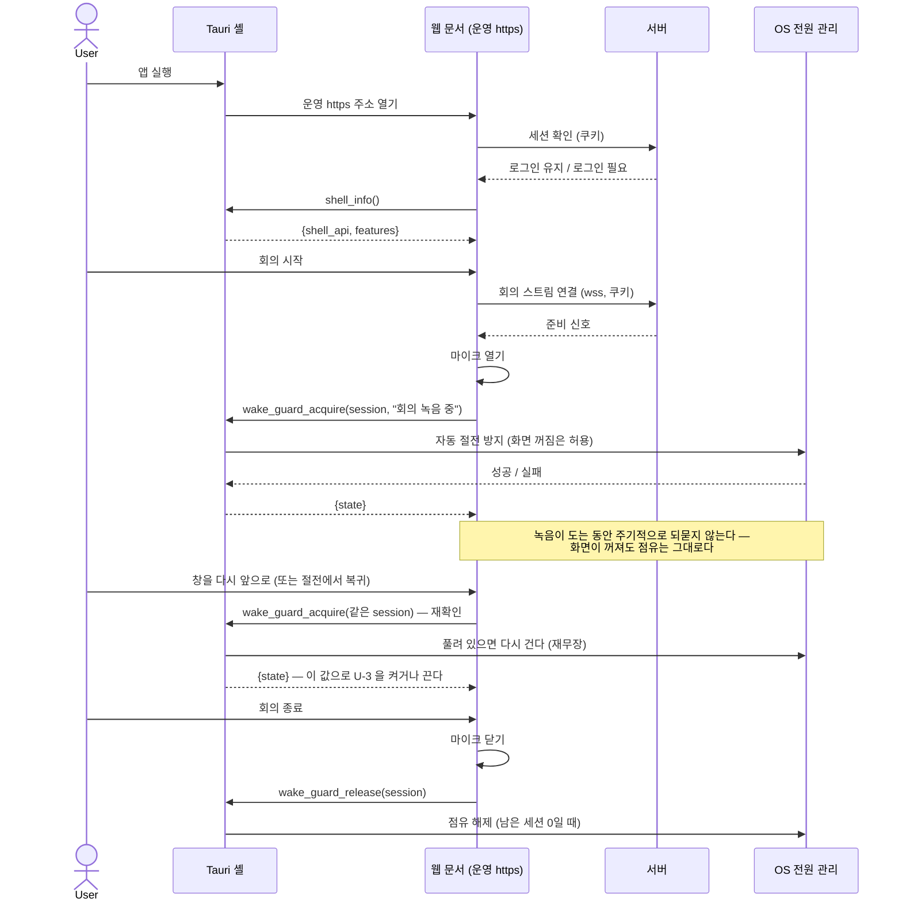
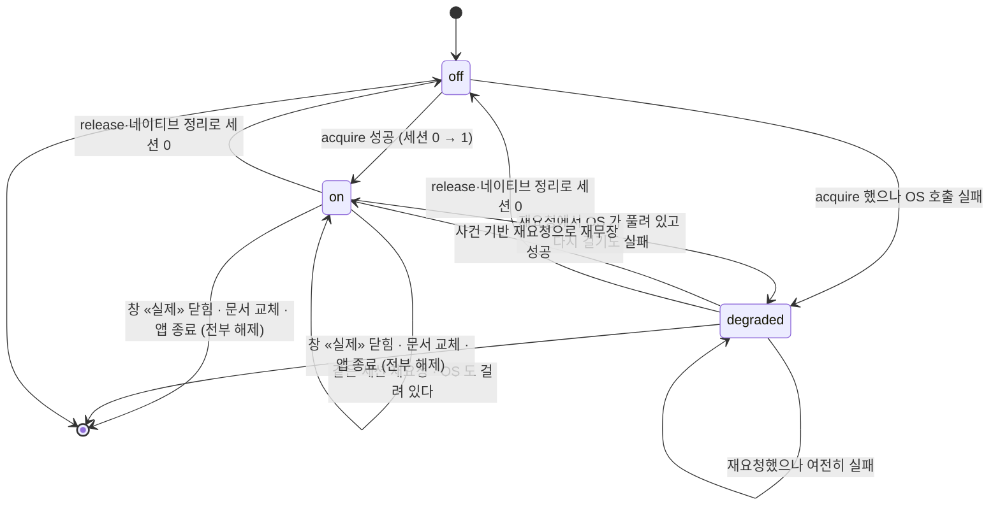

# 데스크톱 래퍼 — 웹은 그대로 두고, 녹음하는 동안만 잠들지 않는 창

이 SPEC 은 **화면을 하나도 만들지 않는다.** 이미 배포된 HTTPS 웹을 그대로 여는 데스크톱 창 하나와,
그 창이 웹에게 주는 **네이티브 기능 한 묶음**의 계약이다. 보장하는 것은 하나로 줄어든다 —
**회의를 녹음하는 동안 이 기기가 자동으로 잠들지 않는다.** 로그인도, 회의 화면도, 업로드도
웹이 하던 그대로다.

> **이 SPEC 은 「앱을 만들면 이렇게 된다」를 적은 계약이지 「이렇게 확인했다」가 아니다.**
> 인수조건 중 실물 검증이 필요한 것은 §6 에 표시했고, 검증 전에 통과로 표시하지 않는다.

> **v0.2.0 에서 바뀐 것** — 절전 방지 점유의 수명을 **네이티브가 소유**하도록 바꿨다.
> v0.1.0 은 웹이 주기적으로 갱신하지 않으면 점유를 만료시키는 TTL 구조였는데, 그 구조는
> **화면이 꺼져 있는 정상 녹음을 「끝났다」고 오판해 절전 방지를 스스로 푸는 길**을 열어 둔다.
> 이 SPEC 이 막으려는 사고와 같은 사고다. 근거와 남는 한계는 §4 「왜 TTL 을 버렸나」에 적는다.
> 커맨드가 다섯에서 **넷**으로 줄었다.

> **v0.2.1 에서 바뀐 것** — 구조는 그대로 두고 **경계 조건만** 닫았다. TTL·주기적 갱신·참조계수를
> 되살리지 않았고 커맨드도 넷 그대로다. ① 점유 해제는 **«요청»이 아니라 «완료»** 사건이다 —
> 취소된 창 닫기·막힌 네비게이션으로는 풀리지 않는다(L-06 · L-09 · L-11). ② `degraded` 에서
> 빠져나올 길을 **사건 기반 재요청(재무장)** 으로 열었다 — 푸는 방향이 아니라 **거는 방향**이다
> (`E-09` · L-14). ③ **늦게 도착한 획득**이 점유를 남기지 않아야 한다는 요구를 더했다. ④ 셸 부재와
> **커맨드 호출 실패**를 갈랐고, `release` 실패를 「녹음 계속」으로 뭉개지 않는다(`E-14`).
> ⑤ 관찰 시간·세션 키 유일성 같은 **재는 기준**을 숫자와 규칙으로 못박았다.

---

## 1. Context

### Meta

- **Decision reference**: [[decision-005-tauri-wrapper|DEC-005]] (frontmatter `links.decisions` 와 일치)
- **Baseline reference**: 없음 — DEC-005 가 사용자 대화에서 직접 방향을 확정했고, 그 앞 단계
  baseline 문서를 만들지 않았다. 도메인 사실의 출처는 DEC-005 본문과 제품 코드다.
- **Domain note**: 이 SPEC 이 새로 만드는 외부 어휘는 **절전 방지 점유(wake guard)** 와
  그것을 무엇에 매다는 이름인 **녹음 세션 키** 둘이다. 회의 상태(`scheduled` · `in_progress` ·
  `summarizing` · `done` · `failed` · `cancelled`)와 녹음 요청 상태(`waiting` · `recording` ·
  `upload_failed` · `completed` · `denied` · `cancelled` · `failed` · `unsupported`)는
  **기존 제품의 것을 그대로 쓴다** — 이 SPEC 이 만들지 않는다.
- **Open questions**: §7. DEC-005 의 OQ-T01 ~ OQ-T06 을 이어받고 OQ-T07 ~ OQ-T11 을 더한다.
- **조사 근거**: `orchestration/work/strong-hajin-projects/tauri-implementation-research.md`
  (적용 조사) · `…/research-task-management-tauri.md` (참조 조사) ·
  `…/tauri-audio-comparison-note.md` (음성 입력 비교).

### Business Requirement

**회의실에서 회의를 녹음하는 동안 기기가 자동으로 잠들어 녹음이 끊긴다.** 웹만으로는 못 막는다 —
웹 표준 Screen Wake Lock API 는 *화면*을 켜 두는 것이고 시스템 잠자기를 막지 않으며, 문서가
보이지 않게 되면 스스로 풀린다. 데스크톱 셸이 OS 전원 관리에 직접 말을 거는 것 말고는 길이 없다.

두 번째 이유는 OS 알림이다. **이번 SPEC 은 그 자리를 열어 두기만 한다** — 알림을 하나도 만들지 않는다.

### Scope

**In scope**

- 배포된 HTTPS 웹 주소 하나를 여는 데스크톱 창의 계약 — 창이 여는 곳, 못 열었을 때 보이는 것
- **셸 ↔ 웹 인터페이스**: 셸 존재·기능 확인 · 절전 방지 점유/해제 · 외부 링크 열기. **이 넷뿐이다**
- **절전 방지 점유의 수명주기** — 지금 제품에 있는 녹음 상태 위에서 언제 걸리고 언제 풀리나,
  그리고 **네이티브가 스스로 정리할 수 있는 사건이 무엇까지인가**
- 네비게이션 경계 — 앱 창이 어디로 갈 수 있고 어디로 못 가나
- 세션 쿠키 유지의 **요건**과, 세션 만료가 녹음·점유에 **실제로** 무엇을 하는가
- 에러·경계 matrix, 인수조건

**Out of scope** — 무엇이 대신 받는지까지 적는다

- **기존 계약과 기존 화면의 업무 로직 변경.** 회의·업무·프로젝트 화면이 하는 일은 그대로다
  (DEC-005 D-01). **이 SPEC 이 더하는 웹 변경은 둘뿐이다** — U-3 의 안내 한 줄과, 녹음이
  시작·종료되는 자리에서 점유를 걸고 푸는 호출 배선(문서가 다시 보이거나 절전에서 깨어났을 때의
  **재확인 1회**를 포함한다. **주기적으로 도는 것은 없다**)
- **인증 방식 전환.** 키체인·Bearer 로 가지 않는다 (DEC-005 D-02). 세션 쿠키 그대로다
- **세션 만료를 스트림·화면에 전파하는 동작 신설.** 지금 제품에 없다(§3 S-8 · §4 `E-10`).
  만들려면 서버·웹 변경이라 **이 SPEC 의 범위가 아니다** (OQ-T11)
- **알림 시스템.** 알림 이벤트·푸시·트레이 상주·배지 — 전부 후속 (DEC-005 D-04). 경계만 §2.5
- **시스템 오디오 캡처.** 지금도 안 만들고 이번에도 안 만든다 (DEC-005 Scope Out)
- **녹음 일시정지·재개 기능 신설.** 지금 제품에 없다(§4 L-15) — 이 SPEC 은 만들지 않고,
  생겼을 때의 점유 계약만 조건부로 적는다
- **녹음의 자동 재연결.** 끊긴 스트림을 스스로 다시 잇는 동작을 만들지 않는다 — 지금 제품이
  명시적으로 두지 않은 것이고(재연결·재시도 없음), 래퍼가 그것을 발명하지 않는다
- **마이크 포맷 후보 도입(fallback).** FE 의 형식 선언 · 서버의 STT 설정 · 원본 저장 확장자가
  함께 움직인다. **다만 「나중 일」이 아니라 조건부 선행 작업이다** — §6 M-2 의 실측 결과가
  「대상 OS 에서 현재 포맷이 열리지 않는다」로 나오면 **이 SPEC 의 목적보다 먼저** 처리해야 한다 (OQ-T07)
- **SPA 를 서빙하는 자리 신설 · 운영 프로파일 정비.** 이 SPEC 의 **전제**다 (OQ-T02)
- **서명·공증·자동 업데이트·CI.** 계승할 선례가 없다 (OQ-T03)
- **앱 안에서 서버 주소를 바꾸는 화면.** 만들지 않는다

### 이 SPEC 과 기존 제품 계약의 관계

방향 A(배포 웹을 창에서 열기)를 고른 결과, 창의 문서 origin 이 **운영 https origin 그 자체**다.
그래서 **아래 일곱 계약이 한 줄도 안 바뀐다.** 전수로 확인한 자리:

| 기존 계약 | 지금 | 이 SPEC 이 요구하는 변경 |
|---|---|---|
| REST 호출 — 프론트의 호출이 전부 상대경로 + `same-origin` 자격증명 | 그대로 | **없음** |
| WS 주소 — 문서의 protocol·host 로 조립 | 그대로 | **없음.** https 로 열면 자동으로 `wss:` |
| WS 인증 — 첫 프레임은 역할만, 사람은 쿠키가 말한다 | 그대로 | **없음** |
| 세션 쿠키 `scax_session` · HttpOnly · SameSite=Lax | 그대로 | **없음.** 단 §5 의 `Secure` 요건 |
| 딥링크 — 웹 origin 이 http(s) 여야 한다는 서버 검증 | 그대로 | **없음.** https 주소라 검증을 통과한다 |
| 멀티파트 업로드 | 그대로 | **없음** |
| CORS | 미들웨어 없음 | **없음.** 같은 origin 이라 필요 없다 |

> 경로·줄 수 같은 구현 좌표는 `tauri-implementation-research.md` 가 갖는다 — SPEC 본문은 계약만 적는다.

> **이 표가 방향 A 의 값이다.** 방향 B(FE 번들 동봉)였다면 일곱 중 여섯이 「바꿔야 함」이었다.
> 참조 프로젝트(task_management)가 Bearer + OS 키체인으로 간 것은 그 프로젝트가 방향 B 를 골라
> 창의 origin 과 API origin 이 달라졌기 때문이다. **그 선택을 계승하지 않는다** (DEC-005 D-02).

---

## 2. UX Contract

### Placement

앱은 **창 하나**다. 트레이 아이콘도, 메뉴 막대 상주도, 다중 창도 만들지 않는다.
창 안에 보이는 것은 **웹이 그리는 화면 그대로**이고, 이 SPEC 이 새로 그리는 것은
**연결 실패 화면**(U-2)과 **절전 방지 실패 안내 한 줄**(U-3)뿐이다.

```text
+──────────────────────────────────────────────────+
│ (OS 창 제목 표시줄)                     ─  □  ✕ │
+──────────────────────────────────────────────────+
│                                                  │
│   운영 HTTPS 웹이 그리는 화면 — 이 SPEC 이       │
│   건드리지 않는다                                │
│                                                  │
│   └ 녹음 중이거나 방금 끝난 화면:     │
│     절전 방지·정리 실패 시 상태 영역 한 줄 (U-3)            │
│                                                  │
+──────────────────────────────────────────────────+
```

### U-1. 앱 창

- **상태**
  - *정상*: 운영 웹 주소를 열고, 이후 창 안은 웹의 것이다. 창 제목은 웹 문서의 제목을 따른다
  - *로딩*: 첫 로드가 끝나기 전에는 웹의 빈 배경이 보인다. 셸이 자체 스플래시를 그리지 않는다
  - *연결 실패*: U-2 로 넘어간다
- **문구**: 셸이 만드는 문구는 U-2 · U-3 둘뿐이다. 그 밖의 모든 문구는 웹의 것이다
- **CTA**: 창 최소화·최대화·닫기(OS 기본). 셸이 추가 버튼을 만들지 않는다
- **기대 결과**: 창을 닫으면 그 창의 절전 방지 점유가 전부 풀린다(§4 L-06)

### U-2. 연결 실패 화면

- **상태**
  - *닿지 않음*: 운영 주소에 연결하지 못했다(DNS·네트워크·서버 중단·TLS 실패)
  - *재시도 중*: 사용자가 다시 시도를 눌렀다
- **문구**
  - 제목: `연결할 수 없습니다`
  - 본문: `서버에 닿지 못했습니다. 네트워크를 확인한 뒤 다시 시도해 주세요.`
  - 보조: 연결하려던 주소를 **그대로 한 줄** 보인다
  - **실패 사유를 지어내지 않는다.** 원인을 모르면 위 본문 그대로 둔다
- **CTA**: `다시 시도` 버튼 하나. 누르면 같은 주소를 다시 연다
- **기대 결과**: 성공하면 U-1 정상으로 돌아간다. 실패하면 같은 화면에 머무른다
- **왜 필요한가**: 이것이 없으면 웹뷰의 기본 오류 화면이나 빈 창이 그대로 노출된다
- ⚠ **실측 전제**: 연결 실패를 셸이 감지하는 수단은 구현이 정한다(§6 M-7). **감지 수단이 없다고
  판명되면 구현 차단 사유이고, 조용히 빼지 않는다**

### U-3. 절전 방지가 실패했을 때의 안내 한 줄

- **상태** — **마지막으로 «확인된» 점유 상태를 따른다.** 한 번 뜨고 마는 알림이 아니다
  - *`on`*: **아무것도 보이지 않는다.** 잘 동작하는 것을 자랑하지 않는다
  - *`degraded`*: 녹음이 도는 동안 **그 화면의 상태 영역**에 한 줄이 보인다
  - *셸 없음(브라우저에서 열었다)*: 아무것도 보이지 않는다. 기존 동작 그대로다 (`E-01`)
  - *커맨드 호출 자체가 실패*: `degraded` 와 같게 본다 (`E-14a`)
- **문구**: `자동 절전을 막지 못했습니다. 녹음 중에는 기기가 잠들지 않도록 설정을 확인해 주세요.`
- **CTA**: 없다. **녹음을 막지 않는다** — 안내일 뿐이다
- **정리에 실패했을 때는 다른 문구다** (`E-14b`). 녹음이 **끝난 뒤** 해제 호출이 실패한 경우이고,
  이때는 위 문구를 쓰지 않는다 — 녹음은 이미 끝났으므로 「녹음 중에는」이 거짓이 된다
  - 문구: `절전 방지를 정리하지 못했습니다. 앱을 닫으면 정리됩니다.`
  - **녹음을 다시 켜지 않는다.** 같은 화면에서 이 줄은 화면을 떠나거나 창을 닫으면 사라진다
- **언제 사라지나 — 조건 셋**
  1. **재요청 결과가 `on` 으로 돌아왔을 때** (`E-09` · L-14). 사건이 있을 때만 재요청하므로,
     화면이 다시 보이거나 절전에서 깨어난 뒤에 갱신된다
  2. **녹음이 끝났을 때** — 점유가 풀리면 이 줄도 함께 사라진다
  3. 화면을 떠났을 때 (그 화면의 상태 영역이 사라진다)
- **보이는 것은 「마지막으로 확인된 상태」다.** 이 SPEC 은 **OS 쪽에서 절전 방지가 풀리는 순간을
  실시간으로 안다고 보장하지 않는다**(§4 State/Lifecycle). 그래서 이 줄이 없다고 해서
  「지금 이 순간 확실히 걸려 있다」는 뜻이 아니다 — **마지막 확인에서 걸려 있었다**는 뜻이다.
  같은 이유로 **줄이 안 보인다고 녹음을 더 안심하고 두라는 안내를 붙이지 않는다**
- **기대 결과**: 녹음은 어느 상태에서도 그대로 진행된다
- **어디에 붙나 — 녹음하는 화면 둘 다**
  - *회의 진행 화면*: 마이크를 못 연 사실을 이미 상태 줄로만 알리고 화면을 멈추지 않는다.
    **같은 자리 · 같은 세기**로 붙인다
  - *브라우저 인터랙션 녹음 화면*: 이미 상태 문구를 내는 자리가 있다. **거기에 같은 한 줄**을 낸다
  - **점유를 거는 화면이면 반드시 이 줄을 낼 자리가 있어야 한다.** 한쪽만 붙이면 U-3 의 존재
    이유(조용한 실패를 드러낸다)가 그 경로에서 깨진다
- **왜 필요한가**: 절전 방지가 조용히 실패하면 **원래 문제가 그대로 재현되는데 아무도 모른다.**
  실패를 드러내는 것이 이 래퍼의 유일한 새 UI 다

### U-4. 외부 링크

- **상태**: 웹 화면 안의 외부 링크(다른 도메인)
- **문구**: 없다. 셸이 문구를 만들지 않는다
- **CTA**: 링크 자체가 CTA 다
- **기대 결과**: **OS 기본 브라우저에서 열린다.** 앱 창이 남의 사이트로 바뀌지 않고, 앱 안에
  두 번째 웹뷰 창이 뜨지도 않는다
- **왜 필요한가**: 앱 창이 외부 사이트로 이동하면 ① 사용자가 앱에서 나갈 길이 없고
  ② 그 외부 문서가 앱 창 안에 앉는다. 두 번째가 보안 경계다(§5)

### 2.5. 알림 — 이번에 만들지 않는 것을 이름으로 못박는다

DEC-005 D-04 는 OS 알림 **연결을 래퍼의 책임으로 둔다**고 했다. 이 SPEC 은 그 책임의 자리만 비워 둔다.

| 항목 | 이번 SPEC |
|---|---|
| 알림 권한 요청 · 알림 표시 | **만들지 않는다** |
| 알림 이벤트 정의(무엇이 알림이 되나) | **만들지 않는다** — 알림 시스템 구현 때 별도 결정 |
| 푸시(서버 → 기기) | **만들지 않는다** |
| 트레이 상주 · 백그라운드 실행 · 배지 | **만들지 않는다** |
| 알림 클릭 시 딥링크 | **만들지 않는다.** 딥링크 경로가 이미 있다는 사실만 기록한다 |

> 후속 작업이 이 SPEC 을 근거로 「이미 약속된 기능」이라고 말할 수 없게 하려고 표로 적는다.
> 창을 닫았을 때 프로세스가 끝나는지는 이 SPEC 이 정하지 않는다(OQ-T10) — **정하는 것은
> 어느 쪽이든 점유가 풀린다는 것**뿐이다(L-06).

---

## 3. User Scenario

### S-1. 회의 주최자 — 앱에서 회의를 진행하고, 자동 절전이 녹음을 끊지 않는다

1. 사용자가 앱을 연다. 창이 운영 웹 주소를 열고, 이전 세션이 살아 있으면 그대로 들어간다
2. 사용자가 회의를 시작한다 — 회의가 진행 중이 되고, 이 창이 업스트림 자리를 갖는다
3. 스트림이 열리고 준비 신호를 받은 뒤 **마이크가 열린다.** 바로 그 시점에 웹이
   **이번 녹음의 세션 키로 점유를 건다** (§4 L-01)
4. 셸이 OS 에 자동 절전 방지를 건다. **화면은 평소대로 꺼진다** — 막지 않는다
5. 사용자가 키보드·마우스를 만지지 않아도 기기가 자동으로 잠들지 않고, 녹음과 실시간 스크립트가 계속 올라간다
6. 사용자가 회의를 종료한다 → 스트림이 정상 종료로 닫히고 마이크가 닫힌다 →
   웹이 **같은 세션 키로 점유를 푼다** (§4 L-02)
7. 기기는 평소의 자동 절전으로 돌아간다

### S-2. 회의 주최자 — 창을 최소화하거나 화면이 꺼진 채로 회의가 길어진다

1. S-1 의 3 을 지나 녹음이 돌고 있다
2. 사용자가 창을 최소화하거나, 다른 앱을 전체화면으로 쓰거나, 화면이 꺼진다
3. **점유는 그대로 유지된다.** 셸은 웹에게 「살아 있냐」고 주기적으로 되묻지 않는다 —
   되묻는 구조였다면 화면이 꺼진 동안 답이 늦어 **녹음 중에 점유가 풀릴 수 있다**(§4 「왜 TTL 을 버렸나」)
4. 회의가 끝나고 6 의 해제가 일어날 때까지 기기는 자동으로 잠들지 않는다
5. 화면은 그동안 계속 꺼져 있어도 된다 — 막지 않는 것이 계약이다(AC-T02)
6. 사용자가 창을 다시 앞으로 가져오거나 화면이 다시 켜지면, 웹이 **같은 세션 키로 한 번
   다시 확인한다**(`E-09` · L-14). 그동안 OS 쪽에서 풀려 있었다면 **그때 다시 걸리고**,
   U-3 이 떠 있었다면 사라진다. **확인하지 않는 동안에도 셸은 절대 풀지 않는다**

### S-3. 회의 주최자 — 마이크가 안 열린다

1. S-1 의 1~2 를 거쳐 준비 신호까지 왔다
2. 마이크 열기가 실패한다. 사유는 **둘 중 하나이고 화면에서는 구분되지 않는다**
   - 사용자가 OS 마이크 권한을 거부했다
   - 웹뷰가 이 제품이 쓰는 녹음 포맷을 지원하지 않는다 (§6 M-2)
3. **점유를 걸지 않는다.** 녹음이 없는데 기기를 깨워 둘 이유가 없다 (§4 L-03)
4. 화면은 멈추지 않는다 — 기존대로 상태 줄에 안내만 뜨고, 스크립트와 AI 요약은 계속 받는다
5. 사용자가 권한을 열고 회의 화면을 다시 들어오면 2 부터 다시 흐른다

### S-4. 참석자 — 구독으로 붙는다

1. 주최자가 아닌 참석자가 같은 회의를 앱에서 연다
2. 스트림에 **구독** 역할로 붙는다. 마이크를 열지 않는다
3. **점유를 걸지 않는다** (§4 L-04). 이 기기는 녹음하고 있지 않다

### S-5. 업스트림 자리를 다른 창이 가져갔다

1. 사용자가 두 기기(또는 앱과 브라우저)에서 같은 회의를 연다
2. 뒤에 붙은 쪽이 자리 점유 거절로 닫히고, **역할을 구독으로 바꿔 다시 붙는다**
3. 그 창은 마이크를 닫는다 → **점유를 푼다** (§4 L-05)
4. 먼저 붙은 창만 점유를 들고 있다

### S-6. 녹음 중에 창을 닫으려 한다

1. 회의가 돌고 마이크가 열린 상태에서 사용자가 창 닫기를 누른다
2. **되묻는다** — `녹음이 진행 중입니다. 창을 닫으면 녹음이 중단됩니다. 닫을까요?`
   / `닫기` · `계속 녹음`
3. `계속 녹음`을 고르면 창이 닫히지 않는다. **녹음도 점유도 그대로 유지된다** —
   닫기를 «요청»한 것만으로는 아무것도 풀리지 않는다 (§4 L-06 · AC-T36)
4. `닫기`를 고르면 창이 **실제로 닫히고**, 그때 **마이크와 점유가 함께 풀린다** (§4 L-06)
- **확인 창은 하나다.** 웹의 되묻기와 셸의 되묻기가 **동시에 뜨지 않는다** — 사용자가 같은
  질문에 두 번 답하게 만들지 않는다. **어느 층이 그 창을 내는지는 M-6 의 실측과 구현이 정한다**
- 답하는 것은 **사용자**다. 웹도 셸도 대신 답하지 않는다
- ⚠ **실측 전제**: 웹의 되묻기가 앱 창 닫기에서 그대로 도는지 확인되지 않았다(§6 M-6).
  돌지 않으면 **셸이 창 닫기를 가로채 같은 되묻기를 내는 것**이 이 계약을 만족시키는 길이다

### S-7. 브라우저 인터랙션 녹음 — 오디오가 메모리에만 있다

1. 사용자가 녹음 요청 화면에서 녹음 시작을 누른다
2. 마이크가 열리고 서버 상태가 녹음 중이 된다 → **그 녹음의 캡처 식별자를 세션 키로 점유를 건다** (L-07)
3. 이 경로는 오디오를 **끝날 때까지 메모리에 쌓는다.** 중간에 세션이 끊기면 그 회차가 통째로 사라진다
4. 사용자가 녹음 종료·업로드를 누른다 → 오디오가 확정되고 업로드가 시작된다.
   **업로드가 끝나거나 더 이상 재시도하지 않을 때까지 점유를 유지한다** (L-08)
5. 업로드가 실패하면 오디오는 그대로 남아 재시도할 수 있다. 재시도 동안에도 점유를 유지한다
6. 완료·취소·실패로 끝나면 점유를 푼다
7. 이 화면이 떠 있는 동안 **회의 진행 화면은 같은 창에 없다** — 이 제품에서 두 녹음 화면은
   한 창에 공존하지 않는다(§4 멱등성 참조). 그래도 세션 키를 쓰는 이유는 §4 가 적는다

### S-8. 세션이 만료된다 — **지금 제품이 실제로 하는 일**

1. 세션은 **로그인 시점부터 12시간**이고, 쓰는 중이라고 늘어나지 않는다
2. **이미 열려 있는 회의 스트림은 그 시각이 지났다고 닫히지 않는다.** 인증은 연결이 붙을 때
   한 번만 확인되고, 도는 중에 다시 보지 않는다. **시각이 지나는 것만으로 지금 열린 스트림이
   닫힌다고 쓰지 않는다** — 그런 동작은 이 제품에 없다
3. 만료가 실제로 관측되는 자리는 **새로 요청하거나 새로 붙을 때**다
   - REST 호출이 인증 실패로 돌아온다 — 그 호출을 한 화면이 에러를 받는다.
     **전역으로 로그인 화면으로 되돌리는 처리는 지금 없다**
   - **새로** 스트림에 붙으려 하면 인증 실패로 닫히고, 그 경로는 로그인 화면으로 되돌린다
   - 앱을 다시 열면 첫 세션 확인이 실패해 로그인 화면이 뜬다
4. **그래서 점유는 「만료 시각」이 아니라 「녹음이 실제로 끝날 때」 풀린다** (L-02 · L-08).
   미인증이 관측되어 스트림이 닫히거나 녹음이 멈추면, 그 사건이 곧 해제 시점이다
5. **이 SPEC 은 만료를 스트림·화면에 전파하는 동작을 새로 만들지 않는다.** 만들려면
   서버 또는 웹의 변경이고, 그것은 OQ-T11 이다

### S-9. 서버에 닿지 않는다

1. *앱을 열 때 닿지 않음*: U-2 연결 실패 화면. `다시 시도`
2. *쓰는 도중 닿지 않음*: 웹의 기존 에러 처리 그대로다 — 셸이 끼어들지 않는다.
   녹음 스트림이 끊기면 그것이 L-02 의 해제 시점이다

### S-10. 앱을 껐다 켠다

1. 사용자가 앱을 완전히 종료했다가 다시 연다
2. **만료 전이면 로그인 상태가 유지된다** — 세션 쿠키가 12시간짜리 영속 쿠키이기 때문이다
3. 만료됐거나 웹뷰가 쿠키를 잃었으면 웹의 로그인 화면이 뜬다
- ⚠ **실측 전제**: 웹뷰가 앱 재시작 후에도 쿠키를 들고 있는지 확인되지 않았다(§6 M-5)

### S-11. 사용자가 직접 재웠다가 깨운다

1. 녹음 중에 사용자가 메뉴에서 잠자기를 고르거나 덮개를 닫는다
2. **기기는 잠든다.** 막지 않는 것이 계약이다 (DEC-005 D-03 · AC-T03)
3. 깨어난 뒤, 웹이 **실제 녹음 상태를 그대로 본다**
   - 스트림이 살아 있고 마이크도 살아 있으면 → **같은 세션 키로 한 번 다시 요청한다**(`E-09`).
     점유는 늘지 않고, **잠든 사이 OS 절전 방지가 풀려 있었다면 그때 다시 걸린다.**
     응답이 `on` 이면 U-3 이 사라지고, `degraded` 면 U-3 이 뜬 채 **녹음은 계속된다**
   - 잠든 사이 스트림이 끊겨 녹음이 끝났으면 → **점유를 푼다** (L-02)
4. **끊긴 녹음을 스스로 다시 잇지 않는다.** 이 제품은 자동 재연결을 두지 않았고, 래퍼가
   그것을 만들지 않는다. 다시 녹음하려면 사용자가 회의 화면에서 다시 시작한다
5. **깨어난 직후의 OS 상태를 이 SPEC 이 보장하지 않는다.** 재운 사이 OS 가 절전 방지를
   유지했는지는 플랫폼에 달렸고 실측 항목이다(M-12). 계약이 보장하는 것은
   **「깨어나면 다시 확인하고, 풀려 있으면 다시 건다」**까지다

### S-12. 외부 링크를 누른다

1. 사용자가 화면 안의 외부 사이트 링크를 누른다
2. **앱 창은 그대로 있고**, OS 기본 브라우저가 그 주소를 연다 (U-4)
3. `http(s)` 가 아닌 스킴이면 열지 않고 **아무 일도 일어나지 않는다** (`E-04`)

### S-13. 브라우저에서 같은 웹을 연다 — 셸이 없다

1. 사용자가 평소처럼 브라우저로 같은 주소를 연다
2. 웹은 셸이 없음을 감지하고 **네이티브 기능을 아예 호출하지 않는다**
3. 화면·기능이 지금과 완전히 같다. **에러도 경고도 뜨지 않는다** — 절전 방지만 없다
4. 브라우저에 쌓아 둔 로컬 초안은 **앱에 보이지 않는다.** 두 저장소가 서로 다른 자리에 있다 (OQ-T09)

---

## 4. Interface Contract

### 셸 ↔ 웹 인터페이스 — 커맨드 넷

HTTP API 가 아니다. **앱 창 안의 웹 문서가 셸에게 거는 호출**이고, 이 SPEC 이 정의하는 전부다.
**여기 없는 커맨드는 열지 않는다** — 파일 시스템·프로세스 실행·범용 셸 권한은 이 목록에 없다.

| 커맨드 | 요약 | 누가 부르나 |
|---|---|---|
| `shell_info` | 셸이 있는지, 무엇을 할 수 있는지 | 앱 창의 웹 문서 |
| `wake_guard_acquire` | 이 녹음이 도는 동안 자동 절전을 막아 달라 | 녹음을 시작한 화면 |
| `wake_guard_release` | 이 녹음이 끝났다 | 녹음이 끝난 화면 |
| `open_external` | 주소를 OS 기본 브라우저로 넘긴다 | 외부 링크를 처리하는 자리 |

**셸 존재 판정은 커맨드가 아니다.** 웹은 셸 전용 전역이 있는지로 판정하고, 없으면
**단 한 번도 호출하지 않는다**. 판정에 실패해 호출이 나가더라도 `E-01` 로 떨어져 녹음을 막지 않는다.
그 전역의 이름은 셸 구현이 정한다 — 계약은 **「있는지 없는지를 웹이 판정할 수 있어야 한다」**까지다.

### 왜 TTL 을 버렸나 — v0.1.0 의 갱신 구조와 비교

v0.1.0 은 커맨드가 다섯이었고 그중 하나가 `wake_lease_renew` 였다. 웹이 주기적으로 갱신하지
않으면 셸이 점유를 만료시키는 구조다. **버렸다.**

| | **TTL · 갱신 구조** (v0.1.0) | **네이티브 소유 구조** (v0.2.0~, 채택) |
|---|---|---|
| 점유가 풀리는 조건 | 명시 해제 **또는 갱신 실패** | **명시 해제 또는 네이티브가 관측한 «완료» 사건**뿐 |
| **신호가 안 와서** 풀리는 일이 있나 | **있다** — 갱신이 늦으면 | **없다.** 셸은 신호가 없다고 해서 풀지 않는다 |
| 웹이 멈췄을 때 | 점유가 풀린다 (의도) | **점유가 남는다** (한계 — 아래) |
| 커맨드 수 | 5 | **4** |
| 웹이 지는 의무 | 시작·종료 + **살아 있음을 계속 증명** | **시작·종료** + 사건이 생겼을 때의 **재확인**(주기적 갱신이 아니다) |

> **「녹음 중에 절대 안 풀린다」고 쓰지 않는다.** 없앤 것은 **갱신 실패로 푸는 길** 하나다.
> 취소된 창 닫기·취소된 네비게이션처럼 **아직 완료되지 않은 사건**으로 풀리지 않게 하는 것은
> 별도 계약이고(L-06 · L-09 · L-11), OS 쪽에서 풀리는 경우는 **재무장**으로 다룬다(`E-09`).

**버린 이유.** 갱신 신호를 무엇에 태우든 **늦어질 수 있다.** 비가시 문서의 타이머가 스로틀되는
것은 널리 알려져 있고, 녹음 청크 콜백(`dataavailable`)도 **보장된 주기로 온다고 명세가 약속하지
않는다** — MDN 은 이 이벤트가 타임슬라이스마다 발생한다고 설명하지만 지연 없는 전달을 보증하지
않는다 (<https://developer.mozilla.org/en-US/docs/Web/API/MediaRecorder/dataavailable_event>,
확인 2026-09-22). 특정 브라우저 엔진의 스로틀 규칙(예: Chromium 의 집중 스로틀링)을 **웹뷰
전반에 그대로 적용해 「TTL 의 몇 배면 안전하다」고 쓸 근거도 없다** — 대상 웹뷰는 WebKit·WebView2 다.

그래서 어떤 TTL 값을 골라도 **「정상 녹음 중인데 신호가 늦었다」와 「웹이 죽었다」를 가를 수 없다.**
가르지 못하는 판정으로 **OS 절전 방지를 푸는** 것은, 이 SPEC 이 막으려는 사고를 SPEC 자신이
만드는 일이다. **그래서 그 판정을 계약에서 없앴다.**

**대신 받는 한계 — 숨기지 않는다.** 웹 문서가 **살아 있는 채로 멈춘 경우**(네비게이션도 창
닫기도 일어나지 않는다)는 **네이티브가 탐지할 수 없고, 점유가 남는다.** 결과는 「사용자가 앱을
닫거나 창을 닫을 때까지 기기가 자동으로 잠들지 않는다」이다. 녹음이 끊기는 것보다 **덜 나쁜 쪽**을
고른 것이고, 이것을 「반드시 자동 정리된다」고 쓰지 않는다 (L-12).

### Request / Response — 정상 응답만. 에러는 Case Matrix 가 단일 SoT 다

**`shell_info()`**

```json
{
  "shell_api": 1,
  "app_version": "0.1.0",
  "platform": "macos",
  "features": ["wake_guard", "open_external"]
}
```

- `shell_api` — 이 인터페이스의 판 번호. **정수 하나만 늘린다**
- `features` — 이 셸이 실제로 제공하는 기능 이름. **웹은 숫자 비교가 아니라 이 목록으로 판단한다**
- `platform` — 지원 OS는 **macOS·Windows**다. 최소 버전·아키텍처는 OQ-T01 이 정한다

**웹 ↔ 앱 버전 호환 계약**

- **웹이 앞서 나가는 것을 기본으로 둔다.** 웹은 계속 배포되고 설치파일은 늦게 따라간다
- 웹이 아는 기능이 `features` 에 없으면 **그 기능만 끄고 나머지는 정상 동작한다.**
  화면을 막거나 「업데이트하세요」로 앱을 못 쓰게 만들지 않는다
- **셸이 웹보다 앞선 경우는 계약을 만들지 않는다.** 셸은 웹이 부르지 않는 기능을 그냥 갖고만 있다

**기능 조회 실패 시**: 셸이 있지만 `shell_info` 호출만 실패하면 녹음 시작 시
웹은 `wake_guard_acquire`를 시도한다. `features`를 모른다는 것이 기능 부재를 뜻하지 않는다.
획득 응답으로 U-3을 결정하고, 획득 호출도 실패하면 `E-14a`를 적용한다.
성공한 기능 조회에 `wake_guard`가 없는 경우는 기존 기능 탐지 계약을 따른다.

**`wake_guard_acquire({ session, reason })`** → `{ "state": "on" }`

- `session` — **녹음 1회를 가리키는 키.** 웹이 만들고, 그 녹음이 끝날 때까지 같은 값을 쓴다.
  브라우저 인터랙션 녹음은 이미 그런 값(캡처 식별자)을 갖고 있고, 회의 라이브는 마이크를 여는
  회차마다 새로 만든다. **셸은 이 값의 뜻을 해석하지 않는다** — 같은지 다른지만 본다
- `reason` — 사람이 읽는 짧은 사유. OS 전원 관리 도구에 그대로 보이는 이름이 된다
  (예: `"회의 녹음 중"`). **사용자 데이터·회의 제목을 넣지 않는다**
- `state` — **응답 시점의 실제 상태**다. `"on"`(OS 절전 방지가 걸려 있다) ·
  `"degraded"`(점유는 섰지만 OS 에 걸지 못했다). `degraded` 면 웹은 U-3 을 띄우고
  **녹음을 계속한다**
- **같은 `session` 으로 다시 불러도 점유가 늘지 않는다.** 다만 **그 시점에 OS 절전 방지가
  걸려 있지 않으면 다시 건다**(재무장) — 그래서 재요청은 「아무 일도 안 하는 호출」이 아니라
  **상태를 다시 확인하고 필요하면 되거는 호출**이다 (`E-09`)
- **언제 다시 부르나 — 사건이 있을 때만.** 주기적으로 부르지 않는다
  - 문서가 **다시 보이게 될 때**(창이 앞으로 오거나 화면이 다시 켜졌을 때)
  - **수동 절전에서 깨어난 뒤** (L-14)
  - 앞선 요청이 `degraded` 였고 **사용자가 같은 화면에 머무르며 녹음이 이어지는 동안**,
    위 두 사건이 다시 올 때
  - **이것은 갱신(keepalive)이 아니다.** 셸은 재요청이 오지 않는다고 해서 **절대 풀지 않는다**
- **셸이 OS 쪽 손실을 실시간으로 안다고 보장하지 않는다.** 상태는 **확인 가능한 사건과
  재요청의 결과로만** 갱신된다 — 「지금 OS 가 정말 걸려 있나」를 상시 감시하는 것이 아니다
- **늦게 도착한 획득은 걸지 않는다.** 그 녹음의 정리가 **이미 끝난 뒤에 도착한 획득**은
  점유를 남기지 않아야 한다. 두 경우를 모두 포함한다 —
  ① 마이크가 열리기 전에 화면이 정리된 경우 ② **요청이 날아가는 중에** 정리가 일어난 경우.
  **요구하는 것은 결과 하나다 — 그 녹음이 끝난 뒤 최종 잔존이 0 이다.**
  취소·직렬화·보상 해제 중 무엇으로 이룰지는 **구현이 고른다**. 이 SPEC 은 특정 수단이나
  **영구 기록(tombstone)을 강제하지 않는다**
- **문서가 바뀐 뒤에는 이전 문서의 요청이 살아나지 않는다.** 문서 교체 전에 날아간 획득이
  **새 문서의 점유를 만들지 않는다**(L-09 와 같은 경계)

**`wake_guard_release({ session })`** → `{ "state": "off" }`

- **멱등이다.** 이미 푼 세션, 모르는 세션으로 불러도 **성공으로 답한다**
- **다른 세션의 점유를 건드리지 않는다.** 지난 녹음의 늦은 해제가 **지금 도는 녹음의 점유를
  풀 수 없다** — 세션 키가 다르기 때문이다. 이것이 세는 카운터 대신 이름을 쓰는 이유다
- 반환 `state` 는 **남은 점유와 그 시점에 확인된 OS 상태를 함께 반영한다** —
  남은 세션이 없으면 `"off"`, 남아 있으면 **그때의 실제 상태**(`"on"` 또는 `"degraded"`)다

**`open_external({ url })`** → `{}`

- `http:` · `https:` 만 받는다. 그 밖의 스킴은 `E-04`
- 연 다음 무슨 일이 있었는지는 알려주지 않는다 — **셸은 브라우저에 넘길 뿐이다**

### Validation

| 필드 | 규칙 |
|---|---|
| `session` | 1 ~ 128 자. **녹음 1회마다 새로 만든 값** — 한 녹음 안에서는 불변이고, **지난 녹음의 키를 다시 쓰지 않는다**(회의 id 처럼 회차를 넘어 같은 값을 쓰면 `E-08`·`E-09` 의 보호가 사라진다). **사용자 식별자·회의 제목을 담지 않는다** |
| `reason` | 1 ~ 64 자. 줄바꿈 없음. **개인정보·회의 제목·업무 내용을 담지 않는다** |
| `url` (`open_external`) | 절대 URL. 스킴이 `http` 또는 `https` |
| **커맨드** 허용 origin (셸 설정) | **운영 origin 정확히 하나.** 와일드카드 서브도메인을 쓰지 않는다 |
| **네비게이션** 허용 origin (셸 설정) | 운영 origin + 인증이 요구하는 리디렉션 대상. **커맨드 목록과 별개다** — §5 |

### Case Matrix — 에러·경계의 단일 SoT

| 코드 | 언제 | 셸이 하는 일 | 웹이 하는 일 | 사용자에게 보이는 것 |
|---|---|---|---|---|
| `E-01` | 셸이 없다 (브라우저에서 열었다) | — | 네이티브 호출을 **아예 하지 않는다** | 아무것도. 기존 동작 그대로 (S-13) |
| `E-02` | 이 플랫폼에 절전 방지 구현이 없다 | `state:"degraded"` | 녹음을 계속한다 | U-3 한 줄 |
| `E-03` | OS 절전 방지 호출이 실패했다 | `state:"degraded"` | 녹음을 계속한다 | U-3 한 줄 |
| `E-04` | `open_external` 에 `http(s)` 아닌 주소 | 열지 않는다 | 다시 시도하지 않는다 | **아무것도.** 링크가 조용히 안 열린다 |
| `E-05` | **허용 네비게이션 목록 밖**으로 이동 시도 | **취소하고** 기본 브라우저로 넘긴다 | — | 창은 그대로, 브라우저가 뜬다 (U-4) |
| `E-06` | **커맨드 허용 origin 밖** 문서가 커맨드를 부른다 | **거부한다** | — | 아무것도. 앱은 영향받지 않는다 |
| `E-07` | 운영 주소에 닿지 못했다 | 연결 실패 화면 | — | U-2 |
| `E-08` | 모르는·이미 푼 `session` 으로 release | **성공으로 답하고 다른 세션은 건드리지 않는다** | 정상 진행 | 아무것도 |
| `E-09` | 이미 든 `session` 으로 다시 acquire | **점유를 늘리지 않는다.** 다만 OS 절전 방지가 걸려 있지 않으면 **다시 건다**. 응답 `state` 는 그때의 실제 상태 | 응답 `state` 로 U-3 을 켜거나 끈다 | `on` 이면 아무것도 / `degraded` 면 U-3 |
| `E-10` | 녹음 중에 세션 만료 시각이 지난다 | — | **아무것도 하지 않는다.** 열린 스트림은 그 때문에 닫히지 않는다 | 아무것도. 녹음이 이어진다 (S-8) |
| `E-11` | 미인증이 관측되어 **스트림이 실제로 닫힌다** | — | 마이크를 닫고 **점유를 푼다** | 웹의 기존 로그인 안내 |
| `E-12` | 녹음 중 창 닫기를 **요청한다** | **되묻기가 뜬다** — 웹의 기존 되묻기가 돌면 그것이고, 돌지 않으면 셸이 낸다 (M-6). **두 층이 동시에 묻지 않는다** | 사용자의 답에 따라 녹음을 이어가거나 정리한다 | **확인 창 하나.** 답하는 것은 사용자다 (S-6) |
| `E-13` | 마이크가 안 열린다 (거부 또는 포맷 미지원) | — | **점유를 걸지 않는다** | 웹의 기존 마이크 안내 (S-3) |
| `E-14` | **셸은 있는데 커맨드 호출이 실패한다** (거부·예외·알 수 없는 커맨드·IPC 실패) | — | **무엇을 부르다 실패했느냐로 갈린다** — 아래 | 아래 |
| `E-14a` | `shell_info` 또는 `wake_guard_acquire` 호출 실패 | — | `shell_info`만 실패했으면 녹음 시작 시 획득을 시도하고 그 결과를 따른다. 획득도 실패하면 **degraded와 같게 녹음을 계속한다** | 획득 결과가 `on`이면 경고 없음. `degraded` 또는 호출 실패면 U-3 한 줄 |
| `E-14b` | 그 실패가 `wake_guard_release` 였다 | — | **이미 끝낸 녹음을 다시 켜지 않는다.** `degraded`(=녹음 계속)로 뭉개지 않는다. 정리에 실패했고 **점유가 남아 있을 수 있다**는 사실을 드러낸다 | **U-3 이 아니라** 「절전 방지를 정리하지 못했습니다. 앱을 닫으면 정리됩니다.」 |
| `E-14c` | 그 실패가 `open_external` 이었다 | — | 다시 시도하지 않는다 | **아무것도.** 링크가 조용히 안 열린다 (`E-04` 와 같다) |

> `E-13` 이 두 원인을 한 줄로 묶은 것은 **지금 제품이 둘을 구분하지 않기 때문**이다.
> 구분이 필요하다면 그것은 웹의 변경이고 이 SPEC 의 범위가 아니다. 사실로만 적는다.
>
> `E-10` 과 `E-11` 을 가른 것이 v0.2.0 의 정정이다. v0.1.0 은 만료 시각이 지나면 스트림이
> 닫힌다고 적었는데 **그 동작은 이 제품에 없다.**
>
> **`E-01` 과 `E-14` 는 다르다.** `E-01` 은 **셸이 아예 없는** 경우(브라우저)이고 웹은
> **호출조차 하지 않는다** — 조용히 지금 그대로 돈다. `E-14` 는 **셸은 있는데 호출이 실패한**
> 경우다. 둘을 같은 줄로 다루면, 브라우저에서 경고가 뜨거나(잘못) 앱에서 실패가 묻힌다(잘못).
>
> **`E-14b` 가 따로 있는 이유.** 해제 실패를 「degraded 니까 녹음을 계속」으로 처리하면
> **이미 끝난 녹음을 되살리는 셈**이 된다. 녹음은 끝난 것이 맞고, 남는 문제는 **점유 잔존**이다.
> 그 경우에도 문서 교체(L-09)·창 닫기(L-06)·앱 종료(L-13) 정리는 그대로 작동한다.

### Flow



### State / Lifecycle

**창 단위의 절전 방지 상태.** 들고 있는 세션이 0 이면 `off`, 하나라도 있으면 `on`(또는 `degraded`)다.



**상태가 바뀌는 계기는 셋뿐이다** — ① `acquire`(첫 요청 또는 사건 기반 재요청)의 결과
② `release` 의 결과 ③ 네이티브가 관측한 **완료** 사건(L-06 · L-09 · L-13).
**셸이 OS 쪽 상태를 상시 감시해 스스로 `on ↔ degraded` 를 옮기지 않는다** — `on → degraded` 는
**재요청을 해 봤더니 풀려 있었고 다시 걸기도 실패했을 때** 관측된다. 그래서 이 SPEC 은
「OS 절전 방지가 풀린 순간 즉시 안다」고 **보장하지 않는다.**

**수명주기 규칙 — L-01 ~ L-15.** 왼쪽은 **지금 제품에 이미 있는 사건**이고, 오른쪽이 이 SPEC 이
거는 계약이다. **없는 상태를 가리키는 줄은 L-15 하나뿐이고 조건부로 표시했다.**

| ID | 사건 | 점유 | 누가 하나 |
|---|---|---|---|
| **L-01** | 회의 스트림이 업스트림으로 붙고 **마이크가 실제로 열린 순간** | **획득.** 연결 시도나 준비 신호가 아니라 **마이크가 열렸을 때**다 | 웹 |
| **L-02** | 스트림이 닫힌다 — 정상 종료 · 미인증 · 회의 없음 · 상태 불일치 · 끊김, 사유를 가리지 않는다 | **해제** | 웹 |
| **L-03** | 마이크 열기 실패 | **획득하지 않는다.** 화면은 계속 진행 중이지만 이 기기는 녹음하고 있지 않다 | 웹 |
| **L-04** | 구독 역할로 붙었다 | **획득하지 않는다** | 웹 |
| **L-05** | 업스트림 자리를 뺏겨 구독으로 바뀐다 | **해제.** 마이크가 닫히는 것과 같은 시점 | 웹 |
| **L-06** | **창이 실제로 닫힌다 · 앱이 실제로 끝난다** | **그 창의 세션 전부 해제.** 웹이 못 불러도 **셸이 스스로 푼다**. **해제 시점은 «완료»다** — 닫기·종료를 **요청**한 순간이 아니다. **되묻기에서 사용자가 계속하기를 골라 요청이 취소되면 점유는 그대로 유지된다** (S-6 · `E-12`) | **네이티브** |
| **L-07** | 브라우저 인터랙션 녹음이 시작된다 | **획득** (세션 키 = 그 녹음의 캡처 식별자) | 웹 |
| **L-08** | 같은 녹음이 끝난다 — 업로드 완료 · 취소 · 실패 · 더 이상 재시도 안 함 | **해제.** 오디오가 아직 메모리에 있고 재시도 중이면 **유지한다** | 웹 |
| **L-09** | **문서가 실제로 바뀐다** — 새 문서로 네비게이션 · 새로고침 · 재로드 | **그 창의 세션 전부 해제.** 셸이 감지할 수 있는 사건이다. **교체가 실제로 시작된 시점**이고, **시도만 하고 막힌 이동은 여기 해당하지 않는다**(아래 L-11) | **네이티브** |
| **L-10** | **앱 안에서 화면이 바뀐다** (회의 화면 ↔ 다른 화면) | **웹의 책임으로만 해제한다.** 마이크를 멈추는 그 정리 코드가 같은 자리에서 푼다. **셸은 이것을 감지하지 않는다** — 문서가 그대로라 네비게이션 사건이 아니다 | 웹 |
| **L-11** | **같은 문서 안에서 주소만 바뀐다**(히스토리 갱신 · 질의 문자열 제거 · 해시), 또는 **이동이 취소·차단된다**(허용 목록 밖이라 셸이 막았다 — `E-05`) | **해제 트리거가 아니다.** 문서가 바뀌지 않았기 때문이다. 셸이 이것을 문서 교체로 보면 **녹음 중에 점유가 풀린다** | — (아무도 하지 않는다) |
| **L-12** | 웹 문서가 **살아 있는 채로 멈춘다** (네비게이션도 창 닫기도 없다) | **점유가 남는다. 네이티브가 탐지할 수 없다** — 「반드시 자동 정리된다」고 쓰지 않는다. 창을 닫거나 앱을 끝내면 L-06 이 받는다 | — (한계) |
| **L-13** | 앱 프로세스가 끝난다 (정상 종료 · 강제 종료 · 크래시) | **OS 가 회수한다.** 절전 방지는 프로세스·스레드에 매인 자원이라 프로세스가 사라지면 함께 사라진다 | OS |
| **L-14** | 사용자가 직접 재운 뒤 **깨어난다**, 또는 **문서가 다시 보이게 된다** | **같은 세션 키로 재요청해 다시 확인한다**(`E-09`) — 잠든 사이 OS 절전 방지가 풀렸으면 **그때 다시 걸린다**. 응답 `state` 로 U-3 을 켜거나 끈다. 잠든 사이 녹음이 끝났으면 L-02·L-08 이 푼다. **끊긴 녹음을 다시 잇지 않는다** | 웹 |
| **L-15** | *(조건부)* 녹음 **일시정지** · **재개** | 일시정지에 **해제**, 재개에 **획득**. ⚠ **지금 제품에 일시정지가 없다** — 이 줄은 그 기능이 생길 때 발효한다 (OQ-T05) | 웹 |

**L-15 를 조건부로 두는 근거.** 회의 스트림의 상태에 「일시정지」가 없고 마이크 핸들에도 멈춤
조작이 없다. 참조 제품(task_management)에는 있지만 **그것은 그 제품의 기능이지 이 제품의 것이
아니다.** DEC-005 D-03 의 「일시정지 시 해제」를 있는 기능처럼 확정 계약으로 쓰면 **검증할 방법이
없는 인수조건**이 된다.

**네이티브가 정리할 수 있는 것은 셋뿐이다** — L-06(창이 실제로 닫힘·앱 종료) ·
L-09(문서가 실제로 교체) · L-13(프로세스 소멸). **L-10 · L-11 · L-12 는 네이티브의 일이 아니다.**
v0.1.0 은 「셸이 마지막 방어선이라 점유가 영구히 남는 경로를 두지 않는다」고 썼는데,
**L-12 가 그 경로다.** 과장을 걷어낸다.

**그리고 셋 모두 «요청»이 아니라 «완료»다.** 창을 닫으려다 말았거나(`E-12`) 이동이 막힌 경우
(`E-05`)는 **아무것도 해제하지 않는다.** 네이티브가 요청 시점에 푸는 구조였다면, 사용자가
「계속 녹음」을 고른 바로 그 순간 기기가 잠들 수 있게 된다 — 이 SPEC 이 막으려는 사고 그대로다.

**웹이 「종료되지 않았는데 푸는」 경로도 두지 않는다.** 웹이 푸는 자리(L-02 · L-05 · L-08 ·
L-10)는 전부 **녹음이 실제로 끝나는 자리**이고, 「사용자가 화면을 잠깐 가렸다」거나 「응답이
늦다」는 이유로 푸는 계약은 없다.

### Data Contract

| 이름 | 값 | 비고 |
|---|---|---|
| `shell_api` | 정수 (1 부터) | 인터페이스 판 번호 |
| `features[]` | `"wake_guard"` · `"open_external"` | 이 SPEC 이 정의하는 전부 |
| `platform` | `"macos"` · `"windows"` | 지원 OS 둘을 나타낸다. 최소 버전·아키텍처는 OQ-T01 참조 |
| wake 상태 | `"off"` · `"on"` · `"degraded"` | 창 단위 |
| `session` | 웹이 만드는 녹음 1회의 키 | 셸은 같은지 다른지만 본다 |

**이 SPEC 이 만드는 저장 데이터는 없다.** 점유는 앱이 도는 동안만 메모리에 산다.

---

## 5. Implementation Rules

외부에서 관찰 가능한 규칙만 둔다. 어떤 크레이트·플러그인을 쓰는지는 work 의 몫이다.

### 절전 방지의 경계 — 무엇을 막고 무엇을 막지 않나

- **막는 것**: 사용자 입력이 없어서 일어나는 **시스템 자동 잠자기**
- **막지 않는 것 ①**: **화면 꺼짐.** 화면은 평소대로 꺼진다 (DEC-005 D-03)
- **막지 않는 것 ②**: **사용자가 직접 재우는 것** — 메뉴에서 잠자기, 전원 버튼, **덮개 닫기**.
  DEC-005 가 사용자 의도라고 확인했고, 플랫폼 문서도 같은 경계를 그린다:
  - Windows: *"The **SetThreadExecutionState** function cannot be used to prevent the user from putting
    the computer to sleep. Applications should respect that the user expects a certain behavior when
    they close the lid on their laptop or press the power button."*
    (<https://learn.microsoft.com/en-us/windows/win32/api/winbase/nf-winbase-setthreadexecutionstate>,
    확인 2026-09-22)
  - macOS: idle 시스템 잠자기 방지 assertion 이 걸려 있어도 **화면은 dim·잠들 수 있고**, 시스템은
    덮개 닫기·Apple 메뉴·저전력 등 **다른 사유로는 여전히 잠든다** (`IOKit/pwr_mgt/IOPMLib.h`, 확인 2026-09-22)
- **막지 않는 것 ③**: 화면 보호기·화면 잠금
- **하지 않는 것**: 「잠든 것처럼 보이면서 도는」 모드(Windows away mode)를 쓰지 않는다

### 점유의 안전성

- **셸은 웹에게 살아 있냐고 주기적으로 되묻지 않고, 신호가 없다고 해서 절대 풀지 않는다.**
  되묻는 구조는 정상 녹음을 오판해 절전 방지를 푸는 길을 연다 (§4 「왜 TTL 을 버렸나」)
- **재요청은 «거는» 방향이지 «푸는» 방향이 아니다.** 같은 세션 키의 재요청은 점유를 늘리지 않고,
  **OS 쪽이 풀려 있으면 다시 건다**(`E-09`). 이것은 주기적 갱신이 아니라 **사건이 있을 때만**
  일어난다 — 문서가 다시 보이게 될 때, 수동 절전에서 깨어난 뒤 (L-14).
  **재요청이 오지 않는다고 해서 점유가 만료되지 않는다** — 이것이 v0.1.0 구조와 갈리는 지점이다
- **해제는 «완료» 사건에만 붙는다.** 창 닫기·앱 종료·문서 교체는 **실제로 일어났을 때** 정리하고,
  **요청 단계에서 취소되면 아무것도 풀지 않는다**(L-06 · L-09 · L-11 · `E-05` · `E-12`)
- **같은 세션 키의 중복 획득은 늘지 않는다**(`E-09`). 세는 카운터를 두지 않으므로 **누수가 쌓이지 않는다**
- **해제는 항상 성공하고 다른 세션을 건드리지 않는다**(`E-08`). 지난 녹음의 늦은 해제가
  지금 도는 녹음의 점유를 풀 수 없다 — 그래서 **세션 키는 녹음 회차마다 새 값이어야 한다**(Validation)
- **늦게 도착한 획득은 점유를 남기지 않는다.** 그 녹음이 끝난 뒤 **최종 잔존이 0** 이면 된다 —
  취소·직렬화·보상 해제 중 무엇으로 이룰지는 구현이 고르고, **영구 기록을 강제하지 않는다**
  (§4 `wake_guard_acquire`)
- **네이티브가 정리하는 것은 L-06 · L-09 · L-13 셋이다.** 그 밖은 웹의 책임이고,
  **L-12 는 아무도 정리하지 못한다** — 그 사실을 계약에 적고 과장하지 않는다
- **OS 쪽 상태를 상시 감시한다고 보장하지 않는다.** 점유 상태는 **확인 가능한 사건과 재요청의
  결과로만** 갱신된다. 그래서 U-3 이 보이지 않는 것은 「지금 확실히 걸려 있다」가 아니라
  **「마지막 확인에서 걸려 있었다」**는 뜻이다 (U-3)

### 권한과 경계

- **원격 문서에 여는 커맨드는 §4 의 넷뿐이다.** 파일 읽기·쓰기, 프로세스 실행, 범용 셸,
  임의 경로 열기는 열지 않는다. 외부 링크에 필요한 것은 **URL 열기 하나**이고, 파일 경로 열기나
  탐색기에서 보기는 함께 열지 않는다
- **허용 목록이 둘이고, 서로 다르다**
  - **커맨드 허용 origin**: **운영 origin 정확히 하나.** 와일드카드 서브도메인을 쓰지 않는다 —
    그 서브도메인 전부를 신뢰한다는 뜻이 되기 때문이다
  - **네비게이션 허용 origin**: 운영 origin 과, 인증 흐름이 실제로 거치는 주소들
  - **두 목록을 같은 것으로 다루지 않는다.** 로그인을 위해 창이 거쳐야 하는 주소가 생기더라도
    **그 주소에 네이티브 권한을 주지 않는다.** 외부 origin 은 네비게이션만 허용되고 커맨드는 못 부른다
- **인증 방식이 아직 정해지지 않았다**(OQ-T02). 지금 코드의 로그인은 이 제품이 직접 받고
  외부로 나가지 않는다. **이 SPEC 은 외부 IdP 도입을 요구하지도, 배제하지도 않는다.**
  다만 조건을 건다 — **바깥으로 나갔다 오는 인증을 고르면, 네비게이션 허용 목록이 그만큼 넓어지고
  그 목록을 인증 방식과 함께 확정해야 한다.** 그 전에는 목록을 운영 origin 하나로 둔다
- **허용 네비게이션 목록 밖으로는 창이 가지 않는다** (`E-05`)
- **셸 프레임워크 버전은 2.11.1 이상**을 쓴다. 그 미만에는 **원격 문서가 로컬 전용 커맨드를 부를 수
  있는 origin 혼동 취약점**이 있다 (GHSA-7gmj-67g7-phm9, 영향 `>=2.0, <=2.11.0` · 패치 `>=2.11.1`,
  확인 2026-09-22). **advisory 가 밝힌 영향 플랫폼은 Windows·Android 다** — 지원 대상에 Windows가 포함되므로 하한을 유지한다. 참조 제품은 이미 2.11.3 이다
- **프레임 안의 문서를 창 자신과 구분하지 못하는 플랫폼이 있다** (Tauri 공식 문서: Linux·Android).
  대상 OS 가 그쪽으로 넓어지면 이 경계를 다시 본다 (OQ-T01)

### 세션과 쿠키

- **쿠키를 앱이 읽거나 복사하지 않는다.** 세션 쿠키는 `HttpOnly` 라 문서도 못 읽고, 셸도 옮기지
  않는다. OS 키체인으로 꺼내는 설계로 돌아가지 않는다 (DEC-005 D-02)
- **웹뷰의 쿠키는 지워지지 않고 남아야 한다.** 매번 새 저장소로 뜨면 실행할 때마다 로그아웃된다
- **운영 배포의 세션 쿠키는 `Secure` 여야 한다.** HTTPS 로만 도는 배포에서 이 속성이 없으면
  쿠키가 평문 경로로 나갈 여지를 남긴다
  - ⚠ **지금 코드는 이 요건을 만족하지 못한다.** `Secure` 는 운영 프로파일일 때만 붙는데, 그
    프로파일에서는 로그인 라우트를 포함한 API 가 등록되지 않는다. **개발·시험 프로파일을 운영
    대안으로 쓰는 것을 이 SPEC 은 승인하지 않는다.** 해소는 OQ-T02 다
- **로그인 유지는 12시간이고 늘어나지 않는다.** 쓰는 중에도 연장되지 않는다. 앱이라고 해서
  더 길게 만들지 않는다 — 바꾸려면 제품 결정이 필요하다 (OQ-T04)
- **만료를 전파하는 동작을 새로 만들지 않는다.** 지금 제품에서 만료는 **새로 요청하거나 새로
  붙을 때** 관측되고, 이미 열린 스트림은 그 때문에 닫히지 않는다(S-8 · `E-10`). 래퍼가
  재인증·자동 로그아웃·강제 종료를 **몰래 새 계약으로 넣지 않는다.** 필요하면 OQ-T11 로 올린다
- **CSRF 경계는 달라지지 않는다.** 창의 문서 origin 이 운영 origin 그대로라 `SameSite=Lax` 가
  하던 일을 그대로 한다. 셸이 새 요청 경로를 만들지 않는다

### 설치와 앱 식별

- **앱 식별자는 다른 제품과 겹치지 않는다.** 참조 제품의 식별자를 그대로 쓰지 않는다 (DEC-005 D-05)
- **앱 식별자는 판을 넘어 고정한다.** 바꾸면 웹뷰의 저장 영역이 새로 잡혀 **사용자가 로그아웃된다**
- **웹 배포와 앱 배포는 별개다.** 웹을 올린다고 설치파일이 바뀌지 않고, 그 반대도 같다
- **웹뷰에 CSP 를 셸이 박지 않는다.** 문서를 내는 것이 원격 서버이므로 **CSP 도 서버 응답 헤더가
  정한다.** 참조 제품이 셸 설정에 API 주소를 박은 방식은 **이번 방향으로 넘어오지 않는다**

### 계승하는 것과 계승하지 않는 것 (DEC-005 D-05)

| 참조 제품의 것 | 이번 |
|---|---|
| Tauri 설치파일 빌드 구성 (번들 타깃·아이콘 세트·플랫폼별 설정 자리) | **계승** |
| macOS 마이크 권한 문구와 서명본용 entitlements | **계승** — 마이크를 쓰므로 필요하다 |
| Windows 웹뷰 마이크 허용 처리 | **계승** — Windows 지원 확정 (D-07) |
| 「셸에 데이터·업무 로직·화면을 두지 않는다」 규약 | **계승** |
| FE 번들 동봉 | **계승하지 않는다** — 원격 웹을 연다 |
| Bearer + OS 키체인 인증 | **계승하지 않는다** (DEC-005 D-02) |
| 셸 설정 CSP 에 API 주소 박기 | **계승하지 않는다** |
| 서명·공증·자동 업데이트·CI | **계승할 것이 없다** — 참조 제품에 0건이다 (OQ-T03) |

### 지원 환경과 반복 배포 (DEC-005 D-06 ~ D-09)

- 지원 OS는 **macOS·Windows 둘 다**다. 최소 OS 버전·CPU 아키텍처·설치파일 형식은 OQ-T01에서 확정한다
- 운영 프론트·백엔드는 **사용자 Mac Studio의 기존 Kubernetes 인프라**에 배포한다. 별도 Vercel 배포는 두지 않는다. 웹·API·WebSocket은 같은 HTTPS origin에서 제공한다. 운영 도메인·프로파일과 서버 ARM 실행 적합성은 배포 계획에서 확인한다
- 설치파일은 **제품 코드 저장소의 GitHub Releases**, 릴리즈 문서는 **프로필 저장소의 제품 `60-release`**에서 관리한다. 문서에 같은 버전·태그와 해당 Release 링크를 기록한다. 실제 배포 전에는 배포 완료 기록을 만들지 않는다

- 설치파일을 낼 때마다 **판 번호 · 그 판이 여는 운영 주소 · `shell_api` 값**이 기록으로 남아야 한다
- **서명·공증·자동 업데이트 방식은 아직 정하지 않았다** (OQ-T03). 배포 구조는
  `40-architecture/deploy`, 반복 절차는 `70-runbook`, 실제 배포 결과는 `60-release` 가 받는다
- **아직 없는 명령·주소를 실행 가능한 절차처럼 쓰지 않는다**

---

## 6. Verification

### Acceptance Criteria

**검증 방법이 「실물에서만 답이 나는 것」은 그렇게 표시했고, 실측 전에 통과로 표시하지 않는다.**

**절전 방지 — 핵심 목적**

- [ ] **AC-T01** 회의 업스트림으로 마이크가 열린 뒤, 사용자 입력 없이 OS 자동 절전 시간을 넘겨도
      기기가 잠들지 않고 녹음과 스크립트가 이어진다 *(실측 M-9)*
- [ ] **AC-T02** 같은 상태에서 **화면은 평소대로 꺼진다** — 화면이 계속 켜져 있으면 실패다 *(실측 M-9)*
- [ ] **AC-T03** 녹음 중 사용자가 직접 잠자기를 고르거나 덮개를 닫으면 **기기는 잠든다** —
      막으면 실패다 *(실측 M-9)*
- [ ] **AC-T04** 회의가 끝난 뒤 기기가 평소의 자동 절전으로 돌아간다
> **AC-T05 ~ AC-T07 의 관찰 시간 — 측정 하한.** 시험 환경에 **실제로 설정된 OS 자동 절전
> 대기시간을 `T`** 라 할 때, 관찰 시간은 **`max(3T, 30분)` 이상**이다.
> 이것은 **검증의 하한**이지 ① 제품이 보장하는 녹음 시간의 상한도 ② 웹 스로틀에 대한
> 안전 배수도 아니다. `T` 가 설정되지 않은 환경에서 잰 결과는 이 조건을 만족하지 않는다.

- [ ] **AC-T05** **창을 최소화하거나 다른 앱에 가려 문서가 보이지 않는 상태**로 위 관찰 시간을
      넘겨도, 녹음이 이어지고 **점유가 풀리지 않는다** *(실측 M-11)*
- [ ] **AC-T06** **화면이 꺼진 상태**로 같은 관찰 시간을 넘겨도 녹음이 이어지고 점유가 풀리지 않는다.
      AC-T02(화면은 꺼진다)와 AC-T01(잠들지 않는다)을 **동시에 오래** 두는 것이 이 조건이다 *(실측 M-11)*
- [ ] **AC-T07** 두 녹음 화면 각각(회의 라이브 · 브라우저 인터랙션)에서 AC-T05·AC-T06 이 성립한다.
      **브라우저 인터랙션 녹음은 회의 스트림을 갖지 않으므로 따로 본다** *(실측 M-11)*
- [ ] **AC-T08** 마이크가 안 열린 경우(권한 거부 또는 포맷 미지원) 점유를 걸지 않는다 (L-03)
- [ ] **AC-T09** 구독 역할로만 붙은 창은 점유를 걸지 않는다 (L-04)
- [ ] **AC-T10** 업스트림 자리를 뺏겨 구독으로 바뀌면 점유가 풀린다 (L-05)
- [ ] **AC-T11** 절전 방지에 실패했을 때 **녹음은 그대로 진행되고**, **녹음 중인 두 화면 어디서든**
      U-3 한 줄이 보인다. **커맨드 호출 자체가 실패한 경우도 같다** (`E-02`·`E-03`·`E-14a`)

**점유의 안전성**

- [ ] **AC-T12** 같은 세션 키로 두 번 걸어도 점유가 늘지 않고, **한 번 푸는 것으로 풀린다** (`E-09`)
- [ ] **AC-T13** **지난 녹음의 늦은 해제가 지금 도는 녹음의 점유를 풀지 않는다** (`E-08`)
- [ ] **AC-T14** 모르는·이미 푼 세션 키로 풀어도 에러가 나지 않는다 (`E-08`)
- [ ] **AC-T15** 웹이 해제를 한 번도 부르지 못한 채 창이 닫혀도 점유가 풀린다 (L-06)
- [ ] **AC-T16** 문서가 통째로 바뀌면(새로고침·재로드·다른 문서로 이동) 점유가 풀린다 (L-09)
- [ ] **AC-T17** **셸은 앱 안의 화면 전환과 같은 문서 안의 주소 변경을 문서 교체로 보지 않는다** —
      그 사건만으로 점유를 풀지 않는다. **재는 것은 셸의 훅이 발화하는가**이지 점유가 남아 있는가가
      아니다. (녹음이 실제로 끝나 **웹이** 푸는 것은 별개이고 L-10 이 그 계약이다) *(실측 M-3)*
- [ ] **AC-T18** 앱 프로세스가 끝나면 OS 절전 방지가 남지 않는다 (L-13)
- [ ] **AC-T19** 사용자가 직접 재운 뒤 깨어나 **웹이 다시 확인했을 때**, 녹음이 이어지고 있으면
      **점유가 `on` 으로 재무장되어 기기가 다시 자동으로 잠들지 않고**, 잠든 사이 녹음이 끝났으면
      점유가 풀려 평소 절전으로 돌아간다 (L-14 · `E-09`) *(실측 M-12)*

**경계와 권한**

- [ ] **AC-T20** 앱 창이 **허용 네비게이션 목록** 밖으로 이동하지 않는다. 시도하면 취소되고 기본
      브라우저가 연다 (`E-05`)
- [ ] **AC-T21** 외부 링크가 OS 기본 브라우저에서 열리고, 앱 창 안에 외부 문서가 앉지 않는다 *(실측 M-8)*
- [ ] **AC-T22** `http(s)` 가 아닌 주소는 열리지 않는다 (`E-04`)
- [ ] **AC-T23** 셸이 여는 커맨드가 §4 의 넷뿐이다 — 파일 읽기·쓰기·프로세스 실행·범용 셸
      권한이 **하나도** 열려 있지 않다. **설정 파일을 사람이 읽어 확인할 수 있어야 한다**
- [ ] **AC-T24** **커맨드를 쓸 수 있는 origin 이 운영 origin 하나뿐이다.** 네비게이션 허용 목록에
      다른 주소가 들어가더라도 **그 주소는 커맨드를 부르지 못한다** (`E-06`)
- [ ] **AC-T25** 셸 프레임워크 버전이 2.11.1 이상이다

**세션과 기존 기능 무변경**

- [ ] **AC-T26** 앱에서 로그인한 뒤 앱을 완전히 끄고 다시 열면, **만료 전이면** 로그인이 유지된다 *(실측 M-5)*
- [ ] **AC-T27** 만료된 뒤에는 **앱을 다시 열거나 스트림에 새로 붙을 때** 로그인 화면으로 돌아간다.
      **단순히 12시간이 지났다는 것만으로 화면이 로그인으로 바뀌거나 열린 스트림이 닫히지 않는다** (S-8)
- [ ] **AC-T28** 녹음 중에 만료 시각이 지나도 **녹음이 끊기지 않고 점유도 유지된다.** 점유는
      녹음이 실제로 끝날 때 풀린다 (`E-10` · `E-11`) *(실측 M-2b)*
- [ ] **AC-T29** 앱에서 회의 진행·메모·안건·자료 업로드·업무 화면이 **브라우저와 같게 동작한다**
- [ ] **AC-T30** 웹을 브라우저로 열었을 때 동작이 지금과 완전히 같다. 네이티브 호출로 인한 에러나
      경고가 하나도 뜨지 않는다 (`E-01` · S-13)

**창과 실패 상태**

- [ ] **AC-T31** 운영 주소에 닿지 못하면 U-2 연결 실패 화면이 보이고 `다시 시도` 가 동작한다.
      **빈 창이나 웹뷰 기본 오류 화면이 그대로 노출되면 실패다** *(실측 M-7)*
- [ ] **AC-T32** 녹음 중 창 닫기를 요청하면 되묻기가 뜨고, 답하기 전에 창이 즉시 닫히지 않는다 *(실측 M-6)*
- [ ] **AC-T33** 트레이 아이콘·백그라운드 상주·추가 창이 생기지 않는다

**설치**

- [ ] **AC-T34** 앱 식별자가 참조 제품을 포함해 다른 어떤 제품과도 겹치지 않는다
- [ ] **AC-T35** 같은 식별자로 재설치·판 올림을 해도 **웹뷰가 세션 쿠키를 그대로 들고 있다**
      (그래서 만료 전이면 로그인이 유지된다) *(실측 M-10)*

**취소된 사건 — 「요청」으로는 아무것도 풀리지 않는다**

- [ ] **AC-T36** 녹음 중 창 닫기를 되묻고 **`계속 녹음`을 고르면, 창도 녹음도 남고 점유도 그대로
      유지된다.** 그 상태에서 다시 자동 절전 시간을 넘겨도 기기가 잠들지 않는다 (L-06 · `E-12`) *(실측 M-13)*
- [ ] **AC-T37** 허용 목록 밖 주소로 가려다 **셸이 이동을 막았을 때, 점유가 유지된다** —
      막힌 이동은 문서 교체가 아니다 (L-11 · `E-05`) *(실측 M-13)*
- [ ] **AC-T38** 녹음 중 창 닫기 되묻기가 **하나만 뜬다** — 웹과 셸이 같은 질문을 두 번 묻지 않는다
      (`E-12`) *(실측 M-6)*

**재무장과 늦은 완료**

- [ ] **AC-T39** 점유가 `degraded` 인 채 녹음이 이어지는 중에, **문서가 다시 보이게 되거나 절전에서
      깨어나** 웹이 재요청하면 **OS 절전 방지가 다시 걸리고 U-3 이 사라진다.** 재요청해도 실패하면
      U-3 이 남고 녹음은 계속된다 (`E-09` · L-14 · U-3) *(실측 M-12)*
- [ ] **AC-T40** 회의 화면에 들어갔다 **마이크가 열리기 전에 즉시 나가도**, 그리고 **획득 요청이
      날아가는 중에 화면이 정리돼도, 그 녹음이 끝난 뒤 남는 점유가 0 이다.** 수단은 묻지 않고
      **최종 잔존만 본다** (§4 `wake_guard_acquire`) *(실측 M-14)*
- [ ] **AC-T41** 문서가 바뀐 뒤 **이전 문서가 보낸 획득이 새 문서의 점유를 만들지 않는다**
      (L-09 · §4 `wake_guard_acquire`) *(실측 M-14)*

**세션 키와 정리 실패**

- [ ] **AC-T42** 세션 키가 **녹음 회차마다 다르다** — 같은 회의를 닫았다 다시 열면 다른 값이 쓰인다.
      **설정·코드를 읽어 확인할 수 있어야 한다** (Validation)
- [ ] **AC-T43** `wake_guard_release` 호출이 실패했을 때 **이미 끝난 녹음이 다시 시작되지 않고**,
      정리에 실패했다는 사실이 사용자에게 드러난다. 그 뒤 창을 닫거나 앱을 끝내면 점유가 정리된다
      (`E-14b` · L-06) *(실측 M-14)*

### 실물에서만 답이 나는 것 — **어디서 재는지까지 적는다**

실행·빌드·설치를 하지 않았다. 아래는 통과/실패를 표시할 대상이 아니라 **재야 할 것**이다.

**개발 환경으로 잴 수 있는 것과 운영 주소가 있어야 하는 것을 가른다.** `getUserMedia` 는
secure context 를 요구하고, MDN 이 **`localhost` 를 secure context 로 명시**한다
(<https://developer.mozilla.org/en-US/docs/Web/API/MediaDevices/getUserMedia>, 확인 2026-09-22).
그래서 **통제된 개발 HTTPS 또는 `localhost` fixture** 만으로도 대부분을 뗄 수 있다.

| # | 확인할 것 | 어디서 | 막히는 인수조건 |
|---|---|---|---|
| **M-1** | 원격 https 문서에서 셸 커맨드 호출이 성립하는가 | **개발 fixture 로 구조 확인 가능**(로컬 https origin 을 허용 목록에 넣어 본다). **운영 주소로는 최종 확인만** | AC-T01 ~ AC-T19 · **AC-T21 · AC-T22**(`open_external` 도 커맨드다) · AC-T36 ~ AC-T41 · AC-T43. **AC-T20 은 네비게이션 차단이라 IPC 와 무관하고, AC-T23·AC-T24·AC-T42 는 설정·코드 검사라 무관하다** |
| **M-2** | 대상 OS·웹뷰 판에서 이 제품의 녹음 포맷이 열리는가 (`isTypeSupported` + **실제 장시간 녹음** + **서버가 그 원본을 받아들이는가**) | 개발 fixture | AC-T01 · AC-T04 · OQ-T07 |
| **M-2b** | 만료 시각을 넘겨 **열린 스트림이 계속 도는가** (닫히지 않는 것이 현 코드의 동작) | 개발 fixture (세션 수명을 짧게 둔 환경) | AC-T28 |
| **M-3** | 앱 내 화면 전환·같은 문서 주소 변경에서 **셸의 네비게이션 훅이 발화하는가** | 개발 fixture | AC-T17 |
| **M-4** | 대상 OS 에서 마이크 권한 프롬프트가 뜨는가 / 별도 처리가 필요한가 | 개발 fixture | AC-T01 |
| **M-5** | 앱 재시작 후 웹뷰가 세션 쿠키를 유지하는가 | **개발 fixture 로 구조 확인 가능.** 운영 주소로는 최종 확인만 | AC-T26 |
| **M-6** | 웹의 창 닫기 되묻기가 앱 창 닫기에서 도는가 | 개발 fixture | AC-T32 |
| **M-7** | 연결 실패를 셸이 감지할 수 있는가 | 개발 fixture | AC-T31 |
| **M-8** | 외부 링크가 웹뷰에서 무엇을 하는가 | 개발 fixture | AC-T21 |
| **M-9** | 절전 방지가 실제로 자동 절전만 막는가 (OS 별) | 개발 fixture | AC-T01 ~ AC-T03 |
| **M-10** | 재설치·판 올림 후 웹뷰 저장소가 남는가 | 개발 fixture | AC-T35 |
| **M-11** | **숨김·최소화·화면 꺼짐 상태로 장시간** 녹음이 이어지고 점유가 유지되는가 — 두 녹음 화면 각각 | 개발 fixture | AC-T05 ~ AC-T07 |
| **M-12** | 수동 잠자기·덮개 닫기로 재운 뒤 **복귀했을 때** 점유·OS 절전 방지·녹음이 각각 어떤 상태인가, **그리고 OS 쪽이 풀려 있다면 같은 세션 키 재요청으로 다시 걸리는가**(재무장 가능 여부) | 개발 fixture | AC-T19 · AC-T39 |
| **M-13** | **취소된 사건**에서 점유가 유지되는가 — 창 닫기 되묻기에서 `계속 녹음` 을 고른 뒤, 그리고 셸이 막은 외부 이동 뒤 | 개발 fixture | AC-T36 · AC-T37 |
| **M-14** | **늦은 완료와 정리 실패** — 마이크가 열리기 전 화면을 떠났을 때·획득이 날아가는 중 정리됐을 때·문서 교체 직전 요청이 있었을 때 **최종 잔존이 0 인가**. `release` 가 실패했을 때 무엇이 남는가 | 개발 fixture | AC-T40 · AC-T41 · AC-T43 |

> **운영 주소(OQ-T02)가 막는 것은 M-1·M-5 의 «최종» 확인과 인수조건의 최종 통과뿐이다.**
> 나머지 열셋은 운영 주소를 기다리지 않는다. **이 측정 자체도 후속 WP 로 계획할 수 있다** —
> 이 SPEC 이 「WP 앞에 반드시 실측」을 요구하지 않는다. 요구하는 것은 **WP 가 이 열다섯 가지(M-2b 포함)를
> 계획에 넣는 것**이다. (이번 문서 작업에서는 코드 프로토타입을 만들지 않았다.)

### DEC-005 결정 추적 — D-01 ~ D-09 전수

| ID | DEC-005 의 결정 | 이 SPEC 이 받은 자리 | 상태 |
|---|---|---|---|
| **D-01** | Tauri 는 기존 웹의 데스크톱 래퍼. 화면·업무 로직·서버는 기존 웹을 잇는다 | §1 Scope · §1 관계표 · U-1 | **받음.** 더하는 웹 변경은 U-3 한 줄과 점유 호출 배선뿐임을 Scope Out 에 명시 |
| **D-02** | 로그인은 세션 쿠키 유지. 키체인·Bearer 전환을 필수로 두지 않는다 | §5 세션과 쿠키 · §1 관계표 · AC-T26 ~ AC-T29 | **받음.** `Secure` 요건이 지금 코드와 부딪치는 것을 OQ-T02 로 올렸다 |
| **D-03** | 녹음 시작·재개 시 절전 방지, 일시정지·종료 시 해제. 화면 꺼짐 허용, 수동 잠자기·덮개 닫기는 막지 않는다 | §4 L-01 ~ L-15 · §5 절전 방지의 경계 · AC-T01 ~ AC-T11 · AC-T19 | **부분.** 시작·종료·실패·역할 상실·수동 절전 복귀는 확정. **「일시정지·재개」는 제품에 그 상태가 없어 L-15 를 조건부로 두었다** (OQ-T05) |
| **D-04** | OS 알림 연결을 래퍼 책임으로 두되 알림 시스템 자체는 후속 | §2.5 — 경계만 | **경계만 받음** |
| **D-05** | 참조 제품의 설치파일 빌드 구성을 출발점으로 계승. 이름·식별자·아이콘·주소는 분리 | §5 계승표 · 설치와 앱 식별 · AC-T34·AC-T35 | **받음.** 값은 OQ-T01·OQ-T02·OQ-T03 |
| **D-06** | 일회성 빌드로 끝내지 않고 구조·절차·판별 결과를 문서화 | §5 반복 배포 | **부분.** 남길 항목만 정하고 절차는 `70-runbook` 으로 보냈다 (OQ-T03) |
| **D-07** | macOS·Windows 모두 지원 | §5 지원 환경과 반복 배포 · OQ-T01 | **받음.** 최소 버전·아키텍처·설치파일 형식은 남음 |
| **D-08** | Mac Studio에 운영 FE·BE 배포 | §5 지원 환경과 반복 배포 · OQ-T02 | **받음.** 도메인·프로파일·배포 구현은 후속 |
| **D-09** | 코드 Releases에 설치파일, 프로필에 릴리즈 문서 | §5 지원 환경과 반복 배포 | **받음.** 실제 발행은 후속 |

### 기존 계약과의 차이 — 한 줄 목록

| 무엇 | 지금 | 이 SPEC 이후 |
|---|---|---|
| REST·WS·업로드·쿠키·딥링크·CORS | 같은 origin 전제 | **그대로** |
| 회의 녹음 수명주기 | 시작·종료·실패·역할 상실. 일시정지 없음 | **그대로.** 그 위에 점유가 붙을 뿐 |
| 녹음 오디오 포맷 | 회의 라이브는 고정 포맷, 브라우저 인터랙션은 후보 목록 | **그대로.** 이 SPEC 이 바꾸지 않는다 (단 M-2 결과에 따른 선행 의존 — OQ-T07) |
| 세션 수명 | 12시간 · 갱신 없음 · **만료가 열린 스트림을 닫지 않음** | **그대로.** 새로 만들지 않는다 |
| 세션 쿠키 `Secure` | 운영 프로파일일 때만 | **요건으로 명시.** 지금 코드가 못 만족한다는 사실을 OQ 로 올렸다 |
| 새 화면 | — | **없다.** U-2·U-3 두 개의 셸 UI 만 |
| 웹 코드 변경 | — | **U-3 한 줄 + 점유 호출 배선**(시작·종료, 그리고 문서가 다시 보이거나 절전에서 깨어났을 때의 **재확인 1회**). 주기적으로 도는 것은 없다 |
| 새 저장 데이터 | — | **없다** |

---

## 7. Open Questions

DEC-005 가 연 여섯을 이어받고, 이 SPEC 이 다섯을 더한다.
**각 항목에 「무엇이 막히나」를 적는다** — 막히는 범위 밖의 작업은 이것 때문에 멈추지 않는다.
그리고 **없어서 모르는 것 · 사용자가 정할 것 · 구현이 고를 것**을 갈라 적는다.

### 이어받은 것

| ID | 질문 | 성격 | 주인 | 근거로 이미 닫힌 부분 | 열려 있어 막는 것 |
|---|---|---|---|---|---|
| **OQ-T01** | 지원 OS·아키텍처와 설치파일 형식 | **사용자가 정할 것** | 사용자 | **OS는 macOS·Windows로 확정.** 최소 OS 버전·CPU 아키텍처·설치파일 형식은 미정 | 빌드 타깃 · 플랫폼별 마이크 처리 · 실측 환경 선택. **계약의 모양은 안 막힌다** |
| **OQ-T02** | 운영 웹·API 주소와 운영 프로파일·인증 제공 방식 | **부분 확정** (운영 환경 결정 반영) | 사용자·코디 | **Mac Studio에 FE·BE 배포 확정.** 운영 도메인·프로파일·인증 경로는 남음. 운영 프로파일에는 API 라우트가 등록되지 않고 외부 인증 경로가 코드에 없다. `Secure` 쿠키는 그 프로파일에서만 붙는다. SPA 서빙 자리가 아직 없다 | **M-1·M-5 의 «최종» 확인과 인수조건의 최종 통과.** §6 이 보였듯 **그 외 측정은 개발 fixture로 진행할 수 있다** |
| **OQ-T03** | 설치파일 게시 위치·배포 대상·서명·공증·업데이트 | **사용자가 정할 것** | 사용자·코디 | **코드 GitHub Releases·프로필 60-release로 확정.** 배포 대상·서명·공증·자동 업데이트는 미정. 참조 제품에 이 운영의 선례는 없다 | 릴리즈 검증 기준 · 배포 절차 문서 · AC-T35 의 판 올림 경로. **앱이 도는 것 자체는 안 막는다** |
| **OQ-T04** | 앱 재시작 후 로그인 유지 기간 | **사용자가 정할 것** + **실측** | 사용자 | **제품이 정한 값은 12시간 · 슬라이딩 없음** | ① 웹뷰 쿠키 지속은 실측(M-5) ② 12시간을 바꿀지는 사용자. **AC-T26·AC-T27 만** |
| **OQ-T05** | 녹음 **일시정지·재개** 기능을 만들 것인가 | **사용자가 정할 것** (없어서 모르는 것이 아니라 **없다**) | 사용자 | **없다는 것이 확정 사실**이다. L-01 ~ L-14 는 있는 사건만으로 확정했다 | **L-15 만.** 만들지 않으면 계속 조건부다 |
| **OQ-T06** | 원격 웹에서 호출할 네이티브 기능과 허용 origin, 버전 호환 범위 | **구현이 고를 것** (모양은 확정) | 코디 | **대부분 닫혔다.** 커맨드 넷 · 허용 목록 둘로 분리 · `features` 기반 기능 탐지 | **커맨드 허용 origin 의 값**(OQ-T02 에 매임)과 **네비게이션 허용 목록의 개수**(OQ-T02 의 인증 방식에 매임) |

### 이 SPEC 이 더하는 것

| ID | 질문 | 성격 | 주인 | 막는 것 |
|---|---|---|---|---|
| **OQ-T07** | **대상 OS·웹뷰 판에서 이 제품의 녹음 포맷이 실제로 열리는가** — 열리지 않으면 포맷 후보 도입이 **이 SPEC 보다 먼저**다 | **실측** (근거가 양쪽에 있다 — 아래) | 코디 | **래퍼의 목적 전체.** 녹음이 안 되면 절전 방지를 붙일 대상이 없다 |
| **OQ-T08** | 웹 문서가 살아 있는 채로 멈춘 경우(L-12)의 점유를 어디까지 감당할 것인가 | **구현이 고를 것** | 코디 | **아무것도 안 막는다.** 계약은 「탐지하지 않는다·남는다」로 이미 닫혔다. 더 할 수 있는 것이 있으면 구현이 더한다 |
| **OQ-T09** | 브라우저와 앱의 로컬 초안이 서로 보이지 않는 것을 그대로 둘 것인가 | **사용자가 정할 것** | 사용자 | **아무것도 안 막는다** |
| **OQ-T10** | 창을 닫으면 앱 프로세스가 끝나는가 | **구현이 고를 것** (OS 관례가 다르다) | 코디 | **AC-T33 의 해석만.** 어느 쪽이든 점유가 풀린다는 것은 L-06 이 이미 고정했다 |
| **OQ-T11** | 세션 만료를 열린 스트림·화면에 전파할 것인가 | **사용자가 정할 것** (지금은 **없는 동작**) | 사용자·코디 | **아무것도 안 막는다.** 이 SPEC 은 지금 동작을 그대로 계약했다. 전파를 원하면 서버·웹 변경이라 별도 결정이 필요하다 |

**OQ-T07 의 근거가 양쪽인 이유 — 2026-09-22 정정**

- WebKit 은 **Safari 18.4 에서 `MediaRecorder` 의 WebM/Opus 지원을 추가했다** —
  *"MediaRecorder in WebKit for Safari 18.4 now supports creating WebM files using the Opus audio
  codec and either VP8 or VP9 for video."* (<https://webkit.org/blog/16574/webkit-features-in-safari-18-4/>,
  확인 2026-09-22)
- **배포 대상이 최신 macOS 하나가 아니다.** 같은 글이 적는다 — *"Safari 18.4 is available on
  iOS 18.4, iPadOS 18.4, macOS Sequoia 15.4, **macOS Sonoma, macOS Ventura**, and in visionOS 2.4."*
  (확인 2026-09-22). v0.2.0 이 적용 범위를 「macOS Sequoia 15.4」로만 쓴 것은 **원문보다 좁았다**
- 그 이전 WebKit 문서는 `MediaRecorder` 가 MP4/H.264/AAC 만 낸다고 적었다. **그 글만 근거로
  「macOS 에서 안 된다」고 쓰면 낡은 판단이다**
- **그렇다고 「Safari 18.4 가 깔려 있으면 된다」로 넓히지도 않는다.** 앱이 쓰는 것은 Safari 가
  아니라 **시스템 웹뷰**이고, 이 SPEC 은 ① 그 웹뷰가 어느 WebKit 판을 쓰는지 ② 그 판이
  **정확히 어떤 MIME 문자열**을 참으로 답하는지를 **확인하지 않았다.** Safari 설치 여부로
  웹뷰의 판이나 지원 MIME 을 단정하지 않는다
- 그래서 남는 질문은 **「WebKit 이 할 수 있나」가 아니라 「대상 기기의 OS·웹뷰 판이 무엇인가」**다.
  그리고 `isTypeSupported` 가 참이라고 **장시간 녹음과 서버 수용까지 보장되지 않는다** —
  M-2 가 세 가지를 함께 재는 이유다. **대상 기기가 Sonoma·Ventura 까지 넓어진다는 사실이
  실측 계획의 범위에 그대로 들어가야 한다**(OQ-T01 과 맞물린다)
- **포맷 후보 도입은 M-2 의 결과에 달린 조건부 선행 작업이다.** 무조건 별도 spec 이 필요하다고
  단정하지 않는다 — 결과가 「열린다」면 이번 범위에서 손댈 것이 없다

### 미결이 아닌 것 — 다음 문서의 몫

- 구현 계획 · 단계 · 실행 증거 → `30-work/`. **§6 의 M-1 ~ M-14 및 M-2b 측정도 여기서 계획한다**
- 웹·앱 배포 구조와 환경 목록 → `40-architecture/deploy/`
- 반복 배포 절차 → `70-runbook/`
- 실제 배포 결과 → `60-release/`
- 알림 시스템의 업무 규칙 → **별도 decision + spec**. 이 SPEC 은 §2.5 로 경계만 그었다
