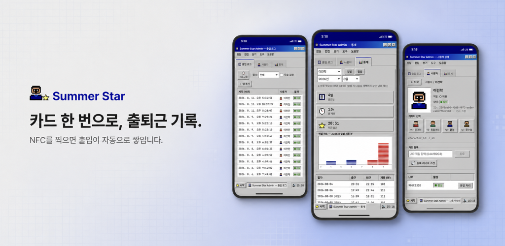
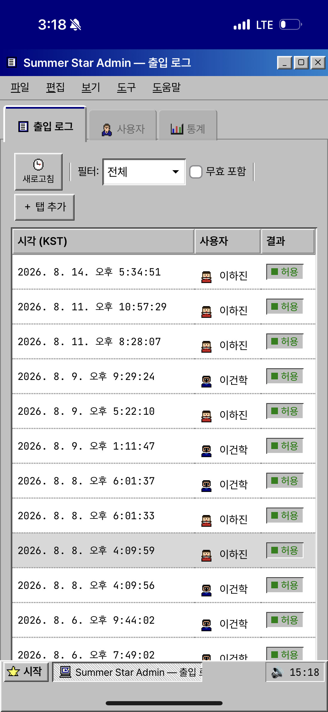
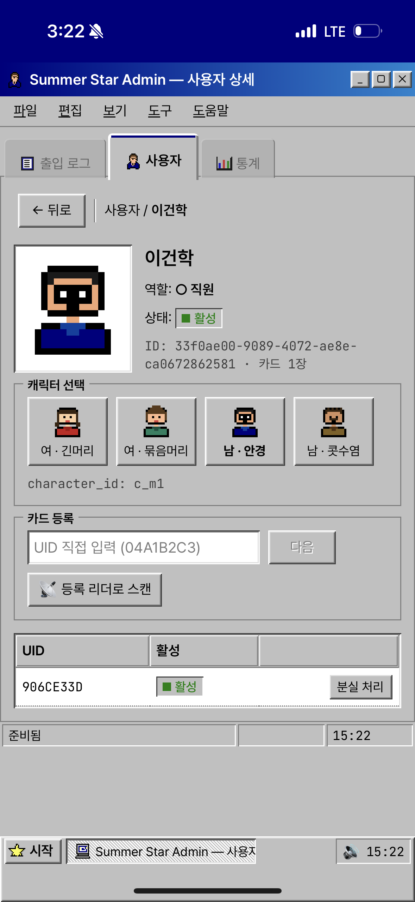
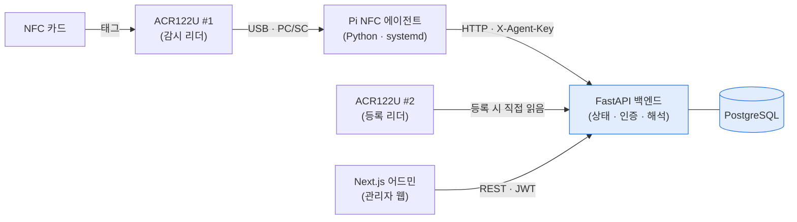

# 개요

Summer Star 는 사무실 문 앞에서 NFC 카드를 찍어 출퇴근을 자동으로 남기는 시스템이다. 직원이 카드를 대면 리더기가 UID 를 읽어 백엔드로 보내고, 관리자는 웹에서 누가 언제 오갔는지 본다. 출퇴근을 손으로 적거나 엑셀에 옮기지 않아도 된다.

개인 사무실 한 곳을 위한 도구다 — 관리자 한 명, 직원 소수, 리더기 한 대. 멀티테넌트·조직 모델·RBAC·OTA 배포 같은 기업용 패턴은 처음부터 넣지 않기로 못박았고, 그 전제가 인증부터 배포까지 모든 결정을 단순하게 만들었다. 지금은 Orange Pi Zero 3 에 리더기를 붙이는 배포를 마무리하는 중이다.

> 컴포넌트 4 · 리더기 2대(감시·등록) · 백엔드 4계층

# 주요기능

## 카드로 출퇴근을 찍는다

| 구분 | 내용 |
|---|---|
| **기능** | 카드를 대면 출입이 기록되고 출근·퇴근으로 해석된다 |
| **목적** | 출퇴근을 손으로 적고 옮기던 일을 카드 한 번으로 |
| **효과** | 사람이 기록을 만들지 않아도 출입 시계열이 쌓인다 |

- **카드 등록** — 등록 리더에 카드를 대면 UID 를 읽어 직원과 1:1 로 묶는다. 리더가 없을 땐 UID 를 직접 입력해도 등록된다
- **출입 감시** — Pi 에 꽂힌 리더기를 NFC 에이전트가 상시 감시해, 카드가 닿는 순간 백엔드로 보낸다. 리더기 LED·비프로 찍힌 것을 알려준다
- **출퇴근 해석** — 하루 경계를 KST 04:00 으로 잡아, 그날 첫 태그를 출근·다음을 퇴근으로 나눈다

## 기록을 본다

| 구분 | 내용 |
|---|---|
| **기능** | 관리자가 웹에서 출입 로그와 출퇴근 집계를 본다 |
| **목적** | 흩어질 출입 이벤트를 한 화면에 모아 확인 |
| **효과** | 누가 언제 오갔는지 물어보지 않고 화면에서 본다 |

- **로그 뷰** — 출입 이벤트를 시간순으로 훑는다
- **통계 대시보드** — 출퇴근을 집계해 보여준다. 데이터가 쌓이는 대로 다듬는 중이다
- **관리자 로그인** — 비밀번호로 들어오면 JWT 를 받아, 인증된 화면만 열린다

# 핵심 설계

**스코프를 개인 사무실로 못박았다.** 관리자 한 명·직원 소수·리더기 한 대라는 전제를 CLAUDE.md 에 박고, 멀티테넌트·조직 모델·RBAC·OTA 배포를 도입 금지로 명시했다. 덕분에 sessions 테이블·OAuth·권한 매트릭스가 전부 빠지고, 필요한 것만 남았다.

**어드민 인증은 stateless JWT 하나로.** 사용자가 사실상 한 명이라 세션을 서버에 두지 않았다. 비밀번호로 30일 JWT 를 발급해 localStorage 에 두고, 서버는 토큰만 검증한다. sessions 테이블이 없다.

**에이전트–백엔드는 정적 API 키로 묶었다.** 리더기가 한 대뿐이라 mTLS·키 로테이션 같은 복잡도를 넣지 않았다. 에이전트는 `X-Agent-Key` 헤더 하나로 백엔드에 붙는다.

**결정마다 주인 문서를 정했다(SSOT).** `docs/MAP.md` 를 진입점으로, 도메인 결정은 `docs/domain`, 컴포넌트 구현은 `docs/spec`, 인증·네트워크 같은 크로스컷팅은 `docs/architecture` 가 갖는다. 결정이 바뀌면 owner 문서만 고치고 나머지는 위키링크로 따라온다.

# 아키텍처

네 컴포넌트로 나뉜다. 카드를 읽는 곳(리더기+에이전트), 상태를 갖는 곳(백엔드+DB), 사람이 보는 곳(어드민 웹)이 분리돼 있다. 상시 감시는 Pi 에이전트가 맡고, 카드 등록만은 백엔드가 두 번째 리더기를 직접 읽는다.

- **ACR122U 리더기** — 카드 UID 를 읽는 USB 장치. 감시용 #1 은 Pi 에, 등록용 #2 는 백엔드가 직접 읽는다
- **Pi NFC 에이전트** — 리더기를 상시 폴링해 태그를 백엔드로 보낸다. systemd 로 부팅 시 자동 기동
- **FastAPI 백엔드** — 상태·인증·해석을 갖는 4계층(api·service·repo·model). 출입을 받아 출퇴근으로 해석한다
- **Next.js 어드민** — 관리자가 로그·통계를 보는 얇은 웹

# 기술스택

| 영역 | 스택 |
|---|---|
| 백엔드 | FastAPI · SQLAlchemy 2 (asyncio) · asyncpg · Alembic · PostgreSQL |
| 에이전트 | Python 3.12 · pyscard (PC/SC) · httpx · pydantic-settings · systemd |
| 프론트 | Next.js 16 · React 19 · TypeScript · Tailwind v4 · Radix UI · axios |
| 인증 | JWT (30일 · stateless) · bcrypt · 정적 API 키(`X-Agent-Key`) |
| 인프라·운영 | Docker Compose (dev·prod) · Postgres 자호스팅 · Nginx Proxy Manager · Vercel(어드민) |
