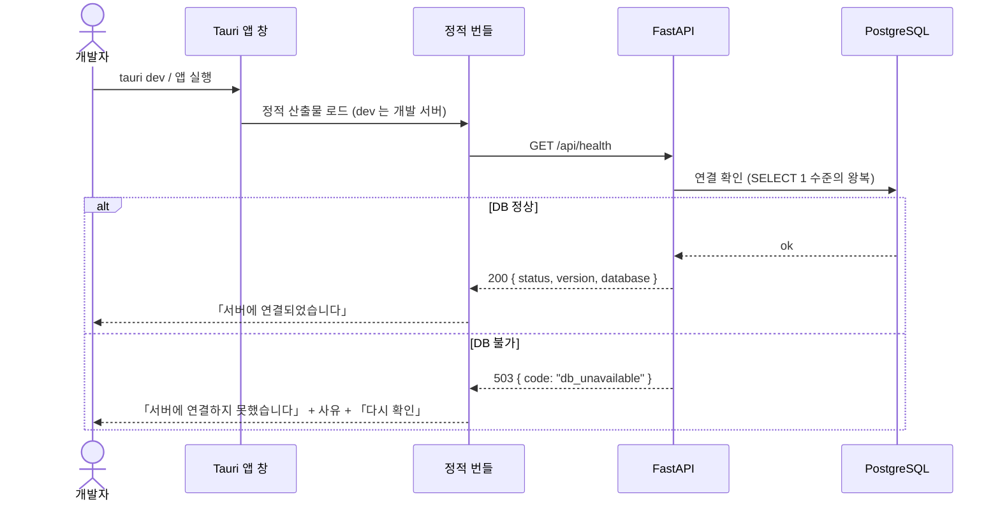

# 스캐폴딩 — 앱 셸·백엔드·DB·시드

**Tauri 앱 창 하나와 FastAPI·PostgreSQL 한 벌을 세우고, 창이 실제로 서버에 붙는 것까지**를 계약으로 못박는다. 화면 기능은 없다 — 이후 모든 spec 이 이 위에서 검증된다.

> 기능/정책 묶음 단위의 **외부 계약** 문서다. client / QA / 외부 통합이 이 문서만 읽고 따를 수 있어야 한다.
> SPEC에는 table schema 전문, ORM field, repository/service 구조, PR 계획, 구현 순서, 라우트·컴포넌트 파일 경로 같은 내부 구현을 두지 않는다.

## 1. Context

### Meta

- Decision reference: DEC-001 (인증·설정 정책) — §2 계정 생성 · §4 세션 · §v2 스코프
- Baseline reference: BASE-001 (인증·설정)
- Architecture reference: `40-architecture/system/README.md` SYS-1·2·3·9·10 · `backend/README.md` §9·§11 · `frontend/README.md` FE-C1·§1-3·§7-2 · `database/README.md` §0-2
- Domain note: 외부에 드러나는 것은 **헬스 응답**(`status`)과 **시드 계정 1건**, **기본 유형 3종**뿐이다. 그 밖의 resource 는 SPEC-001·SPEC-002 가 연다
- Open questions: §7

### Business Requirement

이 제품은 **처음부터 Tauri 앱 창에서 개발한다**(§C-4, 2026-09-05 번복). 기능 하나를 만들 때마다 실제 셸에서 E2E 로 확인하고 다음으로 넘어가는 것이 개발 방식이므로, **「앱 창이 뜨고 백엔드에 붙는다」가 첫 번째 완료 기준**이다. 마지막에 래핑하면 마이크·키체인·origin/CORS 가 한꺼번에 터지는데, 그 셋은 우리가 Bearer + 키체인을 고른 근거이기도 하다(§C-4·§C-5).

또한 **앱에 회원가입이 없다**(DEC-001 §2 — 계정은 DB 시드로만 생긴다). 시드가 서지 않으면 로그인 자체를 검증할 수 없으므로 시드 계약이 스캐폴딩에 들어온다.

### Scope

In scope:

- Tauri 앱 창 기동 — 개발(`tauri dev`)과 배포 번들이 **같은 정적 산출물**을 싣는다
- Next.js 정적 빌드(`output: 'export'`) 골격 — 전역 레이아웃·토큰 CSS 변수·QueryClient·Toaster·오버레이 Provider 가 살아 있다
- FastAPI + PostgreSQL 기동, **헬스 엔드포인트 1개**
- CORS 허용 origin(웹 개발 origin + Tauri 앱 창 origin) 계약
- **시드** — 계정 1건 + 기본 유형 3종. 재실행해도 같은 결과(멱등)
- **앱 창 안의 연결 확인 화면** — 서버에 붙었는지 사람이 눈으로 보는 화면
- **최소 폭 안내 화면**(FE §7-2 · P-02) — 1280 미만에서 뜬다

Out of scope:

- 로그인·세션·토큰 저장(SPEC-001) · 유형·프로젝트 CRUD 화면(SPEC-002)
- Redis · open-kknaks worker · 파일 저장소 · Soniox — **회의록 배치**에서 compose 에 합류한다. 스캐폴딩은 API + DB 만 세운다
- Windows 번들 확인 — 주 개발기(macOS)에서 상시 검증하고 Windows 는 별도 시점을 잡는다(§C-6). 이 spec 은 **두 OS 에서 같은 절차로 뜬다**만 요구한다
- 코드 서명·자동 업데이트·설치 패키지 배포

## 2. UX Contract

### Placement

앱 창 전체. 셸(사이드바)이 아직 없고, 창을 열면 아래 한 화면만 보인다.

```text
+──────────────────────────────────────────────────+
│                                                  │
│                 (연결 확인 화면)                 │
│                                                  │
+──────────────────────────────────────────────────+
```

### U-1. 연결 확인 화면

이 spec 이 만드는 유일한 화면이고, **SPEC-001 이 로그인 화면으로 대체한다**(그때 이 화면은 사라진다).

- **상태**
  - *확인 중*: 제품명 + 「서버 연결 확인 중…」. 버튼 없음
  - *연결됨*: 제품명 + 「서버에 연결되었습니다」 + 대상 주소(`NEXT_PUBLIC_API_BASE` 값 그대로) + 응답의 `version`
  - *실패*: 「서버에 연결하지 못했습니다」 + 대상 주소 + 실패 사유 한 줄(HTTP status 또는 네트워크 오류 문구) + **「다시 확인」 버튼**. **빈 화면이나 「정상」으로 대체하지 않는다**(DEC-003 §7 승계 — 실패를 가리지 않는다)
- **문구**: 「서버 연결 확인 중…」 / 「서버에 연결되었습니다」 / 「서버에 연결하지 못했습니다」 / 「다시 확인」
- **CTA**: 「다시 확인」 — 실패 상태에서만 노출. 누르면 헬스 요청을 **한 번** 더 보낸다(자동 재시도 없음 — FE §3-2 `retry:false`)
- **기대 결과**: 성공하면 연결됨 상태로 바뀐다. 실패하면 실패 사유가 갱신된다. 어떤 경우에도 화면이 비지 않는다

### U-2. 최소 폭 안내 화면 (P-02)

창 폭이 **1280 미만**이면 위 화면 대신 이 화면이 덮는다. 전 영역 공통 규격이며 여기서 한 번 정의하고 이후 spec 은 참조만 한다.

- **상태**: 폭 < 1280 인 동안 계속 보인다. 폭이 1280 이상으로 커지면 즉시 원래 화면으로 돌아간다(새로고침 불필요)
- **문구**: 「창이 너무 좁습니다」 / 「가로 1280px 이상에서 사용해 주세요 · 현재 <측정값>px」
- **CTA**: 없다. **닫기·무시하고 계속 버튼을 두지 않는다** — 그 아래 폭에는 레이아웃 규격이 없다(`08-responsive.md`)
- **기대 결과**: 아래 화면은 렌더되지만 조작할 수 없다(안내가 덮는다). Tauri 창 `minWidth` 로 막지 않는다(FE §7-2 확정 — 브라우저와 앱의 동작을 같게 둔다)

## 3. User Scenario

### S-1. 개발자 — 스택을 처음 세운다

1. 저장소를 받고 백엔드·프론트의 `.env` 예시를 복사해 값을 채운다(§5 환경변수 표).
2. compose 로 **PostgreSQL 과 API** 를 띄운다.
3. 마이그레이션을 적용한다. 스키마가 없는 상태에서 시작해 오류 없이 끝난다.
4. **시드를 실행한다** — 계정 1건과 기본 유형 3종이 들어간다(§5 시드 계약).
5. 시드를 **한 번 더 실행한다.** 오류 없이 끝나고 행이 늘지 않는다(멱등).
6. `tauri dev` 로 앱 창을 띄운다. 창이 뜨고 U-1 이 **연결됨**을 보인다.

### S-2. 개발자 — 서버가 꺼진 상태에서 앱을 연다

1. API 를 내린 상태에서 앱 창을 연다.
2. U-1 이 **실패** 상태로 뜨고 대상 주소와 사유가 보인다. 창이 비거나 「정상」으로 보이지 않는다.
3. API 를 올리고 「다시 확인」을 누른다 → 연결됨으로 바뀐다.

### S-3. 개발자 — 창을 좁힌다

1. 앱 창을 가로 1280 미만으로 줄인다 → U-2 안내 화면이 덮는다.
2. 다시 1280 이상으로 늘린다 → 원래 화면으로 돌아온다.

### S-4. 운영자 — DB 가 죽은 채로 API 만 살아 있다

1. PostgreSQL 을 내린 상태에서 헬스를 호출한다.
2. **503** 과 `code: "db_unavailable"` 이 온다(§4 Case Matrix). 200 으로 「정상」을 내지 않는다.

## 4. Interface Contract

### API Contract

| Method | Path | 요약 | 권한 |
|---|---|---|---|
| GET | `/api/health` | 프로세스와 DB 연결이 살아 있는지 | **공개** (인증 없음) |

`/api/health` 는 **인증 게이트에서 제외되는 두 표면 중 하나**다(다른 하나는 SPEC-001 의 로그인·갱신). 그 밖의 모든 라우터는 라우터 단위 인증 의존성이 걸린다(`backend/README.md` §9).

### Request / Response

`GET /api/health` — 요청 본문 없음.

```json
{
  "status": "ok",
  "version": "0.1.0",
  "database": "ok"
}
```

- `status`: `"ok"` 만 200 으로 나간다
- `version`: 백엔드 배포 단위 버전 문자열. 화면 하단·연결 확인 화면이 그대로 보여준다
- `database`: `"ok"` — DB 왕복 확인을 마쳤다는 뜻

### Validation

| 필드 | 규칙 |
|---|---|
| (없음) | 이 spec 의 API 는 입력을 받지 않는다 |

기동 시점 검증은 §5 「환경변수」의 필수 항목이 대신한다 — **비밀값에 기본값을 두지 않고, 없으면 기동에 실패한다**(`backend/README.md` §11).

### Case Matrix

이 spec 의 모든 실패는 여기 있다(단일 SoT).

| 에러 코드 | 백엔드 출력 | 프론트 출력 | 표시 위치 |
|---|---|---|---|
| `db_unavailable` | `503 {detail:"데이터베이스에 연결할 수 없습니다", code:"db_unavailable"}` | 「서버에 연결하지 못했습니다」 + 사유 「데이터베이스에 연결할 수 없습니다」 | U-1 연결 확인 화면 |
| (네트워크 실패 · 응답 없음) | — (서버가 응답하지 않음) | 「서버에 연결하지 못했습니다」 + 사유 「서버가 응답하지 않습니다 · <대상 주소>」 | U-1 |
| (CORS 차단) | — | 「서버에 연결하지 못했습니다」 + 사유 「요청이 서버에서 거부되었습니다(CORS)」 | U-1 |
| (그 밖 5xx) | 전파 — 스택이 로그에 남는다 | 「서버에 연결하지 못했습니다」 + `HTTP <status>` | U-1 |
| 기동 실패(필수 환경변수 누락) | **프로세스가 뜨지 않는다.** 누락 변수명을 로그에 남긴다 | — (앱은 네트워크 실패로 본다) | 콘솔 로그 |

**설계한 실패는 이 다섯뿐이다.** 그 밖은 fallback 하지 않고 전파한다(`backend/README.md` §8-1).

### Flow



### State / Lifecycle

해당 없음 — 이 spec 이 만드는 리소스에 상태 전이가 없다.

### Data Contract

**시드가 만드는 것**(외부에 드러나는 형태만. 컬럼·인덱스는 코드/migration 이 SoT).

| 대상 | 개수 | 내용 |
|---|---|---|
| 계정 | **1** | 로그인 식별자(`loginId` — 이메일 형식이 아니다) · 비밀번호(해시로만 저장) · 표시 이름 · 이메일(표시 전용) |
| 기본 유형 | **3** | 「미팅·회의」(종류 `meeting`) · 「개인 업무」(종류 `task`) · 「문서·보고」(종류 `task`). 셋 다 **기본 유형**으로 표시되고 색 토큰을 갖는다 |

- 기본 유형 3종의 색 토큰 기본값과 팔레트 전체 목록은 **SPEC-002 §4 Data Contract** 가 정본이다. 시드는 그 값을 쓴다
- **PARA 폴더 4종은 이 spec 의 시드에 넣지 않는다** — 문서함 배치에서 같은 시드 절차에 항목을 추가한다
- 계정은 **앱에서 만들 수 없다**(DEC-001 §2). 비밀번호를 잊으면 시드를 다시 돌려 재설정한다

## 5. Implementation Rules

외부에서 관찰 가능한 것만 둔다. 디렉토리·모듈 구성은 아키텍처 문서와 work 가 갖는다.

### 기동 계약

| 항목 | 계약 |
|---|---|
| 백엔드 | **docker compose 로 PostgreSQL + API 를 함께 띄운다.** 개발자가 두 개를 따로 챙기지 않는다 |
| 마이그레이션 | **Alembic.** 스키마 변경은 리비전으로만 들어간다. 시드는 리비전에 섞지 않는다(`database/README.md` §0-2) |
| 프론트 개발 | `tauri dev` 가 프론트 개발 서버를 앱 창에 물린다. **브라우저에서도 같은 번들이 그대로 돈다** — 두 환경의 동작 차이는 토큰 저장소 한 곳뿐이다(SPEC-001 §5) |
| 프론트 빌드 | `output: 'export'` 로 구운 **정적 산출물을 셸에 싣는다.** Route Handler·미들웨어·Server Action·동적 세그먼트를 만들지 않는다(FE §1-2·§1-3). 빌드 산출물에 그것들이 있으면 계약 위반이다 |
| 창 | 기본 크기는 **가로 1280 이상**으로 연다. Tauri 창 `minWidth` 를 걸지 않는다(FE §7-2) |
| 번들 스크립트 | **정적 번들에 외부 origin 스크립트·폰트·이미지를 싣지 않는다**(CDN 금지 — SYS-3 XSS 완화). 폰트는 번들에 포함한다 |

### 환경변수

전부 env 로 읽고 코드에 상수로 박지 않는다. **비밀값에 기본값을 두지 않는다 — 없으면 기동에 실패한다**(`backend/README.md` §11).

| 변수 | 쪽 | 필수 | 이 spec 에서의 의미 |
|---|---|---|---|
| `DATABASE_URL` | back | ✔ | Postgres 접속(`postgresql+psycopg://`) |
| `JWT_SECRET` | back | ✔ | 기본값 없음. SPEC-001 이 쓴다 |
| `ACCESS_TOKEN_TTL_MIN` | back | ✖(기본 60) | DEC-001 §4 |
| `REFRESH_TOKEN_TTL_DAYS` | back | ✖(기본 7) | DEC-001 §4 |
| `CORS_ORIGINS` | back | ✔ | **명시 목록.** `*` 금지 |
| `APP_TIMEZONE` | back | ✖(기본 `Asia/Seoul`) | 기한 → 시간축 변환 기준 |
| `STORAGE_ROOT` | back | ✔ | 볼륨 경로. 이 spec 은 쓰기만 준비하고 사용하지 않는다 |
| `SEED_LOGIN_ID` · `SEED_PASSWORD` · `SEED_NAME` · `SEED_EMAIL` | back(시드) | ✔ | 시드 계정 값. **소스에 계정 정보를 적지 않는다** |
| `NEXT_PUBLIC_API_BASE` | front | ✔ | 빌드 시 박힌다. **앱 안에서 바꾸는 설정 화면은 v1 에 없다**(SYS §런타임 배치) |
| `APP_VERSION` | back | ✖(기본 `0.1.0`) | 헬스 응답 `version` 으로 나가는 배포 단위 버전 |
| `TEST_DATABASE_URL` | back(테스트) | 테스트 실행 시 ✔ | `make test` 전용 별도 DB |
| `ALEMBIC_DATABASE_URL` | back(마이그레이션) | ✖ | 마이그레이션이 쓰는 접속 문자열 |

`REDIS_URL`·`AI_*`·`SONIOX_API_KEY` 는 이 spec 의 필수 항목이 아니다 — 회의록 배치에서 필수가 된다.

### CORS

- 허용 origin 은 **웹 개발 origin(`http://localhost:3000`) + Tauri 앱 창 origin** 두 갈래를 명시 목록으로 둔다. `*` 를 쓰지 않는다
- 쿠키를 쓰지 않으므로 `allow_credentials` 는 **거짓**이다(DEC-001 §4 · SYS-3)
- **앱 창 origin 이 목록에 없으면 U-1 이 CORS 실패로 뜬다** — 이것이 스캐폴딩에서 origin 문제를 미리 잡는 자리다(§C-4 가 처음부터 Tauri 를 고른 이유)

### 시드 계약

| 규칙 | 내용 |
|---|---|
| 멱등 | **여러 번 실행해도 결과가 같다.** 이미 있으면 만들지 않고, **잠긴 값**(기본 유형의 이름·종류·`is_default`, 계정의 로그인 식별자·비밀번호)**만** 시드 값으로 맞추고, **사용자가 편집할 수 있는 값**(`work_type.color_token`)은 **새로 만들 때만** 넣는다 — 기본 유형은 「색만 편집 가능」(DEC-001 §4 · 정정 A-4)이라 덮어쓰면 정책 위반이다 (2026-09-05, 검수 D-4) |
| 계정 | 로그인 식별자 기준으로 1건. 비밀번호는 **해시로만** 저장한다. 평문을 로그·DB 어디에도 남기지 않는다 |
| 비밀번호 규칙 | 시드 비밀번호도 **8자 이상 + 문자·숫자·특수문자**를 만족해야 한다. 위반이면 시드가 실패한다(DEC-001 §3) |
| 기본 유형 | 3종. **삭제 불가·이름과 종류 고정**으로 표시된다(DEC-001 §4 · A-4) |
- **기본 3종의 식별 키**: `(account_id, kind, name, is_default=true)`. `work_type` 에 이름 유니크 제약이 없으므로 이름만으로 찾으면 **사용자가 만든 동명 유형을 시드가 기본으로 뒤집는다**. WORK-003 이 유형 생성을 열기 전에 이 규칙이 서 있어야 한다 (2026-09-05, 검수 D-9)
| 실행 시점 | 마이그레이션 **이후**. 자동 기동에 묶지 않는다 — 개발자가 명시적으로 실행한다 |

### 헬스 규칙

- **DB 왕복을 실제로 한다.** 프로세스가 살아 있다는 것만으로 200 을 내지 않는다
- 인증을 요구하지 않는다. 계정·토큰·환경변수 값 같은 **내부 정보를 응답에 싣지 않는다**(버전 문자열만 예외)
- 프론트는 이 호출에 **재시도를 걸지 않는다**(FE §3-2). 재시도는 사용자가 「다시 확인」을 누를 때만 일어난다
- **사유를 가르기 위한 진단 요청 1회는 재시도가 아니다.** 브라우저 `fetch` 는 CORS 차단과 네트워크 실패를 구분해 주지 않으므로, 실패했을 때만 **구분용 요청 1건**이 더 나간다. **헬스 요청 자체는 한 번만** 나간다(실패해도 같은 요청을 되풀이하지 않는다) — §4 Case Matrix 가 두 사유를 다른 문구로 요구하는 것과 이 규칙이 함께 성립한다 (2026-09-05, 검수 D-1)

## 6. Verification

### Acceptance Criteria

사용자가 앱 창에서 직접 확인하는 문장으로 적는다.

- [ ] compose 로 DB 와 API 를 띄우고, 마이그레이션을 적용하면 **오류 없이 끝난다**
- [ ] 시드를 실행하면 계정 1건과 기본 유형 3종이 들어가고, **한 번 더 실행해도 오류 없이 행이 늘지 않는다**
- [ ] `tauri dev` 로 **앱 창이 뜬다**(macOS 주 개발기)
- [ ] 앱 창에 「**서버에 연결되었습니다**」와 대상 주소·버전이 보인다
- [ ] API 를 내리면 같은 창이 「**서버에 연결하지 못했습니다**」 + 사유 + 「다시 확인」을 보인다. 화면이 비지 않는다
- [ ] API 는 살리고 **DB 만 내리면** 헬스가 `503 db_unavailable` 이고, 창이 그 사유를 보여준다
- [ ] 앱 창을 가로 1280 미만으로 줄이면 「**창이 너무 좁습니다**」 안내가 덮고, 다시 넓히면 원래 화면으로 돌아온다
- [ ] 허용 origin 목록에서 앱 창 origin 을 빼면 창이 **CORS 실패**로 뜬다(원복하면 다시 연결된다)
- [ ] 프론트 정적 빌드 산출물에 **동적 세그먼트 경로·Route Handler·미들웨어가 없다**
- [ ] 필수 환경변수 하나를 지우면 **API 가 기동하지 않고** 누락 변수명이 로그에 남는다

## 7. Open Questions

| ID | Question | Owner | Next |
|---|---|---|---|
| S000-OQ-1 | **코드가 자리 잡을 위치.** `40-architecture/backend/README.md` §4 는 트리 루트를 `app/back/` 으로 적는데, 지금 이 워크트리의 `app/back/`·`app/front/` 는 **다른 제품(kknaks_profile)** 이다. 새 저장소인지 이 저장소의 다른 자리인지는 spec 이 정할 것이 아니다 — work 발주 전에 코디네이터가 못박아야 한다 | 코디 | work 발주 전 |
| S000-OQ-2 | **아키텍처 문서 두 곳이 §C-4 번복 이전 상태다.** `system/README.md` Overview·SYS-9 와 `frontend/README.md` FE-C2 가 아직 「웹 우선, Tauri 는 마지막 포장」으로 쓰여 있다. 이 spec 은 **번복 이후(처음부터 Tauri)** 를 따랐다(§C-4 · 발주 브리프 §3). 문서 정정은 코디 소관이라 여기서 고치지 않았다 | 코디 | 정정 |
| S000-OQ-3 | **Windows 확인 시점.** §C-6 은 「주 개발기(macOS) 상시 검증 + Windows 는 별도 시점」이다. 이 spec 의 완료 기준은 macOS 기준이며, Windows 에서 같은 절차로 창이 뜨는지 확인하는 시점은 잡히지 않았다 | 사용자 | 배치 ② 이후 |
| S000-OQ-4 | **U-1 연결 확인 화면의 수명.** SPEC-001 이 로그인 화면으로 대체하면 이 화면은 사라진다. 개발 중 진단용으로 남길지(예: 설정 화면 하단 캡션으로 흡수) 여부는 정하지 않았다 | 코디 | SPEC-001 구현 시 |
