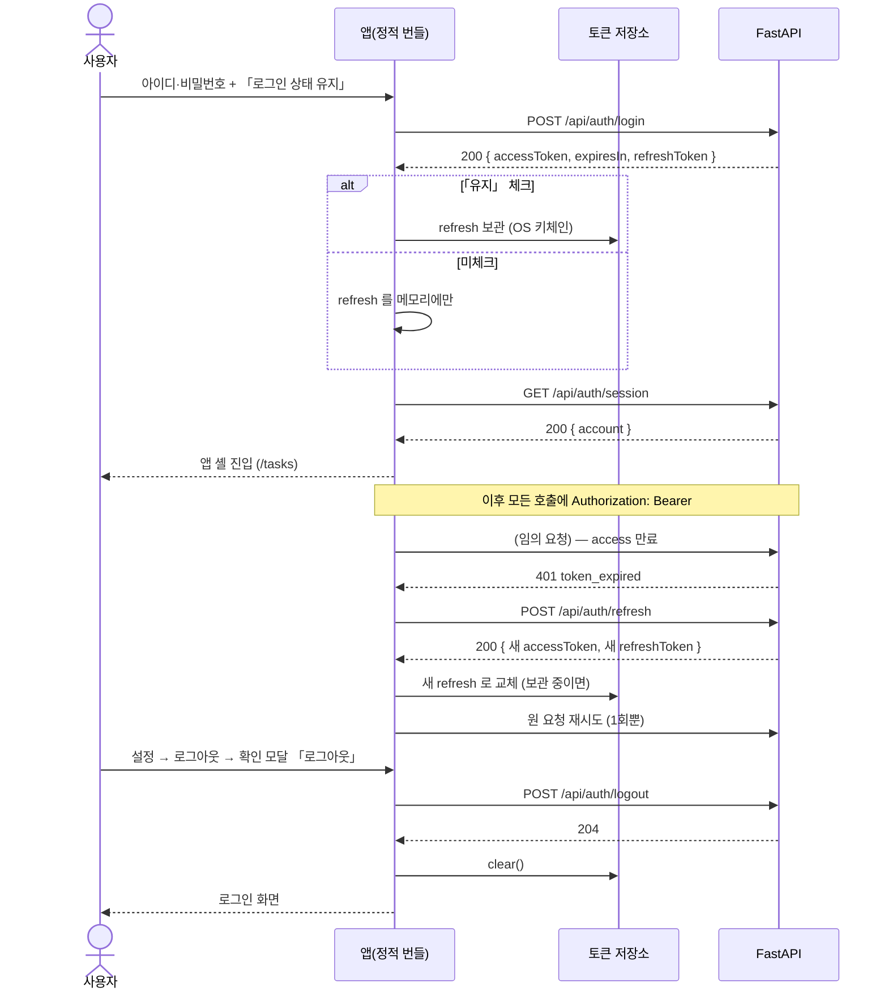
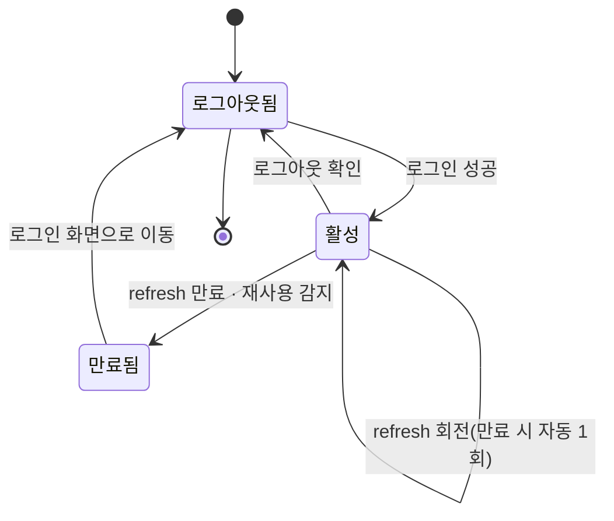

# 로그인 · 세션 · 로그아웃

아이디·비밀번호로 들어가고, **「로그인 상태 유지」를 켜면 앱을 껐다 켜도 로그인이 남고**, 끄면 앱을 끄는 순간 로그아웃된다. 로그아웃은 확인 모달을 지난다. 모든 화면은 유효한 세션 없이 열리지 않는다.

> 기능/정책 묶음 단위의 **외부 계약** 문서다. client / QA / 외부 통합이 이 문서만 읽고 따를 수 있어야 한다.
> SPEC에는 table schema 전문, ORM field, repository/service 구조, PR 계획, 구현 순서, 라우트·컴포넌트 파일 경로 같은 내부 구현을 두지 않는다.

## 1. Context

### Meta

- Decision reference: DEC-001 §2(접근·계정 생성) · §3(아이디·비밀번호 필드) · §4(세션·전송·유지·실패 정책) · §v2 스코프
- Baseline reference: BASE-001 기능 1·2·3·4·12·13
- Architecture reference: `system/README.md` §흐름 ① · SYS-3 · `backend/README.md` §8-2·§9 · `frontend/README.md` §4·§6·§9
- Design reference: `00-design/11-auth-profile.md` §로그인·§설정 공통 골격 · `로그인 · 계정 · 프로필.dc.html [로그인]`(P-04) · `09-design-tokens.md` · `디자인 시스템.dc.html [07][10]` · 정정 §A-9
- Domain note: 외부에 드러나는 것은 **토큰 3종(access·refresh·만료초)** 과 **세션 계정 요약**뿐이다. 세션 저장 구조는 코드/migration 이 SoT
- Open questions: §7

### Business Requirement

- 단일 사용자 개인 도구지만 **계정 경계가 있어야 데이터 격리와 세션이 성립한다**(BASE-001 §Why It Matters). v2 의 소셜 회원가입·회원가입·계정 삭제는 이 골격 위에 얹는다.
- **회원가입·비밀번호 찾기가 없다**(DEC-001 §1). 계정은 시드로만 생기므로 로그인 화면에서 두 링크를 제거한다(§A-9).
- **데스크톱 앱이라 「앱 종료」가 세션의 기준**이다(DEC-001 §4). 쿠키 수명에 맡기면 웹뷰 구현마다 갈리므로 Bearer + 저장소 선택으로 우리가 직접 정한다.

### Scope

In scope:

- 로그인 화면(P-04) — **디자인 정정 반영**: 「이메일」→「아이디」, 비밀번호 찾기·회원가입 링크 제거
- Bearer 인증 — access 1시간 / refresh 7일, **refresh 회전**
- 「로그인 상태 유지」 — 체크 시 OS 키체인 보관, 미체크 시 메모리
- 세션 가드(로그인 없이는 어떤 화면도 열리지 않는다) · 401 갱신 1회 재시도
- 로그아웃 + **확인 모달(600)**
- **v2 스코프 표시 규격**(전 영역 공통) — 소셜 로그인 버튼·계정 삭제·「다른 기기 모두 로그아웃」이 첫 적용 대상
- 설정 화면의 **좌측 메뉴 카드 골격**(로그아웃·계정 삭제·버전 캡션이 여기 산다)
- **인증 영역 반응형**(Q-22 의 로그인 화면 몫)

Out of scope:

- 개인 설정 패널(프로필·경력·목소리)·비밀번호 변경 드로어·연동 관리 — 다음 배치
- 유형·프로젝트 관리 화면 — SPEC-002
- 로그인 실패 횟수·잠김 — **정책 없음(논외)**(DEC-001 §4). 화면을 만들지 않는다
- 회원가입·비밀번호 찾기 — v1 에 없다. 라우트도 만들지 않는다
- 계정 삭제·소셜 로그인·「다른 기기 모두 로그아웃」의 **실동작** — v2(UI 만 그린다)

## 2. UX Contract

### Placement

로그인은 셸 밖 전체 페이지, 그 밖은 앱 셸 안이다.

```text
[로그인 — 셸 없음]
+──────────────────────+───────────────────────────+
│ 브랜드 패널(그라디언트) │  폼 400 (세로 중앙)       │
+──────────────────────+───────────────────────────+

[로그인 후 — 앱 셸]
+──────────────────────────────────────────────────+
│ (사이드바 200) │ breadcrumb / 타이틀              │
│  · 설정 진입   │ 본문                             │
+────────────────┴─────────────────────────────────+
   설정 좌측 메뉴 카드 하단: 로그아웃 · 계정 삭제 · 버전 캡션
```

### U-1. 로그인 화면 (P-04 — 정정 반영)

- **상태**
  - *기본*: 좌 브랜드 패널(로고·헤드라인·특징 3줄, `linear-gradient(160deg,#DCE6FB,#E7EDFC 34%,#F5F8FE 68%,#FFFFFF)` + radial 2겹) / 우 폼 400. 그라디언트는 **홈 상단과 이 패널에만** 쓴다([10] RULES)
  - *제출 중*: 「로그인」 버튼이 비활성 + 진행 표시. 두 입력은 읽기 전용. **중복 제출이 나가지 않는다**
  - *실패(자격 증명)*: 두 입력의 테두리가 실패색(`#E2685B`)이 되고, 비밀번호 입력 **아래 12px 인라인 문구**로 사유를 적는다. 입력값은 지우지 않는다(아이디는 남고 비밀번호도 남는다 — 지우면 오타 확인이 불가능하다)
  - *실패(서버·네트워크)*: 인라인이 아니라 **토스트**로 알린다(자격 증명 문제가 아니므로 폼 옆에 붙이지 않는다)
  - *빈 입력*: 「로그인」 버튼 **비활성**. 아이디·비밀번호 둘 다 한 글자 이상이면 활성
- **문구**
  - 라벨 「**아이디**」(플레이스홀더 「아이디를 입력하세요」) · 「비밀번호」(눈 아이콘으로 표시 전환)
  - 체크박스 「**로그인 상태 유지**」 + 캡션 「앱을 껐다 켜도 로그인이 유지됩니다」
  - 버튼 「로그인」(50px, `#7181F8`) → 구분선 「또는」 → 「회사 계정으로 계속하기」(1px `#D9D9D9`, **U-2 v2 게이트**)
  - 실패 인라인 「**아이디 또는 비밀번호가 올바르지 않습니다**」
  - 하단 「약관 · 개인정보 · 고객지원」 12/`#9EA2AE`, 폼 컬럼 기준 중앙 — **셋 다 U-2 v2 게이트**(v1 에 문서 페이지가 없다)
  - **「비밀번호 찾기」·「회원가입」은 없다**(§A-9 · DEC-001 §1)
- **CTA**
  - 「로그인」 — 활성 조건은 위 *빈 입력* 참조. `Enter` 로도 제출되지만 **버튼은 항상 화면에 있다**([10] 단축키는 보조)
  - 「회사 계정으로 계속하기」 — 화면에 그대로 그리되 v2 게이트
- **기대 결과**: 성공하면 앱 셸로 들어가 **`/tasks`**(로그인 후 기본 진입 — FE §1)로 이동한다. 실패는 화면에 남고 아무 데도 이동하지 않는다. **실패 횟수를 세지 않고 잠그지 않는다**(DEC-001 §4)

### U-2. 아직 열리지 않은 기능의 표시 — 전 영역 공통 규격 (여기서 확정)

**v2 기능의 UI 는 v1 에서 그대로 그린다. 숨기지 않는다**(DEC-001 §v2). 사이드바의 홈·채팅도 같은 처리다(§C-9 — 「메뉴를 지우지 않고 남긴다」). **표시 방식은 하나이고 문구만 두 가지**다. 규격을 여기서 한 번 정하고 이후 spec 은 참조만 한다.

- **상태**: 원래 컴포넌트를 **그대로** 그린 위에 한 겹을 얹는다 — 불투명도 `0.45`, 커서 `not-allowed`, 포커스는 받지만 조작은 막힌다. **레이아웃이 바뀌지 않는다**(자리·크기·문구 그대로)
- **문구**: 조작하면 토스트가 뜬다. 규격은 `09-design-tokens` 토스트(400×56, `#1E1E1E`, 하단 중앙 60px 위, 4초). **실행취소 버튼을 붙이지 않는다**(되돌릴 동작이 없다)

  | 대상 | 문구 | 근거 |
  |---|---|---|
  | **v2 로 미룬 기능** — 소셜 로그인·계정 삭제·「다른 기기 모두 로그아웃」·목소리·연동 관리·문서함 AI 색인/버전/검색/휴지통·메시지함 | 「**v2에서 제공됩니다**」 | DEC-001 §v2 |
  | **정책서가 아직 없는 영역** — 사이드바의 **홈 · 채팅** | 「**곧 제공됩니다**」 | §C-9 (2026-09-05) |

- **CTA**: 없다. 클릭·`Enter`·`Space` 어느 쪽으로도 **네트워크 요청이 나가지 않고 화면 이동도 없다**(홈·채팅은 라우트 자체가 없다)
- **기대 결과**: 화면 상태가 바뀌지 않고 토스트만 뜬다. 같은 요소를 연달아 눌러도 토스트는 **하나**만 유지된다(중복 스택 금지)
- **이 spec 의 적용 대상**: 「회사 계정으로 계속하기」 · 하단 3링크 · 설정 메뉴의 「계정 삭제」 · 사이드바 「홈」·「채팅」 · (다음 배치) 「다른 기기 모두 로그아웃」 토글·목소리 패널·연동 관리

### U-3. 앱 셸 진입 · 세션 가드

- **상태**
  - *세션 있음*: 사이드바 + 본문. 사이드바 상단에 계정 이름과 소속 캡션이 뜬다(소속은 「현재」 경력에서 파생 — **없으면 캡션을 비운다**)
  - *세션 확인 중*: 본문 자리에 로딩 표시. **로그인 화면을 깜빡 보여주고 되돌리지 않는다**
  - *세션 없음*: 로그인 화면으로 보낸다
- **문구**: 사이드바 메뉴 8종은 디자인 그대로 남긴다(홈·채팅·캘린더·내 업무·회의록·자료함·메시지·설정 — §C-9 「메뉴를 지우지 않는다」). **홈·채팅은 U-2 규격의 「곧 제공됩니다」** 이고 **라우트를 만들지 않는다**(FE §10 · FE-OQ-1 해소)
- **CTA**: 「설정」 — 설정 화면으로 이동. 이 배치에서 **실제 내용이 있는 목적지는 설정뿐**이다
- **기대 결과**: `/tasks` 는 셸만 있는 **빈 본문**으로 뜬다(내용은 배치 ② 가 채운다). 사이드바에서 설정으로 갈 수 있다

### U-4. 설정 좌측 메뉴 카드 (골격)

- **상태**: 카드(1px `#D9D9D9` · radius 16 · 흰 배경) 안에 항목 38px 3개 — 「개인 설정」 · 「업무 설정」 · 「연동 관리」. 현재 항목은 배경 `#F1F2F5` + 700
  - 구분선 아래: 「**로그아웃**」 · 「**계정 삭제**」(hover 시 `#E2685B`)
  - 최하단 구분선 아래: 버전 캡션 「Managment v<버전>」 + 「마지막 저장 · <상대시각>」 12/`#9EA2AE`
- **문구**: 「마지막 저장」은 **이 화면에서 마지막으로 성공한 자동 저장 시각**이다. 아직 없으면 캡션 줄을 **비운다**(「-」·「없음」을 쓰지 않는다)
- **CTA**
  - 「로그아웃」 → **U-5 확인 모달**
  - 「계정 삭제」 → **U-2 v2 게이트**(모달이 열리지 않고 토스트만 뜬다). 규격은 U-6 에 확정해 둔다
  - 「개인 설정」·「연동 관리」 → 다음 배치의 화면. 이 배치에서는 **항목이 보이고 이동은 되지만 본문이 비어 있다**
- **기대 결과**: 메뉴 카드가 어느 설정 화면에서나 같은 자리에 있고, 현재 항목만 강조된다

### U-5. 로그아웃 확인 모달 (600) — 미설계 확정

「되돌리기 어려운 결정 하나」이므로 **모달 600**이다(`09-design-tokens` §오버레이 3종 · [10] 「편집은 드로어, 결정은 모달」). 드로어 위에 겹치지 않는다.

- **상태**: 스크림 `rgba(30,30,30,0.36)` + 카드 600. 헤더 제목 → 요약 → (경고 슬롯) → 푸터 취소/확인. 공용 `ConfirmModal`(S-05) 규격을 그대로 쓴다
  - *확인 중*: 「로그아웃」 버튼 비활성 + 진행 표시. `Esc`·스크림 클릭으로 닫히지 않는다(요청이 나간 뒤)
- **문구**
  - 제목 「**로그아웃할까요?**」
  - 요약 「이 앱에서 로그아웃합니다. 다시 들어오려면 아이디와 비밀번호를 입력해야 합니다.」
  - 경고 슬롯: 「**로그인 상태 유지」로 저장된 로그인 정보도 함께 지워집니다.**」 — **「유지」로 로그인한 경우에만** 노출한다(아니면 슬롯을 비운다)
- **CTA**: 「취소」(텍스트 버튼) · 「**로그아웃**」(`#7181F8`). 파괴적 색(`#E2685B`)을 쓰지 않는다 — 데이터가 사라지지 않는다
- **기대 결과**: 확인하면 세션이 끊기고 로그인 화면으로 간다. 취소하면 아무 일도 일어나지 않는다. **모달을 지나지 않고 로그아웃되는 경로는 없다**

### U-6. 계정 삭제 확인 모달 (600) — 규격 확정 · v1 에서는 열리지 않는다

DEC-001 §v2 가 계정 삭제를 **버튼만**으로 못박았고, v2 게이트는 children 을 바꾸지 않고 이벤트만 가로챈다(FE §9). 따라서 **v1 에서 이 모달은 열리지 않고 토스트만 뜬다.** 규격을 지금 확정해 두는 이유는 v2 에서 게이트만 걷어내면 그대로 서게 하기 위해서다.

- **상태**: 모달 600, 나머지 프레임은 U-5 와 같다
- **문구**
  - 제목 「**계정을 삭제할까요?**」
  - 요약 「계정과 업무·회의록·문서·일정이 모두 지워집니다.」
  - 경고 슬롯 「**되돌릴 수 없습니다.**」
  - 확인 입력: 아이디를 그대로 입력해야 확인 버튼이 활성된다(플레이스홀더 = 그 계정의 아이디)
- **CTA**: 「취소」 · 「**계정 삭제**」(`#E2685B`, 아이디 일치 전까지 비활성)
- **기대 결과(v1)**: 「계정 삭제」 항목을 누르면 **이 모달이 뜨지 않고** 「v2에서 제공됩니다」 토스트만 뜬다

### U-7. 세션 만료 · 재로그인

- **상태**
  - *access 만료*: 사용자가 모른다 — 요청이 자동으로 한 번 갱신되고 재시도된다(§5)
  - *refresh 만료·무효*: 진행 중이던 화면이 사라지고 **로그인 화면**으로 간다. 토스트 「**로그인이 만료되었습니다. 다시 로그인해 주세요.**」
  - *「유지」 미체크로 로그인한 뒤 앱 재시작*: 로그인 화면에서 시작한다(만료 토스트를 띄우지 않는다 — 정상 동작이다)
- **문구**: 위 토스트 하나. **잠김·재시도 횟수 문구를 두지 않는다**(DEC-001 §4)
- **CTA**: 없다(자동 이동)
- **기대 결과**: 편집 중이던 값은 **복원하지 않는다.** 되살리는 척하는 화면을 만들지 않는다(설계한 실패만 처리 — DEC-003 §7 승계)

### U-8. 반응형 — 인증 영역 (Q-22 의 로그인 몫)

`08-responsive.md` 와 FE §7-1 의 세 구간을 이 화면에 적용한다. **1920 좌표는 참고값이고 `position:absolute` 로 박지 않는다**(§C Q-34 · §A-13).

| 구간 | 로그인 화면 |
|---|---|
| **< 1280** | 최소 폭 안내 화면(SPEC-000 U-2)이 덮는다 |
| **1280 ~ 1439** | **브랜드 패널을 숨긴다.** 폼 400 을 화면 가운데 두고, 상단에 로고 + 헤드라인 1줄만 남긴다. 하단 3링크는 폼 폭 기준 중앙 |
| **≥ 1440** | 좌 브랜드 패널 **유동(폭 40%, 최소 480)** + 우 폼 **400 고정**. 폼은 남은 폭의 가운데. 1920 에서 디자인의 760 / left 1140 비율에 수렴한다 |

- 폼 폭 400 은 **고정**이다 — 입력 길이가 폭에 따라 흔들리면 비밀번호·아이디 입력 경험이 갈린다
- 그라디언트 패널은 **폭이 줄어도 잘라내기만 하고 비율을 왜곡하지 않는다**

## 3. User Scenario

### S-1. 사용자 — 「유지」 켜고 로그인한다

1. 앱 창을 연다 → 세션이 없으므로 로그인 화면이다.
2. 아이디·비밀번호를 넣고 「로그인 상태 유지」를 **켠다.**
3. 「로그인」을 누른다 → 앱 셸로 들어가 `/tasks` 가 뜬다.
4. 앱을 **완전히 종료**하고 다시 연다 → **로그인 화면을 거치지 않고** 앱 셸로 들어간다.

### S-2. 사용자 — 「유지」 끄고 로그인한다

1. 「로그인 상태 유지」를 **끈 채로** 로그인한다 → 앱 셸로 들어간다.
2. 앱을 종료하고 다시 연다 → **로그인 화면**이다. 만료 토스트는 뜨지 않는다.

### S-3. 사용자 — 비밀번호를 틀린다

1. 잘못된 비밀번호로 「로그인」을 누른다.
2. 두 입력 테두리가 실패색이 되고 「아이디 또는 비밀번호가 올바르지 않습니다」가 비밀번호 아래에 뜬다. **입력값은 남아 있다.**
3. 같은 실수를 다섯 번 반복해도 **잠기지 않고** 문구도 달라지지 않는다(DEC-001 §4).

### S-4. 사용자 — 로그아웃한다

1. 사이드바에서 「설정」으로 간다.
2. 좌측 메뉴 카드 하단 「로그아웃」을 누른다 → **확인 모달(600)** 이 뜬다.
3. 「유지」로 로그인했다면 경고 슬롯에 「저장된 로그인 정보도 함께 지워집니다」가 보인다.
4. 「로그아웃」을 누른다 → 로그인 화면으로 간다.
5. 앱을 껐다 켜도 **로그인 화면**이다(저장된 로그인 정보가 지워졌다).

### S-5. 사용자 — 오래 켜 둔 앱에서 계속 쓴다

1. 앱을 켜 둔 채 1시간이 지난다(access 만료).
2. 아무 화면에서 조작한다 → **화면에 아무 변화 없이** 동작한다(갱신 1회 + 재시도가 안에서 일어난다).
3. 7일이 지나 refresh 도 만료되면, 다음 조작에서 로그인 화면으로 가고 「로그인이 만료되었습니다」 토스트가 뜬다.

### S-6. 사용자 — v2 버튼을 누른다

1. 로그인 화면에서 「회사 계정으로 계속하기」를 누른다 → 「v2에서 제공됩니다」 토스트. 화면이 바뀌지 않고 **네트워크 요청도 나가지 않는다.**
2. 설정 메뉴에서 「계정 삭제」를 누른다 → 같은 토스트. **확인 모달이 열리지 않는다.**

### S-7. 사용자 — 세션 없이 화면 주소로 바로 들어간다

1. 로그아웃 상태에서 설정 화면 주소로 직접 진입한다.
2. 화면이 잠깐이라도 보이지 않고 **로그인 화면**으로 간다.
3. 로그인에 성공하면 **`/tasks`** 로 간다(직전에 요청했던 주소로 되돌리지 않는다 — v1 에 딥링크를 쓸 상대가 없다, FE §1-1).

## 4. Interface Contract

### API Contract

| Method | Path | 요약 | 권한 |
|---|---|---|---|
| POST | `/api/auth/login` | 아이디·비밀번호로 토큰을 받는다 | **공개** |
| POST | `/api/auth/refresh` | refresh 로 토큰을 회전한다 | **공개**(refresh 소지) |
| POST | `/api/auth/logout` | 이 세션의 refresh 를 무효화한다 | 세션 |
| GET | `/api/auth/session` | 현재 세션의 계정 요약 | 세션 |

- **인증 게이트에서 빠지는 표면은 `login`·`refresh` 둘뿐이다**(+ SPEC-000 의 헬스). 그 밖은 전부 `Authorization: Bearer <access>` 를 요구한다(`backend/README.md` §9)
- **쿠키를 쓰지 않는다.** 토큰 3종은 전부 본문으로 오간다(DEC-001 §4 · SYS-3)
- **v2 엔드포인트를 만들지 않는다** — 소셜 로그인·계정 삭제·「다른 기기 모두 로그아웃」의 서버 표면은 없다(DEC-001 §v2)

### Request / Response

에러는 여기 두지 않는다 — **Case Matrix 가 단일 SoT** 다.

**`POST /api/auth/login`**

```json
// 요청
{ "loginId": "haram", "password": "••••••••" }

// 200
{ "accessToken": "<jwt>", "expiresIn": 3600, "refreshToken": "<opaque>" }
```

- **「로그인 상태 유지」는 요청에 싣지 않는다.** 서버는 저장 여부를 모른다 — refresh 수명은 언제나 7일이고, **어디에 두느냐만 클라이언트가 정한다**(DEC-001 §4 · FE §4-1). 서버가 알 필요 없는 것을 계약에 넣지 않는다
- `expiresIn` 은 access 의 남은 수명(초)이다

**`POST /api/auth/refresh`**

```json
// 요청
{ "refreshToken": "<opaque>" }

// 200
{ "accessToken": "<jwt>", "expiresIn": 3600, "refreshToken": "<새 opaque>" }
```

- **refresh 는 회전한다** — 응답의 새 토큰으로 교체하고 **직전 토큰은 즉시 무효**다(A-7)

**`POST /api/auth/logout`**

```json
// 요청
{ "refreshToken": "<opaque>" }

// 204 (본문 없음)
```

**`GET /api/auth/session`**

```json
// 200
{
  "account": {
    "id": 1,
    "loginId": "haram",
    "name": "유하람",
    "email": "haram@example.com",
    "avatarUrl": null,
    "department": "제품기획팀"
  }
}
```

- `department` 는 **「현재」 경력(종료일 없음)에서 파생**한다. 없으면 `null` 이고 사이드바 캡션을 비운다(DEC-001 §3 · A-3)
- `email` 은 **표시 전용**이다 — 인증·발송에 쓰지 않는다(A-1)

### Validation

**어떤 입력이 valid 한가**만 적는다. FE(즉시 피드백)와 BE(최종 신뢰 경계)가 같은 규칙을 각자 구현한다.

| 필드 | 규칙 |
|---|---|
| `loginId` | 필수. 앞뒤 공백 제거 후 1자 이상. **이메일 형식을 요구하지 않는다**(A-1 · §A-9) |
| `password` | 필수. 1자 이상. **로그인 시점에는 강도 규칙을 검사하지 않는다** — 강도(8자 이상 + 문자·숫자·특수문자)는 계정을 만들거나 바꿀 때의 규칙이다(DEC-001 §3) |
| `refreshToken` | 필수. 형식 검사를 하지 않는다 — 유효성은 대조로 판정한다 |

### Case Matrix

이 spec 의 모든 에러·경계가 여기 있다(단일 SoT). API 절에는 정상 응답만 둔다.

| 에러 코드 | 백엔드 출력 | 프론트 출력 | 표시 위치 |
|---|---|---|---|
| `invalid_credentials` | `401 {detail:"아이디 또는 비밀번호가 올바르지 않습니다", code:"invalid_credentials"}` | 같은 문구를 **인라인**으로. 입력값 유지, **횟수를 세거나 잠그지 않는다** | 로그인 폼 — 비밀번호 입력 아래 |
| `validation_error` | `422 {detail:"입력값을 확인해 주세요", code:"validation_error"}` | 해당 입력 테두리 실패색 + 인라인 문구 | 로그인 폼 (정상 경로에서는 버튼이 비활성이라 도달하지 않는다) |
| `token_expired` | `401 {detail:"세션이 만료되었습니다", code:"token_expired"}` | **화면이 모른다** — 클라이언트가 refresh 1회 후 원 요청을 재시도한다 | (없음) |
| `invalid_refresh_token` | `401 {detail:"다시 로그인해 주세요", code:"invalid_refresh_token"}` | 토큰 전부 폐기 → 로그인 화면 + 토스트 「로그인이 만료되었습니다. 다시 로그인해 주세요.」 | 로그인 화면 |
| (refresh 재사용 감지) | 위와 같은 `invalid_refresh_token`. **그 계정의 유효 세션을 전부 끊는다**(A-7) | 위와 같다 | 위와 같다 |
| `v2_not_available` | `501 {detail:"v2에서 제공됩니다", code:"v2_not_available"}` | 「v2에서 제공됩니다」 토스트 | 화면 하단 중앙 |
| (그 밖 5xx · 네트워크) | 전파 — 스택이 로그에 남는다 | **가리지 않는다.** 실패 토스트 + 그 자리에 재시도 버튼. 조용한 기본값·빈 화면으로 대체하지 않는다 | 로그인 폼 위 토스트 |

- `v2_not_available` 은 **정상 경로가 아니다.** v2 게이트가 새서 실제 호출이 나갔을 때의 안전망이다(`backend/README.md` §8-2)
- **잠김·실패 횟수·캡차에 해당하는 케이스는 없다**(DEC-001 §4 「정책 없음(논외)」)

### Flow



### State / Lifecycle

외부에 드러나는 세션 상태.



- **앱 종료**는 상태 전이가 아니다 — 「유지」 미체크면 메모리의 refresh 가 사라져 다음 실행이 `로그아웃됨`에서 시작할 뿐이다
- refresh 재사용이 감지되면 그 계정의 **모든 유효 세션**이 `만료됨` 으로 간다(A-7)

### Data Contract

| 리소스 | 필드 | 비고 |
|---|---|---|
| 토큰 묶음 | `accessToken` · `expiresIn`(초) · `refreshToken` | access 는 JWT 1시간, refresh 는 7일 · **1회용 회전** |
| 세션 계정 요약 | `id`(number) · `loginId` · `name` · `email` · `avatarUrl` · `department` | `id` 는 **number**(FE §3-6). `department` 는 파생값이라 `null` 가능 |

- **access 토큰을 저장소에 넣지 않는다.** 메모리에만 둔다(DEC-001 §4)
- 서버는 refresh 를 **해시로만** 갖는다. 원문을 남기지 않는다

## 5. Implementation Rules

외부에서 관찰 가능한 규칙만 둔다.

### 토큰 취급

| 규칙 | 내용 |
|---|---|
| 전송 | `Authorization: Bearer <access>` 하나. **쿠키를 쓰지 않는다**(SYS-3) |
| access 보관 | **메모리만.** 디스크·브라우저 저장소에 쓰지 않는다 |
| refresh 보관 | 「유지」 체크 → **OS 키체인**(§C-5 — 처음부터 Tauri 이므로 키체인을 바로 쓴다) / 미체크 → **메모리** |
| 교체 지점 | refresh 를 다루는 곳은 **토큰 저장소 하나**다. 다른 어디서도 저장소 API 를 직접 부르지 않는다(FE §4-1 — 위반은 리뷰 반려) |
| 회전 | 갱신에 성공하면 **받은 refresh 로 즉시 교체**한다. 옛 토큰을 다시 쓰지 않는다 |

### 갱신·재시도

- `401 token_expired` → **갱신 1회 → 원 요청 1회 재시도.** 재시도도 401 이거나 갱신 자체가 실패하면 토큰을 전부 폐기하고 로그인 화면으로 보낸다. **무한 갱신 루프를 만들지 않는다**(SYS §흐름 ① 규약 ①)
- 동시에 여러 요청이 401 을 받아도 **갱신은 한 번만** 나간다. 나머지는 그 결과를 기다린다
- **그 밖의 자동 재시도는 없다**(FE §3-2 `retry:false`). 실패는 화면에 드러낸다

### 인가

- 로그인·갱신·헬스를 뺀 **모든 표면이 세션을 요구한다**(DEC-001 §2). 화면 가드가 아니라 **서버가 최종 판정**이다 — 가드를 우회해 화면에 들어가도 데이터는 오지 않는다
- 남의 데이터를 요청하면 **404** 로 돌려준다(존재 여부를 흘리지 않는다 — `backend/README.md` §9)

### 로그아웃

- 확인 모달을 지나야만 실행된다. 서버 요청이 실패해도 **클라이언트 토큰은 반드시 지운다**(로그아웃이 반쯤 된 상태로 남지 않는다). 이때 실패 토스트를 함께 띄운다
- 로그아웃은 **이 세션의 refresh 만** 무효화한다. 「다른 기기 모두 로그아웃」은 v2 다

### 오버레이

- 확인 모달은 공용 확인 API 로만 연다. **드로어가 열린 상태에서 모달을 겹치지 않는다**(FE §6-2 · `09-design-tokens`)
- 모달은 `Esc`·스크림 클릭·「취소」 세 가지로 닫힌다(요청 진행 중은 제외)

### v2 게이트

- 감싼 요소는 **원래 모습 그대로** 그린다. 숨기거나 다른 컴포넌트로 바꾸지 않는다(DEC-001 §v2)
- 조작 시 **네트워크 요청이 나가지 않는다.** 토스트만 뜬다
- 게이트는 **감싸는 방식 하나**로 통일한다 — 화면마다 비활성 처리를 흩뿌리지 않는다(FE §9)

## 6. Verification

### Acceptance Criteria

앱 창에서 사람이 직접 확인하는 문장으로 적는다.

- [ ] 앱 창을 열면 **로그인 화면**이고, 라벨이 「**아이디**」이며 **「비밀번호 찾기」·「회원가입」 링크가 없다**
- [ ] 시드 계정으로 로그인하면 앱 셸이 뜨고 사이드바에 계정 이름이 보인다
- [ ] 「로그인 상태 유지」를 **켜고** 로그인한 뒤 **앱을 완전히 껐다 켜면 로그인 화면 없이 바로 들어간다**
- [ ] 「로그인 상태 유지」를 **끄고** 로그인한 뒤 앱을 껐다 켜면 **로그인 화면**이다(만료 토스트 없음)
- [ ] 비밀번호를 틀리면 「아이디 또는 비밀번호가 올바르지 않습니다」가 폼 안에 뜨고, **입력값이 남아 있고**, 다섯 번 반복해도 잠기지 않는다
- [ ] 「회사 계정으로 계속하기」를 누르면 「**v2에서 제공됩니다**」 토스트만 뜨고 화면이 그대로다
- [ ] 설정 → 「로그아웃」을 누르면 **확인 모달(600)** 이 뜨고, 「취소」하면 로그인 상태가 유지된다
- [ ] 「유지」로 로그인한 경우 그 모달에 「**저장된 로그인 정보도 함께 지워집니다**」 경고가 보인다
- [ ] 모달에서 「로그아웃」을 누르면 로그인 화면으로 가고, **앱을 껐다 켜도 로그인 화면**이다
- [ ] 설정 → 「계정 삭제」를 누르면 **모달이 열리지 않고** v2 토스트만 뜬다
- [ ] 로그아웃 상태에서 설정 화면 주소로 직접 들어가면 **화면이 보이지 않고** 로그인 화면으로 간다
- [ ] 서버에서 세션을 무효화한 뒤 앱에서 조작하면 로그인 화면으로 가고 「**로그인이 만료되었습니다**」 토스트가 뜬다(무한 갱신이 돌지 않는다)
- [ ] 앱 창을 1280 미만으로 줄이면 안내 화면, 1280~1439 에서는 **브랜드 패널이 사라지고 폼이 가운데**, 1440 이상에서는 좌 패널 + 우 폼이다

## 7. Open Questions

### 이 spec 이 닫은 것

| 닫힌 항목 | 무엇으로 닫았나 |
|---|---|
| **DEC-001 OQ-3**(로그아웃·계정 삭제 확인 모달 600 미설계 · Q-21) | **U-5 · U-6 에서 확정.** 공용 확인 모달(S-05) 규격 + 제목·요약·경고 슬롯·CTA 문구까지. 근거: `09-design-tokens` §오버레이 3종(모달 600 = 되돌리기 어려운 결정 하나) · [10] RULES 「편집은 드로어, 결정은 모달」 |
| **DEC-001 OQ-3 의 Q-22 중 로그인 화면 몫** | **U-8 에서 확정** — 세 구간(안내 / 패널 숨김 + 폼 중앙 / 좌 패널 유동 + 폼 400). 근거: `08-responsive.md` · FE §7-1 · §C Q-34(absolute 금지) |
| **DEC-001 OQ-6**(로그인 폼 정정 전파) | **U-1 에서 계약으로 확정** — 「아이디」 라벨, 두 링크 제거(§A-9). 디자인 원본 파일 갱신은 코디 소관 |
| **DEC-001 §v2 스코프 표시 규격**(§B-1 미설계 · 전 영역 공통) | **U-2 에서 확정** — 원본 그대로 + 불투명도 0.45 + 조작 시 토스트, 요청 없음, 토스트 중복 없음. 근거: DEC-001 §v2 · FE §9 · `09-design-tokens` 토스트 규격 |
| **§C-9 「홈·채팅 안내 표시를 공통 컴포넌트로 확정」**(FE-OQ-1 해소의 후속) | **U-2 에 같은 규격으로 흡수** — 표시 방식은 하나, **문구만 두 가지**(v2 대상 「v2에서 제공됩니다」 / 홈·채팅 「곧 제공됩니다」). 컴포넌트를 둘로 나누지 않는다 |
| **DEC-001 §4 「로그인 상태 유지」의 서버 계약** | **§4 에서 확정** — 요청에 싣지 않는다. 서버는 저장 위치를 모른다 |

### 남은 것

| ID | Question | Owner | Next |
|---|---|---|---|
| S001-OQ-1 | **「마지막 저장」 캡션의 범위.** U-4 는 「이 화면에서 마지막으로 성공한 자동 저장」으로 정했다. 설정 화면을 벗어났다가 돌아왔을 때도 남길지(=서버에 저장 시각을 물을지) 여부는 정하지 않았다. 지금 계약은 **화면 수명 동안만** 유지다 | 사용자 | 개인 설정 spec |
| S001-OQ-2 | **`invalid_refresh_token` 코드 신설.** `backend/README.md` §8-2 의 코드 표에 인증 코드가 `token_expired`·`invalid_credentials` 둘뿐이라, refresh 만료·재사용을 구분할 코드를 이 spec 이 추가했다(근거: DB `A-7` 재사용 감지 규약). 아키텍처 코드 표에 반영이 필요하다 | 코디 | 아키텍처 갱신 |
| S001-OQ-3 | **로그인 후 진입 지점.** FE §1 대로 `/tasks` 로 보내는데, 이 배치에서 그 화면은 **셸만 있고 본문이 비어 있다.** 배치 ② 전까지 임시로 설정 화면을 기본 진입으로 둘지는 코디 판단이다(spec 은 `/tasks` 로 못박았다) | 코디 | 배치 ② 전 |
| S001-OQ-4 | **하단 3링크(약관·개인정보·고객지원)의 처지.** 정책서에 근거가 없어 v2 게이트로 처리했다(문서 페이지가 v1 에 없다). 아예 빼는 것이 맞다면 DEC-001 에서 정해야 한다 | 사용자 | DEC-001 갱신 |
