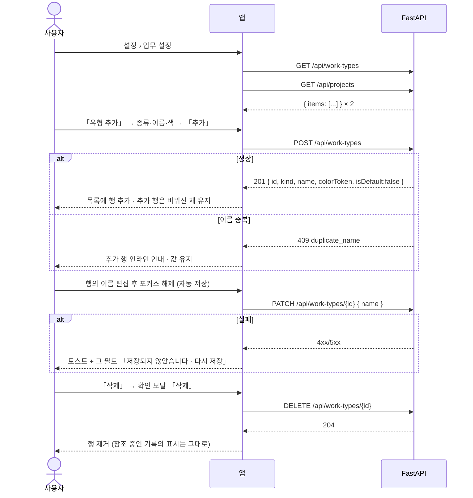
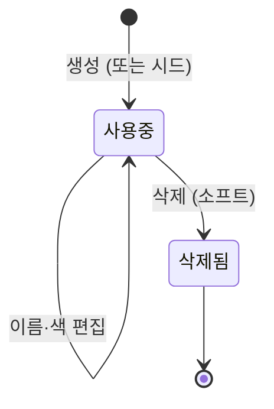

# 업무 설정 — 유형 · 프로젝트

**업무를 만들려면 유형이 먼저 있어야 한다.** 이 화면에서 유형(종류 + 이름 + 색)과 프로젝트(이름 + 색)를 만들고, 고치고, 지운다. 기본 유형 3종은 색만 바꾼다. 지운 것은 새로 고를 수 없지만, 이미 쓰고 있던 기록에는 그대로 남는다.

> 기능/정책 묶음 단위의 **외부 계약** 문서다. client / QA / 외부 통합이 이 문서만 읽고 따를 수 있어야 한다.
> SPEC에는 table schema 전문, ORM field, repository/service 구조, PR 계획, 구현 순서, 라우트·컴포넌트 파일 경로 같은 내부 구현을 두지 않는다.

## 1. Context

### Meta

- Decision reference: DEC-001 §3(필드) · §4(삭제·기본 3종) · §5(CRUD) · §7(자동 저장·실패) · §8(연결) · §v2
- Baseline reference: BASE-001 기능 9·10
- Consumer reference: DEC-002 §3(업무의 유형 필수·프로젝트 0..1) · DEC-003 §3(회의는 종류 `미팅`) · DEC-005 §3(캘린더 유형 색·필터)
- Architecture reference: `backend/README.md` §8-2·§10 · `frontend/README.md` §1·§3-3·§5-3·§6·§7 · `database/domains/account.md` A-4·A-5·A-6
- Design reference: `09-design-tokens.md` · `디자인 시스템.dc.html [02][07][10]` · `11-auth-profile.md` §설정 공통 골격 · 참고 시안 `work-settings-proposal.html`(**확정 아님**)
- Domain note: 외부에 드러나는 것은 **유형**(`kind` = `meeting|task`, 이름, 색 토큰, 기본 여부)과 **프로젝트**(이름, 색 토큰), 그리고 **허용 색 팔레트 8종**이다
- Open questions: §7

### Business Requirement

- **이 영역이 제품의 원천 데이터다**(BASE-001 §Why It Matters). 업무·회의·캘린더가 전부 여기서 만든 유형·프로젝트를 참조하므로, 이것이 서야 다음 배치가 검증된다.
- 디자인 패키지에 **이 화면이 없다**(DEC-001 OQ-1). 참고 시안은 방향만 주고, 유형 등록의 **종류 셀렉터가 빠져 있으며** 색 7종도 확정값이 아니다 — 이 spec 이 화면과 팔레트를 확정한다.
- 삭제는 **소프트 딜리트**다. 「다른 페이지에서는 옛날 정보 그대로 띄워줄 수 있고, 다만 생성될 때 연결을 못 할 뿐」(BASE-001 Raw)이라는 요구를 그대로 계약으로 옮긴다.

### Scope

In scope:

- 업무 설정 화면 — 「업무 유형」 패널 + 「프로젝트」 패널
- 유형 CRUD — 등록(**종류 + 이름 + 색**) · 이름/색 편집 · 삭제(소프트)
- 프로젝트 CRUD — 등록(이름 + 색) · 이름/색 편집 · 삭제(소프트)
- 기본 유형 3종의 잠금 규칙 — 삭제 불가·이름/종류 고정·**색만 편집**
- **허용 색 팔레트 확정**(8종) — 유형·프로젝트가 공유한다
- **자동 저장 실패 표시 규격**(전 영역 공통, DEC-001 §7 · §B-6)
- **설정 영역 반응형**(Q-22 의 설정 화면 몫)

Out of scope:

- 개인 설정(프로필·경력·목소리)·비밀번호 변경 드로어·연동 관리 — 다음 배치
- **삭제 복원 UI — v1 에 없다**(DEC-004 §4 「복원 API·화면을 만들지 않는다」). DEC-001 OQ-2 는 이것으로 닫힌다
- 유형·프로젝트별 **집계 카운트**(참고 시안의 「이번 달 8건」·「진행중 4 · 전체 12」) — §7 참조
- 유형·프로젝트를 고르는 쪽(업무 생성 드로어·필터·배지) — 배치 ② 이후

## 2. UX Contract

### Placement

설정 화면의 세 번째 갈래. 좌측 메뉴 카드는 SPEC-001 U-4 가 정의한 것을 그대로 쓴다.

```text
+──────────────────────────────────────────────────────────+
│ (사이드바 200)  홈 › 설정 › 업무 설정                     │
│                 설정                                      │
│  ┌ 메뉴 카드 ┐  ┌ 업무 유형 패널 ─────────────────────┐  │
│  │ 개인 설정 │  │ 헤더 60 · 캡션 · [유형 추가]        │  │
│  │▸업무 설정 │  │ (인라인 추가 행 56)                 │  │
│  │ 연동 관리 │  │ 행 64 × N                           │  │
│  │ ───────── │  └─────────────────────────────────────┘  │
│  │ 로그아웃  │  ┌ 프로젝트 패널 ──────────────────────┐  │
│  │ 계정 삭제 │  │ 헤더 60 · 캡션 · [프로젝트 등록]    │  │
│  │ v · 저장  │  │ (인라인 추가 행 56) · 행 64 × N     │  │
│  └───────────┘  └─────────────────────────────────────┘  │
+──────────────────────────────────────────────────────────+
```

**성격이 다른 묶음은 패널을 나눈다**([10] RULES 「설정은 패널 스택」). 유형과 프로젝트는 다른 축이므로 패널 둘이다. 카드는 1px `#D9D9D9` · radius 16, 패널 간 간격 20.

### U-1. 「업무 유형」 패널 헤더

- **상태**: 항상 보인다. 높이 60
- **문구**: 제목 「업무 유형」 16/700 + 캡션 12/`#9EA2AE` 「업무·회의의 종류를 나눕니다 · 입력을 마치면 자동으로 저장됩니다」
- **CTA**: 우측 「**유형 추가**」(32px). 누르면 **U-2 인라인 추가 행**이 목록 맨 위에 열리고 이름 입력에 포커스가 간다. 추가 행이 이미 열려 있으면 그 행으로 포커스만 옮긴다(두 줄이 동시에 열리지 않는다)
- **기대 결과**: **패널에 저장 버튼이 없다**([10] 「자동 저장 화면엔 저장 버튼이 없다」). 캡션이 그 사실을 알린다

### U-2. 유형 인라인 추가 행 — **종류 · 이름 · 색** (미설계 확정)

필드가 셋이라 **드로어를 열지 않는다** — 「한 줄짜리 개체는 인라인」·「필드가 4개 이하면 드로어를 열지 않는다」([10] RULES). 참고 시안이 인라인 방향을 제안했고, **빠져 있던 종류 셀렉터를 여기서 넣는다**(DEC-001 OQ-1 · §3 「유형은 종류·이름·색 필수」).

- **상태**
  - *열림*: 56px 한 줄, 배경 `#FBFCFF`, 컨트롤 36px — [종류 셀렉터 136] [이름 입력(유동, 최소 200)] [색 트리거 56] … [취소] [추가]
  - *기본값*: 종류는 **선택 없음**(플레이스홀더 「종류」), 색은 팔레트 첫 값이 미리 잡혀 있다
  - *제출 가능*: 종류가 선택되고 이름이 1자 이상일 때만 「추가」가 활성
  - *실패*: 해당 컨트롤 테두리 실패색 + 행 아래 12px 인라인 문구. 입력값은 남는다
- **문구**: 이름 플레이스홀더 「유형 이름 (예: 외부 미팅)」 · 종류 옵션은 「**미팅**」 / 「**업무**」 두 개 · 색 트리거 옆 캡션 「색」
- **CTA**: 「취소」(텍스트) · 「**추가**」(`#7181F8`). `Enter` 로도 추가되지만 **버튼은 항상 있다**([10] 단축키는 보조). 「취소」·`Esc` 로 행이 닫힌다
- **기대 결과**: 추가되면 행이 목록에 들어가고 **추가 행은 비워진 채로 열려 있다**(연속 등록을 끊지 않는다). 목록 정렬은 §4 Data Contract 를 따른다

### U-3. 유형 목록 행

- **상태**
  - *커스텀 유형*: 행 64px, 행 hover `#FAFBFC`, 행 구분 `#F1F2F5`. [유형 배지] [이름(인라인 편집)] … [종류 칩] [색 트리거] [삭제]
  - *기본 유형 3종*: 같은 행에 「**기본**」 칩(`#F4F5F7` + 1px `#E1E3E8` · `#5F6470`)이 붙고, **이름은 읽기 전용**(클릭해도 편집으로 바뀌지 않는다), **종류 칩도 읽기 전용**, **삭제 버튼이 없다**. **색 트리거만 활성**(DEC-001 §4 · A-4)
  - *저장 중*: 편집한 컨트롤 옆에 진행 표시. 다른 행은 잠기지 않는다
  - *저장 실패*: **U-7 규격**
- **문구**: 배지는 유형 이름을 그대로 쓴다(h20 · r4 · 11px/600 — `09-design-tokens` §유형). 종류 칩은 「미팅」 / 「업무」
- **CTA**
  - 이름 — 클릭하면 그 자리에서 편집(인라인), **포커스가 빠질 때 저장**(DEC-001 §5 · [10] 자동 저장)
  - 색 트리거 — **U-4 팝오버**. 고르면 **즉시 저장**(확인 버튼 없음 — `11-auth-profile.md` §셀렉터)
  - 「삭제」 — **U-6 확인 모달**
  - **종류는 만든 뒤 바꿀 수 없다.** 행에 종류 편집 컨트롤을 두지 않는다(§5 근거)
- **기대 결과**: 이름·색 변경은 저장 즉시 배지에 반영된다. 이 유형을 쓰는 다른 화면(업무·회의·캘린더)의 배지 이름·색도 같이 바뀐다(FE §3-3 무효화 표)

### U-4. 색 팝오버 — 허용 팔레트 8종 (미설계 확정)

**고르기는 팝오버**다([10] RULES). 규격은 공용 셀렉터를 따른다 — 트리거에 붙여 1px 겹치게, 아래 공간이 모자라면 위로, 선택 즉시 반영·확인 버튼 없음(`11-auth-profile.md` §셀렉터).

- **상태**: 폭 240(팝오버 200–400 범위), 24px 스와치 8개를 4×2 그리드로. 현재 값은 1px `#7181F8` + `0 0 0 3px rgba(113,129,248,0.16)`
- **문구**: 스와치 자체가 견본이다 — 유형은 스와치 안에 「가」(배지 bg + fg 조합 그대로), 프로젝트는 8px dot. **색 이름을 글자로 쓰지 않는다**
- **CTA**: 스와치 클릭 → 선택 + 팝오버 닫힘 + 저장. `Esc`·바깥 클릭으로 닫으면 값이 바뀌지 않는다
- **기대 결과**: **자유 색상 입력이 없다**(DEC-001 §3 「허용 팔레트 중 선택, 자유 색상 금지」). 「직접 입력」 항목을 두지 않는다 — 이 셀렉터는 시각 셀렉터와 달리 팔레트 밖 값을 받지 않는다

### U-5. 「프로젝트」 패널

- **상태**
  - *헤더*: 제목 「프로젝트」 + 캡션 「업무·회의를 묶는 단위입니다 · 입력을 마치면 자동으로 저장됩니다」 + 우측 「**프로젝트 등록**」(32px)
  - *인라인 추가 행*: 56px — [색 트리거 56] [이름 입력(유동, 최소 200)] … [취소] [추가]. **종류가 없다**(프로젝트는 이름 + 색뿐 — DEC-001 §3)
  - *목록 행*: 64px — [8px dot(색)] [이름(인라인 편집)] … [색 트리거] [삭제]. **기본 프로젝트는 없다** — 전부 삭제 가능
  - *빈 상태*: 등록된 프로젝트가 하나도 없으면 목록 자리에 빈 상태 — 문구 + 「프로젝트 등록」 진입점
- **문구**: 이름 플레이스홀더 「프로젝트 이름 (예: 9월 요금제 개편)」 · 빈 상태 「아직 프로젝트가 없습니다」 + 「업무를 묶어 보려면 프로젝트를 하나 만들어 주세요」
- **CTA**: U-2·U-3 와 같은 규칙(추가·인라인 편집·색 팝오버·삭제)
- **기대 결과**: **프로젝트는 업무의 필수값이 아니다**(DEC-002 §3 — 0..1, 무소속 허용). 하나도 없어도 다음 배치가 막히지 않는다

### U-6. 삭제 확인 모달 (600) — 미설계 확정

되돌리기 어려운 결정 하나 → **모달 600**. 공용 확인 모달(S-05) 규격을 그대로 쓴다.

- **상태**: 스크림 `rgba(30,30,30,0.36)` + 카드 600. 제목 → 요약 → 경고 슬롯 → 취소/삭제. 진행 중에는 버튼 비활성
- **문구**(유형)
  - 제목 「**'<이름>' 유형을 삭제할까요?**」
  - 요약 「이 유형을 쓰고 있는 업무·회의는 그대로 남고, 배지도 지금 이름과 색으로 보입니다.」
  - 경고 슬롯 「**새 업무·회의에서는 더 이상 고를 수 없습니다. v1 에는 복원 화면이 없습니다.**」
- **문구**(프로젝트): 같은 구조로 「'<이름>' 프로젝트를 삭제할까요?」 / 「이 프로젝트에 묶인 업무·회의는 그대로 남고, 프로젝트 이름도 지금대로 보입니다.」 / 같은 경고
- **CTA**: 「취소」 · 「**삭제**」(`#E2685B`)
- **기대 결과**: 삭제하면 그 행이 목록에서 사라지고, **선택 목록에서만 빠진다.** 이미 참조 중인 기록의 표시는 바뀌지 않는다(DEC-001 §4 · A-6). **삭제 개수·영향 건수를 세어 보여주지 않는다**(§7 참조)

### U-7. 자동 저장 실패 표시 — 전 영역 공통 규격 (여기서 확정)

DEC-001 §7 이 「토스트 + 해당 필드에 실패 상태 표시, 자동 재시도 없음」을 전 영역 공통으로 못박았고 규격이 비어 있었다(§B-6). **자동 저장이 처음 등장하는 이 spec 에서 확정하고, 이후 spec 은 참조만 한다.**

- **상태**
  - *실패 필드*: 테두리 `#E2685B` + 값 유지. 그 아래 12px 캡션 「**저장되지 않았습니다**」 + 같은 줄 우측에 텍스트 버튼 「**다시 저장**」
  - *유지 조건*: 표시는 **화면에 남는다.** 다른 필드를 만지거나 목록을 스크롤해도 지워지지 않는다
  - *해제 조건*: ① 「다시 저장」이 성공 ② 그 필드를 다시 편집해 저장이 성공 — **둘 중 하나뿐**이다. 시간 경과로 사라지지 않는다
- **문구**: 토스트 「**저장하지 못했습니다 · <필드 이름>**」(400×56, `#1E1E1E`, 하단 중앙, 4초). **실행취소를 붙이지 않는다**(되돌릴 변경이 서버에 없다)
- **CTA**: 「다시 저장」 — 누를 때만 **한 번** 재요청한다. **자동 재시도는 없다**(DEC-001 §7 「실패를 가린다」 · FE §3-2 `retry:false`)
- **기대 결과**: 어느 입력이 저장되지 않았는지 화면에 남는다. 「마지막 저장」 캡션(SPEC-001 U-4)은 **성공했을 때만** 갱신된다

### U-8. 반응형 — 설정 영역 (Q-22 의 설정 화면 몫)

유동이 기본이다. 1920 좌표(메뉴 260 / 패널 1356 / 여백 240)는 **비율의 참고값**이고 `position:absolute` 로 박지 않는다(§C Q-34 · §A-13).

| 구간 | 설정 화면 |
|---|---|
| **< 1280** | 최소 폭 안내 화면(SPEC-000 U-2) |
| **1280 ~ 1439** | 사이드바 숨김 + 좌상단 햄버거 오버레이. 좌우 여백 48. **메뉴 카드 240** + 패널 스택 유동(남은 폭 전부) |
| **≥ 1440** | 사이드바 200 고정. 좌우 여백 80 → 240 연속 보간. **메뉴 카드 260** + 패널 스택 유동 |

- 목록 행 안에서 **줄어드는 것은 이름 열뿐**이다(최소 200). 배지·칩·색 트리거·삭제는 폭이 고정이고 순서도 바뀌지 않는다
- **두 컬럼의 아래 끝을 억지로 맞추지 않는다.** 1920 규칙(「메뉴 카드 높이를 패널과 같은 값으로」 — `11-auth-profile.md`)은 고정 캔버스에서 나온 값이라 유동에서는 성립하지 않는다. 대신 메뉴 카드는 **내용 높이만큼만 차지하고 상단에 고정**되며, 로그아웃·계정 삭제·버전 캡션은 그 카드 안 맨 아래에 남는다([10] 「로그아웃·계정 삭제는 메뉴 카드 맨 아래」는 지킨다)
- 인라인 추가 행은 어느 구간에서도 **한 줄을 유지한다.** 두 줄로 접히면 인라인이 아니라 드로어여야 하는데, 필드가 셋이라 그 지점에 닿지 않는다

## 3. User Scenario

### S-1. 사용자 — 유형을 만든다

1. 설정 → 「업무 설정」으로 간다. 「업무 유형」 패널에 **기본 3종**(미팅·회의 / 개인 업무 / 문서·보고)이 「기본」 칩과 함께 보인다.
2. 「유형 추가」를 누른다 → 인라인 추가 행이 열린다.
3. **종류**를 「미팅」으로 고르고, 이름에 「외부 미팅」을 넣고, 색 트리거에서 색을 하나 고른다.
4. 「추가」를 누른다 → 목록에 「외부 미팅」 행이 생기고 배지가 고른 색으로 보인다. 추가 행은 비워진 채 열려 있다.
5. `Esc` 로 추가 행을 닫는다.

### S-2. 사용자 — 이름을 잘못 넣었다

1. 종류를 고르지 않은 채 이름만 넣는다 → 「추가」가 **비활성**이다.
2. 종류를 고르고 이름을 비운다 → 다시 비활성이다.
3. 이미 있는 이름(「외부 미팅」)을 그대로 넣고 「추가」를 누른다 → 행 아래에 「같은 이름의 유형이 이미 있습니다」가 뜨고 **행이 닫히지 않는다.**

### S-3. 사용자 — 기본 유형의 색만 바꾼다

1. 「개인 업무」 행의 이름을 클릭한다 → **편집으로 바뀌지 않는다.**
2. 색 트리거를 누른다 → 팝오버가 열린다. 다른 색을 고른다 → 팝오버가 닫히고 **즉시 저장**된다. 배지 색이 바뀐다.
3. 그 행에 **삭제 버튼이 없다.**

### S-4. 사용자 — 커스텀 유형을 지운다

1. 「외부 미팅」 행의 「삭제」를 누른다 → **확인 모달(600)** 이 뜬다.
2. 요약에 「쓰고 있는 업무·회의는 그대로 남는다」가, 경고에 「새로 고를 수 없다 · 복원 화면이 없다」가 보인다.
3. 「삭제」를 누른다 → 행이 사라진다.
4. (배치 ② 이후) 업무 생성에서 유형을 고르면 **목록에 없다.** 그런데 이미 그 유형으로 만들어 둔 업무는 **배지가 그대로** 보인다.

### S-5. 사용자 — 프로젝트를 만든다

1. 「프로젝트」 패널이 비어 있다 → 「아직 프로젝트가 없습니다」 빈 상태가 보인다.
2. 「프로젝트 등록」을 누르고 색과 이름을 넣어 추가한다 → 8px dot + 이름 행이 생기고 빈 상태가 사라진다.

### S-6. 사용자 — 저장이 실패한다

1. 서버를 내린 상태에서 유형 이름을 고치고 다른 곳을 클릭한다(포커스 해제 = 저장 시점).
2. **토스트** 「저장하지 못했습니다 · 유형 이름」이 뜨고, 그 입력 테두리가 실패색이 되며 아래에 「저장되지 않았습니다 · 다시 저장」이 남는다.
3. 다른 행을 만져도 그 표시는 **지워지지 않는다.** 자동으로 다시 시도하지도 않는다.
4. 서버를 올리고 「다시 저장」을 누른다 → 저장되고 표시가 사라진다.

### S-7. 사용자 — 창을 좁힌다

1. 창을 1439 이하로 줄인다 → 사이드바가 햄버거로 바뀌고 메뉴 카드가 240 이 된다. 패널은 남은 폭을 채운다.
2. 목록 행의 배지·칩·색·삭제는 그대로 있고 이름 열만 줄어든다.
3. 1280 미만으로 줄이면 최소 폭 안내 화면이 덮는다.

## 4. Interface Contract

### API Contract

| Method | Path | 요약 | 권한 |
|---|---|---|---|
| GET | `/api/work-types` | 유형 목록(기본 = 삭제분 제외) | 세션 |
| POST | `/api/work-types` | 유형 생성 | 세션 |
| PATCH | `/api/work-types/{id}` | 이름·색 부분 수정 | 세션 |
| DELETE | `/api/work-types/{id}` | 유형 삭제(소프트) | 세션 |
| GET | `/api/projects` | 프로젝트 목록(기본 = 삭제분 제외) | 세션 |
| POST | `/api/projects` | 프로젝트 생성 | 세션 |
| PATCH | `/api/projects/{id}` | 이름·색 부분 수정 | 세션 |
| DELETE | `/api/projects/{id}` | 프로젝트 삭제(소프트) | 세션 |

- 전부 **본인 것만** 보이고 바뀐다. 남의 것을 지시하면 **404** 다(존재를 흘리지 않는다)
- **복원 엔드포인트를 만들지 않는다**(DEC-004 §4 — v1 에 복원이 없다)
- `GET` 은 **삭제분을 기본으로 제외**한다(`backend/README.md` §10). 참조 표시용 조회는 이 화면이 아니라 **소비하는 쪽**(업무·회의 응답이 유형 이름·색을 함께 실어 준다)에서 해결한다 — 이 spec 은 「삭제된 것도 달라」는 질의 파라미터를 두지 않는다

### Request / Response

에러는 여기 두지 않는다 — **Case Matrix 가 단일 SoT** 다.

**`GET /api/work-types`**

```json
{
  "items": [
    { "id": 1, "kind": "meeting", "name": "미팅·회의", "colorToken": "indigo", "isDefault": true },
    { "id": 4, "kind": "meeting", "name": "외부 미팅",  "colorToken": "mint",   "isDefault": false }
  ]
}
```

**`POST /api/work-types`** — `{ "kind": "meeting", "name": "외부 미팅", "colorToken": "mint" }` → `201` 단건(위 항목 형태)

**`PATCH /api/work-types/{id}`** — `{ "name": "외부 미팅(신규)" }` 또는 `{ "colorToken": "sky" }` → `200` 단건

- **보낸 필드만 바뀐다.** 보내지 않은 필드는 건드리지 않는다(인라인 자동 저장이 필드 단위로 오기 때문 — `backend/README.md` §3-4)
- **`kind` 는 PATCH 로 받지 않는다**(§5 근거)

**`DELETE /api/work-types/{id}`** → `204`

**`GET /api/projects`**

```json
{ "items": [ { "id": 7, "name": "9월 요금제 개편", "colorToken": "violet" } ] }
```

**`POST /api/projects`** — `{ "name": "...", "colorToken": "violet" }` → `201` 단건
**`PATCH /api/projects/{id}`** — `{ "name": ... }` / `{ "colorToken": ... }` → `200` 단건
**`DELETE /api/projects/{id}`** → `204`

### Validation

| 필드 | 규칙 |
|---|---|
| `kind` | 생성 시 **필수**. `meeting` 또는 `task` 둘 중 하나. **생성 후 변경 불가** |
| `name`(유형·프로젝트 공통) | **필수**. 앞뒤 공백 제거 후 **1~30자**. 줄바꿈 불가 |
| `name` 유일성 | **같은 계정에서, 삭제되지 않은 것끼리 중복 금지.** 유형은 **종류와 무관하게** 전체에서 유일하다(배지에 종류가 함께 뜨지 않으므로 이름만으로 구분돼야 한다). 프로젝트도 프로젝트끼리 유일. **대소문자·공백을 정규화해 비교한다** |
| `colorToken` | **필수**. 아래 팔레트 8종의 토큰명 중 하나. **팔레트 밖 값·임의 hex 는 거부**(DEC-001 §3 · A-5) |
| 기본 유형 3종 | `name`·`kind` 를 바꾸는 요청과 삭제 요청은 **거부**(A-4) |

### Case Matrix

이 spec 의 모든 에러·경계가 여기 있다.

| 에러 코드 | 백엔드 출력 | 프론트 출력 | 표시 위치 |
|---|---|---|---|
| `validation_error` | `422 {detail:"입력값을 확인해 주세요", code:"validation_error"}` | 해당 컨트롤 실패 테두리 + 인라인 문구 「이름은 1~30자로 입력해 주세요」 | 추가 행 / 편집 중인 행 |
| `duplicate_name` | `409 {detail:"같은 이름이 이미 있습니다", code:"duplicate_name"}` | 인라인 문구 「같은 이름의 유형이 이미 있습니다」(프로젝트는 「…프로젝트가…」). **행이 닫히지 않고 값이 남는다** | 추가 행 / 편집 중인 행 |
| `work_type_locked` | `409 {detail:"기본 유형은 이름과 종류를 바꾸거나 삭제할 수 없습니다", code:"work_type_locked"}` | **해당 항목 옆 인라인 안내**(FE §3-5). 토스트로 흘리지 않는다 | 그 유형 행 |
| `invalid_color_token` | `422 {detail:"허용된 색이 아닙니다", code:"invalid_color_token"}` | 색 트리거 옆 인라인 안내. 값은 이전 색으로 되돌린다 | 그 행의 색 트리거 |
| (없는 항목 · 남의 항목) | `404 {detail:"항목을 찾을 수 없습니다", code:"not_found"}` | 토스트 「항목을 찾을 수 없습니다」 + 목록 갱신 | 화면 하단 토스트 |
| **(자동 저장 실패 — 위 어느 코드든, 또는 5xx·네트워크)** | 각 코드 그대로. **서버는 재시도하지 않는다** | **U-7 규격** — 토스트 + 그 필드 실패 표시 + 「다시 저장」. **자동 재시도 없음** | 그 필드 + 하단 토스트 |
| `token_expired` / `invalid_refresh_token` | SPEC-001 §4 | SPEC-001 §4 | — |

- **낙관적 갱신을 하지 않는다** — 이름 중복·기본 유형 잠금·팔레트 검사가 **거부할 수 있는** 변경이다(FE §3-4 원칙). 서버 응답을 받고 반영한다
- 삭제는 **확인 모달을 지났으므로 취소 경로가 없다.** 실패하면 토스트로 알리고 행은 남는다

### Flow



### State / Lifecycle



- **`삭제됨` 에서 나오는 전이가 없다.** v1 에 복원이 없다(DEC-004 §4)
- `삭제됨` 인 유형·프로젝트는 **선택 목록에서 빠지고**, 이미 참조 중인 기록에서는 **이름·색이 그대로 보인다**(A-6)
- 기본 유형 3종은 `삭제됨` 으로 갈 수 없다(A-4)

### Data Contract

**유형** — `id`(number) · `kind`(`meeting` | `task`) · `name` · `colorToken` · `isDefault`(boolean)
**프로젝트** — `id`(number) · `name` · `colorToken`

- 목록 정렬: **기본 유형 3종이 먼저**(시드 순서 고정), 그 뒤 **생성 순**. 프로젝트는 생성 순. 사용자가 순서를 바꾸는 기능은 v1 에 없다
- `kind` 는 **저장·전송 모두 영문 소문자**다. 화면의 「미팅」/「업무」는 표시 매핑이다(DB G-4)

#### 허용 색 팔레트 — 8종 (여기서 확정)

DEC-001 §3 이 「디자인 시스템 허용 팔레트 중 선택」으로 못박았지만 **목록이 어디에도 없었다.** 참고 시안의 7종은 확정값이 아니다. 아래를 정본으로 둔다.

| 토큰명 | 배경(bg) | 전경(fg) | 근거 |
|---|---|---|---|
| `indigo` | `#EEF1FE` | `#4A55B8` | 디자인 시스템 [02] 「미팅·회의」 배지 — 기본 유형 시드값 |
| `violet` | `#F1F2FE` | `#4B52A8` | [02] 「개인 업무」 배지 — 기본 유형 시드값 |
| `steel` | `#F4F7FF` | `#3F5F94` | [02] 「문서·보고」 배지 — 기본 유형 시드값 |
| `mint` | `#EAF7F0` | `#2F7F5B` | [07] 강도 충족색 `#3BA776` 계열을 같은 레시피(옅은 틴트 bg + 어두운 동계 fg)로 확장 |
| `sky` | `#E9F3FD` | `#2E6FA8` | [01] 계열 확장 |
| `amber` | `#FBF2DC` | `#8A6714` | 〃 |
| `rose` | `#FCEEEC` | `#A34A3F` | 〃 |
| `graphite` | `#F1F2F5` | `#4A4E58` | 〃 (무채색 한 자리) |

규칙 넷.

1. **레시피는 하나다** — 배경은 매우 옅은 틴트, 전경은 같은 색상의 어두운 값. 배지·칩·dot 이 전부 이 쌍을 쓴다.
2. **상태 5색·채널 3색의 값을 재사용하지 않는다.** 상태(시작전·진행중·완료·취소·지연)와 채널(메일·카카오톡·슬랙)은 **다른 축**이고, 축이 섞이면 배지 색으로 상태나 출처를 읽게 된다([10] RULES 「채널 색은 별개 축」). `sky`·`amber`·`rose` 를 그 값들과 **다른 hex** 로 잡은 이유가 이것이다.
3. **취소는 유형이 아니다**(§A-2). 팔레트에 「취소」 자리를 두지 않는다 — 취소는 상태 표시(제목 취소선·회색·점선 칩)로만 나타난다.
4. **팔레트는 늘리지 않는다.** 늘려야 하면 이 표를 고치고 디자인 시스템에 반영한다 — 화면에서 임의 색을 만들지 않는다([10] 「새 배지 색을 임의로 만들지 않습니다」의 정신을 동적 유형에 맞게 옮긴 것).

**렌더 계약** — 배지·칩·dot 은 **토큰명으로 색을 고른다.** 응답이 hex 를 싣지 않고, 화면도 hex 를 인라인 스타일로 쓰지 않는다(FE §5-3). 팔레트에 없는 토큰명이 오면(옛 값 등) **중립으로 떨어뜨리되 항목을 숨기지 않는다.**

## 5. Implementation Rules

- **소유 검사가 먼저다.** 모든 조회·수정이 본인 것으로 먼저 좁혀진 뒤 판정된다. 남의 것은 404
- **삭제는 소프트다.** 행을 지우지 않고 삭제 표시만 남긴다. 목록·선택지에서 빠지고, 참조 표시는 유지된다(A-6). **복원 경로를 만들지 않는다**
- **기본 유형 잠금은 서버가 판정한다.** 화면이 컨트롤을 감춰도 서버 검사는 그대로 돈다 — 이름·종류 변경과 삭제 요청은 `work_type_locked`
- **종류(`kind`)는 생성 시에만 정해진다.** 근거: 회의는 종류 `미팅` 인 유형만 참조하고(`database/README.md` ERD `meeting.work_type_id "kind='meeting' 만"`), 업무는 종류 `업무` 축에서 고른다(DEC-002 §3). 이미 참조된 유형의 종류를 바꾸면 **기존 참조가 규약을 어긴 상태**가 된다. 바꾸고 싶으면 새 유형을 만들고 옛 것을 지운다
- **부분 수정은 「보내지 않음」과 「비움」을 구분한다** — 인라인 자동 저장이 필드 하나만 보내기 때문이다
- **자동 저장에 재시도가 없다.** 서버도 클라이언트도 재시도하지 않는다(DEC-001 §7). 재요청은 사용자가 「다시 저장」을 눌렀을 때만
- **유형·프로젝트가 바뀌면 이를 참조하는 목록도 갱신된다** — 배지 이름·색이 딸려 있기 때문이다(FE §3-3 무효화 표). 이 화면에서 색을 바꾸고 업무 화면으로 가면 새 색이 보여야 한다
- **동시성**: 같은 항목에 대한 편집이 겹칠 일이 없다(단일 사용자). 잠금·버전 충돌 처리를 두지 않는다
- **집계를 계산하지 않는다** — 목록 응답에 사용 건수를 싣지 않는다(§7)

## 6. Verification

### Acceptance Criteria

앱 창에서 사람이 직접 확인하는 문장으로 적는다.

- [ ] 설정 → 「업무 설정」에 **기본 유형 3종**이 「기본」 칩과 함께 보인다
- [ ] 「유형 추가」로 **종류(미팅|업무) · 이름 · 색**을 넣어 유형을 만들 수 있고, 배지가 고른 색으로 보인다
- [ ] 종류를 고르지 않으면 「추가」가 **비활성**이다
- [ ] 이미 있는 이름으로 추가하면 「같은 이름의 유형이 이미 있습니다」가 뜨고 **입력이 사라지지 않는다**
- [ ] 색 팝오버에 **8종만** 있고, 자유 색상 입력이 **없다**
- [ ] 기본 유형은 **이름을 고칠 수 없고 삭제 버튼이 없으며**, **색만** 바뀐다
- [ ] 커스텀 유형의 이름을 고치고 다른 곳을 클릭하면 **저장 버튼 없이** 저장된다
- [ ] 커스텀 유형 「삭제」를 누르면 **확인 모달(600)** 이 뜨고, 확인하면 목록에서 사라진다
- [ ] 프로젝트가 하나도 없으면 「**아직 프로젝트가 없습니다**」 빈 상태가 보이고, 하나 만들면 사라진다
- [ ] 프로젝트를 **이름 + 색**으로 만들 수 있고 dot 색이 반영된다
- [ ] 서버를 내린 채 이름을 고치고 포커스를 빼면 **토스트 + 그 필드에 「저장되지 않았습니다 · 다시 저장」** 이 뜨고, **가만히 두어도 다시 시도하지 않는다**
- [ ] 서버를 올리고 「다시 저장」을 누르면 저장되고 실패 표시가 사라진다
- [ ] 창을 1439 이하로 줄여도 행이 두 줄로 접히지 않고 **이름 열만** 줄어든다. 1280 미만은 안내 화면이다
- [ ] (다음 배치와 함께 확인) 삭제한 유형은 업무 생성의 선택 목록에 **없고**, 그 유형으로 만들어 둔 업무의 배지는 **그대로** 보인다

## 7. Open Questions

### 이 spec 이 닫은 것

| 닫힌 항목 | 무엇으로 닫았나 |
|---|---|
| **DEC-001 OQ-1**(업무 설정 화면 미설계) | **U-1~U-6 에서 확정** — 패널 2개 · 인라인 추가 행(**종류 셀렉터 포함**) · 목록 행 · 색 팝오버 · 삭제 모달. 근거: [10] RULES(한 줄짜리 개체는 인라인 / 필드 4개 이하는 드로어 금지 / 고르기는 팝오버 / 편집은 드로어·결정은 모달 / 자동 저장 화면엔 저장 버튼 없음 / 설정은 패널 스택) · `09-design-tokens` 오버레이 3종·형태 토큰 |
| **DEC-001 OQ-2**(삭제된 유형·프로젝트 복구 UI) | **불필요로 닫음** — v1 에 복원이 없다(DEC-004 §4 「복원 API·화면을 만들지 않는다」). §4 State 에 `삭제됨` 에서 나가는 전이를 두지 않았고, 대신 **U-6 모달 경고 문구**가 그 사실을 사용자에게 알린다 |
| **DEC-001 §7 자동 저장 실패 표시**(§B-6 · 전 영역 공통) | **U-7 에서 확정** — 토스트 문구 + 필드 실패 테두리 + 「저장되지 않았습니다」 캡션 + 「다시 저장」 · 해제 조건 2가지 · 자동 재시도 없음 |
| **Q-22 의 설정 화면 몫**(인증·설정 반응형) | **U-8 에서 확정** — 세 구간 + 메뉴 카드 240/260 + 이름 열만 축소 + 두 컬럼 높이 맞춤 규칙의 유동 대체. 근거: `08-responsive.md` · FE §7-1 · §C Q-34 |
| **허용 색 팔레트 목록**(DEC-001 §3 이 참조만 하고 목록이 없던 것) | **§4 Data Contract 에서 8종 확정** — 시드 3종은 디자인 시스템 [02] 값 그대로, 5종은 같은 레시피로 확장. 상태·채널 축의 값과 겹치지 않게 잡았다 |

### 남은 것

| ID | Question | Owner | Next |
|---|---|---|---|
| S002-OQ-1 | **이름 중복 금지는 spec 이 새로 정한 규칙이다.** DEC-001 에 유일성 규정이 없다. 배지에 이름만 뜨므로(종류가 함께 표시되지 않는다) 같은 이름이 둘이면 화면에서 구분할 수 없어 **금지**로 정했다. 정책서에 반영이 필요하고, 다르게 가려면 알려 달라 | 사용자 | DEC-001 갱신 |
| S002-OQ-2 | **`duplicate_name`·`invalid_color_token`·`not_found` 코드 신설.** `backend/README.md` §8-2 코드 표에 없어 이 spec 이 추가했다(`work_type_locked` 는 이미 있다). 아키텍처 코드 표 반영 필요 | 코디 | 아키텍처 갱신 |
| S002-OQ-3 | **참고 시안의 집계 카운트를 넣지 않았다** — 「이번 달 8건」·「진행중 4 · 전체 12」. 업무 영역이 아직 없어 집계의 정의(기간·상태 축)를 정할 근거가 없고, 목록 응답에 집계를 실으면 그 정의가 spec 밖에서 굳는다. 필요하면 업무 배치 이후 별도로 정한다 | 사용자 | 배치 ② 이후 |
| S002-OQ-4 | **종류 변경 불가는 spec 판단이다**(§5 근거 — 회의는 `kind='meeting'` 유형만 참조). DEC-001 은 기본 3종의 종류 고정만 말하고 커스텀 유형의 종류 변경은 언급이 없다. 정책서에 반영이 필요하다 | 사용자 | DEC-001 갱신 |
| S002-OQ-5 | **팔레트 5종의 hex 는 디자인 원본에 없던 값이다** — 디자인 시스템에 등록해야 「허용 팔레트」가 한 곳에서 관리된다. 값 자체를 디자이너가 다시 잡을 여지가 있다(레시피와 축 분리 규칙만 지키면 값 교체는 이 spec 을 깨지 않는다) | 사용자(디자인) | 디자인 시스템 갱신 |
