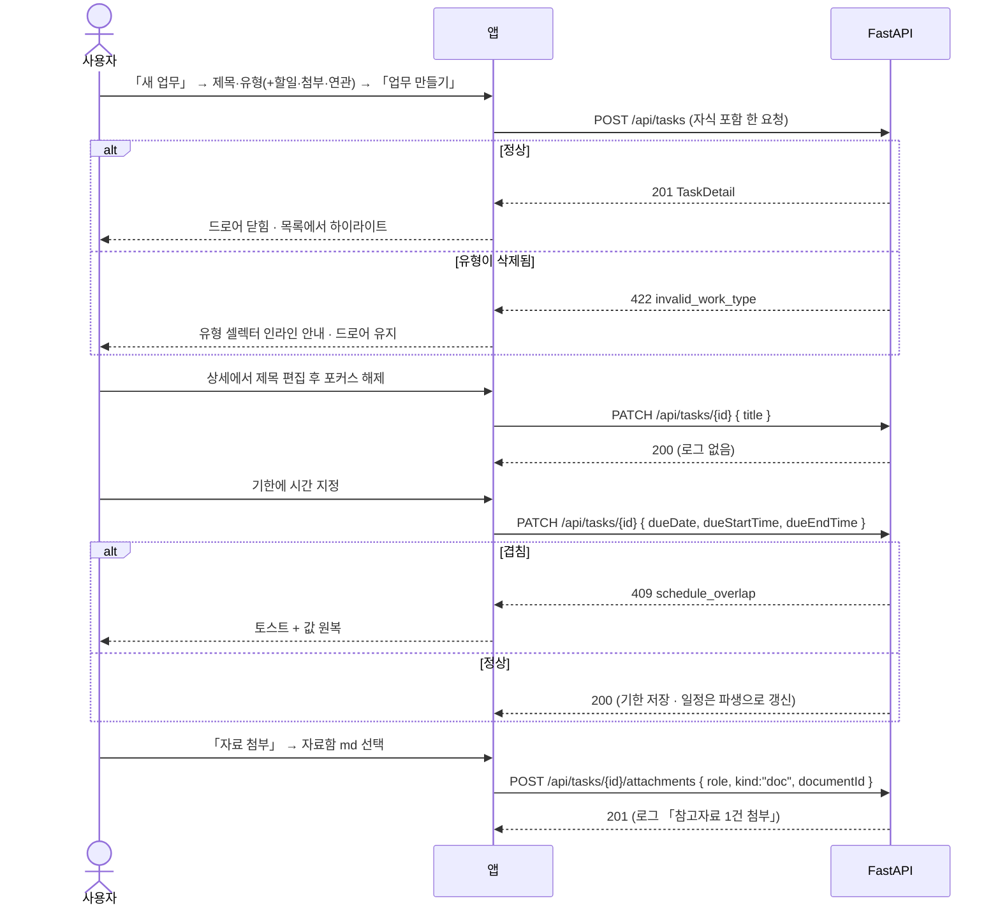

# 내 업무 — 생성 · 상세 · 편집

업무를 **드로어에서 만들고**, 열어서 **그 자리에서 고친다**. 할일·메모·참고자료·결과자료·연관업무가 업무 하나에 붙고, 시스템 로그가 무슨 일이 있었는지 남긴다. 저장 버튼은 생성 드로어 푸터에만 있다 — 나머지는 포커스를 벗어나면 저장된다.

> 기능/정책 묶음 단위의 **외부 계약** 문서다. client / QA / 외부 통합이 이 문서만 읽고 따를 수 있어야 한다.
> SPEC에는 table schema 전문, ORM field, repository/service 구조, PR 계획, 구현 순서, 라우트·컴포넌트 파일 경로 같은 내부 구현을 두지 않는다.

## 1. Context

### Meta

- Decision reference: DEC-002 §3(필드) · §5(CRUD) · §6(기록) · §7(저장·실패) · §8(연결)
- Baseline reference: BASE-002 (내 업무)
- 소비 규약: DEC-001 §3·§4(유형·프로젝트를 제공하는 쪽 — SPEC-002 가 만든다) · DEC-004 §8(첨부는 md 문서) · DEC-005 §3(기한은 업무가 소유, `schedule` 은 파생)
- Architecture reference: `backend/README.md` §3·§7·§8-2·§10 · `frontend/README.md` §1-2·§3-4·§6 · `database/domains/task.md` T-1~T-11
- Design reference: `02-data-model.md` · `03-create-task.md` · `04-task-detail.md` · `06-related-tasks.md` · `09-design-tokens.md` · `디자인 시스템.dc.html [06][07][10]` · P-20~P-24 · 정정 §A-1·§A-2·§A-4
- Domain note: 외부에 드러나는 것은 **업무**(제목·유형·프로젝트·기한·배경·목표·완료 결과·상태)와 그 자식 **할일 · 메모 · 첨부(참고자료/결과자료) · 연관업무 · 로그**다
- Open questions: §7

### Business Requirement

- 업무가 이 제품의 중심 기록이다. **유형은 필수**(DEC-002 §3 「업무인지 미팅인지는 필수」)이고 SPEC-002 가 만든 동적 유형을 참조한다 — 고정 enum 3종은 폐기됐다(§A-1).
- **기한은 업무가 소유한다**(DEC-005 §3 개정 · §A-4). 디자인의 `startDate`/`endDate` 두 필드는 **기한 하나(+선택 시간)** 로 정리된다. 캘린더의 `schedule` 은 그 파생이고 이 spec 은 파생 사실만 참조한다.
- **자동 저장이 기본**이다([10] RULES). 상세에서 값을 고치는 데 저장 버튼이 없다 — 대신 실패를 화면에 남긴다(DEC-001 §7 · SPEC-002 U-7).

### Scope

In scope:

- 업무 **생성 드로어**(840) — 제목·유형·프로젝트·기한·배경·목표·할일·참고자료·연관업무를 한 번에 저장
- 업무 **상세 드로어**(840)와 **전체 페이지 승격**(⤢)
- **인라인 편집** — 제목·배경·목표·완료 결과, 포커스 해제 시 저장
- 할일(체크·진행률) · 메모 · **첨부 두 종류(자료함 md 문서 / URL 링크)** · 연관업무 · 시스템 로그
- **완료 결과 입력 필드**(신설 — DEC-002 §3) 의 화면 규격
- 상세의 로딩·없는 항목 표시

Out of scope:

- **상태 전이·완료 게이트·취소·삭제** — SPEC-004(이 spec 은 헤더에 자리만 둔다)
- **리스트·칸반·필터·정렬** — SPEC-004
- 캘린더 표시·드래그 — 배치 ④. 여기서는 기한이 `schedule` 로 파생된다는 사실만 참조한다
- 회의록이 업무를 만들고 고치는 입구(DEC-003 §5) — 배치 ③
- 로컬 파일 업로드 첨부 · pdf·docx — v1 에 경로가 없다(DEC-004 §3 · T-9)
- **업무 검색** — v1 에 없다(§7)

## 2. UX Contract

### Placement

리스트·칸반 위에 드로어로 열린다. ⤢ 를 누르면 전체 페이지로 승격된다(URL 은 `?id=` 쿼리 — FE §1-2).

```text
[상세 드로어 — 기본]                    [전체 페이지 — ⤢ 승격]
+───────────────+────────────────+      +──────────────────────+────────+
│ (뒤 화면 보임) │ 드로어 840     │      │ 본문(유동)            │ 우 528 │
│  스크림 0.32   │ 헤더 72        │      │ 배경·목표·할일·첨부   │ 메모   │
│                │ 본문 스크롤    │      │                      │ 로그   │
+───────────────+────────────────+      +──────────────────────+────────+
```

**드로어 위에 모달을 겹치지 않는다**([10] · FE §6-2). 이 spec 의 오버레이는 드로어와 팝오버뿐이다.

### U-1. 새 업무 드로어 (P-20 — 정정 반영)

- **상태**
  - *열림*: 헤더 72(제목 「새 업무」 + ⤢ 없음 + ×), 본문 블록 6, 푸터 76(취소 / 「업무 만들기」). 열자마자 **제목 입력에 포커스**
  - *제출 가능*: **제목 1자 이상 + 유형 선택됨**. 둘 중 하나라도 없으면 「업무 만들기」 비활성
  - *제출 중*: 푸터 버튼 비활성 + 진행 표시. 중복 제출이 나가지 않는다
  - *실패*: 드로어가 닫히지 않고 해당 필드에 인라인 안내(§4 Case Matrix)
- **문구·필드 순서**
  1. **제목** — 플레이스홀더 「업무 제목」
  2. **유형(필수) · 프로젝트(선택) · 기한** 한 줄 — 유형/프로젝트는 팝오버 셀렉터(SPEC-002 가 만든 목록, 삭제된 것은 목록에 없다), 기한은 날짜 + 「시간 지정」 토글(켜면 시작–종료 시각)
  3. **배경 · 목표** 2열 — 「왜 하는가」 / 「무엇이 되면 끝인가」
  4. **할일** — 하단 인라인 추가 행(「할일 입력 후 Enter」 + 「추가」 버튼 병행)
  5. **참고자료 · 연관업무** 2열 — 「자료 첨부」(U-7) / 「업무 연결」(U-8)
  6. **결과자료 · 완료 결과** 2열 — 입력 없이 안내만: 「완료 처리할 때 등록합니다」
  7. **로그** — 안내만: 「생성 시점부터 자동으로 기록됩니다」
  - **상태 필드가 없다.** 생성 시 항상 「시작전」이다(DEC-002 §5). 칸반 컬럼에서 열어도 마찬가지다
  - **「임시저장」 배지를 두지 않는다**(디자인 정정 — §7)
- **CTA**: 「취소」(닫기) · 「**업무 만들기**」(`#7181F8`). `Esc`·×·스크림 클릭으로도 닫힌다
- **기대 결과**: 만들면 드로어가 닫히고 **목록/칸반에서 새 업무가 하이라이트**된다(SPEC-004 U-1·U-3). 드로어에 넣은 할일·참고자료·연관업무는 **함께** 저장된다 — 절반만 저장되는 상태가 없다(§5)

### U-2. 인라인 편집 (P-24)

제목·배경·목표·완료 결과에 적용한다. **별도 편집 모드가 없다**(04-task-detail §인라인 편집).

- **상태**
  - *보기*: 그냥 텍스트
  - *편집 중*: 배경 `#F5F6F8` + 내부 테두리 `#E1E3E8` + 캐럿 `#7181F8`. 드로어 우상단에 안내 바 「제목 · 배경 · 목표는 클릭해 수정하고, 벗어나면 자동 저장됩니다」
  - *저장 중*: 그 필드 우측에 작은 진행 표시
  - *저장 실패*: **SPEC-002 U-7 규격 그대로** — 토스트 「저장하지 못했습니다 · <필드 이름>」 + 필드 테두리 `#E2685B` + 「저장되지 않았습니다 · 다시 저장」. 자동 재시도 없음
- **문구**: 빈 값일 때 플레이스홀더 — 배경 「왜 하는가」 · 목표 「무엇이 되면 끝인가」 · 완료 결과 「무엇을 끝냈는지 적습니다」
- **CTA**: 없다. **저장·취소 버튼을 두지 않는다**([10] 자동 저장). `Esc` 는 편집 전 값으로 되돌리고 저장하지 않는다
- **기대 결과**: 포커스를 벗어나면 저장된다. **제목·배경·목표·완료 결과 수정은 로그에 남지 않는다**(04-task-detail §인라인 편집)

### U-3. 업무 상세 드로어 (P-22)

- **상태**
  - *로딩*: 헤더·본문 자리에 스켈레톤(회색 블록 `#F1F2F5`, 애니메이션 없음 — 데스크톱 도구라 깜빡임을 만들지 않는다). **빈 드로어를 먼저 보여주지 않는다**
  - *정상*: 헤더 고정 + 본문 스크롤
  - *없는 항목*: 드로어 안에 「없는 업무입니다」 + 「목록으로」. **리다이렉트하지 않는다**(FE §1-2)
- **문구·구성**
  - 헤더: 유형 배지 + 프로젝트 칩 / 제목 26·700 / **상태 드롭다운 · 기한 · 「완료 처리」 · ⋯ · ⤢ · ×**
    → 상태 드롭다운 · 「완료 처리」 · ⋯ 의 **동작은 SPEC-004** 가 정의한다. 이 spec 은 자리와 표시만 계약한다
  - 본문 블록 6: ① 배경·목표 ② 할일(U-5) ③ 참고자료·연관업무 2열(U-7·U-8) ④ 결과자료·완료 결과(U-6) ⑤ 메모(U-9) ⑥ 로그(U-10)
  - 기한 표시: 날짜 + D-day. 시간까지 지정됐으면 `08.29 14:00–15:00`. **기한이 없으면 「기한 없음」** 을 회색으로 적는다(빈칸으로 두지 않는다)
- **CTA**: ⤢(U-4) · ×(닫기)
- **기대 결과**: 리스트 행·칸반 카드 어느 쪽에서 열어도 **같은 드로어**다(F-4). 드로어는 동시에 하나만 열린다(FE §6-2)

### U-4. 전체 페이지 승격 (P-23)

- **상태**: 드로어가 닫히고 업무 상세 페이지로 이동한다. 뒤 화면·스크림이 없다. 좌(유동) 본문 + 우(528) 메모·로그 2단
- **문구**: breadcrumb 「홈 › 내 업무 › <제목>」
- **CTA**: breadcrumb 「내 업무」로 목록 복귀. **드로어로 되돌리는 버튼은 없다**(승격은 한 방향 — F-5)
- **기대 결과**: 같은 업무를 보고 같은 규칙으로 편집한다. **드로어와 페이지가 다른 규격을 갖지 않는다**

### U-5. 할일

- **상태**: 진행률 「2 / 5」 + 바(완료색 `#7181F8`). 목록 행 42~46px, 체크박스 + 텍스트(+선택 기한). 완료한 행은 텍스트 `#9EA2AE` + 취소선
  - *빈 목록*: 「할일이 없습니다」 캡션 + 입력 행만
- **문구**: 입력 행 플레이스홀더 「할일 입력 후 Enter」
- **CTA**: 인라인 추가 행(목록 맨 아래 고정, 배경 `#FAFBFC`) — `Enter` 로 등록되지만 **「추가」 버튼을 항상 함께 둔다**([10]). 등록 후 입력이 비워지고 포커스가 남는다. 각 행 hover 시 우측에 「삭제」
- **기대 결과**: 체크하면 진행률이 즉시 바뀌고(낙관적 — §5) **로그에 「할일 n건 완료」가 남는다**(DEC-002 §6)

### U-6. 결과자료 · 완료 결과 — **완료 결과 입력 UI 확정**(DEC-002 OQ-1 중 필드 규격)

완료 게이트의 두 축(결과자료 ≥1 **또는** 완료 결과 작성)을 **한 카드에 나란히** 둔다 — 판정이 둘 중 하나이므로 화면에서도 둘이 붙어 있어야 사용자가 무엇을 채우면 되는지 안다.

- **상태**
  - *미충족*(둘 다 비었고 상태가 완료 아님): 카드 헤더 우측에 회색 칩 「**완료 시 필요**」. 완료 결과 입력은 **빈 인라인 텍스트**(플레이스홀더)
  - *충족*: 칩이 사라지고 채워진 쪽이 그대로 보인다
  - *완료 상태*: 카드가 그대로 남아 무엇으로 완료했는지 보인다
  - *게이트 유도 진입*(SPEC-004 U-6 에서 거부 토스트의 「결과 입력」을 눌러 들어온 경우): 상세가 열리며 이 카드로 스크롤하고 **완료 결과 입력에 포커스**가 잡힌다. 카드 테두리가 1.5초 동안 `#7181F8`
- **문구**: 카드 제목 「결과자료 · 완료 결과」 / 완료 결과 플레이스홀더 「무엇을 끝냈는지 적습니다」 / 결과자료 비었을 때 캡션 「결과자료를 등록하거나 완료 결과를 적으면 완료할 수 있습니다」
- **CTA**: 「결과물 등록」(U-7 첨부 팝오버, 역할 = 결과자료) · 완료 결과는 인라인 편집(U-2)
- **기대 결과**: 완료 결과를 적고 포커스를 벗어나면 저장되고, **그 순간부터 완료가 가능해진다**(판정은 서버 — SPEC-004 §5)

### U-7. 첨부 — 자료함 문서(md) · URL 링크 두 종류

**첨부 추가는 팝오버 360**이다 — 「고르기는 팝오버」([10])이고, 드로어 안에서 다른 드로어를 열지 않는다(FE §6-2).

- **상태**
  - *팝오버 열림*: 상단 세그먼트 두 개 — 「**자료함 문서**」 / 「**URL 링크**」
    - *자료함 문서*: 검색 입력 + 결과 행 52px(문서 이름 + 폴더 경로 캡션). **md 문서만 나온다**(DEC-004 §8). 삭제된 문서는 나오지 않는다
    - *URL 링크*: URL 입력 + 표시 이름 입력(비우면 URL 을 그대로 이름으로 쓴다)
    - *검색 결과 없음*: 「검색 결과가 없습니다」 + 「자료함에 올린 md 문서만 첨부할 수 있습니다」
  - *목록 행*: 확장자 타일(MD) 또는 링크 글리프 + 이름 + (문서면 폴더 경로 / 링크면 도메인). hover 시 우측 「제거」
- **문구**: 참고자료 진입 「자료 첨부」 · 결과자료 진입 「결과물 등록」
- **CTA**: 문서 갈래는 행 클릭 즉시 첨부(확인 버튼 없음), 링크 갈래는 「추가」 버튼. 두 갈래 모두 **팝오버가 열린 채 유지**되어 여러 건을 연달아 붙일 수 있다
- **기대 결과**: 첨부되면 목록에 즉시 추가되고 **로그에 「참고자료 n건 첨부」/「결과자료 n건 첨부」가 남는다**. 문서를 열면 문서함 상세로 이동한다(SPEC-005), 링크는 **기본 브라우저로 연다**

### U-8. 연관업무 (P-21)

- **상태**
  - *팝오버 382*: 트리거(「업무 연결」) 폭과 같고 좌측 정렬 8px, 스크림 없음, 아래 공간이 모자라면 위로
  - 검색 입력(포커스 시 테두리 `#7181F8` + 3px 글로우) + 필터 칩 3(「이 프로젝트」 기본 선택 / 「최근 30일」 / 「전체」) + 우측 카운트 「n건 중 m」
  - 결과 행 52px: 체크박스 + 제목(검색어 `#FFF3B0` 하이라이트) + 「프로젝트 · 기한 · 상태」 + 상태 dot. 선택 행 배경 `#F4F5FF`
  - *검색 결과 없음*: 「검색 결과가 없습니다」 + 「다른 검색어나 필터를 써 보세요」
  - *검색어가 없을 때*: 전체를 나열하지 않는다 — **같은 프로젝트 → 기한 ±7일 → 최근 수정** 순으로 최대 20건(06-related-tasks §후보가 많을 때)
- **문구**: 푸터 「n건 선택됨」 + 「연결」
- **CTA**: 「연결」(`#7181F8`). **「새 업무로 만들기」·「전체 목록에서 고르기」는 v1 에 없다**(§7)
- **기대 결과**: 연결되면 카드에 「상태 dot + 제목 + 상태」 한 줄로 추가되고 **양방향**이다 — A 에 B 를 걸면 B 의 연관업무에도 A 가 보인다(T-10). 로그에 「연관업무 n건 연결」. 상세에는 **최근 5건 + 「전체 n 보기」** 만 노출한다(06-related-tasks)

### U-9. 메모

- **상태**: 시간(78px) + 내용 2단, 최신순. 작성자 표기 없음(단일 사용자 — [10] 사람 표기 없음). 표시는 당일이면 「오늘 09:12」, 아니면 「08.28 16:40」
  - *빈 목록*: 「메모가 없습니다」 캡션
- **문구**: 입력 행 플레이스홀더 「메모를 적습니다」
- **CTA**: 하단 입력 행 + 「등록」 버튼(`Enter` 병행). 등록 즉시 최상단에 추가
- **기대 결과**: 메모는 **로그가 아니다** — 시스템 로그에 남지 않는다(DEC-002 §6). **수정·삭제는 v1 에 없다**(§7)

### U-10. 로그

- **상태**: 「내용 + 시간」 한 줄(09-design-tokens §그 외 규칙). 최신 1건만 dot `#7181F8`, 나머지 `#D9D9D9`. 최신순
- **문구**: 「업무 생성」 · 「상태 시작전 → 진행중」 · 「할일 2건 완료」 · 「참고자료 2건 첨부」 · 「연관업무 1건 연결」 · 「취소 사유 기록」
- **CTA**: 없다. **사용자가 로그를 쓰거나 지울 수 없다**(DEC-002 §6)
- **기대 결과**: 상태 전이·할일 완료·첨부·연관업무 연결·생성이 자동으로 쌓인다. **인라인 편집(제목·배경·목표·완료 결과)은 남지 않는다**

### U-11. 반응형

| 구간 | 상세 |
|---|---|
| **< 1280** | 최소 폭 안내 화면(SPEC-000 U-2) |
| **1280 ~ 1439** | 드로어가 **전체 화면**으로 바뀐다 — 스크림이 사라지고 헤더 좌측에 `←`, 헤더 74 한 줄(P-31 · `08-responsive.md` L17). 2열 블록(배경·목표 / 참고자료·연관업무 / 결과자료·완료 결과)은 **1열로 쌓인다** |
| **≥ 1440** | 드로어 840 고정. 2열 블록 유지 |

- 전체 페이지(U-4)는 1280~1439 에서 **좌(유동) + 우 400 고정** 2단이다(`08-responsive.md` L20)
- `position:absolute` 로 배치하지 않는다(§C Q-34 · §A-13)

## 3. User Scenario

### S-1. 사용자 — 업무를 만든다

1. 「새 업무」를 눌러 드로어를 연다. 제목 입력에 커서가 있다.
2. 제목을 적는다 → 아직 「업무 만들기」가 비활성이다(유형 미선택).
3. 유형을 고른다 → 버튼이 활성된다. 프로젝트·기한은 비워 둔다.
4. 할일 두 개를 `Enter` 로 넣고, 참고자료로 자료함 md 문서 하나를 붙인다.
5. 「업무 만들기」 → 드로어가 닫히고 목록에 새 업무가 하이라이트된다.
6. 그 업무를 열면 **할일 2건과 참고자료 1건이 그대로** 있고, 로그에 「업무 생성」이 있다.

### S-2. 사용자 — 상세에서 고친다

1. 리스트 행을 눌러 상세 드로어를 연다.
2. 제목을 클릭해 고치고 바깥을 클릭한다 → 저장 버튼 없이 저장된다. **로그에는 남지 않는다.**
3. 배경·목표를 적는다. 같은 방식으로 저장된다.
4. 기한을 넣고 「시간 지정」을 켜 14:00–15:00 을 넣는다 → 저장된다.

### S-3. 사용자 — 기한 시간이 다른 일정과 겹친다

1. 같은 날 14:00–15:00 인 다른 업무가 이미 있다.
2. 이 업무에 같은 시간을 넣는다 → **저장되지 않고** 토스트 「그 시간에 다른 일정이 있습니다」가 뜬다. 기한 값이 이전으로 되돌아간다.
3. 15:00–16:00 으로 바꾸면 저장된다(**경계 접촉은 겹침이 아니다** — DEC-005 §7).

### S-4. 사용자 — 결과자료와 완료 결과를 채운다

1. 상세의 「결과자료 · 완료 결과」 카드에 「완료 시 필요」 칩이 있다.
2. 완료 결과에 한 줄 적고 포커스를 벗어난다 → 저장되고 칩이 사라진다.
3. (SPEC-004) 이제 완료로 보낼 수 있다.

### S-5. 사용자 — 자료와 링크를 붙인다

1. 「자료 첨부」 → 팝오버에서 「자료함 문서」로 md 를 고른다 → 목록에 추가된다.
2. 세그먼트를 「URL 링크」로 바꿔 주소와 이름을 넣고 「추가」 → 링크가 추가된다.
3. 로그에 「참고자료 2건 첨부」가 남는다.

### S-6. 사용자 — 연관업무를 건다

1. 「업무 연결」 → 팝오버가 열리고 검색어 없이도 후보 20건이 보인다.
2. 검색어를 넣으면 제목의 일치 부분이 하이라이트된다. 두 건을 골라 「연결」.
3. 연결된 업무 하나를 열면 **반대편에도 이 업무가** 보인다.

### S-7. 사용자 — 상세를 넓게 본다

1. 드로어 헤더의 ⤢ 를 누른다 → 전체 페이지로 바뀌고 메모·로그가 우측에 붙는다.
2. breadcrumb 「내 업무」로 목록에 돌아온다.

### S-8. 사용자 — 없는 업무를 연다

1. 다른 곳에서 지운 업무의 주소로 들어간다.
2. 「없는 업무입니다」가 뜨고 「목록으로」 버튼이 있다. **자동으로 튕기지 않는다.**

## 4. Interface Contract

### API Contract

| Method | Path | 요약 | 권한 |
|---|---|---|---|
| POST | `/api/tasks` | 업무 생성(할일·참고자료·연관업무 포함) | 세션 |
| GET | `/api/tasks/{id}` | 업무 상세(자식 포함) | 세션 |
| PATCH | `/api/tasks/{id}` | 본체 필드 부분 수정 | 세션 |
| POST | `/api/tasks/{id}/todos` | 할일 추가 | 세션 |
| PATCH | `/api/tasks/{id}/todos/{todoId}` | 할일 내용·완료 여부 수정 | 세션 |
| DELETE | `/api/tasks/{id}/todos/{todoId}` | 할일 삭제 | 세션 |
| POST | `/api/tasks/{id}/memos` | 메모 등록 | 세션 |
| POST | `/api/tasks/{id}/attachments` | 첨부 추가(문서 또는 링크) | 세션 |
| DELETE | `/api/tasks/{id}/attachments/{attachmentId}` | 첨부 제거 | 세션 |
| POST | `/api/tasks/{id}/relations` | 연관업무 연결(여러 건) | 세션 |
| DELETE | `/api/tasks/{id}/relations/{otherTaskId}` | 연관 해제 | 세션 |

- **상태 전이는 이 표에 없다** — 전용 엔드포인트이고 SPEC-004 가 정의한다(`backend/README.md` §10 「상태 전이는 전용 엔드포인트」)
- **기한은 업무 필드**라 일반 `PATCH` 로 바뀐다. `schedule` 을 직접 쓰는 API 는 없다(DEC-005 §3 · BE-10)
- 로그·진행률은 **상세 응답에 포함**된다. 별도 엔드포인트를 두지 않는다

### Request / Response

에러는 여기 두지 않는다 — **Case Matrix 가 단일 SoT** 다.

**`POST /api/tasks`**

```json
// 요청 — 드로어에 넣은 것이 한 번에 간다
{
  "title": "제품 소개서 내용 업데이트",
  "workTypeId": 3,
  "projectId": null,
  "dueDate": "2026-08-29",
  "dueStartTime": null,
  "dueEndTime": null,
  "background": "...", "goal": "...",
  "todos": [{ "text": "필요사항 체크" }],
  "attachments": [{ "role": "reference", "kind": "doc", "documentId": 12 }],
  "relatedTaskIds": [45]
}

// 201 — 상세와 같은 형태
```

**`GET /api/tasks/{id}`**

```json
{
  "id": 101,
  "title": "제품 소개서 내용 업데이트",
  "status": "todo",
  "workType": { "id": 3, "name": "문서·보고", "kind": "task", "colorToken": "steel", "isDeleted": false },
  "project": { "id": 7, "name": "9월 요금제 개편", "colorToken": "violet", "isDeleted": false },
  "dueDate": "2026-08-29", "dueStartTime": null, "dueEndTime": null,
  "dDay": 0, "isOverdue": false,
  "background": "...", "goal": "...", "completionResult": null,
  "cancelReason": null,
  "todos": [{ "id": 1, "text": "필요사항 체크", "done": false, "dueDate": null }],
  "todoProgress": { "done": 0, "total": 1 },
  "memos": [{ "id": 5, "text": "...", "createdAt": "2026-08-28T07:40:00Z" }],
  "attachments": [
    { "id": 9,  "role": "reference",   "kind": "doc",  "name": "제품 소개서 v2", "documentId": 12, "folderPath": "01 Projects / 소개서 개정", "url": null },
    { "id": 10, "role": "deliverable", "kind": "link", "name": "배포 링크", "documentId": null, "folderPath": null, "url": "https://..." }
  ],
  "relations": [{ "id": 45, "title": "소개서 리뷰", "status": "in_progress", "projectName": "9월 요금제 개편", "dueDate": "2026-08-27" }],
  "relationTotal": 1,
  "logs": [{ "id": 3, "text": "업무 생성", "createdAt": "2026-08-27T00:12:00Z" }],
  "createdAt": "2026-08-27T00:12:00Z", "updatedAt": "2026-08-28T07:40:00Z"
}
```

- **`dDay`·`isOverdue`·`todoProgress` 는 파생값**이다 — 서버가 계산해 내려준다. 화면이 날짜 계산을 다시 하지 않는다(G-7 · FE §3-6)
- **삭제(소프트)된 유형·프로젝트는 `isDeleted: true` 로 실려 온다** — 이름·색을 그대로 보여주기 위해서다(DEC-001 §4 · A-6). 선택 목록에는 나오지 않는다
- `relations` 는 **최근 5건**만 담고 전체 수는 `relationTotal` 이다(06-related-tasks)

**`PATCH /api/tasks/{id}`** — 보낸 필드만 바꾼다.

```json
{ "title": "..." }            // 또는 background / goal / completionResult / workTypeId / projectId
{ "dueDate": "2026-08-30", "dueStartTime": "14:00", "dueEndTime": "15:00" }
{ "dueDate": null }            // 기한 지움 — 파생된 일정도 사라진다
```

**`POST /api/tasks/{id}/attachments`**

```json
{ "role": "reference", "kind": "doc",  "documentId": 12 }
{ "role": "deliverable", "kind": "link", "url": "https://...", "label": "배포 링크" }
```

**`POST /api/tasks/{id}/relations`** — `{ "taskIds": [45, 46] }` → `200` 갱신된 연관 목록

### Validation

| 필드 | 규칙 |
|---|---|
| `title` | **필수**. 공백 제거 후 1~200자. 줄바꿈 불가 |
| `workTypeId` | **필수**. 본인의 **삭제되지 않은** 유형이어야 한다(DEC-002 §3 · T-2) |
| `projectId` | 선택. 보내면 본인의 삭제되지 않은 프로젝트. **0..1개**(T-3) |
| `dueDate` | 선택(`YYYY-MM-DD`). **달력 날짜**이고 순간이 아니다(G-2-e) |
| `dueStartTime` · `dueEndTime` | **둘 다 있거나 둘 다 없다.** 있으면 `dueDate` 도 있어야 하고 `end > start`(T-1-b) |
| `background` · `goal` · `completionResult` | 선택. 각 4000자 이하 |
| 할일 `text` | 필수. 1~200자 |
| 메모 `text` | 필수. 1~2000자 |
| 첨부 `role` | `reference` 또는 `deliverable` |
| 첨부 `kind`=`doc` | `documentId` 필수, `url`·`label` 금지. 대상은 **본인의 삭제되지 않은 `.md` 문서**(T-9 · DEC-004 §8) |
| 첨부 `kind`=`link` | `url` 필수(`http`/`https` 만), `label` 100자 이하, `documentId` 금지(T-9-a) |
| `relatedTaskIds` | 본인의 삭제되지 않은 업무. **자기 자신 금지.** 이미 연결된 것은 다시 보내도 **중복 행을 만들지 않는다**(T-10) |

### Case Matrix

이 spec 의 모든 에러·경계가 여기 있다. API 절에는 정상 응답만 둔다.

| 에러 코드 | 백엔드 출력 | 프론트 출력 | 표시 위치 |
|---|---|---|---|
| `validation_error` | `422 {detail:"입력값을 확인해 주세요", code:"validation_error"}` | 해당 컨트롤 실패 테두리 + 인라인 문구(예 「제목은 200자까지 입력할 수 있습니다」) | 그 필드 |
| `invalid_work_type` | `422 {detail:"사용할 수 없는 유형입니다", code:"invalid_work_type"}` | 유형 셀렉터 옆 인라인 「삭제된 유형입니다. 다시 골라 주세요」 + 목록 갱신 | 유형 셀렉터 |
| `schedule_overlap` | `409 {detail:"그 시간에 다른 일정이 있습니다", code:"schedule_overlap"}` | **토스트** + 기한 값을 이전으로 되돌린다. **저장되지 않는다** | 화면 하단 토스트 |
| `unsupported_file_type` | `422 {detail:"md 문서만 첨부할 수 있습니다", code:"unsupported_file_type"}` | 첨부 팝오버 안 인라인 안내. 목록은 그대로 | 첨부 팝오버 |
| `not_found` | `404 {detail:"업무를 찾을 수 없습니다", code:"not_found"}` | 드로어/페이지에 「없는 업무입니다」 + 「목록으로」 | 상세 화면 |
| **(자동 저장 실패 — 위 어느 코드든, 또는 5xx·네트워크)** | 각 코드 그대로. **서버는 재시도하지 않는다** | **SPEC-002 U-7 규격** — 토스트 + 그 필드 실패 표시 + 「다시 저장」. **자동 재시도 없음** | 그 필드 + 하단 토스트 |
| (그 밖 5xx · 네트워크) | 전파 — 스택이 로그에 남는다 | **가리지 않는다.** 실패 토스트 + 그 자리에 재시도 버튼. 빈 목록으로 대체하지 않는다 | 해당 블록 |
| `token_expired` / `invalid_refresh_token` | SPEC-001 §4 | SPEC-001 §4 | — |

- **상태 전이 관련 코드**(`task_completion_blocked` · `invalid_status_transition`)는 **SPEC-004** 의 Case Matrix 에 있다
- `schedule_overlap` 은 **시간까지 지정한 기한에만** 걸린다. 날짜만 있는 기한(종일 파생)은 검사 대상이 아니다(DEC-005 §7)

### Flow



### State / Lifecycle

**해당 없음** — 이 spec 은 상태를 바꾸지 않는다. 업무의 상태 4종과 전이 그래프, 「지연」 파생은 **SPEC-004 §4** 가 정본이다. 생성 시 상태는 **항상 「시작전」**이다(DEC-002 §5).

### Data Contract

| 리소스 | 외부에 드러나는 필드 |
|---|---|
| 업무 | `id`(number) · `title` · `status` · `workType`(요약) · `project`(요약 · null 가능) · `dueDate` · `dueStartTime` · `dueEndTime` · `dDay`(파생) · `isOverdue`(파생) · `background` · `goal` · `completionResult` · `cancelReason` · `createdAt` · `updatedAt` |
| 할일 | `id` · `text` · `done` · `dueDate` |
| 진행률 | `todoProgress: { done, total }`(파생) |
| 메모 | `id` · `text` · `createdAt` |
| 첨부 | `id` · `role`(`reference`\|`deliverable`) · `kind`(`doc`\|`link`) · `name` · `documentId` · `folderPath` · `url` |
| 연관업무 | `id` · `title` · `status` · `projectName` · `dueDate` (+ `relationTotal`) |
| 로그 | `id` · `text` · `createdAt` |

- **id 는 number**, **시각은 UTC ISO 문자열**, **표시 변환은 화면이 한 곳에서** 한다(FE §3-6)
- `status` 값은 영문 소문자다 — `todo` · `in_progress` · `done` · `cancelled`. 「시작전」 같은 한국어는 표시 매핑이다(G-4). **「지연」은 값이 아니다**(T-4)
- 유형 색은 **팔레트 토큰명**으로 온다(SPEC-002 §4). hex 를 싣지 않는다

## 5. Implementation Rules

- **생성은 한 요청이다.** 드로어에서 넣은 할일·첨부·연관업무가 본체와 **같은 트랜잭션**으로 저장된다 — 절반만 남는 상태를 만들지 않는다(`backend/README.md` §7)
- **부분 수정은 「보내지 않음」과 「null 로 지움」을 구분한다.** 인라인 자동 저장이 필드 하나씩 오기 때문이다(BE §3-4). `dueDate: null` 은 기한을 지우는 뜻이고, 필드를 안 보내면 그대로 둔다
- **기한을 쓰면 일정이 따라 바뀐다.** 원본은 업무이고 `schedule` 은 파생이다 — 겹침 검사는 **원본을 쓰기 전에** 돌고, 걸리면 원본도 바뀌지 않는다(DEC-005 §3 · BE §7). 화면은 이 사실을 알 필요가 없다
- **로그는 서비스가 남긴다.** 상태 전이·할일 완료·첨부·연관 연결·생성이 대상이고, **제목·배경·목표·완료 결과 인라인 편집은 대상이 아니다**(04-task-detail). 사용자는 로그를 쓰거나 지울 수 없다(DEC-002 §6)
- **낙관적 갱신은 서버가 거부할 수 없는 것에만** 쓴다(FE §3-4)

  | 자리 | 낙관적 | 왜 |
  |---|---|---|
  | 할일 체크·메모 추가·인라인 텍스트(제목·배경·목표·완료 결과) | **한다** | 거부할 규칙이 없다 |
  | **기한 변경** | **하지 않는다** | 겹침이 거부할 수 있다(DEC-005 §7) |
  | 유형·프로젝트 변경 | 하지 않는다 | 삭제된 항목이 거부될 수 있다 |
  | 첨부 추가 | 하지 않는다 | 대상 문서가 사라졌을 수 있다 |

- **자동 재시도가 없다**(FE §3-2 `retry:false`). 실패는 SPEC-002 U-7 규격으로 화면에 남고, 재요청은 「다시 저장」을 누를 때만
- **첨부는 두 종류뿐이다** — 자료함 md 문서와 URL 링크. **로컬 파일 업로드 경로가 없다**(T-9). md 아닌 문서를 붙이려는 요청은 거부한다
- **연관업무는 무방향 한 행**이다. 양쪽 목록에서 모두 보이고, 같은 쌍을 다시 연결해도 늘지 않는다(T-10)
- **소유 검사가 먼저다.** 남의 업무는 404
- **드로어는 동시에 하나**다. 드로어 안에서 다른 드로어를 열지 않고, 드로어 위에 모달을 겹치지 않는다(FE §6-2)

## 6. Verification

### Acceptance Criteria

앱 창에서 사람이 직접 확인하는 문장으로 적는다.

- [ ] 「새 업무」로 드로어가 열리고 **제목에 커서**가 있다
- [ ] 유형을 고르기 전에는 「업무 만들기」가 **비활성**이다
- [ ] 제목 + 유형만으로 업무가 만들어지고, **목록에서 새 업무가 하이라이트**된다
- [ ] 드로어에서 넣은 **할일·참고자료·연관업무가 생성 직후 상세에 그대로** 있다
- [ ] 상세에서 제목을 고치고 바깥을 클릭하면 **저장 버튼 없이** 저장되고, **로그에는 남지 않는다**
- [ ] 할일을 체크하면 진행률 「n / m」이 바뀌고 **로그에 「할일 n건 완료」**가 생긴다
- [ ] 「자료 첨부」 팝오버에서 **자료함 md 문서**를 붙일 수 있고, 세그먼트를 바꿔 **URL 링크**도 붙일 수 있다
- [ ] 첨부한 문서를 누르면 **문서함 상세로** 이동하고, 링크는 브라우저로 열린다
- [ ] 「업무 연결」로 두 건을 걸면 **반대편 업무에도** 이 업무가 보인다
- [ ] 기한에 시간을 넣어 **이미 있는 시간 일정과 겹치게** 하면 저장되지 않고 「그 시간에 다른 일정이 있습니다」 토스트가 뜨며 값이 원복된다
- [ ] 끝시각 = 다른 일정의 시작시각(예 14–15 다음 15–16)이면 **저장된다**
- [ ] 완료 결과를 적으면 「결과자료 · 완료 결과」 카드의 「**완료 시 필요**」 칩이 사라진다
- [ ] ⤢ 를 누르면 **전체 페이지**로 바뀌고 메모·로그가 우측에 붙는다
- [ ] 서버를 내린 채 배경을 고치면 **토스트 + 그 필드 실패 표시**가 뜨고 **자동으로 다시 시도하지 않는다**
- [ ] 없는 업무 주소로 들어가면 「**없는 업무입니다**」가 뜨고 자동으로 튕기지 않는다
- [ ] 창을 1280~1439 로 줄이면 드로어가 **전체 화면**이 되고 헤더 좌측에 `←` 가 생기며 2열 블록이 1열로 쌓인다

## 7. Open Questions

### 이 spec 이 닫은 것

| 닫힌 항목 | 무엇으로 닫았나 |
|---|---|
| **DEC-002 OQ-1 중 「완료 결과 입력 UI」** | **U-6 에서 확정** — 결과자료와 **한 카드**에 나란히, 미충족 시 「완료 시 필요」 칩, 게이트 유도 진입 시 스크롤 + 포커스 + 1.5초 강조. 근거: 게이트 판정이 「둘 중 하나」라 화면도 둘을 붙여야 한다(DEC-002 §4) · [10] 자동 저장. **거부 토스트와 세 진입점 흐름은 SPEC-004 U-6** |
| **DEC-002 OQ-3 중 「검색 결과」** | **두 갈래로 닫음** — ① **업무 목록 검색은 v1 에 없다**(P-18 헤더에 검색 입력이 없고, 문서함 검색도 v2 다 — DEC-004 OQ-4. 기간·유형·상태 필터로 좁힌다) ② **연관업무 검색 결과 규격은 U-8 에서 확정**(하이라이트 `#FFF3B0`·빈 결과 문구·검색어 없을 때 후보 20건) |
| **DEC-002 OQ-3 중 「스켈레톤」의 상세 몫** | **U-3 에서 확정** — 회색 블록 `#F1F2F5`, 애니메이션 없음, 빈 드로어를 먼저 그리지 않는다. 목록·칸반 스켈레톤은 SPEC-004 |
| **§A-4 정정의 화면 반영**(`startDate`/`endDate` → 기한) | **U-1·U-3 에서 확정** — 생성 드로어와 상세의 「일정 시작–종료」를 **기한(날짜) + 「시간 지정」 토글**로 바꿨다(DEC-005 §3 · T-1) |
| **첨부 진입 규격**(md 문서 / URL 링크 두 종류) | **U-7 에서 확정** — 팝오버 360 + 세그먼트 2. 근거: [10] 「고르기는 팝오버」 · FE §6-2(드로어 안에서 드로어 금지) · T-9 |

### 남은 것

| ID | Question | Owner | Next |
|---|---|---|---|
| S003-OQ-1 | **「임시저장 배지」를 뺐다.** 디자인(P-20)에 「임시저장 08:42」 배지가 있으나 서버에 초안 저장 경로가 없고 정책서에도 근거가 없다(DEC-002 §5 는 생성이 「업무 만들기」로만 일어난다고 못박았다). 초안 보관이 필요하면 정책으로 올려야 한다 | 사용자 | DEC-002 갱신 |
| S003-OQ-2 | **`invalid_work_type` 코드 신설.** `backend/README.md` §8-2 표에 없다 — 아키텍처 §흐름 ② 의 「유형이 없거나 삭제됐으면 422」를 코드로 만든 것이다. 배치 ① 의 `duplicate_name`·`not_found` 와 함께 아키텍처 코드 표에 반영이 필요하다 | 코디 | 아키텍처 갱신 |
| S003-OQ-3 | **연관업무 팝오버의 「새 업무로 만들기」·「전체 목록에서 고르기」를 뺐다.** 전자는 드로어 위 팝오버에서 또 생성 드로어를 열어 레이어가 3겹이 되고(FE §6-2 위반), 후자는 06-related-tasks 가 「미설계」로 남긴 것이다. 필요하면 정책·디자인으로 다시 올려야 한다 | 사용자 | DEC-002 갱신 |
| S003-OQ-4 | **메모 수정·삭제가 v1 에 없다.** 디자인(04-task-detail)에 등록만 있고 편집·삭제 진입점이 없으며 정책서도 언급하지 않는다. 지금 계약은 **등록만** 이다 | 사용자 | DEC-002 갱신 |
| S003-OQ-5 | **본문 길이 상한(배경·목표·완료 결과 4000자, 제목 200자)은 spec 이 정한 값**이다. 정책서에 근거가 없다 — 다른 값이 필요하면 알려 달라 | 사용자 | DEC-002 갱신 |
