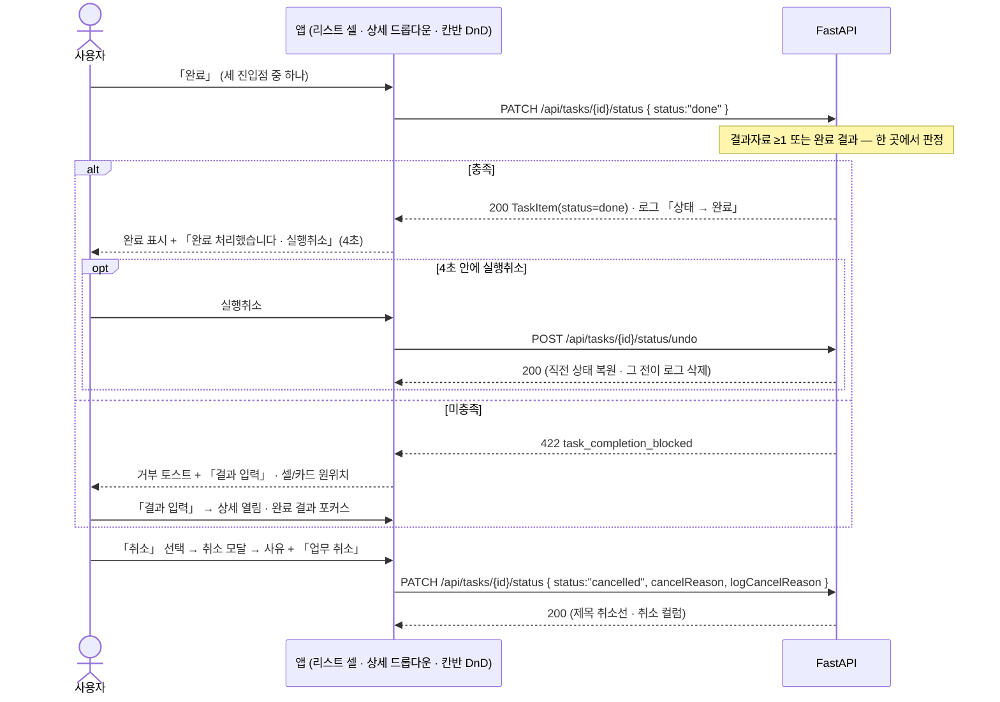
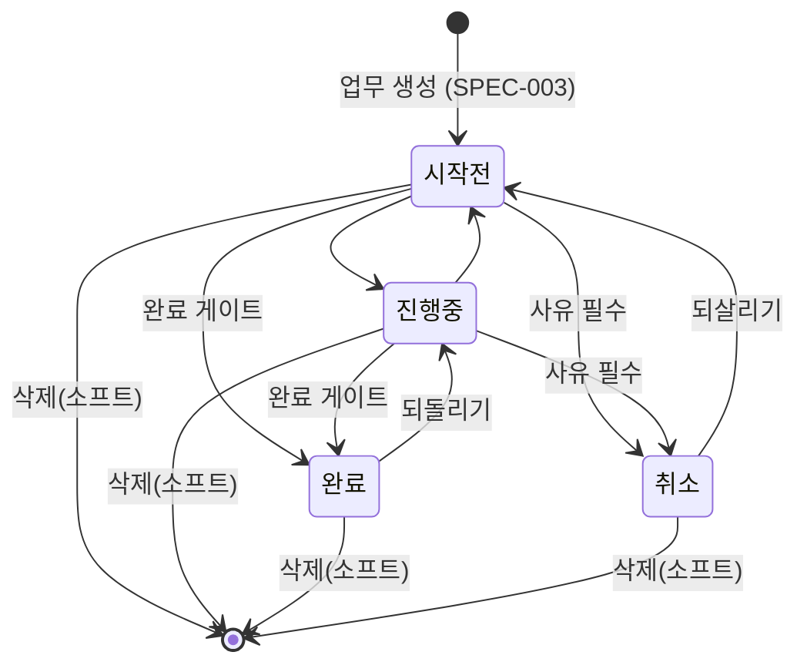

# 내 업무 — 상태 전이 · 완료 게이트 · 리스트/칸반

업무를 **시작전 → 진행중 → 완료**로 보내고, 필요하면 취소하거나 지운다. **완료는 그냥 되지 않는다** — 결과자료 1건이나 완료 결과가 있어야 넘어간다. 같은 목록을 리스트와 칸반 두 뷰로 보고, 기간·유형·상태로 좁힌다.

> 기능/정책 묶음 단위의 **외부 계약** 문서다. client / QA / 외부 통합이 이 문서만 읽고 따를 수 있어야 한다.
> SPEC에는 table schema 전문, ORM field, repository/service 구조, PR 계획, 구현 순서, 라우트·컴포넌트 파일 경로 같은 내부 구현을 두지 않는다.

## 1. Context

### Meta

- Decision reference: DEC-002 §3(상태·삭제) · §4(전이 그래프·**완료 게이트**·지연·삭제) · §5(상태 변경 3지점) · §6(로그) · §7(실행취소)
- Baseline reference: BASE-002 (내 업무)
- Architecture reference: `system/README.md` §흐름 ② · `backend/README.md` §8-2·§10·§12 · `frontend/README.md` §3-4·§3-5·§7 · `database/domains/task.md` T-4~T-8·T-11
- Design reference: `05-status.md` · `07-list-kanban.md` · `01-screens.md` §미설계 · `09-design-tokens.md` · `디자인 시스템.dc.html [02][07][10]` · P-18·P-19·P-25~P-31 · 정정 §A-2·§A-3
- Domain note: 외부에 드러나는 것은 **상태 4종**(`todo`·`in_progress`·`done`·`cancelled`)과 **파생 표시 「지연」**, 그리고 목록의 **기간·필터·정렬·페이지** 축이다
- Open questions: §7

### Business Requirement

- **완료 게이트가 이 spec 의 핵심이다.** 「결과자료 ≥1 또는 완료 결과 작성」 중 하나가 없으면 **완료되지 않는다**(DEC-002 §4). 디자인의 「결과자료가 비어 있어도 완료를 막지 않는다」는 **뒤집혔다**(§A-3).
- 상태를 바꾸는 자리가 셋(리스트 셀·상세 드롭다운·칸반 DnD)이라 **판정이 한 곳에 있어야 한다**(`system/README.md` §흐름 ②). 세 진입점이 같은 규칙을 지나고, 프론트가 먼저 막아도 서버 판정은 그대로 돈다.
- **취소는 상태다.** 유형 축의 「취소」는 제거되고(§A-2), 취소된 업무는 제목 취소선·회색으로 나타난다.

### Scope

In scope:

- 상태 **전이 그래프**와 세 진입점(리스트 상태 셀 팝오버 · 상세 드롭다운 · 칸반 DnD)
- **완료 게이트** — 판정·거부 토스트·완료 유도 흐름 · 완료 토스트와 **실행취소**
- **취소 모달**(600) — 사유 칩 + 로그 기록 체크
- **소프트 딜리트** — 삭제 진입점과 확인 모달(복원은 v1 에 없다)
- **리스트 뷰**(기간·유형 탭·컬럼·페이지네이션) · **칸반 뷰**(4컬럼) · 뷰 전환
- **칸반 DnD 규격** · **카드 컨텍스트 메뉴**
- 필터·정렬 · **빈 상태 3종** · **지연 뱃지** · **스켈레톤**
- 내 업무 영역 **반응형**(P-28~31 을 유동 기준으로 재해석)

Out of scope:

- 업무 생성·상세 편집·첨부·연관업무 — SPEC-003
- 캘린더 표시·드래그 — 배치 ④(기한을 바꾸면 일정이 파생된다는 사실만 참조)
- 회의록에서 오는 상태 변경 요청(DEC-003 §5) — 배치 ③. **같은 엔드포인트를 지나 같은 게이트를 탄다**는 것만 못박는다
- 업무 복원 — **v1 에 없다**(DEC-004 §4 「복구 창구는 v1 에 없다」)
- 업무 목록 검색 — v1 에 없다(SPEC-003 §7)

## 2. UX Contract

### Placement

앱 셸 안의 페이지. 뷰 전환은 쿼리(`?view=list|board`)로 남아 뒤로가기가 산다(FE §1-2).

```text
+──────────────────────────────────────────────────────────+
│ 홈 › 내 업무                                              │
│ 내 업무 28/700   ‹ 2026년 8월 ›     [리스트|칸반] 정렬 필터 [새 업무] │
│ 유형 탭: 전체 24 · 미팅·회의 8 · 개인 업무 9 · 문서·보고 4  │
+──────────────────────────────────────────────────────────+
│ (리스트 표 52px 행)  또는  (칸반 4컬럼)                    │
+──────────────────────────────────────────────────────────+
```

**뷰 전환 선택은 `#1E1E1E`(위치), 필터 칩 선택은 `#F1F2FE + #7181F8`(선택)** — 화면당 Ink 는 하나다([10] · FE §5-2). 유형 탭의 선택 밑줄도 위치 표시라 Ink 를 쓴다 — **뷰 전환과 유형 탭이 같은 화면에 있으므로, 유형 탭 밑줄은 Ink, 뷰 전환은 선택 색으로 두지 않는다**: 위치를 나타내는 한 축만 Ink 를 쓰고(**유형 탭**), 뷰 전환은 세그먼트 컨트롤의 **현재 값 배경 `#F4F5FF` + `#4B52A8`** 로 그린다(§7 참조).

### U-1. 리스트 뷰 (P-18 — 정정 반영)

- **상태**
  - *정상*: 표 컬럼 5 — **업무명(flex) · 유형 170 · 상태 140 · 기한 200 · 메모 120**. 행 52px, 구분선 `#EBEBEB`, hover `#FAFBFC`
  - *로딩*: **U-11 스켈레톤**
  - *빈 상태*: **U-9**
  - *지연 행*: **U-10 지연 뱃지**
  - *취소 행*: 제목 `#9EA2AE` + 취소선, 기한 칸에 사유를 함께 적는다(05-status §취소 처리)
- **문구**
  - 유형 탭: 「전체 n」 + **유형별 n**(SPEC-002 의 동적 유형). **「취소」 탭은 없다** — 취소는 상태다(§A-2). 선택 탭 하단 2px `#1E1E1E`
  - 하단: 「2026년 8월 · n건 중 m건 표시」 + 페이지네이션
  - 기한 칸: 날짜 + D-day(`D-0` `#7181F8` / `D-3` `#757575`). 시간까지 있으면 `08.29 14:00–15:00`. 기한이 없으면 **빈칸**(DEC-002 §3 · T-1-a)
- **CTA**: 행 클릭 → 상세 드로어(SPEC-003 U-3) · **상태 셀 클릭 → U-3 팝오버** · 행 우클릭 → **U-5 컨텍스트 메뉴** · 헤더 「새 업무」 → 생성 드로어
- **기대 결과**: **기본 뷰는 리스트**이고 **월 단위**다. 이전 달은 기간 스테퍼로만 본다(07-list-kanban). **기한이 없는 업무는 생성일 기준 달에 속한다**(T-1-a)

### U-2. 칸반 뷰 (P-19)

- **상태**
  - *정상*: 4컬럼 — **시작전 / 진행중 / 완료 / 취소**. 컬럼 배경 `#F9FAFB` r16. 카드 w320 r8: 유형 배지 → 제목 → 메타(기한·D-day·메모 수)
  - *완료 컬럼*: 헤더에 건수 대신 「8월 12」(월 기준), 하단에 「8월 완료 12건 · 이전 달은 기간 이동으로 보기」
  - *취소 컬럼*: 카드에 취소일과 사유를 함께 적는다
  - *빈 컬럼*: 「없음」 캡션만(U-9)
  - *드래그 중*: **U-4**
- **문구**: 시작전·진행중 컬럼 하단에만 「업무 추가」 점선 버튼 — 누르면 생성 드로어가 열리고 **상태는 항상 시작전**이다(03-create-task §진입)
- **CTA**: 카드 클릭 → 상세 드로어 · 카드 우클릭 → **U-5** · 카드 드래그 → **U-4**
- **기대 결과**: 리스트와 **같은 기간·필터**를 본다. 뷰를 바꿔도 조건이 유지된다(쿼리로 남는다)

### U-3. 상태 변경 팝오버 (P-25)

세 진입점 중 둘(리스트 상태 셀 · 상세 헤더 드롭다운)이 이 규격을 공유한다.

- **상태**: 트리거 좌측 정렬, 아래 8px. 항목 4개 — 시작전 / 진행중 / 완료 / (구분선) / 취소. **「지연」은 목록에 없다**(표시 전용 — T-4). 현재 값 배경 `#F4F5FF` + 상태색 텍스트
  - *전이 불가 항목*: **비활성 + 회색**(예: 완료 상태에서 「취소」). 눌러도 아무 일이 없고 항목 아래 캡션 「완료는 진행중으로 되돌린 뒤 취소할 수 있습니다」
- **문구**: 상태 이름 그대로
- **CTA**: 항목 클릭 → 전이 요청. 확인 버튼 없음(고르기는 팝오버 — [10]). 「취소」를 고르면 **U-7 취소 모달**이 열린다(팝오버가 먼저 닫힌다 — 겹치지 않는다)
- **기대 결과**: 성공하면 셀·헤더 표시가 바뀌고 **로그에 「상태 A → B」가 남는다**. 완료로 갈 때는 **U-6 게이트**를 지난다. **낙관적으로 먼저 바꾸지 않는다**(FE §3-4 — 서버가 거부할 수 있다)

### U-4. 칸반 DnD 규격 — 미설계 확정 (DEC-002 OQ-2)

디자인이 없던 자리다. 토큰만으로 그린다 — 새 색을 만들지 않고 **선택 색(`#F1F2FE`/`#7181F8`)과 행 구분색**만 쓴다([10] 「검정은 위치, 보라는 선택」).

- **상태**
  - *드래그 시작*: 잡은 카드가 **고스트**가 된다 — 원래 크기 유지, 그림자 `0 16px 40px rgba(0,0,0,0.16)`(팝오버 그림자), 살짝 기울이지 않는다(회전 효과 없음)
  - *원래 자리*: **플레이스홀더** — 1px 점선 `#C9D1FB` + 배경 `#F8FAFF`, 카드와 같은 높이
  - *드롭 가능 컬럼*: 컬럼 배경이 `#F1F2FE` 로 바뀌고 1px `#7181F8` 테두리. 삽입 위치에 2px `#7181F8` 가이드선
  - *드롭 불가 컬럼*: 전이 그래프가 막는 컬럼(예: 완료 → 취소)은 **배경 그대로 + 불투명도 0.5**, 커서 `not-allowed`. **놓을 수 없다**
  - *완료 컬럼으로 끌 때*: 컬럼은 드롭 가능으로 보인다. **게이트 판정은 놓은 뒤 서버가 한다**(U-6) — 미충족이면 카드가 **원래 컬럼으로 돌아가고** 거부 토스트가 뜬다
  - *놓은 직후*: 서버 응답까지 그 자리를 **로딩 상태**로 유지한다(카드 불투명도 0.6). 낙관적으로 옮기지 않는다(FE §3-4)
- **문구**: 드롭 불가 컬럼 위에 툴팁 「완료는 취소할 수 없습니다 · 먼저 진행중으로 되돌리세요」(해당 조합에서만)
- **CTA**: **드래그는 유일한 경로가 아니다** — 같은 전이를 카드 우클릭(U-5)이나 상세 드롭다운(U-3)에서 할 수 있다([10] 「단축키로 되더라도 화면에는 항상 버튼」의 결)
- **기대 결과**: 성공하면 카드가 목표 컬럼에 들어가고 로그가 남는다. 완료면 **U-6 완료 토스트**가 뜬다. 실패하면 **원위치**하고 사유 토스트가 뜬다

### U-5. 카드·행 컨텍스트 메뉴 — 미설계 확정 (DEC-002 OQ-3)

- **상태**: 우클릭 위치에 **팝오버 220**. 항목 — 「열기」 / 구분선 / 상태 4항목(현재 값에 체크, 전이 불가 항목은 비활성) / 구분선 / 「**삭제**」(`#E2685B`)
  - 리스트 행에서도 같은 메뉴가 열린다(행 우클릭). **행 끝에 `⋯` 버튼을 따로 두지 않는다** — 컬럼을 늘리면 1280 에서 먼저 잘린다
- **문구**: 위와 같다
- **CTA**: 「열기」 → 상세 드로어 · 상태 항목 → U-3 과 같은 전이(취소면 U-7 모달) · 「삭제」 → **U-8 확인 모달**
- **기대 결과**: 마우스가 없는 경로도 남는다 — 상세를 열면 헤더 `⋯` 에 같은 항목(「삭제」)이 있다(P-22)

### U-6. **완료 게이트** — 세 진입점 공통 (DEC-002 OQ-1 의 흐름·토스트 확정)

**판정은 하나다.** 리스트 상태 셀 · 상세 드롭다운 · 칸반 DnD 어디서 완료로 보내도 **같은 요청, 같은 판정**을 지난다(DEC-002 §4 · `system/README.md` §흐름 ②).

- **판정**: `결과자료 ≥ 1` **또는** `완료 결과가 비어 있지 않음` → 완료. 둘 다 없으면 **상태가 바뀌지 않는다**
- **상태**
  - *충족*: 즉시 완료로 바뀐다. 칸반이면 완료 컬럼 **최상단에 「방금」 표시**로 삽입되고 테두리 `#7181F8` + 강한 그림자
  - *미충족*: **아무것도 바뀌지 않는다.** 리스트 셀은 원래 값, 칸반 카드는 원래 컬럼, 상세 드롭다운은 원래 상태
- **문구**
  - *완료 토스트*: 「**완료 처리했습니다**」 + 「**실행취소**」(`#A6CDFF`) — 400×56 `#1E1E1E`, 하단 중앙 60px 위, **4초**(P-26)
  - *거부 토스트*: 「**완료하려면 결과자료 1건 또는 완료 결과가 필요합니다**」 + 「**결과 입력**」 — 같은 규격, **6초**(할 일이 있는 토스트라 4초보다 길다). 실행취소를 붙이지 않는다
- **CTA**: 거부 토스트의 「결과 입력」 → **그 업무의 상세를 열고 「결과자료 · 완료 결과」 카드로 스크롤 + 완료 결과 입력에 포커스**(SPEC-003 U-6 의 유도 진입)
- **기대 결과**
  - 완료: 로그에 「상태 진행중 → 완료」. **실행취소**를 누르면 직전 상태로 돌아가고 **그 전이 로그도 사라진다**(05-status §완료 3). 4초가 지나면 실행취소는 사라지고 이후에는 일반 전이로 되돌린다
  - 거부: 로그가 남지 않는다. 같은 업무를 다시 완료로 보내도 조건이 채워질 때까지 계속 거부된다

### U-7. 취소 모달 (P-27)

「되돌리기 어려운 결정 하나」라 **모달 600**이다([10]). 팝오버·드로어가 열려 있으면 **먼저 닫고** 연다(FE §6-2).

- **상태**: 사유 칩 4 — 「일정 연기」 / 「요건 변경」 / 「중복 업무」 / 「직접 입력」. 「직접 입력」을 고르면 textarea 가 나타난다. 「취소 사유를 로그에 기록」 체크(**기본 켜짐** — DEC-002 §6)
  - *확인 가능*: 사유 칩 하나가 선택됐고, 직접 입력이면 1자 이상
- **문구**: 제목 「업무를 취소할까요?」 / 요약 「취소한 업무는 목록에 남고, 제목에 취소선이 표시됩니다.」
- **CTA**: 「닫기」 · 「**업무 취소**」(`#1E1E1E`)
- **기대 결과**: 취소되면 제목 취소선 + 회색, 칸반 취소 컬럼으로 이동, 기한 칸에 사유 표시. 로그에 「상태 A → 취소」와 (체크 시) 「취소 사유 기록」. **취소는 되살릴 수 있다** — 「시작전」으로만(전이 그래프)

### U-8. 삭제 확인 모달 (600) — 미설계 확정 (DEC-002 OQ-4)

- **상태**: 모달 600. SPEC-001 U-5·SPEC-002 U-6 과 같은 프레임(제목 → 요약 → 경고 슬롯 → 취소/삭제)
- **문구**
  - 제목 「**'<제목>' 업무를 삭제할까요?**」
  - 요약 「목록·칸반에서 사라지고 집계에서도 빠집니다. 할일·메모·첨부·로그도 함께 보이지 않게 됩니다.」
  - 경고 슬롯 「**v1 에는 복원 화면이 없습니다.**」(DEC-004 §4 「복구 창구는 v1 에 없다」)
- **CTA**: 「취소」 · 「**삭제**」(`#E2685B`)
- **기대 결과**: 삭제하면 목록·칸반·집계에서 즉시 빠진다. **취소(상태)와 다르다** — 취소는 목록에 남고 삭제는 사라진다(DEC-002 §4)

### U-9. 빈 상태 3종 — 미설계 확정 (DEC-002 OQ-3)

| 자리 | 문구 | CTA |
|---|---|---|
| **이번 달 업무 없음** | 「2026년 8월에 등록된 업무가 없습니다」 | 「새 업무」 + 「이전 달 보기」(기간 스테퍼로 이동) |
| **필터 결과 없음** | 「조건에 맞는 업무가 없습니다」 + 캡션 「유형·상태 필터를 지우면 n건이 보입니다」 | 「**필터 지우기**」 |
| **칸반 컬럼 비어 있음** | 컬럼 안 「없음」 캡션 12/`#9EA2AE` | 없음(시작전·진행중 컬럼은 「업무 추가」 버튼이 이미 있다) |

- 공용 빈 상태 규격(S-25)을 쓴다 — 아이콘 + 문구 + 행동 진입점. **아이콘을 새로 만들지 않는다**
- **빈 상태를 오류처럼 그리지 않는다.** 실패(5xx·네트워크)는 빈 목록이 아니라 실패 표시 + 재시도다(DEC-003 §7 승계 · FE §3-5)

### U-10. 지연 뱃지 — 미설계 확정 (DEC-002 OQ-3)

- **상태**: 기한이 지났고 완료·취소가 아니면 **자동**으로 붙는다(T-4 — 저장하지 않고 조회 시 파생)
  - 리스트: 기한 칸의 D-day 자리에 「**n일 지남**」 `#E2685B`. 상태 셀은 원래 상태 그대로다(지연은 상태가 아니다)
  - 칸반 카드: 메타 줄의 기한 옆에 같은 문구
  - 상세: 헤더 기한 옆에 같은 문구
- **문구**: 「1일 지남」 · 「12일 지남」
- **CTA**: 없다. **사용자가 「지연」을 고를 수 없다**(05-status)
- **기대 결과**: 완료·취소로 보내면 즉시 사라진다. 기한을 미루면 사라진다

### U-11. 스켈레톤 — 미설계 확정 (DEC-002 OQ-3)

- **상태**: 리스트는 행 52px 자리에 회색 블록 8줄, 칸반은 컬럼마다 카드 자리 3개. 색 `#F1F2F5`, **애니메이션 없음**
- **문구**: 없다. 「불러오는 중…」 문구를 쓰지 않는다
- **CTA**: 없다
- **기대 결과**: 첫 로딩에만 뜬다. **필터·기간을 바꿀 때는 이전 결과를 유지한 채** 위에 얇은 진행 표시만 둔다 — 화면이 매번 비면 비교가 끊긴다

### U-12. 필터 · 정렬 · 기간

- **상태**
  - 기간 스테퍼 「‹ 2026년 8월 ›」 + 「오늘」 — 항상 노출한다([10] 「스코프 표시 필수」)
  - 유형 탭(전체 + 동적 유형) — **리스트·칸반 공통**
  - 헤더 필터: 리스트는 **상태**, 칸반은 **프로젝트**(칸반은 컬럼이 이미 상태 축이라 상태 필터를 두지 않는다)
  - 정렬(리스트만): 「기한 빠른 순」(기본) / 「기한 늦은 순」 / 「최근 등록순」
  - 활성 필터가 있으면 타이틀 옆에 **필터 칩**(`#F1F2FE`+`#7181F8`)과 「필터 n ✕」
- **문구**: 위와 같다
- **CTA**: 탭·칩·정렬 모두 팝오버 또는 탭 클릭 즉시 반영. **「적용」 버튼을 두지 않는다**
- **기대 결과**: 유형 탭과 헤더 필터는 **AND** 로 동작한다(07-list-kanban). 조건은 쿼리에 남아 뒤로가기와 새로고침에서 산다(FE §1-2). **기한 없는 업무는 기본 정렬에서 맨 아래**다(T-1-a)

### U-13. 반응형 (P-28~31 을 유동 기준으로 재해석)

1920 실측 좌표는 **비율의 참고값**이다. `position:absolute` 로 박지 않는다(§C Q-34 · §A-13).

| 구간 | 리스트 | 칸반 |
|---|---|---|
| **< 1280** | 최소 폭 안내 화면(SPEC-000 U-2) | 〃 |
| **1280 ~ 1439** | 사이드바 숨김 + 햄버거, 여백 48. **메모 컬럼을 숨긴다** | 컬럼 **320 고정 + 가로 스크롤**. 리스트로 자동 전환하지 않는다 |
| **≥ 1440** | 사이드바 200, 여백 80 → 240 연속 보간. 전체 컬럼 | 4컬럼 `1fr`(최소 240) |

- **디자인의 「1280 에서 시작일 컬럼 숨김」(P-29)은 그대로 쓸 수 없다** — 시작일 컬럼이 없어졌다(기한 하나로 정리 — §A-4). 대신 **메모 컬럼**을 숨긴다: 업무명·유형·상태·기한은 목록의 판단 근거이고 메모 수는 보조 정보다
- 상세 드로어의 전체 화면 전환은 SPEC-003 U-11

## 3. User Scenario

### S-1. 사용자 — 리스트에서 진행중으로 바꾼다

1. 리스트 행의 상태 셀을 누른다 → 팝오버가 열리고 현재 값 「시작전」에 배경이 있다.
2. 「진행중」을 고른다 → 셀이 바뀌고 로그에 「상태 시작전 → 진행중」이 남는다.

### S-2. 사용자 — 결과 없이 완료하려 한다

1. 결과자료도 완료 결과도 없는 업무의 상태 셀에서 「완료」를 고른다.
2. **상태가 바뀌지 않고** 「완료하려면 결과자료 1건 또는 완료 결과가 필요합니다」 토스트가 뜬다.
3. 토스트의 「결과 입력」을 누른다 → 그 업무 상세가 열리고 「결과자료 · 완료 결과」 카드로 스크롤되며 입력에 포커스가 잡힌다.
4. 한 줄 적고 포커스를 벗어난다(저장됨).
5. 다시 「완료」를 고른다 → **완료된다.** 「완료 처리했습니다 · 실행취소」 토스트가 4초 뜬다.

### S-3. 사용자 — 실행취소한다

1. 완료 직후 토스트의 「실행취소」를 누른다.
2. 상태가 **직전 값(진행중)** 으로 돌아가고 **완료 로그도 사라진다.**
3. 4초가 지난 뒤에는 실행취소가 없다 — 상태 팝오버에서 「진행중」을 골라 되돌린다.

### S-4. 사용자 — 칸반에서 끌어 옮긴다

1. 「시작전」 카드를 잡는다 → 고스트가 따라오고 원래 자리에 점선 플레이스홀더가 남는다.
2. 「진행중」 컬럼 위로 가면 컬럼이 선택 색으로 바뀌고 삽입 가이드선이 보인다.
3. 놓는다 → 카드가 잠깐 로딩 상태였다가 그 자리에 들어간다.
4. 「완료」 컬럼으로 끌어 놓았는데 결과가 없으면 → 카드가 **원래 컬럼으로 돌아가고** 거부 토스트가 뜬다.

### S-5. 사용자 — 완료된 카드를 취소하려 한다

1. 「완료」 컬럼 카드를 「취소」 컬럼으로 끈다 → **취소 컬럼이 흐려지고 놓이지 않는다.** 툴팁이 이유를 알린다.
2. 카드를 우클릭해 「진행중」으로 되돌린 뒤 「취소」를 고른다 → **취소 모달**이 열린다.
3. 사유 「요건 변경」을 고르고 「업무 취소」 → 제목에 취소선이 생기고 취소 컬럼으로 간다.

### S-6. 사용자 — 업무를 지운다

1. 리스트 행을 우클릭 → 「삭제」.
2. 확인 모달에 「v1 에는 복원 화면이 없습니다」 경고가 보인다.
3. 「삭제」 → 목록에서 사라진다. 취소된 업무와 달리 **목록에 남지 않는다.**

### S-7. 사용자 — 기간과 필터를 바꾼다

1. 기간 스테퍼로 지난달을 본다 → 목록이 그 달로 바뀌고 하단 카운트도 바뀐다.
2. 유형 탭 「문서·보고」 + 상태 필터 「진행중」을 건다 → **AND** 로 좁혀진다.
3. 결과가 없으면 「조건에 맞는 업무가 없습니다」 + 「필터 지우기」가 보인다.
4. 「칸반」으로 바꿔도 **같은 기간·유형 조건**이 유지된다. 새로고침해도 그대로다.

### S-8. 사용자 — 기한이 지난 업무를 본다

1. 기한이 어제인 진행중 업무의 기한 칸에 「1일 지남」이 `#E2685B` 로 보인다.
2. 상태 셀은 여전히 「진행중」이다 — **지연은 상태가 아니다.**
3. 완료로 보내면 그 표시가 사라진다.

## 4. Interface Contract

### API Contract

| Method | Path | 요약 | 권한 |
|---|---|---|---|
| GET | `/api/tasks` | 목록(기간·필터·정렬·페이지) | 세션 |
| PATCH | `/api/tasks/{id}/status` | **상태 전이 — 세 진입점 공통** | 세션 |
| POST | `/api/tasks/{id}/status/undo` | 마지막 전이 되돌리기(실행취소) | 세션 |
| DELETE | `/api/tasks/{id}` | 업무 삭제(소프트) | 세션 |

- **상태 전이는 전용 엔드포인트다** — 게이트 판정이 붙기 때문에 일반 `PATCH` 에 섞지 않는다(`backend/README.md` §10). 리스트 셀·상세 드롭다운·칸반 DnD·(배치 ③의) 회의록 요청이 **전부 이 하나를 지난다**
- **복원 엔드포인트가 없다**(DEC-004 §4)
- 기한 변경은 SPEC-003 의 일반 `PATCH` 다. 캘린더 드래그도 같은 곳으로 온다(DEC-005 §3 · BE-10)

### Request / Response

에러는 여기 두지 않는다 — **Case Matrix 가 단일 SoT** 다.

**`GET /api/tasks`**

쿼리: `from`·`to`(달 경계, UTC) · `workTypeId` · `status` · `projectId` · `sort`(`due_asc`(기본)·`due_desc`·`created_desc`) · `page`·`size`

```json
{
  "items": [
    {
      "id": 101, "title": "제품 소개서 내용 업데이트", "status": "in_progress",
      "workType": { "id": 3, "name": "문서·보고", "colorToken": "steel", "isDeleted": false },
      "project": { "id": 7, "name": "9월 요금제 개편", "colorToken": "violet", "isDeleted": false },
      "dueDate": "2026-08-29", "dueStartTime": null, "dueEndTime": null,
      "dDay": -1, "isOverdue": true, "overdueDays": 1,
      "memoCount": 2, "todoProgress": { "done": 2, "total": 5 },
      "cancelReason": null, "cancelledAt": null
    }
  ],
  "total": 24, "page": 1, "size": 12,
  "typeCounts": [ { "workTypeId": null, "name": "전체", "count": 24 }, { "workTypeId": 3, "name": "문서·보고", "count": 4 } ]
}
```

- **`typeCounts` 는 기간 조건만 반영하고 유형 탭 자신은 반영하지 않는다** — 탭에 붙는 수가 탭을 누를 때마다 흔들리면 안 된다. 다른 필터(상태·프로젝트)는 반영한다
- `isOverdue`·`overdueDays`·`dDay`·`todoProgress` 는 **파생값**이다(T-4 · G-7). 화면이 다시 계산하지 않는다
- **소프트 딜리트된 업무는 응답에 없다**(T-11)

**`PATCH /api/tasks/{id}/status`**

```json
// 요청
{ "status": "done" }
{ "status": "cancelled", "cancelReason": "요건 변경", "logCancelReason": true }

// 200 — 갱신된 업무 항목(목록 항목과 같은 형태)
```

- `cancelReason` 은 `status: "cancelled"` 일 때만 받는다(T-7)
- `logCancelReason` 기본값 **참**(DEC-002 §6)

**`POST /api/tasks/{id}/status/undo`** → `200` 갱신된 업무 항목

- **마지막 상태 전이 한 건**을 되돌리고 **그 전이 로그를 지운다**(05-status §완료 3)
- 되돌릴 수 있는 조건: ① 마지막 로그가 상태 전이이고 ② 그 뒤에 다른 변경이 없으며 ③ 전이 후 **4초 이내**. 아니면 거부(§Case Matrix)

**`DELETE /api/tasks/{id}`** → `204`

### Validation

| 필드 | 규칙 |
|---|---|
| `status` | **필수**. `todo` · `in_progress` · `done` · `cancelled` 중 하나. **「지연」은 값이 아니다**(T-4) |
| 전이 | 그래프 안이어야 한다 — `todo→in_progress\|done\|cancelled` · `in_progress→done\|todo\|cancelled` · `done→in_progress` · `cancelled→todo`. **`done→cancelled` 불가**(DEC-002 §4 · T-6) |
| 완료 전이 | **결과자료 ≥1 또는 `completionResult` 가 비어 있지 않아야 한다**(T-5) |
| `cancelReason` | `cancelled` 로 갈 때 **필수**, 1~500자. 다른 상태에서는 보내면 거부 |
| `sort` | `due_asc` · `due_desc` · `created_desc` 중 하나. 기본 `due_asc`(**기한 없는 업무는 맨 아래**) |
| `from`·`to` | 함께 온다. 기본은 이번 달 |

### Case Matrix

이 spec 의 모든 에러·경계가 여기 있다. **완료 거부는 여기와 U-6 양쪽에 같은 문구로 박혀 있다.**

| 에러 코드 | 백엔드 출력 | 프론트 출력 | 표시 위치 |
|---|---|---|---|
| `task_completion_blocked` | `422 {detail:"완료하려면 결과자료 1건 또는 완료 결과가 필요합니다", code:"task_completion_blocked"}` · **상태가 바뀌지 않는다** | **거부 토스트**(6초) 같은 문구 + 「결과 입력」 CTA → 상세의 「결과자료 · 완료 결과」로 스크롤·포커스. 리스트 셀·상세 드롭다운은 원래 값, **칸반 카드는 원래 컬럼으로 원위치** | 화면 하단 토스트 (세 진입점 공통) |
| `invalid_status_transition` | `409 {detail:"이 상태로는 바꿀 수 없습니다", code:"invalid_status_transition"}` | 토스트 「완료는 진행중으로 되돌린 뒤 취소할 수 있습니다」(그 조합) 또는 일반 문구. 드롭다운·카드는 원래 값으로 | 화면 하단 토스트 |
| `validation_error` | `422 {detail:"입력값을 확인해 주세요", code:"validation_error"}` | 취소 모달 안 인라인 「취소 사유를 입력해 주세요」. **모달이 닫히지 않는다** | 취소 모달 |
| `undo_not_available` | `409 {detail:"되돌릴 수 있는 시간이 지났습니다", code:"undo_not_available"}` | 토스트 같은 문구 + 「상태에서 직접 되돌릴 수 있습니다」 | 화면 하단 토스트 |
| `not_found` | `404 {detail:"업무를 찾을 수 없습니다", code:"not_found"}` | 토스트 + 목록 갱신(다른 곳에서 지워진 경우) | 화면 하단 토스트 |
| (목록 조회 실패 — 5xx·네트워크) | 전파 | **빈 목록으로 대체하지 않는다.** 표 자리에 실패 표시 + 「다시 시도」 버튼 | 목록 영역 |
| `token_expired` / `invalid_refresh_token` | SPEC-001 §4 | SPEC-001 §4 | — |

- **`schedule_overlap` 은 이 spec 에 없다** — 상태 전이는 시간을 건드리지 않는다. 기한 변경은 SPEC-003 §4
- **거부는 정상 경로다.** 그래서 완료·취소·DnD 어디서도 낙관적 갱신을 하지 않는다(FE §3-4)

### Flow



### State / Lifecycle



- **완료 → 취소는 없다**(DEC-002 §4). 먼저 진행중으로 되돌린다
- **「지연」은 상태가 아니다** — 기한 경과 + 완료·취소 아님으로 **조회 시 파생**한다(T-4). 저장하지 않으므로 전이도 없다
- **삭제는 상태가 아니다** — 소프트 딜리트이고, 취소(업무의 종결 상태)와 구분된다(DEC-002 §4). **복원 전이는 v1 에 없다**

### Data Contract

| 리소스 | 외부에 드러나는 필드 |
|---|---|
| 목록 항목 | `id` · `title` · `status` · `workType`(요약) · `project`(요약·null 가능) · `dueDate` · `dueStartTime` · `dueEndTime` · `dDay` · `isOverdue` · `overdueDays` · `memoCount` · `todoProgress` · `cancelReason` · `cancelledAt` |
| 목록 응답 | `items` · `total` · `page` · `size` · `typeCounts` |
| 상태 값 | `todo` · `in_progress` · `done` · `cancelled` (영문 소문자 저장·전송, 한국어는 표시 매핑 — G-4) |

- 유형 색은 **팔레트 토큰명**(SPEC-002 §4). 삭제된 유형·프로젝트는 `isDeleted: true` 로 실려 이름·색이 그대로 보인다(A-6)
- 기간 조회는 **UTC 경계**로 보낸다(G-2). 표시 변환은 화면이 한 곳에서 한다

## 5. Implementation Rules

- **완료 게이트 판정은 한 곳이다.** 세 진입점이 같은 엔드포인트를 지나고, 서비스가 판정한다. **프론트가 먼저 막아도 서버 판정은 그대로 돈다** — 화면 검사는 편의이고 계약이 아니다(`system/README.md` §흐름 ②). 배치 ③ 의 회의록 경로도 **게이트를 우회하지 않는다**(BE §8-3)
- **전이 그래프도 서비스가 검사한다.** 위반은 `invalid_status_transition` 이고, 화면은 비활성으로 미리 알리되 그것이 판정은 아니다
- **모든 전이는 로그 한 줄과 같은 트랜잭션이다**(T-8 · DEC-002 §6). 로그 없는 전이가 없고, **실행취소는 그 로그를 지운다** — 4초 안에 무른 일을 이력으로 남기면 로그가 시끄러워진다(05-status §완료 3)
- **낙관적 갱신을 하지 않는다** — 완료 게이트·전이 그래프가 거부할 수 있다(FE §3-4). 칸반은 **드래그 고스트가 즉각성을 주고**, 놓은 뒤 응답까지 그 자리를 로딩으로 유지한다
- **드롭 자체를 막는 것과 서버 판정은 별개다.** 전이 그래프로 막히는 컬럼은 애초에 드롭되지 않지만, **정본은 서버 검사**다. 완료 컬럼은 드롭을 허용하고 게이트가 판정한다 — 결과자료 유무를 화면이 미리 판단해 드롭을 막으면 서버와 어긋날 수 있다
- **「지연」을 저장하지 않는다.** 조회 시 파생하고 화면은 응답의 파생값을 그대로 그린다(G-7)
- **삭제는 소프트다.** 목록·칸반·집계에서 빠지고 자식 행은 지우지 않는다(T-11). **복원 경로를 만들지 않는다**
- **목록 갱신 범위** — 상태 전이·삭제 뒤에는 업무 목록을 다시 읽는다. **기한이 바뀐 게 아니면 일정 관련 캐시를 건드리지 않는다**(FE §3-3 무효화 표)
- **기간·필터·정렬·뷰는 쿼리에 있다**(FE §1-2). 컴포넌트가 자체 상태로 들고 있지 않는다
- **소유 검사가 먼저다.** 남의 업무는 404

## 6. Verification

### Acceptance Criteria

앱 창에서 사람이 직접 확인하는 문장으로 적는다.

- [ ] 리스트 상태 셀에서 「진행중」을 고르면 셀이 바뀌고 상세 로그에 「**상태 시작전 → 진행중**」이 생긴다
- [ ] 결과자료도 완료 결과도 없는 업무를 **리스트 셀**에서 완료로 보내면 상태가 바뀌지 않고 「**완료하려면 결과자료 1건 또는 완료 결과가 필요합니다**」 토스트가 뜬다
- [ ] 같은 업무를 **상세 드롭다운**에서 완료로 보내도 **같은 문구로 거부**된다
- [ ] 같은 업무를 **칸반에서 완료 컬럼으로 끌어 놓아도** 카드가 원래 컬럼으로 돌아가고 같은 문구가 뜬다
- [ ] 거부 토스트의 「**결과 입력**」을 누르면 그 업무 상세가 열리고 완료 결과 입력에 **포커스**가 잡힌다
- [ ] 완료 결과를 적은 뒤 완료로 보내면 **완료되고** 「완료 처리했습니다 · 실행취소」 토스트가 4초 뜬다
- [ ] **실행취소**를 누르면 직전 상태로 돌아가고 **완료 로그도 사라진다**
- [ ] 4초가 지난 뒤 실행취소를 시도하면 「되돌릴 수 있는 시간이 지났습니다」가 뜬다
- [ ] 완료된 카드를 **취소 컬럼으로 끌면 놓이지 않고**, 우클릭 메뉴의 「취소」도 비활성이다
- [ ] 진행중으로 되돌린 뒤 「취소」를 고르면 **취소 모달(600)** 이 뜨고, 사유 없이는 「업무 취소」가 눌리지 않는다
- [ ] 취소한 업무는 제목에 **취소선**이 생기고 칸반 취소 컬럼으로 간다. **목록에서 사라지지는 않는다**
- [ ] 행 우클릭 → 「삭제」 → 확인 모달에 「**v1 에는 복원 화면이 없습니다**」가 보이고, 삭제하면 **목록에서 사라진다**
- [ ] 기한이 지난 진행중 업무에 「**n일 지남**」이 붉게 보이고, 상태는 여전히 「진행중」이다
- [ ] 유형 탭 + 상태 필터를 함께 걸면 **둘 다 만족하는 것만** 남고, 결과가 없으면 「조건에 맞는 업무가 없습니다 · 필터 지우기」가 보인다
- [ ] 「칸반」으로 바꿔도 **기간·유형 조건이 유지**되고, 새로고침해도 그대로다
- [ ] 첫 로딩에 **스켈레톤**이 보이고, 필터를 바꿀 때는 이전 결과가 유지된 채 진행 표시만 뜬다
- [ ] 창을 1280~1439 로 줄이면 리스트에서 **메모 컬럼이 숨고**, 칸반은 컬럼 320 고정 + **가로 스크롤**이 된다(리스트로 자동 전환되지 않는다)
- [ ] 서버를 내린 채 목록을 열면 **빈 목록이 아니라** 실패 표시 + 「다시 시도」가 보인다

## 7. Open Questions

### 이 spec 이 닫은 것

| 닫힌 항목 | 무엇으로 닫았나 |
|---|---|
| **DEC-002 OQ-1**(완료 결과 입력 UI · **완료 거부 토스트 문구/규격**) | **U-6 에서 확정** — 판정 한 곳 + 거부 토스트 문구(6초·「결과 입력」 CTA) + 유도 진입(상세 스크롤·포커스). 입력 필드 규격은 SPEC-003 U-6. **OQ-1 닫힘** |
| **DEC-002 OQ-2**(칸반 DnD 규격) | **U-4 에서 확정** — 고스트(그림자만, 회전 없음) · 점선 플레이스홀더 `#C9D1FB`/`#F8FAFF` · 드롭 가능 컬럼 `#F1F2FE`+`#7181F8` · 드롭 불가 흐림 + `not-allowed` · 놓은 뒤 로딩 유지(낙관적 금지). 근거: [10] 「검정은 위치, 보라는 선택」(새 색 만들지 않음) · FE §3-4 |
| **DEC-002 OQ-3**(미설계 6종) | ① 빈 상태 → **U-9**(3종 문구·CTA) ② 지연 뱃지 → **U-10**(「n일 지남」 `#E2685B`, 상태 아님) ③ 스켈레톤 → **U-11**(+SPEC-003 U-3) ④ 검색 결과 → **SPEC-003 §7**(목록 검색 v1 없음 / 연관업무 검색은 확정) ⑤ 칸반 드래그 중 → **U-4** ⑥ 카드 컨텍스트 메뉴 → **U-5**. **OQ-3 닫힘** |
| **DEC-002 OQ-4**(업무 삭제 진입점 · 복구 UI) | **U-5·U-8 에서 확정** — 진입점은 **카드/행 우클릭 메뉴**와 **상세 헤더 `⋯`** 두 곳, 확인 모달 600. **복구 UI 는 만들지 않는다**(DEC-004 §4 「복구 창구는 v1 에 없다」). **OQ-4 닫힘** |
| **§A-2 정정**(유형 축의 「취소」 제거) | **U-1 에서 확정** — 유형 탭에서 「취소」를 빼고 상태 필터로 옮겼다. 취소 표시는 제목 취소선 + 회색 |
| **§A-3 정정**(완료를 막지 않는다 → 막는다) | **U-6·§4 에서 확정** — 05-status §완료 4 를 뒤집어 세 진입점 모두 게이트를 지난다 |
| **P-28~31 반응형의 유동 재해석** | **U-13 에서 확정** — 「1280 에서 시작일 컬럼 숨김」이 성립하지 않으므로(§A-4 로 시작일이 사라졌다) **메모 컬럼**을 숨긴다. 칸반은 320 고정 + 가로 스크롤 유지 |

### 남은 것

| ID | Question | Owner | Next |
|---|---|---|---|
| S004-OQ-1 | **`undo_not_available` 코드 신설**과 **실행취소 엔드포인트**. 05-status §완료 3 의 「직전 상태로 복원하고 로그도 되돌린다」를 계약으로 옮기며 전용 표면을 만들었다 — 아키텍처 §8-2 코드 표와 §10 API 표면에 반영이 필요하다. 4초 제한도 spec 이 정한 값이다(토스트 수명과 맞췄다) | 코디 | 아키텍처 갱신 |
| S004-OQ-2 | **뷰 전환을 Ink 로 그리지 않았다.** 디자인은 뷰 전환 선택을 `#1E1E1E` 로 그렸는데(07-list-kanban), 같은 화면에 유형 탭 밑줄도 Ink 라 「화면당 Ink 하나」([10])와 충돌한다. **유형 탭을 Ink 로 두고 뷰 전환은 `#F4F5FF`+`#4B52A8`** 로 정했다 — 디자인 원본 정정이 필요하다 | 사용자(디자인) | 디자인 갱신 |
| S004-OQ-3 | **칸반 헤더 필터를 「프로젝트」로 정했다.** 디자인은 칸반에 「유형 필터」를 뒀는데(07-list-kanban) 유형 탭이 이미 리스트·칸반 공통이라 중복이다. 칸반의 컬럼 축이 상태이므로 남는 축은 프로젝트다 — 정책서에 근거가 없어 spec 판단이다 | 사용자 | DEC-002 갱신 |
| S004-OQ-4 | **정렬 옵션 3종**(기한 빠른 순 기본 / 기한 늦은 순 / 최근 등록순)은 spec 이 정했다. 07-list-kanban 이 「옵션 화면 미설계」로 남긴 자리다 | 사용자 | DEC-002 갱신 |
| S004-OQ-5 | **`typeCounts` 는 유형 탭 자신을 반영하지 않는다**고 정했다(탭 숫자가 흔들리지 않게). 다른 필터는 반영한다 — 집계 정의가 정책서에 없어 spec 판단이다 | 사용자 | DEC-002 갱신 |
