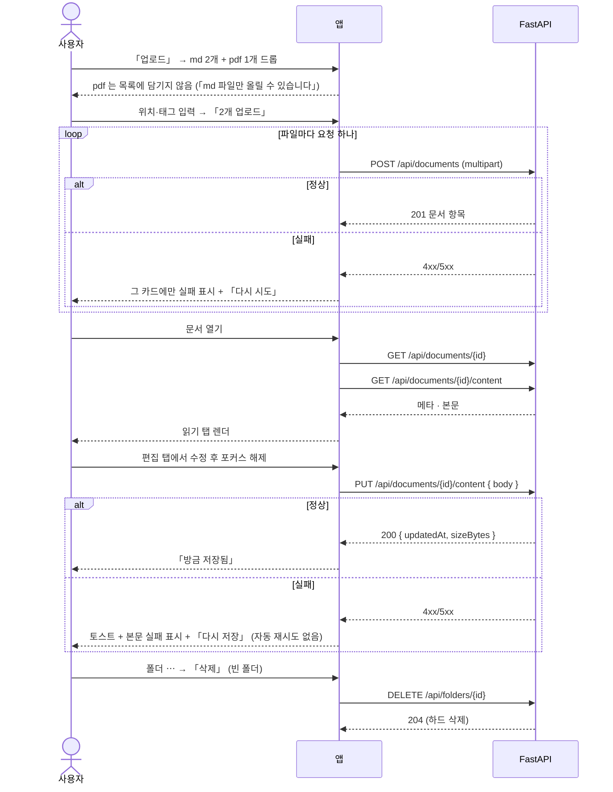
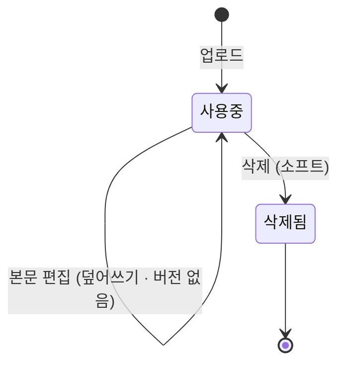

# 문서함 — PARA 트리 · 업로드 · md 상세/편집

**md 파일을 올려 PARA 폴더에 두고, 열어서 읽고, 그 자리에서 고친다.** 문서에 태그를 달고 프로젝트·업무·회의로 연결한다. 새 문서를 앱에서 만들지는 않는다 — v1 의 입구는 업로드뿐이다.

> 기능/정책 묶음 단위의 **외부 계약** 문서다. client / QA / 외부 통합이 이 문서만 읽고 따를 수 있어야 한다.
> SPEC에는 table schema 전문, ORM field, repository/service 구조, PR 계획, 구현 순서, 라우트·컴포넌트 파일 경로 같은 내부 구현을 두지 않는다.

## 1. Context

### Meta

- Decision reference: DEC-004 §1(범위) · §3(필드) · §4(생명주기) · §5(CRUD) · §6(기록) · §7(실패) · §8(연결)
- Baseline reference: BASE-004 (문서함)
- 소비처: DEC-002 §8(업무 참고자료·결과자료가 여기서 md 를 가져간다 — SPEC-003 U-7)
- Architecture reference: `backend/README.md` §8-2·§10 · `frontend/README.md` §1·§3-3·§6·§9 · `database/domains/library.md` L-1~L-16
- Design reference: `14-library.md` · `문서함.dc.html` · `디자인 시스템.dc.html [12][10]` · `09-design-tokens.md` · P-56~P-60 · 정정 §A-11·§A-12·§A-15
- 기술 근거: `orchestration/work/docs-v1/mediness-markdown-study.md`(FE-OQ-4 해소 — `react-markdown` 렌더 + `textarea` 편집)
- Domain note: 외부에 드러나는 것은 **폴더**(PARA 4종 + 하위)와 **문서**(이름·위치·크기·수정 시각·태그·연결·즐겨찾기), 그리고 **본문(md)** 이다
- Open questions: §7

### Business Requirement

- 문서함은 **위키**다 — 문서가 폴더에 놓이고 프로젝트·업무·회의와 연결로 이어진다(14-library). 업무의 참고자료·결과자료가 여기서 온다(DEC-002 §8).
- **폴더 축과 연결 축은 독립**이다(L-2). 프로젝트를 만들어도 폴더가 생기지 않고, 프로젝트 이름을 바꿔도 폴더에 전파되지 않는다.
- v1 은 **md 만, 업로드만**이다(DEC-004 §3·§4). AI 색인·버전·검색·휴지통은 v2 이고 **UI 는 그대로 그리되 비활성**이다(DEC-001 §v2 · SPEC-001 U-2).

### Scope

In scope:

- **PARA 고정 트리**(01 Projects / 02 Areas / 03 Resources / 04 Archive) + 하위 폴더 자유 생성·이름 변경·**삭제(빈 것만)**
- **파일 목록** — 즐겨찾기·이름·연결된 업무·유형·크기·수정일
- **업로드 드로어**(840) — **md 만**, 파일 단위 메타데이터, 「첫 파일 값 모두 적용」, 하단 버튼에서만 업로드
- **문서 상세 3열** — 트리 + 본문(읽기/원문 탭) + 메타데이터·연결 레일
- **문서 편집** — 마크다운 소스 `textarea` + 서식 툴바 + **자동 저장**
- 태그 · **연결(프로젝트·업무·회의)** — 사람이 직접 건다
- **더보기 메뉴** · 문서 삭제(소프트) · 폴더 삭제 진입점
- **v2 항목의 비활성 UI** — AI 색인 상태 · 버전 카드/「버전으로 저장」/「버전 기록」 · 검색 · 휴지통
- 문서함 **반응형**(미설계 — 여기서 확정)

Out of scope:

- 검색 실동작 · 버전 관리 · AI 색인/임베딩/백링크 자동 추출 · 휴지통과 복원 — **v2**(DEC-004 §1·§4)
- **문서 만들기** — 문서함에서도, 회의·업무에서도 v1 에 없다(L-4)
- pdf·docx 등 다른 형식의 업로드·렌더 — v2(L-3)
- 회의록 첨부 경로 — 배치 ③(같은 문서를 참조한다는 사실만 참조)

## 2. UX Contract

### Placement

목록과 문서 화면이 **같은 3열 골격**을 쓴다. 트리는 두 화면이 공유한다(F-9).

```text
[목록]                                  [문서 상세 · 편집]
+──────+──────────────────────────+     +──────+─────────────────+────────+
│ 트리 │ 파일 목록                 │     │ 트리 │ 본문(렌더/소스) │ 레일   │
│ 300  │ (유동)                    │     │ 300  │ (유동)          │ 420    │
│      │                           │     │      │ 읽기·편집·원문  │ 메타·연결 │
│ 용량 │                           │     │      │                 │        │
+──────+──────────────────────────+     +──────+─────────────────+────────+
```

### U-1. 디렉토리 트리

- **상태**
  - *정상*: PARA 4종이 최상위에 고정으로 있고 하위 폴더가 12px 단위로 들여쓰인다(1단 8 / 2단 20 / 3단 32, 파일 44). 단마다 세로 가이드선 `#EBEBEB`(선택 계열 `#C9D1FB`)
  - *현재 위치*: 선택된 폴더·문서에 필 `#F1F2FE`. **문서 선택 필은 상세·편집 화면에서만** 보인다(14-library §트리)
  - *로딩*: 회색 블록 6줄(SPEC-004 U-11 과 같은 규격)
  - *하단*: **사용 용량 바** — 「사용 중 2.4GB」. **분모를 표시하지 않는다** — 상한·차단이 없다(DEC-004 §4 · L-15)
- **문구**: 폴더 이름 그대로. **항목 수를 표시하지 않는다**(14-library §트리)
- **CTA**
  - 폴더 행 우측 `+` → **하위 폴더 추가**(그 자리에 인라인 입력 행이 생긴다. 필드가 하나뿐이라 드로어·모달을 쓰지 않는다 — [10])
  - 폴더 행 hover 우측 `⋯` → **U-8 폴더 메뉴**
  - **헤더에 「새 폴더」 버튼을 두지 않는다**(14-library §트리)
  - 트리 하단의 「즐겨찾기」·「휴지통」 항목 → **v2 안내**(SPEC-001 U-2 규격 — 「v2에서 제공됩니다」)
- **기대 결과**: 폴더를 누르면 우측 목록이 그 폴더의 문서로 바뀐다(`?folder=` 쿼리로 남는다 — FE §1-2). **PARA 4종에는 `⋯` 에 이름 바꾸기·삭제가 없다**(L-1)

### U-2. 파일 목록 (P-56)

- **상태**
  - *정상*: 컬럼 6 — **즐겨찾기 36 · 이름 · 연결된 업무 200 · 유형 110 · 크기 110 · 수정일 130**. 행 52px, hover `#FAFBFC`
  - *빈 폴더*: 「이 폴더에 문서가 없습니다」 + 「업로드」 CTA(공용 빈 상태 S-25)
  - *로딩*: 스켈레톤 8줄
  - *실패*: **빈 목록으로 대체하지 않는다.** 실패 표시 + 「다시 시도」(FE §3-5)
- **문구**
  - 즐겨찾기: 채운 별 `#7181F8` / 미지정 `#C9CBD1` 외곽선. **목록 정렬에만 쓴다** — 즐겨찾기 필터·전용 화면은 v2(L-10)
  - 유형 칸: v1 은 전부 「MD」다(L-3)
  - **「AI 생성」 배지 컬럼은 두되 v1 에서는 뜨지 않는다**(§A-15 · L-9-a) — 문서 입구가 업로드뿐이라 값이 항상 사람이다
  - 헤더의 「파일·폴더 검색」 입력 → **v2 안내**(DEC-004 OQ-4 — 검색은 v2). 입력창을 **숨기지 않는다**
- **CTA**: 행 클릭 → 문서 상세(U-4) · 별 클릭 → 즐겨찾기 토글(즉시 저장) · 헤더 「**업로드**」 → U-3 드로어 · 행 우클릭 → U-7 더보기와 같은 항목
- **기대 결과**: 기본 정렬은 **즐겨찾기 먼저 → 수정일 최신순**이다. 삭제(소프트)된 문서는 보이지 않는다(L-7)

### U-3. 업로드 드로어 (P-60 — 정정 반영)

여러 값을 넣는 편집이라 **드로어 840**이다([10]).

- **상태**
  - *비었을 때*: 드롭 영역 + 「파일 선택」. 안내 「**.md 파일만 올릴 수 있습니다**」(§A 정정 — 디자인의 「.md/.docx/.pdf/이미지」 문구를 바꾼다)
  - *파일 담김*: 파일마다 카드 — 파일명·크기 + **저장 위치**(폴더 셀렉터) · **연결 프로젝트** · **연관 업무** · **태그**(Enter 추가). 미입력 카드에 「메타데이터 미입력」 배지
  - *형식 위반*: **목록에 담기지 않는다.** 드롭·선택 즉시 거부하고 상단에 「md 파일만 올릴 수 있습니다 · <파일명> 제외됨」. **부분 업로드를 하지 않는다**(DEC-004 §7)
  - *업로드 중*: 카드마다 진행 표시. 하단 버튼 비활성
  - *파일 단위 실패*: **그 카드에만** 실패 표시 + 「다시 시도」. **성공한 파일은 그대로 남는다**(DEC-004 §7 · FE §3-5)
- **문구**: 「첫 파일 값 모두 적용」 토글 · 하단 「취소 / **n개 업로드**」
- **CTA**: **업로드는 하단 버튼에서만 일어난다**(DEC-004 §5) — 드롭만으로 올라가지 않는다. 저장 위치가 비어 있으면 그 카드가 표시되고 버튼이 비활성
- **기대 결과**: 성공한 파일이 목록에 나타나고 드로어는 **실패 카드가 남아 있으면 닫히지 않는다**. 전부 성공하면 닫히고 목록이 갱신된다

### U-4. 문서 상세 (P-57)

- **상태**
  - 카드 탭 3 — **읽기 / 편집 / 원문(.md)**. 선택 탭 하단 2px `#1E1E1E`(위치 표시)
  - *읽기*: 마크다운 렌더 본문. 표·체크박스·코드 하이라이트·헤딩 앵커까지 지원한다(mediness 조사 §의존성)
  - *원문(.md)*: 소스를 읽기 전용 모노스페이스로
  - *로딩*: 본문 자리에 스켈레톤. 레일은 먼저 그린다(메타데이터가 본문보다 가볍다)
  - *없는 문서*: 「없는 문서입니다」 + 「문서함으로」. 리다이렉트하지 않는다
- **문구**: 헤더 — 문서 이름 + 「MD」 + 수정 시각 + 크기 + 「연결된 업무 n」. **「읽는 시간」 표시를 두지 않는다**(§7)
- **CTA**: 별 토글(34px) · 「**편집**」(U-5) · 「⋯」(U-7) · 「다운로드(.md)」
- **기대 결과**: 업무 첨부에서 들어오면(SPEC-003 U-7) 이 화면이 열린다. **본문은 별도 요청으로 온다** — 목록·메타에 본문을 싣지 않는다(`backend/README.md` §10)

### U-5. 문서 편집 (P-58) — `textarea` + 자동 저장

**에디터 라이브러리를 쓰지 않는다**(FE-OQ-4 해소). 소스를 그대로 고치고, 문법 기호는 흐리게 보인다.

- **상태**
  - *편집 중*: 본문이 **마크다운 소스**가 되고 상단에 서식 툴바(H2 · B · I · 목록 · 표). 문법 기호(`##` `-` `>` `**` `- [x]`)는 `#B3B3B3` 로 흐리게, 표는 모노스페이스(14-library §문서 화면)
  - 헤더: 회색 칩 「**편집 중**」 + 캡션 「입력을 마치면 자동으로 저장됩니다」 + 연보라 「**편집 완료**」. **검정은 위치 표시 전용이라 상태 칩에 쓰지 않는다**([10])
  - *저장 중*: 캡션이 「저장 중…」
  - *저장됨*: 캡션이 「방금 저장됨」으로 바뀌고 잠시 뒤 원래 문구로
  - *저장 실패*: **SPEC-002 U-7 규격** — 토스트 「저장하지 못했습니다 · 본문」 + 본문 영역 테두리 `#E2685B` + 「저장되지 않았습니다 · 다시 저장」. **자동 재시도 없음**. 입력한 내용은 그대로 남는다
- **문구**: 빈 문서면 플레이스홀더 「마크다운 본문을 입력하세요」
- **CTA**: 「편집 완료」 → 읽기 탭으로. 「**버전으로 저장**」은 자리에 두되 **v2 안내**(DEC-004 §4 — 버전 스냅샷 없음). **저장 버튼을 두지 않는다**([10] 자동 저장)
- **기대 결과**: 포커스를 벗어나면 저장되고 읽기 탭에 즉시 반영된다. **버전이 남지 않는다** — 되돌리기 화면이 없다(L-8)

### U-6. 메타데이터 · 연결 레일

- **상태**: 순서 고정 — **메타데이터 → 연결 → 버전**. 목차를 두지 않는다(14-library)
  - *메타데이터*: 형식(Markdown .md) · **위치**(전체 경로) · 수정 시각 · 크기 · 태그
  - *AI 색인 상태* 행: **v2 안내**(L-9)
  - *연결*: 「나가는 n」 — `PJ`(프로젝트) · `TK`(업무) · `MT`(회의) 배지 행. 사람이 직접 건다(L-13)
  - *백링크*(「이 문서를 참조」) 묶음: **v2 안내**(L-13 — 자동 추출이 없어 v1 에는 채울 값이 없다)
  - *버전 카드*: **v2 안내**
- **문구**: 「위치」는 **트리·breadcrumb 와 같은 문자열**이다 — 「01 Projects / 소개서 개정 / 문서 · 보고」(14-library §경로 일관성). 서버가 만들어 내려준다(L-5)
- **CTA**: 「+ 태그」(Enter 추가) · 「+ 연결」 → 팝오버 360, 세그먼트 3(프로젝트 / 업무 / 회의) + 검색. **회의 갈래는 배치 ③ 전까지 결과가 비어 있고**, 그때 「아직 회의록이 없습니다」를 보인다
- **기대 결과**: 연결은 **문서 쪽에만** 있다 — 업무·회의 화면에 역방향 연결 카드를 만들지 않는다(L-11 · DEC-004 OQ-5). 업무에서 이 문서를 참고자료로 붙인 것과는 **다른 축**이다

### U-7. 더보기 메뉴 (P-59 — 정정 반영)

- **상태**: 팝오버 220. 항목 — 「이름 바꾸기」 · 「폴더 이동」 · 「복제」 / 구분선 / 「버전 기록」(**v2 안내**) · 「내보내기(.md)」 / 구분선 / 「**삭제**」(`#E2685B`)
  - 「이름 바꾸기」는 **그 자리 인라인 입력**(필드 하나 — 모달을 쓰지 않는다)
  - 「폴더 이동」은 **팝오버 안 폴더 트리 선택**(고르기 — [10])
  - **「링크 복사」를 두지 않는다**(§7)
- **문구**: 위와 같다
- **CTA**: 「삭제」 → **U-9 확인 모달**. 「내보내기(.md)」 → 현재 본문을 그대로 파일로 내려받는다
- **기대 결과**: 「복제」는 같은 폴더에 「<이름> 사본」으로 만든다 — **본문·태그·연결을 함께 복사한다**

### U-8. 폴더 메뉴 · 폴더 삭제 진입점 — 미설계 확정 (DEC-004 OQ-3)

- **상태**: 폴더 행 hover 시 우측 `⋯` → 팝오버 200. 항목 — 「하위 폴더 추가」 · 「이름 바꾸기」 / 구분선 / 「**삭제**」
  - *문서가 있는 폴더*: 「삭제」가 **비활성**이고 항목 아래 캡션 「**문서가 있는 폴더는 삭제할 수 없습니다**」(DEC-004 §4 · L-6)
  - *하위 폴더가 있는 폴더*: 같은 규칙 — 비어 있어야 지운다
  - *PARA 4종*: `⋯` 에 「하위 폴더 추가」만 있다. **이름 바꾸기·삭제가 없다**(L-1)
- **문구**: 위와 같다
- **CTA**: 「삭제」 → 확인 없이 **바로 지운다**. 빈 폴더라 잃을 데이터가 없고, 되돌리기 어려운 결정이 아니다(모달 600 은 「되돌리기 어려운 결정 하나」에만 쓴다 — [10])
- **기대 결과**: 지운 폴더는 트리에서 즉시 사라진다. **폴더는 하드 삭제**다(L-6) — 문서와 다르다

### U-9. 문서 삭제 확인 모달 (600)

- **상태**: 모달 600. SPEC-004 U-8 과 같은 프레임
- **문구**
  - 제목 「**'<문서 이름>' 문서를 삭제할까요?**」
  - 요약 「목록과 첨부 선택에서 사라집니다. 이 문서를 참고자료·결과자료로 쓰고 있는 업무에서도 보이지 않게 됩니다.」
  - 경고 슬롯 「**v1 에는 휴지통과 복원 화면이 없습니다.**」(DEC-004 §4)
- **CTA**: 「취소」 · 「**삭제**」(`#E2685B`)
- **기대 결과**: 삭제하면 목록·트리·첨부 선택에서 빠진다. 디자인의 「휴지통으로 이동」 문구는 **「삭제」로 바꾼다** — 갈 휴지통이 v1 에 없다(§A-12)

### U-10. 반응형 — 문서함 (미설계 확정)

3열을 좁은 폭에서 그대로 유지할 수 없다. **트리를 접는다** — 사이드바를 200 아니면 숨김으로 두는 규칙과 같은 결이다(`08-responsive.md` §규칙 1).

| 구간 | 목록 화면 | 문서 화면 |
|---|---|---|
| **< 1280** | 최소 폭 안내 화면(SPEC-000 U-2) | 〃 |
| **1280 ~ 1439** | **트리 숨김 + 좌상단 「폴더」 버튼**(오버레이 트리) · 목록 유동. **크기 컬럼 숨김** | 트리 숨김(같은 버튼) · 본문 유동 + **레일 400 고정**(`08-responsive.md` L20 「좌 유동 + 우 400 고정」) |
| **≥ 1440** | 트리 300 + 목록 유동 | 트리 300 + 본문 유동 + 레일 420 |

- **트리를 좁혀서 아이콘만 남기지 않는다.** 300 이 아니면 숨김이다(사이드바 규칙 승계)
- 업로드 드로어는 1280~1439 에서 **전체 화면**으로 바뀐다(`08-responsive.md` L17 · SPEC-003 U-11 과 같은 규칙)

## 3. User Scenario

### S-1. 사용자 — md 를 올린다

1. 문서함에서 「업로드」 → 드로어가 열린다. 안내에 「.md 파일만 올릴 수 있습니다」가 있다.
2. md 두 개와 pdf 한 개를 끌어 놓는다 → **md 두 개만 카드로 담기고**, 상단에 「md 파일만 올릴 수 있습니다 · report.pdf 제외됨」이 뜬다.
3. 첫 카드에 저장 위치와 태그를 넣고 「첫 파일 값 모두 적용」을 켠다 → 둘째 카드에도 같은 값이 들어간다.
4. 「2개 업로드」 → 목록에 두 문서가 나타난다.

### S-2. 사용자 — 업로드 중 하나가 실패한다

1. 두 파일 중 하나가 실패한다 → **그 카드에만** 실패 표시와 「다시 시도」가 뜨고 **성공한 파일은 목록에 남는다.**
2. 드로어는 닫히지 않는다. 「다시 시도」로 그 파일만 다시 올린다.

### S-3. 사용자 — 문서를 읽고 고친다

1. 목록에서 문서를 연다 → 「읽기」 탭에 렌더된 본문이 보인다.
2. 「원문(.md)」 탭으로 소스를 확인한다.
3. 「편집」 탭에서 소스를 고친다 → 문법 기호가 흐리게 보인다. 다른 곳을 클릭하면 **저장 버튼 없이** 저장되고 캡션이 「방금 저장됨」이 된다.
4. 「편집 완료」로 읽기 탭에 돌아오면 고친 내용이 반영돼 있다.

### S-4. 사용자 — 저장이 실패한다

1. 서버를 내린 채 본문을 고치고 포커스를 벗어난다.
2. 「저장하지 못했습니다 · 본문」 토스트와 본문 실패 표시가 뜬다. **입력한 내용은 그대로 있고 자동으로 다시 시도하지 않는다.**
3. 서버를 올리고 「다시 저장」을 누르면 저장된다.

### S-5. 사용자 — 폴더를 만들고 지운다

1. 「01 Projects」 행의 `+` 를 눌러 하위 폴더 「소개서 개정」을 만든다.
2. 그 폴더의 `⋯` → 「삭제」 → **바로 사라진다**(빈 폴더).
3. 문서가 있는 폴더에서 같은 메뉴를 열면 「삭제」가 **비활성**이고 이유가 캡션으로 보인다.
4. 「01 Projects」의 `⋯` 에는 **이름 바꾸기·삭제가 없다.**

### S-6. 사용자 — 문서를 업무에 연결한다

1. 문서 레일에서 「+ 연결」 → 「업무」 세그먼트에서 업무를 골라 연결한다 → `TK` 배지 행이 생긴다.
2. (SPEC-003) 업무 쪽에서는 「자료 첨부」로 이 문서를 참고자료로 붙인다 — **다른 축**이고 서로 자동 생성되지 않는다.
3. 업무 상세에서 그 첨부를 누르면 이 문서로 온다.

### S-7. 사용자 — v2 자리를 눌러 본다

1. 목록 헤더의 검색 입력을 누른다 → 「v2에서 제공됩니다」 토스트만 뜨고 아무 요청도 나가지 않는다.
2. 트리 하단 「휴지통」, 레일의 「버전」 카드와 「AI 색인 상태」, 편집 화면의 「버전으로 저장」도 같다. **어느 것도 화면에서 사라져 있지 않다.**

### S-8. 사용자 — 문서를 지운다

1. 문서 상세의 `⋯` → 「삭제」 → 확인 모달에 「v1 에는 휴지통과 복원 화면이 없습니다」가 보인다.
2. 삭제하면 목록에서 사라지고, 업무의 첨부 선택 목록에서도 빠진다.

### S-9. 사용자 — 창을 좁힌다

1. 1439 이하로 줄인다 → 트리가 숨고 좌상단에 「폴더」 버튼이 생긴다. 문서 화면은 본문 유동 + 레일 400 이다.
2. 「폴더」를 누르면 트리가 오버레이로 열린다.

## 4. Interface Contract

### API Contract

| Method | Path | 요약 | 권한 |
|---|---|---|---|
| GET | `/api/folders` | 폴더 트리 + 사용 용량 | 세션 |
| POST | `/api/folders` | 하위 폴더 생성 | 세션 |
| PATCH | `/api/folders/{id}` | 폴더 이름 변경 | 세션 |
| DELETE | `/api/folders/{id}` | 폴더 삭제(**빈 것만 · 하드**) | 세션 |
| GET | `/api/documents` | 폴더별 문서 목록 | 세션 |
| POST | `/api/documents` | **md 업로드 — 파일 하나당 요청 하나** | 세션 |
| GET | `/api/documents/{id}` | 문서 메타·연결·태그 | 세션 |
| GET | `/api/documents/{id}/content` | **본문(md)** | 세션 |
| PUT | `/api/documents/{id}/content` | 본문 저장(자동 저장) | 세션 |
| PATCH | `/api/documents/{id}` | 이름·폴더·즐겨찾기·태그 부분 수정 | 세션 |
| POST | `/api/documents/{id}/duplicate` | 복제 | 세션 |
| POST | `/api/documents/{id}/links` | 연결 추가(프로젝트·업무·회의) | 세션 |
| DELETE | `/api/documents/{id}/links/{linkId}` | 연결 해제 | 세션 |
| DELETE | `/api/documents/{id}` | 문서 삭제(소프트) | 세션 |

- **본문은 별도 엔드포인트다.** 목록·메타에 본문을 싣지 않는다(`backend/README.md` §10)
- **업로드는 파일 하나당 요청 하나**다 — 파일 단위로 성공/실패가 갈려야 하기 때문이다(DEC-004 §7)
- **만들지 않는 표면** — 검색 · 버전 · 휴지통/복원 · 백링크 · 빈 문서 생성. v2 스코프는 **프론트만** 그린다(DEC-001 §v2 · L-4·L-7·L-8·L-16)
- 「내보내기(.md)」는 **본문 조회 결과를 그대로 파일로 저장**한다. 전용 엔드포인트를 두지 않는다

### Request / Response

에러는 여기 두지 않는다 — **Case Matrix 가 단일 SoT** 다.

**`GET /api/folders`**

```json
{
  "items": [
    { "id": 1, "name": "01 Projects", "parentId": null, "isSystem": true,  "path": "01 Projects" },
    { "id": 5, "name": "소개서 개정",  "parentId": 1,    "isSystem": false, "path": "01 Projects / 소개서 개정",
      "documentCount": 3, "childCount": 1 }
  ],
  "usage": { "usedBytes": 2576980377 }
}
```

- **`path` 는 서버가 만든다** — 트리·breadcrumb·메타데이터가 **같은 문자열**을 쓴다(L-5 · 14-library §경로 일관성)
- `documentCount`·`childCount` 는 **삭제 가능 여부를 화면이 미리 알리기 위한 값**이다(둘 다 0 이어야 지울 수 있다). 트리에 숫자로 표시하지는 않는다
- `usage.usedBytes` 는 **표시 전용**이다. 상한이 없다(L-15)

**`GET /api/documents?folderId=`**

```json
{
  "items": [
    { "id": 12, "name": "제품 소개서 v2", "ext": "md", "sizeBytes": 20480,
      "isFavorite": true, "origin": "human",
      "folderId": 5, "folderPath": "01 Projects / 소개서 개정",
      "linkedTaskCount": 1, "updatedAt": "2026-08-27T01:42:00Z" }
  ],
  "total": 3
}
```

- `origin` 은 v1 에서 **항상 `human`** 이다 — 「AI 생성」 배지가 뜨지 않는다(L-9-a · §A-15)

**`POST /api/documents`** — multipart. 파트: `file`(.md) · `folderId` · `tags[]` · `links[]`(`{targetType, targetId}`) → `201` 문서 항목

**`GET /api/documents/{id}`**

```json
{
  "id": 12, "name": "제품 소개서 v2", "ext": "md", "sizeBytes": 20480,
  "isFavorite": true, "origin": "human",
  "folderId": 5, "folderPath": "01 Projects / 소개서 개정",
  "tags": ["주간보고"],
  "links": [
    { "id": 3, "targetType": "task",    "targetId": 101, "label": "제품 소개서 내용 업데이트", "isDeleted": false },
    { "id": 4, "targetType": "project", "targetId": 7,   "label": "9월 요금제 개편",        "isDeleted": false }
  ],
  "createdAt": "2026-08-26T02:10:00Z", "updatedAt": "2026-08-27T01:42:00Z"
}
```

**`GET /api/documents/{id}/content`** → `{ "body": "# 제목\n..." }`
**`PUT /api/documents/{id}/content`** → 요청 `{ "body": "..." }` → `200 { "updatedAt": "...", "sizeBytes": 20612 }`

- **버전을 남기지 않는다.** 본문은 덮어쓰기다(L-8 · DEC-004 §4)
- 단일 사용자라 **동시 편집 충돌을 다루지 않는다** — 버전·병합 UX 가 없다(mediness 조사 §차이 나는 점)

**`PATCH /api/documents/{id}`** — `{ "name": ... }` / `{ "folderId": ... }` / `{ "isFavorite": true }` / `{ "tags": [...] }`

### Validation

| 필드 | 규칙 |
|---|---|
| 업로드 파일 | **확장자·내용이 `.md` 여야 한다.** 그 외는 거부하고 **부분 업로드하지 않는다**(L-3 · DEC-004 §7) |
| 문서 `name` | 필수. 공백 제거 후 1~200자. 같은 폴더 안 **중복을 허용한다**(업로드 파일명을 그대로 쓰므로) |
| 문서 `folderId` | 필수. 본인의 폴더 |
| `tags[]` | 각 1~30자, 문서당 20개 이하. 같은 문서에서 중복 금지 |
| 폴더 `name` | 필수. 1~50자. **같은 부모 안에서 유일**(`database/README.md` §4 「같은 자리에 같은 이름 금지」) |
| 폴더 `parentId` | 필수. **최상위(`parentId: null`) 폴더를 만들 수 없다** — PARA 4종뿐이다(L-1) |
| 폴더 삭제 | **문서·하위 폴더가 없어야 한다**(L-6). PARA 4종은 삭제·이름 변경 불가 |
| 폴더 이동(`folderId` 변경) | 자기 자신·자기 하위로 옮길 수 없다 |
| `links[]` | `targetType` ∈ `project`·`task`·`meeting`. 대상은 본인의 **삭제되지 않은** 항목. 같은 대상을 다시 걸어도 **중복 행을 만들지 않는다** |

### Case Matrix

이 spec 의 모든 에러·경계가 여기 있다. API 절에는 정상 응답만 둔다.

| 에러 코드 | 백엔드 출력 | 프론트 출력 | 표시 위치 |
|---|---|---|---|
| `unsupported_file_type` | `422 {detail:"md 파일만 올릴 수 있습니다", code:"unsupported_file_type"}` | 그 **파일 카드에만** 실패 표시. 성공분 유지. 드롭 시점에 걸러진 파일은 상단 안내 「md 파일만 올릴 수 있습니다 · <파일명> 제외됨」 | 업로드 드로어 |
| `folder_not_empty` | `409 {detail:"문서가 있는 폴더는 삭제할 수 없습니다", code:"folder_not_empty"}` | **해당 항목 옆 인라인 안내**(FE §3-5). 화면은 이미 「삭제」를 비활성으로 두므로 정상 경로에서는 닿지 않는다 | 폴더 `⋯` 메뉴 |
| `folder_locked` | `409 {detail:"기본 폴더는 이름을 바꾸거나 삭제할 수 없습니다", code:"folder_locked"}` | 인라인 안내. PARA 4종에는 항목 자체가 없어 안전망이다 | 폴더 `⋯` 메뉴 |
| `duplicate_name` | `409 {detail:"같은 이름의 폴더가 이미 있습니다", code:"duplicate_name"}` | 인라인 입력 아래 문구. **입력이 닫히지 않고 값이 남는다** | 폴더 이름 입력 |
| `validation_error` | `422 {detail:"입력값을 확인해 주세요", code:"validation_error"}` | 해당 컨트롤 실패 테두리 + 인라인 문구 | 그 필드 |
| `not_found` | `404 {detail:"문서를 찾을 수 없습니다", code:"not_found"}` | 「없는 문서입니다」 + 「문서함으로」. 목록에서는 토스트 + 갱신 | 문서 화면 / 토스트 |
| **(본문 자동 저장 실패 — 위 어느 코드든, 또는 5xx·네트워크)** | 각 코드 그대로. **서버는 재시도하지 않는다** | **SPEC-002 U-7 규격** — 토스트 「저장하지 못했습니다 · 본문」 + 본문 영역 실패 표시 + 「다시 저장」. **입력 내용 유지, 자동 재시도 없음** | 편집 화면 |
| `v2_not_available` | `501 {detail:"v2에서 제공됩니다", code:"v2_not_available"}` | 「v2에서 제공됩니다」 토스트 | 화면 하단 토스트 |
| (그 밖 5xx · 네트워크) | 전파 | **빈 목록·빈 본문으로 대체하지 않는다.** 실패 표시 + 「다시 시도」 | 그 영역 |
| `token_expired` / `invalid_refresh_token` | SPEC-001 §4 | SPEC-001 §4 | — |

- `v2_not_available` 은 **정상 경로가 아니다** — v2 안내가 새서 실제 호출이 나갔을 때의 안전망이다(`backend/README.md` §8-2)

### Flow



### State / Lifecycle



- **`삭제됨` 에서 나오는 전이가 없다** — 휴지통·복원이 v2 다(L-7 · DEC-004 §4)
- **폴더에는 이 생명주기가 없다** — 빈 것만 **하드 삭제**되므로 중간 상태가 없다(L-6)
- 문서의 상태값은 외부 계약에 없다. 목록에 있으면 사용중, 없으면 삭제된 것이다

### Data Contract

| 리소스 | 외부에 드러나는 필드 |
|---|---|
| 폴더 | `id` · `name` · `parentId` · `isSystem` · `path`(파생) · `documentCount` · `childCount` |
| 용량 | `usage.usedBytes` (표시 전용 · 상한 없음) |
| 문서 | `id` · `name` · `ext`(v1 은 `md`) · `sizeBytes` · `isFavorite` · `origin`(v1 은 항상 `human`) · `folderId` · `folderPath`(파생) · `tags[]` · `links[]` · `linkedTaskCount` · `createdAt` · `updatedAt` |
| 본문 | `body`(마크다운 원문 문자열) |
| 연결 | `id` · `targetType`(`project`\|`task`\|`meeting`) · `targetId` · `label` · `isDeleted` |

- **`path`·`folderPath` 는 저장하지 않고 만든다**(L-5 · G-7)
- 연결 대상이 소프트 딜리트되면 `isDeleted: true` 로 오고 화면은 흐리게 그린다. **조용히 감추지 않는다**(L-12)
- 마크다운 렌더 규약: **GFM(표·체크박스·취소선) · 본문 내 HTML · 헤딩 앵커 · 코드 하이라이트**를 지원한다. 이 규약은 문서함·회의록·업무 메모가 **같이 쓴다**(FE-OQ-4 해소)

## 5. Implementation Rules

- **문서의 입구는 업로드뿐이다.** 빈 문서 생성 경로를 만들지 않는다(L-4). 회의·업무에서 문서를 만드는 것도 v2 다(§A-11)
- **형식 검사는 두 겹이다** — 화면이 드롭 시점에 거르고, 서버가 다시 판정한다. **서버 판정이 정본**이고 통과분만 저장된다(L-3)
- **업로드는 파일 단위로 독립**이다. 한 파일이 실패해도 다른 파일의 결과가 되돌아가지 않는다(DEC-004 §7)
- **본문은 파일에 있고 DB 는 경로만 안다**(L-14). 그래서 목록·메타 응답에 본문이 실리지 않는다
- **자동 저장에 재시도가 없다.** 실패는 SPEC-002 U-7 규격으로 남고, 재요청은 「다시 저장」을 누를 때만(DEC-001 §7)
- **버전을 남기지 않는다.** 편집은 덮어쓰기이고 이력 테이블이 없다(L-8). 「버전으로 저장」·「버전 기록」은 **화면에만 있는 v2 자리**다
- **폴더와 프로젝트는 서로를 만들지 않는다**(L-2). 프로젝트를 지워도 폴더는 그대로다
- **연결은 사람이 건다.** 자동 추출·백링크·임베딩이 없다(L-13). 연결 카드는 **문서 쪽에만** 둔다(L-11)
- **경로 문자열은 서버가 한 번 만들어 내려준다.** 트리·breadcrumb·메타데이터가 그 값을 그대로 쓴다 — 화면마다 조립하면 어긋난다(14-library §경로 일관성)
- **폴더는 하드 삭제, 문서는 소프트 딜리트**다(L-6·L-7). 둘을 같은 규칙으로 다루지 않는다
- **v2 자리는 감추지 않고 비활성으로 그린다**(DEC-001 §v2 · SPEC-001 U-2). 감싸는 방식 하나로 통일하고 화면마다 비활성 처리를 흩뿌리지 않는다
- **소유 검사가 먼저다.** 남의 문서·폴더는 404

## 6. Verification

### Acceptance Criteria

앱 창에서 사람이 직접 확인하는 문장으로 적는다.

- [ ] 문서함을 열면 **PARA 4종**(01 Projects / 02 Areas / 03 Resources / 04 Archive)이 트리 최상위에 있다
- [ ] 폴더 행 `+` 로 하위 폴더를 만들 수 있고, **최상위 폴더는 만들 수 없다**
- [ ] 「01 Projects」의 `⋯` 에는 **이름 바꾸기·삭제가 없다**
- [ ] 업로드 드로어에 **md 가 아닌 파일을 끌어 놓으면 목록에 담기지 않고** 「md 파일만 올릴 수 있습니다」 안내가 뜬다
- [ ] md 두 개를 담고 「첫 파일 값 모두 적용」을 켜면 둘째 카드에 같은 위치·태그가 들어간다
- [ ] 「n개 업로드」를 눌러야 업로드가 시작된다(드롭만으로는 올라가지 않는다)
- [ ] 한 파일이 실패하면 **그 카드에만 실패 표시**가 남고 **성공한 파일은 목록에 보인다**
- [ ] 문서를 열면 「**읽기 / 편집 / 원문(.md)**」 세 탭이 있고, 읽기 탭에 **표·체크박스·코드**가 렌더된다
- [ ] 편집 탭에서 소스를 고치고 포커스를 벗어나면 **저장 버튼 없이** 저장되고 캡션이 「방금 저장됨」이 된다
- [ ] 서버를 내린 채 고치면 **토스트 + 본문 실패 표시**가 뜨고 **입력한 내용이 남으며 자동으로 다시 시도하지 않는다**
- [ ] 레일의 「위치」 문자열이 **트리·breadcrumb 와 똑같다**
- [ ] 레일에서 업무를 연결하면 `TK` 배지 행이 생기고, **업무 화면에는 역방향 연결 카드가 생기지 않는다**
- [ ] 업무 상세에서 이 문서를 참고자료로 붙인 뒤 그 첨부를 누르면 **이 문서 화면으로** 온다
- [ ] 목록 헤더 **검색 입력** · 트리 **휴지통** · 레일 **버전/AI 색인** · 편집 화면 **「버전으로 저장」**을 누르면 「**v2에서 제공됩니다**」 토스트만 뜨고 화면이 그대로다(**어느 것도 숨겨져 있지 않다**)
- [ ] 빈 폴더의 `⋯` → 「삭제」로 **바로 지워지고**, 문서가 있는 폴더에서는 「삭제」가 **비활성**이며 이유가 보인다
- [ ] 문서 삭제 모달에 「**v1 에는 휴지통과 복원 화면이 없습니다**」가 보이고, 삭제하면 목록과 **업무의 첨부 선택 목록에서도** 사라진다
- [ ] 별을 누르면 즐겨찾기가 켜지고 목록에서 **위로 정렬**된다
- [ ] 창을 1439 이하로 줄이면 **트리가 숨고 「폴더」 버튼**이 생기며, 문서 화면은 본문 유동 + 레일 400 이 된다
- [ ] 트리 하단에 「**사용 중 n GB**」가 보이고 **분모(한도)가 없다**

## 7. Open Questions

### 이 spec 이 닫은 것

| 닫힌 항목 | 무엇으로 닫았나 |
|---|---|
| **DEC-004 OQ-3 의 남은 몫**(폴더 삭제 **진입점** 미설계) | **U-8 에서 확정** — 폴더 행 hover `⋯` 팝오버(하위 폴더 추가 · 이름 바꾸기 · 삭제), 비어 있지 않으면 **삭제 비활성 + 이유 캡션**, 빈 폴더는 **확인 모달 없이 즉시 삭제**(잃을 데이터가 없어 「되돌리기 어려운 결정」이 아니다 — [10] 모달 기준). PARA 4종은 항목 자체를 두지 않는다 |
| **문서함 반응형**(디자인 없음 · 분석 §7-2 에서 「언급조차 없음」) | **U-10 에서 확정** — 1280~1439 에서 **트리를 접고**(오버레이) 본문 유동 + 레일 400, 목록은 크기 컬럼 숨김. 근거: `08-responsive.md` §규칙 1(축소형을 만들지 않는다) · L20(좌 유동 + 우 400) · §C Q-34 |
| **v2 스코프 표시의 문서함 적용**(§B-4·DEC-004 OQ-2) | **U-1·U-2·U-5·U-6·U-7 에 배치 확정** — 검색 입력 · 휴지통 · 즐겨찾기 전용 · AI 색인 상태 · 버전 카드 · 「버전으로 저장」 · 「버전 기록」. 규격은 SPEC-001 U-2 를 그대로 쓴다 |
| **§A-12 정정**(더보기의 「휴지통」) | **U-7·U-9 에서 확정** — 「휴지통으로 이동」을 「**삭제**」로 바꿨다. 갈 휴지통이 v1 에 없다 |
| **§A-15 정정**(「AI 생성」 배지) | **U-2 에서 확정** — 컬럼·배지 자리는 두되 **v1 에서는 뜨지 않는다**(`origin` 이 항상 사람 — L-9-a) |
| **§A-11 정정**(회의 중 md 생성 `source=local`) | **범위 밖으로 확정** — v1 문서 입구는 업로드뿐이다(L-4). 이 spec 은 생성 경로를 만들지 않는다 |
| **FE-OQ-4 결론의 화면 반영**(마크다운 편집기) | **U-4·U-5 에서 확정** — `react-markdown` 렌더 + `textarea` 소스 편집 + 서식 툴바 + 문법 기호 흐리게. 자동 저장이고 **버전·충돌 처리가 없다**(mediness 조사 §차이 나는 점) |

### 남은 것

| ID | Question | Owner | Next |
|---|---|---|---|
| S005-OQ-1 | **`folder_locked` 코드 신설.** `backend/README.md` §8-2 에 `work_type_locked`·`folder_not_empty` 는 있으나 PARA 4종의 이름 변경·삭제를 막는 코드가 없다. 배치 ①·② 에서 새로 만든 코드들(`duplicate_name`·`invalid_color_token`·`not_found`·`invalid_work_type`·`undo_not_available`)과 함께 아키텍처 코드 표에 반영이 필요하다 | 코디 | 아키텍처 갱신 |
| S005-OQ-2 | **「링크 복사」를 뺐다**(P-59 더보기 메뉴). 단일 사용자 데스크톱 앱이라 URL 을 공유할 상대가 없고(FE §1-1), 앱 내 딥링크가 필요한 표면은 이미 라우트로 있다. 필요하면 정책으로 올려야 한다 | 사용자 | DEC-004 갱신 |
| S005-OQ-3 | **「읽는 시간 3분」 표시를 뺐다**(P-57). 사용자가 행동할 수 있는 값이 아니고(11-auth §목소리 패널의 「수치를 노출하지 않는다」와 같은 결), 정책서에 근거가 없다 | 사용자 | DEC-004 갱신 |
| S005-OQ-4 | **문서 이름 중복을 허용했다**(업로드 파일명을 그대로 쓰므로). 폴더는 같은 부모 안에서 유일하다(DB 인덱스 근거). 문서도 막아야 하면 알려 달라 | 사용자 | DEC-004 갱신 |
| S005-OQ-5 | **「복제」가 본문·태그·연결을 함께 복사한다**고 정했다. DEC-004 §5 는 「복제」를 더보기 항목으로만 적었고 범위를 말하지 않는다 | 사용자 | DEC-004 갱신 |
| S005-OQ-6 | **레일의 연결 「회의」 갈래는 배치 ③ 전까지 결과가 비어 있다.** 화면은 그대로 두고 「아직 회의록이 없습니다」를 보이게 했다 — 배치 ③ 이후 자연히 채워진다 | 코디 | 배치 ③ |
