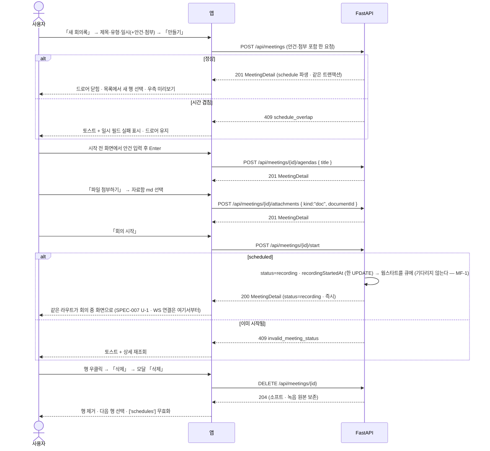
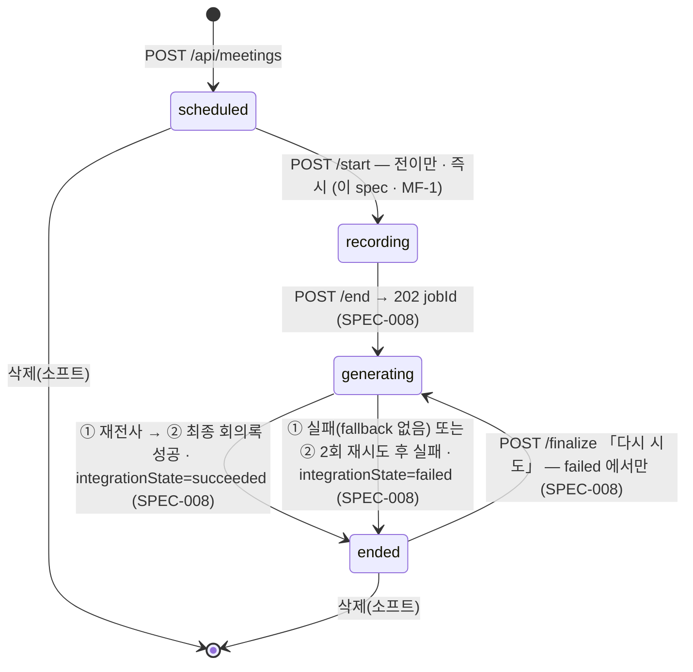

# 회의록 — 목록 · 생성 · 시작 전

회의록을 **달력 범위로 훑고**, **드로어에서 만들고**, 시작 전에 **안건과 첨부를 미리 두고** 「회의 시작」을 누른다. 이 spec 은 회의록 영역의 **입구**다 — 회의 중(SPEC-007)·종료 후(SPEC-008)가 물려받는 **상세 응답 · 상태 전이 진입점 · 첨부 계약**을 여기서 확정한다.

> 기능/정책 묶음 단위의 **외부 계약** 문서다. client / QA / 외부 통합이 이 문서만 읽고 따를 수 있어야 한다.
> SPEC에는 table schema 전문, ORM field, repository/service 구조, PR 계획, 구현 순서, 라우트·컴포넌트 파일 경로 같은 내부 구현을 두지 않는다.

> **2026-09-06 재작성.** 이전 판(SPEC-006 v0.0.1)은 시안에 보이는 것을 전부 계약으로 옮겨 폐기됐다.
> 이 판의 판정 축은 **기획(BASE-003) + 정책(DEC-003)** 하나뿐이고, 시안 `회의록.dc.html` 은 **시각(색·크기·배치)** 에만 쓴다.
> 시안에 있으나 기획·정책에 없어 **뺀 것은 §7 에 줄 번호와 함께** 적었다.
>
> **2026-09-06 v0.0.3.** 사용자 결정 2건(DEC-003 §1 표 · §4 · §5 — **AI 한 줄 요약 바 v1 포함** · **종료 후 줄 삭제 · 안건 이름 수정**)을 반영하고, SPEC-007·008 과의 정합(필드 이름 · 상태 제약 · 참조 번호 · 에러코드 · 배지 문구)을 §4·§7 에 맞췄다.
>
> **2026-09-07 v0.0.4 — `Meeting flow.md` MF 반영.** 이 spec 에 걸린 것 — **MF-1**(`/start` 는 전이만 · 웜스타트는 큐 · 즉시 응답) · **MF-5**(미리보기 CTA 상태별 — `scheduled`·`recording` 「회의 입장」) · **MF-6**(미리보기 패널은 빈 상태 크기에 고정 · 넘치면 패널 안 스크롤 · compact 밀도) · **MF-7**(breadcrumb 링크 + 상세 「←」) · **MF-8**(시작 전 헤더도 배지 줄 → 제목 순서) · **MF-25**(요약 바 카운트 다섯) · **MF-56·58**(종료 파이프라인 어휘 — 「통합」 → 「최종 회의록」, 「다시 생성」 → 「다시 시도」) · **MF-59**(줄의 `payload`). `MeetingDetail` 필드 소유 표가 그에 맞춰 바뀌었다(`finalBatchState` 삭제 · `pendingChange`·`source*LineId` → `payload`).

## 1. Context

### Meta

- Decision reference: DEC-003 §1(범위 · **2026-09-06 시안 대조 확정분 — AI 한 줄 요약 바 · 종료 후 편집 범위 포함**) · §2(화자 표기) · §3(필드) · §4(생명주기·삭제) · §5(CRUD) · §6(녹음 원본 영구 보관) · §7(실패) · §8(연결) · OQ-6(목록·삭제 모달·반응형 → 이 spec)
- Baseline reference: BASE-003 §Raw L37(「AI 제안은 필요 없다」) · L43(「설계한 것 이외의 에러는 터지게 둔다」) · 기능명세 **#1 회의록 생성 · #2 회의 시작 전 · #11 첨부 파일 · #12 회의록 삭제** · 인바운드/아웃바운드 표
- 소비 규약: DEC-001 §3·§4(유형은 **종류=미팅** · 삭제된 유형·프로젝트는 참조 표시만 — SPEC-002 가 목록을 만든다) · DEC-004 §4·§8(첨부는 **md 문서**, 복원 창구 없음) · DEC-005 §2(회의 상세 드로어는 회의록 소유 — **SPEC-008 U-4**) · §3(회의 일시는 회의록이 소유, `schedule` 은 파생) · §5(캘린더가 이 spec 의 생성 드로어를 연다) · §7(겹침 차단)
- Architecture reference: `backend/README.md` §5-1(스트림은 회의당 하나) · §5-2(웜스타트는 `/start` 밖 — MF-1) · §6(장시간 작업) · §7(일정 파생은 같은 트랜잭션) · §8(에러 규약) · §10(회의록 표면) · `frontend/README.md` §1(라우트 `?id=`) · §2 규칙 7(밀도 prop) · §3-3(무효화 표) · §6(오버레이 3종) · **§6-3(상세 헤더 규약 — breadcrumb 링크 · 「←」 · 배지 줄 → 제목)** · §7(반응형) · §9(V2Gate) · `database/README.md` §0-1(소프트 딜리트) · §3(`schedule` 파생) · `database/domains/meeting.md` M-1~M-20
- **결정 정본**: `reference/2026-09-06-task-management-app/Meeting flow.md`(`MF-n`). 이 spec 과 부딪히면 그쪽이 이긴다
- Design reference(시각만): `회의록.dc.html` **L24~231(회의록 목록) · L232~541(새 회의록 드로어) · L542~649(회의 시작 전) · L650~760(회의 시작 전 · 첨부 파일)** · 첨부 목록 행·파일 드로어의 시각은 **L1160~1194 · L1349~1393** 을 빌린다 · `디자인 시스템.dc.html` **[09] MEETING NOTE(L649~755)** · [05] SURFACE · [06] COMPONENTS · [07] OVERLAY & INPUT · [10] RULES · 정정 §A-6·§A-7·§A-11
- 기준 spec: 형식·깊이는 SPEC-003 · SPEC-004 와 같다. 공용 규격은 재사용한다 — 첨부 팝오버 **SPEC-003 U-7** · 컨텍스트 메뉴 **SPEC-004 U-5** · 삭제 모달 프레임 **SPEC-004 U-8** · 빈 상태·스켈레톤 **SPEC-004 U-9·U-11** · 자동 저장 실패 **SPEC-002 U-7** · 최소 폭 안내 **SPEC-000 U-2**
- Domain note: 외부에 드러나는 것은 **회의록**(제목·유형·프로젝트·일시·상태·통합 상태·한 줄 요약)과 그 자식 **안건(트랙별) · 줄(트랙별) · 첨부(문서/링크)** 다. 트랜스크립트·배치 회차·job 은 SPEC-007·008 이 드러낸다
- Open questions: §7

### Business Requirement

- **회의록은 업무의 두 번째 입구다**(BASE-003 §Why). 회의에서 나온 일이 기록에서 끊기지 않으려면 회의록이 **먼저 있어야** 한다 — 이 spec 이 그 「먼저」를 만든다.
- **회의는 사람과 AI 둘이 참가한다**(BASE-003 L37). 그러나 **시작 전에는 AI 가 없다** — 「회의 중 AI 는 AI 탭만 채우면 된다」. 시작 전 화면의 프롬프트 바는 **안건 입력창**이지 AI 입력창이 아니다.
- **유형은 설정의 동적 유형 중 종류=「미팅」** 이다(DEC-003 §3 · §A-7). 시안의 `미팅·회의|반복|개인` 고정 3종은 폐기됐고, **반복 회의는 v1 제외**다.
- **회의 일시는 회의록이 소유한다**(DEC-005 §3 · M-1). 캘린더 드래그·상세 드로어 어느 쪽에서 바꿔도 원본은 `meeting` 이고 `schedule` 은 따라 내려온다. 이 spec 의 `PATCH /api/meetings/{id}` 가 그 **유일한 쓰기 표면**이다(SPEC-009 §4 가 이미 이렇게 참조한다).
- **첨부는 두 갈래만 실동작한다** — 자료함 문서(md) · URL 링크(DEC-003 §1 표). 로컬 파일 업로드는 **UI 만 + v2 게이트**다.
- **삭제는 소프트 딜리트**이고 **녹음 원본은 지우지 않는다**(DEC-003 §4·§6 · M-13).

### Scope

In scope:

- **회의록 목록 페이지** — 월 단위 스코프 · 프로젝트 필터 칩 · 정렬 · 행 · 우측 미리보기 패널 · 빈 상태 · 스켈레톤
- **새 회의록 드로어**(840) — 제목·프로젝트·유형·일시·안건·첨부를 한 번에 저장. 캘린더(SPEC-009)가 **그대로 연다**
- **프로젝트 셀렉터 팝오버 하단 인라인 행** — 「새 프로젝트로 추가」(DEC-003 OQ-6 「전 영역 공통」 · **여기서 확정**)
- **회의 시작 전 화면** — 상태 바 「기록 대기」 · 안건 입력·편집 · 첨부 탭 · 「회의 시작」
- **첨부 파일** — 우측 탭 목록 · 추가 팝오버(SPEC-003 U-7 재사용) · **파일 드로어**(md 미리보기/원문) · v2 게이트(로컬 업로드)
- **회의록 삭제** — 진입점 + 확인 모달 600
- **반응형**(1280~1439 · ≥1440)
- **AI 한 줄 요약 바의 표시** — 목록 행 셋째 줄 + 우측 미리보기 패널 상단(U-8). 생성은 SPEC-008 종료 파이프라인 ②(최종 회의록 호출 — DEC-003 §1 표 · §4)
- **후속 SPEC 이 물려받는 계약** — `GET /api/meetings/{id}` 상세 응답 형태(**정본은 이 spec**) · `POST /api/meetings/{id}/start`(**전이만 · 즉시 응답** — MF-1) · 안건·첨부 계약 · 상태 4종

Out of scope:

- **회의 중** — 마이크·WS 스트림·실시간 스크립트·사람 트랙 줄 입력·AI 배치·일시정지 — **SPEC-007**
- **종료·생성중·재전사·최종 회의록·편집(줄 삭제 · 안건 이름 수정 포함)·근거 칩·회의 상세 드로어(SPEC-008 U-4)** — **SPEC-008**. 한 줄 요약의 **생성**도 거기다
- **캘린더 표시·드래그** — SPEC-009. 여기서는 일시가 `schedule` 로 파생된다는 사실과 `PATCH` 계약만 둔다
- **업무 생성·갱신 입구**(액션 줄·업무 줄) — SPEC-007·008
- 반복 회의 · 예약 알림 · 시스템 오디오 · 외부 캘린더 등록 · 자료함 문서를 AI 컨텍스트로 전달 — **v2**(DEC-003 §1)
- 회의록 검색 — v1 에 없다(디자인 시스템 [06] SEARCH 는 부품일 뿐 회의록 시안 L24~231 에 검색 입력이 없고, 정책에도 없다)

## 2. UX Contract

### Placement

```text
[/meetings — 목록]                                   [/meetings/detail?id= — 상태로 갈린다(F-10)]
+──────────+──────────────────────────────────+      scheduled  → U-4 회의 시작 전 (이 spec)
│ 사이드바  │ 홈 › 회의록                        │      recording  → SPEC-007
│ 200      │ 회의록  ‹ 2026년 8월 ›     [+ 새 회의록]│      generating · ended → SPEC-008
│          │ +──────────+──────────────────+   │
│          │ │ 목록 500  │ 우측 미리보기(유동) │   │      [오버레이]
│          │ │ U-2       │ U-8               │   │      새 회의록 드로어 840 — U-3
│          │ +──────────+──────────────────+   │      파일 드로어 840 — U-7
+──────────+──────────────────────────────────+      삭제 확인 모달 600 — U-5
```

- 목록·상세 둘 다 **실제 라우트**이고 드로어·모달·팝오버는 URL 이 없다(FE §1-1). 상세는 `?id=` 쿼리 하나로 모든 회의를 처리한다(FE §1-2)
- **드로어 위에 모달을 겹치지 않는다**([10] · FE §6-2). 드로어 안에서 다른 드로어를 열지 않는다 — 생성 드로어 안의 첨부 고르기는 **팝오버**(SPEC-003 U-7)다
- 시안 좌표(1920)는 **비율의 참고값**이다. `position:absolute` 로 박지 않는다(§C Q-34)

### U-1. 회의록 페이지 골격 · 헤더 (회의록.dc.html L47~68)

- **상태**
  - *정상*: breadcrumb 「홈 › 회의록」(L47~51, top 38 · 13px `#9EA2AE`) → 타이틀 행(L53~68) → 2패널(L70 · L148, top 140). **breadcrumb 의 「홈」은 링크, 「회의록」(지금 여기)만 링크가 아니다**(MF-7 · FE §6-3). 목록 화면이라 「←」는 없다
  - *로딩*: 좌 패널에 **U-2 스켈레톤**, 우 패널은 비워 둔다(빈 프레임만)
- **문구**
  - 타이틀 「회의록」 28/700(L55) + 바로 옆 **기간 스테퍼** 「‹ 2026년 8월 ›」(L56~60, 30px · `#D9D9D9`). **월 단위**다 — 「기간이 있는 화면은 Period Stepper 로 현재 범위(월 단위)를 항상 노출한다」([10] RULES 「스코프 표시 필수」)
  - 우측 「**새 회의록**」 34px `#7181F8` + 플러스 글리프(L63~66, hover `#5F71F5`)
- **CTA**: `‹` `›` 는 **한 달씩** 이동 · 「새 회의록」 → **U-3**
- **기대 결과**: 범위는 **회의 `startAt` 이 그 달(KST)에 속하는 것**이다. 달은 쿼리(`?month=YYYY-MM`)에 남아 뒤로가기·새로고침에서 산다(FE §1-2). 기본 진입은 **이번 달**. 이전·다음 달 회의는 스테퍼로만 본다

### U-2. 회의록 목록 패널 (회의록.dc.html L70~146)

DEC-003 OQ-6 가 「SPEC-006 U-2 — 프로젝트 필터 칩 + 생성 진입점을 셀렉터 팝오버 하단 인라인 행으로」로 닫은 자리다. **생성 진입점(새 프로젝트)은 이 패널이 아니라 U-3 의 프로젝트 셀렉터 안**에 있다 — 필터 칩 행은 거르기만 한다.

- **상태**
  - *정상*: 패널 500 고정(L70, r16 `#D9D9D9`). 헤더 48(L71~75) → 필터 칩 행 52(L77~82) → 행 목록(L84~145, 세로 스크롤)
  - *로딩*: **스켈레톤** — 행 자리에 회색 블록 `#F1F2F5` 6줄, 애니메이션 없음. 첫 로딩에만. 달·필터를 바꿀 때는 **이전 결과를 유지한 채** 얇은 진행 표시만(SPEC-004 U-11 규격)
  - *빈 상태*(공용 규격 S-25 · SPEC-004 U-9 와 같은 결):

    | 자리 | 문구 | CTA |
    |---|---|---|
    | 이번 달 회의록 없음 | 「2026년 8월에 회의록이 없습니다」 | 「새 회의록」 + 「이전 달 보기」 |
    | 프로젝트 필터 결과 없음 | 「이 프로젝트의 회의록이 없습니다」 + 캡션 「필터를 지우면 n건이 보입니다」 | 「필터 지우기」 |

  - *조회 실패*(5xx·네트워크): 빈 목록으로 대체하지 않는다 — 실패 표시 + 「다시 시도」(DEC-003 §7 · FE §3-5)
- **문구**
  - 헤더: 「8월 회의록」 13/700 + 「n건」 12/`#9EA2AE` + 우측 정렬 트리거 「최신순 ▾」 12/`#757575`(L72~74)
  - 필터 칩(L78~81 · h28 r6 12px): 「**전체 n**」 + 「**미정 n**」(무소속) + **프로젝트별** 「<이름> n」. 선택 칩은 `#F1F2FE` + 1px `#7181F8` + `#4B52A8`/600, 나머지는 1px `#E1E3E8` + `#5F6470`, hover `#F5F6F8`. **단일 선택**, 기본 「전체」. 칩이 넘치면 **가로 스크롤**(스크롤바 숨김). 숫자는 **그 달의 건수**이고 **프로젝트 필터 자신은 반영하지 않는다**(칩 숫자가 흔들리지 않게 — SPEC-004 `typeCounts` 규칙 승계)
  - 행(padding 14/18 · 구분 `#F1F2F5` · hover `#FAFBFC` · **선택 행 `#F8FAFF`**(L84)):
    1. 첫 줄 — 일시 12/`#757575` 「08월 27일 (목) 09:30」(L86) + 우측 **유형 배지**(h20 r4 11/600, **동적 유형의 색 토큰** — L87 의 `#EEF1FE/#4A55B8` 는 그 유형 색의 예시값이다)
       - **상태 표기**(시안 없음 → 디자인 시스템으로 조립. DEC-003 §3 status 4종 + §4 「파이프라인 실패 시 ended + 실패 표시」): `scheduled` → 일시 뒤에 「**예정**」(시작 전 헤더 L576 의 어휘) · `recording` → 「**기록 중**」 + 7px dot `#7181F8` + 3px 광륜([09] L723) · `generating` → 「**생성중**」 · `ended` → 없음 · `ended` + `integrationState=failed` → 「**생성 실패**」 12/`#E2685B`(재전사 실패든 최종 회의록 실패든 하나의 표기 — SPEC-008 U-2)
    2. 둘째 줄 — 제목 15/700(L89)
    3. 셋째 줄 — 한 줄 13/`#5F6470` ellipsis(L90): **`headline`**(AI 한 줄 요약 — DEC-003 §1 표 · ERD `ai_headline`. 종료 후 최종 회의록 호출 ② 에서 `merged` 트랙과 **같은 응답으로** 받는다 — SPEC-008)이 있으면 그것, 없으면 **사람 트랙 안건 제목을 「 · 」로 이어** 붙인다. 안건도 없으면 「안건 없음」 `#9EA2AE`
  - 정렬 팝오버: 「**최신순**」(기본 — `startAt` 내림차순) · 「오래된순」. 고르면 즉시 반영, 「적용」 버튼 없음
- **CTA**
  - 행 클릭 → **선택** + 우측 미리보기 패널(U-8) 갱신. **상세 페이지로 바로 가지 않는다** — 상세는 U-8 헤더의 CTA(상태별 「회의 입장」/「상세보기」 — MF-5) 또는 행 더블클릭
  - 행 **우클릭** → **컨텍스트 메뉴 220**(SPEC-004 U-5 규격): 「**열기**」(상세 페이지) / 구분선 / 「**삭제**」(`#E2685B`) → **U-5**. `recording`·`generating` 행에서는 「삭제」가 **비활성**이다(§4 상태 제약)
  - 칩 클릭 → 즉시 필터
- **기대 결과**: 첫 진입에 **가장 최근 행이 선택**되어 우측에 보인다(시안 L84 첫 행 선택 상태). 생성 직후에는 **새 회의록 행이 선택·하이라이트**된다. 삭제하면 행이 즉시 빠지고 **다음 행이 선택**된다. 유형·프로젝트 이름·색을 설정에서 바꾸면 배지가 따라 바뀐다(FE §3-3 무효화 표 「유형·프로젝트 변경 → `['meetings']`」)

### U-3. 새 회의록 드로어 (회의록.dc.html L439~532)

**캘린더의 「+ 새 일정」에서 종류=미팅 유형을 고르면 이 드로어가 열린다**(DEC-005 §5 · SPEC-009 U-6). 드로어는 부모를 모르고 결과를 콜백으로 돌려준다(FE §6-2). SPEC-009 가 이미 「SPEC-006 U-3」으로 참조하므로 **번호를 바꾸지 않는다.**

- **상태**
  - *열림*: 스크림 `rgba(30,30,30,0.32)`(L439) · 드로어 840(L441) · 헤더 72(L442~448: 제목 「새 회의록」 18/700 + 캡션 「안건을 미리 적어두면 회의 중 화면이 안건별로 열립니다」 12/`#9EA2AE` + ×) · 본문 padding 28 gap 22(L450) · 푸터 80(L528~531). 열자마자 **제목 입력에 포커스**(L454 의 포커스 규격 — 1px `#7181F8` + `0 0 0 3px rgba(113,129,248,0.16)`)
  - *제출 가능*: **제목 1자 이상 + 유형 선택 + 일시(날짜·시작·종료) 모두 있음.** 하나라도 없으면 「만들기」 비활성
  - *제출 중*: 푸터 버튼 비활성 + 진행 표시. 중복 제출이 나가지 않는다
  - *실패*: 드로어가 닫히지 않고 해당 필드에 인라인 안내(§4 Case Matrix). `schedule_overlap` 은 **토스트 + 일시 필드 실패 테두리**
- **문구·필드 순서**
  1. **제목**(L452~455) — 44px, 플레이스홀더 「회의 제목」
  2. **프로젝트 · 유형** 2열(L457~471, `1fr 1fr` gap 22)
     - 프로젝트(선택) — **셀렉터 팝오버**(`11-auth-profile.md` §셀렉터 규격: 트리거 폭, 1px 겹침, 항목 36, 현재 값 `#F4F5FF`+체크). 목록은 SPEC-002 `GET /api/projects`(삭제분 제외). 플레이스홀더 「프로젝트 없음」. 캡션 「목록에 없으면 셀렉터 맨 아래 '새 프로젝트로 추가'」(L461)
       - **팝오버 하단 인라인 행 「+ 새 프로젝트로 추가」** — **전 영역 공통 규격, 여기서 확정**(DEC-003 OQ-6). 목록 끝 구분선 아래 36px 행. 누르면 그 행이 **[색 트리거 28] [이름 입력(유동)] [추가]** 로 바뀐다(SPEC-002 U-5 인라인 추가 행의 축소판 — 프로젝트는 이름 + 색뿐, DEC-001 §3). 색 기본값은 팔레트 첫 값(SPEC-002 U-2). `Enter`/「추가」 → `POST /api/projects`(SPEC-002 §4) → 성공하면 목록에 들어가고 **즉시 선택**되며 팝오버가 닫힌다. 실패(`duplicate_name`·`validation_error`)는 행 아래 인라인 문구, 입력값 유지. `Esc` 는 행을 원래 항목으로 되돌린다
     - 유형(필수) — 같은 셀렉터 규격. 목록은 SPEC-002 `GET /api/work-types` 중 **`kind=meeting` 인 것만**(DEC-003 §3 · M-2). **기본값은 시드 기본 유형 「미팅·회의」**(삭제 불가 — DEC-001 §4)가 미리 선택된 상태다. 시안의 **고정 칩 3종(L466~468)은 폐기**(§A-7) — 그 자리에 셀렉터 트리거 44px 하나
  3. **일시**(L473~481) — 날짜 200 + 시작 130 「–」 종료 130(전부 44px 셀렉터). **기본값**: 날짜 = 오늘, 시작 = 현재 시각을 **30분 단위로 올림**, 종료 = 시작 + **1시간**(DEC-005 §4 「1시간 기본」 어휘). 시각 목록은 30분 간격 + 「직접 입력」([07] Selector). 종료 ≤ 시작이면 종료 셀렉터 실패 테두리 + 「종료 시각은 시작보다 뒤여야 합니다」
  4. **안건**(L483~505) — 라벨 「안건」 + 캡션 「Enter로 계속 추가」. 행 44px(L489~498): 「안건 n」 11/700 `#9EA2AE` + 입력(유동) + hover 시 우측 「제거」 글리프. 마지막 행은 항상 빈 입력(L499~503, 테두리 `#EBEBEB`, 플레이스홀더 「안건 입력 후 Enter」). **「추가」 버튼을 빈 입력 우측에 항상 둔다**([10] 단축키는 보조 — 시안에는 없으나 규칙이 요구한다). 공백만인 행은 저장하지 않는다
  5. **첨부 파일**(L507~517) — 라벨 「첨부 파일」 + 캡션 「회의 중에도 추가할 수 있습니다」. 점선 영역(L512, `#D9D9D9` dashed · `#FAFBFC`): 아이콘 + 「파일을 끌어다 놓거나 자료함에서 선택」 + 우측 「**자료함에서 선택**」 30px
     - 「자료함에서 선택」 → **SPEC-003 U-7 팝오버 360**(세그먼트 「자료함 문서」/「URL 링크」 · md 만 · 삭제 문서 제외 · 링크는 URL + 표시 이름). 팝오버는 열린 채 여러 건을 붙인다
     - **드래그 앤 드롭·로컬 파일은 `V2Gate`**(FE §9): 영역은 그대로 그리되 파일을 놓으면 「**v2에서 제공됩니다**」 토스트만 뜨고 **네트워크 요청이 나가지 않는다**(DEC-003 §1 표 「로컬 파일 업로드 첨부」)
     - 붙인 첨부는 영역 아래 **목록 행**(SPEC-003 U-7 목록 행 규격 — MD 타일 또는 링크 글리프 + 이름 + 폴더 경로/도메인 + hover 「제거」). 드로어 안에서는 행을 눌러도 **파일 드로어(U-7)를 열지 않는다**(FE §6-2)
  - **상태 필드가 없다.** 생성 시 항상 `scheduled` 다(DEC-003 §3 기본값)
  - **연관 업무 칸이 없다**(DEC-003 §5 생성 「연관 업무를 직접 고르는 칸은 없다」)
  - **「만들면 바로 회의 시작」 토글(L519~525)을 두지 않는다**(§7 — 기획·정책에 없다)
- **CTA**: 「취소」 44px `#D9D9D9`(L529) · 「**만들기**」 44px `#7181F8`(L530). `Esc`·×·스크림 클릭으로도 닫힌다
- **기대 결과**: `201` 이면 드로어가 닫히고 **목록에서 새 회의록 행이 선택·하이라이트**되며 우측 패널이 그 회의의 시작 전 미리보기(U-8)로 바뀐다. 드로어에 넣은 **안건·첨부는 본체와 함께** 저장된다 — 절반만 저장되는 상태가 없다(§5). 캘린더에서 열었으면 캘린더가 콜백으로 결과를 받아 `['schedules']` 를 무효화한다(SPEC-009 §5). **회의 시작은 생성과 별개 동작**이다 — U-4 의 「회의 시작」에서만 일어난다

### U-4. 회의 시작 전 (회의록.dc.html L565~646 · 첨부 탭은 L739~757)

`GET /api/meetings/{id}` 의 `status='scheduled'` 일 때 상세 라우트가 그리는 화면이다(FE §1 L47 「상태로 갈린다」). 시작 후에는 **같은 라우트가 SPEC-007 U-1(회의 중)로 바뀐다** — 페이지 이동이 아니라 상태 변화다.

- **상태**
  - *로딩*: 헤더·패널 자리에 스켈레톤(`#F1F2F5`, 애니메이션 없음). 빈 화면을 먼저 보여주지 않는다(SPEC-003 U-3 규격)
  - *정상*: **「←」 + breadcrumb 「홈 › 회의록 › <제목>」**(L565~571 — 「홈」·「회의록」은 링크, 「←」는 `/meetings/` 로 한 단계 뒤로. MF-7 · FE §6-3) → 헤더(L573~585 — **순서는 아래 「문구·구성」**, MF-8) → 상태 바(L587~593, top 150 · 1640×56) → 좌 패널 1160(L595) + 우 패널 464(L631, left 1416) — 패널 규격은 [09] L723 「좌측 패널 1160 = 회의록 | AI 요약, 우측 464 = 실시간 스크립트 | 첨부 파일」
  - *없는 항목*: 「없는 회의록입니다」 + 「목록으로」. **리다이렉트하지 않는다**(FE §1-2)
  - *시작 중*: 「회의 시작」 비활성 + 진행 표시. 중복 요청이 나가지 않는다
- **문구·구성**
  - 헤더 — **업무 상세 헤더 순서를 따른다**(MF-8 · FE §6-3. 시안 L575~576 의 「제목 → 부제」 순서는 정정): ① **배지 줄** = 좌측 **[유형 배지 ˅] [● 프로젝트 ˅]**(둘 다 인라인 셀렉터 — 누르면 팝오버, `PATCH /api/meetings/{id}` §4. 무소속이면 「프로젝트 없음」 회색 칩) · 우측 **같은 높이**에 `⋯` 30px 고스트(시안 없음 → 디자인 시스템 [06] 패널 헤더 버튼 규격. 항목 「**삭제**」 `#E2685B` → U-5. SPEC-004 U-5 「마우스가 없는 경로도 남는다」와 같은 이유) + 「**회의 시작**」 34px `#7181F8` + 마이크 글리프(L580~584) ② **제목** 28/700(L575) ③ **회의 고유 메타 한 줄** 13/`#757575` 「**08월 27일 (목) 09:30 – 10:30 · 60분 · 예정**」(L576 에서 유형·프로젝트를 ① 로 올린 형태)
    - **「회의 정보 수정」 버튼(L579)은 그리지 않는다** — §7. 제목·유형·프로젝트·일시의 수정 경로는 **회의 상세 드로어(SPEC-008 U-4, DEC-005 §2·§5)** 와 캘린더 드래그(SPEC-009)이고, 서버 계약은 이 spec §4 `PATCH` 다
  - 상태 바(L587~593): `#F4F5F7` + 1px `#E1E3E8` r12 · 10px dot `#B3B3B3` · 「**기록 대기**」 14/700 `#5F6470` · 「00:00:00」 tabular `#9EA2AE` · 우측 캡션 「회의 시작을 누르면 녹음과 스크립트가 함께 켜집니다」 12/`#757575`. **파형·경과 시간 진행은 없다**(시작 전이라 0 고정)
  - 좌 패널 탭 48(L596~599): 「**회의록**」(dot 7px `#B3B3B3`) / 「**AI 요약**」(dot `#B3B3B3`). 탭 dot 색은 [09] L704~721 표를 따른다(시작 전은 둘 다 `#B3B3B3`). AI 요약 탭을 누르면 빈 상태 「회의를 시작하면 AI 요약이 여기에 쌓입니다」 — **시작 전 AI 는 아무것도 하지 않는다**(BASE-003 L37 · DEC-003 §4)
  - 회의록 탭 본문:
    - *안건 없음*(L601~608): 아이콘 타일 56 `#F4F5F7` + 「**아직 안건이 없습니다**」 17/700 + 「아래에 안건을 적어 두면 회의 중 화면이 안건별로 열립니다.<br>회의 중에도 추가할 수 있습니다.」 14/`#757575`. **시안 문구 「안건 초안을 만들어 줍니다」(L607)와 추천 칩 3개(L609~613)는 그리지 않는다** — §7(AI 안건 생성)
    - *안건 있음*(시안 없음 → [09] 트리 헤더 규격으로 조립 · L184~188 의 「안건 n + 제목」 행): 행마다 「안건 n」 11/700 `#9EA2AE` + 제목 15/700. **줄은 없다**(시작 전에는 안건만 — BASE-003 #2). 제목 클릭 → **인라인 편집**(SPEC-003 U-2 규격 — 배경 `#F5F6F8` · 포커스 해제 시 저장 · `Esc` 되돌림), hover 우측 「**제거**」(시작 전 안건에는 딸린 줄이 없어 지울 수 있다 — 종료 후 「안건 삭제 없음」 경계(DEC-003 §1 표 ③)와 충돌하지 않는다, §7). 순서는 등록순이며 **드래그 정렬은 없다**(DEC-003 §1 표 「줄 순서 변경은 여전히 없다」와 같은 결)
  - 하단 **안건 입력 바**(L616~628): 56px r14 · 1px `#7181F8` + 3px 글로우 · 배경 `#fff`. **모드 칩 「새 안건 ▾」(L618~621)과 전송 버튼(L623~625)은 그리지 않는다** — §7. 대신 [입력(유동) · 플레이스홀더 「안건 입력 후 Enter」] + 우측 「**추가**」 40px `#7181F8`. 캡션 「시작 전에는 새 안건만 만들 수 있습니다」 12/`#9EA2AE`(L627 그대로 — AI 와 무관한 문장이다)
  - 우 패널 탭 48(L633~636): 「**실시간 스크립트**」(dot `#B3B3B3`) / 「**첨부 파일 n**」(dot `#D9D9D9` 고정, **0 이면 숫자 생략** — [09] L720). 스크립트 탭 본문(L638~641): 「**아직 회의 전입니다**」 15/700 `#757575` + 「회의를 시작하면 스크립트가 이 자리에 쌓입니다」 13/`#9EA2AE`. **하단 푸터 「MacBook Pro 마이크 · 내 목소리 등록됨」(L643~645)은 그리지 않는다** — §7. 첨부 파일 탭은 **U-7**
- **CTA**
  - 「**회의 시작**」 → `POST /api/meetings/{id}/start`(§4). **응답은 즉시다**(MF-1 — 전이만 한다. 실측 13초 스피너의 원인이던 웜스타트 대기가 없다). `200` 이면 `status='recording'` 이고 화면이 **SPEC-007 U-1 로 바뀐다** — 마이크 권한·WS 연결은 그 시점부터 SPEC-007 의 계약이고, 웜스타트는 서버가 큐에 넣어 뒤에서 돈다
  - 「추가」/`Enter` → `POST /api/meetings/{id}/agendas`. 등록 후 입력이 비워지고 포커스가 남는다
  - 인라인 편집 → `PATCH …/agendas/{agendaId}` · 「제거」 → `DELETE …/agendas/{agendaId}`(확인 모달 없음 — 되돌리는 비용이 다시 적는 것뿐이다)
  - `⋯` → 「삭제」 → U-5
- **기대 결과**: 안건은 **사람 트랙(`track='human'`)** 에 쌓이고, 회의 중 AI 가 `list_agendas()` 로 그 순간의 안건을 조회한다(DEC-003 §8 「AI 도구 연결」 · MF-50 · SPEC-007 — 웜스타트에 컨텍스트로 싣지 않는다). 자동 저장 실패는 **SPEC-002 U-7 규격**(토스트 + 그 행 실패 표시 + 「다시 저장」, 자동 재시도 없음). 회의를 시작하면 다시 `scheduled` 로 돌아오지 않는다(DEC-003 §4 상태 흐름은 한 방향)

### U-5. 삭제 확인 모달 (600) — 시안 없음 · SPEC-004 U-8 프레임으로 조립 (DEC-003 OQ-6)

「되돌리기 어려운 결정 하나」라 **모달 600**이다([10] · [09] L752 「회의록 삭제만 모달입니다」). 드로어·팝오버가 열려 있으면 **먼저 닫고** 연다(FE §6-2).

- **상태**: 모달 600, 스크림 `rgba(30,30,30,0.36)`. SPEC-004 U-8 · SPEC-002 U-6 과 같은 프레임(제목 → 요약 → 경고 슬롯 → 취소/삭제)
- **문구**
  - 제목 「**'<제목>' 회의록을 삭제할까요?**」
  - 요약 「목록과 캘린더에서 사라집니다. 안건·회의록·AI 요약·스크립트·첨부 목록도 함께 보이지 않게 됩니다.」
  - 경고 슬롯 「**v1 에는 복원 화면이 없습니다.** 녹음 원본은 지워지지 않고 서버에 남습니다.」(DEC-004 §4 「복구 창구는 v1 에 없다」 · DEC-003 §4·§6 「녹음 원본은 삭제하지 않는다」 · M-13)
- **CTA**: 「취소」 · 「**삭제**」(`#E2685B`)
- **진입점**: ① U-2 행 컨텍스트 메뉴 「삭제」 ② U-4 헤더 `⋯` 「삭제」. SPEC-007 의 헤더 `⋯` · SPEC-008 의 전체 페이지 「삭제」 텍스트 버튼(시안 L1440)과 상세 드로어(U-4) `⋯` 도 **같은 모달**을 연다(이 spec 이 모달의 주인이다 — 진입 버튼 모양은 각 화면의 시안을 따른다)
- **기대 결과**: `204` 면 목록·캘린더·미리보기에서 즉시 빠진다(`['meetings']` + `['schedules']` 무효화 — FE §3-3). 상세 페이지에서 지웠으면 **목록으로 이동**한다. **`recording`·`generating` 은 지울 수 없다**(§4 상태 제약 — 메뉴에서 비활성이고 서버가 `409` 로 막는다)

### U-6. 반응형 — 회의록 영역 (시안 없음 · FE §7-1 로 조립 · DEC-003 OQ-6)

| 구간 | 목록(U-1·U-2·U-8) | 시작 전(U-4) | 드로어(U-3·U-7) |
|---|---|---|---|
| **< 1280** | 최소 폭 안내 화면(SPEC-000 U-2) | 〃 | — |
| **1280 ~ 1439** | 사이드바 숨김 + 햄버거, 여백 48. **좌 목록 400 고정 + 우 미리보기 유동(화면 안)** | 좌 패널 유동 + **우 패널 400 고정**(FE §7-1 「좌 유동 + 우 400」) | **전체 화면** — 스크림 없음, 헤더 좌측 `←`(SPEC-003 U-11 과 같은 규칙). U-3 의 2열(프로젝트·유형)은 **1열로 쌓인다** |
| **≥ 1440** | 사이드바 200, 여백 80→240 보간. **좌 500 고정 + 우 유동(화면 안)** | 좌 유동 + **우 464 고정** | 840 고정 |

- 상태 바(U-4)는 전 구간 **본문 폭 전체**를 쓴다
- **우측 미리보기 패널의 크기는 「빈 상태(회의 0건)일 때의 크기」에 고정한다**(MF-6 — 실측에서 회의를 고르면 패널이 오른쪽으로 넘어가 잘렸다. 빈 상태일 때의 크기가 옳다). 본문이 넘치면 패널이 밀려나는 게 아니라 **패널 안에서 세로 스크롤**한다. 어느 구간에서도 패널이 뷰포트 밖으로 나가지 않는다
- `position:absolute` 로 배치하지 않는다(§C Q-34 · §A-13)

### U-7. 첨부 파일 — 우측 탭 · 추가 · 파일 드로어 (회의록.dc.html L739~757 · 시각 참고 L1160~1194 · L1349~1393)

BASE-003 #11 「우측 탭 목록 → 파일 드로어」. **고르기는 SPEC-003 U-7 팝오버**, **보기는 파일 드로어 840** 이다. 이 규격을 **SPEC-007·008 의 첨부 탭이 그대로 쓴다** — 탭 · 추가 팝오버 · 목록 행 · **파일 드로어는 시작 전(L650~760) · 회의 중(SPEC-007 U-7, L1347~1393) · 종료 후(SPEC-008) 세 화면에서 같은 컴포넌트 하나**다(SPEC-007 §7-D D-5). 화면마다 조건(회의 중 잠정 발화 등)만 다르고 규격은 한 벌이다.

- **상태**
  - *탭 라벨*: 「첨부 파일 n」 — 0 이면 「첨부 파일」(L743 · [09] L720). 헤더 우측 텍스트 버튼 「**추가**」 12/`#9EA2AE`(L1164 시각) → 팝오버
  - *빈 상태*(L746~752): 「첨부한 파일이 없습니다」 13/`#9EA2AE` + 「**파일 첨부하기**」 40px `#7181F8` + 클립 글리프 → 같은 팝오버
  - *목록 행*(L1168~1181 시각 — padding 11/12 · r10 · 1px `#EBEBEB` · gap 10): **MD 타일 32**(`#EEF0FE` · 「MD」 10/800 `#4B52A8`) 또는 **링크 글리프** + 이름 13/600 ellipsis + 메타 12/`#9EA2AE` — 문서는 「<크기> · <수정일> · <폴더 경로>」, 링크는 「<도메인>」. hover 우측 「**제거**」. **PNG·PDF 행(L1175~1188)과 「회의 중 작성」 메타(L1172)는 그리지 않는다** — §7
  - *삭제된 문서*: 행을 흐리게(`#9EA2AE`) + 「삭제된 문서입니다」 캡션. **조용히 감추지 않는다**(SPEC-005 L-12). 열리지 않는다
  - *푸터 44*(L754~756): 「끌어다 놓아도 첨부됩니다 · 최대 50MB」 12/`#9EA2AE`. **이 문구와 드롭 영역은 `V2Gate` 아래**다(DEC-003 §1 표) — 놓으면 「v2에서 제공됩니다」 토스트, 요청 없음. **50MB 는 검증 대상이 아니다**(업로드가 v2 라 검증할 것이 없다)
  - *파일 드로어*(L1349~1393 시각 — 840 · 스크림 0.32): 헤더 72 = MD 타일 34 + 이름 17/700 + 메타 12 「<크기> · <수정일> · <폴더 경로>」 + 「**다운로드**」 32px + 「**자료함에서 열기**」 32px + ×. 탭 44 「**미리보기**」/「**원문 텍스트**」. 본문 padding 28/32 — 미리보기는 **공용 마크다운 렌더**(SPEC-005 §4 렌더 규약 — GFM·헤딩 앵커·코드 하이라이트), 원문은 읽기 전용 모노스페이스. **「안건 1」 같은 안건 연결 메타(L1354)는 없다**(회의 중 md 작성이 v2 — M-17)
- **문구**: 위와 같다
- **CTA**
  - 「추가」/「파일 첨부하기」 → **SPEC-003 U-7 팝오버 360** — 「자료함 문서」 갈래는 행 클릭 즉시 첨부, 「URL 링크」 갈래는 「추가」. `POST /api/meetings/{id}/attachments`
  - 문서 행 클릭 → **파일 드로어**(본문은 `GET /api/documents/{id}/content` — SPEC-005). 링크 행 클릭 → **기본 브라우저**로 연다(SPEC-003 U-7)
  - 「다운로드」 → 본문 조회 결과를 `<이름>.md` 로 저장(SPEC-005 「내보내기(.md)」와 같은 방식 — 전용 엔드포인트 없음) · 「자료함에서 열기」 → 문서함 상세(SPEC-005 U-4). 드로어는 닫힌다
  - 「제거」 → `DELETE …/attachments/{attachmentId}`. 확인 모달 없음(다시 붙이면 된다). **문서 자체는 지우지 않는다**
- **기대 결과**: 첨부하면 탭 숫자와 목록이 즉시 갱신된다. 회의 중·종료 후에도 같은 탭에서 같은 규격으로 붙이고 뗀다(BASE-003 §Raw · 캡션 「회의 중에도 추가할 수 있습니다」). **첨부는 AI 컨텍스트로 넘어가지 않는다**(DEC-003 §8 · DEC-004 §8 — v2)

### U-8. 우측 미리보기 패널 (회의록.dc.html L148~228)

목록에서 고른 회의를 **읽기 전용으로 보여주는 자리**다. **편집·입력은 없다** — 상세 페이지가 한다. 회의록이 제공하는 두 표면(전체 페이지 + 상세 드로어 — DEC-005 §2)에 더해지는 제3의 표면이 아니라 **목록의 일부**다.

- **상태**
  - *선택 없음*: 「회의록을 고르면 여기에 보입니다」 캡션(빈 상태 S-25)
  - *정상*: 패널 유동(L148, r16 `#D9D9D9`) — 헤더 64(L150~158) → 탭 44(L160~163) → 본문 padding 28/32(L165). **패널 크기는 빈 상태일 때의 크기에 고정하고 본문이 넘치면 패널 안에서 스크롤한다**(MF-6 · U-6). 본문 트리는 상세와 **같은 컴포넌트**를 **compact 밀도**로 그린다(FE §2 규칙 7 — 미리보기 글자가 상세 페이지와 같은 크기였던 것을 밀도 prop 하나로 가른다. 컴포넌트를 쪼개지 않는다)
  - *로딩*: 본문 스켈레톤
- **문구·구성**
  - 헤더: 제목 16/700(L152) + 일시 12/`#9EA2AE` 「**08월 27일 (목) 09:30 – 10:30**」(L153 — **「· 회의실 A」는 그리지 않는다**, DEC-003 §1 표). 우측 CTA 30px `#D9D9D9`(L156) — **라벨이 상태별로 갈린다**(MF-5. 아직 안 한 회의를 「상세보기」로 들어가는 건 말이 안 된다 — 거기서 하는 일은 회의를 시작하는 것이다):

    | status | CTA 라벨 | 가는 곳 |
    |---|---|---|
    | `scheduled` | 「**회의 입장**」 | 시작 전 화면(U-4). 거기서 「회의 시작」을 누른다 |
    | `recording` | 「**회의 입장**」 | 회의 중 화면(SPEC-007 U-1). 돌고 있는 회의에 다시 들어간다 |
    | `generating` | 「**상세보기**」 | 「회의록 생성중」(SPEC-008 U-1) |
    | `ended` | 「**상세보기**」 | 최종 회의록(SPEC-008 U-3 · 실패면 U-2) |

  - 탭: 「**회의록**」 / 「**원문**」(L161~162). 원문 = 트랜스크립트(DEC-003 §6 「확정 토큰을 타임코드·화자와 함께 보존」 — 종료 후에는 재전사 결과, MF-37)
  - 본문은 **상태로 갈린다**:

    | status | 회의록 탭 | 원문 탭 |
    |---|---|---|
    | `scheduled` | **사람 트랙 안건 목록**(「안건 n」 + 제목, 줄 없음 — U-4 와 같은 행) + 하단 **첨부 행**(L222~226 시각: 타일 26 + 이름 14/600 + 「<크기> · <폴더 경로>」). 안건이 없으면 「아직 안건이 없습니다」 | 「아직 회의 전입니다」 |
    | `recording` | 「**기록 중입니다**」 + 「회의 입장」 안내. **미리보기는 스트림을 열지 않는다** — WS 는 회의당 하나이고 상세 화면이 소유한다(BE §5-1 · FE §8) | 〃 |
    | `generating` | 「**회의록 생성중**」 + 진행 표시(SPEC-008 U-1 의 문구를 그대로 쓴다) | 〃 |
    | `ended` + `integrationState=succeeded` | **AI 한 줄 요약 바**(아래) 아래에 **최종 회의록(`merged`) 트리** — 안건 > 줄. 렌더 규격은 **SPEC-008 이 정본**이고 이 패널은 그것을 **읽기 전용 · compact** 로 그대로 그린다. 줄에 시각은 없다(MF-9). 하단 첨부 행 | 트랜스크립트 — **SPEC-007 스크립트 패널 규격**을 읽기 전용으로 |
    | `ended` + `integrationState=failed` | 요약 바 자리 없이 **사람 원본(`human`) 트리** + 「회의록 생성 실패」 캡션. 「다시 시도」는 **여기 없다** — 전체 페이지·상세 드로어(SPEC-008 U-2·U-4)에서 | 〃 |

  - **AI 한 줄 요약 바**(시안 L167~174 의 「요약」 문단 자리 · 규격은 디자인 시스템 **[09] L727~733** — DEC-003 §1 표 「AI 한 줄 요약 바」): 높이 56 · r12 · 배경 `#EEF1FE` · 테두리 `#C9D1FB` · 배지 「**AI 한 줄 요약**」(22px 흰 배경 · 테두리 `#C9D1FB` · 11/700 `#4A55B8`) + `headline` 한 문장 14/600 `#3D46A6`(**넘치면 말줄임**, 줄바꿈 없음) + 우측 「**안건 n · 논의 n · 결정 n · 액션 n · 업무 n**」 12/`#5F6470`(`mergedSummary` — §4. **최종 회의록 기준 다섯**, MF-25 — 화면에 그리는 그것을 센다). **한 개만**, 탭 위 본문 첫 요소. `headline` 이 `null` 이면(최종 전·실패) 바를 그리지 않는다 — 빈 바를 두지 않는다. **문단 요약(시안 L173 의 두세 문장)은 그리지 않는다** — 한 줄뿐이다(§7)

  - **「요약 · AI 생성」 문단(L167~174)은 한 줄 요약 바로 대체한다** — 「AI 생성」 배지는 「AI 한 줄 요약」 배지가, 문단은 한 문장이 자리를 잇는다(§7). 안건 상태 배지(「완료」/「**대기**」 L187·L214 — 문구는 SPEC-007 U-2 와 통일, §7)·집계 캡션(L180)은 최종 회의록 렌더의 일부라 SPEC-008 이 정한다
- **CTA**: 헤더 CTA(위 표) → `/meetings/detail?id=`(상태에 따라 U-4 / SPEC-007 / SPEC-008). 안건·첨부·줄·요약 바를 여기서 누를 수 없다
- **기대 결과**: 행을 바꾸면 패널이 그 회의로 바뀐다. 삭제·생성·상태 변화가 목록에 반영되면 패널도 같이 바뀐다(`['meetings','detail', id]` 캐시를 상세 페이지와 공유한다 — FE §3-3). **패널이 화면 밖으로 나가지 않는다**(MF-6)

## 3. User Scenario

### S-1. 사용자 — 회의록을 만든다

1. 「새 회의록」 → 드로어가 열리고 제목에 커서가 있다. 유형은 「미팅·회의」가, 일시는 오늘 다음 30분 경계부터 1시간이 미리 들어 있다.
2. 제목을 적는다 → 「만들기」가 활성된다. 프로젝트는 비워 둔다.
3. 안건 두 개를 `Enter` 로 넣고, 「자료함에서 선택」으로 md 하나를 붙인다.
4. 「만들기」 → 드로어가 닫히고 목록 맨 위(최신순)에 새 행이 선택·하이라이트되며, 우측에 안건 2 · 첨부 1 이 보인다.
5. 「회의 입장」 → 시작 전 화면. 상태 바에 「기록 대기 00:00:00」. 헤더 「←」로 목록에 돌아올 수 있다.

### S-2. 사용자 — 목록에 없는 프로젝트를 그 자리에서 만든다

1. 드로어의 프로젝트 셀렉터를 연다 → 맨 아래 「+ 새 프로젝트로 추가」.
2. 누르면 그 행이 색 트리거 + 이름 입력으로 바뀐다. 이름을 넣고 `Enter` → 프로젝트가 생기고 **즉시 선택**된 채 팝오버가 닫힌다.
3. 같은 이름을 다시 넣으면 「같은 이름의 프로젝트가 이미 있습니다」가 행 아래에 뜨고 입력이 남는다.

### S-3. 사용자 — 시간이 다른 일정과 겹친다

1. 14:00–15:00 에 이미 시간 지정 업무가 있다.
2. 회의 일시를 같은 시간으로 넣고 「만들기」 → **만들어지지 않고** 토스트 「그 시간에 다른 일정이 있습니다」 + 일시 필드 실패 테두리. 드로어는 열린 채다.
3. 15:00–16:00 으로 바꾸면 만들어진다(**경계 접촉은 겹침이 아니다** — DEC-005 §7).

### S-4. 사용자 — 시작 전에 안건을 손본다

1. 시작 전 화면 하단 입력 바에 안건을 적고 `Enter` → 「안건 3」 행이 생기고 입력이 비워진다.
2. 「안건 1」 제목을 클릭해 고치고 바깥을 클릭한다 → 저장 버튼 없이 저장된다.
3. 서버를 내린 채 「안건 2」를 고치면 토스트 「저장하지 못했습니다 · 안건」 + 그 행 실패 표시 + 「다시 저장」. **자동으로 다시 시도하지 않는다.**

### S-5. 사용자 — 첨부를 붙이고 열어 본다

1. 우측 「첨부 파일」 탭 → 「파일 첨부하기」 → 팝오버에서 md 를 고른다 → 탭이 「첨부 파일 1」이 된다.
2. 세그먼트를 「URL 링크」로 바꿔 주소를 넣고 「추가」 → 「첨부 파일 2」.
3. md 행을 누르면 **파일 드로어**가 열리고 미리보기가 렌더된다. 「자료함에서 열기」 → 문서함 상세로 이동.
4. 링크 행을 누르면 브라우저가 열린다.

### S-6. 사용자 — 로컬 파일을 끌어다 놓는다

1. 첨부 탭 위에 PDF 를 드롭한다 → 「**v2에서 제공됩니다**」 토스트. 목록은 그대로이고 **요청이 나가지 않는다.**

### S-7. 사용자 — 회의를 시작한다

1. 「회의 시작」 → 버튼이 진행 표시로 바뀌고 **바로** 응답이 온다(AI 워커를 기다리지 않는다 — MF-1).
2. 상태가 `recording` 이 되고 같은 화면이 회의 중(SPEC-007)으로 바뀐다. 목록의 그 행에는 「기록 중」 dot 이 붙고 미리보기 CTA 는 여전히 「회의 입장」이다.
3. 다른 창에서 이미 시작된 회의를 또 시작하면 「지금 상태에서는 할 수 없습니다」 토스트 + 상세 재조회.

### S-8. 사용자 — 회의록을 지운다

1. 목록 행 우클릭 → 「삭제」 → 모달 「'제품 소개서 리뷰' 회의록을 삭제할까요?」. 경고에 「녹음 원본은 지워지지 않고 서버에 남습니다」.
2. 「삭제」 → 행이 빠지고 다음 행이 선택된다. 캘린더에서도 사라진다.
3. 기록 중인 회의 행에서는 「삭제」가 비활성이다.

### S-9. 사용자 — 캘린더에서 회의를 만든다

1. 캘린더 「+ 새 일정」에서 미팅 유형을 고른다 → **같은 드로어(U-3)** 가 열린다. 일시는 캘린더가 고른 시각이 미리 들어 있다.
2. 「만들기」 → 드로어가 닫히고 캘린더 블록이 생긴다. 회의록 목록에도 같은 회의가 있다.

## 4. Interface Contract

### API Contract

| Method | Path | 요약 | 권한 |
|---|---|---|---|
| GET | `/api/meetings` | 월 범위 목록 + 프로젝트별 집계 | 세션 |
| POST | `/api/meetings` | 회의록 생성(안건·첨부 포함) | 세션 |
| GET | `/api/meetings/{id}` | 회의록 상세(트랙별 안건 > 줄 트리 · 첨부 포함) — **SPEC-007·008 이 승계** | 세션 |
| PATCH | `/api/meetings/{id}` | 본체 필드 부분 수정(제목·유형·프로젝트·**일시**) — **캘린더 드래그·상세 드로어의 유일한 쓰기 표면** | 세션 |
| DELETE | `/api/meetings/{id}` | 회의록 삭제(소프트) | 세션 |
| POST | `/api/meetings/{id}/start` | **상태 전이 `scheduled → recording` 만 하고 즉시 응답**(MF-1) — SPEC-007 의 진입점. 웜스타트는 서버가 뒤에서 큐에 넣는다 | 세션 |
| POST | `/api/meetings/{id}/agendas` | 안건 추가(사람 트랙) | 세션 |
| PATCH | `/api/meetings/{id}/agendas/{agendaId}` | 안건 제목 수정 | 세션 |
| DELETE | `/api/meetings/{id}/agendas/{agendaId}` | 안건 삭제 | 세션 |
| POST | `/api/meetings/{id}/attachments` | 첨부 추가(문서 또는 링크) | 세션 |
| DELETE | `/api/meetings/{id}/attachments/{attachmentId}` | 첨부 제거 | 세션 |

- **이 표에 없는 회의 표면** — `POST …/end`(202 + jobId) · `POST …/finalize`(다시 시도) · 줄 컬렉션 · `WS …/stream` · 트랜스크립트 조회 · `GET /api/jobs/{id}` 는 **SPEC-007·008** 이 정의한다(`backend/README.md` §6·§10). 이 spec 은 그 결과를 U-8 에서 읽기 전용으로 그릴 뿐이다
- **상태 전이는 전용 엔드포인트**다 — `PATCH` 에 `status` 를 실으면 `422`(업무와 같은 규칙 — BE §10). `/start` 외의 전이는 `/end`(SPEC-008) 와 서버 내부(`generating → ended`, SPEC-008)뿐이다
- **`schedule` 을 쓰는 API 는 없다.** 일시는 회의 필드라 `PATCH` 로 바뀌고 `schedule` 은 같은 트랜잭션에서 파생된다(DEC-005 §3 · BE §7 · BE-10)
- **안건 표면은 세 SPEC 이 공유한다** — `POST …/agendas { title }` 는 시작 전(이 spec U-4)과 **회의 중(SPEC-007 U-3 「새 안건」 — 생성 후 `PATCH { state:"active" }` 두 요청)** 이 같은 것을 부른다. `PATCH …/agendas/{agendaId}` 는 **보낸 필드만** 바꾼다 — `title`(시작 전 이 spec · 종료 후 SPEC-008 편집 모드 — DEC-003 §5 「안건 이름 수정」 2026-09-06) · `state`(회의 중 SPEC-007). 표면을 트랙·상태별로 쪼개지 않는다
- 안건·첨부의 **쓰기 표면은 전부 갱신된 `MeetingDetail` 을 돌려준다**(SPEC-003 「자식 컬렉션 규칙」과 같다 — 부분 응답이면 화면이 나머지를 조립해야 하고 그 규칙이 화면마다 갈린다). **삭제만 `204`** 다. **없는 자식을 지우면 `404`** — 멱등 삭제로 두지 않는다(화면이 낡았다는 사실을 묻지 않는다)
- 목록 응답은 `{ items, total, projectCounts }` 로 감싼다(BE §10 공통)

### Request / Response

에러는 여기 두지 않는다 — **Case Matrix 가 단일 SoT** 다.

**`GET /api/meetings?from=&to=&projectId=&sort=`**

| 파라미터 | 필수 | 뜻 |
|---|---|---|
| `from` · `to` | ✔ | **UTC ISO** 경계, `[from, to)`. 화면이 KST 달 경계를 UTC 로 바꿔 보낸다(G-2 · SPEC-009 와 같은 규칙). **`startAt` 이 범위 안**인 회의 |
| `projectId` | ✖ | 숫자면 그 프로젝트, **`none`** 이면 무소속(「미정」 칩). 없으면 전체 |
| `sort` | ✖ | `latest`(기본 — `startAt` 내림차순) · `oldest` |

```json
{
  "items": [
    { "id": 21, "title": "제품 소개서 리뷰",
      "status": "ended", "integrationState": "succeeded",
      "startAt": "2026-08-27T00:30:00Z", "endAt": "2026-08-27T01:30:00Z",
      "workType": { "id": 1, "name": "미팅·회의", "kind": "meeting", "colorToken": "indigo", "isDeleted": false },
      "project": { "id": 5, "name": "소개서 개정", "colorToken": "violet", "isDeleted": false },
      "headline": "소개서 개정 범위를 4개 섹션으로 확정했고, 디자인 반영본은 8월 29일까지 받기로 했습니다.",
      "agendaTitles": ["개정 대상 섹션 확정", "디자인 반영 일정과 검수 방식", "가격 표기 문구 처리 방향"],
      "attachmentCount": 1,
      "updatedAt": "2026-08-27T01:42:00Z" },
    { "id": 22, "title": "고객 인터뷰 4차",
      "status": "scheduled", "integrationState": "not_started",
      "startAt": "2026-08-28T05:00:00Z", "endAt": "2026-08-28T06:00:00Z",
      "workType": { "id": 1, "name": "미팅·회의", "kind": "meeting", "colorToken": "indigo", "isDeleted": false },
      "project": null,
      "headline": null, "agendaTitles": [], "attachmentCount": 0,
      "updatedAt": "2026-08-27T02:00:00Z" }
  ],
  "total": 7,
  "projectCounts": [
    { "projectId": null, "name": null, "colorToken": null, "count": 2 },
    { "projectId": 5, "name": "소개서 개정", "colorToken": "violet", "count": 3 },
    { "projectId": 8, "name": "온보딩 개선", "colorToken": "mint", "count": 2 }
  ]
}
```

- `total` 은 **`projectId` 필터를 적용한 뒤**의 건수(헤더 「n건」). `projectCounts` 는 **필터를 적용하기 전** 그 달 전체의 프로젝트별 건수(칩 숫자 — 필터 자신을 반영하지 않는다). `projectId: null` 항목이 「미정」이다. **삭제된 프로젝트에 속한 회의도 그 프로젝트 이름·색으로 칩이 남는다**(DEC-001 §4 참조 표시) — 단 그 프로젝트는 U-3 셀렉터에는 없다
- `headline` 은 ERD `meeting.ai_headline` — 종료 후 통합에서 채워진다(SPEC-008). 그전엔 `null`. `agendaTitles` 는 **사람 트랙** 안건 제목을 `orderIndex` 순으로 — 셋째 줄의 대체 문구 재료다. **화면이 트리를 다시 조립하지 않는다**
- 페이지네이션이 없다 — 한 달치 개인 회의록이라 상한을 두지 않는다

**`POST /api/meetings`**

```json
// 요청 — 드로어에 넣은 것이 한 번에 간다
{
  "title": "제품 소개서 리뷰",
  "workTypeId": 1,
  "projectId": 5,
  "startAt": "2026-08-27T00:30:00Z",
  "endAt": "2026-08-27T01:30:00Z",
  "agendas": [{ "title": "개정 대상 섹션 확정" }, { "title": "디자인 반영 일정과 검수 방식" }],
  "attachments": [
    { "kind": "doc",  "documentId": 12 },
    { "kind": "link", "url": "https://...", "label": "경쟁사 요금제 비교" }
  ]
}

// 201 — 상세와 같은 형태(MeetingDetail)
```

**`GET /api/meetings/{id}`** — **`MeetingDetail`.** SPEC-007·008 이 이 형태를 그대로 쓰고 필드를 더한다(더할 때 이 표를 함께 갱신한다).

```json
{
  "id": 21,
  "title": "제품 소개서 리뷰",
  "status": "scheduled",
  "integrationState": "not_started",
  "workType": { "id": 1, "name": "미팅·회의", "kind": "meeting", "colorToken": "indigo", "isDeleted": false },
  "project": { "id": 5, "name": "소개서 개정", "colorToken": "violet", "isDeleted": false },
  "startAt": "2026-08-27T00:30:00Z", "endAt": "2026-08-27T01:30:00Z",
  "durationMinutes": 60,
  "recordingStartedAt": null,
  "headline": null,
  "mergedSummary": null,
  "agendas": {
    "human":  [ { "id": 301, "track": "human", "title": "개정 대상 섹션 확정", "orderIndex": 0, "state": null, "sourceAgendaId": null, "lines": [] },
                { "id": 302, "track": "human", "title": "디자인 반영 일정과 검수 방식", "orderIndex": 1, "state": null, "sourceAgendaId": null, "lines": [] } ],
    "ai":     [],
    "merged": []
  },
  "attachments": [
    { "id": 41, "kind": "doc",  "name": "소개서-개정-메모", "documentId": 12, "folderPath": "01 Projects / 소개서 개정", "sizeBytes": 4096, "updatedAt": "2026-08-24T02:10:00Z", "url": null, "isDeleted": false },
    { "id": 42, "kind": "link", "name": "경쟁사 요금제 비교", "documentId": null, "folderPath": null, "sizeBytes": null, "updatedAt": "2026-08-20T01:00:00Z", "url": "https://...", "isDeleted": false }
  ],
  "latestBatchSeq": 0,
  "activeJobId": null,
  "createdAt": "2026-08-20T01:00:00Z", "updatedAt": "2026-08-20T01:00:00Z"
}
```

**필드 소유 표 — 세 SPEC 이 한 응답을 나눠 쓴다.** 이름은 **이 표가 정본**이다(SPEC-007 §7-D D-4 의 `tracks.human` · `aiBatchSeq` 표기는 이 표로 정정 — §7 정합).

| 필드 | 뜻 | 채우는 곳 | 읽는 곳 |
|---|---|---|---|
| `status` · `integrationState` | DEC-003 §3·§4. `integrationState` 의 뜻은 **최종 회의록 생성 상태**(이름은 ERD 그대로 — M-4) | 이 spec(`/start`) · SPEC-008(`/end` · 재전사 · 최종 회의록) | 전부 |
| `startAt` · `endAt` · `durationMinutes` | 예정 일시 · 길이(분, **파생** — G-7) | 이 spec | SPEC-008 헤더 「60분」 · SPEC-009 |
| **`recordingStartedAt`** | `/start` 가 성공한 **실제 시각**. 시작 전 `null`. 경과 시간과 `atMs` 오프셋의 기준점(M-11) | 이 spec(`/start` — 전이와 같은 UPDATE, MF-1) | SPEC-007 상태 바 · 근거 칩 · SPEC-008 |
| **`headline`** | **AI 한 줄 요약** — `meeting.ai_headline`. 최종 전·실패 시 `null` | SPEC-008 종료 파이프라인 ②(최종 회의록 호출의 출력 필드 — **같은 응답**, 별도 호출 없음 — DEC-003 §1 표 · §4) | 이 spec 목록 셋째 줄 · U-8 요약 바 · SPEC-008 상단 바 |
| **`mergedSummary`** | `{ agendaCount, discussionCount, decisionCount, actionCount, taskCount }` — 요약 바 우측 「안건 n · 논의 n · 결정 n · 액션 n · 업무 n」(MF-25). **파생 — `merged` 트랙에서 화면에 그리는 그것을 센다**, 최종 전 `null` | SPEC-008(정의) | 이 spec U-8 · SPEC-008 |
| `agendas.{human,ai,merged}[]` | 트랙별 「안건 > 줄」 트리. 항목 = `id` · `track` · `title` · `orderIndex` · `state`(`active`\|`done`\|`next`\|`null`) · `sourceAgendaId`(AI·최종 안건이 미러하는 사람 안건, `null`=신설) · `lines[]` | 이 spec(`human` 생성) · SPEC-007(`ai` 전량 교체 · `state`) · SPEC-008(`merged`) | 전부 |
| `agendas[].lines[]` | `id` · `track` · `agendaId` · `kind` · `content` · `detail` · `evidence[]` · `orderIndex` · `taskId` · **`payload`**(회의록 탭의 액션·업무 줄에 붙는 업무 생성분·변경분 — AI 가 최종 회의록에서 채우거나 사람이 편집 드로어 「저장」으로 채운다, MF-59 · 65. 「넣기」 전까지 업무는 없다. 그 밖 `null`) · **`task`** 요약(`{ id, title, status, dueDate, workType, isDeleted }` — `kind=task` 일 때, SPEC-008) · `createdAt`(**화면에 그리지 않는다** — MF-9) | SPEC-007 · SPEC-008 | SPEC-007 · SPEC-008 · 이 spec U-8(읽기 전용) |
| `attachments[]` | `id` · `kind` · `name` · `documentId` · `folderPath` · `sizeBytes` · **`updatedAt`**(문서면 문서 수정 시각, 링크면 첨부 시각) · `url` · `isDeleted` | 이 spec | 전부 |
| `latestBatchSeq` | 성공한 배치의 최대 `seq`(**파생**, M-6-a). 시작 전 `0`. 종료 후에도 회의 중 마지막 값 그대로(종료 시 배치가 없다 — MF-56) | SPEC-007 | SPEC-007 「배치 n회 반영」 · SPEC-008 AI 탭 |
| **`activeJobId`** | 진행 중인 `meeting_finalize` job(**파생**, 없으면 `null`) — `generating` 재진입 폴링 | SPEC-008 | SPEC-008 · 이 spec U-8(`generating` 표시) |

- **트랙별로 갈라서 준다** — `agendas.human` · `ai` · `merged` 각각이 「안건 > 줄」 트리 하나다(BE §10 · M-5-a). **줄은 안건 안에 중첩**한다(트랙 아래 `lines[]` 를 따로 두지 않는다 — SPEC-008 이 이 형태를 따랐다). 시작 전에는 `human` 만 차고 `lines` 는 비어 있다. **`ai`·`merged` 는 항상 키가 있고** 비어 있을 때 `[]` 다 — 화면이 키 유무로 분기하지 않는다. `merged` 는 `integrationState='succeeded'` 일 때만 찬다(SPEC-008). **`ai` 는 회의 중 마지막 성공 배치가 갈아끼운 전체**다(MF-53) — 트리 안 `orderIndex` 에 구멍이 있을 수 있다(`merged` 에서 줄을 지운 자리 — MF-36). 화면은 번호순으로 그린다
- 줄(`lines[]`)의 형태는 위 표대로 ERD `meeting_line` 을 따른다. **줄의 의미·표시·쓰기 표면(`POST …/lines` · 종료 후 `DELETE …/lines/{lineId}` — DEC-003 §5 「줄 삭제」 2026-09-06)은 SPEC-007·008 이 정본**이고 이 spec 은 자리만 고정한다
- `agendas[].state` 는 시작 전에 **`null`** 이다(`active`「논의 중」·`done`「완료」·`next`「대기」는 회의 중·종료 후의 것 — SPEC-007 U-2 · SPEC-008). **ERD 변경 필요**(§7 — NULL 허용, `active` 추가는 SPEC-007 §7-C)
- `latestBatchSeq` 는 `meeting_batch_run` 성공분 최대 `seq` 의 **파생값**(M-6-a). 시작 전엔 `0`. 화면이 계산하지 않는다
- **삭제(소프트)된 유형·프로젝트는 `isDeleted: true` 로 실려 온다** — 이름·색을 그대로 보여주기 위해서다(DEC-001 §4). 선택 목록에는 나오지 않는다
- 첨부 `isDeleted` 는 **문서가 소프트 딜리트된 경우**다(U-7 흐림 표시). 링크는 항상 `false`
- **트랜스크립트·녹음 경로·AI 세션 id·job 은 상세에 싣지 않는다.** 트랜스크립트는 크기가 커 별도 표면(SPEC-007), 나머지는 서버 내부값이다

**`PATCH /api/meetings/{id}`** — 보낸 필드만 바꾼다.

```json
{ "title": "..." }                    // 또는 workTypeId / projectId (null 로 무소속)
{ "startAt": "2026-08-27T01:00:00Z", "endAt": "2026-08-27T02:00:00Z" }   // 일시는 항상 둘을 함께
```

- **`startAt`·`endAt` 은 둘 다 함께 보낸다.** 한쪽만 오면 `validation_error` — 회의는 시간이 사실상 필수라 반쪽 값이 없다(M-1 NOT NULL)
- 일시가 바뀌면 `schedule` 이 **같은 트랜잭션에서** 다시 만들어진다. 겹침 검사가 그 앞에 온다 — 걸리면 원본도 바뀌지 않는다(BE §7)
- **`status` 를 받지 않는다**(전용 엔드포인트 — 위)

**`DELETE /api/meetings/{id}`** → `204`. 소프트 딜리트. `schedule` 행은 그대로 두고 조회에서 원본을 조인해 거른다(`database/README.md` §3-3). **녹음 파일을 지우지 않는다**(M-13)

**`POST /api/meetings/{id}/start`** → `200 MeetingDetail`(`status='recording'`). 본문 없음.

- **이 요청은 상태 전이만 하고 즉시 응답한다**(MF-1). 서버가 하는 일 — ① `scheduled → recording` + `recordingStartedAt = now()` 를 **한 UPDATE** 로 ② 웜스타트(AI 세션 생성)를 **큐에 넣는다** ③ **응답**. codex 를 기다리지 않는다(실측 13초 스피너의 원인). 웜스타트가 끝나면 서버가 나중에 `ai_session_id` 를 채운다 — 그 사이 회의는 정상 진행되고 AI 배치만 돌지 않는다(SPEC-007 §4). **워커가 죽어 있어도 이 요청은 성공한다.** WS 연결·마이크는 이 응답 뒤 SPEC-007 이 정하는 순서로 일어난다
- 전이 시각을 `startAt` 에 덮어쓰지 않는다 — `startAt` 은 **예정 일시**다. 전이 시각은 **`recordingStartedAt`** 에 쓴다(같은 UPDATE) — 트랜스크립트 `atMs` 오프셋의 기준(M-11)이고 SPEC-007 이 경과 시간·근거 칩 시각에 쓴다

**`POST /api/meetings/{id}/agendas`** — `{ "title": "가격 표기 문구 처리 방향" }` → `201 MeetingDetail`. `track='human'`, `orderIndex` = 사람 트랙 마지막 + 1
**`PATCH /api/meetings/{id}/agendas/{agendaId}`** — `{ "title": "..." }` → `200 MeetingDetail`. 같은 표면이 회의 중에는 `{ "state": ... }` 를 받는다(SPEC-007 §4). **`title` 은 `scheduled`(이 spec) 와 `ended`(SPEC-008 편집 모드)** 에서, **`state` 는 `recording`** 에서만 — 상태별 허용 표
**`DELETE /api/meetings/{id}/agendas/{agendaId}`** → `204`. **사람 트랙 안건만** 지운다(`track='human'`). AI 안건은 이 표면으로 지울 수 없다(M-6)

**`POST /api/meetings/{id}/attachments`**

```json
{ "kind": "doc",  "documentId": 12 }
{ "kind": "link", "url": "https://...", "label": "경쟁사 요금제 비교" }
```

→ `201 MeetingDetail`. **`DELETE …/attachments/{attachmentId}`** → `204`

### Validation

| 필드 | 규칙 | 근거 |
|---|---|---|
| `title` | **필수**. 공백 제거 후 1~200자. 줄바꿈 불가 | DEC-003 §3 title ✔ · 수치는 spec(SPEC-003 과 같은 값) |
| `workTypeId` | **필수**. 본인의 **삭제되지 않은** 유형이고 **`kind='meeting'`** 이어야 한다. 종류가 `task` 면 `invalid_work_type` | DEC-003 §3 type · M-2 · DEC-001 §4 |
| `projectId` | 선택. 보내면 본인의 삭제되지 않은 프로젝트. `null` = 무소속 | DEC-003 §3 projectId ✖ · DEC-002 §3 |
| `startAt` · `endAt` | **둘 다 필수**, UTC ISO. `endAt > startAt`. 길이 **5분 이상 300분 이하** — 300 은 Soniox 스트림 한도이고 그 이상은 v1 이 다루지 않는다 | M-1 · M-18 · DEC-003 §4 「300분 초과 회의는 다루지 않는다」 · SPEC-009 §4 가 이 값을 참조 |
| 겹침 | **시간 있는 일정끼리** 겹치면 거부. 종류 불문(업무↔회의). 경계 접촉은 통과. 취소 업무·소프트 딜리트분은 검사 제외 | DEC-005 §7 |
| 안건 `title` | 필수. 공백 제거 후 1~200자 | DEC-003 §3 agendas · 수치는 spec |
| 첨부 `kind`=`doc` | `documentId` 필수, `url`·`label` 금지. 대상은 **본인의 삭제되지 않은 `.md` 문서** | DEC-003 §1 표 · DEC-004 §8 · M-17 |
| 첨부 `kind`=`link` | `url` 필수(`http`/`https` 만), `label` 100자 이하(비우면 URL 을 이름으로), `documentId` 금지 | DEC-003 §1 표 「URL 링크 실동작」 · SPEC-003 U-7 과 같은 규칙 |
| 같은 문서 중복 첨부 | 이미 붙은 `documentId` 를 다시 보내면 **중복 행을 만들지 않고** 그대로 `201` | SPEC-003 `relatedTaskIds` 와 같은 결 |
| `status` | **요청으로 받지 않는다.** `/start` 와 서버 내부 전이만 | DEC-003 §4 상태 흐름 · BE §10 |
| **상태 제약** | `PATCH`(일시) · `DELETE` · 안건/첨부 쓰기 · `/start` 의 허용 상태는 아래 표 | DEC-003 §4 |

**상태별 허용 표** — 이 spec 이 정한다(DEC-003 §4 상태 흐름 + SPEC-009 `invalid_meeting_status` 와 같은 판단). 표 밖은 `409 invalid_meeting_status`.

| 동작 | scheduled | recording | generating | ended |
|---|---|---|---|---|
| `/start` | ✔ | ✗ | ✗ | ✗ |
| `PATCH` 제목·유형·프로젝트 | ✔ | ✗(회의 중 원본이 바뀌면 웜스타트·화이트리스트 기준이 흔들린다 — SPEC-008 정합 #6) | ✗(편집 잠금 — SPEC-008 U-1) | ✔ |
| `PATCH` 일시 | ✔ | ✗ | ✗ | ✔ |
| 안건 **추가**(`POST …/agendas`) | ✔ | ✔(회의 중 사람 안건 — SPEC-007 U-3 이 같은 표면을 쓴다) | ✗ | ✗(종료 후 안건 추가는 정책에 없다 — DEC-003 §5) |
| 안건 **제목 수정**(`PATCH { title }`) | ✔ | ✗ | ✗ | ✔(편집 모드 — SPEC-008, DEC-003 §5 「안건 이름 수정」 2026-09-06) |
| 안건 **상태 변경**(`PATCH { state }`) | ✗ | ✔(SPEC-007) | ✗ | ✗ |
| 안건 **삭제**(`DELETE …/agendas/{id}`) | ✔(딸린 줄이 없다) | ✗ | ✗ | ✗(**안건 삭제 없음** — DEC-003 §1 표 ③ 「안건을 지우면 딸린 줄이 갈 곳이 없다」) |
| 첨부 추가·제거 | ✔ | ✔ | ✗ | ✔ |
| `DELETE` | ✔ | ✗(스트림·녹음 적재 중) | ✗(job 실행 중) | ✔ |

### Case Matrix

이 spec 의 모든 에러·경계가 여기 있다. API 절에는 정상 응답만 둔다. **행마다 기획·정책의 어느 실패인지** 근거 열에 적었다 — DEC-003 §7 이 열거한 배치·통합 실패는 SPEC-007·008 의 Case Matrix 에 있고, 여기는 **생성·수정·삭제·전이의 도메인 판정**뿐이다.

| 에러 코드 | 백엔드 출력 | 프론트 출력 | 표시 위치 | 근거 |
|---|---|---|---|---|
| `validation_error` | `422 {detail:"입력값을 확인해 주세요", code:"validation_error"}` | 해당 컨트롤 실패 테두리 + 인라인 문구(예 「제목은 200자까지 입력할 수 있습니다」 · 「회의는 5분 이상 300분 이하여야 합니다」 · 「종료 시각은 시작보다 뒤여야 합니다」) | 그 필드 | DEC-003 §3 필수·제약 · §4 300분 |
| `invalid_work_type` | `422 {detail:"사용할 수 없는 유형입니다", code:"invalid_work_type"}` | 유형 셀렉터 옆 인라인 「삭제됐거나 회의에 쓸 수 없는 유형입니다. 다시 골라 주세요」 + 목록 갱신 | 유형 셀렉터 | DEC-001 §4(삭제된 유형은 선택 불가) · M-2(`kind='meeting'` 만) |
| `invalid_project` | `422 {detail:"사용할 수 없는 프로젝트입니다", code:"invalid_project"}` | 프로젝트 셀렉터 옆 인라인 「삭제된 프로젝트입니다. 다시 골라 주세요」 + 목록 갱신 | 프로젝트 셀렉터 | DEC-001 §4 |
| `schedule_overlap` | `409 {detail:"그 시간에 다른 일정이 있습니다", code:"schedule_overlap"}` · **원본이 바뀌지 않는다** | **토스트** + 일시 필드 실패 테두리. 생성 드로어는 열린 채, `PATCH` 면 값을 이전으로 되돌린다 | 하단 토스트 + 일시 | DEC-005 §7 겹침 차단(종류 불문) |
| `invalid_meeting_status` | `409 {detail:"지금 상태에서는 할 수 없습니다", code:"invalid_meeting_status"}` | 토스트 + **상세 재조회**(화면이 낡은 경우가 원인이다). 정상 경로에서는 버튼·메뉴가 비활성이라 닿지 않는다 | 하단 토스트 | DEC-003 §4 상태 흐름(한 방향) · 상태별 허용 표 · SPEC-009 §4 와 같은 코드 |
| `unsupported_file_type` | `422 {detail:"md 문서만 첨부할 수 있습니다", code:"unsupported_file_type"}` | 첨부 팝오버 안 인라인 안내. 목록 그대로 | 첨부 팝오버 | DEC-004 §7·§8 · DEC-003 §1 「v1 은 md 만」 |
| `not_found` | `404 {detail:"회의록을 찾을 수 없습니다", code:"not_found"}` | 상세: 「없는 회의록입니다」 + 「목록으로」. 자식(안건·첨부) 삭제: 토스트 + 상세 재조회. 목록: 토스트 + 갱신 | 상세 화면 / 토스트 | DEC-001 §2 본인 것만(남의 것도 404 — BE §9) · 소프트 딜리트분 제외(DEC-003 §5) |
| `duplicate_name` · `invalid_color_token` | SPEC-002 §4 그대로(인라인 「새 프로젝트로 추가」 행에서) | 행 아래 인라인 문구, 입력값 유지 | 셀렉터 팝오버 | SPEC-002 §4 |
| `v2_not_available` | `501 {detail:"v2에서 제공됩니다", code:"v2_not_available"}` | 「v2에서 제공됩니다」 토스트. **정상 경로가 아니다** — `V2Gate` 가 새서 로컬 업로드 호출이 나갔을 때의 안전망 | 하단 토스트 | DEC-001 §v2 · DEC-003 §1 표 |
| **(자동 저장 실패 — 안건 인라인 편집에서 위 어느 코드든, 또는 5xx·네트워크)** | 각 코드 그대로. **서버는 재시도하지 않는다** | **SPEC-002 U-7 규격** — 토스트 「저장하지 못했습니다 · 안건」 + 그 행 실패 표시 + 「다시 저장」. **자동 재시도 없음** | 그 행 + 하단 토스트 | DEC-001 §7 · DEC-003 §7 「자동 재시도를 두지 않는다」 |
| (그 밖 5xx · 네트워크) | 전파 — 스택이 로그에 남는다 | **가리지 않는다.** 실패 표시 + 그 자리에 「다시 시도」. 빈 목록·빈 패널로 대체하지 않는다 | 해당 블록 | BASE-003 L43 · DEC-003 §7 · BE §8-1 |
| `token_expired` / `invalid_refresh_token` | SPEC-001 §4 | SPEC-001 §4 | — | — |

- **이 spec 이 새로 만든 코드는 없다.** `invalid_meeting_status` 는 SPEC-009 가 먼저 썼고, 나머지는 `backend/README.md` §8-2 표에 있다. **`invalid_meeting_status` 는 아직 §8-2 표에 없다** — 코디가 표에 반영한다(§7). **SPEC-007 이 신설한 `meeting_not_recording`(409) 은 같은 상황(상태 가드)이라 이 코드 하나로 합친다** — `detail` 문구만 화면별로 다르다(「회의 중이 아닙니다」 등). WS 종료 코드 `4409` 는 별개 채널이라 그대로(§7 정합)
- **회의 중·종료 후 코드**(`meeting_stream_disconnected` · 배치·통합 실패 · job)는 **SPEC-007·008** 의 Case Matrix 에 있다
- `schedule_overlap` 은 회의가 **항상 시간 일정**이라 생성·일시 변경 모두에서 걸린다(업무의 「날짜만 있는 기한」 예외가 회의에는 없다)

### Flow



### State / Lifecycle

회의록 상태는 **4종**이고 이 spec 은 그중 **첫 전이 하나**(`scheduled → recording`)만 일으킨다. 나머지 전이는 SPEC-007(`/end` → `generating`)·SPEC-008(`generating → ended`, 통합 실패 표시)이 정본이다. **SPEC-009 가 「회의 상태 4종은 SPEC-006 §4」로 참조하므로 여기에 그래프를 둔다.**



- **한 방향이다.** `recording` 에서 `scheduled` 로 돌아가지 않는다(DEC-003 §4). 「일시정지」는 상태가 아니라 `recording` 안의 화면 상태다(DEC-003 §1 표 · SPEC-007)
- **삭제는 상태가 아니다** — 소프트 딜리트이고 `recording`·`generating` 에서는 허용하지 않는다(상태별 허용 표). **복원 전이는 v1 에 없다**(DEC-004 §4)
- `integrationState` 는 `status` 와 **다른 축**이다(`not_started|running|succeeded|failed` — ERD. 뜻은 최종 회의록 생성 상태). 목록의 「생성 실패」 표기와 SPEC-008 의 「다시 시도」 배너는 `ended + failed` 조합에서만(M-4)

### Data Contract

| 리소스 | 외부에 드러나는 필드 |
|---|---|
| 회의록(목록 항목) | `id`(number) · `title` · `status` · `integrationState` · `startAt` · `endAt` · `workType`(요약 · `kind` 포함) · `project`(요약 · null 가능) · `headline`(파생 표시 — `ai_headline`) · `agendaTitles[]`(파생 — 사람 트랙) · `attachmentCount`(파생) · `updatedAt` |
| 회의록(상세) | 위 + `durationMinutes`(파생) · `recordingStartedAt` · `mergedSummary`(파생 · null 가능) · `agendas: { human[], ai[], merged[] }` · `attachments[]` · `latestBatchSeq`(파생) · `activeJobId`(파생) · `createdAt` — **필드 소유 표(§4)가 정본** |
| 안건 | `id` · `track` · `title` · `orderIndex` · `state`(`active`\|`done`\|`next`\|null) · `sourceAgendaId` · `lines[]` |
| 줄 | `id` · `track` · `agendaId` · `kind` · `content` · `detail` · `evidence[]` · `orderIndex` · `taskId` · `payload` · `task`(요약) · `createdAt`(표시 안 함) — **의미는 SPEC-007·008** |
| 첨부 | `id` · `kind`(`doc`\|`link`) · `name` · `documentId` · `folderPath`(파생) · `sizeBytes` · `updatedAt` · `url` · `isDeleted`(문서 소프트 딜리트) |
| 목록 집계 | `total` · `projectCounts[]: { projectId(null=미정), name, colorToken, count }` |

- **id 는 number**, **시각은 UTC ISO 문자열**, **표시 변환(KST · 「08월 27일 (목) 09:30」)은 화면이 한 곳에서** 한다(FE §3-6 · G-2)
- `status` 값은 영문 소문자 — `scheduled` · `recording` · `generating` · `ended`. 「예정」·「기록 중」·「생성중」은 표시 매핑이다(G-4)
- 유형·프로젝트 색은 **팔레트 토큰명**으로 온다(SPEC-002 §4). hex 를 싣지 않는다
- **화자·참석자 필드가 없다**(DEC-003 §2 · M-10). 어느 응답에도 이름 컬럼을 두지 않는다
- **장소(`location`) 필드가 없다**(DEC-003 §1 표)

## 5. Implementation Rules

- **생성은 한 요청이다.** 안건·첨부·`schedule` 파생이 본체와 **같은 트랜잭션**으로 저장된다 — 절반만 남는 상태를 만들지 않는다(BE §7)
- **겹침 검사는 원본을 쓰기 전에** 돈다. 걸리면 `meeting` 도 `schedule` 도 바뀌지 않는다(DEC-005 §3 · BE §7). `schedule_service` 하나가 검사와 파생을 갖고 회의·업무가 부른다(BE §2)
- **부분 수정은 「보내지 않음」과 「null 로 지움」을 구분한다.** `projectId: null` 은 무소속으로 바꾸는 뜻이고, 안 보내면 그대로다(BE §3-4). 일시만은 **둘을 항상 함께** 보낸다
- **`MeetingDetail` 을 만드는 코드는 한 곳이다.** 상세·생성·`PATCH`·`/start`·안건·첨부 응답이 전부 같은 빌더를 지난다 — SPEC-007·008 이 필드를 더할 때도 그 한 곳에 더한다(응답이 표면마다 갈리면 캐시가 오염된다 — SPEC-003 WORK-004 F-4 교훈)
- **`/start` 는 상태 전이만 하고 즉시 응답한다**(MF-1). 외부 호출(Soniox·codex)을 이 요청 안에서 하지 않는다 — 웜스타트는 요청이 commit 된 뒤 백그라운드 태스크가 큐에 넣는다(BE §5-2 · §7). service 가 요청 안에서 commit 할 이유가 없다(W-1 해소). WS 는 SPEC-007
- **상태 전이는 전용 엔드포인트다.** `MeetingUpdateDTO` 에 `status` 를 두지 않아 일반 `PATCH` 로 상태를 보내면 스키마 층에서 `422` 다(BE §10 업무와 같은 강제)
- **낙관적 갱신은 서버가 거부할 수 없는 것에만** 쓴다(FE §3-4)

  | 자리 | 낙관적 | 왜 |
  |---|---|---|
  | 안건 인라인 편집(제목) | **한다** | 거부할 규칙이 없다(길이만) |
  | 안건 추가·삭제 | 하지 않는다 | 응답이 `MeetingDetail` 전체이고 `orderIndex` 를 서버가 정한다 |
  | 일시·유형·프로젝트 변경 | 하지 않는다 | 겹침·삭제된 항목이 거부할 수 있다 |
  | 첨부 추가 | 하지 않는다 | 대상 문서가 사라졌을 수 있다 |
  | 「회의 시작」 | 하지 않는다 | 상태 제약이 거부할 수 있고, 성공 뒤 화면이 통째로 바뀐다 |

- **자동 재시도가 없다**(FE §3-2 `retry:false`). 실패는 SPEC-002 U-7 규격으로 화면에 남고 재요청은 「다시 저장」을 누를 때만
- **첨부는 두 갈래뿐이다** — 자료함 md 문서와 URL 링크. **로컬 파일 업로드 경로가 없다**(DEC-003 §1 표 · DEC-004 §3). 드롭 영역은 `V2Gate` 하나로 감싼다 — `disabled` 를 흩뿌리지 않는다(FE §9)
- **첨부와 문서 「연결」은 다른 축이다.** `meeting_attachment` 가 회의 첨부의 정본이고, 문서함의 `document_link(target_type='meeting')` 는 사람이 문서 쪽에서 거는 연결이다(SPEC-005 U-6 · L-11). 한쪽을 다른 쪽으로 파생하지 않는다
- **미리보기 패널은 스트림을 열지 않는다.** WS 는 회의당 하나이고 상세 화면의 훅이 소유한다(BE §5-1 · FE §8)
- **소유 검사가 먼저다.** 남의 회의록은 `404`(BE §9)
- **드로어는 동시에 하나.** 생성 드로어 안의 고르기는 팝오버, 파일 드로어는 드로어가 없는 화면(U-4·SPEC-007·008)에서만 열린다(FE §6-2)
- **캐시 무효화**(FE §3-3): 생성·수정·삭제 → `['meetings']` 전부. **일시가 바뀌었으면 `['schedules']` 도.** 유형·프로젝트 변경(SPEC-002)은 `['meetings']` 를 무효화한다

## 6. Verification

### Acceptance Criteria

앱 창에서 사람이 직접 확인하는 문장으로 적는다.

- [ ] 회의록 메뉴로 들어가면 「‹ 2026년 9월 ›」 스테퍼와 **이번 달 목록**이 보이고, **가장 최근 행이 선택**된 채 우측에 그 회의가 보인다
- [ ] 프로젝트 칩 「미정 n」을 누르면 무소속 회의만 남고 **칩 숫자는 바뀌지 않는다**
- [ ] 「새 회의록」로 드로어가 열리고 **제목에 커서**가 있으며 유형에 「미팅·회의」, 일시에 오늘 다음 30분 경계부터 1시간이 미리 들어 있다
- [ ] 유형 셀렉터에 **종류=미팅인 유형만** 나온다(업무 유형이 안 보인다). 시안의 「반복·개인」 칩이 없다
- [ ] 프로젝트 셀렉터 맨 아래 「+ 새 프로젝트로 추가」로 그 자리에서 프로젝트를 만들면 **즉시 선택**된다
- [ ] 제목 + 유형 + 일시만으로 만들어지고, **목록에서 새 행이 선택·하이라이트**되며 드로어에 넣은 **안건·첨부가 우측 미리보기에 그대로** 있다
- [ ] 이미 시간 일정이 있는 시각에 회의를 만들면 「그 시간에 다른 일정이 있습니다」 토스트가 뜨고 **드로어가 닫히지 않는다.** 끝시각 = 다른 일정의 시작시각이면 만들어진다
- [ ] 301분짜리 회의는 만들어지지 않고 일시 칸에 안내가 뜬다
- [ ] 드로어에 「만들면 바로 회의 시작」 토글이 **없다**
- [ ] 미리보기 CTA 가 **`scheduled`·`recording` 은 「회의 입장」, `generating`·`ended` 는 「상세보기」**다. 종료된 회의에 「회의 입장」이 없다
- [ ] 「회의 입장」으로 들어간 시작 전 화면에 「기록 대기 00:00:00」 상태 바와 「회의 시작」 버튼이 있고, **「회의 정보 수정」 버튼과 「내 목소리 등록됨」 푸터가 없다**
- [ ] 시작 전 화면 헤더가 **배지 줄(유형 · 프로젝트 · 우측 ⋯ · 회의 시작) → 제목 → 일시** 순서이고, breadcrumb 의 「홈」·「회의록」이 **링크**이며 왼쪽 「←」로 목록에 돌아간다. 키보드 Tab 으로 breadcrumb 에 닿는다
- [ ] 회의를 고른 뒤에도 **우측 미리보기 패널이 화면 밖으로 나가지 않고**, 안건이 많으면 **패널 안에서 스크롤**한다. 미리보기 트리 글자가 상세 페이지보다 작다
- [ ] AI 워커를 내린 채 「회의 시작」을 눌러도 **바로** 회의 중 화면이 된다(스피너가 수 초 이상 돌지 않는다)
- [ ] 하단 입력 바에 **「새 안건 ▾」 칩·추천 안건 칩·전송 버튼이 없고** 안건을 적어 `Enter` 하면 「안건 n」 행이 생긴다. 「추가」 버튼이 항상 있다
- [ ] 안건 제목을 클릭해 고치고 바깥을 클릭하면 **저장 버튼 없이** 저장된다. 서버를 내린 채 고치면 토스트 + 그 행 실패 표시 + 「다시 저장」이 뜨고 **자동으로 다시 시도하지 않는다**
- [ ] 「첨부 파일」 탭에서 **자료함 md** 와 **URL 링크**를 붙일 수 있고 탭 라벨이 「첨부 파일 2」가 된다. md 행을 누르면 **파일 드로어**에 미리보기가 렌더되고 「자료함에서 열기」로 문서함 상세가 열린다
- [ ] 첨부 탭에 PDF 를 드롭하면 「**v2에서 제공됩니다**」 토스트만 뜨고 네트워크 탭에 요청이 없다
- [ ] 「회의 시작」을 누르면 같은 화면이 회의 중으로 바뀌고 목록의 그 행에 「기록 중」 dot 이 붙는다. 그 행을 우클릭하면 「삭제」가 **비활성**이다
- [ ] 행 우클릭 → 「삭제」 → 모달에 「**v1 에는 복원 화면이 없습니다. 녹음 원본은 지워지지 않고 서버에 남습니다**」가 보이고, 삭제하면 목록·캘린더에서 사라지며 서버의 녹음 파일은 그대로 있다
- [ ] 캘린더 「+ 새 일정」에서 미팅 유형을 고르면 **같은 드로어**가 열리고, 만들면 회의록 목록에도 있다
- [ ] 캘린더에서 회의 블록을 끌어 옮기면 회의록 목록의 일시가 바뀐다(원본이 하나다)
- [ ] 종료된 회의를 목록에서 고르면 우측 패널 본문 맨 위에 **「AI 한 줄 요약」 바 한 개**가 보이고, 그 문장이 목록 행 **셋째 줄과 같다**. 우측 카운트가 **「안건 n · 논의 n · 결정 n · 액션 n · 업무 n」 다섯**이고 트리에 그려진 수와 같다. 문단 요약은 없다. 최종 회의록 전 회의에는 바가 **없다**
- [ ] 목록 우측 패널에 「· 회의실 A」·「AI 생성」 배지가 붙은 **문단 요약**·취소된 회의 행이 **없다**
- [ ] 없는 회의록 주소로 들어가면 「**없는 회의록입니다**」가 뜨고 자동으로 튕기지 않는다
- [ ] 창을 1280~1439 로 줄이면 목록 패널이 400 으로 좁아지고, 드로어가 **전체 화면**이 되며 프로젝트·유형 2열이 1열로 쌓인다

## 7. Open Questions

### 시안에 있으나 기획·정책에 없어 제외 — `회의록.dc.html`

| 시안 | 줄 | 무엇 | 왜 없나 |
|---|---|---|---|
| 회의록 목록 | **L96 · L132** | 유형 배지 「반복」 | 반복 회의 v1 제외(DEC-003 §1 · §A-7). 동적 유형에는 「반복」이 없다 |
| 회의록 목록 | **L105** | 유형 배지 「외부」 · **L141** 「개인」 | 고정 enum 폐기(§A-7). 배지는 설정의 종류=미팅 유형 이름·색으로만 |
| 회의록 목록 | **L120~127** | **취소된 회의 행**(「취소」 배지 + 취소선) | status 4종(`scheduled\|recording\|generating\|ended`)에 취소가 없다(DEC-003 §3). 회의는 지우는 것뿐이다(§4) |
| 회의록 목록 | **L153 · L361** | 일시 뒤 「**· 회의실 A**」 | DEC-003 §1 표 「회의 「장소」: v1 에 넣지 않는다」 |
| 회의록 목록 | **L167~174 · L375~382** | 「**요약**」 **문단**(두세 문장) + 「AI 생성」 배지 | **문단 요약은 계속 제외** — 기획·정책에 없다(`grep "요약" baseline-003` → 「배치 요약」·「최종 요약」(=통합본)만). **한 줄 요약은 2026-09-06 결정으로 살아났다**(DEC-003 §1 표 「AI 한 줄 요약 바」) → 아래 「결정으로 살아난 것」 표. 그 자리에는 **[09] L727~733 의 한 줄 바**가 들어간다(U-8) |
| 회의록 목록 | **L222~226** | 첨부 행 「소개서 레이아웃 시안**.png** · 1.2MB」 | 첨부는 md 문서·URL 링크뿐(DEC-003 §1 표 · DEC-004 §8). 이미지 첨부 경로가 없다 |
| 새 회의록 드로어 | **L466~468** | 유형 고정 칩 3종 「미팅 · 회의 / 반복 / 개인」 | §A-7 폐기 → 셀렉터 |
| 새 회의록 드로어 | **L512~514** 의 드롭 문구 「파일을 끌어다 놓거나」 | 로컬 파일 드롭 | **그리되 `V2Gate`**(DEC-003 §1 표). 기능으로는 없다 |
| 새 회의록 드로어 | **L519~525** | 「**만들면 바로 회의 시작**」 토글 | BASE-003 #1 드로어 필드(제목·프로젝트·유형·일시·안건·첨부)에 없고 DEC-003 §5 생성에도 없다. `grep "바로 회의\|만들면" baseline-003 decision-003` → 0건 |
| 회의 시작 전 | **L579 · L687** | 「**회의 정보 수정**」 버튼 | BASE-003 #2 시작 전 = 「안건 프롬프트 생성만 + 상태 바 + [회의 시작]」. 수정 경로는 정책이 **회의 상세 드로어**(DEC-005 §2·§5 → SPEC-008 U-4)와 **캘린더 드래그**(SPEC-009)로 두었다. 서버 계약 `PATCH` 는 이 spec §4 |
| 회의 시작 전 | **L607 · L715** | 빈 상태 문구 「아래에 회의 주제를 적으면 **안건 초안을 만들어 줍니다**」 | AI 안건 생성 — BASE-003 L37 「AI 제안은 필요 없다」 · DEC-003 §4 「AI 는 줄 제안도 하지 않는다」. 문구를 바꿔 그린다 |
| 회의 시작 전 | **L609~613 · L717~721** | 추천 안건 칩 3개 | 〃 AI 제안 |
| 회의 시작 전 | **L618~621 · L726~729** | 프롬프트 모드 칩 「**새 안건 ▾**」 | 〃 — 시작 전 모드는 안건 입력 하나뿐이라 모드 칩이 필요 없다 |
| 회의 시작 전 | **L622 · L730** | 프롬프트 예시 「소개서 개정 리뷰 회의 안건 3개로 정리해 줘」 · **L623~625 · L731~733** 전송 버튼 | 〃 AI 프롬프트. 입력 + 「추가」로 바꾼다 |
| 회의 시작 전 | **L643~645** | 푸터 「MacBook Pro 마이크 · **내 목소리 등록됨**」 | 「내 목소리」는 DEC-003 §2 익명 화자 정책 위반(M-10). 장치명 표시는 정책에 없다(`grep "마이크" decision-003` → 캡처 경로 「내 마이크만」뿐, 장치명 0건) |
| 회의 시작 전 · 첨부 | **L755**(및 L1192 · L1342) | 「끌어다 놓아도 첨부됩니다 · **최대 50MB**」 | **그리되 `V2Gate` 아래**, 50MB 는 검증하지 않는다(DEC-003 §1 표) |
| 첨부 목록(시각 차용) | **L1172 · L1354** | 메타 「회의 중 작성」 · 「안건 1」 | 회의 중 md 작성은 v2(M-17 · §A-11) |
| 첨부 목록(시각 차용) | **L1175~1188** | PNG · PDF 행 | md 만(DEC-004 §8) |

### 결정으로 살아난 것 — 제외 → 계약 (2026-09-06 사용자 결정)

| 시안 | 줄 | 무엇 | 어디로 갔나 |
|---|---|---|---|
| 회의록 목록 | **L167~174 · L375~382**(의 「AI 생성」 배지 + 한 문장 자리) | **AI 한 줄 요약** | **U-8** 요약 바(디자인 시스템 [09] L727~733 규격) · **U-2** 행 셋째 줄 `headline` · **§4** `headline` · `mergedSummary`(필드 소유 표). 생성은 SPEC-008 종료 파이프라인 ② — 통합 출력에 필드 하나가 붙는 것이고 별도 호출이 없다(DEC-003 §1 표 · §4 L103) |

결정 ②(종료 후 **줄 삭제 · 안건 이름 수정**)는 이 spec 범위 밖이다(SPEC-008). 이 spec 에 미친 것은 **상태별 허용 표**(안건 제목 수정 `ended` ✔ · 안건 삭제 `ended` ✗)와 `PATCH …/agendas/{id} { title }` 이 종료 후에도 같은 표면이라는 명시뿐이다.

### 이 spec 이 닫은 것

| 닫힌 항목 | 무엇으로 닫았나 |
|---|---|
| **DEC-003 OQ-6 「삭제 모달 600」** | **U-5** — SPEC-004 U-8 프레임, 경고 슬롯에 「녹음 원본은 지워지지 않고 서버에 남습니다」(DEC-003 §4·§6 · M-13). 진입점은 목록 행 컨텍스트 메뉴 + 시작 전 헤더 `⋯`(SPEC-004 U-5·U-8 과 같은 두 경로) |
| **DEC-003 OQ-6 「프로젝트 필터 칩 + 생성 진입점을 셀렉터 팝오버 하단 인라인 행으로, 전 영역 공통」** | **U-2**(칩 — 「전체·미정·프로젝트별」, 단일 선택, 숫자는 필터 자신 미반영) + **U-3**(셀렉터 하단 「+ 새 프로젝트로 추가」 → 같은 팝오버 안 인라인 행 → `POST /api/projects` → 즉시 선택). **전 영역 공통 규격은 여기서 확정**하고 업무 생성 드로어(SPEC-003 U-1)의 프로젝트 셀렉터도 이 규격을 따른다 — SPEC-003 본문 갱신은 코디 몫 |
| **DEC-003 OQ-6 「반응형」** | **U-6** — FE §7-1 세 구간. 목록은 좌 400/500 고정 + 우 유동, 시작 전은 좌 유동 + 우 400/464 고정 |
| **BASE-003 #11 「자료함은 드로어」 vs DEC-003 §1 「업무(SPEC-003 U-7)와 같다」** | **정책을 따른다** — 고르기는 **SPEC-003 U-7 팝오버 360**. 생성 드로어 안에서 드로어를 또 열 수 없고(FE §6-2), 업무와 회의가 같은 부품을 쓴다. BASE-003 의 「파일 드로어」는 **보기용 파일 드로어**(U-7)로 살아 있다 |
| **BASE-003 #12 「확인 모달 미설계」** | U-5 |
| **목록의 기간 축** | **월 단위 스테퍼**(U-1) — [10] RULES 「기간이 있는 화면은 Period Stepper 로 현재 범위(월 단위)를 항상 노출」 + 시안 L56~60. SPEC-004 가 내 업무에서 「기본 단위 = 일」로 바꾼 것은 **업무의 사정**(기한 없는·지연 업무)이라 회의록에 옮기지 않는다 |
| **목록 행의 상태 표기** | 시안에 없어 [09] 탭 dot 규격으로 조립 — 「예정」·「기록 중」+dot·「생성중」·「통합 실패」(U-2). DEC-003 §3 status 4종 + §4 「ended + 실패 표시」 |
| **우측 미리보기 패널의 상태별 본문** | **U-8** — 이 spec 은 프레임과 `scheduled` 본문만 정하고, `ended` 최종 회의록·트랜스크립트 렌더는 SPEC-008·007 규격을 **읽기 전용 · compact** 로 그대로 쓴다. 미리보기는 WS 를 열지 않는다 |
| **상태별 허용 표**(삭제·일시 변경·`/start` 등) | §4 「상태별 허용 표」 — DEC-003 §4 상태 흐름에서 도출. `recording`·`generating` 은 삭제·일시 변경 불가. **SPEC-009 S009-OQ-5(기록 중·생성중 드래그 불가)와 같은 판단**이고 코드도 같다(`invalid_meeting_status`) |
| **회의 길이 5~300분** | §4 Validation — 300 은 M-18 · DEC-003 §4, 5 는 spec 이 정한 하한(빈 회의 방지). SPEC-009 §4 가 「SPEC-006 §4(M-1·M-18)」로 이미 참조 |
| **`MeetingDetail` 형태** | §4 — 트랙별 `agendas.{human,ai,merged}` + `attachments` + `latestBatchSeq`. SPEC-007·008 이 승계한다 |
| **`/start` 의 범위** | 상태 전이 + `recordingStartedAt` 기록만 · **즉시 응답**(MF-1). 웜스타트는 서버가 큐에 넣고 `ai_session_id` 는 워커가 끝날 때 채운다(SPEC-007 §4). WS·마이크는 SPEC-007 |
| **미리보기 CTA 상태별**(MF-5) | U-8 — `scheduled`·`recording` 「회의 입장」 / `generating`·`ended` 「상세보기」. 가는 곳은 원래 상태별로 달랐는데 라벨이 하나였다(F-6) |
| **미리보기 패널 크기**(MF-6) | U-6 · U-8 — 빈 상태 크기에 고정, 넘치면 패널 안 스크롤, 트리는 compact 밀도 prop(FE §2 규칙 7) |
| **상세 헤더 규약**(MF-7 · MF-8) | U-1 · U-4 — breadcrumb 링크 + 상세 「←」(FE §6-3 전 화면 공통) · 시작 전 헤더도 배지 줄 → 제목 순서(업무 헤더가 정본, 회의록이 따라간다) |
| **시작 전 안건 vs 종료 후 안건 — 규격이 갈리는 지점** | **시작 전**: 추가 · 제목 수정 · **삭제**(U-4). **종료 후**: 제목 수정만(SPEC-008 — DEC-003 §1 표 ③ 「안건 삭제 없음」). **갈리는 것은 삭제 하나**이고 **충돌이 아니다** — 경계 ③ 의 이유가 「딸린 줄이 갈 곳이 없다」인데 시작 전 안건에는 줄이 없다(BASE-003 #2 「안건만」). 추가는 시작 전·회의 중(SPEC-007)에만, 종료 후 추가는 정책에 없어 열지 않는다. 상태별 허용 표에 행을 갈라 적었다 |
| **`invalid_meeting_status` 와 `meeting_not_recording`** | **같은 상황이다** — 둘 다 「현재 `status` 에서 허용되지 않는 쓰기」에 대한 409 상태 가드. SPEC-007 의 것은 `recording` 밖에서 줄·안건 상태·WS 쓰기가 온 경우, 이 spec·SPEC-009·SPEC-008 의 것은 그 밖의 상태 조합이다. 코드가 둘이면 프론트 분기가 둘이 되는데 처리는 둘 다 「토스트 + 상세 재조회」로 같다. **`invalid_meeting_status` 하나로 합친다**(`backend/README.md` §8-2 「`code` 는 프론트가 분기하는 키」 — 같은 분기에 두 키를 두지 않는다). `detail` 문구는 화면별로 다를 수 있다. WS 종료 코드 4409 는 채널이 달라 그대로. **SPEC-007 Case Matrix · §7-D D-2 정정은 코디**(정합 표) |
| **안건 `next` 배지 문구** | **회의 상태에 따라 갈린다 — 회의 중 「대기」 / 종료 후 「다음 논의로」**(DEC-003 §1 표 2026-09-06 확정). `state='next'` 는 하나인데 뜻이 둘이다 — 회의 중에는 「아직 이번 회의에서 안 다룸」, 종료 후에는 「이번 회의에서 못 다뤘으니 다음 회의로」다. 시안이 이미 그렇게 갈라 그렸다 — 회의 중 L909 · L1149 · L1299 「대기」 / 목록·상세·편집 L214 · L422 · L1525 · L1740 · L1960 「다음으로」. **이 spec 의 U-8 미리보기 패널은 종료된 회의를 그리므로 「다음 논의로」다.** ~~「대기」로 통일한다~~ 는 DEC-003 확정 이전 판단이라 폐기 |

### OQ 후보였으나 답을 찾은 것 — 어디서 찾았나

| 후보 | 어디를 찾았나 | 답 |
|---|---|---|
| 회의 상세 드로어를 이 spec 이 만들어야 하나 | DEC-005 §2 L41 · DEC-003 §8 L151 · SPEC-009 L41·L166·L282 | **SPEC-008 U-4** 가 소유. 이 spec 은 `PATCH` 계약만 |
| 회의록 메타(제목·일시) 수정 진입점이 시작 전 화면에 있어야 하나 | BASE-003 L64 · DEC-003 §5 L114(수정 = 줄 편집) · DEC-005 §5 L97(수정 = 드래그 또는 상세 드로어) | 정책이 상세 드로어·드래그로 두었다 → 시안의 「회의 정보 수정」 제외(위 표) |
| URL 링크 첨부가 ERD 에 없다 | `database/domains/meeting.md` M-17 L68 · ERD `meeting_attachment`(`database/README.md` L236~240) · DEC-003 §1 표 L42(2026-09-06) | 정책이 더 최신이다 → **ERD 변경 필요**(아래) |
| 첨부와 문서 「연결」이 같은 사실을 두 번 갖나 | SPEC-005 U-6 L166 · `domains/library.md` L-11 | 「다른 축」으로 이미 정해져 있다 |
| 시작 전 안건 `state` 값 | ERD `meeting_agenda.state "done \| next"` · 시안 L187·L214 | 회의 중·종료 후의 것. 시작 전 `null` → **ERD 변경 필요** |
| 한 줄 요약을 목록 `items[]` 에도 싣나 | 시안 L90(행 셋째 줄 한 문장) · L167~174(패널 문단) · DEC-003 §1 표 「AI 한 줄 요약 바」 · [09] L727~733 | **싣는다 — `headline` 문장만.** 행 셋째 줄이 그 자리다(L90). 집계(`mergedSummary`)는 목록에 싣지 않는다 — 행에 그릴 자리가 없고 바는 패널·상세에만 있다 |
| 시작 전 안건 삭제가 결정 ② 경계 ③(안건 삭제 없음)과 충돌하나 | DEC-003 §1 표 L44 ③ · BASE-003 L64 「안건만」 · 이 spec U-4 | 충돌 없음 — 경계 ③ 의 이유(딸린 줄)가 시작 전에는 성립하지 않는다. 「닫은 것」에 기록 |

### SPEC 간 정합 — 코디가 맞춘다 (사용자 OQ 아님)

| # | 어디 | 무엇 | 이 spec 의 처리 |
|---|---|---|---|
| ~~1~~ | ~~**SPEC-007 §7-D D-4** — `tracks.*` · `aiBatchSeq` 로 적었다~~ | ~~정본은 이 spec §4 필드 소유 표~~ | **해소(2026-09-06 정정).** SPEC-007 이 `agendas.{human,ai,merged}` · `latestBatchSeq` 로 맞췄고 **오염원이던 D-4 문장이 삭제**됐다. `recordingStartedAt` 은 이 spec 상세에 이미 있다(6건). 세 SPEC 이 한 이름이다 |
| ~~2~~ | ~~**SPEC-007 §4 `PATCH …/agendas/{id} { state }` 응답**~~ | ~~「사람 안건 전량」이라 이 spec 의 「자식 쓰기는 `MeetingDetail` 전체」 규칙과 다르다~~ | **해소(2026-09-06 정정).** SPEC-007 이 `200 MeetingDetail` 전체로 맞췄다(SPEC-007 §4 · §7-A). 표면·응답이 하나다 |
| ~~3~~ | ~~**SPEC-007 Case Matrix · §7-D D-2 `meeting_not_recording`**~~ | ~~`invalid_meeting_status` 하나로~~ | **해소(2026-09-06 정정).** SPEC-007 이 폐기했고 `backend/README.md` §8-2 에서도 행을 지웠다(각주 ¹ 이 「통합 판정 끝났다」로 바뀜) |
| ~~4~~ | ~~**SPEC-008 L145 · L449 「다음으로」** → 「대기」로 통일~~ | **폐기 — 통일하지 않는다.** DEC-003 §1 표(2026-09-06 확정)가 **회의 상태로 갈랐다** — 회의 중 「대기」 / **종료 후 「다음 논의로」**. SPEC-008 은 종료 후이므로 「다음 논의로」가 맞다 | **해소.** SPEC-007(회의 중)·SPEC-008(종료 후) 둘 다 정정 완료. **이 spec 의 화면(목록·미리보기·시작 전)은 종료된 회의를 그리므로 「다음 논의로」다** |
| 5 | **SPEC-008 정합 #6** — `MeetingDetail` 에 `durationMinutes` · `activeJobId` · `mergedSummary` · 줄 `payload` · `task` 요약 반영, `PATCH` 의 `recording` 거부 | **반영했다**(§4 필드 소유 표 · 상태별 허용 표). **2026-09-07**: `finalBatchState` · `sourceHumanLineId` · `sourceAiLineId` · `pendingChange` 는 MF-56·59 로 **없어졌다** | 확인만 |
| 6 | **SPEC-008 L374 「안건 컬렉션은 종료 후 열지 않는다」** | 결정 ②로 **`PATCH { title }` 은 `ended` 에서 연다**(안건 이름 수정). 추가·삭제·상태는 여전히 닫힌다 | 상태별 허용 표에 반영. SPEC-008 L374 · U-7 편집 모드에 「안건 제목 인라인 편집」을 더하는 것은 SPEC-008 워커 |
| 7 | **SPEC-007 §7-C ERD 3건**(`recording_started_at` · `state` 에 `active` · `source_agenda_id`) | 이 spec 의 상세 응답이 셋을 다 드러낸다 | 아래 ERD 표에 **재인용**(중복 반영 아님) |
| 8 | **SPEC-009 · SPEC-008 의 「SPEC-006 U-4 L177」 참조** | 이 spec 의 U-4 는 시작 전 화면이고 L177 은 「수정 경로는 회의 상세 드로어」 각주다 — 참조가 맞다 | 확인만 |

### ERD 변경 필요 (OQ 아님 — 코디가 `database/` 에 반영)

| 대상 | 변경 | 근거 |
|---|---|---|
| `meeting_attachment` | `kind varchar CHECK (doc\|link)` 추가 · `document_id` **NULL 허용** · `url varchar` · `label varchar` 추가. **M-17 「첨부는 자료함 문서 참조뿐」을 「md 문서 · URL 링크 두 갈래」로 갱신** | DEC-003 §1 표(2026-09-06) 「자료함 문서(md)와 URL 링크 두 갈래는 실동작」 · `task_attachment` 와 같은 모양(T-9) |
| `meeting_attachment` | `UNIQUE (meeting_id, document_id) WHERE document_id IS NOT NULL` | §4 「같은 문서 중복 첨부는 중복 행을 만들지 않는다」 |
| `meeting_agenda.state` | **NULL 허용**(시작 전 안건은 상태가 없다). `active` 추가는 SPEC-007 §7-C | §4 |
| `meeting.recording_started_at timestamptz NULL` · `meeting_agenda.source_agenda_id bigint NULL` | **SPEC-007 §7-C 의 것을 재인용** — 이 spec 의 `/start` 가 전자를 쓰고, 상세 응답이 둘을 드러낸다 | SPEC-007 §7-C |
| `meeting` 인덱스 | `(account_id, start_at) WHERE deleted_at IS NULL` 추가 — `database/README.md` §4 에는 `(account_id, status)` 만 있다 | U-1 월 범위 목록이 이 인덱스를 탄다 |
| `backend/README.md` §8-2 | `invalid_meeting_status` 409 행 추가(SPEC-009 §4 · 이 spec §4 · SPEC-008). **`meeting_not_recording` 은 만들지 않는다**(위 정합 #3) | 코드 표는 SPEC 을 뒤따른다(§8-2 절차) |

### 남은 것

| ID | Question | Owner | Next |
|---|---|---|---|
| — | **없음.** 기획·정책에 정말 없거나 서로 충돌하는 항목을 찾지 못했다. 위 「OQ 후보였으나 답을 찾은 것」이 검토한 자리다 | — | — |

## 8. 근거 표

| 결정 | 근거 |
|---|---|
| 시작 전에 AI 가 없다 — 프롬프트 바는 안건 입력창 | BASE-003 L37 · L64 · DEC-003 §4 「줄 제안도 하지 않는다」 |
| AI 한 줄 요약 바 — 표시는 목록 셋째 줄 + 미리보기 패널, 생성은 SPEC-008. 카운트 다섯 | DEC-003 §1 표 「AI 한 줄 요약 바」 · §4 · [09] L727~733 · ERD `ai_headline` · MF-25 |
| `/start` 즉시 응답 · 웜스타트 큐 | MF-1 · DEC-003 §4 「회의 시작」 · BE §5-2 · §7 |
| 미리보기 CTA 상태별 · 패널 고정 · compact | MF-5 · MF-6 · FE §2 규칙 7 |
| breadcrumb 링크 + 「←」 · 헤더 순서 | MF-7 · MF-8 · FE §6-3 |
| 안건 표면 공유 · 상태별 허용(시작 전 삭제 ✔ · 종료 후 이름만) | DEC-003 §1 표 「종료 후 편집 범위」 ③ · §5 수정(U) · BASE-003 #2 · SPEC-007 U-3 · §7-D D-5 |
| 유형은 종류=미팅 동적 유형 · 기본값 「미팅·회의」 | DEC-003 §3 · M-2 · §A-7 · DEC-001 §4(시드 3종 삭제 불가) |
| status 4종 · 첫 전이는 `/start` · 한 방향 | DEC-003 §3·§4 · M-3 · BE §10 |
| 일시는 회의록 소유 · `PATCH` 가 유일한 쓰기 표면 · `schedule` 파생 | DEC-005 §3 · DEC-003 §8 · M-1 · BE-10 · SPEC-009 §4 |
| 겹침 차단 종류 불문 · 경계 접촉 통과 | DEC-005 §7 |
| 첨부 두 갈래(md · 링크) · 로컬 업로드 v2 게이트 · 50MB 미검증 | DEC-003 §1 표 · DEC-004 §8 · §A-11 · FE §9 |
| 고르기는 팝오버(SPEC-003 U-7) · 보기는 파일 드로어 | DEC-003 §1 「업무(SPEC-003 U-7)와 같다」 · BASE-003 #11 · FE §6-2 |
| 소프트 딜리트 · 녹음 원본 보존 · 복원 없음 | DEC-003 §4·§6 · M-13 · DEC-004 §4 |
| 삭제 모달 600 · 진입점 2곳 | DEC-003 OQ-6 · [10] · [09] L752 · SPEC-004 U-5·U-8 |
| 프로젝트 필터 칩 · 미정 · 숫자는 필터 미반영 | DEC-003 OQ-6 · DEC-003 §3(무소속 허용) · SPEC-004 `typeCounts` 규칙 |
| 새 프로젝트 인라인 행(전 영역 공통) | DEC-003 OQ-6 · SPEC-002 U-5 · DEC-001 §3(이름 + 색) |
| 월 단위 스코프 | [10] RULES 「스코프 표시 필수(월 단위)」 · 시안 L56~60 |
| 장소 없음 · 화자 이름 없음 · 취소 상태 없음 | DEC-003 §1 표 · §2 · §3 |
| 자동 저장 · 실패 표시 · 자동 재시도 없음 | DEC-001 §7 · DEC-003 §7 · SPEC-002 U-7 · FE §3-2 |
| 미리보기는 스트림을 열지 않는다 | BE §5-1 · FE §8 · SYS-7 |
| 자식 쓰기는 `MeetingDetail` 전체 · 삭제만 204 · 없는 자식 404 | SPEC-003 §4 「자식 컬렉션 규칙」(WORK-004 F-4 교훈) |
| 상세 응답은 트랙별 트리 | BE §10 · M-5-a · DEC-003 §3 「줄 집합이 두 벌」 |
| 반응형 세 구간 | FE §7-1 · `08-responsive.md` · §C Q-34 |
| 에러는 설계한 것만 · 그 밖은 전파 | BASE-003 L43 · DEC-003 §7 · BE §8-1 |
