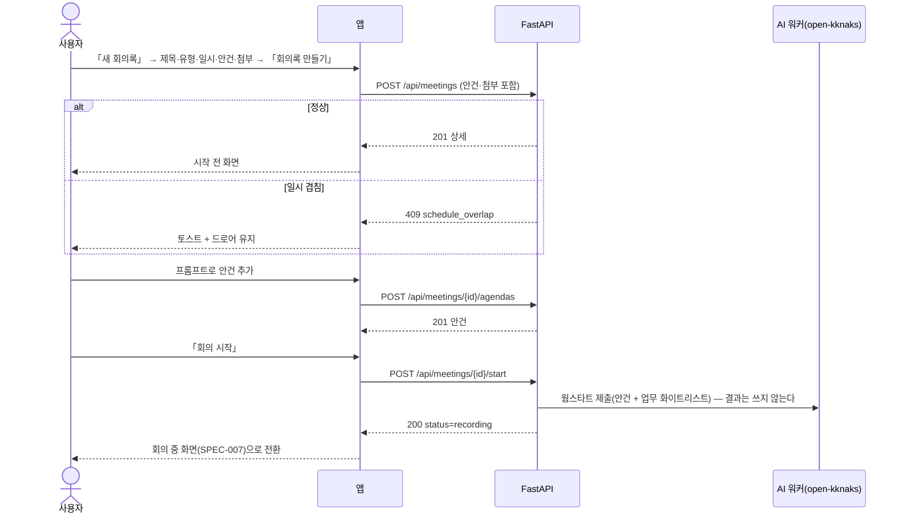
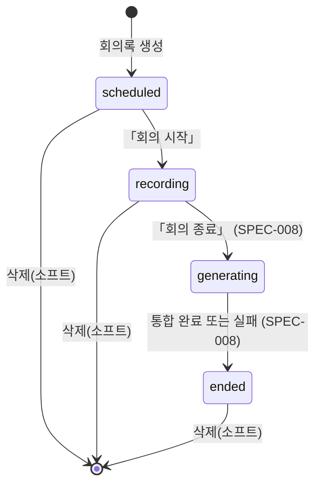

# 회의록 — 목록 · 생성 · 시작 전

회의록을 만들고, **시작 전에 안건을 먼저 적고**, 「회의 시작」을 눌러 기록으로 넘어간다. 회의록은 월 단위로 쌓이고 프로젝트로 거른다. 시작 전에는 프롬프트가 **안건만** 만든다 — 줄은 회의가 시작돼야 생긴다.

> 기능/정책 묶음 단위의 **외부 계약** 문서다. client / QA / 외부 통합이 이 문서만 읽고 따를 수 있어야 한다.
> SPEC에는 table schema 전문, ORM field, repository/service 구조, PR 계획, 구현 순서, 라우트·컴포넌트 파일 경로 같은 내부 구현을 두지 않는다.

## 1. Context

### Meta

- Decision reference: DEC-003 §1(범위) · §3(필드) · §4(생명주기·삭제) · §5(CRUD) · §8(연결)
- Baseline reference: BASE-003 (회의록)
- 소비 규약: DEC-001 §3(유형은 **종류=미팅**인 동적 유형 · 프로젝트) · DEC-004 §8(첨부는 자료함 md 만) · DEC-005 §3(**회의 일시는 회의록이 소유**, `schedule` 은 파생) · §7(겹침 차단)
- Architecture reference: `backend/README.md` §8-2·§10 · `frontend/README.md` §1·§3-3·§6·§7 · `database/domains/meeting.md` M-1·M-2·M-3·M-5·M-5-a·M-13·M-17
- Design reference: `12-meeting-notes.md` · `회의록.dc.html` P-33~P-36·P-46 · `09-design-tokens.md` · `디자인 시스템.dc.html [07][10]` · 정정 §A-6·§A-7·§A-11
- Domain note: 외부에 드러나는 것은 **회의록**(제목·유형·프로젝트·일시·상태)과 **안건**, **첨부**다. 줄·트랜스크립트는 SPEC-007·008
- Open questions: §7

### Business Requirement

- **시작 전에 안건을 적는 것이 이 화면의 목적이다.** 그 안건이 회의 중 AI 배치의 컨텍스트(웜스타트)가 되고, AI 트랙이 붙을 축이 된다(DEC-003 §8 · §STT).
- 유형은 **설정의 동적 유형 중 종류=「미팅」인 것**이다. 디자인의 `미팅·회의 | 반복 | 개인` 3종 고정 enum 은 **폐기**됐고 **반복 회의는 v1 제외**다(§A-7 · M-2).
- 상태에 **「생성중」이 신설**됐다(§A-6 · M-3). 이 spec 은 `scheduled → recording` 까지를 계약하고, 그 뒤는 SPEC-007·008 이 잇는다.

### Scope

In scope:

- 회의록 **목록**(월 단위 · 우측 프리뷰) · **프로젝트 필터 칩** · **프로젝트 생성 진입점**
- **새 회의록 드로어**(840) — 제목 · 프로젝트 · 유형 · 일시 · 안건 · 첨부
- **시작 전 화면** — 상태 바 「기록 대기」 · **프롬프트로 안건 생성** · 「회의 시작」
- 안건 CRUD(시작 전) · 첨부(자료함 md) · 회의록 메타 수정
- **삭제 확인 모달**(600) · 소프트 딜리트
- **회의록 영역 반응형**(Q-25 — 이 영역 전체의 정본. SPEC-007·008 이 참조한다)

Out of scope:

- 회의 중 기록·STT·AI 배치 — **SPEC-007**
- 종료·통합·편집·업무 생성/갱신·회의 상세 드로어 — **SPEC-008**
- 반복 회의 · 예약 알림 · 외부 캘린더 등록 — v1 밖(DEC-003 §1·§8)
- 회의 중 md 작성(`source=local`) — **v2**(§A-11 · M-17)
- 캘린더 화면 — 배치 ④(회의 일시가 `schedule` 로 파생된다는 사실만 참조)

## 2. UX Contract

### Placement

앱 셸 안의 페이지. 목록은 좌 목록 + 우 프리뷰, 상세(시작 전)는 좌 본문 + 우 사이드 탭이다.

```text
[목록 P-33]                               [시작 전 P-35]
+──────────────────────+────────────+     +─────────────────────+──────────+
│ 8월 회의록 7건 · 최신순 │ 프리뷰      │     │ 상태 바 「기록 대기」 [회의 시작] │
│ [전체 7][미정 2][A 3] │ 회의록/원문 │     │ 안건 목록(줄 없음)   │ 스크립트  │
│ 행: 일시·유형·제목     │ [상세보기]  │     │ 하단 프롬프트(안건만) │ 첨부      │
+──────────────────────+────────────+     +─────────────────────+──────────+
```

### U-1. 회의록 목록 (P-33)

- **상태**
  - *정상*: 헤더 타이틀 + **기간 스테퍼 「‹ 2026년 8월 ›」**(항상 노출 — [10] 「스코프 표시 필수」) + 「새 회의록」. 좌측 캡션 「8월 회의록 7건 · 최신순」, 목록 행에 일시 · 유형 배지 · 제목 · 요약 한 줄
  - *행 상태 표시*: `scheduled` 「예정」 · `recording` 「기록 중」(dot `#7181F8` + 3px 광륜) · `generating` 「**생성중**」 · `ended` 표시 없음. 통합 실패면 「통합 정리 실패」 회색 칩(SPEC-008 U-3 이 정본)
  - *로딩*: 스켈레톤 6줄(SPEC-004 U-11 규격)
  - *빈 상태*: 「2026년 8월에 회의록이 없습니다」 + 「새 회의록」 · 「이전 달 보기」
  - *실패*: 빈 목록으로 대체하지 않는다. 실패 표시 + 「다시 시도」(FE §3-5)
- **문구**: 요약 한 줄은 **AI 한 줄 요약**이다. 아직 없으면(종료 전) 안건 수를 대신 적는다 — 「안건 3」
- **CTA**: 행 클릭 → 우측 프리뷰 갱신 · 프리뷰 「상세보기」 → 상태에 따른 화면(시작 전 U-3 / 회의 중 SPEC-007 / 종료 SPEC-008) · 「새 회의록」 → U-2 드로어
- **기대 결과**: 목록·프리뷰가 같은 기간·필터를 본다. 조건은 쿼리에 남는다(`?date=`·`?projectId=` — FE §1-2). **소프트 딜리트된 회의록은 보이지 않는다**

### U-2. 프로젝트 필터 칩 · 프로젝트 생성 진입점 — 미설계 확정 (DEC-003 OQ-6 · Q-24)

- **상태**: 목록 상단에 칩 줄 — 「**전체 7**」 · 「**미정 2**」 · 프로젝트별 「소개서 개정 3」 …. 선택 칩은 `#F1F2FE` + `#7181F8`(선택 색), 미선택은 `#5F6470`. **검정을 쓰지 않는다**([10] 「검정은 위치, 보라는 선택」)
  - 「미정」은 **프로젝트 없는 회의**다 — 저장 계층에 기본 프로젝트를 만들지 않는다(DEC-002 §3 의 「프로젝트 없음」 가상 그룹 규칙 승계)
  - 칩이 한 줄을 넘으면 **줄바꿈**한다. 가로 스크롤·「더보기」를 만들지 않는다
- **문구**: 칩 라벨 + 건수. 건수는 **현재 기간 기준**이다
- **CTA**: 칩 클릭 → 필터 적용(즉시). 같은 칩을 다시 누르면 「전체」로 돌아간다
- **프로젝트 생성 진입점**: **필터 칩 줄에 두지 않는다** — 필터는 거르는 축이지 만드는 축이 아니다. 대신 **프로젝트 셀렉터(U-3 생성 드로어) 팝오버 하단**에 구분선 + 「**+ 새 프로젝트**」를 두고, 누르면 그 자리에 **인라인 행**(이름 + 색 트리거)이 열린다. 필드가 둘이라 드로어를 열지 않는다([10] 「필드 4개 이하면 드로어를 열지 않는다」). 팔레트·검증은 **SPEC-002 §4** 를 그대로 쓴다
- **기대 결과**: 만든 프로젝트가 즉시 셀렉터에 선택된 채로 들어오고, 설정의 프로젝트 목록에도 나타난다. **이 진입점은 프로젝트 셀렉터가 있는 모든 화면의 공통 규격**이다(업무 생성 드로어 포함 — §7)

### U-3. 새 회의록 드로어 (P-34 — 정정 반영)

여러 값을 넣는 편집이라 **드로어 840**이다([10]).

- **상태**
  - *열림*: 헤더 72(「새 회의록」 + ×) · 본문 · 푸터 76(취소 / 「**회의록 만들기**」). 열자마자 제목에 포커스
  - *제출 가능*: **제목 1자 이상 + 유형 선택 + 시작·종료 일시**가 있어야 한다. 회의는 시간이 사실상 필수라 일시를 비워 두지 않는다(M-1)
  - *실패*: 드로어가 닫히지 않고 해당 필드에 인라인 안내(§4 Case Matrix)
- **문구·필드 순서**
  1. **제목**
  2. **프로젝트(선택) · 유형(필수)** 한 줄 — **유형 목록에는 종류가 「미팅」인 것만 나온다**(M-2 · §A-7). 「반복」·「개인」 같은 고정 항목은 없다
  3. **일시** — 날짜 + 시작–종료 시각
  4. **안건** — 인라인 추가 행(「안건 입력 후 Enter」 + 「추가」 버튼 병행). 순서 그대로 저장된다
  5. **첨부** — 「자료 첨부」 → 자료함 문서 팝오버(**md 만** — DEC-004 §8 · M-17). **로컬 파일 첨부·회의 중 md 작성 칸이 없다**(§A-11)
  - **연관 업무를 고르는 칸이 없다**(DEC-003 §5) — 업무 연결은 회의 중 「연관 업무」 줄로 한다
- **CTA**: 「취소」 · 「**회의록 만들기**」(`#7181F8`)
- **기대 결과**: 만들면 드로어가 닫히고 **시작 전 화면(U-4)** 으로 이동한다. 회의 일시가 곧 캘린더 일정으로 파생된다(DEC-005 §3 — 화면은 배치 ④)

### U-4. 시작 전 화면 (P-35 · P-36)

- **상태**
  - *상태 바*: 회색 「**기록 대기 00:00:00**」 + 우측 「**회의 시작**」(`#7181F8`)
  - *좌측*: 「회의록 | AI 요약」 탭. 회의록 탭에 **안건 목록만** 있고 줄이 없다. AI 요약 탭은 비어 있고 캡션 「회의가 시작되면 AI 가 정리합니다」. 탭 dot 은 둘 다 `#B3B3B3`(12-meeting-notes §탭)
  - *우측*: 「실시간 스크립트 | 첨부 파일」 탭. 스크립트 탭은 빈 상태 「**아직 회의 전입니다**」, 첨부 탭이 비면 「첨부한 자료가 없습니다」(P-36)
  - *안건 없음*: 안건 목록 자리에 「안건을 먼저 적어 두면 AI 가 그 축으로 정리합니다」 캡션
- **문구**: 하단 프롬프트 바 플레이스홀더 「**안건을 입력하고 Enter**」
- **CTA**
  - 프롬프트 — **안건만 만든다.** `/` 를 눌러도 줄 종류가 나오지 않고 캡션 「회의가 시작되면 줄을 적을 수 있습니다」가 뜬다(12-meeting-notes §상태별 화면). **버튼(「추가」)을 함께 둔다**([10])
  - 안건 행 hover — 「이름 바꾸기」(인라인) · 「삭제」. 순서는 드래그로 바꾼다
  - 헤더 「⋯」 — 「회의록 정보 수정」(U-3 드로어를 값이 채워진 채로 연다) · 「**삭제**」(U-5)
  - 「**회의 시작**」 → 상태가 `recording` 이 되고 **SPEC-007 회의 중 화면**으로 바뀐다
- **기대 결과**: 「회의 시작」을 누르면 마이크 권한을 묻고(SPEC-007 U-8), 승인되면 기록이 시작된다. **시작 전에는 줄이 하나도 만들어지지 않는다**

### U-5. 삭제 확인 모달 (600) — 미설계 확정 (DEC-003 OQ-6 · Q-23)

「되돌리기 어려운 결정 하나」라 **모달 600**이다([10]). 배치 ①·② 의 확인 모달과 같은 프레임(제목 → 요약 → 경고 슬롯 → 취소/삭제)을 쓴다.

- **상태**: 스크림 `rgba(30,30,30,0.36)`. 진행 중에는 버튼 비활성
- **문구**
  - 제목 「**'<제목>' 회의록을 삭제할까요?**」
  - 요약 「목록에서 사라지고 캘린더에서도 보이지 않습니다. 안건·줄·스크립트·첨부도 함께 보이지 않게 됩니다.」
  - 경고 슬롯 「**v1 에는 복원 화면이 없습니다. 녹음 원본은 서버에 그대로 남습니다.**」(DEC-003 §4·§6 · M-13)
- **CTA**: 「취소」 · 「**삭제**」(`#E2685B`)
- **기대 결과**: 목록·프리뷰·캘린더 파생에서 즉시 빠진다. **녹음 파일은 지워지지 않는다** — 개인 녹음이라 보존한다

### U-6. 회의록 영역 반응형 — 미설계 확정 (DEC-003 OQ-6 · Q-25)

**이 영역 전체의 정본**이다. SPEC-007·008 의 화면도 이 표를 따른다. 1920 좌표(좌 1160 / 우 464)는 **비율의 참고값**이고 `position:absolute` 로 박지 않는다(§C Q-34 · §A-13).

| 구간 | 목록 | 회의 화면(시작 전 · 회의 중 · 상세) |
|---|---|---|
| **< 1280** | 최소 폭 안내 화면(SPEC-000 U-2) | 〃 |
| **1280 ~ 1439** | 사이드바 숨김 + 햄버거, 여백 48. **우측 프리뷰를 접는다** — 행을 누르면 프리뷰가 **오버레이 400**으로 열린다 | 좌 본문 **유동** + 우 사이드 탭 **400 고정**(`08-responsive.md` L20). 우측이 접히지 않는다 — 스크립트는 회의 중 계속 봐야 한다 |
| **≥ 1440** | 사이드바 200, 여백 80 → 240 연속 보간. 좌 목록 유동 + 우 프리뷰 400~464 | 좌 본문 유동 + 우 사이드 탭 464 |

- **우측 스크립트 패널을 좁혀서 없애지 않는다.** 400 미만으로는 화자 블록이 읽히지 않는다
- 편집 드로어(SPEC-008 U-6)는 1280~1439 에서 **전체 화면**으로 바뀐다(`08-responsive.md` L17)

## 3. User Scenario

### S-1. 사용자 — 회의록을 만든다

1. 「새 회의록」 → 드로어가 열리고 제목에 커서가 있다.
2. 제목을 적고 **유형**을 고른다 → 목록에 **종류가 「미팅」인 유형만** 보인다.
3. 프로젝트 셀렉터를 열고 하단 「+ 새 프로젝트」로 그 자리에서 프로젝트를 만든다 → 만든 프로젝트가 선택된다.
4. 일시(시작–종료)를 넣고 안건 세 개를 `Enter` 로 적는다.
5. 「회의록 만들기」 → 시작 전 화면으로 간다.

### S-2. 사용자 — 시작 전에 안건을 더 적는다

1. 하단 프롬프트에 안건을 적고 `Enter` → 안건이 추가된다.
2. `/` 를 눌러 본다 → 줄 종류가 나오지 않고 「회의가 시작되면 줄을 적을 수 있습니다」가 뜬다.
3. 안건 하나를 hover 해 이름을 고치고, 다른 하나를 지운다.

### S-3. 사용자 — 첨부를 붙인다

1. 우측 「첨부 파일」 탭이 비어 있다.
2. 「자료 첨부」 → 자료함 문서 팝오버에서 md 를 고른다 → 목록에 추가된다.
3. **로컬 파일을 올리는 칸이 없다** — 자료함에 먼저 올려야 한다.

### S-4. 사용자 — 회의를 시작한다

1. 「회의 시작」을 누른다 → 마이크 권한을 묻고, 승인하면 상태 바가 「기록 중」으로 바뀐다.
2. 화면이 회의 중(SPEC-007)으로 넘어간다. 목록에서 그 회의록은 「기록 중」으로 보인다.

### S-5. 사용자 — 프로젝트로 거른다

1. 목록 상단 칩에서 「소개서 개정」을 누른다 → 그 프로젝트의 회의록만 남고 건수가 바뀐다.
2. 「미정」을 누르면 **프로젝트 없는 회의**만 보인다.
3. 같은 칩을 다시 누르면 「전체」로 돌아간다. 새로고침해도 조건이 유지된다.

### S-6. 사용자 — 회의 일시가 다른 일정과 겹친다

1. 이미 14:00–15:00 인 업무나 회의가 있는데 같은 시간으로 회의록을 만든다.
2. **만들어지지 않고** 「그 시간에 다른 일정이 있습니다」 토스트가 뜬다. 드로어는 열린 채 값이 남는다.
3. 15:00–16:00 으로 바꾸면 만들어진다(**경계 접촉은 겹침이 아니다** — DEC-005 §7).

### S-7. 사용자 — 회의록을 지운다

1. 헤더 「⋯」 → 「삭제」 → 확인 모달에 「v1 에는 복원 화면이 없습니다. 녹음 원본은 서버에 그대로 남습니다」가 보인다.
2. 삭제하면 목록에서 사라진다.

## 4. Interface Contract

### API Contract

| Method | Path | 요약 | 권한 |
|---|---|---|---|
| GET | `/api/meetings` | 목록(기간·프로젝트 필터) | 세션 |
| POST | `/api/meetings` | 회의록 생성(안건·첨부 포함) | 세션 |
| GET | `/api/meetings/{id}` | 회의록 상세(트랙별) | 세션 |
| PATCH | `/api/meetings/{id}` | 제목·유형·프로젝트·**일시** 수정 | 세션 |
| DELETE | `/api/meetings/{id}` | 삭제(소프트) | 세션 |
| POST | `/api/meetings/{id}/agendas` | 안건 추가 | 세션 |
| PATCH | `/api/meetings/{id}/agendas/{agendaId}` | 안건 제목·순서 수정 | 세션 |
| DELETE | `/api/meetings/{id}/agendas/{agendaId}` | 안건 삭제 | 세션 |
| POST | `/api/meetings/{id}/attachments` | 첨부 추가(자료함 md) | 세션 |
| DELETE | `/api/meetings/{id}/attachments/{attachmentId}` | 첨부 제거 | 세션 |
| POST | `/api/meetings/{id}/start` | **회의 시작** — 상태를 `recording` 으로 | 세션 |

- **일시는 회의 필드**라 일반 `PATCH` 로 바뀐다. `schedule` 을 직접 쓰는 API 는 없다(DEC-005 §3 · BE-10)
- 상세는 **트랙별로 갈라서** 준다(`backend/README.md` §10). 이 spec 에서는 `human` 트랙만 값이 있고 나머지는 빈 트리다
- **회의 종료·통합·줄 편집·업무 연동 표면은 SPEC-008**, **스트림은 SPEC-007** 이다

### Request / Response

에러는 여기 두지 않는다 — **Case Matrix 가 단일 SoT** 다.

**`GET /api/meetings`** — 쿼리 `from`·`to`(UTC 경계) · `projectId`(생략=전체, `none`=미정)

```json
{
  "items": [
    { "id": 21, "title": "제품 소개서 리뷰",
      "workType": { "id": 1, "name": "미팅·회의", "colorToken": "indigo", "isDeleted": false },
      "project": { "id": 7, "name": "소개서 개정", "colorToken": "violet", "isDeleted": false },
      "startAt": "2026-08-27T00:30:00Z", "endAt": "2026-08-27T01:30:00Z",
      "status": "ended", "integrationState": "succeeded",
      "aiHeadline": "소개서 개정 범위를 4개 섹션으로 확정했다",
      "agendaCount": 3, "attachmentCount": 1 }
  ],
  "total": 7,
  "projectCounts": [
    { "projectId": null, "name": "미정", "count": 2 },
    { "projectId": 7, "name": "소개서 개정", "count": 3 }
  ]
}
```

- `projectCounts` 는 **현재 기간 기준**이고 프로젝트 필터 자신은 반영하지 않는다(SPEC-004 `typeCounts` 와 같은 규칙 — 칩 숫자가 흔들리지 않게)

**`POST /api/meetings`**

```json
{
  "title": "제품 소개서 리뷰",
  "workTypeId": 1, "projectId": 7,
  "startAt": "2026-08-27T00:30:00Z", "endAt": "2026-08-27T01:30:00Z",
  "agendas": [{ "title": "개정 범위" }, { "title": "일정" }],
  "attachments": [{ "documentId": 12 }]
}
```

→ `201` 상세와 같은 형태. 드로어에 넣은 안건·첨부가 **같은 요청**으로 저장된다.

**`GET /api/meetings/{id}`**

```json
{
  "id": 21, "title": "제품 소개서 리뷰",
  "workType": { "...": "..." }, "project": { "...": "..." },
  "startAt": "...", "endAt": "...",
  "status": "scheduled", "integrationState": "not_started",
  "aiHeadline": null,
  "recordingStartedAt": null, "batchSeqApplied": 0,
  "tracks": {
    "human":  { "agendas": [ { "id": 5, "title": "개정 범위", "orderIndex": 0, "state": "next", "lines": [] } ] },
    "ai":     { "agendas": [] },
    "merged": { "agendas": [] }
  },
  "attachments": [ { "id": 3, "documentId": 12, "name": "제품 소개서 v2", "ext": "md", "sizeBytes": 20480 } ]
}
```

- **트랙 셋이 각각 「안건 > 줄」 트리 하나**다(M-5-a). 탭 하나가 트랙 하나를 그대로 그린다
- `batchSeqApplied` 는 **반영된 배치 회차**이고 파생값이다(M-6-a — SPEC-007 이 쓴다)

**`POST /api/meetings/{id}/start`** → `200` 갱신된 상세(`status: "recording"`, `recordingStartedAt` 채워짐)

- 시작 시 **AI 세션 웜스타트**가 함께 제출된다(결과는 쓰지 않는다 — DEC-003 §STT · M-12). 실패해도 회의 시작을 막지 않는다(§5)

### Validation

| 필드 | 규칙 |
|---|---|
| `title` | **필수**. 공백 제거 후 1~200자 |
| `workTypeId` | **필수**. 본인의 삭제되지 않은 유형이고 **종류가 `meeting`** 이어야 한다(M-2) |
| `projectId` | 선택. 본인의 삭제되지 않은 프로젝트. 없으면 「미정」 |
| `startAt` · `endAt` | **둘 다 필수**(M-1). `endAt > startAt`. 길이는 5분 이상 300분 이하 — **300분 초과 회의를 다루지 않는다**(DEC-003 §4 · M-18) |
| 안건 `title` | 필수. 1~200자. 한 회의에 50개 이하 |
| 첨부 `documentId` | 본인의 삭제되지 않은 **`.md` 문서**(DEC-004 §8 · M-17). 같은 문서를 두 번 붙이면 중복 행을 만들지 않는다 |
| 시작(`/start`) | 상태가 **`scheduled`** 일 때만. 이미 `recording`·`generating`·`ended` 면 거부 |
| 안건 수정·삭제 | 상태가 **`scheduled` 또는 `recording`** 일 때만. 종료 후 편집은 SPEC-008 이 정의한다 |
| 삭제 | 상태 무관. **`recording` 중이면 스트림을 먼저 끊는다**(§5) |

### Case Matrix

이 spec 의 모든 에러·경계가 여기 있다. API 절에는 정상 응답만 둔다.

| 에러 코드 | 백엔드 출력 | 프론트 출력 | 표시 위치 |
|---|---|---|---|
| `validation_error` | `422 {detail:"입력값을 확인해 주세요", code:"validation_error"}` | 해당 컨트롤 실패 테두리 + 인라인 문구(예 「회의는 300분을 넘을 수 없습니다」) | 그 필드 |
| `invalid_work_type` | `422 {detail:"회의에는 종류가 미팅인 유형만 쓸 수 있습니다", code:"invalid_work_type"}` | 유형 셀렉터 옆 인라인 안내 + 목록 갱신 | 유형 셀렉터 |
| `schedule_overlap` | `409 {detail:"그 시간에 다른 일정이 있습니다", code:"schedule_overlap"}` | **토스트** + 일시 값 원복. **저장되지 않는다** | 화면 하단 토스트 |
| `unsupported_file_type` | `422 {detail:"md 문서만 첨부할 수 있습니다", code:"unsupported_file_type"}` | 첨부 팝오버 안 인라인 안내 | 첨부 팝오버 |
| `invalid_meeting_status` | `409 {detail:"지금 상태에서는 할 수 없습니다", code:"invalid_meeting_status"}` | 토스트 + 화면 갱신(다른 곳에서 상태가 바뀐 경우) | 화면 하단 토스트 |
| `not_found` | `404 {detail:"회의록을 찾을 수 없습니다", code:"not_found"}` | 「없는 회의록입니다」 + 「목록으로」. 목록에서는 토스트 + 갱신 | 회의 화면 / 토스트 |
| **(자동 저장 실패 — 위 어느 코드든, 또는 5xx·네트워크)** | 각 코드 그대로. **서버는 재시도하지 않는다** | **SPEC-002 U-7 규격** — 토스트 + 그 필드 실패 표시 + 「다시 저장」. 자동 재시도 없음 | 그 필드 + 하단 토스트 |
| (그 밖 5xx · 네트워크) | 전파 — 스택이 로그에 남는다 | **가리지 않는다.** 실패 표시 + 「다시 시도」. 빈 목록으로 대체하지 않는다 | 그 영역 |
| `token_expired` / `invalid_refresh_token` | SPEC-001 §4 | SPEC-001 §4 | — |

- **마이크 권한·스트림 관련 실패는 SPEC-007**, **통합 실패는 SPEC-008** 의 Case Matrix 에 있다
- 웜스타트 제출 실패는 **사용자에게 표시하지 않는다** — 결과를 쓰지 않는 호출이라 회의 시작을 막을 이유가 없다(§5). 그 밖의 예외는 **fallback 없이 전파**한다(DEC-003 §7)

### Flow



### State / Lifecycle



- **`generating` 은 신설 상태**다(§A-6 · M-3). 디자인의 3종(`scheduled|recording|ended`)은 정정 대상이다
- 통합 결과는 별도 축(`integrationState`)이 든다 — `not_started` · `running` · `succeeded` · `failed`(M-4). **「다시 생성」은 `ended` + `failed` 조합에서만** 뜬다(SPEC-008)
- **상태를 되돌리는 전이가 없다.** 종료한 회의를 다시 기록하지 않는다
- 삭제는 상태가 아니다(소프트 딜리트). **복원은 v1 에 없다**

### Data Contract

| 리소스 | 외부에 드러나는 필드 |
|---|---|
| 회의록 | `id` · `title` · `workType`(요약) · `project`(요약·null 가능) · `startAt` · `endAt` · `status` · `integrationState` · `aiHeadline` · `recordingStartedAt` · `batchSeqApplied`(파생) · `agendaCount` · `attachmentCount` |
| 트랙 | `tracks.human` · `tracks.ai` · `tracks.merged` — 각각 `{ agendas: [{ id, title, orderIndex, state, lines: [] }] }` |
| 안건 | `id` · `title` · `orderIndex` · `state`(`done`\|`next`) |
| 첨부 | `id` · `documentId` · `name` · `ext`(v1 은 `md`) · `sizeBytes` |

- **id 는 number**, **시각은 UTC ISO 문자열**(G-2). 회의 길이·경과 시간 표시는 화면이 한 곳에서 계산한다(FE §3-6)
- `status` 값은 영문 소문자다 — `scheduled` · `recording` · `generating` · `ended`(G-4)
- 유형 색은 **팔레트 토큰명**(SPEC-002 §4). 삭제된 유형·프로젝트는 `isDeleted: true` 로 실려 이름·색이 그대로 보인다(A-6)

## 5. Implementation Rules

- **생성은 한 요청이다.** 드로어에서 넣은 안건·첨부가 본체와 같은 트랜잭션으로 저장된다(`backend/README.md` §7)
- **회의 일시를 쓰면 일정이 따라 바뀐다.** 원본은 회의록이고 `schedule` 은 파생이다(M-1 · DEC-005 §3). **겹침 검사는 원본을 쓰기 전에** 돌고, 걸리면 원본도 바뀌지 않는다
- **시작 전에는 안건만 만든다.** 줄(`meeting_line`)을 만드는 경로가 이 spec 에 없다 — 줄은 회의 중(SPEC-007)이나 종료 후 편집(SPEC-008)에서만 생긴다
- **안건은 사람 트랙에 만들어진다**(`track='human'`). AI 안건은 회의 중 배치가 `track='ai'` 에만 만들고 **이 화면에 나타나지 않는다**(M-5-a · M-6)
- **웜스타트는 시작 시 한 번**이다 — 회의 하나에 AI 세션 하나이고, 이후 배치가 그 세션을 이어 쓴다(M-12). **결과를 쓰지 않으므로 실패해도 회의 시작을 막지 않는다.** 그 밖의 예외는 fallback 없이 전파한다(DEC-003 §7)
- **기록 중 삭제는 스트림을 먼저 끊는다.** 끊지 않고 행만 지우면 중계가 살아 있는 채로 원본을 잃는다
- **녹음 원본은 삭제하지 않는다**(M-13). 회의록을 소프트 딜리트해도 파일은 남는다
- **낙관적 갱신은 서버가 거부할 수 없는 것에만** 쓴다(FE §3-4) — 안건 추가·이름 수정은 낙관적으로, **일시 변경·회의 시작은 하지 않는다**(겹침·상태 거부가 정상 경로다)
- **자동 재시도가 없다**(FE §3-2). 실패는 SPEC-002 U-7 규격으로 남는다
- **소유 검사가 먼저다.** 남의 회의록은 404

## 6. Verification

### Acceptance Criteria

앱 창에서 사람이 직접 확인하는 문장으로 적는다.

- [ ] 「새 회의록」 드로어의 **유형 목록에 종류가 「미팅」인 유형만** 보이고, 「반복」·「개인」 항목이 없다
- [ ] 제목·유형·일시를 넣기 전에는 「회의록 만들기」가 **비활성**이다
- [ ] 프로젝트 셀렉터 하단 「**+ 새 프로젝트**」로 그 자리에서 프로젝트를 만들면 **바로 선택**되고 설정 화면 목록에도 나타난다
- [ ] 드로어에서 넣은 **안건과 첨부가 생성 직후 시작 전 화면에 그대로** 있다
- [ ] 첨부 팝오버에 **자료함 md 문서만** 나오고, 로컬 파일을 올리는 칸이 없다
- [ ] 이미 일정이 있는 시간으로 회의록을 만들면 「**그 시간에 다른 일정이 있습니다**」 토스트가 뜨고 만들어지지 않는다
- [ ] 301분짜리 회의를 만들려 하면 「회의는 300분을 넘을 수 없습니다」가 뜬다
- [ ] 시작 전 화면 하단 프롬프트로 **안건이 추가**되고, `/` 를 눌러도 **줄 종류가 나오지 않는다**
- [ ] 우측 스크립트 탭에 「**아직 회의 전입니다**」가 보인다
- [ ] 「회의 시작」을 누르면 상태 바가 「**기록 중**」으로 바뀌고 목록에서도 「기록 중」으로 보인다
- [ ] 목록 프로젝트 칩에서 「미정」을 누르면 **프로젝트 없는 회의만** 남고, 같은 칩을 다시 누르면 전체로 돌아간다
- [ ] 필터·기간을 건 뒤 새로고침해도 **조건이 유지**된다
- [ ] 삭제 모달에 「**v1 에는 복원 화면이 없습니다. 녹음 원본은 서버에 그대로 남습니다**」가 보이고, 삭제하면 목록에서 사라진다
- [ ] 창을 1280~1439 로 줄이면 목록의 **우측 프리뷰가 오버레이**로 바뀌고, 회의 화면은 좌 유동 + 우 400 이 된다

## 7. Open Questions

### 이 spec 이 닫은 것

| 닫힌 항목 | 무엇으로 닫았나 |
|---|---|
| **DEC-003 OQ-6 중 회의록 삭제 확인 모달**(Q-23) | **U-5 에서 확정** — 모달 600, 배치 ①·② 와 같은 프레임, 경고 슬롯에 **복원 없음 + 녹음 원본 보존**(M-13)을 함께 적었다 |
| **DEC-003 OQ-6 중 프로젝트 필터 칩 · 생성 진입점**(Q-24) | **U-2 에서 확정** — 칩은 「전체 / 미정 / 프로젝트별」 + 선택 색(`#F1F2FE`+`#7181F8`), 줄바꿈 허용. **생성 진입점은 필터 칩이 아니라 프로젝트 셀렉터 팝오버 하단의 인라인 행**(필터는 거르는 축이고 만드는 축이 아니다 · [10] 「필드 4개 이하면 드로어를 열지 않는다」). **프로젝트 셀렉터가 있는 모든 화면의 공통 규격**이다 — SPEC-003 의 업무 생성 드로어도 이 규격을 쓴다 |
| **DEC-003 OQ-6 중 회의록 영역 반응형**(Q-25) | **U-6 에서 확정** — 목록은 1280~1439 에서 프리뷰를 **오버레이 400**으로, 회의 화면은 좌 유동 + 우 **400 고정**(스크립트 패널을 접지 않는다). 근거: `08-responsive.md` L20 · §C Q-34 |
| **§A-7 정정**(유형 3종 고정 enum) | **U-3·§4 에서 확정** — 유형 셀렉터가 **종류=미팅인 동적 유형**만 보이고, 위반은 `invalid_work_type` 이다(M-2). **반복 회의는 v1 에 없다** |
| **§A-6 정정**(status 3종 → 「생성중」 신설) | **§4 State 에서 확정** — `scheduled → recording → generating → ended` 4종과 `integrationState` 별도 축(M-3·M-4) |
| **§A-11 정정**(회의 중 md 작성 `source=local`) | **U-3·U-4 에서 확정** — 첨부는 **자료함 md 참조뿐**이고 로컬 작성·업로드 칸을 두지 않는다(M-17 · DEC-004 §8) |

### 남은 것

| ID | Question | Owner | Next |
|---|---|---|---|
| S006-OQ-1 | **`invalid_meeting_status` 코드 신설.** `backend/README.md` §8-2 에 회의 상태 위반 코드가 없다(`meeting_stream_disconnected` 만 있다). 배치 ①·② 에서 만든 코드들과 함께 아키텍처 코드 표에 반영이 필요하다 | 코디 | 아키텍처 갱신 |
| S006-OQ-2 | **회의 길이 상한을 300분으로 못박았다.** DEC-003 §4 는 「300분 초과를 다루지 않는다」이지 「입력을 막는다」가 아니다 — spec 이 **생성 단계에서 막는** 쪽으로 정했다(다루지 않기로 한 경로를 애초에 못 만들게 하는 편이 낫다). 최소 5분도 spec 이 정한 값이다 | 사용자 | DEC-003 갱신 |
| S006-OQ-3 | **회의록 프리뷰의 「원문」 탭**(P-33 우측)은 종료된 회의의 스크립트를 보여주는 자리다. 시작 전·기록 중 회의를 골랐을 때 무엇을 보일지는 정책에 없다 — 지금 계약은 **상태 안내 문구만**(「아직 회의 전입니다」 / 「기록 중입니다」)이다 | 사용자 | DEC-003 갱신 |
| S006-OQ-4 | **안건 순서 변경을 드래그로 정했다.** 디자인에 안건 재정렬 규격이 없다(줄 재정렬도 마찬가지). 키보드 대체 경로는 안건 행 `⋯` 의 「위로/아래로」로 두었다 | 사용자(디자인) | DEC-003 갱신 |
