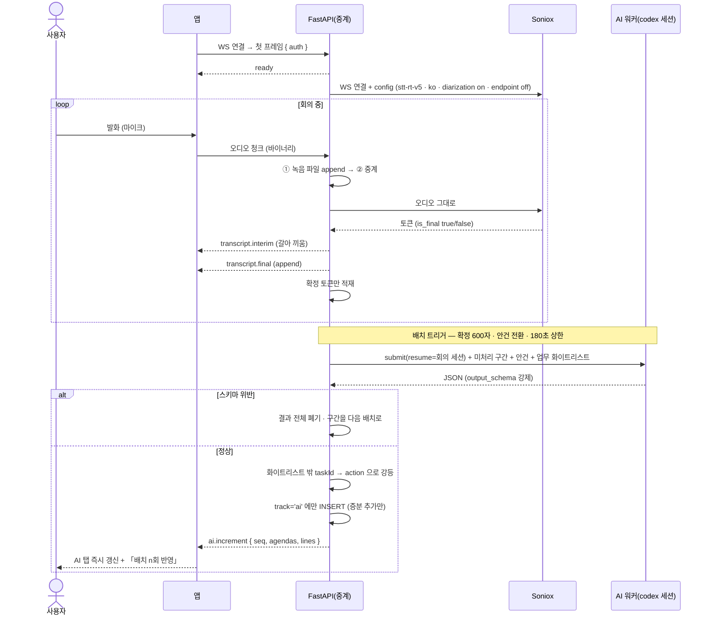
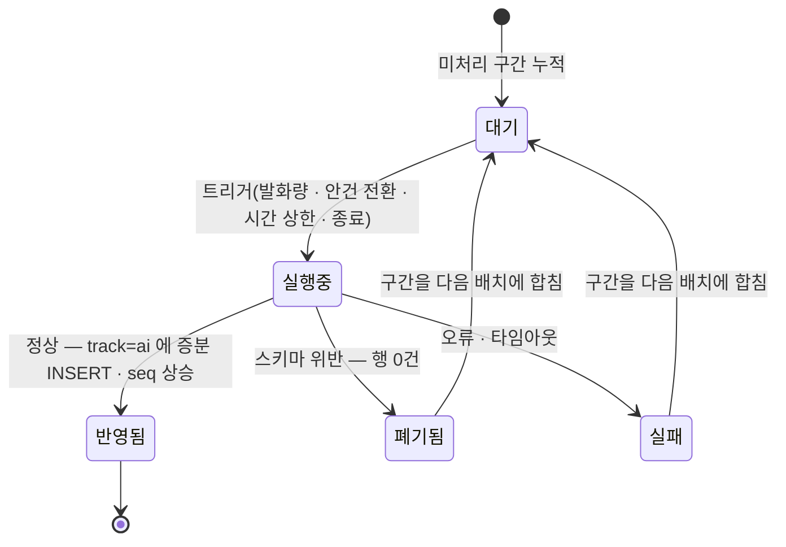

# 회의록 — 회의 중 (STT 중계 · 2트랙 · AI 배치)

말하면 **오른쪽에 스크립트가 쌓이고**, 사람은 왼쪽 회의록 탭에 줄을 적는다. **AI 는 AI 요약 탭만 채운다** — 사람 탭에 끼어들지 않고 줄을 제안하지도 않는다. AI 결과는 나오는 대로 즉시 반영되고, 몇 번째 배치까지 반영됐는지 화면에 적힌다.

> 기능/정책 묶음 단위의 **외부 계약** 문서다. client / QA / 외부 통합이 이 문서만 읽고 따를 수 있어야 한다.
> SPEC에는 table schema 전문, ORM field, repository/service 구조, PR 계획, 구현 순서, 라우트·컴포넌트 파일 경로 같은 내부 구현을 두지 않는다.

## 1. Context

### Meta

- Decision reference: DEC-003 §2(화자 표기) · §3(트랙·트랜스크립트) · §4(2트랙·AI 안건·증분·배치 갱신) · §6(기록) · §7(실패) · §STT(전송 경로·모델·트리거)
- Baseline reference: BASE-003 (회의록)
- Architecture reference: `system/README.md` §흐름 ③(불변식 10) · `backend/README.md` §5-1·§5-2·§8-2·§8-3·§10 · `frontend/README.md` §8 · `database/domains/meeting.md` M-5~M-16
- 기술 근거: `orchestration/work/docs-v1/soniox-study.md`(토큰 모델 · 화자 분리 · endpoint detection · 300분 한도)
- Design reference: `12-meeting-notes.md` §줄 종류·§탭·§상태별 화면 · P-37·P-38·P-39 · `09-design-tokens.md` · `디자인 시스템.dc.html [09][10]` · 정정 §A-5·§A-8·§A-11
- Domain note: 외부에 드러나는 것은 **트랜스크립트 블록**(익명 화자·오프셋·본문), **트랙별 안건>줄 트리**, **반영된 배치 회차**다
- Open questions: §7

### Business Requirement

- **2트랙이 이 영역의 설계 축이다**(DEC-003 §4 · M-6). 회의 중 AI 가 사람 문장을 건드리면 「내가 쓴 회의록」이 아니게 된다 — AI 는 자기 탭에만 쓴다. 디자인의 「줄 하나에 배치가 `detail`·`evidence` 를 채운다」 단일 트랙 모델은 **폐기**됐다(§A-5).
- **AI 결과는 모아 두지 않는다.** 나오는 대로 AI 탭에 반영하고 **반영 회차**를 보여준다 — 사람이 「지금 어디까지 정리됐는지」를 알아야 남은 회의를 진행할 수 있다(DEC-003 §4, 2026-09-05 · M-6-a).
- **프론트는 Soniox 를 모른다**(SYS-4 · 불변식 1). 오디오는 반드시 백엔드를 지나고, 그 길에서 녹음 원본이 적재된다.

### Scope

In scope:

- **마이크 캡처**(웹 `getUserMedia`)와 권한 실패 처리
- **웹소켓 계약** — 오디오 업 / 잠정·확정 토큰 다운 / **AI 증분 + 배치 회차** 다운
- **실시간 스크립트** — 잠정 토큰 갱신 · 확정 토큰 append · 익명 화자 블록
- **사람 트랙 프롬프트 입력** — `/` 로 줄 종류 선택 · 「다음 주제로」 · 안건 이동
- **AI 배치 파이프라인** — 트리거 수치 · 증분 반영 · **배치 회차 표시**
- **AI 요약 탭 렌더 규격**(미설계 확정) — 안건 > 줄 트리 + 근거 칩
- 첨부 탭과 파일 드로어(자료함 md)
- 실패 4종 — 배치 실패 · 스키마 위반 · 없는 업무 참조 · **연결 끊김**

Out of scope:

- 회의록 생성·시작 전·목록·삭제 — SPEC-006(반응형도 SPEC-006 U-6 이 정본)
- **종료·통합·편집·업무 생성/갱신** — SPEC-008(회의 중에는 버튼이 뜨지 않는다 — §5)
- 시스템 오디오 캡처 · 화자 이름 지정 · 2-pass 재전사 — v1 밖(DEC-003 §2·§STT)
- **300분 초과 회의** — 다루지 않는다(DEC-003 §4 · M-18). 재연결·세션 경계 처리를 넣지 않는다
- 회의 중 md 작성 — v2(§A-11 · M-17)

## 2. UX Contract

### Placement

```text
+──────────────────────────────────────────+──────────────────+
│ 기록 중 00:12:38            [회의 종료]   │                  │
+──────────────────────────────────────────+                  │
│ [회의록 ●] [AI 요약 ●]                    │ [실시간 스크립트 ●] │
│  안건 1                                   │  화자 1 09:31     │
│   논의 ─ …                                │  화자 2 09:33     │
│   결정 ─ …                                │  (잠정 회색)      │
│                                           │ [첨부 파일 2]     │
│  ┌ 프롬프트 바  「/」 종류 선택 ┐          │                  │
+──────────────────────────────────────────+──────────────────+
   좌: 유동 (1920 참고값 1160)                 우: 400~464 고정
```

**탭 dot 색은 회의 진행 상태를 따른다**(12-meeting-notes §탭) — 회의 중에는 회의록 `#B3B3B3` · AI 요약 `#338BF6`(진행) · 실시간 스크립트 `#7181F8`(진행) · 첨부 `#D9D9D9`. 진행 중 dot 에는 3px 광륜. **선택된 탭의 밑줄이 `#1E1E1E`(위치)이고, 화면당 Ink 는 이 축 하나뿐이다**([10] · FE §5-2).

### U-1. 상태 바

- **상태**
  - *기록 중*: 「**기록 중 00:12:38**」(회의 시작 기준 경과) + 우측 「**회의 종료**」
  - *자동 저장 표시*: 「자동 저장 09:42」 — 사람 줄이 저장된 마지막 시각
  - *스트림 끊김*: **U-7 배너**로 바뀐다
- **문구**: 위와 같다
- **CTA**: 「회의 종료」 → **SPEC-008 U-1** 의 종료 확인 모달
- **기대 결과**: 경과 시간은 **서버가 준 `recordingStartedAt` 기준**으로 그린다(클라이언트 타이머만으로 세지 않는다 — 새로고침해도 이어진다). **「일시정지」 버튼을 두지 않는다**(§7)

### U-2. 실시간 스크립트 (우측 탭)

- **상태**
  - *받아쓰기 중*: 상단에 「**받아쓰기 중**」 + 진행 dot. 확정 블록이 위에서부터 쌓이고 **맨 아래에 잠정 블록**이 회색(`#9EA2AE`)으로 붙는다
  - *잠정 토큰*: 응답이 올 때마다 **마지막 잠정 블록을 통째로 갈아 끼운다**(리셋 렌더 — soniox 토큰 모델). 잠정은 **저장되지 않는다**(M-9)
  - *확정 토큰*: **append 한다.** 지우거나 다시 쓰지 않는다. **화자가 바뀌면 블록을 나눈다**
  - *빈 상태*: 아직 발화가 없으면 「말을 시작하면 여기에 쌓입니다」
  - *스크롤*: 사용자가 위로 올려 읽는 중이면 **자동 스크롤을 멈추고** 하단에 「**최신으로**」 버튼을 띄운다
- **문구**: 블록 머리에 「**화자 1** · 09:31」 — **익명 라벨까지만**이다(DEC-003 §2 · M-10). 참석자·발언자 이름을 쓰지 않는다([10] 「사람 표기 없음」). 시각은 **회의 시작 기준 오프셋**을 시:분:초로 그린다(M-11)
- **CTA**: 「최신으로」 · 블록 클릭 시 아무 일도 없다(선택 강조만 — 근거 칩에서 오는 하이라이트와 구분한다 — SPEC-008 U-4)
- **기대 결과**: 화면이 밀려도 확정 블록은 사라지지 않는다. **혼잡할 때 버려지는 것은 잠정 토큰뿐**이다(`backend/README.md` §5-1 백프레셔)

### U-3. 사람 트랙 프롬프트 입력

- **상태**
  - *기본*: 하단 프롬프트 바(h52 r16). 플레이스홀더 「내용을 입력하고 Enter · `/` 로 종류 선택」
  - *`/` 입력*: 위로 열리는 팝오버 — **논의 · 결정 · 업무 · 액션** 4종 + 구분선 + 「**다음 주제로**」 · 「**안건 이동 ▸**」(안건 목록)
  - *종류 선택됨*: 입력 앞에 종류 라벨 칩이 붙는다(라벨 폭 34 — 12-meeting-notes §줄 종류). 지우면 기본값 **논의**
  - *저장 중·실패*: 실패하면 그 줄이 **입력창에 그대로 돌아오고** 토스트가 뜬다(SPEC-002 U-7 규격). 줄을 잃지 않는다
- **문구**: 줄 종류 라벨 「논의」 `#9EA2AE` · 「결정」 `#1663B5` · 「업무」 `#5F6470` · 「액션」 `#4B52A8`(12-meeting-notes)
- **CTA**: `Enter` 로 등록하되 **「추가」 버튼을 항상 함께 둔다**([10] 「단축키로 되더라도 화면에는 항상 버튼」). 「다음 주제로」는 **현재 안건을 `done` 으로 바꾸고 다음 안건으로 옮긴다** — 그 순간 **배치가 강제 flush 된다**(§5)
- **기대 결과**: 줄은 **현재 안건**에 붙고 **사람 트랙(`human`)에만** 생긴다. **업무·액션 줄을 적어도 업무가 생기지 않는다** — 버튼은 종료 후 상세에서만 뜬다(DEC-003 §5 · §7)

### U-4. AI 요약 탭 — 렌더 규격 확정 (DEC-003 OQ-1 · §A-8)

디자인 화면 6 은 「AI 요약 카드」였는데 정책은 **안건 > 줄 트리**를 요구한다. **회의록 탭과 같은 구조**로 그리고 근거 칩과 회차 표시를 얹는다 — 두 탭이 다른 문법이면 종료 후 통합본을 읽을 때 대조가 안 된다.

- **상태**
  - *구조*: 회의록 탭과 **같은 트리** — 안건 제목 + 그 아래 줄(라벨 34 + 본문, 안건 기준선 `border-left:2px #EBEBEB`). 종류 라벨도 4종 같은 색
  - *AI 안건*: AI 가 만든 안건은 이 탭에만 있다(M-5-a). 제목 우측에 **「AI 안건」 칩**(`#EEF1FE`/`#4A55B8`, h20 r4 11/600 — 유형 배지 규격 재사용). 사람 안건과 **섞어서 순서대로** 그리되 칩으로 구분한다
  - *근거 칩*: 줄 hover 시 우측에 펼치기 화살표. 펼치면 상세 설명 + 근거 칩 「09:34 – 09:36」. **줄 전체 클릭은 아무 동작도 하지 않는다**(회의 중 AI 줄은 편집 대상이 아니다 — M-6)
  - *배치 회차*: 탭 상단 우측에 「**배치 3회 반영 · 09:41**」. 새 증분이 오면 숫자가 오르고 **그 회차에 들어온 줄이 1.5초 동안 `#F4F5FF` 로 강조**된다
  - *아직 없음*: 「첫 정리는 발화가 쌓이면 시작됩니다」 캡션 + 회차 「배치 0회」
  - *회의 중 갱신 방식*: **증분만 추가**된다. 이미 있는 AI 줄이 바뀌거나 사라지지 않는다(M-7) — 전체 재정리는 종료 후 한 번뿐이다(SPEC-008)
- **문구**: 위와 같다. **「AI 가 제안합니다」 같은 문구를 두지 않는다** — 제안이 아니라 별도 트랙의 기록이다
- **CTA**: 근거 칩 클릭 → 우측 스크립트가 그 구간으로 스크롤하고 `#F4F5FF`/`#C9D1FB` 로 강조한다(12-meeting-notes §근거)
- **기대 결과**: **AI 탭의 어떤 것도 회의록 탭에 나타나지 않는다**(M-6 · 불변식 4·8). 사람은 AI 를 참고만 하고, 합치는 일은 종료 후에 일어난다

### U-5. 첨부 탭 · 파일 드로어 (P-39)

- **상태**: 목록(아이콘 · 이름 · 용량 · 시각 · 출처). 라벨 숫자는 0개면 생략(12-meeting-notes §탭)
  - *파일 드로어*: 항목을 누르면 드로어 840 — 「미리보기 / 원문 텍스트」 탭 + 「다운로드」 · 「자료함에서 열기」. **모달을 쓰지 않는다**(12-meeting-notes §첨부)
- **문구**: 빈 상태 「첨부한 자료가 없습니다」
- **CTA**: 「자료 첨부」 → 자료함 문서 팝오버(**md 만**). **회의 중 md 작성 진입점이 없다**(§A-11 · M-17)
- **기대 결과**: 첨부는 회의 중에도 붙일 수 있다. 미리보기는 SPEC-005 의 마크다운 렌더 규약을 그대로 쓴다

### U-6. 연결 끊김 — 자동 재연결 없음

- **상태**: 스트림이 끊기면 상태 바가 **경고 배너**로 바뀐다 — 배경 `#FCEEEC` 계열 실패 색 테두리, 「**녹음이 중단되었습니다**」 + 「끊긴 뒤의 말은 기록되지 않았습니다」. 좌측 회의록 탭은 그대로 남아 **계속 줄을 적을 수 있다**
- **문구**: 위와 같다. **「재연결 중…」 같은 문구를 쓰지 않는다** — 자동 재연결이 없다
- **CTA**: 「**다시 시작**」 — 누르면 스트림을 새로 연다(사람이 명시적으로 누를 때만). 「**회의 종료**」도 그대로 있다
- **기대 결과**: **조용히 되살리지 않는다.** 오디오가 빈 구간이 있었다는 사실이 화면에 남는다(DEC-003 §7 · 불변식 · FE §8)

### U-7. 마이크 권한 · 장치 실패

- **상태**
  - *권한 요청 중*: 「회의 시작」 직후 OS·웹뷰 권한 대화상자. 화면은 「마이크 권한을 확인하는 중입니다」
  - *거부됨*: 회의는 **`recording` 으로 넘어가지 않는다.** 시작 전 화면에 남고 안내가 뜬다
  - *장치 없음*: 같은 처리
- **문구**: 「**마이크를 쓸 수 없어 회의를 시작하지 못했습니다**」 + 「시스템 설정에서 이 앱의 마이크 권한을 켠 뒤 다시 시도해 주세요」
- **CTA**: 「**다시 시도**」
- **기대 결과**: 권한이 없으면 **빈 녹음으로 회의가 진행되지 않는다.** 상태는 `scheduled` 그대로다

### U-8. 반응형

**SPEC-006 U-6 이 정본**이다 — 1280~1439 에서 좌 본문 유동 + 우 사이드 탭 400 고정, 우측 스크립트 패널은 접지 않는다. 1280 미만은 안내 화면(SPEC-000 U-2).

## 3. User Scenario

### S-1. 사용자 — 말하면 스크립트가 쌓인다

1. 「회의 시작」 뒤 말을 한다 → 우측에 회색 잠정 문장이 나타났다가 **확정되면 검은 문장으로 굳는다.**
2. 다른 사람이 말하면 **「화자 2」 블록**으로 나뉜다.
3. 위로 올려 읽으면 자동 스크롤이 멈추고 「최신으로」 버튼이 뜬다.

### S-2. 사용자 — 회의록 줄을 적는다

1. 하단 프롬프트에 문장을 적고 `Enter` → 현재 안건에 **논의** 줄로 붙는다.
2. `/` 를 눌러 「결정」을 고르고 적으면 결정 줄이 된다.
3. 「업무」·「액션」 줄도 적어 본다 → **업무는 생기지 않는다.** 버튼도 보이지 않는다.

### S-3. 사용자 — 다음 안건으로 넘어간다

1. `/` → 「다음 주제로」를 고른다 → 현재 안건이 완료 표시가 되고 다음 안건이 현재가 된다.
2. 그 순간 **AI 배치가 강제로 돈다** — 잠시 뒤 AI 탭의 회차가 오른다.

### S-4. 사용자 — AI 탭을 본다

1. 「AI 요약」 탭으로 간다 → **안건 > 줄 트리**가 회의록 탭과 같은 모양으로 보인다.
2. 상단에 「**배치 3회 반영 · 09:41**」이 있다. 새 배치가 들어오면 숫자가 오르고 새 줄이 잠깐 강조된다.
3. AI 가 만든 안건에는 「AI 안건」 칩이 붙어 있다.
4. **회의록 탭으로 돌아가면 AI 줄도 AI 안건도 보이지 않는다.**

### S-5. 사용자 — 근거를 확인한다

1. AI 줄에 hover 하면 우측에 화살표가 나타난다. 펼치면 상세 설명과 「09:34 – 09:36」 칩이 보인다.
2. 칩을 누르면 **우측 스크립트가 그 구간으로 스크롤**되고 그 발화가 강조된다.

### S-6. 사용자 — 배치가 한 번 실패한다

1. 서버 쪽 배치가 실패한다 → **화면에는 아무 변화가 없다.** 회차도 오르지 않는다.
2. 다음 배치 때 **그 구간까지 합쳐서** 정리되어 들어온다.

### S-7. 사용자 — 네트워크가 끊긴다

1. 스트림이 끊기면 상태 바가 「**녹음이 중단되었습니다**」 배너로 바뀐다.
2. **자동으로 되살아나지 않는다.** 「다시 시작」을 눌러야 스트림이 다시 열린다.
3. 그동안에도 좌측에서 **줄은 계속 적을 수 있다.**

### S-8. 사용자 — 마이크 권한을 거부한다

1. 「회의 시작」 뒤 권한을 거부한다.
2. 「마이크를 쓸 수 없어 회의를 시작하지 못했습니다」가 뜨고 **시작 전 화면 그대로**다. 상태는 「예정」이다.

## 4. Interface Contract

### API Contract

| Method | Path | 요약 | 권한 |
|---|---|---|---|
| **WS** | `/api/meetings/{id}/stream` | **오디오 업 / 토큰·AI 증분 다운** | 첫 프레임 토큰 인증 |
| POST | `/api/meetings/{id}/lines` | 사람 줄 추가(프롬프트) | 세션 |
| PATCH | `/api/meetings/{id}/agendas/{agendaId}` | 안건 상태 전환(「다음 주제로」) | 세션 |
| GET | `/api/meetings/{id}/transcript` | 트랜스크립트 조회(재진입·새로고침 복구) | 세션 |
| POST | `/api/meetings/{id}/attachments` | 첨부 추가 | 세션 |

- **웹소켓은 이 하나뿐이다**(SYS-7). 오디오 업·토큰 다운·AI 증분 다운을 겸하고, 종료와 함께 닫힌다. 그 뒤의 「생성중」은 **job 폴링**으로 본다(SPEC-008)
- **프론트는 Soniox 주소도 키도 모른다**(DEC-003 §STT · 불변식 1). 오디오는 전부 이 채널로만 간다
- 회의록 메타·안건 CRUD·삭제는 **SPEC-006**, 종료·통합·편집·업무 연동은 **SPEC-008**

### Request / Response

에러는 여기 두지 않는다 — **Case Matrix 가 단일 SoT** 다.

**웹소켓 계약**

| 방향 | 프레임 | 내용 |
|---|---|---|
| ↑ 최초 | **텍스트** | `{ "type": "auth", "accessToken": "<jwt>" }` — **연결 직후 첫 프레임**(브라우저 WS 는 헤더를 못 붙인다 — `backend/README.md` §5-1) |
| ↓ | 텍스트 | `{ "type": "ready", "recordingStartedAt": "..." }` — 인증 성공, 업스트림 연결됨 |
| ↑ | **바이너리** | 오디오 청크. **포맷은 구현 시점에 고른다**(§C-8) — 계약은 「Soniox 가 받는 형식 중 하나로 보내고, 서버가 그대로 중계한다」이다 |
| ↓ | 텍스트 | `{ "type": "transcript.interim", "speakerLabel": "화자 1", "atMs": 812340, "text": "..." }` — **마지막 잠정 블록을 갈아 끼운다** |
| ↓ | 텍스트 | `{ "type": "transcript.final", "id": 991, "speakerLabel": "화자 1", "atMs": 812340, "endMs": 815120, "text": "..." }` — **append** |
| ↓ | 텍스트 | `{ "type": "ai.increment", "seq": 3, "appliedAt": "...", "agendas": [ … ], "lines": [ … ] }` — 그 회차에 들어온 **AI 안건·줄**(트랙 `ai`) |
| ↓ | 텍스트 | `{ "type": "error", "code": "meeting_stream_disconnected", "detail": "..." }` — 이어서 서버가 닫는다 |

- **잠정 토큰은 저장되지 않는다**(M-9). 화면 표시용이다
- **혼잡하면 잠정 토큰만 버린다** — 확정 토큰과 AI 증분은 버리지 않는다(`backend/README.md` §5-1)
- `atMs`·`endMs` 는 **회의 시작 기준 오프셋(밀리초)** 이다(M-11). 벽시계 시각과 섞지 않는다

**`POST /api/meetings/{id}/lines`**

```json
// 요청 — 회의 중에는 사람 트랙만 만든다
{ "agendaId": 5, "kind": "decision", "content": "도입 사례는 3건만 유지한다" }

// 201
{ "id": 77, "track": "human", "agendaId": 5, "kind": "decision",
  "content": "...", "detail": null, "evidence": [], "orderIndex": 4,
  "taskId": null, "pendingChange": null, "createdAt": "..." }
```

**`PATCH /api/meetings/{id}/agendas/{agendaId}`** — `{ "state": "done" }`(「다음 주제로」) → `200` 안건. **이 호출이 배치 강제 flush 의 트리거다**(§5)

**`GET /api/meetings/{id}/transcript`** — 쿼리 `afterId`(증분 조회)

```json
{ "items": [ { "id": 991, "speakerLabel": "화자 1", "atMs": 812340, "endMs": 815120, "text": "..." } ], "lastId": 991 }
```

- 새로고침·재진입 시 이 엔드포인트로 **확정 블록을 복구**하고, 이후는 WS 로 잇는다

### Validation

| 필드 | 규칙 |
|---|---|
| WS 첫 프레임 | **유효한 access 토큰**이어야 한다. 아니면 즉시 닫는다 |
| WS 접속 시점 | 회의 상태가 **`recording`** 이어야 한다. `scheduled`·`generating`·`ended` 면 거부 |
| 동시 접속 | 회의 하나에 **스트림 하나**. 두 번째 접속이 오면 **뒤에 온 쪽을 거부**한다(먼저 붙은 녹음을 끊지 않는다) |
| 줄 `agendaId` | **필수**. 그 회의의 **사람 트랙 안건**이어야 한다. 줄은 항상 안건에 속한다(M-5) |
| 줄 `kind` | `discussion` · `decision` · `task` · `action` |
| 줄 `content` | 필수. 1~2000자 |
| 줄 `track` | 요청에 담지 않는다 — **회의 중 이 표면은 언제나 `human`** 이다(M-6) |
| 안건 `state` | `done` 또는 `next` |
| 오디오 청크 | 서버는 형식을 판정하지 않고 그대로 중계한다. **파일 적재 실패 시 스트림을 끊는다**(§5) |

### Case Matrix

이 spec 의 모든 에러·경계가 여기 있다. **DEC-003 §7 의 실패 4종이 전부 여기 있다.**

| 에러 코드 | 백엔드 출력 | 프론트 출력 | 표시 위치 |
|---|---|---|---|
| **(회의 중 배치 실패)** | 사용자에게 보내지 않는다. 배치 이력에 실패로 남기고 **그 구간을 다음 배치 범위에 합친다** | **아무 표시도 하지 않는다.** 회차가 오르지 않을 뿐이다(DEC-003 §7 「사용자에게 표시하지 않음」) | (없음) |
| **(JSON 스키마 위반)** | 위와 같다. **그 배치 결과 전체 폐기 — 행을 하나도 넣지 않는다**(부분 파싱 금지 · M-16) | 위와 같다 | (없음) |
| **(없는 업무 참조)** | 화이트리스트 밖 `taskId` 는 **거부**. 그 줄은 `taskId` 를 떼고 **`kind='action'` 으로 강등하되 본문은 살린다**(M-15) | AI 탭에 **액션 줄로** 나타난다. 별도 경고를 띄우지 않는다 | AI 요약 탭 |
| `meeting_stream_disconnected` | `409 {detail:"녹음이 중단되었습니다", code:"meeting_stream_disconnected"}` — WS `error` 프레임으로도 같은 코드가 나간다. **자동 재연결하지 않는다** | **U-6 배너** — 「녹음이 중단되었습니다」 + 「다시 시작」. 좌측 입력은 계속 살아 있다 | 상태 바 |
| `invalid_meeting_status` | `409 {detail:"지금 상태에서는 할 수 없습니다", code:"invalid_meeting_status"}` | 토스트 + 화면 갱신(다른 곳에서 종료된 경우 상세로 전환) | 화면 하단 토스트 |
| `validation_error` | `422 {detail:"입력값을 확인해 주세요", code:"validation_error"}` | 프롬프트 입력에 **줄이 되돌아오고** 인라인 안내 | 프롬프트 바 |
| `not_found` | `404 {detail:"회의록을 찾을 수 없습니다", code:"not_found"}` | 「없는 회의록입니다」 + 「목록으로」 | 회의 화면 |
| `unsupported_file_type` | `422 {detail:"md 문서만 첨부할 수 있습니다", code:"unsupported_file_type"}` | 첨부 팝오버 인라인 안내 | 첨부 팝오버 |
| **(마이크 권한 거부·장치 없음)** | 서버가 관여하지 않는다 — WS 를 열지 않는다 | **U-7** 「마이크를 쓸 수 없어 회의를 시작하지 못했습니다」 + 「다시 시도」. 상태는 `scheduled` 그대로 | 시작 전 화면 |
| **(줄 저장 실패 — 5xx·네트워크)** | 전파 | **SPEC-002 U-7 규격** — 토스트 + 프롬프트에 줄 복구. 자동 재시도 없음 | 프롬프트 바 |
| **(녹음 파일 적재 실패)** | **스트림을 끊는다** — 원본이 남지 않는 녹음을 계속하지 않는다(`backend/README.md` §5-1) | `meeting_stream_disconnected` 와 같은 배너 | 상태 바 |
| `token_expired` / `invalid_refresh_token` | SPEC-001 §4 | SPEC-001 §4(WS 는 인증 실패 시 닫힌다 → 배너) | — |

- **이 표에 없는 예외는 fallback 없이 전파한다** — 500 으로 나가고 로그에 스택이 남는다(DEC-003 §7 · `backend/README.md` §8-1). 조용한 기본값·빈 결과로 대체하지 않는다
- **300분 초과·세션 경계·자동 재연결에 해당하는 케이스가 없다**(M-18 · FE §8)

### Flow



### State / Lifecycle

**배치 한 건의 생명주기**(회의 상태 전이는 SPEC-006 §4 가 정본).



- **동시에 도는 배치는 하나**다 — 회의당 AI 세션이 하나이므로(M-12) 실행 중 트리거가 오면 **다음 구간으로 미룬다**
- **회의 중에는 증분 추가만**이다(M-7). 전체 재정리는 종료 후 최종 배치 한 번(SPEC-008)

### Data Contract

| 리소스 | 외부에 드러나는 필드 |
|---|---|
| 트랜스크립트 블록 | `id` · `speakerLabel`(익명 「화자 1」) · `atMs` · `endMs` · `text` — **확정 토큰만** |
| AI 증분 | `seq`(반영 회차) · `appliedAt` · `agendas[]`(트랙 `ai`) · `lines[]`(트랙 `ai`) |
| 줄 | `id` · `track` · `agendaId` · `kind` · `content` · `detail` · `evidence[{fromMs,toMs}]` · `orderIndex` · `taskId` · `pendingChange` |
| 안건 | `id` · `track` · `title` · `orderIndex` · `state` |

- **`track` 이 계약에 드러난다** — 탭 하나가 트랙 하나를 그린다(M-5-a). 회의 중 사람 탭은 `human`, AI 탭은 `ai` 만 읽는다
- `evidence` 의 시각도 **회의 시작 기준 오프셋**이다(M-11)
- **화자 이름 필드가 없다**(M-10 · DEC-003 §2)

## 5. Implementation Rules

### 배치 트리거 — 수치 확정

DEC-003 §7·§STT 가 「수치는 spec 에서 정한다」로 넘긴 값이다.

| 트리거 | 값 | 근거 |
|---|---|---|
| **발화량** | 미처리 **확정 발화 600자** 이상이면 실행 | 한국어 발화는 분당 300~350자 수준이라 **약 2분치 발화**다. 요약 한 덩어리로 의미가 서는 최소 분량이고, 배치 왕복(수십 초)과 겹치지 않는다 |
| **안건 전환** | 「다음 주제로」·안건 이동 시 **즉시 flush**. 단 미처리 발화가 **80자 미만이면 돌지 않는다** | DEC-003 §STT 가 요구한 강제 flush. 안건 경계가 요약 경계와 맞아야 AI 트리가 사람 트리와 대조된다. 빈 구간으로 세션을 낭비하지 않는다 |
| **시간 상한** | 마지막 배치로부터 **180초**(3분) | 발화가 적은 회의에서도 **최소 3분마다** AI 탭이 갱신된다 — 「배치 n회」가 멈춰 보이지 않는 상한 |
| **종료** | 「회의 종료」 시 남은 구간으로 **최종 배치 1회**(SPEC-008 이 이어받는다) | DEC-003 §4 |
| **동시 실행** | **금지.** 실행 중 트리거가 오면 다음 구간으로 미룬다 | 회의당 AI 세션이 하나다(M-12) |
| **배치 타임아웃** | **120초** 초과면 그 배치를 실패로 마감하고 구간을 다음 배치에 합친다 | 시간 상한(180초)보다 짧아야 다음 트리거와 엉키지 않는다 |

**이 수치는 실사용에서 조정될 값이다**(§7). 조정해도 계약(트리거 네 종류·동시 실행 금지·구간 이월)은 바뀌지 않는다.

### 스트림

- **오디오는 ① 녹음 파일 append → ② Soniox 중계 순서**로 흐른다. **적재가 실패하면 그 자리에서 끊는다** — 원본이 남지 않는 녹음을 계속하지 않는다(`backend/README.md` §5-1)
- **업스트림은 클라이언트 연결이 성립한 뒤에 연다.** 미리 열어 두지 않는다(스트림 시간이 과금·한도에 직결된다)
- **잠정 토큰은 화면으로만, 확정 토큰만 적재**(M-9). 혼잡 시 버리는 것은 잠정뿐이다
- **자동 재연결을 넣지 않는다**(DEC-003 §7 · FE §8). 끊기면 상태를 드러내고 사람이 다시 시작한다
- **endpoint detection 을 켜지 않는다** — 조기 파이널라이즈가 화자 분리 정확도를 깎는다(soniox §유의사항 2 · DEC-003 §STT)
- **화자는 익명 라벨까지만**이다(M-10). 이름 매핑 기능을 만들지 않는다

### 2트랙

- **회의 중 AI 는 `track='ai'` 에만 INSERT 한다.** 사람 줄·사람 안건을 읽어 고치지 않고, **줄 제안도 하지 않는다**(M-6 · 불변식 4)
- **AI 안건은 AI 탭에만 보인다**(M-5-a · 불변식 8). 회의록 탭 쿼리는 `human` 트랙만 읽는다
- **회의 중 배치는 증분 추가만**이다 — 기존 AI 줄을 UPDATE 하지 않는다(M-7)
- **AI 증분은 즉시 나간다.** 버퍼링하지 않고, **반영된 배치 회차(`seq`)를 함께 싣는다**(M-6-a · BE-11). 회차는 저장 컬럼이 아니라 배치 이력의 성공분 최대값에서 파생한다(G-7)
- **회의 중에는 업무 생성·갱신 버튼이 뜨지 않는다.** 줄을 적는 것만으로 업무가 생기지 않고(DEC-003 §5 · M-14), 버튼은 종료 후 상세에서만 나온다(SPEC-008 U-7)

### 실패

- **처리하는 실패는 Case Matrix 에 열거한 것뿐이다. 그 밖의 예외는 fallback 없이 전파한다**(DEC-003 §7 · `backend/README.md` §8-1) — 광범위한 예외 포착은 어디서 깨졌는지를 가린다
- **스키마 위반은 부분 파싱하지 않는다.** 행을 하나도 넣지 않고 통째로 폐기한다(M-16)
- **화이트리스트 밖 `taskId` 는 본문을 살리고 액션으로 강등한다**(M-15). 화이트리스트는 회의의 프로젝트 업무이고, **무소속 회의면 무소속 업무**다(M-15-a)
- **자동 재시도는 배치 이월 하나뿐이다.** 클라이언트에는 재시도가 없다(FE §3-2)

## 6. Verification

### Acceptance Criteria

앱 창에서 사람이 직접 확인하는 문장으로 적는다.

- [ ] 「회의 시작」 뒤 말을 하면 우측에 **회색 잠정 문장이 나타났다가 확정되면 굳는다**
- [ ] 다른 목소리가 섞이면 「**화자 2**」 블록으로 나뉘고, **사람 이름은 어디에도 없다**
- [ ] 스크립트를 위로 올려 읽으면 자동 스크롤이 멈추고 「**최신으로**」 버튼이 뜬다
- [ ] 새로고침해도 **확정 스크립트가 남아 있고** 경과 시간이 이어진다
- [ ] 하단 프롬프트에서 `/` 로 「결정」을 골라 적으면 **현재 안건에 결정 줄**로 붙는다
- [ ] 「업무」·「액션」 줄을 적어도 **업무가 생기지 않고 버튼도 없다**
- [ ] `/` → 「다음 주제로」를 고르면 현재 안건이 완료로 바뀌고 **잠시 뒤 AI 탭 회차가 오른다**
- [ ] AI 요약 탭이 **회의록 탭과 같은 「안건 > 줄」 트리**로 보인다(카드 형태가 아니다)
- [ ] AI 탭 상단에 「**배치 n회 반영**」이 있고, 새 배치가 오면 숫자가 오르며 새 줄이 잠깐 강조된다
- [ ] AI 가 만든 안건에 「**AI 안건**」 칩이 붙는다
- [ ] **회의록 탭에는 AI 줄도 AI 안건도 보이지 않는다**
- [ ] AI 줄에 hover 해 화살표로 펼치면 근거 칩이 있고, **칩을 누르면 우측 스크립트가 그 구간으로 스크롤·강조**된다
- [ ] 배치를 한 번 실패시켜도 **화면에 아무 경고가 뜨지 않고**, 다음 배치에 **그 구간까지 합쳐서** 들어온다
- [ ] 스키마를 위반한 배치 결과가 오면 AI 탭에 **줄이 하나도 들어가지 않는다**
- [ ] 웜스타트 목록 밖 업무를 참조한 줄이 **액션 줄로 내려앉되 본문은 남는다**
- [ ] 네트워크를 끊으면 「**녹음이 중단되었습니다**」 배너가 뜨고 **자동으로 되살아나지 않는다**. 「다시 시작」을 눌러야 재개된다
- [ ] 끊긴 동안에도 **좌측에서 줄을 계속 적을 수 있다**
- [ ] 마이크 권한을 거부하면 회의가 시작되지 않고 안내와 「다시 시도」가 보인다

## 7. Open Questions

### 이 spec 이 닫은 것

| 닫힌 항목 | 무엇으로 닫았나 |
|---|---|
| **DEC-003 OQ-1**(AI 요약 탭 렌더 규격 · §A-8) | **U-4 에서 확정** — 카드가 아니라 **회의록 탭과 같은 「안건 > 줄」 트리**, AI 안건에 칩, hover 화살표로 근거 펼침, 칩 클릭 시 스크립트 스크롤·강조, 상단에 **배치 회차**. 근거: 두 탭이 같은 문법이어야 종료 후 통합본과 대조된다(DEC-003 §4) · [10] 「검정은 위치」(탭 밑줄만 Ink) · 유형 배지 규격 재사용 |
| **§A-5 정정**(줄 하나에 배치가 채우는 단일 트랙) | **§4 Data·§5 에서 확정** — `track` 이 외부 계약에 드러나고 탭 하나가 트랙 하나를 읽는다. 회의 중 AI 는 `ai` 트랙에만 INSERT 한다(M-6) |
| **DEC-003 §STT 의 배치 트리거 수치** | **§5 에서 확정** — 확정 발화 **600자** · 안건 전환 **즉시 flush(80자 미만이면 생략)** · 시간 상한 **180초** · 종료 시 최종 1회 · **동시 실행 금지** · 배치 타임아웃 **120초**. 각 값에 근거를 달았다 |
| **DEC-003 §7 실패 4종의 화면 계약** | **§4 Case Matrix 에서 확정** — 배치 실패·스키마 위반은 **사용자에게 표시하지 않고** 구간을 이월, 없는 업무 참조는 **액션으로 강등(본문 유지)**, 연결 끊김은 **배너 + 「다시 시작」(자동 재연결 없음)**. 「그 밖의 예외는 fallback 없이 전파」를 명시했다 |
| **§A-11 정정**(회의 중 md 작성) | **U-5 에서 확정** — 첨부는 자료함 md 참조뿐이고 작성 진입점이 없다(M-17) |

### 남은 것

| ID | Question | Owner | Next |
|---|---|---|---|
| S007-OQ-1 | **「일시정지」 버튼을 뺐다.** 디자인(P-37)에 「일시정지 / 회의 종료」가 있으나, 스트림을 멈췄다 잇는 것은 세션 경계 처리이고 **그 부류는 v1 에서 다루지 않기로** 했다(300분 초과와 같은 근거 — DEC-003 §4 · M-18). 필요하면 정책으로 올려야 한다 | 사용자 | DEC-003 갱신 |
| S007-OQ-2 | **배치 트리거 수치는 실측 전 값이다.** 600자·180초·120초·80자는 발화 속도와 codex 왕복 시간을 어림한 값으로, 첫 실제 회의 뒤 조정될 것이다. **계약(트리거 4종·동시 실행 금지·구간 이월)은 그대로 두고 값만 바꾼다** | 코디 | 구현·실측 후 |
| S007-OQ-3 | **오디오 전송 포맷을 spec 이 정하지 않았다** — §C-8 이 「구현 시점에 고른다」로 닫았기 때문이다. WS 계약은 「Soniox 가 받는 형식 중 하나를 그대로 중계한다」까지만 고정했다 | 코디 | 구현 시 |
| S007-OQ-4 | **동시 접속 정책은 spec 판단이다** — 회의 하나에 스트림 하나이고 **뒤에 온 접속을 거부**한다(먼저 붙은 녹음을 끊지 않는다). 정책서에 근거가 없다 | 사용자 | DEC-003 갱신 |
| S007-OQ-5 | **새로고침 복구 경로**(`GET /api/meetings/{id}/transcript`)를 이 spec 이 추가했다. 아키텍처 §10 회의록 표면에 「줄·안건 컬렉션」만 있고 트랜스크립트 조회가 없다 — 반영이 필요하다 | 코디 | 아키텍처 갱신 |
