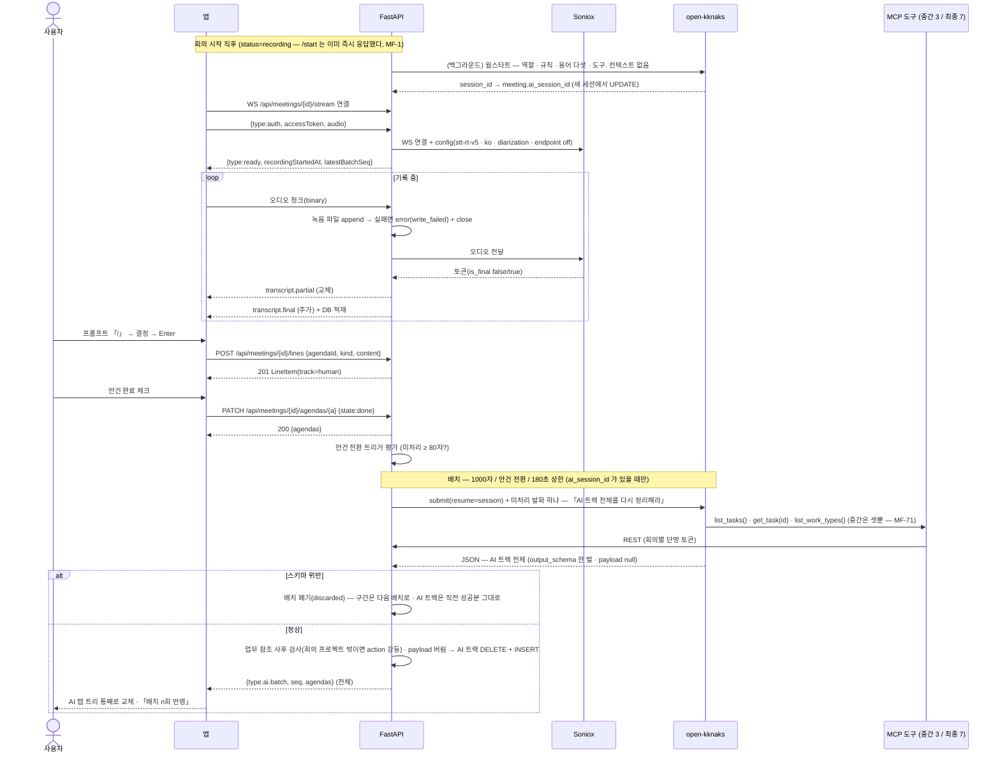
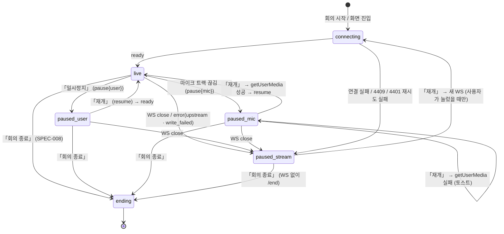

# 회의록 — 회의 중 · 실시간 받아쓰기 · 2트랙 · AI 배치

회의가 시작된 뒤부터 「회의 종료」를 누르기 전까지의 화면과 계약이다. **내 마이크 소리가 백엔드를 거쳐 Soniox 로 가고, 확정된 발화가 우측 스크립트에 쌓인다.** 사람은 좌측 회의록 탭에 `/` 프롬프트로 안건과 줄을 직접 적고, **AI 는 같은 구조를 AI 요약 탭에만 배치 단위로 채운다** — 사람 탭에 손대지 않고 제안도 하지 않는다. 회의 중 잠깐 멈추는 「일시정지」와, 마이크·스트림이 끊겼을 때 **같은 일시정지 상태로 떨어뜨리는** 실패 처리가 여기 있다.

> 기능/정책 묶음 단위의 **외부 계약** 문서다. client / QA / 외부 통합이 이 문서만 읽고 따를 수 있어야 한다.
> SPEC에는 table schema 전문, ORM field, repository/service 구조, PR 계획, 구현 순서, 라우트·컴포넌트 파일 경로 같은 내부 구현을 두지 않는다.
>
> **정본 축** — 기능(화면·필드·상태·흐름·문구·API)은 **BASE-003 + DEC-003**, 시각(색·크기·간격·배치)은 **디자인 시스템 + `회의록.dc.html`**. 시안에 있어도 기획·정책에 없으면 계약에 담지 않았다(§7-B).
> **흐름·동작의 정본은 `reference/2026-09-06-task-management-app/Meeting flow.md`(`MF-n`)** — 이 spec 과 부딪히면 그쪽이 이긴다.
>
> **2026-09-07 v0.0.2 — MF 반영.** 이 spec 에 걸린 것 — **MF-1**(`/start` 즉시 응답 · 웜스타트 큐 · `ai_session_id` 없으면 배치 안 돎) · **MF-2 · 3 · 4 · 55**(AI 도구 7개 API 래퍼 · codex allow list · 회의별 단명 토큰 · 용어 다섯을 웜스타트로) · **MF-49**(배치 트리거 **1000자**) · **MF-50 · 51**(배치는 발화만 · 안건·줄·업무·유형은 도구로 · `list_agendas()` 는 사람 + AI 안건) · **MF-52**(출력 스키마 한 벌 · 페이로드 nullable) · **MF-53**(배치마다 AI 트랙 전체를 내고 서버가 갈아끼운다) · **MF-9**(줄에 시각 없음 — 안건에만) · **MF-10**(슬래시 명령어 5개 · 그 밖은 텍스트) · **MF-7 · 8**(breadcrumb 링크 + 「←」 · 헤더 순서). 「종료 시 배치」 · 「종결」 · 「통합본」 어휘는 MF-56 으로 사라졌다.
>
> **2026-09-08 v0.0.3 — MF-71 반영**(실물 회의 8 · 9). **중간 배치는 AI 혼자 쓴다.**
> 회의 중 배치는 사람 안건·사람 줄을 **보지 않는다** — `list_agendas()` · `get_agenda(id)` 는 **최종 제출(SPEC-008)에서만** 열리고,
> 회의 중 codex `enabled_tools` 는 **업무 셋**(`list_tasks` · `get_task` · `list_work_types`)뿐이다.
> 따라서 **미러 안건이 없다** — `humanAgendaId` 는 회의 중 항상 `null`(값이 와도 서버가 무시), AI 안건은 전부 신설(`source_agenda_id NULL`),
> AI 탭에 「사람 안건 미러」 배지가 없다. 근거 — 회의 9 실측에서 AI 가 사람 노트를 읽자 **AI 요약이 사람 노트의 톤을 그대로 따라갔다.**
> **안 바뀐 것** — 스키마 한 벌(MF-52) · 전량 교체(MF-53) · 검증 순서 0~5 · 최종(MF-56) · 프론트 컴포넌트.

## 1. Context

### Meta

- Decision reference: DEC-003 §1(범위 · 2026-09-06 확정분: 업무 줄 4종 · 일시정지 · 마이크/스트림 실패 · 로컬 업로드 v2 게이트 · 장소 없음) · §2(화자 익명) · §3(필드) · §4(생명주기 — 2트랙 · AI 안건 축 · 증분 즉시 반영 · 웜스타트 무소속) · §6(기록) · §7(저장·실패) · §8(연결) · §STT(전송 경로 · 캡처 · 모델 · 런타임 · 배치 수치)
- Baseline reference: BASE-003 §Raw L35~L38·L42~L43 · 기능명세 **#3 실시간 받아쓰기 · #4 녹음 원본 저장 · #5 사람 트랙 · #6 AI 트랙 · #7 근거 타임칩** · L73(회의 중 첨부 열기) · 인바운드(내 업무 웜스타트 · 문서함 첨부)
- 소비 규약: SPEC-006(회의록 상세 응답 · 회의 시작 · 안건 생성 · 첨부 계약) · SPEC-008(회의 종료 · 편집 · 업무 연동) · SPEC-005 §4(문서 메타·본문) · SPEC-001 U-2(v2 게이트 토스트) · DEC-002 §8(웜스타트 업무 목록) · DEC-004 §8(첨부는 md · 회의 중 md 작성 v2)
- Architecture reference: `system/README.md` §흐름 ③ · 불변식 1~12 · §codex 설정(allow list) · `backend/README.md` §5-1(STT 중계) · §5-2(AI 작업 — 웜스타트 큐 · 도구 · 스키마 한 벌) · §8-2·§8-3(에러) · §10(API 표면 · MCP 도구) · `frontend/README.md` §3-5 · §4-2(WS 첫 프레임 인증) · §6-2 · §6-3(상세 헤더) · §7 · §8(AI 트랙 전량 교체) · `database/domains/meeting.md` M-1~M-20
- Design reference: `회의록.dc.html` **L761~1047(회의 중) · L1048~1197(회의 중 · 요약) · L1198~1402(회의 중 · 첨부 파일 열기)** · L586~592(회색 상태 바) · L1675~1697·L1782~1789(근거 펼침 — 트리와 하이라이트 구성 참조) · `디자인 시스템.dc.html` **[09] L649~755** · [06] L331(TABS) · L365(BUTTONS) · L383(MEETING BLOCK) · [07] L478~484(Toast) · [10] L759~818 · 정정 §A-5·§A-6·§A-8·§A-11
- Domain note: 외부에 드러나는 것은 **회의 스트림**(오디오 업 · 잠정/확정 발화 다운 · AI 증분 다운) · **사람 트랙**(안건 · 줄) · **AI 트랙**(안건 · 줄 · 근거 · 배치 회차) · **트랜스크립트**(확정 발화 블록) · 회의 중 **첨부 열기**다
- Open questions: §7

### Business Requirement

- **회의는 사람과 AI 둘이 참가한다**(BASE-003 L37). 사람이 모든 걸 다 칠 수 없고 AI 가 모든 걸 정확히 요약할 수도 없으니 **둘 다 일하고 종료 후 종합**한다. 그래서 회의 중 화면은 **같은 구조의 트리가 두 벌**(회의록 탭 · AI 요약 탭)이고, 두 트랙은 서로 쓰지 않는다(DEC-003 §4 · ERD M-6).
- **AI 는 AI 요약 탭만 채운다.** 사람 트랙에 개입하지 않고 **줄 제안도 하지 않는다**(DEC-003 §4 L95). 시작 전 AI 안건 생성도 없다(BASE-003 L37 「AI 제안은 필요 없다」).
- **AI 증분은 즉시 반영하고 몇 번째 배치까지 반영됐는지 표시한다** — 「배치 2회 → 3회」. 버퍼링하지 않는다(DEC-003 §4). **배치는 매번 AI 트랙 전체를 낸다**(MF-53) — 앞 배치가 잘못 가른 안건을 다음 배치가 합친다. 첫 배치가 안건을 잘못 만들면 회의 내내 그대로 남던 문제(F-10)가 이것으로 풀린다.
- **AI 는 컨텍스트를 받지 않고 도구로 조회한다**(MF-50 · MF-2). 배치가 넘기는 것은 미처리 발화뿐이다. 사람이 회의 중에 계속 고치므로 스냅샷으로 실으면 낡은 걸 보고 판단한다 — 조회하면 그 순간 최신이다. **다만 회의 중에 조회할 수 있는 것은 업무 · 유형뿐이다**(MF-71).
- **회의 중 AI 는 사람 것을 보지 않는다**(MF-71 — 2026-09-08). 사람 안건·사람 줄을 조회하는 도구 둘(`list_agendas` · `get_agenda`)은 **회의 중 배치에 열려 있지 않다.** AI 는 발화만 보고 스스로 안건을 가르고, **미러 안건 없이 전부 신설**한다. 사람 안건과 이름이 겹쳐도 상관없다 — **합치는 것은 종료 후 한 번**이다(MF-56 · SPEC-008). 회의 9 실측에서 AI 가 사람 노트를 읽자 요약이 **사람 노트의 톤을 그대로 따라갔고**, 「둘이 각자 쓰고 종료 후 합친다」(BASE-003 L37)는 전제가 무너졌다. 이것이 F-10(AI 가 같은 걸 또 만든다)의 새 답이다 — **중복은 최종이 흡수한다.**
- **실시간 STT 가 제품에서 기술 난도가 가장 높은 지점**이다(BASE-003 §Why). 웹소켓 2단 중계(프론트 → 백엔드 → Soniox)·배치 세션 유지·실패 처리가 얽힌다. 프론트는 Soniox 주소도 키도 모른다(DEC-003 §STT · SYS-4).
- **설계한 실패만 처리한다.** DEC-003 §7 이 열거한 실패(회의 중 배치 실패 · JSON 스키마 위반 · 없는 업무 참조) 밖의 예외는 fallback 없이 전파한다(BASE-003 L43). **자동 재연결·자동 재시도를 두지 않는다**(DEC-003 §1 · §7 · BE-12).
- **수치는 DEC-003 §STT 가 확정했다** — 확정 발화 **1000자**(MF-49 — 600 에서 올림) · 안건 전환 즉시(미처리 80자 미만이면 생략) · 상한 180초 · 배치 타임아웃 120초 · 회의당 AI 세션 하나. **종료 시 종료 시 배치는 없다**(MF-56). 실측 전 값이라 조정 가능하나 **계약은 불변**이다.
- **회의 시작은 AI 를 기다리지 않는다**(MF-1). `/start` 는 전이만 하고 즉시 응답하며, 웜스타트는 서버가 큐에 넣는다. 워커가 죽어 있어도 회의는 시작되고 배치만 안 돈다.

### Scope

In scope:

- **회의 중 화면** — 헤더(일시정지 · 회의 종료 자리) · 상태 바 · 좌 패널(회의록 탭 | AI 요약 탭) · 우 패널(실시간 스크립트 | 첨부 파일)
- **실시간 받아쓰기**(#3) — 마이크 캡처 → `WS /api/meetings/{id}/stream` → 백엔드 중계 → Soniox → 잠정/확정 발화 → 화면. 화자 익명 라벨
- **녹음 원본 저장**(#4) — 백엔드가 중계하며 파일 적재. 화면에는 드러나지 않는다(계약만)
- **사람 트랙**(#5) — `/` 팝오버 **또는 슬래시 명령어 5개**(MF-10)로 안건·줄(논의 · 결정 · **업무** · 액션) 직접 입력. 안건 전환 · 완료
- **AI 트랙 배치 요약**(#6) — 웜스타트(큐 · 컨텍스트 없음) · 배치 트리거 · **도구 조회** · 출력 검증 · **AI 트랙 전량 교체 push** · 배치 회차 표시. 회의 중 결과에는 업무 페이로드가 없다(MF-52)
- **근거 타임칩**(#7) — AI 줄 펼침 → 상세 + 구간 칩 → 스크립트 해당 발화로 스크롤·하이라이트
- **일시정지**(사용자) · **마이크·스트림 실패 → 일시정지 + 사유** · 재개(DEC-003 §1)
- **회의 중 첨부 열기**(BASE-003 L73) — 첨부 탭 → 파일 드로어(읽기 전용). 로컬 업로드는 UI 만 + v2 게이트

Out of scope:

- **회의록 생성 · 회의 시작(`/start`) · 시작 전 안건 · 첨부 추가 계약 · 목록 · 삭제** — SPEC-006
- **회의 종료(`/end`) · 「생성중」 · async 재전사 · 최종 회의록 · **AI 한 줄 요약 바** · 편집(인라인 수정 · 추가 드로어 · **줄 삭제 · 안건 이름 수정**) · 업무 생성/갱신 버튼** — SPEC-008. 회의 중 화면의 「회의 종료」 버튼은 **자리만** 두고 동작은 SPEC-008 이 정한다. 줄 삭제·안건 이름 수정은 **종료 후 편집에만** 있다(DEC-003 §1 표 「종료 후 편집 범위」 · §5 수정(U))
- 시스템 오디오 녹음 · 300분 초과 · 세션 경계 복원 · 반복 회의 · 알림 · 자료함 문서를 AI 컨텍스트로 — 전부 v2 또는 미처리(DEC-003 §1 · §4 L105)
- 회의 중 md 작성(`source=local` · `agendaId`) — v2(DEC-004 §8 · M-17)

## 2. UX Contract

### Placement

회의 상세 라우트(`/meetings/detail?id=` — FE §1 · F-10 「상태로 갈린다」)가 `status='recording'` 일 때 이 화면이다. 사이드바 200 + **「←」 + breadcrumb 「홈 › 회의록 › <제목>」**(L784~790 — 「홈」·「회의록」은 링크, 「←」는 `/meetings/` 로. MF-7 · FE §6-3) + 헤더(L792~807 — **배지 줄 → 제목 → 메타** 순서, MF-8 · FE §6-3) + 상태 바(L809~831) + 2패널.

```text
+──────────+──────────────────────────────────────────────────────────────+
│ 사이드바  │ ←  홈 › 회의록 › 제품 소개서 리뷰                              │
│ 200       │ [ <유형명> ] [ ● <프로젝트> ]        [⏸ 일시정지] [■ 회의 종료]│
│           │ 제목 28/700                                                   │
│           │ 08월 27일 (목) 09:30 시작                                     │
│           │ ┌ 상태 바 1640×56 ─ ● 기록 중  00:12:38 ──────────────────┐ │
│           │ ├─ 좌 1160 ───────────────────────────┬─ 우 464 ──────────┤ │
│           │ │ 탭: ● 회의록 | ● AI 요약             │ 탭: ● 실시간 스크립트│ │
│           │ │ 안내 바 48                            │     | 첨부 파일 n   │ │
│           │ │ 안건 > 줄 트리 (스크롤)               │ 발화 블록 (스크롤)  │ │
│           │ │ ─────────────────────────────         │                    │ │
│           │ │ [안건 2 ▾] / 입력 ……   09:42  [➤]     │ 푸터 44            │ │
│           │ └───────────────────────────────────────┴────────────────────┘ │
+──────────+──────────────────────────────────────────────────────────────+
```

- 좌 1160 · 우 464(left 1416) · 상태 바 top 150 은 **비율·최소폭 참고값**이다(FE-C4). 두 패널의 높이는 뷰포트에 맞춰 늘고 각자 안에서 스크롤한다
- 탭 dot 색은 디자인 시스템 [09] L704~723 「탭 dot — 회의 진행 상태」를 따른다 — 진행 중: 회의록 `#B3B3B3` · AI 요약 `#338BF6`(광륜) · 실시간 스크립트 `#7181F8`(광륜) · 첨부 파일 `#D9D9D9`
- **이 화면의 오버레이는 팝오버(`/` 종류 선택 · 첨부 추가)와 드로어(첨부 열기)뿐이다.** 드로어 위에 모달을 겹치지 않는다([10] · FE §6-2)
- **상단 바(top 150 · 1640×56 · r12)는 회의 생애 전체에서 한 자리다**([09] L733). 회의 중은 이 spec 의 상태 바(U-1), 종료 후는 SPEC-008 의 **AI 한 줄 요약 바**([09] L727~733 · DEC-003 §1 표 「AI 한 줄 요약 바」)가 같은 자리를 쓴다. **회의 중에는 한 줄 요약을 그리지 않는다** — `headline` 은 최종 회의록 호출과 함께 생기므로(DEC-003 §4 종료 파이프라인 ②) 회의 중에는 항상 `null` 이다

### U-1. 헤더 · 상태 바 · 일시정지 (L792~831 · L1079~1101 · L1229~1251 · 회색 바 L586~592)

- **상태**
  - *기록 중(live)*: 상태 바 `#EEF1FE` / 테두리 `#C9D1FB` / dot `#7181F8` + 4px 광륜(L809~810). 문구 「**기록 중**」 + 경과 시간 `HH:MM:SS`(tabular, `#3D46A6` 14/700 — L811~812). **파형·자동 저장 표시 없음**(§7-B)
  - *연결 중(connecting)*: 회의 시작 직후·재개 직후 WS `ready` 가 오기 전. 회색 바(L586~592 규격 — `#F4F5F7` / `#E1E3E8` / dot `#B3B3B3`) + 「**연결 중**」 + 경과 시간. 헤더 두 버튼 비활성
  - *일시정지 — 사용자(paused/user)*: 회색 바 + 「**일시정지**」 + 경과 시간. 헤더 좌측 버튼이 「**재개**」(▶ 글리프, 같은 h34 outline — L798~801 의 버튼 규격)로 바뀐다
  - *일시정지 — 마이크(paused/mic)*: 회색 바 + 「**일시정지 · 마이크 연결이 끊겼습니다**」 + 경과 시간. 버튼 「재개」
  - *일시정지 — 스트림(paused/stream)*: 회색 바 + 「**일시정지 · 서버 연결이 끊겼습니다**」(사유 `upstream`) 또는 「**일시정지 · 녹음 파일을 저장하지 못했습니다**」(사유 `write_failed`) + 경과 시간. 버튼 「재개」와 「회의 종료」 **둘 다 활성**(시안 L804 · L1085 · L1235 헤더 그대로). `/end` 는 스트림이 없는 상태에서도 받는다 — 끊긴 상태에서 `409 meeting_stream_disconnected` 로 막는 것은 **오디오 요청뿐**이다(`backend/README.md` §8-2, 2026-09-06 정정)
  - **사유 배너는 별도 컴포넌트가 아니라 상태 바다.** 디자인 시스템 [09] L733 「진행 중 화면에서는 회색 상태 바가 같은 자리를 쓴다」를 그대로 쓴다 — DEC-003 §1 「배너로 사유를 말한다」의 자리가 이것이다
- **문구**: 헤더는 **업무 상세 헤더 순서**(MF-8 · FE §6-3 — 같은 라우트의 상태 변화이므로 시작 전·종료 후와 같은 규약을 쓴다) — ① 배지 줄 = 좌측 [유형 배지] [● 프로젝트](회의 중에는 **읽기 전용** — SPEC-006 §4 상태별 허용 표 `recording` ✗) · 우측 같은 높이에 「일시정지」 · 「회의 종료」 ② 제목 = 회의 제목(28/700 — L794) ③ 메타 = 「`MM월 DD일 (요일) HH:MM` 시작」(L795 에서 **「회의실 A」를 뺐고** 유형은 ① 로 올렸다 — DEC-003 §1 표 「장소」). breadcrumb 마지막은 **회의 제목**(L789 의 「회의 중」은 정정 — 상태는 상태 바가 말한다)
- **CTA**
  - 「**일시정지**」(⏸, h34 outline `#D9D9D9` — L798~801) → 마이크 캡처를 멈추고 WS 로 `pause` 프레임을 보낸다(§4). 스트림·WS 는 **열린 채** 둔다 — 한 세션 안에서 멈췄다 잇는다(DEC-003 §1 「일시정지 근거」)
  - 「**재개**」(▶) → WS 가 살아 있으면 `resume` 프레임 + 캡처 재개. WS 가 죽어 있으면(paused/stream · 새로고침 후) **사용자가 누른 이 시점에** WS 를 새로 연다 — 자동으로 열지 않는다(DEC-003 §1 · §7 · BE-12)
  - 「**회의 종료**」(■, h34 `#7181F8` — L802~805) → SPEC-008 §4 `POST /end`(화면 U-1). 이 spec 은 활성 조건만 둔다 — **`connecting` 을 뺀 모든 상태에서 활성**이다. `paused/stream` 에서도 누를 수 있다: 종료는 스트림 조작이 아니라 상태 전이 + job 이고(BE §8-2 정정), 재개가 실패하면 다시 일시정지로 돌아올 뿐이며 그 자리에 종료가 항상 있다(§7-E S007-OQ-1 닫힘)
- **기대 결과**: 일시정지 중에는 **오디오가 나가지 않고 잠정 발화가 사라진다**(확정 발화는 남는다). 사람 트랙 입력·AI 탭 열람·첨부 열기는 **그대로 된다**. 경과 시간은 `now − recordingStartedAt` 벽시계 기준으로 **멈추지 않는다**(발화 오프셋 `atMs` 와 같은 축 — ERD M-11). 재개하면 상태 바가 「기록 중」으로 돌아온다. **이 상태 바 자리는 종료 후 SPEC-008 의 AI 한 줄 요약 바로 바뀐다** — 크기(1640×56 · r12 · top 150)와 좌우 padding 20 이 같고 색만 다르다(회색 `#F4F5F7`/`#E1E3E8` · 기록 중 `#EEF1FE`/`#C9D1FB` · 한 줄 요약 `#EEF1FE`/`#C9D1FB`). 규격 충돌 없음

### U-2. 회의록 탭 — 사람 트랙 (L833~913)

- **상태**
  - *안건 있음*: 안건 블록이 `orderIndex` 순으로 쌓인다(gap 20 — L846). 안건 헤더(L848~855) = 완료 체크(18px, 완료면 `#7181F8` 채움 + ✓ · 활성이면 `#7181F8` 1.6px 테두리 · `next` 면 `#D9D9D9` 테두리) + 「안건 n」(11/700 `#9EA2AE`) + 제목(15/700, 완료면 `#9EA2AE` + 취소선) + **상태 배지**(`state` → 「**논의 중**」`#EEF1FE`/`#4A55B8` · 「**완료**」`#F1F2F5`/`#757575` · 「**대기**」`#F1F2F5`/`#9EA2AE` — L853·L881·L909. 종료 후 상세는 같은 `next` 를 「다음 논의로」로 그린다(SPEC-008 · 시안 L1525) — §7-A) + 우측 시각(`HH:MM` `#C9CBD1` — 첫 줄이 생긴 시각, 줄이 없으면 숨김)
  - *줄*: 안건 아래 `margin-left:37 · border-left 2px`(활성 안건 `#C9D1FB` · 그 외 `#EBEBEB` — L857·L885) + 줄 행 padding 6/8 r8(L858~871). **라벨 폭 34 · 11/700**, 색은 종류별 — 논의 `#9EA2AE` · 결정 `#1663B5`(본문 600 · 배경 `#F8FAFF`) · **업무 `#5F6470`(본문 600)** · 액션 `#4B52A8`(본문 600)([09] L660~678). **줄에 시각을 붙이지 않는다**(MF-9 — 시각은 안건 헤더에만. 시안 L858~871 의 줄 우측 `HH:MM` 은 정정)
  - *줄 없는 안건*: 「아직 기록 없음」(13 `#C9CBD1` — L912)
  - *안건 없음*(시작 전에 안 만들었을 때): 본문에 「`/` 로 첫 안건을 만들어 기록을 시작합니다」 한 줄(13 `#9EA2AE`). 프롬프트 바는 U-3 *안건 없음* 상태
  - **회의 중 사람 줄은 읽기 전용이다.** 인라인 수정·종류 전환·**줄 삭제**는 종료 후 편집(SPEC-008)이다 — 시안 회의 중 화면(L855~900)에 편집·삭제 어포던스가 없고, DEC-003 §1 표 「종료 후 편집 범위」(2026-09-06)가 줄 삭제·안건 이름 수정을 **종료 후 편집**에만 넣었다. hover 배경 `#FAFBFC` 만 준다
  - **회의 중 안건 제목도 고치지 않는다.** 안건 헤더(L848~855)에 제목 입력 어포던스가 없고, 기획(BASE-003 #5)은 회의 중 안건·줄 **입력**만 정했다. 제목 수정 UI 는 시작 전(SPEC-006 U-4)과 종료 후 편집(SPEC-008)에 있다
  - **AI 안건·AI 줄은 이 탭에 나타나지 않는다**(DEC-003 §4 L96 · M-5-a)
- **문구**: 탭 안내 바(L839~841) 좌측 「입력창에서 **/** 를 입력해 안건 · 논의 · 결정 · **업무** · 액션을 고릅니다」(시안 L840 에 「업무」를 더한다 — DEC-003 §1 표 「업무 줄」), 우측 「자동 저장 · `HH:MM`」(이 세션에서 마지막으로 성공한 줄·안건 쓰기 시각. 아직 없으면 숨김 — 이 시각은 MF-9 가 건드리지 않는다)
- **CTA**: 안건 헤더의 **완료 체크** 클릭 → `PATCH agendas/{agendaId} { state:"done" }`. 완료된 안건의 체크를 다시 누르면 `next`. 줄·안건 추가는 U-3
- **기대 결과**: 줄은 전송 즉시 목록 끝(그 안건의 마지막)에 붙고 자동 저장 시각이 갱신된다. 활성 안건을 완료하면 **다음 순서의 `next` 안건이 활성**이 되고 프롬프트 바 칩이 따라 바뀐다(다음이 없으면 활성 없음 — U-3)

### U-3. 프롬프트 바 · `/` 종류 팝오버 · 슬래시 명령어 (L918~972 · MF-10)

**마우스로 가는 길(팝오버)과 키보드로 가는 길(슬래시 명령어) 둘 다 둔다.** 팝오버를 없애지 않는다. 두 길의 결과는 **완전히 같은 상태**다.

- **상태**
  - *기본*: 하단 고정 바 h56 r14, 테두리 `#7181F8`, 그림자(L955). 좌측 **활성 안건 칩**(h26 `#EEF1FE`/`#4A55B8` 「안건 n ▾」 — L959~962) + 입력(15px) + 우측 현재 시각(`HH:MM` `#C9CBD1` — L968. MF-9 가 건드리지 않는다) + 전송 버튼(40×40 `#7181F8` ➤ — L969~971). 플레이스홀더 「그대로 입력하면 논의로 추가 · / 로 종류 선택」(L966 정정 — 안건 이동은 팝오버 전용이다). **좌측 「+」 버튼(L956~958)은 두지 않는다**(§7-B)
  - *`/` 만 쳤을 때 — 팝오버*: 입력 맨 앞에 `/` 를 치면 팝오버 300 이 바 위에 뜬다(L920~952 — 지금 동작 그대로). 머리 「안건 n 아래에 추가」 + 안건 제목 캡션(L921~924) → 항목 4: 「**논의**」(칩 「논」 `#F1F2F5`/`#757575`) · 「**결정**」(「결」 `#EAF4FF`/`#1663B5`) · 「**업무**」(「업」 `#F1F2F5`/`#5F6470` — 시안 L925~936 에 없는 **누락분을 [09] L668~672 규격으로 추가**) · 「**액션**」(「액」 `#F1F2FE`/`#4B52A8`) → 구분선 → 「**새 안건**」 + 캡션 「다음 주제로」(L938~942) → 구분선 → 「다른 안건으로 이동」 + 활성 아닌 안건 행(「안건 n」 + 제목, h32 — L944~951). 현재 종류 행은 배경 `#F1F2F5`. `↑↓` 이동 · `Enter` 선택 · `Esc` 닫기
  - *`/` 뒤에 글자를 치면 — 좁혀지는 팝오버*: `/결` 처럼 이어 치면 팝오버가 **그 항목으로 좁혀진다**(앞글자 일치 — 「결정」만 남는다)
  - *슬래시 명령어 — 5개뿐*: `/논의` · `/결정` · `/업무` · `/액션`(줄 종류 4종) · `/새안건`(새 안건). **팝오버에 있는 그대로다.** 명령어 뒤에 **스페이스**가 들어오는 순간 `/결정` 이 사라지고 **[결정] 칩**이 입력 앞에 붙는다 — 뒤는 본문. **팝오버로 고른 것과 완전히 같은 상태**다. 백스페이스로 칩 앞에서 지우면 `/결정` 텍스트로 되돌아간다. **「안건 이동」은 슬래시로 하지 않는다** — 팝오버(「다른 안건으로 이동」)에서만
  - *그 밖은 전부 그냥 텍스트*: 스페이스가 들어올 때 앞 토큰이 5개 중 하나면 칩, 아니면 **그대로 둔다. 갈래를 만들지 않는다** — `/api 경로를 바꾸자` → 본문(이스케이프 같은 건 없다) · `/ㅁㄴㅇㄹ 어쩌고` → 본문 · `/논의 /api` → [논의] + 본문 `/api`
  - *종류 고른 뒤*(팝오버·명령어 공통): 칩 옆에 종류 칩(예 「결정」)이 입력 앞에 붙고 텍스트를 이어 친다. 종류를 안 고르면 **논의**다
  - *새 안건 고른 뒤*(팝오버·`/새안건 ` 공통): 입력이 안건 제목 입력으로 바뀐다(플레이스홀더 「안건 제목」). `Enter` 로 만든다
  - *안건 없음*: 칩이 「**안건 선택**」(`#F1F2F5`/`#757575`)으로 바뀌고 **전송 버튼 비활성**. 팝오버에는 「새 안건」만 있고 명령어는 `/새안건` 만 칩이 된다(나머지 넷은 그대로 텍스트) — 줄은 항상 안건에 속한다(DEC-003 §3 · M-5)
  - *전송 중*: 전송 버튼에 진행 표시, 입력 잠금. **중복 전송이 나가지 않는다**
  - *전송 실패*: 입력 내용 유지 + 토스트 「저장하지 못했습니다 · 다시 보내 주세요」. 전송 버튼을 다시 누르면 재요청. **자동 재시도 없음**(§4 Case Matrix)
- **문구**: 위 상태 표의 것 전부. 「업무」 항목 캡션 없음(연결은 종료 후 편집 — SPEC-008 · M-14)
- **CTA**
  - 전송(➤ 또는 `Enter`) → `POST /api/meetings/{id}/lines { agendaId, kind, content }`. 종류 칩이 `kind`, 칩 뒤 텍스트가 `content` 다 — **`/결정` 같은 명령어 문자열은 본문에 실리지 않는다.** `Shift+Enter` 는 줄바꿈이 아니라 무시한다(줄 본문은 한 줄이다 — §4 Validation)
  - 「새 안건」(팝오버) · `/새안건 <제목>` `Enter` → `POST /api/meetings/{id}/agendas { title }`(SPEC-006 표면) → 201 → `PATCH …/agendas/{id} { state:"active" }`. 두 요청이 순서대로 나간다
  - 「다른 안건으로 이동」 행 → `PATCH …/agendas/{id} { state:"active" }`
  - 칩 「안건 n ▾」 클릭 → 같은 팝오버의 「다른 안건으로 이동」 절만 연다
- **기대 결과**: 줄이 활성 안건 끝에 붙고 입력이 비워진다. 안건을 바꾸면 트리에서 **이전 활성 안건은 「대기」로, 새 안건은 「논의 중」으로** 배지가 바뀌고 서버가 **안건 전환 배치 트리거**를 평가한다(§5 규칙 — 미처리 80자 미만이면 생략). **회의 중 업무 줄은 `taskId: null` 로 저장된다** — 업무 연결과 「업무 갱신」은 편집 드로어(SPEC-008)에서만 일어난다(M-14 · DEC-003 §5 「버튼을 눌러야 요청」)

### U-4. AI 요약 탭 — 안건 > 줄 트리 + 근거 칩 + 배치 회차 (자리 L1104~1157 · 트리 규격 U-2 와 동일 · 근거 [09] L684~700 · 시안 L1675~1697)

시안의 **카드 렌더(L1111~1152)는 쓰지 않는다** — DEC-003 OQ-1 · 정정 §A-8 「AI 요약 탭은 안건 > 줄 트리」. 트리는 **회의록 탭과 같은 컴포넌트**를 `track='ai'` 데이터로 그린다. 새 시안이 필요 없다.

- **상태**
  - *첫 배치 전*: 트리에 AI 안건이 아직 없으므로 본문 중앙에 「기록이 쌓이면 요약이 생성됩니다」(13 `#C9CBD1` — L1151 문구). 안내 바 우측 「**첫 배치를 기다리는 중**」. AI 세션이 아직 없어 배치가 안 도는 경우(MF-1 — 웜스타트 미완료·실패)도 화면은 이 상태 그대로다 — 별도 표시가 없다(DEC-003 §7)
  - *배치 반영*: 안내 바 우측 「**배치 `n`회 반영 · `HH:MM`**」(`n` = 서버가 준 `seq`, 시각 = 그 push 를 받은 시각). 트리에 AI 안건 → AI 줄. **안건 배지**: 회의 중 AI 안건은 **전부 신설**이므로(`sourceAgendaId` 는 항상 `null` — MF-71) **배지 없이 캡션 「AI 안건」**(11/700 `#9EA2AE`) 하나뿐이다. **미러 배지 갈래는 없다** — 사람 안건의 `state` 를 AI 탭에 그리지 않는다
  - *AI 줄*: U-2 와 같은 줄 행 + **우측 끝 펼침 화살표**(22×22, hover 에서만 — [09] L700). **시각은 없다**(MF-9 — 구간은 펼침의 근거 칩에서 본다)
  - *펼침*: 화살표 클릭 → 줄 아래 `margin 2/10/0/56 · border-left 2px #C9D1FB · padding-left 14`(L691) 에 **상세 설명**(`detail`, 14/1.7 `#5F6470`) + 「근거」 캡션 + **구간 칩**(h24 r6 `#EEF1FE`/`#C9D1FB`/`#4A55B8` 12/600, 시계 글리프 + 「`HH:MM` – `HH:MM`」 — L1693~1694) + 캡션 「칩을 누르면 해당 구간 스크립트로 이동합니다」(L1695). `detail` 이 비면 상세 문단을 생략하고 칩만. `evidence` 가 비면 「근거 없음」 캡션
  - *새 배치 도착*: **트리가 통째로 바뀐다**(MF-53 — 배치마다 AI 트랙 전체를 다시 낸다). 앞 배치가 잘못 가른 안건이 합쳐지거나 줄이 고쳐진 채로 온다. 펼쳐 둔 줄은 id 가 새로 생겨 접힌다. 사용자가 회의록 탭을 보고 있어도 AI 탭 데이터는 갱신되고 탭 라벨 옆에 **미확인 점**(6px `#338BF6`)이 켜진다 — AI 탭을 열면 꺼진다. 버퍼링하지 않는다(DEC-003 §4 · BE-11)
  - **사람이 AI 줄을 고칠 수 없다.** 회의 중 AI 트랙은 읽기 전용이다 — 그래서 배치마다 id 가 바뀌어도 끊길 참조가 없다(M-7)
- **문구**: 탭 푸터(L1156) 「회의 종료 시 이 요약과 회의록을 함께 정리해 최종 회의록을 만듭니다」(시안 「안건별 요약이 회의록에 반영됩니다」를 MF-56 에 맞춰 정정). 안내 바 좌측은 비운다(입력 안내가 없다)
- **CTA**: 펼침 화살표 · 근거 칩(U-6). 그 밖의 버튼 없음 — **회의 중 AI 줄에는 「업무 생성」·「업무 갱신」 버튼을 두지 않는다**(BASE-003 #10 은 종료 후 편집 — SPEC-008)
- **기대 결과**: 배치가 끝날 때마다 안내 바의 회차가 올라가고 트리가 **새 전체로 바뀐다**. AI 줄 중 `kind='task'` 는 서버 사후 검사를 지난 `taskId` 를 갖고 라벨 옆에 그 업무의 **유형 배지**([09] L671 — `workType` 이름·색)를 단다. 회의 프로젝트 밖 참조는 서버가 이미 `action` 으로 강등해 내려주므로 화면에 「없는 업무」가 뜨지 않는다(DEC-003 §7). 회의 중 AI 줄의 `payload` 는 항상 `null` 이다(MF-52)

### U-5. 실시간 스크립트 패널 (L975~1044)

- **상태**
  - *탭 헤더*(L977~981): 「실시간 스크립트」(dot `#7181F8` 광륜) | 「첨부 파일 `n`」(dot `#D9D9D9`, `n`=0 이면 숫자 생략 — [09] L720) + 우측 「**화자 `k`명**」(`k` = 지금까지 확정 발화의 화자 라벨 수. 0 이면 숨김)
  - *발화 블록*(L983~1037): 화자 dot 6px + 「화자 `n`」(12/700) + 시각(`HH:MM` `#B3B3B3`) + 본문(13/1.6 `#1E1E1E`, padding-left 13). 화자 색은 라벨 번호 **홀수 `#7181F8`/`#4A55B8` · 짝수 `#338BF6`/`#1663B5`**(dot/텍스트) — 시안이 화자 1·2 에 준 두 색을 번갈아 쓴다(최대 15명 — M-10)
  - *잠정 발화*: 마지막 확정 블록 뒤에 **회색 본문(`#757575`) + 캐럿 2px `#7181F8`**(L1036). 서버가 보내는 `transcript.partial` 이 올 때마다 **통째로 교체**된다(리셋 렌더 — soniox). 일시정지·끊김 시 사라진다
  - *비어 있음*: 「아직 발화가 없습니다」(13 `#C9CBD1`)
  - *스크롤*: 맨 아래에 붙어 있으면 새 블록마다 따라 내려간다. 사용자가 위로 올리면 따라가지 않는다(다시 맨 아래로 내리면 재개). 근거 칩 이동(U-6)도 따라가기를 끈다
  - *하이라이트*: U-6 의 대상 블록은 배경 `#F4F5FF` + 테두리 `#C9D1FB` + 시각 `#4A55B8` 600 + 우측 「근거 구간」(11/600 `#4A55B8`)(L1782~1788)
- **문구**: 푸터(L1042) 「**받아쓰기 중 · 확정된 발화는 바로 저장됩니다**」 — 시안 「종료 시 전문이 회의록에 저장됩니다」를 정책(DEC-003 §3 확정 토큰 즉시 적재)에 맞춰 고쳤다(§7-A). 일시정지 중 「일시정지 중 · 받아쓰기가 멈춰 있습니다」
- **CTA**: 없다. 블록 클릭 동작 없음. **화자 이름 지정 없음**(DEC-003 §2 — 익명 라벨까지만)
- **기대 결과**: 확정 발화가 말한 순서대로 쌓이고 새로고침해도 `GET …/transcript` 로 그대로 복원된다. 잠정 발화는 저장되지 않으므로 복원되지 않는다(M-9)

### U-6. 근거 타임칩 → 스크립트 스크롤·하이라이트 ([09] L693~696 · 시안 L1693~1695 · L1782~1789)

- **상태**
  - *칩*: U-4 펼침 안의 「`HH:MM` – `HH:MM`」 칩. hover `#E4E9FD`(L1693). 시각은 `recordingStartedAt + fromMs / toMs` 를 벽시계 `HH:MM` 으로
  - *이동 후*: 우 패널이 **실시간 스크립트 탭으로 전환**(첨부 탭을 보고 있었어도)되고, `atMs ≥ fromMs` 인 첫 블록으로 스크롤해 **`[fromMs, toMs]` 와 겹치는 블록 전부**를 하이라이트한다(L1782 규격). **매칭은 블록 id 가 아니라 시각(ms)이다** — 종료 후 재전사가 블록을 전량 교체해도(MF-37 · SPEC-008) 같은 규칙으로 맞는다. 하이라이트는 **다른 칩을 누르거나 `Esc`** 를 누를 때까지 남는다
  - *대상 없음*(구간에 확정 블록이 없을 때): 칩 옆 캡션 「해당 구간의 발화가 없습니다」 2초. 스크롤하지 않는다
- **문구**: 위 캡션
- **CTA**: 칩 클릭 · `Esc` 해제
- **기대 결과**: 클릭한 근거의 발화가 화면 중앙에 오고 강조된다. 스크립트 자동 따라가기는 꺼진다(U-5)

### U-7. 첨부 파일 탭 · 회의 중 첨부 열기 드로어 (L1160~1193 · L1347~1393)

첨부 **목록 행·추가 팝오버·첨부 계약**은 SPEC-006 U-n(BASE-003 #11 담당)이 정본이고 이 spec 은 **회의 중 조건과 열기 드로어**만 더한다. 어긋나면 §7-D.

- **상태**
  - *목록*(L1167~1189): 행 = 확장자 타일 32(「MD」 `#EEF0FE`/`#4B52A8` · 링크는 링크 글리프 `#F4F5F7`/`#757575`) + 이름(13/600) + 캡션(문서 「`크기` · `수정 시각` · `폴더 경로`」 / 링크 「도메인」). **PNG·PDF 행과 「회의 중 작성」 캡션은 그리지 않는다**(§7-B). 헤더 우측 「추가」(12 `#9EA2AE` — L1164) → SPEC-006 첨부 추가 팝오버(자료함 문서 / URL 링크)
  - *로컬 업로드 v2 게이트*: 푸터(L1192) 「끌어다 놓아도 첨부됩니다 · 최대 50MB」를 **그대로 그리되** 드롭 영역과 함께 SPEC-001 U-2 규격(불투명도 0.45 · `not-allowed`)으로 덮는다. 파일을 끌어 놓거나 클릭하면 토스트 「**v2에서 제공됩니다**」만 뜨고 **네트워크 요청이 0** 이다(DEC-003 §1 표). 50MB 는 문구일 뿐 검증하지 않는다
  - *드로어 열림*(L1347~1393): 스크림 0.32 + 우측 840. 헤더 72 = 타일 34 「MD」 + 이름(17/700) + 캡션 「`크기` · `수정 시각` · `폴더 경로`」(L1354 에서 「회의 중 작성 · 안건 1」을 뺀다 — §7-B) + × . 탭 44: 「**미리보기**」 | 「**원문 텍스트**」(L1361~1364). 본문 = 미리보기는 마크다운 렌더(SPEC-005 U-4 읽기 탭과 같은 렌더러), 원문은 읽기 전용 모노스페이스. **편집 탭 없음** — 회의 중 문서 편집 경로를 두지 않는다
  - *로딩*: 본문 자리 스켈레톤 `#F1F2F5`, 헤더는 먼저 그린다
  - *없는 문서*(삭제됨): 본문에 「없는 문서입니다」 + 「닫기」. 이동하지 않는다
- **문구**: 위 상태 표
- **CTA**: 문서 행 클릭 → 드로어(`GET /api/documents/{id}` + `GET /api/documents/{id}/content` — SPEC-005 §4). **문서함 상세로 이동하지 않는다** — 화면을 떠나면 스트림이 끊긴다(BASE-003 #11 「자료함은 드로어」). 링크 행 클릭 → 기본 브라우저(SPEC-003 U-7 과 같은 규격). × · `Esc` · 스크림 → 닫기
- **기대 결과**: 드로어가 열려 있어도 **스트림·타이머·AI 증분·잠정 발화는 계속 돈다.** 드로어를 닫으면 우 패널은 첨부 탭 그대로다

### U-8. 반응형 (시안 없음 — FE §7 · `08-responsive.md` 로 조립)

- **≥ 1440**: 위 Placement. 좌 패널 `1fr`, 우 패널 **464 → 400 까지** 줄어든 뒤 좌 패널이 줄어든다
- **1280 ~ 1439**: 사이드바 숨김 + 햄버거, 여백 48. 좌(유동) + 우(**400 고정**) 2단은 유지한다 — FE §7-1 「1280 구간 상세는 좌(유동) + 우(400 고정)」. 첨부 열기 드로어는 **전체 화면**(헤더 좌측 `←`)
- **< 1280**: 최소 폭 안내 화면(P-02). **스트림은 끊지 않는다** — 창을 다시 넓히면 같은 상태로 돌아온다
- 프롬프트 바·팝오버·상태 바는 패널 폭을 따라 유동한다. `position:absolute` 좌표를 쓰지 않는다(FE-C4)

## 3. User Scenario

### S-1. 사용자 — 회의를 시작하고 첫 발화가 찍힌다

1. 시작 전 화면에서 「회의 시작」(SPEC-006) → 상태가 `recording` 이 되고 이 화면이 뜬다. 상태 바 「연결 중」.
2. 앱이 마이크 권한을 얻고(`getUserMedia`) WS 를 열어 첫 프레임으로 토큰을 보낸다. 서버가 Soniox 를 붙이고 `ready` 를 준다 → 「기록 중 00:00:03」.
3. 말을 하면 우측에 회색 잠정 발화가 흐르다가 확정되면 「화자 1 · 09:33」 블록으로 굳는다. 「화자 1명」.

### S-2. 사용자 — 안건에 줄을 적는다

1. 프롬프트 바에 그냥 치고 `Enter` → 활성 안건(칩 「안건 2」) 아래 **논의** 줄. 안내 바 「자동 저장 · 09:34」. 줄 옆에 시각은 없다.
2. `/` 를 치면 팝오버. 「결정」을 고르고 문장을 치고 `Enter` → 결정 줄(굵게 · `#F8FAFF`).
3. 이번엔 마우스 없이 `/업무 소개서 v2 문구 정리` 를 친다 — `/업무` 뒤 스페이스에서 [업무] 칩이 붙는다. `Enter` → 업무 줄(라벨 `#5F6470`). 배지도 버튼도 없다 — 연결은 종료 후.
4. `/새안건 가격 표기 처리` `Enter` → 안건 3 이 만들어지고 **활성**이 된다. 안건 2 배지는 「대기」.
5. `/api 경로를 바꾸자` 를 치고 `Enter` → 그대로 논의 줄 본문 「/api 경로를 바꾸자」. 아무 갈래도 없다.

### S-3. 사용자 — 안건을 마치고 넘어간다

1. 안건 2 헤더의 체크를 누른다 → 「완료」 배지 + 취소선, 다음 `next` 안건이 활성이 되고 칩이 바뀐다.
2. 서버는 안건 전환을 보고 미처리 확정 발화가 80자 이상이면 즉시 배치를 돌린다. 80자 미만이면 다음 배치에 합친다.

### S-4. 사용자 — AI 탭에 증분이 붙는다

1. 확정 발화가 1000자를 넘으면 배치가 돈다. AI 는 **발화만 보고 스스로 안건을 가른다** — 사람 안건·사람 줄은 조회하지 않는다(MF-71). 업무를 가리킬 때만 `list_tasks()` · `get_task(id)` · `list_work_types()` 를 부른다. 결과가 오면 회의록 탭을 보고 있어도 「AI 요약」 탭 옆에 파란 점.
2. AI 탭을 열면 「배치 1회 반영 · 09:41」. **안건 둘 다 「AI 안건」 캡션**이 붙어 있다 — 내가 회의록 탭에 적은 안건과 제목이 비슷해도 **별개의 AI 안건**이다. 합쳐진 모습은 종료 후 최종 회의록에서 본다(SPEC-008).
3. 3분 뒤 상한(180초)으로 또 한 번 → 「배치 2회 반영 · 09:44」. 트리가 **통째로 새 결과**로 바뀐다 — 1회 때 잘못 갈라졌던 「AI 안건」이 안건 1 아래로 합쳐져 있다.

### S-5. 사용자 — 근거를 확인한다

1. AI 결정 줄에 hover → 화살표 → 펼침. 상세 문단 + 칩 「09:34 – 09:36」.
2. 칩 클릭 → 우 패널이 스크립트 탭으로 바뀌며 09:34 화자 2 블록이 `#F4F5FF` 로 강조되고 「근거 구간」이 붙는다. `Esc` 로 해제.

### S-6. 사용자 — 잠깐 멈춘다

1. 「일시정지」 → 상태 바 회색 「일시정지 · 00:12:38」, 버튼 「재개」. 잠정 발화가 사라진다.
2. 그 사이 프롬프트로 줄을 적을 수 있고 AI 탭·첨부도 본다. 경과 시간은 계속 간다.
3. 「재개」 → 「기록 중」. 같은 세션이라 화자 라벨이 이어진다.

### S-7. 사용자 — 마이크가 빠졌다 / 서버 연결이 끊겼다

1. 마이크 트랙이 끊기면 앱이 스스로 일시정지로 떨어진다 → 「일시정지 · 마이크 연결이 끊겼습니다」. 「재개」를 누르면 마이크를 다시 잡는다. 못 잡으면 같은 상태에 남는다.
2. WS 가 닫히면(서버·Soniox) → 「일시정지 · 서버 연결이 끊겼습니다」. 「회의 종료」는 그대로 누를 수 있다. **자동으로 다시 붙지 않는다.** 「재개」를 누르면 그때 새 WS·새 Soniox 세션이 열린다 — 이후 화자 라벨 번호는 새 세션 기준이라 이전과 다를 수 있다(익명 라벨이므로 정정하지 않는다).
3. 앱을 새로고침·재실행해도 같다 — `recording` 회의를 열면 2 의 상태로 시작한다.

### S-8. 사용자 — 회의 중 첨부를 연다

1. 우 패널 「첨부 파일 2」 → 「소개서-개정-메모.md」 클릭 → 우측 드로어 840, 「미리보기」 탭에 렌더. 스트립트는 뒤에서 계속 쌓인다.
2. 「원문 텍스트」 로 소스를 본다. × 로 닫는다.
3. 푸터의 드롭 영역에 파일을 끌어 놓는다 → 「v2에서 제공됩니다」 토스트만. 요청 없음.

## 4. Interface Contract

### API Contract

| Method | Path | 요약 | 권한 | 정본 |
|---|---|---|---|---|
| WS | `/api/meetings/{id}/stream` | 회의 스트림 — 오디오 업 · 잠정/확정 발화 다운 · AI 증분 다운 · 일시정지 제어 | 세션(첫 프레임) | **이 spec** |
| POST | `/api/meetings/{id}/lines` | 사람 줄 추가(`track=human`) — `status=recording` | 세션 | **이 spec**(`ended` 편집은 SPEC-008 이 같은 표면을 확장) |
| PATCH | `/api/meetings/{id}/agendas/{agendaId}` | 사람 안건 부분 수정 — 이 spec 은 **`state`**(`active` · `done` · `next`)만 보낸다 | 세션 | **SPEC-006 표면**(`title` — 시작 전) + **이 spec**(`state` — 회의 중) + SPEC-008(`title` — 종료 후 편집). 표면·응답은 하나(§7-A) |
| GET | `/api/meetings/{id}/transcript` | 확정 발화 블록 전량 | 세션 | **이 spec**(SPEC-008 근거 칩도 이것을 읽는다) |
| POST | `/api/meetings/{id}/agendas` | 사람 안건 추가 `{ title }` | 세션 | SPEC-006(회의 중에도 같은 표면) |
| GET | `/api/meetings/{id}` | 회의 상세(트랙별 트리 · 상태 · 첨부) | 세션 | SPEC-006 — 이 spec 이 필요로 하는 필드는 §7-D |
| POST | `/api/meetings/{id}/start` | 회의 시작 — **전이만 · 즉시 응답**(MF-1). 웜스타트는 서버가 큐에 넣는다 | 세션 | SPEC-006(웜스타트가 **주는 것**은 아래 「AI 배치 계약」) |
| POST | `/api/meetings/{id}/end` | 회의 종료 | 세션 | SPEC-008 |
| POST | `/api/meetings/{id}/attachments` | 첨부 추가 | 세션 | SPEC-006 |
| GET | `/api/documents/{id}` · `/content` | 첨부 문서 메타 · 본문 | 세션 | SPEC-005 §4 |

- **웹소켓은 이 하나뿐이다.** 오디오 업·토큰 다운·AI 증분 push 를 겸한다(SYS-7). 종료 후 「생성중」은 job 폴링(SPEC-008)
- **일시정지·재개는 REST 가 아니라 WS 제어 프레임**이다. 상태 4종(DEC-003 §3)에 「일시정지」가 없으므로 DB 컬럼도 두지 않는다 — WS 세션이 살아 있는 동안만 뜻이 있고, 연결이 끊기면 그 자체가 일시정지(스트림) 상태다
- **Soniox 로 가는 요청은 백엔드에서만 나간다.** 프론트에 Soniox 주소·키·임시 키 발급 표면이 없다(DEC-003 §STT · SYS-4)

### WS 메시지 계약 — `WS /api/meetings/{id}/stream`

연결 조건: 회의가 본인 것이고 `status='recording'` 이며 **그 회의에 살아 있는 스트림이 없다.** 위반이면 아래 close code 로 닫는다.

**클라이언트 → 서버**

| 프레임 | 형태 | 규칙 |
|---|---|---|
| 인증 | 텍스트 `{"type":"auth","accessToken":"…","audio":{"format":"…","sampleRate":16000,"channels":1}}` | **연결 후 첫 프레임**, 5초 안에. `audio` 는 Soniox 지원 형식 중 구현 시점에 고른 값을 선언한다(§C-8 — 이 spec 은 포맷을 못박지 않는다). 실패면 즉시 닫힘 |
| 오디오 | **바이너리** 프레임 | 캡처한 청크 그대로. 프레임당 64KB 이하, 250ms 이하 간격. `ready` 전·일시정지 중에는 보내지 않는다(보내면 버려진다) |
| 일시정지 | 텍스트 `{"type":"pause","reason":"user"\|"mic"}` | 서버는 업스트림에 오디오를 보내지 않고 잠정 발화를 비운다. Soniox 연결은 유지 |
| 재개 | 텍스트 `{"type":"resume"}` | 서버가 `ready` 를 다시 보낸다 |

**서버 → 클라이언트**

| 프레임 | 형태 | 규칙 |
|---|---|---|
| 준비 | `{"type":"ready","recordingStartedAt":"2026-08-27T00:30:12Z","latestBatchSeq":2,"speakerCount":2}` | Soniox 연결 성립 후. 재개·재연결 때도 온다. `latestBatchSeq` 는 지금까지 성공한 배치의 최대 `seq`(없으면 0) |
| 잠정 발화 | `{"type":"transcript.partial","segments":[{"speakerLabel":"2","atMs":752000,"text":"좋습니다. 그러면"}]}` | **교체 렌더** — 올 때마다 이전 잠정을 통째로 바꾼다. 저장하지 않는다(M-9). 큐가 밀리면 서버가 버릴 수 있다(BE §5-1 백프레셔) |
| 확정 발화 | `{"type":"transcript.final","item":{"id":301,"speakerLabel":"2","atMs":752000,"endMs":758400,"content":"…"}}` | **추가 렌더.** 블록 단위 — 같은 화자의 확정 토큰을 **화자가 바뀌거나 · 300자에 이르거나 · 토큰 사이 2초 이상 비면** 닫는다. DB 적재와 push 는 같은 시점 |
| AI 배치 | `{"type":"ai.batch","seq":3,"agendas":[AgendaItem…]}` | **AI 트랙 전체**(그 회차가 갈아끼운 안건 > 줄 트리 전량 — 줄은 `AgendaItem.lines[]` 안에, 상세 응답 `agendas.ai` 와 같은 모양). 화면은 **통째로 교체**한다(MF-53). 배치가 끝나는 즉시(BE-11). 실패·폐기된 배치는 프레임이 없다 |
| 오류 후 종료 | `{"type":"error","code":"meeting_stream_disconnected","reason":"upstream"\|"write_failed"}` → close | Soniox 연결이 끊기거나 녹음 파일 적재가 실패했다. 서버는 업스트림을 닫고 이 프레임 뒤 연결을 닫는다. **재연결하지 않는다** |

**close code**

| code | 뜻 | 화면 |
|---|---|---|
| `4401` | 첫 프레임이 없거나 토큰 무효·만료 | 만료면 refresh 1회 후 **한 번** 다시 연다(FE §4-2 요청 파이프라인의 재시도 1회와 같은 규칙). 또 4401 이면 로그인으로 |
| `4404` | 회의가 없거나 남의 것 | 「없는 회의록입니다」 |
| `4409` | `status≠recording`(`invalid_meeting_status`) 또는 **이미 살아 있는 스트림이 있다**(`meeting_stream_active`) — close reason 문자열에 코드를 싣는다 | 전자는 상세를 다시 읽는다. 후자는 상태 바 「다른 창에서 기록 중입니다」 + 「재개」 비활성 |
| `1000` | 회의 종료(SPEC-008)로 서버가 닫음 | — |
| 그 밖 | 네트워크·서버 | paused/stream 「서버 연결이 끊겼습니다」 |

### Request / Response

에러는 여기 두지 않는다 — **Case Matrix 가 단일 SoT** 다.

**`POST /api/meetings/{id}/lines`** — `status='recording'` 에서 사람 줄 하나

```json
// 요청
{ "agendaId": 12, "kind": "decision", "content": "도입 사례는 3건만 유지하고 나머지는 별도 페이지로 분리한다." }

// 201 LineItem
{
  "id": 501, "track": "human", "agendaId": 12, "kind": "decision",
  "content": "도입 사례는 3건만 유지하고 나머지는 별도 페이지로 분리한다.",
  "detail": null, "evidence": [], "orderIndex": 3,
  "taskId": null, "task": null, "payload": null,
  "createdAt": "2026-08-27T00:36:10Z"
}
```

- 사람 줄은 회의 중 **항상** `detail:null · evidence:[] · taskId:null · payload:null` 이다(M-14). 값이 차는 것은 종료 후 편집(SPEC-008). `createdAt` 은 응답에 있지만 **화면에 그리지 않는다**(MF-9)
- `orderIndex` 는 그 안건 안의 마지막 + 1

**`PATCH /api/meetings/{id}/agendas/{agendaId}`** — 사람 안건 부분 수정. **표면은 SPEC-006 의 것 하나**(`{ title }`)이고 이 spec 이 `state` 를 더한다. 보낸 필드만 바꾼다

```json
// 요청 — 회의 중 이 spec 이 보내는 것은 state 뿐이다
{ "state": "active" }   // 이 안건을 활성으로. 기존 활성은 next 로
{ "state": "done" }     // 완료. 활성이었다면 다음 순서의 next 가 active 로
{ "state": "next" }     // 완료 해제 · 활성 해제
{ "title": "..." }      // SPEC-006(시작 전) · SPEC-008(종료 후 편집)이 보낸다. 회의 중 화면에는 제목 수정 UI 가 없다(U-2)

// 200 MeetingDetail 전체 — SPEC-006 §4 「자식 쓰기 응답은 MeetingDetail 전체, 삭제만 204」. 상태가 여럿 바뀌므로(이전 active → next) 부분 응답을 주지 않는다
```

- `active` 는 **사람 트랙에 최대 하나**다. `state:"active"` 요청이 성공하면 서버가 **안건 전환 배치 트리거**를 평가한다(§5)
- AI 트랙 안건(`track='ai'`)에는 이 표면이 없다 — 404 가 아니라 `validation_error`(사람 안건이 아니다)

**`GET /api/meetings/{id}/transcript`**

```json
{
  "recordingStartedAt": "2026-08-27T00:30:12Z",
  "speakerCount": 2,
  "items": [
    { "id": 298, "speakerLabel": "1", "atMs": 181200, "endMs": 187900, "content": "개정 대상 섹션부터 정리하고 가죠. 제품 개요랑 기능은 그대로 두고요." },
    { "id": 299, "speakerLabel": "2", "atMs": 241000, "endMs": 247300, "content": "도입 사례가 너무 길어요. 3건만 남기고 나머지는 따로 빼는 게 좋겠습니다." }
  ]
}
```

- `atMs` 순. 확정 블록만(M-9). **300분 회의여도 한 번에 준다** — 페이지를 나누지 않는다(v1 규모)
- `speakerLabel` 은 `"1"`·`"2"` 같은 번호 문자열이다. 「화자 1」 접두는 화면 매핑이다(G-4)

**AI 트랙 항목 형태**(WS `ai.batch` 와 상세 응답 공통)

```json
// AgendaItem (track=ai)
{ "id": 40, "track": "ai", "title": "개정 대상 섹션 확정", "orderIndex": 0, "state": null, "sourceAgendaId": 11 }
{ "id": 41, "track": "ai", "title": "경쟁사 요금제 비교", "orderIndex": 5, "state": null, "sourceAgendaId": null }

// LineItem (track=ai)
{
  "id": 620, "track": "ai", "agendaId": 40, "kind": "task",
  "content": "소개서 v2 문구 정리 업무의 기한을 8/29 로 당긴다",
  "detail": "디자인 반영본 수령 일정에 맞춰 문구 정리를 먼저 끝내기로 했다.",
  "evidence": [ { "fromMs": 241000, "toMs": 247300 } ],
  "orderIndex": 2,
  "taskId": 45, "task": { "id": 45, "title": "소개서 v2 문구 정리", "status": "in_progress", "dueDate": "2026-08-29", "workType": { "id": 3, "name": "문서·보고", "colorToken": "steel" }, "isDeleted": false },
  "payload": null,
  "createdAt": "2026-08-27T00:41:02Z"
}
```

- AI 안건의 `state` 는 `null` 이다. 배지는 `sourceAgendaId` 가 가리키는 사람 안건의 `state` 로 그린다(U-4). **AI 안건·줄의 `id` 는 배치마다 새로 생긴다**(MF-53) — 화면이 id 를 붙들지 않는다
- AI 줄의 `payload` 는 회의 중 항상 `null`(MF-52) — 값이 실리는 것은 최종 회의록(SPEC-008)뿐이고, 회의 중에 실려 오면 서버가 버린다. `createdAt` 은 화면에 그리지 않는다(MF-9)

### AI 배치 계약 — 백엔드 ↔ open-kknaks 워커 (MF-1 · 2 · 3 · 4 · 50 · 51 · 52 · 53 · 55 · **71**)

외부 계약은 아니지만 **기능명세 #6 의 동작이 이 입출력에 걸리고, 검증 실패 처리(DEC-003 §7)가 이 형태에 묶인다.** 필드 수준만 둔다. 프롬프트 본문은 `reference/2026-09-06-task-management-app/ai-prompt-draft.md` §A·§B 가 초안이고, `output_schema` 파일은 **하나**(`ai_schemas/meeting_notes.json` — 회의 중·최종 공용, MF-52)다.

**웜스타트**(회의 시작 시 1회 — **`/start` 응답 뒤 서버 백그라운드**, 결과 본문은 무시 — MF-1 · DEC-003 §STT)

| 항목 | 내용 | 근거 |
|---|---|---|
| 시점 | `/start` 가 전이를 commit 한 뒤 큐에 넣는다. **`/start` 는 기다리지 않는다.** 돌아온 `session_id` 를 새 세션에서 `meeting.ai_session_id` 에 UPDATE 한다 | MF-1 · BE §5-2 · M-12 |
| 세션 | 새 세션. 이후 모든 배치와 최종 회의록 호출(SPEC-008)이 `resume` 한다 | M-12 · BE §5-2 |
| 주는 것 | **역할**(「회의에 참가하는 두 명 중 하나」 — 사람과 AI 가 각자 쓰고 종료 후 합친다) · **흐름**(발화가 배치로 온다 · 종료 후 최종 회의록 · 사람 트랙은 읽기 전용) · **요약 원칙**(압축한다 · 이름 안 쓴다 · 숫자는 그대로 · 말 안 한 건 안 채운다 · 확실하지 않으면 한 단계 낮춘다) · **용어 다섯의 뜻**(MF-55 — DEC-003 §8 「AI 도구 연결」: 안건이 뼈대, 논의·결정·액션·업무는 거기서 파생. 줄을 만들기 전에 먼저 어느 안건인지를 정한다) · **도구 목록**(아래) · **쓰면 안 되는 것**(셸 · 웹 · 이미지 · 쓰기 — 프롬프트에도 적지만 실제 차단은 codex 설정, MF-3) | MF-55 · MF-3 |
| **싣지 않는 것** | 프로젝트 · 업무 목록 · 안건 · 유형 · 화이트리스트. **컨텍스트를 싣지 않는다** — AI 가 도구로 조회한다 | MF-50 |
| 실패 | 회의는 정상 진행. `ai_session_id` 가 `NULL` 인 동안 배치는 제출되지 않는다(트리거만 평가). **실패 처리를 따로 만들지 않는다**(MF-70 — 별도 기록 · 재시도 · 재웜스타트 갈래 없음. 로그뿐. 종료 후는 ② `final_failed`) | MF-1 · MF-70 |

**AI 도구 7개**(MCP — 백엔드 API 의 얇은 래퍼 · **전부 조회** · 이 회의·이 계정 범위 — MF-2 · 4)

> **⚠ 일곱이 항상 열려 있는 것이 아니다**(MF-71). **회의 중 배치에 열리는 것은 아래 표의 셋**(`list_tasks` · `get_task` · `list_work_types`)**뿐**이고, **일곱 전부는 최종 제출(SPEC-008 ②)에서만** 열린다. 표의 「단계」 열이 그것이다.

| 도구 | 단계 | 주는 것 | 근거 |
|---|---|---|---|
| `get_meeting()` | **최종만** | 회의 정보 — 제목 · 일시 · 유형 · 프로젝트 | MF-2 · MF-71 |
| `get_account()` | **최종만** | 사용자 정보 | MF-2 · MF-71 |
| `list_agendas()` | **최종만** | 안건 목록 — **사람 안건 + AI 안건 둘 다**(`id` · 제목 · `state` · `track` · `sourceAgendaId`). **회의 중에는 부르지 않는다**(MF-71 — 도구 자체가 열리지 않는다) | **MF-51 · MF-71** |
| `get_agenda(id)` | **최종만** | 안건 상세 — 그 안건에 달린 줄(논의 · 결정 · 액션 · 업무 — `kind` · `content` · `detail` · `taskId`). **회의 중에는 부르지 않는다** | MF-50 · **MF-71** |
| `list_tasks(projectId?)` | **중간 · 최종** | 업무 목록(`id` · 제목 · 상태 · 기한 · 유형명 · 프로젝트) | MF-2 |
| `get_task(id)` | **중간 · 최종** | 업무 상세 — 할일 · 메모 · 연관 · 일정 | MF-2 |
| `list_work_types()` | **중간 · 최종** | 유형 목록 — **이름 · 종류 · 설명**(`work_type.description`, MF-21) | MF-2 · MF-21 |

- **도구 ↔ REST 대응**(2026-09-07 · WORK-009 코디 확정) — MCP 는 회의 id 를 인자로 받지 않는다. **토큰이 회의를 안다.** `get_meeting` → **`GET /api/meetings/current`**(회의 토큰 전용 · JWT 로는 404) · `get_account` → `GET /api/auth/session`(`/api/profile` 은 SPEC-010 미구현 — 그때 바꾼다) · `list_agendas` · `get_agenda` → `/current` 상세의 `agendas.human` + `agendas.ai` · `list_tasks(projectId?)` → **`GET /api/meetings/current/tasks?projectId=`**(회의 토큰 전용 · **기간 없음** · 삭제 제외 · 생략 = 회의 프로젝트(무소속이면 무소속) · `none` = 무소속 · **사후 검사(M-15)와 같은 조회** — AI 가 보는 목록 = 서버가 검사하는 목록. 화면용 `GET /api/tasks` 는 기간 기본값이 「오늘」이라 쓰지 않는다) · `get_task` → `GET /api/tasks/{id}` · `list_work_types` → `GET /api/work-types`(응답 그대로 통과 — `description` 은 WORK-013 이 컬럼을 더하면 실린다). **도구 인자 이름은 스네이크**(`project_id` · `agenda_id` · `task_id`) — 표의 `projectId?` · `id` 는 뜻 표기이고 계약은 스네이크다(2026-09-07 검수 D-4). **회의 토큰이 열리는 표면은 여섯뿐**(위 대응 표면 + `GET /api/meetings/{id}` 자기 회의) — 그 밖은 404(WORK-009 §Internal Interface)
- 도구 인증은 **회의별 단명 토큰**(codex 실행 옵션의 MCP 헤더 — `system/README.md` §codex 설정). 사용자 세션 JWT 를 주지 않는다. 회의가 끝나면 best-effort 폐기(MF-4). **MCP 서버는 별도 컨테이너 `app/mcp/`**(MF-68) · **토큰은 `auth_session(kind='meeting')` 행 — 폐기 = 행 삭제**(MF-69 · `account.md` A-13)
- 못 쓰게 하는 것은 **codex 설정 allow list**(MF-3): `enabled_tools` = **단계별로 두 벌**(MF-71 — **중간 배치 = 업무 셋** · **최종 제출 = 일곱**. 프롬프트로 「부르지 마라」 하는 것이 아니라 **도구를 안 준다**. `-c` 는 `resume` 에도 산다) · `features.shell_tool=false` · `web_search="disabled"` · `features.image_generation=false` · `features.apps=false` · `sandbox="read-only"` · 도구별 `approval_mode="approve"`. deny list 는 없다 — 상세는 `system/README.md` §codex 설정

**배치 입력**(회차마다 — `resume` 으로 같은 세션. **발화 하나뿐** — MF-50)

| 항목 | 내용 |
|---|---|
| 미처리 구간 | 직전 성공 배치 이후의 확정 발화 블록 전량(실패·폐기 구간 포함 — 커서는 `meeting_batch_run` 의 성공분 `to_transcript_id`) — `{speakerLabel, atMs, endMs, content}` |
| 요청 | 「이번 구간을 반영해 **AI 트랙 전체를 다시 정리해라**」(MF-53). 세션이 앞 발화를 기억하므로 앞 구간을 다시 싣지 않는다 |
| ~~사람 안건 · 사람 줄 · AI 안건 · 화이트리스트~~ | **싣지도 조회하지도 않는다**(MF-50 + **MF-71**). 회의 중 AI 가 부를 수 있는 것은 **업무를 가리킬 때의 `list_tasks()` · `get_task(id)` · `list_work_types()` 셋뿐**이고, 안건 도구 둘은 `enabled_tools` 에 없다. **「조회 순서」 같은 절차를 프롬프트에 두지 않는다** — 안건은 발화만 보고 AI 가 스스로 가른다 |

**배치 출력**(`output_schema` 강제 + 백엔드 재검증 — SYS §외부 연동. **스키마는 한 벌** — 최종 회의록도 같은 파일, MF-52)

```json
{
  "headline": null,                                 // 회의 중 null — 최종에서만 (SPEC-008)
  "termCorrections": null,                          // 회의 중 null — 최종에서만 (SPEC-008)
  "agendas": [                                      // AI 트랙 전체 — 앞 배치 결과를 포함해 다시 낸다 (MF-53)
    {
      "humanAgendaId": null,                        // 회의 중 항상 null (MF-71 — 값이 와도 서버가 무시). 최종에서만 사람 안건 id (SPEC-008)
      "title": "개정 대상 섹션 확정",                  // 1~200자 (AI 가 발화만 보고 지은 제목)
      "lines": [
        {
          "kind": "decision",                       // discussion | decision | task | action
          "content": "…",                           // 1~2000자
          "detail": "…",                            // 0~4000자, 없으면 null
          "evidence": [ { "fromMs": 241000, "toMs": 247300 } ],   // 0~3개, 0 ≤ from < to ≤ 마지막 확정 블록 endMs
          "taskId": 45,                             // kind=task 일 때만 — get_task 로 확인한 것. 없으면 null
          "payload": null                           // 회의 중 항상 null (MF-52). 최종에서만 값 (MF-59 · SPEC-008)
        }
      ]
    }
  ]
}
```

**검증 순서** — 하나라도 어긋나면 그 지점의 처리를 따르고 다음으로 가지 않는다.

| # | 검사 | 실패 처리 | 근거 |
|---|---|---|---|
| 0 | `ai_session_id` 가 있는가 | 없으면 **제출하지 않는다.** 구간은 미처리로 남는다(다음 트리거 때 다시 평가). 화면 표시 없음 | MF-1 · DEC-003 §7 「웜스타트 미완료」 |
| 1 | 워커 오류 · **120초** 타임아웃 | `status='failed'`. 조용히 넘기고 **구간을 다음 배치에 합친다.** 화면 표시 없음 | DEC-003 §7 「회의 중 배치 실패」 |
| 2 | **JSON 스키마** — 구조 · 타입 · enum · 길이 · `evidence` 구간 범위. **`humanAgendaId` 는 회의 중 검사 대상이 아니다**(MF-71 — 무엇이 오든 무시하고 `null` 로 저장한다. **폐기 사유가 아니다**. 사람 안건 참조 검사는 최종에서만 — SPEC-008 §4) | **배치 전체 폐기**(`status='discarded'`). 행을 하나도 넣지 않는다. **AI 트랙은 직전 성공분 그대로.** 구간은 다음 배치로 | DEC-003 §7 「JSON 스키마 위반」 · M-16 · M-7 · **MF-71** |
| 3 | **업무 참조 사후 검사**(회의 중 참조 검사는 **업무뿐이다** — MF-71) — `taskId` 가 **회의 프로젝트의 업무(무소속 회의면 무소속 업무) 안**인가(검사 시점에 서버가 조회) · `kind=task` 인데 `taskId` 가 없는가 | **그 줄만** `taskId` 를 떼고 `kind='action'` 으로 강등. 본문·상세·근거는 살린다 | DEC-003 §7 「없는 업무 참조」 · M-15 · MF-50 |
| 4 | 회의 중 `payload` · `headline` · `termCorrections` | **버린다**(`null` 로 저장). 폐기 사유가 아니다 | MF-52 |
| 5 | 적재 — **전량 교체** | `track='ai'` 안건·줄을 **한 트랜잭션에서 DELETE 하고** 출력대로 INSERT 한다. **`source_agenda_id` 는 항상 `NULL`**(MF-71 — 미러 갈래 없음 · 제목은 출력의 `title` 그대로). `status='succeeded'` + `seq` 증가 → 커밋 후 WS push(AI 트랙 전체) | M-5-a · M-6-a · M-7 · MF-53 · **MF-71** |

### Validation

| 필드 | 규칙 |
|---|---|
| `lines.agendaId` | **필수.** 이 회의의 **사람 트랙** 안건(`track='human'`). AI 안건 id 는 거부 |
| `lines.kind` | **필수.** `discussion` \| `decision` \| `task` \| `action` — **4종**(DEC-003 §1 표 · §3) |
| `lines.content` | **필수.** 공백 제거 후 1~2000자. **줄바꿈 불가**(줄은 한 줄이다) |
| `agendas.state` | `active` \| `done` \| `next`. 대상은 사람 트랙 안건 |
| 쓰기 표면의 회의 상태 | `POST lines` · `PATCH agendas {state}` · WS 연결은 **`status='recording'` 에서만**. `scheduled` 에서 안건 `state` 변경은 없다(시작 전은 안건 생성·제목·삭제 — SPEC-006 U-4). `ended` 의 편집 쓰기는 SPEC-008. 표 밖은 `409 invalid_meeting_status`(SPEC-006 「상태별 허용 표」) |
| WS 인증 | 첫 프레임 5초. `accessToken` 은 REST 와 같은 access 토큰 |
| WS 오디오 | 바이너리만. `ready` 전·일시정지 중 프레임은 **버린다**(에러 아님) |
| 회의당 스트림 | **하나.** 두 번째 연결은 `4409` |
| 배치 출력 | 위 「AI 배치 계약 · 검증 순서」 |

### Case Matrix

이 spec 의 모든 에러·경계가 여기 있다. **행마다 기획·정책의 어느 실패인지 근거를 단다** — DEC-003 §7 이 열거한 실패 밖의 것을 만들지 않았다(그 밖은 전파 — BASE-003 L43).

| 상황 / 에러 코드 | 백엔드 출력 | 프론트 출력 | 표시 위치 | 근거 |
|---|---|---|---|---|
| `validation_error` | `422 {detail:"입력값을 확인해 주세요", code:"validation_error"}` | 프롬프트 바 아래 인라인 「2000자까지 입력할 수 있습니다」 등. 입력 유지 | 프롬프트 바 | DEC-003 §3 필드 정책 |
| `not_found` | `404 {detail:"회의록을 찾을 수 없습니다", code:"not_found"}` · WS `4404` | 「없는 회의록입니다」 + 「목록으로」. 자동 이동 없음 | 화면 | 전 SPEC 공통(BE §8-2) |
| `invalid_meeting_status` | `409 {detail:"지금 상태에서는 할 수 없습니다", code:"invalid_meeting_status"}` · WS `4409` | 토스트 「지금 상태에서는 할 수 없습니다」 + 상세 재조회 → 상태에 맞는 화면(SPEC-006/008)으로 그린다 | 하단 토스트 | DEC-003 §4 상태 흐름(`recording` 밖에서 이 spec 의 쓰기가 오면 안 된다). **SPEC-006 「상태별 허용 표」·SPEC-009 와 같은 코드**(§7-A) |
| `meeting_stream_active` | WS `4409` (두 번째 연결) | 상태 바 「다른 창에서 기록 중입니다」 + 「재개」 비활성 | 상태 바 | BE §5-1 「WS 엔드포인트는 회의 하나에 하나」 |
| `meeting_stream_disconnected` (`reason: upstream`) | WS `error` 프레임 후 close | **paused/stream** 「일시정지 · 서버 연결이 끊겼습니다」. 잠정 발화 제거. 「회의 종료」는 그대로 활성. **자동 재연결 없음** — 「재개」를 눌러야 새 연결 | 상태 바 · 헤더 | DEC-003 §1 「마이크·스트림 실패 → 일시정지 + 사유 배너, 다시 시작은 사용자」 · §7 · BE-12 |
| `meeting_stream_disconnected` (`reason: write_failed`) | 녹음 파일 append 실패 → WS `error` 후 close | **paused/stream** 「일시정지 · 녹음 파일을 저장하지 못했습니다」. 그 밖은 위와 같다 | 상태 바 · 헤더 | BE §5-1 「파일 적재가 실패하면 그 자리에서 끊는다 — 원본이 남지 않는 녹음을 계속하지 않는다」 · DEC-003 §3 녹음 원본 필수 |
| WS 가 예고 없이 닫힘(네트워크 · 서버 다운 · 앱 재실행) | — | **paused/stream** 「일시정지 · 서버 연결이 끊겼습니다」. 위와 같다 | 상태 바 | DEC-003 §1 · SYS-8 「연결 실패는 가리지 않는다」 |
| 마이크 실패(권한 거부 · 장치 분리 · 트랙 `ended`) | — (서버 무관. 클라이언트가 `pause{reason:"mic"}` 를 보낸다) | **paused/mic** 「일시정지 · 마이크 연결이 끊겼습니다」. 「재개」 → `getUserMedia` 재시도, 실패면 같은 상태 유지 + 토스트 「마이크를 사용할 수 없습니다」 | 상태 바 | DEC-003 §1 「마이크·스트림 실패 → 일시정지 상태」 |
| 웜스타트 미완료·실패(`ai_session_id` 없음) | 배치를 제출하지 않는다. 회의는 정상 진행 | **표시 없음** — AI 탭은 「첫 배치를 기다리는 중」 그대로 | — | MF-1 · MF-70 · DEC-003 §7 「웜스타트 미완료·실패」(처리 없음 — 로그뿐) |
| 회의 중 배치 실패(워커 오류 · 120초 타임아웃) | `meeting_batch_run.status='failed'`. 구간을 다음 배치로 | **표시 없음** | — | DEC-003 §7 「회의 중 배치 실패 — 조용히 넘기고 다음 배치에 합쳐 재시도」 |
| JSON 스키마 위반 | `status='discarded'`. 행 0건. 구간을 다음 배치로. **AI 트랙은 직전 성공분 그대로** | **표시 없음** | — | DEC-003 §7 「JSON 스키마 위반 — 전체 폐기, 부분 파싱 금지」 · MF-53 |
| 회의 프로젝트 밖 `taskId` · `task` 인데 `taskId` 없음 | 그 줄만 `action` 으로 강등, 본문 유지(서버 사후 검사) | 강등된 줄이 액션 줄로 보인다. 표시 없음 | AI 탭 | DEC-003 §7 「없는 업무 참조」 · MF-50 |
| 회의 중 결과에 `payload` 등이 실려 옴 | 버린다(`null`). 폐기 아님 | 표시 없음 | — | MF-52 |
| 사람 줄 전송 5xx · 네트워크 | 전파(스택 로그) | 토스트 「저장하지 못했습니다 · 다시 보내 주세요」 + 입력 유지. 전송 버튼으로 재요청. **자동 재시도 없음** | 프롬프트 바 + 토스트 | DEC-003 §7 원칙 · FE §3-2 `retry:false` · DEC-001 §7 |
| 안건 상태 변경 5xx · 네트워크 | 전파 | 토스트 + 배지 원복. 낙관적 갱신 없음 | 토스트 | 위와 같음 |
| 트랜스크립트 조회 실패(진입 시) | 전파 | 우 패널에 「불러오지 못했습니다」 + 「다시 시도」 버튼. 빈 목록으로 대체하지 않는다 | 우 패널 | FE §3-5 「그 밖 / 5xx — 가리지 않는다」 |
| 첨부 문서가 삭제됨 | `404 not_found`(SPEC-005) | 드로어 본문 「없는 문서입니다」 + 「닫기」 | 드로어 | SPEC-005 U-4 |
| 로컬 파일 드롭 · 클릭 | **요청 없음** | 토스트 「v2에서 제공됩니다」. 중복 스택 금지 | 하단 토스트 | DEC-003 §1 표 「로컬 파일 업로드 — UI 만, 네트워크 요청 0」 · SPEC-001 U-2 |
| WS `4401` | 토큰 없음·만료·무효 | 만료면 refresh 1회 후 재연결 1회. 다시 4401 이면 로그인으로 | — | SPEC-001 §4 · FE §4-2 |
| `token_expired` / `invalid_refresh_token`(REST) | SPEC-001 §4 | SPEC-001 §4 | — | — |

- **`meeting_stream_active` 는 이 spec 이 신설한 코드**다(WS close 만 · HTTP 없음). `invalid_meeting_status` 는 SPEC-006·SPEC-009 의 것을 쓴다. 둘 다 `backend/README.md` §8-2 표 반영은 아키텍처 워커 몫(§7-D D-2)
- **일시정지(사용자)는 에러가 아니다.** 서버는 `pause` 프레임을 받아도 아무 에러를 내지 않는다
- **Soniox 가 일시정지 중 유휴 연결을 끊으면** 위 `reason: upstream` 행이다 — 그 경우 재개는 새 세션이 된다. 별도 처리를 두지 않는다(설계한 실패 목록 안의 한 경우일 뿐)

### Flow





### State / Lifecycle

- 회의 상태는 DEC-003 §3 의 4종 그대로이고 이 spec 은 **`recording` 하나 안에서만** 논다. 위 stateDiagram 의 상태는 **클라이언트 세션 상태**이지 DB 상태가 아니다 — 새로고침·재실행하면 `connecting` 이 아니라 **`paused_stream`** 으로 시작한다(자동으로 붙지 않는다)
- 「회의 종료」는 `connecting` 을 뺀 모든 상태에서 활성이다 — `paused_stream` 에서도 `/end` 를 받는다(BE §8-2 정정). 일시정지 3종 어디서도 회의를 닫을 수 있다
- 안건 상태 `state` 는 사람 트랙에서 `next → active → done` 을 오가고, `active` 는 최대 하나다. `done` 에서 `next` 로 되돌릴 수 있다
- AI 트랙은 **배치마다 전량 교체**된다(M-7 · MF-53). 사람은 어느 AI 안건·줄도 수정·삭제하지 않는다. 종료 후 종료 시 배치는 없다(MF-56) — 종료 뒤 AI 트랙은 회의 중 마지막 배치 상태 그대로 남는다

### Data Contract

화면에 나오는 **모든 값**의 출처.

| 화면 값 | 출처 | 비고 |
|---|---|---|
| 제목 · 부제 날짜/시각 · 유형명 | `meeting.title` · `start_at` · `work_type.name`(상세 응답 — SPEC-006) | 「장소」 없음(DEC-003 §1) |
| 경과 시간 | `now − recordingStartedAt` (클라이언트 계산) | `recordingStartedAt` = `/start` 시각(`meeting.recording_started_at` — 2026-09-06 ERD 반영). `atMs` 오프셋의 기준점(M-11) |
| 상태 바 문구 · 「재개」/「일시정지」 | 클라이언트 세션 상태(위 stateDiagram) | DB 컬럼 없음 |
| 「자동 저장 · HH:MM」 | 이 세션에서 마지막으로 성공한 `POST lines` / `PATCH agendas` / `POST agendas` 응답 시각(클라이언트) | 없으면 숨김 |
| 안건 번호 · 제목 · 배지 | `meeting_agenda.order_index+1` · `title` · `state`(`active`→논의 중 · `done`→완료 · `next`→대기 — 종료 후 화면은 「다음 논의로」, SPEC-008) | `state` 에 `active` 추가 — **ERD 변경 필요**(§7-C) |
| 안건 우측 시각 | 그 안건 줄의 `min(createdAt)` (클라이언트 파생) | 줄 없으면 숨김. **시각은 안건에만**(MF-9) |
| 줄 라벨 · 본문 | `meeting_line.kind` · `content` | 라벨 색은 [09]. **줄에 시각을 그리지 않는다**(MF-9 — `created_at` 은 응답에 있어도 표시하지 않는다) |
| AI 줄 상세 · 근거 칩 | `meeting_line.detail` · `evidence[{fromMs,toMs}]` | 칩 시각 = `recordingStartedAt + ms` · 매칭은 ms |
| AI 업무 줄의 유형 배지 | `meeting_line.task_id` → `task.work_type` (상세·WS 응답의 `task` 요약) | 서버 사후 검사 통과분만 |
| 「AI 안건」 캡션 | `meeting_agenda.source_agenda_id` — **회의 중 항상 `null`** 이므로 캡션 하나뿐 | **MF-71**(2026-09-08 — 미러 배지 갈래 삭제) |
| 「배치 n회 반영」 | WS `ai.batch.seq` · 진입 시 `ready.latestBatchSeq` · 상세 응답 `latestBatchSeq`(= `meeting_batch_run` 성공분 최대 `seq` — 파생, 컬럼 없음 M-6-a) | 종료 후에도 이 값 그대로 — 「종결」 표시는 없다(MF-56) |
| AI 탭 미확인 점 | 클라이언트 | — |
| 발화 블록 화자 · 시각 · 본문 | `meeting_transcript.speaker_label` · `at_ms`(→ `recordingStartedAt + at_ms`) · `content` | 확정만(M-9) |
| 잠정 발화 | WS `transcript.partial` 만 | 저장·복원 없음 |
| 「화자 k명」 | `transcript` 응답 `speakerCount` · `ready.speakerCount` · 이후 새 라벨 등장 시 +1(클라이언트) | Soniox 라벨 수 |
| 첨부 탭 개수 · 행 | 상세 응답 `attachments`(SPEC-006) | v1 은 md · URL 링크 |
| 드로어 헤더 · 본문 | `GET /api/documents/{id}`(`name`·`sizeBytes`·`updatedAt`·`folderPath`) · `/content`(`body`) | SPEC-005 §4 |
| 녹음 원본 | 화면에 나오지 않는다. `meeting.recording_path` 에 경로만 | 영구 보관(M-13) |

- **id 는 number, 시각은 UTC ISO 문자열**, `ms` 오프셋은 정수. 표시 변환은 화면이 한 곳에서 한다(FE §3-6)
- `kind`·`state`·`track` 값은 영문 소문자다. 「논의」·「논의 중」은 표시 매핑(G-4)

## 5. Implementation Rules

- **프론트는 Soniox 를 모른다.** 오디오는 반드시 `WS /api/meetings/{id}/stream` 을 지난다(SYS-4 · 불변식 1). 임시 키 발급 표면을 만들지 않는다
- **캡처는 웹 `getUserMedia` 로 내 마이크만**(DEC-003 §STT L161 · §C-7). 시스템 오디오 캡처를 만들지 않는다. 포맷은 `auth.audio` 로 선언하고 서버가 Soniox config 에 그대로 옮긴다 — **이 spec 도 아키텍처도 포맷을 못박지 않는다**(§C-8)
- **Soniox 옵션은 고정**이다 — `stt-rt-v5` · `language_hints:["ko"]` · `enable_speaker_diarization:true` · **endpoint detection 미사용**(DEC-003 §STT L162). 업스트림은 **클라이언트 연결이 성립한 뒤** 연다(BE §5-1)
- **녹음 원본은 중계 경로에서 append 한다.** 별도 업로드가 없다(불변식 2). 적재 실패는 그 자리에서 끊는다(BE §5-1) — 조용히 계속하지 않는다. **일시정지 구간은 파일에 기록되지 않는다** — 파일 타임라인과 `atMs` 가 어긋나지만 v1 에 재생 기능이 없다(DEC-003 §6 「보관」만)
- **확정 토큰만 DB 에 남는다.** 잠정은 push 만 한다(불변식 3). 백프레셔가 걸리면 잠정만 버린다(BE §5-1)
- **자동 재연결 없음 · 자동 재시도 없음.** WS 끊김은 설계한 실패 목록에 없다 — 끊기면 `paused_stream` 으로 드러내고 사용자가 「재개」를 누를 때만 다시 연다(DEC-003 §1 · §7 · BE-12). 유일한 예외는 **인증 파이프라인의 refresh 1회**(FE §4-2)이고 그것도 한 번이다
- **일시정지는 세션을 유지한다.** `pause` 중 서버는 Soniox 에 오디오를 보내지 않되 연결을 닫지 않는다(DEC-003 §1 「한 세션 안에서 멈췄다 잇는다」). Soniox 가 유휴로 끊으면 그건 스트림 실패 경로다
- **배치 트리거 — 수치는 DEC-003 §STT 확정값이다.** 셋 중 먼저 오는 것이 배치를 낸다 ① 미처리 확정 발화 **1000자**(MF-49) ② **안건 전환(`state:"active"` 성공)** 즉시 — 단 미처리가 **80자 미만이면 생략** ③ 미처리 구간이 생긴 뒤 **180초** 경과. **회의당 AI 세션 하나 — 동시 실행 금지**: 배치가 도는 중에 트리거가 와도 새로 내지 않고, 끝난 뒤 다음 트리거 때 커진 구간으로 낸다. 배치 하나의 상한은 **120초**(넘으면 실패 처리). **`ai_session_id` 가 없으면 제출하지 않는다**(MF-1)
- **웜스타트는 `/start` 밖에서 돈다**(MF-1). `/start` 는 전이만 하고 즉시 응답하며 서비스는 commit 하지 않는다. 웜스타트는 commit 뒤 백그라운드 태스크가 큐에 넣고, 결과 본문은 버리며, `session_id` 만 새 세션에서 UPDATE 한다. **컨텍스트를 싣지 않는다**(MF-50 · 55) — 역할 · 규칙 · 용어 다섯 · 도구뿐
- **배치는 `resume` 으로 같은 세션을 이어 쓴다**(M-12 · BE §5-2). 세션이 앞 발화를 기억하므로 넘기는 것은 이번 구간뿐이다. 실행 옵션은 한 빌더에서만 만든다 — allow list(MF-3)와 단명 토큰 헤더(MF-4)를 그 빌더가 붙인다. **빌더는 `phase` 를 받아 `enabled_tools` 를 두 벌로 낸다**(MF-71 — 중간 셋 / 최종 일곱). 옵션이 한 곳에서 나오는 규칙은 그대로다
- **AI 는 `track='ai'` 에만 쓰고, 회의 중에는 사람 것을 읽지도 않는다**(MF-71 · M-6). 사람 안건·줄은 배치 입력에 싣지 않고 **조회 도구도 열지 않는다** — 회의 중 열리는 도구는 업무 셋뿐이다. 줄 제안·사람 줄 수정·사람 안건 생성 어느 것도 없다. **미러 안건을 만들지 않는다**(`source_agenda_id` 는 회의 중 항상 `NULL`) — 두 트랙을 합치는 것은 최종 한 번이다(MF-56)
- **배치마다 AI 트랙을 전량 교체한다**(MF-53 · M-7). 검증을 통과한 결과로만 DELETE + INSERT 한다 — 검증 전에 지우면 실패 시 직전 성공분이 사라진다
- **검증은 두 층이다** — `output_schema` 로 강제하고, 받은 JSON 을 백엔드가 다시 검증한다(SYS §외부 연동). 스키마 위반은 **전체 폐기**, 업무 참조 위반은 **줄 단위 강등**(사후 검사 — 화이트리스트를 입력에 싣지 않지만 검사는 남긴다, MF-50), 회의 중 `payload` 는 **버림**(MF-52). 그 밖의 예외(워커 프로토콜 오류 등)는 `except Exception` 없이 전파한다(BE §8-1)
- **AI 증분은 커밋 즉시 push 한다.** 모아 두지 않는다(BE-11). 사용자가 어느 탭을 보든 데이터는 갱신되고 탭 점으로 알린다
- **낙관적 갱신을 쓰지 않는다** — 사람 줄 전송·안건 상태 변경 모두 서버 응답 후 반영한다. 전송 중 중복 요청을 막는다
- **`POST lines` 는 `status='recording'` 에서만 연다.** 같은 표면을 `ended` 편집으로 넓히는 것은 SPEC-008 이 정한다. 상태 검사는 서비스가 한다(BE §9 소유 검사와 같은 자리)
- **트랜잭션** — 배치 결과 적재(AI 트랙 DELETE + INSERT + `batch_run` 갱신)는 한 트랜잭션이고, **codex·Soniox 호출 중에는 트랜잭션을 열어 두지 않는다**(BE §7)
- **프롬프트 바의 슬래시 명령어는 화면 안에서 끝난다**(MF-10). 서버는 `kind` 와 `content` 만 받는다 — 명령어 문자열을 서버가 파싱하지 않는다. 명령어는 5개뿐이고 그 밖의 `/…` 는 본문이다 — 갈래를 만들지 않는다
- **줄에 시각을 그리지 않는다**(MF-9). `created_at` 은 응답에 남지만 화면은 안건 시각과 근거 칩 구간만 쓴다
- **소유 검사가 먼저다.** 남의 회의는 404 · WS 4404
- **드로어는 동시에 하나.** 첨부 열기 드로어 위에 팝오버·모달을 겹치지 않는다(FE §6-2)
- **화자 이름 매핑을 만들지 않는다.** 라벨은 번호뿐이다(DEC-003 §2 · M-10). soniox-study 의 「이름 지정」 제안은 채택되지 않았다
- **300분 초과 · 세션 경계 복원 · 자동 재연결 · 시스템 오디오 · 회의 중 md 작성 · 문서 AI 컨텍스트**는 만들지 않는다(DEC-003 §1 · §4 L105 · DEC-004 §8)

## 6. Verification

### Acceptance Criteria

앱 창(Tauri)에서 사람이 직접 확인하는 문장으로 적는다.

- [ ] 「회의 시작」 뒤 상태 바가 「연결 중」 → 「**기록 중** 00:00:0n」으로 바뀌고 **파형·「자동 저장」이 상태 바에 없다**
- [ ] 말을 하면 우측에 **회색 잠정 발화**가 흐르고 곧 「화자 1 · HH:MM」 블록으로 굳는다. 헤더에 「화자 1명」
- [ ] 두 사람이 말하면 「화자 2」 블록이 다른 색으로 생기고 「화자 2명」이 된다. **이름 입력 자리가 없다**
- [ ] 프롬프트에 그냥 치고 `Enter` 하면 활성 안건 아래 **논의** 줄이 붙고 안내 바에 「자동 저장 · HH:MM」이 뜬다. **줄 옆에 시각이 없고** 안건 헤더에만 시각이 있다
- [ ] `/` 팝오버에 **논의 · 결정 · 업무 · 액션 4종**이 있고, 「업무」로 적은 줄은 라벨 `#5F6470` 이며 **배지·버튼이 없다**
- [ ] `/결` 까지 치면 팝오버가 「결정」으로 좁혀지고, `/결정 ` (스페이스)에서 `/결정` 이 사라지며 [결정] 칩이 붙는다. 백스페이스로 칩 앞에서 지우면 `/결정` 텍스트로 돌아온다. 팝오버로 고른 것과 화면이 같다
- [ ] `/api 경로를 바꾸자` 를 보내면 **논의 줄 본문에 `/api …` 가 그대로** 들어간다. `/논의 /api` 는 [논의] + 본문 `/api` 다. 「안건 이동」은 슬래시로 되지 않는다
- [ ] `/` → 「새 안건」 또는 `/새안건 <제목>` 으로 만든 안건이 **바로 「논의 중」**이 되고 이전 안건은 「대기」가 된다
- [ ] 헤더가 **배지 줄(유형 · 프로젝트 · 우측 일시정지 · 회의 종료) → 제목 → 「MM월 DD일 (요일) HH:MM 시작」** 순서이고, breadcrumb 「홈」·「회의록」이 링크이며 「←」로 목록에 간다
- [ ] 안건 체크를 누르면 「완료」 + 취소선, 다음 「대기」 안건이 「논의 중」이 되고 프롬프트 칩이 바뀐다
- [ ] 회의 중 사람 줄을 클릭해도 **편집되지 않는다**
- [ ] 확정 발화가 1000자를 넘으면 잠시 뒤 「AI 요약」 탭 옆에 **파란 점**이 켜지고, 열면 「**배치 1회 반영** · HH:MM」과 **안건 > 줄 트리**(카드 아님)가 보인다. 서버 로그에 배치 입력이 **발화뿐**이고 워커가 `list_agendas` · `get_agenda` 를 **부른 흔적이 없다**(MF-71 — 중간 배치의 `enabled_tools` 에 그 둘이 없다). 업무를 가리킨 줄이 있으면 `list_tasks` · `get_task` · `list_work_types` 만 보인다
- [ ] 회의록 탭에는 **AI 안건·AI 줄이 나타나지 않는다**
- [ ] 두 번째 배치 뒤 「배치 2회 반영」이 되고 **트리가 통째로 새 결과로 바뀐다** — 1회 때 잘못 갈라졌던 AI 안건이 2회 때 하나로 합쳐질 수 있다. DB 에서 1회 배치의 AI 줄 id 가 남아 있지 않다
- [ ] **AI 탭의 안건에 「완료」/「논의 중」/「대기」 배지가 하나도 없고 전부 「AI 안건」 캡션**이다. DB 에서 `track='ai'` 안건의 `source_agenda_id` 가 **전부 `NULL`** 이다(MF-71)
- [ ] 회의록 탭에 안건을 적어 둔 뒤 배치를 돌려도 **AI 탭에 그 안건의 사본이 생기지 않는다.** 워커가 사람이 적은 문장을 그대로 옮겨 적지 않는다
- [ ] 세 번째 배치가 스키마 위반으로 폐기되면 AI 탭이 **2회 결과 그대로**다
- [ ] AI 줄에 시각이 없고, hover 화살표 → 펼침에 상세와 「HH:MM – HH:MM」 칩이 있으며, 칩을 누르면 우 패널이 스크립트로 바뀌며 해당 블록이 `#F4F5FF` 로 강조된다. `Esc` 로 풀린다
- [ ] 회의 프로젝트 밖의 업무를 AI 가 참조한 줄은 **액션 줄로** 보이고 본문은 남아 있다(서버 로그로 강등 확인)
- [ ] 워커를 멈춰 배치를 실패시켜도 **화면에 아무 표시가 없고**, 워커를 살리면 다음 배치가 그 구간까지 합쳐 온다
- [ ] 워커를 내린 채 「회의 시작」을 눌러도 **즉시** 회의 중 화면이 되고 받아쓰기가 된다. `ai_session_id` 가 비어 있어 배치는 돌지 않고 AI 탭은 「첫 배치를 기다리는 중」 그대로다
- [ ] 회의 중 배치의 codex 실행 옵션 문자열에 `enabled_tools` 가 **셋**(`list_tasks` · `get_task` · `list_work_types`)이고 `list_agendas` · `get_agenda` 가 **0건**이다(MF-71). 최종 제출(SPEC-008)에서는 일곱이다
- [ ] codex 설정에 `features.apps=false` · `sandbox="read-only"` · 도구별 `approval_mode="approve"` 가 있고, 워커 로그에 우리 도구 밖의 도구 호출이 0건이다. 도구 호출 헤더의 토큰이 사용자 세션 토큰과 다르다
- [ ] 「일시정지」 → 회색 바 「일시정지 · 경과」, 버튼 「재개」, 잠정 발화가 사라진다. 그 상태에서 줄을 적을 수 있다. 「재개」 → 「기록 중」, 화자 번호가 이어진다
- [ ] 마이크를 뽑으면 **스스로** 「일시정지 · 마이크 연결이 끊겼습니다」가 되고, 꽂고 「재개」를 누르면 돌아온다
- [ ] 백엔드를 내리면 「일시정지 · 서버 연결이 끊겼습니다」가 뜨고 **자동으로 다시 붙지 않는다.** 「회의 종료」는 여전히 누를 수 있다. 백엔드를 올리고 「재개」를 누르면 붙는다
- [ ] 회의 중 새로고침하면 스크립트·두 트랙·「배치 n회」가 **복원**되고 상태는 「서버 연결이 끊겼습니다」로 시작한다(잠정 발화는 없다)
- [ ] 다른 창에서 같은 회의 화면을 열면 「다른 창에서 기록 중입니다」가 뜨고 두 번째 창은 오디오를 보내지 않는다
- [ ] 첨부 행을 누르면 **드로어**(미리보기 / 원문 텍스트)가 열리고 문서함으로 **이동하지 않으며**, 드로어가 열린 동안 스크립트가 계속 쌓인다
- [ ] 첨부 탭 하단 드롭 영역에 파일을 끌어 놓으면 「**v2에서 제공됩니다**」 토스트만 뜨고 네트워크 탭에 요청이 없다
- [ ] 헤더 부제에 **「회의실 A」 같은 장소가 없다**
- [ ] 회의 중 상단 바에는 **「기록 중 · 경과 시간」만** 있고 **AI 한 줄 요약이 보이지 않는다.** 회의를 끝내고 통합이 끝나면 **같은 자리**에 한 줄 요약 바가 뜬다(SPEC-008 U-3)
- [ ] 회의 중 사람 줄과 안건 헤더에 **삭제·제목 수정 어포던스가 없다**(hover 해도 버튼이 나타나지 않는다). 종료 후 편집 모드에서만 지우고 고칠 수 있다(SPEC-008)
- [ ] 안건 3개(완료 · 논의 중 · 대기) 상태에서 새로고침해도 배지가 그대로이고, 종료 후 상세(SPEC-008)에서는 같은 `next` 안건이 「다음 논의로」로 보인다
- [ ] 창을 1280~1439 로 줄이면 좌(유동) + 우(400) 2단이 유지되고 첨부 드로어가 전체 화면이 된다

## 7. Open Questions

### 7-A. 이 spec 이 닫은 것

| 닫힌 항목 | 무엇으로 닫았나 |
|---|---|
| **DEC-003 OQ-1 「AI 요약 탭 렌더」** | **U-4** — 회의록 탭과 같은 안건 > 줄 트리 컴포넌트를 `track='ai'` 로. 근거 아코디언은 [09] L684~700, 칩은 L1693 규격. 배치 회차는 안내 바 「배치 n회 반영 · HH:MM」. 새 시안 없이 조립(§B-3 「AI 요약 탭 트리 렌더」 항목은 이것으로 답한다) |
| **DEC-003 §1 「마이크·스트림 실패 배너」** | **U-1** — 별도 배너 컴포넌트가 아니라 **회색 상태 바**(L587~592 규격)에 사유를 싣는다([09] L733) |
| **일시정지의 전송 표면** | **WS 제어 프레임**(`pause`/`resume`). 상태 4종에 없으므로 컬럼도 REST 도 두지 않는다. 세션 유지(DEC-003 §1) |
| **끊김 후 재개 = 새 Soniox 세션** | S-7 · §5 — 화자 라벨이 이어지지 않을 수 있다. 익명 라벨이므로 정정 없음(DEC-003 §2) |
| **회의 중 「업무」 줄의 내용** | **U-3** — 본문만, `taskId:null`. 연결·「업무 갱신」은 편집 드로어(SPEC-008 · M-14). 시안 팝오버 L925~936 의 3종은 누락으로 보고 4종으로 |
| **회의 중 사람 줄 편집** | **없다**(U-2). BASE-003 #9 편집은 「상세 · 편집 중」 몫 |
| **회의 중 AI 줄의 업무 생성/갱신 버튼** | **없다**(U-4). BASE-003 #10 은 SPEC-008 |
| **첨부 열기 = 드로어(읽기 전용)** | **U-7** — BASE-003 #11 「자료함은 드로어」. 문서함 상세로 이동하면 스트림이 끊기므로 이동하지 않는다. SPEC-003 U-7 의 「문서함 상세로 이동」은 업무 쪽 규칙이고 회의 중에는 이 규칙이다 |
| **스크립트 푸터 문구** | 시안 L1042 「종료 시 전문이 회의록에 저장됩니다」 → 「**확정된 발화는 바로 저장됩니다**」. 확정 토큰은 즉시 적재된다(DEC-003 §3 · M-9) |
| **안건 「논의 중」 배지의 원천** | `state='active'`(최대 하나). 「완료」 = `done`, 「**대기**」 = `next`. 활성 안건 완료 시 다음 순서 자동 활성 |
| **`next` 배지 문구 — 회의 중 「대기」 / 종료 후 「다음 논의로」** | `state='next'` 는 하나인데 뜻이 둘이다 — 회의 중은 「아직 안 다룸」, 종료 후는 「다음 회의로」. 시안도 그렇게 갈라 그렸다(회의 중 L909·L1149·L1299 「대기」 / 상세·편집 L1525·L1740·L1960). **이 spec 의 화면은 전부 회의 중이므로 「대기」**, 종료 후 문구는 SPEC-008(DEC-003 §1 표 2026-09-06 · 코디 확정, SPEC-008 정합 표 9 닫힘) |
| **결정 ① AI 한 줄 요약 바 — 이 spec 의 몫** | Placement · U-1 — 상단 바 **자리 공유**만. 회의 중에는 그리지 않고 `headline` 은 `null`. 생성·표시는 SPEC-008(DEC-003 §1 표 · §4 종료 파이프라인, 2026-09-06) |
| **결정 ② 줄 삭제·안건 이름 수정 — 회의 중에는 없다** | U-2 — 정책이 **종료 후 편집**에만 넣었다(DEC-003 §1 표 · §5 수정(U)). 회의 중 시안(L761~1402)에 삭제·제목 수정 UI 도 없다. 서버 표면(`DELETE …/lines/{lineId}` · 안건 `title` PATCH 의 `ended` 허용)은 SPEC-008 |
| **안건 PATCH 표면 하나** | `PATCH …/agendas/{agendaId}` 는 `title`·`state` **부분 수정 한 표면**이고 응답은 `MeetingDetail`(SPEC-006 과 같은 형태). 시작 전은 `title`(SPEC-006 U-4), 회의 중은 `state`(이 spec U-2·U-3), 종료 후 편집은 `title`(SPEC-008). 상태별 허용은 SPEC-006 「상태별 허용 표」 |
| **상태 위반 코드 통일 — `invalid_meeting_status`** | 이 spec 이 신설했던 `meeting_not_recording` 을 **폐기**하고 SPEC-006·SPEC-009 의 `invalid_meeting_status`(409) 로 합쳤다 — 같은 판정(「지금 상태에서는 할 수 없다」)이다. WS 는 close `4409` |
| **발화 블록 경계** | 화자 변경 · 300자 · 2초 공백 — §4 WS 계약 |
| **배치 트리거의 동시 실행·타임아웃** | DEC-003 §STT 수치 그대로(1000자 — MF-49) + 「배치 중 트리거는 다음으로 미룬다」 + 「세션 없으면 제출 안 함」(MF-1) |
| **MF-1 `/start` 즉시 응답** | §4 웜스타트 표 · §5 — 웜스타트는 `/start` 밖 백그라운드. 워커가 죽어 있어도 회의는 시작된다. 실패 처리는 만들지 않는다(MF-70) |
| **MF-2 · 3 · 4 · 55 AI 도구·잠금·토큰·용어** | §4 「AI 도구 7개」 표 · 웜스타트 「주는 것」 · `system/README.md` §codex 설정. MCP 는 별도 컨테이너(MF-68) · 토큰은 `auth_session` 행(MF-69) |
| **MF-50 배치 입력 = 발화만** | §4 배치 입력 표 — 사람 안건·줄·AI 안건·화이트리스트를 싣지 않는다. 업무 사후 검사는 남긴다(검증 3) |
| **MF-71 중간 배치는 AI 혼자 쓴다**(2026-09-08) | §4 도구 표 「단계」 열(중간 셋 / 최종 일곱) · `enabled_tools` 두 벌 · 배치 입력 표 · 배치 출력 `humanAgendaId: null` · 검증 2·3·5 · U-4(미러 배지 삭제) · §5 · §6 AC. **MF-51 의 `list_agendas()` 는 최종 전용으로 좁혀졌다** |
| **MF-52 스키마 한 벌** | §4 배치 출력 — `payload` · `headline` · `termCorrections` nullable, 회의 중 서버가 버린다(검증 4) |
| **MF-53 AI 트랙 전량 교체** | §4 검증 5 · U-4 · WS `ai.batch` 프레임(전체) · State/Lifecycle. 검증 전에 지우지 않는다 |
| **MF-9 줄 시각 없음** | U-2 · U-4 · Data Contract — 시각은 안건과 근거 칩에만. 안내 바·프롬프트 바 시각은 그대로 |
| **MF-10 슬래시 명령어 5개** | U-3 — `/논의 /결정 /업무 /액션 /새안건`. 그 밖은 텍스트. 안건 이동은 팝오버 전용. 서버는 모른다 |
| **MF-7 · 8 헤더** | Placement · U-1 — 「←」 + breadcrumb 링크 · 배지 줄 → 제목 → 메타(FE §6-3). **회의 중 헤더는 MF-8 본문에 명시되지 않았으나 같은 라우트의 상태 변화라 같은 규약을 적용했다** — 보고서에 표시 |
| **로컬 업로드 v2 게이트의 표현** | SPEC-001 U-2 규격 위에 시안 L1192 문구 유지. 50MB 미검증(DEC-003 §1) |
| **줄 본문 2000자 · 안건 제목 200자 · WS 첫 프레임 5초 · 프레임 64KB/250ms** | spec 이 정한 값. DEC-003 §7 L141 위임 |

### 7-B. 시안에 있으나 기획·정책에 없어 제외

| 시안 | 무엇 | 왜 제외 |
|---|---|---|
| **L795 · L1082 · L1232** | 부제의 「**회의실 A**」 | DEC-003 §1 표 「장소 — v1 에 넣지 않는다」 |
| **L813~829** | 상태 바 **파형** 15개 막대 | 오디오 분석이 캡처 경로에 없다(DEC-003 §STT). 상태 바는 「기록 중 · 경과 시간」 문구만 |
| **L830 · L1101 · L1251** | 상태 바 우측 「**자동 저장 · 09:42**」 | 상태 바 규격은 [09] L733 「기록 대기 · 경과 시간」. 저장 시각은 탭 안내 바(L841)에만 둔다 |
| **L956~958** | 프롬프트 바 좌측 「**+**」 버튼 | 기획에 동작 정의가 없다. 안건·줄 추가는 `/` 팝오버(BASE-003 #5) |
| **L1111~1152 · L1261~1302** | AI 요약 **카드**(요약 문단 · 「결정 1 액션 1」 카운트 · 펼침 화살표 · 「진행 중」 배지) | 정정 §A-8 · DEC-003 OQ-1 — AI 탭은 안건 > 줄 트리. 카드의 요약 문단은 어느 정책에도 없다 |
| **L1172 · L1322 · L1354** | 첨부 캡션 「**회의 중 작성**」 · 드로어 캡션 「**· 안건 1**」 | 회의 중 md 작성(`source=local` · `agendaId`)은 v2(DEC-004 §8 · 정정 §A-11 · M-17) |
| **L1176~1187 · L1326~1337** | 첨부 행 **PNG · PDF** | v1 첨부는 자료함 md · URL 링크 두 갈래(DEC-003 §1 표 · DEC-004 §8) |
| **L1036** (부분) | 잠정 발화의 **화자 라벨 색상 dot** 까지는 그리되 라벨 뒤 시각은 그리지 않는다 | 잠정 토큰은 확정 전이라 블록 시각이 없다(soniox — 리셋 렌더). 시각은 확정 블록에만 |

> 시안에 있고 **정책이 명시적으로 「UI 만 그린다」로 둔 것** — L1192 · L1342 「끌어다 놓아도 첨부됩니다 · 최대 50MB」 — 는 제외가 아니라 **v2 게이트**다(U-7).
> **2026-09-06 결정 ①·② 로 이 목록에서 살아난 항목은 없다** — AI 한 줄 요약 바는 회의 중 3화면(L761~1402)에 그려져 있지 않아 애초에 이 목록에 없었고(상세 시안 L1448~1453 · SPEC-008 소관), 줄 삭제·안건 이름 수정 UI 도 회의 중 시안에 없다. 상태 바의 「자동 저장 · 09:42」(L830 등)는 한 줄 요약과 무관하므로 그대로 제외다.
> 시안에 없지만 **정책에 있어 만든 것** — 팝오버 「업무」 항목(U-3) · AI 탭 트리·근거 칩·배치 회차(U-4) · 사유 상태 바 4종(U-1) · 「재개」 버튼(U-1) · 「안건 선택」 상태(U-3) · 안건 없음/발화 없음 빈 상태 · 반응형(U-8). 전부 디자인 시스템 부품으로 조립했다.

### 7-C. ERD 변경 필요 (`database/domains/meeting.md`)

> **2026-09-06 에 전부 반영됐다**(`database/README.md` §1 · `domains/meeting.md` 컬럼 변경 표). 아래는 근거 기록으로 남긴다. **2026-09-07 MF 로 더 바뀐 것** — M-7(INSERT 만 → 전량 교체) · M-6(컨텍스트 → 도구) · `pending_change` → `payload` · `source_*_line_id` 삭제 — 은 `domains/meeting.md` 가 정본이다.

| 컬럼 | 무엇 | 왜 |
|---|---|---|
| `meeting.recording_started_at timestamptz NULL` | `/start` 가 성공한 시각 | 경과 시간의 기준이고 **M-11 「`at_ms` 는 회의 시작 기준 오프셋」의 그 기준점**이다. `start_at` 은 예정 일시라 늦게 시작하면 어긋난다 |
| `meeting_agenda.state` CHECK 에 **`active`** 추가 (`next \| active \| done`) | 「논의 중」 배지 · 프롬프트 바 활성 안건 · **안건 전환 배치 트리거**의 원천 | 지금 `done \| next` 로는 「어느 안건이 진행 중인가」를 서버가 모르고, 안건 전환 flush(DEC-003 §STT)를 판정할 수 없다. 사람 트랙에 `active` 최대 하나 |
| `meeting_agenda.source_agenda_id bigint NULL` (self FK) | **`track='merged'` 안건이 가리키는 사람 안건**(2026-09-08 MF-71 로 좁혀짐 — `track='ai'` 는 **항상 `NULL`**) | 원래는 AI 트랙의 미러 안건을 위해 넣었다. MF-71 이 회의 중 미러를 없애면서 **쓰는 자리는 최종 회의록뿐**이다(SPEC-008 — 사람 안건이 정확히 한 번씩 들어간다). 컬럼은 그대로 두고 **회의 중 배치가 채우지 않는다.** `NULL` = AI 신설 안건 |
| `meeting_attachment` 에 `kind` · `url` · `label` (SPEC-006 소관) | URL 링크 첨부 | DEC-003 §1 표 「URL 링크 두 갈래 실동작」. `task_attachment` T-9·T-9-a 와 같은 모양. 첨부 계약의 주인은 SPEC-006 이라 여기서는 표시만 한다 |

### 7-D. 코디가 맞출 것 — 아키텍처 · 인접 SPEC

| # | 어디 | 무엇 | 근거 |
|---|---|---|---|
| D-1 | **`database/domains/meeting.md` M-6** | ~~「읽지도 고치지도」 → 「고치지도 제안하지도」 + 읽기 컨텍스트~~ → 2026-09-07 재정정(MF-50): 읽기는 컨텍스트가 아니라 도구로 한다 → **2026-09-08 재재정정(MF-71): 회의 중에는 읽지도 않는다.** 사람 안건·사람 줄을 볼 도구가 회의 중에 열리지 않는다. 「AI 가 볼 수 있어야 한다」(BASE-003 L36·L38)는 **최종 제출**에서 지켜진다 — M-6 · M-6-a · `system/README.md` 흐름 ③ · 불변식 4 를 그렇게 맞춘다 | MF-50 · **MF-71** |
| D-2 | **`backend/README.md` §8-2 표** | `invalid_meeting_status`(409 — SPEC-006·009·이 spec 공통) · `meeting_stream_active`(WS 4409, 이 spec 신설) 반영. `meeting_stream_disconnected` 에 `reason ∈ {upstream, write_failed}` 부기. **`meeting_not_recording` 은 폐기됐다**(§7-A) | §4 Case Matrix · SPEC-008 정합 표 8 |
| D-3 | **SPEC-008 `/end`** | **맞춰졌다(2026-09-06 정정).** `paused_stream`(WS 없음)에서도 「회의 종료」가 활성이고 `/end` 는 스트림 없이 받는다 — BE §8-2 가 `meeting_stream_disconnected` 409 를 **오디오 요청**으로 좁혔다. SPEC-008 §4 `/end` 사전 조건이 같은 규칙이어야 한다(「WS 연결 있음」 조건 제거). SPEC-008 정합 표 3 의 「닫을 길이 없다」 걱정은 이것으로 해소 — §7-E S007-OQ-1 닫힘 | BE §8-2 · DEC-003 §1 · 시안 L804·L1085·L1235 |
| D-4 | **SPEC-006 `MeetingDetail`** — 정본은 SPEC-006 | **`MeetingDetail` 의 정본은 SPEC-006 §4 의 `agendas.{human, ai, merged}`(각각 AgendaItem 배열, 줄은 안건 안 `lines[]`) · `latestBatchSeq` 이고 이 spec 이 그것을 따른다.** 이 spec 이 더 읽는 필드 — `headline`(회의 중 `null`) · **`recordingStartedAt`**(ERD 7-C · M-1-a) · `status` · `title` · `startAt` · `workType{name,colorToken}` · `attachments[]`. SPEC-006 「더할 때 이 표를 함께 갱신한다」에 따라 `recordingStartedAt` 한 필드가 SPEC-006 표에 들어가야 한다. 트랜스크립트는 상세에 싣지 않고 `GET …/transcript` 로 뺐다(SPEC-006 「트랜스크립트는 별도 표면」과 일치) | BE §10 「상세는 트랙별」 · SPEC-006 §4 |
| D-5 | **SPEC-006 안건 · 첨부** | `POST …/agendas { title }` 를 회의 중에도 그대로 쓴다(U-3 — 생성 후 `PATCH state:active` 두 요청). **`PATCH …/agendas/{agendaId}` 는 `title`·`state` 부분 수정 한 표면 + `200 MeetingDetail`**(§7-A) — SPEC-006 §4 의 `{ title }` 정의에 `state` 를 더해 적으면 된다. `DELETE …/agendas` 는 **시작 전(`scheduled`)에만** — 회의 중·종료 후 안건 삭제는 없다(DEC-003 §1 표 ③). 첨부 목록 행·추가 팝오버 규격은 SPEC-006 이 정본이고 U-7 은 회의 중 조건과 드로어만 더했다 — 드로어(미리보기/원문 읽기 전용)를 시작 전 화면(L650~760)에서도 같은 것으로 쓰면 규격이 하나가 된다 | BASE-003 #11 · DEC-003 §1 표 |
| D-6 | **SPEC-008 근거 칩 · AI 탭** | 종료 후 상세의 근거 칩도 `GET …/transcript`(재전사 결과)와 U-6 의 스크롤·하이라이트 규칙(ms 매칭)을 그대로 쓴다. AI 탭의 「배치 n회 반영」은 **종료 후에도 그대로**다 — 종료 시 배치·「종결」이 없다(MF-56) | MF-37 · MF-56 |
| D-7 | **`system/README.md` 흐름 ③ L230** | 「첫 프레임으로 access 토큰 인증」에 `audio{format,sampleRate,channels}` 선언이 함께 간다(§C-8 을 계약으로 옮긴 자리) | §4 WS 계약 |

### 7-E. 남은 것 — 사용자 결정이 필요한 OQ

**이 spec 이 새로 올린 것은 없다.** 2026-09-07 MF 반영으로 걸렸던 **DEC-003 OQ-8 · OQ-9 는 같은 날 저녁 MF-68 · 69 · 70 으로 닫혔다**(MCP 별도 컨테이너 · `auth_session` 행 · 웜스타트 실패 처리 없음). 이 spec 은 확정된 부분(회의는 시작된다 · 세션 없으면 배치 안 돎 · 도구 7개 · allow list · 헤더 토큰)만 계약에 담았다. (S007-OQ-1 은 아래처럼 닫혔다)

| ID | Question | 닫은 근거 |
|---|---|---|
| ~~S007-OQ-1~~ | ~~재개가 계속 실패하는 회의를 어떻게 닫나~~ — `paused/stream` 에서 「회의 종료」를 비활성으로 두어 재개가 영구히 실패하면 회의가 `recording` 에 갇힌다고 봤다 | **닫힘(2026-09-06) — 막다른 길이 아니다.** ① 시안 세 화면(L804 · L1085 · L1235)의 일시정지 헤더에 **[재개] [회의 종료] 둘 다** 있다. 재개가 실패하면 다시 일시정지로 돌아올 뿐이고 그 자리에 종료가 항상 있다 ② `backend/README.md` §8-2 가 정정됐다 — 끊긴 상태에서 `409 meeting_stream_disconnected` 로 막는 것은 **오디오 요청뿐**이고 **`/end` 는 받는다**(종료는 상태 전이 + job 이지 스트림 조작이 아니다). 이 spec 은 U-1 상태 표·CTA·S-7·Case Matrix·State/Lifecycle·stateDiagram·§6 에서 「비활성」을 걷어냈다. **새 처리·새 분기는 없다** — 종료 버튼이 원래 자리에 있을 뿐이다 |

**그 밖은 없다.**

찾은 곳: `00-baseline/baseline-003-meeting-notes.md` 전문 · `10-decision/decision-003-meeting-notes.md` §1~§8·§STT·OQ · `decision-001` §7·§v2 · `decision-002` §3·§4 · `decision-004` §3·§4·§8 · `decision-005` §2·§3 · `20-spec/spec-001` U-2 · `spec-003` U-7·§4 · `spec-004` §4 · `spec-005` U-4·§4 · `spec-009` L40~41·L166·L282 · `40-architecture/` 4문서 + `domains/meeting.md`·`task.md` · `orchestration/work/docs-v1/design-requests.md` §A·§B-3·§C · `soniox-study.md`.

후보였던 것과 왜 OQ 가 아닌지:

| 후보 | 어디를 찾았나 | 왜 SPEC 이 정했나 |
|---|---|---|
| 일시정지 중 Soniox 유휴 연결이 끊기면? | `soniox-study.md` `grep -n "idle\|유휴\|timeout"` → 0건 · DEC-003 §1 「한 세션 안에서 멈췄다 잇는다」 | 정책이 「세션 유지」를 정했고, 끊기면 **이미 열거된 실패**(스트림 실패 → 일시정지)로 흐른다. 새 처리가 필요 없다 |
| 끊김 상태에서 회의 종료 가능 여부 | DEC-003 §1·§7 `grep -n "종료" ` → 종료는 §4 파이프라인뿐 · `backend/README.md` §8-2 `meeting_stream_disconnected` 행(2026-09-06 정정 「REST 409 는 오디오 요청뿐, `/end` 는 받는다」) · 시안 L804·L1085·L1235 일시정지 헤더의 「회의 종료」 | 아키텍처와 시안이 답했다 — 어느 일시정지 상태에서도 종료가 된다. S007-OQ-1 은 이것으로 닫혔다(위) |
| AI 트랙 안건이 사람 안건을 어떻게 가리키나 | DEC-003 §4 L96 · `meeting.md` M-5-a · DB-OQ-3 | 정책은 「트랙별 + 종료 후 합친다」까지 정했고 연결 컬럼은 스키마 문제 → ERD 변경(7-C) |
| 경과 시간의 기준 시각 | `meeting.md` `grep -n "recording_started\|시작 시각"` → 0건 · M-11 「회의 시작 기준 오프셋」 | 기준점이 필요하다는 것은 M-11 이 이미 말했다 → ERD 변경(7-C) |
| 회의 중 「업무」 줄이 업무를 골라야 하나 | DEC-003 §1 L49~54 · §5 L116 「버튼을 눌러야 요청」 · M-14 · [09] L744~745 연관 업무 드로어 | 연결 UI 는 편집 드로어에 있고 정책이 「버튼」으로 못박았다. 회의 중은 본문만(U-3) |

## 8. 근거 표

| 결정 | 근거 |
|---|---|
| 회의 중 화면 3분할(헤더 · 상태 바 · 좌 1160 / 우 464) | `회의록.dc.html` L792~831 · L833 · L975 · [09] L723 |
| 상태 바 = 문구 + 경과 시간, 회색 바가 사유 배너 | DEC-003 §1 표 · [09] L733 · 시안 L586~592 · L809~812 |
| 일시정지 v1 · 세션 유지 · 재개는 사용자 · 자동 재연결 없음 | DEC-003 §1 표 L40~41 · 「일시정지 근거」 L61~67 · §7 · BE-12 · SYS 흐름 ③ 각주 |
| 마이크·스트림 실패 → 일시정지 + 사유 | DEC-003 §1 L41 · L64~67 · FE §3-5 `meeting_stream_disconnected` 행 |
| 줄 종류 4종 · 「업무」 팝오버 추가 | DEC-003 §1 L39 · L49~54 · §3 L85 · [09] L658~680 |
| AI 는 AI 탭만 · 제안 없음 · AI 안건은 AI 트랙에만 · **회의 중 사람 것을 읽지 않는다** | BASE-003 L37 · DEC-003 §4 · M-5-a · M-6 · **MF-71** |
| AI 증분 즉시 + 배치 회차 | DEC-003 §4 L97 · M-6-a · BE-11 · BE §5-1 |
| AI 탭 = 안건 > 줄 트리 + 근거 칩 | DEC-003 OQ-1 · 정정 §A-8 · [09] L684~700 |
| 근거 칩 클릭 → 스크립트 이동 · `#F4F5FF` | BASE-003 #7 · [09] L693~696 · 시안 L1693~1695 · L1782~1789 |
| 화자 익명 라벨 · 이름 없음 | DEC-003 §2 L74 · M-10 · soniox 유의 3 |
| 확정 토큰만 적재 · 잠정은 표시용 | DEC-003 §3 L87 · §6 L122 · M-9 · 불변식 3 |
| 녹음 원본은 중계 경로에서 적재 · 실패 시 끊음 | DEC-003 §3 L88 · §6 L124 · BE §5-1 · 불변식 2 |
| 전송 경로 프론트 → 백엔드 → Soniox · 프론트는 키를 모른다 | DEC-003 §STT L160 · SYS-4 · 불변식 1 |
| 캡처는 웹 `getUserMedia` 내 마이크만 · 포맷 미고정 | DEC-003 §STT L161 · §C-7 · §C-8 · SYS-OQ-3 |
| Soniox 옵션 | DEC-003 §STT L162 · SYS §외부 연동 |
| 배치 수치(**1000자** · 80자 · 180초 · 120초 · 세션 1) | DEC-003 §STT · §7 · **MF-49** |
| `/start` 즉시 응답 · 웜스타트 큐 · 세션 없으면 배치 안 돎 | **MF-1** · DEC-003 §4 · §7 · BE §5-2 · M-12 |
| 웜스타트는 컨텍스트 없이 역할·규칙·용어 다섯·도구 | **MF-50 · MF-55** · DEC-003 §8 「AI 도구 연결」 · `ai-prompt-draft.md` §A |
| AI 도구 7개 · API 래퍼 · allow list · 단명 토큰 | **MF-2 · MF-3 · MF-4 · MF-51** · DEC-003 §2 · §8 · `system/README.md` §codex 설정 |
| **중간 배치 도구 셋 / 최종 일곱 · 미러 안건 없음 · `humanAgendaId` 중간 null** | **MF-71**(2026-09-08 실물 회의 8·9) · DEC-003 §4 「AI 트랙 안건 축」 · §8 「단계별 도구」 · M-6 · M-6-a · WORK-015 |
| 배치 입력 = 발화 하나 · 업무·유형만 도구 조회 | **MF-50 · MF-71** · M-6 (→ 7-D D-1) |
| 배치 출력 = AI 트랙 전체 · 전량 교체 | **MF-53** · M-7 · BE §5-2 |
| 스키마 한 벌 · 페이로드 nullable | **MF-52** · M-8-a |
| 줄 시각 없음 · 슬래시 명령어 5개 | **MF-9 · MF-10** |
| 사후 검사(회의 프로젝트 업무 · 무소속은 무소속) · 강등 | DEC-003 §4 · §7 · M-15·M-15-a · **MF-50** |
| 실패 처리(웜스타트 없음 · 배치 실패 · 스키마 폐기 · 강등 · 페이로드 버림) | DEC-003 §7 · BE §8-3 · M-15·M-16 · BE §12 테스트 6·7·7-a·8-a |
| 그 밖 예외는 전파 · fallback 없음 | BASE-003 L43 · DEC-003 §7 L128 · BE §8-1 |
| 첨부 md · URL 두 갈래 · 로컬 업로드 v2 게이트 · 50MB 문구만 | DEC-003 §1 표 L42 · 「첨부 근거」 L56~59 · DEC-004 §8 · SPEC-001 U-2 |
| 회의 중 첨부 열기 = 드로어 | BASE-003 #11 · L73 · 시안 L1347~1393 · SPEC-005 §4 |
| 회의 중 md 작성 v2 | DEC-004 §8 L100 · 정정 §A-11 · M-17 |
| 장소 없음 | DEC-003 §1 표 L43 |
| 300분 초과 · 세션 경계 미처리 | DEC-003 §4 L105 · M-18 |
| WS 하나 · 첫 프레임 인증 · 회의당 하나 | SYS-7 · BE §5-1 · FE §4-2 |
| 상태값 · 트랙 · 형태 | DEC-003 §3 · §4 · BE §10 회의록 행 · M-3 |
| 자동 재시도 없음 · 낙관적 갱신 없음 | DEC-001 §7 · FE §3-2 · §3-4 |
| 반응형 3구간 | FE §7-1 · `08-responsive.md` |
| 드로어 840 · 겹침 금지 | [10] · FE §6-2 |
