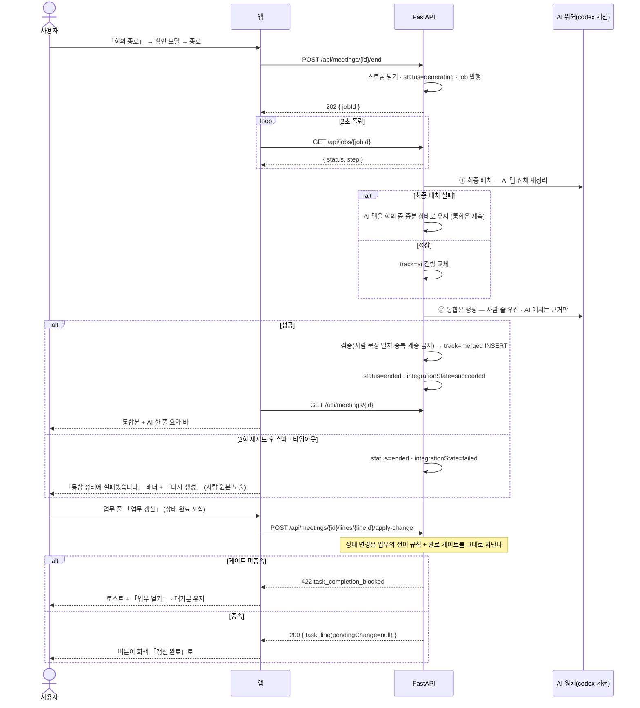
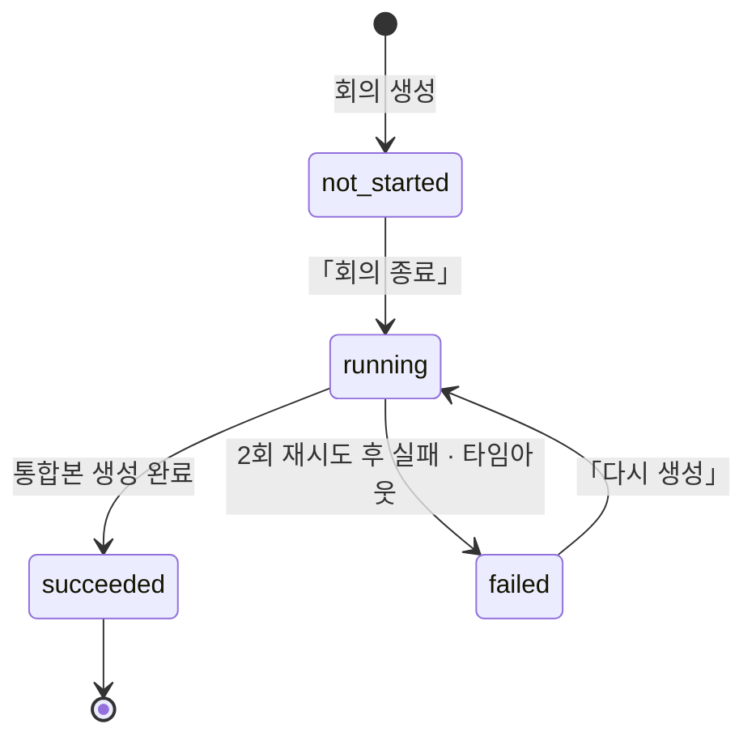

# 회의록 — 종료 · 통합 · 편집 · 업무 연동

회의를 끝내면 **「회의록 생성중」**을 지나 **통합본**이 나온다. 통합본은 **사람이 쓴 문장을 그대로 쓰고** AI 에서는 근거 타임스탬프와 빠진 내용만 가져온다. 나온 뒤에는 편집으로 고치고, 액션 줄에서 **업무를 만들거나** 업무 줄에서 **업무를 갱신**한다 — **완료 게이트를 우회하지 않는다.**

> 기능/정책 묶음 단위의 **외부 계약** 문서다. client / QA / 외부 통합이 이 문서만 읽고 따를 수 있어야 한다.
> SPEC에는 table schema 전문, ORM field, repository/service 구조, PR 계획, 구현 순서, 라우트·컴포넌트 파일 경로 같은 내부 구현을 두지 않는다.

## 1. Context

### Meta

- Decision reference: DEC-003 §4(종료 파이프라인·통합 규칙·재생성 없음) · §5(수정·업무 연동) · §6(AI 탭은 로그성) · §7(통합 실패·스피너 타임아웃) · §8(연결)
- Baseline reference: BASE-003 (회의록)
- 소비 규약: **DEC-002 §4 완료 게이트 — SPEC-004 U-6·§4 가 정본**(회의록발 상태 변경도 같은 판정을 지난다) · DEC-005 §2(캘린더가 회의 상세 드로어를 재사용)
- Architecture reference: `system/README.md` §흐름 ③ · `backend/README.md` §5-3·§6·§8-2·§8-3·§10 · `frontend/README.md` §6·§8 · `database/domains/meeting.md` M-4·M-7·M-8·M-14·M-14-a
- Design reference: `12-meeting-notes.md` §편집 모드·§드로어 3종·§근거 · P-40~P-45 · `09-design-tokens.md` · `디자인 시스템.dc.html [09][10]` · 정정 §A-5·§A-6
- Domain note: 외부에 드러나는 것은 **회의 상태**(`generating`→`ended`)와 **통합 상태**(`integrationState`), **통합본 트랙**(`merged`), **job** 이다
- Open questions: §7

### Business Requirement

- **통합본이 회의록의 정본이다**(DEC-003 §4). AI 탭은 로그성 기록으로 남고, 사람이 읽고 고치는 것은 통합본이다.
- **AI 가 사람 문장을 다듬지 않는다**(M-8). 통합은 「사람 줄 우선 + AI 는 근거·누락분 보완」이고, 이 규칙이 지켜지는지를 **우리가 다시 검증한다**(§5).
- **실패해도 회의록이 비지 않는다**(DEC-003 §7). 통합이 실패하면 사람 원본을 그대로 보이고 「다시 생성」을 준다 — 스크립트·AI 탭·녹음이 모두 남아 있다.
- **회의록에서 업무를 바꿔도 규칙은 같다.** 완료로 보내면 **완료 게이트**를 통과해야 한다(DEC-002 §4 · M-14-a) — 회의록에서 왔다고 우회하지 않는다.

### Scope

In scope:

- **회의 종료** — 확인 모달 · `generating` 전환 · job 발행
- **「생성중」 화면**(미설계 확정) — 스피너 · 단계 표시 · 폴링 · 타임아웃
- **통합 파이프라인** — ① 최종 배치(AI 탭 전체 재정리) ② **통합본 생성**(회의록 탭 = 정본)
- **통합 실패 배너 · 「다시 생성」**(실패 상태에서만)
- **종료 후 상세** — AI 한 줄 요약 바 · 안건별 줄 · **근거 펼침과 타임칩**(스크립트 스크롤·하이라이트)
- **편집 모드** — 인라인 수정 · 줄 종류 전환(4종) · **드로어 3종**(논의·결정 / 연관 업무 / 액션 아이템)
- **업무 생성(POST) · 업무 갱신(PATCH)** — 버튼 트리거, **완료 게이트 소비**
- **회의 상세 드로어**(840) — **회의록이 소유하고 캘린더가 재사용**한다(DEC-005 §2)

Out of scope:

- 목록·생성·시작 전·삭제·프로젝트 칩·반응형 — **SPEC-006**(반응형은 SPEC-006 U-6 이 정본)
- 회의 중 기록·STT·회의 중 배치 — **SPEC-007**
- 캘린더 화면 자체 — 배치 ④(이 spec 은 **드로어만** 제공한다)
- **통합본 재생성** — 정상 생성분에는 없다(DEC-003 §4). 「다시 생성」은 실패에서만
- 업무 상세 화면 — SPEC-003·004(여기서는 열어 보내기만 한다)

## 2. UX Contract

### Placement

종료 후 상세는 SPEC-007 과 같은 골격(좌 본문 유동 + 우 사이드 탭)이다. 회의 상세 드로어는 그 요약본을 840 폭에 담는다.

```text
[종료 후 상세 P-40]                          [회의 상세 드로어 — 캘린더 재사용]
+──────────────────────────────+──────────+  +──────────────+────────────────+
│ 제목 · 일시 · 60분 · 유형     [편집]     │  │ (뒤 화면)     │ 드로어 840     │
│ ┌ AI 한 줄 요약 바 ─────────────────┐    │  │              │ 헤더 72 (⤢ ×) │
│ 안건 1                                    │  │              │ 요약·안건·첨부 │
│   결정 ─ … ▸ 근거 09:34–09:36            │  +──────────────+────────────────+
+──────────────────────────────+──────────+
```

### U-1. 회의 종료 확인 모달 (600)

되돌릴 수 없는 결정 하나라 **모달 600**이다([10]). 종료한 회의를 다시 기록하는 전이가 없다(SPEC-006 §4).

- **상태**: 스크림 `rgba(30,30,30,0.36)`. 진행 중에는 버튼 비활성
- **문구**
  - 제목 「**회의를 종료할까요?**」
  - 요약 「녹음을 멈추고 회의록을 정리합니다. 정리에는 잠시 시간이 걸립니다.」
  - 경고 슬롯 「**종료한 회의는 다시 기록할 수 없습니다.**」
- **CTA**: 「취소」 · 「**회의 종료**」(`#7181F8`)
- **기대 결과**: 확인하면 **스트림이 닫히고** 상태가 `generating` 이 되며 **U-2 화면**으로 바뀐다

### U-2. 「생성중」 화면 — 미설계 확정 (DEC-003 OQ-2 · §A-6)

- **상태**
  - *상태 바*: 스피너 + 「**회의록 생성중**」 + 단계 문구 — 「AI 정리 중」(최종 배치) → 「통합본 만드는 중」(통합). 경과 시간을 함께 적는다
  - *좌측 회의록 탭*: **사람이 쓴 줄이 그대로 보인다**(빈 화면·스켈레톤으로 덮지 않는다). **읽기 전용** — 편집 버튼이 비활성이고 프롬프트 바가 없다
  - *AI 요약 탭*: 회의 중 증분 상태 그대로 보인다. 최종 배치가 끝나면 **전체가 갈아 끼워진다**
  - *우측*: 스크립트·첨부 그대로
  - *다른 화면에서 돌아왔을 때*: 목록에서 그 회의록은 「**생성중**」으로 보이고, 열면 같은 화면이 이어진다(상태가 서버에 있다)
- **문구**: 위와 같다. **진행률 퍼센트를 만들지 않는다** — 배치 소요를 예측할 근거가 없다
- **CTA**: 없다. **취소 버튼을 두지 않는다** — 되돌릴 경로가 없다(녹음은 이미 끝났다)
- **기대 결과**: 완료되면 **U-4 종료 후 상세**로 바뀐다. 실패하면 **U-3 배너**가 뜬다. **무한 대기는 없다** — 상한을 넘으면 실패로 마감된다(§5)

### U-3. 통합 실패 배너 · 「다시 생성」

- **상태**: `status='ended'` **그리고** `integrationState='failed'` 인 **그 조합에서만** 뜬다(M-4)
  - 회의록 탭에는 **사람 원본이 그대로** 보인다(통합본이 없으므로)
  - 배너: 실패 색 테두리 + 「**통합 정리에 실패했습니다**」 + 「사람이 쓴 회의록·AI 요약·스크립트·녹음은 그대로 있습니다」
- **문구**: 위와 같다
- **CTA**: 「**다시 생성**」 — 통합만 다시 돌린다. 누르면 **U-2 화면으로 되돌아가** 진행을 보여준다
- **기대 결과**: 성공하면 회의록 탭이 통합본으로 바뀌고 배너가 사라진다. **정상 생성분에는 이 버튼이 없다** — 재생성이 없고 편집으로만 고친다(DEC-003 §4)

### U-4. 종료 후 상세 (P-40 · P-41)

- **상태**
  - 헤더: 제목 · 일시 · 소요(60분) · 유형 배지 · 프로젝트 칩 · 회색 「**종료된 회의**」 칩 · 「⋯」 · 「**편집**」
  - **AI 한 줄 요약 바**(1640×56 비율, `#EEF1FE`/`#C9D1FB`): 한 문장 + 「안건 3 · 결정 2 · 액션 2」. 없으면 바를 그리지 않는다
  - 좌측 회의록 탭 = **통합본**(`merged`), AI 요약 탭 = **최종 배치 결과**(`ai`). 탭 dot 은 회의록 `#7181F8` · AI 요약 `#B3B3B3`(12-meeting-notes §탭)
  - **근거 펼침**: 논의·결정 줄 hover 시 **우측 화살표**로만 펼친다 — **줄 전체 클릭은 인라인 편집**이라 겹치지 않는다(P-41). 펼침 = AI 상세 설명 + 근거 칩 「09:34 – 09:36」
  - 업무 줄: 우측에 「**업무 갱신**」 버튼(갱신 대기분이 있을 때) 또는 회색 「**갱신 완료**」. 액션 줄: 「**업무 생성**」
- **문구**: 위와 같다
- **CTA**: 근거 칩 클릭 → **우측 스크립트가 그 구간으로 스크롤하고 `#F4F5FF`/`#C9D1FB` 로 강조**한다(12-meeting-notes §근거). 「편집」 → U-5
- **기대 결과**: 통합본 줄의 문장은 **사람이 쓴 그대로**다(M-8). AI 에서 온 것은 근거 칩과, AI 트랙에만 있던 내용의 추가분뿐이다

### U-5. 편집 모드 (P-42)

- **상태**
  - 헤더 우측이 「**변경은 자동 저장됩니다**」 + 「**편집 완료**」로 바뀐다(회색 칩 「편집 중」). **검정을 쓰지 않는다**([10] — 검정은 위치 표시 전용)
  - 안건 제목·논의·결정 본문이 **입력 필드**가 되고, 줄 종류 라벨이 **셀렉터(4종 전환)** 가 된다
  - **하단 프롬프트 바를 감춘다** — 줄 추가 경로가 둘이 되지 않게(12-meeting-notes §편집 모드)
  - 줄 추가는 안건마다 「**+ 논의 / + 결정 / + 연관 업무 / + 액션 아이템**」 → **U-6 드로어 3종**
  - *저장 실패*: **SPEC-002 U-7 규격**(토스트 + 그 필드 실패 표시 + 「다시 저장」, 자동 재시도 없음)
- **문구**: 위와 같다. **「되돌리기」를 두지 않는다**(§7)
- **CTA**: 「편집 완료」 → 읽기 상태로. 저장 버튼은 없다([10] 자동 저장)
- **기대 결과**: 편집 대상은 **회의록 탭이 보여주는 트랙**이다 — 통합 성공이면 `merged`, **통합 실패면 사람 원본(`human`)** 을 고친다(§5). **AI 탭은 편집 대상이 아니다**(로그성 기록 — DEC-003 §6)

### U-6. 편집 드로어 3종 (P-43 · P-44 · P-45)

여러 값을 넣는 편집이라 **드로어 840**이고, **드로어 위에 모달을 겹치지 않는다**(FE §6-2).

| 드로어 | 필드 | 하단 버튼 |
|---|---|---|
| **논의 · 결정 추가** | 종류 선택(논의/결정) · 안건 셀렉터 · 내용 · 상세 설명 · **근거 구간 칩 추가** | 「취소 / 추가」 |
| **연관 업무 추가** | 내 업무 검색 → **단일 선택(라디오)** → 반영할 변경(**기한 / 상태**) + **진행 메모** | 「취소 / **연결하고 갱신**」 |
| **액션 아이템 추가** | 업무 생성 양식(제목 · 유형 · 프로젝트 · 기한 · 시작 상태 · 메모) + 「**회의록 줄을 연관 업무로 바꾸기**」 토글(기본 켜짐) | 「취소 / **업무 생성**」 |

- **상태**: 「연관 업무」의 변경 항목은 **고른 것만** 나간다(12-meeting-notes §드로어 3종). 상태를 「완료」로 고르면 **U-7 의 게이트 판정**을 지난다
- **문구**: 「상세 설명」 캡션 「비워 두면 AI 정리가 채웁니다」 — **회의가 끝난 뒤에는 채워지지 않는다**는 사실을 함께 적는다: 「(종료된 회의에서는 채워지지 않습니다)」
- **CTA**: 위 표
- **기대 결과**: 「연결하고 갱신」은 **줄에 업무를 연결하고 그 자리에서 갱신까지** 보낸다. 「업무 생성」은 업무를 만들고, 토글이 켜져 있으면 그 줄이 **업무 줄(`task`)로 전환**되며 `taskId` 가 붙는다(12-meeting-notes §줄 종류)

### U-7. 업무 생성 · 갱신 — **완료 게이트를 우회하지 않는다**

**줄을 적는 것만으로 업무가 생기지 않는다. 버튼을 눌러야 요청이 나간다**(DEC-003 §5 · M-14).

- **상태**
  - *액션 줄*: 「**업무 생성**」 버튼. 누르면 **U-6 액션 아이템 드로어**가 값이 채워진 채 열린다(줄 본문 → 제목)
  - *업무 줄 + 갱신 대기분 있음*: 「**업무 갱신**」 버튼 + 변경 예정 칩(「기한 08.29」 · 「상태 완료」 · 「메모 추가」)
  - *갱신 후*: 버튼이 회색 「**갱신 완료**」로 바뀌고 대기분이 사라진다
  - *게이트 거부*: **아무것도 바뀌지 않는다** — 상태도, 줄도. 대기분이 그대로 남는다
- **문구**
  - 게이트 거부 토스트: 「**완료하려면 결과자료 1건 또는 완료 결과가 필요합니다**」 + 「**업무 열기**」 — **SPEC-004 U-6 과 같은 문구**다(판정이 같으므로 문구도 같다)
  - 전이 위반: 「이 상태로는 바꿀 수 없습니다」
- **CTA**: 「업무 열기」 → 그 업무의 상세를 연다(SPEC-003 U-3). 회의록 화면은 그대로 남는다
- **기대 결과**: 갱신에 담기는 것은 **기한 · 상태 · 메모 추가 셋뿐**이다(M-14-a). **메모는 새 항목으로 추가**되고 기존 필드를 덮어쓰지 않는다. 상태를 완료로 보내면 **SPEC-004 의 판정을 그대로** 지난다

### U-8. 회의 상세 드로어 (840) — 회의록이 소유, 캘린더가 재사용

DEC-005 §2 가 「회의록이 소유하고 캘린더가 재사용한다」로 못박은 표면이다. 배치 ④ 캘린더가 이 규격을 그대로 연다.

- **상태**
  - 헤더 72: 유형 배지 + 프로젝트 칩 / 제목 / 일시·소요 / 상태 칩 / **⤢** / **×**
  - 본문: **AI 한 줄 요약** → **안건 > 줄 트리**(통합본. 없으면 사람 원본) → **첨부 목록**
  - 상태별: `scheduled` 면 「아직 회의 전입니다」 + 「**회의 시작**」, `recording` 이면 「기록 중」 + 「**회의로 이동**」, `generating` 이면 스피너 + 「생성중」, `ended` + 실패면 U-3 배너 축약형
  - **편집은 드로어에서 하지 않는다** — 편집·업무 버튼은 전체 페이지에만 둔다(드로어는 확인용이고, 드로어 안에서 또 드로어를 열지 않는다 — FE §6-2)
- **문구**: 위와 같다
- **CTA**: **⤢** → 회의록 전체 페이지로 승격(닫히고 이동한다 — F-5) · × 닫기
- **기대 결과**: 목록 프리뷰·캘린더 어디서 열어도 **같은 드로어**다. **드로어는 동시에 하나**만 열린다(FE §6-2)

### U-9. 반응형

**SPEC-006 U-6 이 정본**이다. 편집 드로어와 회의 상세 드로어는 1280~1439 에서 **전체 화면**으로 바뀌고 헤더 좌측에 `←` 가 생긴다(`08-responsive.md` L17).

## 3. User Scenario

### S-1. 사용자 — 회의를 끝낸다

1. 상태 바의 「회의 종료」를 누른다 → **확인 모달**에 「종료한 회의는 다시 기록할 수 없습니다」가 보인다.
2. 「회의 종료」 → 녹음이 멈추고 「**회의록 생성중**」이 뜬다. 단계 문구가 「AI 정리 중」 → 「통합본 만드는 중」으로 바뀐다.
3. 그동안 **내가 쓴 회의록은 그대로 보이고** 편집만 잠겨 있다.
4. 잠시 뒤 **통합본**이 뜨고 상단에 AI 한 줄 요약 바가 생긴다.

### S-2. 사용자 — 통합본이 내 문장인지 확인한다

1. 통합본에서 내가 적었던 결정 줄을 찾는다 → **문장이 내가 쓴 그대로**다.
2. 그 줄에 hover 해 화살표로 펼치면 **근거 칩**이 붙어 있다.
3. 회의 중 내가 적지 않았지만 AI 가 잡은 내용이 **추가 줄**로 들어와 있다.

### S-3. 사용자 — 근거를 따라간다

1. 근거 칩 「09:34 – 09:36」을 누른다 → 우측 스크립트가 그 구간으로 스크롤되고 발화가 강조된다.

### S-4. 사용자 — 통합이 실패한다

1. 통합이 두 번 재시도 후에도 실패한다 → 스피너가 걷히고 「**통합 정리에 실패했습니다**」 배너가 뜬다.
2. 회의록 탭에는 **내가 쓴 원본이 그대로** 있고 AI 탭·스크립트·녹음도 남아 있다.
3. 「**다시 생성**」을 누르면 생성중 화면으로 돌아가 다시 돈다. 성공하면 배너가 사라진다.
4. 정상 생성된 회의록에는 **「다시 생성」 버튼이 없다.**

### S-5. 사용자 — 회의록을 고친다

1. 「편집」을 누른다 → 헤더가 「변경은 자동 저장됩니다 · 편집 완료」로 바뀌고 **하단 프롬프트 바가 사라진다.**
2. 결정 줄 문장을 고치고 다른 곳을 클릭한다 → 저장 버튼 없이 저장된다.
3. 줄 종류 라벨을 눌러 「논의」를 「결정」으로 바꾼다.
4. 안건 아래 「+ 액션 아이템」 → 드로어에서 업무 양식을 채우고 「업무 생성」.

### S-6. 사용자 — 액션 줄에서 업무를 만든다

1. 액션 줄의 「**업무 생성**」을 누른다 → 드로어가 줄 본문을 제목으로 채운 채 열린다.
2. 유형·기한을 넣고 「업무 생성」 → 업무가 만들어지고, 토글이 켜져 있어 그 줄이 **업무 줄로 바뀌며** 업무가 연결된다.
3. 내 업무 목록에 그 업무가 보인다.

### S-7. 사용자 — 업무를 완료로 갱신하려다 막힌다

1. 업무 줄의 변경 예정 칩에 「상태 완료」가 있다. 「**업무 갱신**」을 누른다.
2. 그 업무에 결과자료도 완료 결과도 없다 → 「**완료하려면 결과자료 1건 또는 완료 결과가 필요합니다**」 토스트가 뜨고 **아무것도 바뀌지 않는다.** 대기분도 그대로 남는다.
3. 「업무 열기」로 상세를 열어 완료 결과를 적는다.
4. 회의록으로 돌아와 다시 「업무 갱신」 → 갱신되고 버튼이 회색 「**갱신 완료**」가 된다.

### S-8. 사용자 — 캘린더에서 회의를 연다 (배치 ④ 전제)

1. 캘린더에서 회의 블록을 누른다 → **이 spec 의 회의 상세 드로어**가 열린다.
2. 요약·안건·첨부를 확인하고 **⤢** 로 전체 페이지로 넘어간다.

## 4. Interface Contract

### API Contract

| Method | Path | 요약 | 권한 |
|---|---|---|---|
| POST | `/api/meetings/{id}/end` | **회의 종료** — `202` + jobId | 세션 |
| GET | `/api/jobs/{jobId}` | 작업 상태 폴링 | 세션 |
| POST | `/api/meetings/{id}/integration/retry` | **통합 다시 생성**(실패 상태에서만) | 세션 |
| GET | `/api/meetings/{id}` | 상세(트랙별) | 세션 |
| POST | `/api/meetings/{id}/lines` | 줄 추가(편집 모드) | 세션 |
| PATCH | `/api/meetings/{id}/lines/{lineId}` | 줄 본문·종류·안건·상세·근거 수정 | 세션 |
| DELETE | `/api/meetings/{id}/lines/{lineId}` | 줄 삭제 | 세션 |
| POST | `/api/meetings/{id}/agendas` · PATCH · DELETE | 안건 추가·수정·삭제(편집 모드) | 세션 |
| POST | `/api/meetings/{id}/lines/{lineId}/create-task` | **액션 줄 → 업무 생성** | 세션 |
| POST | `/api/meetings/{id}/lines/{lineId}/apply-change` | **업무 줄 → 업무 갱신** | 세션 |

- **종료는 비동기다** — `202 { jobId }` 를 주고 프론트가 **2초 간격 폴링**한다. **통지 경로를 둘로 두지 않는다**(WS 는 종료와 함께 닫힌다 — SYS-7 · `backend/README.md` §6)
- **업무 생성·갱신은 회의록 표면에서 나가지만 판정은 업무 쪽 규칙 그대로**다 — 상태 변경은 **SPEC-004 의 상태 전이 계약**(전이 그래프 + 완료 게이트)을 지난다(§5)
- **통합본을 다시 만드는 표면은 실패 전용 하나뿐**이다. 정상 생성분에는 재생성이 없다(DEC-003 §4)
- 스트림(WS)은 SPEC-007, 목록·생성·삭제는 SPEC-006

### Request / Response

에러는 여기 두지 않는다 — **Case Matrix 가 단일 SoT** 다.

**`POST /api/meetings/{id}/end`** → `202 { "jobId": 123 }` (상태가 `generating` 으로 바뀐다)

**`GET /api/jobs/{jobId}`**

```json
{ "id": 123, "kind": "meeting_finalize", "status": "running",
  "step": "integrating", "errorCode": null, "errorMessage": null, "finishedAt": null }
```

- `status` ∈ `queued` · `running` · `succeeded` · `failed`
- `step` ∈ `final_batch`(AI 정리 중) · `integrating`(통합본 만드는 중) — **화면 단계 문구의 근거**다
- **job 은 결과를 담지 않는다.** 완료 후 `GET /api/meetings/{id}` 를 다시 읽는다(`backend/README.md` §6)

**`GET /api/meetings/{id}`**(종료 후)

```json
{
  "id": 21, "status": "ended", "integrationState": "succeeded",
  "aiHeadline": "소개서 개정 범위를 4개 섹션으로 확정했다",
  "counts": { "agenda": 3, "decision": 2, "action": 2 },
  "batchSeqApplied": 7,
  "tracks": {
    "human":  { "agendas": [ … ] },
    "ai":     { "agendas": [ … ] },
    "merged": { "agendas": [
      { "id": 41, "title": "개정 범위", "orderIndex": 0, "state": "done", "lines": [
        { "id": 88, "kind": "decision", "content": "도입 사례는 3건만 유지한다",
          "detail": "…", "evidence": [{ "fromMs": 2040000, "toMs": 2160000 }],
          "sourceHumanLineId": 77, "taskId": null, "pendingChange": null }
      ]}
    ]}
  }
}
```

- **`sourceHumanLineId` 가 계약에 드러난다** — 그 통합 줄이 **어느 사람 줄을 그대로 쓴 것인지**를 가리킨다. 값이 있으면 `content` 는 그 사람 줄과 **글자 그대로 같다**(§5 검증). AI 트랙에만 있던 내용은 `null` 이다
- `counts` 는 AI 한 줄 요약 바의 「안건 3 · 결정 2 · 액션 2」다(파생값)

**`PATCH /api/meetings/{id}/lines/{lineId}`** — `{ "content": "..." }` / `{ "kind": "decision" }` / `{ "agendaId": 42 }` / `{ "detail": "..." }` / `{ "evidence": [{ "fromMs": 2040000, "toMs": 2160000 }] }`

**`POST /api/meetings/{id}/lines/{lineId}/create-task`**

```json
{ "title": "제품 소개서 내용 업데이트", "workTypeId": 3, "projectId": 7,
  "dueDate": "2026-08-29", "status": "todo", "memo": "회의에서 나온 액션",
  "convertLine": true }
```

→ `201 { "task": { … }, "line": { "id": 90, "kind": "task", "taskId": 101 } }`
`convertLine` 이 참이면 줄이 **업무 줄로 전환**되고 `taskId` 가 붙는다(기본 켜짐 — 12-meeting-notes §드로어 3종)

**`POST /api/meetings/{id}/lines/{lineId}/apply-change`**

```json
{ "dueDate": "2026-08-30", "status": "done", "note": "리뷰 반영 완료" }
```

→ `200 { "task": { … }, "line": { "id": 88, "pendingChange": null } }`
**보낸 항목만 반영된다**(드로어에서 고른 것만). `note` 는 **업무 메모에 새 항목으로 추가**되고 기존 필드를 덮어쓰지 않는다(M-14-a)

**`POST /api/meetings/{id}/integration/retry`** → `202 { "jobId": 124 }`

### Validation

| 필드 | 규칙 |
|---|---|
| 종료(`/end`) | 상태가 **`recording`** 일 때만 |
| 재생성(`/integration/retry`) | **`status='ended'` 이고 `integrationState='failed'`** 일 때만(M-4). 정상 생성분에는 없다 |
| 줄 수정·추가·삭제 | 상태가 **`ended`** 일 때만(편집 모드). `generating` 중에는 잠긴다 |
| 편집 대상 트랙 | **회의록 탭이 보여주는 트랙만** — 통합 성공이면 `merged`, 실패면 `human`. **`ai` 트랙은 수정할 수 없다**(로그성 기록 — DEC-003 §6) |
| 줄 `kind` | `discussion` · `decision` · `task` · `action`. **`task` 로 바꾸려면 `taskId` 가 있어야 한다** — 연결 없이 업무 줄이 되지 않는다(M-14) |
| 줄 `agendaId` | 그 회의의 **같은 트랙 안건**이어야 한다. 트랙을 넘는 이동은 없다(M-5) |
| `evidence` | `fromMs < toMs`, 회의 길이 안. **회의 시작 기준 오프셋**이다(M-11) |
| `create-task` | 업무 생성 규칙을 그대로 따른다 — **제목 필수 · 유형 필수**(SPEC-003 §4) |
| `apply-change` | **기한 · 상태 · note 셋만** 허용한다. 그 밖의 필드는 거부(M-14-a). `status` 는 **전이 그래프**를 지키고, `done` 이면 **완료 게이트**를 통과해야 한다(SPEC-004 §4) |

### Case Matrix

이 spec 의 모든 에러·경계가 여기 있다. **완료 게이트 거부는 SPEC-004 와 같은 코드·같은 문구다.**

| 에러 코드 | 백엔드 출력 | 프론트 출력 | 표시 위치 |
|---|---|---|---|
| **(통합 실패)** | 자동 재시도 **2회** 후 `status='ended'` + `integrationState='failed'`. job 은 `failed` + `errorCode:"integration_failed"` | **U-3 배너** 「통합 정리에 실패했습니다」 + 「다시 생성」. **회의록 탭에 사람 원본을 그대로 보인다** | 상태 바 아래 배너 |
| **(스피너 타임아웃)** | 상한을 넘으면 job 을 `failed` + `errorCode:"integration_timeout"` 로 마감한다. **무한 대기 금지**(DEC-003 §7) | 위와 같은 배너(문구 동일) | 〃 |
| **(마지막 배치 실패)** | AI 탭을 **회의 중 증분 상태 그대로 유지**한다. 통합은 그대로 진행한다 | 별도 표시 없음 — AI 탭이 회의 중 상태로 남는다 | (없음) |
| `task_completion_blocked` | `422 {detail:"완료하려면 결과자료 1건 또는 완료 결과가 필요합니다", code:"task_completion_blocked"}` · **업무도 줄도 바뀌지 않는다** | **토스트**(6초) 같은 문구 + 「**업무 열기**」. 대기분과 버튼이 그대로 남는다 | 화면 하단 토스트 |
| `invalid_status_transition` | `409 {detail:"이 상태로는 바꿀 수 없습니다", code:"invalid_status_transition"}` | 토스트. 대기분 유지 | 화면 하단 토스트 |
| `invalid_pending_change` | `422 {detail:"기한·상태·메모만 반영할 수 있습니다", code:"invalid_pending_change"}` | 드로어 안 인라인 안내. 드로어가 닫히지 않는다 | 연관 업무 드로어 |
| `invalid_work_type` | `422 {detail:"사용할 수 없는 유형입니다", code:"invalid_work_type"}` | 액션 드로어의 유형 셀렉터 인라인 안내 | 액션 아이템 드로어 |
| `schedule_overlap` | `409 {detail:"그 시간에 다른 일정이 있습니다", code:"schedule_overlap"}` | 토스트 + 기한 값 원복(업무 기한에 시간이 붙은 경우) | 화면 하단 토스트 |
| `invalid_meeting_status` | `409 {detail:"지금 상태에서는 할 수 없습니다", code:"invalid_meeting_status"}` | 토스트 + 화면 갱신(예: 이미 종료된 회의에 종료 요청) | 화면 하단 토스트 |
| `validation_error` | `422 {detail:"입력값을 확인해 주세요", code:"validation_error"}` | 해당 필드 실패 테두리 + 인라인 문구 | 그 필드 |
| `not_found` | `404 {detail:"회의록을 찾을 수 없습니다", code:"not_found"}` | 「없는 회의록입니다」 + 「목록으로」 | 회의 화면 |
| **(줄 자동 저장 실패 — 5xx·네트워크)** | 각 코드 그대로. **서버는 재시도하지 않는다** | **SPEC-002 U-7 규격** — 토스트 + 그 필드 실패 표시 + 「다시 저장」 | 편집 중인 줄 |
| (그 밖 5xx · 네트워크) | **fallback 없이 전파** — 스택이 로그에 남는다 | 가리지 않는다. 실패 표시 + 「다시 시도」 | 그 영역 |
| `token_expired` / `invalid_refresh_token` | SPEC-001 §4 | SPEC-001 §4 | — |

- **통합 실패와 타임아웃은 화면에서 같은 배너**다 — 사용자가 할 일이 같다(다시 생성). 구분은 job 의 `errorCode` 에만 남는다
- **회의 중 배치 실패·스키마 위반·없는 업무 참조는 SPEC-007** 의 Case Matrix 에 있다

### Flow



### State / Lifecycle

**통합 상태**(회의 상태 전이는 SPEC-006 §4 가 정본).



- **`succeeded` 에서 나가는 전이가 없다** — 정상 생성분은 **재생성하지 않고 편집으로만** 고친다(DEC-003 §4)
- 회의 상태는 통합 성패와 무관하게 **`ended` 로 간다** — 실패해도 회의는 끝난 것이고, 회의록이 비지 않는다(DEC-003 §7)
- **줄의 생명주기는 따로 없다** — 편집은 덮어쓰기이고 회의록에 변경 이력을 남기지 않는다(DEC-003 §6 「변경 이력 없음」의 결)

### Data Contract

| 리소스 | 외부에 드러나는 필드 |
|---|---|
| 회의(종료 후) | `status` · `integrationState`(`not_started`\|`running`\|`succeeded`\|`failed`) · `aiHeadline` · `counts{agenda,decision,action}` · `batchSeqApplied` |
| job | `id` · `kind`(`meeting_finalize`) · `status` · `step`(`final_batch`\|`integrating`) · `errorCode` · `errorMessage` · `finishedAt` |
| 통합 줄 | 줄 필드 + **`sourceHumanLineId`**(그대로 계승한 사람 줄. AI 에만 있던 내용이면 `null`) |
| 줄 | `id` · `track` · `agendaId` · `kind` · `content` · `detail` · `evidence[{fromMs,toMs}]` · `orderIndex` · `taskId` · `pendingChange{dueDate?,status?,note?}` |

- `pendingChange` 에 담기는 것은 **세 가지뿐**이다(M-14-a). 다른 키가 오면 거부한다
- 시각 오프셋(`fromMs`·`toMs`)은 **회의 시작 기준**이다(M-11)

## 5. Implementation Rules

### 종료 파이프라인

- 종료는 **① 스트림 닫기 → ② `generating` → ③ 최종 배치 → ④ 통합본** 순서다(DEC-003 §4). **스트림을 반드시 닫는다** — 종료 처리는 실패 여부와 무관하게 실행된다(`backend/README.md` §5-1)
- **최종 배치가 실패해도 통합은 진행한다.** AI 탭은 회의 중 증분 상태로 남긴다 — 버리지 않는다(DEC-003 §7)
- **수치**(DEC-003 §7 이 spec 으로 넘긴 값)

  | 항목 | 값 | 근거 |
  |---|---|---|
  | 통합 재시도 | **2회**(총 3번 시도) | DEC-003 §7 이 명시한 값 |
  | 한 시도의 상한 | **300초** | 통합은 회의 전체를 한 번에 읽는 작업이라 회의 중 배치(120초 — SPEC-007 §5)보다 길게 잡는다 |
  | job 전체 상한 | **900초** | 3번 시도 × 300초. 넘으면 `integration_timeout` 으로 마감한다 — **무한 대기 금지** |
  | 폴링 간격 | **2초** | `backend/README.md` §6 |

- **기동 스윕** — 서버가 재시작되면 `queued`/`running` 으로 남은 job 을 재개하거나 실패로 마감한다. 「생성중」이 영원히 도는 상태를 만들지 않는다(`backend/README.md` §5-3)

### 통합 규칙 — 사람 줄 우선

- **통합본의 문장은 사람이 쓴 그대로다**(M-8 · DEC-003 §4). AI 에서 가져오는 것은 **근거 타임스탬프**와 **AI 트랙에만 있던 내용의 추가분**뿐이다
- **「같은 내용」 판정에 유사도 임계값을 두지 않는다.** 대신 **구조로 강제한다** — 통합 결과의 각 줄이 `sourceHumanLineId` 를 담게 하고, 우리가 다음을 검증한다.
  1. `sourceHumanLineId` 가 있으면 **본문이 그 사람 줄과 글자 그대로 같아야 한다.** 다르면 **사람 원문으로 덮어쓴다**(AI 가 다듬은 것을 되돌린다)
  2. **한 사람 줄을 두 통합 줄이 계승할 수 없다.** 위반이면 그 결과를 실패로 본다
  3. `sourceHumanLineId` 가 없는 줄은 **AI 트랙에만 있던 내용**이고, 그 줄의 근거는 AI 줄에서 물려받는다
  임계값을 정하면 「몇 %면 같은 문장인가」를 사람이 검증할 수 없다. 위 세 규칙은 **결과만 보고 판정할 수 있다**
- **안건도 통합된다** — 사람 안건이 먼저 오고, AI 안건 중 사람 안건에 흡수되지 않은 것이 뒤에 붙는다(M-5-a). 통합본 안건·줄은 전부 `track='merged'` 다
- **정상 생성분을 다시 만들지 않는다**(DEC-003 §4). 재생성 표면은 실패 전용이다

### 편집

- **편집 대상은 회의록 탭이 보여주는 트랙**이다 — 통합 성공이면 `merged`, 실패면 `human`. **AI 트랙은 편집할 수 없다**(로그성 기록 — DEC-003 §6)
- **자동 저장이다**(포커스 해제). 저장 버튼이 없고, 실패는 SPEC-002 U-7 규격으로 화면에 남는다. **자동 재시도가 없다**(DEC-001 §7)
- **편집 중에는 프롬프트 바를 감춘다** — 줄 추가 경로를 하나로 둔다(12-meeting-notes §편집 모드)
- **회의록에 변경 이력을 남기지 않는다.** 편집은 덮어쓰기다(DEC-003 §6)

### 업무 연동

- **버튼을 눌러야 요청이 나간다.** 줄을 적거나 고치는 것만으로 업무가 생기거나 바뀌지 않는다(DEC-003 §5 · M-14)
- **상태 변경은 업무의 규칙을 그대로 지난다** — 전이 그래프와 **완료 게이트**(DEC-002 §4 · SPEC-004 U-6·§4). **회의록에서 왔다고 우회하지 않는다**(`backend/README.md` §8-3). 거부되면 **업무도 줄도 바뀌지 않고** 대기분이 남는다
- **`pendingChange` 는 기한·상태·note 셋뿐**이다(M-14-a). `note` 는 **업무 메모에 새 항목으로 추가**하고 기존 값을 덮지 않는다. 그 밖의 키는 거부한다
- **업무 생성은 업무의 검증을 그대로 쓴다** — 제목·유형 필수, 유형은 삭제되지 않은 것(SPEC-003 §4)
- **낙관적 갱신을 하지 않는다** — 게이트·전이·겹침이 거부할 수 있다(FE §3-4)

### 회의 상세 드로어

- **회의록이 소유하고 캘린더가 재사용한다**(DEC-005 §2). 드로어는 **부모를 모른다** — 부모가 열고 결과를 콜백으로 받는다(FE §6-2)
- **드로어 안에서 편집하지 않는다.** 편집·업무 버튼은 전체 페이지에만 둔다 — 드로어 안에서 또 드로어를 여는 구조를 만들지 않는다
- **드로어는 동시에 하나**이고, **드로어 위에 모달을 겹치지 않는다**([10] · FE §6-2)

## 6. Verification

### Acceptance Criteria

앱 창에서 사람이 직접 확인하는 문장으로 적는다.

- [ ] 「회의 종료」를 누르면 **확인 모달**에 「종료한 회의는 다시 기록할 수 없습니다」가 보인다
- [ ] 종료하면 「**회의록 생성중**」이 뜨고 단계 문구가 「AI 정리 중」 → 「통합본 만드는 중」으로 바뀐다
- [ ] 생성중에도 **내가 쓴 회의록이 그대로 보이고** 편집 버튼은 비활성이다
- [ ] 다른 화면으로 갔다가 목록에서 그 회의록을 열면 **생성중이 이어져** 보인다
- [ ] 통합이 끝나면 회의록 탭이 **통합본**으로 바뀌고 상단에 **AI 한 줄 요약 바**가 생긴다
- [ ] 통합본에서 내가 적은 결정 줄의 **문장이 내가 쓴 그대로**이고, 펼치면 **근거 칩**이 붙어 있다
- [ ] 근거 칩을 누르면 **우측 스크립트가 그 구간으로 스크롤·강조**된다
- [ ] 통합을 실패시키면 「**통합 정리에 실패했습니다**」 배너가 뜨고 **회의록 탭에 사람 원본이 그대로** 보인다. 스크립트·AI 탭도 남아 있다
- [ ] 「**다시 생성**」을 누르면 생성중으로 돌아가고, 성공하면 배너가 사라진다
- [ ] **정상 생성된 회의록에는 「다시 생성」 버튼이 없다**
- [ ] 「편집」을 누르면 헤더가 「변경은 자동 저장됩니다 · 편집 완료」로 바뀌고 **하단 프롬프트 바가 사라진다**
- [ ] 줄 문장을 고치고 다른 곳을 클릭하면 **저장 버튼 없이** 저장되고, 종류 라벨 셀렉터로 「논의 → 결정」 전환이 된다
- [ ] 안건 아래 「+ 액션 아이템」 드로어에서 **업무가 만들어지고**, 토글이 켜져 있으면 그 줄이 **업무 줄로 바뀌며** 업무가 연결된다
- [ ] 만든 업무가 **내 업무 목록에 보인다**
- [ ] 결과자료도 완료 결과도 없는 업무를 「업무 갱신」으로 **완료로 보내면 거부**되고 「완료하려면 결과자료 1건 또는 완료 결과가 필요합니다」 토스트 + 「업무 열기」가 뜬다. **업무도 줄도 바뀌지 않는다**
- [ ] 완료 결과를 채운 뒤 다시 갱신하면 성공하고 버튼이 회색 「**갱신 완료**」가 된다
- [ ] 갱신 메모가 **업무 메모에 새 항목으로 추가**되고 기존 메모가 지워지지 않는다
- [ ] 목록 프리뷰에서 회의를 열면 **회의 상세 드로어(840)** 가 뜨고 ⤢ 로 전체 페이지가 된다
- [ ] 창을 1280~1439 로 줄이면 편집 드로어와 상세 드로어가 **전체 화면**이 되고 헤더 좌측에 `←` 가 생긴다

## 7. Open Questions

### 이 spec 이 닫은 것

| 닫힌 항목 | 무엇으로 닫았나 |
|---|---|
| **DEC-003 OQ-2**(「생성중」 상태 화면 · 실패 배너 · 「다시 생성」) | **U-2·U-3 에서 확정** — 스피너 + **단계 문구**(job 의 `step` 이 근거) + 사람 원본 노출 · 편집 잠금 · 진행률 퍼센트 없음 · 취소 버튼 없음. 배너는 **`ended` + `failed` 조합에서만**, 「다시 생성」도 그 조합에서만(M-4 · DEC-003 §4) |
| **DEC-003 OQ-7 의 남은 몫**(「같은 내용」 판정 임계) | **§5 에서 확정 — 임계값을 두지 않는다.** 대신 통합 결과가 `sourceHumanLineId` 를 담게 하고 ① 계승했으면 본문이 사람 줄과 **글자 그대로 같을 것** ② 한 사람 줄을 둘이 계승하지 못할 것을 **우리가 검증**한다. 다르면 사람 원문으로 덮어쓴다 — 「AI 가 사람 문장을 다듬지 않는다」(M-8)가 규칙으로 강제된다 |
| **DEC-003 §7 이 spec 으로 넘긴 수치** | **§5 에서 확정** — 통합 재시도 **2회** · 한 시도 상한 **300초** · job 전체 상한 **900초** · 폴링 **2초**. 회의 중 배치 수치는 SPEC-007 §5 |
| **§A-6 정정**(status 3종 → 「생성중」) | **U-2·§4 에서 확정** — `generating` 화면과 `integrationState` 별도 축을 계약에 넣었다 |
| **§A-5 정정**(단일 트랙 모델) | **§4·§5 에서 확정** — 통합본이 `merged` 트랙의 별도 산출물이고, `sourceHumanLineId` 로 사람 줄과의 관계를 드러낸다 |
| **DEC-005 §2 의 「회의 상세 드로어는 회의록이 소유」** | **U-8 에서 확정** — 드로어 840 규격(헤더·요약·안건 트리·첨부·상태별 CTA·⤢ 승격)과 **드로어에서는 편집하지 않는다**는 경계. 배치 ④ 캘린더가 이 규격을 그대로 연다 |

### 남은 것

| ID | Question | Owner | Next |
|---|---|---|---|
| S008-OQ-1 | **「되돌리기」를 뺐다.** 디자인(P-42 편집 모드 헤더)에 「되돌리기」가 있으나 **회의록에 변경 이력이 없어**(DEC-003 §6) 되돌릴 근거가 없다. 필요하면 이력 정책부터 정해야 한다 | 사용자 | DEC-003 갱신 |
| S008-OQ-2 | **`invalid_pending_change` 코드 신설**과 `job.step` 필드. 아키텍처 §8-2 코드 표와 §6 job 응답에 반영이 필요하다(배치 ①·②·③ 에서 만든 코드들과 함께) | 코디 | 아키텍처 갱신 |
| S008-OQ-3 | **`sourceHumanLineId` 를 외부 계약에 넣었다.** DB 도메인 문서(M-8)는 「본문은 사람 문장 그대로」만 말하고 계승 관계를 저장한다고 적지 않았다 — 검증 규칙을 성립시키려면 필요하다. 스키마 반영 여부는 코디 판단이다 | 코디 | 아키텍처 갱신 |
| S008-OQ-4 | **통합 실패와 타임아웃을 화면에서 같은 배너로 합쳤다**(사용자가 할 일이 같다). 구분은 job 의 `errorCode` 에만 남는다 — 화면에서 구분해야 하면 알려 달라 | 사용자 | DEC-003 갱신 |
| S008-OQ-5 | **「상세 설명은 비우면 배치가 채운다」의 종료 후 처리.** 12-meeting-notes 는 드로어에 그 안내를 두는데, 종료 후에는 채울 배치가 없다 — 캡션에 「(종료된 회의에서는 채워지지 않습니다)」를 덧붙이는 것으로 정했다 | 사용자 | DEC-003 갱신 |
| S008-OQ-6 | **회의 상세 드로어의 캘린더 쪽 진입 규격**(어느 블록에서 어떻게 열리는지)은 **배치 ④** 가 정한다. 이 spec 은 드로어 자체와 ⤢ 승격까지만 계약했다 | 코디 | 배치 ④ |
