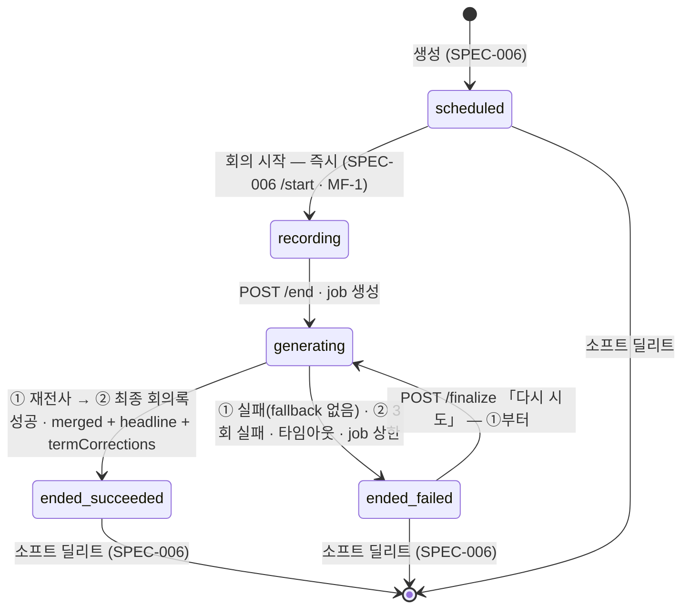
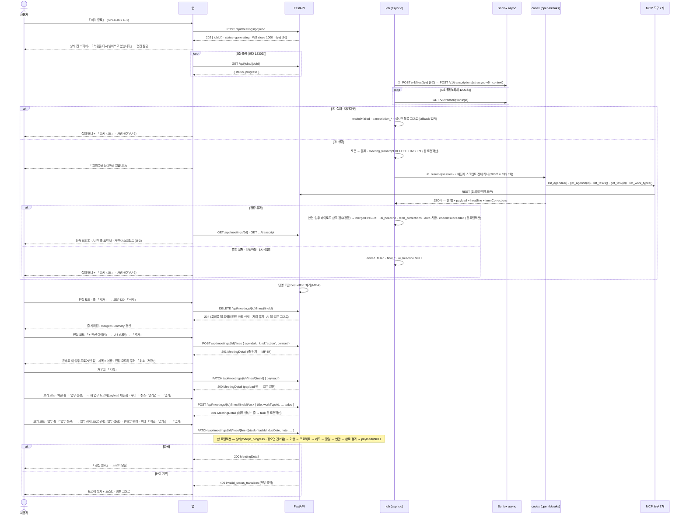

# 회의록 — 종료 · 재전사 · 최종 회의록 · 편집 · 업무 연동

회의를 **끝내면** 스피너가 돌고, 서버가 **녹음 원본을 다시 전사**해 화자 분리를 바로잡은 뒤 **AI 가 최종 회의록을 한 번에 쓴다** — 사람이 적은 줄도 다듬고, 액션·업무 줄에는 DB 에 바로 넣을 페이로드가 실린다. 그 회의록을 **편집**하고(줄 고치기 · 줄 추가 · 줄 지우기 · 안건 이름 고치기), 액션 줄로 **업무를 만들고**, 업무 줄로 **업무를 고친다** — 업무 탭의 드로어를 그대로 열어 확인하고 「넣기」를 눌러야 요청이 나간다.

> 기능/정책 묶음 단위의 **외부 계약** 문서다. client / QA / 외부 통합이 이 문서만 읽고 따를 수 있어야 한다.
> SPEC에는 table schema 전문, ORM field, repository/service 구조, PR 계획, 구현 순서, 라우트·컴포넌트 파일 경로 같은 내부 구현을 두지 않는다.
>
> **2026-09-06 재작성 · v0.0.3.** 이전 판은 시안을 계약으로 옮겨 폐기됐다. 이 판은 **기능은 BASE-003 · DEC-003 만**, **시각은 디자인 시스템 + `회의록.dc.html`** 로 축을 나눈다.
>
> **2026-09-07 v0.0.4 — `reference/2026-09-06-task-management-app/Meeting flow.md`(`MF-n`) 반영.** 흐름·동작의 정본은 그 문서다 — 이 spec 과 부딪히면 그쪽이 이긴다. 바뀐 것 —
> **MF-37 · 56 · 57 · 58**(종료 = ① async 재전사 → ② 최종 회의록 호출 한 번. 종료 시 배치·통합 호출·「사람 문장 복사」 규칙 폐기. 재전사 실패에 fallback 없음 — 「다시 시도」) ·
> **MF-52 · 59 · 54**(출력 스키마 한 벌 · 액션·업무 줄 페이로드 · STT 용어 매핑표) · **MF-60 · 62 · 36 · 63**(줄 종류 전환 없음 · 안건 삭제 없음 · 지운 자리 유지 · 확인 모달 420) ·
> **MF-13 · 14 · 61 · 21**(업무 생성·갱신은 업무 탭 드로어 재사용 · 사람 줄은 빈 드로어 · `work_type.description`) · **MF-25 · 7 · 8 · 9**(카운트 다섯 · breadcrumb 링크 + 「←」 · 헤더 순서 · 줄 시각 없음).

## 1. Context

### Meta

- Decision reference: DEC-003 §1(줄 4종 · 일시정지 · 종료 후 편집 범위 다섯 · AI 한 줄 요약 바 · 확인 모달 크기) · §2(AI 데이터 접근) · §3(status 4종 · 트랙 · `payload` · 용어 보정 표) · §4(종료 파이프라인 — 재전사 → 최종 회의록 · 최종 회의록 작성 · 업무 갱신 허용 필드 일곱 · 재시도) · §5(편집 다섯 · 업무 연동은 업무 탭 드로어) · §6(재전사 · 용어 보정 · AI 탭은 로그) · §7(열거된 실패만 — 재전사 실패 · 최종 회의록 실패) · §8(두 표면 · 일시 소유 · AI 도구 연결) · §STT(재전사 모델) · OQ-7(폐기) · OQ-10 · OQ-12
- Baseline reference: BASE-003 기능명세 **#8 · #9 · #10**(L70~72) · #7 근거 타임칩의 종료 후 표면(L69) · §Raw L39 · L42~43 · 인바운드 L84(연관 업무 검색은 내 업무)
- 소비 규약: DEC-002 §4(완료 게이트 · 전이 그래프) · DEC-005 §2(회의 상세 드로어는 회의록 소유) · §4·§5(일시 · 메타 수정은 드래그 또는 상세 드로어) · DEC-001 §7(자동 저장 실패 표시) · DEC-001 §3(`work_type.description` — MF-21)
- Architecture reference: `system/README.md` §③ · 불변식 2·3·7·11·12 · `backend/README.md` §5-2 · §5-3 · §6 · §7 · §8-2 · §8-3 · §10 · `database/README.md` §1 · §4 · `database/domains/meeting.md` M-3 ~ M-9-b · M-11 · M-14 ~ M-15 · **M-19 · M-20** · `database/domains/task.md` T-5 · T-6 · `frontend/README.md` §2 규칙 8 · §6(모달 두 크기) · §6-3(상세 헤더) · §8
- Design reference: `회의록.dc.html` **L1403~2882**(상세 · 근거 펼침 · 편집 중 · 드로어) · `디자인 시스템.dc.html` **[09] MEETING NOTE(L649~755 — 한 줄 요약 바 L727~733)** · [05] · [06] · [07] · [10] · 정정 §A-5 · §A-6 · §A-7 · §A-8. 시각만 쓴다 — 시안에 있으나 기획·정책에 없는 것은 §7
- 물려받는 계약(고치지 않는다): **SPEC-006** `MeetingDetail`(§4 — `headline` · `mergedSummary` · `payload` 포함) · `PATCH /api/meetings/{id}` · `PATCH …/agendas/{agendaId} {title}` · `DELETE` · U-5 삭제 확인 모달(600) · U-7 첨부 탭 / **SPEC-007** `POST /api/meetings/{id}/lines` · `GET …/transcript` · U-4 AI 탭 트리 · U-5 스크립트 패널 · U-6 근거 칩 스크롤(ms 매칭) · 안건 `state` 3종 / **SPEC-003** U-1 새 업무 드로어(**여기서 안건 슬롯을 더해 연다** — MF-13) · U-2 인라인 편집 · U-3 업무 상세 드로어(**변경분 프리필 모드로 연다** — MF-14) · U-8 연관업무 후보 고르기(**그대로 쓴다** — MF-14) · §4 `POST /api/tasks` 규칙 · `GET /api/tasks/relations/candidates` / **SPEC-004** §4 완료 게이트 코드 · U-6 토스트 · U-8 확인 모달 프레임 / **SPEC-002** U-7 자동 저장 실패 · `GET /api/work-types`(설명 포함)
- Domain note: 외부에 드러나는 것은 **회의**(제목 · 유형 · 프로젝트 · 일시 · `status` · `integrationState` · **`headline`**)와 **트랙별 안건 > 줄 트리** 세 벌(`human` · `ai` · `merged`), 줄의 **`payload`**, 그리고 **작업(job)** 이다. 용어 보정 표는 서버가 갖고 화면에 나오지 않는다
- Open questions: §7

### Business Requirement

- **회의록 탭 = 최종 회의록(`merged`)이 정본이고 AI 탭 = 로그성 기록이다**(BASE-003 L39 · DEC-003 §4 · §6). 사람은 회의가 끝나고 회의록 탭만 본다. **최종 회의록은 AI 가 한 번에 쓴다**(MF-56 · MF-57) — 재전사 스크립트를 주고, AI 가 도구로 사람 줄·자기 AI 줄·안건을 보고 정리본 한 벌을 낸다. 사람이 적은 문장도 다듬는다(오타를 그대로 남길 이유가 없다). 어차피 사람이 그 위에서 고치고, 편집이 그 자리다. 최종이 끝나면 **AI 정리본 = 회의록**이다.
- **화자 분리는 종료 후 재전사로 바로잡는다**(MF-37). 실시간(`stt-rt-v5`)은 저지연 제약으로 화자 오귀속이 많고(2026-09-07 실측 — 실제로 안 갈렸다), `stt-async-v5` 는 전체 오디오 컨텍스트를 본다. 녹음 원본을 다시 전사해 트랜스크립트를 갈아끼운다. **재전사 실패에 fallback 이 없다**(MF-58) — 실시간 결과로 몰래 만들지 않는다. 「다시 시도」 하나.
- **AI 한 줄 요약 · 용어 보정 표 · 업무 페이로드는 최종 회의록 호출과 같은 응답으로 온다**(DEC-003 §1 표 · MF-52 · 54 · 59). 출력 스키마는 회의 중 배치와 **한 벌**이고 이 셋만 nullable 이다. 별도 호출이 없다.
- **편집은 다섯이다** — 줄 삭제 · 줄 추가 · 줄 수정 · 업무 넣기 · 안건 제목 수정(DEC-003 §5 · MF-60 · MF-62). **줄 종류를 바꾸는 표면이 없다** — 종류가 틀렸으면 지우고 새로 적는다. **안건은 제목만 고친다.** 지운 자리는 그대로 둔다(MF-36). 삭제는 회의록 탭이 그리는 트랙에서만 일어나고 AI 탭 · 트랜스크립트 · 녹음은 남는다(ERD M-20).
- **업무를 만들거나 고치는 화면은 업무 탭이 정본이고 회의록은 슬롯만 더한다**(MF-13 · MF-14). 「업무 생성」은 업무 탭의 **새 업무 드로어**에 안건 셀렉터 하나를 얹어 페이로드로 채워 열고, 「업무 갱신」은 **업무 상세 드로어**를 AI 변경분이 반영된 채로 연다. 사람이 적은 액션·업무 줄은 페이로드가 없어 **빈 드로어**로 연다(MF-61) — 그 줄 하나만 AI 에게 다시 묻지 않는다. **「넣기」를 눌러야 요청이 나간다**(DEC-003 §5). 상태 변경은 **내 업무의 전이 판정**을 그대로 지나고 **`done` 은 회의록이 보내지 않는다**(MF-59 — 완료 결과만 채워 두고 게이트는 업무 화면에서 사람이 연다).
- **처리하는 실패는 DEC-003 §7 이 열거한 것뿐이다.** 재전사 실패(fallback 없음) · 최종 회의록 생성 실패(재시도 2회) · 스피너 타임아웃. 그 밖은 그대로 터뜨린다(BASE-003 L43). **수치는 이 spec 이 정한다**(§7 L144).
- **회의록은 두 표면을 제공한다** — 전체 페이지 + 상세 드로어(DEC-003 §8 · DEC-005 §2). 드로어는 캘린더가 재사용하고, **제목 · 유형 · 프로젝트 · 일시의 수정 경로**이기도 하다(DEC-005 §5 · SPEC-006 U-4).

### Scope

In scope:

- **회의 종료 요청과 「회의록 생성중」 상태** — `POST /end` → job 폴링 → 스피너 + 단계 문구(재전사 / 정리) + 사람 원본 노출 + 편집 잠금
- **종료 파이프라인의 계약** — ① async 재전사(Soniox `stt-async-v5` · `context` · 블록 규칙 · 트랜스크립트 전량 교체) → ② 최종 회의록 호출(입력 · 출력 스키마 한 벌 · 서버 검증 · 페이로드 · 한 줄 요약 · 용어 보정 표)
- **실패 표면** — `ended` + `failed` 에서만 배너 + 「다시 시도」(①부터)
- **회의록 상세 전체 페이지**(종료 후) — 헤더(배지 줄 → 제목 → 일시) · **AI 한 줄 요약 바**(카운트 다섯) · 회의록 탭(최종 회의록) · AI 요약 탭(회의 중 마지막 배치) · 스크립트(재전사) · 첨부 탭 자리 · 메타 인라인 편집
- **회의 상세 드로어(840)** — 캘린더 · 목록이 여는 표면. 읽기 + 메타 편집 + 승격 + 한 줄 요약
- **근거 펼침 · 타임칩 → 스크립트 스크롤 · 하이라이트**의 종료 후 표면(규칙은 SPEC-007 U-6 승계 — ms 매칭)
- **편집 모드** — 줄 인라인 수정 · 추가(칩 넷 → 줄 추가 드로어로 **줄 먼저**, 업무·액션 줄은 업무 드로어가 이어서 — MF-64) · **줄 삭제(확인 모달 420 · 자리 유지)** · **안건 이름 인라인 수정** · 포커스 해제 자동 저장(줄·안건 이름에만 — 업무 드로어는 「저장 · 넣기」)
- **업무 생성 · 업무 갱신** — 줄 버튼 규격, 업무 탭 드로어 재사용, 페이로드 프리필, 서버 계약(한 요청 · 한 트랜잭션), 완료 게이트 우회 없음(`done` 미전송), **줄을 지워도 업무는 남는 경계**
- 이 영역 반응형

Out of scope:

- 회의 생성 드로어 · 시작 전 화면 · 목록 · 미리보기 · 회의록 삭제 확인 모달(600) · 첨부 탭 규격 · `MeetingDetail` 의 기본 형태 — **SPEC-006**
- 회의 중 화면 · 스트림 · 배치 · 프롬프트 바 · 일시정지 · 「회의 종료」 버튼의 자리와 활성 조건 · 트랜스크립트 표면 · 근거 칩 스크롤 규칙 · AI 도구 · 웜스타트 — **SPEC-007**(이 spec 은 그 버튼이 부르는 요청부터 정한다)
- 새 업무 드로어 · 업무 상세 드로어 · 연관업무 후보 고르기의 **규격 자체** — **SPEC-003**(이 spec 은 회의록에서 열 때 더하는 슬롯 · 프리필 · 제출처만 정한다)
- 캘린더 표시 · 드래그 — SPEC-009(이 spec 의 드로어를 재사용한다는 사실만 참조)
- **줄 순서 이동 · 줄 종류 전환 · 종료 후 안건 추가 · 안건 삭제 · 안건 상태 변경** — 정책이 넣지 않았다(DEC-003 §1 표 · MF-60 · MF-62 · ERD M-5-d · M-20)
- **문단 요약** — 회의록 목록의 「요약 · AI 생성」 문단(SPEC-006 §7 이 제외)은 이 spec 범위에도 없다. **한 줄 요약 바와 다른 것이다**(§7)
- **용어 보정 표의 화면** — 기획·정책에 표시 화면이 없다(MF-54 는 서버 규칙이다). 서버가 갖고 자동 치환분만 스크립트 본문에 반영된다
- 근거 구간 수동 선택 · 되돌리기 · AI 안건 제안 · 최종 회의록 재생성 — 시안에 있거나 옛 설계에 있었으나 기획·정책에 없다(§7 제외 목록)
- 반복 회의 · 알림 · 시스템 오디오 · 자료함 문서를 AI 컨텍스트로 — v2(DEC-003 §1)

## 2. UX Contract

### Placement

앱 셸 안의 **전체 페이지**(`/meetings/detail?id=` — FE §1)와, 목록 · 캘린더 위에 열리는 **드로어 840**(FE §6). 드로어 ⤢ 는 전체 페이지로 승격된다(한 방향 — F-5).

```text
[전체 페이지 — 시안 L1403 · 헤더 순서는 MF-8]                  [드로어 — SPEC-003 U-3 구조]
+──────+──────────────────────────────────────────+   +──────────────+────────────────+
│ 사이드바│ ←  홈 › 회의록 › <제목>                  │   │ (뒤 화면 보임) │ 드로어 840     │
│ 200  │ [ <유형> ˅ ] [ ● <프로젝트> ˅ ]  [삭제] [상태 칩] │   │  스크림 0.32   │ 헤더 72        │
│      │ <제목 28/700>                            │   │              │ 상단 바        │
│      │ <MM월 DD일 (요일) HH:MM – HH:MM · n분>     │   │              │ 탭 회의록|AI   │
│      │ ┌ 상단 바 1640×56 ─────────────────────┐ │   │              │ 안건 > 줄 트리 │
│      │ ├ 좌 1160 ───────────┬ 우 464 ─────────┤ │   │              │ (읽기 전용)    │
│      │ │ 탭 회의록 | AI 요약 │ 스크립트 | 첨부 n │ │   │              │ 첨부 n         │
│      │ │ 안건 > 줄 트리      │ 화자 블록        │ │   +──────────────+────────────────+
│      │ └────────────────────┴──────────────────┘ │
+──────+──────────────────────────────────────────+
```

- **헤더는 업무 상세 헤더 순서를 따른다**(MF-8 · FE §6-3 — 업무가 정본이고 회의록이 따라간다): ① 「←」 + breadcrumb(「홈」·「회의록」 링크, 제목은 링크 아님 — MF-7) ② **배지 줄** — 유형 · 프로젝트(인라인 셀렉터 유지) 와 **같은 높이의 우측 액션**(삭제 · 상태 칩) ③ **제목** ④ 회의 고유 메타 한 줄(일시 · 소요). 시안 L1436~1443 의 「제목 → 메타 줄에 인라인 셀렉터」 배치는 정정
- **상단 바(top 150 · 1640×56)는 한 자리다**(디자인 시스템 [09] L733 · DEC-003 §1 표). 상태에 따라 내용이 바뀐다 — `generating` 은 회색 상태 바(U-1), `ended`+`failed` 는 실패 배너(U-2), `ended`+`succeeded` 는 **AI 한 줄 요약 바**(U-3).
- **드로어 위에 모달을 겹치지 않는다**(FE §6-2). 드로어 안에서 드로어를 열지 않는다 — 그래서 편집 · 업무 연동은 **전체 페이지에서만** 한다(U-4).
- 좌 1160 / 우 464(left 1416) 배치는 디자인 시스템 [09] L723. 좌표는 비율 참고값이다(§C Q-34).

### U-1. 회의록 생성중 — `status='generating'` (DEC-003 OQ-2 확정 · 디자인 미설계 → 디자인 시스템 조립)

시안에 이 화면이 없다(§B-3 「생성중 상태 화면」). 디자인 시스템 [09] L733 「진행 중 화면에서는 회색 상태 바가 같은 자리를 쓴다」와 SPEC-007 U-1 의 회색 바 규격(`#F4F5F7` / `#E1E3E8` / dot `#B3B3B3`)으로 조립한다.

- **상태**
  - *진입*: 회의 중 화면(SPEC-007 U-1)의 「회의 종료」가 `POST /api/meetings/{id}/end` 를 부르고 `202 {jobId}` 가 오면 **그 자리에서** 이 상태로 바뀐다. 페이지를 새로 열어도 `status='generating'` 이면 같다(`activeJobId` 로 폴링을 잇는다)
  - *① 재전사 중*(`progress.phase='transcription'`): 상단 바 문구 「**녹음을 다시 받아쓰고 있습니다**」. 우 패널 스크립트 탭은 회의 중 실시간 블록을 그대로 보인다(재전사가 끝나면 갈아끼워진다 — 캡션 「화자 구분을 다시 정리하는 중입니다」). **처리 시간에 공식 수치가 없다** — 문구에 예상 시간을 적지 않는다(MF-37)
  - *② 정리 중*(`progress.phase='final'`): 상단 바 문구 「**회의록을 정리하고 있습니다**」 — 이 단계가 **최종 회의록 · 한 줄 요약 · 용어 보정 표**를 함께 만든다(§4). 재시도 중이면 「회의록을 정리하고 있습니다 · **다시 시도 중 (n/2)**」. 회의록 탭 dot `#B3B3B3`(L708). AI 요약 탭 dot 도 `#B3B3B3` — **AI 탭은 종료 후 바뀌지 않는다**(종료 시 배치가 없다, MF-56)
  - *편집 잠금*: 「편집」 버튼 없음. 줄의 「업무 생성」 · 「업무 갱신」 **비활성**(불투명도 0.5). 헤더 메타(제목 · 유형 · 프로젝트 · 일시) 잠금. **「삭제」도 비활성** — `generating` 은 지울 수 없다(SPEC-006 U-5 · §4 상태별 허용 표)
  - *폴링 실패*(5xx · 네트워크): 스피너는 그대로 두고 상단 바 우측에 「**상태를 확인하지 못했습니다 · 다시 확인**」. 실패로 꾸미지 않는다(BASE-003 L43)
  - *상한 초과*: 폴링이 §4 수치의 상한을 지나도 종결 상태가 오지 않으면 폴링을 멈추고 위와 같은 「다시 확인」만 남긴다. **서버가 job 을 `failed` 로 마감하므로**(§4 수치 표) 「다시 확인」이 실패 상태를 가져온다
- **문구 · 시각**
  - 상태 칩(시안 L1441~1443 규격): 배경 `#F1F2F5` · 테두리 `#E1E3E8` · 13/600 `#5F6470`. dot 자리에 **12px 스피너 `#7181F8`** + 「**회의록 생성중**」
  - 상단 바: 1640×56 r12, 회색 바(SPEC-007 U-1 규격). 좌측 16px 스피너 `#7181F8` + 단계 문구 14/600 `#5F6470`. 우측 12/`#9EA2AE` 「경과 mm:ss」(종료 요청 응답 시각부터 화면 계산)
  - 회의록 탭: **사람 원본**(`agendas.human`)을 읽기 전용으로 그대로 보인다(DEC-003 OQ-2 「사람 원본 노출」). 탭 아래 캡션 12/`#9EA2AE` 「정리가 끝나면 이 탭이 최종 회의록으로 바뀝니다」
  - AI 요약 탭: **회의 중 마지막 배치 상태** 그대로. 안내 바 우측 「배치 n회 반영 · HH:MM」 그대로(「종결 정리 중」 같은 문구는 없다 — MF-56)
- **CTA**: 「다시 확인」(폴링 실패 시에만) · 사이드바 이동은 막지 않는다 — 나갔다 돌아와도 폴링이 다시 붙는다
- **기대 결과**: job 이 `succeeded` 면 회의 상세와 트랜스크립트를 다시 읽어(FE §3-3) **U-3** 로 바뀐다. `failed` 면 **U-2** 로 바뀐다. **무한 대기가 없다**(DEC-003 §7)

### U-2. 회의록 생성 실패 배너 · 「다시 시도」 — `status='ended'` + `integrationState='failed'` (DEC-003 OQ-2 · MF-58)

「다시 시도」는 **이 조합에서만** 보인다(DEC-003 §4 · ERD M-4). 시안에 없다 — 디자인 시스템 [10] 「#7181F8 은 액션에만」과 SPEC-009 U-8 의 드롭 불가 색 쌍으로 조립한다.

- **상태**
  - *실패*: 상단 바 자리에 **배너** — 배경 `#FCEEEC` · 테두리 1px `#E2685B` · 좌측 14/600 `#E2685B` 「**회의록 생성 실패** · 회의록 탭에 회의 중 작성한 원본을 보여 드립니다」 · 우측 버튼 「**다시 시도**」(30px r8 `#7181F8` 흰 글씨 12/600). 재전사 실패(`transcription_*`)든 최종 회의록 실패(`final_*`)든 **배너는 하나**다 — 사유는 툴팁으로만(「녹음을 다시 받아쓰지 못했습니다」 / 「회의록을 정리하지 못했습니다」). 상태 칩은 「종료된 회의」(dot `#B3B3B3` — 시안 L1442). **한 줄 요약이 없다** — `headline` 은 최종 회의록과 같은 응답에서만 오므로 실패면 `null` 이고 배너가 그 자리를 쓴다(§4 · ERD M-19 ②)
  - *회의록 탭*: **사람 원본**(`agendas.human`)이 보인다. **편집 전부(인라인 수정 · 추가 · 삭제 · 안건 이름) · 업무 생성 · 업무 갱신이 된다** — 이 상태의 편집은 `human` 트랙에 쓰이고, 「다시 시도」의 AI 가 도구로 그 편집본을 본다(§4 · ERD M-20 「대상 트랙은 편집 모드와 같다」). 사람 줄에는 페이로드가 없으므로 업무 버튼은 빈 드로어를 연다(U-6 · MF-61)
  - *AI 요약 탭*: 회의 중 마지막 배치 그대로. 안내 바 「배치 n회 반영 · HH:MM」
  - *스크립트 탭*: ① 이 성공했으면 재전사 결과, ① 에서 실패했으면 실시간 결과 그대로(둘을 화면이 구분하지 않는다 — 데이터는 `GET …/transcript` 하나)
  - *다시 시도 중*: `POST /api/meetings/{id}/finalize` 가 `202 {jobId}` 를 주면 **U-1 의 ① 단계부터** 다시 간다(MF-58 「재시도는 음성 원본 + 안건 + 그동안의 요약을 다시 던진다」 — ① 이 이미 성공했더라도 다시 돈다. 부분 재시도 갈래를 만들지 않는다). 편집 잠금이 다시 걸린다
- **문구**: 배너 문구는 위와 같다. 「다시 시도」 툴팁 「녹음을 다시 받아쓰고 회의록을 다시 정리합니다 · 원본은 바뀌지 않습니다」
- **CTA**: 「다시 시도」 · 「편집」(U-7) · 줄 버튼(U-6) · 「삭제」(SPEC-006 U-5 — `ended` 는 지울 수 있다)
- **기대 결과**: 성공하면 배너가 사라지고 회의록 탭이 최종 회의록으로, 상단 바가 한 줄 요약으로 바뀐다(U-3). 다시 실패하면 같은 배너다. **사람 원본 · AI 탭 · 트랜스크립트 · 녹음이 모두 남아 회의록이 비지 않는다**(DEC-003 §7)

### U-3. 회의록 상세 — 전체 페이지, `status='ended'` + `integrationState='succeeded'` (시안 L1403~1607 · 헤더는 MF-8)

- **상태**
  - *로딩*: 헤더 · 상단 바 · 두 패널 자리에 스켈레톤 `#F1F2F5`, 애니메이션 없음(SPEC-003 U-3 규격). 빈 화면을 먼저 그리지 않는다
  - *정상*: 아래 구성
  - *없는 항목*: 「없는 회의록입니다」 + 「목록으로」. 리다이렉트하지 않는다(FE §1-2)
- **문구 · 구성**
  - **헤더**(MF-7 · MF-8 · FE §6-3 — 시안 L1427~1443 의 순서는 정정):
    1. **「←」**(`/meetings/` 로 한 단계 뒤로) + breadcrumb 「홈 › 회의록 › <제목>」 — 「홈」·「회의록」은 **링크**, 마지막만 링크 아님(색만 진하게). hover·focus 표시, 키보드로 닿는다
    2. **배지 줄** — 좌측 **[유형 배지 ˅]** · **[● 프로젝트 ˅]**(둘 다 누르면 팝오버 셀렉터 — **인라인 편집 동작은 그대로**, `PATCH /api/meetings/{id}` — SPEC-006 §4. 삭제된 유형·프로젝트는 `isDeleted` 로 이름·색 그대로, 무소속이면 「프로젝트 없음」 회색). 우측 **같은 높이**에 「**삭제**」(34px r8 테두리 `#D9D9D9` 13/`#757575` — SPEC-006 U-5 모달 600) + 상태 칩 「**종료된 회의**」(dot 8px `#B3B3B3`)
    3. **제목** 28/700(L1436) — **인라인 편집**(SPEC-003 U-2 규격, 포커스 해제 시 `PATCH /api/meetings/{id} {title}`)
    4. **회의 고유 메타 한 줄** 13/`#757575` 「**08월 27일 (월) 09:30 – 10:30 · 60분**」 — 일시는 **인라인 컨트롤**(날짜 + 시작 – 종료 시각, SPEC-006 §4 `PATCH` 가 유일한 쓰기 표면). 길이는 `durationMinutes`(파생). **유형 · 프로젝트는 여기 없다** — ② 로 올라갔다. 드로어(U-4)와 같은 컨트롤이다 — 두 표면이 다른 규격을 갖지 않는다(SPEC-003 U-4)
  - **상단 바 = AI 한 줄 요약**(DEC-003 §1 표 · 디자인 시스템 [09] L727~733 · 시안 L1448~1452): 1640×56 r12 · 배경 `#EEF1FE` · 테두리 `#C9D1FB`. 좌측 배지 「**AI 한 줄 요약**」(22px 흰 배경 · 테두리 `#C9D1FB` · 11/700 `#4A55B8`) + `headline` **한 문장** 14/600 `#3D46A6`(**넘치면 말줄임** — [09] L730) + 우측 「**안건 n · 논의 n · 결정 n · 액션 n · 업무 n**」 12/`#5F6470`(**MF-25 — 최종 회의록 기준 다섯. 화면에 그리는 그것을 센다.** 이전 「안건 6」인데 트리에 11개가 그려지던 것은 세는 대상과 그리는 대상이 달랐기 때문이다 — F-11). **한 개만.** 값의 출처는 §4(`headline` = `meeting.ai_headline` · 카운트 = `mergedSummary` 파생). 시안 L1453 의 「MM.DD HH:mm 생성」은 **그리지 않는다**(§7 제외). **사람이 편집하지 않는다**(ERD M-19 ④)
  - **좌 패널 1160**(L1456~1547): 탭 「**회의록**」(dot `#7181F8` — 완료, L1458) | 「**AI 요약**」(dot `#B3B3B3`, L1459) + 우측 「**편집**」(30px r8 테두리 `#D9D9D9` 12/600, L1461)
    - **회의록 탭 = `agendas.merged`**(최종 회의록). 안건 블록: 「안건 n」 11/700 `#9EA2AE` + 제목 15/700 + **상태 배지** — `done` 「**완료**」(`#F1F2F5`/`#757575`, L1472) · `next` 「**다음 논의로**」(`#F1F2F5`/`#9EA2AE`, 제목 `#757575` — DEC-003 §1 표의 종료 후 문구. 시안 L1525 「다음으로」는 문구 정정) · `null`(AI 신설 안건) 배지 없음 + 캡션 「AI 안건」(SPEC-007 U-4 와 같은 표기) + **우측 시각 `HH:MM`**(그 안건 첫 줄 시각 — **시각은 안건에만**, MF-9). `active` 는 종료 시 `done` 이 되므로 여기 없다(§4 `/end` · ERD M-5-c)
    - 줄 4종(디자인 시스템 [09] L658~680): 라벨 34px 11/700 — 논의 `#9EA2AE` · 결정 `#1663B5`(본문 15/600, 배경색 없음) · 업무 `#5F6470` · 액션 `#4B52A8`. 본문 15px. 줄 padding 8/10 r8, 안건 기준선 좌측 2px `#EBEBEB`. hover 배경 `#FAFBFC`. **줄에 시각이 없다**(MF-9 — 구간은 펼침의 근거 칩에서 본다). 줄은 `orderIndex` 순으로 그리고 **번호에 구멍이 있어도 그대로**다(MF-36)
    - 업무 줄(L1508~1510): 본문 + **연결 업무의 유형 배지**(22px r4 `#F4F7FF`/`#3F5F94`) + **U-6 버튼**. 액션 줄(L1484~1486): 본문 + **U-6 버튼**
    - 줄 우측 hover 시 **펼침 화살표**(U-5). **줄 본문 클릭은 편집 모드에서만 의미가 있다** — 보기 모드에서는 아무 일도 없다(디자인 시스템 [09] L700)
    - **AI 요약 탭 = `agendas.ai`** — **SPEC-007 U-4 규격 그대로**(트리 · 「AI 안건」 캡션 · 펼침 · 미러 안건 배지 · 줄 시각 없음). 안내 바 우측은 **회의 중 마지막 값 그대로** 「배치 n회 반영 · HH:MM」(배치가 한 번도 없었으면 「AI 요약 없음」). 탭 푸터(SPEC-007 U-4)는 종료 후 **없다**. **버튼이 없다** — 로그성 기록이다(DEC-003 §6). 종료 후 배치가 다시 돌지 않는다(MF-56)
  - **우 패널 464**(L1551~1602): 탭 「**스크립트**」(dot `#B3B3B3`, L1554 — 「실시간」 접두는 종료 후 뺀다) | 「**첨부 파일 n**」(dot `#D9D9D9` 항상, n=0 이면 숫자 생략 — [09] L720)
    - 스크립트 블록 — **SPEC-007 U-5 규격 그대로**(화자 dot · 「화자 n」 · 벽시계 `HH:MM` · 본문 · 홀짝 화자 색). **데이터는 재전사 결과**(MF-37 — `GET /api/meetings/{id}/transcript`, 자동 치환 용어가 반영된 본문). 종료 후 차이는 셋 — 잠정 발화 없음 · 자동 따라가기 없음 · 푸터가 「**전체 스크립트 n분 · 화자 n명**」(시안 L1602 — `n분` = 마지막 `endMs` 를 분으로 올림, `화자 n` = `speakerCount`)
    - 첨부 탭 — **SPEC-006 U-7 규격 그대로**(목록 · 추가 · 파일 드로어). 종료 후에도 추가 · 제거가 된다(SPEC-006 §4 상태별 허용 표 `ended` ✔)
- **CTA**: 「←」 · breadcrumb · 「편집」 → U-7 · 「삭제」 → SPEC-006 U-5 · 줄 버튼 → U-6 · 화살표 · 칩 → U-5 · 배지 줄 셀렉터 · 제목 · 일시 → `PATCH /api/meetings/{id}`
- **기대 결과**: 종료된 회의록은 **회의록 탭 = 최종 회의록, AI 탭 = 회의 중 마지막 배치, 상단 = 한 줄 요약**이다(DEC-003 §5 · §1 표). 최종 회의록 줄의 근거 칩은 AI 가 재전사 스크립트에서 단 구간이다(§4). **사람 원본(`human`)은 남아 있지만 화면에 보이지 않는다.** 일시를 바꾸면 겹침 검사(`schedule_overlap`)를 지나고 캘린더가 갱신된다(SPEC-006 §4)

### U-4. 회의 상세 드로어 (840) — 캘린더 · 목록이 여는 표면 (DEC-005 §2 · DEC-003 §8)

**새 시안이 없다.** 업무 상세 드로어(SPEC-003 U-3)의 구조에 U-3 의 내용을 담는다. 드로어는 부모(목록 · 캘린더)를 모르고, 부모가 `openDrawer` 로 열어 결과를 콜백으로 받는다(FE §6-2). **SPEC-009 U-7 이 여는 드로어가 이것이고, SPEC-006 U-4 가 「제목 · 유형 · 프로젝트 · 일시의 수정 경로」로 가리키는 표면도 이것이다.**

- **상태**
  - *로딩 · 없는 항목*: SPEC-003 U-3 와 같다(스켈레톤 `#F1F2F5` · 「없는 회의록입니다」 + 「목록으로」)
  - *`scheduled`*: 본문에 안건 목록(`agendas.human`, 줄 없음) + 첨부 n. 캡션 「회의 시작은 전체 페이지에서 합니다」. 시작 전 화면 자체는 SPEC-006 U-4
  - *`recording`*: 캡션 「진행 중인 회의입니다 · 전체 페이지에서 보기」 + 사람 트랙 스냅숏(읽기 전용 — WS 를 붙이지 않는다, FE §8 「`useMeetingStream` 하나가 소유」). 메타 잠금
  - *`generating`*: U-1 의 상태 칩 + 상단 바(폴링은 드로어에서도 돈다). 메타 · 삭제 잠금
  - *`ended`+`failed`*: U-2 의 배너 + 「다시 시도」(요청 하나라 드로어에서도 된다)
  - *`ended`+`succeeded`*: **AI 한 줄 요약 바** + 탭 회의록 | AI 요약 + 트리
- **문구 · 구성**
  - 헤더 72 — **업무 상세 드로어와 같은 순서**(이미 배지 줄 → 제목이다 — MF-8 에 맞다): 유형 배지 + 프로젝트 칩(팝오버 셀렉터 — 인라인 변경) / 제목 26·700(인라인 편집) / **일시**(날짜 + 시작 – 종료 시각, 포커스 해제 시 `PATCH /api/meetings/{id} {startAt,endAt}` — SPEC-006 §4 「둘을 함께」) · 상태 칩 / `⋯`(「삭제」 — SPEC-003 U-3 헤더와 같은 자리, SPEC-006 U-5) · ⤢ · ×
  - **한 줄 요약 바 — 840 안의 배치**(디자인 시스템 [09] 규격을 폭에 맞춰 두 줄로): 높이 **72**, 같은 색(`#EEF1FE` / `#C9D1FB` r12). 첫 줄 = 배지 「AI 한 줄 요약」 + 문장 14/600 `#3D46A6` **말줄임**, 둘째 줄 = 「안건 n · 논의 n · 결정 n · 액션 n · 업무 n」 12/`#5F6470`. 페이지(56 · 한 줄)와 **같은 값 · 같은 색**이고 다른 것은 줄 나눔뿐이다. 문장 전체는 **툴팁**으로 본다
  - 트리는 U-3 와 같은 규격이다. **줄 버튼(업무 생성 · 업무 갱신)과 「편집」은 없다** — 드로어 안에서 드로어(업무 드로어)를 열 수 없고, 줄 삭제 모달도 드로어 위에 겹칠 수 없기 때문이다(FE §6-2). 탭 아래 캡션 12/`#9EA2AE` 「**편집과 업무 연동은 전체 페이지에서 합니다**」
  - 근거 펼침은 되지만 **칩은 표시만**이다 — 스크립트 패널이 없다. 펼친 영역 캡션 「스크립트는 전체 페이지에서 볼 수 있습니다」
  - 첨부 n 행 — SPEC-006 U-7 목록 행 규격, 읽기 전용(추가 · 제거는 전체 페이지)
- **CTA**: ⤢(`expandTo` `/meetings/detail?id=` — 드로어가 닫히고 페이지로 간다) · ×(`Esc` · 스크림 클릭 병행) · `⋯` 「삭제」(드로어를 **먼저 닫고** SPEC-006 U-5 모달을 연다 — FE §6-2) · 「다시 시도」
- **기대 결과**: 목록 · 캘린더 어디서 열어도 **같은 드로어**다(F-4). 일시를 바꾸면 캘린더가 갱신된다 — 같은 원본(`meeting.start_at`/`end_at`)을 고치므로(DEC-005 §3 · SPEC-009 U-7). **드로어와 페이지가 다른 규격을 갖지 않는다** — 드로어에서 빠진 것은 규격이 다른 게 아니라 **없는 것**이고, 그 목록은 「편집 · 줄 버튼 · 스크립트 패널 · 첨부 쓰기」 넷이 전부다

### U-5. 근거 펼침 · 타임칩 → 스크립트 이동 — 종료 후 표면 (시안 L1608~1823 · BASE-003 #7 · SPEC-007 U-4 · U-6 승계)

**규칙은 SPEC-007 U-6 그대로다**(SPEC-007 §7-D D-6) — 칩 시각은 `recordingStartedAt + fromMs/toMs` 의 벽시계 `HH:MM`, 클릭하면 우 패널이 스크립트 탭으로 바뀌고 `atMs ≥ fromMs` 인 첫 블록으로 스크롤해 `[fromMs, toMs]` 와 겹치는 블록 전부를 하이라이트(배경 `#F4F5FF` + 테두리 `#C9D1FB` + 시각 `#4A55B8` 600 + 「근거 구간」 — 시안 L1782~1789), 다른 칩 또는 `Esc` 로 해제, 대상이 없으면 「해당 구간의 발화가 없습니다」 2초. **매칭은 시각(ms)** 이라 재전사로 블록이 통째로 바뀌어도 그대로 맞는다(MF-37 · ERD M-9-a). 여기서는 **종료 후에만 다른 것**을 적는다.

- **상태**
  - *회의록 탭(최종 회의록)의 접힘*: 줄 우측에 hover 시에만 **24×24 r6 `#F1F2F5` 화살표**(디자인 시스템 [09] L689 · L700). **`detail` 과 `evidence` 가 둘 다 없는 줄에는 화살표가 없다** — 최종 회의록에도 근거 없는 줄이 있을 수 있어 「근거 없음」 캡션을 매 줄에 두면 소음이 된다. AI 요약 탭은 SPEC-007 U-4 그대로(모든 AI 줄에 화살표 · 없으면 「근거 없음」)
  - *펼침*(L1684~1695): 줄 배경 `#FAFBFC`. 아래에 상세 설명 14/`#5F6470`(`detail` — 없으면 생략) → 「근거」 12/`#9EA2AE` + 칩들 → 캡션 「칩을 누르면 해당 구간 스크립트로 이동합니다」(칩이 있을 때만). 여러 줄을 동시에 펼쳐 둘 수 있다
  - *칩*: 24px r6 배경 `#EEF1FE` · 테두리 `#C9D1FB` · 12/600 `#4A55B8` 「**HH:MM – HH:MM**」(L1693~1694). hover `#E4E9FD`
  - *드로어(U-4)에서*: 칩은 표시만(U-4)
  - *줄이 삭제된 뒤*: 최종 회의록 줄을 지워도 **AI 탭의 줄과 그 칩은 그대로**다 — 삭제는 회의록 탭의 행 하나만 없앤다(§4 · ERD M-20)
- **문구**: 위와 같다
- **CTA**: 화살표(펼침/접힘) · 칩(이동) · `Esc`(해제). **줄 전체 클릭으로 펼치지 않는다** — 줄 클릭은 편집 모드의 인라인 편집 자리다([09] L700)
- **기대 결과**: 최종 회의록 줄의 근거는 **AI 가 최종 호출에서 재전사 스크립트에 단 구간**이다(§4 — 사람 줄을 다듬은 줄에도 AI 가 근거를 달 수 있다). 근거의 원천은 트랜스크립트다(§6)

### U-6. 줄 버튼 — 액션 줄 「업무 생성」 · 업무 줄 「업무 갱신」 (디자인 시스템 [09] L668~677 · 시안 L1484~1486 · L1508~1510 · DEC-003 §5 · MF-13 · 14 · 59 · 61 · 65)

**줄을 적는 것만으로는 업무가 생기지 않는다.** 이 버튼을 눌러야 드로어가 열리고, **보기 모드**에서 연 드로어의 **「넣기」**를 눌러야 업무가 생기거나 바뀐다. 보기 모드 · 편집 모드 모두 같은 자리에 같은 버튼이지만 **여는 드로어의 푸터가 모드별로 다르다**(MF-66) — 편집 모드 = 「취소 · 저장」(`payload` 만 줄에 붙인다 · 업무 없음), 보기 모드 = 「취소 · 넣기」(업무를 만들거나 고친다). 한 푸터에 버튼 셋을 두지 않는다. **회의록 탭에만** 있다(AI 탭 · 회의 중 화면에는 없다 — SPEC-007 U-4). **드로어는 업무 탭의 것이고, 액션·업무 각각 하나뿐이다**(MF-65) — AI 줄과 사람 줄로 드로어를 나누지 않는다. 차이는 **`payload` 가 차 있나 비어 있나** 하나뿐이다.

- **상태**
  - *액션 줄*(`kind='action'`): 우측에 「**업무 생성**」(30px r8 테두리 `#D9D9D9` 12/600 `#1E1E1E`, L1486). 누르면 **U-10**(새 업무 드로어 + 안건 슬롯)이 열린다 — **`payload` 가 있으면 그 값이 채워진 채로**(AI 줄 · 또는 사람이 앞서 「저장」한 줄), **없으면 제목 = 줄 본문 · 프로젝트 = 회의의 프로젝트만 채운 빈 드로어**(MF-61). 그 줄 하나만 AI 에게 다시 묻지 않는다. `payload` 가 있는 줄은 버튼 옆에 6px dot `#7181F8`(「채워진 값이 있다」 표시 — 시안 없음, 디자인 시스템 [09] 탭 dot 재사용)
  - *업무 줄 · 넣기 전*(`kind='task'` · `payload` 유무 무관 · `taskId` 유무 무관): 유형 배지(`taskId` 있을 때만) + 「**업무 갱신**」(30px r8 배경 `#F1F2F5` · 테두리 `#E1E3E8` 12/600 `#757575`, [09] L672). 누르면 **U-9**(업무 상세 드로어 + 헤더 업무 셀렉터)가 열린다 — 헤더 셀렉터에 `taskId` 의 업무(없으면 빈 셀렉터), 본문에 `payload` 의 변경분(없으면 빈 값). 툴팁에 `payload` 의 내용 — 「기한 → 09.02 · 상태 → 진행중 · 메모 1건 · 할일 2건 · 완료 결과」 중 있는 것(없으면 툴팁 없음). **「업무 연결」 같은 별도 버튼·앞 단계는 없다**(MF-65 — 업무는 드로어 헤더에서 고른다)
  - *업무 줄 · 넣기 뒤*(`taskId` 있음 · `payload` 없음 · 「넣기」를 한 번 지난 줄): 같은 자리 「**갱신 완료**」(시안 L1510 표기) 비활성. 액션에서 「넣기」로 만든 줄도 여기 해당한다
  - *연결 업무가 삭제됨*(`task.isDeleted`): 배지 · 제목 그대로 + 「삭제된 업무」 12/`#9EA2AE`, 버튼은 「업무 갱신」 그대로(헤더 셀렉터에서 다른 업무로 바꿀 수 있다)
  - *잠금*: `generating` 이면 전부 비활성(U-1). 드로어(U-4)에는 이 버튼이 없다
- **문구**: 위와 같다. 넣기 성공 시 토스트 없음 — 버튼이 「갱신 완료」로 바뀌는 것이 결과다. **회의록은 `done` 을 보내지 않으므로 완료 토스트가 여기서 뜰 일이 없다**(MF-59)
- **CTA**: 위 두 버튼
- **기대 결과**
  - 드로어 「저장」(편집 모드): **`payload` 만 줄에 붙는다.** 업무는 생기지도 바뀌지도 않는다(브리프 §3 「payload ≠ 업무 생성」). 버튼은 그대로 「업무 생성」/「업무 갱신」이고 dot·툴팁이 그 값을 보여 준다. **AI 가 채운 줄과 사람이 채운 줄이 이 시점에 완전히 같은 상태**다
  - 드로어 「넣기」(보기 모드 · 액션 줄): 그 줄이 **업무 줄로 바뀐다**(라벨 「업무」 · 배지 · 「갱신 완료」). `taskId` 가 채워지고 `payload` 는 비워진다 — ERD M-14
  - 드로어 「넣기」(보기 모드 · 업무 줄): `taskId` 가 헤더 셀렉터의 업무로 확정되고 `payload` 가 비워지며 「갱신 완료」. 업무 쪽에는 **기한 · 상태 전이 로그 · 메모 새 항목 · 할일 · 연관 · 프로젝트 · 완료 결과**가 남는다(DEC-003 §4 「업무 갱신 허용 필드」)
  - 갱신 거부(전이 그래프): **아무것도 바뀌지 않는다.** `payload` 가 남고 버튼은 「업무 갱신」 그대로. 토스트는 SPEC-004 규격(§4 Case Matrix). 완료 게이트는 여기서 걸릴 일이 없다 — `done` 을 보내지 않는다
  - **같은 상태로의 전이 요청을 내지 않는다**(SPEC-004): `payload.status` 가 업무의 현재 상태와 같으면 서버가 전이를 건너뛴다(§4). 화면도 그 항목을 툴팁에서 뺀다
  - **줄을 지워도 업무는 남는다**(U-7 · DEC-003 §1 표 ② · ERD M-20). 업무 쪽에는 회의록을 가리키는 것이 없어 지울 것도 없다. 넣기 전 `payload` 는 줄과 함께 사라진다

### U-7. 편집 모드 (시안 L1824~2041 · DEC-003 §5 · §1 표 · MF-60 · 62 · 36 · 63)

**포커스 해제 자동 저장**이다. 저장 · 취소 버튼이 없다([10] L792). `status='ended'` 에서만 들어갈 수 있다 — 성공분은 `merged` 트랙을, 실패 상태는 `human` 트랙을 편집한다(ERD M-20 · M-5-e). **회의 중 사람 줄은 읽기 전용**이고(SPEC-007 U-2) 편집은 여기서만 일어난다. **할 수 있는 것 다섯** — 줄 삭제 · 줄 추가 · 줄 수정 · 업무 넣기(U-6) · 안건 제목 수정. **못 하는 것** — 줄 종류 바꾸기(MF-60) · 안건 삭제(MF-62) · 줄 순서 바꾸기.

- **상태**
  - *진입*: 「편집」 → 헤더 우측이 「**변경은 자동 저장됩니다**」(12/`#9EA2AE`, L1882) + 「**편집 완료**」(30px r8 `#7181F8` 흰 글씨 12/600, L1884)로 바뀐다. ~~되돌리기~~(L1883)는 **없다**(§7 제외 — 삭제가 있어도 이력을 만들지 않는다)
  - *안건 제목*(L1894 · L1924 · L1959): **인라인 입력 상자**(15/700, 테두리 `#EBEBEB` r8 padding 5/10 흰 배경 — 시안 규격). 포커스 시 테두리 `#7181F8`. **포커스 해제 시 저장**(`PATCH …/agendas/{agendaId} {title}` — SPEC-006 표면 · ERD M-5-e ②). 「안건 n」 라벨 · 상태 배지는 그대로. **안건을 추가 · 삭제하는 버튼은 없다**(MF-62 — 안건을 지우면 그 아래 줄이 통째로 날아간다. 필요 없는 줄은 줄 단위로 지운다. 제목 수정이 되는 이유 — AI 가 오타를 낼 수 있다). AI 신설 안건(「AI 안건」 캡션)도 `merged` 안건이라 이름을 고칠 수 있다 — AI 트랙의 원본 안건 제목은 바뀌지 않는다
  - *줄*(L1898~1909): **라벨은 그대로 라벨이다 — 종류 셀렉터가 없다**(MF-60. 시안 L1898~1909 의 셀렉터는 정정). 본문이 **입력 상자**(15px, 테두리 `#EBEBEB` r8 padding 6/12)가 된다. 업무 줄은 배지 + 버튼(U-6)이 그대로 붙는다. **줄 우측 끝에 「제거」** — hover 로 드러나는 고스트 텍스트 버튼 12/`#9EA2AE`(hover `#E2685B`), **SPEC-003 U-8 「해제」 · U-7 「제거」와 같은 규격**. 편집 대상 트랙의 줄 전부에 붙는다(`merged` · 실패 상태면 `human`)
  - *편집 중 필드*: 포커스 시 테두리 `#7181F8`. 저장 중이면 우측에 작은 진행 표시(SPEC-003 U-2)
  - *저장 실패*: **SPEC-002 U-7 규격** — 토스트 「저장하지 못했습니다 · 줄 내용」/「… · 안건 이름」 + 필드 테두리 `#E2685B` + 「저장되지 않았습니다 · 다시 저장」. 자동 재시도 없음
  - *줄 삭제 확인*: 「제거」 → **확인 모달 420 · 한 문장**(MF-63 · FE §6 `openConfirm({size:"light"})`). 자동 저장이 아니라 **확인을 거친다** — 지운 줄은 되돌릴 이력이 없다([10] L800 · ERD M-20 「하드 딜리트 · 복원 창구 없음」). 편집 모드는 전체 페이지라 드로어 위에 겹치지 않는다(FE §6-2)
    - 제목 「**이 줄을 삭제할까요?**」 18/600 · 요약 「**되돌릴 수 없습니다.**」 13/400 — **한 문장.** 안 지워지는 것(AI 요약 · 스크립트 · 연결된 업무)은 **적지 않는다**. 경고 슬롯 없음(업무 줄이어도 같다 — 갈래를 만들지 않는다)
    - CTA 「취소」 · 「**삭제**」(`#E2685B`) h32. 헤더 72 · 푸터 76 없음. 600 은 회의 삭제(SPEC-006 U-5)에만
  - *안건별 추가 행*(L1913~1916): 각 안건의 줄 목록 아래 칩 4 — 「+ 논의」 「+ 결정」 「+ 연관 업무」 「+ 액션 아이템」(28px r6 테두리 `#E1E3E8` 12/`#5F6470`). **넷 다 같은 방식이다 — 줄이 먼저 생기고, 그다음 드로어가 뜬다**(MF-64). 넷 모두 **U-8 줄 추가 드로어**(내용 필수)로 줄을 만들고, 만든 줄이 **업무 줄이면 U-9, 액션 줄이면 U-10 이 곧바로 이어서 열린다.** 그 드로어를 닫아도 줄은 남는다 — 업무는 나중에 「넣기」로 만든다. 줄 추가는 **종류를 고르고 새로 적는 것**이라 MF-60 에 안 걸린다. **하단 프롬프트 바는 없다**([09] L752)
- **문구**
  - 빈 본문 · 빈 안건 이름으로 포커스를 벗어나면 저장하지 않고 원래 값으로 되돌린다 + 캡션 「내용을 비울 수 없습니다」 / 「안건 이름을 비울 수 없습니다」
- **CTA**: 「편집 완료」(보기 모드로 복귀 — **요청 없음**, 이미 다 저장됐다) · 「제거」 · 추가 칩 4 · `Esc`(그 필드만 편집 전 값으로, 저장 안 함)
- **기대 결과**
  - 본문을 고치고 포커스를 벗어나면 저장된다. 안건 이름을 고치면 보기 모드 · 드로어 · 목록 미리보기(SPEC-006 U-8)에 같은 이름이 보인다
  - **줄을 지우면** 그 자리가 **빈다 — 뒤 줄이 당겨지지 않는다**(MF-36. 화면 순서는 번호순이라 같다. 새 줄은 「마지막 번호 + 1」). 상단 바의 「안건 n · 논의 n · 결정 n · 액션 n · 업무 n」이 따라 바뀐다. **AI 요약 탭의 줄 · 트랜스크립트 · 녹음은 그대로**다(DEC-003 §1 표 ① · ERD M-20). 실패 상태에서 원본 줄을 지워도 같다. **업무 줄을 지워도 업무는 남는다**(② · U-6)
  - **종류가 틀린 줄은 지우고 새로 적는다**(MF-60). 업무 줄을 지워도 연결이 풀릴 뿐 업무는 그대로다
  - **AI 요약 탭은 편집 모드가 없다**(DEC-003 §6 · ERD M-6). 편집 중에도 AI 탭은 보기 그대로다
  - 편집 이력이 없다 — 되돌릴 것은 편집 전 값이 아니라 **다음 편집**이다

### U-8. 줄 추가 드로어 — 논의 · 결정 · 연관 업무 · 액션 아이템 (시안 L2042~2305 · 디자인 시스템 [09] L740~741 · MF-64)

드로어 840 · 스크림 `rgba(30,30,30,0.32)`(FE §6). 헤더 72 · 푸터 76. 회의록이 가진 유일한 자기 드로어다 — 업무가 아니라 **회의록 줄을 적는 것**이라 업무 탭에 상대가 없다. **칩 넷이 전부 이 드로어로 줄을 만든다**(MF-64 — 「줄 먼저」). 업무 쪽 값(업무 고르기 · 변경분 · 새 업무 필드)은 여기서 받지 않는다 — 그건 줄이 생긴 뒤 U-9 · U-10 의 몫이다.

- **상태**
  - *열림*: 헤더 「**논의 추가**」 / 「**결정 추가**」 / 「**연관 업무 추가**」 / 「**액션 아이템 추가**」(칩에 따라) 18/700 + 부제 「<제목> · <일시 날짜>」 12/`#9EA2AE`(L2258~2259) + ×. 열자마자 **내용 입력에 포커스**
  - *제출 가능*: 내용 1자 이상. 아니면 「추가」 비활성
  - *제출 중*: 푸터 비활성 + 진행 표시. *실패*: 드로어 유지 + 인라인 안내(§4 Case Matrix)
- **문구 · 필드 순서**
  1. **종류** 세그먼트(36px r8 — 선택 `#F1F2FE` + 테두리 `#7181F8` + `#4B52A8`, L2266~2267) — 「+ 논의」·「+ 결정」으로 열면 「논의」 | 「결정」 둘 사이를 오갈 수 있다. 「+ 연관 업무」·「+ 액션 아이템」으로 열면 세그먼트가 **그 종류 하나로 고정**된다(「업무」 / 「액션」 — 읽기 전용 칩). **만든 뒤에는 바꿀 수 없다**(MF-60) — 여기서 고르는 것이 마지막이다
  2. **안건** 셀렉터(44px, L2271~2272) — 기본값은 칩을 누른 안건. 같은 트랙의 다른 안건으로 바꿀 수 있다
  3. **내용**(44px, 포커스 테두리 `#7181F8`, L2276~2277) — 필수. 업무 줄이면 「어느 업무를 어떻게」, 액션 줄이면 「할 일」을 한 줄로 — 이것이 줄 본문이고 U-10 의 제목 기본값이다
  4. **상세 설명** textarea(L2281~2282) — 선택. 캡션 ~~「비워두면 회의 종료 후 AI가 채웁니다」~~(L2283)는 **쓰지 않는다** — 종료 후 AI 호출이 없다(§7 제외)
  - ~~근거 구간 · 「구간 추가」~~(L2288~2294)는 **없다** — 근거는 AI 가 최종 호출에서 다는 것뿐이다(§7 제외)
- **CTA**: 「취소」 · 「**추가**」(44px `#7181F8`, L2300~2301). `Esc` · × · 스크림 클릭으로 닫힌다
- **기대 결과**: 그 안건의 **맨 아래**(마지막 번호 + 1)에 줄이 붙고 드로어가 닫힌다(`POST …/lines` — §4. `payload` · `taskId` 없이). 새 줄은 근거가 없다(화살표는 상세 설명이 있을 때만). **업무 줄이면 U-9 가, 액션 줄이면 U-10 이 곧바로 열린다** — 그 드로어를 「취소」로 닫아도 줄은 남는다(MF-64)

### U-9. 업무 줄의 드로어 — 업무 상세 드로어(SPEC-003 U-3) + 헤더 업무 셀렉터 + 모드별 푸터 (MF-14 · MF-65 · MF-66 · MF-59 · 디자인 시스템 [09] L744~745)

**회의록 전용 「연관 업무 연결」 드로어(시안 L2306~2599)는 그리지 않는다** — 업무 쪽과 다른 UI 였다(F-4). **드로어는 하나다**(MF-65). AI 가 만든 줄이든 사람이 적은 줄이든 **같은 드로어 · 같은 필드 · 같은 저장 경로**이고, 다른 것은 **`payload` 가 차 있나 비어 있나**뿐이다. ⛔ 「AI 줄은 넣기 모드 · 사람 줄은 자동 저장」으로 가르지 않는다 — 회의록에서 연 이 드로어는 인라인 자동 저장이 없고 **푸터가 모드별로 하나씩**이다(MF-66).

- **헤더 — 업무 셀렉터**(MF-65 「헤더에서 업무를 바꾼다」): 업무 상세 드로어 헤더의 **제목 자리가 셀렉터**다 — `[ <업무 제목> ˅ ]`. 누르면 **업무 화면의 `RelationPopover`(SPEC-003 U-8 팝오버 382) 그대로** 뜬다 — 검색 입력 + 필터 칩 3 + 결과 행, **단일 선택**. 데이터는 `GET /api/tasks/relations/candidates`(`projectId` = 회의의 프로젝트). 기본 칩은 「이 프로젝트」, **기준 프로젝트에 업무가 0건이거나 회의가 무소속이면 「전체」로 내려간다**(MF-14 — SPEC-003 U-8 에 반영됨). `taskId` 가 있으면 그 업무가 골라져 있고(**AI 가 엉뚱한 업무를 골랐으면 여기서 바꾼다**), 없으면(사람이 적은 줄) 빈 셀렉터 「업무 고르기」 — **앞 단계가 따로 없다.** 그 아래 유형 배지 · 프로젝트 칩은 고른 업무의 것(읽기 전용)
- **본문** — SPEC-003 U-3 의 블록 그대로(설명 · 할일 · 참고자료·연관 · 결과자료·완료 결과 · 메모 · 로그)에 **변경분을 얹어 보여 준다**: 고른 업무의 **현재 값** 위에 `payload` 의 변경분 — 기한 · 상태(`todo`/`in_progress`) · 진행 메모(메모 목록 맨 위에 새 항목으로) · 할일(체크리스트에 추가분으로) · 연관 업무 · 프로젝트 · 완료 결과. **변경이 걸린 필드는 테두리 `#7181F8` + 캡션 「회의에서 반영」**(디자인 시스템 [07] 포커스 규격 재사용 — 시안 없음). `payload` 가 비어 있으면 현재 값만 보이고 사람이 채운다. **업무를 아직 안 골랐으면 본문이 비활성**(캡션 「업무를 고르면 현재 값이 보입니다」) — 변경분은 고른 뒤 적는다
  - **상태 셀렉터에 「완료」 · 「취소」가 없다**(MF-59 「done 은 안 보낸다」 · 취소는 사유 필수). 완료 결과는 채울 수 있다 — 업무 화면에서 완료를 누를 때 게이트가 이미 열려 있게
  - 참고자료 · 로그 블록은 읽기 전용(변경분 일곱에 없다)
- **푸터 — 모드별 하나씩**(MF-66. ⛔ 한 푸터에 셋을 두지 않는다)
  - **편집 모드(U-7)에서 열면 「취소」 · 「저장」**(44px `#7181F8`). **「저장」** = **`payload` 를 줄에 붙인다.** 업무는 바뀌지 않는다(브리프 §3 — 회의록을 고치는 자리다). 헤더에서 고른 업무는 `taskId` 로 함께 저장된다. `PATCH …/lines/{lineId} { taskId, payload }`(§4). 드로어가 닫히고 줄 버튼은 「업무 갱신」 그대로
  - **보기 모드(U-3)에서 열면 「취소」 · 「넣기」**(44px `#7181F8`). **「넣기」** = 헤더의 업무에 변경분을 **한 요청으로 반영**한다 — 확인하고 바로 넣는다, `payload` 만 저장할 이유가 없다. `PATCH …/lines/{lineId}/task { taskId, …변경분 }`(§4). 조건 — 업무가 골라져 있어야 한다(없으면 비활성)
  - 「취소」 · × · `Esc` · 스크림 = 아무것도 저장하지 않는다. 줄은 그대로(MF-64)
- **기대 결과**: 「넣기」 성공 → 줄이 「갱신 완료」, `taskId` 확정, `payload` 비움, 드로어 닫힘. 내 업무의 그 업무에 변경이 반영돼 있다. 거부(전이 그래프)면 **전부 롤백**이고 드로어는 열린 채 토스트(§4 Case Matrix) — `payload` 는 남는다. 같은 업무를 여러 줄에 걸 수 있다(막는 규칙이 없다)

### U-10. 액션 줄의 드로어 — 새 업무 드로어(SPEC-003 U-1) + 안건 슬롯 + 모드별 푸터 (MF-13 · MF-59 · MF-61 · MF-64 · MF-65 · MF-66 · BASE-003 #10 · 디자인 시스템 [09] L748~749)

**회의록 전용 「업무 생성」 드로어(시안 L2600~2882)는 그리지 않는다** — 업무 탭 「새 업무」와 다른 드로어였고, 필드가 달라(업무는 「일정」 시작~기한, 회의록은 「기한」 하나) 회의에서 만든 업무는 시작일이 비어 있었다(F-2). **SPEC-003 U-1 새 업무 드로어 그대로**에 슬롯 하나를 더한다. **드로어는 하나다**(MF-65) — AI 줄과 사람 줄이 같은 드로어를 열고, 다른 것은 `payload` 가 차 있나 비어 있나뿐이다. 진입점은 액션 줄의 「업무 생성」(U-6)과 **U-8 로 액션 줄을 막 만든 직후**(MF-64 — 줄이 먼저 있다)다.

- **더하는 것 하나**: **「안건」 셀렉터** — 회의록에서 열었을 때만 본문 **맨 위**에. 그 줄의 안건으로 고정(줄은 이미 있다 — 안건을 바꾸는 표면은 없다)
- **프리필**(MF-59 페이로드가 채운다 · 없으면 MF-61):
  | 필드(SPEC-003 U-1) | `payload` 있음(AI 줄 · 사람이 앞서 「저장」한 줄) | `payload` 없음(방금 만든 줄 · 사람이 회의 중 적은 줄) |
  |---|---|---|
  | 제목 | `payload.title` | 줄 본문 |
  | 유형(필수) | `payload.workTypeId`(AI 가 `list_work_types()` 의 설명을 보고 고른 것 — MF-21). **`null` 이면 빈 채로** — 제출 조건이 사람에게 고르게 한다(DEC-003 OQ-12 「기본값」 미정) | 빈 값 |
  | 프로젝트 | `payload.projectId` | 회의의 프로젝트 |
  | 일정(계획 시작 – 계획 종료) | `payload.startDate` · `payload.dueDate` — 말에 나왔으면, 없으면 비운다 | 빈 값 |
  | 설명 | `payload.description`(= `detail`) | 빈 값 |
  | 할일 | `payload.todos[]` — 「A 하고 B 하고」가 말에 나왔으면 항목으로 쪼갠 것 | 빈 값 |
  | 참고자료 · 연관업무 · 결과자료 · 로그 | SPEC-003 U-1 그대로(비어 있음 · 안내만) | 〃 |
  - **상태 필드가 없다** — 항상 「시작전」(DEC-002 §5 · SPEC-003 U-1). 시안 L2850~2851 의 「시작 상태」는 제외(§7)
  - `payload` 로 채워진 필드는 **테두리 `#7181F8` + 캡션 「회의에서 반영」**(U-9 와 같은 표시). 사람이 고칠 수 있다
- **푸터 — 모드별 하나씩**(MF-66. ⛔ 한 푸터에 셋을 두지 않는다. SPEC-003 U-1 의 「업무 만들기」 자리가 모드에 따라 「저장」 또는 「넣기」다)
  - **편집 모드(U-7 — 「+ 액션 아이템」 직후 · 편집 중 「업무 생성」)에서 열면 「취소」 · 「저장」.** **「저장」** = **`payload` 를 줄에 붙인다. 업무는 아직 없다**(브리프 §3 「편집에서 액션을 추가하면 payload 를 만드는 것이지 업무를 만드는 게 아니다」). `PATCH …/lines/{lineId} { payload }`(§4). 조건 — 제목 1자 이상(유형은 비어 있어도 저장된다 — 넣기 때 고른다). 드로어가 닫히고 줄 버튼은 「업무 생성」 그대로 + dot. **이 시점에 AI 가 채운 줄과 사람이 채운 줄은 완전히 같다** — 둘 다 「`payload` 를 가진 액션 줄」
  - **보기 모드(U-3 — 「업무 생성」)에서 열면 「취소」 · 「넣기」.** **「넣기」** = 업무를 만든다 — 확인하고 바로 넣는다. `POST …/lines/{lineId}/task { …새 업무 필드 }`(§4). 조건은 SPEC-003 U-1 과 같다(제목 1자 이상 + 유형 선택). **업무 생성과 줄 갱신은 한 요청 · 한 트랜잭션**이다
  - 「취소」 · × · `Esc` · 스크림 = 아무것도 저장하지 않는다. 줄은 그대로(MF-64)
- **기대 결과**
  - 「넣기」(보기 모드): 그 줄이 **업무 줄로 바뀐다**(U-6). 내 업무에 「시작전」 업무가 생기고 로그 「업무 생성」이 남는다(SPEC-003). 할일이 있었으면 체크리스트에 들어가 있다. 시작일이 있었으면 캘린더에 기간 일정이 생긴다
  - 「저장」(편집 모드): 줄은 액션 줄 그대로이고 `payload` 만 붙는다. 보기 모드에서 「업무 생성」을 누르면 그 값이 채워진 채로 뜨고 「넣기」로 만든다
  - 업무만 생기고 줄이 안 바뀌는 상태가 없다(§4)

### U-11. 반응형

| 구간 | 전체 페이지 | 드로어 |
|---|---|---|
| **< 1280** | 최소 폭 안내 화면(SPEC-000 U-2) | 〃 |
| **1280 ~ 1439** | 사이드바 숨김 + 햄버거, 여백 48. **좌(유동) + 우 400 고정**(SPEC-003 U-4 와 같은 규칙 · FE §7-1). 상단 바(한 줄 요약 · 상태 바 · 배너)는 본문 폭 — 문장은 말줄임으로 줄어든다 | **전체 화면**(스크림 없음, 헤더 좌측 `←`, 74 한 줄 — FE §7-1) |
| **≥ 1440** | 사이드바 200, 여백 80 → 240 보간. 좌(유동) + 우 464 | 840 고정 |

- 회의록의 논의·결정 드로어(U-8)와 업무 탭 드로어(U-9 · U-10)도 같은 드로어 규칙이다. 확인 모달 420 은 전 구간 같은 크기. 회의 중 · 시작 전 화면의 반응형은 SPEC-006 U-6 · SPEC-007 U-8
- `position:absolute` 로 배치하지 않는다(§C Q-34 · §A-13)

## 3. User Scenario

### S-1. 사용자 — 회의를 끝낸다

1. 회의 중 화면에서 「회의 종료」를 누른다(SPEC-007 U-1). 화면이 바로 「회의록 생성중」이 된다 — 상태 칩에 스피너, 상단 바에 「녹음을 다시 받아쓰고 있습니다」.
2. 회의록 탭에는 **회의 중 내가 쓴 것이 그대로** 보이고 「편집」이 없다. AI 요약 탭 안내 바는 「배치 3회 반영 · 10:12」 그대로다.
3. 몇 분 뒤 스크립트 탭의 화자 구분이 바뀌어 있고(재전사 반영), 상단 바 문구가 「회의록을 정리하고 있습니다」로 바뀐다.
4. 스피너가 걷히고 상태 칩이 「종료된 회의」, 상단 바가 **AI 한 줄 요약**이 된다 — 「개정 범위를 4개 섹션으로 확정하고 …」 + 「안건 3 · 논의 5 · 결정 2 · 액션 2 · 업무 1」. 회의록 탭이 **최종 회의록**으로 바뀌어 있다 — 내가 회의 중 급하게 친 「도입사례 3건 만 유지」가 「도입 사례는 3건만 유지한다」로 다듬어져 있고, 그 줄에 **근거 칩**이 붙어 있다. 헤더는 유형·프로젝트 배지 줄 아래 제목, 그 아래 일시다.

### S-2. 사용자 — 재전사가 실패했다

1. 상단 바가 「회의록 생성 실패 · 회의록 탭에 회의 중 작성한 원본을 보여 드립니다」 배너다. 한 줄 요약은 없다. 「다시 시도」 버튼이 있고 툴팁에 「녹음을 다시 받아쓰지 못했습니다」.
2. 회의록 탭에 원본이 보이고 「편집」이 된다. 잘못 적은 줄 하나를 고치고, 잡담 줄 하나는 「제거」로 지운다. AI 탭은 그대로다.
3. 「다시 시도」 → 스피너가 돌고 「녹음을 다시 받아쓰고 있습니다」 → 「회의록을 정리하고 있습니다」. 이번엔 성공한다 — 최종 회의록에 **고친 문장의 뜻**이 그대로 있고 지운 줄은 없으며 한 줄 요약이 생겼다. 실시간 결과로 대충 만든 회의록은 어디에도 없었다.

### S-3. 사용자 — 근거를 확인한다

1. 결정 줄에 마우스를 올리면 우측에 화살표가 보인다. 누르면 상세 설명과 「09:34 – 09:36」 칩이 펼쳐진다. 줄 옆에 시각은 없다.
2. 칩을 누르면 우측 패널이 스크립트로 바뀌고 09:34 구간의 발화가 위로 올라오며 연하게 칠해진다. 화자가 재전사로 바뀌어 있어도 구간은 그대로 맞는다.
3. 다른 칩을 누르면 하이라이트가 옮겨 가고 `Esc` 로 풀린다.

### S-4. 사용자 — 회의록을 고친다

1. 「편집」을 누른다. 헤더 우측이 「변경은 자동 저장됩니다 · 편집 완료」로 바뀌고 줄 본문과 안건 제목이 입력 상자가 된다. **줄 라벨은 그대로다 — 종류를 고르는 셀렉터가 없다.**
2. 논의 줄 본문을 고치고 바깥을 클릭한다 → 저장 버튼 없이 저장된다.
3. 안건 2 의 제목 「디자인 반영 일정과 검수 방식」에서 AI 가 낸 오타를 고치고 바깥을 클릭한다 → 저장된다. 안건을 지우는 버튼은 없다.
4. 안건 2 아래 「+ 결정」을 누른다 → 드로어에 「결정 추가」. 내용을 적고 「추가」 → 안건 2 맨 아래에 결정 줄이 붙는다.
5. 「편집 완료」 → 보기 모드로 돌아온다. 요청은 나가지 않는다.

### S-5. 사용자 — 잘못 들어간 줄을 지운다

1. 편집 모드에서 잡담이 섞인 논의 줄(3번)에 마우스를 올린다 → 우측에 「제거」가 보인다.
2. 「제거」 → 작은 모달 「이 줄을 삭제할까요? / 되돌릴 수 없습니다.」. 「삭제」 → 줄이 사라진다. 4번 줄은 4번 그대로이고 화면 순서는 같다. 상단 「논의 5」가 「논의 4」로 바뀐다.
3. AI 요약 탭을 열면 **그 내용의 AI 줄이 그대로** 있고 근거 칩도 눌린다. 스크립트도 그대로다.
4. 업무 줄의 「제거」 → 같은 한 문장 모달. 삭제한 뒤 내 업무를 열면 **그 업무가 그대로** 있다.

### S-6. 사용자 — AI 가 뽑은 액션을 업무로 넣는다

1. 액션 줄 「도입 사례 페이지 분리 초안」의 「업무 생성」을 누른다 → **업무 탭의 새 업무 드로어**가 열린다. 맨 위에 「안건 1」이 고정돼 있고, 제목 · 유형 「문서·보고」 · 프로젝트 · 계획 시작 09.01 – 계획 종료 09.05 · 설명 · 할일 「초안 작성」「내부 검토」가 채워져 있다(파란 테두리 + 「회의에서 반영」). 보기 모드라 푸터는 「취소 · 넣기」.
2. 계획 종료를 09.08 로 고치고 「넣기」 → 드로어가 닫히고 **그 줄이 업무 줄**이 된다 — 라벨 「업무」, 유형 배지, 「갱신 완료」.
3. 내 업무에 「시작전」 업무가 할일 2개와 함께 생겨 있고 로그에 「업무 생성」이 있다. 캘린더에 09.01–09.08 기간 바가 있다.

### S-7. 사용자 — 내가 적은 액션을 채워 두고 나중에 넣는다

1. 편집 모드에서, 회의 중 `/액션 요금제 표 다시 정리` 로 적었던 줄의 「업무 생성」을 누른다 → **같은 새 업무 드로어**가 **제목 「요금제 표 다시 정리」 · 프로젝트만 채워진 채** 열린다. 유형 · 일정 · 설명 · 할일은 비어 있다. AI 를 다시 부르지 않았다.
2. 푸터는 「취소 · 저장」. 유형과 기한을 고르고 **「저장」** → 드로어가 닫힌다. 줄은 여전히 액션 줄이고 버튼 옆에 점이 켜졌다. 내 업무에는 **아무것도 안 생겼다**.
3. 다음 날 보기 모드에서 그 줄의 「업무 생성」을 누른다 → 어제 채운 값이 그대로 들어 있고 푸터는 「취소 · 넣기」 — AI 가 채운 줄과 똑같은 모습이다. 「넣기」 → 업무 줄이 된다.

### S-8. 사용자 — AI 가 뽑은 기존 업무 변경을 넣는다

1. AI 가 만든 업무 줄 「제품 소개서 내용 업데이트 — 기한을 9/2 로 옮긴다」에 「업무 갱신」이 활성이다(툴팁 「기한 → 09.02 · 메모 1건 · 완료 결과」).
2. 누른다 → **업무 상세 드로어**가 열린다. 헤더 제목 자리가 셀렉터 「제품 소개서 내용 업데이트 ˅」이고, 본문에는 그 업무의 현재 값 위에 기한 09.02, 메모 맨 위 「검수 일정이 8/29 오후로 잡혀 기한을 9/2로 옮김」, 완료 결과 「소개서 v2 배포 완료」가 **이미 들어가 있다**(파란 테두리 + 「회의에서 반영」). 상태 셀렉터에 「완료」가 없다. 보기 모드라 푸터는 「취소 · 넣기」.
3. AI 가 업무를 잘못 골랐다 — 헤더 셀렉터를 눌러 **업무 화면과 같은 후보 고르기**에서 「제품 소개서 v2 내용 업데이트」로 바꾼다. 본문이 그 업무의 현재 값으로 바뀌고 변경분은 그대로다.
4. 메모 문장을 조금 고치고 「넣기」 → 줄이 「갱신 완료」로 바뀌고 배지가 새 업무의 유형이다. 내 업무의 그 업무는 기한이 09.02 이고 메모에 새 항목, 완료 결과가 채워져 있다. 상태는 그대로 「진행중」이다.
5. 나중에 업무 화면에서 「완료 처리」를 누르면 완료 결과가 이미 있어 게이트가 열려 있다.

### S-9. 사용자 — 내가 적은 업무 줄에 업무를 고르고 변경분을 넣는다

1. 회의 중 `/업무 소개서 v2 문구 정리 기한 미루기` 로 적은 줄에는 배지가 없고 「업무 갱신」이 있다.
2. 편집 모드에서 누르면 **같은 업무 상세 드로어**가 헤더 셀렉터 「업무 고르기」가 빈 채로 열리고 본문은 비활성이며 푸터는 「취소 · 저장」이다. 셀렉터를 눌러 후보 고르기 — 회의 프로젝트에 업무가 0건이라 기본이 「전체」다. 고르면 본문이 그 업무의 현재 값으로 채워진다.
3. 기한을 고치고 「저장」 → 줄에 배지가 붙고(업무가 정해졌다) 툴팁에 「기한 → 09.10」. 내 업무는 **아직 그대로**다. AI 가 만든 줄과 똑같은 상태다.
4. 「편집 완료」로 보기 모드에 돌아와 「업무 갱신」 → 푸터 「취소 · 넣기」 → 「넣기」 → 「갱신 완료」. 내 업무의 기한이 바뀌었다.

### S-10. 사용자 — 캘린더에서 회의를 연다

1. 캘린더의 회의 블록을 누른다 → **회의 상세 드로어**가 열린다. 상단에 한 줄 요약(두 줄 배치 · 카운트 다섯)이, 회의록 탭에 최종 회의록이 보인다.
2. 줄 옆에 버튼이 없고 캡션 「편집과 업무 연동은 전체 페이지에서 합니다」가 있다. ⤢ 를 누르면 전체 페이지로 간다.
3. 드로어 헤더에서 일시를 30분 뒤로 고치고 포커스를 벗어난다 → 저장되고 캘린더의 블록이 옮겨진다. 그 시간에 다른 회의가 있으면 「그 시간에 다른 일정이 있습니다」 토스트와 함께 값이 되돌아간다.

## 4. Interface Contract

### API Contract

| Method | Path | 요약 | 권한 | 정본 |
|---|---|---|---|---|
| POST | `/api/meetings/{id}/end` | **회의 종료** — `recording → generating`, job 생성 | 세션 | **이 spec** |
| GET | `/api/jobs/{jobId}` | 종료 job 폴링(BE §6) — `progress{phase, attempt}` 포함 | 세션 | **이 spec** · BE §6 |
| POST | `/api/meetings/{id}/finalize` | **다시 시도** — `ended`+`failed` 에서만. **①부터** 다시 돈다(MF-58) | 세션 | **이 spec** |
| GET | `/api/meetings/{id}` | `MeetingDetail` — SPEC-006 정본. 이 spec 이 **`merged` · `payload` · `mergedSummary` · `activeJobId`** 를 채운다 | 세션 | SPEC-006 §4 |
| GET | `/api/meetings/{id}/transcript` | 발화 전량 — 종료 후에는 **재전사 결과**(자동 치환 반영) | 세션 | SPEC-007 §4 |
| PATCH | `/api/meetings/{id}` | 제목 · 유형 · 프로젝트 · 일시(`startAt`·`endAt` 함께) — 겹침 `409` | 세션 | SPEC-006 §4 |
| DELETE | `/api/meetings/{id}` | 소프트 딜리트 — `recording`·`generating` 은 `409` | 세션 | SPEC-006 §4 |
| PATCH | `/api/meetings/{id}/agendas/{agendaId}` | **안건 이름 수정** `{ title }` — SPEC-006 의 표면을 `ended` 편집으로 **확장**(`merged`·`human` 안건 — ERD M-5-e ②). `{ state }` 갈래는 SPEC-007 | 세션 | SPEC-006(시작 전) · SPEC-007(상태) · **이 spec**(종료 후 이름) |
| POST | `/api/meetings/{id}/lines` | **줄 추가** — SPEC-007 의 표면을 `ended` 편집(U-8 · 칩 넷 공통)으로 **확장**. **줄만 만든다** — `taskId` · `newTask` · `payload` 를 받지 않는다(MF-64) | 세션 | SPEC-007(회의 중) · **이 spec**(종료 후) |
| PATCH | `/api/meetings/{id}/lines/{lineId}` | **인라인 수정**(`content`) · **드로어 「저장」**(`payload` · 업무 줄은 `taskId` 도) — 업무는 안 바뀐다. **`kind` 는 받지 않는다**(MF-60) | 세션 | **이 spec** |
| DELETE | `/api/meetings/{id}/lines/{lineId}` | **줄 삭제** — 회의록 탭이 그리는 트랙만 · **자리는 그대로**(ERD M-20 · MF-36) | 세션 | **이 spec** |
| POST | `/api/meetings/{id}/lines/{lineId}/task` | **액션 줄 「넣기」 → 업무 생성**(U-10). 업무 생성 + 줄 갱신 한 트랜잭션 | 세션 | **이 spec** |
| PATCH | `/api/meetings/{id}/lines/{lineId}/task` | **업무 줄 「넣기」 → 업무 갱신**(U-9 — 헤더의 업무 + 사람이 확인한 변경분을 싣는다) | 세션 | **이 spec** |
| GET | `/api/tasks/relations/candidates` | 연관 업무 후보(`projectId`·`scope`·`keyword`) | 세션 | SPEC-003 §4 |
| GET | `/api/work-types` · `/api/projects` | 셀렉터(유형은 **설명** 포함 — MF-21) | 세션 | SPEC-002 |

- **최종 회의록 재생성 표면이 없다.** `/finalize` 는 실패 상태에서만 받는다(DEC-003 §4). 성공분을 다시 만드는 경로는 없다 — 편집으로만 고친다
- **한 줄 요약 · 용어 보정 표의 표면이 따로 없다.** 둘 다 ② 최종 회의록 호출 출력의 필드이고, `headline` 은 `MeetingDetail.headline`(SPEC-006 정본)으로 읽는다. 용어 보정 표는 서버가 갖고 **API 로 내보내지 않는다**(화면이 없다 — §1 Out)
- **업무 쪽 판정은 업무 도메인에 있다.** `.../lines/{lineId}/task` 두 표면은 **회의 줄과 업무를 한 트랜잭션으로 묶는 입구**이고, 업무 생성은 `POST /api/tasks` 와 같은 규칙, 상태 전이는 `PATCH /api/tasks/{id}/status` 와 **같은 판정 함수**(`task_service.change_status()` — 전이 그래프 + 로그 + 실적)를 지난다. 회의 서비스는 무엇을 반영할지(변경분)만 넘기고 **판정 코드를 갖지 않는다**(DEC-003 §1 · BE §8-3). **`done` 은 스키마 층에서 거부한다**(MF-59) — 완료 게이트가 회의록에서 호출될 일이 없다. 왜 프론트가 업무 API 를 직접 여러 번 부르지 않는가 — 기한 · 메모 · 할일 · 완료 결과를 따로 보내면 **둘째에서 거부됐을 때 첫째만 반영된 상태**가 남고, 그걸 화면이 되돌릴 수 없다
- **AI 트랙에 쓰는 표면이 없다.** 줄 · 안건 컬렉션은 `human`·`merged` 만 받는다(ERD M-6)
- **안건 추가 · 삭제는 종료 후 열지 않는다** — `POST …/agendas` · `DELETE …/agendas/{id}` 는 SPEC-006(시작 전) · SPEC-007(회의 중 추가)의 표면이고 종료 후에는 `409 invalid_meeting_status`(MF-62 · ERD M-5-d). SPEC-006 §4 상태별 허용 표의 `ended` 열(안건 추가 ✗ · 제목 수정 ✔ · 삭제 ✗)도 같다
- **줄 종류를 바꾸는 표면이 없다**(MF-60). `PATCH …/lines/{lineId}` 에 `kind` 를 실으면 `422 validation_error`
- **`payload` 저장과 업무 생성은 다른 요청이다**(브리프 §3 · MF-59). 드로어 「저장」은 `PATCH …/lines/{lineId}` 로 줄에 `payload` 만 붙이고, 「넣기」는 `…/lines/{lineId}/task` 로 업무를 만들거나 바꾼다. AI 가 채운 `payload` 와 사람이 「저장」한 `payload` 는 **같은 컬럼 · 같은 모양**이다 — 서버는 출처를 구분하지 않는다
- **줄 삭제 표면은 하나다.** 「제거」 버튼이 부르는 `DELETE …/lines/{lineId}` 뿐이고, `ai` 줄은 어느 표면으로도 사람이 지우지 않는다(ERD M-6 · M-20)

### Request / Response

에러는 여기 두지 않는다 — **Case Matrix 가 단일 SoT** 다.

**`POST /api/meetings/{id}/end`** → `202 { "jobId": 123 }`

- 본문 없음. 서버가 하는 일(순서) — 스트림 종료 프레임 · WS 닫기(`1000` — SPEC-007 §4) · **녹음 파일 마감** → `active` 안건을 `done` 으로(회의가 끝나면 논의 중인 안건이 없다 — ERD M-5-c) → `status='generating'` · `integration_state='running'` → `job(kind='meeting_finalize')` INSERT → 백그라운드에서 §「종료 파이프라인」 실행(`system/README.md` §③)
- **사전 조건은 `status='recording'` 하나다.** 스트림 상태를 보지 않는다 — **`paused/stream`(WS 없음)에서도 받는다**(BE §8-2 · SPEC-007 U-1). WS 가 열려 있으면 서버가 닫고, 없으면 그냥 진행한다. **`ai_session_id` 가 없어도 받는다**(MF-1 — 웜스타트가 실패한 회의. ② 를 어떻게 여나는 DEC-003 OQ-8)

**`GET /api/jobs/{jobId}`** — BE §6 그대로

```json
{
  "id": 123, "kind": "meeting_finalize", "status": "running",
  "progress": { "phase": "final", "attempt": 2 },
  "errorCode": null, "errorMessage": null, "finishedAt": null
}
```

- `progress` 는 **파생**이다 — `phase ∈ {"transcription", "final"}`: job 이 ① 을 도는 동안 `transcription`, 이 회의에 `meeting_batch_run(phase='final')` 행이 생기면 `final`. `attempt` 는 `job.attempt`(② 시도 회차 1~3). `kind` 가 `meeting_finalize` 가 아니면 `null`
- `status ∈ {queued, running, succeeded, failed}`. `failed` 일 때 `errorCode ∈ {transcription_failed, transcription_timeout, final_failed, final_timeout, job_timeout}`(ERD `job.error_code`)
- **job 은 결과를 담지 않는다**(BE §6). 종결 뒤 프론트는 `GET /api/meetings/{id}` 와 `GET …/transcript` 를 다시 읽는다

**`POST /api/meetings/{id}/finalize`** → `202 { "jobId": 124 }` — 본문 없음. `integration_state='running'` 으로 바꾸고 **①부터** 다시 돈다(MF-58 「음성 원본 + 안건 + 그동안의 요약을 다시 던진다」). `ai_headline` · `term_corrections` 는 ② 가 성공할 때 처음 채워진다(실패 상태에서는 `NULL` 이었다 — ERD M-19 ③)

**`GET /api/meetings/{id}`** — SPEC-006 `MeetingDetail` 에 이 spec 이 채우는 것 (SPEC-006 §4 필드 소유 표가 정본)

```json
{
  "…": "SPEC-006 MeetingDetail 의 필드 전부",
  "durationMinutes": 60,
  "activeJobId": null,
  "mergedSummary": { "agendaCount": 3, "discussionCount": 5, "decisionCount": 2, "actionCount": 2, "taskCount": 1 }
}
```

`agendas.merged[]` 의 안건 · 줄 형태 — SPEC-007 `AgendaItem` · `LineItem` 과 같은 모양. `payload` 가 액션·업무 줄에 실린다

```json
{ "id": 71, "track": "merged", "title": "개정 대상 섹션 확정", "orderIndex": 0, "state": "done", "sourceAgendaId": 11,
  "lines": [
    { "id": 301, "track": "merged", "agendaId": 71, "kind": "decision", "orderIndex": 1,
      "content": "도입 사례는 3건만 유지하고 나머지는 별도 페이지로 분리한다.",
      "detail": "도입 사례 6건 중 3건이 서로 유사해 …", "evidence": [ { "fromMs": 574000, "toMs": 576000 } ],
      "taskId": null, "task": null, "payload": null, "createdAt": "2026-08-27T01:31:00Z" },
    { "id": 303, "track": "merged", "agendaId": 71, "kind": "action", "orderIndex": 2,
      "content": "도입 사례 페이지 분리 초안을 만든다", "detail": null, "evidence": [ { "fromMs": 580000, "toMs": 592000 } ],
      "taskId": null, "task": null,
      "payload": { "title": "도입 사례 페이지 분리 초안", "workTypeId": 3, "projectId": 7,
                   "startDate": "2026-09-01", "dueDate": "2026-09-05", "description": "유사 사례 3건을 별도 페이지로 …",
                   "todos": ["초안 작성", "내부 검토"] },
      "createdAt": "2026-08-27T01:31:00Z" },
    { "id": 305, "track": "merged", "agendaId": 71, "kind": "task", "orderIndex": 4,
      "content": "제품 소개서 내용 업데이트 — 기한을 9/2 로 옮긴다", "detail": null, "evidence": [ { "fromMs": 601000, "toMs": 608000 } ],
      "taskId": 101,
      "task": { "id": 101, "title": "제품 소개서 내용 업데이트", "status": "in_progress",
                "workType": { "id": 3, "name": "문서·보고", "colorToken": "steel", "isDeleted": false },
                "dueDate": "2026-08-29", "isDeleted": false },
      "payload": { "dueDate": "2026-09-02", "note": "검수 일정이 8/29 오후로 잡혀 기한을 9/2로 옮김", "completionResult": null },
      "createdAt": "2026-08-27T01:31:00Z" }
  ] }
```

- **`payload` 두 모양**(MF-59 · ERD M-14-a) — 액션 줄: `{ title, workTypeId|null, projectId|null, startDate|null, dueDate|null, description|null, todos[] }` · 업무 줄: `{ dueDate?, status?("todo"|"in_progress"), note?, todos?[], relatedTaskIds?[], projectId?, completionResult? }` — 있는 키만. **`status:"done"` 은 없다.** `orderIndex` 3 이 비어 있는 것은 지운 자리다(MF-36)
- **화면에 나오는 값의 출처**

  | 화면 값 | 출처 | 비고 |
  |---|---|---|
  | 배지 줄(유형 · 프로젝트) · 상태 칩 · 제목 | `work_type` · `project` · `meeting.status` · `meeting.title` | 삭제된 유형 · 프로젝트는 `isDeleted:true` 로 이름 · 색 그대로(DEC-001 §4). 순서는 MF-8 |
  | 일시 「08월 27일 (월) 09:30 – 10:30」 · 「60분」 | `meeting.start_at` · `end_at` · `durationMinutes`(파생) | 회의록이 소유(ERD M-1) |
  | 상단 바 단계 문구 · 「다시 시도 중 (n/2)」 | `job.progress.phase` · `attempt` — **파생**(BE §6) | 컬럼 없음 |
  | 「경과 mm:ss」 | 종료 요청 응답 시각부터 **화면 계산** | 표시 전용 |
  | 실패 배너 · 툴팁 사유 | `status='ended'` + `integrationState='failed'` · `job.errorCode` | ERD M-4 |
  | **AI 한 줄 요약 문장** | `headline` = **`meeting.ai_headline`** — ② 출력의 `headline` 을 서버가 같은 트랜잭션에서 저장. `integrationState≠succeeded` 면 `null` | DEC-003 §1 표 · ERD M-19 · SPEC-006 §4(정본) |
  | **「안건 n · 논의 n · 결정 n · 액션 n · 업무 n」** | `mergedSummary` = **파생** — `merged` 안건 수 · `kind` 별 줄 수 다섯. 저장하지 않는다(G-7) — 줄을 지우면 **바로 따라 바뀐다** | **MF-25 — 화면에 그리는 그것을 센다.** 액션이 업무로 바뀌면 액션 −1 · 업무 +1 |
  | AI 탭 안내 바 「배치 n회 반영 · HH:MM」 | `latestBatchSeq`(SPEC-006) · 그 배치 행 `created_at` | 회의 중 값 그대로. 0 이면 「AI 요약 없음」 |
  | 안건 라벨 · 제목 · 「완료」/「다음 논의로」/「AI 안건」 · 시각 | `meeting_agenda.order_index` · `title` · `state` · `source_agenda_id` · 첫 줄 `created_at` | ERD M-5-b · M-5-c · MF-9 |
  | 줄 라벨 · 본문 · 상세 설명 · 근거 칩 | `meeting_line.kind` · `content` · `detail` · `evidence[{fromMs,toMs}]` | 칩 시각 = `transcript.recordingStartedAt + fromMs`(SPEC-007 U-6 · ERD M-11). **줄 시각 없음** |
  | 업무 줄 배지 · 「삭제된 업무」 | `task.work_type` · `task.deleted_at`(→ `task.isDeleted`) | 삭제분도 **조인해서 준다**(`get_including_deleted`) |
  | 「업무 생성」/「업무 갱신」/「갱신 완료」 · `payload` dot | `kind` · 「넣기」를 지났나(`task_id` 있고 `payload` 없음) · `payload` 유무 | U-6 · ERD M-14-a |
  | 「업무 갱신」 툴팁 · 드로어 프리필 | `payload` 의 키 — `status` 가 `task.status` 와 같으면 뺀다 | 화면 계산 |
  | 스크립트 화자 · 시각 · 본문 · 「화자 n명」 | `GET …/transcript`(SPEC-007 §4) — **재전사 블록**(`grade='auto'` 용어 치환 반영) | 익명 라벨(ERD M-10) · MF-37 · MF-54 |
  | 「전체 스크립트 n분」 | `transcript.items` 마지막 `endMs` ÷ 60000 올림 — **화면 계산** | 표시 전용 |
  | 「첨부 파일 n」 | `attachments.length`(SPEC-006) | |
  | 생성중 페이지 재진입의 폴링 대상 | `activeJobId` = `job(kind='meeting_finalize', target=이 회의, status∈{queued,running})` — **파생** | 없으면 `null` |

- **ERD 변경은 `database/domains/meeting.md` 컬럼 변경 표에 반영됐다**(2026-09-07 — `payload` · `term_corrections` · `source_*_line_id` 삭제 · `batch_run.phase` · `job.error_code`). 이 spec 이 새로 요구하는 스키마 변경은 **없다**
- **`agendas.merged` 는 `integrationState='succeeded'` 일 때만 차 있다.** 실패 · 진행 중이면 `[]` 이고 화면은 `agendas.human` 을 그린다(U-1 · U-2). **`headline` 도 같은 조건으로 값이 있다** — 최종 회의록과 한 몸이다(ERD M-19 ①②)
- **`task` 요약은 삭제된 업무도 실어 온다**(`isDeleted:true`). SPEC-007 `LineItem.task` 와 같은 모양이다 — 「업무 갱신」 툴팁 · 「삭제된 업무」 표시에 쓴다

**`PATCH /api/meetings/{id}/agendas/{agendaId}`** — `{ "title": "디자인 반영 일정" }` → `200 MeetingDetail`(SPEC-006 응답 형태 그대로)

- `ended` 에서 **`merged`(성공분) 또는 `human`(실패 상태) 안건**의 이름을 바꾼다(ERD M-5-e ② · M-20 과 같은 트랙 규칙). `ai` 안건은 거부. `state` 를 함께 보내면 `validation_error`(종료 후 안건 상태 변경은 없다)

**`POST /api/meetings/{id}/lines`** → `201 MeetingDetail`(자식 쓰기 응답은 상세 전체 — SPEC-006 §4 · SPEC-007 §4) — SPEC-007 의 본문(`agendaId` · `kind` · `content`)에 종료 후 편집이 더하는 것은 **`detail` 하나**뿐이다

```json
{ "agendaId": 71, "kind": "decision", "content": "…", "detail": "…" }   // U-8 — kind 는 discussion | decision | task | action 넷 다. 줄만 만든다
```

- `agendaId` 의 트랙이 줄의 트랙이다(`human` 또는 `merged`). 회의 중(`recording`)은 SPEC-007 규칙 그대로 — `detail` 은 **`ended` 에서만** 받는다
- **`taskId` · `newTask` · `payload` 를 받지 않는다**(MF-64 「줄이 먼저 생긴다」). 업무 줄도 `taskId:null` 로, 액션 줄도 `payload:null` 로 생긴다 — 업무를 고르고 값을 채우는 것은 줄이 생긴 뒤 드로어(U-9 · U-10)의 「저장」·「넣기」다
- 새 줄의 `orderIndex` 는 그 안건의 **최대 번호 + 1**(구멍이 있어도 — MF-36)

**`PATCH /api/meetings/{id}/lines/{lineId}`** → `200 MeetingDetail` — 보낸 필드만 바꾼다

```json
{ "content": "…" }                                                        // 인라인 수정 (U-7)
{ "payload": { "title": "…", "workTypeId": 3, "projectId": 7, "startDate": null, "dueDate": "2026-09-05", "description": "…", "todos": ["…"] } }   // 액션 줄 드로어 「저장」 (U-10)
{ "taskId": 101, "payload": { "dueDate": "2026-09-02", "note": "…" } }   // 업무 줄 드로어 「저장」 (U-9) — taskId 는 헤더 셀렉터의 업무, null 이면 아직 안 고름
```

- **`payload` 저장은 업무를 건드리지 않는다.** `task_service` 를 부르지 않는다 — 줄의 `payload`(와 업무 줄의 `taskId`)만 쓴다. 이렇게 저장된 줄은 AI 가 낸 줄과 **같은 상태**다(브리프 §3)
- `payload` 의 모양은 `kind` 에 따른다(액션 = 생성분 · 업무 = 변경분 — 아래 두 모양). `null` 로 비울 수도 있다
- `taskId` 는 `kind='task'` 줄에만. 언제든 바꿀 수 있다(AI 가 엉뚱한 업무를 골랐을 때 — MF-65). 바꿔도 업무 쪽에는 아무 일도 없다
- **`kind` 는 받지 않는다**(MF-60). 실으면 `422 validation_error`

**`DELETE /api/meetings/{id}/lines/{lineId}`** → `204` — U-7 「제거」 (ERD M-20 그대로). **자식 쓰기 중 삭제만 `204`** 이고 나머지는 `MeetingDetail` 전체다(SPEC-006 §4)

- **회의록 탭이 그리는 트랙의 줄만** 지운다 — `integration_state='succeeded'` 면 `merged`, `failed` 면 `human`(DEC-003 §1 표 ① · ERD M-20). **하드 딜리트**다(자식 행 규약 — DB README §0-1). **그 행이 사라지고 같은 안건의 뒤 줄 `orderIndex` 는 그대로다**(MF-36 — 당기면 지울 때마다 뒤 줄을 전부 UPDATE 해야 한다. 화면은 번호순으로 그린다)
- **남는 것** — `ai` 트랙 · 트랜스크립트 · 녹음은 그대로다. `task_id` 가 있었으면 **업무는 그대로**이고(②) 반영하지 않은 `payload` 는 줄과 함께 사라진다. 업무 쪽에는 회의록을 가리키는 컬럼이 없어 바뀌는 것이 없다
- 없는 줄이면 `404`(멱등 삭제로 두지 않는다 — SPEC-003 §4 「화면이 낡았다는 뜻」). `ai` 줄 · 편집 대상이 아닌 트랙의 줄이면 `422 validation_error`

**`POST /api/meetings/{id}/lines/{lineId}/task`** → `201 MeetingDetail`(그 줄의 `task` 요약이 채워져 온다) — U-10 「넣기」

```json
{ "title": "도입 사례 페이지 분리 초안", "workTypeId": 3, "projectId": 7, "startDate": "2026-09-01", "dueDate": "2026-09-08", "description": "…", "todos": ["초안 작성", "내부 검토"] }
```

- 본문은 **드로어에서 사람이 확인·수정한 값**이다 — 줄에 저장된 `payload` 를 서버가 그대로 쓰지 않는다(사람이 고쳤을 수 있다). 업무는 **SPEC-003 `POST /api/tasks` 규칙 그대로** 만들어진다(상태 「시작전」 · 로그 「업무 생성」) + `todos[]` 는 할일 행으로. 같은 트랜잭션에서 줄이 `kind='task'` · `task_id` 로 바뀌고 `payload=NULL`
- 업무 상세가 필요하면 `GET /api/tasks/{id}`(SPEC-003) 를 따로 읽는다 — 회의 상세 응답에 업무 상세를 싣지 않는다

**`PATCH /api/meetings/{id}/lines/{lineId}/task`** → `200 MeetingDetail`(그 줄의 `payload` 가 `null`, `taskId` 확정, `task` 요약이 갱신돼 온다) — U-9 「넣기」

```json
{ "taskId": 101, "dueDate": "2026-09-02", "status": "in_progress", "note": "…", "todos": ["…"], "relatedTaskIds": [45], "projectId": 7, "completionResult": "…" }   // taskId 필수 · 변경분은 있는 키만
```

- `taskId` 는 **헤더 셀렉터의 업무**다 — 줄에 저장된 값과 달라도 이 값이 이긴다(같은 트랜잭션에서 줄의 `task_id` 를 이 값으로). 변경분은 **드로어에서 사람이 확인·수정한 값**이다(`payload` 와 같은 모양). 서버가 한 트랜잭션에서 순서대로 —
  ① `status` 가 있고 **업무 현재 상태와 다르면** 상태 전이(`task_service.change_status()` — 그래프 · 로그 · 실적) · 같으면 건너뛴다
  ② `dueDate` 가 있으면 업무 `due_date`(일정 파생 포함) ③ `projectId` 가 있으면 프로젝트 ④ `note` 가 있으면 업무 메모 **새 항목** ⑤ `todos` 가 있으면 할일 행 **추가** ⑥ `relatedTaskIds` 가 있으면 연관 **추가**(양방향 — SPEC-003 U-8) ⑦ `completionResult` 가 있으면 업무 `completion_result`(덮어쓴다 — 게이트를 열어 두는 값)
  ⑧ 줄의 `task_id = taskId` · `payload = NULL`
- 어느 단계든 거부되면 **전부 롤백**이고 `payload` 가 남는다
- 변경분이 하나도 없어도(사람이 업무만 고르고 「넣기」) 받는다 — ⑧ 만 일어난다

### Validation

| 필드 | 규칙 |
|---|---|
| `POST /end` | `status='recording'` 에서만. **스트림 연결 여부 · `ai_session_id` 유무는 보지 않는다** |
| `POST /finalize` | `status='ended'` **AND** `integration_state='failed'` 에서만 |
| 줄 · 안건 이름 쓰기 전부(추가 · 수정 · 삭제 · 연결 · 업무 생성 · 갱신) | `status='ended'` 에서만(`POST lines` 는 `recording` 도 — SPEC-007). `generating` 은 편집 잠금 |
| 줄 · 안건 쓰기의 트랙 | `ended` 에서 `integration_state='succeeded'` 면 **`merged` 만**, 그 밖(`failed`)이면 **`human` 만**(ERD M-20 · M-5-e). `ai` 는 어느 표면에서도 쓰지 않는다(ERD M-6). 안건과 줄의 트랙이 같아야 한다(M-5) |
| `DELETE …/lines/{lineId}` | 위 트랙 규칙 그대로. `ai` 줄은 어느 상태에서도 거부 |
| 안건 `title` | 공백 제거 후 1~200자, 줄바꿈 불가(SPEC-006 §4 안건 제목 규칙과 같다). `state` 와 함께 보내면 거부 |
| `content` | 추가 시 **필수**(칩 넷 모두 — 서버가 채우는 갈래가 없다). 공백 제거 후 **1~2000자, 줄바꿈 불가**(SPEC-007 §4 와 같다) |
| `detail` | 선택. 4000자 이하 |
| `kind` | 추가 시 `discussion` · `decision` · `task` · `action` 넷 다. **`POST lines` 는 `taskId` · `newTask` · `payload` 를 받지 않는다**(MF-64). **`PATCH …/lines/{lineId}` 에 `kind` 가 오면 거부**(MF-60) |
| `taskId`(`PATCH lines` · `PATCH …/task`) | 본인의 **삭제되지 않은** 업무 또는 `null`(「저장」 때만). `kind='task'` 줄에만. 이미 값이 있어도 바꿀 수 있다(MF-65) |
| `payload`(`PATCH lines` 「저장」) | 액션 줄 = 생성분 `{title, workTypeId?, projectId?, startDate?, dueDate?, description?, todos[]}` — `title` 1~200 필수, **`workTypeId` 는 `null` 허용**(넣기 때 고른다) · 업무 줄 = 변경분(아래 「업무 갱신 본문」과 같은 키·규칙). `null` 허용. 참조(유형 · 프로젝트 · 연관 업무)는 본인의 삭제되지 않은 것 |
| 업무 갱신 본문(`PATCH …/lines/{lineId}/task`) | `taskId` **필수**(본인의 삭제되지 않은 업무). 변경분 키는 **`dueDate` · `status` · `note` · `todos` · `relatedTaskIds` · `projectId` · `completionResult` 만**(MF-59 · DEC-003 §4). 0개도 된다. `dueDate` 는 `YYYY-MM-DD`. **`status ∈ {todo, in_progress}` — `done` · `cancelled` 는 스키마 층에서 422**(완료 게이트 뒷문 금지 · 취소는 사유 필수). `note` 1~2000자. `todos[]` 각 1~200자. `relatedTaskIds` 본인의 삭제되지 않은 업무. `completionResult` 4000자 이하 |
| `/lines/{lineId}/task` POST 본문 | **SPEC-003 `POST /api/tasks` Validation 그대로** — `title` 1~200 필수 · `workTypeId` 필수(삭제 안 됨 · 종류=업무) · `projectId` 선택 · `startDate` · `dueDate` 선택(`startDate ≤ dueDate`) · `description` 4000 이하 · `todos[]` 각 1~200자. 첨부 · 연관은 받지 않는다 |
| `/lines/{lineId}/task` POST | 그 줄이 `kind='action'` 이고 `task_id` 가 없어야 한다 |
| `/lines/{lineId}/task` PATCH | 그 줄이 `kind='task'` 여야 한다. `payload` · 기존 `task_id` 유무는 조건이 아니다 — 본문의 `taskId` 가 그 줄의 업무가 된다 |
| 제목 · 유형 · 프로젝트 · 일시(`PATCH /api/meetings/{id}`) | SPEC-006 §4 상태별 허용 표 그대로(`generating` 은 전부 거부) |
| ② 출력(서버 재검증) | §「종료 파이프라인」 표 — 스키마 · 안건 참조 · 업무 참조 · 페이로드 참조 · `evidence` 범위 · `payload.status≠done` · `headline` 1~200자 한 문장 · `termCorrections` 형식 |
| 어느 표면이든 | 남의 회의 · 줄 · 업무는 `404`(BE §9) |

### Case Matrix

이 spec 의 모든 에러 · 경계가 여기 있다. 행마다 **DEC-003 §7 의 어느 실패인지**, 실패가 아니면 **어느 판정(정책)인지** 근거를 단다. 표 밖의 예외는 **그대로 전파**한다(BASE-003 L43 · BE §8-1).

| 코드 / 상황 | 백엔드 출력 | 프론트 출력 | 표시 위치 | 근거 |
|---|---|---|---|---|
| **재전사 실패**(①) — Soniox 업로드·전사 오류 · 결과 없음 | **fallback 없음.** job `failed` · `errorCode='transcription_failed'` · `status='ended'` · `integration_state='failed'`. 실시간 블록 그대로 · `merged` 0건 · `ai_headline NULL`. **② 로 가지 않는다** | **U-2 배너** + 「다시 시도」(툴팁 「녹음을 다시 받아쓰지 못했습니다」). 회의록 탭 = 사람 원본 | 상단 바 | **MF-58** · DEC-003 §7 「재전사 실패」 |
| **재전사 타임아웃**(①) — 상한 초과 | `errorCode='transcription_timeout'`, 나머지는 위와 같다 | U-2 배너 | 상단 바 | DEC-003 §7 「스피너 타임아웃」 · MF-37 「즉시로 설계하지 않는다」 |
| **최종 회의록 생성 실패**(②) — 스키마 위반 · 참조 검증 실패 · `headline` 누락 · 워커 오류 · 세션 없음 | 시도당 1회로 세어 **자동 재시도 2회**(총 3회). 3회 모두 실패 → job `failed` · `errorCode='final_failed'` · `status='ended'` · `integration_state='failed'`. `merged` 0건 · `ai_headline` · `term_corrections` `NULL`. **재전사 결과는 남는다**(① 은 성공했다) | **U-2 배너** + 「다시 시도」(툴팁 「회의록을 정리하지 못했습니다」). 회의록 탭 = 사람 원본. 스크립트 = 재전사 결과 | 상단 바 | **DEC-003 §7 「최종 회의록 생성 실패」** · §1 표(한 줄 요약은 같은 응답) |
| **② 시도 타임아웃** — 한 시도가 상한을 넘음 | 그 시도를 실패로 세고 다음 시도. 3회 모두 타임아웃 → `errorCode='final_timeout'` | U-2 배너 | 상단 바 | DEC-003 §7 |
| **job 상한 초과** — 종료 요청 후 상한 · 기동 스윕이 발견 | job `failed` · `errorCode='job_timeout'` · `ended`+`failed` | U-2 배너 | 상단 바 | DEC-003 §7 · BE §5-3 기동 스윕 |
| **폴링 조회 실패**(5xx · 네트워크) | 전파 | 스피너 유지 + 「상태를 확인하지 못했습니다 · 다시 확인」. **실패로 꾸미지 않는다** | 상단 바 우측 | BASE-003 L43 |
| `invalid_meeting_status` | `409 {detail:"지금 상태에서는 할 수 없는 요청입니다", code:"invalid_meeting_status"}` — `/end` 가 `recording` 아님 · `/finalize` 가 `ended`+`failed` 아님 · `generating` 중 줄 · 안건 이름 · 메타 쓰기 · 종료 후 안건 추가/삭제 · 삭제(BE §8-2 · SPEC-006 §4 와 같은 코드) | 토스트 같은 문구 + 회의 상세 다시 읽기(화면이 낡았다) | 화면 하단 토스트 | 판정 — DEC-003 §4 상태 흐름 · 재생성 없음 · MF-62 · 편집 잠금 |
| `invalid_status_transition` | `409` — SPEC-004 §4 그대로. 업무 갱신 전체 롤백 · `payload` 유지. **보기 모드 「넣기」(`PATCH …/task`)에서만 난다** — 편집 모드 「저장」(`PATCH …/lines {payload}`)은 업무를 건드리지 않아 이 판정을 지나지 않는다(MF-66) | 드로어 열린 채 토스트 「이 상태로는 바꿀 수 없습니다」. 줄 버튼 그대로 | 드로어 + 토스트 | 판정 — SPEC-004 §4. **같은 상태는 서버가 건너뛰어 여기 오지 않는다** |
| ~~`task_completion_blocked`~~ | **여기서 나지 않는다** — 회의록은 `done` 을 보내지 않는다(스키마 층 422). 완료는 업무 화면에서 사람이 누른다 | — | — | **MF-59** |
| `validation_error` | `422 {detail:"입력값을 확인해 주세요", code:"validation_error"}` — 본문 · 안건 이름 길이 · `kind` 밖 · **`PATCH lines` 에 `kind`**(MF-60) · 갱신 본문에 일곱 키 밖의 것 · **`status:"done"`/`"cancelled"`**(MF-59) · **`POST lines` 에 `taskId`/`newTask`/`payload`**(MF-64) · `taskId`/`payload` 를 `task` 줄이 아닌 줄에 · `PATCH …/task` 에 `taskId` 없음 · 회의 중에 `detail`/`payload` · **편집 대상 트랙이 아닌 줄 삭제 · `ai` 줄 삭제** · 안건 이름과 `state` 동시 전송 | 드로어 안 인라인(그 필드) 또는 인라인 편집 필드 실패 표시 | 그 필드 | 판정 — DEC-003 §4 · §1 표 · MF-59 · MF-60 · ERD M-20 · BE §8-3 |
| `invalid_work_type` · `invalid_project` | `422` — SPEC-003 §4 그대로 | 새 업무 드로어 · 배지 줄 셀렉터 옆 인라인 + 목록 갱신 | 셀렉터 | 판정 — SPEC-003 §4 |
| `not_found` | `404 {detail:"…을 찾을 수 없습니다", code:"not_found"}` — 회의 · 안건 · 줄(이미 지워진 줄 포함) · 연결 업무(삭제됨 포함) · job | 회의: 「없는 회의록입니다」 + 「목록으로」. 줄 · 안건: 토스트 + 회의 상세 다시 읽기. 업무: 줄에 「삭제된 업무」 표시 + 버튼 비활성 | 상세 화면 / 토스트 | 전 SPEC 공통 (BE §8-2) |
| `schedule_overlap` | `409` — SPEC-006 §4 · DEC-005 §7 | 토스트 「그 시간에 다른 일정이 있습니다」 + 일시 값 원복. 저장되지 않는다 | 화면 하단 토스트 | 판정 — DEC-005 §7 |
| (자동 저장 실패 — 인라인 수정 · 안건 이름 · 메타) | 각 코드 그대로. **재시도하지 않는다** | **SPEC-002 U-7** — 토스트 + 그 필드 실패 표시 + 「다시 저장」 | 그 필드 + 토스트 | DEC-001 §7 · DEC-003 §7 |
| (줄 삭제 실패 — 5xx · 네트워크) | 전파 | 모달은 닫히고 줄은 **그대로** 남는다 + 실패 토스트 「삭제하지 못했습니다」. 다시 「제거」를 누른다 | 토스트 | BASE-003 L43 |
| (드로어 제출 · 줄 버튼 — 5xx · 네트워크) | 전파 | 가리지 않는다. 드로어는 열린 채 실패 토스트 + 「다시 시도」, 줄 버튼은 활성으로 복귀 + 토스트 | 드로어 / 토스트 | BASE-003 L43 |
| (상세 · 트랜스크립트 조회 실패 — 5xx · 네트워크) | 전파 | 빈 화면으로 대체하지 않는다. 그 패널에 실패 표시 + 「다시 시도」 | 본문 / 우 패널 | FE §3-5 |
| `token_expired` / `invalid_refresh_token` | SPEC-001 §4 | SPEC-001 §4 | — | — |

- **완료 게이트를 우회하는 경로가 없다.** 회의록은 `done` 을 보내지 않으므로 게이트를 부를 일 자체가 없고, 상태 전이(`todo`/`in_progress`)는 같은 판정 함수를 지난다(SPEC-004 §5 · BE §8-3)
- **fallback 이 없다.** 재전사 실패를 실시간 결과로 메우지 않고(MF-58), 위 표에 없는 실패는 500 으로 나가고 스택이 로그에 남는다

### 수치 — 이 spec 이 정한다 (DEC-003 §7 L144)

| 항목 | 값 | 왜 |
|---|---|---|
| 프론트 폴링 간격 | **2초** | BE §6 자리값 채택 |
| ① 재전사 — Soniox 폴링 간격 | **5초** | 처리 시간에 공식 수치가 없다(MF-37). 파일 1건 · 단일 사용자라 잦은 폴링의 비용이 없고, 5초면 「몇 분」 단위의 처리에 충분히 촘촘하다 |
| ① 재전사 상한 | **1200초**(20분) | 「한 시간짜리가 몇 분 만에」 정도의 서술뿐이라 300분 상한 파일에 비례해 잡았다. 넘으면 `transcription_timeout` — **즉시로 설계하지 않는다** |
| ② 최종 회의록 시도당 상한 | **300초** | 회의 전체(최대 300분) 재전사 스크립트를 한 번에 정리한다. 회의 중 배치 타임아웃 120초의 2.5배 |
| ② 시도 횟수 | **3회**(원 1 + 재시도 2 · 즉시) | DEC-003 §7 「재시도 2회」 |
| job 상한 | **2400초** | 1200 + 300×3 = 2100 에 여유. `job_service` 가 `failed` 로 마감 |
| 프론트 폴링 상한 | **1230회**(≈41분) | job 상한 + 60초. 넘으면 폴링을 멈추고 「다시 확인」만 남긴다 |
| 재전사 블록 경계 | 화자 변경 · 300자 · 토큰 사이 2초 공백 | SPEC-007 §4 실시간 확정 블록과 **같은 규칙** — sub-word 토큰을 화자·시간으로 묶는다(MF-37) |
| `context` 상한 | 8000 토큰(Soniox) | 브리프 §4 사실 |

**실측 전 값이라 조정 가능 — 계약(단계 둘 · ① fallback 없음 · ② 재시도 2회 · 상한 존재)은 불변**이다(DEC-003 §STT 의 결).

### 종료 파이프라인 — 검증 가능한 정의 (DEC-003 §4 · §6 · §7 · MF-37 · 52 · 54 · 56 · 57 · 58 · 59)

`POST /end` 뒤 백그라운드에서 순서대로 돈다. 단계마다 세션을 새로 열고 끝에 commit 한다(BE §7). **종료 시 배치와 통합 호출는 없다** — 호출은 ② 하나다.

| 단계 | 무엇 | 실패하면 |
|---|---|---|
| **① async 재전사** | 녹음 원본(`recording_path`)을 Soniox 에 올린다(`POST /v1/files`) → `POST /v1/transcriptions`(`model: stt-async-v5` · `language_hints:["ko"]` · `enable_speaker_diarization:true` · `context` 아래) → 5초 폴링 → `GET …/transcript`. 결과 토큰(sub-word · `speaker` · `start_ms` · `end_ms`)을 **화자 · 시간 기준으로 블록**(SPEC-007 §4 규칙)으로 묶고, `meeting_transcript` 를 **한 트랜잭션에서 DELETE + INSERT** 한다(ERD M-9-a). `at_ms` 기준은 같다(파일 시작 = `recording_started_at`) | **fallback 없음**(MF-58). `ended`+`failed` · `transcription_failed|timeout`. ② 로 가지 않는다. 실시간 블록 그대로 |
| **② 최종 회의록 호출** | 같은 codex 세션(`resume`)에 **재전사 스크립트 전체 하나**를 싣는다 — 「회의가 끝났다. 전체를 다시 읽고 최종 회의록 한 벌을 써라」. 안건 · 사람 줄 · AI 줄 · 업무 · 유형은 AI 가 **도구로 조회**한다(MF-50 · 51 — SPEC-007 §4 「AI 도구 7개」. `list_agendas()` 가 사람 안건 + AI 안건을 주고 `get_agenda(id)` 가 각 안건의 줄을 준다). 출력은 **회의 중 배치와 같은 스키마 한 벌**(MF-52 — SPEC-007 §4 「배치 출력」)에 `payload` · `headline` · `termCorrections` 가 **채워진** 것. 아래 검증을 통과하면 `track='merged'` 안건 · 줄 INSERT · `ai_headline` · `term_corrections` · **`grade='auto'` 항목의 트랜스크립트 치환** · `status='ended'` · `integration_state='succeeded'` 를 **한 트랜잭션**으로 | 재시도 2회 → `ended`+`failed` · `final_failed|timeout`(§7). `merged` 0건 · `ai_headline` · `term_corrections` `NULL`. 재전사 결과는 남는다 |

**② 의 `context`(MF-54 ①) — 재전사 요청에 미리 준다.** 상한 8000 토큰 안에서 —

| 키 | 값 | 비고 |
|---|---|---|
| `context.general` | `[{key:"회의 제목", value:…}, {key:"프로젝트", value:…}, {key:"화자 수", value:<실시간 speakerCount>}]` | 참석자 이름은 **없다**(DEC-003 §2 익명) |
| `context.text` | **직전 회의 요약** — 같은 프로젝트(무소속이면 무소속)에서 `start_at` 이 앞선 가장 최근 `ended`+`succeeded` 회의의 `ai_headline`. 없으면 생략 | MF-54 「직전 회의 요약」의 이 spec 읽기(§7) |
| `context.terms` | **비운다** | 사내 고유명사·제품명 목록이 v1 어디에도 없다 — **DEC-003 OQ-10** |

**② 출력의 최종 전용 필드**(스키마는 SPEC-007 §4 와 한 벌 — 여기는 값이 차는 조건과 모양만)

```json
{
  "headline": "소개서 개정 범위를 4개 섹션으로 확정했고, 디자인 반영본은 8월 29일까지 받기로 했습니다.",   // 1~200자 한 문장 · 줄바꿈 없음 · 필수
  "termCorrections": [                                                                             // 0개 이상 · 필수(빈 배열 가능)
    { "stt": "소니옥스", "correct": "Soniox", "grade": "auto" },                                    // auto = 문맥이 확실한 제품명·시스템명 → 본문을 바꾼다
    { "stt": "김 팀장", "correct": "김민수 팀장", "grade": "guess" }                                  // guess = 인명·숫자·금액·일정·1회 등장 → 표에만
  ],
  "agendas": [ { "humanAgendaId": 12, "title": "…", "lines": [
    { "kind": "action", "content": "…", "detail": null, "evidence": [ … ], "taskId": null,
      "payload": { "title": "…", "workTypeId": 3, "projectId": 7, "startDate": "2026-09-01", "dueDate": "2026-09-05", "description": "…", "todos": ["…"] } },
    { "kind": "task", "content": "…", "detail": null, "evidence": [ … ], "taskId": 101,
      "payload": { "dueDate": "2026-09-02", "status": "in_progress", "note": "…", "todos": [], "relatedTaskIds": [], "projectId": null, "completionResult": null } }
  ] } ]
}
```

**서버 검증 — 참조 존재 확인은 여기로 옮겨 왔다.** 옛 통합 규칙(사람 줄 전수 계승 · 이중 계승 금지 · 본문 복사)은 MF-56 · 57 로 사라졌고, 그 자리에 있던 「참조가 이 회의의 것인가」 검사가 아래 넷으로 남는다. 어기면 **그 시도 실패**(재시도 2회).

| 규칙 | 서버 검증 | 어기면 |
|---|---|---|
| **스키마** | `output_schema` 강제 + 재검증(구조 · 타입 · enum · 길이). `headline` 1~200자 한 문장 · `termCorrections` 배열 · `grade ∈ {auto, guess}` | 그 시도 실패 |
| **안건 참조** | `humanAgendaId` 는 이 회의의 **사람 안건**이어야 한다. **모든 사람 안건이 정확히 한 번** 나와야 한다(사람이 만든 안건을 AI 가 빠뜨리거나 합치지 않는다 — MF-62 「안건 삭제는 없다」의 AI 쪽). `humanAgendaId:null` 은 AI 신설 안건(`source_agenda_id NULL` · `state NULL`). 미러 안건은 사람 안건의 `state` 를 복사한다 | 그 시도 실패 |
| **업무 참조**(사후 검사) | `taskId` 는 **회의 프로젝트의 업무(무소속이면 무소속 업무)** 안(검사 시점 조회 — ERD M-15). 밖이거나 `kind=task` 인데 없으면 **그 줄만 `taskId` · `payload` 를 떼고 `action` 으로 강등** — 시도 실패가 아니다(DEC-003 §7 「없는 업무 참조」) | 줄 단위 강등 |
| **페이로드 참조** | 액션 줄 `payload.workTypeId` 는 본인의 삭제되지 않은 **종류=업무** 유형 또는 `null`(DEC-003 OQ-12) · `projectId` 는 본인의 삭제되지 않은 프로젝트 또는 `null` · 업무 줄 `payload.relatedTaskIds` 는 본인의 삭제되지 않은 업무. **`payload.status` 에 `done` · `cancelled` 가 있으면 그 키를 뗀다**(MF-59 — 줄은 살린다) | 참조가 틀리면 **그 키를 `null`/뗀다**(줄 · 시도는 살린다 — 드로어에서 사람이 고른다) |
| **`payload` 자리** | `kind ∈ {action, task}` 줄에만. `discussion` · `decision` 줄에 실려 오면 **버린다** | 버림 |
| **근거 범위** | `evidence[].fromMs < toMs ≤ 재전사 마지막 블록 endMs`, 줄당 0~3개 | 그 시도 실패 |
| **용어 보정 적용** | `grade='auto'` 항목만 `meeting_transcript.content` 에 **문자열 치환**(`stt` → `correct`). `speaker_label` 은 건드리지 않는다. `guess` 는 본문 불변. **표에 없는 치환은 없다**(ERD M-9-b) | — |
| **원자성** | `merged` 안건 · 줄 INSERT · `ai_headline` · `term_corrections` · 치환 · `integration_state='succeeded'` · `status='ended'` 가 **한 트랜잭션**(ERD M-19 ①) | 실패 시 전부 없음 |

「다시 시도」(`/finalize`)는 ① 부터 같은 절차를 다시 돈다. 그 시점의 **`human` 트랙(실패 상태에서 편집 반영분 — 지운 줄은 빠진다)** 을 AI 가 도구로 본다. 기존 `merged` 행은 없다(실패 상태라서).

### State / Lifecycle



- `status` 4종은 `scheduled → recording → generating → ended` 하나뿐이다(ERD M-3). `integrationState` 가 `ended` 를 `succeeded` / `failed` 로 가른다(M-4 — 이름은 그대로, 뜻은 최종 회의록 생성 상태). `not_started` 는 `generating` 전, `running` 은 `generating` 동안
- **`ended_succeeded` 에서 `generating` 으로 가는 전이가 없다** — 재생성 없음(DEC-003 §4)
- `recording` 안의 일시정지 하위 상태는 SPEC-007 §4. 편집(수정 · 추가 · 삭제 · 안건 이름 · 업무 넣기)은 상태를 바꾸지 않는다

### Data Contract

| 리소스 | 외부에 드러나는 필드 |
|---|---|
| 회의(`MeetingDetail`) | SPEC-006 필드 전부(**`headline` 포함**) + **`durationMinutes`** · **`activeJobId`** · **`mergedSummary`**(`{agendaCount, discussionCount, decisionCount, actionCount, taskCount}` · `null` 가능) — 셋 다 파생. `finalBatchState` 는 **없다**(종료 시 배치가 없다) |
| 안건(`AgendaItem`) | SPEC-007 형태 — `id` · `track` · `title` · `state`(`active`\|`done`\|`next`\|`null`) · `orderIndex` · `sourceAgendaId` · `lines` |
| 줄(`LineItem`) | SPEC-007 형태 — `id` · `track` · `agendaId` · `kind` · `content` · `detail` · `evidence[]` · `orderIndex`(구멍 가능) · `taskId` · **`payload`**(`merged` 의 액션·업무 줄만 · 그 밖 `null`) · `task` 요약(`{id, title, status, dueDate, workType, isDeleted}`) · `createdAt`(표시 안 함) |
| 트랜스크립트 | SPEC-007 `GET …/transcript` 그대로 — 종료 후에는 재전사 블록 |
| job | `id` · `kind` · `status` · **`progress{phase, attempt}`** · `errorCode` · `errorMessage` · `finishedAt`(BE §6) |
| 용어 보정 표 | **드러나지 않는다** — 서버 내부(`meeting.term_corrections`) |

- **id 는 number**, **시각은 UTC ISO 문자열**, 오프셋은 **ms 정수**(회의 시작 기준 — ERD M-11 · SPEC-007 `recordingStartedAt`). KST 변환은 화면 한 곳(FE §3-6)
- `status` · `integrationState` · `kind` · `state` · `payload.status` 는 영문 소문자다. 「종료된 회의」 같은 한국어는 표시 매핑(G-4)
- 유형 색은 팔레트 토큰명(SPEC-002 §4)

## 5. Flow



### 구현 규칙

- **요청 하나 = 트랜잭션 하나**(BE §7). 줄 + 업무를 함께 바꾸는 두 표면(`/lines/{lineId}/task` POST · PATCH)은 절반만 남지 않는다
- **외부 호출 중에는 트랜잭션을 열어 두지 않는다**(BE §7). ①·② 는 읽기 → commit → Soniox/codex → 새 세션에서 쓰기다. ① 의 폴링 사이에도 세션을 잡지 않는다
- **① 실패에 fallback 코드를 두지 않는다**(MF-58). 실시간 블록으로 ② 를 부르는 경로가 코드에 없어야 한다 — 검수 항목
- **② 는 회의 중 배치와 같은 스키마 파일 · 같은 검증 함수를 쓴다**(MF-52). 다른 것은 「`payload` · `headline` · `termCorrections` 를 버리나 채우나」 스위치 하나뿐이다
- **AI 트랙은 종료 후 손대지 않는다**(MF-56). ② 는 `merged` 만 쓴다
- **삭제의 경계 셋**(DEC-003 §1 표 · ERD M-20) — ① `DELETE …/lines/{id}` 는 회의록 탭이 그리는 트랙(`merged` · 실패면 `human`)의 행 하나만 **하드 삭제**하고 `order_index` 를 당기지 않는다(MF-36). `ai` 줄 · `meeting_transcript` · `recording_path` 를 건드리는 코드가 그 경로에 없다 ② `task` 를 지우거나 상태를 바꾸지 않는다 — `task_service` 를 부르지 않는다. `payload` 는 줄과 함께 사라진다 ③ 안건 컬렉션의 `DELETE` · `POST` 는 종료 후 `409`. `PATCH {title}` 만 연다
- **`kind` 를 바꾸는 코드가 없다**(MF-60). `LineUpdateDTO` 에 `kind` 가 없어 스키마 층에서 422 다 — 우회 경로를 층에서 막는다(업무 `status` 와 같은 강제)
- **`done` 을 보내는 코드가 없다**(MF-59). `payload` 스키마의 `status` enum 에 `done` · `cancelled` 가 없다. `task_service.change_status()` 는 `todo`·`in_progress` 전이에만 불린다
- **업무 드로어는 업무 영역 것이고, 액션·업무 각각 하나다**(MF-13 · 14 · 65 · FE §2 규칙 8). 회의록은 `openDrawer` 로 열면서 `agendaSlot`(새 업무) / `taskSelectorSlot`(업무 상세 헤더) · `prefill`(= 줄의 `payload`) · **`submitMode:"save"`(편집 모드 — 「취소 · 저장」) 또는 `"insert"`(보기 모드 — 「취소 · 넣기」)** 를 넘기고, 드로어는 부모를 모른다. **한 푸터에 「저장」과 「넣기」를 같이 두면 반려**(MF-66). **AI 줄과 사람 줄로 분기하는 코드가 있으면 반려** — 드로어는 `payload` 가 `null` 인지만 본다
- **`payload` 저장(`PATCH lines`)은 `task_service` 를 부르지 않는다.** 업무를 만들거나 바꾸는 코드는 `…/lines/{id}/task` 두 표면에만 있다(브리프 §3)
- **`POST lines` 는 줄만 만든다**(MF-64). `newTask` · `taskId` 갈래가 코드에 있으면 반려
- **낙관적 갱신을 쓰는 자리**(FE §3-4): 인라인 본문 수정 · 안건 이름 · 줄 추가(U-8 넷) · `payload` 「저장」 — 거부할 규칙이 없다. **쓰지 않는 자리**: 줄 삭제(모달을 지나며 응답으로 제거) · 「넣기」(업무 생성 · 갱신) · 일시 · 유형 · 프로젝트
- **자동 재시도가 없다**(FE §3-2 `retry:false`). 재시도는 ② 2회뿐이다(BE §8-1)
- **무효화**: 줄 · 안건 이름 · `payload` 쓰기 → `['meetings','detail',id]`. 「넣기」(업무 생성 · 갱신) → 거기에 `['tasks', …]` 전부(+ 기한·시작일이 바뀌었으면 `['schedules']`). job 종결 → `['meetings','detail',id]` + `['meetings','list', …]` + 트랜스크립트. 메타 변경 → `['meetings', …]` + 일시면 `['schedules']`(FE §3-3 표)
- **드로어는 동시에 하나.** U-4 안에서 업무 드로어 · 줄 삭제 모달을 열지 않는다. 「삭제」는 드로어를 닫고 모달을 연다(FE §6-2)
- **확인 모달 420 은 `ConfirmModal` 의 `size:"light"`**(MF-63 · FE §6). 새 컴포넌트를 만들지 않는다
- **소유 검사가 먼저다.** 남의 회의 · 줄 · 업무는 404
- **화면은 `code` 로 분기한다**(FE §3-5). `detail` 문구로 분기하지 않는다

## 6. Verification

### Acceptance Criteria

앱 창에서 사람이 직접 확인하는 문장으로 적는다. **30개.**

- [ ] 회의를 끝내면 **그 자리에서** 상태 칩이 스피너 + 「회의록 생성중」이 되고, 상단 바가 「녹음을 다시 받아쓰고 있습니다」 → 「회의록을 정리하고 있습니다」 순으로 바뀐다
- [ ] 생성중에는 「편집」이 없고 줄의 「업무 생성」 · 「업무 갱신」과 「삭제」가 비활성이며, 회의록 탭에 **회의 중 쓴 원본**이 그대로 보인다. AI 탭 안내 바는 회의 중 값 그대로다(「종결」 같은 문구가 없다)
- [ ] 생성중에 페이지를 새로고침해도 스피너가 이어지고, 끝나면 최종 회의록으로 바뀐다
- [ ] 재전사가 끝나면 스크립트 탭의 **화자 구분이 바뀌어 있고**(같은 발화의 시각은 그대로), 근거 칩을 눌러도 같은 구간으로 간다. 서버 로그에 `stt-async-v5` 호출과 `context.general`(제목 · 프로젝트 · 화자 수)이 있고 `context.terms` 는 비어 있다
- [ ] 정리가 끝나면 회의록 탭이 **최종 회의록**이고, 회의 중 내가 오타를 낸 문장이 **다듬어져** 있으며, 그 줄에 근거 칩이 붙어 있다. 서버 로그에 codex 호출이 **회의 종료 후 한 번**뿐이고(종료 시 배치 · 통합 호출 없음) 워커가 `list_agendas` · `get_agenda` 를 불렀다
- [ ] 상단 바에 「**AI 한 줄 요약**」 배지 + 한 문장 + **「안건 n · 논의 n · 결정 n · 액션 n · 업무 n」** 이 보이고, 그 수가 회의록 탭에 그려진 안건 · 줄 수와 **정확히 같다**. 회의 상세 드로어 · 회의록 목록 셋째 줄에도 같은 문장이 뜬다
- [ ] 헤더가 **「←」 + breadcrumb(홈 · 회의록 링크) → 배지 줄(유형 ˅ · 프로젝트 ˅ · 우측 삭제 · 종료된 회의) → 제목 → 「MM월 DD일 (요일) HH:MM – HH:MM · n분」** 순서다. 배지를 눌러 유형 · 프로젝트를 바꿀 수 있다. 「←」로 목록에 간다
- [ ] 회의록 탭 · AI 탭 어느 줄에도 **시각이 없고** 안건 헤더에만 시각이 있다
- [ ] 서버 DB 에 `term_corrections` 표가 저장돼 있고, `auto` 항목의 STT 표기가 스크립트 본문에서 바뀌어 있으며 `guess` 항목은 본문이 그대로다. 화자 라벨은 바뀌지 않았다
- [ ] Soniox 키를 막아 재전사를 실패시키면 스피너가 걷히고 「회의록 생성 실패」 배너 + 「다시 시도」가 보이며, **한 줄 요약이 없고**, 회의록 탭에 원본이 있고 편집이 된다. **실시간 결과로 만든 회의록이 없다**(`merged` 0건). 키를 살리고 「다시 시도」 → 처음부터(재전사부터) 다시 돌아 성공한다
- [ ] 워커를 내린 채 재전사만 성공시키면 ② 가 3회 실패하고 같은 배너다. 스크립트 탭은 재전사 결과다. 「다시 시도」는 **실패 상태에서만** 보인다 — 성공한 회의록에는 없다
- [ ] job 상한이 지나도 job 이 끝나지 않으면 실패 배너가 뜬다(무한 스피너가 없다)
- [ ] 줄의 화살표를 누르면 상세 설명과 칩이 펼쳐지고, 칩을 누르면 스크립트가 그 구간으로 스크롤되어 **「근거 구간」** 이 칠해진다. 회의록 탭에서 상세 설명도 근거도 없는 줄에는 화살표가 없다
- [ ] 「편집」 → 본문을 고치고 바깥을 클릭하면 **저장 버튼 없이** 저장된다. 「되돌리기」가 없다. **줄 라벨 자리에 종류 셀렉터가 없다**
- [ ] 편집 모드에서 **안건 제목**을 고치고 바깥을 클릭하면 저장되고 보기 모드 · 드로어 · 목록 미리보기에 같은 이름이 보인다. 안건을 추가하거나 지우는 버튼은 없다
- [ ] 편집 모드에서 줄의 「**제거**」 → **작은 모달**(420) 「이 줄을 삭제할까요? / 되돌릴 수 없습니다.」 한 문장 → 「삭제」하면 줄이 사라지고 카운트 다섯이 따라 바뀐다. **뒤 줄의 번호가 당겨지지 않는다**(DB `order_index` 에 구멍). **AI 요약 탭의 줄과 근거 칩 · 스크립트는 그대로**다
- [ ] 업무가 만들어진 줄을 「제거」해도 같은 한 문장 모달이고, 지운 뒤 **내 업무에 그 업무가 그대로** 있다
- [ ] 「+ 결정」 드로어에 근거 구간 입력이 없고, 「추가」하면 그 안건 맨 아래(마지막 번호 + 1)에 줄이 붙는다
- [ ] 편집 모드 「+ 액션 아이템」 → 내용을 적고 「추가」하면 **줄이 먼저 생기고** 곧바로 새 업무 드로어가 뜬다. 드로어를 「취소」로 닫아도 줄은 남아 있다. 「+ 연관 업무」도 같다(줄 → 업무 상세 드로어). 네 칩 모두 서버 요청이 `POST …/lines` 하나로 시작한다
- [ ] AI 액션 줄의 「업무 생성」 → **업무 탭의 새 업무 드로어**가 열리고 맨 위에 안건이 고정돼 있으며, 제목 · 유형 · 프로젝트 · **계획 시작 – 계획 종료** · 설명 · **할일**이 채워져 있다(「회의에서 반영」 표시). 「시작 상태」 칸이 없다. 보기 모드라 푸터가 「취소 · 넣기」다(「저장」 없음). 「넣기」 → **그 줄이 업무 줄**이 되고 내 업무에 「시작전」 업무가 **할일과 함께** 생기며 캘린더에 기간 바가 있다
- [ ] 편집 모드에서 내가 회의 중 `/액션` 으로 적은 줄의 「업무 생성」 → **같은** 드로어가 **제목 · 프로젝트만** 채워진 채 열리고 푸터는 「취소 · 저장」(「넣기」 없음). 워커 로그에 AI 호출이 없다. 유형·기한을 채우고 **「저장」** → 줄은 액션 줄 그대로 + 점, **내 업무에 아무것도 안 생긴다.** 보기 모드에서 다시 열면 값이 그대로이고 푸터는 「취소 · 넣기」 — AI 줄과 화면이 같다. 「넣기」 → 업무 줄이 된다
- [ ] AI 가 유형을 못 고른 액션 줄(`payload.workTypeId=null`)은 드로어의 유형이 비어 있다 — 편집 모드의 「저장」은 되지만 보기 모드의 「넣기」는 고르기 전엔 비활성이다
- [ ] AI 업무 줄의 「업무 갱신」 → **업무 상세 드로어**가 헤더 제목 자리 **업무 셀렉터**에 그 업무를 물고, 기한 · 메모 · 완료 결과가 **이미 들어간 채로** 열리며(「회의에서 반영」 표시), 상태 셀렉터에 「완료」가 없고, 보기 모드라 푸터가 「취소 · 넣기」다. 헤더 셀렉터를 눌러 **업무 쪽과 같은 후보 고르기**로 다른 업무를 고를 수 있다. 「넣기」 → 「갱신 완료」로 바뀌고 내 업무에 기한 · 메모 새 항목 · 완료 결과가 반영돼 있다. **상태는 바뀌지 않았다**(로그에 완료 전이 없다)
- [ ] 그 업무의 화면에서 「완료 처리」를 누르면 완료 결과가 이미 있어 **게이트 거부 없이** 완료된다
- [ ] 「넣기」 본문에 `status:"done"` 을 실어 보내면 **422** 이고 아무것도 바뀌지 않는다
- [ ] 편집 모드에서 내가 `/업무` 로 적은 줄의 「업무 갱신」 → **같은** 업무 상세 드로어가 헤더 셀렉터 **빈 채**로 열리고 본문이 비활성이며 푸터는 「취소 · 저장」이다. 「업무 연결」 같은 별도 버튼·앞 단계가 없다. 회의 프로젝트에 업무가 0건이면 후보 고르기 기본 칩이 「전체」다. 고르고 기한을 바꿔 「저장」 → 배지가 붙고 툴팁에 변경분, **내 업무는 그대로**. 보기 모드에서 「업무 갱신」 → 「넣기」 → 반영
- [ ] 회의록에서 연 업무 드로어 어디에도 **인라인 자동 저장이 없다** — 포커스를 벗어나도 요청이 나가지 않고 편집 모드의 「저장」·보기 모드의 「넣기」만 요청을 낸다. **어느 모드에서도 푸터에 버튼이 둘(취소 + 하나)뿐이다**
- [ ] `PATCH …/lines/{id}` 에 `kind` 를 실으면 **422** 다. `POST …/lines` 에 `newTask` 나 `taskId` 를 실어도 **422** 다
- [ ] 캘린더에서 회의 블록을 누르면 **회의록 목록에서 여는 것과 같은 드로어**가 열리고, 줄 버튼 · 「편집」 · 「제거」 없이 캡션이 있으며 ⤢ 로 전체 페이지에 간다. 한 줄 요약 둘째 줄에 카운트 다섯
- [ ] 서버를 내린 채 줄을 고치면 토스트 + 그 필드 실패 표시가 뜨고 **자동으로 다시 시도하지 않는다**. 서버를 내린 채 「제거」를 확인하면 줄이 **그대로 남고** 실패 토스트가 뜬다
- [ ] 창을 1280~1439 로 줄이면 우 패널이 400 으로 좁아지고 한 줄 요약 문장이 말줄임으로 줄며, 드로어가 전체 화면이 된다. 확인 모달은 420 그대로다

## 7. Open Questions

### 이 spec 이 닫은 것

| 닫힌 항목 | 무엇으로 닫았나 |
|---|---|
| **MF-37 · 56 · 57 · 58 종료 파이프라인** | **§4 「종료 파이프라인」** — ① async 재전사(`stt-async-v5` · `context` · 5초 폴링 · 블록 규칙 · 트랜스크립트 전량 교체 · fallback 없음) → ② 최종 회의록 호출 한 번(같은 세션 · 재전사 스크립트 하나 · 도구 조회 · 한 벌 스키마). **종료 시 배치 · 통합 규칙(사람 줄 계승 · 본문 복사 · 이중 계승 금지)과 `source_*_line_id` 는 폐기.** 참조 존재 검증은 **안건 · 업무 · 페이로드 참조** 넷으로 자리를 옮겼다(§4 「서버 검증」). `/integrate` 는 `/finalize`(다시 시도 — ①부터)로 바꿨다 — 「통합」이 없는데 이름만 남길 수 없다. `integration_state` 컬럼·필드 이름은 ERD 그대로 두고 뜻만 「최종 회의록 생성 상태」로(M-4) |
| **MF-52 · 59 · 61 페이로드** | **§4 `payload` 두 모양** · U-6 · U-9 · U-10 — 액션 줄 = 생성분(제목 · 유형 · 프로젝트 · 시작일~기한 · 설명 · 할일), 업무 줄 = 변경분 일곱(`done` 없음). `pending_change` → `payload`(ERD). 사람 줄은 `null` → 빈 드로어 → 사람이 채워 「저장」하면 그 값이 `payload` 가 된다 |
| **MF-64 · 65 · 「payload ≠ 업무 생성」**(2026-09-07 정정 발주) | U-7 칩 넷 → **U-8 로 줄 먼저** → 업무·액션 줄이면 U-9 · U-10 이 이어서. **드로어는 액션·업무 각각 하나** — AI 줄/사람 줄 분기 없음, 회의록에서 열면 인라인 자동 저장 없이 **모드별 푸터**(MF-66 — 편집 「취소 · 저장」 / 보기 「취소 · 넣기」). **「저장」 = `PATCH lines {payload}`(업무 안 건드림) · 「넣기」 = `…/lines/{id}/task`(업무 생성·갱신).** 업무 상세 드로어 헤더 제목 자리 = 업무 셀렉터(`RelationPopover`) — 「업무 연결」 버튼·후보 고르기 앞 단계 폐지. `POST lines` 에서 `newTask` · `taskId` 갈래 삭제 |
| **MF-54 용어 보정** | §4 `context`(①) + `termCorrections`(②) + 서버 치환 규칙(`auto` 만 · 화자 라벨 불변 · 표가 백업). 화면 없음(기획·정책에 없다). `context.terms` 원천은 DEC-003 OQ-10 |
| **MF-13 · 14 업무 드로어 재사용** | U-9 · U-10 — 회의록 전용 드로어(시안 L2306~2882) 폐기. SPEC-003 U-1(+ 안건 슬롯) · U-3(+ 헤더 업무 셀렉터 · 변경분 프리필) 둘 다 모드별 푸터(편집 「취소 · 저장」 / 보기 「취소 · 넣기」 — MF-66) · U-8 팝오버(0건 폴백 · 단일 선택)는 U-3 헤더 안에서. SPEC-003 에 슬롯·푸터·폴백을 더하는 것은 코디(아래 정합) |
| **MF-60 · 62 · 36 · 63 편집** | U-7 — 종류 셀렉터 없음 · 안건 삭제 없음 · 자리 유지 · 모달 420 한 문장. `PATCH lines` 에 `kind` 없음(스키마 층) |
| **MF-25 카운트 다섯** | U-3 · U-4 · §4 `mergedSummary`(`discussionCount` · `taskCount` 추가). 화면에 그리는 그것을 센다 |
| **MF-7 · 8 · 9 헤더 · 시각** | Placement · U-3 · U-4 — FE §6-3 규약. 줄 시각 없음 |
| **MF-21 유형 설명** | U-10 프리필 — `payload.workTypeId` 는 AI 가 `list_work_types()` 설명을 보고 고른 것. 못 고르면 `null` → 드로어가 유형을 비운다(DEC-003 OQ-12) |
| 삭제 대상 트랙 | ERD M-20 「대상 트랙은 편집 모드와 같다 — `succeeded` 면 `merged`, `failed` 면 `human`」. 어느 경우든 `ai` · 트랜스크립트 · 녹음은 남는다 |
| **DEC-003 OQ-2**(「생성중」 화면 · 실패 배너 · 「다시 시도」) | **U-1 · U-2** — 회색 상태 바 + 단계 문구 둘(재전사 / 정리) + 사람 원본 노출 + 편집 잠금 · 배너는 `ended`+`failed` 에서만 · 사유는 툴팁 |
| **DEC-003 §7 L144 수치** | **§4 「수치」** — 폴링 2초 · Soniox 폴링 5초 · ① 1200초 · ② 300초×3회 · job 2400초 · 프론트 1230회 |
| **DEC-005 §2 회의 상세 드로어** | **U-4** — SPEC-003 U-3 구조, 편집 · 업무 연동 없음, 제목 · 유형 · 프로젝트 · 일시 편집 있음, 한 줄 요약 두 줄 배치(카운트 다섯) |
| 종료 시 `active` 안건 | `/end` 가 `done` 으로 바꾼다(ERD M-5-c) |
| 안건 `next` 배지 문구 | **종료 후 = 「다음 논의로」**(DEC-003 §1 표) |
| ~~「업무 연결」(사람 업무 줄)~~ | **폐기(MF-65)** — 앞 단계(후보 고르기)를 따로 두지 않는다. 업무 상세 드로어 헤더의 셀렉터에서 고른다. `PATCH …/lines/{id} {taskId, payload}` 는 드로어 「저장」 표면으로 남는다 |
| 「다시 시도」의 범위 | **①부터** — MF-58 「재시도할 때 음성 원본 + 안건 + 그동안의 요약을 다시 던진다」. ① 이 성공했어도 다시 돈다 — 부분 재시도 갈래를 만들지 않는다(비용 $0.10/시간) |
| 재전사 `context.text` | 같은 프로젝트(무소속이면 무소속)의 직전 `ended`+`succeeded` 회의 `ai_headline`. MF-54 「직전 회의 요약」의 이 spec 읽기 — 회의록에 있는 요약은 그것뿐이다 |
| AI 탭 안내 바 종료 후 | 회의 중 값 그대로. 배치 0회면 「AI 요약 없음」(빈 상태 문구 — 정책에 문구가 없어 spec 이 정했다) |
| U-8 줄 추가 드로어 | 회의록 자기 드로어로 유지 — 업무 탭에 상대가 없다. 칩 넷이 전부 여기서 **줄 먼저** 만든다(MF-64). 「+ 연관 업무」·「+ 액션 아이템」은 종류 고정 · 내용 필수 — 빈 줄을 만들지 않기 위해 내용을 먼저 받는다(`content` 1~2000 필수 규칙 그대로). **이 「내용 먼저 → 줄 → 업무 드로어」 순서는 MF-64 의 읽기** — 보고서에 표시 |
| 드로어 푸터 — 모드별 하나씩 | **MF-66(사용자 판정)** — 편집 모드 「취소 · 저장」(`payload` 만 · 업무 없음) / 보기 모드 「취소 · 넣기」(업무 생성·갱신). ⛔ 한 푸터에 셋을 두지 않는다. 직전 읽기(「취소 · 저장 · 넣기」 셋)는 폐기 |

### 시안에 있으나 기획 · 정책에 없어 제외 (`회의록.dc.html`)

| 시안 | 무엇 | 왜 제외 | 근거 |
|---|---|---|---|
| **L1883 · L2101 · L2365 · L2659** | 편집 중 헤더 「되돌리기」 | 편집 이력 표가 ERD 에 없고 정책이 **포커스 해제 자동 저장**이다. 삭제는 확인 모달로 막는다(U-7) | DEC-003 §5 · §7 · [10] L792~793 · ERD M-20 |
| **L1453 · L1658 · L1874 · L2092 · L2356 · L2650** | 한 줄 요약 바의 「MM.DD HH:mm 생성」 | 바 구성은 배지 + 한 문장 + 카운트 다섯이고 디자인 시스템 [09] L727~733 도 같다 | DEC-003 §1 표 · MF-25 |
| **L1436~1443** | 헤더 「제목 → 메타 줄 인라인 셀렉터」 순서 | **배지 줄 → 제목 → 일시**로 정정 — 업무 헤더가 정본 | **MF-8** |
| **L1475~1515 · L858 계열** | 줄 우측 시각 | 시각은 안건에만 | **MF-9** |
| **L1898~1909** | 편집 중 줄의 **종류 셀렉터** | 줄 종류는 편집에서 못 바꾼다 — 갈래가 계속 는다 | **MF-60** |
| **L1537~1547 · L1752~1762** | 종료된 회의 상세(보기 모드)의 **하단 프롬프트 바** | 프롬프트는 **회의 중 사람 트랙 입력**이다. 종료 후 줄 추가는 편집 모드의 드로어·후보 고르기다 | BASE-003 L67 · L71 · DEC-003 §5 |
| **L2288~2294** | 논의 · 결정 드로어의 「근거 구간」 + 「구간 추가」 | 근거는 AI 가 최종 호출에서 다는 것뿐이고 사람이 고르는 경로가 없다 | DEC-003 §4 · §6 · BASE-003 L69 |
| **L2283** | 드로어 캡션 「비워두면 회의 종료 후 AI가 채웁니다」 | 종료 후 AI 호출은 최종 회의록 한 번뿐이고 그 뒤에 없다 | DEC-003 §4 · MF-56 |
| **L2306~2599** | 회의록 전용 「연관 업무 연결」 드로어 | 업무 쪽 후보 고르기 + 업무 상세 드로어를 쓴다 | **MF-14** (F-4) |
| **L2600~2882** | 회의록 전용 「업무 생성」 드로어(기한 하나 · 시작 상태 · 메모 · 토글) | 업무 탭 새 업무 드로어 + 안건 슬롯을 쓴다. 시작일이 비던 문제(F-2) | **MF-13** · DEC-002 §5 |
| **L1437** | 메타의 「미팅 · 회의」 고정 유형명 | 유형은 설정의 동적 유형이다 | §A-7 · DEC-003 §3 |
| **L1525 · L1740 · L1960 · L2178 · L2442 · L2736** | 안건 배지 「다음으로」 | 문구를 **「다음 논의로」**로 정정. 배지 자체는 산다 | DEC-003 §1 표 |
| 옛 SPEC-008 v0.0.3 | 줄 삭제 모달 600 · 두 문장 · 업무 줄 경고 슬롯 | **420 · 한 문장 · 슬롯 없음** | **MF-63** |

**한 줄 요약과 문단 요약은 다른 것이다.** 이 범위(L1403~2882)에 문단 요약은 없다. 회의록 목록의 「요약 · AI 생성」 문단은 **SPEC-006 §7 이 제외했고 계속 제외**다.

### 남은 것 — 사용자 결정이 필요한 OQ

이 spec 이 새로 만든 OQ 는 없다. 걸린 것은 **DEC-003 OQ-8 · 9 · 10 · 12** 이고 각각 「어디를 찾았는데 없었나」와 함께 정책서에 있다. 이 spec 이 그 OQ 를 기다리며 취한 자리 —

| OQ | 이 spec 의 처리 |
|---|---|
| OQ-8 웜스타트 실패 · 세션 없는 회의의 ② | `/end` 는 `ai_session_id` 없이도 받는다. ② 에서 세션이 없으면 「최종 회의록 생성 실패」와 같은 경로로 `failed`(§4 Case Matrix ② 행 「세션 없음」). 재시도 시 새 세션을 열지는 **정하지 않았다** |
| OQ-9 MCP 배치 · 토큰 인프라 | ② 의 도구 호출은 SPEC-007 §4 와 같다. 인프라는 MCP work |
| OQ-10 `context.terms` 원천 | `context.terms` 를 비운다 |
| OQ-12 유형 기본값 | `payload.workTypeId=null` 허용 → 드로어가 유형을 비운다 |

찾은 곳: `Meeting flow.md` §1-5 · §3-2 · §3-5 · DEC-003 §1 표 · §4 · §7 · §STT · DEC-001 §3 · §4 · DEC-002 §3 · SPEC-003 U-1 · U-3 · U-8 · §4 · SPEC-001 §4 · `database/README.md` §1 · §2 · `domains/meeting.md` · `account.md`.

### SPEC 간 정합 — 코디가 맞춘다 (사용자 OQ 아님)

| # | 무엇 | 어떻게 |
|---|---|---|
| 1 | **SPEC-003 U-1 · U-3 · U-8 에 회의록 슬롯을 더한다**(MF-13 · 14 · 65) — U-1: `agendaSlot`(맨 위 안건 셀렉터 · 고정) + `prefill`(= `payload` · 「회의에서 반영」 표시) + 모드별 푸터(`submitMode:"save"` 편집 「취소 · 저장」 / `"insert"` 보기 「취소 · 넣기」 — MF-66) · U-3: `taskSelectorSlot`(헤더 제목 자리 = `RelationPopover` 단일 선택) + `prefill` + 같은 모드별 푸터(자동 저장 없음 · 상태 셀렉터에서 완료·취소 제외) · U-8: 기준 프로젝트가 **0건**일 때도 기본 「전체」 + 단일 선택 모드 | SPEC-003 워커. 이 spec U-9 · U-10 이 계약이고 SPEC-003 은 그 슬롯의 규격만 받는다. 2026-09-07 정정 발주에서 U-1 · U-3 문단은 이 spec 이 직접 맞췄다 |
| 2 | **SPEC-004 · WORK-005 「회의록의 업무 갱신은 `PATCH /api/tasks/{id}/status` 하나를 지난다」** — HTTP 표면이 아니라 판정 함수(`task_service.change_status()`)로 읽었다. `PATCH …/lines/{lineId}/task` 가 한 트랜잭션에서 그 함수를 부른다. **`done` 은 부르지 않으므로**(MF-59) 완료 게이트가 회의록 경로에서 호출될 일이 없다 | 코디 확인 |
| 3 | **SPEC-006 · 007 의 「통합본」 · 「종료 시 배치」 · 「다시 생성」 · `finalBatchState` · `pendingChange` · `sourceHumanLineId`** | 2026-09-07 같은 발주에서 지웠다(보고서) |

## 8. 근거 표

| 계약 | 시안 줄 (`회의록.dc.html`) | 디자인 시스템 | 기획 · 정책 · MF | 아키텍처 · 인접 SPEC |
|---|---|---|---|---|
| U-1 생성중 | — (미설계, §B-3) | [09] L733 · L723 | DEC-003 §4 종료 파이프라인 · §7 · OQ-2 · **MF-37 · 56** | BE §5-3 · §6 · FE §8 · SPEC-007 U-1 회색 바 · SPEC-006 U-5(삭제 잠금) |
| U-2 실패 배너 · 다시 시도 | — (미설계) | [10] L768 · SPEC-009 U-8 색 쌍 | DEC-003 §4 · §7 · §1 표 · **MF-58** | ERD M-4 · M-19 ② · M-20 · BE §8-3 |
| U-3 전체 페이지 · 헤더 · 한 줄 요약 바 | L1403~1607 (상단 바 L1448~1452 · 탭 L1458~1461 · 안건 L1470~1472 · 줄 L1475~1515 · 우 패널 L1551~1602) | **[09] L727~733** · L658~680 · L704~723 | BASE-003 L39 · #8 · **DEC-003 §1 표** · §2 · §5 · §6 · **MF-7 · 8 · 9 · 25 · 37 · 56** | ERD M-5-c · M-8 · M-9-a · M-10 · M-11 · M-19 · FE §1 · §6-3 · SPEC-006 §4 · U-5 · U-7 · SPEC-007 U-4 · U-5 · §4 transcript |
| U-4 상세 드로어 | — (SPEC-003 U-3 구조 재사용) | [07] L431~432 · [09] L727~733 · [10] L800~801 | DEC-003 §8 · §1 표 · DEC-005 §2 · §4 · §5 · SPEC-009 U-7 · U-8 · **MF-25** | FE §6-1 · §6-2 · SPEC-006 U-4 · U-5 |
| U-5 근거 펼침 | L1608~1823 (펼침 L1684~1695 · 하이라이트 L1782~1789) | [09] L684~700 | BASE-003 #7 · DEC-003 §4 · §6 · **MF-37** | ERD M-9-a · M-11 · M-20 · SPEC-007 U-4 · U-6 · §7-D D-6 |
| U-6 줄 버튼 | L1484~1486 · L1508~1510 | [09] L668~680 | BASE-003 #10 · DEC-003 §1 · §4 · §5 · **MF-13 · 14 · 59 · 61** | ERD M-14 · M-14-a · M-20 · BE §8-3 |
| U-7 편집 모드 · 줄 삭제 · 안건 이름 | L1824~2041 (헤더 L1882~1884 · 안건 제목 L1894 · L1924 · L1959 · 줄 L1898~1909 · 추가 칩 L1913~1916) · 「제거」는 시안 없음 | [09] L737 · L752 · [10] L792 · L800 · [06] 고스트 버튼 | BASE-003 #9 · **DEC-003 §1 표** · §5 · §7 · **MF-36 · 60 · 62 · 63** | ERD M-5-d · M-5-e · M-20 · FE §3-4 · §6(모달 두 크기) · §6-2 · SPEC-002 U-7 · SPEC-003 U-8 「해제」 · SPEC-006 §4 `PATCH agendas` · SPEC-007 U-2 |
| U-8 논의 · 결정 드로어 | L2042~2305 | [09] L740~741 · [07] L431 | DEC-003 §5 · **MF-60** | FE §6 · SPEC-007 `POST lines` |
| U-9 후보 고르기 + 업무 상세 드로어 | — (시안 L2306~2599 폐기) | [09] L744~745 | BASE-003 L84 · DEC-003 §4 · §5 · **MF-14 · 59 · 61** · SPEC-004 §4 전이 그래프 | SPEC-003 U-3 · U-8 · §4 후보 API · ERD M-14-a · FE §2 규칙 8 |
| U-10 새 업무 드로어 + 안건 슬롯 | — (시안 L2600~2882 폐기) | [09] L748~749 | BASE-003 #10 · DEC-002 §5 · **MF-13 · 21 · 59 · 61** · DEC-003 OQ-12 | SPEC-003 U-1 · §4 · ERD M-14 · BE §7 · FE §2 규칙 8 |
| §4 종료 파이프라인 · 검증 · 용어 보정 | — | — | DEC-003 §4 · §6 · §7 · §STT · **MF-37 · 52 · 54 · 56 · 57 · 58 · 59** · OQ-10 | `system/README.md` §③ · 불변식 2·3·7·11·12 · ERD M-6 ~ M-9-b · M-15 · M-19 · BE §5-2 · §6 · §7 · §8-1 · §8-3 · SPEC-007 AI 배치 계약 |
| §4 줄 삭제 · 안건 이름 · 종류 불변 | — | — | **DEC-003 §1 표** ①~⑤ · §5 · **MF-36 · 60 · 62** | ERD M-5 · M-5-d · M-5-e · M-6 · M-13 · **M-20** · DB README §0-1 · SPEC-006 §4 |
| §4 수치 | — | — | DEC-003 §7 L144 · §STT · **MF-37** | BE §6 |
| Case Matrix | — | — | DEC-003 §7 전부 · §1 표 · DEC-002 §4 · DEC-005 §7 · DEC-001 §7 · BASE-003 L43 · **MF-58 · 59 · 60** | BE §8-2 · FE §3-5 · SPEC-006 §4 · SPEC-007 §7-D D-3 |
