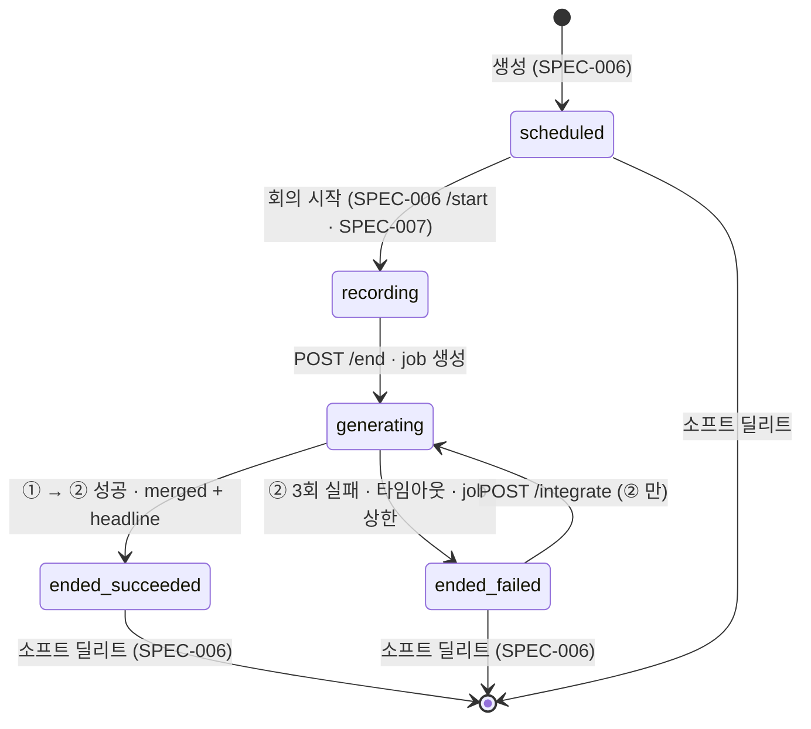
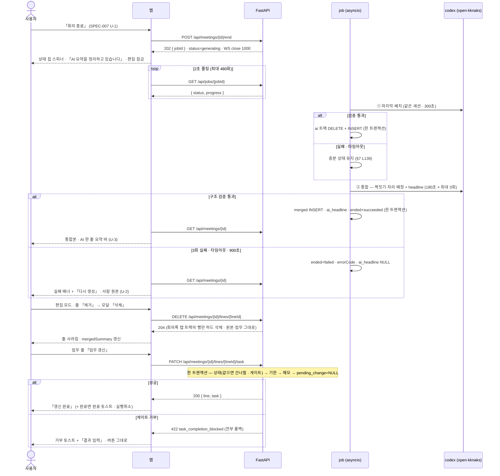

# 회의록 — 종료 · 통합 · 편집 · 업무 연동

회의를 **끝내면** 스피너가 돌고, AI 탭이 마지막으로 정리된 뒤 **회의록 탭에 통합본과 AI 한 줄 요약**이 생긴다. 사람이 쓴 문장은 그대로 남고 AI 줄에서는 근거 타임스탬프만 온다. 그 회의록을 **편집**하고(줄 고치기 · 종류 바꾸기 · 줄 추가 · **줄 지우기 · 안건 이름 고치기**), 액션 줄로 **업무를 만들고**, 업무 줄로 **업무를 고친다** — 버튼을 눌러야 요청이 나간다.

> 기능/정책 묶음 단위의 **외부 계약** 문서다. client / QA / 외부 통합이 이 문서만 읽고 따를 수 있어야 한다.
> SPEC에는 table schema 전문, ORM field, repository/service 구조, PR 계획, 구현 순서, 라우트·컴포넌트 파일 경로 같은 내부 구현을 두지 않는다.
>
> **2026-09-06 재작성 · 같은 날 v0.0.3.** 이전 판은 시안을 계약으로 옮겨 폐기됐다. 이 판은 **기능은 BASE-003 · DEC-003 만**, **시각은 디자인 시스템 + `회의록.dc.html`** 로 축을 나눈다. v0.0.3 은 사용자 결정 2건(**AI 한 줄 요약 바 · 줄 삭제/안건 이름 수정** — DEC-003 §1 표 L44~46)을 반영하고 S008-OQ-1 · OQ-2 를 닫았다. 인접 **SPEC-006 · SPEC-007** 의 계약과 같은 날 갱신된 아키텍처(ERD M-8-a · M-19 · M-20 · BE §6 · §8-2)를 그대로 물려받고, 어긋난 자리는 §7 정합 표에 있다.

## 1. Context

### Meta

- Decision reference: DEC-003 §1(줄 4종 · 일시정지 · **2026-09-06 표 L44 종료 후 편집 범위 · L45 AI 한 줄 요약 바**) · §3(status 4종 · 트랙) · §4(종료 파이프라인 **+ 한 줄 요약** · 통합 규칙 · 재생성 없음 · `pendingChange` 3필드) · §5(편집 — **줄 삭제 · 안건 이름 수정 포함** · 업무 연동은 버튼) · §6(AI 탭은 로그) · §7(열거된 실패만) · §8(두 표면 · 일시 소유) · OQ-2 · OQ-7
- Baseline reference: BASE-003 기능명세 **#8 · #9 · #10**(L70~72) · #7 근거 타임칩의 종료 후 표면(L69) · §Raw L39 · L42~43 · 인바운드 L84(연관 업무 검색은 내 업무)
- 소비 규약: DEC-002 §4(완료 게이트 · 전이 그래프) · DEC-005 §2(회의 상세 드로어는 회의록 소유) · §4·§5(일시 · 메타 수정은 드래그 또는 상세 드로어) · DEC-001 §7(자동 저장 실패 표시)
- Architecture reference: `system/README.md` §③ · `backend/README.md` §5-3 · §6 · §7 · §8-2 · §8-3 · §10 · `database/README.md` L205(`ai_headline`) · L231~232(`source_*_line_id`) · §4 인덱스 · `database/domains/meeting.md` M-3 ~ M-8-a · M-11 · M-14 ~ M-15 · **M-19(한 줄 요약) · M-20(줄 삭제) · M-5-d · M-5-e(안건)** · `database/domains/task.md` T-5 · T-6
- Design reference: `회의록.dc.html` **L1403~2882**(상세 · 근거 펼침 · 편집 중 · 드로어 3종) · `디자인 시스템.dc.html` **[09] MEETING NOTE(L649~755 — 한 줄 요약 바 L727~733)** · [05] · [06] · [07] · [10] · 정정 §A-5 · §A-6 · §A-7 · §A-8
- 물려받는 계약(고치지 않는다): **SPEC-006** `MeetingDetail`(§4 — `headline` 포함) · `PATCH /api/meetings/{id}`(제목 · 유형 · 프로젝트 · 일시) · `PATCH …/agendas/{agendaId} {title}` · `DELETE` · U-5 삭제 확인 모달 · U-7 첨부 탭 / **SPEC-007** `POST /api/meetings/{id}/lines` · `GET …/transcript` · U-4 AI 탭 트리 · U-5 스크립트 패널 · U-6 근거 칩 스크롤 · 안건 `state` 3종 / **SPEC-003** U-2 인라인 편집 · U-3 드로어 구조 · U-8 「해제」 고스트 버튼 · §4 `GET /api/tasks/relations/candidates` / **SPEC-004** §4 완료 게이트 코드 · L478 같은 상태 전이 · U-6 토스트 · U-8 확인 모달 프레임 / **SPEC-002** U-7 자동 저장 실패
- Domain note: 외부에 드러나는 것은 **회의**(제목 · 유형 · 프로젝트 · 일시 · `status` · `integrationState` · **`headline`**)와 **트랙별 안건 > 줄 트리** 세 벌(`human` · `ai` · `merged`), 그리고 **작업(job)** 이다
- Open questions: §7

### Business Requirement

- **회의록 탭 = 통합본이 정본이고 AI 탭 = 로그성 기록이다**(BASE-003 L39 · DEC-003 §4 L104 · §6 L126). 사람은 회의가 끝나고 회의록 탭만 본다. 그래서 통합은 **사람 줄 우선**이고 **AI 가 사람 문장을 다듬거나 바꾸지 않는다**(§4 L105).
- **AI 한 줄 요약은 통합본과 같은 응답으로 받는다**(DEC-003 §1 표 L46 · §4 L104 — 2026-09-06 결정 · ERD M-19). 통합 출력에 필드 하나가 더 붙는 것이고 **별도 호출이 없다.** 저장은 `meeting.ai_headline`, 표시는 디자인 시스템 [09] L727~733 규격으로 상세 상단 한 개.
- **중복 판정은 유사도가 아니라 구조로 한다**(DEC-003 OQ-7 L183 · ERD M-8-a). `sourceHumanLineId` 계승 + 본문 글자 일치 + 한 사람 줄의 이중 계승 금지. 임계값이 없으므로 판정이 흔들리지 않는다.
- **통합본은 다시 만들지 않는다**(§4 L106). 정상 생성분은 편집으로만 고친다. 「다시 생성」은 **실패 상태에서만** 보인다.
- **편집은 줄 단위다 — 인라인 수정 · 종류 전환 · 추가 · 삭제, 그리고 안건 이름 수정**(§5 L117 · §1 표 L44). **줄 순서 변경과 안건 추가 · 삭제는 없다.** 삭제는 **회의록 탭이 그리는 트랙**(통합본 · 실패 상태면 사람 원본)에서만 일어나고 AI 탭 · 트랜스크립트 · 녹음은 남는다 — 근거 칩이 가리킬 원본이 있어야 한다(ERD M-20).
- **줄을 적는 것만으로는 업무가 생기지 않는다**(§5 L119). 액션 줄 「업무 생성」(POST) · 업무 줄 「업무 갱신」(PATCH). 상태 변경은 **내 업무의 전이 판정**(전이 그래프 + 완료 게이트)을 그대로 지난다 — 회의록 쪽에 판정 코드를 두지 않는다(DEC-003 §1 L53 · SPEC-004 §5). **업무가 생성된 줄을 지워도 업무는 남는다**(§1 표 L44 ②).
- **처리하는 실패는 DEC-003 §7 이 열거한 것뿐이다.** 마지막 배치 실패 · 통합본 생성 실패(재시도 2회) · 스피너 타임아웃. 그 밖은 그대로 터뜨린다(BASE-003 L43). **수치는 이 spec 이 정한다**(§7 L144).
- **회의록은 두 표면을 제공한다** — 전체 페이지 + 상세 드로어(DEC-003 §8 L154 · DEC-005 §2 L41). 드로어는 캘린더가 재사용하고, **제목 · 유형 · 프로젝트 · 일시의 수정 경로**이기도 하다(DEC-005 §5 · SPEC-006 U-4 L180).

### Scope

In scope:

- **회의 종료 요청과 「회의록 생성중」 상태** — `POST /end` → job 폴링 → 스피너 + 단계 문구 + 사람 원본 노출 + 편집 잠금(DEC-003 OQ-2)
- **종료 파이프라인의 계약** — ① 마지막 배치(AI 탭 전체 재정리) → ② 통합본 생성 **+ 한 줄 요약**. 통합 규칙의 **검증 가능한 정의**(§4)
- **통합 실패 표면** — `ended` + `failed` 조합에서만 배너 + 「다시 생성」
- **회의록 상세 전체 페이지**(종료 후) — **AI 한 줄 요약 바** · 회의록 탭(통합본) · AI 요약 탭(마지막 배치 결과) · 스크립트 · 첨부 탭 자리 · 메타 인라인 편집
- **회의 상세 드로어(840)** — 캘린더 · 목록이 여는 표면. 읽기 + 메타 편집 + 승격 + 한 줄 요약
- **근거 펼침 · 타임칩 → 스크립트 스크롤 · 하이라이트**의 종료 후 표면(규칙은 SPEC-007 U-6 승계)
- **편집 모드** — 줄 인라인 수정 · 종류 전환(4종) · 추가 드로어 3종 · **줄 삭제(확인 모달)** · **안건 이름 인라인 수정** · 포커스 해제 자동 저장
- **업무 생성 · 업무 갱신** — 줄 버튼 규격, 서버 계약, 완료 게이트 통과, **줄을 지워도 업무는 남는 경계**
- 이 영역 반응형

Out of scope:

- 회의 생성 드로어 · 시작 전 화면 · 목록 · 삭제 확인 모달 · 첨부 탭 규격 · `MeetingDetail` 의 기본 형태 — **SPEC-006**
- 회의 중 화면 · 스트림 · 배치 증분 · 프롬프트 바 · 일시정지 · 「회의 종료」 버튼의 자리와 활성 조건 · 트랜스크립트 표면 · 근거 칩 스크롤 규칙 — **SPEC-007**(이 spec 은 그 버튼이 부르는 요청부터 정한다)
- 캘린더 표시 · 드래그 — SPEC-009(이 spec 의 드로어를 재사용한다는 사실만 참조)
- **줄 순서 이동 · 종료 후 안건 추가 · 안건 삭제 · 안건 상태 변경** — 정책이 넣지 않았다(DEC-003 §1 표 L44 「줄 순서 변경은 여전히 없다」 · ③ 「안건 삭제는 없다」 · ERD M-5-d)
- **문단 요약** — 회의록 목록의 「요약 · AI 생성」 문단(SPEC-006 §7 이 제외)은 이 spec 범위에도 없다. **한 줄 요약 바와 다른 것이다**(§7)
- 근거 구간 수동 선택 · 되돌리기 · AI 안건 제안 — 시안에 있으나 기획에 없다(§7 제외 목록)
- 반복 회의 · 알림 · 시스템 오디오 · 자료함 문서를 AI 컨텍스트로 — v2(DEC-003 §1)

## 2. UX Contract

### Placement

앱 셸 안의 **전체 페이지**(`/meetings/detail?id=` — FE §1)와, 목록 · 캘린더 위에 열리는 **드로어 840**(FE §6). 드로어 ⤢ 는 전체 페이지로 승격된다(한 방향 — F-5).

```text
[전체 페이지 — 시안 L1403]                              [드로어 — SPEC-003 U-3 구조]
+──────+──────────────────────────────────────────+   +──────────────+────────────────+
│ 사이드바│ 홈 › 회의록 › <제목>                     │   │ (뒤 화면 보임) │ 드로어 840     │
│ 200  │ <제목 28/700>            [삭제] [상태 칩] │   │  스크림 0.32   │ 헤더 72        │
│      │ <일시 · 길이 · 유형 · 프로젝트>            │   │              │ 상단 바        │
│      │ ┌ 상단 바 1640×56 ─────────────────────┐ │   │              │ 탭 회의록|AI   │
│      │ ├ 좌 1160 ───────────┬ 우 464 ─────────┤ │   │              │ 안건 > 줄 트리 │
│      │ │ 탭 회의록 | AI 요약 │ 스크립트 | 첨부 n │ │   │              │ (읽기 전용)    │
│      │ │ 안건 > 줄 트리      │ 화자 블록        │ │   │              │ 첨부 n         │
│      │ └────────────────────┴──────────────────┘ │   +──────────────+────────────────+
+──────+──────────────────────────────────────────+
```

- **상단 바(top 150 · 1640×56)는 한 자리다**(디자인 시스템 [09] L733 · DEC-003 §1 표 L46 「회의 중 회색 상태 바와 같은 자리」). 상태에 따라 내용이 바뀐다 — `generating` 은 회색 상태 바(U-1), `ended`+`failed` 는 실패 배너(U-2), `ended`+`succeeded` 는 **AI 한 줄 요약 바**(U-3).
- **드로어 위에 모달을 겹치지 않는다**(FE §6-2). 드로어 안에서 드로어를 열지 않는다 — 그래서 편집 · 업무 연동은 **전체 페이지에서만** 한다(U-4).
- 좌 1160 / 우 464(left 1416) 배치는 디자인 시스템 [09] L723. 좌표는 비율 참고값이다(§C Q-34).

### U-1. 회의록 생성중 — `status='generating'` (DEC-003 OQ-2 확정 · 디자인 미설계 → 디자인 시스템 조립)

시안에 이 화면이 없다(§B-3 「생성중 상태 화면」). 디자인 시스템 [09] L733 「진행 중 화면에서는 회색 상태 바가 같은 자리를 쓴다」와 SPEC-007 U-1 의 회색 바 규격(`#F4F5F7` / `#E1E3E8` / dot `#B3B3B3`)으로 조립한다.

- **상태**
  - *진입*: 회의 중 화면(SPEC-007 U-1)의 「회의 종료」가 `POST /api/meetings/{id}/end` 를 부르고 `202 {jobId}` 가 오면 **그 자리에서** 이 상태로 바뀐다. 페이지를 새로 열어도 `status='generating'` 이면 같다(`activeJobId` 로 폴링을 잇는다)
  - *① 마지막 배치 중*: 상단 바 문구 「**AI 요약을 정리하고 있습니다**」. AI 요약 탭 dot 은 진행색 `#338BF6` + 3px 광륜(디자인 시스템 [09] L712 · L723)
  - *② 통합 중*: 상단 바 문구 「**회의록을 통합하고 있습니다**」 — 이 단계가 **통합본과 한 줄 요약을 함께** 만든다(§4 · ERD M-19). 재시도 중이면 「회의록을 통합하고 있습니다 · **다시 시도 중 (n/2)**」. 회의록 탭 dot `#B3B3B3`(L708)
  - *편집 잠금*: 「편집」 버튼 없음. 줄의 「업무 생성」 · 「업무 갱신」 **비활성**(불투명도 0.5). 헤더 메타(제목 · 유형 · 프로젝트 · 일시) 잠금. **「삭제」도 비활성** — `generating` 은 지울 수 없다(SPEC-006 U-5 · §4 상태별 허용 표)
  - *폴링 실패*(5xx · 네트워크): 스피너는 그대로 두고 상단 바 우측에 「**상태를 확인하지 못했습니다 · 다시 확인**」. 실패로 꾸미지 않는다(BASE-003 L43)
  - *상한 초과*: 폴링 480회(≈16분)가 지나도 종결 상태가 오지 않으면 폴링을 멈추고 위와 같은 「다시 확인」만 남긴다. **서버가 job 을 `failed` 로 마감하므로**(§4 수치 표) 「다시 확인」이 실패 상태를 가져온다
- **문구 · 시각**
  - 상태 칩(시안 L1441~1443 규격): 배경 `#F1F2F5` · 테두리 `#E1E3E8` · 13/600 `#5F6470`. dot 자리에 **12px 스피너 `#7181F8`** + 「**회의록 생성중**」
  - 상단 바: 1640×56 r12, 회색 바(SPEC-007 U-1 규격). 좌측 16px 스피너 `#7181F8` + 단계 문구 14/600 `#5F6470`. 우측 12/`#9EA2AE` 「경과 mm:ss」(종료 요청 응답 시각부터 화면 계산)
  - 회의록 탭: **사람 원본**(`agendas.human`)을 읽기 전용으로 그대로 보인다(DEC-003 OQ-2 「사람 원본 노출」). 탭 아래 캡션 12/`#9EA2AE` 「통합이 끝나면 이 탭이 통합본으로 바뀝니다」
  - AI 요약 탭: **회의 중 증분 상태**를 그대로 보이고 안내 바 우측은 SPEC-007 U-4 형식을 이어 「배치 n회 반영 · **종결 정리 중**」
- **CTA**: 「다시 확인」(폴링 실패 시에만) · 사이드바 이동은 막지 않는다 — 나갔다 돌아와도 폴링이 다시 붙는다
- **기대 결과**: job 이 `succeeded` 면 회의 상세를 다시 읽어(FE §3-3) **U-3** 로 바뀐다. `failed` 면 **U-2** 로 바뀐다. **무한 대기가 없다**(DEC-003 §7 L141)

### U-2. 통합 정리 실패 배너 · 「다시 생성」 — `status='ended'` + `integrationState='failed'` (DEC-003 OQ-2 확정)

「다시 생성」은 **이 조합에서만** 보인다(DEC-003 §4 L106 · ERD M-4). 시안에 없다 — 디자인 시스템 [10] 「#7181F8 은 액션에만」과 SPEC-009 U-8 의 드롭 불가 색 쌍으로 조립한다.

- **상태**
  - *실패*: 상단 바 자리에 **배너** — 배경 `#FCEEEC` · 테두리 1px `#E2685B` · 좌측 14/600 `#E2685B` 「**통합 정리 실패** · 회의록 탭에 회의 중 작성한 원본을 보여 드립니다」 · 우측 버튼 「**다시 생성**」(30px r8 `#7181F8` 흰 글씨 12/600). 상태 칩은 「종료된 회의」(dot `#B3B3B3` — 시안 L1442). 회의록 탭 dot `#B3B3B3`. **한 줄 요약이 없다** — `headline` 은 통합과 같은 응답에서만 오므로 실패면 `null` 이고 배너가 그 자리를 쓴다(§4 · ERD M-19 ②)
  - *회의록 탭*: **사람 원본**(`agendas.human`)이 보인다. **편집 전부(인라인 수정 · 종류 전환 · 추가 · 삭제 · 안건 이름) · 업무 생성 · 업무 갱신이 된다** — 이 상태의 편집은 `human` 트랙에 쓰이고, 「다시 생성」이 그 편집본을 우선으로 통합한다(§4 통합 규칙 · ERD M-20 「대상 트랙은 편집 모드와 같다」)
  - *AI 요약 탭*: 마지막 배치가 성공했으면 「**종결** · HH:MM」, 실패했으면 「배치 n회 반영 · **종결 정리 실패**」(DEC-003 §7 L139 — 회의 중 증분 상태 그대로)
  - *다시 생성 중*: `POST /api/meetings/{id}/integrate` 가 `202 {jobId}` 를 주면 **U-1 의 ② 단계**로 돌아간다(① 마지막 배치는 다시 돌지 않는다 — §4). 편집 잠금이 다시 걸린다
- **문구**: 배너 문구는 위와 같다. 「다시 생성」 툴팁 「사람 원본과 AI 요약을 다시 통합합니다 · 원본은 바뀌지 않습니다」
- **CTA**: 「다시 생성」 · 「편집」(U-7) · 줄 버튼(U-6) · 「삭제」(SPEC-006 U-5 — `ended` 는 지울 수 있다)
- **기대 결과**: 성공하면 배너가 사라지고 회의록 탭이 통합본으로, 상단 바가 한 줄 요약으로 바뀐다(U-3). 다시 실패하면 같은 배너다. **사람 원본 · AI 탭 · 트랜스크립트 · 녹음이 모두 남아 회의록이 비지 않는다**(DEC-003 §7 L140)

### U-3. 회의록 상세 — 전체 페이지, `status='ended'` + `integrationState='succeeded'` (시안 L1403~1607)

- **상태**
  - *로딩*: 헤더 · 상단 바 · 두 패널 자리에 스켈레톤 `#F1F2F5`, 애니메이션 없음(SPEC-003 U-3 규격). 빈 화면을 먼저 그리지 않는다
  - *정상*: 아래 구성
  - *없는 항목*: 「없는 회의록입니다」 + 「목록으로」. 리다이렉트하지 않는다(FE §1-2)
- **문구 · 구성**
  - breadcrumb 「홈 › 회의록 › <제목>」(L1427~1431)
  - **제목** 28/700(L1436) — **인라인 편집**(SPEC-003 U-2 규격, 포커스 해제 시 `PATCH /api/meetings/{id} {title}`). 그 아래 13/`#757575` 메타 한 줄(L1437): 「**08월 27일 (목) 09:30 – 10:30 · 60분 · <유형명> · <프로젝트명>**」 — 일시 · 유형 · 프로젝트는 각각 **인라인 컨트롤**(일시는 날짜 + 시작 – 종료 시각, 유형 · 프로젝트는 팝오버 셀렉터 — SPEC-006 §4 `PATCH` 가 유일한 쓰기 표면 · U-4 L180). 길이는 `durationMinutes`(파생), 유형명은 **설정의 동적 유형 이름**(시안의 「미팅 · 회의」 고정명은 §A-7 로 폐기), 프로젝트가 없으면 「프로젝트 없음」 회색. **드로어(U-4)와 같은 컨트롤이다** — 두 표면이 다른 규격을 갖지 않는다(SPEC-003 U-4)
  - 헤더 우측(L1440~1443): 「**삭제**」(34px r8 테두리 `#D9D9D9` 13/`#757575` — 시안대로 텍스트 버튼. SPEC-006 U-5 모달을 연다) + 상태 칩 「**종료된 회의**」(dot 8px `#B3B3B3`)
  - **상단 바 = AI 한 줄 요약**(DEC-003 §1 표 L46 · 디자인 시스템 [09] L727~733 · 시안 L1448~1452): 1640×56 r12 · 배경 `#EEF1FE` · 테두리 `#C9D1FB`. 좌측 배지 「**AI 한 줄 요약**」(22px 흰 배경 · 테두리 `#C9D1FB` · 11/700 `#4A55B8`) + `headline` **한 문장** 14/600 `#3D46A6`(**넘치면 말줄임** — [09] L730) + 우측 「**안건 n · 결정 n · 액션 n**」 12/`#5F6470`. **한 개만.** 값의 출처는 §4(`headline` = `meeting.ai_headline` · 카운트 = `mergedSummary` 파생). 시안 L1453 의 「MM.DD HH:mm 생성」은 **그리지 않는다**(§7 제외 — 정책 · 디자인 시스템 규격에 없다). **사람이 편집하지 않는다**(ERD M-19 ④)
  - **좌 패널 1160**(L1456~1547): 탭 「**회의록**」(dot `#7181F8` — 완료, L1458) | 「**AI 요약**」(dot `#B3B3B3`, L1459) + 우측 「**편집**」(30px r8 테두리 `#D9D9D9` 12/600, L1461)
    - **회의록 탭 = `agendas.merged`**. 안건 블록: 「안건 n」 11/700 `#9EA2AE` + 제목 15/700 + **상태 배지** — `done` 「**완료**」(`#F1F2F5`/`#757575`, L1472) · `next` 「**다음 논의로**」(`#F1F2F5`/`#9EA2AE`, 제목 `#757575` — **DEC-003 §1 표 L45 의 종료 후 문구.** 회의 중은 「대기」(SPEC-007 U-2), 시안 L1525 「다음으로」는 문구 정정 — §7 제외 목록) · `null`(AI 신설 안건) 배지 없음 + 캡션 「AI 안건」(SPEC-007 U-4 와 같은 표기). `active` 는 종료 시 `done` 이 되므로 여기 없다(§4 `/end` · ERD M-5-c). 안건 상태는 **회의 중 안건 전환**(SPEC-007 U-2)이 남긴 값이고 여기서는 표시만이다
    - 줄 4종(디자인 시스템 [09] L658~680): 라벨 34px 11/700 — 논의 `#9EA2AE` · 결정 `#1663B5`(본문 15/600, 배경색 없음) · 업무 `#5F6470` · 액션 `#4B52A8`. 본문 15px. 줄 padding 8/10 r8, 안건 기준선 좌측 2px `#EBEBEB`. hover 배경 `#FAFBFC`
    - 업무 줄(L1508~1510): 본문 + **연결 업무의 유형 배지**(22px r4 `#F4F7FF`/`#3F5F94`) + **U-6 버튼**. 액션 줄(L1484~1486): 본문 + **U-6 버튼**
    - 줄 우측 hover 시 **펼침 화살표**(U-5). **줄 본문 클릭은 편집 모드에서만 의미가 있다** — 보기 모드에서는 아무 일도 없다(디자인 시스템 [09] L700)
    - **AI 요약 탭 = `agendas.ai`** — **SPEC-007 U-4 규격 그대로**(트리 · 「AI 안건」 캡션 · 펼침 · 미러 안건 배지). 안내 바 우측만 종료 후 값으로 바뀐다: 「**종결** · HH:MM」(마지막 배치 성공 시각) 또는 「배치 n회 반영 · **종결 정리 실패**」. 탭 푸터(SPEC-007 L159 「회의 종료 시 … 반영됩니다」)는 종료 후 **없다**. **버튼이 없다** — 로그성 기록이다(DEC-003 §6 L126)
  - **우 패널 464**(L1551~1602): 탭 「**실시간 스크립트**」(dot `#B3B3B3`, L1554) | 「**첨부 파일 n**」(dot `#D9D9D9` 항상, n=0 이면 숫자 생략 — [09] L720)
    - 스크립트 블록 — **SPEC-007 U-5 규격 그대로**(화자 dot · 「화자 n」 · 벽시계 `HH:MM` · 본문 · 홀짝 화자 색). 종료 후 차이는 셋 — 잠정 발화 없음 · 자동 따라가기 없음 · 푸터가 「**전체 스크립트 n분 · 화자 n명**」(시안 L1602 — `n분` = 마지막 `endMs` 를 분으로 올림, `화자 n` = `speakerCount`). 데이터는 `GET /api/meetings/{id}/transcript`(SPEC-007 §4)
    - 첨부 탭 — **SPEC-006 U-7 규격 그대로**(목록 · 추가 · 파일 드로어). 종료 후에도 추가 · 제거가 된다(SPEC-006 §4 상태별 허용 표 `ended` ✔)
- **CTA**: 「편집」 → U-7 · 「삭제」 → SPEC-006 U-5 · 줄 버튼 → U-6 · 화살표 · 칩 → U-5 · 메타 인라인 컨트롤 → `PATCH /api/meetings/{id}`
- **기대 결과**: 종료된 회의록은 **회의록 탭 = 통합본, AI 탭 = 마지막 배치 결과, 상단 = 한 줄 요약**이다(DEC-003 §5 L116 · §1 표 L46). 통합본 줄은 AI 줄의 타임스탬프를 물려받아 근거 칩을 갖는다(§4 L104). **사람 원본(`human`)은 남아 있지만 화면에 보이지 않는다.** 일시를 바꾸면 겹침 검사(`schedule_overlap`)를 지나고 캘린더가 갱신된다(SPEC-006 §4)

### U-4. 회의 상세 드로어 (840) — 캘린더 · 목록이 여는 표면 (DEC-005 §2 L41 · DEC-003 §8 L154)

**새 시안이 없다.** 업무 상세 드로어(SPEC-003 U-3)의 구조에 U-3 의 내용을 담는다. 드로어는 부모(목록 · 캘린더)를 모르고, 부모가 `openDrawer` 로 열어 결과를 콜백으로 받는다(FE §6-2). **SPEC-009 U-7 이 여는 드로어가 이것이고, SPEC-006 U-4 L180 이 「제목 · 유형 · 프로젝트 · 일시의 수정 경로」로 가리키는 표면도 이것이다.**

- **상태**
  - *로딩 · 없는 항목*: SPEC-003 U-3 와 같다(스켈레톤 `#F1F2F5` · 「없는 회의록입니다」 + 「목록으로」)
  - *`scheduled`*: 본문에 안건 목록(`agendas.human`, 줄 없음) + 첨부 n. 캡션 「회의 시작은 전체 페이지에서 합니다」. 시작 전 화면 자체는 SPEC-006 U-4
  - *`recording`*: 캡션 「진행 중인 회의입니다 · 전체 페이지에서 보기」 + 사람 트랙 스냅숏(읽기 전용 — WS 를 붙이지 않는다, FE §8 「`useMeetingStream` 하나가 소유」). 메타 잠금
  - *`generating`*: U-1 의 상태 칩 + 상단 바(폴링은 드로어에서도 돈다). 메타 · 삭제 잠금
  - *`ended`+`failed`*: U-2 의 배너 + 「다시 생성」(요청 하나라 드로어에서도 된다)
  - *`ended`+`succeeded`*: **AI 한 줄 요약 바** + 탭 회의록 | AI 요약 + 트리
- **문구 · 구성**
  - 헤더 72: 유형 배지 + 프로젝트 칩(팝오버 셀렉터 — 인라인 변경) / 제목 26·700(인라인 편집) / **일시**(날짜 + 시작 – 종료 시각, 포커스 해제 시 `PATCH /api/meetings/{id} {startAt,endAt}` — SPEC-006 §4 「둘을 함께」) · 상태 칩 / `⋯`(「삭제」 — SPEC-003 U-3 헤더와 같은 자리, SPEC-006 U-5 L205) · ⤢ · ×
  - **한 줄 요약 바 — 840 안의 배치**(디자인 시스템 [09] 규격을 폭에 맞춰 두 줄로): 높이 **72**, 같은 색(`#EEF1FE` / `#C9D1FB` r12). 첫 줄 = 배지 「AI 한 줄 요약」 + 문장 14/600 `#3D46A6` **말줄임**, 둘째 줄 = 「안건 n · 결정 n · 액션 n」 12/`#5F6470`. 페이지(56 · 한 줄)와 **같은 값 · 같은 색**이고 다른 것은 줄 나눔뿐이다 — 840 에서 셋을 한 줄에 두면 문장이 스무 자도 남지 않는다. 문장 전체는 **툴팁**으로 본다
  - 트리는 U-3 와 같은 규격이다. **줄 버튼(업무 생성 · 업무 갱신)과 「편집」은 없다** — 드로어 안에서 드로어(U-8 ~ U-10)를 열 수 없고, 줄 삭제 모달도 드로어 위에 겹칠 수 없기 때문이다(FE §6-2). 탭 아래 캡션 12/`#9EA2AE` 「**편집과 업무 연동은 전체 페이지에서 합니다**」
  - 근거 펼침은 되지만 **칩은 표시만**이다 — 스크립트 패널이 없다. 펼친 영역 캡션 「스크립트는 전체 페이지에서 볼 수 있습니다」
  - 첨부 n 행 — SPEC-006 U-7 목록 행 규격, 읽기 전용(추가 · 제거는 전체 페이지)
- **CTA**: ⤢(`expandTo` `/meetings/detail?id=` — 드로어가 닫히고 페이지로 간다) · ×(`Esc` · 스크림 클릭 병행) · `⋯` 「삭제」(드로어를 **먼저 닫고** SPEC-006 U-5 모달을 연다 — FE §6-2) · 「다시 생성」
- **기대 결과**: 목록 · 캘린더 어디서 열어도 **같은 드로어**다(F-4). 일시를 바꾸면 캘린더가 갱신된다 — 같은 원본(`meeting.start_at`/`end_at`)을 고치므로(DEC-005 §3 · SPEC-009 U-7 L169). **드로어와 페이지가 다른 규격을 갖지 않는다** — 드로어에서 빠진 것은 규격이 다른 게 아니라 **없는 것**이고, 그 목록은 「편집 · 줄 버튼 · 스크립트 패널 · 첨부 쓰기」 넷이 전부다

### U-5. 근거 펼침 · 타임칩 → 스크립트 이동 — 종료 후 표면 (시안 L1608~1823 · BASE-003 #7 L69 · SPEC-007 U-4 · U-6 승계)

**규칙은 SPEC-007 U-6 그대로다**(SPEC-007 §7-D D-6) — 칩 시각은 `recordingStartedAt + fromMs/toMs` 의 벽시계 `HH:MM`, 클릭하면 우 패널이 스크립트 탭으로 바뀌고 `atMs ≥ fromMs` 인 첫 블록으로 스크롤해 `[fromMs, toMs]` 와 겹치는 블록 전부를 하이라이트(배경 `#F4F5FF` + 테두리 `#C9D1FB` + 시각 `#4A55B8` 600 + 「근거 구간」 — 시안 L1782~1789), 다른 칩 또는 `Esc` 로 해제, 대상이 없으면 「해당 구간의 발화가 없습니다」 2초. 여기서는 **종료 후에만 다른 것**을 적는다.

- **상태**
  - *회의록 탭(통합본)의 접힘*: 줄 우측에 hover 시에만 **24×24 r6 `#F1F2F5` 화살표**(디자인 시스템 [09] L689 · L700). **`detail` 과 `evidence` 가 둘 다 없는 줄에는 화살표가 없다** — 통합본에는 사람이 쓴 근거 없는 줄이 많아 「근거 없음」 캡션을 매 줄에 두면 소음이 된다. AI 요약 탭은 SPEC-007 U-4 그대로(모든 AI 줄에 화살표 · 없으면 「근거 없음」)
  - *펼침*(L1684~1695): 줄 배경 `#FAFBFC`. 아래에 상세 설명 14/`#5F6470`(`detail` — 없으면 생략) → 「근거」 12/`#9EA2AE` + 칩들 → 캡션 「칩을 누르면 해당 구간 스크립트로 이동합니다」(칩이 있을 때만). 여러 줄을 동시에 펼쳐 둘 수 있다
  - *칩*: 24px r6 배경 `#EEF1FE` · 테두리 `#C9D1FB` · 12/600 `#4A55B8` 「**HH:MM – HH:MM**」(L1693~1694). hover `#E4E9FD`
  - *드로어(U-4)에서*: 칩은 표시만(U-4)
  - *줄이 삭제된 뒤*: 통합본 줄을 지워도 **AI 탭의 원본 줄과 그 칩은 그대로**다 — 삭제는 회의록 탭의 행 하나만 없앤다(§4 · ERD M-20)
- **문구**: 위와 같다
- **CTA**: 화살표(펼침/접힘) · 칩(이동) · `Esc`(해제). **줄 전체 클릭으로 펼치지 않는다** — 줄 클릭은 편집 모드의 인라인 편집 자리다([09] L700)
- **기대 결과**: 통합본 줄의 근거는 **AI 줄에서 물려받은 타임스탬프**다(DEC-003 §4 L104). 사람이 만든 줄은 AI 줄과 짝지어졌을 때만 근거를 갖는다. 근거의 원천은 트랜스크립트다(§6 L125)

### U-6. 줄 버튼 — 액션 줄 「업무 생성」 · 업무 줄 「업무 갱신」 (디자인 시스템 [09] L668~677 · 시안 L1484~1486 · L1508~1510 · DEC-003 §5 L119)

**줄을 적는 것만으로는 업무가 생기지 않는다.** 이 버튼을 눌러야 요청이 나간다. 보기 모드 · 편집 모드 모두 같은 자리에 같은 버튼이다. **회의록 탭에만** 있다(AI 탭 · 회의 중 화면에는 없다 — SPEC-007 U-4).

- **상태**
  - *액션 줄*: 우측에 「**업무 생성**」(30px r8 테두리 `#D9D9D9` 12/600 `#1E1E1E`, L1486). 누르면 **U-10 드로어**가 그 줄의 본문을 업무 제목으로 채워 열린다
  - *업무 줄 · 반영할 변경이 있음*(`pendingChange` 있음): 유형 배지 + 「**업무 갱신**」(30px r8 배경 `#F1F2F5` · 테두리 `#E1E3E8` 12/600 `#757575`, [09] L672). 누르면 **즉시 요청**(확인 없음). 응답까지 버튼 비활성 + 진행 표시. 툴팁에 반영할 내용 — 「기한 → 09.02 · 상태 → 완료 · 메모 1건」 중 있는 것
  - *업무 줄 · 반영할 변경이 없음*(`pendingChange` 없음): 같은 자리 「**갱신 완료**」(시안 L1510 표기) 비활성. 방금 갱신했거나 처음부터 변경이 없는 줄(연관 업무 드로어에서 변경 없이 연결한 줄 · 액션에서 만든 줄)이 여기 해당한다
  - *연결 업무가 삭제됨*(`task.isDeleted`): 배지 · 제목 그대로 + 「삭제된 업무」 12/`#9EA2AE`, 버튼 비활성(DEC-001 §4 「참조 표시」의 결)
  - *잠금*: `generating` 이면 전부 비활성(U-1). 드로어(U-4)에는 이 버튼이 없다
- **문구**: 위와 같다. 갱신 성공 시 토스트 없음 — 버튼이 「갱신 완료」로 바뀌는 것이 결과다. **완료 전이가 포함됐고 성공했으면** SPEC-004 U-6 의 완료 토스트 「완료 처리했습니다 · 실행취소」(4초)가 그대로 뜬다 — 같은 전이이기 때문이다
- **CTA**: 위 두 버튼. **실행취소**는 SPEC-004 `POST /api/tasks/{id}/status/undo` 그대로
- **기대 결과**
  - 업무 생성 성공: 그 줄이 **업무 줄로 바뀐다**(라벨 「업무」 · 배지 · 「갱신 완료」). `taskId` 가 채워진다 — ERD M-14 「버튼을 눌러 업무가 실제로 생겼을 때만」
  - 업무 갱신 성공: `pendingChange` 가 비워지고 「갱신 완료」. 업무 쪽에는 **기한 변경 · 상태 전이 로그 · 메모 새 항목**이 남는다(DEC-003 §4 L102)
  - 갱신 거부(완료 게이트 · 전이 그래프): **아무것도 바뀌지 않는다.** `pendingChange` 가 남고 버튼은 「업무 갱신」 그대로. 토스트는 SPEC-004 규격(§4 Case Matrix)
  - **같은 상태로의 전이 요청을 내지 않는다**(SPEC-004 L478): `pendingChange.status` 가 업무의 현재 상태와 같으면 서버가 전이를 건너뛴다(§4). 화면도 그 항목을 툴팁에서 뺀다
  - **줄을 지워도 업무는 남는다**(U-7 · DEC-003 §1 표 L44 ② · ERD M-20). 업무 쪽에는 회의록을 가리키는 것이 없어 지울 것도 없다 — 로그 「업무 생성」 · 메모 · 기한이 그대로다

### U-7. 편집 모드 (시안 L1824~2041 · DEC-003 §5 L117 · §1 표 L44 · §7 L142)

**포커스 해제 자동 저장**이다. 저장 · 취소 버튼이 없다([10] L792). `status='ended'` 에서만 들어갈 수 있다 — 성공분은 `merged` 트랙을, 실패 상태는 `human` 트랙을 편집한다(ERD M-20 · M-5-e). **회의 중 사람 줄은 읽기 전용**이고(SPEC-007 U-2) 편집은 여기서만 일어난다.

- **상태**
  - *진입*: 「편집」 → 헤더 우측이 「**변경은 자동 저장됩니다**」(12/`#9EA2AE`, L1882) + 「**편집 완료**」(30px r8 `#7181F8` 흰 글씨 12/600, L1884)로 바뀐다. ~~되돌리기~~(L1883)는 **없다**(§7 제외 — 삭제가 생겨도 이력을 만들지 않는다)
  - *안건 제목*(L1894 · L1924 · L1959): **인라인 입력 상자**(15/700, 테두리 `#EBEBEB` r8 padding 5/10 흰 배경 — 시안 규격). 포커스 시 테두리 `#7181F8`. **포커스 해제 시 저장**(`PATCH …/agendas/{agendaId} {title}` — SPEC-006 표면 · ERD M-5-e ②). 「안건 n」 라벨 · 상태 배지는 그대로. **안건을 추가 · 삭제하는 버튼은 없다**(DEC-003 §1 표 L44 ③ · ERD M-5-d). AI 신설 안건(「AI 안건」 캡션)도 통합본에 들어온 뒤에는 `merged` 안건이라 이름을 고칠 수 있다 — AI 트랙의 원본 안건 제목은 바뀌지 않는다
  - *줄*(L1898~1909): 라벨 자리가 **종류 셀렉터**(64×26 r6 테두리 `#E1E3E8`, 현재 종류 색 11/700)가 되고, 본문이 **입력 상자**(15px, 테두리 `#EBEBEB` r8 padding 6/12)가 된다. 업무 줄은 배지 + 버튼(U-6)이 그대로 붙는다. **줄 우측 끝에 「제거」** — hover 로 드러나는 고스트 텍스트 버튼 12/`#9EA2AE`(hover `#E2685B`), **SPEC-003 U-8 「해제」 · U-7 「제거」와 같은 규격**. 시안에 없어 디자인 시스템 [06] 고스트 버튼으로 조립했다. 편집 대상 트랙의 줄 전부에 붙는다(`merged` · 실패 상태면 `human`)
  - *편집 중 필드*: 포커스 시 테두리 `#7181F8`. 저장 중이면 우측에 작은 진행 표시(SPEC-003 U-2)
  - *저장 실패*: **SPEC-002 U-7 규격** — 토스트 「저장하지 못했습니다 · 줄 내용」/「… · 안건 이름」 + 필드 테두리 `#E2685B` + 「저장되지 않았습니다 · 다시 저장」. 자동 재시도 없음
  - *줄 삭제 확인*: 「제거」 → **확인 모달 600**(SPEC-004 U-8 프레임 — 제목 → 요약 → 경고 슬롯 → 취소/삭제). 자동 저장이 아니라 **확인을 거친다** — 지운 줄은 되돌릴 이력이 없고([10] L800 「되돌리기 어려운 결정 하나는 모달」 · ERD M-20 「하드 딜리트 · 복원 창구 없음」), 근거 칩(AI 계승분)은 사용자가 다시 만들 수 없다. 편집 모드는 전체 페이지라 드로어 위에 겹치지 않는다(FE §6-2)
    - 제목 「**이 줄을 삭제할까요?**」 · 요약 「회의록에서 사라지고 되돌릴 수 없습니다. AI 요약과 스크립트는 그대로 남습니다.」
    - 경고 슬롯 — 업무 줄이면 「**연결된 업무는 삭제되지 않습니다.** 반영하지 않은 변경(기한 · 상태 · 메모)은 함께 사라집니다.」, 그 밖은 슬롯을 비운다
    - CTA 「취소」 · 「**삭제**」(`#E2685B`)
  - *안건별 추가 행*(L1913~1916): 각 안건의 줄 목록 아래 칩 4 — 「+ 논의」 「+ 결정」 「+ 연관 업무」 「+ 액션 아이템」(28px r6 테두리 `#E1E3E8` 12/`#5F6470`). 논의 · 결정은 **U-8**, 연관 업무는 **U-9**, 액션 아이템은 **U-10** 을 그 안건으로 연다. **하단 프롬프트 바는 없다**([09] L752)
- **문구**
  - 종류 셀렉터 팝오버(디자인 시스템 [07] L500~516): 항목 4 — 논의 / 결정 / 업무 / 액션. 현재 값 배경 `#F4F5FF` + `#4B52A8` + 체크. **「업무」는 이 줄에 `taskId` 가 있을 때만 활성**이고, 비활성이면 캡션 「연관 업무는 「+ 연관 업무」로 추가합니다」
  - 빈 본문 · 빈 안건 이름으로 포커스를 벗어나면 저장하지 않고 원래 값으로 되돌린다 + 캡션 「내용을 비울 수 없습니다」 / 「안건 이름을 비울 수 없습니다」
- **CTA**: 「편집 완료」(보기 모드로 복귀 — **요청 없음**, 이미 다 저장됐다) · 종류 셀렉터(고르면 즉시 저장 — [07] L516) · 「제거」 · 추가 칩 4 · `Esc`(그 필드만 편집 전 값으로, 저장 안 함)
- **기대 결과**
  - 본문을 고치고 포커스를 벗어나면 저장된다. 종류를 바꾸면 라벨 색이 바뀌고 저장된다. 안건 이름을 고치면 보기 모드 · 드로어 · 목록 미리보기(SPEC-006 U-8)에 같은 이름이 보인다
  - **줄을 지우면** 그 안건에서 사라지고 뒤 줄이 당겨지며 상단 바의 「안건 n · 결정 n · 액션 n」이 따라 바뀐다. **AI 요약 탭의 원본 줄 · 트랜스크립트 · 녹음은 그대로**다(DEC-003 §1 표 L44 ① · ERD M-20). 실패 상태에서 원본 줄을 지워도 같다 — AI 탭은 남는다. **업무 줄을 지워도 업무는 남는다**(② · U-6)
  - **업무 줄을 다른 종류로 바꾸면 업무 연결이 풀린다** — `taskId` · `pendingChange` 가 비워진다. 업무 자체는 그대로다. 다시 걸려면 「+ 연관 업무」로 새 줄을 만든다
  - **AI 요약 탭은 편집 모드가 없다**(DEC-003 §6 · ERD M-6). 편집 중에도 AI 탭은 보기 그대로다
  - 편집 이력이 없다 — 되돌릴 것은 편집 전 값이 아니라 **다음 편집**이다. **줄 순서는 바꿀 수 없다**(§1 표 L44)

### U-8. 추가 드로어 — 논의 · 결정 (시안 L2042~2305 · 디자인 시스템 [09] L740~741)

드로어 840 · 스크림 `rgba(30,30,30,0.32)`(FE §6). 헤더 72 · 푸터 76.

- **상태**
  - *열림*: 헤더 「**논의 추가**」 / 「**결정 추가**」(세그먼트 값에 따라) 18/700 + 부제 「<제목> · <일시 날짜>」 12/`#9EA2AE`(L2258~2259) + ×. 열자마자 **내용 입력에 포커스**
  - *제출 가능*: 내용 1자 이상. 아니면 「추가」 비활성
  - *제출 중*: 푸터 비활성 + 진행 표시. *실패*: 드로어 유지 + 인라인 안내(§4 Case Matrix)
- **문구 · 필드 순서**
  1. **종류** 세그먼트 「논의」 | 「결정」(36px r8 — 선택 `#F1F2FE` + 테두리 `#7181F8` + `#4B52A8`, L2266~2267). 누른 칩의 종류가 기본값
  2. **안건** 셀렉터(44px, L2271~2272) — 기본값은 칩을 누른 안건. 같은 트랙의 다른 안건으로 바꿀 수 있다
  3. **내용**(44px, 포커스 테두리 `#7181F8`, L2276~2277) — 필수
  4. **상세 설명** textarea(L2281~2282) — 선택. 캡션 ~~「비워두면 회의 종료 후 AI가 채웁니다」~~(L2283)는 **쓰지 않는다** — 종료 후 배치가 없다(§7 제외)
  - ~~근거 구간 · 「구간 추가」~~(L2288~2294)는 **없다** — 근거는 AI 타임스탬프 계승뿐이다(§7 제외)
- **CTA**: 「취소」 · 「**추가**」(44px `#7181F8`, L2300~2301). `Esc` · × · 스크림 클릭으로 닫힌다
- **기대 결과**: 그 안건의 **맨 아래**에 줄이 붙고 드로어가 닫힌다. 새 줄은 근거가 없다(화살표는 상세 설명이 있을 때만)

### U-9. 추가 드로어 — 연관 업무 (시안 L2306~2599 · 디자인 시스템 [09] L744~745 · DEC-003 §4 L102)

「내 업무에서 고른 업무에 이 회의의 변경을 반영합니다」(L2523). 업무 검색은 **내 업무가 제공**한다(BASE-003 L84 → SPEC-003 §4 `GET /api/tasks/relations/candidates`).

- **상태**
  - *열림*: 헤더 「**연관 업무 연결**」 + 부제 위 문구 + ×(L2522~2523)
  - *업무 선택*(L2536~2564): 라벨 「업무 선택」 + 캡션 「내 업무에서 불러옵니다」. **프로젝트 셀렉터**(42px 테두리 `#7181F8` 열림, L2539~2542) 「<프로젝트명> · n건」 — 기본값은 **회의의 프로젝트**, 회의가 무소속이면 「전체」. 그 아래 **검색 입력**(디자인 시스템 [06] L356 SEARCH h34 · 플레이스홀더 「업무 검색」 — 시안에 없으나 기획 L84 「연관 업무 검색」이 있어 조립). 목록 행 58px(L2545~2564): 라디오 + 제목 14/600 + 유형 배지 + 기한 `MM.DD`(64px `#757575`, 없으면 「미정」) + 상태(56px `#9EA2AE`, SPEC-004 표시 매핑 「시작전/진행중/완료/취소」 — 시안 「대기」는 매핑에 없어 쓰지 않는다). 선택 행 테두리 `#7181F8` + 배경 `#F8FAFF`. **단일 선택**
  - *결과 없음*: 「검색 결과가 없습니다」 + 「다른 검색어나 프로젝트를 골라 보세요」. `total > 20` 이면 목록 아래 「n건 중 20건 · 검색어로 좁혀 주세요」
  - *이 회의로 반영할 변경*(L2571~2588): 라벨 + 캡션 「고른 항목만 갱신됩니다」
    - **기한** 날짜 셀렉터(44px) — 기본값 없음(= 변경 없음). 캡션 「현재 MM.DD」 / 「현재 기한 없음」
    - **상태** 셀렉터 — 기본값 「**<현재 상태> 유지**」(L2582 「진행 중 유지」의 결). 항목은 **SPEC-004 전이 그래프에서 현재 상태에서 갈 수 있는 것**만. **「취소」는 없다** — 취소는 사유가 필수인데(SPEC-004 §4) `pendingChange` 가 담지 못한다(DEC-003 §4 L102 세 가지뿐). 캡션 「현재 <상태>」
    - **진행 메모로 남길 내용** textarea(L2587~2588) — 선택. 업무 **메모에 새 항목**으로 간다(§4 L102)
  - *제출 가능*: 업무가 하나 선택됨
- **문구**: 위와 같다
- **CTA**: 「취소」 · 「**연결하고 갱신**」(44px `#7181F8`, L2595). 변경을 하나도 안 골랐으면 라벨은 그대로이되 **갱신 요청은 나가지 않는다**(아래)
- **기대 결과**
  - ① 그 안건 맨 아래에 **업무 줄**이 생긴다(본문 = 업무 제목 스냅숏, `taskId`, 고른 변경이 `pendingChange`). 드로어가 닫힌다
  - ② 고른 변경이 있으면 **곧바로 U-6 「업무 갱신」과 같은 요청**이 나간다. 성공하면 「갱신 완료」, 거부되면(게이트 · 전이) 줄은 「업무 갱신」 활성 상태로 남고 토스트가 뜬다 — ①과 ②는 **다른 요청**이라 ②가 실패해도 줄은 있다
  - 같은 업무를 여러 줄에 걸 수 있다(막는 규칙이 없다). **같은 상태 유지는 요청에 실리지 않는다**(SPEC-004 L478)

### U-10. 추가 드로어 — 액션 아이템 = 업무 생성 (시안 L2600~2882 · 디자인 시스템 [09] L748~749 · BASE-003 #10)

두 진입점이 같은 드로어를 연다 — 액션 줄의 「업무 생성」(U-6) · 안건의 「+ 액션 아이템」(U-7). 업무 생성 규칙은 **SPEC-003 U-1 · §4 그대로**다.

- **상태**
  - *열림*: 헤더 「**업무 생성**」 + 부제 「액션 아이템을 내 업무로 등록합니다」(L2816~2817) + ×
  - *제출 가능*: **제목 1자 이상 + 유형 선택됨**(SPEC-003 U-1). 아니면 「업무 생성」 비활성
  - *제출 중 · 실패*: U-8 과 같다. 유형 · 프로젝트 오류는 그 셀렉터 옆 인라인(SPEC-003 Case Matrix)
- **문구 · 필드 순서**
  1. **안건** 셀렉터(L2824~2825) — 액션 줄에서 열었으면 그 줄의 안건으로 **고정**, 칩에서 열었으면 기본값 = 그 안건
  2. **업무 제목**(L2829~2830) — 액션 줄에서 열었으면 **줄 본문이 채워져** 있다. 고칠 수 있다
  3. **유형**(필수) · **프로젝트**(선택) 셀렉터 2열(L2835~2840) — SPEC-002 목록(유형은 종류=업무). 프로젝트 기본값 = 회의의 프로젝트
  4. **기한** 날짜 셀렉터(L2846~2847) — 선택. 계획 종료(`dueDate`)다
  5. ~~시작 상태~~(L2850~2851)는 **없다** — 생성 시 항상 「시작전」이다(DEC-002 §5 · SPEC-003 U-1 L112 · §7 제외)
  6. **메모** textarea(L2856~2857) — 선택. **업무의 `description`(설명) 으로 간다** — 생성 요청에 메모 컬렉션을 싣는 표면이 SPEC-003 에 없다(§7 판단). 캡션 ~~「회의록의 이 줄과 계속 연결됩니다」~~ 대신 「업무의 설명에 들어갑니다」
  - ~~「회의록 줄을 연관 업무로 바꾸기」 토글~~(L2863~2866)은 **없다** — 만들면 **항상** 그 줄이 업무 줄이 된다(ERD M-14 · `kind=task` ↔ `taskId`, §7 제외)
- **CTA**: 「취소」 · 「**업무 생성**」(44px `#7181F8`, L2871~2872)
- **기대 결과**
  - 액션 줄에서: 그 줄이 **업무 줄로 바뀐다**(U-6). 내 업무에 「시작전」 업무가 생기고 로그 「업무 생성」이 남는다(SPEC-003)
  - 칩에서: 그 안건 맨 아래에 **업무 줄**이 새로 생긴다(본문 = 업무 제목)
  - 업무 생성과 줄 갱신은 **한 요청 · 한 트랜잭션**이다(§4) — 업무만 생기고 줄이 안 바뀌는 상태가 없다

### U-11. 반응형

| 구간 | 전체 페이지 | 드로어 |
|---|---|---|
| **< 1280** | 최소 폭 안내 화면(SPEC-000 U-2) | 〃 |
| **1280 ~ 1439** | 사이드바 숨김 + 햄버거, 여백 48. **좌(유동) + 우 400 고정**(SPEC-003 U-4 와 같은 규칙 · FE §7-1). 상단 바(한 줄 요약 · 상태 바 · 배너)는 본문 폭 — 문장은 말줄임으로 줄어든다 | **전체 화면**(스크림 없음, 헤더 좌측 `←`, 74 한 줄 — FE §7-1) |
| **≥ 1440** | 사이드바 200, 여백 80 → 240 보간. 좌(유동) + 우 464 | 840 고정 |

- 추가 드로어 3종(U-8 ~ U-10)도 같은 드로어 규칙이다. 회의 중 · 시작 전 화면의 반응형은 SPEC-006 U-6 · SPEC-007 U-8
- `position:absolute` 로 배치하지 않는다(§C Q-34 · §A-13)

## 3. User Scenario

### S-1. 사용자 — 회의를 끝낸다

1. 회의 중 화면에서 「회의 종료」를 누른다(SPEC-007 U-1). 화면이 바로 「회의록 생성중」이 된다 — 상태 칩에 스피너, 상단 바에 「AI 요약을 정리하고 있습니다」.
2. 회의록 탭에는 **회의 중 내가 쓴 것이 그대로** 보이고 「편집」이 없다. AI 요약 탭 안내 바가 「배치 3회 반영 · 종결 정리 중」이다.
3. 상단 바 문구가 「회의록을 통합하고 있습니다」로 바뀐다.
4. 스피너가 걷히고 상태 칩이 「종료된 회의」, 상단 바가 **AI 한 줄 요약**이 된다 — 「개정 범위를 4개 섹션으로 확정하고 …」 + 「안건 3 · 결정 2 · 액션 2」. 회의록 탭이 **통합본**으로 바뀌어 있다 — 내가 쓴 문장이 글자 그대로 있고, 그 줄에 **근거 칩**이 붙어 있다. AI 탭 안내 바는 「종결 · 10:31」.

### S-2. 사용자 — 통합이 실패했다

1. 상단 바가 「통합 정리 실패 · 회의록 탭에 회의 중 작성한 원본을 보여 드립니다」 배너다. 한 줄 요약은 없다. 「다시 생성」 버튼이 있다.
2. 회의록 탭에 원본이 보이고 「편집」이 된다. 잘못 적은 줄 하나를 고치고, 잡담 줄 하나는 「제거」로 지운다. AI 탭은 그대로다.
3. 「다시 생성」 → 스피너가 돌고 「회의록을 통합하고 있습니다」. 이번엔 성공한다 — 통합본에 **고친 문장**이 그대로 있고 지운 줄은 없으며 한 줄 요약이 생겼다.

### S-3. 사용자 — 근거를 확인한다

1. 결정 줄에 마우스를 올리면 우측에 화살표가 보인다. 누르면 상세 설명과 「09:34 – 09:36」 칩이 펼쳐진다.
2. 칩을 누르면 우측 패널이 스크립트로 바뀌고 09:34 구간의 발화가 위로 올라오며 연하게 칠해진다. 시각 옆에 「근거 구간」이 붙어 있다.
3. 다른 칩을 누르면 하이라이트가 옮겨 가고 `Esc` 로 풀린다.

### S-4. 사용자 — 회의록을 고친다

1. 「편집」을 누른다. 헤더 우측이 「변경은 자동 저장됩니다 · 편집 완료」로 바뀌고 줄과 안건 제목이 입력 상자가 된다.
2. 논의 줄 본문을 고치고 바깥을 클릭한다 → 저장 버튼 없이 저장된다.
3. 그 줄의 종류 셀렉터를 「결정」으로 바꾼다 → 라벨이 파랗게 바뀌고 저장된다.
4. 안건 2 의 제목을 「디자인 반영 일정」으로 줄이고 바깥을 클릭한다 → 저장된다.
5. 안건 2 아래 「+ 결정」을 누른다 → 드로어에 「결정 추가」. 내용을 적고 「추가」 → 안건 2 맨 아래에 결정 줄이 붙는다.
6. 「편집 완료」 → 보기 모드로 돌아온다. 요청은 나가지 않는다.

### S-5. 사용자 — 잘못 들어간 줄을 지운다

1. 편집 모드에서 STT 가 잡은 잡담이 통합된 논의 줄에 마우스를 올린다 → 우측에 「제거」가 보인다.
2. 「제거」 → 「이 줄을 삭제할까요?」 모달. 「삭제」 → 줄이 사라지고 아래 줄이 당겨지며 상단 「액션 2」 같은 수가 따라 바뀐다.
3. AI 요약 탭을 열면 **그 내용의 AI 줄이 그대로** 있고 근거 칩도 눌린다. 스크립트도 그대로다.
4. 업무 줄의 「제거」 → 모달 경고에 「연결된 업무는 삭제되지 않습니다」. 삭제한 뒤 내 업무를 열면 **그 업무가 그대로** 있다.

### S-6. 사용자 — 액션을 업무로 만든다

1. 액션 줄 「도입 사례 페이지 분리 초안」의 「업무 생성」을 누른다 → 드로어에 제목이 채워져 있다. 유형을 고른다.
2. 「업무 생성」 → 드로어가 닫히고 **그 줄이 업무 줄**이 된다 — 라벨 「업무」, 유형 배지, 「갱신 완료」.
3. 내 업무에 「시작전」 업무가 생겨 있고 로그에 「업무 생성」이 있다.

### S-7. 사용자 — 기존 업무를 회의 결과로 고친다

1. 안건 아래 「+ 연관 업무」 → 드로어. 프로젝트 「소개서 개정 · 3건」에서 「제품 소개서 내용 업데이트」를 고른다.
2. 기한을 09.02 로 고르고 상태는 「진행중 유지」로 둔다. 메모에 「검수 일정이 8/29 오후로 잡혀 기한을 9/2로 옮김」을 적는다.
3. 「연결하고 갱신」 → 업무 줄이 생기고 곧바로 「갱신 완료」가 된다. 내 업무의 그 업무는 기한이 09.02 이고 메모에 새 항목이 있다.

### S-8. 사용자 — 완료로 보내는데 결과가 없다

1. AI 가 만든 업무 줄에 「업무 갱신」이 활성이다(툴팁 「상태 → 완료」).
2. 누른다 → **아무것도 바뀌지 않고** 「완료하려면 결과자료 1건 또는 완료 결과가 필요합니다」 토스트(6초)가 뜬다. 「업무 갱신」은 그대로 활성이다.
3. 토스트의 「결과 입력」 → 그 업무의 상세 드로어가 열리고 완료 결과 입력에 포커스가 잡힌다(SPEC-004 U-6). 한 줄 적고 닫는다.
4. 다시 「업무 갱신」 → 「갱신 완료」로 바뀌고 「완료 처리했습니다 · 실행취소」 토스트가 뜬다.

### S-9. 사용자 — 캘린더에서 회의를 연다

1. 캘린더의 회의 블록을 누른다 → **회의 상세 드로어**가 열린다. 상단에 한 줄 요약(두 줄 배치)이, 회의록 탭에 통합본이 보인다.
2. 줄 옆에 버튼이 없고 캡션 「편집과 업무 연동은 전체 페이지에서 합니다」가 있다. ⤢ 를 누르면 전체 페이지로 간다.
3. 드로어 헤더에서 일시를 30분 뒤로 고치고 포커스를 벗어난다 → 저장되고 캘린더의 블록이 옮겨진다. 그 시간에 다른 회의가 있으면 「그 시간에 다른 일정이 있습니다」 토스트와 함께 값이 되돌아간다.

## 4. Interface Contract

### API Contract

| Method | Path | 요약 | 권한 | 정본 |
|---|---|---|---|---|
| POST | `/api/meetings/{id}/end` | **회의 종료** — `recording → generating`, job 생성 | 세션 | **이 spec** |
| GET | `/api/jobs/{jobId}` | 종료 job 폴링(BE §6) — `progress` 포함 | 세션 | **이 spec** · BE §6 |
| POST | `/api/meetings/{id}/integrate` | **다시 생성** — `ended`+`failed` 에서만. 통합(②)만 다시 돈다 — **한 줄 요약도 같은 응답에서 다시 온다** | 세션 | **이 spec** |
| GET | `/api/meetings/{id}` | `MeetingDetail` — 이 spec 이 **필드를 더한다**(아래) | 세션 | SPEC-006 §4 |
| GET | `/api/meetings/{id}/transcript` | 확정 발화 전량 — 스크립트 패널 · 근거 칩 | 세션 | SPEC-007 §4 |
| PATCH | `/api/meetings/{id}` | 제목 · 유형 · 프로젝트 · 일시(`startAt`·`endAt` 함께) — 겹침 `409` | 세션 | SPEC-006 §4 |
| DELETE | `/api/meetings/{id}` | 소프트 딜리트 — `recording`·`generating` 은 `409` | 세션 | SPEC-006 §4 |
| PATCH | `/api/meetings/{id}/agendas/{agendaId}` | **안건 이름 수정** `{ title }` — SPEC-006 의 표면을 `ended` 편집으로 **확장**(`merged`·`human` 안건 — ERD M-5-e ②). `{ state }` 갈래는 SPEC-007 | 세션 | SPEC-006(시작 전) · SPEC-007(상태) · **이 spec**(종료 후 이름) |
| POST | `/api/meetings/{id}/lines` | **줄 추가** — SPEC-007 의 표면을 `ended` 편집(드로어 3종)으로 **확장** | 세션 | SPEC-007(회의 중) · **이 spec**(종료 후) |
| PATCH | `/api/meetings/{id}/lines/{lineId}` | **인라인 수정 · 종류 전환** | 세션 | **이 spec** |
| DELETE | `/api/meetings/{id}/lines/{lineId}` | **줄 삭제** — 회의록 탭이 그리는 트랙만(ERD M-20) | 세션 | **이 spec** |
| POST | `/api/meetings/{id}/lines/{lineId}/task` | **액션 줄 → 업무 생성**(POST) | 세션 | **이 spec** |
| PATCH | `/api/meetings/{id}/lines/{lineId}/task` | **업무 줄 → 업무 갱신**(PATCH) — `pendingChange` 적용 | 세션 | **이 spec** |
| GET | `/api/tasks/relations/candidates` | 연관 업무 후보(`projectId`·`scope`·`keyword`) | 세션 | SPEC-003 §4 |
| GET | `/api/work-types` · `/api/projects` | 셀렉터 | 세션 | SPEC-002 |

- **통합본 재생성 표면이 없다.** `/integrate` 는 실패 상태에서만 받는다(DEC-003 §4 L106). 성공분을 다시 만드는 경로는 없다
- **한 줄 요약의 표면이 따로 없다.** `headline` 은 ② 통합 결과의 필드이고 `MeetingDetail.headline`(SPEC-006 정본)으로 읽는다(DEC-003 §1 표 L46 「별도 호출을 만들지 않는다」 · ERD M-19)
- **업무 쪽 판정은 업무 도메인에 있다.** `.../lines/{lineId}/task` 두 표면은 **회의 줄과 업무를 한 트랜잭션으로 묶는 입구**이고, 업무 생성은 `POST /api/tasks` 와 같은 규칙, 상태 전이는 `PATCH /api/tasks/{id}/status` 와 **같은 판정 함수**(전이 그래프 + 완료 게이트 + 로그 + 실적 재계산)를 지난다. 회의 서비스는 무엇을 반영할지(`pendingChange`)만 넘기고 **판정 코드를 갖지 않는다**(DEC-003 §1 L53 · BE §8-3 「`task_service`」). 왜 프론트가 업무 API 를 직접 여러 번 부르지 않는가 — 기한 · 상태 · 메모 셋을 따로 보내면 **둘째에서 거부됐을 때 첫째만 반영된 상태**가 남고, 그걸 화면이 되돌릴 수 없다(§7 정합 표 #1)
- **AI 트랙에 쓰는 표면이 없다.** 줄 · 안건 컬렉션은 `human`·`merged` 만 받는다(ERD M-6)
- **안건 추가 · 삭제는 종료 후 열지 않는다** — `POST …/agendas` · `DELETE …/agendas/{id}` 는 SPEC-006(시작 전) · SPEC-007(회의 중 추가)의 표면이고 종료 후에는 `409 invalid_meeting_status`(DEC-003 §1 표 L44 ③ · ERD M-5-d). SPEC-006 §4 상태별 허용 표의 `ended` 열(안건 추가 ✗ · 제목 수정 ✔ · 삭제 ✗)도 같다
- **줄 삭제 표면은 하나다.** 「제거」 버튼이 부르는 `DELETE …/lines/{lineId}` 뿐이고, `ai` 줄은 어느 표면으로도 사람이 지우지 않는다(ERD M-6 · M-20)

### Request / Response

에러는 여기 두지 않는다 — **Case Matrix 가 단일 SoT** 다.

**`POST /api/meetings/{id}/end`** → `202 { "jobId": 123 }`

- 본문 없음. 서버가 하는 일(순서) — 스트림 종료 프레임 · WS 닫기(`1000` — SPEC-007 §4) → `active` 안건을 `done` 으로(회의가 끝나면 논의 중인 안건이 없다 — ERD M-5-c) → `status='generating'` · `integration_state='running'` → `job(kind='meeting_finalize')` INSERT → 백그라운드에서 §「종료 파이프라인」 실행(`system/README.md` §③)
- **사전 조건은 `status='recording'` 하나다.** 스트림 상태를 보지 않는다 — **`paused/stream`(WS 없음)에서도 받는다**(BE §8-2 L243 「`/end` 는 이 상태에서도 받는다」 · SPEC-007 U-1 L113 「`connecting` 을 뺀 모든 상태에서 활성」). WS 가 열려 있으면 서버가 닫고, 없으면 그냥 진행한다 — 종료는 상태 전이 + job 이지 스트림 조작이 아니다. 녹음이 비었던 구간은 그대로 둔 채 ①·② 로 간다

**`GET /api/jobs/{jobId}`** — BE §6 L160 그대로

```json
{
  "id": 123, "kind": "meeting_finalize", "status": "running",
  "progress": { "phase": "integration", "attempt": 2 },
  "errorCode": null, "errorMessage": null, "finishedAt": null
}
```

- `progress` 는 **파생**이다 — `phase` 는 이 회의의 `meeting_batch_run` 최신 행의 `phase`(`final` → `"final_batch"`, `integration` → `"integration"`), `attempt` 는 `job.attempt`(통합 시도 회차 1~3). `kind` 가 `meeting_finalize` 가 아니면 `null`
- `status ∈ {queued, running, succeeded, failed}`. `failed` 일 때 `errorCode ∈ {integration_failed, integration_timeout, job_timeout}`(ERD `job.error_code`)
- **job 은 결과를 담지 않는다**(BE §6). 종결 뒤 프론트는 `GET /api/meetings/{id}` 를 다시 읽는다

**`POST /api/meetings/{id}/integrate`** → `202 { "jobId": 124 }` — 본문 없음. `integration_state='running'` 으로 바꾸고 ②만 돈다. `ai_headline` 은 ②가 성공할 때 처음 채워진다(실패 상태에서는 `NULL` 이었다 — ERD M-19 ③)

**`GET /api/meetings/{id}`** — SPEC-006 `MeetingDetail` 에 이 spec 이 더하는 것 (SPEC-006 §4 필드 소유 표가 이미 `durationMinutes` · `mergedSummary` · `headline` 을 담았다)

```json
{
  "…": "SPEC-006 MeetingDetail 의 필드 전부(id · title · status · integrationState · workType · project · startAt · endAt · headline · agendas{human,ai,merged} · attachments · latestBatchSeq · createdAt · updatedAt)",
  "durationMinutes": 60,
  "activeJobId": null,
  "finalBatchState": "succeeded",
  "mergedSummary": { "agendaCount": 3, "decisionCount": 2, "actionCount": 2 }
}
```

`agendas.merged[]` 의 안건 · 줄 형태 — SPEC-007 `AgendaItem` · `LineItem` 과 같은 모양에 계승 표식이 붙는다

```json
{ "id": 71, "track": "merged", "title": "개정 대상 섹션 확정", "orderIndex": 0, "state": "done", "sourceAgendaId": 11,
  "lines": [
    { "id": 301, "track": "merged", "agendaId": 71, "kind": "decision", "orderIndex": 1,
      "content": "도입 사례는 3건만 유지하고 나머지는 별도 페이지로 분리한다.",
      "detail": "도입 사례 6건 중 3건이 서로 유사해 …", "evidence": [ { "fromMs": 574000, "toMs": 576000 } ],
      "sourceHumanLineId": 120, "sourceAiLineId": 210,
      "taskId": null, "task": null, "pendingChange": null, "createdAt": "2026-08-27T01:31:00Z" },
    { "id": 305, "track": "merged", "agendaId": 71, "kind": "task", "orderIndex": 3,
      "content": "제품 소개서 내용 업데이트", "detail": null, "evidence": [],
      "sourceHumanLineId": null, "sourceAiLineId": 214,
      "taskId": 101,
      "task": { "id": 101, "title": "제품 소개서 내용 업데이트", "status": "in_progress",
                "workType": { "id": 3, "name": "문서·보고", "colorToken": "steel", "isDeleted": false },
                "dueDate": "2026-08-29", "isDeleted": false },
      "pendingChange": { "dueDate": "2026-09-02", "status": "done", "note": "검수 일정 변경" },
      "createdAt": "2026-08-27T01:31:00Z" }
  ] }
```

- **화면에 나오는 값의 출처**

  | 화면 값 | 출처 | 비고 |
  |---|---|---|
  | 제목 · 유형 배지 · 프로젝트 칩 · 상태 칩 | `meeting.title` · `work_type` · `project` · `meeting.status` | 삭제된 유형 · 프로젝트는 `isDeleted:true` 로 이름 · 색 그대로(DEC-001 §4) |
  | 일시 「08월 27일 (목) 09:30 – 10:30」 | `meeting.start_at` · `end_at`(UTC → KST 는 화면 한 곳 — FE §3-6) | 회의록이 소유(ERD M-1) |
  | 「60분」 | `durationMinutes` = `(end_at − start_at)` 분 — **서버 파생** | G-7, 컬럼 없음 |
  | 상단 바 단계 문구 · 「다시 시도 중 (n/2)」 | `job.progress.phase` · `attempt` — **파생**(BE §6) | 컬럼 없음 |
  | 「경과 mm:ss」 | 종료 요청 응답 시각부터 **화면 계산** | 표시 전용 |
  | 통합 실패 배너 | `status='ended'` + `integrationState='failed'` | ERD M-4 |
  | **AI 한 줄 요약 문장** | `headline` = **`meeting.ai_headline`(저장 — DB README L205)** — ② 통합 결과 JSON 의 `headline` 을 서버가 같은 트랜잭션에서 저장. `integrationState≠succeeded` 면 `null` | DEC-003 §1 표 L46 · ERD M-19 · SPEC-006 §4(정본) |
  | **「안건 n · 결정 n · 액션 n」** | `mergedSummary` = **파생** — `merged` 안건 수 · `kind=decision` 줄 수 · `kind∈{action,task}` 줄 수. 저장하지 않는다(G-7) — 줄을 지우거나 종류를 바꾸면 **바로 따라 바뀐다** | 액션 수는 업무로 바뀐 줄을 포함한다(생성 뒤 줄어드는 수를 만들지 않는다) |
  | AI 탭 안내 바 「종결 · HH:MM」 / 「배치 n회 반영 · 종결 정리 실패」 | `finalBatchState`(`meeting_batch_run(phase='final')` 최신 행 status · 성공 시각은 그 행 `created_at`) · `latestBatchSeq`(SPEC-006 — 성공분 최대 `seq`, M-6-a) | 파생 |
  | 안건 라벨 · 제목 · 「완료」/「다음 논의로」/「AI 안건」 | `meeting_agenda.order_index` · `title` · `state`(`done`\|`next`\|`null`) · `source_agenda_id` | ERD M-5-b · M-5-c |
  | 줄 라벨 · 본문 · 상세 설명 · 근거 칩 | `meeting_line.kind` · `content` · `detail` · `evidence[{fromMs,toMs}]` | 칩 시각 = `transcript.recordingStartedAt + fromMs`(SPEC-007 U-6 · ERD M-11) |
  | 통합본 줄의 계승 표식 | `meeting_line.source_human_line_id` · `source_ai_line_id`(DB README L231~232 · ERD M-8-a) | **반영됨** — v0.0.2 의 「ERD 변경 필요」가 2026-09-06 ERD 에 들어갔다 |
  | 업무 줄 배지 · 「삭제된 업무」 | `task.work_type` · `task.deleted_at`(→ `task.isDeleted`) | 삭제분도 **조인해서 준다**(`get_including_deleted`) |
  | 「업무 갱신」 / 「갱신 완료」 | `meeting_line.pending_change` 유무 | ERD M-14-a |
  | 「업무 갱신」 툴팁 | `pendingChange` 의 키 — `status` 가 `task.status` 와 같으면 뺀다 | 화면 계산 |
  | 스크립트 화자 · 시각 · 본문 · 「화자 n명」 | `GET …/transcript`(SPEC-007 §4) — `speakerLabel` · `atMs` · `content` · `speakerCount` · `recordingStartedAt` | 익명 라벨(ERD M-10) |
  | 「전체 스크립트 n분」 | `transcript.items` 마지막 `endMs` ÷ 60000 올림 — **화면 계산** | 표시 전용 |
  | 「첨부 파일 n」 | `attachments.length`(SPEC-006) | |
  | 생성중 페이지 재진입의 폴링 대상 | `activeJobId` = `job(kind='meeting_finalize', target=이 회의, status∈{queued,running})` — **파생** | 없으면 `null` |

- **ERD 는 이미 이 spec 을 담고 있다**(2026-09-06 개정 — `database/domains/meeting.md` §「ERD 변경」 표 · M-8-a · M-19 · M-20 · M-5-b ~ M-5-e · DB README §4 부분 UNIQUE 두 건). 이 spec 이 새로 요구하는 스키마 변경은 **없다**
- **`agendas.merged` 는 `integrationState='succeeded'` 일 때만 차 있다.** 실패 · 진행 중이면 `[]` 이고 화면은 `agendas.human` 을 그린다(U-1 · U-2). SPEC-006 「`ai`·`merged` 는 항상 키가 있다」 그대로. **`headline` 도 같은 조건으로 값이 있다** — 통합과 한 몸이다(ERD M-19 ①②)
- **`task` 요약은 삭제된 업무도 실어 온다**(`isDeleted:true`). SPEC-007 `LineItem.task` 에 `status` · `dueDate` · `isDeleted` 를 더한 모양이다 — 「업무 갱신」 툴팁 · 「삭제된 업무」 표시에 쓴다

**`PATCH /api/meetings/{id}/agendas/{agendaId}`** — `{ "title": "디자인 반영 일정" }` → `200 MeetingDetail`(SPEC-006 응답 형태 그대로)

- `ended` 에서 **`merged`(성공분) 또는 `human`(실패 상태) 안건**의 이름을 바꾼다(ERD M-5-e ② · M-20 과 같은 트랙 규칙). `ai` 안건은 거부. `state` 를 함께 보내면 `validation_error`(종료 후 안건 상태 변경은 없다)

**`POST /api/meetings/{id}/lines`** → `201 MeetingDetail`(자식 쓰기 응답은 상세 전체 — SPEC-006 §4 · SPEC-007 §4) — SPEC-007 의 본문(`agendaId` · `kind` · `content`)에 종료 후 편집이 더하는 것

```json
{ "agendaId": 71, "kind": "decision", "content": "…", "detail": "…" }                                   // U-8
{ "agendaId": 71, "kind": "task", "taskId": 101, "pendingChange": { "dueDate": "2026-09-02", "note": "…" } }   // U-9 · content 는 서버가 업무 제목으로 채운다 · pendingChange 선택
{ "agendaId": 71, "kind": "task", "newTask": { "title": "…", "workTypeId": 3, "projectId": 7, "dueDate": "2026-09-05", "description": "…" } }   // U-10 칩 진입 · 업무 생성 + 줄 한 트랜잭션
```

- `agendaId` 의 트랙이 줄의 트랙이다(`human` 또는 `merged`). 회의 중(`recording`)은 SPEC-007 규칙 그대로 — `detail` · `taskId` · `pendingChange` · `newTask` 는 **`ended` 에서만** 받는다

**`PATCH /api/meetings/{id}/lines/{lineId}`** → `200 MeetingDetail` — 보낸 필드만 바꾼다

```json
{ "content": "…" }        // 인라인 수정
{ "kind": "decision" }    // 종류 전환 — task 에서 벗어나면 taskId · pendingChange 가 비워진다
```

**`DELETE /api/meetings/{id}/lines/{lineId}`** → `204` — U-7 「제거」 (ERD M-20 그대로). **자식 쓰기 중 삭제만 `204`** 이고 나머지는 `MeetingDetail` 전체다(SPEC-006 §4) — 화면이 `mergedSummary` · 뒤 줄 `orderIndex` 를 다시 조립하지 않는다

- **회의록 탭이 그리는 트랙의 줄만** 지운다 — `integration_state='succeeded'` 면 `merged`, `failed` 면 `human`(DEC-003 §1 표 L44 ① · ERD M-20). **하드 딜리트**다(자식 행 규약 — DB README §0-1). 그 행이 사라지고 같은 안건의 뒤 줄 `orderIndex` 가 당겨진다
- **남는 것** — `source_human_line_id` · `source_ai_line_id` 가 가리키던 **원본 줄 · 그 `evidence` · `ai` 트랙 · 트랜스크립트 · 녹음은 그대로**다(참조는 지워지는 쪽에 있었다 — 「가리키는 쪽 → 없어짐」). `task_id` 가 있었으면 **업무는 그대로**이고(②) 반영하지 않은 `pending_change` 는 줄과 함께 사라진다. 업무 쪽에는 회의록을 가리키는 컬럼이 없어 바뀌는 것이 없다 — 로그 · 메모 · 기한 그대로
- 없는 줄이면 `404`(멱등 삭제로 두지 않는다 — SPEC-003 §4 「화면이 낡았다는 뜻」). `ai` 줄 · 편집 대상이 아닌 트랙의 줄이면 `422 validation_error`

**`POST /api/meetings/{id}/lines/{lineId}/task`** → `201 MeetingDetail`(그 줄의 `task` 요약이 채워져 온다) — U-10 액션 줄 진입

```json
{ "title": "도입 사례 페이지 분리 초안", "workTypeId": 3, "projectId": 7, "dueDate": "2026-09-05", "description": "…" }
```

- 업무는 **SPEC-003 `POST /api/tasks` 규칙 그대로** 만들어진다(상태 「시작전」 · 로그 「업무 생성」). 같은 트랜잭션에서 줄이 `kind='task'` · `task_id` 로 바뀐다
- 업무 상세가 필요하면 `GET /api/tasks/{id}`(SPEC-003) 를 따로 읽는다 — 회의 상세 응답에 업무 상세를 싣지 않는다

**`PATCH /api/meetings/{id}/lines/{lineId}/task`** → `200 MeetingDetail`(그 줄의 `pendingChange` 가 `null`, `task` 요약이 갱신돼 온다) — U-6 「업무 갱신」

- 본문 없음. **줄에 저장된 `pendingChange` 가 요청이다.** 서버가 한 트랜잭션에서 순서대로 —
  ① `status` 가 있고 **업무 현재 상태와 다르면** 상태 전이(SPEC-004 판정 함수 — 그래프 · 완료 게이트 · 로그 · 실적) · 같으면 건너뛴다
  ② `dueDate` 가 있으면 업무 `due_date`(일정 파생 포함)
  ③ `note` 가 있으면 업무 메모 **새 항목** — 기존 메모 · 설명을 덮지 않는다
  ④ `pending_change = NULL`
- 어느 단계든 거부되면 **전부 롤백**이고 `pending_change` 가 남는다

### Validation

| 필드 | 규칙 |
|---|---|
| `POST /end` | `status='recording'` 에서만. **스트림 연결 여부는 보지 않는다**(`paused/stream` 에서도 받는다 — BE §8-2 L243) |
| `POST /integrate` | `status='ended'` **AND** `integration_state='failed'` 에서만 |
| 줄 · 안건 이름 쓰기 전부(추가 · 수정 · 삭제 · 업무 생성 · 갱신) | `status='ended'` 에서만(`POST lines` 는 `recording` 도 — SPEC-007). `generating` 은 편집 잠금 |
| 줄 · 안건 쓰기의 트랙 | `ended` 에서 `integration_state='succeeded'` 면 **`merged` 만**, 그 밖(`failed`)이면 **`human` 만**(ERD M-20 · M-5-e). `ai` 는 어느 표면에서도 쓰지 않는다(ERD M-6). 안건과 줄의 트랙이 같아야 한다(M-5) |
| `DELETE …/lines/{lineId}` | 위 트랙 규칙 그대로. `ai` 줄은 어느 상태에서도 거부 |
| 안건 `title` | 공백 제거 후 1~200자, 줄바꿈 불가(SPEC-006 §4 안건 제목 규칙과 같다). `state` 와 함께 보내면 거부 |
| `content` | 추가 시 **필수**(`taskId`·`newTask` 줄은 서버가 채운다). 공백 제거 후 **1~2000자, 줄바꿈 불가**(SPEC-007 §4 와 같다) |
| `detail` | 선택. 4000자 이하 |
| `kind` | `discussion` · `decision` · `task` · `action`. 추가 시 `task` 는 `taskId` 또는 `newTask` 중 **정확히 하나**. 전환으로 `task` 가 되려면 줄에 `taskId` 가 이미 있어야 한다 |
| `taskId` | 본인의 **삭제되지 않은** 업무 |
| `pendingChange` | 키는 **`dueDate` · `status` · `note` 만**(DEC-003 §4 L102 · BE §8-3 「그 밖은 거부」). 보냈으면 키가 1개 이상. `dueDate` 는 `YYYY-MM-DD`(계획 종료). `status ∈ {todo, in_progress, done}` — **`cancelled` 불가**(사유 필수라 담을 수 없다). `note` 1~2000자 |
| `newTask` · `/lines/{lineId}/task` 본문 | **SPEC-003 `POST /api/tasks` Validation 그대로** — `title` 1~200 필수 · `workTypeId` 필수(삭제 안 됨 · 종류=업무) · `projectId` 선택 · `dueDate` 선택 · `description` 4000 이하. 할일 · 첨부 · 연관은 받지 않는다 |
| `/lines/{lineId}/task` POST | 그 줄이 `kind='action'` 이고 `task_id` 가 없어야 한다 |
| `/lines/{lineId}/task` PATCH | 그 줄이 `kind='task'` 이고 `pending_change` 가 있어야 하며 연결 업무가 삭제되지 않았어야 한다 |
| 제목 · 유형 · 프로젝트 · 일시(`PATCH /api/meetings/{id}`) | SPEC-006 §4 상태별 허용 표 그대로(`generating` 은 전부 거부) |
| 통합 출력 `headline` | 1~200자 한 문장, 줄바꿈 없음. 없거나 길면 그 시도 실패(§「통합 규칙」) |
| 어느 표면이든 | 남의 회의 · 줄 · 업무는 `404`(BE §9) |

### Case Matrix

이 spec 의 모든 에러 · 경계가 여기 있다. 행마다 **DEC-003 §7 의 어느 실패인지**, 실패가 아니면 **어느 판정(정책)인지** 근거를 단다. 표 밖의 예외는 **그대로 전파**한다(BASE-003 L43 · BE §8-1).

| 코드 / 상황 | 백엔드 출력 | 프론트 출력 | 표시 위치 | 근거 |
|---|---|---|---|---|
| **마지막 배치 실패**(①) | job 은 계속 ②로 간다. `meeting_batch_run(phase='final').status='failed'`. **AI 줄을 지우지 않는다** — 전량 교체는 새 결과가 검증을 통과한 뒤 한 트랜잭션 | AI 요약 탭 안내 바 「배치 n회 반영 · 종결 정리 실패」. 토스트 없음 | AI 탭 안내 바 | **DEC-003 §7 L139** |
| **통합본 생성 실패**(②) — 스키마 위반 · 구조 검증 실패 · `headline` 누락 · 워커 오류 | 시도당 1회로 세어 **자동 재시도 2회**(총 3회). 3회 모두 실패 → job `failed` · `errorCode='integration_failed'` · `status='ended'` · `integration_state='failed'`. `merged` 행 0건 · **`ai_headline` 은 `NULL` 그대로**(ERD M-19 ②) | **U-2 배너** + 「다시 생성」. 회의록 탭 = 사람 원본. 한 줄 요약 없음 | 상단 바 | **DEC-003 §7 L140** · §1 표 L46(한 줄 요약은 통합과 한 응답) |
| **통합 시도 타임아웃** — 한 시도가 180초를 넘음 | 그 시도를 실패로 세고 다음 시도. 3회 모두 타임아웃 → `errorCode='integration_timeout'`, 나머지는 위와 같다 | U-2 배너 | 상단 바 | **DEC-003 §7 L141** |
| **job 상한 초과** — 종료 요청 후 900초 · 기동 스윕이 발견 | job `failed` · `errorCode='job_timeout'` · `status='ended'` · `integration_state='failed'` | U-2 배너 | 상단 바 | **DEC-003 §7 L141** · BE §5-3 기동 스윕 |
| **폴링 조회 실패**(5xx · 네트워크) | 전파 | 스피너 유지 + 「상태를 확인하지 못했습니다 · 다시 확인」. **실패로 꾸미지 않는다** | 상단 바 우측 | BASE-003 L43 (설계 밖 → 그대로) |
| `invalid_meeting_status` | `409 {detail:"지금 상태에서는 할 수 없는 요청입니다", code:"invalid_meeting_status"}` — `/end` 가 `recording` 아님 · `/integrate` 가 `ended`+`failed` 아님 · `generating` 중 줄 · 안건 이름 · 메타 쓰기 · 종료 후 안건 추가/삭제 · 삭제(BE §8-2 L244 · SPEC-006 §4 와 같은 코드). **`/end` 는 스트림이 끊겨 있어도 `recording` 이면 받는다** — `meeting_stream_disconnected` 는 오디오 요청에만 걸린다(BE §8-2 L243) | 토스트 같은 문구 + 회의 상세 다시 읽기(화면이 낡았다) | 화면 하단 토스트 | 판정 — DEC-003 §4 L97 상태 흐름 · L105 재생성 없음 · §1 표 L44 ③ · OQ-2 편집 잠금 |
| `task_completion_blocked` | `422` — **SPEC-004 §4 그대로.** 업무 갱신 전체 롤백, `pending_change` 유지 | **SPEC-004 U-6 거부 토스트**(6초) + 「결과 입력」 → 그 업무 상세 드로어의 「결과자료 · 완료 결과」로. 줄 버튼은 「업무 갱신」 그대로 | 화면 하단 토스트 | 판정 — DEC-003 §4 L102 「완료로 가면 완료 게이트」 · DEC-002 §4 |
| `invalid_status_transition` | `409` — SPEC-004 §4 그대로. 롤백 · `pending_change` 유지 | 토스트 「이 상태로는 바꿀 수 없습니다」. 줄 버튼 그대로 | 화면 하단 토스트 | 판정 — SPEC-004 §4. **같은 상태는 서버가 건너뛰어 여기 오지 않는다**(L478) |
| `validation_error` | `422 {detail:"입력값을 확인해 주세요", code:"validation_error"}` — 본문 · 안건 이름 길이 · `kind` 밖 · `pendingChange` 에 세 키 밖의 것 · `taskId`/`newTask` 둘 다 또는 둘 다 없음 · `task` 전환인데 `taskId` 없음 · `cancelled` · 회의 중에 `detail`/`taskId`/`newTask` · **편집 대상 트랙이 아닌 줄 삭제 · `ai` 줄 삭제** · 안건 이름과 `state` 동시 전송 | 드로어 안 인라인(그 필드) 또는 인라인 편집 필드 실패 표시 | 그 필드 | 판정 — DEC-003 §4 L102 세 가지뿐 · §1 표 L44 ① · ERD M-20 · BE §8-3 |
| `invalid_work_type` · `invalid_project` | `422` — SPEC-003 §4 그대로 | U-10 드로어 · 헤더 셀렉터 옆 인라인 + 목록 갱신 | 셀렉터 | 판정 — SPEC-003 §4 |
| `not_found` | `404 {detail:"…을 찾을 수 없습니다", code:"not_found"}` — 회의 · 안건 · 줄(이미 지워진 줄 포함) · 연결 업무(삭제됨 포함) · job | 회의: 「없는 회의록입니다」 + 「목록으로」. 줄 · 안건: 토스트 + 회의 상세 다시 읽기. 업무: 줄에 「삭제된 업무」 표시 + 버튼 비활성 | 상세 화면 / 토스트 | 전 SPEC 공통 (BE §8-2) |
| `schedule_overlap` | `409` — SPEC-006 §4 · DEC-005 §7 | 토스트 「그 시간에 다른 일정이 있습니다」 + 일시 값 원복. 저장되지 않는다 | 화면 하단 토스트 | 판정 — DEC-005 §7 |
| (자동 저장 실패 — 인라인 수정 · 종류 전환 · 안건 이름 · 메타) | 각 코드 그대로. **재시도하지 않는다** | **SPEC-002 U-7** — 토스트 + 그 필드 실패 표시 + 「다시 저장」 | 그 필드 + 토스트 | DEC-001 §7 · DEC-003 §7 L142 |
| (줄 삭제 실패 — 5xx · 네트워크) | 전파 | 모달은 닫히고 줄은 **그대로** 남는다 + 실패 토스트 「삭제하지 못했습니다」. 다시 「제거」를 누른다 | 토스트 | BASE-003 L43 |
| (드로어 제출 · 줄 버튼 — 5xx · 네트워크) | 전파 | 가리지 않는다. 드로어는 열린 채 실패 토스트 + 「다시 시도」, 줄 버튼은 활성으로 복귀 + 토스트 | 드로어 / 토스트 | BASE-003 L43 |
| (상세 · 트랜스크립트 조회 실패 — 5xx · 네트워크) | 전파 | 빈 화면으로 대체하지 않는다. 그 패널에 실패 표시 + 「다시 시도」 | 본문 / 우 패널 | FE §3-5 |
| `token_expired` / `invalid_refresh_token` | SPEC-001 §4 | SPEC-001 §4 | — | — |

- **완료 게이트를 우회하는 경로가 없다.** 회의록에서 온 요청도 같은 판정 함수를 지난다(SPEC-004 §5 · BE §8-3)
- **fallback 이 없다.** 위 표에 없는 실패는 500 으로 나가고 스택이 로그에 남는다

### 수치 — 이 spec 이 정한다 (DEC-003 §7 L144)

| 항목 | 값 | 왜 |
|---|---|---|
| 폴링 간격 | **2초** | BE §6 자리값 채택 |
| ① 마지막 배치 상한 | **300초** | 회의 전체(최대 300분) 트랜스크립트를 한 번에 재정리한다. 회의 중 배치 타임아웃 120초(DEC-003 L167)의 2.5배. 넘으면 **마지막 배치 실패**로 처리하고 ②로 간다 |
| ② 통합 시도당 상한 | **180초** | 입력이 두 트리(트랜스크립트 아님)라 길이에 덜 민감하다. 한 줄 요약이 같은 호출에 붙어도 늘리지 않는다 |
| ② 시도 횟수 | **3회**(원 1 + 재시도 2 · 즉시) | DEC-003 §7 L140 「재시도 2회」 |
| job 상한 | **900초** | 300 + 180×3 = 840 에 여유. `job_service` 가 `failed` 로 마감 |
| 프론트 폴링 상한 | **480회**(≈16분) | job 상한 + 60초. 넘으면 폴링을 멈추고 「다시 확인」만 남긴다 |
| 실행취소 토스트 | 4초 | SPEC-004 U-6 그대로 |

**실측 전 값이라 조정 가능 — 계약(단계 · 재시도 2회 · 상한 존재)은 불변**이다(DEC-003 L167 의 결).

### 종료 파이프라인 · 통합 규칙 — 검증 가능한 정의 (DEC-003 §4 L104~105 · §1 표 L46 · OQ-7 L183 · ERD M-8-a · M-19)

`POST /end` 뒤 백그라운드에서 순서대로 돈다. 단계마다 세션을 새로 열고 끝에 commit 한다(BE §7).

| 단계 | 무엇 | 실패하면 |
|---|---|---|
| ① 마지막 배치 | 회의 전체 트랜스크립트 + 사람 안건 · 줄 + 업무 화이트리스트를 codex **같은 세션**에 보내 AI 트랙을 **전체 재정리**한다(입력 · 출력 스키마는 SPEC-007 「AI 배치 계약」과 같고 범위만 전체다). 결과가 스키마 · 화이트리스트 검증(ERD M-15 · M-16)을 통과하면 `track='ai'` 안건 · 줄을 **한 트랜잭션에서 DELETE + INSERT**(M-7) | 증분 상태 그대로 둔다(§7 L139). ②로 간다 |
| ② 통합본 생성 **+ 한 줄 요약** | 아래 **통합 규칙**으로 `track='merged'` 를 만든다. **같은 출력의 `headline` 이 `meeting.ai_headline` 이 된다** — 별도 호출이 없다(DEC-003 §1 표 L46 · ERD M-19) | 재시도 2회 → `ended`+`failed`(§7 L140). `ai_headline` 은 `NULL` |

**통합 규칙 — 구조로 판정한다(임계값 없음).** codex 에는 사람 트리와 AI 트리를 주고 **「짝짓기와 자리 배정, 그리고 한 문장 요약」만** 시킨다. 출력 스키마는 줄마다 `{ agendaRef, sourceHumanLineId | null, sourceAiLineId | null }` + 최상위 `headline` 이고 **줄 본문은 서버가 채운다** — 모델이 회의록 문장을 낼 자리가 없다. `headline` 만 모델의 문장이다.

| 규칙 | 서버 검증 | 어기면 |
|---|---|---|
| **사람 줄 우선** — 모든 사람 줄이 **정확히 한 번** 계승된다 | 사람 줄 id 집합 = 출력의 `sourceHumanLineId` 집합, 중복 없음(**이중 계승 금지** — DB 부분 UNIQUE 가 한 번 더 막는다) | 그 시도 실패 |
| **사람 문장 그대로** | 계승 줄의 `content` · `kind` · `detail` · `taskId` · `pendingChange` 는 **사람 줄에서 복사**한다. 모델 출력에 본문이 있어도 **무시**한다(본문 글자 일치는 「복사」로 보장된다 — 모델이 본문을 내지 않으므로 어긋날 자리가 없다) | — |
| **근거만 가져온다** | 계승 줄에 `sourceAiLineId` 가 있으면 그 AI 줄의 `evidence` 를 복사한다. 사람 줄의 `detail` 이 비어 있으면 AI 줄의 `detail` 을 채운다. 한 AI 줄은 **한 사람 줄에만** 짝지어진다(부분 UNIQUE) | 중복 AI 참조 → 그 시도 실패 |
| **AI 에만 있는 내용은 추가로** | `sourceHumanLineId` 없이 `sourceAiLineId` 만 있는 줄은 AI 줄을 **그대로 복사**한다(`content` · `kind` · `detail` · `evidence` · `taskId` · `pendingChange`). `taskId` 는 이미 ① 에서 화이트리스트를 지났다 | 존재하지 않는 id → 그 시도 실패 |
| **둘 다 없는 줄은 없다** | 출력 줄마다 두 참조 중 하나 이상(M-8-a CHECK) | 그 시도 실패 |
| **안건 축** | `merged` 안건 = 사람 안건(순서 그대로, `state` 복사, `source_agenda_id` = 사람 안건) + **어느 사람 안건에도 안 붙은 AI 안건**을 뒤에 추가(`state=null`, `source_agenda_id` = AI 안건). 출력의 `agendaRef` 는 `{ humanAgendaId }` 또는 `{ aiAgendaId }`. 모든 사람 안건이 정확히 한 번 나온다. AI 미러 안건(`source_agenda_id` 있음)은 그 사람 안건으로 합쳐진다(ERD M-5-b) | 그 시도 실패 |
| **줄 순서** | 안건 안에서 출력 순서. 같은 안건에 사람 줄 · AI 줄이 섞이면 사람 줄의 상대 순서는 유지된다 | 어기면 그 시도 실패 |
| **한 줄 요약** | 출력 최상위 `headline`(1~200자, 한 문장, 줄바꿈 없음) → `meeting.ai_headline`. **회의록 문장이 아니라 요약이므로 모델 문장을 그대로 받는다** — 「AI 가 사람 문장을 바꾸지 않는다」는 줄에 대한 규칙이고 요약 문장은 그 밖이다(DEC-003 §1 표 L46). 사람이 편집하지 않는다(M-19 ④) | 없거나 길면 그 시도 실패 |
| **원자성** | `merged` 안건 · 줄 INSERT 와 `ai_headline` · `integration_state='succeeded'` · `status='ended'` 가 **한 트랜잭션**(M-19 ①) | 실패 시 `merged` 행 0건 · `ai_headline NULL` |

「다시 생성」(`/integrate`)은 그 시점의 **`human` 트랙(편집 반영분 — 지운 줄은 빠진다)** 과 `ai` 트랙(① 결과 또는 증분)으로 ②만 다시 돈다. 기존 `merged` 행은 없다(실패 상태라서). 한 줄 요약도 그 응답에서 새로 온다.

### State / Lifecycle



- `status` 4종은 `scheduled → recording → generating → ended` 하나뿐이다(ERD M-3). `integrationState` 가 `ended` 를 `succeeded` / `failed` 로 가른다(M-4). `not_started` 는 `generating` 전, `running` 은 `generating` 동안
- **`ended_succeeded` 에서 `generating` 으로 가는 전이가 없다** — 통합본 재생성 없음(DEC-003 §4 L106)
- `recording` 안의 일시정지 하위 상태는 SPEC-007 §4. 편집(수정 · 추가 · 삭제 · 안건 이름)은 상태를 바꾸지 않는다

### Data Contract

| 리소스 | 외부에 드러나는 필드 |
|---|---|
| 회의(`MeetingDetail`) | SPEC-006 필드 전부(**`headline` 포함**) + **`durationMinutes`** · **`activeJobId`** · **`finalBatchState`**(`succeeded`\|`failed`\|`null`) · **`mergedSummary`**(`{agendaCount, decisionCount, actionCount}` · `null` 가능) — 넷 다 파생 |
| 안건(`AgendaItem`) | SPEC-007 형태 — `id` · `track` · `title` · `state`(`active`\|`done`\|`next`\|`null`) · `orderIndex` · `sourceAgendaId` · `lines` |
| 줄(`LineItem`) | SPEC-007 형태 + **`sourceHumanLineId`** · **`sourceAiLineId`**(`merged` 만, 그 밖 `null`) · `task` 요약에 **`status` · `dueDate` · `isDeleted`** 추가 · `pendingChange`(`{dueDate?, status?, note?}` · `null` 가능) |
| 트랜스크립트 | SPEC-007 `GET …/transcript` 그대로 |
| job | `id` · `kind` · `status` · **`progress{phase,attempt}`** · `errorCode` · `errorMessage` · `finishedAt`(BE §6) |

- **id 는 number**, **시각은 UTC ISO 문자열**, 오프셋은 **ms 정수**(회의 시작 기준 — ERD M-11 · SPEC-007 `recordingStartedAt`). KST 변환은 화면 한 곳(FE §3-6)
- `status` · `integrationState` · `kind` · `state` 는 영문 소문자다. 「종료된 회의」 같은 한국어는 표시 매핑(G-4)
- 유형 색은 팔레트 토큰명(SPEC-002 §4)

## 5. Flow



### 구현 규칙

- **요청 하나 = 트랜잭션 하나**(BE §7). 줄 + 업무를 함께 바꾸는 두 표면(`/lines/{lineId}/task` POST · PATCH)은 절반만 남지 않는다
- **외부 호출 중에는 트랜잭션을 열어 두지 않는다**(BE §7). ①·② 는 읽기 → commit → codex → 새 세션에서 쓰기다
- **AI 트랙 전량 교체는 검증을 통과한 결과로만** 한다. 검증 전에 지우면 실패 시 증분 상태가 사라져 §7 L139 을 어긴다
- **모델은 회의록 본문을 내지 않는다.** 통합 출력은 참조 id 와 자리, 그리고 `headline` 한 문장뿐이다 — 「AI 가 사람 문장을 다듬지 않는다」를 프롬프트가 아니라 **스키마로** 지킨다
- **삭제의 경계 셋**(DEC-003 §1 표 L44 · ERD M-20) — ① `DELETE …/lines/{id}` 는 회의록 탭이 그리는 트랙(`merged` · 실패면 `human`)의 행 하나만 **하드 삭제**한다. `ai` 줄 · `meeting_transcript` · `recording_path` 를 건드리는 코드가 그 경로에 없다. 계승 참조는 `merged → 원본` 방향이라 원본에 남는 흔적이 없다 ② `task` 를 지우거나 상태를 바꾸지 않는다 — `task_service` 를 부르지 않는다. `pending_change` 는 줄과 함께 사라진다 ③ 안건 컬렉션의 `DELETE` · `POST` 는 종료 후 `409`. `PATCH {title}` 만 연다
- **낙관적 갱신을 쓰는 자리**(FE §3-4): 인라인 본문 수정 · 안건 이름 · 종류 전환(`task` 이탈 제외) · 드로어의 논의 · 결정 추가 — 거부할 규칙이 없다. **쓰지 않는 자리**: 줄 삭제(모달을 지나며 응답으로 제거) · 업무 생성 · 업무 갱신(게이트 · 전이) · 일시 · 유형 · 프로젝트(겹침 · 삭제된 항목) · `task` 이탈 전환(연결이 풀리는 것을 서버 응답으로 확인)
- **자동 재시도가 없다**(FE §3-2 `retry:false`). 재시도는 ② 통합본 생성 2회뿐이다(BE §8-1)
- **무효화**: 줄 · 안건 이름 쓰기 · 업무 생성 · 갱신 → `['meetings','detail',id]` + `['tasks', …]` 전부(+ 기한이 바뀌었으면 `['schedules']`). job 종결 → `['meetings','detail',id]` + `['meetings','list', …]`(목록 셋째 줄 `headline`). 메타 변경 → `['meetings', …]` + 일시면 `['schedules']`(FE §3-3 표)
- **드로어는 동시에 하나.** U-4 안에서 U-8~U-10 · 줄 삭제 모달을 열지 않는다. 「삭제」는 드로어를 닫고 모달을 연다(FE §6-2)
- **소유 검사가 먼저다.** 남의 회의 · 줄 · 업무는 404
- **화면은 `code` 로 분기한다**(FE §3-5). `detail` 문구로 분기하지 않는다

## 6. Verification

### Acceptance Criteria

앱 창에서 사람이 직접 확인하는 문장으로 적는다. **25개.**

- [ ] 회의를 끝내면 **그 자리에서** 상태 칩이 스피너 + 「회의록 생성중」이 되고, 상단 바가 「AI 요약을 정리하고 있습니다」 → 「회의록을 통합하고 있습니다」 순으로 바뀐다
- [ ] 생성중에는 「편집」이 없고 줄의 「업무 생성」 · 「업무 갱신」과 「삭제」가 비활성이며, 회의록 탭에 **회의 중 쓴 원본**이 그대로 보인다
- [ ] 생성중에 페이지를 새로고침해도 스피너가 이어지고, 끝나면 통합본으로 바뀐다
- [ ] 통합이 끝나면 회의록 탭의 **내 문장이 글자 하나 다르지 않고**, 그 줄에 근거 칩이 붙어 있으며, AI 요약 탭 안내 바가 「종결 · HH:MM」이다
- [ ] 통합이 끝나면 상단 바에 「**AI 한 줄 요약**」 배지 + 한 문장 + 「안건 n · 결정 n · 액션 n」이 보이고, 회의 상세 드로어에도 같은 문장이 보인다. 회의록 목록의 셋째 줄에도 같은 문장이 뜬다
- [ ] 통합본에 AI 요약 탭에만 있던 내용이 **추가로** 들어 있고, 회의 중 「논의 중」이던 안건이 「완료」로 보인다
- [ ] 워커를 내린 채 회의를 끝내면 ①이 실패해도 AI 요약 탭의 회의 중 내용이 **남아 있고** 안내 바가 「종결 정리 실패」다
- [ ] 통합이 3회 실패하면 스피너가 걷히고 「통합 정리 실패」 배너 + 「다시 생성」이 보이며, **한 줄 요약이 없고**, 회의록 탭에 원본이 있고 편집이 된다
- [ ] 「다시 생성」은 **실패 상태에서만** 보인다 — 성공한 회의록에는 없다
- [ ] 900초가 지나도 job 이 끝나지 않으면 실패 배너가 뜬다(무한 스피너가 없다)
- [ ] 줄의 화살표를 누르면 상세 설명과 칩이 펼쳐지고, 칩을 누르면 스크립트가 그 구간으로 스크롤되어 **「근거 구간」** 이 칠해진다. 회의록 탭에서 상세 설명도 근거도 없는 줄에는 화살표가 없다
- [ ] 「편집」 → 본문을 고치고 바깥을 클릭하면 **저장 버튼 없이** 저장된다. 「되돌리기」가 없다
- [ ] 편집 모드에서 **안건 제목**을 고치고 바깥을 클릭하면 저장되고 보기 모드 · 드로어 · 목록 미리보기에 같은 이름이 보인다. 안건을 추가하거나 지우는 버튼은 없다
- [ ] 편집 모드에서 줄의 「**제거**」 → 「이 줄을 삭제할까요?」 모달 → 「삭제」하면 줄이 사라지고 「안건 n · 결정 n · 액션 n」이 따라 바뀐다. **AI 요약 탭의 원본 줄과 근거 칩 · 스크립트는 그대로**다. 실패 상태에서 원본 줄을 지워도 AI 탭은 그대로다
- [ ] 업무가 만들어진 줄을 「제거」하면 모달에 「연결된 업무는 삭제되지 않습니다」가 보이고, 지운 뒤 **내 업무에 그 업무가 그대로** 있다
- [ ] 종류 셀렉터에서 「업무」는 업무가 연결된 줄에서만 활성이고, 업무 줄을 「논의」로 바꾸면 배지 · 버튼이 사라진다(연결이 풀린다)
- [ ] 「+ 결정」 드로어에 근거 구간 입력이 없고, 「추가」하면 그 안건 맨 아래에 줄이 붙는다
- [ ] 액션 줄의 「업무 생성」 → 드로어에 제목이 채워져 있고 「시작 상태」 칸이 없다. 만들면 **그 줄이 업무 줄**이 되고 내 업무에 「시작전」 업무가 생긴다
- [ ] 「+ 연관 업무」에서 업무를 고르고 기한만 바꿔 「연결하고 갱신」하면 업무 줄이 「갱신 완료」로 생기고 내 업무의 기한이 바뀐다. 상태는 요청에 실리지 않는다(로그에 전이가 없다)
- [ ] 결과자료 · 완료 결과가 없는 업무를 「업무 갱신」으로 완료 보내면 **아무것도 바뀌지 않고** 거부 토스트 + 「결과 입력」이 뜨며 버튼이 「업무 갱신」 그대로다
- [ ] 이미 완료인 업무에 `status: done` 이 남은 줄의 「업무 갱신」을 누르면 **409 가 뜨지 않고** 기한 · 메모만 반영된다
- [ ] 캘린더에서 회의 블록을 누르면 **회의록 목록에서 여는 것과 같은 드로어**가 열리고, 줄 버튼 · 「편집」 · 「제거」 없이 캡션이 있으며 ⤢ 로 전체 페이지에 간다
- [ ] 드로어 헤더에서 제목을 고치면 저장되고, 일시를 겹치게 고치면 「그 시간에 다른 일정이 있습니다」와 함께 값이 되돌아간다
- [ ] 서버를 내린 채 줄을 고치면 토스트 + 그 필드 실패 표시가 뜨고 **자동으로 다시 시도하지 않는다**. 서버를 내린 채 「제거」를 확인하면 줄이 **그대로 남고** 실패 토스트가 뜬다
- [ ] 창을 1280~1439 로 줄이면 우 패널이 400 으로 좁아지고 한 줄 요약 문장이 말줄임으로 줄며, 드로어가 전체 화면이 된다

## 7. Open Questions

### 이 spec 이 닫은 것

| 닫힌 항목 | 무엇으로 닫았나 |
|---|---|
| **~~S008-OQ-1~~ AI 한 줄 요약 바** | **사용자 결정(2026-09-06) → DEC-003 §1 표 L46 · §4 L104 · ERD M-19.** **U-3**(상단 바 1640×56 · [09] L727~733 규격 · 「MM.DD 생성」 제외 · 편집 불가) · **U-4**(840 안 두 줄 배치 · 툴팁) · **U-1**(② 단계에 포함) · **U-2**(실패 시 없음) · **§4**(`headline` = `MeetingDetail` 정본 SPEC-006 · 카운트는 `mergedSummary` **파생** · 통합 출력 `headline` 필드 · 실패 시 `NULL` · 원자성) · **§6** 항목 추가. 별도 호출 · 엔드포인트 없음 |
| **~~S008-OQ-2~~ 줄 삭제 · 안건 이름 수정** | **사용자 결정(2026-09-06) → DEC-003 §1 표 L44 · §5 L117 · ERD M-20 · M-5-d · M-5-e.** **U-7**(「제거」 고스트 버튼 → 확인 모달 600 · 안건 제목 인라인 입력 L1894 계열 · 안건 추가/삭제 없음 · 줄 순서 없음) · **§4**(`DELETE …/lines/{id}` 회의록 탭 트랙만 · 하드 딜리트 · `PATCH …/agendas/{id} {title}` SPEC-006 표면 확장 · 남는 것 정의) · **§5** 경계 셋 · **§6** 항목 추가. **삭제는 자동 저장이 아니라 확인 모달**이다 — 되돌릴 이력이 없고 AI 계승 근거는 사용자가 다시 만들 수 없다([10] L800). 「되돌리기」는 계속 없다 |
| **~~S008-OQ-3~~ 재개가 되지 않는 회의를 어떻게 닫나** | **코디 정정(2026-09-06)으로 닫혔다** — `/end` 는 `paused/stream` 에서도 받는다. BE §8-2 L243 이 `meeting_stream_disconnected` 를 **오디오 요청에만** 걸도록 좁혔고, SPEC-007 U-1 L113 이 「회의 종료」를 `connecting` 을 뺀 모든 상태에서 활성으로 고쳤다(S007-OQ-1 닫힘). 이 spec §4 `/end` 사전 조건 · Validation · Case Matrix 에서 스트림 연결 조건과 종료 버튼 잠금, `meeting_stream_disconnected` 행을 걷어냈다. 막다른 길이 없어졌다 |
| 삭제 대상 트랙 | 브리프 문구 「`merged` 트랙만」을 **ERD M-20 「대상 트랙은 편집 모드와 같다 — `succeeded` 면 `merged`, `failed` 면 `human`」** 으로 읽었다. 정책 ①의 「회의록 탭(통합본)에서만」에서 회의록 탭은 실패 상태에 사람 원본을 그리므로, 그 탭이 그리는 트랙이 대상이다. 어느 경우든 `ai` · 트랜스크립트 · 녹음은 남는다 |
| **DEC-003 OQ-2**(「생성중」 화면 · 실패 배너 · 「다시 생성」) | **U-1 · U-2 에서 확정** — 회색 상태 바(SPEC-007 U-1 규격 · [09] L733 자리) + 단계 문구 + 사람 원본 노출 + 편집 잠금 · 배너는 `ended`+`failed` 에서만 · 색은 `#FCEEEC`/`#E2685B`(SPEC-009 U-8 드롭 불가 쌍 재사용, 새 색 없음) |
| **DEC-003 OQ-7**(통합 규칙 · 중복 판정) | **§4 「통합 규칙」에서 확정** — 모델은 참조 id 와 자리(+ `headline`)만 내고 줄 본문은 서버가 복사한다. 사람 줄 전수 · 이중 계승 금지 · AI 줄 중복 참조 금지를 검증하고 어기면 그 시도 실패. ERD M-8-a · 부분 UNIQUE 두 건이 이를 담았다 |
| **DEC-003 §7 L144 수치** | **§4 「수치」에서 확정** — 폴링 2초 · ① 300초 · ② 180초×3회 · job 900초 · 프론트 480회 |
| **DEC-005 §2 회의 상세 드로어** | **U-4 에서 확정** — SPEC-003 U-3 구조 + U-3 내용, 편집 · 업무 연동 없음, **제목 · 유형 · 프로젝트 · 일시 편집 있음**(DEC-005 §5 · SPEC-006 U-4 L180 · SPEC-009 U-7 L169 · U-8 L197 이 요구), 한 줄 요약 두 줄 배치 |
| **§B-3 「생성중」 상태 화면** | 위 OQ-2 와 같다 — 디자인 없이 조립했다. 그려지면 색 · 간격만 맞춘다 |
| 종료 시 `active` 안건 | `/end` 가 `done` 으로 바꾼다 — 회의가 끝나면 논의 중인 안건이 없다(ERD M-5-c 에 반영됨) |
| 안건 `next` 배지 문구 | **종료 후 = 「다음 논의로」**(DEC-003 §1 표 L45 · 2026-09-06 확정 — 회의 중 「대기」 / 종료 후 「다음 논의로」로 **상태별로 갈랐다**). 같은 `state` 값이지만 뜻이 둘이라 문구를 하나로 통일하지 않는다. 시안 L1525 「다음으로」는 문구 정정 |
| U-10 「메모」 → `description` | 생성 요청에 메모 컬렉션을 싣는 표면이 SPEC-003 `POST /api/tasks` 에 없다(`description` 만). 두 요청으로 쪼개면 메모만 실패하는 절반 상태가 생긴다. 라벨은 시안대로 「메모」, 캡션으로 행선지를 밝힌다 |
| U-9 검색 입력 | 시안에 없으나 **BASE-003 L84 「연관 업무 검색」** 이 있어 디자인 시스템 [06] SEARCH 로 조립했다. 후보 API 의 상한이 20건이라 검색 없이는 못 고른다 |
| 근거 칩 · 스크립트 시각 | **SPEC-007 U-6 승계** — `recordingStartedAt + fromMs` 벽시계 `HH:MM`. 종료 후 푸터 「전체 스크립트 n분」(시안 L1602)은 마지막 `endMs` 로 화면이 센다 |
| 회의록 탭의 펼침 화살표 조건 | `detail` 또는 `evidence` 가 있는 줄에만 — 통합본은 사람 줄이 많아 SPEC-007 U-4 의 「근거 없음」 캡션을 매 줄에 두면 소음이다. AI 탭은 SPEC-007 그대로 |
| 종류 전환으로 `task` 이탈 | **연결을 푼다**(`taskId` · `pendingChange` 비움). 업무는 그대로. ERD 「`task_id` 는 `kind=task` 일 때」의 결 |
| 통합 결과의 `actionCount` | `action` + `task` 를 합쳐 센다 — 업무로 바꿀수록 수가 줄어드는 표시를 만들지 않는다 |

### 시안에 있으나 기획 · 정책에 없어 제외 (`회의록.dc.html`)

| 시안 | 무엇 | 왜 제외 | 근거 |
|---|---|---|---|
| **L1883 · L2101 · L2365 · L2659** | 편집 중 헤더 「되돌리기」 | 편집 이력 표가 ERD 에 없고 정책이 **포커스 해제 자동 저장**이다. 줄 삭제가 생겼어도 이력을 만들지 않는다 — 삭제는 확인 모달로 막는다(U-7) | DEC-003 §5 L117 · §7 L142 · [10] L792~793 「저장 · 되돌리기 대신 자동 저장 문구만」 · ERD M-20 「복원 창구 없음」 |
| **L1453 · L1658 · L1874 · L2092 · L2356 · L2650** | 한 줄 요약 바의 「MM.DD HH:mm 생성」 | 결정 ①이 정한 바 구성은 배지 + 한 문장 + 「안건 n · 결정 n · 액션 n」이고 디자인 시스템 [09] L727~733 도 같다. 생성 시각은 어디에도 없다 | DEC-003 §1 표 L46 · [09] L731 |
| **L1537~1547 · L1752~1762** | 종료된 회의 상세(보기 모드)의 **하단 프롬프트 바**(「그대로 입력하면 논의로 추가 · / 로 종류 선택」) | 프롬프트는 **회의 중 사람 트랙 입력**이다(BASE-003 #5 · SPEC-007 U-3). 종료 후 줄 추가는 편집 모드의 **드로어 3종**이고, 편집 중에는 시안도 프롬프트 바를 감춘다([09] L752). 보기 모드에 두면 「편집」 없이 줄이 생기는 두 번째 입구가 된다 | BASE-003 L67 · L71 · DEC-003 §5 L117 |
| **L2288~2294** | 논의 · 결정 드로어의 「근거 구간」 + 「구간 추가」(스크립트에서 구간 선택) | 근거는 **AI 줄의 타임스탬프 계승**뿐이고 사람이 고르는 경로가 기획 · 정책에 없다(「근거 구간」 grep 0건) | DEC-003 §4 L104 · §6 L125 · BASE-003 L69 |
| **L2283** | 드로어 캡션 「비워두면 회의 종료 후 AI가 채웁니다」 | 종료 후에는 배치가 돌지 않고 통합본 재생성도 없다. 성립하지 않는 약속이다 | DEC-003 §4 L103 · L105 |
| **L2850~2851** | 업무 생성 드로어의 「시작 상태」 셀렉터(「대기」) | 생성 시 상태는 **항상 「시작전」**이다 | DEC-002 §5 · SPEC-003 U-1 L112 |
| **L2863~2866** | 「회의록 줄을 연관 업무로 바꾸기」 토글 | 업무가 생기면 `task_id` 가 채워지고 `task_id` 는 `kind=task` 에만 있다 — 전환은 선택이 아니라 **항상**이다. 정책에 토글 없음 | ERD M-14 · DB README L229 |
| **L2858** | 캡션 「회의록의 이 줄과 계속 연결됩니다」 | 「메모」가 업무 `description` 으로 가므로 문구가 맞지 않는다(위 「닫은 것」) | SPEC-003 §4 |
| **L1437** | 메타의 「미팅 · 회의」 고정 유형명 | 유형은 설정의 동적 유형이다 — 이름을 그대로 쓴다 | §A-7 · DEC-003 §3 L84 |
| **L1525 · L1740 · L1960 · L2178 · L2442 · L2736** | 안건 배지 「다음으로」 | 문구를 **「다음 논의로」**로 정정(위 「닫은 것」). 배지 자체는 산다 | DEC-003 §1 표 L45 |
| **L2550 · L2557 · L2564** | 후보 목록 상태 표기 「진행 중」 · 「대기」 | 상태 표시 매핑은 「시작전 · 진행중 · 완료 · 취소」 하나다 | SPEC-004 §4 Data Contract |

**결정으로 살아난 것(제외 → 계약)** — 「편집 중 안건 제목 입력 상자 L1894 · L1924 · L1959(+복제 9곳 L2112 · L2142 · L2177 · L2376 · L2406 · L2441 · L2670 · L2700 · L2735)」는 v0.0.2 에서 제외했으나 **결정 ②로 U-7 계약이 됐다.** 시안이 맞았다.

**한 줄 요약과 문단 요약은 다른 것이다.** 이 범위(L1403~2882)에 문단 요약은 없다. 회의록 목록의 「요약 · AI 생성」 문단(`회의록.dc.html` L167~174 · 디자인 시스템 [06] L383~391 MEETING BLOCK)은 **SPEC-006 §7 이 제외했고 계속 제외**다 — 결정 ①은 **한 줄**(`ai_headline` · [09] L727~733)만 살렸다.

담당 범위 밖 화면의 「기획에 없는 것」(브리프 §0 — AI 안건 생성 · 상태 바 파형 · 취소된 회의 행 · 「내 목소리 등록됨」)은 이 범위(L1403~2882)에 없다. SPEC-006 · 007 이 각자 §7 에서 뺐다.

### 남은 것 — 진짜 OQ

**없다 — 0건.** S008-OQ-1 · OQ-2 는 사용자 결정(DEC-003 §1 표 L44 · L46)으로, S008-OQ-3 은 코디 정정(BE §8-2 L243 — `/end` 는 스트림 없이 받는다 · SPEC-007 §7-E S007-OQ-1 닫힘)으로 닫혔다. 어디를 찾았나 — `10-decision/decision-003-meeting-notes.md` §1 표 · §4 · §5 · §7 · `backend/README.md` §8-2 L243~244 · SPEC-006 §4 필드 소유 표 · 상태별 허용 표 · SPEC-007 U-1 L113 · §7-D · §7-E · `domains/meeting.md` M-5-d · M-5-e · M-19 · M-20.

| ID | Question | 어디를 찾았나 | 왜 SPEC 이 못 정하나 | Owner | Next |
|---|---|---|---|---|---|
| — | 없음 | — | — | — | — |

### SPEC 간 정합 — 코디가 맞춘다 (사용자 OQ 아님)

**2026-09-06 정정으로 지워진 항목** — SPEC-009·006 의 「SPEC-008 U-8 → U-4」 참조 · SPEC-006 「U-2 → U-1」 · `/end` 사전 조건(스트림 없이 받는다) · 줄·안건 표면 하나 · `MeetingDetail` 키 이름(`agendas.*` · `latestBatchSeq` — SPEC-006 정본) · 상태 가드 코드 하나(`invalid_meeting_status`)로 통일 · SPEC-007 「U-n」 참조 · 안건 `next` 배지(회의 중 「대기」/종료 후 「다음 논의로」 — DEC-003 §1 표 L45) · SPEC-006 U-5 진입점(「삭제」 텍스트 버튼 인정) · SPEC-006 상태별 허용 표 `ended` 열(이름 수정만 ✔) · 아키텍처 반영(BE §6 `progress` · §8-2 · ERD `source_*_line_id` · M-19 · M-20) · 자식 쓰기 응답 `MeetingDetail` 전체(§4 에 반영). **전부 006·007·아키텍처 쪽에서 닫혔고 이 spec 도 그에 맞췄다.** 남은 것은 아래 하나다.

| # | 무엇 | 어떻게 |
|---|---|---|
| 1 | **SPEC-004 L354 · §5 · WORK-005 L137 「회의록의 업무 갱신은 `PATCH /api/tasks/{id}/status` 하나를 지난다」** 를 이 spec 은 **HTTP 표면이 아니라 판정 함수(`task_service.change_status()` — WORK-005 L147 「`task.status` 대입은 이 함수 안에만」)** 로 읽었다 — `PATCH …/lines/{lineId}/task` 가 한 트랜잭션에서 그 함수를 부른다. 근거: BE §8-3 이 `pendingChange` 처리 위치를 `task_service` 로 두었고(WORK-004 L156 「회의록의 업무 생성 · 갱신이 `task_service` 를 그대로 부른다」), 기한 · 상태 · 메모를 프론트가 세 번 나눠 보내면 둘째 거부 시 첫째만 반영된 상태를 화면이 되돌릴 수 없다. **판정 코드는 업무 도메인에만 있다** — 게이트 · 그래프 · 로그 · 실적이 전부 그 함수 안에서 돈다 | 코디 확인. HTTP 표면을 고집하면 §4 의 두 `.../task` 표면을 프론트 3요청 + 부분 실패 규격으로 다시 써야 한다 |

## 8. 근거 표

| 계약 | 시안 줄 (`회의록.dc.html`) | 디자인 시스템 | 기획 · 정책 | 아키텍처 · 인접 SPEC |
|---|---|---|---|---|
| U-1 생성중 | — (미설계, §B-3) | [09] L733 · L712 · L723 | DEC-003 §4 L104 · §7 L139~141 · OQ-2 L178 | BE §5-3 · §6 · FE §8 · SPEC-007 U-1 회색 바 · SPEC-006 U-5(삭제 잠금) |
| U-2 실패 배너 · 다시 생성 | — (미설계) | [10] L768 · SPEC-009 U-8 색 쌍 | DEC-003 §4 L106 · §7 L140 · §1 표 L46 · OQ-2 | ERD M-4 · M-19 ② · M-20 · BE §8-3 |
| U-3 전체 페이지 · **한 줄 요약 바** | L1403~1607 (헤더 L1436~1443 · **상단 바 L1448~1452** · 탭 L1458~1461 · 안건 L1470~1472 · L1522~1525 · 줄 L1475~1515 · 우 패널 L1551~1602) | **[09] L727~733** · L658~680 · L704~723 · [05] L204 | BASE-003 L39 · #8 L70 · **DEC-003 §1 표 L46** · §2 L77 · §5 L116 · §6 L126 · §A-7 · §A-8 · DEC-005 §5 | DB README L205 `ai_headline` · ERD M-5-c · M-8 · M-10 · M-11 · M-19 · FE §1 · SPEC-006 §4 `headline` · `PATCH` · U-5 · U-7 · SPEC-007 U-4 · U-5 · §4 transcript |
| U-4 상세 드로어 | — (SPEC-003 U-3 구조 재사용) | [07] L431~432 · [09] L727~733 · [10] L800~801 | DEC-003 §8 L154 · §1 표 L46 · DEC-005 §2 L41 · §4 · §5 · SPEC-009 U-7 L162~169 · U-8 L197 | FE §6-1 · §6-2 · §1-1 · SPEC-006 U-4 L180 · U-5 L205 |
| U-5 근거 펼침 | L1608~1823 (펼침 L1684~1695 · 하이라이트 L1782~1789) | [09] L684~700 | BASE-003 #7 L69 · DEC-003 §4 L104 · §6 L125 · §1 표 L44 ① | ERD M-11 · M-20 · SPEC-007 U-4 · U-6 · §7-C `recording_started_at` · §7-D D-6 |
| U-6 줄 버튼 | L1484~1486 · L1508~1510 | [09] L668~680 | BASE-003 #10 L72 · DEC-003 §1 L52~57 · §1 표 L44 ② · §4 L102 · §5 L119 · SPEC-004 L478 | ERD M-14 · M-14-a · M-20 · BE §8-3 · WORK-005 L137 · L147 |
| U-7 편집 모드 · **줄 삭제 · 안건 이름** | L1824~2041 (헤더 L1882~1884 · **안건 제목 L1894 · L1924 · L1959** · 줄 L1898~1909 · 추가 칩 L1913~1916) · 「제거」는 시안 없음 | [07] L500~516 · [09] L737 · L752 · [10] L792 · L800 · [06] 고스트 버튼 | BASE-003 #9 L71 · **DEC-003 §1 표 L44** · §5 L117 · §7 L142 | ERD M-5-d · M-5-e · M-20 · FE §3-4 · §6-2 · SPEC-002 U-7 · SPEC-003 U-8 「해제」 · SPEC-004 U-8 모달 프레임 · SPEC-006 §4 `PATCH agendas` · SPEC-007 U-2(회의 중 읽기 전용) |
| U-8 논의 · 결정 드로어 | L2042~2305 (헤더 L2258~2262 · 세그먼트 L2266~2267 · 필드 L2271~2282 · 푸터 L2300~2301) | [09] L740~741 · [07] L431 | DEC-003 §5 L117 | FE §6 · SPEC-007 `POST lines` |
| U-9 연관 업무 드로어 | L2306~2599 (헤더 L2522~2523 · 업무 선택 L2536~2564 · 변경 L2571~2588 · 푸터 L2594~2595) | [09] L744~745 · [06] L356 | BASE-003 L84 · DEC-003 §4 L102 · §5 L119 · SPEC-003 §4 후보 API · SPEC-004 §4 전이 그래프 | ERD M-14-a |
| U-10 액션 아이템 드로어 | L2600~2882 (헤더 L2816~2817 · 필드 L2824~2857 · 푸터 L2871~2872) | [09] L748~749 | BASE-003 #10 L72 · DEC-002 §5 · SPEC-003 U-1 · §4 | ERD M-14 · BE §7 · WORK-004 L156 |
| §4 종료 파이프라인 · 통합 규칙 · **headline** | — | — | DEC-003 §4 L103~106 · **§1 표 L46** · §7 L139~141 · L143 · OQ-7 L183 · BASE-003 L39 · L42~43 | `system/README.md` §③ L263~265 · ERD M-6 · M-7 · M-8 · M-8-a · M-15 · M-16 · M-19 · BE §6 · §7 · §8-1 · §8-3 · SPEC-007 AI 배치 계약 · §7-C `source_agenda_id` |
| §4 줄 삭제 · 안건 이름 | — | — | **DEC-003 §1 표 L44** ①②③ · §5 L117 | ERD M-5 · M-5-d · M-5-e · M-6 · M-13 · **M-20** · DB README §0-1 · SPEC-006 §4 `PATCH agendas` · 상태별 허용 표 |
| §4 수치 | — | — | DEC-003 §7 L144 · L166 | BE §6 |
| Case Matrix | — | — | DEC-003 §7 전부 · §1 표 L44~46 · §1 일시정지 · DEC-002 §4 · DEC-005 §7 · DEC-001 §7 · BASE-003 L43 | BE §8-2 L243~245 · FE §3-5 · SPEC-006 §4 · SPEC-007 §7-D D-3 |
