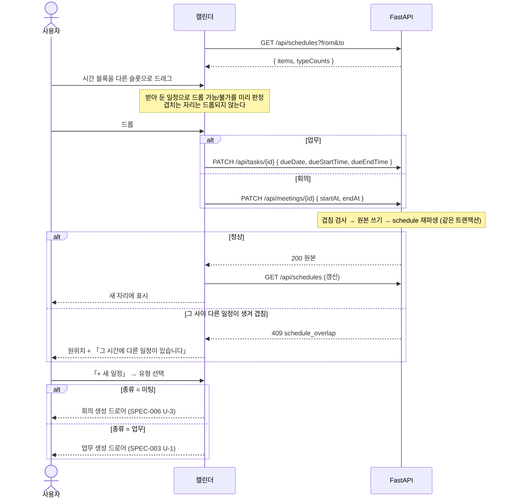

# 캘린더 — 월·주·일 뷰 · 드래그 · 겹침 차단

업무의 기한과 회의의 일시를 **시간축으로 다시 보여주는 뷰**다. **캘린더는 데이터를 소유하지 않는다** — 끌어 옮기면 원본(업무·회의)이 바뀌고 그 결과가 화면으로 내려온다. 시간이 겹치는 자리에는 **애초에 놓이지 않는다.**

> 기능/정책 묶음 단위의 **외부 계약** 문서다. client / QA / 외부 통합이 이 문서만 읽고 따를 수 있어야 한다.
> SPEC에는 table schema 전문, ORM field, repository/service 구조, PR 계획, 구현 순서, 라우트·컴포넌트 파일 경로 같은 내부 구현을 두지 않는다.

## 1. Context

### Meta

- Decision reference: DEC-005 §2(데이터 비소유·드로어 소유권) · §3(**`schedule` 은 파생**) · §4(**드래그 규격·고스트**) · §5(생성·조회·수정·삭제) · §6(로그 없음) · §7(**겹침 차단**) · §8(연결)
- Baseline reference: BASE-005 (캘린더)
- 소비 규약: DEC-002 §3(업무 `due_date` 가 원본) · DEC-003 §4(회의 일시가 원본) · DEC-001 §3(동적 유형·색 토큰)
- **재사용 계약**(이 spec 은 화면을 새로 만들지 않는다)
  - 업무 생성 드로어 · 업무 상세 드로어 · 첨부 · 인라인 편집 → **SPEC-003 U-1·U-3**
  - 상태 전이 · 완료 게이트 → **SPEC-004 U-3·U-6**
  - 회의 생성 드로어 → **SPEC-006 U-3**
  - **회의 상세 드로어 → SPEC-008 U-8**(회의록이 소유, 캘린더가 재사용 — DEC-005 §2)
  - 유형 색 팔레트 8종 → **SPEC-002 §4** · v2 표시 규격 → **SPEC-001 U-2**
- Architecture reference: `backend/README.md` §10(**`GET /api/schedules` 는 읽기 전용**) · `frontend/README.md` §1-2·§3-3·§3-4·§7 · `database/domains/calendar.md` C-1~C-14
- Design reference: `13-calendar.md` · `캘린더.dc.html` P-47~P-55 · `09-design-tokens.md` · `디자인 시스템.dc.html [11][10]` · 정정 §A-2·§A-4·§A-10
- Domain note: 외부에 드러나는 것은 **일정 항목**(`sourceType`·`sourceId` + 원본의 표시 정보)과 **기간·뷰·필터** 축이다
- Open questions: §7

### Business Requirement

- **원본이 하나여야 어긋나지 않는다**(DEC-005 §3, 2026-09-05 개정). 시간의 원본은 업무 기한과 회의 일시이고 `schedule` 은 파생이다 — 캘린더에서 옮겨도 **원본을 고친다.**
- **시간을 잡는다는 건 그 시간을 쓰겠다는 뜻이다**(DEC-005 OQ-4). 그래서 겹침은 종류를 가리지 않고 막고, **경고만 하고 통과시키지 않는다.**
- **캘린더 전용 화면을 만들지 않는다**(DEC-005 §1·§5). 생성·상세는 업무·회의록의 드로어를 그대로 연다 — 같은 개체를 두 규격으로 편집하는 상태를 만들지 않는다.

### Scope

In scope:

- **월 · 주 · 일** 뷰와 뷰 전환 · 기간 스테퍼 · 「오늘」
- **일정 표시 5규칙**(시간 블록 / 기간 바 / 종일 칩 / 취소 칩 / `+n건 더`)
- **동적 유형 분포 카드 = 필터**(미설계 확정 — 상한·「기타」 묶음) · 활성 필터 칩
- **다가오는 일정 레일**
- **「+ 새 일정」 팝오버** → 유형의 종류에 따라 **업무/회의 생성 드로어를 연다**
- **드래그** — 뷰별 허용 동작 · **고스트 변형** · 리사이즈 핸들 · 기간 바 좌우 핸들(미설계 확정)
- **겹침 차단** — **드롭 단계에서** 막는다 · 길이 조절은 경계에서 멈춘다 · 거부 토스트
- **08–20 밖 일정 표시**(미설계 확정) · **캘린더 반응형**(미설계 확정)

Out of scope:

- **업무·회의의 생성/상세/편집 화면** — 전부 재사용이다(§1 Meta). 이 spec 은 **여는 규칙만** 정한다
- **삭제** — 캘린더에서 하지 않는다(DEC-005 §5 · C-12). 원 영역에서만
- 외부 캘린더 일정 · 반복 일정 · 알림 — **v1 밖**(DEC-005 §1 · DEC-003 §8)
- `schedule` 을 직접 쓰는 경로 — **존재하지 않는다**(C-2 · BE-10)

## 2. UX Contract

### Placement

```text
+──────────────────────────────────────────────────+───────────+
│ ‹ 2026년 8월 › [오늘]   [일|주|월]   [+ 새 일정]  │ 유형 분포  │
+──────────────────────────────────────────────────+ (= 필터)  │
│ (월 6주 그리드 / 주 7열 시간 그리드 / 일 단일 열)  │ 다가오는  │
│                                                   │ 일정      │
+──────────────────────────────────────────────────+───────────+
   본문 유동 (1920 참고값 1180)                        레일 420
```

**뷰 전환 선택은 `#1E1E1E`(위치)이고 화면당 Ink 는 이 축 하나뿐이다**([10] · FE §5-2). 필터 행·칩은 선택 색(`#F1F2FE`+`#7181F8`)을 쓴다. 뷰는 쿼리에 남는다(`?view=month|week|day&date=YYYY-MM-DD` — FE §1-2 · DEC-005 OQ-5).

### U-1. 월 뷰 (P-47)

- **상태**
  - *정상*: 6주 그리드. 날짜 숫자 아래 **고정 라인**에 기간 바, 그 아래 종일 칩·시간 항목 칩
  - *기간 바*: 유형색 채움 + 흰 텍스트. **주 경계에서 잘린 쪽 라운드를 없애고 다음 주 첫 칸에서 제목을 다시 쓴다**([11] Period Bar)
  - *넘칠 때*: 칸당 **2줄**까지 그리고 나머지는 「**+n건 더**」. 누르면 그 날짜의 **일 뷰**로 간다(팝오버를 새로 만들지 않는다 — 일 뷰가 이미 그 화면이다)
  - *오늘*: 날짜 숫자에 `#7181F8` 필
  - *로딩*: 그리드 자리에 스켈레톤(SPEC-004 U-11 규격)
  - *빈 달*: 그리드는 그대로 두고 레일에 「이번 달 일정이 없습니다」
- **문구**: 「+n건 더」 · 하단 요약 없음
- **CTA**: 빈 칸 클릭 → **「+ 새 일정」 팝오버**(U-6)가 그 날짜를 기본값으로 열린다 · 항목 클릭 → 상세 드로어(U-7) · 드래그 → U-8
- **기대 결과**: **월 뷰에서는 시간이 바뀌지 않는다**(DEC-005 §4) — 일자 이동과 기간 좌우 변경만 된다

### U-2. 주 뷰 (P-48)

- **상태**
  - *구성*: 상단 **종일 밴드 3줄**(88px) + 7열 시간 그리드. 기본 표시 범위 **08:00–20:00**, 현재 시각 라인 1px `#7181F8` + 좌측 9px 도트
  - *시간 높이*: 1시간 = **61px 를 기준값으로 하되 유동**이다 — 카드 높이에 맞춰 늘고 줄되 **1시간 44px 미만으로는 줄이지 않는다.** 더 줄어야 하면 그리드가 **세로 스크롤**한다(`position:absolute` 로 박지 않는다 — §C Q-34 · §A-13)
  - *08–20 밖 일정*: **U-5**
  - *취소 일정*: 시간 그리드에서 빼고 **종일 밴드에 점선 취소 칩**(취소선 · `#B3B3B3`)으로 올린다. **그 시간대는 비워 새 일정을 넣을 수 있다**([11] · DEC-005 §5)
- **문구**: 종일 밴드 좌측 라벨 「종일」
- **CTA**: 빈 슬롯 클릭 → 「+ 새 일정」 팝오버(그 날짜·시각 기본값) · 항목 클릭 → 상세 드로어 · 드래그 → U-8
- **기대 결과**: 종일 밴드와 시간 그리드를 **오갈 수 있고**, 오갈 때 고스트가 목적지 크기로 바뀐다(U-8)

### U-3. 일 뷰 (P-49)

- **상태**: 단일 열 시간 그리드 + **종일 밴드 2줄**(62px) + 우측 유형 탭 목록. 상단에 「**일정 3건 · 종일 1건 · 취소 1건**」 **분리 표기**([11])
  - *빈 시간 안내*: 연속 2시간 이상 빈 구간이 있으면 「오후 2:00 – 5:00 사이 3시간이 비어 있어요」
- **문구**: 위와 같다
- **CTA**: U-2 와 같다
- **기대 결과**: 일 뷰에서는 **시간대 이동과 길이 조절**만 된다(DEC-005 §4)

### U-4. 유형 분포 카드 = 필터 — 미설계 확정 (DEC-005 OQ-2)

디자인은 유형 4색 고정이었지만 **유형은 동적**이라 카드가 길어질 수 있다(§A-1·§A-10). 레일 폭이 고정(420)이고 아래에 「다가오는 일정」이 있어야 하므로 **길이를 규칙으로 묶는다.**

- **상태**
  - 행은 **카운트 내림차순**으로 정렬한다
  - **최대 8행**까지 그리고, **9번째부터는 「기타 n」 한 행으로 묶는다.** 카드에 스크롤을 만들지 않는다 — 스크롤이 생기면 아래 「다가오는 일정」이 화면 밖으로 밀린다
  - 선택 행 = `#F3F5FF` 필 + 라벨 700 + 카운트 `#7181F8`, 미선택 = 라벨 `#5F6470` + 막대 `#E3E5EA`
  - **카운트에는 기간 일정도 포함**한다 — 세는 집합과 거르는 집합이 같아야 한다(§A-10 · C-14 · DEC-005 OQ-3)
  - *유형 0개*: 「유형이 없습니다」 + 「업무 설정 열기」(SPEC-002 화면으로)
- **문구**: 카드 제목 「업무 유형 필터」 · 묶음 행 「기타 n」
- **CTA**
  - 행 클릭 → 그 유형만 남긴다(다중 선택 가능). 「기타」 행은 **묶인 유형 전부**를 한 번에 켜고 끈다
  - 활성 필터 칩은 **타이틀·기간 스테퍼 옆 왼쪽 그룹**에, 해제는 카드 우측 상단 「**필터 n ✕**」
- **기대 결과**: 필터가 걸리면 그리드에서 **해당 유형만 남는다**(다른 유형의 종일바·시간블록 모두 숨김 — 13-calendar §유형·필터). **색은 유형이 들고 있는 팔레트 토큰**이고 고정 4색이 아니다(§A-10 · C-13). **「취소」는 유형이 아니라 상태**라 이 카드에 없다(§A-2)

### U-5. 08–20 밖 일정 — 미설계 확정 (DEC-005 OQ-6)

**그리드를 처음부터 24시간으로 늘리지 않는다.** 하루를 다 그리면 밀도가 낮아져 업무 시간대가 읽히지 않는다. 그렇다고 **숨기면 일정이 사라진 것처럼 보인다** — 실패를 가리지 않는다는 원칙과 같은 결이다(DEC-003 §7 승계).

- **상태**
  - 기본 표시 **08:00–20:00**
  - 그 밖에 일정이 있으면 그리드 **위·아래 끝에 경계 칩**이 붙는다 — 「**↑ 이른 일정 1건 · 07:00**」 / 「**↓ 늦은 일정 2건**」. 칩은 유형색을 쓰지 않고 중립(`#F4F5F7` + `#5F6470`)으로 그린다(그리드 안의 일정과 혼동되지 않게)
  - 칩을 누르면 **그 시각까지 그리드가 펼쳐진다**(최대 00:00–24:00). 펼친 상태는 **그 화면을 떠날 때까지** 유지되고, 뷰·기간을 바꾸면 기본 범위로 돌아온다
  - 펼친 상태에서는 칩 자리에 「**기본 시간대로**」가 뜬다
- **문구**: 위와 같다
- **CTA**: 경계 칩 · 「기본 시간대로」
- **기대 결과**: **일정이 화면에서 사라지는 경우가 없다.** 드래그로 08–20 밖에 놓는 것도 펼친 상태에서 가능하다

### U-6. 「+ 새 일정」 팝오버 (P-50) — 드로어 재사용

- **상태**: 버튼 아래 4px, 우측 정렬, **폭은 내용에 맞춘다**([11] Create Menu). 항목은 **설정의 동적 유형 전부**(종류 무관, 이름 + 색 dot). **「취소」 항목이 없다** — 취소는 상태다(§A-2)
  - 유형이 많으면 **최대 8개까지 보이고 아래에 「업무 설정에서 보기」**를 둔다(U-4 와 같은 상한 규칙)
- **문구**: 유형 이름 그대로
- **CTA**: 항목을 고르면 **그 유형의 종류에 따라 갈린다**(DEC-005 §5)
  - 종류가 **미팅** → **회의 생성 드로어**(SPEC-006 U-3)를 연다
  - 종류가 **업무** → **업무 생성 드로어**(SPEC-003 U-1)를 연다
  - 어느 쪽이든 **고른 유형과 클릭한 날짜·시각이 기본값으로 채워진다**
- **기대 결과**: **캘린더 전용 생성 폼이 없다**(DEC-005 §1). 서버 요청은 **드로어의 만들기 버튼에서만** 나간다 — 팝오버에서 고르는 것만으로 아무것도 생기지 않는다

### U-7. 상세 열기 — 드로어 재사용

- **상태**: 월·주·일 **어느 뷰에서 눌러도 같은 드로어**가 열린다(13-calendar §상세 흐름)
  - 업무 → **업무 상세 드로어**(SPEC-003 U-3)
  - 회의 → **회의 상세 드로어**(SPEC-008 U-8) — **회의록이 소유하는 표면**이다(DEC-005 §2). 캘린더가 새로 정의하지 않는다
- **문구**: 드로어 규격이 정본이다
- **CTA**: 드로어 안의 CTA 는 각 spec 을 따른다. 상태 변경은 **SPEC-004 의 판정**(전이 그래프 + 완료 게이트)을 그대로 지난다
- **기대 결과**: **드로어는 동시에 하나**이고 **드로어 위에 모달을 겹치지 않는다**(FE §6-2). 드로어에서 기한·일시를 바꾸면 캘린더가 갱신된다(같은 원본을 고치므로)

### U-8. 드래그 — 시각 규격 확정 (DEC-005 OQ-1)

**뷰마다 허용 동작이 다르다**(DEC-005 §4). 표를 그대로 계약으로 옮긴다.

| 뷰 | 허용 | 금지 |
|---|---|---|
| **월** | 일자 이동 · **기간 바 좌우 드래그**로 기간 변경 | **시간 변경** |
| **주** | 일자 이동(같은 시간 유지) · 종일 좌우 드래그 · **종일 → 시간 그리드 드롭 시 그 지점부터 1시간** · 시간 항목 일자 이동 · **위아래 드래그로 길이 조절** | — |
| **일** | 시간대 이동 · **위아래 드래그로 길이 조절** | 일자 이동(뷰에 다른 날이 없다) |

**시각 규격**(토큰만 쓴다 — 새 색을 만들지 않는다. SPEC-004 U-4 칸반 DnD 와 같은 어휘를 쓴다).

- **핸들**: 시간 블록은 상·하단 **6px 리사이즈 핸들**(hover 시 커서 `ns-resize`), 기간 바는 좌·우 **8px 핸들**(`ew-resize`). **핸들은 hover 에서만 보인다** — 평소에 그리면 블록이 시끄럽다
- **고스트**: 잡은 항목이 따라온다. 불투명도 0.9 + 그림자 `0 16px 40px rgba(0,0,0,0.16)`(팝오버 그림자). **회전·기울임 없음**
- **고스트 변형**(DEC-005 §4 — 목적지 크기로 그린다)

  | 이동 | 고스트 |
  |---|---|
  | 종일 밴드 → 시간 그리드 | **1시간 블록으로 축소**. 7일 바를 그대로 들고 하루 칸에 넣는 모양이 되지 않는다 |
  | 시간 그리드 → 종일 밴드 | **하루짜리 종일 칩**. 원래 기간을 기억하지 않는다 |
  | 같은 축 안 이동 | 원래 기간·길이 유지 |

- **원래 자리**: 점선 플레이스홀더 1px `#C9D1FB` + 배경 `#F8FAFF`
- **드롭 가능 자리**: 슬롯·칸 배경 `#F1F2FE` + 1px `#7181F8`, 시간 그리드는 삽입선 2px `#7181F8`
- **드롭 불가 자리**(겹침): 배경 `#FCEEEC`(rose 계열 — SPEC-002 팔레트) + 커서 `not-allowed`. **놓이지 않는다**(U-9)
- **놓은 직후**: 서버 응답까지 그 자리를 **로딩 상태**로 유지한다(불투명도 0.6). **낙관적으로 옮기지 않는다**(FE §3-4 — 서버가 거부할 수 있다)
- **드래그가 유일한 경로가 아니다**: 같은 변경을 상세 드로어의 기한·일시 필드에서 할 수 있다([10] 「단축키로 되더라도 화면에는 항상 버튼」의 결)
- **기대 결과**: 성공하면 **원본이 바뀌고**(업무 기한 · 회의 일시) 화면이 갱신된다. **`schedule` 을 직접 고치는 경로는 없다**(C-2·C-3)

### U-9. 겹침 차단 (DEC-005 §7)

- **판정 대상**: **시간 있는 일정끼리만**이다. 종일·기간 일정은 검사하지 않고(기간에 걸친 일이지 그 시간을 점유한 게 아니다), **취소된 일정도 빠진다**(C-6·C-10)
- **경계 접촉은 겹침이 아니다** — 10–11 다음 11–12 는 놓인다(C-8)
- **종류를 가리지 않는다** — 업무↔회의도 서로 막는다(C-7)
- **상태**
  - *드래그 중*: 겹치는 자리는 **드롭 불가 표시**가 되고 **놓이지 않는다.** 놓으려 하면 원위치한다 — **놓은 뒤 거부하지 않는다**(DEC-005 §7)
  - *길이 조절*: **인접 일정 경계에서 멈춘다.** 그 이상 늘어나지 않고, 경계에 2px `#7181F8` 표시가 뜬다
  - *드물게 통과된 경우*(다른 곳에서 그 사이 일정이 생김): 서버가 `409` 로 거부하고 **원위치 + 토스트**
- **문구**: 토스트 「**그 시간에 다른 일정이 있습니다**」 — **SPEC-003·006 과 같은 문구**다(판정이 같으므로 문구도 같다). 400×56 `#1E1E1E`, 하단 중앙, 4초. 실행취소를 붙이지 않는다
- **CTA**: 없다
- **기대 결과**: **경고만 하고 통과시키는 경로가 없다**(DEC-005 §7)

### U-10. 다가오는 일정 레일

- **상태**: 유형 분포 카드 아래. **현재 기간 안에서 지금 이후**인 일정을 시각 순으로 **최대 5건**. 각 행은 「시각 · 유형 dot · 제목」 한 줄
  - *없음*: 「남은 일정이 없습니다」
- **문구**: 위와 같다
- **CTA**: 행 클릭 → U-7 상세 드로어
- **기대 결과**: 레일의 범위는 **기간 스테퍼가 가리키는 범위**를 따른다 — 화면의 스코프가 하나여야 한다([10] 「스코프 표시 필수」)

### U-11. 반응형 — 캘린더 (미설계 확정)

| 구간 | 캘린더 |
|---|---|
| **< 1280** | 최소 폭 안내 화면(SPEC-000 U-2) |
| **1280 ~ 1439** | 사이드바 숨김 + 햄버거, 여백 48. **우측 레일을 접는다** — 헤더에 「**유형·다가오는 일정**」 버튼이 생기고 누르면 **오버레이 400**으로 열린다. 본문(그리드)이 남은 폭을 전부 쓴다 |
| **≥ 1440** | 사이드바 200, 여백 80 → 240 연속 보간. 본문 유동 + 레일 420 |

- **주 뷰는 어느 구간에서도 7열을 유지한다.** 열을 줄여 5일만 보이게 하지 않는다 — 주의 정의가 흔들린다. 열 폭이 좁아지면 항목 제목이 줄어들 뿐이다
- **월 그리드는 6주를 유지**한다. 셀 높이는 유동이고 `+n건 더` 임계가 줄어들 수 있다
- `position:absolute` 로 배치하지 않는다(§C Q-34 · §A-13)

## 3. User Scenario

### S-1. 사용자 — 월에서 일정을 옮긴다

1. 월 뷰에서 업무 칩을 다른 날짜로 끈다 → 원래 자리에 점선 플레이스홀더가 남고, 놓을 칸이 선택 색으로 바뀐다.
2. 놓는다 → 잠깐 로딩이었다가 그 날짜에 들어간다.
3. 내 업무 목록에서 그 업무의 **기한이 바뀌어 있다**(원본이 바뀐 것이다).

### S-2. 사용자 — 기간을 늘린다

1. 월 뷰의 기간 바 오른쪽 끝에 hover 하면 **좌우 핸들**이 나타난다.
2. 오른쪽으로 끌면 기간이 늘어난다. 놓으면 저장된다.

### S-3. 사용자 — 주에서 종일 일정을 시간대로 내린다

1. 종일 밴드의 칩을 잡아 시간 그리드로 끈다 → **고스트가 1시간 블록으로 줄어든다**(7일 바 모양으로 끌리지 않는다).
2. 14:00 자리에 놓는다 → **14:00–15:00** 로 잡힌다.
3. 반대로 시간 블록을 종일 밴드로 올리면 **하루짜리 종일 칩**이 된다.

### S-4. 사용자 — 겹치는 자리에 놓으려 한다

1. 14:00–15:00 에 이미 회의가 있는데 업무 블록을 그 위로 끈다 → 그 자리가 **드롭 불가**로 바뀌고 커서가 `not-allowed` 가 된다.
2. 놓아도 **들어가지 않고 원위치**한다. 토스트가 뜨지 않는다(애초에 놓이지 않았으므로).
3. 15:00 부터 놓으면 들어간다 — **경계 접촉은 겹침이 아니다.**

### S-5. 사용자 — 길이를 늘리다 경계에서 멈춘다

1. 일 뷰에서 블록 아래 핸들을 잡고 늘린다.
2. 다음 일정 시작 시각에서 **더 늘어나지 않고 멈춘다.** 그 경계에 표시가 뜬다.

### S-6. 사용자 — 유형으로 거른다

1. 우측 유형 분포 카드에서 두 유형을 켠다 → 그리드에 그 유형만 남고, 다른 유형의 **종일바·시간블록이 모두 사라진다.**
2. 유형이 열 개면 카드에 8행 + 「기타 2」가 보인다. 「기타」를 누르면 묶인 둘이 함께 켜진다.
3. 타이틀 옆 활성 필터 칩과 카드 우상단 「필터 2 ✕」로 해제한다.

### S-7. 사용자 — 새 일정을 만든다

1. 빈 칸을 누르면 「+ 새 일정」 팝오버가 그 날짜를 기본값으로 열린다.
2. 「미팅·회의」를 고르면 **회의 생성 드로어**가, 「개인 업무」를 고르면 **업무 생성 드로어**가 열린다 — 캘린더 전용 폼이 아니다.
3. 드로어의 만들기 버튼을 눌러야 실제로 생긴다.

### S-8. 사용자 — 이른 시간 일정을 본다

1. 07:00 회의가 있는 날의 주 뷰 상단에 「**↑ 이른 일정 1건 · 07:00**」 칩이 보인다.
2. 칩을 누르면 그리드가 07:00 까지 펼쳐진다. 「기본 시간대로」로 되돌린다.

### S-9. 사용자 — 상세를 연다

1. 회의 블록을 누르면 **회의 상세 드로어**(SPEC-008 U-8)가 열린다.
2. 업무 블록을 누르면 **업무 상세 드로어**(SPEC-003 U-3)가 열린다. 두 드로어 모두 회의록·내 업무에서 여는 것과 **같은 화면**이다.

## 4. Interface Contract

### API Contract

| Method | Path | 요약 | 권한 |
|---|---|---|---|
| GET | `/api/schedules` | **기간 조회 — 읽기 전용** | 세션 |

**쓰기 표면이 없다.** 캘린더에서 일어나는 모든 변경은 **원본 엔드포인트**로 나간다(DEC-005 §3 · BE-10 · C-2).

| 변경 | 나가는 곳 | 정본 |
|---|---|---|
| 업무 일자·시간·기간 변경(드래그·리사이즈) | `PATCH /api/tasks/{id}` (`dueDate`·`dueStartTime`·`dueEndTime`) | **SPEC-003 §4** |
| 회의 일시 변경 | `PATCH /api/meetings/{id}` (`startAt`·`endAt`) | **SPEC-006 §4** |
| 업무·회의 생성 | `POST /api/tasks` · `POST /api/meetings` | SPEC-003 · SPEC-006 |
| 상태 전이(상세 드로어에서) | `PATCH /api/tasks/{id}/status` | **SPEC-004 §4**(완료 게이트 포함) |
| 삭제 | **캘린더에 없다** — 원 영역에서만(C-12) | SPEC-004 · SPEC-006 |

- **`PATCH /api/schedules/{id}` 는 존재하지 않는다**(BE-10). 있으면 원본과 파생이 갈린다
- 기간은 **UTC 로 받는다**(`backend/README.md` §10 · G-2)

### Request / Response

에러는 여기 두지 않는다 — **Case Matrix 가 단일 SoT** 다.

**`GET /api/schedules?from=&to=&workTypeId=`**

```json
{
  "items": [
    { "id": 55, "sourceType": "task", "sourceId": 101,
      "startAt": "2026-08-29T00:00:00Z", "endAt": "2026-08-30T00:00:00Z", "isAllDay": true,
      "title": "제품 소개서 내용 업데이트",
      "workType": { "id": 3, "name": "문서·보고", "colorToken": "steel", "kind": "task", "isDeleted": false },
      "project": { "id": 7, "name": "9월 요금제 개편", "colorToken": "violet", "isDeleted": false },
      "status": "in_progress", "isCancelled": false },
    { "id": 56, "sourceType": "meeting", "sourceId": 21,
      "startAt": "2026-08-27T00:30:00Z", "endAt": "2026-08-27T01:30:00Z", "isAllDay": false,
      "title": "제품 소개서 리뷰",
      "workType": { "id": 1, "name": "미팅·회의", "colorToken": "indigo", "kind": "meeting", "isDeleted": false },
      "project": null, "status": "ended", "isCancelled": false }
  ],
  "typeCounts": [ { "workTypeId": 1, "name": "미팅·회의", "colorToken": "indigo", "count": 4 } ]
}
```

- 응답 항목은 **`sourceType`·`sourceId` + 원본의 표시 정보**(제목·유형 색·상태)를 함께 담는다 — 캘린더가 조인 결과를 그대로 그린다(`backend/README.md` §10)
- **`typeCounts` 에는 기간 일정도 포함**한다(§A-10 · C-14). 유형 필터 자신은 반영하지 않는다(칩 숫자가 흔들리지 않게 — SPEC-004 `typeCounts` 규칙 승계)
- **취소된 업무는 `isCancelled: true`** 로 실려 온다 — 화면이 시간 그리드에서 빼고 종일 밴드의 점선 칩으로 올린다(13-calendar §표시 규칙 4)
- **소프트 딜리트된 원본의 일정은 오지 않는다**(C-5-c)

### Validation

이 spec 에는 자체 입력이 없다. **드래그 결과가 원본 API 의 검증을 그대로 받는다.**

| 대상 | 규칙 | 정본 |
|---|---|---|
| 업무 기한 | `dueStartTime`·`dueEndTime` 은 **둘 다 있거나 둘 다 없다**. 있으면 `dueDate` 도 있어야 하고 `end > start` | SPEC-003 §4(T-1-b) |
| 회의 일시 | `startAt`·`endAt` **둘 다 필수**, `endAt > startAt`, **5분~300분** | SPEC-006 §4(M-1·M-18) |
| 겹침 | **시간 있는 일정끼리만.** 종일·기간·취소는 검사 제외. 경계 접촉은 겹침 아님 | C-6·C-8·C-10 |
| 조회 기간 | `from`·`to` 함께 온다. **UTC 경계** | G-2 |
| 뷰·날짜 | `view` ∈ `month`·`week`·`day`, `date` = `YYYY-MM-DD`. 쿼리로만 유지한다 | FE §1-2 |

- **월 뷰 드래그는 시간을 보내지 않는다** — 일자만 바꾼다(DEC-005 §4). 시간 값을 함께 보내면 정책 위반이다
- **종일 → 시간 그리드 드롭**은 `dueStartTime` = 드롭 지점, `dueEndTime` = **+1시간**으로 보낸다(DEC-005 §4)

### Case Matrix

이 spec 의 모든 에러·경계가 여기 있다. API 절에는 정상 응답만 둔다.

| 에러 코드 | 백엔드 출력 | 프론트 출력 | 표시 위치 |
|---|---|---|---|
| `schedule_overlap` | `409 {detail:"그 시간에 다른 일정이 있습니다", code:"schedule_overlap"}` · **원본이 바뀌지 않는다**(C-9) | **원위치 + 토스트** 같은 문구. 정상 경로에서는 **드롭 자체가 막혀 여기까지 오지 않는다** | 화면 하단 토스트 |
| `validation_error` | `422 {detail:"입력값을 확인해 주세요", code:"validation_error"}` | 원위치 + 토스트(예 「회의는 300분을 넘을 수 없습니다」) | 화면 하단 토스트 |
| `invalid_meeting_status` | `409 {detail:"지금 상태에서는 할 수 없습니다", code:"invalid_meeting_status"}` | 원위치 + 토스트. 기록 중·생성중 회의는 옮길 수 없다 | 화면 하단 토스트 |
| `task_completion_blocked` · `invalid_status_transition` | SPEC-004 §4 그대로 | 상세 드로어에서 **SPEC-004 U-6 규격**(거부 토스트 + 「결과 입력」) | 화면 하단 토스트 |
| `not_found` | `404 {detail:"항목을 찾을 수 없습니다", code:"not_found"}` | 토스트 + 캘린더 갱신(다른 곳에서 지워진 경우) | 화면 하단 토스트 |
| (조회 실패 — 5xx·네트워크) | 전파 — 스택이 로그에 남는다 | **빈 캘린더로 대체하지 않는다.** 그리드 자리에 실패 표시 + 「다시 시도」 | 본문 영역 |
| `token_expired` / `invalid_refresh_token` | SPEC-001 §4 | SPEC-001 §4 | — |

- **캘린더 고유의 새 에러 코드가 없다** — 변경이 전부 원본 엔드포인트로 나가므로 코드도 그쪽 것을 그대로 쓴다
- **이 표에 없는 예외는 fallback 없이 전파한다**(DEC-005 §7 · `backend/README.md` §8-1)

### Flow



### State / Lifecycle

**해당 없음** — 캘린더는 자체 상태를 갖지 않는다. 화면에 보이는 상태는 **원본의 상태**다(업무 상태 4종 + 파생 「지연」은 SPEC-004 §4, 회의 상태 4종은 SPEC-006 §4). **`schedule` 은 원본이 바뀔 때 다시 만들어지는 파생 행**이라 자체 전이가 없다(C-2·C-3).

### Data Contract

| 리소스 | 외부에 드러나는 필드 |
|---|---|
| 일정 항목 | `id` · `sourceType`(`task`\|`meeting`) · `sourceId` · `startAt` · `endAt` · `isAllDay` · `title` · `workType`(요약·`kind` 포함) · `project`(요약·null 가능) · `status` · `isCancelled` |
| 유형 카운트 | `typeCounts[{ workTypeId, name, colorToken, count }]` — **기간 일정 포함** |

- **`schedule` 이 담는 것은 시간축 배치뿐**이다(C-5). 기한 같은 도메인 속성은 원본에 있다
- **유형 색은 팔레트 토큰명**(SPEC-002 §4). **고정 4색은 폐기**됐다(§A-10 · C-13). 화면은 hex 를 인라인으로 쓰지 않는다(FE §5-3)
- 시각은 **UTC ISO 문자열**이고 KST 변환은 화면이 한 곳에서 한다(G-2 · FE §3-6)

## 5. Implementation Rules

- **캘린더는 데이터를 소유하지 않는다.** 이 화면에서 나가는 쓰기 요청은 **전부 원본 엔드포인트**다(DEC-005 §2·§3 · C-2). **`schedule` 을 직접 쓰는 코드가 있으면 계약 위반이다**
- **방향은 한 쪽이다.** 원본을 고치면 같은 트랜잭션에서 `schedule` 이 다시 만들어진다(C-3 · BE §7). 화면은 그 결과를 다시 읽는다
- **겹침 검사는 원본을 쓰기 전에** 파생될 배치로 돈다 — 걸리면 **원본도 바뀌지 않는다**(C-9)
- **드롭 판정은 화면이 미리 하고, 정본은 서버다.** 이미 받아 둔 일정으로 드롭 가능/불가를 그리되, **드물게 통과된 드롭이 409 로 돌아오면 원위치 + 토스트**다(FE §3-4)
- **낙관적 갱신을 하지 않는다** — 겹침이 거부할 수 있다. 즉각성은 **드래그 고스트**가 준다(FE §3-4)
- **캘린더는 자체 로그를 남기지 않는다.** 드래그로 바꾼 것도 원 영역의 로그에 남는다(DEC-005 §6 · C-11)
- **삭제 경로를 만들지 않는다**(C-12). 상세 드로어 안의 삭제도 원 영역 규격을 따른다
- **드로어를 새로 만들지 않는다.** 업무 생성·상세는 SPEC-003, 회의 생성은 SPEC-006, 회의 상세는 SPEC-008 U-8 을 **그대로 연다.** 드로어는 부모를 모르고, 부모가 열어 결과를 콜백으로 받는다(FE §6-2)
- **월 뷰는 시간을 건드리지 않는다**(DEC-005 §4). 월에서 옮긴 업무의 시간 값은 그대로 유지된다
- **취소된 일정은 시간 슬롯을 점유하지 않는다**([11] · DEC-005 §5) — 그 시간대에 새 일정을 넣을 수 있다
- **뷰·기간·필터는 쿼리에 있다**(FE §1-2). 컴포넌트가 자체 상태로 들고 있지 않는다
- **소유 검사가 먼저다.** 남의 일정은 조회되지 않는다

## 6. Verification

### Acceptance Criteria

앱 창에서 사람이 직접 확인하는 문장으로 적는다.

- [ ] 월·주·일 뷰를 오갈 수 있고, **뷰와 기간이 새로고침 후에도 유지**된다
- [ ] 업무의 기한과 회의의 일시가 **한 화면에 함께** 보이고, 유형 색이 **설정에서 고른 색**과 같다
- [ ] 월 뷰에서 칩을 다른 날짜로 끌면 옮겨지고, **내 업무 목록의 기한도 함께 바뀐다**
- [ ] 월 뷰 기간 바의 **좌우 핸들**로 기간을 늘릴 수 있고, **시간은 바뀌지 않는다**
- [ ] 주 뷰에서 종일 칩을 시간 그리드로 끌면 **고스트가 1시간 블록으로 줄어들고**, 놓으면 **그 지점부터 1시간**으로 잡힌다
- [ ] 시간 블록을 종일 밴드로 올리면 **하루짜리 종일 칩**이 된다
- [ ] 이미 일정이 있는 시간대 위로 끌면 **드롭 불가 표시**가 되고 **놓이지 않는다**(놓은 뒤 거부가 아니다)
- [ ] 끝시각과 시작시각이 맞닿는 자리(14–15 다음 15–16)에는 **놓인다**
- [ ] 블록 아래 핸들로 길이를 늘리면 **다음 일정 경계에서 멈춘다**
- [ ] 회의 블록을 업무 위로 끌어도 막힌다(**종류를 가리지 않는다**)
- [ ] 유형 분포 카드에서 유형을 켜면 **그 유형만 남고** 다른 유형의 종일바·시간블록이 모두 사라진다
- [ ] 유형이 9개 이상이면 카드에 **8행 + 「기타 n」**이 보이고, 「기타」를 누르면 묶인 유형이 함께 켜진다
- [ ] 유형 카운트에 **기간 일정도 포함**되어 있다(세는 수 = 걸러지는 수)
- [ ] 07:00 일정이 있으면 그리드 위에 「**↑ 이른 일정**」 칩이 보이고, 누르면 그 시각까지 펼쳐진다
- [ ] 취소된 업무는 **시간 그리드에서 빠지고** 종일 밴드에 점선 칩으로 올라가며, **그 시간대에 새 일정을 넣을 수 있다**
- [ ] 「+ 새 일정」에서 미팅 유형을 고르면 **회의 생성 드로어**가, 업무 유형을 고르면 **업무 생성 드로어**가 열린다(캘린더 전용 폼이 없다)
- [ ] 회의 블록을 누르면 **회의록에서 여는 것과 같은 상세 드로어**가 열린다
- [ ] 창을 1280~1439 로 줄이면 **우측 레일이 오버레이**로 바뀌고, 주 뷰는 **7열을 유지**한다
- [ ] 서버를 내린 채 캘린더를 열면 **빈 달력이 아니라** 실패 표시 + 「다시 시도」가 보인다

## 7. Open Questions

### 이 spec 이 닫은 것

| 닫힌 항목 | 무엇으로 닫았나 |
|---|---|
| **DEC-005 OQ-1**(드래그 시각 규격) | **U-8 에서 확정** — hover 시 나타나는 6px/8px 핸들 · 고스트(그림자만, 회전 없음) · **목적지 크기 변형 3규칙** · 점선 플레이스홀더 `#C9D1FB`/`#F8FAFF` · 드롭 가능 `#F1F2FE`+`#7181F8` · 드롭 불가 `#FCEEEC`+`not-allowed` · 놓은 뒤 로딩 유지. 근거: [10] 「검정은 위치, 보라는 선택」(새 색 금지) · SPEC-004 U-4 칸반 DnD 와 같은 어휘 · FE §3-4 |
| **DEC-005 OQ-2**(동적 유형 분포 카드) | **U-4 에서 확정** — 카운트 내림차순 **8행 + 「기타 n」 묶음**, **스크롤을 만들지 않는다**(레일의 「다가오는 일정」이 밀리지 않게). 「기타」 행도 필터로 동작. 유형 0개일 때 설정으로 보내는 진입점 |
| **DEC-005 OQ-6**(08–20 밖 일정) | **U-5 에서 확정** — 기본 08–20 유지 + **경계 칩**(「↑ 이른 일정 1건 · 07:00」)으로 존재를 알리고, 누르면 **그 시각까지 펼친다**(최대 00–24). 화면을 떠나면 기본으로 복귀. 근거: 24시간 상시 표시는 밀도를 죽이고, 숨기면 일정이 사라진 것처럼 보인다(실패를 가리지 않는다는 원칙과 같은 결) |
| **DEC-005 §7 겹침 차단 토스트** | **U-9·§4 에서 확정** — 문구 「그 시간에 다른 일정이 있습니다」(SPEC-003·006 과 동일), 토스트 규격은 `09-design-tokens`. **정상 경로에서는 드롭이 막혀 토스트가 뜨지 않는다** |
| **캘린더 반응형**(Q-34 · 분석 §7-2) | **U-11 에서 확정** — 1280~1439 에서 **레일을 오버레이 400 으로 접고**, 주 뷰는 **7열 유지**, 월은 6주 유지. 근거: `08-responsive.md` §규칙(축소형을 만들지 않는다) · §C Q-34 |
| **§A-10 정정**(유형 4색 고정 · 기간 일정 카운트 제외) | **U-4·§4 에서 확정** — 색은 **팔레트 토큰**(C-13), 카운트에 **기간 일정 포함**(C-14). 「취소」는 유형 축에서 빠졌다(§A-2) |
| **§A-4 정정의 캘린더 쪽 반영** | **§4·§5 에서 확정** — 드래그가 `PATCH /api/tasks|meetings` 로 나가고 **`schedule` 쓰기 표면이 없다**(C-2·C-3 · BE-10) |
| **P-55 「회의 상세 드로어는 캘린더에서 신규 정의」** | **U-7 에서 정정 확정** — 회의 상세 드로어는 **회의록이 소유**하고(DEC-005 §2) 캘린더는 **SPEC-008 U-8 을 재사용**한다. 디자인 리포트의 「신규」 표기는 DEC-005 §2 확정 이전 값이다 |

### 남은 것

| ID | Question | Owner | Next |
|---|---|---|---|
| S009-OQ-1 | **시간 그리드 1시간 높이를 유동으로 재해석했다**(기준 61px · 하한 44px · 그 아래는 세로 스크롤). 디자인은 61px 고정이지만 유동 레이아웃 원칙(§C Q-34)과 충돌한다 — 하한 값은 spec 이 정했다 | 사용자(디자인) | 구현·실측 후 |
| S009-OQ-2 | **유형 분포 카드 상한 8행**은 레일 420·「다가오는 일정」 5건을 함께 세워 정한 값이다. 실제로 유형이 많아지면 조정될 수 있다 | 사용자 | 구현·실측 후 |
| S009-OQ-3 | **「+n건 더」가 일 뷰로 이동**하도록 정했다(팝오버를 새로 만들지 않는다 — 일 뷰가 이미 그 화면이다). 13-calendar 는 「+n건 더」의 동작을 적지 않았다 | 사용자 | DEC-005 갱신 |
| S009-OQ-4 | **다가오는 일정 레일의 범위를 「현재 기간 안」으로 정했다**(스코프가 하나여야 한다는 규칙). 월 말일에 다음 달 일정을 보여주지 않는다 — 다르게 원하면 알려 달라 | 사용자 | DEC-005 갱신 |
| S009-OQ-5 | **기록 중·생성중 회의는 드래그로 옮길 수 없다**고 정했다(`invalid_meeting_status`). DEC-005 는 상태별 제약을 말하지 않는다 — 진행 중인 회의의 시간을 바꾸는 것이 의미가 없다고 보았다 | 사용자 | DEC-005 갱신 |
