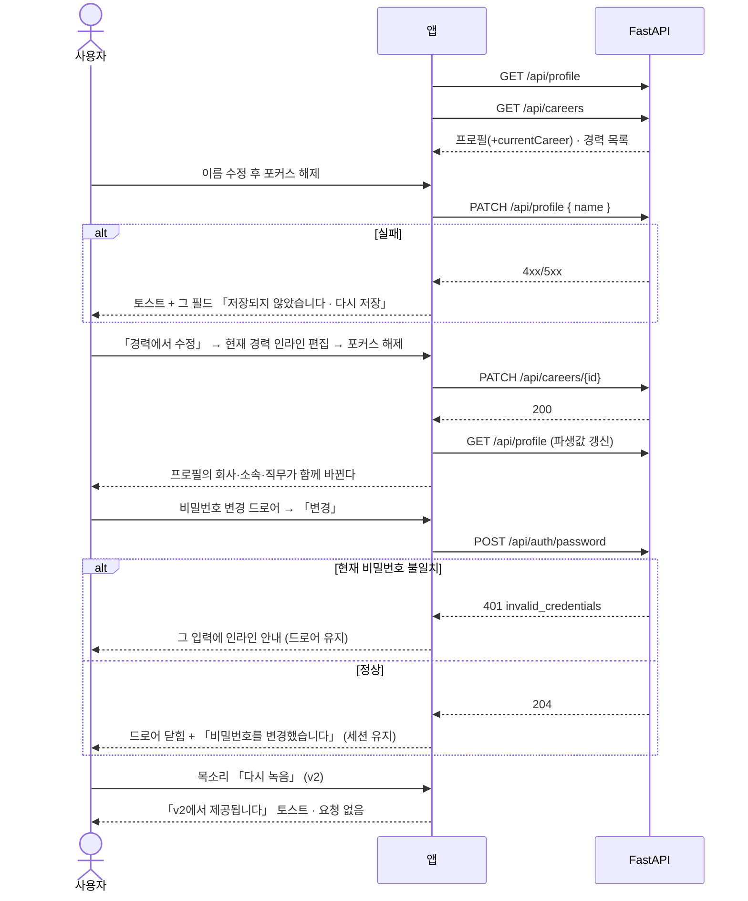

# 개인 설정 — 프로필 · 경력 · 비밀번호

프로필과 경력을 **저장 버튼 없이** 고치고, 비밀번호를 드로어에서 바꾼다. 목소리·연동 관리·계정 삭제·소셜 로그인은 **화면을 그대로 그리되 눌러도 안내만 뜬다** — v2 다.

> 기능/정책 묶음 단위의 **외부 계약** 문서다. client / QA / 외부 통합이 이 문서만 읽고 따를 수 있어야 한다.
> SPEC에는 table schema 전문, ORM field, repository/service 구조, PR 계획, 구현 순서, 라우트·컴포넌트 파일 경로 같은 내부 구현을 두지 않는다.

## 1. Context

### Meta

- Decision reference: DEC-001 §3(필드 · **업무 시간 v1 제외**) · §5(CRUD — 인라인 자동 저장 · 경력 하드 삭제) · §6(감사 로그 없음) · §7(자동 저장 실패) · §v2 스코프
- Baseline reference: BASE-001 기능 5·6·7·8·11·12 (프로필 · 경력 · 목소리 · 비밀번호 · 연동 · 계정 삭제)
- **재사용 계약**
  - 설정 좌측 메뉴 카드 · 로그아웃 · 계정 삭제 진입점 → **SPEC-001 U-4·U-5·U-6**
  - v2 표시 규격(비활성 + 「v2에서 제공됩니다」) → **SPEC-001 U-2**
  - **자동 저장 실패 표시 규격** → **SPEC-002 U-7**
  - **설정 영역 반응형** → **SPEC-002 U-8**(정본)
- Architecture reference: `backend/README.md` §8-2·§9·§10 · `frontend/README.md` §3-4·§6·§9 · `database/domains/account.md` A-1·A-2·A-3·A-9·A-10·A-11
- Design reference: `11-auth-profile.md` §설정 공통 골격·§프로필 패널·§경력 패널·§목소리 패널·§비밀번호 변경 드로어 · P-05·P-07·P-08·P-09·P-10 · `09-design-tokens.md` · `디자인 시스템.dc.html [07][10]` · 정정 §A-14
- Domain note: 외부에 드러나는 것은 **프로필**(이름·이메일·아바타 + **파생된 회사/소속/직무**)과 **경력 행**, **비밀번호 변경**이다
- Open questions: §7

### Business Requirement

- **자동 저장이 기본이다**([10] RULES · DEC-001 §5). 설정 패널에 저장 버튼이 없고, 캡션이 그 사실을 알린다. 저장 버튼은 드로어(비밀번호 변경) 안에서만 쓴다.
- **회사·소속·직무는 프로필의 값이 아니라 「현재」 경력의 값이다**(DEC-001 §3 · A-3 · G-7). 두 곳에 같은 사실을 두지 않는다.
- **「업무 시간」 필드는 v1 에 없다**(§A-14 · A-11 · DB-OQ-2). 캘린더 시간 그리드가 08–20 고정이라 쓰는 곳이 없다.
- **v2 항목은 숨기지 않는다**(DEC-001 §v2). 제품의 형태를 온전히 보이게 두고 뒤(백엔드)만 v2 에서 붙인다.

### Scope

In scope:

- **개인 설정 화면** — 프로필 · 경력 · 목소리 세 패널의 스택
- **프로필 패널** — 아바타(변경·삭제) · 이름 · 이메일(**표시 전용**) · **회사/소속/직무(파생 표시)** · 자동 저장
- **경력 패널** — **인라인 한 줄** 추가·편집 · 「재직 중」 체크 · 정렬 · 하드 삭제
- **비밀번호 변경 드로어**(840) — 현재/새/새 확인 · **강도 3조건** · 성공 토스트
- **v2 스코프 4종** — 목소리 패널과 녹음 드로어 · 연동 관리 화면 · 계정 삭제 · 「다른 기기 모두 로그아웃」 토글

Out of scope:

- 로그인·세션·로그아웃·설정 메뉴 카드 골격 — **SPEC-001**
- 업무 설정(유형·프로젝트) — **SPEC-002**
- **「업무 시간」 필드** — v1 에 없다(§A-14)
- 2단계 인증 · 기기 목록 · 자동 백업 · 데이터 내보내기 — v1 밖(11-auth §v1에서 뺀 것)
- 회원가입 · 비밀번호 찾기 — v1 에 없다(DEC-001 §1)

## 2. UX Contract

### Placement

설정 화면의 첫 번째 갈래. 좌측 메뉴 카드는 **SPEC-001 U-4** 가 정의한 것을 그대로 쓴다.

```text
+──────────────────────────────────────────────────────────+
│ 홈 › 설정 › 개인 설정                                      │
│  ┌ 메뉴 카드 ┐  ┌ 프로필 패널 ─────────────────────────┐  │
│  │▸개인 설정 │  │ 아바타 · 이름 · 이메일   [비밀번호 변경] │
│  │ 업무 설정 │  │ 회사 · 소속 · 직무 (경력에서 파생)     │  │
│  │ 연동 관리 │  └───────────────────────────────────────┘  │
│  │ ───────── │  ┌ 경력 패널 (인라인 한 줄) ─────────────┐  │
│  │ 로그아웃  │  └───────────────────────────────────────┘  │
│  │ 계정 삭제 │  ┌ 목소리 패널 (v2 — 비활성) ───────────┐  │
│  └───────────┘  └───────────────────────────────────────┘  │
+──────────────────────────────────────────────────────────+
```

**성격이 다른 묶음은 패널을 나눈다**([10] 「설정은 패널 스택」). 패널 간 간격 20, 카드 1px `#D9D9D9` · radius 16.

### U-1. 프로필 패널 (P-05 — 정정 반영)

- **상태**
  - *헤더 60*: 「프로필」 16/700 + 우측 캡션 「**입력을 마치면 자동으로 저장됩니다**」. **저장 버튼이 없다**([10])
  - *아바타 행*: 아바타 88 원 + 이름 22/700 + 이메일 13/`#757575` + 「이미지 변경」 / 「삭제」, 행 우측 끝에 「**비밀번호 변경**」 버튼(36px) → U-3 드로어
  - *필드 그리드 2열*: **회사 · 소속 · 직무** — **읽기 전용**이다(아래 문구 참조). **「업무 시간」 셀렉터가 없다**(§A-14)
  - *저장 중·실패*: **SPEC-002 U-7 규격**(토스트 + 그 필드 실패 표시 + 「다시 저장」, 자동 재시도 없음)
  - *아바타 없음*: 이름 첫 글자를 딴 이니셜 원
- **문구**
  - 이메일 옆 캡션 「**표시 전용입니다**」 — 인증·발송에 쓰지 않는다(A-1 · DEC-001 §3)
  - 회사·소속·직무 아래 캡션 「「현재」 경력의 값입니다 · **경력에서 수정**」
- **CTA**
  - 이름 — 인라인 편집, **포커스를 벗어나면 저장**(DEC-001 §5)
  - 「이미지 변경」 — OS 파일 선택창(이미지 1장). 「삭제」 — 이니셜로 되돌린다
  - 「경력에서 수정」 — **경력 패널의 「현재」 행 인라인 편집을 연다**(U-2). 프로필에서 직접 고치지 않는다
  - 「비밀번호 변경」 → U-3
- **기대 결과**: **회사·소속·직무를 두 곳에서 고칠 수 없다.** 파생값을 저장하지 않는다는 규약(G-7 · A-3)을 화면에서도 한 방향으로 지킨다. **이메일은 어디서도 바꿀 수 없다**(11-auth §프로필 패널)

### U-2. 경력 패널 (P-08)

**한 줄로 끝나는 개체라 인라인이다** — 드로어를 쓰지 않는다([10] 「한 줄짜리 개체는 인라인」 · 11-auth §경력 패널).

- **상태**
  - *헤더 60*: 「경력」 + 캡션 + 우측 「**경력 추가**」(32px)
  - *행 64px*: 로고 34(이니셜) · 회사/소속·직무 · 기간 · (현재면) 「**현재**」 칩(`#F1F2FE`/`#4B52A8`) · 「편집」. **정렬은 시작일 내림차순**
  - *현재 재직 행*: 배경 `#FBFCFF`
  - *인라인 추가·편집 행 56px*(컨트롤 36px, 배경 `#FBFCFF`): 로고 · 회사명 · 소속 · 직무 · 시작 – 종료 · **「재직 중」 체크** · 취소/추가
  - *「재직 중」 체크 시*: 종료 필드가 **비활성**(`#F5F6F8`, 「현재」)
  - *빈 목록*: 「등록한 경력이 없습니다」 + 「경력 추가」
- **문구**: 위와 같다
- **CTA**: 「경력 추가」 → 인라인 행이 목록 맨 위에 열린다 · 행의 「편집」 → 그 행이 인라인 편집으로 바뀐다 · 편집 행 우측 「**삭제**」
- **기대 결과**
  - **「재직 중」인 경력은 하나뿐이다**(§4 Validation) — 프로필의 회사·소속·직무가 그 행에서 파생되므로 둘이면 어느 쪽인지 정해지지 않는다
  - 「재직 중」 행을 고치면 **프로필 패널의 회사·소속·직무가 즉시 바뀐다**
  - **경력은 하드 삭제**다(DEC-001 §5) — 소프트 딜리트가 아니다. 확인 모달을 두지 않는다(한 줄짜리 기록이라 「되돌리기 어려운 결정」의 무게가 아니다 — [10] 모달 기준)

### U-3. 비밀번호 변경 드로어 (P-10)

여러 값을 넣는 편집이라 **드로어 840**이고, **저장 버튼은 드로어 안에서만 쓴다**([10]).

- **상태**
  - *헤더*: 「비밀번호 변경」 + 계정 이메일
  - *입력 44px 3개*: 현재 · 새 · 새 확인. **전부 눈 아이콘으로 표시 전환**
  - *강도*: 4칸 4px 바 + **조건 3개(8자 이상 / 숫자 포함 / 특수문자 포함)**. 충족 `#3BA776` 체크, 미충족 빈 원. **점수·「약함/강함」 문구를 쓰지 않는다**([07] Password Strength)
  - *제출 가능*: 세 입력이 채워지고 **조건 3개를 모두 충족**하며 새 비밀번호와 확인이 같을 때
  - *현재 비밀번호 오류*: 그 입력에 인라인 안내. 드로어가 닫히지 않고 값이 남는다
  - *「다른 기기 모두 로그아웃」 토글*(기본 켜짐): **U-4 v2 표시** — 조작하면 안내만 뜬다
- **문구**: 조건 3개는 위 그대로. 실패 인라인 「현재 비밀번호가 올바르지 않습니다」
- **CTA**: 「취소」 · 「**변경**」. 성공하면 **드로어가 닫히고 토스트** 「비밀번호를 변경했습니다」(11-auth §비밀번호 변경 드로어)
- **기대 결과**: 변경 후에도 **현재 세션은 유지된다** — 「다른 기기 로그아웃」이 v2 라 끊을 세션 정책이 없다(DEC-001 §v2). **강도 규칙은 계정 비밀번호 정책과 같다**(DEC-001 §3 · A-2)

### U-4. v2 스코프 4종 — SPEC-001 U-2 규격 재사용

**규격을 다시 정의하지 않는다.** 원래 UI 를 그대로 그리고 한 겹을 얹어 조작하면 「**v2에서 제공됩니다**」 토스트만 띄운다(DEC-001 §v2 · FE §9).

| 대상 | 화면에 남는 것 | 근거 |
|---|---|---|
| **목소리 패널**(P-09) | 한 줄 76px — 마이크 아이콘 · 「목소리」 · 「샘플 3개 · 마지막 녹음 08.24」 · 상태 · 「다시 녹음」. 누르면 안내. **녹음 드로어도 열리지 않는다** | DEC-001 §1·§v2 · BASE-001 기능 7 |
| **연동 관리 화면**(P-06) | 설정 메뉴의 세 번째 항목으로 **진입은 된다.** 메일·카카오톡·슬랙·외부 캘린더 4행 + 수집 규칙 카드가 비활성으로 보인다 | DEC-001 §1·§8 |
| **계정 삭제** | 메뉴 카드 하단 항목. 누르면 안내만 — **확인 모달이 열리지 않는다**(규격은 SPEC-001 U-6 에 확정돼 있다) | DEC-001 §v2 |
| **「다른 기기 모두 로그아웃」 토글** | 비밀번호 드로어 안에 **켜진 채로** 보인다. 조작하면 안내 | DEC-001 §v2 |

- **소셜 로그인 버튼**은 로그인 화면에 있고 **SPEC-001 U-1·U-2** 가 정본이다
- **어느 것도 숨기지 않는다.** 화면에서 사라지면 v2 에서 붙일 자리가 없어진다

### U-5. 자동 저장 실패 · 반응형

- **자동 저장 실패**: **SPEC-002 U-7 규격**을 그대로 쓴다 — 토스트 「저장하지 못했습니다 · <필드 이름>」 + 필드 테두리 `#E2685B` + 「저장되지 않았습니다 · 다시 저장」, **자동 재시도 없음**(DEC-001 §7)
- **「마지막 저장」 캡션**: 메뉴 카드 최하단(SPEC-001 U-4). **성공했을 때만** 갱신된다
- **반응형**: **SPEC-002 U-8 이 정본**이다 — 1280~1439 에서 사이드바 숨김 + 메뉴 카드 240, ≥1440 에서 메뉴 카드 260 + 패널 스택 유동. 1280 미만은 안내 화면(SPEC-000 U-2)

## 3. User Scenario

### S-1. 사용자 — 이름을 고친다

1. 설정 → 개인 설정에서 이름을 클릭해 고치고 다른 곳을 클릭한다.
2. **저장 버튼 없이** 저장되고, 메뉴 카드 하단 「마지막 저장」이 갱신된다.
3. 사이드바 프로필의 이름도 바뀐다.

### S-2. 사용자 — 회사·직무를 고치려 한다

1. 프로필의 「회사」를 클릭해 본다 → **편집으로 바뀌지 않는다.** 아래 캡션에 「「현재」 경력의 값입니다 · 경력에서 수정」이 있다.
2. 「경력에서 수정」을 누르면 **경력 패널의 「현재」 행이 인라인 편집으로** 열린다.
3. 회사명을 고치면 **프로필의 회사도 함께 바뀐다.**

### S-3. 사용자 — 경력을 추가한다

1. 「경력 추가」 → 인라인 한 줄이 열린다(드로어가 아니다).
2. 회사·소속·직무·시작일을 넣고 「재직 중」을 체크한다 → **종료 필드가 비활성**이 되고 「현재」로 바뀐다.
3. 「추가」 → 목록 맨 위에 들어가고 배경이 `#FBFCFF`, 「현재」 칩이 붙는다.
4. 이전 「현재」 행이 아직 재직 중이면 **거부**되고 「재직 중인 경력은 하나만 둘 수 있습니다」가 뜬다 — 이전 행의 종료일을 먼저 넣어야 한다.

### S-4. 사용자 — 경력을 지운다

1. 행의 「편집」 → 인라인 행 우측 「삭제」.
2. **확인 모달 없이** 지워진다(경력은 하드 삭제다).

### S-5. 사용자 — 아바타를 바꾼다

1. 「이미지 변경」 → OS 파일 선택창에서 사진을 고른다 → 아바타가 바뀌고 사이드바에도 반영된다.
2. 이미지가 아닌 파일을 고르면 「이미지 파일만 올릴 수 있습니다」가 뜨고 바뀌지 않는다.
3. 「삭제」를 누르면 이니셜 원으로 돌아간다.

### S-6. 사용자 — 비밀번호를 바꾼다

1. 「비밀번호 변경」 → 드로어가 열린다.
2. 새 비밀번호를 입력하면 **조건 3개**가 하나씩 체크된다. 다 채우기 전에는 「변경」이 비활성이다.
3. 현재 비밀번호를 틀리면 그 입력에 인라인 안내가 뜨고 **드로어가 닫히지 않는다.**
4. 맞게 넣으면 드로어가 닫히고 「비밀번호를 변경했습니다」 토스트가 뜬다. **로그아웃되지 않는다.**

### S-7. 사용자 — v2 자리를 눌러 본다

1. 목소리 패널의 「다시 녹음」을 누른다 → 「**v2에서 제공됩니다**」 토스트만 뜨고 **녹음 드로어가 열리지 않는다.**
2. 설정 메뉴에서 「연동 관리」로 들어가면 화면은 보이되 **전부 비활성**이다.
3. 「계정 삭제」·「다른 기기 모두 로그아웃」도 같다. **어느 것도 화면에서 사라져 있지 않다.**

### S-8. 사용자 — 저장이 실패한다

1. 서버를 내린 채 이름을 고치고 포커스를 벗어난다.
2. 토스트와 **그 필드의 실패 표시**가 뜨고, **자동으로 다시 시도하지 않는다.**
3. 서버를 올리고 「다시 저장」을 누르면 저장된다.

## 4. Interface Contract

### API Contract

| Method | Path | 요약 | 권한 |
|---|---|---|---|
| GET | `/api/profile` | 프로필(+ 파생된 회사·소속·직무) | 세션 |
| PATCH | `/api/profile` | 이름 수정 | 세션 |
| POST | `/api/profile/avatar` | 아바타 이미지 업로드 | 세션 |
| DELETE | `/api/profile/avatar` | 아바타 제거 | 세션 |
| GET | `/api/careers` | 경력 목록 | 세션 |
| POST | `/api/careers` | 경력 추가 | 세션 |
| PATCH | `/api/careers/{id}` | 경력 수정 | 세션 |
| DELETE | `/api/careers/{id}` | 경력 삭제(**하드**) | 세션 |
| POST | `/api/auth/password` | 비밀번호 변경 | 세션 |

- **이메일을 바꾸는 표면이 없다** — 표시 전용이다(A-1)
- **회사·소속·직무를 쓰는 표면이 없다** — 경력에서 파생한다(A-3 · G-7)
- **v2 표면을 만들지 않는다** — 목소리·연동·계정 삭제·다른 기기 로그아웃에 서버 엔드포인트가 없다(DEC-001 §v2 · A-10). 프론트 게이트가 새서 호출이 나가면 `501 v2_not_available` 이 안전망이다(`backend/README.md` §8-2)
- **감사 로그를 남기지 않는다**(DEC-001 §6 · A-9). 「마지막 저장」은 갱신 시각으로 그린다

### Request / Response

에러는 여기 두지 않는다 — **Case Matrix 가 단일 SoT** 다.

**`GET /api/profile`**

```json
{
  "id": 1, "loginId": "haram", "name": "유하람",
  "email": "haram@example.com", "avatarUrl": null,
  "currentCareer": { "id": 4, "companyName": "…", "department": "제품기획팀", "jobTitle": "프로덕트 매니저" },
  "updatedAt": "2026-09-05T02:10:00Z"
}
```

- `currentCareer` 는 **종료일이 없는 경력**에서 파생한다. 없으면 `null` 이고 화면은 그 자리를 비운다(A-3)
- **`workStartAt`·`workEndAt` 같은 업무 시간 필드가 없다**(§A-14 · A-11)

**`PATCH /api/profile`** — `{ "name": "..." }` → `200` 프로필

**`POST /api/profile/avatar`** — multipart(`file`) → `200 { "avatarUrl": "..." }`

**`GET /api/careers`**

```json
{ "items": [
  { "id": 4, "companyName": "…", "department": "제품기획팀", "jobTitle": "프로덕트 매니저",
    "startedOn": "2025-03-01", "endedOn": null, "isCurrent": true }
] }
```

- **정렬은 시작일 내림차순**이다(11-auth §경력 패널). `isCurrent` 는 `endedOn == null` 의 파생값이다

**`POST /api/careers`** · **`PATCH /api/careers/{id}`** — `{ companyName, department, jobTitle, startedOn, endedOn }`

**`POST /api/auth/password`** — `{ "currentPassword": "…", "newPassword": "…" }` → `204`

- **현재 세션을 끊지 않는다.** 「다른 기기 모두 로그아웃」은 v2 라 세션 정리 정책이 없다(DEC-001 §v2)

### Validation

| 필드 | 규칙 |
|---|---|
| `name` | 필수. 공백 제거 후 1~50자 |
| 아바타 파일 | **이미지만**(`jpeg`·`png`·`webp`), **5MB 이하**. 그 밖은 거부 |
| `companyName` | 필수. 1~100자 |
| `department` · `jobTitle` | 선택. 각 100자 이하 |
| `startedOn` | 필수(`YYYY-MM-DD`). 오늘 이후 불가 |
| `endedOn` | 선택. 있으면 `startedOn` 이상. **없으면 「재직 중」** |
| **재직 중 유일성** | **종료일이 없는 경력은 하나뿐이다.** 두 번째를 재직 중으로 만들면 거부한다 — 프로필의 회사·소속·직무가 그 행에서 파생되므로 둘이면 정해지지 않는다(A-3) |
| `currentPassword` | 필수. 계정 비밀번호와 일치해야 한다 |
| `newPassword` | 필수. **8자 이상 + 문자·숫자·특수문자 조합**(DEC-001 §3 · A-2). 현재 비밀번호와 같으면 거부 |
| 이메일 · 회사 · 소속 · 직무 | **요청에 담을 수 없다.** 담으면 거부한다(표시 전용·파생값) |

### Case Matrix

이 spec 의 모든 에러·경계가 여기 있다. API 절에는 정상 응답만 둔다.

| 에러 코드 | 백엔드 출력 | 프론트 출력 | 표시 위치 |
|---|---|---|---|
| `validation_error` | `422 {detail:"입력값을 확인해 주세요", code:"validation_error"}` | 해당 컨트롤 실패 테두리 + 인라인 문구(예 「재직 중인 경력은 하나만 둘 수 있습니다」 · 「비밀번호는 8자 이상, 문자·숫자·특수문자를 포함해야 합니다」) | 그 필드 / 인라인 행 |
| `invalid_credentials` | `401 {detail:"현재 비밀번호가 올바르지 않습니다", code:"invalid_credentials"}` | **그 입력에 인라인 안내.** 드로어가 닫히지 않고 값이 남는다. **횟수를 세거나 잠그지 않는다**(DEC-001 §4) | 비밀번호 변경 드로어 |
| `unsupported_file_type` | `422 {detail:"이미지 파일만 올릴 수 있습니다", code:"unsupported_file_type"}` | 아바타 행 옆 인라인 안내. 아바타는 그대로 | 프로필 패널 |
| `not_found` | `404 {detail:"항목을 찾을 수 없습니다", code:"not_found"}` | 토스트 + 목록 갱신 | 화면 하단 토스트 |
| **(자동 저장 실패 — 위 어느 코드든, 또는 5xx·네트워크)** | 각 코드 그대로. **서버는 재시도하지 않는다** | **SPEC-002 U-7 규격** — 토스트 + 그 필드 실패 표시 + 「다시 저장」. 자동 재시도 없음 | 그 필드 + 하단 토스트 |
| `v2_not_available` | `501 {detail:"v2에서 제공됩니다", code:"v2_not_available"}` | 「v2에서 제공됩니다」 토스트 | 화면 하단 토스트 |
| (그 밖 5xx · 네트워크) | **fallback 없이 전파** | 가리지 않는다. 실패 표시 + 「다시 시도」 | 그 패널 |
| `token_expired` / `invalid_refresh_token` | SPEC-001 §4 | SPEC-001 §4 | — |

- `v2_not_available` 은 **정상 경로가 아니다** — v2 표시가 새서 실제 호출이 나갔을 때의 안전망이다

### Flow



### State / Lifecycle

**해당 없음** — 이 spec 의 리소스에 상태 전이가 없다. 경력의 「재직 중」은 상태가 아니라 **종료일이 없다는 사실의 파생 표시**다(`isCurrent`).

### Data Contract

| 리소스 | 외부에 드러나는 필드 |
|---|---|
| 프로필 | `id` · `loginId` · `name` · `email`(표시 전용) · `avatarUrl` · **`currentCareer`(파생·null 가능)** · `updatedAt` |
| 경력 | `id` · `companyName` · `department` · `jobTitle` · `startedOn` · `endedOn` · `isCurrent`(파생) |

- **비밀번호는 어떤 응답에도 실리지 않는다.** 해시만 저장한다(A-2)
- **회사·소속·직무를 프로필에 저장하지 않는다**(A-3 · G-7). 응답의 `currentCareer` 는 조회 시 계산한 값이다
- **업무 시간 필드가 없다**(A-11 · §A-14)

## 5. Implementation Rules

- **자동 저장이 기본이다.** 패널에 저장 버튼을 두지 않고, 포커스 해제 시 저장한다(DEC-001 §5 · [10]). 저장 버튼은 **비밀번호 변경 드로어 안에서만** 쓴다
- **파생값을 저장하지 않는다.** 회사·소속·직무는 「현재」 경력에서 계산해 내려주고, 쓰는 표면이 없다(A-3 · G-7)
- **재직 중은 하나다.** 두 번째를 만들려는 요청은 거부한다 — 파생의 근거가 하나여야 한다
- **경력은 하드 삭제**다(DEC-001 §5). 소프트 딜리트 대상이 아니고, 확인 모달도 두지 않는다
- **자동 재시도가 없다**(DEC-001 §7 · FE §3-2). 실패는 SPEC-002 U-7 규격으로 화면에 남고 재요청은 「다시 저장」을 누를 때만
- **낙관적 갱신은 서버가 거부할 수 없는 것에만** — 이름·경력 텍스트는 낙관적으로, **아바타 업로드·비밀번호 변경은 하지 않는다**(형식·자격 증명이 거부할 수 있다 — FE §3-4)
- **v2 항목에 서버 표면을 만들지 않는다**(A-10 · DEC-001 §v2). 화면은 **감싸는 방식 하나**로 통일해 v2 에서 걷어내기 쉽게 둔다(FE §9)
- **감사 로그를 남기지 않는다**(DEC-001 §6 · A-9)
- **소유 검사가 먼저다.** 프로필·경력은 언제나 본인 것이다

## 6. Verification

### Acceptance Criteria

앱 창에서 사람이 직접 확인하는 문장으로 적는다.

- [ ] 개인 설정 화면에 **프로필 · 경력 · 목소리** 세 패널이 있고, 프로필 헤더에 「**입력을 마치면 자동으로 저장됩니다**」 캡션이 있다(저장 버튼이 없다)
- [ ] 이름을 고치고 다른 곳을 클릭하면 저장되고 **사이드바 이름도 바뀐다**
- [ ] 프로필의 **회사·소속·직무는 편집되지 않고**, 「경력에서 수정」이 **경력 패널의 현재 행 인라인 편집**을 연다
- [ ] 현재 경력의 회사명을 고치면 **프로필의 회사도 함께 바뀐다**
- [ ] 프로필 패널에 「**업무 시간**」 셀렉터가 **없다**
- [ ] 이메일 옆에 「표시 전용입니다」가 있고 **어디서도 바꿀 수 없다**
- [ ] 「경력 추가」가 **인라인 한 줄**로 열린다(드로어가 아니다)
- [ ] 「재직 중」을 체크하면 **종료 필드가 비활성**이 되고 「현재」로 표시된다
- [ ] 재직 중인 경력이 이미 있는데 또 만들면 「**재직 중인 경력은 하나만 둘 수 있습니다**」가 뜬다
- [ ] 경력 삭제는 **확인 모달 없이** 지워진다
- [ ] 아바타를 이미지로 바꾸면 사이드바까지 반영되고, 이미지가 아닌 파일은 「이미지 파일만 올릴 수 있습니다」로 거부된다
- [ ] 비밀번호 변경 드로어에서 **조건 3개(8자 이상 / 숫자 / 특수문자)** 가 하나씩 체크되고, 다 채우기 전에는 「변경」이 비활성이다
- [ ] 현재 비밀번호를 틀리면 **그 입력에 인라인 안내**가 뜨고 드로어가 닫히지 않는다
- [ ] 성공하면 드로어가 닫히고 토스트가 뜨며 **로그아웃되지 않는다**
- [ ] 목소리 「다시 녹음」·연동 관리·계정 삭제·「다른 기기 모두 로그아웃」을 누르면 「**v2에서 제공됩니다**」 토스트만 뜨고, **어느 것도 화면에서 사라져 있지 않다**
- [ ] 서버를 내린 채 이름을 고치면 **토스트 + 그 필드 실패 표시**가 뜨고 자동으로 다시 시도하지 않는다
- [ ] 창을 1280~1439 로 줄이면 메뉴 카드 240 + 패널 스택 유동이 된다(SPEC-002 U-8 규격)

## 7. Open Questions

### 이 spec 이 닫은 것

| 닫힌 항목 | 무엇으로 닫았나 |
|---|---|
| **§A-14 정정**(프로필 「업무 시간」 셀렉터) | **U-1·§4 에서 확정** — 패널에서 빼고 계약에도 필드를 두지 않았다(A-11 · DB-OQ-2) |
| **DEC-001 §3 의 「회사/소속/직무는 파생」의 화면 반영** | **U-1·U-2 에서 확정** — 프로필에서는 **읽기 전용**으로 보이고 「경력에서 수정」이 경력 패널의 현재 행 인라인 편집을 연다. 디자인(P-05)은 입력 필드로 그렸으나 파생값을 두 곳에서 쓰면 원천이 둘이 된다(G-7 · A-3) — **디자인 정정 대상** |
| **DEC-001 §v2 의 개인 설정 적용**(목소리·연동·계정 삭제·다른 기기 로그아웃) | **U-4 에서 배치 확정** — SPEC-001 U-2 규격을 그대로 쓰고 **서버 표면을 만들지 않는다**(A-10). 녹음 드로어는 **열리지 않는다** |
| **DEC-001 §5·§7 의 개인 설정 적용** | **U-1·U-2·U-5 에서 확정** — 자동 저장(포커스 해제) · 저장 버튼은 드로어 안에서만 · 실패는 SPEC-002 U-7 규격 · 경력 하드 삭제 |

### 남은 것

| ID | Question | Owner | Next |
|---|---|---|---|
| S010-OQ-1 | **「재직 중은 하나뿐」은 spec 이 정한 규칙이다.** DEC-001 은 「현재 경력 → 프로필 값 파생」만 말하고 유일성을 규정하지 않았다. 파생 근거가 하나여야 해서 막았다 — 겸직을 허용하려면 파생 규칙부터 다시 정해야 한다 | 사용자 | DEC-001 갱신 |
| S010-OQ-2 | **아바타 업로드 제약(이미지 3종·5MB)은 spec 이 정한 값**이다. 정책서·아키텍처에 이미지 업로드 규정이 없다(문서함의 md 제약과는 다른 축이다) | 사용자 | DEC-001 갱신 |
| S010-OQ-3 | **비밀번호 변경 후 세션을 유지**하기로 했다. 「다른 기기 모두 로그아웃」이 v2 라 끊을 정책이 없고, 현재 기기까지 끊으면 사용자가 방금 바꾼 비밀번호로 다시 로그인해야 한다 — 보안 관점에서 다르게 원하면 알려 달라 | 사용자 | DEC-001 갱신 |
| S010-OQ-4 | **경력 삭제에 확인 모달을 두지 않았다**([10] 모달 기준 — 한 줄짜리 기록이라 「되돌리기 어려운 결정」의 무게가 아니다). 다만 경력은 **하드 삭제**라 되돌릴 수 없다 — 모달이 필요하면 알려 달라 | 사용자 | DEC-001 갱신 |
