# Database Architecture

규칙: `para/projects/project.md`

> task-management v1 의 스키마 정본. **여기 적힌 것은 「이렇게 한다」다** — 모델 클래스도 마이그레이션도 이 문서를 따른다.
>
> 근거 표기: `DEC-00x §y` = `10-decision/`, 파일명 = `00-design/`, `§A/§C` = `orchestration/work/docs-v1/design-requests.md`.

관련 문서 — `../system/README.md`(구성·흐름) · `../backend/README.md`(계층·규약).

## 0. 스키마 전역 규약

여기 있는 규칙은 **모든 테이블에 예외 없이** 적용된다. 도메인 문서는 이 규약을 다시 쓰지 않는다.

| # | 규약 | 근거 |
|---|---|---|
| G-1 | **PK 는 `bigint GENERATED ALWAYS AS IDENTITY`.** 유저가 입력하는 slug·영문명 필드를 두지 않는다 | DEC-001 §3 「DB 자동 생성 키. 영문명/slug 필드 없음」 |
| G-2 | **모든 시각은 `timestamptz`, 저장은 UTC.** KST 변환은 프론트가 한다. 캘린더 기간 조회도 클라이언트가 UTC 경계로 바꿔 보낸다 | 단일 정본 원칙 |
| G-2-e | **예외는 업무 기한 하나다** — `task.due_date`(`date`) · `task.due_start_time`/`due_end_time`(`time`). 기한은 순간이 아니라 **달력 개념**이라 그대로 두고, 시간축에 놓을 때만 앱 타임존(KST)으로 순간을 만든다(§3-3) | DEC-002 §3 · DEC-005 §3 |
| G-3 | **enum 은 Postgres native ENUM 을 쓰지 않는다** — `varchar` + `CHECK` 로 잡고 값의 정본은 파이썬 `StrEnum`. `ALTER TYPE` 잠금 없이 값을 늘릴 수 있어야 한다 | 유형이 동적으로 늘어나는 제품(DEC-001 §3) |
| G-4 | **enum 값은 영문 소문자 snake_case로 저장한다.** 「시작전」 같은 한국어 라벨은 저장하지 않고 프론트가 매핑한다 | 표시와 저장의 분리 |
| G-5 | 모든 도메인 테이블에 `account_id` 가 있고, **모든 조회는 `account_id` 로 먼저 좁힌다.** 단일 사용자여도 소유 검사를 코드로 남긴다 | DEC-001 §2 |
| G-6 | `created_at` · `updated_at` 은 공통 믹스인(`timestamptz DEFAULT now()`, updated 는 `onupdate`) | 이 레포 `app/back/models/base.py` 선례 |
| G-7 | **파생값을 컬럼으로 두지 않는다.** 「지연」 상태·문서 「위치」 경로 문자열·프로필의 회사/소속/직무가 여기 해당한다 — 전부 조회 시 계산한다 | DEC-002 §3 · DEC-001 §3 · 14-library §경로 일관성 |
| G-7-e | **G-7 의 유일한 예외는 `schedule` 이다.** 파생인데도 테이블로 둔다 — 캘린더 기간 조회와 겹침 검사를 **한 테이블에서 끝내기 위한 의도적 예외**다(§3). 예외는 여기 하나뿐이고, 늘리지 않는다 | DEC-005 §3 (2026-09-05 개정) |
| G-8 | **v2 기능의 컬럼을 미리 만들지 않는다.** v2 스코프는 **프론트만** 그린다(DEC-001 §v2). AI 색인 상태·문서 버전·메시지 스키마는 테이블도 컬럼도 없다 | DEC-001 §v2 · DEC-004 §3 · DEC-006 §3 |

### 0-1. 소프트 딜리트 — 전 영역 공통

| 항목 | 결정 | 근거 |
|---|---|---|
| 컬럼 | **`deleted_at timestamptz NULL`**. boolean 을 쓰지 않는다 — 언제 지웠는지가 v2 복원 화면의 정렬 축이 된다 | DEC-001 §4 · DEC-002 §4 · DEC-003 §4 · DEC-004 §4 |
| 대상 | **최상위 도메인 엔티티만** — `work_type` · `project` · `task` · `meeting` · `document` | 위와 같음 |
| 하드 삭제(예외) | **`career`**(DEC-001 §5 「경력 행은 하드 삭제 허용」) · **`folder`**(빈 폴더만 지울 수 있어 잃을 데이터가 없다 — DEC-004 §4) · **모든 자식 행**(할일·메모·로그·첨부·줄·태그·연결) | 아래 |
| 자식 행을 하드로 두는 이유 | v1 에 **복원 창구가 없다**(DEC-004 §4). 부모가 살아 있는데 자식만 되살릴 화면이 없으므로 표식을 남길 이유가 없다. 부모를 소프트 딜리트하면 자식은 그대로 두고 **부모 필터로 함께 사라진다** | DEC-004 §4 |
| 조회 규약 | repository 의 모든 조회는 **기본이 `deleted_at IS NULL`** 이다. 삭제분을 보는 메서드는 이름에 그 사실이 드러나야 한다(`get_including_deleted`) | DEC-002 §5 |
| 참조 표시 | 삭제된 `work_type`·`project` 를 참조 중인 업무·회의는 **이름·색을 그대로 보여준다.** 선택 목록에서만 빠진다 | DEC-001 §4 |
| 복원 | **v1 에 없다.** 복원 API·화면을 만들지 않는다 | DEC-004 §4 |

### 0-2. 마이그레이션 — Alembic

**Alembic 을 쓴다.** 근거 셋. ① SQLAlchemy 2.0 async 와 같은 계열이라 모델 정의를 두 번 쓰지 않는다. ② `autogenerate` 가 모델과 실제 스키마의 드리프트를 잡아준다 — 이 문서가 정본인 구조에서 「문서·모델·DB 세 곳이 갈리는」 사고를 기계가 먼저 발견한다. ③ 이 레포 `app/back/` 이 이미 alembic 이라 운영 절차를 새로 배우지 않는다.

| 규약 | 내용 |
|---|---|
| 생성 | `autogenerate` 로 초안을 뽑고 **사람이 반드시 읽고 고친다.** 자동 생성분을 그대로 커밋하지 않는다(CHECK·부분 인덱스·컬럼 순서를 놓친다) |
| downgrade | **작성한다.** 개발 중 되감기용이다. 운영 롤백은 다운그레이드가 아니라 백업 복원이다 |
| 시드와 분리 | **기본 유형 3종·PARA 폴더 4종·계정은 마이그레이션이 아니라 시드 스크립트**로 넣는다. 스키마 변경과 데이터 투입을 한 리비전에 섞지 않는다 |
| 계정 생성 | 앱에 회원가입이 없다 — **계정은 시드로만 생긴다** (DEC-001 §2) |

## 1. ERD

```mermaid
erDiagram
  account   ||--o{ career        : "경력"
  account   ||--o{ auth_session  : "세션"
  account   ||--o{ work_type     : "유형"
  account   ||--o{ project       : "프로젝트"
  account   ||--o{ task          : "업무"
  account   ||--o{ meeting       : "회의"
  account   ||--o{ folder        : "폴더"
  account   ||--o{ document      : "문서"
  account   ||--o{ job           : "비동기 작업"

  work_type ||--o{ task          : "유형(종류=업무)"
  work_type ||--o{ meeting       : "유형(종류=미팅)"
  project   ||--o{ task          : "0..1"
  project   ||--o{ meeting       : "0..1"

  task      ||..o| schedule      : "source_type='task' · 0..1"
  meeting   ||..o| schedule      : "source_type='meeting' · 0..1"

  task      ||--o{ task_todo       : ""
  task      ||--o{ task_memo       : ""
  task      ||--o{ task_log        : ""
  task      ||--o{ task_attachment : "참고자료 · 결과자료"
  task      ||--o{ task_relation   : "연관업무"

  meeting   ||--o{ meeting_agenda     : "안건"
  meeting   ||--o{ meeting_line       : "사람 · AI · 통합 3트랙"
  meeting   ||--o{ meeting_transcript : "발화 블록"
  meeting   ||--o{ meeting_attachment : "첨부"
  meeting   ||--o{ meeting_batch_run  : "배치 이력"
  meeting_agenda ||--o{ meeting_line  : "줄은 항상 안건에 속한다"
  meeting_line   }o--o| task          : "kind=task 일 때"

  folder    ||--o{ folder        : "하위 폴더"
  folder    ||--o{ document      : ""
  document  ||--o{ document_tag  : ""
  document  ||--o{ document_link : "프로젝트 · 업무 · 회의"
  document  ||--o{ task_attachment    : "v1 첨부는 자료함 md 만"
  document  ||--o{ meeting_attachment : ""

  account {
    bigint id PK
    varchar login_id UK "이메일 아님 — 로그인 식별자"
    varchar password_hash
    varchar email "표시 전용 · 인증·발송에 안 쓴다"
    varchar name
    varchar avatar_path
  }
  career {
    bigint id PK
    bigint account_id FK
    varchar company_name
    varchar department
    varchar job_title
    date started_on
    date ended_on "NULL = 재직 중"
  }
  auth_session {
    bigint id PK
    bigint account_id FK
    varchar refresh_token_hash UK
    timestamptz expires_at "발급 + 7일"
    timestamptz revoked_at
  }
  work_type {
    bigint id PK
    bigint account_id FK
    varchar kind "meeting | task"
    varchar name
    varchar color_token "허용 팔레트 토큰명"
    boolean is_default "시드 3종 — 삭제·개명 불가, 색만 편집"
    timestamptz deleted_at
  }
  project {
    bigint id PK
    bigint account_id FK
    varchar name
    varchar color_token
    timestamptz deleted_at
  }
  schedule {
    bigint id PK
    bigint account_id FK
    varchar source_type "task | meeting (v2: external)"
    bigint source_id "FK 없음 — 본문 §3 참조"
    timestamptz start_at "파생 — 직접 쓰지 않는다"
    timestamptz end_at
    boolean is_all_day
  }
  task {
    bigint id PK
    bigint account_id FK
    bigint work_type_id FK "필수"
    bigint project_id FK "NULL 허용 — 무소속"
    varchar title "유일한 필수 입력"
    varchar status "todo|in_progress|done|cancelled"
    date due_date "기한 — 업무가 소유. 리스트 정렬·D-day 근거"
    time due_start_time "NULL 이면 종일"
    time due_end_time "NULL 이면 종일"
    text background
    text goal
    text completion_result "완료 게이트의 한 축"
    text cancel_reason
    timestamptz deleted_at
  }
  task_todo {
    bigint id PK
    bigint task_id FK
    text content
    boolean done
    date due_date
    int order_index
  }
  task_memo {
    bigint id PK
    bigint task_id FK
    text content
  }
  task_log {
    bigint id PK
    bigint task_id FK
    text content "시스템 기록 — 사용자 입력 불가"
  }
  task_attachment {
    bigint id PK
    bigint task_id FK
    varchar role "reference | deliverable"
    varchar kind "doc | link"
    bigint document_id FK "kind=doc — 자료함 md"
    varchar url "kind=link — URL 링크"
    varchar label "kind=link 표시명"
  }
  task_relation {
    bigint id PK
    bigint low_task_id FK
    bigint high_task_id FK "정규화 — low < high"
  }
  meeting {
    bigint id PK
    bigint account_id FK
    bigint work_type_id FK "kind='meeting' 만"
    bigint project_id FK
    varchar title
    timestamptz start_at "회의 일시 — 회의록이 소유"
    timestamptz end_at
    varchar status "scheduled|recording|generating|ended"
    varchar integration_state "not_started|running|succeeded|failed"
    text ai_headline
    varchar recording_path "영구 보관 — 소프트 딜리트해도 안 지운다"
    varchar ai_session_id "codex 세션 — 회의당 하나"
    timestamptz deleted_at
  }
  meeting_agenda {
    bigint id PK
    bigint meeting_id FK
    varchar track "human | ai | merged — 안건도 트랙별"
    varchar title
    int order_index
    varchar state "done | next"
  }
  meeting_line {
    bigint id PK
    bigint meeting_id FK
    bigint agenda_id FK "줄은 항상 안건에 속한다"
    varchar track "human | ai | merged"
    varchar kind "discussion|decision|task|action"
    text content
    text detail
    jsonb evidence "[{fromMs,toMs}] 근거 타임칩"
    int order_index
    bigint task_id FK "kind=task"
    jsonb pending_change "kind=task 갱신 대기분"
  }
  meeting_transcript {
    bigint id PK
    bigint meeting_id FK
    varchar speaker_label "화자 1/2 — 익명"
    int at_ms "회의 시작 기준 오프셋"
    int end_ms
    text content "확정 토큰만"
  }
  meeting_attachment {
    bigint id PK
    bigint meeting_id FK
    bigint document_id FK
  }
  meeting_batch_run {
    bigint id PK
    bigint meeting_id FK
    int seq
    bigint from_transcript_id
    bigint to_transcript_id
    varchar phase "incremental | final | integration"
    varchar status "succeeded|discarded|failed"
    varchar reason
  }
  folder {
    bigint id PK
    bigint account_id FK
    bigint parent_id FK "NULL = PARA 최상위"
    varchar name
    boolean is_system "PARA 4종 — 삭제·개명 불가"
    int order_index
  }
  document {
    bigint id PK
    bigint account_id FK
    bigint folder_id FK
    varchar name
    varchar ext "v1 은 'md' 만"
    bigint size_bytes
    int char_count
    varchar storage_path
    varchar origin "human | ai"
    boolean is_favorite "정렬에만 쓴다"
    timestamptz deleted_at
  }
  document_tag {
    bigint id PK
    bigint document_id FK
    varchar name
  }
  document_link {
    bigint id PK
    bigint document_id FK
    varchar target_type "project | task | meeting"
    bigint target_id
  }
  job {
    bigint id PK
    bigint account_id FK
    varchar kind "meeting_finalize"
    varchar target_type
    bigint target_id
    varchar status "queued|running|succeeded|failed"
    int attempt
    varchar error_code
    text error_message
    timestamptz finished_at
  }
```

## 2. Table Index

| Table | Domain | Purpose | Source |
|---|---|---|---|
| `account` | account | 계정·프로필. 시드로만 생성 | DEC-001 §2·§3 |
| `career` | account | 경력 행. 하드 삭제 | DEC-001 §5 · 11-auth §경력 패널 |
| `auth_session` | account | refresh 토큰 회전 기록 | DEC-001 §4 |
| `work_type` | account | 동적 유형(종류 미팅\|업무) + 기본 3종 시드 | DEC-001 §3·§4 |
| `project` | account | 프로젝트 | DEC-001 §3 |
| `schedule` | calendar | **시간축 배치의 파생 테이블** — 원본은 업무 기한·회의 일시 | DEC-005 §3 (2026-09-05 개정) |
| `task` | task | 업무 본체. **기한(`due_date`)을 소유한다** | DEC-002 §3 |
| `task_todo` · `task_memo` · `task_log` | task | 할일·메모·시스템 로그 | 02-data-model · DEC-002 §6 |
| `task_attachment` | task | 참고자료·결과자료 (자료함 md 또는 **URL 링크**) | DEC-002 §8 · DEC-004 §8 · 확정(2026-09-05) |
| `task_relation` | task | 연관업무 (무방향) | 06-related-tasks |
| `meeting` | meeting | 회의록 본체. **일시(`start_at`/`end_at`)를 소유한다** | DEC-003 §3·§4 · DEC-005 §3 |
| `meeting_agenda` | meeting | 안건. **줄과 같이 트랙별로 갈린다** | DEC-003 §4 (2026-09-05 보강) |
| `meeting_line` | meeting | **사람 / AI / 통합본 3트랙 줄** | DEC-003 §3 |
| `meeting_transcript` | meeting | 확정 발화 블록 — 근거 칩의 원천 | DEC-003 §3·§6 |
| `meeting_attachment` | meeting | 첨부 (v1 은 자료함 md) | DEC-003 §8 · DEC-004 §8 |
| `meeting_batch_run` | meeting | 배치 실행 이력 — 재시도 구간 커서 | DEC-003 §7 |
| `folder` | library | PARA 4종 고정 + 하위 자유 | DEC-004 §4 |
| `document` | library | md 문서 | DEC-004 §3·§4 |
| `document_tag` · `document_link` | library | 태그·사람이 건 연결 | DEC-004 §3 |
| `job` | (공통) | 장시간 작업 상태 — 「회의록 생성중」이 폴링한다 | DEC-003 §4 |

**만들지 않는 표** — 메시지(DEC-006 §3, v1 에 저장 대상 없음) · 문서 버전 / AI 색인(DEC-004 §3, v2) · 알림(DEC-003 §8, 별도 도메인) · 감사 로그(DEC-001 §6, 개인 도구라 두지 않는다) · 태그 마스터(쓰는 곳이 문서 하나뿐이라 정규화 이득이 없다).

## 3. `schedule` — 시간축 배치의 파생 테이블

> **2026-09-05 개정.** 이전 판은 「시간은 `schedule` 이 단독 소유」였다. **뒤집혔다** — 원본은 각 영역이 갖고
> `schedule` 은 그 파생이다(DEC-005 §3 · §A-4). 아래가 현재 계약이다.

### 3-1. 무엇을 누가 갖나

| 사실 | 원본(소유) | `schedule` 로의 파생 |
|---|---|---|
| 업무의 **기한** | **`task.due_date`** — 리스트 기본 정렬·D-day 를 **조인 없이** 읽는다 | 기한이 있으면 그 날짜의 **종일 일정**(`is_all_day=true`) |
| 업무에 **시간까지 지정** | `task.due_start_time` · `task.due_end_time` | **시간 일정**(`is_all_day=false`) |
| 회의 **일시** | **`meeting.start_at` · `meeting.end_at`** | **시간 일정**(회의는 시간이 사실상 필수) |

`schedule` 이 갖는 것은 **시간축 배치뿐** — `start_at` · `end_at` · `is_all_day`. **기한 같은 도메인 속성을 담지 않는다.**

### 3-2. 불변식

| 불변식 | 내용 |
|---|---|
| **SCH-1** | **`schedule` 은 아무도 직접 쓰지 않는다.** 원본을 고치면 서비스가 같은 트랜잭션에서 다시 만든다(§3-3) |
| **SCH-2** | **방향은 한 쪽뿐이다.** 캘린더 드래그는 **원본**(`task.due_*` · `meeting.start_at`/`end_at`)을 고치고, 그 결과가 `schedule` 로 내려온다. 원본이 하나라 어긋나지 않는다 |
| **SCH-3** | 업무·회의는 일정을 **0..1개** 갖는다 → `UNIQUE (source_type, source_id)` |
| **SCH-4** | 회의는 사실상 항상 행이 있고, **기한도 시간도 없는 업무는 행이 없다**(무일정 허용 — DEC-002 §3) |
| **SCH-5** | **캘린더 조회와 겹침 검사는 `schedule` 한 테이블에서 끝난다.** 파생으로 바뀌어도 이 이점은 유지한다 — 테이블을 분리한 이유가 이것이다 |

### 3-3. 파생 규칙 — 언제 다시 만드나

`schedule_service` 가 **한 함수**로 갖는다. 다른 곳에서 `schedule` 을 INSERT/UPDATE 하지 않는다.

| 원본 변화 | 처리 |
|---|---|
| 업무 생성·`due_*` 변경 | 기한이 있으면 행을 만들거나 갱신, 없어지면 행을 **삭제**한다 |
| 회의 생성·일시 변경 | 행을 만들거나 갱신한다 |
| 업무·회의 소프트 딜리트 | `schedule` 행은 **그대로 둔다.** 조회에서 원본을 조인해 거른다(§3-4) |
| 겹침 검사 | 원본을 쓰기 **전에** 파생될 배치로 검사한다 — 검사에 걸리면 원본도 안 바뀐다 |

`date`/`time` → `timestamptz` 변환은 **앱 타임존(KST)** 기준이다. 기한은 순간이 아니라 **달력 개념**이라 원본을 `date`/`time` 으로 두고(G-2 의 유일한 예외), 시간축에 놓을 때만 순간으로 바꾼다. 종일 일정의 범위는 그 날짜의 `00:00` ~ 다음 날 `00:00`(KST)이다.

### 3-4. FK 를 걸지 않는다

`source_type` + `source_id` 다형 참조로 둔다. 근거 — DEC-005 §3 이 v2 확장값으로 `external` 을 명시했다. 외부 캘린더 일정은 우리 테이블에 원본 행이 없으므로 FK 를 걸면 그 자리가 막힌다. 대신 둘로 보완한다.

- 원본 쓰기와 `schedule` 파생은 **같은 트랜잭션**이다.
- 고아 행 점검은 **테스트**로 잡는다(`../backend/README.md` §12).

**소프트 딜리트·취소 상태를 `schedule` 에 복제하지 않는다.** 캘린더 조회와 겹침 검사는 `source_type` 으로 갈라 원본을 조인해 거른다 — 같은 사실을 두 곳에 두지 않는다는 원칙은 상태에도 그대로 적용한다. 조인 비용은 DEC-005 §3 이 수용했다.

### 겹침 검사

| 규칙 | 내용 | 근거 |
|---|---|---|
| 대상 | **`is_all_day = false` 인 일정끼리만.** 종일·기간 일정은 검사하지 않는다 | DEC-005 §7 |
| 범위 | **종류 불문** — 업무↔회의도 서로 막는다 | DEC-005 §7 (OQ-4) |
| 판정식 | `start_at < :end AND end_at > :start`. **경계 접촉(10–11 / 11–12)은 겹침이 아니다** | DEC-005 §7 |
| 제외 | 소프트 딜리트분 · 취소 상태(`task.status='cancelled'`) | DEC-005 §7 |
| 강제 지점 | **DB 제약이 아니라 서비스 검사**다. `EXCLUDE` 제약으로 못 건다 — 취소·삭제 상태에 따라 검사 대상이 달라지고 그 상태는 다른 테이블에 있다 | 위 |
| 동시성 | 단일 사용자 데스크톱이라 같은 계정의 동시 쓰기 경합이 없다. 요청 트랜잭션 안의 검사로 충분하다 | DEC-001 §2 |

## 4. 인덱스

| 테이블 | 인덱스 | 왜 |
|---|---|---|
| `account` | `UNIQUE (login_id)` | 로그인 식별자 |
| `auth_session` | `UNIQUE (refresh_token_hash)`, `(account_id, expires_at)` | 회전 검증·만료 청소 |
| `work_type` · `project` | `(account_id) WHERE deleted_at IS NULL` | 선택 목록이 매 화면에 뜬다 |
| **`schedule`** | **`(account_id, start_at, end_at)`** | **캘린더 기간 조회와 겹침 검사가 둘 다 이 하나를 탄다** |
| `schedule` | `UNIQUE (source_type, source_id)` | SCH-3 |
| `task` | `(account_id, status) WHERE deleted_at IS NULL`, `(account_id, project_id) WHERE deleted_at IS NULL` | 리스트·칸반·프로젝트 필터 |
| **`task`** | **`(account_id, due_date NULLS LAST) WHERE deleted_at IS NULL`** | **리스트 기본 정렬·D-day 가 조인 없이 이 인덱스만 탄다**(DEC-005 §3 개정의 이유) |
| `meeting` | `(account_id, start_at)` | 목록 기간 정렬 |
| `task_todo` · `task_memo` · `task_log` | `(task_id, order_index)` / `(task_id, created_at DESC)` | 상세 패널 |
| `task_relation` | `UNIQUE (low_task_id, high_task_id)`, `(high_task_id)` | 무방향 1행 + 역방향 조회 |
| `meeting` | `(account_id, status) WHERE deleted_at IS NULL` | 목록 |
| `meeting_line` | `(meeting_id, track, agenda_id, order_index)` | 탭 하나 = 트랙 하나를 통째로 읽는다 |
| `meeting_transcript` | `(meeting_id, at_ms)` | 근거 칩 클릭 → 해당 발화로 스크롤 |
| `meeting_batch_run` | `(meeting_id, seq)` | 재시도 구간 커서 |
| `folder` | `UNIQUE (account_id, parent_id, name)` | 같은 자리에 같은 이름 금지 |
| `document` | `(account_id, folder_id) WHERE deleted_at IS NULL` | 트리 하위 목록 |
| `document_link` | `(target_type, target_id)` | v2 백링크가 붙을 자리(v1 은 안 쓴다) |
| `job` | `(account_id, status)`, `(target_type, target_id)` | 폴링·기동 스윕 |

**GiST/`tstzrange` 를 쓰지 않는다** — 겹침 검사가 조건부(취소·삭제 제외)라 배제 제약으로 못 걸고, 개인 도구 규모(일정 수천 건)에서 btree 복합 인덱스로 충분하다. 규모가 달라지면 그때 바꾼다.

## 5. Domain Index

| Domain | Description | File |
|---|---|---|
| account | 계정·세션·경력·유형·프로젝트 | `domains/account.md` |
| task | 업무와 그 자식들 — 완료 게이트·상태 전이 | `domains/task.md` |
| meeting | 회의록 — 2트랙 + 통합본, 트랜스크립트, 배치 이력. 일시 소유 | `domains/meeting.md` |
| calendar | `schedule` 파생 규칙과 겹침 검사 | `domains/calendar.md` |
| library | 문서함 — PARA 폴더·md 문서·연결 | `domains/library.md` |

## Open Questions

| ID | Question | Owner | Next |
|---|---|---|---|
| ~~DB-OQ-1~~ | **해소: URL 링크 첨부 허용**(2026-09-05) — 첨부 종류는 「자료함 문서(md) \| URL 링크」. DEC-004 의 「md 만」 제약은 **파일 업로드**에 대한 것이다. `task_attachment` 에 `kind`+`url` 을 연다. ~~원문: 링크 첨부 — 04-task-detail 은 참고자료를 「자료함/링크」로 그렸는데, DEC-004 §8 은 v1 첨부를 「자료함 md 만」으로 닫았다. URL 링크 첨부가 v1 에 있는지 정책이 명시하지 않았다. **지금은 없는 것으로 두고**(`task_attachment` 는 `document_id` 필수) 답이 오면 `kind`+`url` 을 연다 | 사용자 | spec 전 |
| ~~DB-OQ-2~~ | **해소: 업무 시간 필드 제외**(2026-09-05) — v1 에서 쓰는 곳이 없다(캘린더 그리드는 08–20 고정). `account.work_start_at`/`work_end_at` 를 **뺀다**. 디자인 프로필 패널의 셀렉터도 **정정 대상**. ~~원문: 업무 시간 필드 — 11-auth 프로필 패널의 「업무 시간(시작–종료)」이 DEC-001 §3 필드 표에 없다. `account.work_start_at`/`work_end_at` 로 잡아 뒀으나 정책서에 근거가 없다 | 사용자 | spec 전 |
| ~~DB-OQ-3~~ | **해소: 안건도 트랙별로 분리**(2026-09-05) — AI 가 만든 안건은 `track='ai'` 에만 존재하고 **회의 중 사람 회의록 탭에 보이지 않는다.** 종료 후 통합본에서 합친다(사람 우선). 공유 축 + `origin` 표식 안은 폐기. ~~원문: AI 안건 트랙 귀속 — DEC-003 §4 는 AI 가 새 안건을 만들 수 있다고만 했다. 안건을 사람·AI 공유 축(`origin` 표식)으로 잡았는데, 사람 탭에 AI 안건이 보이면 안 되는 것이면 트랙별 안건으로 갈라야 한다 | 사용자 | spec 전 |
| ~~DB-OQ-4~~ | **해소: 컬럼은 두고 v1 에는 배지가 뜨지 않는다**(2026-09-05) — v1 문서 생성 경로가 업로드뿐이라 값이 항상 `human`. v2 에서 채팅·회의가 문서를 만들면 그때 배지가 나타난다(스키마 변경 없음). ~~원문: document.origin — 14-library 는 「AI 생성」 배지를 그렸는데 DEC-004 §4 는 v1 문서 생성 경로를 업로드만으로 닫았다. v1 에서 이 값이 `human` 밖에 안 생기므로 배지가 뜰 일이 없다 | 사용자(디자인) | spec 전 |
