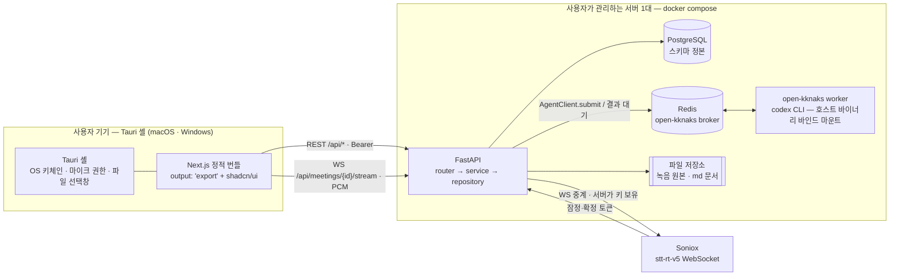
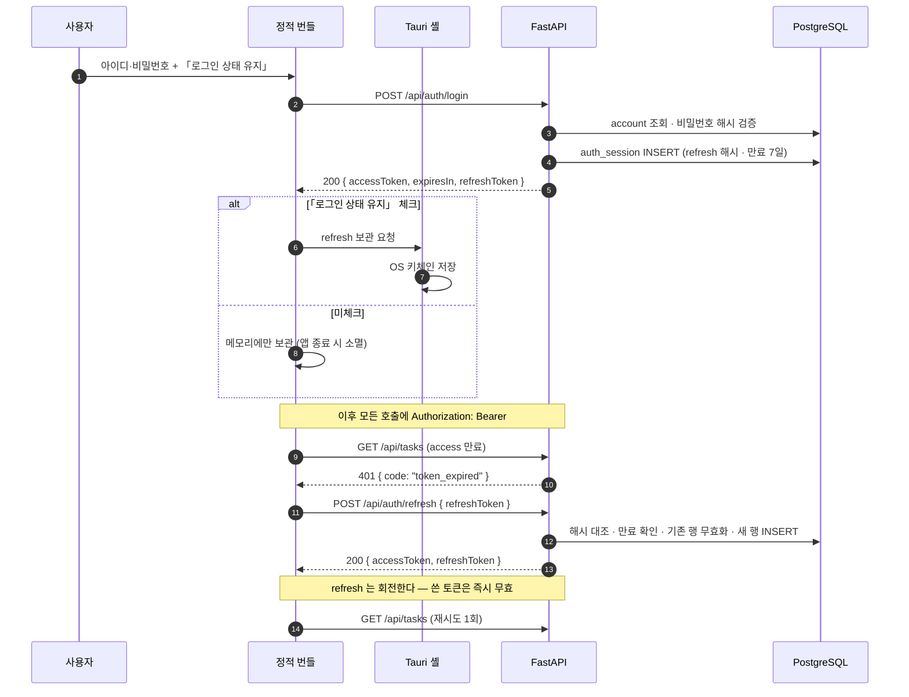
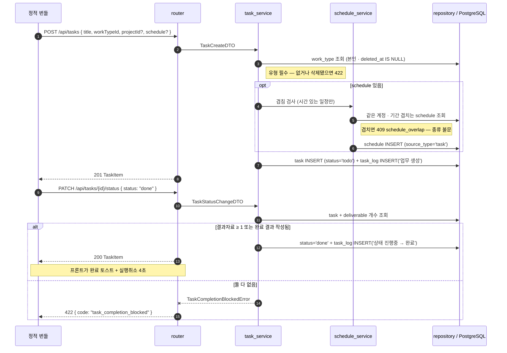
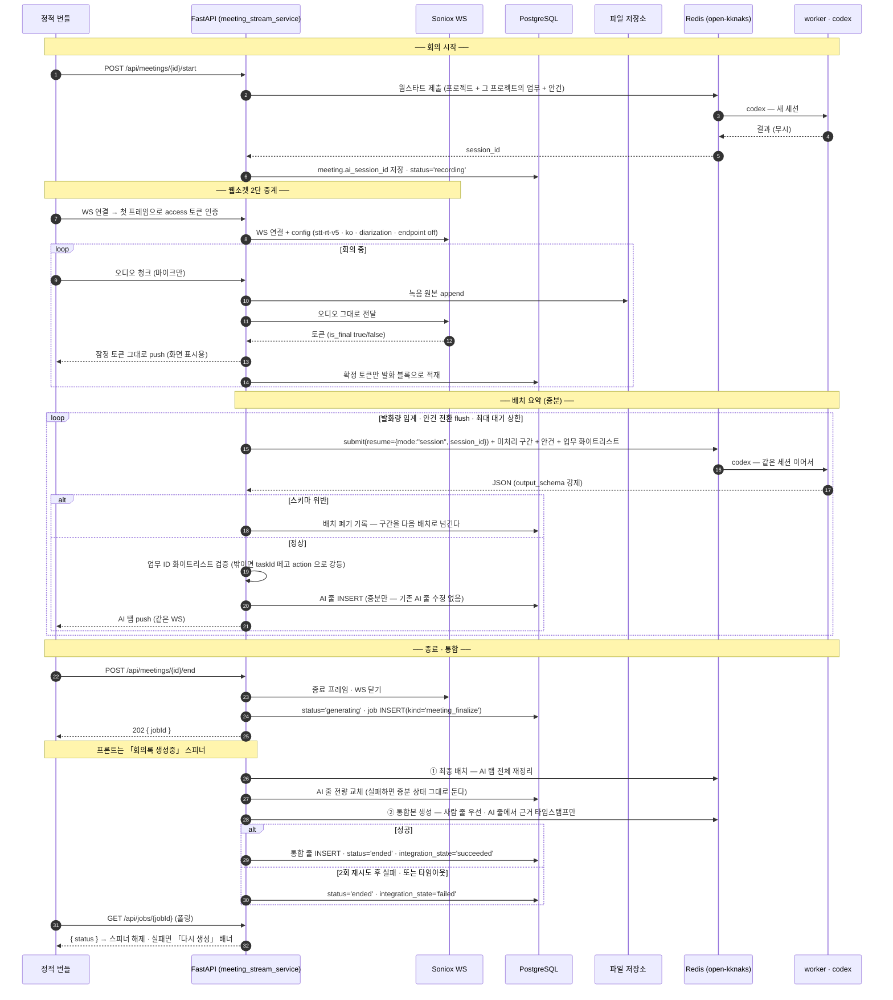

# System Architecture

규칙: `para/projects/project.md`

> task-management v1 의 시스템 구성요소, 외부 연동, 주요 요청 흐름. **여기 적힌 것은 「이렇게 한다」다** —
> spec·코드 워커가 이 문서를 계약으로 읽고, 리뷰어가 판정 기준으로 삼는다.
>
> 근거 표기: `DEC-00x §y` = `10-decision/`, `F-xx·P-xx·Q-xx` = `orchestration/work/docs-v1/docs-v1-design-report.md`,
> `§C` = `orchestration/work/docs-v1/design-requests.md`, `soniox` = `orchestration/work/docs-v1/soniox-study.md`.

관련 문서 — `../database/README.md`(스키마 정본) · `../backend/README.md`(계층·규약).

## Overview

**읽는 법 세 줄.**

1. 화살표가 `Web → API` 하나뿐이다 — **서버 렌더가 없다.** 정적 번들이라 데이터는 전부 클라이언트에서 REST/WS 로 온다(§C Q-28).
2. Soniox 로 가는 화살표는 **API 에서만** 나간다 — 프론트는 Soniox 주소도 키도 모른다(DEC-003 §STT).
3. LLM 으로 가는 화살표가 없다 — 있는 것은 `API → Redis → worker` 뿐이다. **back 은 codex 를 직접 실행하지도, LLM SDK 를 import 하지도 않는다.**

## 런타임 배치 — 백엔드는 서버 1대에 산다

| 결정 | 내용 | 근거 |
|---|---|---|
| 배치 | 백엔드 일체(FastAPI · PostgreSQL · Redis · open-kknaks worker · 파일 저장소)를 **사용자가 관리하는 서버 1대**에 docker compose 로 띄운다. 데스크톱 앱은 그 API 를 붙는 클라이언트다 | 아래 4가지 |
| 데스크톱 앱 | Tauri 셸 + 정적 번들만 배포한다. 앱 안에 DB·서버 런타임을 동봉하지 않는다 | 〃 |
| API 주소 | 앱 빌드 시 env 로 박는다(`NEXT_PUBLIC_API_BASE`). 앱 안에서 바꾸는 설정 화면은 v1 에 없다 | DEC-001 §1(설정 3항목에 서버 설정 없음) |

근거 넷.

1. **codex 를 기기마다 깔 수 없다.** AI 워커는 호스트에 설치된 codex 바이너리와 인증(`auth.json`)을 바인드 마운트해 쓴다(사용자 확정 제약). 사용자 기기마다 이 준비물을 요구하는 것은 데스크톱 앱의 배포 형태가 아니다.
2. **녹음 원본이 영구 보관이다**(DEC-003 §6). 기기 용량과 무관한 곳에 쌓여야 한다.
3. **DEC-003 §STT 가 「백엔드가 진짜 API 키 보유」를 못박았다.** 키를 두려면 사용자 기기가 아닌 곳이 필요하다.
4. **단일 사용자다**(DEC-001 §2 · F-1). 서버 1대로 충분하고, macOS·Windows 두 앱이 같은 서버를 본다.

> 비용으로 받는 것 — 서버가 꺼져 있으면 앱이 아무것도 못 한다. **오프라인 모드·로컬 캐시는 v1 범위 밖**이고, 연결 실패는 다른 실패와 같이 화면에 그대로 드러낸다(DEC-003 §7 원칙).

## Components

| Component | Responsibility | 하지 않는 것 |
|---|---|---|
| **Tauri 셸** | 앱 창·마이크 권한 획득·OS 파일 선택창·**refresh 토큰의 OS 키체인 보관**(§흐름 ①) | 데이터 저장·비즈니스 로직. 알림은 v2(DEC-003 §8) |
| **Next.js 정적 번들** | 전 화면 렌더·상태·입력 검증(1차)·REST/WS 호출. `output: 'export'` 로 구워 셸에 실린다 | 서버 컴포넌트 런타임 페칭·Route Handler·미들웨어(§C Q-28). Node 서버를 동봉하지 않는다 |
| **FastAPI** | 유일한 데이터 입구. 인증·도메인 규칙·트랜잭션·**Soniox 중계**·**AI 작업 제출과 결과 검증**·파일 적재 | LLM 직접 호출. codex 프로세스 직접 실행. 화면 렌더 |
| **PostgreSQL** | 스키마 정본. 모든 도메인 데이터 | 파일 본문(녹음·md)을 담지 않는다 — 경로만 든다 |
| **Redis** | open-kknaks 브로커. AI 작업 제출·결과 수령 채널 | 캐시·세션 저장소로 쓰지 않는다(v1 에 쓸 일이 없다) |
| **open-kknaks worker** | codex 실행 데몬. 큐에서 작업을 꺼내 codex CLI 를 돌리고 결과 JSON 을 돌려준다 | 우리 DB 를 모른다. 파일을 쓰지 않는다 |
| **파일 저장소** | 녹음 원본(영구 보관)·업로드 md 본문. 서버 로컬 볼륨 | DB 가 아는 것은 경로뿐 |

**worker 는 우리 코드가 아니다** — open-kknaks(PyPI) 를 그대로 띄운다. 우리가 정하는 것은 프롬프트·출력 스키마·세션 옵션뿐이다.

### codex 바인드 마운트 (사용자 확정 제약)

| 항목 | 결정 | 근거 |
|---|---|---|
| 바이너리 | 이미지에 굽지 않는다. **호스트의 codex 번들을 `ro` 마운트**하고 `PATH` 선두에 둔다 — open-kknaks 가 `which("codex")` 로만 찾는다 | 사용자 확정 · 이 레포 `app/back/Dockerfile.worker` 선례 |
| 인증 | `auth.json` **파일 하나만** `ro` 마운트. 세션 디렉토리를 통째로 내주지 않는다 | 〃 |
| 세션 영속 | `CODEX_HOME` 아래를 named volume 으로 잡는다 — **회의 한 건의 배치 세션이 워커 재시작을 넘겨 살아남는 조건**(DEC-003 §STT 「한 세션 유지」) | DEC-003 §STT |
| 버전 | back 의 `open-kknaks` 핀과 worker 이미지의 핀을 **같은 값으로 묶는다**. 한쪽만 올리면 broker payload 계약이 갈린다 | 이 레포 선례 |

## External Integrations

| System | Purpose | Direction | 규약 |
|---|---|---|---|
| **Soniox** `stt-rt-v5` | 실시간 받아쓰기 + 화자 분리 | Out (백엔드 → Soniox WS) | **프론트는 접속하지 않는다.** 백엔드가 long-lived 키를 들고 중계하며 원본을 적재한다. `language_hints:["ko"]` · `enable_speaker_diarization:true` · **endpoint detection 미사용**(조기 파이널라이즈가 화자 분리 정확도를 깎는다) | 
| **open-kknaks / codex** | 회의 배치 요약 · 종료 통합본 생성 | Out (back → Redis → worker) | `AgentClient.submit(provider="codex")`. **출력은 `output_schema` 로 강제**하고, 받은 JSON 은 우리가 다시 검증한다(§흐름 ③). **Anthropic·OpenAI SDK 를 직접 import 하지 않는다** |
| **OS 키체인** (Tauri) | refresh 토큰 보관 | Local | 「로그인 상태 유지」 체크 시에만 저장. 미체크면 메모리에만 둔다(§흐름 ①) |

> **soniox-study.md §「우리 적용 방향」의 direct stream 제안은 채택되지 않았다.** DEC-003 §STT 가 백엔드 중계로 확정했다 —
> 조사 문서의 그 절은 폐기된 제안으로 읽는다. 같은 문서의 **핵심 사실·유의사항은 그대로 유효**하다.

## Key Flows

### ① 로그인 · 세션 갱신

**전송 방식 결정 — 쿠키가 아니라 Bearer 토큰이다.**

| 결정 | 내용 | 근거 |
|---|---|---|
| access 토큰 | JWT **1시간**. 렌더러 **메모리에만** 둔다(디스크·localStorage 금지) | DEC-001 §4 |
| refresh 토큰 | **7일**. 「로그인 상태 유지」 **체크 시 Tauri 셸이 OS 키체인에 저장**, **미체크 시 메모리에만** 둔다 → 앱을 끄면 사라져 로그아웃 | DEC-001 §4 (기준은 브라우저 종료가 아니라 **앱 종료**) |
| 전송 | `Authorization: Bearer <access>` | 아래 |
| 서버 기록 | refresh 는 **해시로 DB 에 남고 1회용으로 회전**한다. 로그아웃은 그 행을 무효화한다 | DEC-001 §4 · §5 |

쿠키를 쓰지 않는 이유 둘. ① 정적 번들이 실린 웹뷰의 origin(`tauri://` 계열)과 API origin 이 다르다 — 쿠키를 붙이려면 `SameSite=None; Secure` 에 웹뷰별 3rd-party 쿠키 정책까지 걸린다. ② **「앱 종료 시 로그아웃」을 세션 쿠키의 수명에 맡기면 웹뷰 구현에 따라 갈린다.** 데스크톱 셸에는 OS 키체인이 있으니 보관 여부를 우리가 직접 정하는 편이 정책을 그대로 옮긴다.

받는 비용 — access 토큰이 XSS 로 새면 쿠키의 httpOnly 보호가 없다. 완화: **정적 번들에 외부 스크립트를 싣지 않고**(CDN 금지) 셸 CSP 로 외부 origin 을 막는다. 단일 사용자·로컬 앱이라 노출면이 웹사이트와 다르다.

규약 셋. **① 401 재시도는 요청당 한 번뿐이다** — 다시 401 이면 로그인 화면으로 보낸다(무한 갱신 루프 금지). **② refresh 는 회전한다** — 쓴 토큰은 즉시 무효, 재사용이 오면 그 계정의 전체 세션을 끊는다. **③ 로그인 실패는 횟수를 세지 않는다** — 잠김 정책이 없다(DEC-001 §4 「정책 없음(논외)」).

### ② 업무 생성 · 완료 (게이트 포함)

**완료 게이트는 서비스가 판정한다** — 리스트 상태 셀·상세 드롭다운·칸반 DnD 세 진입점이 전부 같은 엔드포인트를 지나므로, 판정이 한 곳에 있다(DEC-002 §4). 프론트가 먼저 막아도 서버 판정은 그대로 돈다.

전이 그래프(DEC-002 §4)도 서비스가 검사한다 — `시작전→진행중|완료|취소` · `진행중→완료|시작전|취소` · `완료→진행중` · `취소→시작전`, **완료→취소 불가**. 위반은 `409 invalid_status_transition`.
**「지연」은 전이가 아니다** — 저장하지 않고 조회 시 파생한다(종료일 경과 + 완료·취소 아님).

### ③ 회의 STT · 배치 요약 · 종료 통합

이 제품에서 기술 난도가 가장 높은 지점이다(BASE-003 §Why It Matters). **웹소켓 2단 중계**와 **배치 세션 유지**가 한 그림에 드러나야 한다.

**이 흐름의 불변식 일곱.**

| # | 불변식 | 근거 |
|---|---|---|
| 1 | 프론트는 Soniox 를 모른다. 오디오는 **반드시** 백엔드를 거친다 | DEC-003 §STT |
| 2 | 녹음 원본 적재는 중계와 같은 경로에서 일어난다 — 별도 업로드가 없다 | DEC-003 §3 |
| 3 | **확정 토큰만 DB 에 남는다.** 잠정 토큰은 화면으로만 흘려보낸다 | DEC-003 §3 |
| 4 | 회의 중 AI 는 **AI 트랙에만 쓴다.** 사람 트랙을 건드리지 않고 줄 제안도 하지 않는다 | DEC-003 §4 |
| 5 | 회의 중 배치는 **증분 추가만** — 기존 AI 줄을 고치지 않는다. 전체 재정리는 종료 후 최종 배치 한 번뿐 | DEC-003 §4 |
| 6 | codex 세션은 **회의 하나에 하나**다. 매 배치가 `resume` 으로 같은 세션을 이어 쓴다 | DEC-003 §STT |
| 7 | 통합본은 **사람 문장을 그대로 쓴다.** AI 에서 가져오는 것은 근거 타임스탬프와 AI 트랙에만 있는 내용뿐이다 | DEC-003 §4 |

**웹소켓은 이 하나뿐이다.** 회의 스트림 채널이 오디오 업·토큰 다운·AI 증분 push 를 겸한다. 종료하면 닫고, 그 뒤의 「생성중」은 **작업(job) 폴링**으로 본다(§ 비동기 API — `../backend/README.md`). 통지 경로를 둘로 두지 않는다 — 재연결·인증 표면이 하나로 준다.

**300분 초과는 다루지 않는다**(DEC-003 §4). Soniox 스트림 한도를 넘는 재연결·세션 경계 처리를 v1 에 넣지 않는다.

## 결정 요약 — 근거 색인

| # | 결정 | 근거 |
|---|---|---|
| SYS-1 | 백엔드는 사용자가 관리하는 서버 1대(compose). 앱은 클라이언트 | codex 바인드 마운트 제약 · DEC-003 §6·§STT |
| SYS-2 | 프론트는 정적 번들. 서버 렌더를 전제하지 않는다 | §C Q-28 |
| SYS-3 | 인증은 Bearer + OS 키체인. 쿠키를 쓰지 않는다 | DEC-001 §4 |
| SYS-4 | STT 는 백엔드 중계 1경로. 프론트 직결 없음 | DEC-003 §STT |
| SYS-5 | LLM 은 open-kknaks/codex 경유만. SDK 직접 import 금지 | 사용자 확정 제약 |
| SYS-6 | codex 는 이미지에 굽지 않고 호스트 바이너리·인증을 마운트 | 사용자 확정 제약 |
| SYS-7 | 웹소켓은 회의 스트림 하나. 장시간 작업 통지는 job 폴링 | DEC-003 §4 · 단일 통지 경로 원칙 |
| SYS-8 | 오프라인·로컬 캐시 없음. 연결 실패는 가리지 않는다 | DEC-003 §7 |

## Open Questions

| ID | Question | Owner | Next |
|---|---|---|---|
| ~~SYS-OQ-1~~ | ~~마이크 캡처 경로~~ → **해소: 웹 `getUserMedia` 로 간다**(2026-09-05). 웹 우선 개발이고 사내 제품에서 검증된 경로다. Tauri 웹뷰에서의 동작 확인은 **래핑 시점**으로 미룬다(DEC-003 OQ-3) | — | 래핑 단계 |
| ~~SYS-OQ-2~~ | ~~Windows 지원 시점~~ → **해소: v1 에 macOS·Windows 둘 다 포함**(2026-09-05). 웹 우선 개발이라 갈리는 것은 래핑 이후의 셸 층뿐이다 | — | 닫힘 |
| ~~SYS-OQ-3~~ | ~~오디오 전송 포맷~~ → **해소: Soniox 가 지원하는 형식 중에서 고른다**(2026-09-05). Tauri 래핑 후의 캡처 경로까지 고려해 **구현 시점에 확정**하고, 정책·아키텍처는 특정 포맷에 묶이지 않는다 | — | 구현 시 |
