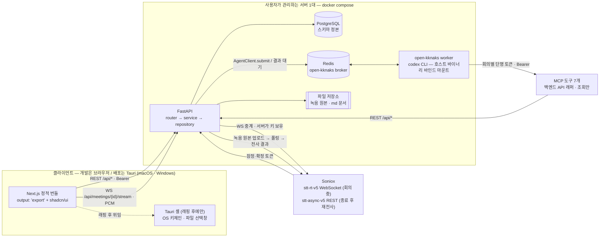
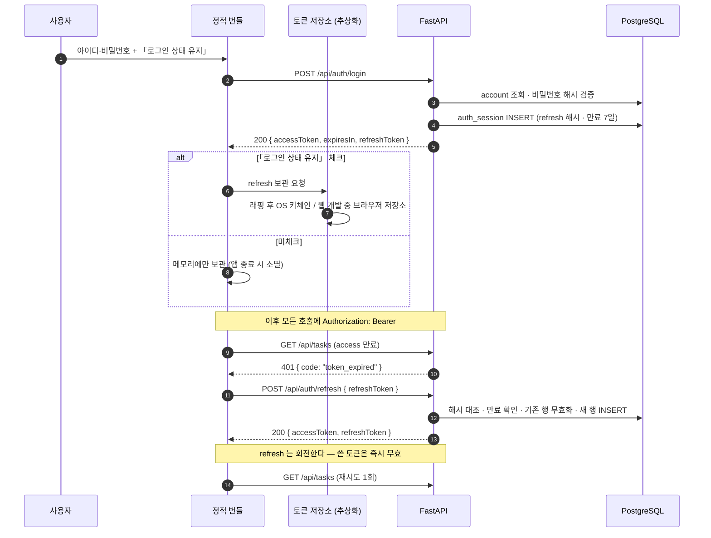
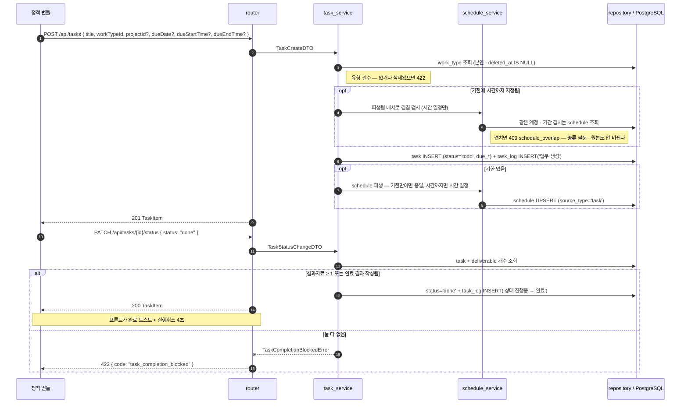
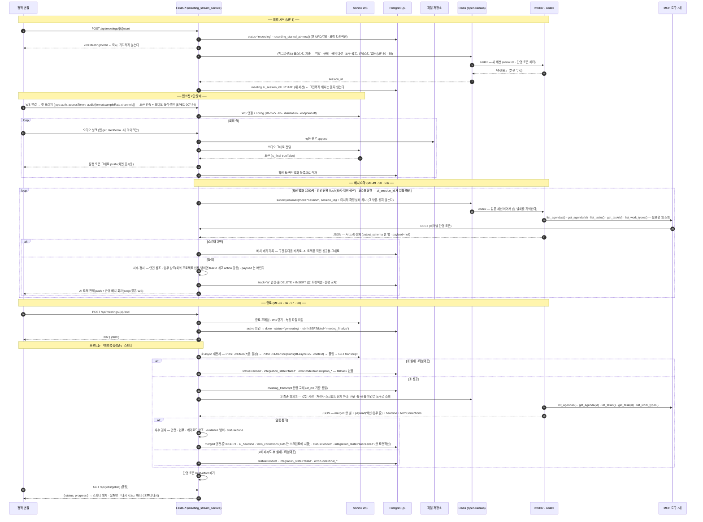

# System Architecture

규칙: `para/projects/project.md`

> task-management v1 의 시스템 구성요소, 외부 연동, 주요 요청 흐름. **여기 적힌 것은 「이렇게 한다」다** —
> spec·코드 워커가 이 문서를 계약으로 읽고, 리뷰어가 판정 기준으로 삼는다.
>
> 근거 표기: `DEC-00x §y` = `10-decision/`, `F-xx·P-xx·Q-xx` = `orchestration/work/docs-v1/docs-v1-design-report.md`,
> `§C` = `orchestration/work/docs-v1/design-requests.md`, `soniox` = `orchestration/work/docs-v1/soniox-study.md`,
> **`MF-n` = `reference/2026-09-06-task-management-app/Meeting flow.md` §0(2026-09-07 결정 31건).**
>
> **2026-09-07 개정(MF).** 흐름 ③ 이 바뀌었다 — `/start` 즉시 응답 + 웜스타트 큐(MF-1) · AI 는 MCP 도구 7개로 읽는다(MF-2 · 50) ·
> 배치는 AI 트랙 전체를 낸다(MF-53) · 종료는 **async 재전사 → 최종 회의록 호출 한 번**(MF-37 · 56). 종료 시 배치·통합 호출이 없다.

관련 문서 — `../database/README.md`(스키마 정본) · `../backend/README.md`(계층·규약).

## Overview

> **처음부터 Tauri 앱으로 개발한다**(§C-4, 2026-09-05 번복). 백엔드는 로컬에서 띄우고 프론트는 `tauri dev` 앱 창에서 돈다 —
> `tauri dev` 는 프론트 HMR 이 웹과 같고 Rust 재컴파일도 없어 개발 루프 비용이 사실상 같다(초기 Rust 컴파일 1회).
> 마지막에 래핑하면 마이크·키체인·origin/CORS 가 한꺼번에 터지는데, 그 셋이 Bearer+키체인을 고른 근거이기도 하다.
> 아래 그림의 `Tauri 셸` 은 **개발 첫날부터 있는 층**이고, 기능마다 실제 셸에서 E2E 로 검증한다.



**읽는 법 네 줄.**

1. 화살표가 `Web → API` 하나뿐이다 — **서버 렌더가 없다.** 정적 번들이라 데이터는 전부 클라이언트에서 REST/WS 로 온다(§C Q-28).
2. Soniox 로 가는 화살표는 **API 에서만** 나간다 — 프론트는 Soniox 주소도 키도 모른다(DEC-003 §STT). 회의 중은 WS 중계, 종료 후는 **녹음 원본을 다시 전사**한다(MF-37).
3. LLM 으로 가는 화살표가 없다 — 있는 것은 `API → Redis → worker` 뿐이다. **back 은 codex 를 직접 실행하지도, LLM SDK 를 import 하지도 않는다.**
4. **worker 가 우리 데이터를 읽는 길은 MCP 도구 7개뿐**이고, 그 도구는 **우리 REST API 의 얇은 래퍼**다(MF-2). DB 직결이 아니다. 권한 판정은 API 가 한다 — 도구는 회의별 단명 토큰(MF-4)으로 그 회의·그 계정 범위만 본다. 배치 위치(FastAPI 안 / 별도 프로세스)는 DEC-003 OQ-9.

## 런타임 배치 — 백엔드는 서버 1대에 산다

| 결정 | 내용 | 근거 |
|---|---|---|
| 배치 | 백엔드 일체(FastAPI · PostgreSQL · Redis · open-kknaks worker · 파일 저장소)를 **사용자가 관리하는 서버 1대**에 docker compose 로 띄운다. 클라이언트는 그 API 를 붙는다 | 아래 4가지 |
| **개발 순서** | **처음부터 Tauri 포함.** 백엔드 로컬 + 프론트 `tauri dev` 앱 창. 기능 하나를 만들고 **실제 셸에서 E2E 검증한 뒤** 다음으로 넘어간다 | **§C-4 (2026-09-05 번복)** |
| 데스크톱 앱 | 래핑 단계에서 Tauri 셸 + 정적 번들만 배포한다. 앱 안에 DB·서버 런타임을 동봉하지 않는다 | 〃 |
| **타깃** | **v1 에 macOS · Windows 둘 다.** 주 개발기(macOS)에서 상시 검증되고, Windows 는 별도 확인 시점을 잡는다 | **§C-6 (2026-09-05)** |
| API 주소 | 빌드 시 env 로 박는다(`NEXT_PUBLIC_API_BASE`). 앱 안에서 바꾸는 설정 화면은 v1 에 없다 | DEC-001 §1(설정 3항목에 서버 설정 없음) |

근거 넷.

1. **codex 를 기기마다 깔 수 없다.** AI 워커는 호스트에 설치된 codex 바이너리와 인증(`auth.json`)을 바인드 마운트해 쓴다(사용자 확정 제약). 사용자 기기마다 이 준비물을 요구하는 것은 데스크톱 앱의 배포 형태가 아니다.
2. **녹음 원본이 영구 보관이다**(DEC-003 §6). 기기 용량과 무관한 곳에 쌓여야 한다.
3. **DEC-003 §STT 가 「백엔드가 진짜 API 키 보유」를 못박았다.** 키를 두려면 사용자 기기가 아닌 곳이 필요하다.
4. **단일 사용자다**(DEC-001 §2 · F-1). 서버 1대로 충분하고, macOS·Windows 두 앱이 같은 서버를 본다.

> 비용으로 받는 것 — 서버가 꺼져 있으면 앱이 아무것도 못 한다. **오프라인 모드·로컬 캐시는 v1 범위 밖**이고, 연결 실패는 다른 실패와 같이 화면에 그대로 드러낸다(DEC-003 §7 원칙).

## Components

| Component | Responsibility | 하지 않는 것 |
|---|---|---|
| **Next.js 정적 번들** | 전 화면 렌더·상태·입력 검증(1차)·REST/WS 호출·**마이크 캡처(`getUserMedia`)**. `output: 'export'` 로 굽는다 — 브라우저에서 그대로 돌고, 래핑하면 같은 산출물이 셸에 실린다 | 서버 컴포넌트 런타임 페칭·Route Handler·미들웨어(§C Q-28). Node 서버를 동봉하지 않는다 |
| **Tauri 셸** (래핑 후) | 앱 창·OS 파일 선택창·마이크 **권한**·**refresh 토큰의 OS 키체인 보관**(§흐름 ①) | 데이터 저장·비즈니스 로직·**마이크 캡처 자체**(웹 `getUserMedia` 가 한다 — §C-7). 알림은 v2(DEC-003 §8) |
| **FastAPI** | 유일한 데이터 입구. 인증·도메인 규칙·트랜잭션·**Soniox 중계**·**AI 작업 제출과 결과 검증**·파일 적재 | LLM 직접 호출. codex 프로세스 직접 실행. 화면 렌더 |
| **PostgreSQL** | 스키마 정본. 모든 도메인 데이터 | 파일 본문(녹음·md)을 담지 않는다 — 경로만 든다 |
| **Redis** | open-kknaks 브로커. AI 작업 제출·결과 수령 채널 | 캐시·세션 저장소로 쓰지 않는다(v1 에 쓸 일이 없다) |
| **open-kknaks worker** | codex 실행 데몬. 큐에서 작업을 꺼내 codex CLI 를 돌리고 결과 JSON 을 돌려준다. **codex 가 쓸 수 있는 것은 설정 allow list 가 정한다**(MF-3 — 아래 §codex 설정) | 우리 DB 를 모른다. 파일을 쓰지 않는다. 셸·웹 검색·이미지·내장 앱을 쓰지 않는다 |
| **MCP 도구 7개** | codex 가 회의 데이터를 읽는 유일한 길 — `get_meeting` · `get_account` · `list_agendas`(사람 + AI 안건) · `get_agenda` · `list_tasks` · `get_task` · `list_work_types`(이름 · 종류 · 설명). **전부 조회.** 우리 REST API 를 회의별 단명 토큰으로 부르는 래퍼다(MF-2 · 4) | 쓰기. 권한 판정(API 가 한다). DB 접근 |
| **파일 저장소** | 녹음 원본(영구 보관 — **종료 후 재전사·「다시 시도」의 입력**)·업로드 md 본문. 서버 로컬 볼륨 | DB 가 아는 것은 경로뿐 |

**worker 는 우리 코드가 아니다** — open-kknaks(PyPI) 를 그대로 띄운다. 우리가 정하는 것은 프롬프트·출력 스키마·세션 옵션뿐이다.

### codex 바인드 마운트 (사용자 확정 제약)

| 항목 | 결정 | 근거 |
|---|---|---|
| 바이너리 | 이미지에 굽지 않는다. **호스트의 codex 번들을 `ro` 마운트**하고 `PATH` 선두에 둔다 — open-kknaks 가 `which("codex")` 로만 찾는다 | 사용자 확정 · 이 레포 `app/back/Dockerfile.worker` 선례 |
| 인증 | `auth.json` **파일 하나만** `ro` 마운트. 세션 디렉토리를 통째로 내주지 않는다 | 〃 |
| 세션 영속 | `CODEX_HOME` 아래를 named volume 으로 잡는다 — **회의 한 건의 배치 세션이 워커 재시작을 넘겨 살아남는 조건**(DEC-003 §STT 「한 세션 유지」) | DEC-003 §STT |
| 버전 | back 의 `open-kknaks` 핀과 worker 이미지의 핀을 **같은 값으로 묶는다**. 한쪽만 올리면 broker payload 계약이 갈린다 | 이 레포 선례 |

### codex 설정 — allow list 로 잠근다 (MF-3 · 2026-09-07, codex 0.147.0 실측)

**프롬프트에도 적지만 실제 차단은 설정이 한다.** 실행 옵션 빌더(`../backend/README.md` §5-2)가 매 제출에 아래를 함께 만든다.

```text
features.shell_tool=false            셸
web_search="disabled"                웹 검색
features.image_generation=false      이미지
features.apps=false                  ← 안 걸면 mcp__codex_apps__ 27종이 붙는다 (mediness 실측)
sandbox="read-only"                  파일 접근
mcp_servers.<key>.enabled_tools=[…]  우리 도구 7개만 — **allow list.** 빈 배열이면 하나도 안 열린다(fail-closed)
mcp_servers.<key>.tools.<툴>.approval_mode="approve"   ← **툴별로.** 서버 기본으로 걸면 새 툴이 자동 면제된다
mcp_servers.<key>.http_headers={Authorization="Bearer <회의별 단명 토큰>"}   ← MF-4
```

| 사실 | 뜻 |
|---|---|
| **deny list 는 없다 — allow list 뿐이다** | 모르는 키(`disabled_tools` 등)를 넣어도 codex 가 **조용히 통과**시킨다. 안 터졌다고 지원하는 것이 아니다. 우리 도구 쪽은 목록에 없으면 안 열리니 **안전**하고, 위험은 codex **내장** 쪽뿐이다 — 끄는 스위치가 없는 내장 도구가 새로 생기면 못 막는다 → **codex 를 올릴 때마다 새로 붙은 내장 도구를 확인**한다 |
| `enabled_tools` 는 **서버 id 접두를 안 붙인다** | `mediness.foo` ✗ / `foo` ○. 틀리면 에러가 아니라 **조용히 「툴 0개」** |
| `approval_policy="never"` 는 「안 묻고 **실패 처리**」다 | 이것만 걸면 MCP 툴 호출이 «user cancelled» 로 죽는다. 허용은 별개 축 — 툴별 `approval_mode="approve"` |
| `reasoning_effort` 하한은 `low` | `none` 은 툴을 고르는 판단 자체를 죽여 에이전트가 툴을 안 부르고 답을 지어낸다 |

**권한 경계는 백엔드가 진다.** MCP 는 API 의 얇은 래퍼이고 두 번째 게이트가 아니다. 사용자 세션 JWT 를 그대로 주지 않고 **회의(turn)마다 본인 계정으로 단명 토큰을 새로 발급**해 헤더로 주며, 회의가 끝나면 best-effort 로 폐기한다 — 실패는 자연 만료로 흡수(MF-4 · mediness landing-chat 방식). `--bearer-token-env-var` · OAuth · 설정 파일은 쓰지 않는다. 토큰 인프라는 DEC-003 OQ-9.

## External Integrations

| System | Purpose | Direction | 규약 |
|---|---|---|---|
| **Soniox** `stt-rt-v5` | 실시간 받아쓰기 + 화자 분리(회의 중) | Out (백엔드 → Soniox WS) | **프론트는 접속하지 않는다.** 백엔드가 long-lived 키를 들고 중계하며 원본을 적재한다. `language_hints:["ko"]` · `enable_speaker_diarization:true` · **endpoint detection 미사용**(조기 파이널라이즈가 화자 분리 정확도를 깎는다). **오디오 포맷은 Soniox 지원 형식 중 구현 시점에 고른다 — 아키텍처를 특정 포맷에 묶지 않는다**(§C-8). $0.12/시간 |
| **Soniox** `stt-async-v5` | **종료 후 재전사** — 녹음 원본 전체를 다시 전사해 화자 분리를 바로잡는다(MF-37). 실시간은 저지연 제약으로 화자 오귀속이 많고, async 는 전체 오디오 컨텍스트를 본다(Soniox 문서) | Out (백엔드 → Soniox REST) | `POST /v1/files → POST /v1/transcriptions → 폴링 → GET …/transcript`. `Authorization: Bearer` 같은 키. `language_hints:["ko"]` · `enable_speaker_diarization` · **`context`**(MF-54 ① — `general`: 회의 제목·프로젝트·화자 수 / `text`: 직전 회의 요약 / `terms`: DEC-003 OQ-10. 상한 8000 토큰). **$0.10/시간 · 화자 분리 추가 요금 없음.** 파일 상한 300분 · Soniox 보관 30일(우리 원본은 영구). 결과 토큰은 **sub-word 단위**라 화자·시간으로 블록을 묶는다. **처리 시간에 공식 수치가 없다 — 즉시로 설계하지 않는다.** ⚠ **확인 필요**: 우리 녹음은 흘려 써서 duration 헤더가 비어 있다 — 헤더 없는 webm 을 받는지 문서에 없다(실물 확인 항목) |
| **open-kknaks / codex** | 회의 중 배치 요약 · **종료 후 최종 회의록 한 번** | Out (back → Redis → worker) | `AgentClient.submit(provider="codex")`. **출력은 `output_schema` 로 강제**하고(**파일 하나** — 배치·최종이 같은 스키마, MF-52), 받은 JSON 은 우리가 다시 검증한다(§흐름 ③). **입력은 발화만**(MF-50) — 나머지는 MCP 도구로 읽는다. **Anthropic·OpenAI SDK 를 직접 import 하지 않는다** |
| **MCP 도구 7개** | codex 가 우리 데이터를 읽는 길 | In (worker → API) | 위 §codex 설정. **조회만.** 배치 위치·토큰 인프라는 DEC-003 OQ-9 |
| **토큰 저장소** | refresh 토큰 보관 | Local | 「로그인 상태 유지」 체크 시에만 저장, 미체크면 메모리에만 둔다(§흐름 ①). **래핑 후에는 OS 키체인, 웹 개발 중에는 브라우저 저장소로 임시 대체**한다 — 프론트가 **저장소 추상화 한 곳**에서만 다뤄 교체가 파일 하나로 끝나게 한다(§C-5) |

> **soniox-study.md §「우리 적용 방향」의 direct stream 제안은 채택되지 않았다.** DEC-003 §STT 가 백엔드 중계로 확정했다 —
> 조사 문서의 그 절은 폐기된 제안으로 읽는다. 같은 문서의 **핵심 사실·유의사항은 그대로 유효**하다.

## Key Flows

### ① 로그인 · 세션 갱신

**전송 방식 결정 — 쿠키가 아니라 Bearer 토큰이다.**

| 결정 | 내용 | 근거 |
|---|---|---|
| access 토큰 | JWT **1시간**. 렌더러 **메모리에만** 둔다(디스크·localStorage 금지) | DEC-001 §4 |
| refresh 토큰 | **7일**. 「로그인 상태 유지」 **체크 시 저장소에 보관**, **미체크 시 메모리에만** 둔다 → 앱을 끄면 사라져 로그아웃 | DEC-001 §4 (기준은 브라우저 종료가 아니라 **앱 종료**) |
| **저장소** | **한 곳(토큰 저장소 추상화)에서만 다룬다.** 래핑 후에는 OS 키체인, **웹 개발 중에는 브라우저 저장소로 임시 대체** — 교체가 **파일 하나**로 끝나야 한다 | **§C-5 (2026-09-05)** |
| 전송 | `Authorization: Bearer <access>` | 아래 |
| 서버 기록 | refresh 는 **해시로 DB 에 남고 1회용으로 회전**한다. 로그아웃은 그 행을 무효화한다 | DEC-001 §4 · §5 |

쿠키를 쓰지 않는 이유 둘. ① 정적 번들이 실린 웹뷰의 origin(`tauri://` 계열)과 API origin 이 다르다 — 쿠키를 붙이려면 `SameSite=None; Secure` 에 웹뷰별 3rd-party 쿠키 정책까지 걸린다. ② **「앱 종료 시 로그아웃」을 세션 쿠키의 수명에 맡기면 웹뷰 구현에 따라 갈린다.** 보관 여부를 우리가 직접 정하는 편이 정책을 그대로 옮긴다. (DEC-001 §4 개정 · §C-5)

받는 비용 — access 토큰이 XSS 로 새면 쿠키의 httpOnly 보호가 없다. 완화: **번들에 외부 스크립트를 싣지 않고**(CDN 금지) CSP 로 외부 origin 을 막는다. 단일 사용자 앱이라 노출면이 공개 웹사이트와 다르다.



규약 셋. **① 401 재시도는 요청당 한 번뿐이다** — 다시 401 이면 로그인 화면으로 보낸다(무한 갱신 루프 금지). **② refresh 는 회전한다** — 쓴 토큰은 즉시 무효, 재사용이 오면 그 계정의 전체 세션을 끊는다. **③ 로그인 실패는 횟수를 세지 않는다** — 잠김 정책이 없다(DEC-001 §4 「정책 없음(논외)」).

### ② 업무 생성 · 완료 (게이트 포함)



**완료 게이트는 서비스가 판정한다** — 리스트 상태 셀·상세 드롭다운·칸반 DnD 세 진입점이 전부 같은 엔드포인트를 지나므로, 판정이 한 곳에 있다(DEC-002 §4). 프론트가 먼저 막아도 서버 판정은 그대로 돈다.

전이 그래프(DEC-002 §4)도 서비스가 검사한다 — `시작전→진행중|완료|취소` · `진행중→완료|시작전|취소` · `완료→진행중` · `취소→시작전`, **완료→취소 불가**. 위반은 `409 invalid_status_transition`.
**「지연」은 전이가 아니다** — 저장하지 않고 조회 시 파생한다(기한 경과 + 완료·취소 아님).

**기한은 업무가 소유한다**(DEC-005 §3, 2026-09-05 개정). `schedule` 은 그 파생이고 **쓰기 API 가 없다** — 캘린더 드래그도 `PATCH /api/tasks/{id}` 로 들어와 같은 이 경로를 지난다. 겹침 검사는 원본을 쓰기 **전에** 파생될 배치로 돈다.

### ③ 회의 STT · 배치 요약 · 종료(재전사 → 최종 회의록)

이 제품에서 기술 난도가 가장 높은 지점이다(BASE-003 §Why It Matters). **웹소켓 2단 중계**와 **배치 세션 유지**가 한 그림에 드러나야 한다.



**이 흐름의 불변식 열둘.**

| # | 불변식 | 근거 |
|---|---|---|
| 1 | 프론트는 Soniox 를 모른다. 오디오는 **반드시** 백엔드를 거친다 | DEC-003 §STT |
| 2 | 녹음 원본 적재는 중계와 같은 경로에서 일어난다 — 별도 업로드가 없다. **그 원본이 종료 후 재전사의 입력**이다 | DEC-003 §3 · MF-37 |
| 3 | **확정 토큰만 DB 에 남는다.** 잠정 토큰은 화면으로만 흘려보낸다. **종료 후 재전사 결과가 실시간 블록을 전량 교체한다** — `at_ms` 기준이 같아 근거 칩은 시각(ms)으로 매칭한다 | DEC-003 §3 · MF-37 |
| 4 | 회의 중 AI 는 **AI 트랙에만 쓴다.** 사람 트랙을 고치지도 제안하지도 않는다 — **사람 안건·줄은 배치 입력에 싣지 않고 AI 가 MCP 도구로 조회한다**(2026-09-07 · `../database/domains/meeting.md` M-6) | DEC-003 §4 · MF-50 · MF-51 |
| 5 | 회의 중 배치는 **매번 AI 트랙 전체를 낸다.** 서버는 검증 통과분으로 **전량 교체**한다 — 앞 배치의 잘못을 다음 배치가 고친다. 세션이 앞 발화를 기억하므로 넘기는 것은 이번 구간뿐이다 | MF-53 |
| 6 | codex 세션은 **회의 하나에 하나**다. 매 배치와 최종 호출이 `resume` 으로 같은 세션을 이어 쓴다. **`/start` 는 세션을 기다리지 않는다** — 세션이 없는 동안 배치는 돌지 않는다 | DEC-003 §STT · MF-1 |
| 7 | 최종 회의록은 **AI 가 한 번에 쓴다** — 사람이 적은 줄도 다듬는다. 「사람 문장 그대로 복사」 규칙은 없다. 최종이 끝나면 AI 정리본 = 회의록 | MF-56 · MF-57 |
| 8 | **AI 안건도 AI 트랙에만 있다** — 회의 중 사람 회의록 탭에 보이지 않고, 종료 후 최종 회의록에서 합쳐진다(AI 가 `list_agendas()` 로 둘 다 본다) | DEC-003 §4 · MF-51 |
| 9 | **AI 증분은 즉시 나간다** — 버퍼링하지 않고, **반영된 배치 회차**를 함께 실어 화면이 「배치 2회 → 3회」를 그린다. 「종결」은 없다 | DEC-003 §4 · MF-56 |
| 10 | 마이크는 **웹 `getUserMedia`** 다. Tauri 웹뷰 확인은 래핑 시점 | §C-7 (2026-09-05) |
| 11 | **재전사 실패에 fallback 이 없다.** 실시간 결과로 최종 회의록을 만들지 않는다 — 「다시 시도」 하나 | MF-58 |
| 12 | **출력 스키마는 한 벌**이다. 회의 중과 최종이 같은 파일을 쓰고 `payload` · `headline` · `termCorrections` 만 nullable — 회의 중에 실려 오면 서버가 버린다 | MF-52 |

**웹소켓은 이 하나뿐이다.** 회의 스트림 채널이 오디오 업·토큰 다운·AI 증분 push 를 겸한다. 종료하면 닫고, 그 뒤의 「생성중」은 **작업(job) 폴링**으로 본다(§ 비동기 API — `../backend/README.md`). 통지 경로를 둘로 두지 않는다 — 재연결·인증 표면이 하나로 준다.

**300분 초과는 다루지 않는다**(DEC-003 §4). Soniox 스트림 한도를 넘는 재연결·세션 경계 처리를 v1 에 넣지 않는다.
같은 결로 **WS 끊김에 자동 재연결을 넣지 않는다** — 설계한 실패 목록에 없다(DEC-003 §7). 끊기면 녹음을 멈춘 상태로 바꾸고 화면에 드러낸다.

## 결정 요약 — 근거 색인

| # | 결정 | 근거 |
|---|---|---|
| SYS-1 | 백엔드는 사용자가 관리하는 서버 1대(compose). 앱은 클라이언트 | codex 바인드 마운트 제약 · DEC-003 §6·§STT |
| SYS-2 | 프론트는 정적 번들. 서버 렌더를 전제하지 않는다 | §C Q-28 |
| SYS-3 | 인증은 Bearer + **토큰 저장소 추상화**(래핑 후 OS 키체인 / 웹 개발 중 브라우저 저장소). 쿠키를 쓰지 않는다 | DEC-001 §4 · §C-5 |
| SYS-4 | STT 는 백엔드 중계 1경로. 프론트 직결 없음 | DEC-003 §STT |
| SYS-5 | LLM 은 open-kknaks/codex 경유만. SDK 직접 import 금지 | 사용자 확정 제약 |
| SYS-6 | codex 는 이미지에 굽지 않고 호스트 바이너리·인증을 마운트 | 사용자 확정 제약 |
| SYS-7 | 웹소켓은 회의 스트림 하나. 장시간 작업 통지는 job 폴링 | DEC-003 §4 · 단일 통지 경로 원칙 |
| SYS-8 | 오프라인·로컬 캐시 없음. 연결 실패는 가리지 않는다 | DEC-003 §7 |
| SYS-9 | **처음부터 Tauri 앱으로 개발**(백 로컬 + `tauri dev`). 셸에 위임하는 것은 키체인·파일 선택창·마이크 권한뿐 | §C-4 (2026-09-05 번복) |
| SYS-10 | **v1 타깃은 macOS · Windows 둘 다.** 갈리는 것은 래핑 이후의 셸 층뿐 | §C-6 |
| SYS-11 | **`schedule` 은 파생.** 시간의 원본은 업무 기한·회의 일시이고, 캘린더 드래그도 원본을 고친다 | DEC-005 §3 (2026-09-05 개정) |
| SYS-12 | **AI 는 MCP 도구 7개(REST 래퍼)로만 읽는다.** codex 능력은 설정 allow list 로 잠그고, 회의별 단명 토큰으로 범위를 좁힌다. 권한 판정은 API | MF-2 · 3 · 4 (2026-09-07) |
| SYS-13 | **종료 = async 재전사 → 최종 회의록 호출 한 번.** 종료 시 배치·통합 호출 없음. 재전사 실패에 fallback 없음 | MF-37 · 56 · 57 · 58 |
| SYS-14 | **`/start` 는 즉시 응답.** 웜스타트는 큐 — 워커가 죽어 있어도 회의는 시작된다 | MF-1 |

## Open Questions

| ID | Question | Owner | Next |
|---|---|---|---|
| ~~SYS-OQ-1~~ | ~~마이크 캡처 경로~~ → **해소: 웹 `getUserMedia`**(2026-09-05). 사내 제품에서 검증된 경로이고, **개발을 앱 창에서 하므로 회의록 구현 때 Tauri 웹뷰에서 실물로 확인된다** — 별도 스파이크 없음 | — | 닫힘 |
| ~~SYS-OQ-2~~ | ~~Windows 지원 시점~~ → **해소: v1 에 macOS·Windows 둘 다 포함**(2026-09-05). macOS 는 개발 내내 상시 검증되고 Windows 는 별도 확인 시점을 잡는다 | — | 닫힘 |
| ~~SYS-OQ-3~~ | ~~오디오 전송 포맷~~ → **해소: Soniox 가 지원하는 형식 중에서 고른다**(2026-09-05). Tauri 래핑 후의 캡처 경로까지 고려해 **구현 시점에 확정**하고, 정책·아키텍처는 특정 포맷에 묶이지 않는다 | — | 구현 시 |
| SYS-OQ-4 | **MCP 서버 배치·단명 토큰 인프라** — DEC-003 OQ-9 와 같은 항목. 찾은 곳 `Meeting flow.md` §1-5 ①·② | 사용자 | MCP work 전 |
| SYS-OQ-5 | **헤더 없는 webm 을 `stt-async-v5` 가 받나** — 실물 확인 항목(파일 하나 넣어 보면 끝난다, $0.10). 처리 시간·개선폭도 같이 나온다. 찾은 곳 `Meeting flow.md` §3-2 MF-37 ⚠ · Soniox 문서(지원 목록에 webm 은 있으나 헤더 조건은 없다) | 코디(실물) | SPEC-008 work 전 |
