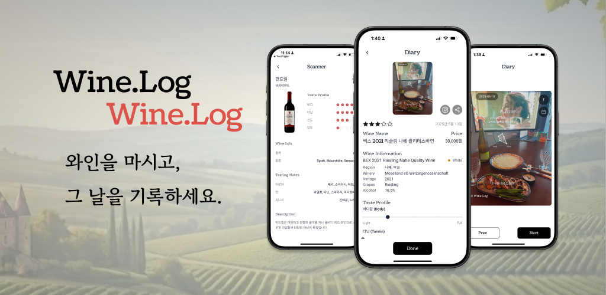
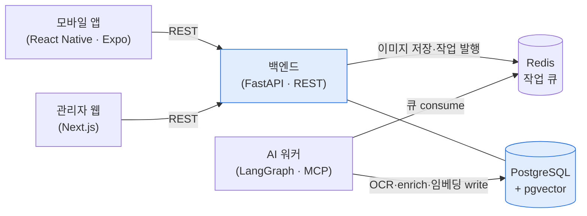

# 개요

Wine Log 는 마신 와인을 기록하고 다음에 마실 와인을 찾는 모바일 앱이다. 와인 이름과 정보는 라벨에만 적혀 있고, 어떤 맛이었는지는 기억에만 남고, 다음에 뭘 마실지는 매번 검색해야 했다. 라벨을 카메라로 찍으면 와인 정보가 채워지고, 시음 기록이 쌓이면 그게 취향이 되고, 그 취향으로 다음 와인을 추천받는다 — 이 흐름을 앱 하나에 모았다.

모바일 앱에서 시작해, 와인 정보를 채우고 추천하는 AI 서버와, 와인·문의·통계를 다루는 관리자 웹까지 붙였다. 네 컴포넌트를 한 레포에 두고 데이터 모델과 배포를 공유한다.

> 컴포넌트 4 — 모바일 앱 · 관리자 웹 · 백엔드 · AI 서버

# 주요기능

## 기록한다

| 구분 | 내용 |
|---|---|
| **기능** | 라벨을 찍어 와인을 등록하고 시음 기록을 남긴다 |
| **목적** | 라벨에만 있던 와인 정보와 기억에만 남던 맛을 한곳에 붙잡는다 |
| **효과** | 마신 와인이 기록으로 쌓여 다시 찾을 수 있다 |

- **라벨 촬영** — 카메라로 라벨을 찍거나 갤러리에서 고르면 AI 분석이 돌아 와인 정보가 채워진다. 이름을 몰라도 등록된다
- **시음 다이어리** — 바디·타닌·산도·당도·알콜을 눈금으로 남기고, 아로마·맛·피니쉬를 태그로 붙인다. 한 병의 기록이 뒤에 취향 추천의 재료가 된다

## 발견한다

| 구분 | 내용 |
|---|---|
| **기능** | 취향에 맞는 와인을 추천하고 둘러본다 |
| **목적** | 다음에 뭘 마실지 매번 검색하던 것을 취향 기반 추천으로 바꾼다 |
| **효과** | 기록이 쌓일수록 추천이 내 쪽으로 맞아 온다 |

- **홈 피드** — 추천 와인과 최근 시음 기록을 한 화면에 모아 연다
- **발견** — 와인을 검색하고 둘러본다. 와인 상세에서는 그 와인의 정보와 다른 사람들의 시음 기록을 함께 본다
- **취향 추천** — 내 시음 기록에서 만들어진 취향과 와인을 벡터로 비교해, 태그가 아니라 결이 가까운 와인을 올린다

## 운영한다

| 구분 | 내용 |
|---|---|
| **기능** | 와인·문의·배너·통계를 관리자 웹에서 다룬다 |
| **목적** | 앱 뒤에서 도는 데이터와 사용자 응대를 한 화면에 모은다 |
| **효과** | 개발자가 아니어도 운영 화면에서 바로 처리한다 |

- **와인 관리 · 크롤러** — 와인 목록을 다루고, Vivino 같은 외부 사이트에서 정보를 긁어와 채운다
- **문의 · 배너 · 약관** — 1:1 문의에 답하고, 배너와 약관을 편집기로 직접 고친다
- **통계** — 다이어리·와인·추천 지표를 Google Analytics 와 자체 메트릭을 합쳐 차트로 본다

# 핵심 설계

**AI 처리를 큐로 떼어냈다.** 라벨 촬영은 즉시 응답해야 하는데 OCR·정보 검색·임베딩 생성은 몇 초씩 걸린다. 백엔드는 이미지를 저장하고 작업만 큐에 발행하고 바로 응답한다. AI 워커가 큐를 consume 해 처리를 끝내고 DB 에 직접 쓴다. 앱은 완료를 폴링이나 알림으로 확인한다 — 무거운 처리가 요청을 붙잡지 않는다.

**AI 를 LangGraph + MCP 로 분리했다.** 라벨 OCR → 외부 검색으로 정보 enrich → 임베딩 생성을 하나의 agent 워크플로우로 묶고, 백엔드와는 Redis 큐로만 이어 뒀다. 모델이나 워크플로우를 바꿔도 백엔드를 다시 설계하지 않는다. LangSmith 로 흐름을 추적한다.

**추천을 벡터 유사도로 풀었다.** 사용자 취향과 와인을 각각 임베딩해 두고(`user_vectors` ↔ `wine_vectors`), pgvector 의 코사인 유사도로 가까운 와인을 찾는다. 태그 규칙을 손으로 짜는 대신 기록이 쌓일수록 취향 벡터가 갱신되어 추천이 따라온다.

**네 컴포넌트를 한 모노레포에 뒀다.** 모바일·관리자 웹·백엔드·AI 를 한 레포에 두고 데이터 모델·환경 변수·Docker Compose 를 공유한다. 컴포넌트가 넷이라 작업량은 크지만, 경계를 큐와 DB 스키마로 명확히 그어 운영 부담을 줄였다.

# 아키텍처

네 컴포넌트로 나뉜다. 핵심은 **백엔드가 AI 를 직접 부르지 않는다는 점** — 라벨이 올라오면 백엔드는 이미지 저장과 작업 발행까지만 하고, 실제 OCR·enrich·임베딩은 AI 워커가 큐를 consume 해 처리한 뒤 DB 에 직접 쓴다. 백엔드와 AI 는 같은 Redis 큐와 Postgres 를 공유할 뿐 서로를 호출하지 않는다.

- **모바일 앱** — 라벨 촬영·시음 기록·추천을 보는 메인 화면. 소셜 로그인으로 들어온다
- **관리자 웹** — 와인·문의·배너·통계를 다루는 운영 화면
- **백엔드** — REST API 와 인증, 이미지 저장, 작업 발행을 맡는다. AI 는 호출하지 않는다
- **AI 워커** — 큐를 consume 해 라벨 OCR·정보 enrich·임베딩 생성을 처리하고 DB 에 쓴다

# 기술스택

| 영역 | 스택 |
|---|---|
| 모바일 | React Native · Expo (SDK 54) · expo-router · expo-camera · 소셜 로그인 (Google · Apple · Kakao) · Firebase Analytics |
| 관리자 웹 | Next.js 16 (App Router) · React 19 · TanStack Query · Zustand · TipTap · Tailwind · Radix UI · Recharts |
| 백엔드 | FastAPI · SQLAlchemy (async) · asyncpg · Alembic · Pydantic v2 · Dramatiq · Redis |
| AI | LangGraph · LangChain (OpenAI · Google GenAI) · MCP · LangSmith |
| 크롤링·이미지 | BeautifulSoup · lxml · Pillow · opencv |
| DB·인프라 | PostgreSQL 16 + pgvector · Redis 7 · Docker Compose · GitHub Actions |
