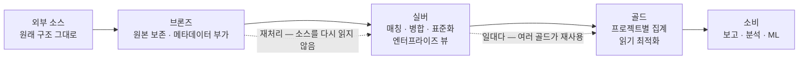

# 메달리온 아키텍처로 레이크하우스 데이터 품질을 단계적으로 높이는 법

> 출처: https://www.databricks.com/kr/blog/what-is-medallion-architecture · Databricks 직원 · 회사·벤더 · 발행일 미상

## 요지

- 메달리온 아키텍처는 데이터를 브론즈 → 실버 → 골드 레이어로 통과시키며 구조와 품질을
  증분적으로 개선하는 레이크하우스 설계 패턴이다. 멀티 홉 아키텍처라고도 부른다.
- 브론즈는 원본과 이력을 보존하고, 실버는 정리·통합해 엔터프라이즈 관점을 제공하며,
  골드는 프로젝트별 보고·분석에 맞게 집계·비정규화한다.
- 변환을 뒤로 미루는 ELT 흐름을 따른다 — 수집 속도를 우선하고, 복잡한 비즈니스 규칙은
  실버에서 골드로 이동할 때 적용한다.
- 브론즈·실버를 여러 다운스트림이 재사용하는 일대다 구조라서 데이터 메시와 양립한다.
- 글은 보관(Archived) 상태의 벤더 블로그다 — 제품 구현 설명은 최신 문서와 교차 확인이 필요하다.

## 흐름

## 내용

### 정의

레이크하우스에 데이터를 논리적으로 정리하는 설계 패턴이다. 데이터가 세 레이어를
통과할수록 구조와 품질이 증분적·점진적으로 개선되며, 그래서 멀티 홉 아키텍처라고도
부른다. Databricks 는 자사 Delta Live Tables 로 이 파이프라인을 몇 줄의 코드로 구축할
수 있다고 주장한다.

### 브론즈 레이어 — 원시 데이터

외부 소스의 모든 데이터를 **소스 시스템의 테이블 구조 그대로** 적재하고, 로드 일시와
프로세스 ID 같은 캡처 컬럼을 더한다. 역할은 넷이다 — 변경 데이터의 빠른 캡처, 원본
이력 아카이브, 리니지·감사, 그리고 **소스 시스템을 다시 읽지 않는 재처리**의 기반.

### 실버 레이어 — 정리와 순응이 끝난 데이터

브론즈 데이터에 매칭·병합·순응·「적당한 수준」의 정리를 적용해, 주요 비즈니스
개체·개념·트랜잭션의 통합된 **엔터프라이즈 뷰**를 만든다. 마스터 고객, 스토어,
중복 없는 트랜잭션, 교차 참조 테이블이 예다. 셀프서비스 분석·고급 분석·ML 의 공통
소스가 되며, 부서 애널리스트·데이터 엔지니어·데이터 사이언티스트가 여기서 출발한다.

모델링은 3차 정규형에 가깝거나 데이터 볼트와 유사한, 쓰기 성능을 고려한 모델을 쓸 수
있다. 증분 처리에는 변경 데이터 캡처(CDC)를 쓴다.

### ELT 흐름

레이크하우스 데이터 엔지니어링은 ETL 보다 ELT 를 따른다고 글은 주장한다. 수집과 전달의
속도·민첩성을 우선해 실버까지는 최소한의 변환만 적용하고, 복잡한 변환과 비즈니스 규칙은
실버에서 골드로 이동할 때 적용한다.

### 골드 레이어 — 큐레이션된 비즈니스 레벨 테이블

프로젝트별로 정리된, 바로 사용 가능한 데이터다. 조인 수가 적고 비정규화된 읽기 최적화
모델을 쓰고, 데이터 변환과 품질 규칙의 마지막 레이어를 적용한다. 모델링은 Kimball 식
스타 스키마나 Inmon 식 데이터 마트가 제시된다.

용도 예시 — 고객·제품 품질·재고 분석, 고객 세분화, 제품 추천, 마케팅·영업 분석. 크로스
도메인 결합의 예로 IoT·제조 데이터와 영업·마케팅 데이터의 연결, **의료 유전체학과
EMR/HL7 임상 데이터를 보험 청구 데이터와 결합한 환자 치료 분석**을 든다. 기존 EDW 와
데이터 마트 전체를 레이크하우스로 들여와 「처음으로 EDW 전체에 고급 분석과 ML 을 적용할
수 있다」는 대목은 벤더의 주장이다.

### 레이크하우스 장점과 데이터 메시

글이 나열한 메달리온의 장점 — 간단한 데이터 모델, 쉬운 이해와 구현, 증분 ETL, 언제든
원시 데이터에서 테이블 재생성, ACID 트랜잭션과 시간 이동(Time Travel).

메달리온은 데이터 메시 개념과 양립한다 — 브론즈·실버 테이블을 **일대다**로 여러
다운스트림 테이블이 사용하는 구조이기 때문이다.

### 다이어그램

원문에 그림 두 장이 있다 — 「Delta Lake 데이터 파이프라인」과 「Databricks 레이크하우스
플랫폼 아키텍처」. SVG 로만 삽입되어 구성 요소를 텍스트로 확인할 수 없어 여기 다시
그리지 않았다. 위 「흐름」의 Mermaid 는 본문 서술로부터 그린 것이다.

## 적용할 것

| 가져갈 것 | 조건 · 한계 | concept 후보 |
| --- | --- | --- |
| 원본 보존 · 공통 의미 정립 · 소비 목적별 최적화라는 **책임 분리**가 핵심 — 레이어 이름 붙이기가 아니다 | 레이어마다 입력·출력 계약, 허용 변환, 품질 검사, 재처리 방법을 정의해야 성립한다 | [[medallion-architecture]] — 추출 완료 |
| 브론즈 덕에 소스를 다시 읽지 않고 재처리할 수 있다 — 추출·변환이 틀려도 되돌아갈 자리 | 원시 데이터 장기 보존은 비용·개인정보·접근 통제 문제를 만든다. 수집 단계에도 검증·마스킹·격리가 필요할 수 있다 | (medallion-architecture 에 포함) |
| ELT — 변환을 뒤로 미루고 수집 속도를 우선한다 | 항상 옳지 않다. 민감도·규제·지연 요구에 따라 적재 전 검증 범위를 정한다. 실버에 변환을 지나치게 미루면 저품질 데이터가 넓게 소비된다 | (medallion-architecture 「경계와 오해」에 포함) |
| 실버 일대다 재사용 — 공통 정제를 한 번 하고 여러 골드가 쓴다 | 실버의 개체 정의가 합의돼야 한다. 팀마다 다른 「고객」을 쓰면 일대다가 오염을 일대다로 퍼뜨린다 | (medallion-architecture 에 포함) |
| 의료 도메인 결합 사례 — 임상(EMR/HL7)과 청구 데이터를 골드에서 결합한 환자 분석 | 벤더가 든 예시일 뿐 구현 상세는 없다. 병원 매출 분석에서 예약(수요 측)과 수납(매출 측)을 골드에서 결합하는 우리 구도와 같은 모양이다 | — 사례 메모 |
| 플랫폼 무관 패턴 — Databricks 전용 기능이 아니다 | 제품 기능(DLT · 스트리밍 테이블) 설명은 보관 상태 글이라 최신 문서와 교차 확인 | — |

## 참고

- 데이터 레이크하우스란 무엇입니까 (Databricks)
- 데이터 레이크를 활용한 증분 ETL (Databricks Blog)
- Delta Lake 의 CDF(Change Data Feed)로 메달리온 아키텍처 단순화 (Databricks)
- 글이 언급한 모델링 방식 — Kimball 스타 스키마 · Inmon 데이터 마트 · 데이터 볼트
- 더 조사할 것 — 데이터 메시(글은 양립한다고만 말하고 근거 상세가 없다) ·
  증분 처리에서 CDC 가 실버 갱신을 어떻게 효율화하는가 → [[change-data-capture]]
