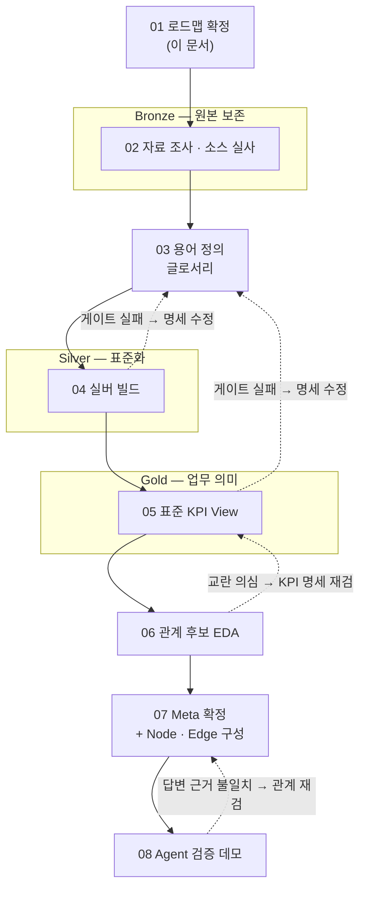

# 온톨로지 실행 기록 01 — 구축 로드맵

이 문서는 시리즈의 대문이다. 세라미크의원 매출 데이터로 온톨로지 데모를 세우는 여덟
스텝을 여기서 확정하고, 스텝 하나가 끝날 때마다 실행 기록을 한 장씩 뒤에 박제한다.
기록 02부터는 아직 없다 — 이 문서 시점에 존재하는 것은 브론즈 소스 세 종과 1차 시도의
교훈까지다.

방법론의 출처는 세션 노트 두 장이다. 온톨로지의 뼈대 — Semantic Layer, Ontology
Meta·Node·Edge, 표준 KPI View 선행, 「관계는 Instruction이 아니라 데이터로」 — 는
[[S-001-amorepacific-data-agent-ontology]] 에서, 데이터 계층화와 운영 루프 — Medallion
표준화, Agent는 판단만, 게이트·승인 루프 — 는
[[S-002-pulmuone-loop-engineering-agentic-ai]] 에서 가져온다. 계층 개념 자체는
[[medallion-architecture]] 에 위임한다.

## 진행 규칙 — 왜 게이트인가

모든 스텝은 **「명세 확인 → 빌드 → 게이트 → 승인」** 네 관문을 순서대로 통과해야 다음
스텝으로 간다. 명세에 없는 변환·필터·파생을 빌드가 임의로 하지 않고, 게이트를 통과하지
못하면 명세로 되돌아가 고친 뒤 다시 빌드한다. 승인은 사람이 한다.

이 규칙의 근거는 1차 시도의 폐기다. 1차에서는 검증 게이트 없이 다음 층으로 넘어갔고,
그 결과 실버·골드 산출물을 전량 폐기했다. 원인은 셋으로 확정되어 있다.

| # | 무엇이 잘못됐나 | 이번에 반영할 스텝 |
| --- | --- | --- |
| 1 | 중복 제거 키에 `staff` 를 빼고 만들어, 같은 날 같은 환자의 복수 예약이 오삭제됐을 수 있다. 제거된 행을 검증하지 않고 썼다 | 04 실버 빌드 |
| 2 | 리뷰 감성·시술 태그를 명세(LLM 추출) 대신 키워드 규칙으로 때웠다 — 시술 사전에 일반 단어가 절반이었다 | 04 실버 빌드 |
| 3 | 프로모션 변수를 명세 없이 즉흥 산출했다 — 상시 프로모션이 누적되는 추세일 뿐 개입 신호가 아니었고, 이것으로 가짜 상관을 보고했다 | 05 KPI View |

셋의 공통분모가 「게이트 없이 넘어간 것」이므로, 이번 로드맵은 산출물보다 관문을 먼저
정의한다.

## 로드맵

브론즈는 원본을 불변으로 보존하고, 실버는 용어 정의를 적용한 표준화·비정형 추출을,
골드는 표면에 보이는 KPI View 만 담는다. 레이크하우스 장비가 아니라 책임 분리 원칙으로
적용한다 — 스키마 세 벌 수준이다.

## 02 자료 조사 · 소스 실사 — 브론즈

브론즈 소스는 `reference/ontology_demo/` 에 세 종이 반입되어 있다.

- `bronze/vegas/*.json` — 일별 예약·내원 원장
- `bronze/nexus/*.csv` — 시술·프로모션 카탈로그 14개
- 루트의 리뷰 CSV — 플랫폼별 리뷰

이 스텝에서 세 소스를 처음으로 열어 실사한다. 파일 구성과 기간, 스키마와 필드 의미,
행 규모, 이상값과 결측, PII 의 범위와 취급 수위를 조사한다. 특히 시계열의 단위(일·주·월)와
길이를 확인한다 — 06 EDA 의 산점도·시차 상관이 성립하려면 점이 충분해야 하므로, 단위와
기간이 이 접근 전체의 성립 조건이다.

**산출물** — 원천 인벤토리 기록(실행 기록 02): 소스별 파일 구성 · 기간 · 스키마 · 규모 ·
이상 징후 · PII 취급 수위.

**게이트** — 세 소스가 같은 분석 창을 덮는지 확인될 것. EDA 가 성립할 시계열 단위가
뽑히는지 판정될 것. PII 를 어디까지 하위 층으로 내릴지 수위가 확정될 것. 표본 파일을
원본과 대조해 파싱이 값을 훼손하지 않음이 확인될 것.

## 03 용어 정의 — 글로서리

KPI 계산식이 사람마다 달라지지 않도록 업무 용어부터 정의한다. 매출 인식 기준, 신환의
판정, 예약 결과의 구분(내원·취소·노쇼), 객단가의 분모, 유입 신호의 분류가 최소 목록이다.
02 실사에서 드러난 이상값·모호함은 데이터 검증이나 담당자 확인으로 종결하고, 종결하지
못한 항목은 가정과 영향 범위를 명시한 대기 목록으로 남긴다.

1차 시도에서 확정된 판정은 기지 사실로 이어받는다.

- **노쇼율 = 부도 ÷ (내원 + 부도)** — 취소는 「안 온 것」이 아니라 「예약을 무른 것」이므로
  분모에서 뺀다.
- **네이버 리뷰 수는 개입 변수다** — 담당자 확인 결과 리뷰 급증은 마케팅 전략(의도적 리뷰
  확보)이었다. 유기 신호는 강남언니 리뷰만이며, 두 플랫폼을 한 컬럼으로 합산하지 않는다.

**산출물** — 용어 판정 표(실행 기록 03): 용어 · 정의 · 데이터 근거 · 대기 항목.

**게이트** — 04~05 의 모든 계산식이 이 글로서리의 용어만으로 서술 가능할 것. 담당자
확인이 필요한 항목이 종결되거나, 미종결분은 가정·영향 범위가 명시될 것. 정의가 바뀌면
글로서리를 먼저 고치고 하위 층을 재추출한다는 규칙이 합의될 것.

## 04 실버 빌드

글로서리를 브론즈에 적용해 표준화한다. 지점 필터, 컬럼 매핑, 중복 제거, 파생 컬럼
생성과 비정형(리뷰 텍스트) 정형화가 이 스텝의 일이다. 비정형 추출은 S-002 방식을
따른다 — AI 가 추출·분류하고, System 이 규칙으로 검증하고, 사람은 예외만 본다. 수정
이력은 버리지 않는다.

1차 폐기 원인 1·2 의 재발 방지 규칙을 명세에 박는다.

- 중복 제거는 **모든 필드가 완전히 동일한 행**만 대상으로 한다. 같은 날 같은 환자라도
  담당자나 금액이 다르면 별개 예약 건으로 유지한다. 제거 건수와 표본을 빌드 로그로 남긴다.
- 리뷰 감성·시술 태그에 **키워드 규칙을 쓰지 않는다.** 태그는 사람이 승인한 폐쇄 목록
  안에서만 LLM 이 판정하고, 목록 추가는 제안만 하고 사람이 승인한다.

**산출물** — 실버 테이블(예약·내원 행, 리뷰 행)과 빌드 기록(실행 기록 04).

**게이트** — 행수 대사가 수식으로 정확히 맞을 것(브론즈 = 실버 + 필터 제외 + 중복 제거).
중복 제거 표본과 무작위 일자의 원본 대조가 통과할 것. 값 범위·enum 검사에 걸리면 빌드가
중단될 것. 태그가 폐쇄 목록 밖 값 0건일 것.

## 05 표준 KPI View — 골드

실버를 일관된 기준의 일별 KPI 시계열로 표준화한다. S-001 의 순서를 따른다 — 온톨로지보다
표준 KPI View 가 먼저다. 산점도를 그릴 시계열 자체가 여기서 나온다. KPI 하나마다 계산식
(글로서리 용어로만 서술), 전 기간 대비 변화량·변화율, 상태 기준(양호·주의·경고, 경계값
명시)을 갖춘다.

1차 폐기 원인 3 의 재발 방지 — 개입 변수(프로모션·네이버 리뷰)는 **명세를 먼저 세우고**
산출한다. 상시 항목이 누적되는 추세성 변수를 개입 신호로 쓰지 않으며, 시작·종료 같은
이벤트 단위로 정의한다. 플랫폼 신호는 개입(네이버)과 유기(강남언니)를 분리해 둔다.

**산출물** — 골드 KPI View 와 명세·검증 기록(실행 기록 05).

**게이트** — 골드 집계가 실버 재집계와 일치할 것. 알려진 값(기간 합계 등)과 대조가
통과할 것. 개입 변수가 추세성 누적이 아니라 이벤트성으로 움직이는지 육안 확인될 것.
결측일 처리 규칙이 명세대로일 것.

## 06 관계 후보 EDA

KPI 쌍 사이의 엣지 후보를 데이터 분석으로 뽑는다. 산점도와 상관, 시차 상관(유입→내원의
선후), 계절 분해 후 잔차·부분상관을 기본 기법으로 하고, 표본이 충분하면 Granger 검정을
더한다. 외생 노드(계절·연휴)로 선언한 교란은 분석에서 실제로 통제한다 — 선언과 실행은
한 쌍이다.

기지 사실 둘을 규칙으로 둔다.

- **항등식은 분석하지 않는다.** 「매출 = 내원 × 객단가」류 정의상 관계는 산점도를 돌리면
  당연히 상관이 나온다. 산출(0) 엣지로 그냥 확정하고, 분석은 그 앞단에만 쓴다.
- **판정은 사람이 한다.** 함께 변한다고 인과가 아니다. EDA 는 후보만 내고, 채택·보류·기각
  칸은 비운 채 07 로 넘긴다.

**산출물** — 엣지 후보 표(실행 기록 06): 쌍 · 부호 · 시차 · 근거 수치 · 판정 칸(공란).

**게이트** — 모든 후보에 근거 수치와 사용 기법이 붙을 것. 선언한 교란 통제가 실제로
수행됐을 것. 항등식 쌍이 분석 대상에 섞이지 않을 것.

## 07 Meta 확정 + Node · Edge 구성

06 의 후보 표를 사람이 검증해 Meta 로 올린다. 엣지마다 방향과 부호(양 + · 음 − ·
산출 0), 필요하면 가중치를 확정한다. 계절 같은 통제 불가 변수는 들어오는 엣지 없이
나가는 엣지만 갖는 외생 노드로 표시해, 원인 분석의 답이 「예측·대비할 것」인지 「조치할
것」인지 갈리게 한다. Meta 를 내릴 인스턴스 단위(시술·담당자·기간 등)는 데이터가 어느
단위를 지탱하는지 보고 정한 뒤, Node·Edge 인스턴스를 구성한다.

**산출물** — Ontology Meta 와 Node·Edge 인스턴스, 판정 기록(실행 기록 07).

**게이트** — 모든 엣지에 근거(EDA 수치 또는 항등식)와 사람의 판정이 붙을 것. 모든 노드에
조작 가능·외생 속성이 부여될 것. 기각된 후보의 기각 사유가 기록될 것.

## 08 Agent 검증 데모

완성된 스택을 두 갈래 질문으로 검증한다. S-001 의 분리를 따른다 — 「이번 달 매출
얼마인가」 같은 현황 질문은 KPI View 만으로 답하는 범용 경로가, 「매출이 왜 줄었는가」
같은 원인 질문은 온톨로지의 엣지를 거슬러 추적하는 경로가 맡는다. S-002 의 경계도
지킨다 — Agent 는 판단만 하고, 집계·조회는 명세된 View 가 수행하며, 답변은 근거 수치로
역추적 가능해야 한다.

**산출물** — 질문 시나리오별 데모와 검증 기록(실행 기록 08).

**게이트** — 현황 질문과 원인 질문 각각의 시나리오가 통과할 것. 원인 추적 경로가 Meta 에
확정된 엣지만 사용할 것. 답변의 모든 수치가 골드 View 로 역추적될 것.

## 이후 — 이 로드맵의 범위 밖

인과 그래프 시각화 대시보드, 운영 루프(로그 → 개선안 → 승인 배포)는 08 이 끝난 뒤의
일이다. Meta 가 검증된 다음에만 의미가 있다.
