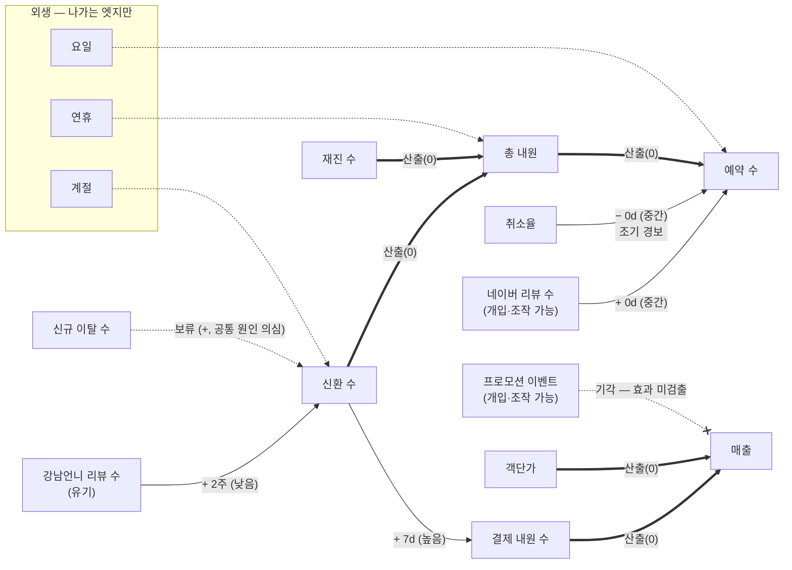

# 온톨로지 실행 기록 07 — Meta 확정과 Node·Edge 구성

이 문서는 [[2026-09-01-ontology-01-roadmap|기록 01]]의 「07 Meta 확정 + Node·Edge
구성」 스텝의 기록이다. [[2026-09-01-ontology-06-eda|기록 06]]이 판정 칸을 비워 넘긴
엣지 후보를 **담당자가 전건 판정**했다(2026-09-01) — EDA 는 후보만 내고, 확정은
사람이 한다는 원칙의 실행이다. 근거가 약하면 엣지를 긋지 않으며, 기각에도 사유를
남긴다.

## 1. 판정 결과

### 채택 — 4엣지

| 엣지 | 부호·시차 | 신뢰도 | 근거 | 판정 사유 |
| --- | --- | --- | --- | --- |
| 네이버 리뷰 수 → 예약 수 | + · 동시점 | 중간 | 잔차 r=0.326 · Granger p=0.036 | 개입 변수(리뷰 확보 캠페인)와 예약의 동행 — 마케팅 활동 지표 엣지 |
| 신환 수 → 결제 내원 수 | + · 7일 | 높음 | 잔차 r=0.579 (최강 후보) | 신환이 약 1주 후 결제 방문(시술 계약)으로 전환 — 리텐션 인사이트와 정합 |
| 취소율 → 예약 수 | − · 동시점 | 중간 | r=−0.583 · Granger 방향 분리(취소율→예약만 p<0.001) | 취소율 상승 = 예약 경기 하강의 **조기 경보**. 주 원천은 재진 취소(33.5% — 기록 06 부기 ④) |
| 강남언니 리뷰 수 → 신환 수 | + · 2주 | **낮음** | r=0.691 · n=30 | 유기 신호 단독이 아니라 도메인 지식(리뷰 보고 예약하는 유입 경로)과 결합해 채택. 표본이 얇아 신뢰도 낮음을 엣지 속성에 명시 |

### 보류 — 1엣지

- **신규 이탈 수 → 신환 수** (+, r=0.323): 양(+)의 동시점 상관은 인과보다 공통
  원인(유입 총량 증가 → 신환도 이탈도 증가)으로 읽힐 소지가 크다. 유입 노드가
  해명되기 전까지 미확정으로 둔다.

### 기각 — 4건 (사유가 곧 자산이다)

| 후보 | 근거 수치 | 기각 사유 |
| --- | --- | --- |
| 프로모션 시작 → 예약·신환·매출 | 전후 ±14일 변화율 ±6% 이내 (23건) | 효과 미검출. 프로모션이 월 단위로 연쇄해 「없는 구간」이 없다는 구조적 한계 병기 — 1차 시도의 가짜 상관(−0.71) 보고와 정반대 지점 |
| 할인율 → 기간 매출·신환 | 스피어만 −0.479 / −0.318 | **역인과 의심** — 「할인이 매출을 낮춘다」가 아니라 「매출 부진기에 고할인 구성을 투입한다」(경영 대응)가 우세한 독해. 귀속 불가 표본 23개로 어느 방향도 확정 불가 |
| 신환 수 → 매출 금액 | 최대 r=0.14 | 매출 금액은 시술 구성(고액 결제 비중 — 기록 06 부기 ②)에 좌우. 신환의 매출 기여는 채택 엣지(신환 → 결제 내원 → 매출)를 경유해 표현된다 |
| 예약 수 → 취소율 (역방향) | Granger p=0.81 | 방향 기각 — 채택된 취소율 → 예약의 역방향 |

### 산출(0) — 항등식 9엣지 자동 확정

결제 내원·객단가 →(0) 매출 / 신환·재진 →(0) 총 내원 / 내원·취소·부도 →(0) 예약 /
취소 →(0) 취소율 · 부도 →(0) 노쇼율. 분석 없이 정의로 확정([[2026-09-01-ontology-06-eda|기록 06]] 2장).

### 외생 노드 — 3종 선언

요일 · 계절(월) · 연휴는 **들어오는 엣지 없이 나가는 엣지만** 갖는다. 원인 분석의
답이 「예측·대비할 것」(외생)인지 「조치할 것」(조작 가능)인지를 가르는 장치다.
요일은 06 에서 잔차 통제로 실행까지 마쳤다.

## 2. 확정 Meta 그래프

## 3. Node 인스턴스 — 지점 레벨 단일 (담당자 확정)

인스턴스 레벨은 **강남 지점(CERAMIQUE-GN-001) 하나**다. 근거 — 데이터가 지탱하는
레벨을 본다: 예약·매출에 시술 상품 식별자가 없어(공백 ①) 시술별 KPI 분해가
불가능하고, 지점도 강남 단일 소스다. 시술 개념 13종은 노드가 아니라 리뷰 신호
노드의 속성으로만 보존한다. 연령대 서브노드는 이번 데모에서 만들지 않되, 연령
비대칭(기록 06 부기 ③)을 향후 확장 후보로 남긴다.

노드 19종(KPI 13 + 개입 2 + 유기 1 + 외생 3)과 엣지 20행(채택 4 · 산출 9 · 외생 3 ·
보류 1 · 기각 3)은 **데이터 자산으로 산출**했다 — 관계를 Agent Instruction 에 넣지
않는다는 방법론(S-001)의 구현이다.

- `reference/ontology_demo/ontology/nodes.csv` — node_id · 이름 · 유형(kpi/개입/유기/외생) · 조작 가능 여부 · 그레인 · 소스
- `reference/ontology_demo/ontology/edges.csv` — 원인 · 결과 · 부호 · 시차 · 종류(causal/derivation/exogenous/candidate/rejected) · 신뢰도 · 근거 · 판정 · 사유

기각·보류도 행으로 보존한다 — 「왜 그리지 않았나」가 조회 가능해야 같은 질문이
반복되지 않는다.

## 4. 한계 — 이 Meta 가 말할 수 없는 것

1. **시술·상품 단위 매출 인과** — 라인아이템 부재(공백 ①). 이 그래프의 어떤 엣지도
   「어떤 시술이 매출을 끌었나」에 답하지 못한다. 해소하려면 예약·결제에 상품
   식별자가 붙은 데이터 수집이 필요하다 — 다음 수집 과제.
2. **프로모션 효과** — 비교 구간 부재로 미검출이 「효과 없음」의 증명은 아니다.
   v1 구성 불명도 겹친다.
3. **유기 신호 엣지의 신뢰도** — 표본 30주. 데이터가 쌓이면 재판정한다.
4. 채택 엣지도 관찰 연구의 후보다 — 개입 실험 없이는 인과의 최종 증명이 아니며,
   상태 기준·조기 경보로서의 운용 가치로 채택한 것이다.

## 5. 게이트 판정 (2026-09-01)

| # | 게이트 (로드맵 07 정의) | 판정 | 근거 |
| --- | --- | --- | --- |
| 1 | 모든 엣지에 근거와 사람의 판정 | **통과** | edges.csv 전 행에 근거 수치(또는 항등식)·판정·사유 존재. 판정은 담당자가 전건 수행(2026-09-01) |
| 2 | 모든 노드에 조작 가능·외생 속성 | **통과** | nodes.csv 전 행에 node_type · controllable 부여. 외생 3종은 들어오는 엣지 0 확인 |
| 3 | 기각 후보의 기각 사유 기록 | **통과** | 기각 4건 전건 사유 보존 — 역인과·구조적 한계·경유 경로 대체까지 명시 |
