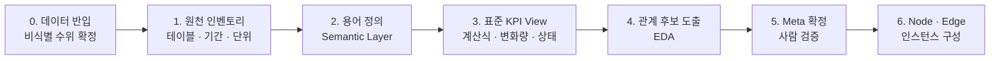

# 병원 매출 분석 — 온톨로지 데이터 연결 맵 구현 계획

> 출처: [[S-001-amorepacific-data-agent-ontology]] 의 Meta·Node·Edge 구조를 병원 매출 도메인에 적용 · 2026-08-30

## 1. 목표

비급여 중심 병원의 실제 데이터로, 매출을 움직이는 KPI 들의 관계를
**Meta·Node·Edge 온톨로지(데이터 연결 맵)** 로 표현한다.

답해야 할 질문은 둘 다다.

| 질문 유형 | 예 | 답하는 층 |
| --- | --- | --- |
| 현황 조회 | 「이번 달 매출 얼마야?」 | 표준 KPI View 만으로 충분 |
| 원인 분석 | 「매출이 왜 줄었어?」 | 온톨로지 — 결과 KPI 에서 엣지를 거슬러 추적 |

병원 매출의 사슬은 공급망의 `계획 → 생산 → 재고 → 판매 → 유통` 에 대응해 이렇게 놓는다.

```text
유입(마케팅·채널) → 예약 → 내원(신환·재진) → 진료·시술 → 수납 → [매출]
```

## 2. 정한 원칙

1. **정의상 관계는 분석하지 않는다.** `매출 = 내원수 × 객단가`, `내원 = 신환 + 재진` 같은
   항등식은 산점도를 돌리면 당연히 상관이 나온다. **산출(0) 엣지로 그냥 확정**하고,
   데이터 분석은 그 앞단(무엇이 신환을 움직이나)에만 쓴다.
   — 아모레 그래프의 엣지 세 종류 `양(+) · 음(−) · 산출(0)` 를 그대로 쓴다.
2. **엣지 후보는 데이터 분석이 내고, 확정은 사람이 한다.** 함께 변한다고 인과가 아니다.
   현업 시나리오 합의 대신 EDA 로 후보를 뽑되, Meta 에 올리는 판단은 사람이 한다.
3. **통제 못 하는 원인도 그래프에 넣는다. 단 외생으로 표시한다.** 계절·연휴 일수·경쟁사
   개원처럼 손댈 수 없는 변수는 들어오는 엣지 없이 나가는 엣지만 갖는 **외생 노드**다.
   원인 분석의 답이 「계절 탓(예측·대비)」인지 「마케팅 탓(조치 가능)」인지를 가른다.
4. **노드로 선언한 교란은 분석에서 통제한다.** 계절 노드를 그렸으면 엣지 후보 분석에서
   계절 제거 또는 부분상관으로 실제로 조건을 깔아야 한다. 선언과 실행은 한 쌍이다.
5. **온톨로지보다 표준 KPI View 가 먼저다.** 산점도를 그릴 시계열 자체가 KPI View 에서
   나온다. 아모레도 원천 20+ 테이블 → KPI View 10+ 표준화가 선행이었다.
6. **데이터는 [[medallion-architecture]] 원칙으로 계층화한다.** 원본(원천 덤프 · 매출
   일지 · 리뷰 원문)은 불변으로 보존하고(Bronze), 용어 정의를 적용한 표준화·비정형
   추출은 분리된 단계로(Silver), 표면에 보이는 것은 KPI View 만(Gold). 1~3단계가
   각각 이 세 계층을 만든다. 레이크하우스 장비가 아니라 책임 분리 원칙으로 적용한다 —
   스키마 세 벌 수준. 비정형(리뷰 · 일지 서술)의 정형화는 풀무원
   [[S-002-pulmuone-loop-engineering-agentic-ai|S-002]] 방식을 따른다:
   AI 가 추출·분류, System 이 규칙 검증, 사람은 예외만. 수정 이력은 버리지 않는다.

## 3. 단계



### 0. 데이터 반입 · 비식별

실데이터가 회사 쪽 원천이면 이 레포(공개)에는 비식별로만 남는다. 어디까지 담아도
되는지 수위를 먼저 정한다. 스키마(테이블·컬럼 구조)와 수치의 취급을 나눠서 정한다.

### 1. 원천 인벤토리

무슨 테이블이 있고 무엇을 담는지 목록화한다. 각 테이블에 대해 적을 것:
주요 컬럼 · 쌓인 기간 · 단위(일/주/월) · 건수 규모.

**단위와 기간이 4단계 기법의 성립 조건이다.** 월 단위 2년이면 점 24개 — 산점도가
의미 없다. 일/주 단위가 뽑히는지가 이 접근의 성패를 가른다.

### 2. 용어 정의 — Semantic Layer

KPI 계산식이 사람마다 달라지지 않도록 용어부터 정의한다. 최소 목록:

- **매출 인식 기준** — 수납 시점인가 시술 완료 시점인가. 환불 처리는.
- **신환** — 첫 내원 기준인가, 마지막 내원 후 N 개월 경과 재방문도 신환인가.
- **유입 채널 분류** — 광고 · 검색 · 소개 · 재방문을 어떻게 가르나.
- **상담 → 시술 전환** — 전환 시점을 어디로 보나. 전환율의 분모는.
- **객단가** — 내원당인가 환자당인가 시술당인가.

### 3. 표준 KPI View

원천 테이블을 일관된 기준의 KPI 시계열로 표준화한다. KPI 하나마다:

| 갖출 것 | 예 |
| --- | --- |
| 계산식 (2단계 용어로만 서술) | 신환 수 = 정의 §2 기준 첫 내원 카운트 |
| 전월(주) 대비 변화량 · 변화율 | +12 · +8% |
| 상태 기준 | 양호 · 주의 · 경고 (경계값 명시) |

후보 KPI: 신환 수 · 재진율 · 노쇼율 · 상담 전환율 · 객단가 · 시술별 매출 ·
채널별 유입 수 · 마케팅비. 목록은 1단계 인벤토리를 보고 확정한다.

### 4. 관계 후보 도출 — EDA

시나리오 합의 대신 데이터 분석으로 엣지 후보를 뽑는다.

| 기법 | 찾아주는 것 | 전제 |
| --- | --- | --- |
| 산점도 + 상관(Pearson·Spearman) | KPI 쌍의 동행 여부와 부호 | 방향은 못 준다 |
| **시차 상관(lagged correlation)** | 「마케팅비↑ → 다음 달 신환↑」 선후 | 상담→시술 시차가 있는 병원 도메인의 핵심 기법 |
| 계절 분해 후 잔차 상관 · 부분상관 | 계절이 만든 가짜 상관 제거 | 원칙 4 의 실행 |
| Granger 인과 검정 | 시계열상 예측 기여 | 표본이 충분할 때만 |

산출물: KPI 쌍별 후보 표 — `쌍 · 부호 · 시차 · 근거 수치 · 판정(채택/보류/기각)`.
판정 칸은 5단계에서 사람이 채운다.

### 5. Meta 확정

4단계 후보 표를 사람이 검증해 Meta 로 올린다. 엣지마다 `방향 · 부호(+/−/0) · (가중치)`.
외생 노드(계절 등)를 포함하고, 노드에 `조작 가능 / 외생` 속성을 둔다.
항등식 엣지(산출 0)는 분석 없이 이 단계에서 바로 넣는다.

### 6. Node · Edge 인스턴스

Meta 를 어느 단위로 내리나 — 시술 단위인가 의사·상담사 단위인가 진료과 단위인가.
아모레의 「상품 레벨, 묶으면 브랜드 레벨」에 대응한다. 1단계에서 데이터가 어느 단위를
지탱하는지 보고 정한다.

### 이후 (이 계획의 범위 밖)

인과 그래프 시각화, 범용 Agent / Ontology Agent 라우팅. Meta 가 확정된 다음의 일이다.

## 4. 아직 안 정한 것

- 원천 테이블 목록 — **NEXUS 측 완료** → [[hospital-revenue-source-inventory]].
  매출 측(EMR · 매출 일지)은 대기
- 데이터의 기간 · 단위 — 4단계 기법 성립 여부가 여기 달렸다. prod DB 실측 대기
- 비식별 수위 — 스키마 / 수치 각각
- Node 인스턴스 레벨 — 6단계에서
- **이 문서의 자리** — 계획서는 자라는 문서라 `resources/` 불변 규약과 안 맞는다.
  작업이 프로젝트로 서면 `para/projects/` 로 이관을 검토한다.
