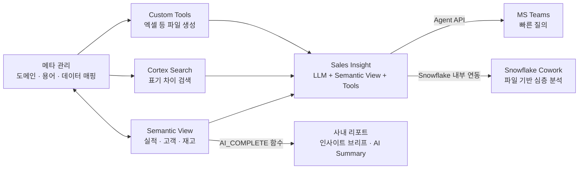
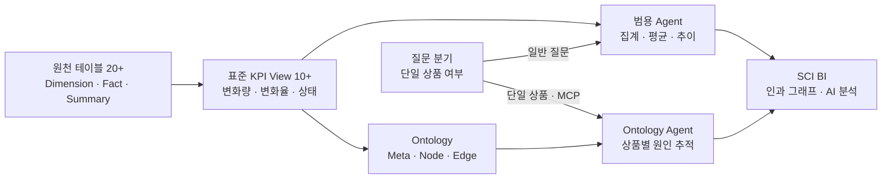

# 데이터에 의미와 판단 순서를 담은 Agent — 아모레퍼시픽

> 출처: Snowflake World Tour 서울 · 2026-08-27 · 21:26

## 1. 개요

### 1.1 발표 정보

| 항목 | 내용 |
| --- | --- |
| 어떤 발표였나 | 실적 데이터에 Semantic Layer를 적용한 전사 Agent와, 공급망 KPI의 인과관계를 Ontology로 구성한 사례 |
| 어디서 들었나 | Snowflake World Tour 서울 |
| 언제 들었나 | 2026-08-27 |
| 발표자 | 장홍진 |
| 소속 | 아모레퍼시픽 빅데이터 플랫폼 개발팀 |
| 발표 길이 | 21분 26초 |

### 1.2 핵심 흐름

```mermaid
flowchart LR
    subgraph SALES["사례 1 · 실적 분석"]
        direction LR
        S1["문제<br/>업무 용어의 기준이 다름"]
        S2["Semantic Layer<br/>용어와 데이터 관계 정의"]
        S3["AI Ready Data<br/>업무 맥락을 아는 데이터"]
        S4["Sales Insight<br/>실적 전문 Agent"]
        S5["업무 적용<br/>Teams · Cowork · AI Summary"]
        S1 --> S2 --> S3 --> S4 --> S5
    end

    subgraph SUPPLY["사례 2 · 공급망 원인 분석"]
        direction LR
        C1["문제<br/>KPI는 결과만 보여줌"]
        C2["표준 KPI View<br/>변화량 · 상태 기준"]
        C3["Ontology<br/>KPI 인과관계 정의"]
        C4["Agent 분리<br/>범용 · Ontology"]
        C5["업무 적용<br/>인과 그래프 · 분석 Dashboard"]
        C1 --> C2 --> C3 --> C4 --> C5
    end

    S5 -. "질문을 결과 조회에서 원인 분석으로 확장" .-> C1
```

### 1.3 핵심 개념

#### AI Ready Data

단순히 오류를 제거하고 형식을 정리한 데이터가 아니다. 회사가 사용하는 용어의 정의와 계산
기준, 데이터 사이의 관계까지 포함해 **AI가 업무의 의미와 맥락을 해석할 수 있도록 준비된
데이터**다.

#### Semantic Layer

사용자의 업무 언어와 실제 테이블·컬럼을 연결하는 의미 계층이다. 예를 들어 신제품의 기간,
북미의 지역 범위, 회계 분기의 기준을 정의해 사람과 Agent가 같은 질문을 같은 기준으로
해석하게 한다. 이 발표에서는 도메인·용어·데이터 매핑과 배포 이력을 별도의 메타 관리
시스템에서 관리했다.

#### Ontology

공급망의 KPI와 그 관계를 Agent가 따라갈 수 있는 구조로 표현한 것이다. 발표에서는 다음 세
요소로 구성했다.

| 요소 | 역할 | 예시 |
| --- | --- | --- |
| Meta | KPI 사이의 일반적인 인과관계를 정의한다 | 생산↑ → 재고↑, 재고↑ → 순매출↓ |
| Node | 특정 상품이나 브랜드에 붙은 KPI 상태를 나타낸다 | 상품 A의 재고 증가 |
| Edge | 실제 Node 사이의 관계를 연결한다 | 상품 A의 재고 증가 → 부진재고 증가 |

긴 Instruction 안에 모든 관계를 설명하는 대신, **원인을 판단하는 순서를 데이터가 갖게
했다**는 것이 이 사례의 핵심이다.

#### 범용 Agent와 Ontology Agent

모든 질문을 같은 방식으로 처리하지 않았다. 「최근 3개월 순매출 평균」처럼 KPI View만으로
답할 수 있는 질문은 범용 Agent가 맡고, 「특정 상품의 순매출이 왜 감소했는가」처럼 인과관계를
거슬러 올라가야 하는 질문은 MCP를 통해 Ontology Agent로 연결했다.

## 2. 사례 상세

### 2.1 회사의 언어를 이해하는 실적 분석 Agent

#### 2.1.1 문제

「지난 분기 북미에서 신제품이 얼마나 팔렸는가」라는 질문은 단순해 보이지만 세 가지 기준이
필요하다. 지난 분기가 회계상 어느 기간인지, 북미에 어떤 국가가 포함되는지, 출시 후 얼마까지를
신제품으로 볼지 정해야 한다. 이런 의미가 데이터에 없으면 Agent는 질문을 되묻거나 사용자가
의도한 것과 다른 숫자를 답하게 된다.

아모레퍼시픽은 이를 모델 성능의 문제가 아니라 **데이터에 업무의 의미가 빠진 문제**로 봤다.
실적·고객·재고마다 사용하는 용어와 계산 기준을 Agent의 Instruction에 계속 적는 방식은 변경을
관리하기 어렵고 결과도 일관되게 유지하기 힘들었다.

#### 2.1.2 해결 접근

도메인·용어와 테이블·컬럼의 관계를 메타 관리 시스템에서 관리하고, 이를 주제별 Semantic
View에 반영했다. 메타 관리에는 Semantic View 매핑뿐 아니라 배포 이력도 포함했다. 표기가
달라도 같은 대상을 찾을 수 있도록 Cortex Search를 붙였고, 분석 결과를 엑셀로 만드는 기능은
Custom Tool로 분리했다.

이렇게 준비한 데이터 자산을 실적 전문 Agent인 **Sales Insight**에 연결했다. 핵심은 Agent
안에 회사의 모든 기준을 문장으로 넣는 것이 아니라, 별도로 관리되는 의미 계층과 도구를
질문에 맞게 사용하도록 한 것이다.

#### 2.1.3 적용과 아키텍처

| 계층 | 구성요소 | 역할 |
| --- | --- | --- |
| 비즈니스 정의 | 도메인·용어, 테이블·컬럼 매핑, 배포 이력 | 회사의 용어와 데이터가 뜻하는 바를 관리한다 |
| 데이터 자산 | Semantic View, Cortex Search, Custom Tools | 실적 조회, 표기 검색, 파일 생성을 담당한다 |
| Agent | LLM, 실적 Semantic View, Tools | 질문을 해석하고 필요한 데이터와 도구를 선택한다 |
| 사용자 접점 | MS Teams, Snowflake Cowork, 사내 리포트 | 빠른 질의, 심층 분석, 기존 화면의 요약을 제공한다 |

Teams는 사용자가 평소 쓰던 대화창에서 실적을 빠르게 확인하는 접점으로 사용했다. Cowork에서는
목표값이 든 파일을 올려 실제 실적과 비교하고, 분석 결과를 저장·공유·재사용할 수 있게 했다.
기존 리포트에는 `AI_COMPLETE()`를 적용해 내용을 먼저 요약하는 인사이트 브리프와 대시보드를
문장으로 설명하는 AI Summary를 추가했다.

Snowflake에 데이터와 Agent의 중심을 뒀지만 사용자 화면까지 단순하게 연결된 것은 아니다.
Teams에서 차트를 보여주기 위해 Office Script·Power Automate·OneDrive 등을 포함한 8개
시스템을 연계했다.

#### 2.1.4 결과와 한계

Sales Insight는 전사에 공개됐다. 발표자는 Agent가 수십 초 안에 만든 결과가 기존에는 한두
시간에서 하루가 걸리던 리포트에 해당한다고 설명했다. Teams 안에서 바로 사용할 수 있어 별도
교육 없이 접근할 수 있었고, 빠른 질의와 심층 분석의 접점도 Teams와 Cowork로 구분했다.

다만 정확도·사용률·비용 절감액은 공개하지 않았다. 수십 초와 한두 시간이라는 비교도 발표자의
설명이며, 측정 조건이나 표본은 제시되지 않았다.

### 2.2 판단 순서를 데이터로 만든 공급망 Ontology Agent

#### 2.2.1 문제

공급망 조직은 생산·재고·판매 KPI를 매일 정리했지만, KPI는 「생산이 늘었다」, 「재고가
부족하다」처럼 **무슨 일이 발생했는지**만 보여줬다. 왜 그런 결과가 생겼는지 찾는 순서는
담당자마다 달랐고 그 판단 과정도 기록되지 않았다.

계획·생산·재고·판매·유통은 각자의 Semantic Model 안에서는 잘 연결돼 있었다. 문제는 영역과
영역 사이의 관계였다. 이 관계를 Instruction에 넣자 내용이 길어지고 정확도가 떨어졌으며,
입력 크기에도 한계가 생겼다.

#### 2.2.2 해결 접근

먼저 20개가 넘는 원천 테이블을 일관된 기준의 10개 이상 KPI View로 표준화했다. 각 KPI에는
전월 대비 변화량·변화율과 양호·주의·경고 같은 상태 기준을 붙였다. 이후 현업과 함께 실제
공급망에서 발생하는 시나리오와 분석 목표를 정리했다.

이 데이터를 CoCo의 `ontology-stack-builder`에 입력해 Meta·Node·Edge, 추상 View, Semantic
Model과 Agent로 이어지는 스택을 구성했다. 자동 생성이 전부는 아니었다. 어떤 데이터를
사용하고 무엇을 분석할지는 현업이 먼저 정해야 했고, 중간 시각화와 최종 검증에도 사용자
승인이 들어갔다.

#### 2.2.3 적용과 아키텍처

| 구성 | 역할 |
| --- | --- |
| 표준 KPI View | 여러 원천의 기준을 통일하고 변화량과 상태를 계산한다 |
| Ontology Meta | 생산·재고·판매 KPI 사이의 방향과 가중치를 정의한다 |
| Node·Edge | 상품이나 브랜드 단위의 KPI 상태와 실제 관계를 구성한다 |
| 범용 Agent | 평균·추이처럼 KPI View만으로 답할 수 있는 질문을 처리한다 |
| Ontology Agent | 특정 상품의 결과가 발생한 원인을 관계를 따라 추적한다 |
| SCI BI | 이상 징후, KPI 현황, 인과 그래프와 추가 질문 화면을 제공한다 |

사용자는 대시보드에서 위험 상태인 KPI를 선택해 앞뒤 인과관계를 펼쳐 볼 수 있다. 더 깊은
단계로 이동하거나 Agent에 「이 KPI가 증가한 원인은 무엇인가」라고 추가 질문하고, 그래프와
원본 수치를 함께 보며 답변을 검수하도록 구성했다.

#### 2.2.4 결과와 한계

특정 상품의 결과 KPI에서 출발해 생산·재고·판매를 거슬러 올라가는 인과 그래프와 공급망
대시보드를 구현했다. 기존의 결과 조회를 **원인 탐색과 다음 판단을 돕는 분석**으로 확장했다는
점이 확인된 결과다.

회사 정책상 실제 KPI 목록·수치·Agent 답변은 비식별 처리됐고 이슈 Agent도 데모에서 빠졌다.
따라서 인과관계의 정확도와 실제 업무 성과는 발표만으로 확인할 수 없다. 공급망 사례는 전사
운영 성과라기보다 향후 여러 영역을 통합하는 Agent로 확장하기 위한 구현 사례로 소개됐다.

## 3. 적용할 경험

| 발표에서 나온 개념 | 추상화·일반화 | 적용 조건·제약 | 추출할 concept 이름 |
| --- | --- | --- | --- |
| AI Ready Data와 Semantic Layer | Agent가 업무 질문을 해석하려면 원천 데이터뿐 아니라 조직의 용어·범위·계산 기준을 연결하는 의미 계층이 필요하다 | 용어와 지표의 소유자, 변경·배포 절차가 필요하다. 정의가 합의되지 않으면 의미 계층도 같은 불일치를 담는다 | `semantic-layer` — 신규 후보 |
| KPI 관계를 Instruction에서 Ontology로 이동 | 여러 대상에서 반복되는 관계와 판단 순서는 Prompt에 나열하기보다 조회·변경할 수 있는 구조로 관리한다 | 관계를 현업이 정의하고 검증해야 한다. 함께 변한다는 사실만으로 인과관계를 단정할 수 없다 | `ontology` — 신규 후보 |
| 범용 Agent와 Ontology Agent 분리 | 질문에 필요한 데이터·도구·추론 깊이에 따라 전문 Agent로 라우팅하고 책임 범위를 좁힌다 | 질문 유형과 책임 경계가 실제로 달라야 한다. 지나친 분리는 라우팅과 운영 복잡성을 키운다 | `agent-routing` — 신규 후보 |
| Teams·Cowork·기존 리포트에 기능 배치 | Agent는 별도 화면 하나가 아니라 사용자의 업무 맥락과 분석 깊이에 맞는 접점에 배치한다 | 기존 도구의 API·권한·표현 한계를 확인해야 한다. 익숙한 접점도 연동 시스템이 늘면 운영 비용이 커진다 | `ai-agent` — 기존 concept 보강 후보 |
| 기간·필터 확인과 인과 그래프 검수 | AI 답변은 결과만 주지 않고 적용된 기준과 근거 데이터로 돌아가는 검증 경로를 제공해야 한다 | 근거 데이터와 계산 기준을 추적할 수 있어야 한다. 사용자 확인은 시스템 차원의 정확도 검증을 대신하지 않는다 | `human-in-the-loop` — 기존 concept 보강 후보 |

## 4. 참고 자료

| 단위 concept | 이 발표에서 시작된 질문 | 더 조사할 범위 | 추천 자료 |
| --- | --- | --- | --- |
| `semantic-layer` | 업무 용어와 실제 테이블·컬럼을 어떻게 같은 의미로 연결하는가 | Logical Table, Fact·Metric·Dimension, 관계와 계산 기준, 변경·배포·권한 관리 | [Snowflake — Semantic Views 개요](https://docs.snowflake.com/en/user-guide/views-semantic/overview) · [Semantic View 모델링 원칙](https://docs.snowflake.com/en/user-guide/views-semantic/best-practices-modeling) |
| `ontology` | 업무 영역의 개념과 관계를 기계가 읽을 수 있게 표현한다는 것은 무엇인가 | Domain, Class, Property, Individual, 형식 의미론과 추론, 단순 Graph와의 차이 | [W3C — OWL 2 Primer](https://www.w3.org/TR/owl2-primer/) |
| `causal-graph` | 생산↑ → 재고↑ 같은 Edge를 인과관계라고 부르려면 무엇이 필요한가 | 상관관계와 인과관계, DAG, 가정의 명시, 개입과 반사실, 관계 검증 | [Judea Pearl — Causal Inference in Statistics: An Overview](https://www.cs.columbia.edu/~blei/fogm/2018F/materials/Pearl2009a.pdf) |
| `agent-output-verification` | Agent가 사용한 기간·필터·지표와 근거 데이터를 어떻게 검증하는가 | 평가 데이터셋, 정확도 지표, 사람의 검수, 운영 중 모니터링과 회귀 평가 | [NIST — AI Resource Center](https://airc.nist.gov/) · [NIST Generative AI Profile](https://nvlpubs.nist.gov/nistpubs/ai/NIST.AI.600-1.pdf) |
