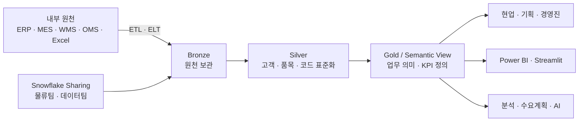
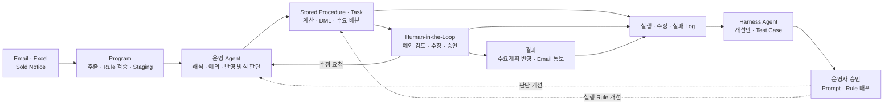

# 데이터에서 판단과 실행까지 연결한 Agentic AI — 풀무원

> 출처: Snowflake World Tour 서울 · 2026-08-27 · 16:36

## 1. 개요

### 1.1 발표 정보

| 항목 | 내용 |
| --- | --- |
| 어떤 발표였나 | SCM 데이터를 하나의 기준으로 연결하고, Sold Notice의 판단·실행 업무를 AI·System·Human의 루프로 재설계한 사례 |
| 어디서 들었나 | Snowflake World Tour 서울 |
| 언제 들었나 | 2026-08-27 |
| 발표자 | 전수범 |
| 소속 | 풀무원식품 SCM 조직 |
| 발표 길이 | 16분 36초 |

### 1.2 핵심 흐름

```mermaid
flowchart LR
    P1["Data Silo<br/>시스템마다 데이터와 KPI 기준이 다름"]
    P2["Medallion Architecture<br/>Bronze → Silver → Gold"]
    P3["Single Source of Truth<br/>사람 · BI · AI가 같은 데이터 사용"]
    P4["남은 문제<br/>판단과 실행은 여전히 수작업"]
    P5["Single Source of Judgement<br/>판단 기준도 플랫폼으로 이동"]
    P6["워크플로우 재설계<br/>Sold Notice 12단계 분석"]
    P7["역할 분담<br/>AI 판단 · System 실행 · Human 승인"]
    P8["End-to-End 실행<br/>수요계획 반영 · 결과 통보"]
    P9["Loop Engineering<br/>로그 분석 · 개선안 · 운영 승인"]

    P1 --> P2 --> P3 --> P4 --> P5 --> P6 --> P7 --> P8 --> P9
    P9 -. "Prompt · Rule 개선" .-> P7
```

### 1.3 핵심 개념

#### Single Source of Truth

데이터를 한곳에 복제하는 데서 끝나지 않고 **사람·BI·AI가 같은 고객·품목·KPI 정의를
사용하도록 만든 공통 데이터 기반**이다. 풀무원은 원천을 보관하는 Bronze, 코드와 기준을
표준화하는 Silver, 업무 의미와 KPI를 Semantic View로 정의하는 Gold 계층으로 구성했다.

#### Single Source of Judgement

같은 데이터를 보는 것을 넘어 **업무의 판단 기준까지 플랫폼에서 공통으로 사용하게 하는
구조**다. 이미 표준화된 데이터와 KPI 위에 Cortex Search·Cortex Analyst 등의 AI 기능을
얹고, Streamlit·Snowpark·MCP를 통해 실제 업무로 연결했다. AI를 별도 시스템에 두기보다
데이터가 있는 곳으로 가져온 접근이다.

#### Loop Engineering

판단 → 실행 → 검토 → 로그 분석 → 개선 → 재실행이 반복되는 업무 구조다. Agent의 답변으로
끝내지 않고 실행 결과와 수정·실패 이력을 저장하며, Harness Agent가 반복 오류를 분석해
Prompt·Alias·Threshold·Rule 개선안과 Test Case를 만든다. 개선안은 운영자의 승인을 거쳐
반영한다.

#### AI·System·Human의 역할 분담

모든 일을 AI에 맡기지 않고 업무의 성격에 따라 역할을 나눴다.

| 담당 | 잘하는 일 | Sold Notice에서 맡은 일 |
| --- | --- | --- |
| AI | 비정형 정보와 맥락 해석 | 메일 내용 추출, 프로모션 분류, 예외와 반영 방식 판단, 결과 설명 |
| System | 정해진 규칙의 정확한 반복 실행 | 데이터 조회·검증·계산, 수요 배분, DML, 알림과 상태 전이 |
| Human | 예외 처리와 결과에 대한 책임 | 예외 건 검토, 수정, 최종 승인 |

Agent는 직접 DML을 실행하지 않고 판단만 한다. 실제 데이터 변경은 Stored Procedure와 Task가
수행하고, 사람은 예외와 승인 지점에 남는다. 발표에서는 이것을 실제 업무에서의 Agentic AI로
설명했다.

## 2. 사례 상세

### 2.1 Data Silo를 해결한 Single Source of Truth

#### 2.1.1 문제

풀무원은 유통기한이 짧은 신선식품을 다루면서 주요 8개 법인에서 2만 개가 넘는 SKU를
운영한다. 적시에 공급하면서 결품과 폐기를 줄이려면 매출·수요예측·생산·재고·주문·물류
데이터를 함께 봐야 한다.

그러나 데이터는 ERP·MES·WMS·OMS·CRM과 법인별 시스템에 흩어져 있었다. Oracle에서
데이터를 가져오는 과정도 느렸고, 시스템마다 고객·품목 코드와 KPI 정의가 달랐다. 담당자는
데이터를 각각 찾아 엑셀로 추출하고, 기준을 맞춰 결합한 뒤 다시 리포트를 만들었다.

#### 2.1.2 해결 접근

목표를 데이터를 한곳에 복제하는 것으로 잡지 않았다. **사람·BI·AI가 같은 고객·품목·KPI
기준을 사용하게 하는 것**을 Single Source of Truth로 정의했다.

내부 시스템의 원천 데이터와 Excel·CSV는 ETL·ELT로 가져오고, 다른 팀이 Snowflake에서
관리하는 데이터는 Private Sharing으로 연결했다. 데이터는 Medallion Architecture에 따라
Bronze·Silver·Gold로 나눴다. 원본은 보존하고, 공통 코드와 기준을 표준화한 뒤, 마지막
계층에서 실제 업무 의미와 KPI를 Semantic View로 정의했다.

#### 2.1.3 적용과 아키텍처

| 계층 | 담는 것 | 역할 |
| --- | --- | --- |
| Source | Legacy DB, 사내 앱, SCM 플랫폼, Excel·CSV, 공유 DB | 법인과 시스템에 흩어진 원천을 연결한다 |
| Bronze | 가공하지 않은 원천 데이터 | 원본을 보존하고 다시 처리할 기반을 만든다 |
| Silver | 표준 고객·품목·코드와 공통 기준 | 시스템마다 다른 식별자와 기준을 통일한다 |
| Gold | Semantic View와 업무 KPI | 현업·BI·AI가 사용할 업무 의미를 정의한다 |
| 활용 | Power BI, Streamlit, 분석·수요계획·AI | 같은 데이터와 기준으로 분석하고 계획한다 |

#### 2.1.4 결과와 한계

기존의 시스템 조회 → 엑셀 추출 → 사람의 결합과 판단 → 재가공 → 보고 과정에서 벗어나,
표준화된 데이터를 Snowflake에서 바로 분석과 계획에 사용할 수 있게 됐다. 발표자는 데이터를
찾고 준비하는 시간은 줄고 데이터를 활용하는 시간은 늘었다고 설명했다.

구체적인 시간 절감률이나 데이터 품질 수치는 공개하지 않았다. 더 중요한 한계는 데이터 접근이
쉬워져도 분석·비교·판단·입력·전달 업무는 그대로 남았다는 점이다. 이 한계가 두 번째 사례의
출발점이 됐다.

### 2.2 Sold Notice를 자동화한 Single Source of Judgement

#### 2.2.1 문제

Sold Notice는 신제품 출시나 프로모션으로 생길 판매 계획을 영업이 SCM에 전달하고, SCM이
수요계획에 반영하는 업무다. 요청은 주로 이메일과 엑셀로 들어왔다. 담당자는 메일을 읽고,
과거 실적과 기존 계획을 찾고, 값을 검증·계산하고, 반영 여부를 판단한 뒤 시스템에 직접
입력하고 다른 담당자에게 결과를 전달했다.

한 건을 처리하는 과정은 약 12단계였고 그중 10단계에 사람이 개입했다. 메일 읽기 하나가
문제가 아니라 여러 수작업과 사람 사이의 전달, 대기, 재작업이 이어진 **전체 워크플로우**가
문제였다. 한 단계에만 AI를 붙여도 앞뒤의 handoff가 남으면 전체 처리 시간은 줄지 않는다.

#### 2.2.2 해결 접근

데이터의 기준뿐 아니라 판단 기준과 실행도 Snowflake 위에서 연결하는 Single Source of
Judgement로 목표를 확장했다. 12단계를 펼쳐 각 업무를 가장 잘 수행할 주체에게 다시 배분했다.

- **AI** : 이메일과 자유 서술의 맥락을 읽고 유형·예외·반영 방식을 판단한다.
- **System** : 데이터 조회·검증·계산·DML·상태 전이처럼 규칙이 분명한 일을 실행한다.
- **Human** : 규칙 밖의 예외를 검토하고 결과에 책임을 지는 최종 승인을 맡는다.

AI가 모든 단계를 처리하는 것이 아니라 세 주체의 작업을 하나의 루프로 연결했다. 실행 결과와
수정·실패 이력은 다음 개선의 입력으로 다시 사용했다.

#### 2.2.3 적용과 아키텍처

| 계층 | 구성요소 | 역할 |
| --- | --- | --- |
| 입력 | Email, Excel Sold Notice | 비정형 요청과 첨부 정보를 전달한다 |
| 운영 Agent | 메일 해석, 예외 판단, 반영 방식 결정, 결과 Summary | 맥락이 필요한 판단과 설명을 담당한다 |
| Program | Stored Procedure, Task, Staging Table | 추출·검증·계산·DML과 상태 전이를 실행한다 |
| 사용자 | Streamlit 수정 Workflow | 예외를 검토하고 수정·승인한다 |
| 개선 | Log Repository, Harness Agent | 반복 오류를 찾고 개선안과 Test Case를 만든다 |

운영 Agent는 메일을 해석하고 기존 Promotion과 비교해 반영 방식을 결정한다. 실제 데이터 변경은
Stored Procedure가 수행한다. Agent가 직접 DML을 실행하지 않게 해 판단과 실행의 책임을
분리했다.

Harness Agent도 운영 환경을 직접 바꾸지 않는다. 실행·수정·실패 로그에서 반복 패턴을 찾아
Prompt·Alias·Threshold·Rule 개선안과 Test Case를 만들고, 운영자의 승인을 받은 뒤 배포한다.

실제 샘플에서는 Excel의 자유 서술 `Notes`에서 프로모션 정보를 읽어 사내 5개 카테고리로
분류했다. 과거 데이터와 품목 이력으로 Volume Plan을 만들고, 시스템 반영 결과와 주별 수요
배분을 이메일로 자동 통보했다.

#### 2.2.4 결과와 한계

슬라이드에서는 사람이 개입하던 10단계를 **AI 2단계·System 6단계·Human 2단계**로 재배분하고
대기 1단계를 제거한 것으로 표현했다. 사람이 맡는 일은 예외 검토와 최종 승인으로 좁히고,
이메일 수신부터 수요계획 반영과 결과 통보까지 End-to-End 업무 루프로 연결했다.

다만 발표자는 사람의 개입이 「10개에서 9개로 줄었다」고 말했고, 슬라이드에는 「10 → 2」로
표시돼 서로 어긋난다. 처리 시간·분류 정확도·오류율도 공개하지 않았다. 따라서 확실히 확인할
수 있는 결과는 **역할 재설계와 업무 루프의 구현**까지다.

## 3. 적용할 경험

| 발표에서 나온 개념 | 추상화·일반화 | 적용 조건·제약 | 추출할 concept 이름 |
| --- | --- | --- | --- |
| Medallion Architecture와 Single Source of Truth | 자동화 전에 원천을 보존하고 코드·기준·업무 의미를 단계적으로 표준화해 모든 수행자가 같은 데이터를 보게 한다 | 데이터 소유자와 표준·품질·권한 관리가 필요하다. 한곳에 복제하는 것만으로 기준이 통일되지는 않는다 | `single-source-of-truth` — 신규 후보 |
| Sold Notice 12단계 전개 | 부분 작업이 아니라 요청의 시작부터 종료까지 handoff·대기·재작업을 포함한 전체 흐름을 자동화 단위로 본다 | 시작·종료 상태와 예외·재작업 경로를 먼저 알아야 한다. 부분 자동화만으로 전체 리드타임이 줄지는 않는다 | `workflow-orchestration` — 기존 concept 보강 후보 |
| Single Source of Judgement | 데이터뿐 아니라 조직의 판단 기준도 공유하고 실행 가능한 형태로 관리해야 일관된 의사결정이 가능하다 | 판단 기준을 현업이 명시하고 변경을 관리해야 한다. 암묵적인 경험이 자동으로 구조화되지는 않는다 | `decision-intelligence` — 신규 후보 |
| Agent는 판단, Stored Procedure는 DML | 확률적인 맥락 판단과 정확성·재현성이 필요한 상태 변경을 분리하고, Agent의 실행 권한을 Program 경계 안에 둔다 | 검증 가능한 실행 API와 실패·재시도·감사 기록이 필요하다. 계층 분리만큼 구현과 운영 비용이 늘어난다 | `agent-execution-boundary` — 신규 후보 |
| 예외 검토와 최종 승인만 사람이 담당 | 사람은 모든 단계가 아니라 규칙으로 처리하기 어려운 예외와 책임이 필요한 승인 지점에 배치한다 | 예외 기준, 승인 권한과 처리 시간이 정해져야 한다. 승인 지점이 많으면 자동화 효과가 줄어든다 | `human-in-the-loop` — 기존 concept 보강 후보 |
| Log 분석 → 개선안·Test Case → 운영 승인 | 실행과 수정 이력을 다음 개선의 입력으로 사용하되, 자동 생성된 개선안은 검증과 승인 후 반영한다 | 판단·실행·수정 이유를 연결해 기록해야 한다. 개선안을 자동으로 운영에 반영하면 오류도 반복·확대될 수 있다 | `agent-feedback-loop` — 신규 후보 |

## 4. 참고 자료

| 단위 concept | 이 발표에서 시작된 질문 | 더 조사할 범위 | 추천 자료 |
| --- | --- | --- | --- |
| `medallion-architecture` | Bronze·Silver·Gold는 단순한 저장 위치 구분인가, 데이터 품질의 단계인가 | 원천 보존, 정제·검증, 업무용 집계, 재처리와 Lineage, 각 계층의 사용자 | [Databricks — Medallion Architecture](https://docs.databricks.com/aws/en/lakehouse/medallion) |
| `single-source-of-truth` | 데이터를 한곳에 모으는 것과 조직의 기준을 하나로 만드는 것은 어떻게 다른가 | 데이터 소유권, Master Data, 공통 Metric, 품질·권한·변경 관리 | [Snowflake — Semantic Views 개요](https://docs.snowflake.com/en/user-guide/views-semantic/overview) |
| `workflow-orchestration` | 긴 업무가 실패하거나 사람의 승인을 기다릴 때 어느 단계부터 다시 시작하는가 | 상태 전이, Event History, 대기와 재개, 재시도, 보상, 멱등성 | [Temporal — Workflow](https://docs.temporal.io/workflows) · [Retry Policy](https://docs.temporal.io/encyclopedia/retry-policies) |
| `agent-execution-boundary` | Agent의 판단과 실제 상태 변경을 왜 분리해야 하는가 | 확률적 판단과 결정적 실행, Tool 권한, 입력 검증, 실패 처리, Audit Log | [Temporal — Workflow와 Activity의 책임](https://docs.temporal.io/workflows) · [NIST Generative AI Profile](https://nvlpubs.nist.gov/nistpubs/ai/NIST.AI.600-1.pdf) |
| `human-in-the-loop` | 어느 단계는 자동 처리하고 어느 단계에서 사람을 기다려야 하는가 | 위험 기반 승인, 예외 기준, 책임과 권한, 승인 시간, 사용자 기대와 과신 | [NIST — AI Risk Management Framework](https://www.nist.gov/itl/ai-risk-management-framework) · [Google PAIR — People + AI Guidebook](https://pair.withgoogle.com/guidebook-v2/) |
| `agent-feedback-loop` | 실행·실패·사람의 수정을 어떻게 다음 개선과 평가 데이터로 바꾸는가 | Log 스키마, Test Case 생성, 회귀 평가, 개선안 승인, 운영 반영과 Rollback | [NIST — AI Resource Center](https://airc.nist.gov/) · [NIST Generative AI Profile](https://nvlpubs.nist.gov/nistpubs/ai/NIST.AI.600-1.pdf) |
